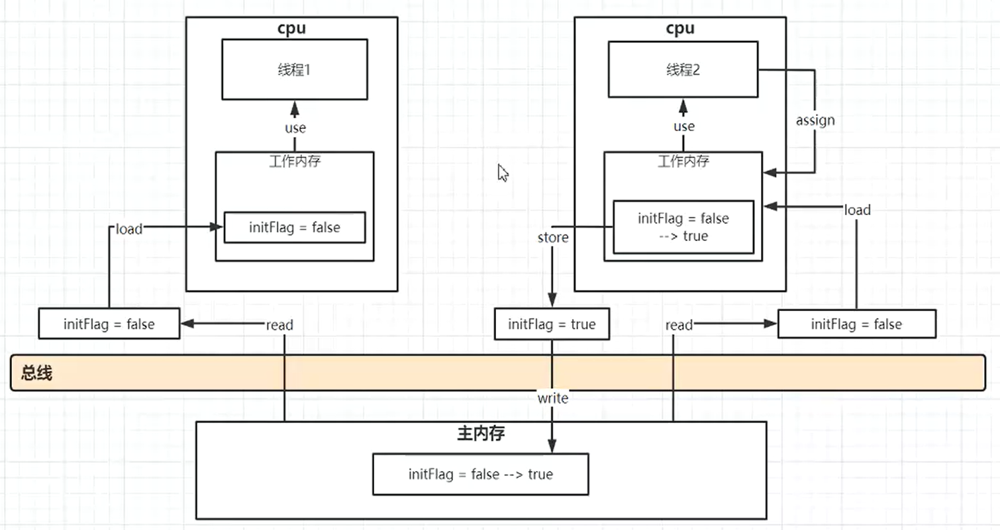

# 常见问题总结

---
## 问题总结01 ~ 集合框架

### 集合框架中用到了哪些数据结构?
| 集合框架          | 用到的数据结构                                       |
| :----------- | ------------------------------------------- |
| ArrayList/Vector  | 数组，其中Vector是线程安全的                         |
| LinkedList        | 双向链表                                                          |
| HashMap           | JDK8中HashMap底层是哈希表数据结构，数组+链表+红黑树               |
| LinkedHashMap     | 双向链表+哈希表                                                   |
| TreeMap           | 红黑树                                                            |
| ConcurrentHashMap | JDK8使用CAS和volatile实现。而JDK8以前通过锁分段技术、可重入锁实现 |

### 谈一谈ArrayList底层实现原理.
- 基于动态扩容的数组实现，出事容量为10;
- 扩容机制:
  - 以无参数构造方法创建 ArrayList 时，实际上初始化赋值的是一个空数组(JDK7之前在创建对象的时候初始化，JDK之后移动到add方法中)。当真正对数组进行添加元素操作时，才真正分配容量。即向数组中添加第一个元素时，数组容量扩为10。
  - 每次当容量达到阈值的时候，就会重新申请内存空间，重新构建一个新的对象来替换旧数组的引用，并复制旧数组元素到新数组，扩容：capacity=1.5*capacity
- 实现了随机存取
  - RandomAccess接口这个空架子的存在，是为了能够在传入参数类型为List时更好地判断集合是否ArrayList或者LinkedList，从而能够更好选择更优的遍历方式，提高性能！
- 自定义序列化方法
  - 因为arrayList的底层数组中，可能存在值为null的元素，序列化这些元素是没有意义的，因此自定义了序列化方法，只序列化数组中非null的元素

### ArrayList对象add和get方法实现原理.
- add：判断容量是否足以容纳新添加的元素，如果容量够，则直接添加，否则直接以1.5倍的容量进行扩容，然后进行添加赋值操作
- get：索引越界检查，符合条件，则从数组中获取元素返回，否则抛出越界异常

### 谈一谈Vector和ArrayList的区别.
- 安全角度
  - Vector优于ArrayList
- 效率
  - ArrayList优于Vector,因为Vector是基于Synchronized的同步方法
- 扩容步长
  - Vector扩容步长可以定制，默认为2倍，ArrayList为1.5倍,没有接口
- 自定义库容步长
  - Vector可以在初始化的时候指定扩容的步长

### 谈一谈LinkedList底层实现原理.
- 使用一个双向链表实现

### 谈一谈HashSet集合接口的实现原理
- 基于HashMap实现，key就是存入HashSet的值，Value是一个静态常量的引用

### 谈一谈HashMap实现原理.
- JDK7 数组+链表
- JDK8 数组+链表+红黑树
  - 拉链法由头插法改为了尾插法，头插法：容易导致形成闭环，死循环出不来，最主要原因是null值的丢失
  - 链表长度大于8的时候转化为红黑树
  - 红黑树：一种自平衡的二叉树，用来解决二叉树在极端情况下变为链表的情况，二导致的复杂度很高的情况

### HashMap的Hash碰撞如何解决?
- JDK7 数组+链表
- JDK8 数组+链表+红黑树

### HashMap实现中的负载因子(factor)的作用是什么?
- 控制HashMap对象扩容的阈值

### 谈一谈HashMap底层的扩容机制.

### hashCode()和equals()方法有什么联系
- 判断两个对象是否是同一个对象的默认依据

### HashTable的和HashMap区别
- 默认容量不同
  - HashTable在不指定容量的情况下的默认容量为11，而HashMap为16
- 继承的父类不同
  - Hashtable继承自Dictionary类，而HashMap继承自AbstractMap类。但二者都实现了Map接口。
- 线程安全性不同
  - Hashtable每个方法都是同步方法，二HashMap则没有
- 是否提供contains方法
  - HashMap把Hashtable的contains方法去掉了，改成containsValue和containsKey，因为contains方法容易让人引起误解。
  - Hashtable则保留了contains，containsValue和containsKey三个方法，其中contains和 containsValue 功能相同。
- key和value是否允许null值
  - 其中key和value都是对象，并且不能包含重复key，但可以包含重复的value。
  - Hashtable中，key和value都不允许出现null值。
  - HashMap中，null可以作为键，这样的键只有一个；可以有一个或多个键所对应的值为null。

### ConcurrentHashMap的数据结构

> [ConcurrentHashMap 1.8为什么要使用CAS+Synchronized取代Segment+ReentrantLock](https://www.cnblogs.com/yangfeiORfeiyang/p/9694383.html)

- 在JDK1.7版本中，ConcurrentHashMap的数据结构是由一个Segment数组和多个HashEntry组成，主要实现原理是实现了**锁分离**的思路解决了多线程的安全问题
- JDK1.8的实现已经摒弃了Segment的概念，而是直接用**Node数组+链表+红黑树**的数据结构来实现，并发控制使用Synchronized和CAS来操作，整个看起来就像是优化过且线程安全的HashMap，虽然在JDK1.8中还能看到Segment的数据结构，但是已经简化了属性，只是为了兼容旧版本.
- JDK1.8使用内置锁synchronized来代替重入锁ReentrantLock:
  - 因为粒度变小了，在相对而言的小粒度加锁方式，synchronized并不比ReentrantLock差，在大粒度加锁中ReentrantLock可能通过Condition来控制各个小粒度的边界，更加的灵活，而在小粒度中，Condition的优势就没有了
  - JVM的开发团队从来都没有放弃synchronized，而且基于JVM的synchronized优化空间更大，使用内嵌的关键字比使用API更加自然
  - 在大量的数据操作下，对于JVM的内存压力，基于API的ReentrantLock会开销更多的内存，虽然不是瓶颈，但是也是一个选择依据。

---
## 问题总结02 ~ 数据库调优

### MySQL数据库优化方案
- 索引的优化
- Sql慢查询的优化
  * 先捕获低效SQL → 慢查询优化方案 → 慢查询优化原则
- 表的优化

---
## 问题总结03 ~ 并发

### 多线程的作用是什么?
- 提高代码的执行效率
- 提高CPU资源的利用率

### 你们项目中哪些地方会使用到多线程?

- 重复性任务执行，如定时任务调度
- 流量削峰处理，把来的请求做标记处理然后放入消息队列

### 线程和进程的区别?

- 进程是操作系统资源分配的基本单位，线程是任务调度和执行的基本单位

### Java实现线程有哪些方式?

- 最核心的就两个
  - 继承Thread实现
  - 实现接口Runnable接口实现
- 一般情况下，如果要用多线程处理问题都使用线程池(ThreadPoolExecutor)的方式处理
  - 常用参数:
    - corePoolSize：核心线程数
    - maximemPoolSize:
    - keepAliveTime:
    - timeUnit:
    - BlockingQueue:

### 线程对象的start()和run()方法有哪些区别?
- start是线程启动的正确姿势，因为线程启动之前，还有部分的事情需要准备，比如把当前线程加入到线程组等，这样JVM才能正确的启动一个异步线程
- run方法如果单独调用，只能当做调用一个普通的方法来处理。run方法的本质是告诉当前线程应该做的事情，类似于策略模式


### 怎么终止线程? 如何优雅的终止线程?
- 终止线程的方式
  - stop()
  - 自然结束
- 优雅终止
  - 线程只有从 runnable 状态（可运行/运行状态） 才能进入terminated 状态（终止状态），如果线程处于 blocked、waiting、timed_waiting 状态（休眠状态），就需要通过 Thread 类的 interrupt()  方法，让线程从休眠状态进入 runnable 状态，从而结束线程。
  - 当线程进入 runnable 状态之后，通过设置一个标识位，线程在合适的时机，检查该标识位，发现符合终止条件，自动退出 run () 方法，线程终止。
  -

### 一个线程的生命周期有哪几种状态? 他们之间如何流转?


### 谈一谈线程的安全问题.
- 线程安全的问题其实就是在多线程环境下，多个线程同时对一个资源进行操作的现象
- 解决方案一般就是加锁，锁的种类非常多，我习惯分为两种
  - 软锁
    - 乐观锁
  - 硬锁
    - 非常多，见到的基本都是硬锁

### 你在项目中遇到过线程安全的问题吗?
- 遇到过，比如:

### 线程之间如何实现同步?
- 线程的同步执行，其实就是线程的串行执行,一般有以下几种方案:
  - 上锁
  - 排队:
    - Executors.singletonThreadPool
    - join

### 谈谈Java的内存模型/JMM
- JMM的本质是主内存中的同一个变量的状态在多个线程间的可见性问题
- 解决：volatile
- 代码：QLThread/psn.shreker.study.javase.thread.p01_juc.c03_volatile.Test
- JMM数字原子操作
  - read(读取):从主内存读取数据read
  - load(载入):将主内存读取到的数据写入工作内存
  - use(使用):从工作内存读取数据来计算
  - assign(赋值):将计算好的值重新赋值到工作内存中
  - store(存储):将工作内存数据写入主内存
  - write(写入):将store过去的变量值赋值给主内存中的变量
  - lock(锁定):将主内存变量加锁，标识为线程独占状态
  - unlock(解锁):将主内存变量解锁,解锁后其他线程可以锁定该变量
  
  

### 多个线程之间如何进行通信? 线程之间如何传递数据?
- 通信方式
  - wait/notify|notifyAll
  - Future

### 新建线程t1 t2 t3，如何保证按照顺序执行?
- 按照顺序执行，其实本质就是通过排队解决，即使用线程同步中排队的两种方式都可以实现

### 什么是死锁? 如何避免死锁?
- 多个线程相互持有对方想要的资源，从而导致无限制等待的现象
- 避免死锁的方式就是避免在代码中出现锁的嵌套

### 线程中wait()方法和sleep()方法有什么区别?
- wait方法在被调用的时候会释放当前的锁，供其他线程使用
- sleep方法不会释放已经拥有的锁

### 什么是守护线程? 有什么用?
- 守护线程是一类特殊的线程，通常用作一些维护性的工作，当主线程结束的时候，守护线程也会结束
- 必须JVM的GC线程就是一类守护线程

### 谈谈ThreadLocal的作用,原理。它的内存泄漏是怎么产生的?
- ThreadLocal一般用于同一个线程在不同区域的数据传输问题
- 其实ThreadLocal的原理和其环境是挂钩的，一般用户web请求的处理，而一个 请求一般只有一个线程进行处理，而这个ThreadLocal就是为这一次请求进行数据传递的，比如：请求的用户信息，事务信息等等
- 内存泄漏产生的原因:
  - 每次调用set方法的时候,把这个threadLocal为key，线程要共享的变量作为value存入Thread的一个Map
  - 而这个 key是以弱引用的方式指向这个key的
  - 如果这个当前线程不回收，那么就会导致map不会回收，遇到一次GC，key就会被回收，那么其中的value成了没人管的孩子
  - 如果当前线程回收，那么相应的Map就会被回收，Map中所有的引用就会全部置为空，不会出现什么问题
- 所以，如果你的ThreadLocal用作请求响应中参数传递，可以不去remove，因为一次请求响应的时间很短，对象很快会被回收，如果用作全局参数共享，比如，在main线程共享数据，用完必须释放
- 反过来说，其实没有人会在main线程中使用ThreadLocal共享变量，所以我质疑网上各种说内存泄漏问题的帖子

### volatile和synchronized的区别是什么?
- volatile是拥抱保证资源的可见性的，并不能保证资源的原子性，可以禁止指令重排
- synchronized是用来保证一段代码在各个线程之间同步执行的，即各个线程之间保持串行执行，自然也就保证了资源的可见性

### 什么是重排序? 对程序的执行有什么影响?
- 指令重排：计算机为了执行的效率问题，把一些没有依赖关系代码打散执行，有可能出现代码中下面的代码先执行的情况，注意的是这里的代码是机器码，或者汇编码
- 单线程情况下没有问题，但是在多线程执行的情况下可能就会出现问题：打破程序的原子性

### 怎么保证线程的可见性?
- 其实是保证资源状态更新的可见性，这个资源一般指对象的共享成员的变量
- 使用volatile就可以保证
- 也可以使用锁的方式保证

### 谈谈对并发队列的理解.
- 并发队列：线程安全的队列
- JDK并发队列，java.util.concurrent
  - ConcurrentLinkedQueue
  - BlockingQueue
- ConcurrentLinkedQueue是一个适用于高并发场景下的队列，通过无锁的方式，实现
  了高并发状态下的高性能，通常ConcurrentLinkedQueue性能好于BlockingQueue.它是一个基于链表的无界线程安全队列。该队列的元素遵循先进先出的原则。头是最先
  加入的，尾是最近加入的，该队列不允许null元素。使用CAS实现锁机制;
- BlockingQueue：是一个支持两个附加操作的队列。这两个附加的操作是：在队列为空时，获取元素的线程会等待队列变为非空。当队列满时，存储元素的线程会等待队列可用。在Java中，BlockingQueue的接口位于java.util.concurrent 包中(在Java5版本开始提供)，由上面介绍的阻塞队列的特性可知，阻塞队列是线程安全的。
  - ArrayBlockingQueue：有边界的阻塞队列，它的内部实现是一个数组。有边界的意思是它的容量是有限的，我们必须在其初始化的时候指定它的容量大小，容量大小一旦指定就不可改变。
  - LinkedBlockingQueue：LinkedBlockingQueue阻塞队列大小的配置是可选的，如果我们初始化时指定一个大小，它就是有边界的，如果不指定，它就是无边界的。说是无边界，其实是采用了默认大小为Integer.MAX_VALUE的容量 。使用ReentrantLock实现锁机制;
  - PriorityBlockingQueue：有界，快满时自动扩容，看似无界，允许插入null对象，插入的对象必须实现 java.lang.Comparable接口
  - SynchronousQueue

### 有界队列和无界队列的区别有哪些?
- 区别在于有界队列可以看做容量不限，但是有界队列一般都有明确的容量限制，主要是看底层实现的数据结构
- 其他的却别就是实现的数据结构的区别了

### 谈谈阻塞队列和非阻塞队列的区别.
- 阻塞队列
  - 当队列是空的时，从队列中获取元素的操作将会被阻塞
  - 当队列是满时，往队列里添加元素的操作会被阻塞
- 非阻塞队
  - 当队列空的时候获取数据，直接返回空
  - 当队列满了的时候，直接添加失败

### 你了解过哪些并发包? 哪些并发框架?
-  提供了比 synchronized 更加**高级的各种同步结构**，包括 CountDownLatch、CyclicBarrier、Semaphore 等，可以实现更加丰富的多线程操作，比如利用 Semaphore 作为资源控制器，限制同时进行工作的线程数量。
- 各种线程**安全的容器**，比如最常见的 ConcurrentHashMap、有序的  ConcunrrentSkipListMap，或者通过类似快照机制，实现线程安全的动态数组 CopyOnWriteArrayList 等。
- 各种**并发队列**实现，如各种 BlockedQueue 实现，比较典型的 ArrayBlockingQueue、 SynchorousQueue  或针对特定场景的 PriorityBlockingQueue 等。
- 强大的 **Executor** 框架，可以创建各种不同类型的线程池，调度任务运行等，绝大部分情况下，不再需要自己从头实现线程池和任务调度器。

### 线程池有哪些分类?
- Java并发包中通过ThreadPoolExecutor实现了四中线程池，如下
  - **newCachedThreadPool**创建一个可缓存线程池，如果线程池长度超过处理需要，可灵活回收空闲线程，若无可回收，则新建线程。
  - **newFixedThreadPool** 创建一个定长线程池，可控制线程最大并发数，超出的线程会在队列中等待。
  - **newScheduledThreadPool** 创建一个定长线程池，支持定时及周期性任务
  - **newSingleThreadExecutor** 创建一个单线程化的线程池，它只会用唯一的工作线程来执行任务，保证所有任务按照指定顺序(FIFO，LIFO，优先级)执行。

### 谈一谈线程池的实现原理.
- 如果当前线程池中的线程数目< corePoolSize，则每来一个任务，就会创建一个线程去执行这个任务；
- 如果当前线程池中的线程数目 >= corePoolSize，则每来一个任务，会尝试将其添加到任务缓存队列当中:
  - 若添加成功，则该任务会等待空闲线程将其取出去执行；
  - 若添加失败（一般来说是任务缓存队列已满），则会尝试创建新的线程去执行这个任务；
- 如果队列已经满了添加失败的前提下，则在总线程数不大于maximumPoolSize的前提下，则创建新的线程
- 如果当前线程池中的线程数目达到maximumPoolSize，则会采取任务拒绝策略进行处理；
- 如果线程池中的线程数量大于 corePoolSize时，如果某线程空闲时间超过keepAliveTime，线程将被终止，直至线程池中的线程数目不大于corePoolSize；
- 如果允许为核心池中的线程设置存活时间，那么核心池中的线程空闲时间超过keepAliveTime，线程也会被终止。

### 线程池配置多少最合适?
- **CPU密集型**时，任务可以少配置线程数，大概和机器的cpu核数相当，这样可以使得每个线程都在执行任务
- **IO密集型**时，大部分线程都阻塞，故需要多配置线程数，2*cpu核数

### 线程池对象的submit方法和execute方法有什么区别?
- execute是Executor接口的接口方法，submit是Executors的方法
- execute一般用来执行没有返回结果的任务
- submit一般用于有返回值的任务

### 提交任务的时候线程池队列已满会发生什么?
- 两种
  - 无界队列：程序崩溃
  - 有界队列，分为两种情况:
    - 如果maximumPoolsize没有达到，则新建线程执行
    - 如果maximumPoolSize已经达到了，则任务会被拒绝

### 什么是活锁,饥饿,无锁,死锁?
- **活锁**指的是任务或者执行者没有被阻塞，由于某些条件没有满足，导致一直重复尝试—失败—尝试—失败的过程。
- **饥饿**指的是优于优先级的问题导致某个线程先进入队列，却一直没有被执行的情况
- **无锁**指的是使用CAS机制实现锁的效果，期效率会更高，但是会造成等待线程的自旋
- **死锁**多个线程相互持有对方想要的资源，从而导致无限制等待的现象

### 说几个常用的Lock接口实现锁.
- ReentrantLock：除了实现锁的功能外，还可以实现公平锁机制。
  - 实现原理：AQS，内部维护了一个state变量，类似于Semaphore(信号量唯一的时候)
  - 如其名，是一把可重入的锁，即同一把锁，在嵌套中可重复进入
- WriteLock
- ReadLock

### Lock和synchronized的区别是什么?
- Lock不是Java语言内置的，synchronized是Java语言的关键字，因此是内置特性。
- 采用synchronized不需要用户去手动释放锁；而Lock则必须要用户去手动释放锁。

### CyclicBarrier和CountDownLatch的区别有哪些?
- CountDownLatch主要是实现了1个或N个线程需要等待其他线程完成某项操作之后才能继续往下执行操作，描述的是1个线程或N个线程等待其他线程的关系。一次性的，用完对象不能复用;
- CyclicBarrier主要是实现了多个线程之间相互等待，直到所有的线程都满足了条件之后各自才能继续执行后续的操作，描述的多个线程内部相互等待的关系。可以被重置而重复使用;

### ThreadPoolExecutor有哪些参数?
- **corePoolSize**： 核心池的大小。 当有任务来之后，就会创建一个线程去执行任务，当线程池中的线程数目达到corePoolSize后，就会把到达的任务放到缓存队列当中
- **maximumPoolSize**： 线程池最大线程数，它表示在线程池中最多能创建多少个线程；
- **keepAliveTime**： 表示线程没有任务执行时最多保持多久时间会终止。
- **unit**： 参数keepAliveTime的时间单位，有7种取值，在TimeUnit类中有7种静态属性
- **workQueue**：并发队列

### Fork/Join框架是干什么的?
- 用来分个任务为更小的单元，更有效率的完成任务，压榨CPU的性能
- 分解任务 + 合并结果
- 任务类必须继承自RecursiveTask/RecursiveAction
- java.util.Arrays.parallelSort(array)就是使用的Fork/Join来完成排序的

### 你用过哪些原子类?
- **AtomicBoolean**
- **AtomicInteger**
- AtomicIntegerArray
- AtomicIntegerFieldUpdater
- **AtomicLong**
- AtomicLongArray
- AtomicLongFieldUpdater
- AtomicMarkableReference
- **AtomicReference**
- AtomicReferenceArray
- AtomicReferenceFieldUpdater
- **AtomicStampedReference**

### 谈谈原子类的实现原理.
- CAS实现

### 怎么检测一个线程是否拥有锁?
- java.lang.Thread中有一个方法叫holdsLock(obj)，当且仅当当前线程拥有某个具体对象的锁返回true

### 什么是CAS算法?在多线程中有哪些应用?
- 乐观锁的一种实现，并发包中所有的Atomic开头的类

### 什么是CAS无锁机制?
- CompareAndSwap

### 什么是自旋锁?
- 不断循环，且检查对象状态

### 自旋锁和互斥锁的区别?
- 自旋锁是乐观锁，互斥锁是悲观锁
- 线程在申请自旋锁的时候，线程不会被挂起，而是处于**忙等**的状态
- 自旋锁是一种互斥锁的实现方式而已，相比一般的互斥锁会在等待期间放弃cpu执行权，自旋锁（spinlock）则是不断循环并测试锁的状态，这样就一直占着cpu。

### 什么是future模式?

### Callable和Thread有有什么区别?
- Callable的任务一般是有执行返回值的任务，而Thread一般不会有返回值，执行完毕后线程结束

### 如何检测死锁?[(参见这里)](<https://my.oschina.net/JackieRiver/blog/1789476>)
- jstack
- jconsole
- jvisualvm

### 谈一谈Lock底层的原理.
- ReentrantLock的实现是一种**自旋锁**，通过循环调用CAS操作来实现加锁。它的性能比较好也是因为**避免了使线程进入内核态的阻塞状态。**想尽办法避免线程进入内核的阻塞状态是我们去分析和理解锁设计的关键钥匙。
- lock的存储结构：一个int类型状态值（用于锁的状态变更），一个双向链表（用于存储等待中的线程）
- lock获取锁的过程：本质上是通过CAS来获取状态值修改，如果当场没获取到，会将该线程放在线程等待链表中。
- lock释放锁的过程：修改状态值，调整等待链表。
- lock大量使用CAS+自旋。因此根据CAS特性，lock建议使用在低锁冲突的情况下。目前java1.6以后，官方对synchronized做了大量的锁优化（偏向锁、自旋、轻量级锁）。因此在非必要的情况下，建议使用synchronized做同步操作。

### 什么是AQS，AQS的应用场景有哪些?
- AbstractQueueSynchronized的缩写，也叫抽象的队列式同步器。定义了一套多线程访问共享资源的同步器框架。字如其名，他是一个抽象类，所以大部分同步类都是继承于它，然后重写部分方法即可。比如说ReentrantLock/Semaphore/CountDownLatch都是AQS的具体实现类。
- AQS维护了一个共享资源State和一个FIFO的等待队列，当有多个线程争抢资源的时候就会阻塞进入此队列。线程在争抢State这个共享资源的时候，会被封装成一个Node节点，也就是说在AQS的等待队列里面的元素都是Node类型的对象。
- AQS定义了两种访问资源的方式
  - **独占模式** ，也就是说只有一个线程可以访问资源，如ReentranctLock; ***tryAcquire***(int),尝试获取资源，获取成功的话返回true,否则false。***tryRealease***(int),尝试释放资源，释放成功的话返回true,否则false
  - **共享模式**，表示可以有多个线程访问资源，如Semaphore/CountDownLatch; ***tryAcquireShared***(int),尝试获取资源。负数表示失败；0表示成功，但没有剩余可用资源；正数表示成功，且有剩余资源。
    ***tryReleaseShared***(int),尝试释放资源，如果释放后允许唤醒后续等待结点返回true，否则返回false。

### Synchronized底层实现原理是什么?
- Synchronized持有的锁对象指针指向了一个由C++实现的类monitor
- 跟进一步，在汇编层面,
  - synchronized代码块指令由monitorenter和monitorexit实现
  - synchronized方法ACC_SYNCHRONIZED标识告诉JVM同步指令的
- synchronized 在JDK5之后进行了各方面的改造
  - 第一次访问的时候，只是在对象头的MarkWord中记录当前线程的id，这个时候的锁称为偏向锁
  - 当临界区出现多个线程争相访问的时候，这个锁升级为 自旋锁(执行时间比较短，线程数量不是甚多可以用自旋锁)
  - 自旋10次还没有拿到，这把锁才升级为重量级锁(执行时间比较长，线程数比较多，建议使用synchronized)，即向OS申请锁

---
## 问题总结04 ~ Spring

### 谈一谈什么是Spring?

### 为什么要用Spring?

### 什么是Spring的IoC容器，实现原理?

### 什么是Spring的AOP技术? 并谈一谈AOP的底层实现原理.

### AOP的应用场景有哪些?

### 动态代理和静态代理的区别是什么?

### CGLib这个框架是用来做什么的?实现AOP技术依赖了哪些框架?

### Spring中常用的注解都有哪些?

### Spring中的单例Bean是线程安全的吗? 为什么?

### Spring事务的分类? 传播行为? 实现原理?

### 使用Spring事务的注意事项有哪些?

### BeanFactory和FactoryBean有哪些区别?

### Spring的生命周期? Spring的作用域?

### SpringMVC执行流程.

### MyBatis接口与SQL语句绑定原理.

---
## 问题总结05 ~ SpringBoot

### 什么是SpringBoot? 为什么大家都用SpringBoot?

### 谈一谈SpringBoot的启动方式.

### 谈一谈SpringBoot和SpringMVC的区别.

### 谈一谈SpringBoot和SpringCloud区别.

### SpringBoot中用哪些注解?

### 谈一谈注解@EnableAutoConfiguration作用.

### 谈一谈@SpringBootApplication的原理.

### SpringBoot热部署使用什么? 其热部署是什么原理?

### 热部署和热加载有什么别?

### 项目中如何处理异常的?

### SpringBoot如何实现一步执行?

### SpringBoot多数据源的拆分思路.

### SpringBoot多数据源事务如何管理?

### SpringBoot如何实现打包

### SpringBoot性能如何优化?

### SpringBoot2有哪些新特性?

### SpringBoot执行流程

### SpringBoot底层实现原理

### SpringBoot装配Bean的原理.

### 什么是SpringSecurity
- Spring Security是一个能够为基于Spring的企业应用系统提供声明式的安全访问控制解决方案的安全框架。
- 它提供了一组可以在Spring应用上下文中配置的Bean，充分利用了Spring IoC，DI和AOP功能，为应用系统提供声明式的安全访问控制功能，减少了为企业系统安全控制编写大量重复代码的工作。
- 参考百度百科：https://baike.baidu.com/item/spring%20security/8831652?fr=aladdin
- SpringSecurity官网:https://spring.io/projects/spring-security
- 两种认证模式：formLogin/HtppBasic

### Security应用场景
- 后台角色权限框架
- 授权认证oauth2.0
- 安全防护（防止跨站点请求）
- Session攻击

### 什么是RBAC权限模型
- 基于角色的权限访问控制（Role-Based Access Control）
- 在RBAC中，权限与角色相关联，用户通过成为适当角色的成员而得到这些角色的权限。这就极大地简化了权限的管理。在一个组织中，角色是为了完成各种工作而创造，用户则依据它的责任和资格来被指派相应的角色，用户可以很容易地从一个角色被指派到另一个角色。角色可依新的需求和系统的合并而赋予新的权限，而权限也可根据需要而从某角色中回收。角色与角色的关系可以建立起来以囊括更广泛的客观情况。
- 其基本思想是，对系统操作的各种权限不是直接授予具体的用户，而是在用户集合与权限集合之间建立一个角色集合。每一种角色对应一组相应的权限。一旦用户被分配了适当的角色后，该用户就拥有此角色的所有操作权限。这样做的好处是，不必在每次创建用户时都进行分配权限的操作，只要分配用户相应的角色即可，而且角色的权限变更比用户的权限变更要少得多，这样将简化用户的权限管理，减少系统的开销。

---
## 问题总结06 ~ 高并发高可用

### 什么是DNS?

### 你用过哪些外网映射(内网穿透)工具?

### 谈一谈Nginx的作用和应用场景.

### 什么是反向代理? 反向代理的作用是什么?

### Nginx如何配置反向代理?

### 说说Nginx的常用配置.

### 画图说明反向代理的流程.

### 谈一谈KeepAlive.

### 谈一谈LVS.

### LVS与KeepAlive的区别.

### 如何实现双机主从热备?

### 试着画一下LVS+KeepAlive+Nginx的架构流程图.

### 项目发布如何不影响到正常用户访问，从而实现7×24小时不间断访问.

### 项目如果发生了故障宕机，应如何处理.

### 动态网站和静态网站的区别有哪些?

### 动态页面静态化的作用是什么?

### 什么是动静分离架构模式?

### 如何搭建动静分离?

### 动静分离和前后分离的区别有哪些?

### 如何控制浏览器静态资源缓存?

### HTTP状态吗304的作用?

### 在微服务中,应该如何保护服务?

### 谈一谈你对Hystrix的理解.

### Hystrix对系统保护的原理是什么?
- 通过对服务的降级,熔断和隔离的方式实现的.

### 服务隔离、降级、熔断、限流分别表达什么意思?
- **降级**：在高并发场景下，防止用户一直等待，直接返回给用户一个友好的提示(调用fallBack)，这样的操作就是服务降级
- **熔断**：高并发场景下，为了保护服务，如果请求的并发数量达到一定的数量，就直接拒绝服务的访问，这样的操作称为服务的熔断，结合降级一起使用
- **隔离**：高并发的场景下，为了避免某一个接口被大量触发，造成其他服务延时等待(不可用)，我们就使用一些技术把这些接口隔离开，使之互不影响，实现方式：①线程池，②信号量，具体参见**服务隔离有几种实现方式**
- **限流**：高并发环境下，为了保护服务，请求的数量要严格限制，这一操作称为服务限流
- 解决前三个问题 Hystrix 就可以很好的得到解决，只需要在需要保护的接口上添加注解@HystrixCommand即可，添加以后SpringCloud就为该接口开起来降级/隔离/熔断/限流的功能，阈值需要自己配置
- 解决限流问题，主要通过**滑动窗口计数器**/**令牌桶**/**漏桶**，具体参见**高并发服务限流有哪些算法**

### 服务隔离有几种实现方式?
- 实现方式有两种:
  * 线程池
  * 信号量
- 缺点：常用的就是线程池的方式，因为要创建很多的线程池，所以内存的开销很大

### 服务隔离的线程池实现方式的原理是什么?

### Hystrix可以单独集成在项目中吗?

### Hystrix实现服务的降级有哪些方式?
- 使用方法的方式：为每个降级熔断的服务接口单独编写一个方法，填写在注解(@HystrixCommand)的fallbackMethod参数上
  * 缺点：降级熔断的这个服务中的所有代码一起在子线程中执行，而不是只有远程调用在单独的子线程中执行
- 使用类的方式：为一类接口(一般是一个Service类)创建一个Fallback类，这个类实现这个接口的Feign接口，并实现其中的方法，方法的实现即返回给用户一些友好的提示代码，并把这个类配置到注解@FeignClient的fallback参数上即可
  * 优点：服务中只有远程调用的部分会自动开启单独开启线程执行，并为这个线程启动降级/熔断/隔离

### 高并发服务限流有哪些算法?
- 滑动窗口计数器：一个窗口内的请求数量达到上限后就不能响应请求，调用降级方法
- 令牌桶(RateLimiter+SpringBoot)：令牌桶会被以固定的速率添加令牌，只要请求能获得令牌就可以响应,否则调用降级方法
- 漏桶：漏桶自己以固定的速率流出令牌,以任意的速度添加令牌,当请求来的时候也向漏桶中添加令牌,如果能添加进去(漏桶未满)则可以响应,否则调用降级方法
- 应用层限流(Nginx.http_limit)
- 分布式限流

### 传统计数器限流有哪些弊端?

---
## 问题总结07 ~ 互联网安全

### HTTPS的安全问题是怎么解决的?
- 通过SSL认证实现的,具体过程如下:
  * 客户端想服务器发起Https请求
  * 服务端返回公钥和Https证书给客户端
  * 客户端(浏览器)判断证书是否有效
    - 如果无效,提示用户网站不安全,让用户决定是否继续访问
    - 如果有效,则随机生成对称加密的密钥
  * 客户端使用服务器端返回的公钥加密随机生成的密钥,并发送给服务器端
  * 服务器端使用公钥对应的私钥解密客户端传过来的对称加密的秘钥，然后使用该密钥加密数据返回给客户端
  * 客户端接收到数据后使用密钥解密数据
    - 如果解密失败重新发起请求
    - 如果成功则使用该密钥进行数据对称加密传输
  * 说明：认证的过程就是**SSL**(Secure Socket Layer)的过程

### 为什么要用Https请求?
- 因为Https传输更加安全,即使Https的传输效率比较低
- 内网穿透自带Https

### Http 和Https区别
- 端口不同,http默认80,https默认443
- https加密传输,http明文传输
- 传输效率不同,http更快,https则比较慢,因为每次都要进行SSL验证

### 跨域问题有哪些解决方案?
- 使用JsonP解决
  * 不推荐，只能解决GET跨域，不能解决处理POST
- 使用HttpClient进行转发
  * 不推荐，效率比较低，发送两次请求
- 设置响应头允许推荐
  * 可以，适合于小公司快速解决问题
  *
- 使用Nginx搭建API接口网关
  * 推荐。因为保证域名和端口都一致，反向代理到真实的项目
- 使用Zuul微服务搭建API接口网关
  * 推荐.

---
## 问题总结08 ~ 分布式

### 为什么要使用缓存？
- 提高程序的响应速度
- 减少不必要的网络开销
- 减少数据库的访问压力

### RMI和RPC的区别
- 二者的理念是相同的,都是为了实现服务之间的通信
- RMI是实现JVM与JVM通信的,不能跨平台
- RPC是基于Http的Socket实现远程调用的,可跨平台

### 谈谈你了解的Redis.
- Redis(**Re**mote **di**ctionary **s**erver)一个非关系型的,以Key-Value进行数据存储的内存高速缓存数据库.
- 它支持丰富的数据类型，如：string、list、set、zset(sorted set)、hash.
- 可设置过期时间.
- 采用的是基于内存的采用的是单进程单线程模型的KV数据库.

### Redis的应用场景有哪些?
- 令牌生成(临时有效期)
- 短信验证码(临时有效期)
- 热点数据(使用Redis减轻数据库的查询压力)
- 实现消息中间件(发布订阅)，但不推荐
- 分布式锁(ZK或者Redis实现)
- 网站计数器(单线程)

### Redis如何解决雪崩问题?
- 当缓存挂掉的时候或者缓存在某一时刻集中失效,所有的数据查询就会全部打到数据库上，把这种现象称为缓存雪崩.
- 对某一时刻缓存集中失效，比较好解决，只要在过期时间傻瓜加上一个随机值即可;
- 对**缓存挂掉**，1-尽量保证Redis别挂掉(高可用入手,中间件限流入手)，2-添加本地缓存:
  * 事发前：实现Redis的高可用(主从架构+Sentinel或者Redis Cluster)，尽量避免Redis挂掉这种情况发生.
  * 事发中：万一Redis真的挂了，我们可以设置**本地缓存**(ehcache)+**限流**(hystrix)，尽量避免我们的数据库被干掉(起码能保证我们的服务还是能正常工作的)
  * 事发后：Redis持久化，重启后自动从磁盘上加载数据，快速恢复缓存数据.
 6. 缓存穿透和缓存雪崩有什么区别
- 缓存雪崩：当缓存挂掉的时候或者缓存在某一时刻集中失效,所有的数据查询就会全部打到数据库上
  * 锁(分布式锁/本地锁)
  * 消息队列解决
  * Redis失效时间加随机值
- 缓存穿透：请求的数据在缓存中命中率非常低，导致大部分请求走数据库，大量的查出null，导致MySQL连接占用
  * Redis存入null

### Redis集群方案有哪些?
- **客户端分片技术**：有客户端通过算法得出数据存放在哪个Redis主机，连接集群的时候是同一个地址，通过反向代理的方式转发到具体的Redis上，从而实现Redis集群
  - 缺点：没有自动故障转移的功能; 扩容/缩容时，必须手动调整分片程序
- **主从复制技术**：可以通过主从复制的技术实现集群
- 缺点：数据冗余，相当于每个节点都要存放相同的数据，大量浪费内存
- 使用代理工具
-  **RedisCluster技术**：Redis强烈推荐，在3.0版本加入

### Redis Cluster 和 Replication + Sentinal的应用场景
- 如果你的数据量很少，主要是承载高并发高性能的场景，比如你的缓存一般就几个G，单机足够了
- replication，一个mater，多个slave，要几个slave跟你的要求的读吞吐量有关系，然后自己搭建一个sentinal集群，去保证redis主从架构的高可用性，就可以了
- redis cluster，主要是针对海量数据+高并发+高可用的场景，海量数据，如果你的数据量很大，那么建议就用redis cluster

### 谈谈Redis的持久化机制.
- RBD
- AOF

### 谈谈Redis的哨兵高可用机制.
-  参考`谈谈Redis的哨兵机制`

### 外网安装Redis注意事项
- 默认不支持外网访问
- 修改为后台进程启

### 什么是Redis的主从复制?
- 一般在生产上我们把Redis服务器分为主服务和从服务主服务允许读写操作,从服务主要做读操作
- 主从复制,即Redis的主服务节点和从服务节点之间的数据同步,具体步骤如下:
- 当一个从数据库启动时，会向主数据库发送sync命令
- 数据库接收到sync命令后会开始在后台保存快照（执行rdb操作），并将保存期间接收到的命令缓存起来，快照文件和所有缓存的命令发送给从数据库.
- 数据库收到后，会载入快照文件并执行收到的缓存的命令.
- 主从复制的应用场景
- 集群数据同步
- 读写分离
- 日志备份
- 高可用

### 如何配置主从复制?
- Redis中主服务节点只允许有一个，但是从服务节点可以有多个
- 配置主从复制：在每个节点的配置文件中配置如下信息
 ```
 slaveof <master-ip> <port>
 masterauth <master-password>
 ```

### 谈谈Redis的哨兵机制
- Redis中主服务节点只允许有一个，但是从服务节点可以有多个Redis的哨兵(sentinel) 系统用于管理多个 Redis 服务器,该系统执行以下三个任务:
  * 监控(Monitoring)：哨兵会不断地发送心跳包检查你的Master和Slave是否运作正常.
  * 提醒(Notification):当被监控的某个 Redis出现问题时，哨兵可以通过 API 向管理员或者其他应用程序发送通知.
  * 自动故障迁移(Automatic failover):当一个Master不能正常工作时，哨兵(sentinel) 会开始一次自动故障迁移操作,它会将失效Master的其中一个Slave升级为新的Master，并让失效Master的其他Slave改为复制新的Master; 当客户端试图连接失效的Master时,集群也会向客户端返回新Master的地址,使得集群可以使用Master代替失效Master.
    - 哨兵(sentinel) 是一个分布式系统,你可以在一个架构中运行多个哨兵(sentinel) 进程,这些进程使用流言协议(gossipprotocols)来接收关于Master是否下线的信息,并使用投票协议(agreement protocols)来决定是否执行自动故障迁移,以及选择哪个Slave作为新的Master.
    - 每个哨兵(sentinel) 会向其它哨兵(sentinel)、master、slave定时发送消息,以确认对方是否”活”着,如果发现对方在指定时间(可配置)内未回应,则暂时认为对方已挂(所谓的”主观认为宕机” Subjective Down,简称**sdown**)。若“哨兵群”中的多数sentinel,都报告某一master没响应,系统才认为该master"彻底死亡"(即:客观上的真正down机,Objective Down,简称**odown**),通过一定的vote算法,从剩下的slave节点中,选一台提升为master,然后自动修改相关配置.
    - 虽然哨兵(sentinel) 释出为一个单独的可执行文件 redis-sentinel ,但实际上它只是一个运行在特殊模式下的 Redis 服务器，你可以在启动一个普通 Redis 服务器时通过给定 --sentinel 选项来启动哨兵(sentinel).
    - 哨兵(sentinel) 的一些设计思路和zookeeper非常类似

### Redis的持久化机制
- Redis的持久化分为两种模式
- AOF：**A**ppend-**o**nly **f**ile，将“操作 + 数据”以格式化指令的方式追加到操作日志文件的尾部，在 append 操作返回后(已经写入到文件或者即将写入)，才进行实际的数据变更，“日志文件”保存了历史所有的操作过程；我们可以简单的认为 AOF 就是日志文件，此文件只会记录“变更操作”(例如：set/del 等)，如果 server 中持续的大量变更操作，将会导致 AOF 文件非常的庞大，意味着 server 失效后，数据恢复的过程将会很长；事实上，一条数据经过多次变更，将会产生多条 AOF 记录，其实只要保存当前的状态，历史的操作记录是可以抛弃的；因为 AOF 持久化模式还伴生了“AOF rewrite”.
  * 开启方法，修改配置文件 reds.conf：appendonly yes
- RDB：该模式默认开启。RDB 是以二进制文件，是在某个时间点将数据写入一个临时文件，持久化结束后，用这个临时文件替换上次持久化的文件，达到数据恢复。这里说的这个执行数据写入到临时文件的时间点是可以通过配置来自己确定的。通过配置redis(save行) 在 n 秒内如果超过 m 个 key 被修改就执行一次 RDB 操作。这个操作就类似于在这个时间点来保存一次 Redis 的所有数据，一次快照数据。所有这个持久化方法也通常叫做快照(snapshots).
  * 优点：使用单独**子进程**来进行持久化，主进程不会进行任何 IO 操作，保证了 redis 的高性能
  * 缺点：RDB 是间隔一段时间进行持久化，如果持久化期间 redis 发生故障，会发生数据丢失。所以这种方式更适合数据要求不严谨的时候

### 谈一谈Redis中的事务.
- Redis 事务可以一次执行多个命令，并且带有以下两个重要的保证：**事务是一个单独的隔离操作**; **事务是一个原子操作**
- Redis中的事务操作
  * 开启事务：multi;
  * 提交事务：exec;
  * 回滚事务：discard;
- 注意的是，redis集群对象JedisCluster不支持事务，但是集群里边的每个节点支持事务.

### 为什么使用二级缓存
- 如果只用一种缓存，要么会有较大的网络消耗（如Redis），要么就是内存占用太大（如Caffeine这种应用内存缓存）。在很多场景下，可以结合起来实现一、二级缓存的方式，能够很大程度提高应用的处理效率.
- 一般情况下一级缓存的过期时间要小于二级缓存的过期时间.

### SpringBoot + SpringCache：RedisCache实现中有什么问题? 如何实现二级缓存?

### 什么是JMS?
- JMS是java的消息服务，即 Java Message Service，是一个平台面向消息中间件的API
  * 提供者：实现JMS规范的消息中间件服务器 (存放消息容器)
  * 客户端：发送或接收消息的应用程序
  * 生产者/发布者:
  * 消费者/订阅者：订阅者一方基于长连接
  * 消息模式：客户端之间传递消息的方式，JMS中定义了主题和队列两种模式

### 为什么要使用MQ？
- 在网络通讯中，Http请默认采用同步请求方式，基于请求响应模式
- 在客户端与服务器进行通讯时.客户端调用后，必须等待服务对象完成处理返回结果才能继续执行.
- 如果服务器端发生网络延迟/不可达的情况，客户端就会收到影响
- 因为项目在开发的过程中遇到各种问题，同步调用接口造成高延时; 各个部门之间频繁的添加修改删除接口调用;等问题
- MQ天然解决了网络补偿机制/重试机制，只需要考虑请求的幂等性问题
- MQ：应用解耦/异步消息/流量削峰

### MQ有什么缺点？
- **系统可用性降低**：系统引入的外部依赖越多，越容易挂掉，本来你就是A系统调用BCD三个系统的接口就好了，人ABCD四个系统好好的，没啥问题，你偏加个MQ进来，万一MQ挂了咋整？MQ挂了，整套系统崩溃了，你不就完了么.
- **系统复杂性提高**：硬生生加个MQ进来，你怎么保证消息没有重复消费？怎么处理消息丢失的情况？怎么保证消息传递的顺序性？头大头大，问题一大堆，痛苦不已
- **一致性问题**：A系统处理完了直接返回成功了，人都以为你这个请求就成功了；但是问题是，要是BCD三个系统那里，BD两个系统写库成功了，结果C系统写库失败了，咋整？你这数据就不一致了.

### MQ一般都用在那些场景中
- 消息队列常见的比较核心的使用场景有 3 个优点：**解耦、异步、削峰**

### 各种消息队列的优缺点
- **ActiveMQ**:
  * 优点：非常成熟，高可用，遵循JMS规范
  * 缺点：偶尔会有较低概率丢失消息，官方社区现在对ActiveMQ 5.x维护越来越少
  * 建议：吞吐量只适合中小型项目
- **RabbitMQ**:
  * 优点：继承ErLang天生的并发性
  * 缺点：erlang语言开发不支持动态扩展，吞吐量稍微低一些
  * 建议：技术实力一般中小型公司
  * 其他:
- **RocketMQ**:
  * 优点：单机吞吐量上十万，分布式架构扩展也很方便，消息配置可零丢失，大规模数据应用
  * 缺点：黄了就要靠自己了
  * 建议：技术实力比较强的公司
- **Kafka**:
  * 优点：吞吐量相当高，任意扩展，分布式
  * 缺点：功能简陋，主要用于大数据，消息重复消费
  * 建议：大数据处理

### ActiveMQ持久化机制.
- 默认情况下，数据不会持久化消息到硬盘(配置可以在代码,也可以在配置文件中进行处理)
-

### ActiveMQ JMS可靠消息机制.
- JMS中默认是自动签收消息
  * 消费者在获取到消息之后,不管消费者对消息的处理是否成功，都默认为已经消费成功.
- 可以开启手动签收的模式
  * 消费者消费后需要通知中间件已经消费成功。没有通知默认是没有消费成功的.
- 还可以以事务的方式签收
  * session的commit方法调用以后就签收消息了

### 如何保证消息队列的高可用?
- RabbitMQ
  * 单机模式,
  * 普通集群模式：集群中只有一个节点上有队列,即数据,每个节点都有这个队列的元数据，当节点接收到请求的时候都会去队列的那台机器拉取数据并返回
       - 集群内部产生大量数据传输
       - 没有高可用，只要存储数据的节点挂掉，系统就瘫痪了
       - 这方案主要是提高吞吐量的，就是说让集群中多个节点来服务某个queue的读写操作。没有什么所谓的高可用性可言
  * 镜像集群模式：创建的Queue在所有的节点上都有，各个节点的数据会进行镜像同步
       - 非分布式，无法线性扩展你的queue
       - 性能和网络开销太大
       - 高可用的话，当一个节点宕机，其他节点还有
- Kafka
  * Kafka基本架构认识：多个broker组成，每个broker是一个节点；你创建一个topic，这个topic可以划分为多个partition，每个partition可以存在于不同的broker上，每个partition就放一部分数据。这就是天然的分布式消息队列，就是说一个topic的数据，是分散放在多个机器上的，每个机器就放一部分数据.
  * Kafka在0.8之前没有高可用而言，即某个Broker宕机，那么数据就无法读写了
  * Kafka在0.8之后添加了HA机制，即Replication副本机制。即之前的每个Broker都有多个副本机器，每次数据发生变化，都会同步到副本partition中，相当于每个Broker都有一个数据的镜像
    

### 如何保证消息不被重复消费(如何保证消息消费时的幂等性)?
- Kafka
- 重复案例:
  
- 如何保证幂等性:
     因为消费者是我们自己控制的，那么我们就要靠逻辑去判断是否已经处理过该数据，如果消费过那么抛弃词条消息

### 如何保证消息的可靠性传输（如何处理消息丢失的问题）？
- RabbitMQ
  * 生产者,RabbitMQ,消费者都有可能造成消息的丢失
    - 生产者丢消息
      - RabbitMQ支持事务处理，但是同步阻塞，造成吞吐量的下降
      ```java
      channel.txSelect();
      try{
           // 发送消息
           channel.commit();
      } catch(Exception) {
           channel.txRoolback();
      }
      ```
      - RabbitMQ的Confirm回调机制
        - 生产者提供成功和失败的回调方法来确认消息的不丢
    - RabbitMQ

      - 持久化到磁盘解决丢失问题
    - 消费者丢数据

      - 关闭AutoAck，每次处理完成之后，手动发送Ack消息
- Kafka
  * Kafka丢失数据的情况
    - 消费者自动提交offset引起的，所以只要关闭自动提交，每次处理完毕之后手动提交即可
    - 自身的Leader接收到消息之后宕机，Follower自动提升为Leader，但是已经没有那条数据了
      - topic设置replication.factor必须大于1，要求每个replication必须至少有两个follower
      - Kafka服务端设置 min.insync.replicas也必须大于1，即Leader要知道至少还有一个Follower在和自己同步,万一自己挂掉还有备机
      - 生产者设置acks=all：这个是要求每条数据，必须是写入所有replica之后，才能认为是写成功了
      - 生产者设置 retries=<重试次数>,即生产者写入Kafka的时候Kafka必须把消息同步给所有的Follower之后(acks=all)再返回给生产者，否则生产者会重试

### 如何保证消息的顺序执行?
- RabbitMQ
  * 错乱场景：一个queue，多个consumer
  * 如果消息执行需要保证执行顺序，那就把这几个消息放到同一个RabbitMQ的Queue中
- Kafka
  * 错乱场景：一个topic，一个partition，一个consumer，内部多线程
  * Kafka写入一个partition中的数据肯定是有顺序消费的，因为一个消费者只能消费一个partition
  * consumer内部单线程消费，写N个内存queue，每个内存Queue中的消息是有顺序的，然后每个线程分别消费一个内存queue即可，那么多线程处理，4核8G每秒处理，32条线程，每秒处理千条左右数据

### MQ延迟积压如何处理?
- 按照消息处理的速度需求，申请一批机器，原来的消息消费者也把当前的消息写到新建的partition中，由新的消费者集群统一处理

### 在大量消息积压的情况下，如何解决消息队列的延时以及过期失效问题？
- 不要设置过期时间
- 万一写了，那就先把消息统一的抢救出来

### 如何设计一个消息中间件?
- 首先这个mq得支持可伸缩性吧，就是需要的时候快速扩容，就可以增加吞吐量和容量，那怎么搞？设计个分布式的系统呗，参照一下kafka的设计理念，broker -> topic -> partition，每个partition放一个机器，就存一部分数据。如果现在资源不够了，简单啊，给topic增加partition，然后做数据迁移，增加机器，不就可以存放更多数据，提供更高的吞吐量了？
- 其次你得考虑一下这个mq的数据要不要落地磁盘吧？那肯定要了，落磁盘，才能保证别进程挂了数据就丢了。那落磁盘的时候怎么落啊？顺序写，这样就没有磁盘随机读写的寻址开销，磁盘顺序读写的性能是很高的，这就是kafka的思路.
- 其次你考虑一下你的mq的可用性啊？这个事儿，具体参考我们之前可用性那个环节讲解的kafka的高可用保障机制。多副本 -> leader & follower -> broker挂了重新选举leader即可对外服务.
- 能不能支持数据0丢失啊？可以的，参考我们之前说的那个kafka数据零丢失方案
- 其实一个mq肯定是很复杂的，面试官问你这个问题，其实是个开放题，他就是看看你有没有从架构角度整体构思和设计的思维以及能力。确实这个问题可以刷掉一大批人，因为大部分人平时不思考这些东西.

### 分布式锁的解决方案
- 数据库实现分布式锁
  * 频繁的IO造成极其低下的效率
- 基于Redis的分布式锁
  * 基于Redission实现的分布式锁
  * 基于自身的setnx来实现分布式锁
    - 注意：Redis分布式锁通过设置节点的有效期方式防止死锁
- 基于ZK的分布式锁
  * 效率非常高，简单，失效时间容易控制
  * 每个主机都去ZK服务端创建同一个节点，创建成功的就获得到锁，使用完成后关闭
  * 注意：ZK分布式锁通过设置session有效期方式防止死锁
- SpringCloud内置全局锁

### Redis和ZK实现分布式锁的区别?
- 相同点
  * 保证只允许有一个JVM拥有锁
- 不同点
  * **技术上**：Redis是nosql数据库,主要用户缓存，ZK是分布式协调工具，主要用于分布式解决方案
  * **获取锁**：Redis通过创建相同的key来获取锁，ZK通过创建相同名称的节点来获取锁
  * **释放锁**：Redis通过删除key的方式释放锁，ZK通过关闭ZkClient的session连接来释放锁
  * **死锁**：Redis通过设置节点的有效期方式防止死锁，ZK锁通过设置session有效期方式防止死锁
  * **触发抢锁机制**：Redis是通过死循环的方式触发抢锁机制，ZK是通过事件监听的机制触发抢锁机制
  * **性能上**，Redis > ZK，Redis是 NoSql数据库，速度快，ZK存储在磁盘
  * **可靠性**，Redis < ZK，因为Redis的创建key和设置有效期是分开的，有延迟，而ZK是通过节点的先天属性来保障的

### 分布式Session的解决方案有哪些?
- 直接使用Cookie替代Session(数据安全性得不到保障)
- 使用Nginx反向代理的ip绑定(没有了负载均衡)
- 使用数据库存储状态(效率太低)
- 使用Tomcat对Session同步的支持(同步延迟)
- 使用Spring-Session(推荐，将状态缓存到Redis中)
- 使用token替代Session的功能

### 分布式事务有哪些分类，分别如何解决?
- 多数据源分布式事务
  * jta+atomikos
- 系统拆分分布式事务
  * lcn
  * tcc
  * mq

### 什么是分布式配置中心
- 动态管理生产环境的所有配置文件
  * 动态：随时不重启修改配置
- 常见的有3中方案
  * Appolo
    - 数据存储：配置信息存储在数据库
    - Web Portal：有
    - 实现原理：服务端和客户端长连接实时通信
  * ZooKeeper
    - 数据存储：配置信息存储在磁盘
    - Web Portal：有
    - 实现原理：持久节点+事件通知
  * SpringCloud-Config
    - 数据存储：配置信息存储在版本控制器中
    - Web Portal：无
    - 实现原理：通过定时或者手动的方式去版本控制系统拉取配置数据

### 分布式事务产生的背景
- 在微服务环境下，因为会根据不同的业务会拆分成不同的服务，比如会员服务、订单服务、商品服务等，让专业的人做专业的事情，每个服务都有自己独立的数据库，并且是独立运行，互不影响.
- 服务与服务之间通讯采用RPC远程调用技术，但是每个服务中都有自己独立的数据源，即自己独立的本地事务。两个服务相互通讯的时候，两个本地事务互不影响，从而出现分布式事务产生的原因.
- 具体场景：一个业务调用A调用另外一个业务B，调用业务B的时候成功返回，然后在业务A中报错，这时候就产生了分布式事务，A可以回滚，业务不受影响，但是B已经提交了事务，造成**一个业务的各个事务之间的不同步现象**，即分布式事务

### 解决分布式事务的思想：Base和Cap
- BASE理论是指，Basically Available（基本可用）、Soft-state（ 软状态/柔性事务）、Eventual Consistency（最终一致性）。是基于CAP定理演化而来，是对CAP中一致性和可用性权衡的结果。核心思想：即使无法做到强一致性，但每个业务根据自身的特点，采用适当的方式来使系统达到最终一致性.
  * 基本可用(**B**asically **A**vailable)：指分布式系统在出现故障的时候，允许损失部分可用性，保证核心可用。但不等价于不可用。比如：搜索引擎0.5秒返回查询结果，但由于故障，2秒响应查询结果；网页访问过大时，部分用户提供降级服务，等.
  * 软状态(**S**oft-state)：软状态是指允许系统存在中间状态，并且该中间状态不会影响系统整体可用性。即允许系统在不同节点间副本同步的时候存在延时.
  * 最终一致性(**E**ventual Consistency):
    系统中的所有数据副本经过一定时间后，最终能够达到一致的状态，不需要实时保证系统数据的强一致性。最终一致性是弱一致性的一种特殊情况.
  * BASE理论面向的是大型高可用可扩展的分布式系统，通过牺牲强一致性来获得可用性。ACID是传统数据库常用的概念设计，追求强一致性模型.
- Cap：帽子理论
  * **C**：Consistency,一致性。在分布式系统中的所有数据 备份，在同一时刻具有同样的值，所有节点在同一时刻读取的数据都是最新的数据副本.
  * **A**：Availability,可用性，好的响应性能。完全的可用性指的是在任何故障模型下，服务都会在有限的时间内处理完成并进行响应.
  * **P**：Partition tolerance,分区容忍性。尽管网络上有部分消息丢失，但系统仍然可继续工作.
  * CAP原理指的是，这三个要素最多只能同时实现两点，不可能三者兼顾。因此在进行分布式架构设计时，必须做出取舍。而对于分布式数据系统，分区容忍性是基本要求，否则就失去了价值。因此设计分布式数据系统，就是在一致性和可用性之间取一个平衡。对于大多数web应用，其实并不需要强一致性，因此牺牲一致性而换取高可用性，是目前多数分布式数据库产品的方向。当然，牺牲一致性，并不是完全不管数据的一致性，否则数据是混乱的，那么系统可用性再高分布式再好也没有了价值。牺牲一致性，只是不再要求关系型数据库中的强一致性，而是只要系统能达到最终一致性即可，考虑到客户体验，这个最终一致的时间窗口，要尽可能的对用户透明，也就是需要保障“用户感知到的一致性”。通常是通过数据的多份异步复制来实现系统的高可用和数据的最终一致性的，“用户感知到的一致性”的时间窗口则取决于数据复制到一致状态的时间.

### 刚性事务和柔性事务的区别
- 刚性事务：满足ACID理论，即强一致性
- 柔性事务：满足BASE理论，即允许暂时出现不一致的状态，单必须保证最终一致性
  * 柔性事务分为:
  1. 两阶段型
  2. 补偿型
  3. 异步确保型
  4. 最大努力通知型
  *  由于支付宝整个架构是SOA架构，因此传统单机环境下数据库的ACID事务满足了分布式环境下的业务需要，以上几种事务类似就是针对分布式环境下业务需要设定的.

### 什么是两阶段提交协议(2PC)?
- 分两个阶段处理事务
  * 第一阶段：准备阶段：协调者向参与者发起指令，参与者评估自己的状态，如果参与者评估指令可以完成，则会写redo或者undo日志，让后锁定资源，执行操作，但并不提交.
  * 第二阶段:如果每个参与者明确返回准备成功，则协调者向参与者发送提交指令，参与者释放锁定的资源，如何任何一个参与者明确返回准备失败，则协调者会发送终止指令，参与者取消已经变更的事务，释放锁定的资源.
- 两阶段提交方案应用非常广泛，几乎所有商业OLTP数据库都支持XA协议。但是**两阶段提交方案锁定资源时间长，对性能影响很大，基本不适合解决微服务事务问题。**
- 缺点：如果协调者宕机，参与者没有协调者指挥，则会一直阻塞.

### 什么是三段提交协议(3PC)?
- 三阶段提交协议是两阶段提交协议的改进版本。它通过超时机制解决了阻塞的问题，并且把两个阶段增加为三个阶段:
  * 询问阶段：协调者询问参与者是否可以完成指令，协调者只需要回答是还是不是，而不需要做真正的操作，这个阶段超时导致中止.
  * 准备阶段：如果在询问阶段所有的参与者都返回可以执行操作，协调者向参与者发送预执行请求，然后参与者写redo和undo日志，执行操作，但是不提交操作；如果在询问阶段任何参与者返回不能执行操作的结果，则协调者向参与者发送中止请求，这里的逻辑与两阶段提交协议的的准备阶段是相似的，这个阶段超时导致成功
  * 提交阶段：如果每个参与者在准备阶段返回准备成功，也就是预留资源和执行操作成功，协调者向参与者发起提交指令，参与者提交资源变更的事务，释放锁定的资源；如果任何一个参与者返回准备失败，也就是预留资源或者执行操作失败，协调者向参与者发起中止指令，参与者取消已经变更的事务，执行undo日志，释放锁定的资源，这里的逻辑与两阶段提交协议的提交阶段一致

### 2PC与3PC提交区别
- 3PC相对2PC增加了一个询问阶段，询问阶段可以确保尽可能早的发现无法执行操作而需要中止的行为，但是它并不能发现所有的这种行为，只会减少这种情况的发生在准备阶段以后，协调者和参与者执行的任务中都增加了超时，一旦超时，协调者和参与者都继续提交事务，默认为成功，这也是根据概率统计上超时后默认成功的正确性最大
- 三阶段提交协议与两阶段提交协议相比，具有如上的优点，但是一旦发生超时，系统仍然会发生不一致，只不过这种情况很少见罢了，好处就是至少不会阻塞和永远锁定资源.

### 传统模式Jta+Atomikos
- 传统项目中，比如项目中使用到多数据源的时候大多数采用jta+Atomikos解决分布式事务问题，jta+Atomikos底层是基于XA协议的两阶段提交方案.
  * XA协议:XA 事务的基础是两阶段提交协议。需要有一个事务协调者来保证所有的事务参与者都完成了准备工作(第一阶段)。如果协调者收到所有参与者都准备好的消息，就会通知所有的事务都可以提交了（第二阶段）。Mysql 在这个XA事务中扮演的是参与者的角色，而不是协调者(事务管理器).
- **JTA**：JTA（java Transaction API）是JavaEE 13 个开发规范之一。java 事务API，允许应用程序执行分布式事务处理——在两个或多个网络计算机资源上访问并且更新数据。JDBC驱动程序的JTA支持极大地增强了数据访问能力。事务最简单最直接的目的就是保证数据的有效性，数据的一致性
- **Atomikos**：Atomikos TransactionsEssentials 是一个为Java平台提供增值服务的并且开源类事务管理器
   演示jta+atomikos项目
   分布式事务解决方案采用Atomikos 后台管理系统

### 分布式事务的核心思想

### 分布式事务常见解决方案
- 传统模式使用 JTA+Atomikos
  * 注意，该解决方案不适合微服务，因为微服务是要夸服务进行调用的
- 阿里巴巴的TCC补偿框架
- LCN
- GST
- 可靠消息模式

### LCN解决分布式事务的实现原理.
- 服务启动的时候，事务的发起方和参与方都要与事务协调者建立一个长连接，并且注册到事务协调者中@TxManager的参数isStart=true，默认是参与方即false
  * LCN客户端项目启动的时候，读取配置文件的tm协调者注册地址
  * 想该地址发送一个请求，获取对应的LCN底层协议IP和端口号
  * 直接和LCN底层建立一个长连接，并保持会话信息
- 发起方调用参与方的时候会想事务协调者申请一个全局唯一的分组id(需要缓存到Redis中)，并把这个订单id存放在请求参与方的请求头中(LCN重写了Feign客户端)
- 事务的参与方在接收到请求后检查请求头，如果有该id，那么执行完事务之后会执行"假关闭"连接，等待事务协调者完成事务，把执行结果返回给事务的发起方，并不会真正的提交当前的本地事务.
- 事务的发起方接收到参与方的结果，并完成发起方逻辑之后，会去通知事务协调者:
  * 如果发起方没有问题，会通知事务协调者，协调者统一向所有的参与方通知关闭事务
  * 如果发起方执行的时候出现问题，事务协调者会通知所有的参与方进行事务的回滚

### LCN分布式事务协调者搭建集群的原理
- 两种实现方案①通过Nginx ②注册中心实现
- 通过Nginx
  * 首先通过nginx配置多个tm协调者负载均衡配置，让后 LCN客户端启动项目的时候访问nginx负载均衡地址获取lcn协议通讯IP地址和端口号，并且对该连接保持长连接.
  * 因为LCN客户端与TM协调者保持的是长连接，当tm协调者宕机之后，LCN会客户端会立即重新进入到获取负载均衡地址lcn协议通讯IP地址和端口号.
  * 缺点：LCN集群节点之间的数据没有进行同步
- 注册中心实现
  * 把所有的事务协调者节点都注册到注册中心上
  * 重写TxManagerHttpRequestService

### 分布式生成全局id方案
- 基于关系型数据库
  * 通过设置步长来实现，步长等于数据库集群的节点数
  * 缺点很明显，不利于扩展
- 基于Redis数据库
  * 通过Redis的原子操作INCR和INCRBY来实现：时间戳加自增id，Redis单线程，先天保证安全
  * 优点：性能高于数据库
  * 缺点：如果新加Redis组件会增加系统的复杂度
  * 注意：在Redis集群下，和数据库一样需要设置步长，同事key需要设置有效期
- 基于雪花算法
  - Leaf-Segment
  - 雪花算法是性能最好的

- 基于ZooKeeper

### MySQL主从复制原理
- 在MySQL集群环境中，可以分为主节点与从节点，通过主从复制可以实现数据备份、故障转移、MySQL集群、高可用、读写分离等.
- MySQL的主从复制是MySQL本身自带的一个功能，不需要额外的第三方软件就可以实现，其复制功能并不是copy文件来实现的，而是借助binlog日志文件里面的SQL命令实现的主从复制，可以理解为我再Master端执行了一条SQL命令，那么在Salve端同样会执行一遍，从而达到主从复制的效果.
- 从库生成两个线程，一个I/O线程，一个SQL线程；
  * I/O线程去请求主库的binlog，并将得到的binlog日志写到relay log（中继日志） 文件中；
  * SQL 线程，会读取relay log文件中的日志，并解析成具体操作，来实现主从的操作一致，而最终数据一致；
- 主库会生成一个 log dump 线程，用来给从库I/O线程传binlog；

### 什么是MyCat
- MyCAT是一款由阿里Cobar演变而来的用于支持数据库，读写分离、分表分库的分布式中间件。MyCAT支持Oracle、MSSQL、MYSQL、PG、DB2关系型数据库，同时也支持MongoDB等非关系型数据库.
- MyCAT原理MyCAT主要是通过对SQL的拦截，然后经过一定规则的分片解析、路由分析、读写分离分析、缓存分析等，然后将SQL发给后端真实的数据块，并将返回的结果做适当处理返回给客户端.
- 官方网站:http://www.mycat.io/

### 基于MyCat实现读写分离
- 读写分离，简单地说是把对数据库的读和写操作分开，以对应不同的数据库服务器。主数据库提供写操作，从数据库提供读操作，这样能有效地减轻单台数据库的压力。主数据库进行写操作后，数据及时同步到所读的数据库，尽可能保证读、写数据库的数据一致，比如MySQL的主从复制、Oracle的data guard、SQL Server的复制订阅等.

### 动态数据源
- 在Spring2.0.1中引入了AbstractRoutingDataSource，该类充当了DataSource的路由中介，能有在运行时，根据某种key值来动态切换到真正的DataSource上.
- 项目中需要集成多个数据源分别为读和写的数据源，绑定不同的key.
- 采用AOP技术进行拦截业务逻辑层方法，判断方法的前缀是否需要写或者读的操作
- 如果方法的前缀是写的操作的时候，直接切换为写的数据源，反之切换为读的数据源
- 也可以自己定义注解进行封装

### 数据库集群会产生哪些问题
- 自增id重复
  * UUID解决，不推荐，MySQL底层采用B+Tree的数据结构，所以性能不好
  * 设置自增id步长，扩展不方便
  * 雪花算法
  * Redis
- 数据关联查询问题(水平拆分)
- 数据同步问题
  * 自带BinLog主从同步进行解决

### 数据库分库分表策略
- 数据库分表分库原则遵循，垂直拆分与水平拆分; 垂直拆分是把不同的表拆到不同的数据库中，而水平拆分是把同一个表拆到不同的数据库中.
- 垂直拆分就是根据不同的业务，分为不同的数据库，比如会员数据库、订单数据库、支付数据库等，垂直拆分在大型电商系统中用的非常常见.
  * 优点：拆分后业务清晰，拆分规则明确，系统之间整合或扩展容易.
  * 缺点：部分业务表无法join，只能通过接口方式解决，提高了系统复杂度存在分布式事务问题.
- 水平拆分不是将表的数据做分类，而是按照某个字段的某种规则来分散到多个库之中，每个表中包含一部分数据。简单来说，我们可以将数据的水平切分理解为是按照数据行的切分，就是将表中的某些行切分到一个数据库，而另外的某些行又切分到其他的数据库中，主要有分表，分库两种模式
  * 优点：该方式提高了系统的稳定性跟负载能力
  * 缺点：跨库join性能较差

### MyCat集群分片策略
- 几个配置文件
  * rule.xml：根据哪个字段进行分片存储
  * schema.xml：配置某个表都在哪些节点上以及对应的数据库名称，配置主从
  * server.xml：配置用户权限
  * partition-hash-int.txt：配置字段值和索引值的映射关系
- MyCat支持10种分片策略
  * 1、求模算法(mod-long)：此规则为对分片字段求摸运算.
  * 2、分片枚举(hash-int)：根据地区/日期分库
    - 创建数据库：userdb_1 、 userdb_2、userdb_3
    - 修改partition-hash-int.txt 规则
      wuhan=0
      shanghai=1
      suzhou=2
  * 3、范围约定(rang-long)
  * 4、按日期（月/天/小时）分片(sharding-by-month/sharding-by-date/sharding-by-hour)
  * 5、固定分片hash算法(func1)
  * 6、取模范围约束(sharding-by-pattern)：此种规则是取模运算与范围约束的结合，主要为了后续数据迁移做准备，即可以自主决定取模后数据的节点分布.
  * 7、截取数字做 hash 求模范围约束(sharding-by-prefixpattern):此种规则类似于取模范围约束，此规则支持数据符号字母取模.
  * 8、应用指定(sharding-by-substring):此规则是在运行阶段有应用自主决定路由到那个分片.
  * 9、截取数字 hash 解析(sharding-by-stringhash):此规则是截取字符串中的 int 数值 hash 分片.
  * 10、一致性 hash(murmur):一致性 hash 预算有效解决了分布式数据的扩容问题.
  * 11、范围求模分片(rang-mod):先进行范围分片计算出分片组，组内再求模
    - 优点：可以避免扩容时的数据迁移，又可以一定程度上避免范围分片的热点问题，综合了范围分片和求模分片的优点，分片组内使用求模可以保证组内数据比较均匀，分片组之间是范围分片可以兼顾范围查询。最好是先规划好分片的数量，数据扩容时按分片组扩容，则原有分片组的数据不需要迁移。由于分片组内数据比较均匀，所以分片组内可以避免热点数据问题.
  * 12、冷热数据分片(sharding-by-hotdate):根据日期查询日志数据 冷热数据分布
    - 最近 n 个月的到实时交易库查询，超过 n 个月的按照 m 天分片.
  * 13、日期范围 hash 分片(range-date-hash)：思想与范围求模一致，当由于日期在取模会有数据集中问题，所以改成 hash 方法。先根据日期分组，再根据时间 hash 使得短期内数据分布的更均匀，优点可以避免扩容时的数据迁移，又可以一定程度上避免范围分片的热点问题，要求日期格式尽量精确些，不然达不到局部均匀的目的
  * 详细:http://www.mycat.org.cn/document/mycat-definitive-guide.pdf

### MyCat分库分表原理

### Sharding-Jdbc介绍
- Sharding-Jdbc在3.0后改名为Shardingsphere它由Sharding-JDBC、Sharding-Proxy和Sharding-Sidecar（计划中）这3款相互独立的产品组成。他们均提供标准化的数据分片、分布式事务和数据库治理功能，可适用于如Java同构、异构语言、容器、云原生等各种多样化的应用场景.
- Sharding-Sphere定位为关系型数据库中间件，旨在充分合理地在分布式的场景下利用关系型数据库的计算和存储能力，而并非实现一个全新的关系型数据库。它通过关注不变，进而抓住事物本质。关系型数据库当今依然占有巨大市场，是各个公司核心业务的基石，未来也难于撼动，我们目前阶段更加关注在原有基础上的增量，而非颠覆.
- 应用场景:
  * 数据库读写分离
  * 数据库分表分库
- 相关资料:
  * Sharding-Jdbc官方网址：http://shardingsphere.io/index_zh.html
  * 改名新闻：https://www.oschina.net/news/95889/sharding-jdbc-change-to-sphere

### Sharding-Jdbc与MyCat区别
- MyCat是一个基于第三方应用中间件数据库代理框架，客户端所有的jdbc请求都必须要先交给MyCat，再有MyCat转发到具体的真实服务器中.
- Sharding-Jdbc是一个Jar形式，在本地应用层重写Jdbc原生的方法，实现数据库分片形式.
- MyCat属于服务器端数据库中间件，而Sharding-Jdbc是一个本地数据库中间件框架.
- 从设计理念上看确实有一定的相似性。主要流程都是SQL 解析 -> SQL 路由 -> SQL 改写 -> SQL 执行 -> 结果归并。但架构设计上是不同的。Mycat 是基于 Proxy，它复写了 MySQL 协议，将 Mycat Server 伪装成一个 MySQL 数据库，而 Sharding-JDBC 是基于 JDBC 的扩展，是以 jar 包的形式提供轻量级服务的

### Sharding-Jdbc实现读写分离
- Sharding-Jdbc管理实际的数据库连接
- Sharding-Jdbc会自动拦截数据访问层的数据请求，根据语句测特性分别发送真实的数据库连接到对应的数据库
- Sharding-Jdbc实现读写分离原理，只需要在项目中集成主和从的数据源,Sharding-Jdbc自动根据DML和DQL 语句类型连接主或者从数据源。
- 注意：Sharding-Jdbc只是实现连接主或者从数据源，不会实现主从复制功能，需要自己配置数据库自带主从复制方式。
  * 查看MasterSlaveDataSource即可查看该类getDataSource方法获取当前数据源名称
  * DML：数据查询语言DQL基本结构是由SELECT子句，FROM子句，WHERE 子句组成的查询块：SELECT <字段名表> FROM <表或视图名> WHERE <查询条件>
  * DQL：数据操纵语言DML主要有三种形式：1) 插入：INSERT 2) 更新：UPDATE 3) 删除：DELETE

### Sharding-Jdbc分表分库
- LogicTable
  * 数据分片的逻辑表，对于水平拆分的数据库(表)，同一类表的总称。
  * 订单信息表拆分为2张表,分别是t_order_0、t_order_1，他们的逻辑表名为t_order。
- ActualTable
  * 在分片的数据库中真实存在的物理表。即上个示例中的t_order_0、t_order_1。
- DataNode
  * 数据分片的最小单元。由数据源名称和数据表组成，例：test_msg0.t_order_0。配置时默认各个分片数据库的表结构均相同，直接配置逻辑表和真实表对应关系即可。
- ShardingColumn
  * 分片字段。用于将数据库(表)水平拆分的关键字段。SQL中如果无分片字段，将执行全路由，性能较差。Sharding-JDBC支持多分片字段。
- ShardingAlgorithm
  * 分片算法。Sharding-JDBC通过分片算法将数据分片，支持通过等号、BETWEEN和IN分片。分片算法目前需要业务方开发者自行实现，可实现的灵活度非常高。未来Sharding-JDBC也将会实现常用分片算法，如range，hash和tag等。

### SpringBoot整合Sharding-Jdbc分为两种方式

- 第一种为原生配置方式，自己需要实现接口。
  * 分库算法类需要实现SingleKeyDatabaseShardingAlgorithm<T>接口
- 第二种通过配置文件形式配置。
  * 分表算法类需要实现SingleKeyTableShardingAlgorithm<T>接口

---
## 问题总结09 ~ 微服务

### 什么是SOA架构?
- 单点→分布式→SOA→微服务
- 服务：将共同的相关的业务逻辑进行拆分，进而形成一个独立的项目进行部署。可以理解为接口.
- SOA：基于分布式架构演变而来，是一个面相服务的架构，俗称服务化，可以理解为面相业务逻辑层，将相关的逻辑进行抽取，提供给其他的服务进行调用
- 服务于服务之间进行通信采用RPC调用，如HTTPClient，SpringCloud，Dubbo，grpc，但是底层都是基于Netty和Socket开发
- 概念
  * SOA：面向于服务的架构
  * SOAP：简单对象协议Http+XML的混合物

### SOA特点
- 基于SOAP或者ESB(消息总线)实现，底层使用Http或者Https+重量级XML进行通信
- WebService：Http+XML(SOAP)

### SOA架构的缺点
- 依赖于中心化的服务发现机制:
- 采用SOAP协议(HTTP+XML)：数据冗余，占用宽带
- 服务管理混乱，缺少服务管理和治理，设施不完善

### 微服务架构产生的原因
- 微服务架构师基于SOA架构演变而来的
- 即因为SOA架构的缺点，才出现的微服务

### 什么是微服务架构?
- 微服务架构师基于SOA架构演变而来的，粒度比SOA架构更加精细，让专业的人做专业的事，目的是提高效率
- 每个服务之间是互不影响，每个服务独立部署
- 微服务架构更加体现轻量级，采用restful风格提供API服务：HTTP+JSON，更加轻巧，更加适合于互联网公司敏捷开发快速迭代产品
  * 敏捷开发：活动之类的单独开发，独立部署，不影响正常服务

### 微服务架构与SOA架构的区别.
- 微服务架构基于 SOA架构 演变过来，继承 SOA架构的优点，在微服务架构中去除 SOA 架构中的 ESB 消息总线，采用 http+json（restful）进行传输
- 微服务架构比 SOA 架构粒度会更加精细，让专业的人去做专业的事情（专注），目的提高效率，每个服务于服务之间互不影响，微服务架构中，每个服务必须独立部署，微服务架构更加轻巧，轻量级。
- SOA 架构中可能数据库存储会发生共享，微服务强调独每个服务都是单独数据库，保证每个服务于服务之间互不影响。
- 项目体现特征微服务架构比 SOA 架构更加适合与互联网公司敏捷开发、快速迭代版本，因为粒度非常精细。

### 什么是服务治理?
- 在传统rpc远程调用中，服务与服务依赖关系，管理比较复杂，所以需要使用服务治理，管理服务与服务之间依赖关系，可以实现服务调用、负载均衡、容错等，实现服务发现与注册。
- 微服务 的核心是服务治理，而服务治理的核心在于**注册中心**，我们使用注册中心来管理服务与服务之间的依赖关系.
- 一句话：用来管理服务信息的组件

### SpringCloud支持哪些注册中心?
- Eureka
- Consul
- ZooKeeper
- Dubbo中常用的注册中心：Redis和ZooKeeper

### Eureka高可用如何实现

- Eureka Server集群来实现
- Eureka Server节点相互注册，形成一组相互注册的注册中心，从而实现数据的相互同步，进而实现高可用
- 高可用原理：
  - 每个Server节点启动的时候， 都把自己当做Client，
    - 都去自己配置的注册中心拉取服务列表
    - 把自己的服务注册到配置的注册中心，如果注册不成功那就不断的重复注册过程，直到成功
  - 如果有服务注册到当前的节点，那么当前节点就会把这个服务同步到当前节点配置的注册中心
  - 服务注册成功后，初始化3个定时器：
    - 续约，即发送心跳包，默认情况下，注册的应用实例每半分钟续租一次
    - 刷新缓存
    - 按需注册
  - Client在关闭时主动向Server注销服务实例元数据

### 服务的注册发现原理

- 服务提供者在启动的时候，把自己的地址和端口注册到注册中心
- 服务的消费者在启动的时候去注册中心获取想要的服务地址列表
- 消费者在获取到服务列表以后就会进行本地的负载均衡，进行服务的远程调用

### Eureka的自我保护机制

- 默认情况下,EurekaClient会定时向EurekaServer端发送心跳，如果EurekaServer在一定时间内没有收到EurekaClient发送的心跳，便会把该实例从注册服务列表中剔除（默认是90秒）,但是在短时间内丢失大量的实例心跳，这时候EurekaServer会开启自我保护机制，Eureka不会踢出该服务。
- 当**最后一分钟收到的心跳数**小于**心跳阈值**的时候，触发保护机制
- 该保护机制的目的是避免网络连接故障的时候，EurekaServer错误的将EurekaClient从服务 列表中剔除
- 为了不影响开发测试，在开发测试阶段，我们可以把自我保护模式关闭
  * eureka.server.enable-self-preservation：false

### Ribbon本地负载均衡是怎么实现的?

- 当服务根据服务别名从注册中心获取(DiscoveryClient)到要调用服务的集群列表的时候就会使用到本地负载均衡
- 简单的算法：请求数量 % 服务器数量，得到要调用的服务下标

### 本地负载均衡Ribbon和服务器端负载均衡Nginx有什么区别
- 本地负载均衡(如Ribbon)适合在微服务RPC中使用，如Dubbo，SpringCloud等
- 服务器端负载均衡适合服务器端，如Tomcat，Jetty等

### SpringCloud支持哪些远程调用工具?
- RestTemplate
  * restTemplate.getForObject(strServiceUrl，String.class)
- Feign
  * 声明式Http调用工具，采用接口+注解实现，易读性比较好.
  * 消费者接口(interface)上添加注解：@FeignClient(name="服务提供者名称")
  * 接口方法上添加注解:@RequestMapping("当前接口访问地址")，控制层代码不变
  * 启动类上添加@EnableFeignClients，开启Feign的权限

### 什么是网关?
- 网关是具有两个以上的网络接口，可以连接两个以上不同网段的设备（路由器、交换机），负责不同网域之间的封包转递 (IP Forwarding)，这个网关是一个泛称，只要能连接两个以上不同网络并转换期通信协议的设备都可以称为网关.
- 拦截请求实现安全/过滤的需求.
- 可以理解网络中的网关为国家的海关，保证系统安全的

### 哪些框架可以实现网关?

- SpringCloud：针对生产者消费者的注册中心
- Zuul(Java实现)，微服务专用，相对于Nginx来说，Zuul更加灵活，使用Java配置编写更加方便高效
- Nginx(C语言实现)：针对服务器

### 既然Nginx可以实现网关，为什么还需要Zuul，SpringCloud?

### 网关和Nginx的区别在哪?

### 如何搭建网关?
- 基于Nginx搭建
  * 即基于Nginx的反向代理实现，不同的url转发到不同的服务器
- 基于Spring Zuul搭建
  * 客户端请求 → DNS域名解析 → LVS+KeppLive → Nginx(主备) → Zuul网关(集群,反向代理) → Web服务集群
- LVS是四层负载均衡转发器,基于IP+Port可以管理集群请求

### 微服务网关平台的设计思想

### 微服务网关的作用/网关的应用场景
- 路由转发
- 反向代理
- 负载均衡
- 安全控制：黑白名单(Header的Refer)
- 权限控制
- 限流
- 监控

### 网关与过滤器的区别
- 网关拦截整个微服务的所有请求，而过滤器只拦截打到当前服务器的请求

### 网关的分类
- 内网网关
- 外网网关

### Nginx与Zuul的区别
- 相同点
  * 都可以实现反向代理/负载均衡/过滤请求，实现网关的功能
- 不同点
  * 性能：Nginx使用C语言编写，Zuul使用Java编写，相对来说Nginx的性能更高
  * 负载均衡的实现：Zuul采用Ribbon+Eureka实现，而Nginx采用算法插件实现
  * 灵活性：Nginx可以加载一些第三方插件，也可以整合Lua脚本，而Zuul就写死在服务器上了
  * Nginx做拦截过滤相对来说比较困难，但是Zuul能轻松胜任
- 总结
  * Nginx适合服务器端网关，Zuul适合微服务网关
  * 一般建议使用Nginx+Zuul来实现，Nginx做反向代理，Zuul实现为微服务的拦截过滤
  * 微服务中的网关一般都使用熟悉的语言进行开发

### Zuul网关的拦截参数

### 接口在什么背景下产生的?
- 在SOA和微服务架构的背景下产生的，目的是解耦，可以理解为在RPC调用中产生的.

### 接口如何分类?
- 开放接口：业务外部调用的接口，如与其他公司进行合作，有的使用专线网络
- 内部接口：对于后台服务系统一般局域网访问

### 如果让你设计一套项目的接口，你会如何设计?
- 接口权限：参考**接口如何分类**
- 幂等性
- 安全：https/网关实现黑白名单
- 防止篡改数据：验签
- 跨平台：Restful风格(http+json)
- 根据项目的请求考虑高并发，服务的保护
- 统一API管理：API Swagger

### 如何统一管理微服务中的API文档?
- Zuul + Swagger
- Nginx + Swagger

### Dubbo的产生背景
- 网站架构流程
  * 传统架构：SSH/SSM
  * 分布式架构：以项目模块进行划分
  * SOA架构：面相服务的架构
  * 微服务架构：粒度更加精细的面相服务的架构
- Dubbo是在SOA架构的架构下产生的,
  * RPC调用，服务于服务之间调用的核心是：TCP + 二进制传输，即 IP + 端口 即可实现访问

### 传统的RPC远程调用有什么缺点?
- 传统的远程调用技术：Socket/Netty/HttpClient
- 缺少服务治理：服务比较多的情况下，URL地址管理变得非常复杂

### 为什么使用Dubbo?

### 为什么要对服务实现治理?
- 服务比较多的情况下，URL地址管理变得非常混乱
- 服务治理的核心是注册中心
- 实现服务治理之后即可以解决服务之间的依赖关系，可实现负载均衡，注册与发现，容错等

### 什么是Dubbo分布式服务治理框架?
- 一款分会服务框架
- 高性能和透明化的RPC远程调用框架
- SOA服务治理方案

### Dubbo支持哪些注册中心?
- ZooKeeper
- Redis
- Multicast
- Simple

### Dubbo分布式服务治理框架的优缺点?
- 优点
  * 透明化的RPC调用：像调用本地方法一样调用远程方法，配置简单，没有API侵入(使用Dubbo自动以协议进行调用)
  * 软负载均衡和容错：可在内网替代Nginx/LVS等硬件负载均衡器
  * 服务注册中心自动注册&配置管理：不需要写死生产者地址，注册中基于接口名自动查询生产者信息，使用zk等分布式协调服务作为服务注册中心，可以将绝大部分项目配置移入zk集群
  * 服务接口监控与治理：Dubbo-admin和Dubbo-monitor提供了完善的服务接口管理和监控的功能，针对不同应用的不同接口，可以进行多版本/多协议/多注册中心进行管理
- 缺点
  * 只支持Java语言调用

### Dubbo底层架构原理
- 四个角色
  * Provider
  * Consumer
  * Register
  * Monitor
- 流程
  * 注册
      - 当生产者启动的时候，将当前服务接口类的全限定名作为key，以服务的生产者的实际调用地址以临时的方式注册到注册中心
      - ZK的每个服务的key都是服务提供者类的全限定名，下面有两个目录节点，一个consumers和providers，分别存放服务的消费者和提供者的信息
      - 在ZK上服务的节点是持久的，节点下面的是临时节点
  * 消费
      - 消费者启动的时候向注册中心订阅服务，当订阅的服务产生变化的时候，ZK就会通过ZKClient回调的方式通知订阅者,即消费者.
  * RPC
      - 当消费者需要调用接口的时候就会根据从注册中心获取到的地址进行RPC操作
      - 本地采用软负载均衡，即本地负载均衡

### SpringCloud和Dubbo有什么区别?
- 相同点
  * 二者都数据RPC远程调用框架
- 不同点
  * SpringCloud的周边设施比较完善，一般称为全家桶

### Dubbo支持哪些协议
- Dubbo/RMI/Hessian/http/webservice/thrift等
- 官网推荐Dubbo协议

### 你会使用Dubbo还是SpringCloud?
- 相同点
  * 都是RPC的框架，都可以实现服务的治理与发现
- 不同点
  * 软件架构：Dubbo解决方案没有SpringCloud全面,
    - SpringCloud把在分布式和微服务中遇到的问题的解决方案都整合进来了,
    - 而Dubbo就住实现了服务的治理。很多解决方案都没有内置，如：分布式配置中心/消息总线/网关/链路追踪等
  * 版本迭代
    - SpringCloud的版本迭代速度远超Dubbo
  * 开发背景
    - Dubbo：阿里巴巴，国内比较流行
    - SpringCloud：Spring，在整个世界比较流行
- 总结
  * 如果要采用Dubbo的方案，需要自己组装各种方案，而如果采用SpringCloud的话，所有都有了，但是在实际的开发中，还是会整合一些比较流行的框架

### 你了解DubboX吗?

### SpringCloud Bus消息总线
- 在微服务架构中，通常会使用轻量级的消息代理来构建一个共用的消息主题来连接各个微服务实例，它广播的消息会被所有在注册中心的微服务实例监听和消费，也称消息总线。
- SpringCloud中也有对应的解决方案，SpringCloud Bus 将分布式的节点用轻量的消息代理连接起来，可以很容易搭建消息总线，配合SpringCloud config 实现微服务应用配置信息的动态更新。
- 消息代理属于中间件。设计代理的目的就是为了能够从应用程序中传入消息，并执行一些特别的操作。开源产品很多如ActiveMQ、Kafka、RabbitMQ、RocketMQ等
- 目前springCloud仅支持RabbitMQ和Kafka。
- 消息总线其实通过消息中间件主题模式，他使用广播消息的机制被所有在注册中心微服务实例进行监听和消费。以广播形式将消息推送给所有注册中心服务列表

### 什么是SpringCloud消息驱动
- SpringCloud Stream消息驱动可以简化开发人员对消息中间件的使用复杂度，让系统开发人员更多尽力专注与核心业务逻辑的开发。SpringCloud Stream基于SpringBoot实现，自动配置化的功能可以帮助我们快速上手学习，类似与我们之前学习的hibernate框架一样，可以不用改sql语句，也可以切换不同的数据库，SpringCloud Stream 目前只支持 rabbitMQ和kafka
- SpringCloud Stream消息驱动整合常用MQ框架rabbitMQ和kafka，让开发人员不需要具体的知道MQ底层实现，只需要关注核心业务逻辑编写。

### SpringCloud消息驱动Stream实现原理
- 通过定义绑定器作为中间层，实现了应用程序与消息中间件细节之间的隔离。通过向应用程序暴露统一的Channel通过，是的应用程序不需要再考虑各种不同的消息中间件的实现。当需要升级消息中间件，或者是更换其他消息中间件产品时，我们需要做的就是更换对应的Binder绑定器而不需要修改任何应用逻辑 。
- 底层是如何实现：Stream组件对rabbitMQ和kafka，进行封装成同一个API,开发人员只需要对接Stream即可。
- 默认是一通道的名称创建交换机，消费者启动的时候会随机创建一个队列名称
- 默认创建的队列在服务关闭后就销毁了

### SpringCloud消息驱动Stream与传统MQ的区别

### SpringCloud消息驱动Stream的消费分组
- 默认情况下，每个消费者都会接收到同一个管道发送过来的所有消息
- 所以在有些情况下，每个消息同时只能有一个消费者进行消费，这时候，我们就把这些消费者分为一组
- 消费者分组以后，组内的消费是以轮询的方式消费的，即每个消息同时只能有一个消费者进行消费

### SpringCloud各个组件概览
| 功能           | 作用                                           |
| -------------- | ---------------------------------------------- |
| 分布式配置中心 | SpringCloud-Config/ZooKeeper/Nacos             |
| 服务注册与发现 | Eureka/Consul/Nacos/ZooKeeper                  |
| 服务网关路由   | Zuul/SpringCloud-GateWay                       |
| 服务远程调用   | RestTemplate/Ribbon/Feign                      |
| 客户端负载均衡 | Ribbon                                         |
| 断路器         | Hystrix/Sentinel                               |
| 分布式消息     | SpringCloud-Stream+Kafka / RabbitMQ / RocketMQ |

---
## 问题总结10 ~ 消息中间件

### 为什么要使用MQ？
- 在网络通讯中，Http请默认采用同步请求方式，基于请求响应模式
- 在客户端与服务器进行通讯时.客户端调用后，必须等待服务对象完成处理返回结果才能继续执行.
- 如果服务器端发生网络延迟/不可达的情况，客户端就会收到影响
- 因为项目在开发的过程中遇到各种问题，同步调用接口造成高延时; 各个部门之间频繁的添加修改删除接口调用;等问题
- MQ天然解决了网络补偿机制/重试机制，只需要考虑请求的幂等性问题
- MQ：应用解耦/异步消息/流量削峰

### MQ有什么缺点？
- **系统可用性降低**：系统引入的外部依赖越多，越容易挂掉，本来你就是A系统调用BCD三个系统的接口就好了，人ABCD四个系统好好的，没啥问题，你偏加个MQ进来，万一MQ挂了咋整？MQ挂了，整套系统崩溃了，你不就完了么.
- **系统复杂性提高**：硬生生加个MQ进来，你怎么保证消息没有重复消费？怎么处理消息丢失的情况？怎么保证消息传递的顺序性？头大头大，问题一大堆，痛苦不已
- **一致性问题**：A系统处理完了直接返回成功了，人都以为你这个请求就成功了；但是问题是，要是BCD三个系统那里，BD两个系统写库成功了，结果C系统写库失败了，咋整？你这数据就不一致了.

### MQ一般都用在那些场景中
- 消息队列常见的比较核心的使用场景有 3 个优点：**解耦、异步、削峰**

### 各种消息队列的优缺点
- **ActiveMQ**:
  * 优点：非常成熟，高可用
  * 协议：AMQP/OpenWire/Stomp/XMPP
  * 缺点：偶尔会有较低概率丢失消息，官方社区现在对ActiveMQ 5.x维护越来越少
  * 建议：吞吐量只适合中小型项目/不建议大规模使用
- **RabbitMQ**:
  * 优点：管理界面功能完备，延时很低，社区活跃，稳定安全有保障
  * 协议：AMQP
  * 缺点：erlang语言开发定制困难，吞吐量稍微低一些，可以做集群但非分布式
  * 建议：适合对稳定性要求较高的项目
  * 其他:
- **RocketMQ**:
  * 优点：单机吞吐量上十万，分布式架构扩展也很方便，消息配置可零丢失，大规模数据应用
  * 缺点：黄了就要靠自己了
  * 建议：技术实力比较强的公司
- **Kafka**:
  * 优点：吞吐量相当高，任意扩展，高性能,分布式
  * 缺点：功能简陋，主要用于大数据，消息重复消费，严格的顺序机制，不支持消息优先级，不支持标准消息协议
  * 建议：大数据处理以及一些可靠性要求相对较低的项目

### ActiveMQ持久化机制.
- 默认情况下，数据不会持久化消息到硬盘(配置可以在代码,也可以在配置文件中进行处理)

### ActiveMQ JMS可靠消息机制.
- JMS中默认是自动签收消息
  * 消费者在获取到消息之后,不管消费者对消息的处理是否成功，都默认为已经消费成功.
- 可以开启手动签收的模式
  * 消费者消费后需要通知中间件已经消费成功。没有通知默认是没有消费成功的.
- 还可以以事务的方式签收
  * session的commit方法调用以后就签收消息了

### 如何保证消息队列的高可用?
- RabbitMQ
  * 单机模式,
  * 普通集群模式：集群中只有一个节点上有队列,即数据,每个节点都有这个队列的元数据，当节点接收到请求的时候都会去队列的那台机器拉取数据并返回
       - 集群内部产生大量数据传输
       - 没有高可用，只要存储数据的节点挂掉，系统就瘫痪了
       - 这方案主要是提高吞吐量的，就是说让集群中多个节点来服务某个queue的读写操作.没有什么所谓的高可用性可言
  * 镜像集群模式：创建的Queue在所有的节点上都有，各个节点的数据会进行镜像同步
       - 非分布式，无法线性扩展你的queue
       - 性能和网络开销太大
       - 高可用的话，当一个节点宕机，其他节点还有
- Kafka
  * Kafka基本架构认识：多个broker组成，每个broker是一个节点；你创建一个topic，这个topic可以划分为多个partition，每个partition可以存在于不同的broker上，每个partition就放一部分数据.这就是天然的分布式消息队列，就是说一个topic的数据，是分散放在多个机器上的，每个机器就放一部分数据.
  * Kafka在0.8之前没有高可用而言，即某个Broker宕机，那么数据就无法读写了
  * Kafka在0.8之后添加了HA机制，即Replication副本机制。即之前的每个Broker都有多个副本机器，每次数据发生变化，都会同步到副本partition中，相当于每个Broker都有一个数据的镜像

### 如何保证消息不被重复消费(如何保证消息消费时的幂等性)?
- 全局消息id的方式解决：因为消费者是我们自己控制的，那么我们就要靠逻辑去判断是否已经处理过该数据，如果消费过那么抛弃词条消息
  * 在RabbitMQ里可以添加一个AMQP的Message对象，这个Message对象里面可以设置一个id

### 如何保证消息的可靠性传输(如何处理消息丢失的问题)？
- RabbitMQ
  * 生产者,RabbitMQ,消费者都有可能造成消息的丢失
  * 生产者丢消息
    - RabbitMQ 支持AMQP事务处理，但是同步阻塞，造成吞吐量的下降
      channel.txSelect();
      channel.commit();
      channel.txRollback();
    - RabbitMQ的Confirm回调机制
      - 生产者提供成功和失败的回调方法来确认消息的不丢
  * RabbitMQ
    - 持久化到磁盘解决丢失问题
  * 消费者丢数据
    - 关闭AutoAck，每次处理完成之后，手动发送Ack消息
- Kafka
  * Kafka丢失数据的情况
    - 消费者自动提交offset引起的，所以只要关闭自动提交，每次处理完毕之后手动提交即可
    - 自身的Leader接收到消息之后宕机，Follower自动提升为Leader，但是已经没有那条数据了
      - topic设置replication.factor必须大于1，要求每个replication必须至少有两个follower
      - Kafka服务端设置 min.insync.replicas也必须大于1，即Leader要知道至少还有一个Follower在和自己同步,万一自己挂掉还有备机
      - 生产者设置acks=all：这个是要求每条数据，必须是写入所有replica之后，才能认为是写成功了
      - 生产者设置 retries=<重试次数>,即生产者写入Kafka的时候Kafka必须把消息同步给所有的Follower之后(acks=all)再返回给生产者，否则生产者会重试

### 如何保证消息的顺序执行?
- RabbitMQ
  * 错乱场景：一个queue，多个consumer
  * 如果消息执行需要保证执行顺序，那就把这几个消息放到同一个RabbitMQ的Queue中
- Kafka
  * 错乱场景：一个topic，一个partition，一个consumer，内部多线程
  * Kafka写入一个partition中的数据肯定是有顺序消费的，因为一个消费者只能消费一个partition
  * consumer内部单线程消费，写N个内存queue，每个内存Queue中的消息是有顺序的，然后每个线程分别消费一个内存queue即可，那么多线程处理，4核8G每秒处理，32条线程，每秒处理千条左右数据

### MQ延迟积压如何处理?
- 按照消息处理的速度需求，申请一批机器，原来的消息消费者也把当前的消息写到新建的partition中，由新的消费者集群统一处理

### 在大量消息积压的情况下，如何解决消息队列的延时以及过期失效问题？
- 不要设置过期时间
- 万一写了，那就先把消息统一的抢救出来

### 如何设计一个消息中间件?
- 首先这个mq得支持可伸缩性吧，就是需要的时候快速扩容，就可以增加吞吐量和容量，那怎么搞？设计个分布式的系统呗，参照一下kafka的设计理念，broker -> topic -> partition，每个partition放一个机器，就存一部分数据.如果现在资源不够了，简单啊，给topic增加partition，然后做数据迁移，增加机器，不就可以存放更多数据，提供更高的吞吐量了？
- 其次你得考虑一下这个mq的数据要不要落地磁盘吧？那肯定要了，落磁盘，才能保证别进程挂了数据就丢了.那落磁盘的时候怎么落啊？顺序写，这样就没有磁盘随机读写的寻址开销，磁盘顺序读写的性能是很高的，这就是kafka的思路.
- 其次你考虑一下你的mq的可用性啊？这个事儿，具体参考我们之前可用性那个环节讲解的kafka的高可用保障机制.多副本 -> leader & follower -> broker挂了重新选举leader即可对外服务.
- 能不能支持数据0丢失啊？可以的，参考我们之前说的那个kafka数据零丢失方案
- 其实一个mq肯定是很复杂的，面试官问你这个问题，其实是个开放题，他就是看看你有没有从架构角度整体构思和设计的思维以及能力.确实这个问题可以刷掉一大批人，因为大部分人平时不思考这些东西.

### RabbitMQ的五种形式队列
- 1.点对点(简单)队列
  * 消费者和队列建立长连接
- 2.工作(简单/公平/Work Queue)队列
  * 设置参数Qos前，轮询得到消息
  * 设置参数Qos后，每个消费者在消费完一条消息并应答(ack)给队列之后才能得到下一条消息
- 3.发布订阅(Publish/Subscribe)队列
  * 生产者把消息投递给交换机，交换机根据路由策略转发到不同的队列服务，队列服务再以推送或者拉起的形式给消费者进行消费.
  * 交换机有四种类型:
    - 直连交换机(Direct exchange)是根据消息携带的路由键(RoutingKey)将消息投递给对应队列
    - 扇型交换机(Fanout exchange)默认类型,将消息路由给绑定到它身上的所有队列
    - 主题交换机(Topic exchange)队列通过路由键绑定到交换机上，然后交换机根据消息里的路由值，将消息路由给一个或多个绑定队列，当队列选择Topics的时候交换机类型要是topic
    - 头交换机(Headers exchange)类似主题交换机，但是头交换机使用多个消息属性来代替路由键建立路由规则。通过判断消息头的值能否与指定的绑定相匹配来确立路由规则.
    - 对于以上几个策略来说，交换机类型(ExchangeType)指定了一个大的路由策略，而路右键(RoutingKey)则是在路由策略上的另一层限定，只有某个队列同时满足了交换机类型的策略也满足了路由键的匹配，那么这个消息才会到这个队列中.
- 4.路由(Routing)队列
  * 经常与fanout交换机类型混合使用
- 5.通配符(Topics)队列
  * 这个队列是对路由队列的一个扩展，即路由键在消费者端配置的时候可以写成通配符的形式，如下:
    - 符号`#`：匹配一个或者多个词lazy.# 可以匹配lazy.irs或者lazy.irs.cor
    - 符号`*`：只能匹配一个词lazy.* 可以匹配lazy.irs或者lazy.cor
- 6.RPC队列

### RabbitMQ应答模式
- 为了确保消息不会丢失，RabbitMQ支持消息应答.消费者发送一个消息应答，告诉RabbitMQ这个消息已经接收并且处理完毕了.RabbitMQ就可以删除它了.
- 如果一个消费者挂掉却没有发送应答，RabbitMQ会理解为这个消息没有处理完全，然后交给另一个消费者去重新处理。这样，你就可以确认即使消费者偶尔挂掉也不会丢失任何消息了.
- 没有任何消息超时限制，只有当消费者挂掉时，RabbitMQ才会重新投递。即使处理一条消息会花费很长的时间.
- 消息应答是默认打开的。我们通过显示的设置autoAsk=true关闭这种机制.现即自动应答开，一旦我们完成任务，消费者会自动发送应答，通知RabbitMQ消息已被处理，可以从内存删除。如果消费者因宕机或链接失败等原因没有发送ACK(不同于ActiveMQ，在RabbitMQ里，消息没有过期的概念)，则RabbitMQ会将消息重新发送给其他监听在队列的下一个消费者.
  * 在集成了SpringBoot之后也是要手动配置关闭自动应答/签收

### RabbitMQ的消息补偿机制
- SpringBoot集成了Rabbit之后，当消费者消费数据出现异常的情况下，会默认一直重试，这就是所谓的消息补偿机制，实现是AOP拦截
- 修改重试机制，默认5s重试一次，可设置最大重试次数和重试间隔，超过该次数之后丢掉消息

### RabbitMQ的死信队列是什么?
- 死信队列 听上去像 消息“死”了， 其实也有点这个意思，死信队列  是 当消息在一个队列 因为下列原因：
  * 消息被拒绝（basic.reject/ basic.nack）并且不再重新投递 requeue=false
  * 消息超期 (rabbitmq  Time-To-Live -> messageProperties.setExpiration())
  * 队列超载
  变成了 “死信” 后    被重新投递（publish）到另一个Exchange   该Exchange 就是DLX
- 然后该Exchange 根据绑定规则 转发到对应的 队列上  监听该队列  就可以重新消费
- 说白了，就是  没有被消费的消息  换个地方重新被消费
- 生产者 -->  消息 --> 交换机  --> 队列  --> 变成死信  --> DLX交换机 -->队列 --> 消费者

### RabbitMQ 如何解决分布式事务
- 开启RabbitMQ的应答机制
  * 确保生产者把消息投递到队列
- 开启 RabbitMQ 补偿机制
  * 如果消费者消费失败，就进行重试，生产者不需要进行回滚
  * 消费者要注意消息处理的幂等性
- 新增队列和消费者
  * 确保生产者的操作正确进行，防止队列投递成功，消费者消费成功，但是生产者最后报错的场景

### Kafka存储策略
- kafka以topic来进行消息管理，每个topic包含多个partition，每个partition对应一个逻辑log，有多个segment组成。
- 每个segment中存储多条消息（见下图），消息id由其逻辑位置决定，即从消息id可直接定位到消息的存储位置，避免id到位置的额外映射。
- 每个part在内存中对应一个index，记录每个segment中的第一条消息偏移。
- 发布者发到某个topic的消息会被均匀的分布到多个partition上（或根据用户指定的路由规则进行分布），broker收到发布消息往对应partition的最后一个segment上添加该消息，当某个segment上的消息条数达到配置值或消息发布时间超过阈值时，segment上的消息会被flush到磁盘，只有flush到磁盘上的消息订阅者才能订阅到，segment达到一定的大小后将不会再往该segment写数据，broker会创建新的segment。

### kafka的相关名称
- Broker：Kafka节点，一个Kafka节点就是一个broker，多个broker可以组成一个Kafka集群
- Topic：一类消息，消息存放的目录即主题，例如page view日志、click日志等都可以以topic的形式存在，Kafka集群能够同时负责多个topic的分发
- massage： Kafka中最基本的传递对象。
- Partition：topic物理上的分组，一个topic可以分为多个partition，每个partition是一个有序的队列
- Segment：partition物理上由多个segment组成，每个Segment存着message信息
- Producer ：生产者，生产message发送到topic
- Consumer ：消费者，订阅topic并消费message，consumer作为一个线程来消费
- Consumer Group：消费者组，一个Consumer Group包含多个consumer
- Offset：偏移量，理解为消息partition中的索引即可

### Kafka集群原理
- Kafka在启动的时候会把当前节点的Broker元数据注册到ZK上
- 生产者把消息按照BrokerId轮询的方式投递给指定Id的Broker
- 集群
  * ZK集群的每个节点在data目录文件中指定myid,即组成这个ZK集群的唯一标识，一般都是从0开始，在conf文件中指定集群列表
  * Kafka在每个Broker的配置文件中指定当前节点的BrokerId，节点的关联是通过ZK列表获取的，配置listeners为当前主机; 配置zk集群地址列表zookeeper.connect

## 问题总结11 ~ Elasticsearch

### Elasticsearch简介
- Elasticsearch (ES)是一个基于Lucene构建的开源、分布式、RESTful 接口全文搜索引擎.
- Elasticsearch 还是一个分布式文档数据库，其中每个字段均是被索引的数据且可被搜索，它能够扩展至数以百计的服务器存储以及处理PB级的数据。它可以在很短的时间内在储、搜索和分析大量的数据。它通常作为具有复杂搜索场景情况下的核心发动机.
- Elasticsearch就是为高可用和可扩展而生的。可以通过购置性能更强的服务器来完成.
- ElastiJob和XXL-JOB很类似
- 官网:https://www.elastic.co/downloads/elasticsearch
- 中文社区https://elasticsearch.cn/

### Elasticsearch优势
- 横向可扩展性:只需要增加台服务器，做一点儿配置，启动一下Elasticsearch就可以并入集群.
- 分片机制提供更好的分布性:同一个索引分成多个分片(sharding)，这点类似于HDFS的块机制;分而治之的方式可提升处理效率.
- 高可用:提供复制( replica) 机制，一个分片可以设置多个复制，使得某台服务器在宕机的情况下，集群仍旧可以照常运行，并会把服务器宕机丢失的数据信息复制恢复到其他可用节点上.

### Elasticsearch应用场景
- 大型分布式日志分析系统ELK
- elasticsearch(存储日志)+logstash(收集日志)+kibana(展示数据)
- 大型电商商品搜索系统
- 网站站内搜索
- 网盘搜索引擎等.

### Elasticsearch存储结构
- Elasticsearch是文件存储，Elasticsearch是面向文档型数据库，一条数据在这里就是一个文档，用JSON作为文档序列化的格式
- 与关系型数据库比较
  | | | | | |
  |:-------------:|:-------------:|:-------------:|:-------------:|:-------------:|
  | 关系数据库 | 数据库 | 表 | 行 | 列(Columns) |
  | Elasticsearch | 索引(Index) | 类型(type) | 文档(Docments) | 字段(Fields) |

### 倒排索引
- 正向索引:
  * 正排表是以文档的ID为关键字，表中记录文档中每个字的位置信息，查找时扫描表中每个文档中字的信息直到找出所有包含查询关键字的文档。这种组织方法在建立索引的时候结构比较简单，建立比较方便且易于维护;因为索引是基于文档建立的，若是有新的文档加入，直接为该文档建立一个新的索引块，挂接在原来索引文件的后面。若是有文档删除，则直接找到该文档号文档对应的索引信息，将其直接删除。但是在查询的时候需对所有的文档进行扫描以确保没有遗漏，这样就使得检索时间大大延长，检索效率低下.
  * 尽管正排表的工作原理非常的简单，但是由于其检索效率太低，除非在特定情况下，否则实用性价值不大.
- 倒排索引:
  * 倒排表以字或词为关键字进行索引，表中关键字所对应的记录表项记录了出现这个字或词的所有文档，一个表项就是一个字表段，它记录该文档的ID和字符在该文档中出现的位置情况.
  * 由于每个字或词对应的文档数量在动态变化，所以倒排表的建立和维护都较为复杂，但是在查询的时候由于可以一次得到查询关键字所对应的所有文档，所以效率高于正排表。在全文检索中，检索的快速响应是一个最为关键的性能，而索引建立由于在后台进行，尽管效率相对低一些，但不会影响整个搜索引擎的效率.
- 正排索引是从文档到关键字的映射（已知文档求关键字），倒排索引是从关键字到文档的映射（已知关键字求文档）.
- 倒排索引会对以上文档内容进行关键词分词，可以使用关键次直接定位到文档内容.

### 文档映射
- 文档映射就是给文档中的字段指定字段类型、分词器.
- 动态映射:
  * 我们知道，在关系数据库中，需要事先创建数据库，然后在该数据库实例下创建数据表，然后才能在该数据表中插入数据。而ElasticSearch中不需要事先定义映射（Mapping），文档写入ElasticSearch时，会根据文档字段自动识别类型，这种机制称之为动态映射.
- 静态映射:
  * 默认映射为long类型
  * 在ElasticSearch中也可以事先定义好映射，包含文档的各个字段及其类型等，这种方式称之为静态映射.
- String类型里面，分为text和keyword
  * text会进行分词查询
  * keyword 不会进行分词查询

### 分片路由原理
- 算法：shard_node = hash(id) % numbe_of_primary_shards
- 所以主分片数量是不能修改的，一旦修改，那么就要进行索引重排
- 官方建议副本因子设置为2
- 通过分片机制，保证每台机器上都有完整的索引数据

### Kibana
- Kibana是一个开源的分析和可视化平台，设计用于和Elasticsearch一起工作.
- 用Kibana来搜索，查看，并和存储在Elasticsearch索引中的数据进行交互.
- 可以轻松地执行高级数据分析，并且以各种图标、表格和地图的形式可视化数据.
- Kibana使得理解大量数据变得很容易。它简单的、基于浏览器的界面使你能够快速创建和共享动态仪表板，实时显示Elasticsearch查询的变化.

### Elasticsearch版本控制
- 为了保证数据再多线程操作下的准确性，使用了CAS无锁
- 内部版本控制和外部版本控制
  * 内部版本控制：_version自增长，修改数据后，_version会自动的加1
  * 外部版本控制：自定义版本控制。为了保持_version与外部版本控制的数值一致; 使用version_type=external检查数据当前的version值是否小于请求中的version值

### ES基本概念名词
- Cluster
  * 代表一个集群，集群中有多个节点，其中有一个为主节点，这个主节点是可以通过选举产生的，主从节点是对于集群内部来说的。es的一个概念就是去中心化，字面上理解就是无中心节点，这是对于集群外部来说的，因为从外部来看es集群，在逻辑上是个整体，你与任何一个节点的通信和与整个es集群通信是等价的.
- Shards
  * 代表索引分片，es可以把一个完整的索引分成多个分片，这样的好处是可以把一个大的索引拆分成多个，分布到不同的节点上。构成分布式搜索。分片的数量只能在索引创建前指定，并且索引创建后不能更改.
- replicas
  * 代表索引副本，es可以设置多个索引的副本，副本的作用一是提高系统的容错性，当某个节点某个分片损坏或丢失时可以从副本中恢复。二是提高es的查询效率，es会自动对搜索请求进行负载均衡.
- Recovery
  * 代表数据恢复或叫数据重新分布，es在有节点加入或退出时会根据机器的负载对索引分片进行重新分配，挂掉的节点重新启动时也会进行数据恢复.

---
## 问题总结12 ~ 编码

### 手写一个LRU算法(LinkedHashMap)

---
## 问题总结13 ~ 其他

### 在使用LCN分布式事务Debug问题
- 描述：在发起方调用参与方完成之后打断点，参与方事务没有提交，发起方正常，不打断点的时候一切正常
- 原由：问题在于LCN插件在内部处理的时候会有一个超时时间，造成参与方回滚的现象，找源码的过程中，程序使用的变量名和配置使用的超时时间名称不一样,只能一步一步追踪
- 解决：开发环境配置超时时间为20s，生产不变

### 事务不提交的问题
- 描述：已经整合了SpringBoot，但是莫名的事务不提交现象
- 解决：同事在Service中使用try-catch拦截了请求，导致AOP拦截不到异常，最终导致异常的时候事务部提交的现象

### 用户间歇性收到502响应
- 默认情况下，MySQL的连接数为100，后来调整连接数为500，但是客户端收的502响应并没有本质上的提升
- 后来怀疑是连接数量的问题，但是 发现Nginx的默认连接数已经非常高了，知道在查看参数的时候发现了一个参数`net.ipv4.tcp_max_tw_buckets`，怀疑是不是Nginx没有及时释放，把参数调节到7k的时候，发现，QPS明显比之前的3w，提升到了4.5，而且经过几天的数据监测，502的数量已经明显减少到了2个以内，也就是说基本不会出现这样的情况