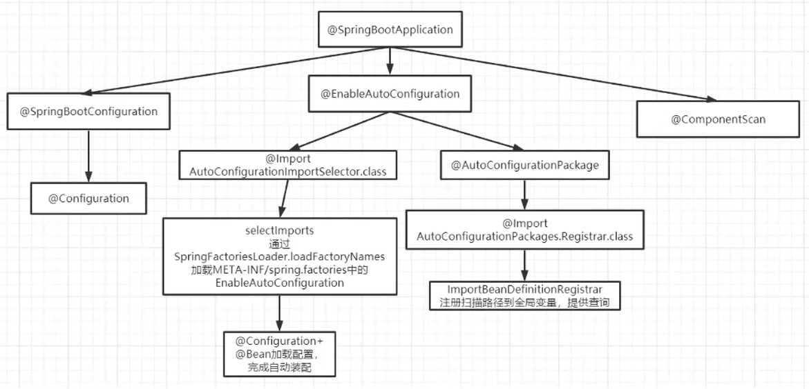

# 面试题

## Java基础

### 面向对象

#### 什么是面向对象

面向对象是性对于面向过程的另一种思考问题的方式：

1. **面向过程**主要是以动作为基础，将问题处理过程中涉及的动作封装成一个一个的函数，在主程序中调用对应的函数
2. **面向对象**主要是以对象为基础，将问题处理过程中涉及的事物抽象为一个一个的对象，在主程序中调用对象的方法

在大型项目中，面向对象能够更好的管理和维护，而面向过程的项目管理则较为复杂、难于管理

#### 面向对象的三大特性

1. 封装
   - 暴露该暴露的成员，外部不需要管理对象内部的实现，易于项目的维护和管理，如JavaBean、ORM框架、工具类等
2. 继承
   - 将多个实体的共性部分放在父类中，提高代码的复用性
3. 多态
   - 基于三个条件：继承、重写、父类的引用指向子类对象
   - 即：同一个父类引用的同一个方法，其执行不一定是一样的，需要根据子类的具体实现

### 开发环境

#### JDK、JRE、JVM三者区别和联系

1. JDK：
   - Java Develpment Kit / java 开发工具
   - JRE + Java工具
2. JRE：
   - Java Runtime Environment / java运行时环境
   - JVM + lib类库
3. JVM：java Virtual Machine / java 虚拟机


#### 字节码

Java中的编译器和解释器：

1. Java中引入了虚拟机的概念，即在机器和编译程序之间加入了一层抽象的虚拟的机器。这台虚拟的机器在任何平台上都提供给编译程序一个的共同的接口。

2. 编译程序只需要面向虚拟机，生成虚拟机能够理解的代码，然后由解释器来将虚拟机代码转换为特定系统的机器码执行。在Java中，这种供虚拟机理解的代码叫做字节码(即扩展名为.class的文件)，它不面向任何特定的处理器，只面向虚拟机。

3. 每一种平台的解释器是不同的，但是实现的虚拟机是相同的。Java源程序经过编译器编译后变成字节码，字节码由虚拟机解释执行，虚拟机将每一条要执行的字节码送给解释器，解释器将其翻译成特定机器上的机器码，然后在特定的机器上运行。这也就是解释了Java的编译与解释并存的特点。

   **Java源代码 → 编译器 → jvm可执行的]ava字节码(即虛拟指令) → jvm → jvm中解释器 → 机器可执行的二进制机器码 → 程序运行**。

采用字节码的好处：

1. 效率高：在一定程度上解决了传统解释型语言执行效率低的问题
2. 可移植：同时又保留了解释型语言可移植的特点。所以ava程序运行时比较高效
3. 跨平台：由于字节码并不专对一种特定的机器，因此，ava程序无须重新编译便可在多种不同的计算机上运行。

#### Java类加载器有哪些

JDK自带有三个类加载器：Bootstrap ClassLoader、ExtClassLoader、AppClassLoader。

1. BootStrapClassLoader是ExtClassLoader的父类加载器，默认负责加载 %JAVA_HOME%/lib 下的iar包和class文件。
   - 主要加载`rt.jar`
2. ExtClassLoader是AppClassLoader的父类加载器，负责加载 %JAVA_HOME%/lib/ext 文件夹下的jar包和class类
   - 主要加载`%JAVA_HOME%/lib/ext`
3. AppClassLoader是自定义类加载器的父类，负责加载classpath下的类文件。是一个系统类加载器，也是一个线程上下文加载器，需要继承ClassLoader实现自定义类加载器。
   - 主要加载classpath下的jar和类

#### 双亲委派模型


1. 向上委派：实际上就是查找缓存，是否加载了该类，有则直接返回，没有继续向上
2. 向下查找：委派到顶层之后，缓存中还是没有，则到加载路径中查找，有则加载返回，没有则向下查找
3. 向上委派到顶层加载器为止，向下查找到发起加载的加载器为止

双亲委派模型的好处：

1. 增强了系统类库的安全性，避免用户自己编写的类动态替换Java的一些核心类，比如 String。
2. 同时也避免了类的重复加载，因为JVM区分不同类，不仅仅是根据类名，**相同的class文件被不同的ClassLoader加载就是不同的两个类**

### 基础语法

#### final

1. 修饰类：表示类不可被继承
2. 修饰方法：表示方法不可被子类重写，但是可以重载
3. 修饰变量：表示变量一旦被赋值就不可以更改它的值
   - 赋值一般有三个地方：声明的同时赋值，代码块中赋值，构造器中赋值

局部内部类和匿名内部类只能访问局部final变量：

因为在这个内部类所在的方法执行完毕之后就会进行回收，如果不是final修改就有可能被人修改，但是方法已经回收，就有可能访问到一个不存在的变量，为了解决这个问题，咋语法层面就给出了添加final的解决方案

#### volatile

在Java中，`volatile`关键字是一个轻量级的同步机制，它用于确保一个变量在多个线程间可见。通过在变量声明前添加`volatile`关键字，可以保证任何线程对它的访问都会直接从共享内存中读取最新值，而不使用该变量的工作副本。这可以帮助避免由于指令重排序或者本地内存缓存带来的数据不一致问题。

使用`volatile`的主要好处如下：

1. **可见性**：对一个`volatile`变量的写操作对其他线程立即可见。这种可见性是通过Java内存模型（JMM）来保证的。当一个线程修改了`volatile`变量时，该修改对其他线程立即可见，且后续对该变量的读取都能获取到最新的修改。

2. **禁止指令重排序**：`volatile`变量的读和写操作不会被重排序，因此在使用`volatile`变量时，可以避免由于编译器或处理器指令重排序而导致的程序错误，保障了线程执行的顺序性。

3. **单个读/写操作的原子性**：对于32位的以下整型变量（例如`int`，`short`，`char`，`byte`，`boolean`）以及引用类型的读写操作来说，`volatile`提供了原子性。但是，对于64位的数据类型（例如`double`和`long`），如果要保证它们的原子性，除了使用`volatile`外，还需要考虑JVM参数`-XX：UseCondCardMark`的设置。

需要注意的是，`volatile`只保证可见性，并不提供互斥，也就是说，它无法保证多个线程同时执行某个操作，而且保证不了操作的原子性。对于需要进行同步的写操作，或者需要线程间的互相协调（例如操作间的次序），仅仅使用`volatile`是不够的。在这种情况下，还需要配合使用`synchronized`块或者其他并发工具，如`ReentrantLock`。

此外，由于`volatile`类型的变量读写会直接操作共享内存而不会缓存，因此如果频繁写操作可能会对性能造成影响，应该谨慎使用。

总结来说，`volatile`在多线程环境下主要用来保证变量的可见性和有序性，但不保证原子性。它是一种高效而强大的工具，用于简单的线程间通信和共享状态的同步问题。

#### String、StringBuffer、StringBuilder区别及使用场景

1. String是final修饰的，不可变，每次操作都会产生新的String对象
2. StringBuffer和StringBuilder都是在原对象上操作
3. StringBuffer是线程安全的，StringBuilder线程不安全，
   - StringBuffer方法都是synchronized修饰的
   - 性能：StringBuilder > StringBuffer >  String

场景：经常需要改变字符串内容时使用后面两个优先使用StringBuilder，多线程使用共享变量时使用StringBuffer

#### 重载和重写的区别

1. **重载**：
   - 发生在同一个类中
   - 方法名必须相同，参数类型不同、个数不同、顺序不同
   - **方法返回值和访问修饰符可以不同**
   - 发生在编译时
2. **重写**：
   - 发生在父子类中
   - 方法名、参数列表必须相同
   - 返回值范围小于等于父类，抛出的异常范围小于等于父类
   - 访问修饰符范围大于等于父类
   - 如果父类方法访问修饰符为private，则子类就不能重写该方法

**这两个东西设计的根本目的是不同的**

1. 重载的设计初衷：为了为同一个方法设置不同参数的调用
2. 重写的设计初衷：为了实现子类不同于父类的独特行为

#### 接口和抽象类

1. 抽象类：
   - 方法：可以存在正常的成员方法，也可以存在 public abstract 方法
   - 变量：和类别无二致
   - 设计目的：代码复用
   - 一个类只能继承一个
2. 接口：
   - 方法：只能存在 public abstract 方法
   - 变量：只能是 public static final 变量
   - 设计目的：提供规范的访问入口
   - 可以同时实现多个接口

#### hashCode与equals

hashCode是用来索引对象在内存堆中位置的，当出现不同对象的hashCode值相同的时候，就会调用该对象的equals方法判断堆中已有的对象和当前对象是不是同一个

即：hashCode大大减小了使用equals方法，使得性能有了很大的提升

注意：

1. 如果两个对象相等，则hashcode一定也是相同的
2. 两个对象相等，对两个对象分别调用equals方法都返回true
3. 两个对象有相同的hashcode值，它们也不一定是相等
4. equals方法被覆盖过，则hashcode方法也必须被覆盖
5. hashcode()的默认行为是对堆上的对象产生独特值。如果没有重写hashcode()，则该class的两个对象无论如何都不会相等(即使这两个对象指向相同的数据)

#### Java中的异常体系

1. Java中的所有异常都来自顶级父类`Throwable`。
2. Throwable下有两个子类`Exception`和`Error`。
   - `Error`是程序无法处理的错误，一旦出现这个错误，则程序将被迫停止运行。
   - `Exception`不会导致程序停止，又分为两个部分`RunTimeException`运行时异常和`CheckedException`检查异常。
     - `RunTimeException`常常发生在程序运行过程中，会导致程序当前线程执行失败。
     - `CheckedException`常常发生在程序编译过程中，会导致程序编译不通过。

#### GC如何判断对象可以被回收

1. **引用计数法**：每个对象有一个引用计数属性，新增一个引用时计数加1，引用释放时计数减1，计数为0时可以回收
   - 可能会出现一些循环引用的问题出现，所以回出现一些强依赖、弱依赖等方案来解决这个问题
2. **可达性分析法**：从 GC Roots 开始向下搜索，搜索所走过的路径称为引用链。当一个对象到 GC Roots 没有任何引用链相连时，则证明此对象是不可用的，那么虚拟机就判断是可回收对象。
   - 回收过程：
     - 第一次扫描发现不可达对象的时候会进行标记
     - 第二次扫描的时候会判断该对象是否已经实现了finalize()方法，弱没有覆盖直接回收，若覆盖则判断该方法中有没有引用其他对象，若有引用则复活，若没有则执行finalize()回收该对象
   - GC Roots的对象有：
     - **方法中的变量引用的对象**：虚拟机栈(栈帧中的本地变量表)中引用的对象
     - **类的静态属性引用的对象**：方法区中类的静态属性引用的对象
     - **常量引用的对象**：方法区中常量引用的对象
     - **本地方法引用的对象**：本地方法栈中JNI(即一般说的Native方法)引用的对象

### 数据结构

#### List和Set的区别

1. List：
   - 有序
   - 按对象进入的顺序保存对象
   - 可重复
   - 允许多个Null元素对象
   - 可以使用lterator取出所有元素在逐一遍历，还可以使用get(int index)获取指定下标的元素
2. Set：
   - 无序
   - 不可重复
   - 最多允许有一个Null元素对象
   - 取元素时只能用lterator接口取得所有元素，再逐一遍历各个元素

#### ArrayList和LinkedList区别

1. ArrayList：
   - 基于动态数组
   - 连续内存存储
   - 下标访问(随机访问)速度比较快
   - 扩容机制
     - 因为数组长度固定，超出长度存数据时需要新建数组，然后将老数组的数据拷贝到新数组，如果不是尾部插入数据还会涉及到元素的移动(往后复制一份，插入新元素)，使用尾插法并指定初始容量可以极大提升性能、甚至超过linkedList(需要创建大量的node对象)
2. LinkedList：
   - 基于链表
   - 可以存储在分散的内存中
   - 做数据插入及删除操作速度快，而查询较慢
     - 需要逐一遍历，遍历LinkedList必须使用iterator，不能使用for循环，因为每次for循环体内通过get()取得某一元素时都需要对list重新进行遍历，性能消耗极大。另外不要试图使用index0f等返回元素索引，并利用其进行遍历，使用indexl0f对ist进行了遍历，当结果为空时会遍历整个列表。

#### HashMap和HashTable

1. HashMap
   - 线程非安全：内部方法没有synchronized修饰
   - 允许key和value为null
2. HashTable
   - 线程安全：内部方法都有synchronized修饰
   - 不允许key和value为null

#### HashMap底层实现

数组 + 链表

JDK8开始链表高度到8、数组长度超过64，链表转变为红黑树，元素以内部类Node节点存在

1. 计算key的hash值，二次hash然后对数组长度取模，对应到数组下标，
2. 如果没有产生hash冲突(下标位置没有元素)，则直接创建Node存入数组。
3. 如果产生hash冲突，先进行equal比较，相同则取代该元素，不同，则判断链表高度插入链表，链表高度达到。8，并且数组长度到64则转变为红黑树，长度低于6则将红黑树转回链表
4. key为null，存在下标0的位置

#### ConcurrentHashMap实现原理

JDK7：

1. 数据结构：ReentrantLock+Segment+HashEntry，一个segment中包含一个元素为HashEntry类型的数组，每个HashEntry又是一个链表
2. 元素查询：二次hash，第一次Hash定位到Segment，第二次Hash定位到元素所在的链表头部
3. Segment分段锁：Segment继承了ReentrantLock，锁定操作的segment，其他的segment不受影响，并发度为segment个数，可以通过构造函数指定，数组扩容不会影响其他的segmentget
4. 方法无需加锁，volatile保证

JDK8：

1. 数据结构：synchronized+CAS+Node+红黑树，Node的val和next都用volatile修饰，保证可见性
   - synchronized主要是为了解决Hash冲突、数组扩容等场景
   - CAS主要是为了解决查找，替换，赋值操作
   - 当链表的节点数目小于等于8的时候维持链表的形态，大于8就会转化成一个红黑树，数目小于等于8的时候就会退化成链表状态
2. 锁：
   - 锁的是链表的head节点，不影响其他元素的读写，锁粒度更细，效率更高
   - 扩容时，阻塞所有的读写操作，因为要进行并发扩容
3. 读操作无锁：
   - Node的val和next使用volatile修饰，读写线程对该变量互相可见
   - 数组用volatile修饰，保证扩容时被读线程感知

### 线程

#### 线程的生命周期和状态

线程通常有五种状态

1. **创建**：新建状态(**New**)：新创建了一个线程对象。
2. **就绪**：就绪状态(**Runnable**)：线程对象创建后，其他线程调用了该对象的start方法。该状态的线程位于可运行线程池中，变得可运行，等待获取CPU的使用权。
3. **运行**：运行状态(**Running**)：就绪状态的线程获取了CPU执行权，执行程序代码。
4. **阻塞**：阻塞状态(**Blocked**)：阻塞状态是线程因为某种原因放弃CPU使用权，暂时停止运行。直到线程进入就绪状态，才有机会转到运行状态。
   - 等待阻塞：运行的线程执行wait方法，该线程会释放占用的所有资源，JVM会把该线程放入"等待池”中。进入这个状态后，是不能自动唤醒的，必须依靠其他线程调用notify或notifyAII方法才能被唤醒，wait是object类的方法
   - 同步阻塞：运行的线程在获取对象的同步锁时，若该同步锁被别的线程占用，则M会把该线程放入“锁池"中
   - 其他阻塞：运行的线程执行sleep或join方法，或者发出了!/0请求时，JM会把该线程置为阻塞状态。当seep状态超时、join等待线程终止或者超时、或者I/0处理完毕时，线程重新转入就绪状态。sleep是Thread类的方法
5. **死亡**：死亡状态(**Dead**)：线程执行完了或者因异常退出了run方法，该线程结束生命周期。

#### sleep()、wait()、join()、yield()的区别

> 1.**锁池**：所有需要竞争同步锁的线程都会放在锁池当中。比如当前对象的锁已经被其中一个线程得到，则其他线程需要在这个锁池进行等待，当前面的线程释放同步锁后锁池中的线程去竞争同步锁，当某个线程得到后会进入就绪队列进行等待cpu资源分配。
> 2.**等待池**：当我们调用wait()方法后，线程会放到等待池当中，等待池的线程是不会去竞争同步锁。只有调用了notify()或notifyAll后等待池的线程才会开始去竞争锁，notify()是随机从等待池选出一个线程放到锁池，而notifvAlO是将等待池的所有线程放到锁池当中

**sleep() 和 wait()**

1. sleep 是 Thread 类的静态本地方法，wait 则是 Object 类的本地方法。

2. sleep方法不会释放lock，但是wait会释放，而且会加入到等待队列中。

   > sleep就是把cpu的执行资格和执行权释放出去，不再运行此线程，当定时时间结束再取回cpu资源，参与cpu的调度，获取到cpu资源后就可以继续运行了。而如果s1eep时该线程有锁，那么s1eep不会释放这个锁，而是把锁带着进入了冻结状态，也就是说其他需要这个锁的线程根本不可能获取到这个锁。也就是说无法执行程序。如果在睡眠期间其他线程调用了这个线程的interrupt方法，那么这个线程也会抛出interruptexception异常返回，这点和wait是一样的。

3. sleep方法不依赖于同步器synchronized，但是wait需要依赖synchronized关键字。

4. sleep不需要被唤醒(休眠之后退出阻塞)，但是wait需要(不指定时间需要被别人中断)。

5. sleep一般用于当前线程休眠，或者轮循暂停操作，wait 则多用于多线程之间的通信。

6. sleep会让出 CPU 执行时间且强制上下文切换，而 wait 则不一定，wait 后可能还是有机会重新竞争到锁继续执行的。

**yield()**：正在执行的线程调用了另一个线程的yield后，当前线程直接进入**就绪状态**，马上释放了cpu的执行权，但是依然保留了cpu的执行资格，所以有可能cpu下次进行线程调度还会让这个线程获取到执行权继续执行
**join()**：正在执行的线程调用了另一个线程的join后，当前线程进入**阻塞状态**，例如在线程B中调用线程A的join()，那线程B会进入到阻塞队列，直到线程A结束或中断线程

```java
public static void main(String[] args) throws InterruptedException {
    Thread t1 = new Thread(new Runnable() {
        @Override
        public void run() {
            try {
                Thread.sleep(3000);
            } catch (InterruptedException e) {
                e.printStackTrace();
            }
            System.out.println("优先执行");
        }
    });
    t1.start();
    t1.join();
    System.out.println("最后执行");
}
```

#### 线程安全中 cas 是什么

在Java中，CAS全称为“比较并交换”（Compare And Swap）

1. 这是一种用于实现无锁编程的技术
2. CAS是硬件支持的原子操作，它允许一个线程检查内存中的值是否已改变，如果没有变化，则自动交换新的值进内存。此操作通常是原子的，即在单个指令周期内完成，不会被其他线程中断，因此可以安全地用于多线程环境。

CAS操作的基本思路是：
1. 读取当前内存中的值A。
2. 比较该值A是否仍然与预期值（通常是操作前的读取值）相同。
3. 如果相同，说明当前没有其他线程修改过这个内存位置，就将B（通常是新值或者计算结果）写入内存中。
4. 如果读取值A与预期值不相同，则表示有其他线程已经修改了这个内存位置，当前操作失败，一般需要重新读取并再次尝试执行CAS操作。

CAS使得在不使用锁的情况下也能实现线程安全，特别是在涉及到更新或修改共享资源时。相比于传统的锁机制，CAS在一些情况下可以提供更轻量级的并发控制，因为它避免了线程切换和上下文切换等开销，能够使运行更高效。不过，由于必须不断尝试以确保操作成功，可能会增加一些CPU使用率。

Java中提供了`java.util.concurrent.atomic`包，其中包含了大量的原子类，比如`AtomicInteger`和`AtomicLong`，这些类的内部使用了CAS操作来实现线程安全的更新，允许你以一种更加高效且无锁的方式对基本数据类型进行自增等操作。

Java线程安全的CAS实现通常依靠本地方法（native methods）调用平台特定的代码（如汇编指令），这些代码直接与硬件通信并确保原子性。在JDK的具体实现中，CAS通常是通过调用`unsafe`包中的相关方法来实现的。这样做的不足之处在于不同的硬件平台可能有不同的CAS行为和表现。

#### 说说你对线程安全的理解

> 当多个线程访问同一个资源对象时，如果不用进行额外的同步控制或其他的协调操作，调用这个对象的行为都可以获得正确的结果，我们就说这个对象是线程安全的

线程安全，本质上是内存安全，而内存一般最多用到的就是JVM的堆和栈

1. 堆内存安全
   - 堆是进程和线程共有的空间，分全局堆和局部堆。堆在操作系统对进程初始化的时候分配，运行过程中也可以向系统要额外的堆，但是用完了要还给操作系统，要不然就是内存泄漏。
     - 全局堆：所有没有分配的空间
     - 局部堆：用户分配的空间。
   - 在]ava中，堆是java虚拟机所管理的内存中最大的一块，是所有线程共享的一块内存区域，在虚拟机启动时创建。堆所存在的内存区域的唯一目的就是存放对象实例，几乎所有的对象实例以及数组都在这里分配内存。
2. 栈内存安全
   - 栈是每个线程独有的，保存其运行状态和局部自动变量的。
   - 栈在线程开始的时候初始化，每个线程的栈互相独立，因此，栈是线程安全的。
   - 操作系统在切换线程的时候会自动切换栈。栈空间不需要在高级语言里面显式的分配和释放。

目前主流操作系统都是多任务的，即多个进程同时运行。为了保证安全，每个进程只能访问分配给自己的内存空间，而不能访问别的进程的，这是由操作系统保障的。
在每个进程的内存空间中都会有一块特殊的公共区域，通常称为堆(内存)。进程内的所有线程都可以访问到该区域，这就是造成问题的潜在原因。

#### Thread、Runable的区别

Runnable是一个接口，Thread是一个实现了Runnable接口的类，实质是实现关系，没有可比性。无论使用Runnable还是Thread，都会new Thread，然后执行run方法。用法上，如果有复杂的线程操作需求，那就选择继承Thread，如果只是简单的执行一个任务，那就实现runnable。

下面是一个错误的示例：

实质上第一个示例共享一个5张票，第二个一共本来就10张票

而且两个程序都有问题，执行结果不确定，加一个睡眠时间直接原形毕露

```java
// 会卖出多一倍的票
public class Test1 {
    
    public static void main(String[] args) {
        new MyThread().start();
        new MyThread().start();
    }
    
    static class MyThread extends Thread {
        private int ticket = 5;
    
        @Override
        public void run() {
            while (true) {
                System.out.println("Thread ticket = " + ticket --);
                if (ticket < 0) {
                    break;
                }
            }
        }
    
    }
    
}
======================================================================
// 修改后的程序
  public class Test1 {
    
    public static void main(String[] args) {
        new MyThread("Thread-1").start();
        new MyThread("Thread-2").start();
    }
    
    static class MyThread extends Thread {
        private int ticket = 5;
        
        public MyThread(String name) {
            super(name); // 设置线程的名字
        }
        
        @Override
        public void run() {
            while (ticket > 0) {
                synchronized (this) { // 使用当前对象作为锁
                    if (ticket > 0) {
                        System.out.println(getName() + " ticket = " + ticket);
                        ticket--;
                    }
                }
            }
        }
    }
}
```

```java
// 正常卖出
public class Test2 {
    
    public static void main(String[] args) {
        MyThread thread = new MyThread();
        new Thread(thread).start();
        new Thread(thread).start();
    }
    
    static class MyThread implements Runnable {
        
        private int ticket = 5;
        
        @Override
        public void run() {
            while (true) {
                System.out.println("Thread ticket = " + ticket--);
                if (ticket < 0) {
                    break;
                }
            }
        }
        
    }
    
}
================================================================
// 修改后的程序
  public class Test2 {
    
    public static void main(String[] args) {
        // 创建两个MyThread实例，每个实例都有自己的ticket副本
        MyThread thread1 = new MyThread("Thread-1");
        MyThread thread2 = new MyThread("Thread-2");
        
        // 创建并启动两个线程
        new Thread(thread1).start();
        new Thread(thread2).start();
    }
    
    static class MyThread implements Runnable {
        
        private int ticket;
        private final String name;
        
        public MyThread(String name) {
            this.name = name;
            this.ticket = 5; // 每个线程有自己的ticket副本
        }
        
        @Override
        public void run() {
            while (ticket > 0) {
                synchronized (this) { // 使用当前对象作为锁
                    if (ticket > 0) {
                        System.out.println(name + " ticket = " + ticket);
                        ticket--;
                    }
                }
            }
        }
    }
}
```

#### 守护线程的理解

Java语言中只有两种线程：守护线程 和 用户线程/非守护线程

守护线程：为所有用户护线程提供服务的线程。即任何一个守护线程都是整个VM中所有非守护线程的保姆

守护线程类似于整个进程的一个默默无闻的小喽喽，它的生死无关重要，它却依赖整个进程而运行，哪天其他线程结束了，没有要执行的了，程序就结束了，理都没理守护线程，就把它中断了。

> 注意：由于守护线程的终止是自身无法控制的，因此千万不要把IO、File等重要操作逻辑分配给它，因为它不靠谱;

**守护线程的作用是什么?**

举例，**GC垃圾回收线程**就是一个经典的守护线程，当我们的程序中不再有任何运行的Thread，程序就不会再产生垃圾，垃圾回收器也就无事可做，所以当垃圾回收线程是IVM上仅剩的线程时，垃圾回收线程会自动离开。它始终在低级别的状态中运行，用于实时监控和管理系统中的可回收资源。

**应用场景解析**

1. 来为其它线程提供服务支持，或者在任何情况下，程序结束时，这个线程必须正常且立刻关闭，就可以作为守护线程来使用
2. 反之，如果一个正在执行某个操作的线程必须要正确地关闭掉否则就会出现不好的后果的话，那么这个线程就不能是守护线程，而是用户线程。通常都是些关键的事务，比方说，数据库录入或者更新，这些操作都是不能中断的。

**注意：**

1. `thread.setDaemon(true)`必须在`thread.start()`之前设置，否则会跑出一个`illegalThreadStateException`异常。不能把正在运行的常规线程设置为守护线程。
2. 在Daemon线程中产生的新线程也是Daemon的，
3. 守护线程不能用于去访问固有资源，比如读写操作或者计算逻辑。因为它会在任何时候甚至在一个操作的中间发生中断。
4. java自带的多线程框架，比如ExecutorService，会将守护线程转换为用户线程，所以如果要使用后台线程就不能用Java的线程池。

#### ThreadLocal的原理

对象关系：


类关系：


1. 每一个Thread对象均含有一个ThreadLocalMap类型的成员变量threadLoca1s，它存储本线程中所有ThreadLocal对象及其对应的值
2. ThreadLocalMap由一个个Entry对象构成，一个Entry由ThreadLoca1对象和object构成。由此可Entry继承WeakReference<ThreadLoca1<?>>，见，Entry的kev是ThreadLocal对象，并且是一个弱引用。当没指向kev的强引用后，该key就会被垃圾收集器回华
3. 当执行set方法时，ThreadLocal首先会获取当前线程对象，然后获取当前线程的ThreadLocalMap对象。再以当前ThreadLocal对象为key，将值存储进ThreadLocalMap对象中。
4. get方法执行过程类似。ThreadLocal首先会获取当前线程对象，然后获取当前线程的ThreadLocalMap对象。再以当前ThreadLocal对象为key，获取对应的value。
5. 由于每一条线程均含有各自私有的ThreadLocalMap容器，这些容器相互独立互不影响，因此不会存在线程安全性问题，从而也无需使用同步机制来保证多条线程访问容器的互斥性。

几个疑问：

1. 如果设置为弱引用遇到GC就会被回收，如果在设置之后，最后一次获取之前遇到GC，不是就出问题了吗？
   - 答：不会的，ThreadLocal对象有两个引用，一个是我们创建对象的时候的强引用，另外一个是ThreadLocalMap中key的弱引用，如果遇到GC的时候这个强引用还在，那么就不会被回收，如果强引用已经被回收，说明已经不再需要这个引用了，那么直接回收即可

#### ThreadLocal的使用场景

1. 在进行对象跨层传递的时候，使用ThreadLocal可以避免多次传递，打破层次间的约束
   - 例如处理用户请求的时候，可以在过滤器中直接设置对应的用户对象，后面对这个用户的操作就可以直接获取
2. 线程间数据隔离
3. 进行事务操作，用于存储线程事务信息
4. 数据库连接，Session会话管理
   - Spring框架在事务开始时会给当前线程绑定一个JDBC connection，在整个事务过程都是使用该线程绑定的connection来执行数据库操作，实现了事务的隔离性。Spring框架里面就是用的ThreadLoca1来实现这种隔离

#### ThreadLocal内存泄露

1. 怎么产生的
   - 在使用ThreadLocal的时候会创建一个新的ThreadLocal对象会出现一个对ThreadLocal的强引用，在ThreadLocalMap中有个弱引用也会指向这个我们创建的这个ThreadLocal对象，如果线程结束就会被回收是不会出现问题的，问题在于如果线程是从线程池中获取的，用完之后还会放回线程池，那么聂村中就会出现很多没有用但是也不会被回收的对象就会产生内存泄露
2. 解决
   - 当该线程的使命结束的时候调用remove方法将对应的数据清理掉即可

#### 并发的三大特性

1. 原子性
   - 一个计算行为不被中断，即该计算行为要么不执行，要么一次性执行完
2. 可见性
   - JMM内存模型中，如果保证不了一个计算行为的可见性很可能造成以及计算的结果被另外的线程覆盖的情况
   - 关键字：volatile、synchronized、final
3. 有序性
   - 操作系统为了指令的计算性对于在单线程执行不依赖执行顺序的代码进行指令重排，但是有些情况下指令重排在多线程下会出现问题所以需要保证有序性，可以对有顺序执行的代码使用synchronized进行修饰
   - 关键字：volatile、synchronized

#### Java的JMM内存模型是什么

Java内存模型（Java Memory Model，简称JMM）是Java语言规范的一部分，它定义了在多线程环境下，Java程序中各个变量的访问规则。

JMM的主要目的是为了提供一种规范，使得Java程序在不同的硬件和操作系统平台上能够达到一致的内存访问行为，从而保证多线程程序的正确性。

JMM的核心内容包括：

1. **主内存和工作内存**：JMM将内存分为两个部分：主内存（Main Memory）和工作内存（Working Memory）。
   - 主内存是所有线程共享的，用于存储所有实例字段、静态字段和数组对象。

   - 工作内存是每个线程私有的，用于存储线程读/写变量的副本。

2. **内存可见性**：JMM规定了线程对变量的读/写操作必须在工作内存中进行，而不是直接在主内存中进行。
   - 当一个线程修改了工作内存中的变量后，它必须通过某种机制将修改后的值同步回主内存，以便其他线程能够看到这个修改。

3. **原子性、可见性和有序性**：
   - JMM保证了基本数据类型的读/写操作是原子性的，即这些操作一旦开始，就不会被其他线程的相同操作打断。

   - JMM还保证了线程之间的操作具有一定的可见性，即一个线程对共享变量的修改，其他线程能够立即看到。

   - 此外，JMM还允许编译器和处理器对操作进行重排序，但必须保证重排序不会改变单线程程序的执行结果，即保证程序的有序性。

4. **happens-before规则**：JMM定义了一系列的happens-before规则，用于描述两个操作之间的内存可见性关系。
   - 如果一个操作happens-before另一个操作，那么第一个操作的结果对第二个操作是可见的。这些规则包括但不限于：程序顺序规则、监视器锁规则、volatile变量规则、传递性等。

5. **volatile关键字**：JMM对volatile关键字的内存语义进行了特殊规定，保证了volatile变量的读/写操作具有原子性和可见性。
   - 当一个线程写入一个volatile变量时，它会立即刷新到主内存，并且使得其他线程之前对该变量的缓存失效，从而保证了变量的可见性。

6. **final关键字**：JMM对final字段的初始化具有特殊的内存语义，即一旦一个对象的final字段被初始化完成，那么其他线程就可以看到这个final字段的值。

JMM是Java并发编程的基础，理解JMM对于编写正确的并发程序至关重要。通过JMM，Java程序可以利用各种同步机制（如synchronized关键字、volatile关键字、final关键字等）来控制线程间的交互，确保程序的正确执行。

#### 为什么用线程池

1. 降低资源消耗：提高线程利用率，降低创建和销毁线程的消耗。
2. 提高响应速度：任务来了，直接有线程可用可执行，而不是先创建线程，再执行。
3. 提高线程的可管理性：线程是稀缺资源，使用线程池可以统一分配调优监控。

线程池的参数：

1. 核心线程数：corePoolSize
2. 最大线程数：maxPoolSize
3. 核心线程数之外的线程空闲时间：keepLiveTime
4. 等待队列：workQueue
5. 线程工厂：threadFactory
6. 拒绝策略：Handler

#### 简述线程池处理流程


#### 线程池中阻塞队列的作用?

1. 如果阻塞队列满了，来的新任务会阻塞等待而不是直接拒绝
2. 任务队列中没有任务的时候，阻塞队列会使得核心线程进入wait状态，释放CPU资源
3. 阻塞队列自带阻塞和唤醒功能，无任务时线程池利用阻塞队列的take方法挂起，从而维持核心线程存活但不占用CPU资源

#### 线程池中为什么是优先添加列队而不是先使用最大线程?

核心线程数之外的线程是临时线程，之所以不优先使用的原因有以下几点：

1. 频繁地创建和销毁线程的代价是比较大的，会影响整体的效率，而线程池存在的意义就是避免频繁地创建和销毁线程
2. 有效地使用队列能提高整体的效率

#### 线程池中线程复用原理

Java 线程池中的线程复用原理主要通过ThreadPoolExecutor类中的Worker工作线程类来实现。Worker不仅实现了Runnable接口，还是一个封装了线程和任务队列交互的实体。

在创建线程池时，首先会创建一定数量的核心线程（corePoolSize），这些线程会一直存活在线程池中，即使没有任务执行。

线程池通过取Worker的firstTask或者通过getTask方法从workQueue中不停地取任务，并直接调用Runnable的run方法来执行任务，这样就保证了每个线程都始终忙碌。

此外，线程池可以把线程和任务进行解耦，线程归线程，任务归任务，摆脱了之前通过Thread创建线程时的一个线程必须对应一个任务的限制。

### 锁的可重入性指的是什么

锁的可重入性指的是一个线程拥有锁的情况再次执行不许要再次获取锁即可获得指令的执行权限

### 其他

#### == 和 equals

1. 双等号的比对是判断栈中的值
   - 基础类型的变量直接判断值
   - 引用类型的变量判断该变量在堆中的引用地址
2. equals默认情况下和双等号是一样的，但是每个子类可根据自己的实际情况进行重写

## Spring

### 什么是Spring

Spring是一个

1. 轻量级J2EE框架
2. 用来存放JavaBean的中间层框架
3. 轻量级的控制反转(IoC)和面向切面(AOP)的容器框架

总的来说是**一个实现了管理JavaBean容器的IoC和AOP的轻量级J2EE框架**

### IoC容器的实现原理

**IOC（Inversion of Control）容器**，即控制反转容器，是遵循IoC原理的框架的一部分，其主要作用是减少组件之间的耦合，实现对象的创建和依赖关系管理。

总结：在有IoC之前，一个对象的生命周期由使用者进行控制，而有了IoC之后，对象的生命周期管理交给容器。

### 实现一个IoC容器

1. 在配置文件中配置"包扫描路径"
2. 递归包扫描获取.class文件
3. 通过反射来确定需要交给IoC管理的类
4. 对需要注入的类进行依赖注入

### 谈谈AOP的理解

是一种能够在某个操作执行之前之后插入某些逻辑的一种增强编程方式，它是IoC的一个扩展点(BeanPostProcessor)，即面向切面编程，底层通过动态代理的方式实现

Spring是根据代理对象的类型决定使用哪一种动态代理的方式的，如果是实现了接口，就使用JDK的方式，否则使用CGLib

主体业务与管理相关任务的解耦

- 主体业务：比如用户请求处理等
- 管理相关任务：日志、异常、监控、事务、权限等

### BeanFactory和ApplicationContext的区别

| 区别项                                                | BeanFactory                                                  | ApplicationContext                                           |
| ----------------------------------------------------- | ------------------------------------------------------------ | ------------------------------------------------------------ |
| **关系**                                              | ApplicationContext的父类                                     | BeanFactory的子类                                            |
| **完善性**                                            | -                                                            | 实现了BeanFactory没有的一些功能，如<br/>获取环境变量(EnvironmentCapable)、<br/>国际化(MessageSource)、<br/>事件发布(ApplicationEventPublisher)、<br/>统一的资源加载(ResourcePatternResolver)、<br/>同时加载多个配置文件、<br/>提供在监听器中注册Bean事件 |
| **父子上下文**                                        | -                                                            | 可以载入多个（有继承关系）上下文 ，使得每一个上下文都专注于一个特定的层次，比如应用的web层。 |
| **类加载**                                            | 用到某个Bean时(getBean())，才对该Bean进行加载实例化<br/>问题：用到的时候才知道配置有没有问题 | 容器启动时一次性创建了所有的单例Bean<br/>问题：配置的Bean较多时，启动较慢，内存瞬间到达峰值 |
| <span style="white-space:nowrap;">**创建方式**</span> | 编程的方式被创建                                             | 1、编程的方式被创建<br/>2、声明的方式被创建：ContextLoader   |
| **对后置处理器的支持**                                | BeanFactory需要手动注册BeanPostProcessor、BeanFactoryPostProcessor | 自动注册BeanPostProcessor、BeanFactoryPostProcessor          |

### Spring Bean的生命周期

1. **类解析**
   - 解析类生成对应的**BeanDefinition**
2. **实例化**
   - 如果有构造方法那就**推断构造**方法
   - 推断构造Spring 4.0引入的一个特性，它允许Spring容器在创建Bean时自动推断出合适的构造函数来实例化Bean
3. **属性填充**
   - @Autowired属性填充
   - 回调**Aware**方法，如BeanNameAware，BeanFactoryAware等
4. **调用初始化方法**
   - 调用BeanPostProcessor初始化前置方法：@PostConstruct
   - 调用类初始化方法：initializingBean接口
   - 调用BeanPostProcessor初始化后的方法：AOP处理
5. 如果Bean是单例的放入**单例池**
6. 使用Bean
7. Spring容器关闭时调用DisposableBean中的**destory**()方法

### Spring支持的几种bean的作用域Scope

- **singleton**：默认，每个**容器**中只有一个bean的实例，单例的模式由BeanFactory自身来维护。该对象的生命周期是与Spring IOC容器一致的（但在第一次被注入时才会创建）。

- **prototype**：为每一个bean请求提供一个实例。在每次注入时都会创建一个新的对象

- **request**：bean被定义为在每个HTTP请求中创建一个单例对象，也就是说在单个请求中都会复用这一个单例对象。

- **session**：与request范围类似，确保每个session中有一个bean的实例，在session过期后，bean会随之失效。

- **application**：bean被定义为在ServletContext的生命周期中复用一个单例对象。

- **websocket**：bean被定义为在websocket的生命周期中复用一个单例对象。
- **global-session**：全局作用域，global-session和Portlet应用相关。当你的应用部署在Portlet容器中工作时，它包含很多portlet。如果你想要声明让所有的portlet共用全局的存储变量的话，那么这全局变量需要存储在global-session中。全局作用域与Servlet中的session作用域效果相同。

### Spring的Bean的线程安全性

Spring本身并没有针对Bean做线程安全的处理，所以：

1. Bean无状态，那么安全
2. Bean有状态，那么不安全

Bean的线程安全性和scope没有关系，安全性需要我们自己保证，方式：

1. 将scope设置成prototype，很明显有高并发场景的时候不可取
2. 将服务设计成无状态

### Spring中用到的设计模式

[Java中的设计模式](https://www.w3cschool.cn/java/java-factory-pattern.html)

| 设计模式                                            | 说明                                                         | Spring案例                                                   | 特征                       |
| --------------------------------------------------- | ------------------------------------------------------------ | ------------------------------------------------------------ | -------------------------- |
| 简单工厂                                            | 由一个工厂类根据传入的参数，动态决定应该创建哪一个产品类。   | Spring中的BeanFactory就是简单工厂模式的体现，根据传入一个唯一的标识来获得Bean对象，具体到是在传入参数后创建 还是 传入参数前创建这个要根据具体情况来定。`getBean` |                            |
| 工厂方法                                            | 根据类型获取实例<br>[DPFactoryMode.java](Spring.assets/DPFactoryMode.java) | 实现了FactoryBean接口的bean是一类叫做factory的bean。其特点是，Spring会在使用getBean()调用获得该bean时，会自动调用该bean的getObject()方法，所以返回的不是factory这个bean，而是这个bean.getOjbect()方法的返回值。 |                            |
| 单例模式                                            | 保证一个类仅有一个实例，并提供一个访问它的全局访问点         | Spring中的单例模式完成了后半句话，即提供了全局的访问点BeanFactory。但没有从构造器级别去控制单例，这是因为Spring管理的是任意的java对象。 |                            |
| <span style="white-space:nowrap;">适配器模式</span> | 适配器模式作为两个不兼容接口之间的桥梁。通过使用适配器模式，我们可以统一两个不兼容的接口。<br/>[DPAdapterMode.java](Spring.assets/DPAdapterMode.java) | Spring定义了一个适配接口，使得每一种Controller有一种对应的适配器实现类，让适配器代替controller执行相应的方法。这样在扩展Controller时，只需要增加一个适配器类就完成了SpringMVC的扩展了。`HandlerAdapter` | Adapter                    |
| 装饰模式                                            | 动态地给一个对象添加一些额外的职责。就增加功能来说，Decorator模式相比生成子类更为灵活。<br/>[DPDecoratorMode.java](Spring.assets/DPDecoratorMode.java) | Spring中用到的装饰器模式在类名上有两种表现：一种是类名中含有Wrapper，另一种是类名中含有Decorator。 | BeanWrapper                |
| 动态代理                                            |                                                              | 切面在应用运行的时刻被织入。<br/>一般情况下，在织入切面时，AOP容器会为目标对象动态的创建一个代理对象。Spring的AOP就是以这种方式织入切面的。<br/>织入：把切面应用到目标对象并创建新的代理对象的过程。 |                            |
| 观察者模式                                          | 观察者模式用于在一个对象被修改时通知其相关对象。观察者模式是一种行为模式类别。 | Spring的事件驱动模型使用的是 观察者模式 ，Spring中Observer模式常用的地方是listener的实现。 | Listener、Event、Multicast |
| 策略模式                                            | 在策略模式中，可以在运行时更改算法。是一种行为模式。我们创建表示各种算法的对象和运行算法的上下文对象。策略对象更改上下文对象上的算法。<br/>[DPStrategyMode.java](Spring.assets/DPStrategyMode.java) | Spring框架的资源访问Resource接口。该接口提供了更强的资源访问能力，Spring 框架本身大量使用了Resource 接口来访问底层资源。<br/>在Java中的应用如排序，因为Comparator这个接口简直就是为策略模式而生的。Collections里面有一个sort方法，因为集合里面的元素有可能是复合对象，复合对象并不像基本数据类型，可以根据大小排序，复合对象怎么排序呢？基于这个问题考虑，Java要求如果定义的复合对象要有排序的功能，就自行实现Comparable接口或Comparator接口. |                            |
| 模板模式                                            | 父类定义了骨架（调用哪些方法及顺序），某些特定方法由子类实现。除了子类要实现的特定方法，其他方法及方法调用顺序都在父类中预先写好了。 | refresh方法                                                  |                            |
| 责任链模式                                          |                                                              | AOP的时候的拦截器链                                          |                            |
| 委托者模式                                          |                                                              |                                                              | Delegate                   |
| 原型模式                                            | 预先创建对象，在使用对象的时候直接clone返回。                | 可以指定对象的scope为prototype。使用原型模式创建对象比直接new一个对象在性能上好得多，因为Object类的clone()方法是一个native方法，它直接操作内存中的二进制流，特别是复制大对象时，性能的差别非常明显。 |                            |
| 外观模式                                            | 外观模式要求一个子系统的外部与其内部的通信通过一个统一的外观对象进行，外观类将客户端与子系统的内部复杂性分隔开，使得客户端只需要与外观对象打交道，而不需要与子系统内部的很多对象打交道。<br/>外观模式的目的在于降低系统的复杂程度。 <br/>外观模式从很大程度上提高了**客户端使用的便捷性，使得**客户端无须关心子系统的工作细节，通过外观角色即可调用相关功能。 | Tomcat中有很多场景都使用到了**外观模式**，因为Tomcat中有很多不同的组件，每个组件需要相互通信，但又不能将自己内部数据过多地暴露给其他组件。用外观模式隔离数据是个很好的方法。 |                            |
| 迭代器模式                                          | Iterable接口和Iterator接口 这两个都是迭代相关的接口，可以这么认为，实现了Iterable接口，则表示某个对象是可被迭代的；Iterator接口相当于是一个迭代器，实现了Iterator接口，等于具体定义了这个可被迭代的对象时如何进行迭代的。 |                                                              |                            |

### Spring的事务实现

Spring中的事务实现方式有两种，一种是编程式事务，一种是声明式事务，由于编程式事务实现起来相对麻烦，所以现在基本采用声明式事务。

1. 编程式事务：通过API的方式手动编码实现事务，也有两种方式
   - `TransactionTemplate`对象的`execute`方法执行
   - `PlatformTransactionManager`对象的`getTransaction`、`commit`和`rollback`方法进行事务的管理
     - 也可以通过它来定义事务的属性，如传播行为、隔离级别、超时时间等。
2. 声明式事务：通过@Trasactional注解的方式实现
   - 在方法上添加@Trasactional之后，Spring会基于这个类生成一个代理对象，事务地处理就会包裹这个方法进行，
   - 如在调用之前会关闭自动提交，然后执行添加注解的方法，若没有异常则提交事务，否则回滚
   - 当然，我们可以自己配置哪些异常是可以回滚的，如@Trasactional的rollbackFor参数，默认回对RuntimeException和Error进行回滚

**注意**：

1. Spring事务的实现基于数据库和AOP机制
2. **事务的概念是数据库层面的，Spring事务是数据事务的扩展**

**事务的处理步骤**

1. Spring容器启动的时候会扫描到有@Transactional注解的类，自动给这些类创建代理对象
2. 当有请求的时候，这个请求会直接请求到代理对象上，在代理对象上实现事务的相关的前置后置切面
3. 完成后会判断是否有异常，有异常则回滚，没有异常则提交

### Spring的事务的隔离级别

由于Spring的事务是对数据库事务的扩展，期隔离级别就是数据库的隔离级别，外加一个默认的隔离级别

1. read-uncommitted：读取为提交
2. read-committed：提交读取、不可重复读，Oracle默认隔离级别
3. repeatable-read：可重复读，MySQL默认隔离级别
4. serial：串行

注意：Spring配置的的隔离级别会覆盖数据库的隔离级别

### Spring的事务传播机制

- 所谓事务的传播机制讲的是多个事务之间的关系对多个事务对应的方法的影响，即解决事务嵌套问题

- 一共有下面几种：

  | 序号 | 传播类型     | 说明                                         |
  | ---- | ------------ | -------------------------------------------- |
  | 1    | REQUIRED     | 需要一个事务，有则加入，无则新建，Spring默认 |
  | 2    | SUPPORTS     | 支持事务，有则加入，无则以非事务方式运行     |
  | 3    | MANDATORY    | 强制在事务中执行，有则加入，无则异常         |
  | 4    | REQUIRES_NEW | 需要新事务，有则挂起已存在并新建，无则新建   |
  | 5    | NOT_SUPPORT  | 不支持事务，存在挂起，无则以非事务方式运行   |
  | 6    | NEVER        | 不用事务，有则异常，无则以非事务方式运行     |
  | 7    | NESTED       | 嵌套执行，有则嵌套，无则新建                 |

- 事务嵌套怎么办

  | 父事务机制 | 子事务机制 | 说明 |
  | ---------- | ---------- | ---- |
  | NESTED     |            |      |

### Spring事务失效的场景

Spring事务基于数据库事务，通过AOP实现，如果事务失效，那么就是AOP有问题了：两个层面：

**代码层面：**

1. 发生自调用
   - 没有使用代理对象调用事务方法而是用对象本身调用。如：使用this关键字；
2. 非public方法
   - @Transactional 只能用于 public 的方法上，否则事务不会失效，如果要用在非 public 方法上，可以开启 AspectJ 代理模式。
3. 没有被Spring管理的对象
   - 需要事务处理的方法所在的类必须 被Spring容器管理，否则@Transactional就会失效，因为没有代理对象
4. 异常被吃
   - 如内部的异常被try了

**数据库层面：**

1. 存储引擎不支持事务
   - 如MyISAM

### Spring的Bean的自动装配方式

开启自动装配，只需要在xml配置文件中定义"autowire"属性。

`<bean id="cutomer" class="com.xxx.xxx.Customer" autowire="" />`

autowire属性有五种装配的方式：

| 装配方式    | 说明                                                         | 案例                                                         |
| ----------- | ------------------------------------------------------------ | ------------------------------------------------------------ |
| no          | 手动装配：以value或ref的方式明确指定属性值都是手动装配。需要通过"ref"属性来连接bean。 | -                                                            |
| byName      | 根据bean的属性名称进行自动装配                               | Cutomer的属性名称是person，Spring会将bean id为person的bean通过setter方法进行自动装配。<br/>`<bean id="cutomer" class="com.xxx.xxx.Cutomer" autowire="byName"/>`<br/>`<bean id="person" class="com.xxx.xxx.Person"/>` |
| byType      | 根据bean的类型进行自动装配。                                 | Cutomer的属性person的类型为Person，Spirng会将Person类型通过setter方法进行自动装配。<br/>`<bean id="cutomer" class="com.xxx.xxx.Cutomer" autowire="byType"/>`<br/>`<bean id="person" class="com.xxx.xxx.Person"/>` |
| constructor | 类似byType，不过是应用于构造器的参数。如果一个bean与构造器参数的类型形同，则进行自动装配，否则导致异常。 | Cutomer构造函数的参数person的类型为Person，Spirng会将Person类型通过构造方法进行自动装配。<br/>`<bean id="cutomer" class="com.xxx.xxx.Cutomer" autowire="construtor"/>`<br/>`<bean id="person" class="com.xxx.xxx.Person"/>` |
| autodetect  | 如果有默认的构造器，则通过constructor方式进行自动装配，否则使用byType方式进行自动装配。 | -                                                            |

@Autowired自动装配bean，可以在字段、setter方法、构造函数上使用。

### SpringBoot、SpringMVC 和 Spring

1. Spring是一个IoC容器，用来管理Bean，使用依赖注入实现控制反转，可以很方便的整合各种框架，提供AOP机制弥补OOP的代码重复问题、更方便将不同类不同方法中的共同处理抽取成切面、自动注入给方法执行，比如日志、异常等
2. SpringMVC是Spring对web框架的一个解决方案，提供了一个总的前端控制器Servlet，用来接收请求，然后定义了一套路由策略(url到handle的映射)及适配执行handle，将handle结果使用视图解析技术生成视图展现给前端
3. SpringBoot是Spring提供的一个快速开发工具包，让程序员能更方便、更快速的开发Spring+SpringMVC应用，简化了配置(约定了默认配置)，整合了一系列的解决方案(starter机制)、redis、mongodb、es，可以开箱即用

### SpringMVC工作流程

1. 请求从前端发送给服务器，服务器把这个请求转交给DispatcherServlet(DS)
2. DS调用HandlerMapping用来查找该请求对应的处理器
3. DS调用HandlerAdapter来执行处理器，返回对应的ModelAndView给DispatcherServlet
4. DS将ModelAndView交给ViewResolver，把ModelAndView转化成对应的页面数据
5. DS把数据返回给客户端

**DispatcherServlet**是老板，**HandlerAdapter**是使用工具干活的人，**HandlerMapping**能找到这个工具，**Handler**是干活的工具


### SpringMVC9大主要组件

1. HandlerMapping
   - initHandlerMapping(context)
   - 处理映射器，根据用户请求URI查找对应的Handler(即Controller)的，内部维护URI与Handler的映射关系
2. HandlerAdapter
   - initHandlerAdapter(context)
   - 处理适配器，为了适配不同的控制器的实现方式(Controller接口、@Controller注解、Servlet)
3. HandlerExceptionResolver
   - initHandlerExceptionResolver(context)
   - SpringMVC中异常统一处理类，根据异常来设置ModelAndView，之后交给ViewResolver
4. ViewResolver
   - initViewResolver(context)
   - 使用哪个模板，用什么技术填入参数
5. RequestToViewNameTranslator
   - initRequestToViewNameTranslator(context)
   - 解决Controller有返回值，而Servlet没有返回值的问题
6. LocaleResolver
   - initLocaleResolver(context)
   - 国际化
7. ThemeResolver
   - initThemeResolver(context)
   - 主题渲染
8. MultipartResolver
   - initMultipartResolver(context)
   - 文件上传
9. FlashMapManager
   - initFlashMapManager(context)
   - 管理FlashMap，redirect中传递参数

## SpringBoot

### SpringBoot 自动配置原理

@lmport + @configuration + Spring SPI

1. 自动配置类由各个starter提供，使用@Configuration+@Bean定义配置类
2. 使用Spring SPI扫描META-INF/Spring.factories下的配置类配置
3. 使用@import导入自动配置类



### 如何理解 SpringBoot 中的Starter

使用Spring+SpringMVC使用，如果需要引入MyBatis等框架，需要到xml中定义MyBatis需要的Bean

Starter就是：

1. 定义一个starter的jar包
2. 写一个@Configuration配置类
3. 将这些bean定义在配置类里面，然后将配置类放在Starter包的META-INF/Spring.factories，Springboot会按照约定来加载该配置类
4. 开发人员只需要将相应的starter包依赖进应用，进行相应的属性配置(使用默认配置时，不需要配置)，就可以直接进行代码开发，使用对应的功能了，比如MyBatis-Spring-boot--starter，Spring-boot-starter-redis

### 嵌入式服务器

节省了下载安装tomcat，应用也不需要再打war包，然后放到webapp目录下再运行，只需要一个安装了 Java 的虚拟机，就可以直接在上面部署应用程序了，springboot已经内置了tomcat.jar，运行main方法时会去启动tomcat，并利用Tomcat的SPI机制加载springmvc

## SpringCloud

### SpringCloud和Dubbo的区别

主要的几点区别：

| 区别项   | SpringCloud            | Dubbo                  | 备注                   |
| -------- | ---------------------- | ---------------------- | ---------------------- |
| 通信协议 | 基于HTTP               | 基于TCP                | Dubbo的性能更好        |
| 注册中心 | 使用Eureka             | 使用ZooKeeper          | Eureka注重AP，ZK注重CP |
| 服务定义 | 一个应用定义为一个服务 | 一个接口为一个服务     |                        |
| 生态服务 | 完整生态               | 只是一个服务治理的方案 |                        |

### 简单介绍一下Hystrix的机制

Hystrix是SpringCloud中一个用于流量控制的断路器，专业的说：**分布式容错框架**，有以下效用：

1. 用熔断的方式阻止故障的连锁反应
2. 快速失败，实现优雅降级
3. 提供实时的监控和告警

#### Hystrix的运行机制

1. **命令包装**：将请求通过HystrixCommand或HystrixObservableCommand对象进行包装
2. **执行命令**：在线程池中执行这些命令，并对其结果进行统计和监控
3. **熔断机制**：Hystrix会向每个commandKey对应的熔断器报告成功、失败、超时和拒绝的状态，熔断器根据这些数据来决策是否开启熔断
4. **降级机制**：当熔断器打开时，或者线程池/队列/信号量满了，或者命令执行超时时，会触发降级逻辑，调用fallback方法
5. **缓存机制**、**超时检测**、**资源隔离**、**监控与统计**

通过这些机制，Hystrix能够实现资源隔离、降级、熔断等功能，帮助解决雪崩效应问题

#### 资源隔离

使用的时候二选一

1. **线程隔离**：Hystrix会给每一个Command分配一个单独的线程池，这样在进行单个服务调用的时候，就可以在独立的线程池里面进行，而不会对其他线程池造成影响
2. **信号量隔离**：客户端向依赖服务发起请求时，首先要获取一个信号量才能真正发起调用，由于信号量的数量有限，当并发请求量超过信号量个数时，后续的请求都会直接拒绝，进入falback流程。信号量隔离主要是通过控制并发请求量，防止请求线程大面积阻塞，从而达到限流和防止雪崩的目的。

#### 熔断和降级

调用服务失败后快速失败

1. 熔断：为了防止异常扩散，保证系统的稳定性
2. 降级：编写好调用失败的补救逻辑，然后对服务直接停止运行，这样这些接口就无法正常调用，但又不至于直接报错，只是服务水平下降

### SpringCloud核心组件


|  组件   |                       角色                        |                          作用                           | 说明                                                         |
| :-----: | :-----------------------------------------------: | :-----------------------------------------------------: | ------------------------------------------------------------ |
| Eureka  |                                                   | <span style="white-space:nowrap;">服务注册与发现</span> | **注册**：每个服务都向Eureka登记自己提供服务的元数据，包括服务的ip地址、端口号、版本号、通信协议等。eureka将各个服务维护在了一个服务清单中（双层Map，第一层key是服务名，第二层key是实例名，value是服务地址加端口）。同时对服务维持心跳，剔除不可用的服务，eureka集群各节点相互注册每个实例中都有一样的服务清单。<br/>**发现**：eureka注册的服务之间调用不需要指定服务地址，而是通过服务名向注册中心咨询，并获取所有服务实例清单(缓存到本地)，然后实现服务的请求访问。 |
| Ribbon  |                                                   |                     客户端负载均衡                      | 服务间发起请求的时候，基于Ribbon做负载均衡，从⼀个服务的多台机器中选择⼀台 ，Ribbon通过发起http请求来进行服务调用，只不过是通过调用服务名的地址来实现的。虽然说Ribbon不用去具体请求服务实例的ip地址或域名了，但是每调用一个接口都还要手动去发起Http请求 |
|  Feign  |                                                   |                      简化服务调用                       | 基于Feign的动态代理机制，根据注解和选择的机器，拼接请求URL地址，发起请求 ，简化服务间的调用，在Ribbon的基础上进行了进一步的封装。单独抽出了一个组件，就是Spring Cloud Feign。在引入Spring Cloud Feign后，我们只需要创建一个接口并用注解的方式来配置它，即可完成对服务提供方的接口绑定。使得调用远程就像调用本地服务一样 |
| Hystrix |                      断路器                       |                     服务的降级熔断                      | 发起请求是通过Hystrix的线程池来⾛的，不同的服务⾛不同的线程池，实现了不同服务调⽤的隔离，通过统计接口超时次数返回默认值，实现服务熔断和降级 |
|  Zuul   | <span style="white-space:nowrap;">服务网关</span> |                      请求校验转发                       | 如果前端、移动端要调⽤后端系统，统⼀从Zuul网关进⼊，由Zuul网关转发请求给对应的服务，通过与Eureka进行整合，将自身注册为Eureka下的应用，从Eureka下获取所有服务的实例，来进行服务的路由。<br/>Zuul还提供了一套过滤器机制，开发者可以自己指定哪些规则的请求需要执行校验逻辑，只有通过校验逻辑的请求才会被路由到具体服务实例上，否则返回错误提示。 |

### Dubbo的架构设计


节点角色说明：

**Provider**：暴露服务的服务提供方。
**Consumer**：调用远程服务的服务消费方。
**Registry**：服务注册与发现的注册中心。
**Monitor**：统计服务的调用次调和调用时间的监控中心。
**Container**：服务运行容器。

这点我觉得非常好，角色分明，可以根据每个节点角色的状态来确定该服务是否正常。

调用关系说明：

1. 服务容器负责启动，加载，运行服务Provider。 

2. 服务Provider在启动时，向注册中心注册自己提供的服务。

3. 服务Consumer在启动时，向注册中心订阅自己所需的服务。

4. 注册中心返回服务Provider地址列表给Consumer，如果有变更，注册中心将基于长连接推送变更数据给Consumer。

5. 服务Consumer，从Provider地址列表中，基于软负载均衡算法，选一台Provider进行调用，如果调用失败，再选另一台调用。

   | 名称                          | 说明                                                         |
   | :---------------------------- | :----------------------------------------------------------- |
   | **Random**LoadBalance         | 随机算法，根据权重设置随机的概率                             |
   | **LeastActive**LoadBalance    | 最少活跃数算法，指请求数和完成数之差，使执行效率高的服务接收更多请求 |
   | **RoundRobin**LoadBalance     | 加权轮训算法，根据权重设置轮训比例                           |
   | **ConsistentHash**LoadBalance | 一致性Hash算法，相同请求参数分配到相同提供者                 |

6. 服务Consumer和Provider，在内存中累计调用次数和调用时间，定时每分钟发送一次统计数据到监控中心。

Dubbo的容错性显而易见，性能方面还没有还得及测，我们系统某页面需要掉5次接口，本来想建议做个缓存，但业务关系不能采纳，还需要研究下Dubbo的性能调优问题

### Dubbo的架构分层


划分了 10 个层

- 服务接口层(Service)：该层是与实际业务逻辑相关的，根据服务提供方和服务消费方的业务设计对应的接口和实现。 
- 配置层(Config)：对外配置接口，以 ServiceConfig 和ReferenceConfig 为中心。 
- 服务代理层(Proxy)：服务接口透明代理，生成服务的客户端 Stub 和服务器端 Skeleton。 
- 服务注册层(Registry)：封装服务地址的注册与发现，以服务 URL为中心。 
- 集群层(Cluster)：封装多个提供者的路由及负载均衡，并桥接注册中心，以 Invoker 为中心。 
- 监控层(Monitor)：RPC 调用次数和调用时间监控。 
- 远程调用层(Protocol)：封将 RPC 调用，以 Invocation 和 Result为中心，扩展接口为 Protocol、Invoker 和 Exporter。 
- 信息交换层(Exchange)：封装请求响应模式，同步转异步，以Request 和 Response 为中心。 
- 网络传输层(Transport)：抽象 mina 和 netty 为统一接口，以essage 为中心。 
- 数据序列化层(Serialize)：可复用的一些工具，扩展接口为 Serialization、 ObjectInput、ObjectOutput 和 ThreadPool Dubbo

## Dubbo框架设计层级

- 划分了 10 个层

  - 服务接口层(Service)：该层是与实际业务逻辑相关的，根据服务提供方和服务消费方的业务设计对应的接口和实现。 
  - 配置层(Config)：对外配置接口，以 ServiceConfig 和ReferenceConfig 为中心。 
  - 服务代理层(Proxy)：服务接口透明代理，生成服务的客户端 Stub 和服务器端 Skeleton。 
  - 服务注册层(Registry)：封装服务地址的注册与发现，以服务 URL为中心。 
  - 集群层(Cluster)：封装多个提供者的路由及负载均衡，并桥接注册中心，以 Invoker 为中心。 
  - 监控层(Monitor)：RPC 调用次数和调用时间监控。 
  - 远程调用层(Protocol)：封将 RPC 调用，以 Invocation 和 Result为中心，扩展接口为 Protocol、Invoker 和 Exporter。 
  - 信息交换层(Exchange)：封装请求响应模式，同步转异步，以Request 和 Response 为中心。 
  - 网络传输层(Transport)：抽象 mina 和 netty 为统一接口，以essage 为中心。 
  - 数据序列化层(Serialize)：可复用的一些工具，扩展接口为 Serialization、 ObjectInput、ObjectOutput 和 ThreadPool Dubbo 

## ORM框架

### MyBatis优缺点

1. 优点：

   - 基于SQL语句编程，相当灵活，不会对应用程序或者数据库的现有设计造成任何影响，SQL写在XML里，解除SQL与程序代码的耦合，便于统一管理;提供XML标签，支持编写动态SQL语句，并可重用。

   - 与JDBC 相比，减少了50%以上的代码量，消除了JDBC 大量冗余的代码，不需要手动开关连接
   - 很好的与各种数据库兼容(因为 MyBatis 使用 JDBC来连接数据库，所以只要JDBC 支持的数据库 MyBatis 都支持)
   - 能够与Spring很好的集成
   - 提供映射标签，支持对象与数据库的ORM字段关系映射; 提供对象关系映射标签，支持对象关系组件维护

2. 缺点：

   - SQL语句的编写工作量较大，尤其当字段多、关联表多时，对开发人员编写SQL语句的功底有一定要求。
   - SQL语句依赖于数据库，导致数据库移植性差，不能随意更换数据库。

### MyBatis与Hibernate对比

|                      对比项                       | MyBatis                                                      | Hibernate                                                    |
| :-----------------------------------------------: | ------------------------------------------------------------ | ------------------------------------------------------------ |
| <span style="white-space:nowrap;">设计理念</span> | MyBatis是一个半自动化的ORM框架，它允许开发者编写SQL语句，并将SQL结果映射到Java对象上。它提供了灵活的SQL编写和执行方式，同时支持存储过程和高级映射 | Hibernate是一个全自动的ORM框架，它提供了完整的对象关系映射解决方案。Hibernate通过注解或XML配置文件来映射Java对象和数据库表，自动处理SQL语句的生成和执行 |
|                      SQL控制                      | 开发者可以完全控制SQL语句，包括编写复杂的查询和优化性能      | 虽然Hibernate也允许自定义SQL，但其主要目标是减少开发者直接编写SQL的需求 |
|                     运行性能                      | 由于开发者可以精确控制SQL语句，通常认为MyBatis在性能上具有优势，尤其是在复杂的查询和优化方面 | Hibernate在处理简单查询时非常高效，但在复杂的查询和性能优化方面可能不如MyBatis灵活 |
|                     学习曲线                      | 由于需要编写SQL语句，可能需要更多的数据库知识，但学习曲线相对平缓 | Hibernate的抽象层较高，学习曲线可能更陡峭，但一旦掌握，可以显著提高开发效率 |
|                  社区和生态系统                   | MyBatis社区活跃，有广泛的插件和工具支持                      | Hibernate社区同样活跃，且由于其历史更长，拥有更广泛的生态系统和文档资源 |
|                    配置和映射                     | 通常使用XML或注解来配置SQL映射和数据库操作                   | 主要通过注解或XML文件来定义对象和数据库表之间的映射关系      |

### MyBatis与Hibernate各自的优势

从开发效率的角度来看，Hibernate和MyBatis各有优势，选择哪个更好取决于具体的应用场景和开发团队的偏好。

**Hibernate的优势：**
- **高度抽象**：Hibernate提供了非常高的抽象层，允许开发者通过对象模型直接操作数据库，而无需编写SQL语句。这大大减少了编写和维护SQL代码的工作量，使得开发人员可以更专注于业务逻辑的实现。
- **代码生成**：Hibernate可以自动生成一些基础的数据库操作代码，如实体类、映射文件等，这可以显著提高开发效率，尤其是在项目初期。
- **内置功能**：Hibernate内置了丰富的功能，如缓存、事务管理等，这些功能减少了开发人员需要手动实现的代码量。

**MyBatis的优势：**
- **灵活性和控制力**：MyBatis允许开发者编写自己的SQL语句，这提供了更高的灵活性和对数据库操作的控制力。对于复杂的查询和性能优化，MyBatis提供了更多的控制空间。
- **性能优化**：由于开发者可以精确控制SQL语句，MyBatis在性能优化方面通常被认为有优势，尤其是在处理复杂的查询和大数据量时。
- **易于调试**：由于SQL语句是显式编写的，因此在调试时更容易定位问题。

**结论**：
- 如果项目需要快速开发，且数据库操作相对简单，Hibernate可能提供更高的开发效率，因为它减少了编写和维护SQL代码的工作量。
- 如果项目需要高度的性能优化，或者数据库操作非常复杂，MyBatis可能更适合，因为它提供了更多的控制力和灵活性。

在实际开发中，很多团队会根据项目需求和团队成员的技能水平来选择最适合的框架。有时候，团队也会结合使用这两种框架，利用它们各自的优势来提高开发效率和应用性能。例如，对于大部分的CRUD操作使用Hibernate，而对于需要高度优化的查询则使用MyBatis。

### MyBatis中的 `#{}` 和 `${}`

1. `#{}`是预编译处理、是占位符，`${}`是字符串替换、是拼接符。
2. MyBatis 在处理`#{}`时，会将SQL中的`#{}`替换为`?`号，调用 Preparedstatement 来赋值
3. MyBatis 在处理`${}`时，会将SQL中的`${}`替换成变量的值，调用 Statement 来赋值
4. `#{}`的变量替换是在DBMS内，变量替换后，`#{}`对应的变量自动加上单引号
5. `${}`的变量替换是在DBMS外，变量替换后，`${}`对应的变量不会加上单引号
6. 使用`#{}`可以有效的防止 SQL 注入，提高系统安全性。

### MyBatis的插件运行原理

MyBatis的插件即：MyBatis的拦截器

1. MyBatis只支持针对4个接口的插件
   1. `ParameterHandler`：主要是将Java的数据类型转换成数据库的对应数据类型
   2. `ResultsetHandler`：主要是用来接收结果集
   3. `StatementHandler`：负责参数的设置 以及 结果集的映射
   4. `Executor`：MyBatis调度的核心，主要负责生成SQL语句以及查询缓存的维护
2. MyBatis 使用JDK的动态代理，为需要拦截的接口生成代理对象以实现接口方法拦截功能，每当执行这4种接口对象的方法时，就会进入拦截方法，具体就是InvocationHandler的invoke()方法，拦截那些你指定需要拦截的方法。

### 如何编写一个MyBatis插件

1. 实现MyBatis的Interceptor接口并实现intercept()方法
2. 在插件编写注解，指定要拦截哪个接口的哪些方法
3. 在配置文件中配置编写的插件

```java
@Intercepts({
    @signature(type = StatementHandler.class, method = "query", args = {Statement.class, ResultHandler.class}),
    @signature(type = StatementHandler.class, method = "update", args = {Statement.class}),
    @signature(type = StatementHandler.class, method = "batch", args ={Statement.class })
})
@component
```

要定义一个MyBatis拦截器步骤：

1. **创建拦截器类**：首先，创建一个实现了`org.apache.ibatis.plugin.Interceptor`接口的类。这个类将包含你想要在MyBatis执行SQL操作前后执行的逻辑。
2. **实现`intercept`方法**：在你的拦截器类中，实现`intercept`方法。这个方法是拦截器的核心，它会在MyBatis执行目标方法之前被调用。
3. **使用`@Intercepts`和`@Signature`注解**：使用`@Intercepts`注解来指定拦截器要拦截的方法，使用`@Signature`注解来指定要拦截的接口类型、方法以及方法的参数类型。
4. **注册拦截器**：在MyBatis的配置文件或配置类中注册你的拦截器。

示例

```java
import org.apache.ibatis.executor.statement.StatementHandler;
import org.apache.ibatis.plugin.*;

import java.sql.Statement;
import java.util.Properties;

@Intercepts({
    @Signature(type = StatementHandler.class, method = "prepare", args = {Connection.class, Integer.class})
})
public class MyFirstInterceptor implements Interceptor {

    @Override
    public Object intercept(Invocation invocation) throws Throwable {
        // 在这里添加你想要执行的逻辑
        System.out.println("Before statement execution");

        // 调用目标方法
        Object target = invocation.getTarget();
        StatementHandler statementHandler = (StatementHandler) target;
        Statement stmt = (Statement) invocation.proceed();

        // 在这里添加你想要执行的逻辑
        System.out.println("After statement execution");

        return stmt;
    }

    @Override
    public Object plugin(Object target) {
        // 如果需要，可以返回目标对象的代理
        return Plugin.wrap(target, this);
    }

    @Override
    public void setProperties(Properties properties) {
        // 可以在这里设置拦截器的属性
    }
}
```

```java
import org.apache.ibatis.session.SqlSessionFactory;
import org.apache.ibatis.plugin.Interceptor;
import org.apache.ibatis.plugin.Plugin;
import org.apache.ibatis.plugin.Signature;
import org.springframework.context.annotation.Bean;
import org.springframework.context.annotation.Configuration;

@Configuration
public class MyBatisConfig {

    @Bean
    public SqlSessionFactory sqlSessionFactory() throws Exception {
        // ... 其他配置 ...
        return sqlSessionFactoryBuilder.build(reader, properties);
    }

    @Bean
    public Interceptor myFirstInterceptor() {
        MyFirstInterceptor interceptor = new MyFirstInterceptor();
        // 可以在这里设置拦截器的属性或依赖，如果不需要，则可以直接在MyFirstInterceptor上使用@Component注解
        interceptor.setSomeProperty(someOtherBean);
        return interceptor;
    }
}
```

## 关系型数据库

### 索引的基本原理

爱数据库的访问中要想更有效率的访问必须解决两个方面的内容：

1. 尽可能少的进行磁盘IO
   - 这就牵扯到数据库引擎的选择，通常有聚簇索引和分散索引，即尽可能少的回表查询，那么就会选择聚簇索引，如InnoDB
2. 尽可能少的查询时间
   - 二舅牵扯到数据库数据的组织方式，即数据结构，数据库中一般都使用B树或者BP树
     - MySQL中用的是BP树，每个节点存储多个键索引，每个节点的查询都是二分法，数据的存储只在叶子节点
     - 这样查询效率会非常高，而且增删的操作也只存在于叶子节点

### MySQL索引的数据结构各自的优劣

1. InnoDB
   - BP树，默认选项
     - 自平衡多叉树
     - 叶子节点间有指针相互联系
     - 每个节点的数据都是有序的
   - Hash
     - 底层使用Hash表，确定一定是单表查询的时候，可以使用这个算法
     - 只需要一个Hash算法即可查找到对应数据行的地址信息
     - 不适合范围查询，不支持联合查询
     - 如果有大量键重复的情况，即Hash冲突的时候也是比较麻烦的，需要根据链表一个一个查找
2. Myisam

### MySQL锁的类型

1. 基于锁的**属性**分类：

   - **共享锁**：**S**hare Lock
     - 又称**读锁**，简称**S锁**
     - 当一个事务为数据加上读锁之后，其他事务只能对该数据加读锁，而不能对数据加写锁，直到所有的读锁释放之后其他事务才能对其进行加持写锁
     - 共享锁的特性主要是为了支持并发的读取数据，读取数据的时候不支持修改，避免出现重复读的问题
   - **排他锁**：e**X**clusive Lock
     - 排他锁又称**写锁**，简称**X锁**
     - 当一个事务为数据加上写锁时，其他请求将不能再为数据加任何锁，直到该锁释放之后，其他事务才能对数据进行加锁。
     - 排他锁的目的是在数据修改时候，不允许其他人同时修改，也不允许其他人读取。避免了出现脏数据和脏读的问题。

2. 基于锁的**粒度**分类：

   - **表级锁**(INNODB、MYISAM)
     - 表锁是指上锁的时候锁住的是整个表，当下一个事务访问该表的时候，必须等前一个事务释放了锁才能进行对表进行访问
     - 特点：粒度大，加锁简单，容易冲突
   - **页级锁**(INNODB、BDB系统)
     - 页级锁是MySQL中锁定粒度介于行级锁和表级锁中间的一种锁
     - 表级锁速度快，但冲突多，行级冲突少，但速度慢。所以取了折衷的页级，一次锁定相邻的一组记录
     - 特点:开销和加锁时间界于表锁和行锁之间;会出现死锁;锁定粒度界于表锁和行锁之间，并发度一般
   - **行级锁**(INNODB默认是行锁)
     - 行锁是指上锁的时候锁住的是表的某一行或多行记录，其他事务访问同一张表时，只有被锁住的记录不能访问，其他的记录可正常访问
     - 特点：粒度小，加锁比表锁麻烦，不容易冲突，相比表锁支持的并发要高;
   - **记录锁**：Record Lock
     - 记录锁也属于行锁中的一种，只不过记录锁的范围只是表中的某一条记录，记录锁是说事务在加锁后锁住的只是表的某一条记录
     - 精准条件命中，并且命中的条件字段是唯一索引
     - 加了记录锁之后数据可以避免数据在査询的时候被修改的重复读问题，也避免了在修改的事务未提交前被其他事务读取的脏读问题。
   - **间隙锁**：Gap Lock
     - 属于行锁中的一种，间隙锁是在事务加锁后其锁住的是表记录的某一个区间，当表的相邻ID之间出现空隙则会形成一个区间，遵循左开右闭原则
     - 范围查询并且查询未命中记录，查询条件必须命中索引、间隙锁只会出现在REPEATABLE_READ(重复读)的事务级别中。
     - 触发条件：防止幻读问题，事务并发的时候，如果没有间隙锁，就会发生如下问题，即在同一个事务里，A事务的两次查询出的结果会不一样。
     - 比如表里面的数据ID为 1,4,5,7,10,那么会形成以下几个间隙区间，-n-1区间，1-4区间，7-10区间，10-n区间(-n代表负无穷大，n代表正无穷大)
   - **临键锁**：
     - 属于行锁的一种，并且它是INNODB的行锁默认算法
     - 总结来说：是记录锁和间隙锁的组合，临键锁会把査询出来的记录锁住，同时也会把该范围查询内的所有间隙空间也会锁住，再之它会把相邻的下一个区间也会锁住
     - 触发条件：范围查询并命中，查询命中了索引。
     - 结合记录锁和间隙锁的特性，临键锁避免了在范围査询时出现脏读、重复读、幻读问题。加了临键锁之后，在范围区间内数据不允许被修改和添加

3. 基于锁的**状态**分类：

   > 当事务A加锁成功之后就设置一个状态告诉后面的人，已经有人对表里的行加了一个排他锁了，你们不能对整个表加共享锁或排它锁了，那么后面需要对整个表加锁的人只需要获取这个状态就知道自己是不是可以对表加锁，避免了对整个索引树的每个节点扫描是否加锁，而这个状态就是意向锁。

   - 意向共享锁
     - 当一个事务试图对整个表进行加共享锁之前，首先需要获得这个表的意向共享锁
   - 意向排它锁
     - 当一个事务试图对整个表进行加排它锁之前，首先需要获得这个表的意向排它锁

### MySQL中的锁的使用

在MySQL中，锁的使用通常是自动的，由存储引擎在执行SQL语句时自动管理。例如：

- **SELECT**：默认情况下，InnoDB在执行`SELECT`查询时不加锁，除非使用了特定的锁定读取语句（如`SELECT ... FOR UPDATE` 或 `SELECT ... LOCK IN SHARE MODE`）。
- **INSERT**、**UPDATE**、**DELETE**：这些操作通常会自动对涉及的行加锁，以确保数据的一致性和完整性。
- **LOCK TABLES**：可以使用`LOCK TABLES`语句显式地对表加锁。例如，`LOCK TABLES table_name WRITE;`会对指定的表加写锁，阻止其他会话读取或写入该表。
- **UNLOCK TABLES**：使用`UNLOCK TABLES`语句释放之前加的锁。

### MySQL中锁的优化

为了优化性能和减少锁争用，可以考虑以下策略：

1. **索引优化**：确保查询使用适当的索引，以减少锁定的行数。
2. **事务隔离级别**：根据应用需求调整事务隔离级别（如`READ COMMITTED`、`REPEATABLE READ`等），以平衡并发性和数据一致性。
3. **避免长事务**：长事务会持有锁更长时间，增加锁争用的可能性。尽量缩短事务的执行时间。
4. **合理使用锁**：在需要时使用 `SELECT ... FOR UPDATE` 或 `SELECT ... LOCK IN SHARE MODE` 来锁定特定的行，而不是整个表。
   - `SELECT ... FOR UPDATE`锁定的行会在事务提交、回滚或超时后被释放

### MySQL中锁的监控

MySQL提供了多种工具和命令来监控和诊断锁问题，例如：

- **SHOW ENGINE INNODB STATUS**：显示InnoDB存储引擎的当前状态，包括锁信息。
- **INFORMATION_SCHEMA.INNODB_LOCKS** 和 **INFORMATION_SCHEMA.INNODB_LOCK_WAITS**：提供关于InnoDB锁等待的信息。
- **Performance Schema**：可以用来监控锁等待和锁争用情况。

### MySQL中的执行计划

所谓的执行计划就是使用explain关键字分析某条SQL的执行信息，其中的几个重要参数：

1. **type**：**system** > **const** > **eq_ref** > **ref** > fulltext > ref_or_null > index_merge > unique_subquery > index_subquery > range > index > **ALL**
   - NULL：无需访问表或者索引，比如获取一个索引列的最大值或最小值
   - system：表中只有一行记录，相当于系统表，是const的特殊情况
   - const：通过索引一次命中，匹配一行数据
   - eq_ref：唯一性索引扫描，对于每个索引键，表中只有一条记录与之匹配
   - ref：非唯一性索引索引扫描，返回匹配某个值的所有记录
   - range：在一个索引上进行范围查找，使用一个索引选择行，一般用于between，<，>
   - index：遍历索引树查询，通常发生在查询结果只包含索引字段时
   - ALL：全表扫描，没有任何索引可以使用时。这是最差的情况，应该避免
2. **possible_keys**：可能会走的索引名称
3. **key**：实际使用的索引名
4. **rows**：优化器之后执行这条SQL会读取多少行数据，越小越优

### 事务的基本特性

事务的基本特性：**ACID**

- 原子性(**A**tomicity)：指事务是一个不可分割的工作单位，事务中的操作，要么都发生，要么都不发生。
  - 全荣才荣，一损俱损
  - 通过**UndoLog**实现，UndoLog同样也实现了部分MVCC(多版本并发控制)功能
- 一致性(**C**onsistency)：从一种一致性状态转变为另外一种一致性状态，一致性是对数据可见性的约束，中间状态对外不可见
  - [MySQL事务一致性理解](https://www.cnblogs.com/bc8web/p/8116447.html)
  - 通过其他三个特性保证。最核心的特性
- 隔离性(**I**solation)：多个事务中，事务的隔离性是指多个用户并发访问数据库时，一个用户的事务不能被其它用户的事务所干扰，多个并发事务之间数据要相互隔离
  - 通过锁实现，MVCC的ReadView链表实现
- 持久性(**D**urability)：指一个事务一旦被提交，它对数据库中数据的改变就是永久性的，接下来即使数据库发生故障也不应该对其有任何影响
  - **RedoLog**实现

### 事务的隔离级别

| <span style="white-space:nowrap;">隔离级别</span>            | 描述                                                        | 解决脏读 | 解决不可重复读 | 解决幻读 |
| ------------------------------------------------------------ | ----------------------------------------------------------- | :------: | :------------: | :------: |
| <span style="white-space:nowrap;">读未提交(**RU**:read-uncommitted)</span> | 事务A执行过程中，可以读取到其它事务没有提交的数据           |    ✖     |       ✖        |    ✖     |
| 读已提交(**RC**：read-committed)                             | 事务A执行过程中，可以读取到最新的数据库已经提交的数据       |    ✔     |       ✖        |    ✖     |
| 可重复读(**RR**：repeatable-read)                            | 事务A执行过程中，可以对同一条记录重复读取，读取的是快照版本 |    ✔     |       ✔        |    ✖     |
| 可串行化(Serialization)                                      | 所有的操作串行执行，不存在问题                              |    ✔     |       ✔        |    ✔     |

### SQL耗时如何优化

- SQL耗时问题可以开启MySQL的慢查询日志选项，并设置慢查询的阈值，[REFERENCE](https://blog.csdn.net/weixin_34530489/article/details/113342359)

  ```sql
  slow_query_log=ON  # 那么说明慢查询操作开启
  slow_launch_time : # SQL操作的时间阈值
  slow_query_log_file:  # 慢查询日志存放地址
  ```

  我不建议生产环境开启慢查询选项，特别是在搞并发的场景下，因为会产生不同程度的性能消耗，毕竟要进行IO落盘，一般都会在预上线环境压测，预上线环境上的数据都是生产的真实数据。

  一般在灰度发布的时候使用这个参数验证系统，正式发布之后，参数需要关闭。

- 优化

  - **分析语句**：
    - 是否load了额外的数据，如不需要的字段等。对语句进行分析及重写
  - **执行计划**：
    - 是否正确使用且命中索引
    - 是否需要额外建立索引
  - **数据量考量**：是否需要分库分表
    - 数据量比较大，就要考虑分库分表

### MySQL中的安全日志

1. MySQL Server的**BinLog**
   - 可以用来做数据恢复
2. InnoDB的**UndoLog**
   - 保证数据操作的原子性
3. InnoDB的**RedoLog**
   - 可以用来做数据恢复

BinLog与RedoLog

1. InnoDB 的 RedoLog 写盘，InnoDB 事务进入 prepare 状态
2. 如果前面 prepare 成功，那么 BinLog 写盘，再继续将事务日志持久化到 BinLog
3. 如果持久化成功，那么 InnoD8 事务则进入 commit 状态，即在 RedoLog 里面写入 commit 记录
4. 系统空闲的时候 RedoLog 会刷盘

### 什么是MVCC

**MVCC**(Multi-Version Concurrency Control)：多版本并发控制：读取数据时通过一种类似快照的方式将数据保存下来，这样读锁就和写锁不冲突了，不同的事务session会看到自己特定版本的数据，版本链(ReadView链)

MVCC在MySQL的InnoDB中的实现主要是为了提高数据库并发性能，用更好的方式去处理读写冲突，做到即使有读写冲突时，也能做到不加锁，非阻塞并发读。

MVCC是一种用来解决读写冲突的无锁并发控制，也就是为事务分配单项增长的时间戳，为每个修改保存一个版本，版本与事务时间戳关联，读操作只读该事务开始前的数据库的快照

所以MVCC可以为数据库解决一下问题：

1. 在并发读写数据库时，可以做到在读操作时不用阻塞写操作，写操作也不用阻塞读操作，提高了数据库并发读写的性能：使用历史版本实现
2. 解决脏读、幻读、不可重复读的事务隔离问题，但是不能解决更新丢失问题

**生成快照简单流程：**

1. 开始事务时创建readview，readView维护当前活动的事务id，即未提交的事务id，排序生成一个数组
2. 访问数据，获取数据中的事务id(获取的是事务id最大的记录，即最近的事务)，对比reaview:
3. 如果在readview的左边(比readview都小)，可以访问(在左边意味着该事务已经提交)
4. 如果在readview的右边(比readview都大)或者就在readview中，不可以访问
   - 那就对应的获取roll_pointer，得到上一版本ReadView重新对比(在右边意味着，该事务在readview生成之后出现，在readview中意味着该事务还未提交)

### MySQL主从同步原理

1. 主节点启动的时候就会创建BinLog日志，主节点的所有变更队徽记录到BinLog中，包括数据库结构的变化，数据内容的变化
2. 当BinLog日志出现变动的时候，LogDump线程读取器内容发送给从节点
3. 从节点的IO线程接收主节点LogDump线程发送的数据内容，并将这些书写入RelayLog
4. 从节点的 SQL 线程读取RelayLog中的数据，对其进行重放

> 注：主从节点使用BinLog文件+position偏移量来定位主从同步的位置，从节点会保存其已接收到的偏移量
>
> 如果从节点发生宕机重启，则会自动从 position 的位置发起同步。

### 简述MyISAM和InnoDB的区别

|                        区别项                         | MyISAM                                                       | InnoDB                                                       |
| :---------------------------------------------------: | ------------------------------------------------------------ | ------------------------------------------------------------ |
| <span style="white-space:nowrap;">对事务的支持</span> | 不支持                                                       | 支持                                                         |
|                         加锁                          | 只支持表锁                                                   | 支持各种粒度的锁及外键约束，因此可以支持写并发               |
|                        表行数                         | 每个表都会存储本表的记录条数                                 | 无                                                           |
|                      数据库文件                       | 三个文件：索引文件、表结构文件、数据文件                     | 一个文件或者多个文件                                         |
|                       索引类型                        | 非聚簇索引，索引文件的数据域指向数据文件的指针<br/>辅索引与主索引基本一致，但是辅索引不用保证唯一性 | 主键索引采用聚集索引<br/>- 主索引的数据域存储数据文件本身，辅索引的数据域存储主键的值<br/>- 因此从辅索引查找数据，需要先通过辅索引找到主键值，再访问辅索引<br/>- 最好使用自增主键，防止插入数据时，为维持B+树结构，文件的大调整 |

### 简述MySQL索引对性能的影响

| 索引类型                     | 对数据库性能的影响                                           |
| ---------------------------- | ------------------------------------------------------------ |
| 普通索引/二级索引/非主键索引 | 允许被索引的数据列包含重复的值                               |
| 唯一索引                     | 可以保证被索引的数据列的唯一性                               |
| 主键索引                     | 一种特殊的唯一索引，在一张表中只能定义一个主键索引<br/>主键用于唯一标识一条记录，使用关键字 `PRIMARY KEY` 来创建 |
| 联合索引                     | 索引可以覆盖多个数据列，如像`INDEX(columnA,columnB)`索引     |
| 全文索引                     | 通过建立**倒排索引**，可以极大的提升检索效率，解决判断字段是否包含的问题，是目前搜索引擎使用的<br/>种关键技术。可以通过`ALTER TABLE <table-name> ADD FULLTEXT(column);`创建全文索引 |

1. 索引可以极大的提高数据的查询速度
2. 通过使用索引，可以在查询的过程中，使用**优化隐藏器**，提高系统的性能
3. 索引会降低插入、删除、更新表的速度，因为在执行这些写操作时，还要操作索引文件
4. 索引需要占物理空间
   - 除了数据表占数据空间之外，每一个索引还要占一定的物理空间
   - 如果要建立聚簇索引，那么需要的空间就会更大
   - 如果非聚集索引很多，一旦聚集索引改变，那么所有非聚集索引都会跟着变

## 缓存数据库

### Redis中的RDB和AOF机制

| 对比项                                          | RDB                                                          | AOF                                                          |
| ----------------------------------------------- | ------------------------------------------------------------ | ------------------------------------------------------------ |
| <span style="white-space:nowrap;">是什么</span> | **R**edis **D**ata**B**ase：基于内存快照，有两种方式**save**和**bgsave**，前者会阻塞Redis服务，后者是异步fork子进程不影响主进程提供服务。大部分情况，我们会通过**配置时间间隔触发RDB文件写入**。RDB文件中保存的是Redis内存中所有的数据一份快照。 | Append Only File：是基于命令操作日志，以日志的形式记录服务器所处理的每一个操作，查询操作不会记录，以文本的方式记录，可以打开文件看到详细的操作记录，然后根据策略在特定的时间节点被写入AOF磁盘文件。 |
| 优点                                            | 1. 相同的数据量下，RDB文件要小于AOF文件，且恢复速度要快于AOF<br/>2. RDB文件中是整个数据的完整备份快照，数据存储**紧凑**，即便不同版本的Redis，也能顺利恢复<br/>3. 整个RDB持久化，只需要 fork 一个子进程进行持久化即可，父进程依然可以提供服务，效率最大化<br/>   - 问题：如何保证在RDB保存快照的时候，不收到其他操作对这一刻数据的影响？fork子进程+内核级别的CopyOnWrite，即保证了在fork子进程时候的数据的时点性<br/>4. 注意：在配置文件中的save标识触发的是bgsave的动作 | 1. 数据安全，Redis中提供了3中同步策略，即每秒同步、修改同步和不同步。<br/>  - 每秒同步也是异步完成，其效率也是非常高的，所差的是一旦系统出现宕机现象，那么这一秒钟之内修改的数据将会丢失。<br/>  - 修改同步，我们可以将其视为同步持久化，即每次发生的数据变化都会被立即记录到磁盘中<br/>2. 通过append模式写文件，即使中途服务器宕机也不会破坏已经存在的内容，可以通过redis-check-aof工具解决数据一致性问题。<br/>3. AOF机制的rewrite模式会定期对AOF文件进行重写，以达到压缩的目的 |
| 缺点                                            | 1. 容易丢失数据，即便配置了事件时间触发备份，也至少丢失一秒数据<br/>2. 如果数据量太大，fork 子进阻塞毫秒级别时间 | 1. AOF文件通常较大且恢复效率比不上RDB，不适合做数据冷备份<br/>2. 数据集大的时候，比 rdb 启动效率低 |

### Redis中过期键删除策略

定义了当缓存key过期时如何处理

1. 惰性删除：请求到来的时候判断对应的key是否过期
2. 定期删除：后台定时轮询分段分批删除过期key

### Redis的线程模型，单线程为什么快

Redis基于Reactor模式开发了网络事件处理器，这个处理器叫做**文件事件处理器**(file event handler)，它是单线程的，所以Redis才叫做单线程的模型，它采用IO多路复用机制来同时监听多个Socket，根据Socket上的事件类型来选择对应的事件处理器来处理这个事件。可以实现高性能的网络通信模型，又可以跟内部其他单线程的模块进行对接，保证了 Redis 内部的线程模型的简单性。

**文件事件处理器**的结构包含4个部分：

1. **多个Socket**：多个 Socket 可能并发的产生不同的操作，每个操作对应不同的文件事件
2. **IO多路复用程序**：IO多路复用程序会监听多个 Socket，会将 Socket 放入一个队列中排队，每次从队列中取出一个 Socket 给事件分派器，事件分派器把 Socket 给对应的事件处理器
3. **文件事件分派器**：一个 Socket 的事件处理完之后，IO多路复用程序才会将队列中的下一个 Socket 给事件分派器。
4. **事件处理器**（命令请求处理器、命令回复处理器、连接应答处理器等）：文件事件分派器会根据每个 Socket 当前产生的事件，来选择对应的事件处理器来处理。

高性能原因：

1. 纯内存操作
2. 核心是基于非阻塞的IO多路复用机制
3. 单线程避免了多线程的频繁上下文切换带来的性能问题

### Redis当做缓存使用的问题

- 缓存无底洞
- **缓存穿透**
  - 全无数据则穿透：缓存和数据库都没有请求的数据
  - 解决方案：**空对象**、**布隆过滤器**/**布谷鸟过滤器**
- **缓存击穿**
  * 热点数据缓存无就击穿：缓存没有但数据库有的请求数据
  * 解决方案：**通过锁的方式解决**
    * 先获取缓存，缓存为空，抢锁`set lock:key LOCKING nx px 30`，如果抢到去DB，并把结果设置缓存，删除锁并通知队列，如果没有抢到锁就去队列等待唤醒，唤醒后从头开始查缓存。队列根据业务设置最大长度。
- **缓存雪崩**
  - 缓存服务器宕机|大部分缓存几乎同时失效
  - 解决方案：**在固定的过期时间上加上一个随机的时间**
  - 如果数据量非常大，如何解决？
    * Redis分片

### Redis事务实现

**Redis执行事务的流程：**

1. 开始事务
   - `MULTI`命令的执行，标识着一个事务的开始。`MULTI`命令会将客户端状态的`f1ags`属性中打开`REDIS_MULTI`标识来完成的。
2. 命令入队
   - 当一个客户端切换到事务状态之后，服务器会根据这个客户端发送来的命令来执行不同的操作。
     - 如果客户端发送的命令为`MULTI`、`EXEC`、`WATCH`、`DISCARD`中的一个，立即执行这个命令
     - 如果不是这四个命令：
       1. 检查命令语法，不合规则关闭`REDIS_MULTI`标识，并返回错误给客户单
       2. 正确则将命令放入一个事务FIFO队列里面，然后向客户端返回`QUEUED`回复
3. 执行事务
   - 客户端发送`EXEC`命令，服务器执行`EXEC`命令逻辑
     - 如果客户端状态的flags属性不包含`REDIS_MULTI`标识或者包含`REDIS_DIRTY_CAS`或`REDIS_DIRTY_EXEC`标识，那么就直接取消事务的执行
     - 否则客户端处于事务状态(`flags`有`REDIS_MULTI`标识)，服务器会遍历客户端的事务队列，然后执行事务队列中的所有命令，最后将返回结果全部返回给客户端

**注意事项：**

1. 事务当前命令执行失败就返回客户端失败，继续执行其他指令

2. Redis不支持事务回滚机制，但是它会检查每一个事务中的命令是否错误

3. Redis事务不支持检查逻辑错误。例如对String类型的数据库键执行对HashMap类型的操作
4. Redis事务可以一次执行多个命令，并且带有以下三个重要的保证：

   - 批量操作在发送EXEC命令前被放入队列缓存
   - 收到EXEC命令后进入事务执行，事务中任意命令执行失败，其余的命令依然被执行
   - 在事务执行过程，其他客户端提交的命令请求不会插入到事务执行命令序列中

5. 单个Redis命令的执行是原子性的，但Redis没有在事务上增加任何维持原子性的机制，所以Redis事务的执行并不是原子性的

6. **事务可以理解为一个打包的批量执行脚本**，但批量指令并非原子化的操作，中间某条指令的失败不会导致前面已做指令的回滚，也不会造成后续的指令不做

### Redis主从复制原理


一般分为两种情况：

1. 全量复制
   - 主节点通过`bgsave`命令`fork`子进程进行RDB持久化，该过程是非常消耗CPU、内存(页表复制)、硬盘IO
   - 主节点通过网络将`RDB`文件发送给从节点，对主从节点的带宽都会带来很大的消耗
   - 从节点清空老数据、载入新RDB文件的过程是阻塞的，无法响应客户端的命令。如果从节点执行`bgrewriteaof`，也会带来额外的消耗
2. 增量复制
   - 保存复制偏移量标记：执行复制的主从节点分别会维护一个复制偏移量offset
   - 复制积压缓冲区：主节点内部维护了一个固定长度的、先进先出(FIFO)队列作为复制积压缓冲区，当主从节点offset的差距过大超过缓冲区长度时，将无法执行部分复制，只能执行全量复制。
   - 服务器运行ID(runid)：每个Redis节点都有其运行ID，运行ID由节点在启动时自动生成，主节点会将自己的运行ID发送给从节点。从节点Redis断开重连的时候，就是根据运行ID来判断同步的进度，如果从节点runid与保存的主节点的runid
     - 相同，说明主从节点之前同步过，主节点会继续尝试使用部分复制(到底能不能部分复制还要看offset和复制积压缓冲区的情况)
     - 不同，说明从节点在断线前同步的Redis主节点并不是当前的主节点，只能进行全量复制。

## 分布式

### CAP和BASE理论

- CAP：帽子理论
  * CAP的定义
    * **C**：Consistency，**一致性**. 在分布式系统中的所有数据 备份，在同一时刻具有同样的值，所有节点在同一时刻读取的数据都是最新的数据副本.
    * **A**：Availability，**可用性**，好的响应性能. 完全的可用性指的是在任何故障模型下，服务都会在有限的时间内处理完成并进行响应.
    * **P**：Partition tolerance，**分区容错性**. 尽管网络上有部分消息丢失，但系统仍然可继续工作.
  * CAP原理：这三个要素最多只能同时实现两点，不可能三者兼顾。
    * 因此在进行分布式架构设计时，必须做出取舍. 而对于分布式数据系统，分区容错性是基本要求，否则就失去了价值
    * 因此设计分布式数据系统，就是在一致性和可用性之间取一个平衡
    * 对于大多数Web应用，其实并不需要强一致性，因此牺牲一致性而换取高可用性，是目前多数分布式数据库产品的方向
    * 当然，牺牲一致性，并不是完全不管数据的一致性，否则数据是混乱的，那么系统可用性再高、分布式再好也没有了价值. 牺牲一致性，只是不再要求关系型数据库中的强一致性，而是只要系统能达到最终一致性即可，考虑到客户体验，这个最终一致的时间窗口，要尽可能的对用户透明，也就是需要保障“用户感知到的一致性”. 通常是通过数据的多份异步复制来实现系统的高可用和数据的最终一致性的，“用户感知到的一致性”的时间窗口则取决于数据复制到一致状态的时间.
- BASE理论是基于CAP定理演化而来，是对CAP中一致性和可用性权衡的结果. 核心思想：即使无法做到强一致性，但每个业务根据自身的特点，采用适当的方式来使系统达到最终一致性.
  * **基本可用**(**B**asically **A**vailable)：指分布式系统在出现故障的时候，允许损失部分可用性，保证核心可用. 但不等价于不可用. 比如：搜索引擎0.5秒返回查询结果，但由于故障，2秒响应查询结果；网页访问过大时，部分用户提供降级服务，等.
  * **软状态**(**S**oft-state)：软状态是指允许系统存在中间状态，并且该中间状态不会影响系统整体可用性. 即允许系统在不同节点间副本同步的时候存在延时.
  * **最终一致性**(**E**ventual Consistency)：
    * 系统中的所有数据副本经过一定时间后，最终能够达到一致的状态，不需要实时保证系统数据的强一致性. 最终一致性是弱一致性的一种特殊情况.
  * BASE理论面向的是大型高可用可扩展的分布式系统，通过牺牲强一致性来获得可用性. ACID是传统数据库常用的概念设计，追求强一致性模型.

### 负载均衡算法

|                         算法                          | 说明                                                         |
| :---------------------------------------------------: | ------------------------------------------------------------ |
|                        轮询法                         | 将请求按顺序轮流地分配到后端服务器上，它均衡地对待后端的每一台服务器，而不关心服务器实际的连接数和当前的系统负载 |
|                        随机法                         | 通过系统的随机算法，根据后端服务器的列表大小值来随机选取其中的一台服务器进行访问。由概率统计理论可以得知，随着客户端调用服务端的次数增多，其实际效果越来越接近于平均分配调用量到后端的每一台服务器，也就是轮询的结果 |
|                     源地址哈希法                      | 地址哈希的思想是根据获取客户端的IP地址，通过哈希函数计算得到的一个数值，用该数值对服务器列表的大小进行取模运算，得到的结果便是客服端要访问服务器的序号。采用源地址哈希法进行负载均衡，同一IP地址的客户端，当后端服务器列表不变时，它每次都会映射到同一台后端服务器进行访问 |
|                      加权轮询法                       | 不同的后端服务器可能机器的配置和当前系统的负载并不相同，因此它们的抗压能力也不相同。给配置高、负载低的机器配置更高的权重，让其处理更多的请，而配置低、负载高的机器，给其分配较低的权重，降低其系统负载,加权轮询能很好地处理这一问题，并将请求顺序且按照权重分配到后端 |
|                      加权随机法                       | 与加权轮询法一样，加权随机法也根据后端机器的配置，系统的负载分配不同的权重。不同的是，它是按照权重随机请求后端服务器，而非顺序 |
| <span style="white-space:nowrap;">最小连接数法</span> | 最小连接数算法比较灵活和智能，由于后端服务器的配置不尽相同，对于请求的处理有快有慢，它是根据后端服务器当前的连接情况，动态地选取其中当前积压连接数最少的一台服务器来处理当前的请求，尽可能地提高后端服务的利用效率，将负责合理地分流到每一台服务器 |

### 负载均衡类型

1. DNS负载均衡：效率最高
2. 硬件负载均衡
   - F5
   - A10
3. 软件负载均衡
   - Nginx：
     - 七层负载均衡，即在应用层完成负载均衡，根据URL规则路由的方式实现负载均衡
     - 支持 HTTP(s)、E-mail 协议
     - 同时也支持4层负载均衡
   - HAProxy：
     - 支持七层规则的，性能也很不错
     - Openstack 默认使用的负载均衡软件就是HAproxy
   - LVS：
     - 四层负载均衡，即在传输层完成负载均衡，直接替换目标IP的方式实现负载均衡
     - 严格来说工作在三层，所以更通用一些，适用各种应用服务
     - 运行在内核态，性能是软件负载均衡中最高的

### 分布式架构下Session共享方案

1. 采用无状态服务，摒弃Session，如：JWT / Token
2. 使用Cookie，风险比较大
3. 服务器间的Session同步
4. IP绑定
5. Redis存储Session

### 简述你对RPC、RMI的理解

1. RPC：远程过程调用
   - 一般都是使用HTTP进行调用
2. RMI：远程方法调用。可以看做是Java对RPC调用的一个实现，HttpClient也可以看成是RPC的一种实现
   - 要求调用方和被调用方都部署在JVM上
   - 被调用的类实现java.rmi.Remote接口或者其子接口，如java.rmi.server.UniCastRemoteObject

### 分布式ID生成方案

1. UUID
   - 劣势：不是自增的，会给MySQL的索引带来巨大问题
2. **数据库自增序列**
   - 需要设置步长
   - 劣势：设置步长之后扩容就会出现问题
3. **开源方案**
   - Leaf-Segment
     - 利用ID区间来缓解每次都请求数据库的压力，也可以采用双Buffer的方式进一步缓解压力
     - 核心字段：
       - biz_tag：区分业务
       - max_id：当前区间最大ID
       - step：当前ID区间的步长
4. 基于Redis、MongoDB、ZK等**中间件**
   - Redis
     - 
   - RedLock：
     - 客户端向所有的Redis节点申请锁，只有超过半数的Redis节点都申请成功，那么就表示整体性申请成功
   - ZK
5. 雪花算法
   - 生成一个64bit的整性数字
     - 第一位符号位固定为0，41位时间戳，10位workId，12位序列号
   - 位数可以有不同实现
   - 优点：
     - 每个毫秒值包含的ID值很多，不够可以变动位数来增加，性能佳(依赖workId的实现)
     - 时间戳值在高位，中间是固定的机器码，自增的序列在低位，整个ID是趋势递增
     - 能够根据业务场景数据库节点布置灵活挑战bit位划分，灵活度高
   - 缺点：
     - 强依赖于机器时钟，如果时钟回拨，会导致重复的ID生成，所以一般基于此的算法发现时钟回拨，都会抛异常处理，阻止ID生成，这可能导致服务不可用

### 分布式锁解决方案

分布式锁一般都是通过第三方的参与来解决的

1. 数据库：利用数据库的唯一性约束来完成获取锁的过程
   - 劣势
     - 非阻塞：需要在业务代码中以自旋的方式获取锁
     - 不可重入：可以模仿AQS的原理来实现
     - 单点：可能需要引入集群
     - 时效时间：自己设计如何释放锁，防止出现死锁的现象
2. ZooKeeper：利用临时节点完成锁的获取和释放，通过临时节点，解决了
   - 死锁，一旦客户端获取到锁之后突然挂掉(session连接断开)，那么这个临时节点就会自动删除掉，其他客户端自动获取锁。
   - 惊群效应，即唤醒一个还是一群的问题，使用临时顺序节点的方式解决
3. Redis
   - setNX，单线程处理，不需要考虑并发安全性问题
     - 早期版本没有超时参数，需要单独设置，存在死锁问题(中途宕机)
     - 后期2.6版本(`SET mykey myvalue EX 10 NX`)提供加锁与设置时间原子操作，但是存在任务超时，锁自动释放，导致并发问题，加锁与释放锁不是同一线程问题
   - 所有服务节点设置相同的key，返回为0、则锁获取失败
   - 删除锁：判断线程唯一标志，再删除
   - 可重入性及**锁续期**没有实现，通过redisson解决(类似AQS的实现，看门狗监听机制)
   - 一般情况下可通过RedLock和SetNX结合来完成分布式锁
     - RedLock：即每次申请锁都同时向多台节点申请，超过半数的机器申请成功才认为这个锁是申请成功的，对应的Reission就会对应的实现

### 分布式事务解决方案有哪些

#### XA事务方案

一般会遇到的场景

1. 单节点在一个事务中操作多个数据源
2. 多个节点在一个事务中操作多个数据源

在Java的编码过程中，一把都遵守XA规范，即一般都会使用JTA来解决分布式事务的过程的协调

在XA协议中，一般会定义四种角色：

1. 事务管理器(协调者TM)：一般用来统一协调参与事务的各个节点的信息协调
2. 资源管理器(参与者RM)
3. 应用程序AP
4. 通信资源管理器CRM

JTA操作多个数据库：JTA是对XA规范的一个实现，每个节点的事务还是由对应JDBC完成

JTA在实现XA协议的过程中使用了**两阶段提交**/**三阶段提交**的协议：

**两阶段提交**

- 阶段1：prepare
  - 每个参与者执行本地事务但不提交，进入ready状态，并通知协调者已经准备就绪
- 阶段2：commit
  - 当协调者确认每个参与者都ready后，通知参与者进行commit 操作
  - 如果有参与者fail则统一发送rollback命令，各参与者做回滚

**三阶段提交**

正是由于两阶段提交在极端情况下会出现事务管理器单点宕机的风险，所以才提出了三阶段提交的方案

即三阶段提交是针对两阶段提交单点问题的升级：

1. 阶段1：发送CanCommit消息，确认数据库环境正常
2. 阶段2：发送PreCommit消息，完成Sql语句的操作，但未提交事务
3. 阶段3：发送DoCommit消息，通知所有库提交事务/回滚事务

超时机制：如果PreCommit消息执行成功，如果一定时间内还未收到DoCommit消息，则认为TM挂了，则自己会执行DoCommit操作

#### TCC事务方案

1. Try：资源检查、资源锁定
2. Confirm：业务执行、资源释放
3. Cancel：资源释放、业务回滚

即事务中的每个操作都有TCC这三个实现

需要注意的是，所有操作需要业务代码进行实现，和数据库没有关系

TM首先发起所有的分支事务的try操作，任何一个分支事务的try操作执行失败，TM将会发起所有分支事务的Cancel操作，若try操作全部成功，TM将会发起所有分支事务的Confirm操作，其中Confirm/Cancel操作若执行失败，TM会进行重试。
TCC模型对业务的侵入性较强，改造的难度较大，每个操作都需要有try、confirm、cancel三个接口实现confirm和cancel接口还必须实现幂等性

#### 消息队列事务方案

1. 发送Prepare消息到消息中间件
2. 发送成功后，执行本地事务
   - 如果事务执行成功，则commit，消息中间件将消息下发至消费端(Commit前，消息不会被消费)
   - 如果事务执行失败，则回滚，消息中间件将这条prepare消息删除
3. 消费端接收到消息进行消费，如果消费失败，则不断重试

## JavaWeb

### 如何保持接口的幂等性

1. 唯一索引
2. 请求Token
3. 数据库版本控制

## ZooKeeper

### 简述ZAB协议

ZAB是专为ZK设计的一种支持崩溃恢复的原子广播协议，目的是实现分布式数据的一致性

所有的写操作都会自动路由到主节点上进行

包括两种基本模式：

1. 消息广播
   - 广播事务：集群中所有的事务请求都由 Leader 节点来处理，其他服务器为 Follower，Leader 将客户端的事务请求转换为事务 Proposal，并且将 Proposal 分发给集群中其他所有的 Follower。
   - 广播提交：完成广播之后，Leader 等待 Follwer 反馈，当有过半数的 Follower 反馈信息后，Leader 将再次向集群内Follower 广播 Commit 信息，Commit 信息就是确认将之前的 Proposal 提交。
2. 奔溃恢复
   - 当Leader出现问题的时候，如崩溃、时区节点的支持，就会进入崩溃恢复模式
   - 一旦进入崩溃恢复模式就会进行Leader的选举，通过半数选举的策略推举出来Leader之后就会进行Leader和Follower之间的数据同步，最后切换到消息广告模式

整个 ZooKeeper 集群的一致性的保证就是在上面两个状态之前切换，当Leader 服务正常时，就是正常的消息广播模式，当 Leader 不可用时，则进入崩溃恢复模式，崩溃恢复阶段会进行数据同步，完成以后，重新进入消息广播阶段。

还必须知道的节点的状态

1. leading：负责协调事务
2. following：服从leader的命令
3. election/looking：选举状态

Zxid 是 Zab 协议的一个事务编号，Zxid 是一个 64 位的数字，其中低 32 位是一个简单的单调递增计数器，针对客户端每一个事务请求，计数器加 1代表了每代 Leader 中事务的唯一性，而高 32 位则代表 Leader 周期年代的编号，代表了每代 Leader 的唯一性。Leader 周期(epoch)可以理解为当前集群所处的年代或者周期，每当有一个新的 Leader 选举出现时，就会从这个 Leader 服务器上取出其本地日志中最大事务的 zxid，并从中读取 epoch 值，然后加1，以此作为新的周期 ID。

### ZK的数据模型

ZK的数据存储模型可以简单的看做是一个文件管理系统

其维护的数据主要有：客户端的会话状态以及数据节点信息

特性：

1. ZK中每个节点(ZNode)兼具文件和目录两种特性：每个节点既可以存储数据，也可以作为路径标识
2. 每个节点都有自己的ACL访问权限控制
3. 每个节点的数据大小有限制，至多1M
4. 数据访问是通过类似文件系统的路径来访问的

### 节点类型

1. 持久节点：一旦创建、该数据节点会一直存储在zk服务器上、即使创建该节点的客户端与服务端的会话关闭了、该节点也不会被删除
2. 临时节点：当创建该节点的客户端会话因超时或发生异常而关闭时、该节点也相应的在zk上被删除
3. 有序节点：不是一种单独种类的节点、而是在持久节点和临时节点的基础上、增加了一个节点有序的性质

### ZK中的有序节点有哪些场景的应用

有序节点允许客户端创建一个带有顺序编号的节点，这个序号是基于父节点的子节点列表中已存在的节点数量生成的。

常见的应用：

1. 分布式锁：
   - 客户端尝试在特定的路径下创建一个临时有序节点，节点名称的序号可以用来表示锁的顺序
   - 第一个创建节点的客户端获得锁，其他客户端则需要等待
   - 当持有锁的客户端完成操作后，它会删除该节点，下一个序号的客户端获得锁
2. 任务队列
   - 在分布式系统中，有序节点可以用来实现任务队列
   - 每个任务可以创建一个有序节点，节点的序号表示任务的执行顺序
   - 消费者可以监听这些节点的变化，按照序号顺序执行任务
3. 配置版本管理
   - 在配置管理中，有序节点可以用来确保配置的更新是有序的
   - 例如，当需要更新配置时，每个更新操作可以创建一个有序节点，系统可以按照节点的序号来决定哪个配置更新应该被应用
4. 分布式计数器
   - 每个计数操作可以创建一个有序节点，节点的序号可以作为计数器的值。这样可以确保计数器的值是全局唯一的，并且是递增的
5. 选举机制
   - 在分布式系统中，有序节点可以用来实现领导者选举（Leader Election）
   - 每个参与者尝试创建一个有序节点，序号最小的节点代表了当前的领导者
   - 如果领导者失效，其他参与者可以创建新的有序节点来竞争成为新的领导者
6. 分布式唯一ID生成
   - 有序节点可以用来生成全局唯一的ID
   - 每个ID生成请求可以创建一个有序节点，节点的序号可以作为全局唯一的ID

### 简述如何使用ZK实现分布式锁

1. 客户单创建一个该业务共享的临时有序节点，如：/lock/biz
2. 客户端会收到一个自己创建的有序节点，如：/lock/biz/0000000001
3. 该客户端watch该节点小一号的节点，如果创建的是第一个，直接进入第4步
4. 如果收到ZK的通知，则检测自己的节点序号是不是最小的
   - 如果是，则表明已经获取到锁，执行事务业务
   - 执行完成后，删除该节点

### ZK的使用场景

1. 命名服务
   - 通过指定的名字来获取资源或者服务地址，即注册中心
   - Zookeeper可以创建一个全局唯一的路径，这个路径就可以作为一个名字
   - 被命名的实体可以是集群中的机器，服务的地址，或者是远程的对象等
   - 一些分布式服务框架(RPCRMI)中的服务地址列表，通过使用命名服务，客户端应用能够根据特定的名字来获取资源的实体、服务地址和提供者信息等
2. 配置管理
   - 程序实际项目开发中，经常使用.properties或者xml需要配置很多信息，如数据库连接信息fps地址端口等等
   - 分布式部署时，如果把程序的这些配置信息保存在zk的znode节点下，当你要修改配置，即znode会发生变化时，可以通过改变zk中某个目录节点的内容，利用watcher通知给各个客户端，从而更改配置。
3. 集群管理
   - 集群管理包括集群监控和集群控制，就是监控集群机器状态，剔除机器和加入机器
   - ZK可以方便集群机器的管理，它可以实时监控znode节点的变化，一旦发现有机器挂了，该机器就会与zk断开连接，对应的临时目录节点会被删除，其他所有机器都收到通知。新机器加入也是类似。

### 简述ZK中的Watch机制

客户端可以通过在znode上设置watch实现实时监听znode的变化

Watch事件是一个一次性的触发器，当被设置了Watch的数据发生了改变的时候，则服务器将这个改变发送给设置了Watch的客户端

1. 父节点的创建，修改，删除都会触发Watcher事件。
2. 子节点的创建，删除会触发Watcher事件

> 注意点：
>
> 1. **一次性**：一旦被触发就会移除，再次使用需要重新注册，因为每次变动都需要通知所有客户端，一次性可以减轻压力
>    - 3.6.0默认持久递归，可以触发多次
> 2. **轻量级**：只通知发生了事件，不会告知事件内容，减轻服务器和带宽压力

**Watcher机制**

包括三个角色:客户端线程、客户端的WatchManager 以及 ZooKeeper 服务器

1. 客户端向 ZooKeeper 服务器注册一个 Watcher 监听
2. 把这个监听信息存储到客户端的 WatchManager 中
3. 当 ZooKeeper 中的节点发生变化时，会通知客户端，客户端会调用相应 Watcher 对象中的回调方法
   - watch回调是串行同步的

### ZK和Eureka的区别

ZK和Eureka是对CAP的两种不同的实现：

| 比较项     | ZooKeeper                                              | Eureka                                                       |
| ---------- | ------------------------------------------------------ | ------------------------------------------------------------ |
| 设计定位   | 一个分布式协调系统                                     | 一个服务注册发现系统                                         |
| 使用方向   | 资源统一管理                                           | 微服务的注册发现                                             |
| 设计侧重点 | CP设计，即注重强一致性                                 | AP设计，即注重高可用                                         |
| 架构区别   | 主从。Leader 和 Followers                              | 每个节点之间是平等的关系                                     |
| 缺陷       | 当Leader失效之后会进行Leader选举，在此期间，服务不可用 | 集群中只要还有一个节点服务都是可用的，但是获取到的信息不一定是最新的 |
| 其他       |                                                        | 当服务端发现85%以上的服务都不可用的时候认为自己的网络出现问题，忽略心跳数据 |

## RabbitMQ

### 简述RabbitMQ的架构


组件说明：

1. Broker
   - RabbitMQ的服务节点
2. Queue
   - RabbotMQ中用于存储消息的内部组件
   - RabbitMQ不支持队列层面的广播消费
     - 如果需要实现这一功能，可以通过交换机通过路由key绑定多个队列，最后多个消费者订阅这些Queue来完成
3. Exchange：交换机
   - 生产者将消息发送到Exchange，由交换机将消息路由到一个或多个队列中
   - 如果路由不到，或返回给生产者，或直接丢弃，或做其它处理
4. RoutingKey：路由键
   - 生产者将消息发送给交换机的时候，一般会指定一个RoutingKey，用来指定这个消息的路由规则。
   - 这个**路由键**需要与**交换机类型**和**绑定键**(BindingKey)联合使用才能最终生效
     - 在交换机类型和绑定键固定的情况下，生产者可以在发送消息给交换机时通过指定**RoutingKey**来决定消息流向哪里
5. Bindings
   - Exchange和Queue之间的虚拟连接，二者之间通过BindingKey形成多对多的关系
   - 通过绑定将交换机和队列关联起来，在绑定的时候一般会指定一个绑定键(BindingKey)，这样RabbitMQ就可以指定如何正确的路由到队列了
6. Channel：网络信道
   - 几乎所有的操作都在Channel中进行
   - Channel是进行消息读写的通道，客户端可以建立各自的Channel，每个Channel代表一个会话任务
   - Channel是建立在Connection之上的虚拟连接
   - 当客户端与RabbitMQ Broker建立TCP连接的时候，客户端紧接着可以创建一个AMQP信道(Channel)，每个信道都会被指派一个唯一的ID。RabbitMQ处理的每条AMQP指令都是通过信道完成的
   - 信道就像电缆里的光纤束。一条电缆内含有许多光纤束，允许所有的连接通过多条光线束进行传输和接收

### RabbitMQ如何确保消息的可靠性

整体上说就是通过消息的确认机制来保证消息的发送以及接收

1. 发送方的消息确认
   - 信道需要设置为confirm模式，则所有在信道上发布的消息都会分配一个唯一ID
   - 一旦消息被投递到Queue(可持久化的消息需要写入磁盘)，信道会发送一个确认给生产者(包含消息唯一 ID)，即回调ConfirmCallback接口的confirm方法
   - 如果RabbitMQ发生内部错误从而导致消息丢失，会发送一条 nack(未确认)消息给生产者，即回调ReturnCallback接口
   - 所有被发送的消息都将被confirm(即ack)或者被nack一次。
     - 但是没有对消息被 confirm 的快慢做任何保证，且同一条消息不会既被confirm又被nack
   - 发送方确认模式是异步的，生产者应用程序在等待确认的同时，可以继续发送消息。当确认消息到达生产者，生产者的回调方法会被触发
2. 接收方的消息确认
   - 消费者在声明队列时，可以指定noAck参数
     - 当`noAck=false`时，RabbitMQ会等待消费者显式发回ack信号后才从内存(或者磁盘，持久化消息)中移去消息，否则消息被消费后会被立即删除，该参数默认为true
   - 消费者接收每一条消息后都必须进行确认(消息接收和消息确认是两个不同操作)。只有消费者确认了消息，RabbitMQ才能安全地把消息从队列中删除
     - RabbitMQ不会为未ack的消息设置超时时间，它判断此消息是否需要重新投递给消费者的唯一依据是消费该消息的消费者连接是否已经断开。这么设计的原因是RabbitMQ允许消费者消费一条消息的时间可以很长。保证数据的最终一致性
     - 如果消费者返回ack之前断开了链接，RabbitMQ会重新分发给下一个订阅的消费者。(可能存在消息重复消费的隐患需要去重)

### RabbitMQ的事务消息机制

> 事务机制在RabbitMQ中主要用于保证消息的原子性，但它的性能开销较大，因为它需要在服务器端维护额外的状态信息，并且在事务提交之前会阻塞消息的发送。
>
> 因此，在不需要严格保证消息发送的原子性时，推荐使用publisher confirms机制，它允许生产者在消息被成功处理后收到确认，而不需要锁定队列，从而提高了性能。
>
> 只要开启了事务消息，那么`noAck=false`，即：开启了事务消息，那么消息的删除是以事务的提交或者回滚为准的

在RabbitMQ中，事务消息机制允许消息的发送者确保消息被正确地发送和接收。事务机制确保了消息的原子性，即要么全部成功，要么全部失败。

在RabbitMQ中，事务机制主要通过以下三个步骤实现：

1. **开启事务**：在发送消息之前，客户端需要开启一个事务
   - 这可以通过调用`channel.txSelect()`方法来完成

   - 开启事务后，RabbitMQ会将后续的操作放入一个**事务队列**中，直到事务被提交或回滚

2. **发送消息**：在事务开启之后，你可以发送消息。这些消息会被暂存起来，直到事务被提交或回滚

3. **提交或回滚事务**：在发送完所有消息之后，你需要提交事务，以确保所有消息都被发送出去
   - 提交事务(`channel.txCommit()`)时，RabbitMQ会将暂存的消息发送到相应的队列中，并从内部事务队列中移除这些操作
   - 如果回滚事务(`channel.txRollback()`)，RabbitMQ会丢弃所有暂存的消息，并清除内部事务队列中的记录。


下面是一个简单的RabbitMQ事务消息发送的示例代码：

```xml
<dependency>
    <groupId>com.rabbitmq</groupId>
    <artifactId>amqp-client</artifactId>
    <version>5.12.0</version> <!-- 请使用最新版本 -->
</dependency>
```

```java
import com.rabbitmq.client.Channel;
import com.rabbitmq.client.Connection;
import com.rabbitmq.client.ConnectionFactory;

public class RabbitMQTransactionalExample {

    private static final String QUEUE_NAME = "test_queue";
    private static final String EXCHANGE_NAME = "";

    public static void main(String[] argv) throws Exception {
        // 创建连接工厂
        ConnectionFactory factory = new ConnectionFactory();
        factory.setHost("localhost"); // 设置RabbitMQ服务器地址

        try (
          // 创建连接
          Connection connection = factory.newConnection();
          // 创建通道
          Channel channel = connection.createChannel()) {
            
            // 开启事务
            channel.txSelect();

            try {
                // 发送消息
                String message1 = "Hello World!";
                channel.basicPublish(EXCHANGE_NAME, QUEUE_NAME, null, message1.getBytes());
                String message2 = "I'm in a trasaction!";
                channel.basicPublish(EXCHANGE_NAME, QUEUE_NAME, null, message2.getBytes());

                // 提交事务
                channel.txCommit();
                System.out.println(" [x] Sent '" + message + "'");

            } catch (Exception e) {
                // 回滚事务
                channel.txRollback();
                System.out.println(" [x] Sent failed: " + e.getMessage());
            }
        }
    }
}
```

### RabbitMQ的死信队列

当消息在一个队列中变成死信(Dead Message)之后，它能被重新发送到另一个交换机中，这个交换机就是DLX(Dead Letter Exchange) ，绑定DLX的队列就称之为死信队列。

消息变成死信，可能是由于以下的原因：

1. 消息被拒绝
   - 即返回`channel.basicNack`或`channel.basicReject`，并且此时`requeue`属性被设置为`false`。
2. 消息过期
   - 消息在队列的存活时间超过设置的TTL时间
3. 队列达到最大长度

死信队列的要点：

1. 死信消息会被RabbitMQ进行特殊处理，如果配置了死信队列信息，那么该消息将会被丢进死信队列中，如果没有配置，则该消息将会被丢弃
2. 为每个需要使用死信的业务队列配置一个死信交换机，同一个项目的死信交换机可以共用一个，然后为每个业务队列分配一个单独的路由key
3. 死信队列只不过是绑定在死信交换机上的队列，死信交换机是用来接受死信的交换机，所以可以为任何类型【Direct、Fanout、Topic】
4. 要想使用死信队列，只需要在定义队列的时候设置队列参数 `x-dead-letter-exchange` 指定交换机即可

### RabbitMQ的延迟队列

延迟队列的使用场景：希望把消息放入队列之后在TTL之后才能被消费的队列

TTL:一条消息或者该队列中的所有消息的最大存活时间

如果一条消息设置了TTL属性或者进入了设置TTL属性的队列，那么这条消息如果在TTL设置的时间内没有被消费则会成为“死信”

如果同时配置了队列的TTL和消息的TTL，那么较小的那个值将会被使用

只需要消费者一直消费死信队列里的消息

## RocketMQ

RocketMQ借鉴了Kafka的架构设计，在消息可靠性上弥补了Kafka的不足

## Kafka

### 简述Kafka的架构设计


|                        核心概念                         | 说明                                                         |
| :-----------------------------------------------------: | ------------------------------------------------------------ |
| <span style="white-space:nowrap;">Consumer Group</span> | 消费者组，消费者组内每个消费者负责消费不同分区的数据，提高消费能力。逻辑上的一个订阅者。 |
|                          Topic                          | 可以理解为一个队列，Topic将消息分类，生产者和消费者面向的是同一个Topic |
|                      **Partition**                      | 1、为了实现扩展性，提高并发能力，一个Topic以多个Partition的方式分布到多个Broker上，每个Partition是一个有序的队列<br/>2、一个Topic的每个Partition都有若干个副本(Replica)，这些副本都存在一个Leader和若千个Follower<br/>3、生产者发送数据的对象 以及 消费者消费数据的 对象都是Leader<br/>4、Follower负责实时从Leader中同步数据，保持和Leader数据的同步<br/>5、Leader发生故障时，某个Follower 还会成为新的 Leader |
|                         Offset                          | 消费者消费的位置信息，监控数据消费到什么位置，当消费者挂掉再重新恢复的时候，可以从消费位置继续消费 |
|                        Zookeeper                        | Kafka集群能够正常工作，需要依赖于 Zookeeper，Zookeeper 帮助 Kafka 存储和管理集群信息 |

### Kafka消息丢失的场景及解决方案

1. 不开启确认机制
   - Producer发送消息完，不管结果了，如果发送失败也就丢失了
   - 方案：
     - ack=all/-1
     - tries>1
2. 分区Leader崩溃
   - 消息发送完毕之后分区Leader在同步之前崩溃
   - 方案：
     - ack=all/-1
     - min.insync.replicas>1
3. 使用OSR副本集合作为Leader
   - Producer发送完异步消息，等待Leader写入成功就返回，但是Leader崩溃了，且这时ISR中没有follower，Leader将从OSR中选举，因为OSR中本来落后于Leader，从而造成消息丢失
   - 方案：
     - `unclean.leader.election.enable: false`

另外，可以单独记录失败的offset到数据库或者缓存，便于后期单独进行处理

### Kafka是Pull还是Push消息

Kafka中默认是采用Pull模式，这样的话消费者的自主性会更强

下面是Pull模式和Push模式的优劣：

| 模式     | 优点                                                         | 优劣                                                         |
| -------- | ------------------------------------------------------------ | ------------------------------------------------------------ |
| Pull模式 | 1、根据Consumer的消费能力进行数据拉取，可以控制速率<br/>2、可以批量拉取、也可以单条拉取<br/>3、可以设置不同的提交方式，实现不同的传输语义 | 1、缺点：如果kafka没有数据，会导致consumer空循环，消耗资源<br/>2、解决：通过参数设置，Consumer拉取数据为空或者没有达到一定数量时进行阻塞 |
| Push模式 | 不会导致Consumer循环等待                                     | 缺点：速率固定、忽略了consumer的消费能力，可能导致拒绝服务或者网络拥塞等情况 |

### Kafka中ZooKeeper的作用

在Apache Kafka的早期版本中，ZK扮演了非常关键的角色，它负责管理Kafka集群的状态和协调。以下是ZK在Kafka中的一些主要作用：

1. **集群管理**：ZK用于跟踪集群中的所有Broker节点，包括它们的健康状态和角色。它帮助Kafka集群知道哪些节点是活跃的，哪些节点已经宕机或不可用。

2. **Topic管理**：Kafka使用ZK来存储和管理主题(topics)的元数据信息，包括主题的分区数量、副本分布情况等。这些信息对于Kafka的正常运行至关重要。

3. **分区分配**：当创建新的分区时，ZooKeeper负责协调分区的分配过程，确保分区能够均匀地分布在不同的Broker上，以实现负载均衡。

4. **Leader选举**：Kafka的每个分区都有一个Leader副本(leader replica)，负责处理该分区的所有读写请求。ZK用于在Broker宕机或分区Leader不可用时进行Leader选举，确保分区的高可用性。

5. **同步和协调**：ZK帮助Kafka集群中的Broker节点保持同步。例如当一个Broker节点需要更新其元数据信息时，ZK会确保所有其他节点也得到更新。

6. **消费者协调**：对于Kafka的消费者组(consumer groups)，ZK用于跟踪消费者组的状态，包括消费者组的成员信息、消费者偏移量(offsets)等。这有助于实现消费者组的负载均衡和状态管理。

随着Kafka版本的演进，特别是从Kafka 2.8.0版本开始，Kafka引入了KRaft模式，这是一种新的元数据管理方式，它允许Kafka在不需要ZK的情况下运行。KRaft模式通过内置的Raft协议来管理集群状态，从而减少了对ZooKeeper的依赖。

尽管如此，ZooKeeper在Kafka早期版本中扮演了至关重要的角色，它帮助Kafka实现了高可用性、负载均衡和状态管理等关键功能。随着Kafka的不断发展，ZooKeeper的角色可能会进一步减少，但其在Kafka历史上的重要性不容忽视。

### 从性能角度来解释一下Kafka的存储结构

Kafka的存储结构设计主要体现在以下几个方面：

1. **主题（Topic）**：Kafka中的消息是以主题为基本单位进行归类的。不同的主题之间是相互独立的，每个主题可以包含多个分区。
2. **副本（Replica）**：为了保证数据的可靠性，Kafka会在多个服务器上复制数据副本。当某个节点发生故障时，可以从其他节点恢复数据，确保数据不丢失。
3. **分区（Partition）**：Kafka通过将消息分散到多个分区中来提高处理能力和并行度。每个分区可以独立地进行读写操作，从而实现高吞吐量和低延迟。
4. **分段（Segment）**：Kafka使用日志文件的方式来保存消息，每个分区内部是以分段的形式组织的。这种结构有助于定期清理旧数据，避免磁盘空间的无限增长。
5. **索引（Index）**：为了快速定位消息位置，Kafka为每个分段建立了索引。通过索引，可以根据消息的offset值快速找到消息所在的分段和偏移量，从而提高查询效率。

Kafka的存储结构设计充分考虑了性能、可扩展性和容错性，使其成为处理大规模实时数据流的理想选择。

### Kafka高性能的原因

Kafka的高性能可能源自于多个方面：

1. 架构层级
   - 分区的设计加大了系统整体的吞吐量
2. 强大的消息堆积能力
   - Kafka是基于硬盘存储的
     - 硬盘的高性能原因源自于
       - 寻址时间的节省：磁盘的顺序写
       - 写入次数的节省：对硬盘的批量写入
       - 分区的分段存储：分段(segment)存储易于删除
3. 系统层级零拷贝的支持
   - 使用的是操作系统的指令支持
   - 直接将内核缓冲区的数据发送到网卡传输
4. 写操作基于PageCache交换数据
   - Kafka不太依赖JVM，主要依赖操作系统的pageCache
   - 如果生产消费速率相当，则直接用pageCache交换数据不需要经过磁盘IO
