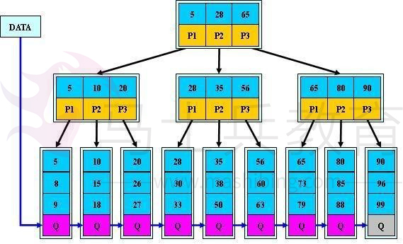
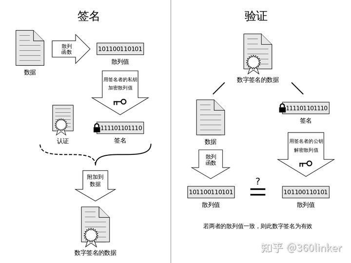
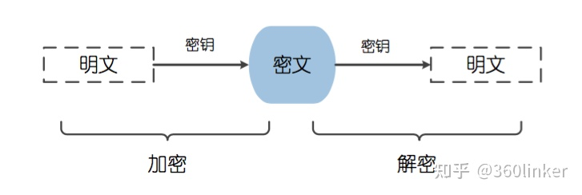
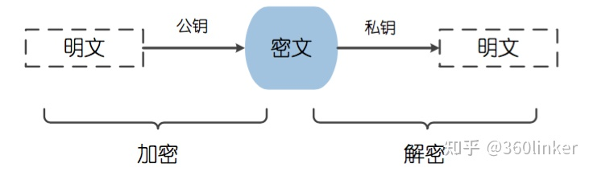
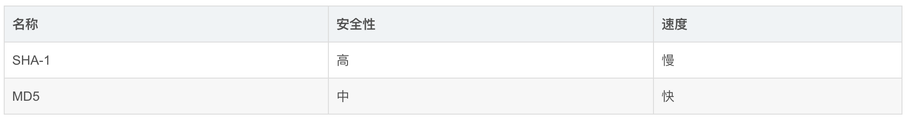
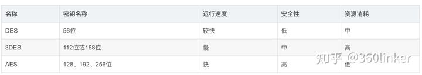
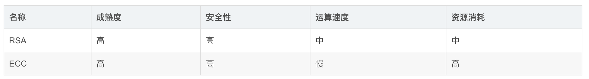

# Algorithm

## 红黑树和AVL树的区别

- 红黑树和AVL树都是平衡二叉树：避免树退化到链表
- 区别：两个树的触发旋转的条件不同
  - 红黑树：最长路径是最短路径的2倍：旋转的频率相对较低
  - AVL树：最长路径和最短路径差不能大于1：旋转的频率相对较高


# Sorting

## 二分查找 

又叫折半查找，要求待查找的序列有序。每次取中间位置的值与待查关键字比较，如果中间位置的值比待查关键字大，则在前半部分循环这个查找的过程，如果中间位置的值比待查关键字小，则在后半部分循环这个查找的过程。直到查找到了为止，否则序列中没有待查的关键字。

```
  public static int biSearch(int []array,int a){    
  int lo=0;    
  int hi=array.length-1;    
  int mid;       
  while(lo<=hi){         
  mid=(lo+hi)/2;//中间位置       
  if(array[mid]==a){           
  return mid+1; 
            }else if(array[mid]<a){ //向右查找         
            lo=mid+1;         
            }else{ //向左查找          
            hi=mid-1; 
            } 
        }     
        return -1; 
    } 

```

## 冒泡排序算法 

（1）比较前后相邻的二个数据，如果前面数据大于后面的数据，就将这二个数据交换。

（2）这样对数组的第 0 个数据到 N-1 个数据进行一次遍历后，最大的一个数据就“沉”到数组第

N-1 个位置。 

（3）N=N-1，如果 N 不为 0 就重复前面二步，否则排序完成。 

```
public static void bubbleSort1(int [] a, int n){  
int i, j; 
for(i=0; i<n; i++){//表示 n 次排序过程。
for(j=1; j<n-i; j++){
if(a[j-1] > a[j]){//前面的数字大于后面的数字就交换
//交换 a[j-1]和 a[j]
int temp; temp = a[j-1]; a[j-1] = a[j]; a[j]=temp;
}
}
}
}
```

## **插入排序****算法**

通过构建有序序列，对于未排序数据，在已排序序列中从后向前扫描，找到相应的位置并插入。插入排序非常类似于整扑克牌。在开始摸牌时，左手是空的，牌面朝下放在桌上。接着，一次从桌上摸起一张牌，并将它插入到左手一把牌中的正确位置上。为了找到这张牌的正确位置，要将它与手中已有的牌从右到左地进行比较。无论什么时候，左手中的牌都是排好序的。

如果输入数组已经是排好序的话，插入排序出现最佳情况，其运行时间是输入规模的一个线性函数。如果输入数组是逆序排列的，将出现最坏情况。平均情况与最坏情况一样，其时间代价是(n2)。


```
 public void sort(int arr[])
  { 
            for(int i =1; i<arr.length;i++) 
            { 
                //插入的数            
                int insertVal = arr[i]; 
                //被插入的位置(准备和前一个数比较) 
                int index = i-1; 
                        //如果插入的数比被插入的数小 
                        while(index>=0&&insertVal<arr[index]) 
                        { 
                            //将把 arr[index] 向后移动                             arr[index+1]=arr[index]; 
                            //让 index 向前移动 
                            index--; 
                        } 
                        //把插入的数放入合适位置 
                arr[index+1]=insertVal; 
            } 
  } 

```

##    快速排序算法 

快速排序的原理：选择一个关键值作为基准值。比基准值小的都在左边序列（一般是无序的），比基准值大的都在右边（一般是无序的）。一般选择序列的第一个元素。

一次循环：从后往前比较，用基准值和最后一个值比较，如果比基准值小的交换位置，如果没有继续比较下一个，直到找到第一个比基准值小的值才交换。找到这个值之后，又从前往后开始比较，如果有比基准值大的，交换位置，如果没有继续比较下一个，直到找到第一个比基准值大的值才交换。直到从前往后的比较索引>从后往前比较的索引，结束第一次循环，此时，对于基准值来说，左右两边就是有序的了。

```
   public void sort(int[] a,int low,int high){       
   int start = low;       
   int end = high; 
          int key = a[low];         
          while(end>start){          
          //从后往前比较             
          while(end>start&&a[end]>=key)  
 //如果没有比关键值小的，比较下一个，直到有比关键值小的交换位置，然后又从前往后比较 
              end--;       
              if(a[end]<=key){      
              int temp = a[end];       
              a[end] = a[start];        
              a[start] = temp; 
             } 
             //从前往后比较        
             while(end>start&&a[start]<=key) 
//如果没有比关键值大的，比较下一个，直到有比关键值大的交换位置 
                start++;        
                if(a[start]>=key){      
                int temp = a[start];  
                a[start] = a[end]; 
                a[end] = temp; 
             } 
         //此时第一次循环比较结束，关键值的位置已经确定了。左边的值都比关键值小，右边的值都比关键值大，但是两边的顺序还有可能是不一样的，进行下面的递归调用 
         } 
         //递归 
         if(start>low) sort(a,low,start-1);//左边序列。第一个索引位置到关键值索引-1          if(end<high) sort(a,end+1,high);//右边序列。从关键值索引+1 到最后一个 
     } 
   } 

```


## **希尔排序算法** 

基本思想：先将整个待排序的记录序列分割成为若干子序列分别进行直接插入排序，待整个序列中的记录“基本有序”时，再对全体记录进行依次直接插入排序。 

1.   操作方法：

选择一个增量序列 t1，t2，…，tk，其中 ti>tj，tk=1； 

2.   按增量序列个数 k，对序列进行 k 趟排序； 

3.   每趟排序，根据对应的增量 ti，将待排序列分割成若干长度为 m 的子序列，分别对各子表进行直接插入排序。仅增量因子为1 时，整个序列作为一个表来处理，表长度即为整个序列的长度。 


```
 private void shellSort(int[] a) { 
 	 	 int dk = a.length/2;   	
         while( dk >= 1  ){   
 	               ShellInsertSort(a, dk);    	     
                   dk = dk/2; 
 	 	 } 
 	} 
 	private void ShellInsertSort(int[] a, int dk) { 
//类似插入排序，只是插入排序增量是 1，这里增量是 dk,把 1 换成 dk 就可以了 
 	 	for(int i=dk;i<a.length;i++){ 
 	 	 	if(a[i]<a[i-dk]){ 
 	 	 	 	int j; 
 	 	 	 	int x=a[i];//x 为待插入元素  	 	 
                a[i]=a[i-dk]; 
 	 	 	 	for(j=i-dk;  j>=0 && x<a[j];j=j-dk){ 
//通过循环，逐个后移一位找到要插入的位置。 
 	 	 	 	 	a[j+dk]=a[j]; 
 	 	 	 	} 
 	 	 	 	a[j+dk]=x;//插入 
 	 	 	} 
 	 	} 
 	} 

```

## 归并排序算法 

归并（Merge）排序法是将两个（或两个以上）有序表合并成一个新的有序表，即把待排序序列分为若干个子序列，每个子序列是有序的。然后再把有序子序列合并为整体有序序列。


```
   *   
*	@param data  
*	数组对象  
*	@param left  
*	左数组的第一个元素的索引  
*	@param center  
*	左数组的最后一个元素的索引，center+1 是右数组第一个元素的索引  
*	@param right  
*	右数组最后一个元素的索引  
     */   
    public static void merge(int[] data, int left, int center, int right) {   
        // 临时数组           int[] tmpArr = new int[data.length];   
        // 右数组第一个元素索引   
        int mid = center + 1;   
        // third 记录临时数组的索引   
        int third = left;   
        // 缓存左数组第一个元素的索引   
        int tmp = left;           while (left <= center && mid <= right) {   
            // 从两个数组中取出最小的放入临时数组   
            if (data[left] <= data[mid]) {                   tmpArr[third++] = data[left++];   
            } else {   
                tmpArr[third++] = data[mid++];   
            }   
        }   
        // 剩余部分依次放入临时数组（实际上两个 while 只会执行其中一个）   
        while (mid <= right) {               tmpArr[third++] = data[mid++];   
public class MergeSortTest {   
public static void main(String[] args) {        
int[] data = new int[] { 5, 3, 6, 2, 1, 9, 4, 8, 7 };           print(data);       
mergeSort(data);   
        System.out.println("排序后的数组：");   
        print(data);   
    }   
     public static void mergeSort(int[] data) {       
     sort(data, 0, data.length - 1);   
    }   
      public static void sort(int[] data, int left, int right) {           if (left >= right)          
      return;   
        // 找出中间索引   
        int center = (left + right) / 2;   
        // 对左边数组进行递归   
        sort(data, left, center);   
        // 对右边数组进行递归   
        sort(data, center + 1, right);   
        // 合并      
        merge(data, left, center, right);     
        print(data);   
    }   
      /**  
     * 将两个数组进行归并，归并前面 2 个数组已有序，归并后依然有序  
   *   
*	@param data  
*	数组对象  
*	@param left  
*	左数组的第一个元素的索引  
*	@param center  
*	左数组的最后一个元素的索引，center+1 是右数组第一个元素的索引  
*	@param right  
*	右数组最后一个元素的索引  
     */   
    public static void merge(int[] data, int left, int center, int right) {   
        // 临时数组           int[] tmpArr = new int[data.length];   
        // 右数组第一个元素索引   
        int mid = center + 1;   
        // third 记录临时数组的索引   
        int third = left;   
        // 缓存左数组第一个元素的索引   
        int tmp = left;        
        while (left <= center && mid <= right) {   
            // 从两个数组中取出最小的放入临时数组   
            if (data[left] <= data[mid]) {                   tmpArr[third++] = data[left++];   
            } else {   
                tmpArr[third++] = data[mid++];   
            }   
        }   
        // 剩余部分依次放入临时数组（实际上两个 while 只会执行其中一个）   
        while (mid <= right) {            
        tmpArr[third++] = data[mid++];   
               }   
        while (left <= center) {          
        tmpArr[third++] = data[left++];   
        }   
        // 将临时数组中的内容拷贝回原数组中   
        // （原 left-right 范围的内容被复制回原数组）   
        while (tmp <= right) {           
        data[tmp] = tmpArr[tmp++];   
        }   
    }   
    public static void print(int[] data) {        
    for (int i = 0; i < data.length; i++) {   
            System.out.print(data[i] + "\t");   
        }   
        System.out.println();   
    }   
  }   
```

## 桶排序算法 

桶排序的基本思想是： 把数组 arr 划分为 n 个大小相同子区间（桶），每个子区间各自排序，最后合并 。计数排序是桶排序的一种特殊情况，可以把计数排序当成每个桶里只有一个元素的情况。

1.找出待排序数组中的最大值 max、最小值 min 

2.我们使用 动态数组 ArrayList 作为桶，桶里放的元素也用 ArrayList 存储。桶的数量为(maxmin)/arr.length+1

3.遍历数组 arr，计算每个元素 arr[i] 放的桶 

4.每个桶各自排序 

```
  public static void bucketSort(int[] arr){ 
    
  int max = Integer.MIN_VALUE;  
  int min = Integer.MAX_VALUE; 
  for(int i = 0; i < arr.length; i++){ 
 max = Math.max(max, arr[i]);    
 min = Math.min(min, arr[i]); 
  } 
   //创建桶 
  int bucketNum = (max - min) / arr.length + 1; 
  ArrayList<ArrayList<Integer>> bucketArr = new ArrayList<>(bucketNum);   for(int i = 0; i < bucketNum; i++){   
  bucketArr.add(new ArrayList<Integer>()); 
  } 
     //将每个元素放入桶 
  for(int i = 0; i < arr.length; i++){   
  int num = (arr[i] - min) / (arr.length);     bucketArr.get(num).add(arr[i]); 
  } 
     //对每个桶进行排序 
  for(int i = 0; i < bucketArr.size(); i++){ 
    Collections.sort(bucketArr.get(i)); 
  } 
 } 
 
```

## 基数排序算法 

将所有待比较数值（正整数）统一为同样的数位长度，数位较短的数前面补零。然后，从最低位开始，依次进行一次排序。这样从最低位排序一直到最高位排序完成以后,数列就变成一个有序序列。 

```
 public class radixSort {     
 inta[]={49,38,65,97,76,13,27,49,78,34,12,64,5,4,62,99,98,54,101,56,17,18,23,34,15,35,2
5,53,51};       
public radixSort(){      
sort(a);   
       for(inti=0;i<a.length;i++){                 System.out.println(a[i]);   
       }   
    }          
    public  void sort(int[] array){     
       //首先确定排序的趟数;     
       int max=array[0];         
       for(inti=1;i<array.length;i++){           
       if(array[i]>max){     
             max=array[i];     
            }     
       }     
       int time=0;            //判断位数;            while(max>0){               max/=10;                time++;     
       }    
        //建立 10 个队列;     
       List<ArrayList> queue=newArrayList<ArrayList>();            for(int i=0;i<10;i++){     
              ArrayList<Integer>queue1=new ArrayList<Integer>();              queue.add(queue1);     
       }     
          //进行 time 次分配和收集;     
       for(int i=0;i<time;i++){                //分配数组元素;               for(intj=0;j<array.length;j++){     
               //得到数字的第 time+1 位数;   
                 int x=array[j]%(int)Math.pow(10,i+1)/(int)Math.pow(10, i);                    ArrayList<Integer>queue2=queue.get(x);                    queue2.add(array[j]);                    queue.set(x, queue2);   
          }    
          int count=0;//元素计数器;     
          //收集队列元素;               for(int k=0;k<10;k++){                  while(queue.get(k).size()>0){   
                   ArrayList<Integer>queue3=queue.get(k);                      array[count]=queue3.get(0);                        queue3.remove(0);                      count++;   
               }    
          }     
       }                
    }   
} 

```

## 剪枝算法 

在搜索算法中优化中，剪枝，就是通过某种判断，避免一些不必要的遍历过程，形象的说，就是剪去了搜索树中的某些“枝条”，故称剪枝。应用剪枝优化的核心问题是设计剪枝判断方法，即确定哪些枝条应当舍弃，哪些枝条应当保留的方法。


## 回溯算法 

回溯算法实际上一个类似枚举的搜索尝试过程，主要是在搜索尝试过程中寻找问题的解，当发现已不满足求解条件时，就“回溯”返回，尝试别的路径。 

## 最短路径算法 

从某顶点出发，沿图的边到达另一顶点所经过的路径中，各边上权值之和最小的一条路径叫做最短路径。解决最短路的问题有以下算法，Dijkstra 算法，Bellman-Ford 算法，Floyd 算法和 SPFA 算法等。 

## 最大子数组算法 

 

## 最长公共子序算法 

## 最小生成树算法 

现在假设有一个很实际的问题：我们要在 n 个城市中建立一个通信网络，则连通这 n 个城市需要布置 n-1 一条通信线路，这个时候我们需要考虑如何在成本最低的情况下建立这个通信网？ 

于是我们就可以引入连通图来解决我们遇到的问题，n 个城市就是图上的 n 个顶点，然后，边表示两个城市的通信线路，每条边上的权重就是我们搭建这条线路所需要的成本，所以现在我们有n个顶点的连通网可以建立不同的生成树，每一颗生成树都可以作为一个通信网，当我们构造这个连通网所花的成本最小时，搭建该连通网的生成树，就称为最小生成树。构造最小生成树有很多算法，但是他们都是利用了最小生成树的同一种性质：MST 性质（假设

N=(V,{E})是一个连通网，U 是顶点集 V 的一个非空子集，如果（u，v）是一条具有最小权值的边，其中 u 属于U，v 属于V-U，则必定存在一颗包含边（u，v）的最小生成树），下面就介绍两种使用 MST 性质生成最小生成树的算法：普里姆算法和克鲁斯卡尔算法。 


# Data Structure

##  栈（**stack**） 

栈（stack）是限制插入和删除只能在一个位置上进行的表，该位置是表的末端，叫做栈顶（top）。它是后进先出（LIFO）的。对栈的基本操作只有 push（进栈）和 pop（出栈）两种，前者相当于插入，后者相当于删除最后的元素。 


## 队列（**queue**） 

队列是一种特殊的线性表,特殊之处在于它只允许在表的前端（front）进行删除操作，而在表的后端（rear）进行插入操作，和栈一样，队列是一种操作受限制的线性表。进行插入操作的端称为队尾，进行删除操作的端称为队头。


## 链表（**Link**） 

链表是一种数据结构，和数组同级。比如，Java 中我们使用的 ArrayList，其实现原理是数组。而LinkedList 的实现原理就是链表了。链表在进行循环遍历时效率不高，但是插入和删除时优势明显。


##  散列表（**Hash Table**） 

散列表（Hash table，也叫哈希表）是一种查找算法，与链表、树等算法不同的是，散列表算法在查找时不需要进行一系列和关键字（关键字是数据元素中某个数据项的值，用以标识一个数据元素）的比较操作。 

散列表算法希望能尽量做到不经过任何比较，通过一次存取就能得到所查找的数据元素，因而必须要在数据元素的存储位置和它的关键字（可用key表示）之间建立一个确定的对应关系，使每个关键字和散列表中一个唯一的存储位置相对应。因此在查找时，只要根据这个对应关系找到给定关键字在散列表中的位置即可。这种对应关系被称为散列函数(可用 h(key)表示)。

用的构造散列函数的方法有： 

（1）直接定址法： 取关键字或关键字的某个线性函数值为散列地址。 

即：h(key) = key  或 h(key) = a * key + b，其中 a 和 b 为常数。 

 

（2）数字分析法

（3）平方取值法： 取关键字平方后的中间几位为散列地址。 

（4）折叠法：将关键字分割成位数相同的几部分，然后取这几部分的叠加和作为散列地址。

（5）除留余数法：取关键字被某个不大于散列表表长 m 的数 p 除后所得的余数为散列地址，即：h(key) = key MOD p  p ≤ m 

（6）随机数法：选择一个随机函数，取关键字的随机函数值为它的散列地址，即：h(key) = random(key) 

## 排序二叉树 

首先如果普通二叉树每个节点满足：左子树所有节点值小于它的根节点值，且右子树所有节点值大于它的根节点值，则这样的二叉树就是排序二叉树。

**插入操作** 

首先要从根节点开始往下找到自己要插入的位置（即新节点的父节点）；具体流程是：新节点与当前节点比较，如果相同则表示已经存在且不能再重复插入；如果小于当前节点，则到左子树中寻找，如果左子树为空则当前节点为要找的父节点，新节点插入到当前节点的左子树即可；如果大于当前节点，则到右子树中寻找，如果右子树为空则当前节点为要找的父节点，新节点插入到当前节点的右子树即可。


**删除操作** 

删除操作主要分为三种情况，即要删除的节点无子节点，要删除的节点只有一个子节点，要删除的节点有两个子节点。 

1.   对于要删除的节点无子节点可以直接删除，即让其父节点将该子节点置空即可。

2.   对于要删除的节点只有一个子节点，则替换要删除的节点为其子节点。

3.   对于要删除的节点有两个子节点，则首先找该节点的替换节点（即右子树中最小的节点），接着替换要删除的节点为替换节点，然后删除替换节点。 


 **查询操作** 

查找操作的主要流程为：先和根节点比较，如果相同就返回，如果小于根节点则到左子树中递归查找，如果大于根节点则到右子树中递归查找。因此在排序二叉树中可以很容易获取最大（最右最深子节点）和最小（最左最深子节点）值。

## 红黑树 

R-B Tree，全称是 Red-Black Tree，又称为“红黑树”，它一种特殊的二叉查找树。红黑树的每个节点上都有存储位表示节点的颜色，可以是红(Red)或黑(Black)。 

**红黑树的特性** 

（1）每个节点或者是黑色，或者是红色。

（2）根节点是黑色。

（3）每个叶子节点（NIL）是黑色。 [注意：这里叶子节点，是指为空(NIL或NULL)的叶子节点！] 

（4）如果一个节点是红色的，则它的子节点必须是黑色的。

（5）从一个节点到该节点的子孙节点的所有路径上包含相同数目的黑节点。

**左旋** 

对 x 进行左旋，意味着，将“x 的右孩子”设为“x 的父亲节点”；即，将 x 变成了一个左节点(x 成了为 z 的左孩子)。 因此，左旋中的“左”，意味着“被旋转的节点将变成一个左节点”。


```
LEFT-ROTATE(T, x)   
 y ← right[x]         
 // 前提：这里假设 x 的右孩子为 y。下面开始正式操作  right[x] ← left[y]    
 // 将 “y 的左孩子” 设为 “x 的右孩子”，即 将β设为 x 的右孩子  p[left[y]] ← x         
 // 将 “x” 设为 “y 的左孩子的父亲”，即 将β的父亲设为 x  p[y] ← p[x]             
 // 将 “x 的父亲” 设为 “y 的父亲” 
 if p[x] = nil[T]        
 then root[T] ← y             
 // 情况 1：如果 “x 的父亲” 是空节点，则将 y 设为根节点 
 else if x = left[p[x]]   
           then left[p[x]] ← y  
           // 情况 2：如果 x 是它父节点的左孩子，则将 y 设为“x 的父节点的左孩子” 
           else right[p[x]] ← y  
           // 情况 3：(x 是它父节点的右孩子) 将 y 设为“x 的父节点的右孩子” 
 left[y] ← x           
 // 将 “x” 设为 “y 的左孩子”  p[x] ← y             
 // 将 “x 的父节点” 设为 “y” 

```


 **右旋** 

对 x 进行右旋，意味着，将“x 的左孩子”设为“x 的父亲节点”；即，将 x 变成了一个右节点(x 成了为 y 的右孩子)！ 因此，右旋中的“右”，意味着“被旋转的节点将变成一个右节点”。


```
  RIGHT-ROTATE(T, y)
 x ← left[y]          
 // 前提：这里假设 y 的左孩子为 x。下面开始正式操作  left[y] ← right[x]   
 // 将 “x 的右孩子” 设为 “y 的左孩子”，即 将β设为 y 的左孩子  p[right[x]] ← y       
 // 将 “y” 设为 “x 的右孩子的父亲”，即 将β的父亲设为 y  p[x] ← p[y]             
 // 将 “y 的父亲” 设为 “x 的父亲” 
 if p[y] = nil[T]        
 then root[T] ← x             
 // 情况 1：如果 “y 的父亲” 是空节点，则将 x 设为根节点 
 else if y = right[p[y]]   
           then right[p[y]] ← x  
           // 情况 2：如果 y 是它父节点的右孩子，则将 x 设为“y 的父节点的左孩子” 
           else left[p[y]] ← x   
           // 情况 3：(y 是它父节点的左孩子) 将 x 设为“y 的父节点的左孩子” 
 right[x] ← y         
 // 将 “y” 设为 “x 的右孩子”  p[y] ← x        
 // 将 “y 的父节点” 设为 “x” 

```

**添加** 

第一步: 将红黑树当作一颗二叉查找树，将节点插入。 

第二步：将插入的节点着色为"红色"。 

 根据被插入节点的父节点的情况，可以将"当节点 z 被着色为红色节点，并插入二叉树"划分为三种情况来处理。 

① 情况说明：被插入的节点是根节点。

处理方法：直接把此节点涂为黑色。 

② 情况说明：被插入的节点的父节点是黑色。

处理方法：什么也不需要做。节点被插入后，仍然是红黑树。 

③ 情况说明：被插入的节点的父节点是红色。这种情况下，被插入节点是一定存在非空祖父节点的；进一步的讲，被插入节点也一定存在叔叔节点(即使叔叔节点为空，我们也视之为存在，空节点本身就是黑色节点)。理解这点之后，我们依据"叔叔节点的情况"，将这种情况进一步划分为 3 种情况(Case)。 


第三步: 通过一系列的旋转或着色等操作，使之重新成为一颗红黑树。 

**删除** 

第一步：将红黑树当作一颗二叉查找树，将节点删除。 

这和"删除常规二叉查找树中删除节点的方法是一样的"。分 3 种情况： 

① 被删除节点没有儿子，即为叶节点。那么，直接将该节点删除就 OK 了。 

② 被删除节点只有一个儿子。那么，直接删除该节点，并用该节点的唯一子节点顶替它的位置。

③ 被删除节点有两个儿子。那么，先找出它的后继节点；然后把“它的后继节点的内容”复制给

“该节点的内容”；之后，删除“它的后继节点”。 

 第二步：通过"旋转和重新着色"等一系列来修正该树，使之重新成为一棵红黑树。 

因为"第一步"中删除节点之后，可能会违背红黑树的特性。所以需要通过"旋转和重新着色"来修正该树，使之重新成为一棵红黑树。

选择重着色 3 种情况。 

① 情况说明：x 是“红+黑”节点。 

处理方法：直接把 x 设为黑色，结束。此时红黑树性质全部恢复。 

② 情况说明：x 是“黑+黑”节点，且 x 是根。 

处理方法：什么都不做，结束。此时红黑树性质全部恢复。 

③ 情况说明：x 是“黑+黑”节点，且 x 不是根。 

处理方法：这种情况又可以划分为 4 种子情况。这 4 种子情况如下表所示：


[红黑树之原理详解](.\子文档\红黑树之原理详解)

[红黑树(五)之 Java的实现](.\子文档\红黑树(五)之 Java的实现)

## **B-TREE** 

B-tree 又叫平衡多路查找树。一棵 m 阶的 B-tree (m 叉树)的特性如下（其中 ceil(x)是一个取上限的函数）： 

1. 树中每个结点至多有 m 个孩子； 

2.   除根结点和叶子结点外，其它每个结点至少有有 ceil(m / 2)个孩子； 

3.   若根结点不是叶子结点，则至少有2个孩子（特殊情况：没有孩子的根结点，即根结点为叶子结点，整棵树只有一个根节点）； 

4.   所有叶子结点都出现在同一层，叶子结点不包含任何关键字信息(可以看做是外部结点或查询失败的结点，实际上这些结点不存在，指向这些结点的指针都为 null)； 

5. 每个非终端结点中包含有 n 个关键字信息： (n，P0，K1，P1，K2，P2，......，Kn，Pn)。其中： 

   a)  Ki (i=1...n)为关键字，且关键字按顺序排序 K(i-1)< Ki。 

   b) Pi 为指向子树根的接点，且指针 P(i-1)指向子树种所有结点的关键字均小于 Ki，但都大于 K(i-1)。 

   c)  关键字的个数 n 必须满足： ceil(m / 2)-1 <= n <= m-1。

 


一棵 m 阶的 B+tree 和 m 阶的 B-tree 的差异在于： 

1.有 n 棵子树的结点中含有 n 个关键字； (B-tree 是 n 棵子树有 n-1 个关键字) 

2.所有的叶子结点中包含了全部关键字的信息，及指向含有这些关键字记录的指针，且叶子结点本身依关键字的大小自小而大的顺序链接。 (B-tree 的叶子节点并没有包括全部需要查找的信息) 

3.所有的非终端结点可以看成是索引部分，结点中仅含有其子树根结点中最大（或最小）关键字。

(B-tree 的非终节点也包含需要查找的有效信息) 



## 位图 

位图的原理就是用一个 bit 来标识一个数字是否存在，采用一个 bit 来存储一个数据，所以这样可以大大的节省空间。 bitmap 是很常用的数据结构，比如用于 Bloom Filter 中；用于无重复整数的排序等等。bitmap 通常基于数组来实现，数组中每个元素可以看成是一系列二进制数，所有元素组成更大的二进制集合。


# 浅析数据结构-图的基本概念


**线性表和树两类数据结构，线性表中的元素是“一对一”的关系，树中的元素是“一对多”的关系，本章所述的图结构中的元素则是“多对多”的关系。图（Graph）是一种复杂的非线性结构，在图结构中，每个元素都可以有零个或多个前驱，也可以有零个或多个后继，也就是说，元素之间的关系是任意的。**


## 一、图的定义与术语

**定义：**图（Graph）是由顶点的有穷非空集合和顶点之间边的集合组成，通常表示为：**G(V,E)**，其中，**G**表示一个图，**V**是图G中顶点的集合，**E**是图G中边的集合。

### 1、图的分类

图是按照无方向和有方向分为无向图和有向图。


左图为无向图是由顶点和边构成，右图为有向图是由顶点和弧（有向边构成）。弧有弧头和弧尾区别。

按照边分为稀疏图和稠密图，这是个模糊的概念，同样是相对的概念。

如果任意两个顶点之间都存在边叫完全图，有向的边叫有向完全图。如果无重复的边或者顶点到自身的边叫简单图。在用数学方式表示时，无向边用()表示，有向边用<>表示。现在我们讲解的图全是简单图。


左图没有重复的边或者到自身的边（简单图），右图则有。


这种边带权值的图叫网

### 2.图的顶点和边间关系

顶点的度：顶点关联边的数目。有向图图中有，入度：方向指向顶点的边；出度：方向背向顶点的边。在有向图中顶点的度就是两者之和。

路径长度：路径上边或者弧的数目。


左图中，从B到D的路径度为2，在右图中就是3了（粗线的边）。

右图中A的入度是2，出度是1；B的入度为0，出度是2.

连通

在无向图G中，任意两个顶点是相通的就是连通图。


左图不是连通图，AE之间没有连通。

## 二、图的存储结构

图的结构比价复杂，任意两个顶点之间都可能存在关系，不能用简单的顺序存储结构来表示。如果运用多重链表，即一个数据域多个指针域组成的结点表示图中一个结点，则造成大量存储单元浪费。

### 1、邻接矩阵

邻接矩阵用两个数组保存数据。一个一维数组存储图中顶点信息，一个二维数组存储图中边或弧的信息。


无向图中二维数组是个对称矩阵。

**特点：**

- 1、0表示无边，1表示有边

  2、顶点的度是行内数组之和。

  3、求取顶点邻接点，将行内元素遍历下。

  

有向图的邻接矩阵：有向图中讲究入度和出度，各行之和是出度，各列之和是入度。

带权的图叫网，用邻接矩阵表示为：


- ### 邻接矩阵对于边数相对顶点较少的图，就是对存储空间极大的浪费。

### 2、邻接表

邻接表：数组和链表相结合的存储方法为邻接表。

- 图中顶点用一个一维数组存储。

- 图中每个顶点Vi的所有邻接点构成一个线性表。


从图中得知，顶点表的各个结点由data和Firstedge两个域表示，data是数据域，存储顶点信息，firstedge是指针域，指向边表的第一个结点，即顶点的第一个邻接点。边表结点由adjvex和next两个域组成。adjvex是邻接点域，存储某顶点的邻接点在顶点表中坐标，next存储边表中下一个结点指针。比如v1顶点与v2、v0互为邻接点，则在v1边表中，adjvex分别为0和2。

有向图也可以用邻接表，出度表叫邻接表，入度表尾逆邻接表。


### 3、十字链表

在邻接表中针对有向图，分为邻接表和逆邻接表，导致无法从一个表中获取图的入读和出度的情况，有人提出了十字链表。

定点表：


其中firstin：入边表头指针，指向顶点入边表的第一个结点。

firstout：出边表头指针，指向顶点出边表第一个结点。

边表：


其中tailvex是指弧起点在顶点表的下标，headvex弧终点在顶点表的下标，headlink入边表指针域，指向终点相同的下一条边，taillink是指边表指针域，指向起点相同的下一条边。


### 4、邻接多重表

邻接多重表结构如图：


ivex和jvex是与某条边依附的两个顶点在顶点表中的下标。ilink指向依附项点ivex的下一条边，jlink指向依附顶点jvex的下一条边。

 

## 三 、代码实现

```
#include <iostream>

#define  MAXVEX 100      //最大顶点数
#define INFINITY 65535   //最大权值

typedef int EdgeType;    //权值类型自己定义
typedef char VertexType;  //顶点类型自己定义
#pragma once

#pragma region 邻接矩阵结构体
typedef struct 
{
    VertexType vex[MAXVEX];   //顶点表
    EdgeType arg[MAXVEX][MAXVEX];  ///权值表-邻接矩阵
    int numVertexes,numEdges;  //图中的边数和顶点数
}GraphArray;

#pragma endregion

#pragma region 邻接表结构体
//边表结点
typedef struct EdgeNode
{
    int nNodevex;     //邻接点的点表中结点的坐标
    EdgeType nNodeWeight;   //用于网图中边的权值
    EdgeNode* next;       //链域，指向下一个邻接点
}EdgeNode,*pEdgeNode;
//顶点表结点
typedef struct VertexNode
{
    VertexType nNodeData;   //顶点表中存储的数据
    pEdgeNode pFirstNode;   //顶点表和边表中关联指针，指向边表头指针

}VertexNode,pVertexNode,VertexList[MAXVEX];
//图结构
typedef struct
{
    VertexList vertexList;
    int numVertess,numEdges;
}GraphList;

#pragma endregion

class GraphData
{
public:
    GraphData(void);
    ~GraphData(void);
    #pragma region 创建邻接矩阵
    void CreateGraphArray(GraphArray* pGraphArray,int numVer,int numEdegs);
    int GetGraphLocation(GraphArray* pGraphArrray,char chpoint);
    #pragma endregion

    #pragma region 创建邻接表
    void CreateGraphList(GraphList* pList,int numVer,int numEdegs);
    int GetGraphListLocation(GraphList* pList,char chpoint);
    #pragma endregion

};

Graphdata.h
```

```
#include "GraphData.h"


GraphData::GraphData(void)
{
}


GraphData::~GraphData(void)
{
}

int GraphData::GetGraphLocation(GraphArray* pGraphArrray,char chpoint)
{
    int i = 0;
    for (i = 0;i< pGraphArrray->numVertexes;i++)
    {
        if (pGraphArrray->vex[i] == chpoint)
        {
            break;;
        }
    }
    if (i >= pGraphArrray->numVertexes)
    {
        return -1;
    }
    return i;
}
/// <summary>
/// 创建邻接矩阵
/// </summary>        
void GraphData::CreateGraphArray(GraphArray* pGraphArray,int numVer,int numEdegs)
{
    int weight = 0;
    pGraphArray->numVertexes = numVer;
    pGraphArray->numEdges = numEdegs;
    
    //创建顶点表
    for (int i= 0; i < numVer;i++)
    {
        pGraphArray->vex[i] = getchar();
        while(pGraphArray->vex[i] == '\n')
        {
            pGraphArray->vex[i] = getchar();
        }
    }

    //创建邻接表的边矩阵
    for (int i = 0; i < numEdegs; i++)
    {
        for (int j = 0;j < numEdegs ; j++)
        {
            pGraphArray->arg[i][j] = INFINITY;
        }        
    }
    for(int k = 0; k < pGraphArray->numEdges; k++)
    {
        char p, q;
        printf("输入边(vi,vj)上的下标i，下标j和权值:\n");

        p = getchar();
        while(p == '\n')
        {
            p = getchar();
        }
        q = getchar();
        while(q == '\n')
        {
            q = getchar();
        }
        scanf("%d", &weight);    

        int m = -1;
        int n = -1;
        m = GetGraphLocation(pGraphArray, p);
        n = GetGraphLocation(pGraphArray, q);
        if(n == -1 || m == -1)
        {
            fprintf(stderr, "there is no this vertex.\n");
            return;
        }
        //getchar();
        pGraphArray->arg[m][n] = weight;
        pGraphArray->arg[n][m] = weight;  //因为是无向图，矩阵对称
    }
    
}

#pragma region
void GraphData::CreateGraphList(GraphList* pList,int numVer,int numEdegs)
{
    int weight = 0;
    GraphList *pGraphList = pList;
    pGraphList->numVertess = numVer;
    pGraphList->numEdges = numEdegs;
    EdgeNode* firstNode,*secondNode;
    //创建顶点表
    for (int i= 0; i < numVer;i++)
    {
        pGraphList->vertexList[i].nNodeData = getchar();
        pGraphList->vertexList[i].pFirstNode = NULL;
        while(pGraphList->vertexList[i].nNodeData == '\n')
        {
            pGraphList->vertexList[i].nNodeData = getchar();
        }
    }

    //创建边表    
    for(int k = 0; k < pGraphList->numEdges; k++)
    {
        char p, q;
        printf("输入边(vi,vj)上的下标i，下标j和权值:\n");

        p = getchar();
        while(p == '\n')
        {
            p = getchar();
        }
        q = getchar();
        while(q == '\n')
        {
            q = getchar();
        }
        scanf("%d", &weight);    

        int m = -1;
        int n = -1;
        m = GetGraphListLocation(pGraphList, p);
        n = GetGraphListLocation(pGraphList, q);
        if(n == -1 || m == -1)
        {
            fprintf(stderr, "there is no this vertex.\n");
            return;
        }
        //getchar();
        //字符p在顶点表的坐标为m，与坐标n的结点建立联系权重为weight
        firstNode = new EdgeNode();
        firstNode->nNodevex = n;
        firstNode->next = pGraphList->vertexList[m].pFirstNode;
        firstNode->nNodeWeight = weight;
        pGraphList->vertexList[m].pFirstNode = firstNode;

        //第二个字符second
        secondNode = new EdgeNode();
        secondNode->nNodevex = m;
        secondNode->next = pGraphList->vertexList[n].pFirstNode;
        secondNode->nNodeWeight = weight;
        pGraphList->vertexList[n].pFirstNode = secondNode;

    }
}

int GraphData::GetGraphListLocation(GraphList* pList,char chpoint)
{
    GraphList *pGraphList = pList;
    int i = 0;
    for (i = 0;i< pGraphList->numVertess;i++)
    {
        if (pGraphList->vertexList[i].nNodeData == chpoint)
        {
            break;;
        }
    }
    if (i >= pGraphList->numVertess)
    {
        return -1;
    }
    return i;
}

#pragma endregion

GraphData.cpp
```

```
#include <iostream>
#include "GraphData.h"
using namespace std;
//

void PrintGrgph(GraphList *pGraphList)
{
    int i =0;
    while(pGraphList->vertexList[i].pFirstNode != NULL && i<MAXVEX)
    {
        printf("顶点:%c  ",pGraphList->vertexList[i].nNodeData);
        EdgeNode *e = NULL;
        e = pGraphList->vertexList[i].pFirstNode;
        while(e != NULL)
        {
            printf("%d  ", e->nNodevex);
            e = e->next;
        }
        i++;
        printf("\n");
    }
    
}
int main()
{
    int numVexs,numEdges;
    GraphData* pTestGraph = new GraphData();
    GraphArray graphArray;
    GraphArray* pGraphArray = &graphArray;
    GraphList* pGgraphList = new GraphList();
    
    cout<<"输入顶点数和边数"<<endl;
    cin>>numVexs>>numEdges;
    cout<<"顶点数和边数为："<<numVexs<<numEdges<<endl;

    /*pTestGraph->CreateGraphArray(pGraphArray,numVexs,numEdges);
    for(int i = 0; i< numEdges;i++)
    {
        for (int j = 0;j< numEdges;j++)
        {
            cout<<pGraphArray->arg[i][j];
        }
        cout<<endl;
    }*/
    pTestGraph->CreateGraphList(pGgraphList,numVexs,numEdges);
    PrintGrgph(pGgraphList);
    system("pause");
}

TestGraph
```

# Encrypt Methods

原文链接：[浅谈常见的七种加密算法及实现](https://zhuanlan.zhihu.com/p/347114235)

## 前言

**数字签名**、**信息加密** 是前后端开发都经常需要使用到的技术，应用场景包括了用户登入、交易、信息通讯、`oauth` 等等，不同的应用场景也会需要使用到不同的签名加密算法，或者需要搭配不一样的 **签名加密算法** 来达到业务目标。这里简单的给大家介绍几种常见的签名加密算法和一些典型场景下的应用。

## 数字签名

**数字签名**，简单来说就是通过提供 **可鉴别** 的 **数字信息** 验证 **自身身份** 的一种方式。一套 **数字签名** 通常定义两种 **互补** 的运算，一个用于 **签名**，另一个用于 **验证**。分别由 **发送者** 持有能够 **代表自己身份** 的 **私钥** (私钥不可泄露),由 **接受者** 持有与私钥对应的 **公钥** ，能够在 **接受** 到来自发送者信息时用于 **验证** 其身份。





> **注意**：图中 **加密过程** 有别于 **公钥加密**，更多 [介绍戳这里](https://www.zhihu.com/question/25912483)。**签名** 最根本的用途是要能够唯一 **证明发送方的身份**，防止 **中间人攻击**、`CSRF` **跨域身份伪造**。基于这一点在诸如 **设备认证**、**用户认证**、**第三方认证** 等认证体系中都会使用到 **签名算法** (彼此的实现方式可能会有差异)。

## 加密和解密

### 加密

**数据加密** 的基本过程，就是对原来为 **明文** 的文件或数据按 **某种算法** 进行处理，使其成为 **不可读** 的一段代码，通常称为 **“密文”**。通过这样的途径，来达到 **保护数据** 不被 **非法人窃取**、阅读的目的。

### 解密

**加密** 的 **逆过程** 为 **解密**，即将该 **编码信息** 转化为其 **原来数据** 的过程。

## 对称加密和非对称加密

加密算法分 **对称加密** 和 **非对称加密**，其中对称加密算法的加密与解密 **密钥相同**，非对称加密算法的加密密钥与解密 **密钥不同**，此外，还有一类 **不需要密钥** 的 **散列算法**。

> 常见的 **对称加密** 算法主要有 `DES`、`3DES`、`AES` 等，常见的 **非对称算法** 主要有 `RSA`、`DSA` 等，**散列算法** 主要有 `SHA-1`、`MD5` 等。

### 对称加密

**对称加密算法** 是应用较早的加密算法，又称为 **共享密钥加密算法**。在 **对称加密算法** 中，使用的密钥只有一个，**发送** 和 **接收** 双方都使用这个密钥对数据进行 **加密** 和 **解密**。这就要求加密和解密方事先都必须知道加密的密钥。





1. 数据加密过程：在对称加密算法中，**数据发送方** 将 **明文** (原始数据) 和 **加密密钥** 一起经过特殊 **加密处理**，生成复杂的 **加密密文** 进行发送。
2. 数据解密过程：**数据接收方** 收到密文后，若想读取原数据，则需要使用 **加密使用的密钥** 及相同算法的 **逆算法** 对加密的密文进行解密，才能使其恢复成 **可读明文**。

### 非对称加密

**非对称加密算法**，又称为 **公开密钥加密算法**。它需要两个密钥，一个称为 **公开密钥** (`public key`)，即 **公钥**，另一个称为 **私有密钥** (`private key`)，即 **私钥**。

因为 **加密** 和 **解密** 使用的是两个不同的密钥，所以这种算法称为 **非对称加密算法**。





1. 如果使用 **公钥** 对数据 **进行加密**，只有用对应的 **私钥** 才能 **进行解密**。
2. 如果使用 **私钥** 对数据 **进行加密**，只有用对应的 **公钥** 才能 **进行解密**。

> **例子**：甲方生成 **一对密钥** 并将其中的一把作为 **公钥** 向其它人公开，得到该公钥的 **乙方** 使用该密钥对机密信息 **进行加密** 后再发送给甲方，甲方再使用自己保存的另一把 **专用密钥** (**私钥**)，对 **加密** 后的信息 **进行解密**。

## 常见的签名加密算法

### MD5算法

`MD5` 用的是 **哈希函数**，它的典型应用是对一段信息产生 **信息摘要**，以 **防止被篡改**。严格来说，`MD5` 不是一种 **加密算法** 而是 **摘要算法**。无论是多长的输入，`MD5` 都会输出长度为 `128bits` 的一个串 (通常用 `16` **进制** 表示为 `32` 个字符)。

```java
public static final byte[] computeMD5(byte[] content) {
    try {
        MessageDigest md5 = MessageDigest.getInstance("MD5");
        return md5.digest(content);
    } catch (NoSuchAlgorithmException e) {
        throw new RuntimeException(e);
    }
}
```

### SHA1算法

`SHA1` 是和 `MD5` 一样流行的 **消息摘要算法**，然而 `SHA1` 比 `MD5` 的 **安全性更强**。对于长度小于 `2 ^ 64` 位的消息，`SHA1` 会产生一个 `160` 位的 **消息摘要**。基于 `MD5`、`SHA1` 的信息摘要特性以及 **不可逆** (一般而言)，可以被应用在检查 **文件完整性** 以及 **数字签名** 等场景。

```java
public static byte[] computeSHA1(byte[] content) {
    try {
        MessageDigest sha1 = MessageDigest.getInstance("SHA1");
        return sha1.digest(content);
    } catch (NoSuchAlgorithmException e) {
        throw new RuntimeException(e);
    }
}
```

### HMAC算法

`HMAC` 是密钥相关的 **哈希运算消息认证码**（Hash-based Message Authentication Code），`HMAC` 运算利用 **哈希算法** (`MD5`、`SHA1` 等)，以 **一个密钥** 和 **一个消息** 为输入，生成一个 **消息摘要** 作为 **输出**。

`HMAC` **发送方** 和 **接收方** 都有的 `key` 进行计算，而没有这把 `key` 的第三方，则是 **无法计算** 出正确的 **散列值**的，这样就可以 **防止数据被篡改**。

```java
package net.pocrd.util;
import net.pocrd.annotation.NotThreadSafe;
import net.pocrd.define.ConstField;
import org.slf4j.Logger;
import org.slf4j.LoggerFactory;
import javax.crypto.Mac;
import javax.crypto.SecretKey;
import javax.crypto.spec.SecretKeySpec;
import java.util.Arrays;


@NotThreadSafe
public class HMacHelper {
    private static final Logger logger = LoggerFactory.getLogger(HMacHelper.class);
    private Mac mac;

    /**
     * MAC算法可选以下多种算法
     * HmacMD5/HmacSHA1/HmacSHA256/HmacSHA384/HmacSHA512
     */
    private static final String KEY_MAC = "HmacMD5";
    public HMacHelper(String key) {
        try {
            SecretKey secretKey = new SecretKeySpec(key.getBytes(ConstField.UTF8), KEY_MAC);
            mac = Mac.getInstance(secretKey.getAlgorithm());
            mac.init(secretKey);
        } catch (Exception e) {
            logger.error("create hmac helper failed.", e);
        }
    }
    public byte[] sign(byte[] content) {
        return mac.doFinal(content);
    }

    public boolean verify(byte[] signature, byte[] content) {
        try {
            byte[] result = mac.doFinal(content);
            return Arrays.equals(signature, result);
        } catch (Exception e) {
            logger.error("verify sig failed.", e);
        }
        return false;
    }
}
```

> **测试结论**：`HMAC` 算法实例在 **多线程环境** 下是 **不安全的**。但是需要在 **多线程访问** 时，进行同步的辅助类，使用 `ThreadLocal` 为 **每个线程缓存** 一个实例可以避免进行锁操作。

### AES/DES/3DES算法

`AES`、`DES`、`3DES` 都是 **对称** 的 **块加密算法**，**加解密** 的过程是 **可逆的**。常用的有 `AES128`、`AES192`、`AES256` (默认安装的 `JDK` 尚不支持 `AES256`，需要安装对应的 `jce` 补丁进行升级 `jce1.7`，`jce1.8`)。

### DES算法

`DES` 加密算法是一种 **分组密码**，以 `64` 位为 **分组对数据** 加密，它的 **密钥长度** 是 `56` 位，**加密解密** 用 **同一算法**。

`DES` 加密算法是对 **密钥** 进行保密，而 **公开算法**，包括加密和解密算法。这样，只有掌握了和发送方 **相同密钥** 的人才能解读由 `DES`加密算法加密的密文数据。因此，破译 `DES` 加密算法实际上就是 **搜索密钥的编码**。对于 `56` 位长度的 **密钥** 来说，如果用 **穷举法** 来进行搜索的话，其运算次数为 `2 ^ 56` 次。

### DES算法

是基于 `DES` 的 **对称算法**，对 **一块数据** 用 **三个不同的密钥** 进行 **三次加密**，**强度更高**。

### AES算法

`AES` 加密算法是密码学中的 **高级加密标准**，该加密算法采用 **对称分组密码体制**，密钥长度的最少支持为 `128` 位、 `192` 位、`256` 位，分组长度 `128` 位，算法应易于各种硬件和软件实现。这种加密算法是美国联邦政府采用的 **区块加密标准**。

`AES` 本身就是为了取代 `DES` 的，`AES` 具有更好的 **安全性**、**效率** 和 **灵活性**。

```java
import net.pocrd.annotation.NotThreadSafe;
import javax.crypto.Cipher;
import javax.crypto.KeyGenerator;
import javax.crypto.spec.IvParameterSpec;
import javax.crypto.spec.SecretKeySpec;
import java.security.SecureRandom;

@NotThreadSafe
public class AesHelper {
    private SecretKeySpec keySpec;
    private IvParameterSpec iv;

    public AesHelper(byte[] aesKey, byte[] iv) {
        if (aesKey == null || aesKey.length < 16 || (iv != null && iv.length < 16)) {
            throw new RuntimeException("错误的初始密钥");
        }
        if (iv == null) {
            iv = Md5Util.compute(aesKey);
        }
        keySpec = new SecretKeySpec(aesKey, "AES");
        this.iv = new IvParameterSpec(iv);
    }

    public AesHelper(byte[] aesKey) {
        if (aesKey == null || aesKey.length < 16) {
            throw new RuntimeException("错误的初始密钥");
        }
        keySpec = new SecretKeySpec(aesKey, "AES");
        this.iv = new IvParameterSpec(Md5Util.compute(aesKey));
    }

    public byte[] encrypt(byte[] data) {
        byte[] result = null;
        Cipher cipher = null;
        try {
            cipher = Cipher.getInstance("AES/CFB/NoPadding");
            cipher.init(Cipher.ENCRYPT_MODE, keySpec, iv);
            result = cipher.doFinal(data);
        } catch (Exception e) {
            throw new RuntimeException(e);
        }
        return result;
    }

    public byte[] decrypt(byte[] secret) {
        byte[] result = null;
        Cipher cipher = null;
        try {
            cipher = Cipher.getInstance("AES/CFB/NoPadding");
            cipher.init(Cipher.DECRYPT_MODE, keySpec, iv);
            result = cipher.doFinal(secret);
        } catch (Exception e) {
            throw new RuntimeException(e);
        }
        return result;
    }

    public static byte[] randomKey(int size) {
        byte[] result = null;
        try {
            KeyGenerator gen = KeyGenerator.getInstance("AES");
            gen.init(size, new SecureRandom());
            result = gen.generateKey().getEncoded();
        } catch (Exception e) {
            throw new RuntimeException(e);
        }
        return result;
    }
}
```

### RSA算法

`RSA` 加密算法是目前最有影响力的 **公钥加密算法**，并且被普遍认为是目前 **最优秀的公钥方案** 之一。`RSA` 是第一个能同时用于 **加密** 和 **数字签名** 的算法，它能够 **抵抗** 到目前为止已知的 **所有密码攻击**，已被 `ISO` 推荐为公钥数据加密标准。

> `RSA` **加密算法** 基于一个十分简单的数论事实：将两个大 **素数** 相乘十分容易，但想要对其乘积进行 **因式分解** 却极其困难，因此可以将 **乘积** 公开作为 **加密密钥**。

```java
import net.pocrd.annotation.NotThreadSafe;
import org.bouncycastle.jce.provider.BouncyCastleProvider;
import org.slf4j.Logger;
import org.slf4j.LoggerFactory;
import javax.crypto.Cipher;
import java.io.ByteArrayOutputStream;
import java.security.KeyFactory;
import java.security.Security;
import java.security.Signature;
import java.security.interfaces.RSAPrivateCrtKey;
import java.security.interfaces.RSAPublicKey;
import java.security.spec.PKCS8EncodedKeySpec;
import java.security.spec.X509EncodedKeySpec;

@NotThreadSafe
public class RsaHelper {
    private static final Logger logger = LoggerFactory.getLogger(RsaHelper.class);
    private RSAPublicKey publicKey;
    private RSAPrivateCrtKey privateKey;

    static {
        Security.addProvider(new BouncyCastleProvider()); //使用bouncycastle作为加密算法实现
    }

    public RsaHelper(String publicKey, String privateKey) {
        this(Base64Util.decode(publicKey), Base64Util.decode(privateKey));
    }

    public RsaHelper(byte[] publicKey, byte[] privateKey) {
        try {
            KeyFactory keyFactory = KeyFactory.getInstance("RSA");
            if (publicKey != null && publicKey.length > 0) {
                this.publicKey = (RSAPublicKey)keyFactory.generatePublic(new X509EncodedKeySpec(publicKey));
            }
            if (privateKey != null && privateKey.length > 0) {
                this.privateKey = (RSAPrivateCrtKey)keyFactory.generatePrivate(new PKCS8EncodedKeySpec(privateKey));
            }
        } catch (Exception e) {
            throw new RuntimeException(e);
        }
    }

    public RsaHelper(String publicKey) {
        this(Base64Util.decode(publicKey));
    }

    public RsaHelper(byte[] publicKey) {
        try {
            KeyFactory keyFactory = KeyFactory.getInstance("RSA");
            if (publicKey != null && publicKey.length > 0) {
                this.publicKey = (RSAPublicKey)keyFactory.generatePublic(new X509EncodedKeySpec(publicKey));
            }
        } catch (Exception e) {
            throw new RuntimeException(e);
        }
    }

    public byte[] encrypt(byte[] content) {
        if (publicKey == null) {
            throw new RuntimeException("public key is null.");
        }

        if (content == null) {
            return null;
        }

        try {
            Cipher cipher = Cipher.getInstance("RSA/ECB/PKCS1Padding");
            cipher.init(Cipher.ENCRYPT_MODE, publicKey);
            int size = publicKey.getModulus().bitLength() / 8 - 11;
            ByteArrayOutputStream baos = new ByteArrayOutputStream((content.length + size - 1) / size * (size + 11));
            int left = 0;
            for (int i = 0; i < content.length; ) {
                left = content.length - i;
                if (left > size) {
                    cipher.update(content, i, size);
                    i += size;
                } else {
                    cipher.update(content, i, left);
                    i += left;
                }
                baos.write(cipher.doFinal());
            }
            return baos.toByteArray();
        } catch (Exception e) {
            throw new RuntimeException(e);
        }
    }

    public byte[] decrypt(byte[] secret) {
        if (privateKey == null) {
            throw new RuntimeException("private key is null.");
        }

        if (secret == null) {
            return null;
        }

        try {
            Cipher cipher = Cipher.getInstance("RSA/ECB/PKCS1Padding");
            cipher.init(Cipher.DECRYPT_MODE, privateKey);
            int size = privateKey.getModulus().bitLength() / 8;
            ByteArrayOutputStream baos = new ByteArrayOutputStream((secret.length + size - 12) / (size - 11) * size);
            int left = 0;
            for (int i = 0; i < secret.length; ) {
                left = secret.length - i;
                if (left > size) {
                    cipher.update(secret, i, size);
                    i += size;
                } else {
                    cipher.update(secret, i, left);
                    i += left;
                }
                baos.write(cipher.doFinal());
            }
            return baos.toByteArray();
        } catch (Exception e) {
            logger.error("rsa decrypt failed.", e);
        }
        return null;
    }

    public byte[] sign(byte[] content) {
        if (privateKey == null) {
            throw new RuntimeException("private key is null.");
        }
        if (content == null) {
            return null;
        }
        try {
            Signature signature = Signature.getInstance("SHA1WithRSA");
            signature.initSign(privateKey);
            signature.update(content);
            return signature.sign();
        } catch (Exception e) {
            throw new RuntimeException(e);
        }
    }

    public boolean verify(byte[] sign, byte[] content) {
        if (publicKey == null) {
            throw new RuntimeException("public key is null.");
        }
        if (sign == null || content == null) {
            return false;
        }
        try {
            Signature signature = Signature.getInstance("SHA1WithRSA");
            signature.initVerify(publicKey);
            signature.update(content);
            return signature.verify(sign);
        } catch (Exception e) {
            logger.error("rsa verify failed.", e);
        }
        return false;
    }
}
```

### ECC算法

`ECC` 也是一种 **非对称加密算法**，主要优势是在某些情况下，它比其他的方法使用 **更小的密钥**，比如 `RSA` **加密算法**，提供 **相当的或更高等级** 的安全级别。不过一个缺点是 **加密和解密操作** 的实现比其他机制 **时间长** (相比 `RSA` 算法，该算法对 `CPU` 消耗严重)。

```java
import net.pocrd.annotation.NotThreadSafe;
import org.bouncycastle.jcajce.provider.asymmetric.ec.BCECPrivateKey;
import org.bouncycastle.jcajce.provider.asymmetric.ec.BCECPublicKey;
import org.bouncycastle.jce.provider.BouncyCastleProvider;
import org.slf4j.Logger;
import org.slf4j.LoggerFactory;
import javax.crypto.Cipher;
import java.io.ByteArrayOutputStream;
import java.security.KeyFactory;
import java.security.Security;
import java.security.Signature;
import java.security.spec.PKCS8EncodedKeySpec;
import java.security.spec.X509EncodedKeySpec;

@NotThreadSafe
public class EccHelper {
    private static final Logger logger = LoggerFactory.getLogger(EccHelper.class);
    private static final int SIZE = 4096;
    private BCECPublicKey  publicKey;
    private BCECPrivateKey privateKey;

    static {
        Security.addProvider(new BouncyCastleProvider());
    }

    public EccHelper(String publicKey, String privateKey) {
        this(Base64Util.decode(publicKey), Base64Util.decode(privateKey));
    }

    public EccHelper(byte[] publicKey, byte[] privateKey) {
        try {
            KeyFactory keyFactory = KeyFactory.getInstance("EC", "BC");
            if (publicKey != null && publicKey.length > 0) {
                this.publicKey = (BCECPublicKey)keyFactory.generatePublic(new X509EncodedKeySpec(publicKey));
            }
            if (privateKey != null && privateKey.length > 0) {
                this.privateKey = (BCECPrivateKey)keyFactory.generatePrivate(new PKCS8EncodedKeySpec(privateKey));
            }
        } catch (ClassCastException e) {
            throw new RuntimeException("", e);
        } catch (Exception e) {
            throw new RuntimeException(e);
        }
    }

    public EccHelper(String publicKey) {
        this(Base64Util.decode(publicKey));
    }

    public EccHelper(byte[] publicKey) {
        try {
            KeyFactory keyFactory = KeyFactory.getInstance("EC", "BC");
            if (publicKey != null && publicKey.length > 0) {
                this.publicKey = (BCECPublicKey)keyFactory.generatePublic(new X509EncodedKeySpec(publicKey));
            }
        } catch (Exception e) {
            throw new RuntimeException(e);
        }
    }

    public byte[] encrypt(byte[] content) {
        if (publicKey == null) {
            throw new RuntimeException("public key is null.");
        }
        try {
            Cipher cipher = Cipher.getInstance("ECIES", "BC");
            cipher.init(Cipher.ENCRYPT_MODE, publicKey);
            int size = SIZE;
            ByteArrayOutputStream baos = new ByteArrayOutputStream((content.length + size - 1) / size * (size + 45));
            int left = 0;
            for (int i = 0; i < content.length; ) {
                left = content.length - i;
                if (left > size) {
                    cipher.update(content, i, size);
                    i += size;
                } else {
                    cipher.update(content, i, left);
                    i += left;
                }
                baos.write(cipher.doFinal());
            }
            return baos.toByteArray();
        } catch (Exception e) {
            throw new RuntimeException(e);
        }
    }

    public byte[] decrypt(byte[] secret) {
        if (privateKey == null) {
            throw new RuntimeException("private key is null.");
        }
        try {
            Cipher cipher = Cipher.getInstance("ECIES", "BC");
            cipher.init(Cipher.DECRYPT_MODE, privateKey);
            int size = SIZE + 45;
            ByteArrayOutputStream baos = new ByteArrayOutputStream((secret.length + size + 44) / (size + 45) * size);
            int left = 0;
            for (int i = 0; i < secret.length; ) {
                left = secret.length - i;
                if (left > size) {
                    cipher.update(secret, i, size);
                    i += size;
                } else {
                    cipher.update(secret, i, left);
                    i += left;
                }
                baos.write(cipher.doFinal());
            }
            return baos.toByteArray();
        } catch (Exception e) {
            logger.error("ecc decrypt failed.", e);
        }
        return null;
    }

    public byte[] sign(byte[] content) {
        if (privateKey == null) {
            throw new RuntimeException("private key is null.");
        }
        try {
            Signature signature = Signature.getInstance("SHA1withECDSA", "BC");
            signature.initSign(privateKey);
            signature.update(content);
            return signature.sign();
        } catch (Exception e) {
            throw new RuntimeException(e);
        }
    }

    public boolean verify(byte[] sign, byte[] content) {
        if (publicKey == null) {
            throw new RuntimeException("public key is null.");
        }
        try {
            Signature signature = Signature.getInstance("SHA1withECDSA", "BC");
            signature.initVerify(publicKey);
            signature.update(content);
            return signature.verify(sign);
        } catch (Exception e) {
            logger.error("ecc verify failed.", e);
        }
        return false;
    }
}
```

## 各种加密算法对比

### 散列算法比较



### 对称加密算法比较



### 非对称加密算法比较




### 对称算法与非对称加密算法

### 对称算法

1. **密钥管理**：比较难，不适合互联网，一般用于内部系统
2. **安全性**：中
3. **加密速度**：快好 **几个数量级** (软件加解密速度至少快 `100` 倍，每秒可以加解密数 `M`**比特** 数据)，适合大数据量的加解密处理

### 非对称算法

1. **密钥管理**：密钥容易管理
2. **安全性**：高
3. **加密速度**：比较慢，适合 **小数据量** 加解密或数据签名

## 小结

本文介绍了 **数字签名**，**加密和解密**，**对称加密和非对称加密**，然后详细介绍了 `MD5`，`SHA-1`，`HMAC`，`DES/AES`，`RSA` 和 `ECC` 这几种加密算法和代码示例。
