# 浏览器请求过程

原文：[浏览器输入「xxxxhub」的背后.....](https://mp.weixin.qq.com/s/6KjzU1rML6Jd454QIkPsAQ)

本文将以 Web 页面的请求历程为例，来和你聊聊计算机网络中这些协议是怎样工作的、数据包是怎么收发的，从输入 URL 、敲击回车到最终完成页面呈现在你面前的这个过程。

首先，我打开了 Web Browser ，然后在 Google 浏览器 URL 地址栏中输入了**maps.google.com**。然后 ……

## 查找 DNS 缓存

**DNS**：Domain Name System， 是一个分布式的数据库，它用于维护网址 URL 到其 IP 地址的映射关系，每台服务器只维护一部分 IP 地址到网络地址的映射，没有任何一台服务器能够维持全部的映射关系。

三种 DNS 服务器：**根 DNS 服务器**、**顶级域(Top-Level Domain, TLD) DNS 服务器**和**权威 DNS 服务器**

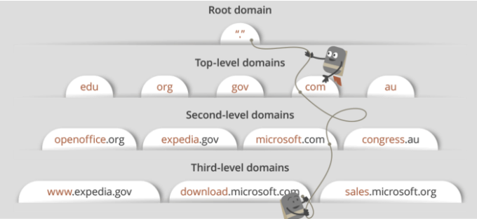

- **根 DNS 服务器**，有 400 多个根域名服务器遍及全世界，这些根域名服务器由 13 个不同的组织管理。根域名服务器的清单和组织机构可以在 https://root-servers.org/ 中找到，根域名服务器提供 TLD 服务器的 IP 地址。
- **顶级域 DNS 服务器**，对于每个顶级域名比如 com、org、net、edu 和 gov 和所有的国家级域名 uk、fr、ca 和 jp 都有 TLD 服务器或服务器集群。所有的顶级域列表参见 https://tld-list.com/ 。TDL 服务器提供了权威 DNS 服务器的 IP 地址。
- **权威 DNS 服务器**，在因特网上具有公共可访问的主机，如 Web 服务器和邮件服务器，这些主机的组织机构必须提供可供访问的 DNS 记录，这些记录将这些主机的名字映射为 IP 地址。一个组织机构的权威 DNS 服务器收藏了这些 DNS 记录。

浏览器在这个阶段会检查四个地方是否存在缓存：

1. 浏览器缓存
   - windows通过**chrome://net-internals/#dns**在Chrome中查看， mac 中中使用**nslookup**命令查看
2. 操作系统缓存
   - 通过系统调用实现，在 Linux 和大部分 UNIX 系统上，除非安装了 nscd(Linux 系统上的一种名称服务缓存程序)，否则操作系统可能没有 DNS 缓存
3. 路由器缓存
4. ISP缓存

如果以上的地方都没有，那就发起DNS查询

## DNS查询

DNS 的查询方式主要分为三种：

1. 递归查询：在递归查询中，DNS 客户端要求 DNS 服务器（一般为 DNS 递归解析器）将使用所请求的资源记录响应客户端，或者如果解析器无法找到该记录，则返回错误消息。

   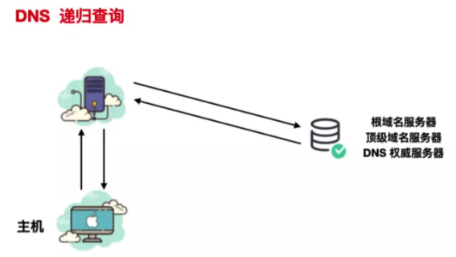

2. 迭代查询：在迭代查询中，如果所查询的 DNS 服务器与查询名称不匹配，则其将返回对较低级别域名空间具有权威性的 DNS 服务器的引用。然后，DNS 客户端将对引用地址进行查询。此过程继续使用查询链中的其他 DNS 服务器，直至发生错误或超时为止。

   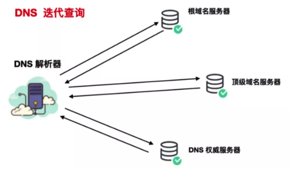

3. 非递归查询

上面负责开始 DNS 查找的介质就是**DNS 解析器**，它一般是 ISP 维护的 DNS 服务器，它的主要职责就是通过向网络中其他 DNS 服务器询问正确的 IP 地址。

所以对于 maps.google.com 这个域名来说，如果 ISP 维护的服务器没有 DNS 缓存记录，它就会向 DNS 根服务器地址发起查询，根名称服务器会将其重定向到 .com 顶级域名服务器。.com 顶级域名服务器会将其重定向到google.com 权威服务器。google.com 名称服务器将在其 DNS 记录中找到 maps.google.com 匹配的 IP 地址，并将其返回给您的 DNS 解析器，然后将其发送回你的浏览器。

这里值得注意的是，DNS 查询报文会经过许多路由器和设备才会达到根域名等服务器，每经过一个设备或者路由器都会使用**路由表**来确定哪种路径是数据包达到目的地最快的选择。这里面涉及到路由选择算法，如果小伙伴们想要了解路由选择算法，可以看看这篇文章 https://www.cisco.com/c/en/us/support/docs/ip/border-gateway-protocol-bgp/13753-25.html#anc3

## ARP 请求

ARP 协议的全称是**Address Resolution Protocol(地址解析协议)**，它是一个通过**用于实现从 IP 地址到 MAC 地址的映射，即询问目标 IP 对应的 MAC 地址**的一种协议。

简而言之，ARP 就是一种解决地址问题的协议，它以 IP 地址为线索，定位下一个应该接收数据分包的主机 MAC 地址。如果目标主机不在同一个链路上，那么会查找下一跳路由器的 MAC 地址。

> 关于为什么有了 IP 地址，还要有 MAC 地址概述可以参看知乎[这个回答](https://www.zhihu.com/question/21546408)

### 什么时候需要发送 ARP 请求

这里其实有个前提条件

- 如果 DNS 服务器和我们的主机在同一个子网内，系统会按照下面的 ARP 过程对 DNS 服务器进行 ARP 查询
- 如果 DNS 服务器和我们的主机在不同的子网，系统会按照下面的 ARP 过程对默认网关进行查询

### ARP工作流程

#### 同一局域网 ARP 的大致工作流程

假设 A 和 B 位于同一链路，不需要经过路由器的转换，主机 A 向主机 B 发送一个 IP 分组，主机 A 的地址是 192.168.1.2 ，主机 B 的地址是 192.168.1.3，它们都不知道对方的 MAC 地址是啥，主机 C 和 主机 D 是同一链路的其他主机。

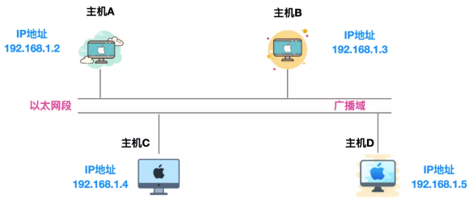

主机 A 想要获取主机 B 的 MAC 地址，通过主机 A 会通过**广播**的方式向以太网上的所有主机发送一个**ARP 请求包**，这个 ARP 请求包中包含了主机 A 想要知道的主机 B 的 IP 地址。

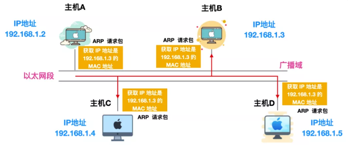

主机 A 发送的 ARP 请求包会被同一链路上的所有主机/路由器接收并进行解析。每个主机/路由器都会检查 ARP 请求包中的信息，如果 ARP 请求包中的**目标 IP 地址**和自己的相同，就会将自己主机的 MAC 地址写入响应包返回主机 A

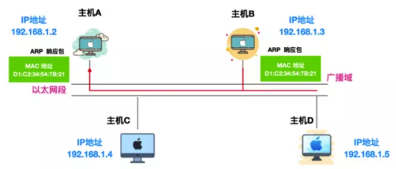

由此，可以通过 ARP 从 IP 地址获取 MAC 地址，实现同一链路内的通信。

#### 如果是不同链路怎么办

这就要使用到**ARP代理**了，通常 ARP 会被路由器隔离，但是采用ARP代理 (ARP Proxy) 的路由器可以将 ARP 请求转发给临近的网段。使多个网段中的节点像是在同一网段内通信。

这里会涉及到**ARP 缓存**的概念。

现在你知道了发送一次 IP 分组前通过发送一次 ARP 请求就能够确定 MAC 地址。那么是不是每发送一次都得经过广播 -> 封装 ARP 响应 -> 返回给主机这一系列流程呢？

想想看，浏览器是如何做的？浏览器内置了缓存能够缓存你最近经常使用的地址，那么 ARP 也是一样的。ARP 高效运行的关键就是维护每个主机和路由器上的**ARP 缓存表**。这个缓存维护着每个 IP 到 MAC 地址的映射关系。通过把第一次 ARP 获取到的 MAC 地址作为 IP 对 MAC 的映射关系到一个 ARP 缓存表中，下一次再向这个地址发送数据报时就不再需要重新发送 ARP 请求了，而是直接使用这个缓存表中的 MAC 地址进行数据报的发送。每发送一次 ARP 请求，缓存表中对应的映射关系都会被清除。

通过 ARP 缓存，降低了网络流量的使用，在一定程度上防止了 ARP 的大量广播。

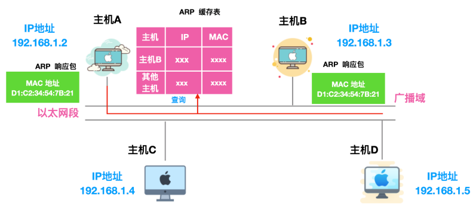

一般来说，发送过一次 ARP 请求后，再次发送相同请求的几率比较大，因此使用 ARP 缓存能够减少 ARP 包的发送，除此之外，不仅仅 ARP 请求的发送方能够缓存 ARP 接收方的 MAC 地址，接收方也能够缓存 ARP 请求方的 IP 和 MAC 地址，如下所示

不过，**MAC 地址的缓存有一定期限，超过这个期限后，缓存的内容会被清除**。

所以，浏览器会首先查询 ARP 缓存，如果缓存命中，我们返回结果：目标 IP = MAC。

如果缓存没有命中：

- 查看路由表，看看目标 IP 地址是不是在本地路由表中的某个子网内。是的话，使用跟那个子网相连的接口，否则使用与默认网关相连的接口。
- 查询选择的网络接口的 MAC 地址
- 我们发送一个数据链路层的 ARP 请求：

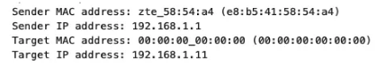

根据连接主机和路由器的硬件类型不同，可以分为以下几种情况：

直连：

- 如果我们和路由器是直接连接的，路由器会返回一个**ARP Reply**（见下面）。

集线器：

- 如果我们连接到一个集线器，集线器会把 ARP 请求向所有其它端口广播，如果路由器也连接在其中，它会返回一个**ARP Reply**。

交换机：

- 如果我们连接到了一个交换机，交换机会检查本地 CAM/MAC 表，看看哪个端口有我们要找的那个 MAC 地址，如果没有找到，交换机会向所有其它端口广播这个 ARP 请求。
- 如果交换机的 MAC/CAM 表中有对应的条目，交换机会向有我们想要查询的 MAC 地址的那个端口发送 ARP 请求
- 如果路由器也**连接**在其中，它会返回一个**ARP Reply**

**ARP Reply**:

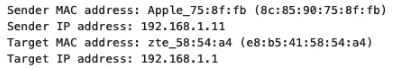

现在我们有了 DNS 服务器或者默认网关的 IP 地址，我们可以继续 DNS 请求了：

- 使用 53 端口向 DNS 服务器发送 UDP 请求包，如果响应包太大，会使用 TCP 协议
- 如果本地/ISP DNS 服务器没有找到结果，它会发送一个递归查询请求，一层一层向高层 DNS 服务器做查询，直到查询到起始授权机构，如果找到会把结果返回。

（上述均来自：https://github.com/skyline75489/what-happens-when-zh_CN#dns）

------

## TCP请求处理过程

浏览器得到目标服务器的 IP 地址后，根据 URL 中的端口可以知道端口号 （http 协议默认端口号是 80， https 默认端口号是 443），会准备 TCP 数据包。数据包的封装会经过下面的层层处理，数据到达目标主机后，目标主机会解析数据包，完整的请求和解析过程如下。

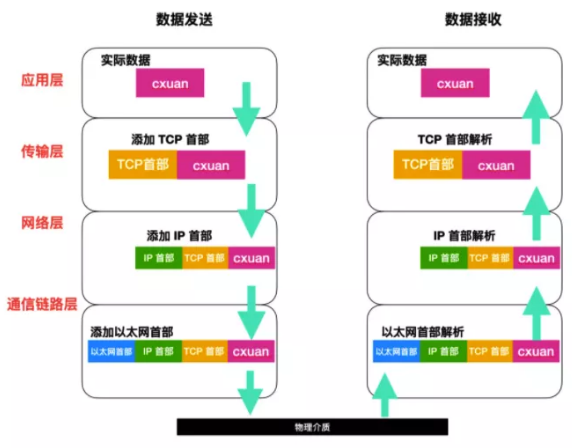

### 浏览器与目标服务器建立 TCP 连接

在经过上述 DNS 和 ARP 查找流程后，浏览器就会收到一个目标服务器的 IP 和 MAC地址，然后浏览器将会和目标服务器建立连接来传输信息。这里可以使用很多种 Internet 协议，但是 HTTP 协议建立连接所使用的运输层协议是 TCP 协议。所以这一步骤是浏览器与目标服务器建立 TCP 连接的过程。

TCP 的连接建立需要经过 TCP/IP 的三次握手，三次握手的过程其实就是浏览器和服务器交换 SYN 同步和 ACK 确认消息的过程。

假设图中左端是客户端主机，右端是服务端主机，一开始，两端都处于**CLOSED（关闭）**状态。

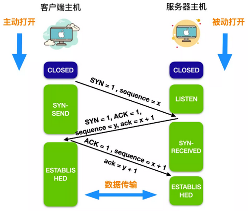

1. 服务端进程准备好接收来自外部的 TCP 连接。然后服务端进程处于**LISTEN**状态，等待客户端连接请求。
2. 客户端向服务器发出连接请求，请求中首部同步位 SYN = 1，同时选择一个初始序号 sequence ，简写 seq = x。SYN 报文段不允许携带数据，只消耗一个序号。此时，客户端进入**SYN-SEND**状态。
3. 服务器收到客户端连接后，，需要确认客户端的报文段。在确认报文段中，把 SYN 和 ACK 位都置为 1 。确认号是 ack = x + 1，同时也为自己选择一个初始序号 seq = y。请注意，这个报文段也不能携带数据，但同样要消耗掉一个序号。此时，TCP 服务器进入**SYN-RECEIVED(同步收到)**状态。
4. 客户端在收到服务器发出的响应后，还需要给出确认连接。确认连接中的 ACK 置为 1 ，序号为 seq = x + 1，确认号为 ack = y + 1。TCP 规定，这个报文段可以携带数据也可以不携带数据，如果不携带数据，那么下一个数据报文段的序号仍是 seq = x + 1。这时，客户端进入**ESTABLISHED (已连接)**状态
5. 服务器收到客户的确认后，也进入**ESTABLISHED**状态。

这样三次握手建立连接的阶段就完成了，双方可以直接通信了。

### 浏览器发送 HTTP 请求到 web 服务器

一旦 TCP 连接建立完成后，就开始直接传输数据办正事了！此时浏览器会发送**GET**请求，要求目标服务器提供 maps.google.com 的网页，如果你填写的是表单，则发起的是**POST**请求，在 HTTP 中，GET 请求和 POST 请求是最常见的两种请求，基本上占据了所有 HTTP 请求的九成以上。

除了请求类型外，HTTP 请求还包含很多很多信息，最常见的有 Host、Connection 、User-agent、Accept-language 等

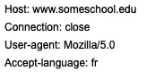

首先 Host 表示的是对象所在的主机。**Connection: close**表示的是浏览器需要告诉服务器使用的是**非持久连接**。它要求服务器在发送完响应的对象后就关闭连接。**User-agent**: 这是请求头用来告诉 Web 服务器，浏览器使用的类型是**Mozilla/5.0**，即 Firefox 浏览器。**Accept-language**告诉 Web 服务器，浏览器想要得到对象的法语版本，前提是服务器需要支持法语类型，否则将会发送服务器的默认版本。下面我们针对主要的实体字段进行介绍（具体的可以参考 https://developer.mozilla.org/zh-CN/docs/Web/HTTP/Headers MDN 官网学习）

HTTP 的请求标头分为四种：**通用标头**、**请求标头**、**响应标头**和**实体标头**。

### 服务器处理请求并发回一个响应

这个服务器包含一个 Web 服务器，也就是 Apache 服务器，服务器会从浏览器接收请求并将其传递给请求处理程序并生成响应。

> 请求处理程序也是一个程序，它一般是用 .net 、php、ruby 等语言编写，用于读取请求，检查请求内容，cookie，必要时更新服务器上的信息的这么一个程序。它会以特定的格式比如 JSON、XML、HTML 组合响应。

### 服务器发送回一个 HTTP 响应

服务器响应包含你请求的网页以及状态代码，压缩类型（Content-Encoding），如何缓存页面（Cache-Control），要设置的 cookie，隐私信息等。

比如下面就是一个响应体

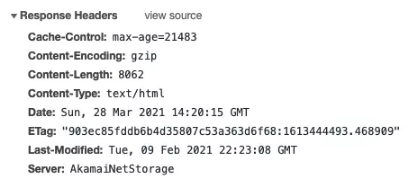

### 浏览器显示 HTML 的相关内容

浏览器会分阶段显示 HTML 内容。首先，它将渲染裸露的 HTML 骨架。然后它将检查 HTML 标记并发送 GET 请求以获取网页上的其他元素，例如图像，CSS 样式表，JavaScript 文件等。这些静态文件由浏览器缓存，因此你再次访问该页面时，不用重新再请求一次。最后，您会看到 maps.google.com 显示的内容出现在你的浏览器中。

# IP地址与Mac地址

## IP地址与Mac地址

**IP地址**工作在**TCP/IP**参考模型的第三层网络层，专注于网络层，将数据包从一个网络转发到另外一个网络；标识两个计算机网络地址信息。

**MAC地址**专注于数据链路层，将一个数据帧从一个节点传送到相同链路的另一个节点。负责表示计算机的数据链路层地址。

定位网络中的计算机的位置，最常用的有**域名地址**、**IP地址**、**MAC地址**三种方式，它们分别对应于OSI模型中的**应用层**、**网络层**、**数据链接层**。通常IP地址是不断变化的，而MAC地址是计算机的物理网卡唯一对应的地址，好比每个人都有唯一对应的身份证号码一样具有唯一性。

### MAC地址

MAC（Media Access Control，介质访问控制）地址，也叫硬件地址，长度是48比特（6字节），由16进制的数字组成，分为前24位和后24位：

**前24位**叫做组织唯一标志符（Organizationally Unique Identifier，即OUI），是由IEEE的注册管理机构给不同厂家分配的代码，区分了不同的厂家。

**后24位**是由厂家自己分配的，称为扩展标识符。同一个厂家生产的网卡中MAC地址后24位是不同的。

**MAC地址**对应于OSI参考模型的第二层**数据链路层**，工作在数据链路层的**交换机**维护着计算机**MAC地址和自身端口**的数据库，交换机根据收到的数据帧中的**目的MAC地址**字段来转发数据帧。

### IP地址和MAC地址的作用

当客户端与服务端建立连接后，客户端发送的数据包会通过交换机层层投递直到到达服务器。

IP地址主要维护请求最终要达到的目标

MAC地址维护下一条地址

可以理解为IP地址就是一个宏伟的总目标，而Mac地址是这个宏伟目标每一步锁要达到的小目标

这些小目标都达到了，总目标也就达到了

