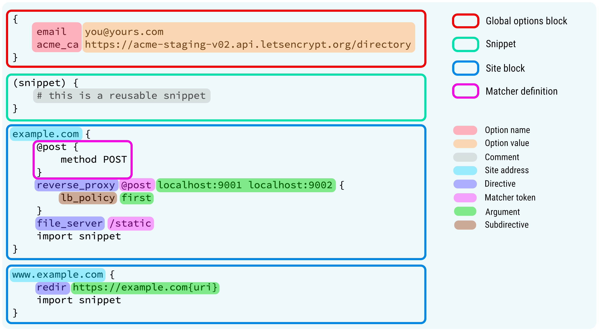

# Caddy

> **推荐**
>
>  [Caddy | 飞雪无情的博客 (flysnow.org)](https://www.flysnow.org/categories/Caddy/)
>
> [【Caddy2】最新Caddy2配置文件解析 - 詩 - 博客园 (cnblogs.com)](https://www.cnblogs.com/billyme/p/16116791.html)

## 安装

### Debian, Ubuntu, Raspbian

```sh
sudo apt install -y debian-keyring debian-archive-keyring apt-transport-https
curl -1sLf 'https://dl.cloudsmith.io/public/caddy/stable/gpg.key' | sudo gpg --dearmor -o /usr/share/keyrings/caddy-stable-archive-keyring.gpg
curl -1sLf 'https://dl.cloudsmith.io/public/caddy/stable/debian.deb.txt' | sudo tee /etc/apt/sources.list.d/caddy-stable.list
sudo apt update
sudo apt install caddy
```

```sh
wget -N –no-check-certificate https://raw.githubusercontent.com/iiiiiii1/doubi/master/caddy_install.sh && chmod +x caddy_install.sh && bash caddy_install.sh

#备用地址
wget -N –no-check-certificate https://www.moerats.com/usr/shell/Caddy/caddy_install.sh && chmod +x caddy_install.sh && bash caddy_install.sh

/etc/init.d/caddy status
```

### Fedora, RedHat, CentOS

#### Fedora or RHEL/CentOS 8

```sh
dnf install 'dnf-command(copr)'
dnf copr enable @caddy/caddy
dnf install caddy
```

#### RHEL/CentOS 7:

```sh
yum install yum-plugin-copr
yum copr enable @caddy/caddy
yum install caddy
```

### Arch Linux, Manjaro, Parabola

```sh
pacman -Syu caddy
```

## Caddyfile语法规范

这部分内容大部分来自这里: [动手撸个Caddy（十一）| Caddyfile 设计之美](https://www.flysnow.org/2021/09/05/caddy-in-action-caddyfile)

> Caddy的默认配置文件: /etc/caddy/Caddyfile

### Caddyfile语法结构



| 关键字               | 解释               | 使用                                                         |
| -------------------- | ------------------ | ------------------------------------------------------------ |
| Global options block | 服务器全局配置     | 可用于配置是否启用HTTPS和Admin API等                         |
| Snippet              | 可以复用的配置片段 | 定义好后认可以通过import关键字引用                           |
| Site Block           | 单个网站配置       | 通过file_server可以配置静态代理，通过reverse_proxy可以配置动态代理 |
| Matcher definition   | 匹配定义           | 默认情况下指令会产生全局影响，通过它可以指定影响范围         |
| Comment              | 注释               | 使用#符号开头                                                |
| Site address         | 网站地址           | 默认使用HTTPS，如需开启HTTP，需要指定http://开头             |
| Directive            | 指令               | 指令赋予了Caddy强大的功能                                    |

> 注意点:
>
> 1. 左大括号 `{` 必须在行的末尾，而右大括号 `}` 则必须自己单独占一行
> 2. 如果只有一个站点,那么花括号就省去了,但是当有多个站点的时候，必须得用大括号把他们分开
>
>    ```
>    localhost {
>    	reverse_proxy /api/* localhost:9001
>    	file_server
>    }
>    ```
>
> 3. 途中包含了匹配器的简单定义的用法, 更多匹配器的用法: https://caddyserver.com/docs/caddyfile/matchers
>

#### Snippet

这里有个Snippet,给个[例子](https://www.flysnow.org/2021/09/05/caddy-in-action-caddyfile),这个是个多站点配置的例子

```
(static_file){
  root * /var/www/mysite
  file_server 
}

test1.example.com{
  import static_file
}
test2.example.com{
  import static_file
}
```

#### Directives

指令只能属于某个站点，它是定义站点服务的关键字，位于一行中的第一个单词比如我们示例中的 `file_server` 就是一个定义静态文件服务的指令

指令也可以有子指令，子指令位于指令块中，用于进一步的配置，比如我们在反向代理文章中用到的负载均衡策略子指令

```
localhost
reverse_proxy localhost:9000 localhost:9001 {
	lb_policy first
}
```

其中`lb_policy` 就是 `reverse_proxy` 的子指令， `first` 是子指令`lb_policy` 的参数

#### Site address

Caddy基本上支持所有的地址样式，如下常用示例：

```
localhost
example.com
:443
http://example.com
localhost:8080
127.0.0.1
example.com/foo/*
*.example.com
http://
```

根据地址，Caddy可以推断出站点的Scheme、Host、Port和Path

Caddy允许在地址中使用通配符(*),但是它也有严格的限制：它只用来匹配主机名比如 `*.example.com` 可以匹配 `foo.example.com` ，但不匹配 `foo.bar.example.com` 

你也可以让多个站点地址共享同一个定义，只需要使用逗号分隔这些地址即可。

```
localhost:8080, example.com, www.example.com
```

最后，地址必须唯一，不能多次指定同一个地址

#### Matcher token

通过匹配器，你可以精确的设置某个指令用于哪些请求

如果不设置，默认情况下，该指令适用于所有请求

指令后的第一个参数是匹配器，比如：

```
root *           /var/www  # matcher token: *
root /index.html /var/www  # matcher token: /index.html
root @post       /var/www  # matcher token: @post
```

`*` 表示匹配所有，这里的 `@post` 是一个定义的匹配器，可以被引用、复用

#### 占位符

在Caddyfile中，占位符的两边用大括号`{}`限定，并在其中包含变量名，例如： `{foo.bar}` 。占位符大括号可以转义， `\{like so\}` 。变量名通常用点命名，以避免模块之间的冲突

你可以在Caddyfile中使用任何Caddy占位符，但为了方便起见，您也可以使用一些等效的速记占位符：

| 速记占位符                   | 用于取代的占位符（等价）                  |
| :--------------------------- | :---------------------------------------- |
| {dir}                        | {http.request.uri.path.dir}               |
| {file}                       | {http.request.uri.path.file}              |
| {header.*}                   | {http.request.header.*}                   |
| {host}                       | {http.request.host}                       |
| {labels.*}                   | {http.request.host.labels.*}              |
| {hostport}                   | {http.request.hostport}                   |
| {port}                       | {http.request.port}                       |
| {method}                     | {http.request.method}                     |
| {path}                       | {http.request.uri.path}                   |
| {path.*}                     | {http.request.uri.path.*}                 |
| {query}                      | {http.request.uri.query}                  |
| {query.*}                    | {http.request.uri.query.*}                |
| {re.*.*}                     | {http.regexp.*.*}                         |
| {remote}                     | {http.request.remote}                     |
| {remote_host}                | {http.request.remote.host}                |
| {remote_port}                | {http.request.remote.port}                |
| {scheme}                     | {http.request.scheme}                     |
| {uri}                        | {http.request.uri}                        |
| {tls_cipher}                 | {http.request.tls.cipher_suite}           |
| {tls_version}                | {http.request.tls.version}                |
| {tls_client_fingerprint}     | {http.request.tls.client.fingerprint}     |
| {tls_client_issuer}          | {http.request.tls.client.issuer}          |
| {tls_client_serial}          | {http.request.tls.client.serial}          |
| {tls_client_subject}         | {http.request.tls.client.subject}         |
| {tls_client_certificate_pem} | {http.request.tls.client.certificate_pem} |
| {upstream_hostport}          | {http.reverse_proxy.upstream.hostport}    |

并非所有占位符在配置的所有部分都可用，哪些占位符可用取决于上下文。例如，HTTP应用程序设置的占位符仅在与处理HTTP请求相关的配置区域中可用

#### 环境变量

使用环境变量也非常简单，和占位符差不多，也是一个大括号包裹，但是多一个 `$` 符号

```
{$DOMAIN}
{$DOMAIN:localhost} # 有默认值
```


## 服务管理

启动：/etc/init.d/caddy start

停止：/etc/init.d/caddy stop

重启：/etc/init.d/caddy restart

查看状态：/etc/init.d/caddy status

查看Caddy启动日志： tail -f /tmp/caddy.log

Caddy配置文件位置：/usr/local/caddy/Caddyfile

Caddy自动申请SSL证书位置：/.caddy/acme/acme-v01.api.letsencrypt.org/sites/xxx.xxx(域名)/

如果你想要卸载Caddy，请使用下面的命令，运行后输入y即可卸载。

```sh
wget -N –no-check-certificate https://raw.githubusercontent.com/iiiiiii1/doubi/master/caddy_install.sh && bash caddy_install.sh uninstall

#备用地址
wget -N –no-check-certificate https://www.moerats.com/usr/shell/Caddy/caddy_install.sh && bash caddy_install.sh uninstall
```


## 常见用法

### 开启最简单的服务

配置文件:

```
:2015

respond "Hello, world!"
```

加载配置文件

```
caddy reload
```

访问: http://localhost:2015

> 注意:
>
> 1. 如果你的`Caddyfile`文件格式不太合格的话，会出现如下警告，直接使用`caddy fmt --overwrite`格式化并重写配置即可解决
> 2. Caddy默认是使用JSON作为配置文件的,其实就是为了自动化配置的生成,然而我们平时使用的就是Caddyfile,为了易于编写,我们可以使用`caddy adapter`命令将Caddyfile的配置转化成JSON格式, 上面访问2015端口的配置转成JSON就变成下面的模样:
>
>    ```json
>    {
>        "apps": {
>            "http": {
>                "servers": {
>                    "srv0": {
>                        "listen": [":2015"],
>                        "routes": [{
>                            "handle": [{
>                                "body": "Hello, world!",
>                                "handler": "static_response"
>                            }]
>                        }]
>                    }
>                }
>            }
>        }
>    }
>    ```

### 反向代理

#### 静态反向代理

```
http://docs.example.com {
    root * /mydata/caddy/html/docs
    file_server browse
}

http://mall.example.com {
    root * /mydata/caddy/html/mall
    file_server browse
}
```

#### 动态反向代理

```
http://api.example.com {
		reverse_proxy http://admin-api.example.com
}
```

## 高级进阶

### 文件压缩

```
http://mall.example.com {
    root * /mydata/caddy/html/mall
    encode {
        gzip
    }
    file_server browse
}
```

### 重定向

```
http://docs.example.com {
    redir http://www.example.com
}
```

### 一机多站点

```
http://www.example.com {
    route /admin/* {
        uri strip_prefix /admin
        file_server {
            root /mydata/caddy/html/admin
        }
    }
    route /app/* {
        uri strip_prefix /app
        file_server {
            root /mydata/caddy/html/app
        }
    }
    file_server * {
        root /mydata/caddy/html/www
    }
}
```

### 负载均衡

```
proxy / web1.local:80 web2.local:90 web3.local:100 { 
    policy round_robin 
}
```

## HTTPS

Caddy能自动支持HTTPS，无需手动配置证书

1. `tls` 指令告诉 caddy 为网站开启 https 并自动申请证书，后面的 email 参数是告知 CA 申请人的邮箱。caddy 会默认使用 `let's encrypt` 申请证书并续约。 
2. `tls` 也可以使用路径给出的证书 `tls /etc/ssl/cert.pem /etc/ssl/key.pem`


### 单站点

```
example.com:80
gzip
log /var/log/caddy/access.log
root /var/www
tls tls@outlook.com
```

### 单机多站点

```
example.com:80 {
    gzip
    log /var/log/caddy/access.log
    root /var/www
    tls /etc/ssl/cert.pem /etc/ssl/key.pem
}
example2.com:3000{
    gzip
    log /var/log/caddy/example2/access.log
    root /var/www/example2
    tls /etc/ssl/example2/cert.pem /etc/ssl/example2/key.pem
}
```

使用Caddy默认的HTTPS功能，按如下步骤操作即可。

- 首先我们需要修改域名的DNS解析，这里以`docs.example.com`域名为例；

- 之后使用如下命令验证DNS解析记录是否正确，注意配置的服务器的`80`和`443`端口需要在外网能正常访问

  ```
  curl "https://cloudflare-dns.com/dns-query?name=docs.example.com&type=A" \
    -H "accept: application/dns-json"
  ```

## 常见配置

### 静态网站

```nginx
// 一个普通的网站示例，r2wind.com替换成你喜欢的域名
r2wind.com {
    // 此处配置网站根目录，请将页面文件上传至网站根目录
    root * /www/wwwroot/r2wind.com/public
    // 配置SSL证书路径，若不配置，Caddy会帮你自动申请并配上
    tls /etc/ssl/caddy/r2wind.cn.crt /etc/ssl/caddy/r2wind.cn.key
    // 自定义错误页文件，若不需要删除即可
    handle_errors {
        rewrite * /{http.error.status_code}.html
        file_server
    }
    // 日志保存路径，如不需要保存访问日志可删除
    log {
        output file /www/log/r2wind_com.log
    }
    // 开启Gzip压缩，若不需要可删除
    encode gzip
    file_server
    // 用来添加响应头
    header {
        // 禁用了客户端的 MIME 类型嗅探行为，若不需要请删除
        X-content-type-tptions nosniff
        // 拒绝嵌入其他网站，若不需要请删除
        X-frame-options DENY
        // HSTS响应头，若不需要请删除
        Strict-Transport-Security max-age=63072000;includeSubDomains;preload
    }
}
```

```nginx
// 一个多域名网站示例配置，和普通网站配置一样，只不过多了几个域名
r2wind.com，r2wind.net, r2wind.cn {
    // 此处配置网站根目录，请将页面文件上传至网站根目录
    root * /www/wwwroot/r2wind.com/public
    // 配置SSL证书路径，若不配置，Caddy会帮你自动申请并配上,注意：此处最好不要指定SSL证书，除非你的证书是多域名的
    tls /etc/ssl/caddy/r2wind.cn.crt /etc/ssl/caddy/r2wind.cn.key
    // 自定义错误页文件，若不需要删除即可
    handle_errors {
        rewrite * /{http.error.status_code}.html
        file_server
    }
    // 日志保存路径，如不需要保存访问日志可删除
    log {
        output file /www/log/r2wind_com.log
    }
    // 开启Gzip压缩，若不需要可删除
    encode gzip
    file_server
    // 用来添加响应头
    header {
        // 禁用了客户端的 MIME 类型嗅探行为，若不需要请删除
        X-content-type-tptions nosniff
        // 拒绝嵌入其他网站，若不需要请删除
        X-frame-options DENY
        // HSTS响应头，若不需要请删除
        Strict-Transport-Security max-age=63072000;includeSubDomains;preload
    }
}
```

### 模块化

`import`指令除了支持引用配置片段以外，还支持引用外部文件，同时支持通配符，有了这个命令后就可以方便的将配置文件进行模块化处理：

> `*`为通配符
> 其实想模块化管理很简单，你只需要在修改配置文件“/usr/local/caddy/Caddyfile”的时候只加 “import ./（统一名称）* ”或者“import （模块化文件地址）”
> 举个例子 我是使用的“import ./caddy\_* ”，它的意思就是在“/usr/local/caddy/”文件夹下所有的“caddy_（随便的编号）”都被引用为配置文件。

### HTTP安全

#### HTTPS

```
填写自己的域名 {
        root * /var/www
        file_server
}
```

如果不写端口，默认会自动使用SSL证书，并且端口号为443

```
填写自己的域名:8888 {
        root * /var/www
        file_server
}
```

```
你的域名{
    gzip
    tls （邮箱
    proxy 访问的地址或者127.0.0.1:端口
}
```

就算写了端口号，只要不是80，也会使用SSL证书。

这个是可以自动申请ssl证书的

注意一个域名下的子域名都可以申请证书，但是第一个申请的速度较快，后续的会稍慢点。

#### HTTP

如果不想使用SSL证书，单纯的HTTP访问有以下方式。

```
填写自己的域名:80 {
    root * /var/www
    file_server
}
# 或者
http://填写自己的域名 {
    root * /var/www
    file_server
}
# 或者
http://填写自己的域名:8888 {
    root * /var/www
    file_server
}
```

#### 自定义SSL证书

当自己有证书时，把相关证书上传，个人建议放在root路径里，当然不是root路径也可以。

```
填写自己的域名 {
    root * /var/www
    tls 公钥路径（这里有个空格）私钥路径
    file_server
}
```

#### HTTP3

```nginx
{
    servers {
        protocol {
            experimental_http3
        }
    }
}
```


### 同时映射多个地址

```
localhost:8888, 填写自己的域名一, 填写自己的域名二 {
    root * /var/www
    tls 公钥路径（这里有个空格）私钥路径
    file_server
}
```

### 反向代理

```
填写自己的域名 {
    reverse_proxy localhost:6000
}
```

访问`https://qoant.com`实际上访问的是服务器的6000端口。

利用以下配置可将`https://zh996.com/proxy`反向代理到`localhost:6000`。

```
填写自己的域名 {
    reverse_proxy /proxy localhost:6000
}
```

```
// 一个反向代理示意配置
yjz.hk {
    // 指定代理网页访问地址https://xx.r2w.dev
    reverse_proxy https://xx.r2w.dev {
        // 指定请求域名hk.r2w.dev
        header_up Host {hk.r2w.dev}
    }
    // 下面的配置在上面已经介绍过了，这里不再过多赘述
    tls /etc/ssl/caddy/r2wind.cn.crt /etc/ssl/caddy/r2wind.cn.key
    handle_errors {
        rewrite * /{http.error.status_code}.html
        file_server
    }
    log {
        output file /www/log/yjz_hk.log
    }
    encode gzip
    file_server
    header {
        X-content-type-tptions nosniff
        x-xss-protection: 1; mode=block
        Strict-Transport-Security max-age=63072000;includeSubDomains;preload
    }
}
```


### 重定向

```
填写自己的域名一 {
    redir https://填写自己的域名二{uri}
}
```

访问`域名一`会`302 Redirect`重定向到`域名二`。

```
域名一 {
    redir https://域名二{uri} permanent
}
```

访问`域名一`会`301 Move permanently`重定向到`域名二`。

```
// 一个多域名重定向示例配置，多个域名记得用","隔开，逗号后记得先打空格再输入域名
dnstest.cc, www.dnstest.cc, r2wind.net, www.r2wind.net {
    redir https://r2wind.cn
}
```

### 负载均衡

```
填写自己的域名 {
    reverse_proxy localhost:9000（一个端口） localhost:9001（另一个端口） {
        lb_policy first
    }
}
```

### Websocket反向代理

```
填写自己的域名 {
    # HTTP代理配置
    # 此时访问自己的域名，实际访问的是127.0.0.1:8080/app/的内容
    reverse_proxy / 127.0.0.1:8080/app/
    
    # WebSocket代理配置
    # 客户端请求的wss://ws.xxx.com/ws，实际为wss://127.0.0.1:8080/ws
    reverse_proxy /ws 127.0.0.1:8080
}
```

### 跨域访问

```
(cors) {
  @origin header Origin {args.0}
  header @origin Access-Control-Allow-Origin "{args.0}"
  header @origin Access-Control-Request-Method GET
}

域名 {
  import cors 另一个域名
}
```

### 访客白名单

有几个网站，是只允许白名单内的 ip 访问的，之前的文章也提过使用 Caddy 配置权限控制。但同样的问题，站点一多，配置就会变的不够优雅：

```
a.example.com {
    @ip_whitelist {
        remote_ip 1.1.1.1 2.2.2.2 3.3.3.3
    }

    route @ip_whitelist {
        reverse_proxy 172.17.0.1:12345
    }

    respond 403
}
```

现在可以这样做了：

```
(rp_ipwl) {
    @ip_whitelist {
        remote_ip 47.100.33.217 81.68.234.172 49.235.83.254
    }

    route @ip_whitelist {
        reverse_proxy {args.0}
    }

    respond {args.1}
}

a.example.com {
    import rp_ipwl 172.17.0.1:12345 403
}

b.example.com {
    import rp_ipwl 172.17.0.1:23456 403
}
```

### 占位符

```
(log) {
    log {
        output file /log/{args.0}/access.log {
            roll_size 100MiB
            roll_local_time
            roll_keep 10
            roll_keep_for 2160h
        }
    }
}

a.example.com {
    import log a.example.com
}
```

### 日志&压缩

```
# Caddyfile

# 日志
(LOG) {
    log {
        format json {
            time_local
            time_format wall_milli
        }
        
        output file "/logs/{args.0}/access.log" {
            roll_size 100mb
			roll_local_time
            roll_keep 3
            roll_keep_for 30d
        }
    }
}

(GZIP) {
	encode zstd gzip
}

import ./vhosts/*.conf

https://4xx.me {
	import GZIP
	import LOG "4xx.me"
	tls /etc/caddy/vhosts/4xx.me/4xx.me.pem /etc/caddy/vhosts/4xx.me/4xx.me.key
    reverse_proxy 10.0.16.15:8091
}
```


## Docker支持

### 拉取镜像

```
docker pull caddy
```

### 创建配置

然后在`/mydata/caddy/`目录下创建`Caddyfile`配置文件

### 启动Docker

```
docker run -p 80:80 -p 443:443 --name caddy \
    -v /mydata/caddy/Caddyfile:/etc/caddy/Caddyfile \
    -v /mydata/caddy/data:/data \
    -v /mydata/caddy/html:/usr/share/caddy \
    -d caddy
```

### 其他

进入Docker命令

```
docker exec -it caddy /bin/sh
```

