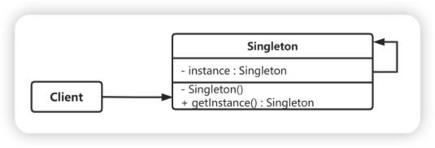
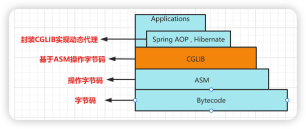
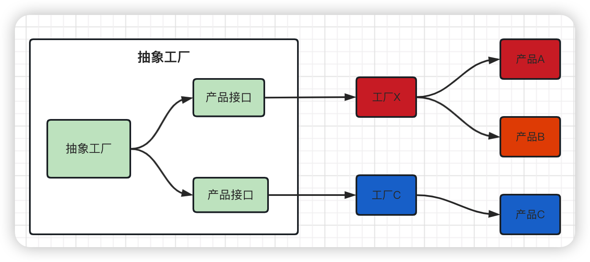
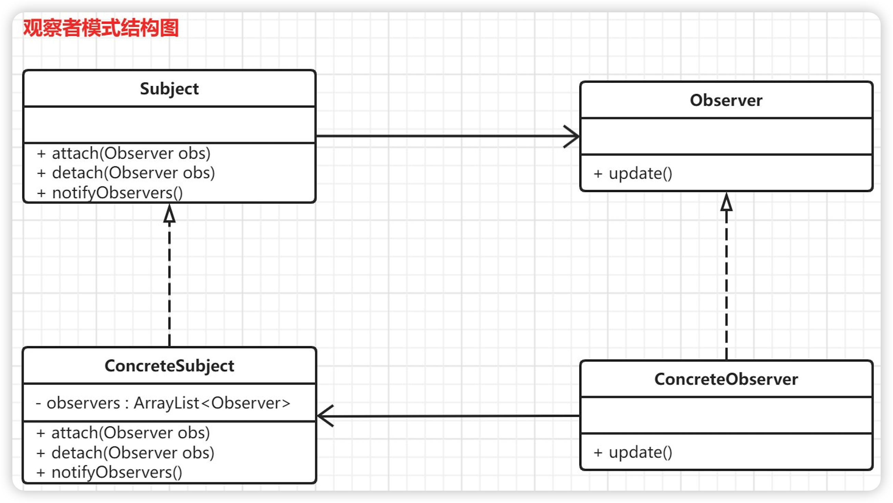
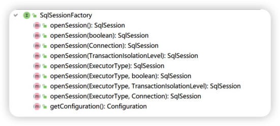
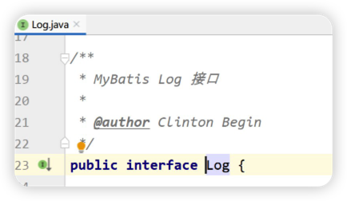

# 设计模式常见问题

## 说一下开发中需要遵守的设计原则？

>  设计模式中主要有六大设计原则，简称为SOLID：
>
> 1. 单一职责原则（**S**ingle Responsibility Principle, SRP）：一个类应该只有一个引起变化的原因。
> 2. 开闭原则（**O**pen/Closed Principle, OCP）：软件实体应当对扩展开放，对修改关闭。
> 3. 里氏替换原则（**L**iskov Substitution Principle, LSP）：子类型必须能够替换掉它们的基类型。
> 4. 接口隔离原则（**I**nterface Segregation Principle, ISP）：不应该强迫客户依赖于它们不用的方法。
> 5. 依赖倒置原则（**D**ependency Inversion Principle, DIP）：高层模块不应该依赖于低层模块，两者都应该依赖于抽象。

### 单一职责原则

单一职责原则的定义描述非常简单，也不难理解。一个类只负责完成一个职责或者功能。也就是说在类的设计中 我们不要设计大而全的类,而是要设计粒度小、功能单一的类。

> 比如 我们设计一个类里面既包含了用户的一些操作,又包含了支付的一些操作,那这个类的职责就不够单一,应该将该类进行拆分,拆分成多个功能更加单一的,粒度更细的类.

### 开放封闭原则

定义：对扩展开放，对修改关闭

对扩展开放和对修改关闭表示当一个类或一个方法有新需求或者需求发生改变时应该采用扩展的方式而不应该采用修改原有逻辑的方式来实现。因为扩展了新的逻辑如果有问题只会影响新的业务，不会影响老业务；而如果采用修改的方式，很有可能就会影响到老业务受影响。

优点：

1. 新老逻辑解耦，需求发生改变不会影响老业务的逻辑
2. 改动成本最小，只需要追加新逻辑，不需要改的老逻辑
3. 提供代码的稳定性和可扩展性

### 里氏替换原则

要理解里氏替换原则，其实就是要理解两个问题：

* 什么是替换？
* 什么是与期望行为一致的替换（Robert Martin所说的“必须能够替换”）？

1 ) 什么是替换 ?

替换的前提是面向对象语言所支持的多态特性，同一个行为具有多个不同表现形式或形态的能力。

> **以JDK的集合框架为例，**`List`接口的定义为有序集合，`List`接口有多个派生类，比如大家耳熟能详的 `ArrayList`, `LinkedList`。那当某个方法参数或变量是 `List`接口类型时，既可以是 `ArrayList`的实现, 也可以是 `LinkedList`的实现，这就是替换。

2 ) 什么是与期望行为一致的替换？

在不了解派生类的情况下，仅通过接口或基类的方法，即可清楚的知道方法的行为，而不管哪种派生类的实现，都与接口或基类方法的期望行为一致。

> **不需要关心是哪个类对接口进行了实现,因为不管底层如何实现,最终的结果都会符合接口中关于方法的描述(也就是与接口中方法的期望行为一致).**
>
> **或者说接口或基类的方法是一种契约，使用方按照这个契约来使用，派生类也按照这个契约来实现。这就是与期望行为一致的替换。**

### 接口隔离原则

定义：要为各个类建立它们需要的专用接口，而不要试图去建立一个很庞大的接口供所有依赖它的类去调用。

接口隔离原则与单一职责原则的区别

接口隔离原则和单一职责都是为了提高类的内聚性、降低它们之间的耦合性，体现了封装的思想，但两者是不同的：

* 单一职责原则注重的是职责，而接口隔离原则注重的是对接口依赖的隔离。
* 单一职责原则主要是约束类，它针对的是程序中的实现和细节；接口隔离原则主要约束接口，主要针对抽象和程序整体框架的构建。

### 依赖倒置原则

定义：依赖倒置原则（Dependence Inversion Principle，DIP）是指在设计代码架构时，高层模块不应该依赖于底层模块，二者都应该依赖于抽象。抽象不应该依赖于细节，细节应该依赖于抽象。

依赖倒置原则是实现开闭原则的重要途径之一，它降低了客户与实现模块之间的耦合。

依赖倒置原则的好处:

* 减少类间的耦合性，提高系统的稳定性 . (根据类与类之间的耦合度从弱到强排列：依赖关系、关联关系、聚合关系、组合关系、泛化关系和实现关系 )
* 降低并行开发引起的风险 (两个类之间有依赖关系，只要制定出两者之间的接口（或抽象类）就可以独立开发了)
* 提高代码的可读性和可维护性

### 迪米特法则

简单来说迪米特法则想要表达的思想就是:  **不该有直接依赖关系的类之间，不要有依赖；有依赖关系的类之间，尽量只依赖必要的接口。**

> **如果两个软件实体无须直接通信，那么就不应当发生直接的相互调用，可以通过第三方转发该调用。其目的是降低类之间的耦合度，提高模块的相对独立性。**

**软件开发中我们要基于这六个原则,设计建立稳定、灵活、健壮的程序.**

## **什么是设计模式？使用过设计模式吗？**

设计模式（Design pattern）是一套被反复使用、多数人知晓的、经过分类编目的、代码设计经验的总结

在GOF编写的设计模式(可复用面向对象软件的基础)一书中说道:  本书涉及的设计模式并不描述新的或未经证实的设计，我们只收录那些在不同系统中多次使用过的成功设计。

**大部分设计模式要解决的都是代码的可重用性、可扩展性问题**

> **如果说数据结构和算法是教你如何写出高效代码，那设计模式讲的是如何写出可扩展、可读、可维护的高质量代码，所以，它们跟平时的编码会有直接的关系，也会直接影响到你的开发能力。**

**设计模式的好处**

* 不再编写 bullshit-code
* 提高复杂代码的设计和开发能力
* 有助于我们读懂源码,学习框架更加事半功倍

**GoF设计模式只有23个，但是它们各具特色 ，每个模式都为某一个可重复的设计问题提供了一套解决方案。**

**根据它们的用途，设计模式可分为 创建型(Creational) ，结构型(Structural)  和行为型(Behavioral)**

创建型模式(5种)：提供创建对象的机制，提升已有代码的灵活性和可复用性

* 常用的有：单例模式、工厂模式（工厂方法和抽象工厂）、建造者模式。
* 不常用的有：原型模式。

结构型模式(7种)：介绍如何将对象和类组装成较大的结构，并同时保持结构的灵活和高效

* 常用的有：代理模式、桥接模式、装饰者模式、适配器模式。
* 不常用的有：门面模式、组合模式、享元模式。

行为模式(11种)：负责对象间的高效沟通和职责传递委派

* 常用的有：观察者模式、模板模式、策略模式、职责链模式、迭代器模式、状态模式。
* 不常用的有：访问者模式、备忘录模式、命令模式、解释器模式、中介模式。

## 说一下单例模式，及其应用场景？

定义

单例模式（Singleton Pattern）是 Java 中最简单的设计模式之一，此模式保证某个类在运行期间，只有一个实例对外提供服务，而这个类被称为单例类。

> **单例模式也比较好理解，比如一个人一生当中只能有一个真实的身份证号，一个国家只有一个政府，类似的场景都是属于单例模式。**

使用单例模式要做的两件事

1. 保证一个类只有一个实例
2. 为该实例提供一个全局访问节点

单例模式结构



**单例的实现**

* 饿汉式
* 懒汉式
* 双重检测
* 静态内部类
* 枚举方式

**应用场景**

* 资源共享的情况下，避免由于资源操作时导致的性能或损耗等。如上述中的日志文件，应用配置。
* 控制资源的情况下，方便资源之间的互相通信。如线程池等。

## 介绍一下代理模式的种类和它们之间区别？

**1）静态代理**

这种代理方式需要代理对象和目标对象实现一样的接口。

* 优点：可以在不修改目标对象的前提下扩展目标对象的功能。
* 缺点：
  1. 冗余。由于代理对象要实现与目标对象一致的接口，会产生过多的代理类。
  2. 不易维护。一旦接口增加方法，目标对象与代理对象都要进行修改。

**2）JDK动态代理**

动态代理利用了JDK API,动态地在内存中构建代理对象,从而实现对目标对象的代理功能.动态代理又被称为JDK代理或接口代理.

静态代理与动态代理的区别:

1. 静态代理在编译时就已经实现了,编译完成后代理类是一个实际的class文件
2. 动态代理是在运行时动态生成的,即编译完成后没有实际的class文件,而是在运行时动态生成类字节码,并加载到JVM中.

**3）CGLIB 动态代理**

cglib (Code Generation Library ) 是一个第三方代码生成类库，运行时在内存中动态生成一个子类对象从而实现对目标对象功能的扩展。cglib 为没有实现接口的类提供代理，为JDK的动态代理提供了很好的补充。



* 最底层是字节码
* ASM是操作字节码的工具
* cglib基于ASM字节码工具操作字节码（即动态生成代理，对方法进行增强）
* SpringAOP基于cglib进行封装，实现cglib方式的动态代理

**4）三种代理模式实现方式的对比**

* jdk代理和CGLIB代理

  使用CGLib实现动态代理，CGLib底层采用ASM字节码生成框架，使用字节码技术生成代理类，在JDK1.6之前比使用Java反射效率要高。唯一需要注意的是，CGLib不能对声明为final的类或者方法进行代理，因为CGLib原理是动态生成被代理类的子类。

  在JDK1.6、JDK1.7、JDK1.8逐步对JDK动态代理优化之后，在调用次数较少的情况下，JDK代理效率高于CGLib代理效率，只有当进行大量调用的时候，JDK1.6和JDK1.7比CGLib代理效率低一点，但是到JDK1.8的时候，JDK代理效率高于CGLib代理。所以如果有接口使用JDK动态代理，如果没有接口使用CGLIB代理。

* 动态代理和静态代理

  动态代理与静态代理相比较，最大的好处是接口中声明的所有方法都被转移到调用处理器一个集中的方法中处理（InvocationHandler.invoke）。这样，在接口方法数量比较多的时候，我们可以进行灵活处理，而不需要像静态代理那样每一个方法进行中转。

  如果接口增加一个方法，静态代理模式除了所有实现类需要实现这个方法外，所有代理类也需要实现此方法。增加了代码维护的复杂度。而动态代理不会出现该问题

## 工厂模式有哪几种，之间有什么区别？

在工厂模式中，我们在创建对象时不会对客户端暴露创建逻辑，并且是通过使用一个共同的接口来指向新创建的对象。

《设计模式》一书中，工厂模式被分为了三种：简单工厂、工厂方法和抽象工厂。（不过，在书中作者将简单工厂模式看作是工厂方法模式的一种特例。

**1）简单工厂模式**

简单工厂不是一种设计模式，反而比较像是一种编程习惯。简单工厂模式又叫做静态工厂方法模式（static Factory Method pattern）,它是通过使用静态方法接收不同的参数来返回不同的实例对象.

实现方式: 定义一个工厂类，根据传入的参数不同返回不同的实例，被创建的实例具有共同的父类或接口。


适用场景：
　　（1）需要创建的对象较少。
　　（2）客户端不关心对象的创建过程。

优点：

* 封装了创建对象的过程，可以通过参数直接获取对象。把对象的创建和业务逻辑层分开，这样以后就避免了修改客户代码，如果要实现新产品直接修改工厂类，而不需要在原代码中修改，这样就降低了客户代码修改的可能性，更加容易扩展。

缺点：

* 增加新产品时还是需要修改工厂类的代码，违背了“开闭原则”。

**2）工厂方法模式**

工厂方法模式  `Factory Method pattern`,属于创建型模式.

概念: 定义一个用于创建对象的接口，让子类决定实例化哪个产品类对象。工厂方法使一个产品类的实例化延迟到其工厂的子类。


工厂方法模优缺点

优点：

* 用户只需要知道具体工厂的名称就可得到所要的产品，无须知道产品的具体创建过程；
* 在系统增加新的产品时只需要添加具体产品类和对应的具体工厂类，无须对原工厂进行任何修改，满足开闭原则；

缺点：

* 每增加一个产品就要增加一个具体产品类和一个对应的具体工厂类，这增加了系统的复杂度。

**3）抽象工厂模式**

抽象工厂模式（Abstract Factory Pattern）属于创建型模式，它实际上是对工厂方法模式的扩展，相当于一个超级工厂，用于创建其他工厂的模式。

在抽象工厂模式中，接口是负责创建一个相关对象的工厂，而且每个工厂都能按照工厂模式提供对象。其实抽象工厂也是为了减少工厂方法中的子类和工厂类数量，基于此提出的设计模式。



在抽象工厂模式中,每一个具体工厂都提供了多个工厂方法,用于产生多种不同类型的产品

抽象工厂模式优点

1. 对于不同产品系列有比较多共性特征时，可以使用抽象工厂模式，有助于提升组件的复用性.
2. 当需要提升代码的扩展性并降低维护成本时，把对象的创建和使用过程分开，能有效地将代码统一到一个级别上
3. 解决跨平台带来的兼容性问题

抽象工厂模式缺点

* 增加新的产品等级结构麻烦,需要对原有结构进行较大的修改,甚至需要修改抽象层代码,这显然会带来较大不变,违背了开闭原则.

## 介绍一下观察者设计模式？

**观察者模式(observer pattern)的原始定义是：定义对象之间的一对多依赖关系，这样当一个对象改变状态时，它的所有依赖项都会自动得到通知和更新。**

解释一下上面的定义: 观察者模式它是用于建立一种对象与对象之间的依赖关系,一个对象发生改变时将自动通知其他对象,其他对象将相应的作出反应.

> 在观察者模式中发生改变的对象称为观察目标,而被通知的对象称为观察者,一个观察目标可以应对多个观察者,而且这些观察者之间可以没有任何相互联系,可以根据需要增加和删除观察者,使得系统更易于扩展.
>
> 观察者模式的别名有发布-订阅(Publish/Subscribe)模式,模型-视图(Model-View)模式、源-监听(Source-Listener) 模式等

**观察者模式结构中通常包括: 观察目标和观察者两个继承层次结构.**



**在观察者模式中有如下角色：**

* Subject：抽象主题（抽象被观察者），抽象主题角色把所有观察者对象保存在一个集合里，每个主题都可以有任意数量的观察者，抽象主题提供一个接口，可以增加和删除观察者对象。
* ConcreteSubject：具体主题（具体被观察者），该角色将有关状态存入具体观察者对象，在具体主题的内部状态发生改变时，给所有注册过的观察者发送通知。
* Observer：抽象观察者，是观察者的抽象类，它定义了一个更新接口，使得在得到主题更改通知时更新自己。
* ConcrereObserver：具体观察者，实现抽象观察者定义的更新接口，以便在得到主题更改通知时更新自身的状态。在具体观察者中维护一个指向具体目标对象的引用,它存储具体观察者的有关状态,这些状态需要与具体目标保持一致.

**观察者模式的优点**

* 降低了目标与观察者之间的耦合关系，两者之间是抽象耦合关系。
* 被观察者发送通知，所有注册的观察者都会收到信息【可以实现广播机制】

**观察者模式的缺点**

* 如果观察者非常多的话，那么所有的观察者收到被观察者发送的通知会耗时比较多
* 如果被观察者有循环依赖的话，那么被观察者发送通知会使观察者循环调用，会导致系统崩溃

**观察者模式常见的使用场景**

* 当一个对象状态的改变需要改变其他对象时。比如，商品库存数量发生变化时，需要通知商品详情页、购物车等系统改变数量。
* 一个对象发生改变时只想要发送通知，而不需要知道接收者是谁。比如，订阅微信公众号的文章，发送者通过公众号发送，订阅者并不知道哪些用户订阅了公众号。
* 需要创建一种链式触发机制时。比如，在系统中创建一个触发链，A 对象的行为将影响 B 对象，B 对象的行为将影响 C 对象……这样通过观察者模式能够很好地实现。
* 微博或微信朋友圈发送的场景。这是观察者模式的典型应用场景，一个人发微博或朋友圈，只要是关联的朋友都会收到通知；一旦取消关注，此人以后将不会收到相关通知。

## 装饰器模式与代理模式的区别？

1）**代理模式(Proxy Design Pattern )** 原始定义是：让你能够提供对象的替代品或其占位符。代理控制着对于原对象的访问，并允许将请求提交给对象前后进行一些处理。

**代理模式的适用场景**

* 功能增强
  当需要对一个对象的访问提供一些额外操作时,可以使用代理模式
* 远程（Remote）代理
  实际上，RPC 框架也可以看作一种代理模式，GoF 的《设计模式》一书中把它称作远程代理。通过远程代理，将网络通信、数据编解码等细节隐藏起来。客户端在使用 RPC 服务的时候，就像使用本地函数一样，无需了解跟服务器交互的细节。除此之外，RPC 服务的开发者也只需要开发业务逻辑，就像开发本地使用的函数一样，不需要关注跟客户端的交互细节。
* 防火墙（Firewall）代理
  当你将浏览器配置成使用代理功能时，防火墙就将你的浏览器的请求转给互联网；当互联网返回响应时，代理服务器再把它转给你的浏览器。
* 保护（Protect or Access）代理
  控制对一个对象的访问，如果需要，可以给不同的用户提供不同级别的使用权限。

2）**装饰器模式(decorator pattern)** 的原始定义是：动态的给一个对象添加一些额外的职责. 就扩展功能而言,装饰器模式提供了一种比使用子类更加灵活的替代方案.

**装饰器模式的适用场景**

* 快速动态扩展和撤销一个类的功能场景。 比如，有的场景下对 API 接口的安全性要求较高，那么就可以使用装饰模式对传输的字符串数据进行压缩或加密。如果安全性要求不高，则可以不使用。
* 不支持继承扩展类的场景。 比如，使用 final 关键字的类，或者系统中存在大量通过继承产生的子类。

**装饰器模式与代理模式的区别**

对装饰器模式来说，装饰者（decorator）和被装饰者（decoratee）都实现同一个 接口。

对代理模式来说，代理类（proxy class）和真实处理的类（real class）都实现同一个接口。

他们之间的边界确实比较模糊，两者都是对类的方法进行扩展，具体区别如下：

1. 装饰器模式强调的是增强自身，在被装饰之后你能够在被增强的类上使用增强后的功能。增强后你还是你，只不过能力更强了而已；代理模式强调要让别人帮你去做一些本身与你业务没有太多关系的职责（记录日志、设置缓存）。代理模式是为了实现对象的控制，因为被代理的对象往往难以直接获得或者是其内部不想暴露出来。
2. 装饰模式是以对客户端透明的方式扩展对象的功能，是继承方案的一个替代方案；代理模式则是给一个对象提供一个代理对象，并由代理对象来控制对原有对象的引用；
3. 装饰模式是为装饰的对象增强功能；而代理模式对代理的对象施加控制，但不对对象本身的功能进行增强；

## JDK 类库常用的设计模式有哪些？

1）抽象工厂

* javax.xml.parsers.DocumentBuilderFactory抽象类
* public static DocumentBuilderFactory newInstance()方法
* 类功能：使得应用程序可以通过XML文件，获得一个能生成DOM对象的解析器。
* 方法功能：获取一个DocumentBuilderFactory的新实例。这一静态方法会创建一个新的工厂实例。

2）建造者模式

* java.lang.StringBuilder，这是一个final类。
* public StringBuilder append(String str)方法，这一方法是对父类的覆写。
* 类功能：用于一个不可更改的字符序列。
* 方法功能：根据现有字符序列和追加字符，通过系统拷贝方法System.arraycopy生成一个新的字符序列。

3）工厂模式

* java.text.NumberFormat抽象类。
* public final static NumberFormat getInstance()方法。
* 类功能：用于数字格式的抽象基类。
* 方法功能：返回一个“对当前默认场景下的一个通用数字格式”的NumberFormat。显然属于工厂模式的使用。

4）原型模式

* java.lang.Object
* protected native Object clone() 方法
* 类功能：所有类的父类
* 方法功能：根据现有实例，返回一个浅拷贝对象。

5）单例模式

* java.lang.RunTime类
* public static Runtime getRuntime()
* 类功能：每一个运行的java应用都会有一个唯一的RunTime类的实例，这个实例使得应用程序在运行期间能够受到运行环境的影响。
* 方法功能：返回一个和当前java应用关联的RunTime对象。

6）适配器模式

* java.util.Arrays。
* public static List asList(T… a)方法。
* 类功能：此类包含了大量对数组操作的方法。
* 方法功能：将一个引用类型的数组转为一个List。从而可以使用List类的操作来操作数组对象，但是有一点要注意：就是不能使用add(),remove()操作，因为返回的list底层是基于数组的，数组结构是不能更改的。 list类就是这里的适配器，通过这个适配器，对数组的直接操作变为间接操作。

## Mybatis框架中使用的设计模式有哪些？

Builder模式

* **在Mybatis环境的初始化过程中，**`SqlSessionFactoryBuilder`会调用 `XMLConfigBuilder`读取所有的 `MybatisMapConfig.xml`和所有的 `*Mapper.xml`文件，构建Mybatis运行的核心对象 `Configuration`对象，然后将该 `Configuration`对象作为参数构建一个 `SqlSessionFactory`对象。

工厂模式

* **在Mybatis中比如** `SqlSessionFactory`使用的是工厂模式，该工厂没有那么复杂的逻辑，是一个简单工厂模式。

  

* `SqlSession`可以认为是一个Mybatis工作的核心的接口，通过这个接口可以执行执行SQL语句、获取Mappers、管理事务。类似于连接MySQL的 `Connection`对象。

单例模式

**在Mybatis中有两个地方用到单例模式，**`ErrorContext`和 `LogFactory`，其中 `ErrorContext`是用在每个线程范围内的单例，用于记录该线程的执行环境错误信息，而 `LogFactory`则是提供给整个Mybatis使用的日志工厂，用于获得针对项目配置好的日志对象。

```
public class ErrorContext {

    private static final ThreadLocal<ErrorContext> LOCAL = new ThreadLocal<>();


    private ErrorContext() {
    }

    public static ErrorContext instance() {
        ErrorContext context = LOCAL.get();
        if (context == null) {
            context = new ErrorContext();
            LOCAL.set(context);
        }
        return context;
    }

}
```

构造函数是private修饰，具有一个static的局部instance变量和一个获取instance变量的方法，在获取实例的方法中，先判断是否为空如果是的话就先创建，然后返回构造好的对象。

只是这里有个有趣的地方是，LOCAL的静态实例变量使用了 `ThreadLocal`修饰，也就是说它属于每个线程各自的数据，而在 `instance()`方法中，先获取本线程的该实例，如果没有就创建该线程独有的 `ErrorContext`。

代理模式

**代理模式可以认为是Mybatis的核心使用的模式，正是由于这个模式，我们只需要编写** `Mapper.java`接口，不需要实现，由Mybatis后台帮我们完成具体SQL的执行。

适配器模式

在Mybatsi的logging包中，有一个Log接口：



该接口定义了Mybatis直接使用的日志方法，而Log接口具体由谁来实现呢？Mybatis提供了多种日志框架的实现，这些实现都匹配这个Log接口所定义的接口方法，最终实现了所有外部日志框架到Mybatis日志包的适配。

## Spring框架中使用的设计模式有哪些？

1）简单工厂

BeanFactory。Spring中的BeanFactory就是简单工厂模式的体现，根据传入一个唯一的标识来获得Bean对象，但是否是在传入参数后创建还是传入参数前创建这个要根据具体情况来定。

2）工厂方法

FactoryBean接口

实现了FactoryBean接口的bean是一类叫做factory的bean。其特点是，spring会在使用getBean()调用获得该bean时，会自动调用该bean的getObject()方法，所以返回的不是factory这个bean，而是这个bean.getOjbect()方法的返回值。

3）单例模式

Spring依赖注入Bean实例默认是单例的。

Spring的依赖注入（包括lazy-init方式）都是发生在AbstractBeanFactory的getBean里。getBean的doGetBean方法调用getSingleton进行bean的创建。

4）适配器模式

SpringMVC中的适配器HandlerAdatper。

HandlerAdatper使得Handler的扩展变得容易，只需要增加一个新的Handler和一个对应的HandlerAdapter即可。

因此Spring定义了一个适配接口，使得每一种Controller有一种对应的适配器实现类，让适配器代替controller执行相应的方法。这样在扩展Controller时，只需要增加一个适配器类就完成了SpringMVC的扩展了。

5）装饰器模式

Spring中用到的包装器模式在类名上有两种表现：一种是类名中含有Wrapper，另一种是类名中含有Decorator。

动态地给一个对象添加一些额外的职责。

就增加功能来说，Decorator模式相比生成子类更为灵活。

6）代理模式

AOP底层，就是动态代理模式的实现。

7）观察者模式

Spring 基于观察者模式，实现了自身的事件机制也就是事件驱动模型，事件驱动模型通常也被理解成观察者或者发布/订阅模型。

8）策略模式

Spring框架的资源访问Resource接口。该接口提供了更强的资源访问能力，Spring 框架本身大量使用了 Resource 接口来访问底层资源。

Rsource 接口是具体资源访问策略的抽象，也是所有资源访问类所实现的接口。

Resource 接口本身没有提供访问任何底层资源的实现逻辑，**针对不同的底层资源，Spring 将会提供不同的 Resource 实现类，不同的实现类负责不同的资源访问逻辑。**

# 设计模式全解析

## 创建型设计模式

> 用于描述“怎样创建对象”，它的主要特点是“将对象的创建与使用分离”。这样可以降低系统的耦合度，使用者不需要关注对象的创建细节。
>
> GoF书中提供了单例、工厂方法、抽象工厂、原型、建造者 5 种创建型模式。

### 单例模式

确保某一个类只有一个实例，而且自行实例化并向整个系统提供这个实例。

典型案例：

1. 饿汉式单例：Runtime.getRuntime();

```java
//(1)懒汉式
public class Singleton1 {
  /* 持有私有静态实例，防止被引用，此处赋值为null，目的是实现延迟加载  */
  private static Singleton instance = null;
  /* 私有构造方法，防止被实例化 */
  private Singleton() {
  }
  /* 1:懒汉式，静态工程方法，创建实例 */
  public static Singleton getInstance() {
    if (instance == null) {
      instance = new Singleton();
    }
    return instance;
  }
}

//(1)懒汉式升级版
public class Singleton2 {
  /* 持有私有静态实例，防止被引用，此处赋值为null，目的是实现延迟加载  */
  private static volatile Singleton instance = null;
  /* 私有构造方法，防止被实例化 */
  private Singleton() {
  }
  /* 1:懒汉式，静态工程方法，创建实例 */
  public static Singleton getInstance() {
    if (instance == null) {
      synchronized(Singleton2.class) {
        if(instance == null) {
          instance = new Singleton();
        }
      }
    }
    return instance;
  }
}
```

```java
//(2)饿汉式
public class Singleton {
  /* 持有私有静态实例，防止被引用 */       			
  private static Singleton instance = new Singleton();
  /* 私有构造方法，防止被实例化 */
  private Singleton() {
  }
  /* 1:懒汉式，静态工程方法，创建实例 */
  public static Singleton getInstance() {
    return instance;
  }
}
```

使用场景：

- 要求生成唯一序列号的环境；
- 在整个项目中需要一个共享访问点或共享数据，例如一个Web页面上的计数 器，可以不用把每次刷新都记录到数据库中，使用单例模式保持计数器的值，并 确保是线程安全的；
- 创建一个对象需要消耗的资源过多，如要访问IO和数据库等资源；
- 需要定义大量的静态常量和静态方法(如工具类)的环境，可以采用单例模式 (当然，也可以直接声明为static的方式)。

### 工厂模式

> 注意：简单工厂模式并不是GoF收集的工厂模式之一
>
> 工厂模式在于工厂会非常多，抽象工厂解决了这一问题

角色：

1. 抽象产品: 定义了产品的规范，描述了产品的主要特性和功能
2. 具体产品：实现或者继承抽象产品的了类
3. 抽象工厂：提供了创建产品的接口，调用者通过它访问具体工厂的工厂方法来创建产品
4. 具体工厂提供了创建产品的方法，调用者通过该方法来获取产品


定义一个用于创建对象的接口，让子类决定实例化哪一个类。工厂方法使一个类的实例化延迟到其子类。

```java
//接口
public interface Fruit {
  public void print();   
}
//2个实现类
public class Apple implements Fruit {
  @Override
  public void print() {
    System.out.println("我是一个苹果");
  }
}
public class Orange implements Fruit {
  @Override
  public void print() {
    System.out.println("我是一个橘子");
  }
}

//工厂类
public class FruitFactory {
  public Fruit produce(String type){
    if(type.equals("apple")){
      return new Apple();
    }else if(type.equals("orange")){
      return new Orange();
    }else{
      System.out.println("请输入正确的类型!");  
      return null;
    }
  }
}
```

使用场景：jdbc连接数据库，硬件访问，降低对象的产生和销毁

### 抽象工厂模式

为创建一组相关或相互依赖的对象提供一个接口，而且无须指定它们的具体类。

角色：

1. 抽象工厂(Abstract Factory): 提供了创建产品的接口，它包含多个创建产品的方法，可以创建多个不同等级的产品
2. 具体工厂(Concrete Factory): 主要是实现抽象工厂中的多个抽象方法，完成具体同一产品族产品的创建
3. 抽象产品(Product): 定义了产品的规范，描述了产品的特性和功能，抽象工厂模式有多个抽象产品
4. 具体产品(ConcreteProduct): 实现了抽象产品角色所定义的接口，由具体工厂来创建，它同具体工厂之间是多对一的关系


相对于工厂模式，我们可以新增产品类(只需要实现产品接口)，只需要同时新 增一个工厂类，客户端就可以轻松调用新产品的代码。

```java
interface Food{}

class A implements Food{}

class B implements Food{}

interface produce{ 
  Food get();
}

class FactoryForA implements produce{
  @Override
  public Food get() {
    return new A();
  }
}
class FactoryForB implements produce{
  @Override
  public Food get() {
    return new B();
  }
}
public class AbstractFactory {
  public void ClientCode(String name){
    Food x= new FactoryForA().get();
    x = new FactoryForB().get();
  }
}
```

使用场景：一个对象族(或是一组没有任何关系的对象)都有相同的约束。 涉及不同操作系统的时候，都可以考虑使用抽象工厂模式

### 建造者模式

将一个复杂对象的构建与它的表示分离，使得同样的构建过程可 以创建不同的表示。

```java
public class Build {
  
  static class Student{
    
    String name = null;
    int number = -1;
    String sex = null;
    
    public Student(Builder builder) {
      this.name=builder.name;
      this.number=builder.number;
      this.sex=builder.sex;
    }
    
    static class Builder{

      String name = null;
      int number = -1;
      String sex = null;
      
      public Builder setName(String name){  
        this.name=name;  
        return this;
      }
      
      public Builder setNumber(int number){  
        this.number=number;  
        return this;
      }
      
      public Builder setSex(String sex){  
        this.sex=sex;  
        return this;
      }
      
      public Student build(){  
        return new Student(this);
      }
      
    }  
  }
  public static void main(String[] args) {
    Student A=new Student.Builder().setName("张 三").setNumber(1).build(); 
    Student B=new Student.Builder().setSex("男").setName("李四").build();
    System.out.println(A.name+" "+A.number+" "+A.sex);
    System.out.println(B.name+" "+B.number+" "+B.sex);
  }
}
```

 使用场景：

1. 相同的方法，不同的执行顺序，产生不同的事件结果时，可以采用建造者模 式。
2. 多个部件或零件，都可以装配到一个对象中，但是产生的运行结果又不相同 时，则可以使用该模式。
3. 产品类非常复杂，或者产品类中的调用顺序不同产生了不同的效能，这个时候 使用建造者模式非常合适。

### 原型模式

用原型实例指定创建对象的种类，并且通过拷贝这些原型创建新的 对象。

```java
public class Prototype implements Cloneable {
  
  private String name;
  
  public String getName() {
    return name;
  }
  
  public void setName(String name) {
    this.name = name;
  }
  
  @Override
  protected Object clone() {
    try {
      return super.clone();
    } catch (CloneNotSupportedException e) {
      e.printStackTrace();
    }finally {
      return null;
    }
  }
  
  public static void main( String[] args) {
    Prototype pro = new Prototype();
    Prototype pro1 = (Prototype)pro.clone();
  }
  
}
```

原型模式实际上就是实现Cloneable接口，重写clone()方法。

**使用原型模式的优点**：

1.性能优良

原型模式是在内存二进制流的拷贝，要比直接new一个对象性能好很多，特别是 要在一个循环体内产生大量的对象时，原型模式可以更好地体现其优点。

2.逃避构造函数的约束

这既是它的优点也是缺点，直接在内存中拷贝，构造函数是不会执行的(参见 13.4节)。

**使用场景**：

资源优化场景 类初始化需要消化非常多的资源，这个资源包括数据、硬件资源等。

性能和安全要求的场景 通过new产生一个对象需要非常繁琐的数据准备或访问权限，则可以使用原型模式。

一个对象多个修改者的场景 一个对象需要提供给其他对象访问，而且各个调用者可能都需要修改其值时，可 以考虑使用原型模式拷贝多个对象供调用者使用。

**浅拷贝和深拷贝**：

**浅拷贝**：Object类提供的方法clone只是拷贝本对象，其对象内部的数组、引用对象等都不拷贝，还是指向原生对象的内部元素地址，这种拷贝就叫做浅拷贝， 其他的原始类型比如int、long、char、string(当做是原始类型)等都会被拷贝。

注意：使用原型模式时，引用的成员变量必须满足两个条件才不会被拷贝：一是类的成员变量，而不是方法内变量；二是必须是一个可变的引用对象，而不是 一个原始类型或不可变对象。

**深拷贝**：对私有的类变量进行独立的拷贝

如：`this.arrayList = (ArrayList)this.arrayList.clone();`

## 结构型设计模式

> 用于描述如何将类或对象按某种布局组成更大的结构，
> GoF书中提供了 **代理**、**适配器**、**桥接**、**装饰**、**外观**、**享元**、**组合** 7 种结构型模式。

### 适配器模式

> 将一个类的接口变换成客户端所期待的另一种接口，从而使原本因接口不匹配而无法在一起工作的两个类能够在一起工作。

使用场景：

你有动机修改一个已经投产中的接口时，适配器模式可能是适合你的模式。

比如系统扩展了，需要使用一个已有或新建立的类，但这个类又不符合系统的接口，怎么办？使用适配器模式，这也是我们例子中提到的。

主要可分为3种：

1. **类适配**：创建新类，继承源类，并实现新接口，例如：

   ```java
   class Adapter extends OldClass implements NewInterface {
   }
   ```

2. **对象适配**：创建新类持源类的实例，并实现新接口，例如：

   ```java
   class Adapter implements NewInterface { 
     private OldClass oldInstance; 
   }
   ```

3. **接口适配**：创建新的抽象类实现旧接口方法。例如

   ```java
   abstract class Adapter implements OldClassInterface {
     void newFunc();
   }
   ```

### 装饰器模式

动态地给一个对象添加一些额外的职责。就增加功能来说，装饰器模式相比生成子类更为灵活。

```java
interface Source{ 
  void method();
}

public class Decorator implements Source{  
  private Source source;  
  public void decotate(){
    System.out.println("decorate");
  }  
  @Override
  public void method() {
    decotate();
    source.method();
  }
}
```

使用场景：

1. 需要扩展一个类的功能，或给一个类增加附加功能。
2. 需要动态地给一个对象增加功能，这些功能可以再动态地撤销。
3. 需要为一批的兄弟类进行改装或加装功能，当然是首选装饰模式。

### 享元模式

使用共享对象的方法，用来尽可能减少内存使用量以及分享资讯。

```java
abstract class Flywei{ }
public class Flyweight extends Flywei{
    Object obj;
    public Flyweight(Object obj){
        this.obj = obj;
    }
}
class FlyweightFactory{ 
    private HashMap data;
    public FlyweightFactory(){
        data = new HashMap<>();
    }
    public Flyweight getFlyweight(Object object){
        if ( data.containsKey(object)){
            return data.get(object);
        }else {
            Flyweight flyweight = new Flyweight(object);
            data.put(object,flyweight);
            return flyweight;
        }
    }
}
```

使用场景：

1. 系统中存在大量的相似对象。

2. 细粒度的对象都具备较接近的外部状态，而且内部状态与环境无关，也就是说对象没有特定身份。

3. 需要缓冲池的场景。

### 代理模式

为其他对象提供一种代理以控制对这个对象的访问。

```java
interface Source{
    void method();
}
class OldClass implements Source{
    @Override
    public void method() {
    }
}
class Proxy implements Source{
    private Source source = new OldClass();
    void doSomething(){}
    @Override
    public void method() {
        new Class1().Func1();
        source.method();
        new Class2().Func2();
        doSomething();
    }
}
```

### 外观模式


### 组合模式

将对象组合成树形结构以表示“部分-整体”的层次结构，使得用户对单个对象和组合对象的使用具有一致性。

```java
public class Composite extends Component {
  //构件容器
  private ArrayList componentArrayList = new ArrayList();
  //增加一个叶子构件或树枝构件
  public void add(Component component){
    this.componentArrayList.add(component);
  }
  //删除一个叶子构件或树枝构件
  public void remove(Component component){
    this.componentArrayList.remove(component);
  }
  //获得分支下的所有叶子构件和树枝构件
  public ArrayList getChildren(){
    return this.componentArrayList;
  }
}
```

使用场景：

1. 维护和展示部分-整体关系的场景，如树形菜单、文件和文件夹管理。

2. 从一个整体中能够独立出部分模块或功能的场景。


### 桥梁模式

将抽象和实现解耦，使得两者可以独立地变化。

Circle类将DrwaApi与Shape类进行了桥接，

```java
interface DrawAPI {
  public void drawCircle(int radius, int x, int y);
}
class RedCircle implements DrawAPI {
  @Override
  public void drawCircle(int radius, int x, int y) {
    System.out.println("Drawing Circle[ color: red, radius: "
                       + radius +", x: " +x+", "+ y +"]");
  }
}
class GreenCircle implements DrawAPI {
  @Override
  public void drawCircle(int radius, int x, int y) {
    System.out.println("Drawing Circle[ color: green, radius: "
                       + radius +", x: " +x+", "+ y +"]");
  }
}
abstract class Shape {
  protected DrawAPI drawAPI;
  protected Shape(DrawAPI drawAPI){
    this.drawAPI = drawAPI;
  }
  public abstract void draw();
}
class Circle extends Shape {
  private int x, y, radius;
  public Circle(int x, int y, int radius, DrawAPI drawAPI) {
    super(drawAPI);
    this.x = x;
    this.y = y;
    this.radius = radius;
  }
  public void draw() {
    drawAPI.drawCircle(radius,x,y);
  }
}
//客户端使用代码
Shape redCircle = new Circle(100,100, 10, new RedCircle());
Shape greenCircle = new Circle(100,100, 10, new GreenCircle());
redCircle.draw();
greenCircle.draw();
```

使用场景：

1. 不希望或不适用使用继承的场景

2. 接口或抽象类不稳定的场景

3. 重用性要求较高的场景

## 行为型设计模式

> 用于描述类或对象之间怎样相互协作共同完成单个对象无法单独完成的任务，以及怎样分配职责。
>
> GoF书中提供了模板方法、策略、命令、职责链、状态、观察者、中介者、迭代器、访问者、备忘录、解释器 11 种行为型模式。

### 责任链模式

使多个对象都有机会处理请求，从而避免了请求的发送者和接受者之间的耦合关系。将这些对象连成一条链，并沿着这条链传递该请求，直到有对象处理它为止。

```java
public abstract class Handler {
    private Handler nextHandler;
    //每个处理者都必须对请求做出处理
    public final Response handleMessage(Request request){
        Response response = null;
        //判断是否是自己的处理级别
        if(this.getHandlerLevel().equals(request.getRequestLevel())){
            response = this.echo(request);
        }else{  //不属于自己的处理级别
            //判断是否有下一个处理者
            if(this.nextHandler != null){
                response = this.nextHandler.handleMessage(request);
            }else{
                //没有适当的处理者，业务自行处理
            }
        }
        return response;
    }
    //设置下一个处理者是谁
    public void setNext(Handler nextHandler){
        this.nextHandler = nextHandler;
    }
    //每个处理者都有一个处理级别
    protected abstract Level getHandlerLevel();
    //每个处理者都必须实现处理任务
    protected abstract Response echo(Request request);
}

```

### 中介者模式

用一个中介对象封装一系列的对象交互，中介者使各对象不需要显示地相互作用，从而使其耦合松散，而且可以独立地改变它们之间的交互。

```java
public abstract class Mediator {
  //定义同事类
  protected ConcreteColleague1 c1;
  protected ConcreteColleague2 c2;
  //通过getter/setter方法把同事类注入进来
  public ConcreteColleague1 getC1() {
    return c1;
  }
  public void setC1(ConcreteColleague1 c1) {
    this.c1 = c1;
  }
  public ConcreteColleague2 getC2() {
    return c2; 
  }
  public void setC2(ConcreteColleague2 c2) {
    this.c2 = c2;
  }
  //中介者模式的业务逻辑
  public abstract void doSomething1();
  public abstract void doSomething2();
}
```

使用场景： 中介者模式适用于多个对象之间紧密耦合的情况，紧密耦合的标准是：在类图中出现了蜘蛛网状结构，即每个类都与其他的类有直接的联系。

### 命令模式

将一个请求封装成一个对象，从而让你使用不同的请求把客户端参数化，对请求排队或者记录请求日志，可以提供命令的撤销和恢复功能。

Receiver接受者角色：该角色就是干活的角色，命令传递到这里是应该被执行的

Command命令角色：需要执行的所有命令都在这里声明

Invoker调用者角色：接收到命令，并执行命令

```java
//通用Receiver类
public abstract class Receiver {
  public abstract void doSomething();
}
//具体Receiver类
public class ConcreteReciver1 extends Receiver{
  //每个接收者都必须处理一定的业务逻辑
  public void doSomething(){ }
}
public class ConcreteReciver2 extends Receiver{
  //每个接收者都必须处理一定的业务逻辑
  public void doSomething(){ }
}
//抽象Command类 public abstract class Command {
public abstract void execute();
}
//具体的Command类
public class ConcreteCommand1 extends Command {
  //对哪个Receiver类进行命令处理
  private Receiver receiver;
  //构造函数传递接收者
  public ConcreteCommand1(Receiver _receiver){
    this.receiver = _receiver;
  }
  //必须实现一个命令
  public void execute() {
    //业务处理
    this.receiver.doSomething();
  } 	
}
public class ConcreteCommand2 extends Command {
  //哪个Receiver类进行命令处理
  private Receiver receiver;
  //构造函数传递接收者
  public ConcreteCommand2(Receiver _receiver){
    this.receiver = _receiver;
  }
  //必须实现一个命令
  public void execute() {
    //业务处理
    this.receiver.doSomething();
  }
}
//调用者Invoker类 public class Invoker {
private Command command;
public void setCommand(Command _command){
  this.command = _command;
}
public void action() {
  this.command.execute();
}
}
//场景类
public class Client {
  public static void main(String[] args){
    Invoker invoker = new Invoker();
    Receiver receiver = new ConcreteReceiver1();
    Command command = new ConcreteCommand1(receiver);
    invoker.setCommand(command);
    invoker.action();
  } 	
}
```


使用场景： 认为是命令的地方就可以采用命令模式，例如，在GUI开发中，一个按钮的点击 是一个命令，可以采用命令模式；模拟DOS命令的时候，当然也要采用命令模
式；触发－反馈机制的处理等。

### 策略模式

完成同一类事情，但是这类事情的每个事情在算法或者方式有差别，那么就给每个事情指定响应的策略：制定统一处理流程，不同的事情有差别的部分使用不同的策略完成。例如处理两个数字的运算，有加减乘除和取模等等，那么首先定义一个统一处理的方法，方法接收两个数字以及一个策略实现类，策略实现类就是实现了统一接口的类，接口定义一个方法接收两个参数返回一个值，然后处理运算。

定义一组算法，将每个算法都封装起来，并且使它们之间可以互换。

```java
public class StrategyModeMain {
    
    public static void main(String[] args) {
        Calculator calculator = new Calculator();
        
        calculator.setOperation(new OperationAdd());
        System.out.println(calculator.doOperation(1, 1));
        
        calculator.setOperation(new OperationSub());
        System.out.println(calculator.doOperation(1, 1));
    }

}

public class Calculator {
    
    private Operation operation;
    
    public void setOperation(Operation operation) {
        this.operation = operation;
    }
    
    public int doOperation(int num1, int num2) {
        return this.operation.doOperation(num1, num2);
    }
    
}

public interface Operation {
    
    int doOperation(int num1, int num2);

}

public class OperationAdd  implements  Operation{
    
    @Override
    public int doOperation(int num1, int num2) {
        return num1 + num2;
    }
    
}

public class OperationSub implements  Operation{
    
    @Override
    public int doOperation(int num1, int num2) {
        return num1 - num2;
    }
    
}
```

### 迭代器模式

它提供一种方法访问一个容器对象中各个元素，而又不需暴露该对象的内部细节。

迭代器模式已经被淘汰，java中已经把迭代器运用到各个聚集类(collection)中了，使用java自带的迭代器就已经满足我们的需求了。

### 观察者模式

又被称为发布-订阅(Publish/Subscribe)模式，它定义了一种一对多的依赖关系，让多个观察者对象同时监听某一个主题对象。

这个主题对象在状态变化时，会通知所有的观察者对象，使他们能够自动更新自己。

定义对象间一种一对多的依赖关系，使得每当一个对象改变状态，则所有依赖于它的对象都会得到通知并被自动更新。

```java
public abstract class Subject {
  //定义一个观察者数组
  private Vector obsVector = new Vector();
  //增加一个观察者
  public void addObserver(Observer o){
    this.obsVector.add(o);
  }
  //删除一个观察者
  public void delObserver(Observer o){
    this.obsVector.remove(o);
  }
  //通知所有观察者
  public void notifyObservers(){
    for(Observer o:this.obsVector){
      o.update();
    }
  }
}
```

使用场景：

1. 关联行为场景。需要注意的是，关联行为是可拆分的，而不是“组合”关系。

2. 事件多级触发场景。

3. 跨系统的消息交换场景，如消息队列的处理机制

### 备忘录模式

在不破坏封装性的前提下，捕获一个对象的内部状态，并在该对象之外保存这个状态。这样以后就可将该对象恢复到原先保存的状态。

```java
public class Originator {
  private String state;
  /**
   *	工厂方法，返回一个新的备忘录对象
   */
  public Memento createMemento(){
    return new Memento(state);
  }
  /**
   *	将发起人恢复到备忘录对象所记载的状态
   */
  public void restoreMemento(Memento memento){
    this.state = memento.getState();
  }
  public String getState() {
    return state;
  }
  public void setState(String state) {
    this.state = state;
    System.out.println("当前状态：" + this.state);
  }
}
```

使用场景：

1. 需要保存和恢复数据的相关状态场景。

2. 提供一个可回滚(rollback)的操作。

3. 需要监控的副本场景中。

4. 数据库连接的事务管理就是用的备忘录模式。

### 解释器模式

给定一门语言，定义它的文法的一种表示，并定义一个解释器，该解释器使用该表示来解释语言中的句子。

使用场景：

1. 重复发生的问题可以使用解释器模式

2. 一个简单语法需要解释的场景

### 访问者模式

封装一些作用于某种数据结构中的各元素的操作，它可以在不改变数据结构的前提下定义作用于这些元素的新的操作。

使用场景：

1. 一个对象结构包含很多类对象，它们有不同的接口，而你想对这些对象实施一些依赖于其具体类的操作，也就说是用迭代器模式已经不能胜任的情景。

2. 需要对一个对象结构中的对象进行很多不同并且不相关的操作，而你想避免让这些操作“污染”这些对象的类。

### 模板方法模式

定义一个操作中的算法的框架，而将一些步骤延迟到子类中。使得子类可以不改变一个算法的结构即可重定义该算法的某些特定步骤。

使用场景：

1. 多个子类有公有的方法，并且逻辑基本相同时。

2. 重要、复杂的算法，可以把核心算法设计为模板方法，周边的相关细节功能则由各个子类实现。

3. 重构时，模板方法模式是一个经常使用的模式，把相同的代码抽取到父类中，然后通过钩子函数(见“模板方法模式的扩展”)约束其行为。

### 状态模式

当一个对象内在状态改变时允许其改变行为，这个对象看起来像改变了其类。

使用场景：

1. 行为随状态改变而改变的场景这也是状态模式的根本出发点，例如权限设计，人员的状态不同即使执行相同的行为结果也会不同，在这种情况下需要考虑使用状态模式。

2. 条件、分支判断语句的替代者

## 其他

### 门面模式

要求一个子系统的外部与其内部的通信必须通过一个统一的对象进行。门面模式提供一个高层次的接口，使得子系统更易于使用。

```java
public class Facade {
  private subSystem1 subSystem1 = new subSystem1();
  private subSystem2 subSystem2 = new subSystem2();
  private subSystem3 subSystem3 = new subSystem3();
  public void startSystem(){
    subSystem1.start();
    subSystem2.start();
    subSystem3.start();
  }
  public void stopSystem(){
    subSystem1.stop();
    subSystem2.stop();
    subSystem3.stop();
  }
}
```

使用场景：

1. 为一个复杂的模块或子系统提供一个供外界访问的接口

2. 子系统相对独立——外界对子系统的访问只要黑箱操作即可

3. 预防低水平人员带来的风险扩散


