# Docker笔记

> 系列文章：Docker入门系列
>
> [01、Docker 简介](https://www.cnblogs.com/xiangningdeguang/p/16962054.html)
> [02、Docker安装](https://www.cnblogs.com/xiangningdeguang/p/16962068.html)
> [03、Docker常用命令](https://www.cnblogs.com/xiangningdeguang/p/16962082.html)
> [04、Docker镜像](https://www.cnblogs.com/xiangningdeguang/p/16962091.html)
> [05、Docker容器数据卷](https://www.cnblogs.com/xiangningdeguang/p/16962109.html)
> [06、DockerFlie解析](https://www.cnblogs.com/xiangningdeguang/p/16962128.html)
> [07、使用DockerFlie自定义Tomcat镜像](https://www.cnblogs.com/xiangningdeguang/p/16962137.html)
> [08、Docker常用安装](https://www.cnblogs.com/xiangningdeguang/p/16962143.html)
> [09、本地镜像发布到阿里云](https://www.cnblogs.com/xiangningdeguang/p/16962151.html)
> [10、Docker-Compose简介和安装](https://www.cnblogs.com/xiangningdeguang/p/16962155.html)
> [11、Docker-Compose模板命令](https://www.cnblogs.com/xiangningdeguang/p/16962165.html)
> [12、Docker-Compose常用命令](https://www.cnblogs.com/xiangningdeguang/p/16962171.html)
> [13、Portainer可视化Docker](https://www.cnblogs.com/xiangningdeguang/p/16962177.html)
> [14、Docker搭建部署SpringCloud微服务项目Demo](https://www.cnblogs.com/xiangningdeguang/p/16962186.html)

## Docker基础

> 官方文档地址: https://www.docker.com/get-started/
>
> 中文参考手册: 
>
> - [Docker — 从入门到实践 | Docker 从入门到实践 (docker-practice.com)](https://vuepress.mirror.docker-practice.com/)
> - [Docker — 从入门到实践 (gitbook.io)](https://yeasy.gitbook.io/docker_practice/)

### 认识Docker

#### 介绍

2013年发布至今， Docker 一直广受瞩目，被认为可能会改变软件行业。但是，许多人并不清楚 Docker 到底是什么，要解决什么问题，好处又在哪里？今天就来详细解释，帮助大家理解它，还带有简单易懂的实例，教你如何将它用于日常开发。

Docker是一个开源的容器引擎，它有助于更快地交付应用。 Docker可将应用程序和基础设施层隔离，并且能将基础设施当作程序一样进行管理。使用 Docker可更快地打包、测试以及部署应用程序，并可以缩短从编写到部署运行代码的周期。

Docker的优点如下：

1、方便快捷
Docker 让开发者可以打包他们的应用以及依赖包到一个可移植的容器中，然后发布到任何流行的 Linux 机器上，便可以实现虚拟化。Docker改变了虚拟化的方式，使开发者可以直接将自己的成果放入Docker中进行管理。方便快捷已经是Docker的最大
优势，过去需要用数天乃至数周的任务，在Docker容器的处理下，只需要数秒就能完成。

2、简化程序部署
如果你有选择恐惧症，还是资深患者。Docker 帮你打包你的纠结！比如 Docker 镜像；Docker 镜像中包含了运行环境和配置，所以 Docker 可以简化部署多种应用实例工作。比如 Web 应用、后台应用、数据库应用、大数据应用比如 Hadoop 集群、消息队列等等都可以打包成一个镜像部署。

3、节省开支
一方面，云计算时代到来，使开发者不必为了追求效果而配置高额的硬件，Docker 改变了高性能必然高价格的思维定势。
Docker 与云的结合，让云空间得到更充分的利用。不仅解决了硬件管理的问题，也改变了虚拟化的方式。

#### 容器运行时

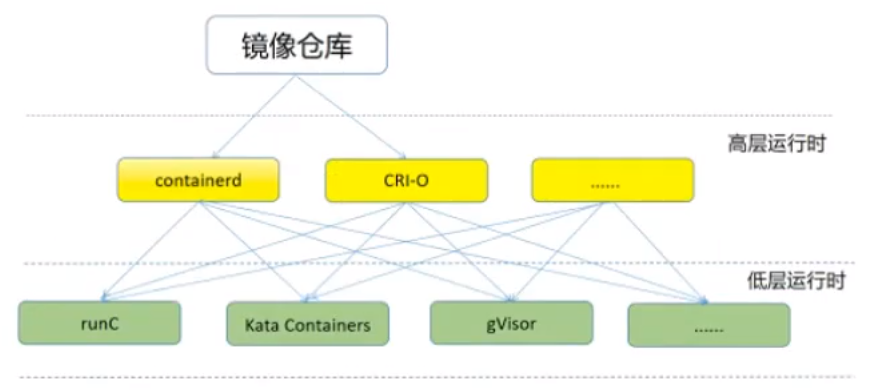

**容器运行时**(runtime)就是运行和管理容器进程、镜像的工具。即容器引擎。还有其他的，如：Containerd、rkt、Kata Container、CRI-O

分类：

1. 底层运行时

   低层运行时主要负责与宿主机操作系统交互，来管理容器的整个生命周期。具体负责执行设置容器Namespace、Cgroups等基础操作的组件。常见的低层运行时种类有:

   - runc：传统的运行时，基于Linux Namespace和Cgroups技术实现，代表实现Docker
   - runv：基于虚拟机管理程序的运行时，通过虚拟化guest kernel，将容器和主机隔离开来，使得其边界更加清晰，代表实现是Kata Container和Firecracker
   - runsc: runc + safety，通过拦截应用程序的所有系统调用，提供安全隔离的轻量级容器运行时沙箱，代表实现是谷歌的gVisor

2. 高层运行时

   高层运行时主要负责镜像的管理、转化等工作，为容器的运行做前提准备。主流的高层运行时主要containerd和CRI-O。
   高层运行时与低层运行时各司其职：

   - 容器运行时一般先由高层运行时将容器镜像下载下来，并解压转换为容器运行需要的操作系统文件
   - 再由低层运行时启动和管理容器

#### Docker基本概念

- 镜像: 模板/Class
- 容器: 实体/对象 轻量化Linux系统
- 仓库: 镜像仓库：[Docker Hub](https://hub.docker.com/)


Go语言开发的开源应用容器引擎，可以认为**容器**是不用安装操作操作系统的**虚拟化**

- 容器技术与虚拟化技术

  - 容器：App层的隔离，改变了软件了协作方式
  - 虚拟化：物理资源层面的隔离

  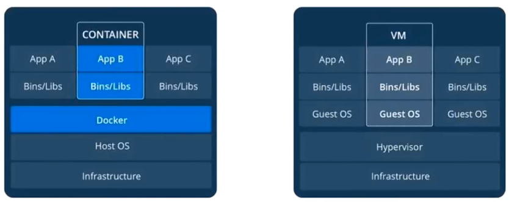

#### Docker组件

我们发现在安装Docker时，不仅会安装Docker Engine与Docker Cli工具，而且还会安装containerd，这是因为：Docker最初是一个单体引擎，主要负责容器镜像的制作、上传、拉取及容器的运行及管理。随着容器技术的繁荣发展，为了促进容器技术相关的规范生成和Docker自身项目的发展，Docker将单体引擎拆分为三部分，分别为runC、containerd和dockerd：

- runC主要负责容器的运行和生命周期的管理(即前述的低层运行时)
- containerd主要负责容器镜像的下载和解压等镜像管理功能(即高层运行时)
- dockerd主要负责提供镜像制作、上传等功能同时提供容器存储和网络的映射功功能，同时也是Docker服务器端的守护进程，用来响应Docker客户端(命令行CLI工具)发来的各种容器、镜像管理的任务。

Docker公司将**runC**捐献给了**OCI**，将**containerd**捐献给了**CNCF**，剩下的**dockerd**作为Docker运行时由Docker公司自己维护。

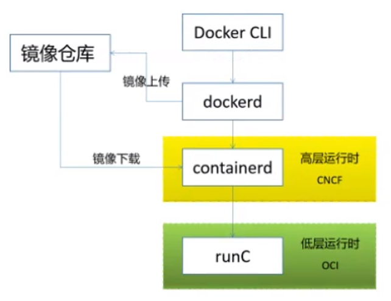

#### 两个规范

> 开放容器计划(Open Container Initiative)(OCI)是一个Linux基金会的项目。其目的是设计某些开放标准或围绕如何与容器运行时和容器镜像格式工作的结构。它是由Docker、rkt、CoreOS和其他行业领导者于2015年6月建立的。
>
> 云原生计算基金会(CNCF)成立于2015年，旨在传播和推广云原生基金会的开放标标准和项目。CNCF在市场上享有全球认可，并在定义和引领云计算的未来方面发挥着至关重要的作用。

1. 镜像规范

   该规范的目标是创建可互操作的工具，用于构建、传输和准备运行的容器镜像。
   该规范的高层组件包括:

   - 镜像清单：一个描述构成容器镜像的元素的文件
   - 镜像索引：镜像清单的注释索引
   - 镜像布局：一个镜像内容的文件系统布局
   - 文件系统布局：一个描述容器文件系统的变更集
   - 镜像配置：一确定镜像层顺序和配置的文件，以便转换成运行时捆包
   - 转换：解释应该如何进行转换的文件
   - 描述符：一个描述被引用内容的类型、元数据和内容地址的参考资料

2. 运行时规范

#### Docker架构


1. **Client**(Docker客户端)：Docker客户端是 Docker的用户界面，它可以接受用户命令和配置标识，并与 Docker daemon通信。图中， docker build等都是 Docker的相关命令。

2. **Docker Daemon**(Docker守护进程)：Docker daemon是一个运行在宿主机(DOCKER-HOST)的后台进程。可通过 Docker客户端与之通信。Containerd和RunC都是在这个部分里面的。

   - **Images**(镜像)：Docker镜像是一个只读模板，它包含创建 Docker容器的说明。它和系统安装光盘有点像，使用系统安装光盘可以安装系统，同理，使用Docker镜像可以运行 Docker镜像中的程序。
     - 测试

   - **Container**（容器)：容器是镜像的可运行实例。镜像和容器的关系有点类似于面向对象中，类和对象的关系。可通过 Docker API或者 CLI命令来启停、移动、删除容器。

3. **Registry**：一个集中存储与分发镜像的服务。构建完 Docker镜像后，就可在当前宿主机上运行。但如果想要在其他机器上运行这个镜像，就需要手动复制。此时可借助 Docker Registry来避免镜像的手动复制。
   一个 Docker Registry可包含多个 Docker仓库，每个仓库可包含多个镜像标签，每个标签对应一个 Docker镜像。这跟
   Maven的仓库有点类似，如果把 Docker Registry比作 Maven仓库的话，那么 Docker仓库就可理解为某jar包的路径，而
   镜像标签则可理解为jar包的版本号。

   Docker Registry可分为公有Docker Registry和私有Docker Registry。 最常⽤的Docker Registry莫过于官⽅的Docker
   Hub， 这也是默认的Docker Registry。 Docker Hub上存放着⼤量优秀的镜像， 我们可使⽤Docker命令下载并使⽤。

4. 一个集中存储与分发镜像的服务

   - 如果把 Docker Registry比作 Maven仓库的话

- 一个集中存储与分发镜像的服务
  - 如果把 Docker Registry比作 Maven仓库的话

#### Docker镜像分层

Docker镜像分层：https://docs.docker.com/storage/storagedriver/#container-and-layers


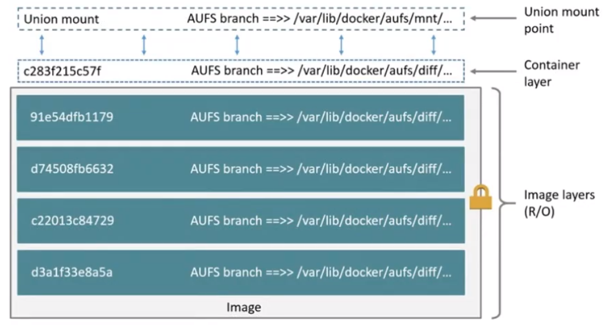

#### 容器运行机制

当我们使用docker run运行一个命令在容器中时，在容器运行时层面会发生什么?

1. 如果本地没有镜像，则从镜像登记仓库(registry)拉取镜像
2. 镜像被提取到一个写时复制(COW)的文件系统上，所有的容器层相互堆叠以形成一个合并的文件系统
3. 为容器准备一个挂载点
4. 从容器镜像中设置元数据，包括诸如覆盖CMD、来自用户输入的ENTRYPOINT、设置 SECCOMP规则等设置，以确保容器按预期运行
5. 提醒内核为该容器分配某种隔离，如进程、网络和文件系统(命名空间/namespace)
6. 提醒内核为改容器分配一些资源限制，如CPU或内存限制(控制组/cgroup)
7. 传递一个系统调用(syscall)给内核用于启动容器
8. 设置 SELinux/AppArmor

以上，就是容器运行时负责的所有的工作。当我们提及容器运行时，想到的可能是runc、lxc、containerd、rkt、cri-o等等。这些都是容器引擎和容器运行时，每一种都是为不同的情况建立的。

### Docker安装与配置

Docker 是一个开源的商业产品，有两个版本：

1. 社区版（Community Edition，缩写为 CE）
2. 企业版（Enterprise Edition，缩写为 EE）

企业版包含了一些收费服务，个人开发者一般用不到。下面的介绍都针对社区版。

Docker CE 的安装请参考官方文档，我们这里以`CentOS`为例。

#### Docker安装

##### YUM安装

###### CentOS7阿里云安装

```sh
# SOURCE: https://developer.aliyun.com/mirror/docker-ce?spm=a2c6h.13651102.0.0.3e221b11oQ0xcD

# Minimal安装需要先配置yum源
# 1.先备份CentOS-Base.repo，然后再下载
cp /etc/yum.repos.d/CentOS-Base.repo /etc/yum.repos.d/CentOS-Base.repo.backup
curl -o /etc/yum.repos.d/CentOS-Base.repo http://mirrors.aliyun.com/repo/Centos-7.repo
# 重建缓存，如果报错则重新执行
yum clean all && yum makecache


# step 1: 安装必要的一些系统工具
yum install -y yum-utils device-mapper-persistent-data lvm2
# Step 2: 添加软件源信息
yum-config-manager --add-repo https://mirrors.aliyun.com/docker-ce/linux/centos/docker-ce.repo
# Step 3: 替换官方的镜像地址为阿里云的地址，如果配置了阿里云的yum源，则不用做此步
# sed -i 's+download.docker.com+mirrors.aliyun.com/docker-ce+' /etc/yum.repos.d/docker-ce.repo
# Step 4: 更新并安装Docker-CE
yum makecache fast
yum -y install docker-ce
# Step 4: 开启Docker服务
systemctl start docker && systemctl enable docker
# Step 5: 安装校验
docker version

# 注意：
# 官方软件源默认启用了最新的软件，您可以通过编辑软件源的方式获取各个版本的软件包。例如官方并没有将测试版本的软件源置为可用，您可以通过以下方式开启。同理可以开启各种测试版本等。
# vim /etc/yum.repos.d/docker-ce.repo
#   将[docker-ce-test]下方的enabled=0修改为enabled=1
#
# 安装指定版本的Docker-CE:
# Step 1: 查找Docker-CE的版本:
# yum list docker-ce.x86_64 --showduplicates | sort -r
#   Loading mirror speeds from cached hostfile
#   Loaded plugins: branch, fastestmirror, langpacks
#   docker-ce.x86_64            17.03.1.ce-1.el7.centos            docker-ce-stable
#   docker-ce.x86_64            17.03.1.ce-1.el7.centos            @docker-ce-stable
#   docker-ce.x86_64            17.03.0.ce-1.el7.centos            docker-ce-stable
#   Available Packages
# Step2: 安装指定版本的Docker-CE: (VERSION例如上面的17.03.0.ce.1-1.el7.centos)
# yum -y install docker-ce-[VERSION]
```

###### 其他可能用到的命令

1.  设置Stable镜像仓库

    使用**[阿里巴巴开源镜像站](https://developer.aliyun.com/mirror/)**中提供的镜像

    ```shell
    # 官方，yum-config-manager是yum-utils包中的一个工具
    $ yum-config-manager --add-repo https://download.docker.com/linux/centos/docker-ce.repo
    
    # 阿里源
    $ yum-config-manager --add-repo http://mirrors.aliyun.com/docker-ce/linux/centos/docker-ce.repo
    
    # 或者使用wget进行下载到/etc/yum.repos.d/目录下，这样就不用安装yum-utils这个包了，
    $ wget -O /etc/yum.repos.d/docker-ce.repo http://mirrors.aliyun.com/docker-ce/linux/centos/docker-ce.repo
    ```

2. 查看Docker版本列表

   ```sh
   $ yum list docker-ce.x86_64  --showduplicates | sort -r
   ```

3. 安装Docker

   ```sh
   # 语法
   $ yum install docker-ce-<VERSION_STRING> docker-ce-cli-<VERSION_STRING> containerd.io
   
   # 案例：
   $ yum install docker-ce-19.03.9 docker-ce-cli-19.03.9 containerd.io
   
   # 直接安装最新稳定版
   $ yum -y install docker-ce
   ```

4. 启动并加入开机启动

   ```sh
   $ systemctl start docker && systemctl enable docker
   ```

   - 在RedHat系统下: 

     ```sh
     $ systemctl start docker.service && systemctl enable docker.service
     ```

   **或者直接使用**下面的命令启动的时候直接设置开机启动

   ```sh
   $ systemctl enable --now docker
   ```

5. 测试安装

   ```sh
   $ docker version
   ```

##### Linux通用发行版安装

###### 一键安装

```
curl -fsSL https://get.docker.com | bash -s docker --mirror Aliyun
```

解释这条命令中的参数：

1. `curl`：这是一个命令行工具，用于传输数据，支持多种协议，如 HTTP、HTTPS、FTP 等。在这个命令中，它用于从指定的 URL 下载数据。
2. `-fsSL`：这些是 `curl` 的选项，它们的含义如下：
   - `-f`：如果服务器返回错误（如 404 Not Found），则不显示错误信息。
   - `-s`：静默模式，不显示进度条和错误信息。
   - `-S`：如果发生错误，显示错误信息。
   - `-L`：如果服务器返回重定向响应，自动跟随重定向。
3. `https://get.docker.com`：这是 `curl` 命令要下载的 URL。它指向 Docker 官方提供的安装脚本。
4. `|`：这是一个管道操作符，它将前一个命令的输出作为后一个命令的输入。
5. `bash`：这是一个 shell 解释器，用于执行脚本。在这个命令中，它用于执行从 `curl` 下载的脚本。
6. `-s`：这是 `bash` 的选项，表示静默模式，不显示脚本的命令输出。
7. `docker`：这是传递给脚本的参数，告诉脚本安装 Docker 相关的软件包。
8. `--mirror Aliyun`：这是传递给脚本的另一个参数，告诉脚本使用阿里云的镜像源来加速下载过程。`--mirror` 是一个参数，`Aliyun` 是该参数的值。

综上所述，这条命令的目的是从 Docker 官方提供的安装脚本下载并执行，以安装 Docker。它使用了阿里云的镜像源来加速下载过程，并且在执行过程中不会显示脚本的命令输出。如果在执行过程中遇到错误，`curl` 会显示错误信息，而 `bash` 会静默执行。

###### 下载安装

[CentOS - Docker — 从入门到实践 (gitbook.io)](https://yeasy.gitbook.io/docker_practice/install/centos)

Docker官方为了使开发人员在开发或者测试过程中寻找不同Linux发行版本的安装, 发布了一个Linux发布版通用安装脚本, 该脚本会把当前最新稳定版本安装到你的系统中

1. 下载并执行脚本

   ```sh
   $ curl -fsSL get.docker.com -o get-docker.sh
   $ sh get-docker.sh --mirror Aliyun
   ```

   安装过程很慢

   ```
   [root@centos79 Docker]# sh get-docker.sh --mirror Aliyun
   # Executing docker install script, commit: 4f282167c425347a931ccfd95cc91fab041d414f
   + sh -c 'yum install -y -q yum-utils'
   Package yum-utils-1.1.31-54.el7_8.noarch already installed and latest version
   + sh -c 'yum-config-manager --add-repo https://mirrors.aliyun.com/docker-ce/linux/centos/docker-ce.repo'
   Loaded plugins: fastestmirror, langpacks
   adding repo from: https://mirrors.aliyun.com/docker-ce/linux/centos/docker-ce.repo
   grabbing file https://mirrors.aliyun.com/docker-ce/linux/centos/docker-ce.repo to /etc/yum.repos.d/docker-ce.repo
   repo saved to /etc/yum.repos.d/docker-ce.repo
   + '[' stable '!=' stable ']'
   + sh -c 'yum makecache'
   Loaded plugins: fastestmirror, langpacks
   Loading mirror speeds from cached hostfile
    * base: mirrors.huaweicloud.com
    * extras: mirrors.huaweicloud.com
    * updates: mirrors.huaweicloud.com
   base                                                                                                                                   | 3.6 kB  00:00:00
   docker-ce-stable                                                                                                                       | 3.5 kB  00:00:00
   extras                                                                                                                                 | 2.9 kB  00:00:00
   updates                                                                                                                                | 2.9 kB  00:00:00
   Metadata Cache Created
   + sh -c 'yum install -y -q docker-ce docker-ce-cli containerd.io docker-scan-plugin docker-compose-plugin docker-ce-rootless-extras'
   No Presto metadata available for docker-ce-stable
   warning: /var/cache/yum/x86_64/7/docker-ce-stable/packages/docker-ce-cli-20.10.18-3.el7.x86_64.rpm: Header V4 RSA/SHA512 Signature, key ID 621e9f35: NOKEY
   Public key for docker-ce-cli-20.10.18-3.el7.x86_64.rpm is not installed
   Importing GPG key 0x621E9F35:
    Userid     : "Docker Release (CE rpm) <docker@docker.com>"
    Fingerprint: 060a 61c5 1b55 8a7f 742b 77aa c52f eb6b 621e 9f35
    From       : https://mirrors.aliyun.com/docker-ce/linux/centos/gpg
   
   ================================================================================
   
   To run Docker as a non-privileged user, consider setting up the
   Docker daemon in rootless mode for your user:
   
       dockerd-rootless-setuptool.sh install
   
   Visit https://docs.docker.com/go/rootless/ to learn about rootless mode.
   
   
   To run the Docker daemon as a fully privileged service, but granting non-root
   users access, refer to https://docs.docker.com/go/daemon-access/
   
   WARNING: Access to the remote API on a privileged Docker daemon is equivalent
            to root access on the host. Refer to the 'Docker daemon attack surface'
            documentation for details: https://docs.docker.com/go/attack-surface/
   
   ================================================================================
   ```

   > 大约在0.6版，privileged被引入docker。
   > 使用该参数，container内的root拥有真正的root权限。
   > 否则，container内的root只是外部的一个普通用户权限。
   > privileged启动的容器，可以看到很多host上的设备，并且可以执行mount。
   > 甚至允许你在docker容器中启动docker容器。
   >
   > from: [Docker的privileged的作用_IChen.的博客-CSDN博客_docker privileged](https://blog.csdn.net/ichen820/article/details/120508201)

2. 开机自启 & 启动Docker

   ```sh
   $ systemctl enable docker
   $ systemctl start docker
   ```

3. 创建Docker用户组, 并将当前用户加入该用户组

   ```sh
   $ groupadd docker
   $ usermod -aG docker $USER
   ```

   - **Note**: 可以直接使用第二个命令, 会自动创建不存在的用户组

4. 其他的就参考 `## 常规安装`

##### Ubuntu 20.04

```
apt update
apt install -y apt-transport-https ca-certificates curl software-properties-common
curl -fsSL https://download.docker.com/linux/ubuntu/gpg | apt-key add - && add-apt-repository "deb [arch=amd64] http://mirrors.aliyun.com/docker-ce/linux/ubuntu $(lsb_release -cs) stable"
apt install -y docker-ce
```

##### 二进制包安装

无法进行动态更新，所以非常不推荐

官方文档：https://docs.docker.com/engine/install/binaries/

```sh
# 获取二进制文件，此文件中包含dockerd与docker 2个文件。
$ wget https://download.docker.com/linux/static/stable/x86_64/docker-20.10.9.tgz

# 解压下载的文件
$ tar xf docker-20.10.9.tgz

# 查看解压出的目录
$ ls docker

# 安装解压后的所有二进制文件
$ cp docker/* /usr/bin/

# 运行Daemon
$ dockerd &

# 确认是否可以使用docker客户端命令
$ which docker

# 使用二进制安装的docker客户端
$ docker version
```

#### 用户组

docker运行一般需要root权限，但是如果使用sudo命令，环境变量就会发生变化

```
$ groupadd docker
$ usermod -aG docker $USER
$ newgrp docker
```

#### 测试

```shell
$ docker run hello-world
$ docker images
```

#### 镜像加速

在安装完Docker以后需要配置镜像加速，否则默认连接国外的镜像，很可能连接不上

2024年6月份左右国内镜像源大部分失效，下面的阿里云和腾讯云镜像都出问题了，这里根据[网上的资料整理了几个](https://blog.csdn.net/BADAO_LIUMANG_QIZHI/article/details/140767426)如下：

```sh
mkdir -p /etc/docker
tee /etc/docker/daemon.json <<-'EOF'
{
  "registry-mirrors": [
    "https://gallery.ecr.aws/",
    "https://gitverse.ru/docs/artifactory/gitverse-registry/",
    "https://docker.lmirror.top",
    "https://atomhub.openatom.cn/"
  ]
}
EOF
systemctl daemon-reload
systemctl restart docker
```

##### ~~阿里云镜像加速~~

- 阿里云镜像加速器：https://cr.console.aliyun.com/cn-hangzhou/instances/mirrors

  - 通过修改daemon配置文件/etc/docker/daemon.json来使用加速器

  ```sh
  mkdir -p /etc/docker
  tee /etc/docker/daemon.json <<-'EOF'
  {
    "registry-mirrors": ["https://7eyfz1ob.mirror.aliyuncs.com"]
  }
  EOF
  systemctl daemon-reload
  systemctl restart docker
  ```

- 执行响应的命令即可

##### ~~腾讯云镜像加速~~

```sh
mkdir -p /etc/docker
tee /etc/docker/daemon.json <<-'EOF'
{
  "registry-mirrors": [
        "https://mirror.ccs.tencentyun.com",
        "https://hub-mirror.c.163.com",
        "https://mirror.baidubce.com"
    ]
}
EOF
systemctl daemon-reload
systemctl restart docker
```

#### 卸载

```shell
$ docker stop `docker ps -a -q`
$ docker rm `docker ps -a -q` # 删除所有已经停止的容器
$ docker rmi -f `docker images -a -q` # 删除所有已经停止的镜像
$ yum -y remove docker docker-common container-selinux
```

`docker rm -v <container-name>` # 删除容器并删除容器挂载的数据卷

#### 安装示例

##### Nginx

```shell
#### 创建Nginx挂载目录
$ mkdir -p /opt/docker/nginx/conf/conf.d
$ mkdir -p /opt/docker/nginx/html
$ mkdir -p /opt/docker/nginx/logs

# 拉取镜像
$ docker pull nginx

# 8080:80 把nginx的80端口映射到宿主机的8080
$ docker run -d \
-p 80:80 \
--name Nginx \
--restart always \
-v /opt/docker/nginx/conf/nginx.conf:/etc/nginx/nginx.conf \
-v /opt/docker/nginx/conf/conf.d:/etc/nginx/conf.d \
-v /opt/docker/nginx/html:/usr/share/nginx/html \
-v /opt/docker/nginx/logs:/var/log/nginx \
nginx

# 需要拷贝吗？？？？？？？？
docker cp nginx:/etc/nginx/nginx.conf /opt/docker/nginx/conf/nginx.conf
docker cp nginx:/etc/nginx/conf.d /opt/docker/nginx/conf
docker cp nginx:/usr/share/nginx/html /opt/docker/nginx

# 查看运行中的镜像
$ docker ps

# 配置访问首页，代码见下
$ vi /opt/docker/nginx/html/index.html

# 宿主机测试访问nginx
$ curl localhost:80

# 进入容器实例修改配置(使用数据卷的技术在容器外部提供一个映射路径打到不用每次进入容器修改配置的目的)
$ docker exec -it Nginx /bin/bash

# 重启
docker exec -t Nginx nginx -t

# 重新加载配置
docker exec -t Nginx nginx -s reload
```

```html
<!DOCTYPE html>
<html>
<head>
    <title>Nice Coding</title>
    <style>
        body {
            width: 35em;
            margin: 0 auto;
            font-family: Tahoma, Verdana, Arial, sans-serif;
        }
    </style>
</head>
<body>
    <h1>Welcome to Nice Coding</h1>
    <h1>This site is in building ...</h1>
</body>
</html>
```

##### Tomcat

```shell
# 临时运行
$ docker run -it --rm tomcat:9.0
  # --rm 用完即删
# 常用方式
$ docker run -p 80:8080 -d tomcat
```

##### CentOS

```sh
# centos 创建后会退出，利用 -it /bin/bash 保证其不退出
$ docker run -d --name database -it centos /bin/bash
```

##### 报错合集

- iptables

  ```sh
  $ docker run -d --name reids -p 6379:6379 redis:5
  docker: Error response from daemon: driver failed programming external connectivity on endpoint reids (514e6d5421128f71dd329059c35748ba12c849f602d825bc67a7df70b78db0d1):  (iptables failed: iptables --wait -t nat -A DOCKER -p tcp -d 0/0 --dport 6379 -j DNAT --to-destination 172.18.0.3:6379 ! -i docker0: iptables: No chain/target/match by that name.
   (exit status 1)).
  ```

  - 重启docker解决：`systemctl restart docker`，注意一下是否有其他服务正在运行

### 操作命令

> 官方：https://docs.docker.com/reference/
>
> Docker命令文档-cjavapy编程之路：https://www.cjavapy.com/category/93/

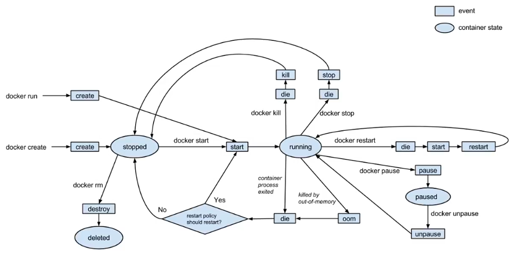

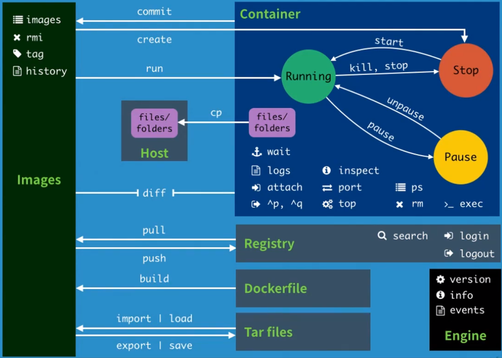

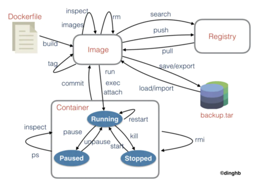

- 官方命令地址: 

  - https://docs.docker.com/engine/reference/run/

- 帮助命令

  ```shell
  $ docker version # 版本信息
  $ docker info # docker系统级信息
  $ docker <cmd> --help # 命令手册
  $ docker stats  # 查看CPU信息
  ```

  - 查看Docker驱动信息：`docker info | grep driver`

#### 镜像命令：docker image/search

> Docker容器镜像本地存储位置：/var/lib/docker/image
> 考虑到docker容器镜像会占用本地存储空间，建议搭建其它存储系统挂载到本地以便解决占用大量本地存储的问题。

```sh
# docker image --help

Usage:  docker image COMMAND

Manage images

Commands:
  build       Build an image from a Dockerfile
  history     Show the history of an image
  import      Import the contents from a tarball to create a filesystem image
  inspect     Display detailed information on one or more images
  load        Load an image from a tar archive or STDIN
  ls          List images
  prune       Remove unused images
  pull        Pull an image or a repository from a registry
  push        Push an image or a repository to a registry
  rm          Remove one or more images
  save        Save one or more images to a tar archive (streamed to STDOUT by default)
  tag         Create a tag TARGET_IMAGE that refers to SOURCE_IMAGE

Run 'docker image COMMAND --help' for more information on a command.
```

```sh
$ docker images # 查看本机所有镜像
$ docker image list # 查看本机所有镜像
$ docker image ls # 查看本机所有镜像
$ docker image inspect <image-name>[:<tag>] # 查看镜像详细信息
$ docker image save <image-name> -o <new-name.img> # 导出镜像保存为文件
$ docker image load -i <new-name.img> # 从文件导入

$ docker search <image-name> # 搜索镜像
$   docker search mysql --filter=STARS=3000 # 搜索star大于等于3000的镜像
$ docker pull <image-name>[:<tag>]
$ docker rmi [-f] <image-name|image-id>
$ docker rmi -f $(docker images -qa) # 删除多个可以使用空格隔开
```

- `docker images`

  ```
  输出解析：
  - REPOSITORY：镜像所属仓库名称。
  - TAG:镜像标签。默认是 latest,表示最新。
  - IMAGE ID：镜像 ID，表示镜像唯一标识。
  - CREATED：镜像创建时间。
  - SIZE: 镜像大小。
  ```

- `docker search <image-name>`

  ```sh
  输出解析：
  - NAME:镜像仓库名称。
  - DESCRIPTION:镜像仓库描述。
  - STARS：镜像仓库收藏数，表示该镜像仓库的受欢迎程度，类似于 GitHub的 stars0
  - OFFICAL:表示是否为官方仓库，该列标记为[0K]的镜像均由各软件的官方项目组创建和维护。
  - AUTOMATED：表示是否是自动构建的镜像仓库。
  ```


#### 网络管理命令：docker network

```sh
$ docker network --help

Usage:  docker network COMMAND

Manage networks

Options:


Commands:
  connect     Connect a container to a network
  create      Create a network
  disconnect  Disconnect a container from a network
  inspect     Display detailed information on one or more networks
  ls          List networks
  prune       Remove all unused networks
  rm          Remove one or more networks

Run 'docker network COMMAND --help' for more information on a command.
```

默认情况下每个容器有自己的局域网

```sh
$ docker network ls
$ docker network create <net-name>
```

#### 文件存储命令：docker volume

```sh
$ docker volume --help

Usage:  docker volume COMMAND

Manage volumes

Options:


Commands:
  create      Create a volume
  inspect     Display detailed information on one or more volumes
  ls          List volumes
  prune       Remove all unused local volumes
  rm          Remove one or more volumes

Run 'docker volume COMMAND --help' for more information on a command.
```

查看容器的挂载目录

```sh
# 准备环境
yum install -y python-pip
pip3 install runlike

# 查看名称为Nginx的启动参数(可用来查看容器挂载的目录)
runlike -p Nginx

# 查看容器的挂载目录
docker inspect Nginx | grep Mounts -A 20

# favicon.ico docker nginx 403：内部和外部都需要添加其他用户执行权限
chmod a+r /usr/share/nginx/html/favicon.ico
```

#### 日志管理命令：docker logs

```sh
$ docker logs -ft --tail [<line-num>] <container-id>
$ docker logs -f <container-id>
```

#### 容器管理命令：docker container

```sh
$ docker container --help
```

##### 重点命令

1. docker container run：创建并启动容器

2. docker container stop：优雅退出容器

3. docker container kill：强杀容器

4. docker container restart：启动已经存在的容器

5. docker container logs：查看容器日志，控制台标准输出

   ```sh
   # 查看指定容器日志
   $ docker container logs <container-name|container-id>
   ```

##### 命令列表

| 命令                                                         | 描述                                     |
| ------------------------------------------------------------ | ---------------------------------------- |
| [docker container attach](http://www.yiibai.com/docker/container_attach.html) | 进入正在运行的容器                       |
| [docker container commit](http://www.yiibai.com/docker/container_commit.html) | 从容器的更改创建一个新的映像             |
| [docker container cp](http://www.yiibai.com/docker/container_cp.html) | 在容器和本地文件系统之间复制文件/文件夹  |
| [docker container create](http://www.yiibai.com/docker/container_create.html) | 创建一个新的容器                         |
| [docker container diff](http://www.yiibai.com/docker/container_diff.html) | 检查容器文件系统上文件或目录的更改       |
| [docker container exec](http://www.yiibai.com/docker/container_exec.html) | 在运行容器中运行命令                     |
| [docker container export](http://www.yiibai.com/docker/container_export.html) | 将容器的文件系统导出为tar存档            |
| [docker container inspect](http://www.yiibai.com/docker/container_inspect.html) | 显示一个或多个容器的详细信息             |
| [docker container kill](http://www.yiibai.com/docker/container_kill.html) | 杀死一个或多个运行容器                   |
| [docker container logs](http://www.yiibai.com/docker/container_logs.html) | 获取容器的日志                           |
| [docker container ls](http://www.yiibai.com/docker/container_ls.html) | 列出容器                                 |
| [docker container pause](http://www.yiibai.com/docker/container_pause.html) | 暂停一个或多个容器内的所有进程           |
| [docker container port](http://www.yiibai.com/docker/container_port.html) | 列出端口映射或容器的特定映射             |
| [docker container prune](http://www.yiibai.com/docker/container_prune.html) | 释放所有停止的容器                       |
| [docker container rename](http://www.yiibai.com/docker/container_rename.html) | 重命名容器                               |
| [docker container restart](http://www.yiibai.com/docker/container_restart.html) | 重新启动一个或多个容器                   |
| [docker container rm](http://www.yiibai.com/docker/container_rm.html) | 删除(移除)一个或多个容器                 |
| [docker container run](http://www.yiibai.com/docker/container_run.html) | 在新容器中运行命令                       |
| [docker container start](http://www.yiibai.com/docker/container_start.html) | 启动一个或多个停止的容器                 |
| [docker container stats](http://www.yiibai.com/docker/container_stats.html) | 显示容器的实时流资源使用统计信息         |
| [docker container stop](http://www.yiibai.com/docker/container_stop.html) | 停止一个或多个运行容器                   |
| [docker container top](http://www.yiibai.com/docker/container_top.html) | 显示容器的正在运行的进程                 |
| [docker container unpause](http://www.yiibai.com/docker/container_unpause.html) | 取消暂停一个或多个容器内的所有流程       |
| [docker container update](http://www.yiibai.com/docker/container_update.html) | 更新一个或多个容器的配置                 |
| [docker container wait](http://www.yiibai.com/docker/container_wait.html) | 阻止一个或多个容器停止，然后打印退出代码 |

#### 容器启动命令：docker run

```shell
$ docker run [OPTIONS] IMAGE [COMMAND] [ARG...]
Options:
  -d #守护进程的方式运行
  -e #等同environment
  -p #指定容器端口
    -p <ip>:<host-port>:<container-port>
    -p <host-port>:<container-port>
    -p <container-port>
  -v #存储挂载，相当于volumes
  -it # 进入容器控制台
    -i # 交互式
    -t # 提供终端
  --net    #指定要加入的网络，该选项有以下可选参数：
    --net=bridge #默认选项，表示连接到默认的网桥
    --net=host #容器使用宿主机的网络
    --net=container:<container-name|container-id> #告诉Docker让新建的容器使用已有容器的网络配置
    --net=none #不配置该容器的网络，用户可自定义网络配置
  --pid <pid> #PID namespace to use
  --ipc <ipc-mode> #IPC mode to use
  --restart=always # docker服务重启后该服务自动启动
  --link #连接到某容器
  --name #容器名称
  --rm # 停止运行后自动删除当前容器
  --shm-size="2048k"
```

* 关于容器的退出：当我们使用交互式进入容器后想要退出有良好总方案,一种是退出且容器停止运行`exit`,另外一种就是退出但是不结束运行,使用快捷键`Ctrl`+`p`+`q`
* `-e`和`-p`和`-v`参数可以多次使用指定多个

示例：

```sh
# 启动nginx
docker run -d
-p 80:80 \
-v /opt/nginx-server/html:/usr/share/nginx/html:ro \
-v /opt/nginx-server/conf/nginx.conf:/etc/nginx/nginx.conf:ro \
--name nginx-server \
nginx:latest

# 后台启动: 
$ docker run -d <image-name|image-id>

# 启动时运行脚本: 
$ docker run -d centos /bin/bash -c "while true;do echo nice;sleep 1;done"

# 启动容器后进入容器
$ docker run -it --name c1 centos:latest bash

===== 注意：如果命令最后不加bash或者sh，那么只是执行命令，并不会进入交互界面 =====
```

#### 容器实例查看：docker ps

```sh
$ docker ps[ <options>] # 查看容器运行了哪些实例
  options:
    -a/--all  #显示正在运行的和运行过的所有容器
    -n        #执指定显示的运行过的实例个数
    -q        #只显示id字段

# 获取所有容器的id列表
$ docker ps -aq
$ docker ps --all | awk '{if (NR>=2){print $1}}'
$ docker ps --format "table {{.ID}}\t{{.Image}}\t{{.Ports}}\t{{.Status}}\t{{.Names}}"
# 可以通过在`~/.bashrc`中添加一下命令的方式给这个命令起个别名
alias pss='docker ps --format "table {{.ID}}\t{{.Image}}\t{{.Ports}}\t{{.Status}}\t{{.Names}}"'
source ~/.bashrc
```

- 参数解析

  ```
  - CONTAINER_ID：表示容器 ID。
  - IMAGE:表示镜像名称。
  - COMMAND：表示启动容器时运行的命令。
  - CREATED：表示容器的创建时间。
  - STATUS：表示容器运行的状态。UP表示运行中， Exited表示已停止。
  - PORTS:表示容器对外的端口号。
  - NAMES:表示容器名称。该名称默认由 Docker自动生成，也可使用 docker run命令的--name选项自行指定。
  ```

#### 容器状态命令：docker start/restart/stop/kill/rm

```sh
# 正常停止指定容器
$ docker start/restart/stop/kill/rm <container-name|container-id>

# 批量管理容器的运行状态
$ docker start/restart/stop/kill $(docker ps -aq)
$ docker ps --all | awk '{if (NR>=2){print $1}}' | xargs docker start/restart/stop/kill

# kill命令发送 SIGKILL信号来强制停止容器
$ docker kill <container-name|container-id>
```

#### 复制文件命令：docker cp

```sh
# 从容器里面拷文件到宿主机
$ docker cp <container-name|container-id>:<file-path-in-container> <host-path>

# 从宿主机拷文件到容器里面
$ docker cp <file-path-in-host> <container-name|container-id>:<container-path>
```

#### 容器执行命令：docker exec/attach

> 进入容器后 按住ctr1键再按p键与q键，可以退出交互式的容器，容器会处于运行状态，即容器不会停止运行。
>
> 但是键入`exit`会退出终端且使容器停止运行。

```sh
# 进入容器执行命令，有的容器需要把 /bin/bash 换成 /bin/sh
$ docker exec ‐it <container-name|container-id> /bin/bash

# 容器外部执行命令
$ docker exec -i Nginx nginx -s reload

# 连接正在运行的容器终端，退出后不会造成主容器的退出： 
$ docker exec -it <container-id> /bin/sh

# 连接正在运行的容器终端，退出后通常会造成容器终止运行，因为这个操作是在和容器的主进程进行交互: 
$ docker attach <container-id> /bin/sh
```

#### 容器进程查看：docker top

> 用来查看容器内部进程信息的查看

```sh
$ docker top <container-name|container-id>
```

输出说明

- UID：容器中运行的命令用户ID
- PID：容器中运行的命令PID
- PPID：容器中运行的命令父PID，由于PPID是一个容器，此可指为容器在Docker Host中进程ID
- C：占用CPU百分比
- STIME：启动时间
- TTY：运行所在的终端
- TIME：运行时间
- CMD：执行的命令

#### 其他常用命令

##### 查看容器信息：docker inspect

```sh
Usage:  docker inspect [OPTIONS] NAME|ID [NAME|ID...]

Return low-level information on Docker objects

Options:
  -f, --format string   Format output using a custom template:
                        'json':             Print in JSON format
                        'TEMPLATE':         Print output using the given Go template.
                        Refer to https://docs.docker.com/go/formatting/ for more information about formatting output with templates
  -s, --size            Display total file sizes if the type is container
      --type string     Return JSON for specified type
============================================================

示例
# 将docker检查限制为特定类型的对象
$ docker inspect --type=volume myvolume

# 检查容器的大小
$ docker inspect --size mycontainer

# 获取实例的IP地址
$ docker inspect --format='{{range .NetworkSettings.Networks}}{{.IPAddress}}{{end}}' $INSTANCE_ID

# 获取实例的MAC地址
$ docker inspect --format='{{range .NetworkSettings.Networks}}{{.MacAddress}}{{end}}' $INSTANCE_ID

# 获取实例的日志路径
$ docker inspect --format='{{.LogPath}}' $INSTANCE_ID

# 获取实例的镜像名称
$ docker inspect --format='{{.Config.Image}}' $INSTANCE_ID

# 列出所有端口绑定
$ docker inspect --format='{{range $p, $conf := .NetworkSettings.Ports}} {{$p}} -> {{(index $conf 0).HostPort}} {{end}}' $INSTANCE_ID

# 获取JSON格式的结果
$ docker inspect --format='{{json .Config}}' $INSTANCE_ID

# 找到一个特定的端口映射
docker inspect --format='{{(index (index .NetworkSettings.Ports "<port>/tcp") 0).HostPort}}' $INSTANCE_ID

$ docker run --name database -d redis
3b2cbf074c99db4a0cad35966a9e24d7bc277f5565c17233386589029b7db273
$ docker inspect --size database -f '{{ .SizeRootFs }}'
123125760
$ docker inspect --size database -f '{{ .SizeRw }}'
8192
$ docker exec database fallocate -l 1000 /newfile
$ docker inspect --size database -f '{{ .SizeRw }}'
12288
```

查看容器的详细元数据信息: `docker inspect <container-id>`

- NetworkSetting：网络配置，即可以查看VIP
- State：当前虚拟机的状态
- Name：虚拟机名称

> 注意, 这个命令是一个通用命令, 后面的**名称**可以是容器名称, 网桥名称, 也可以是数据卷名称, 当命令中没有明确指定查询哪个的详细信息并且出现重名的时候, 默认顺序是: 容器名称, 网桥名称, 数据卷名称
>
> `docker network inspect <bridge-name>`
>
> `docker volumn inspect <volumn-name>`

##### 修改镜像Tag：`docker tag

修改镜像Tag：`docker tag <image-id> <org>/<image-name>:<tag>`

#### 命令进阶

##### 可视化

- portainer: Docker的图形化界面管理工具

  ```shell
  # 启动
  $ docker run -d -p 8088:9000 --restart=always -v /var/run/docker.sock:/var/run/docker.sock --privileged=true portainer/portainer
  # 访问测试
  $ curl localhost:8088
  ```

- Rancher

##### 查看容器资源占用情况

> 显示容器资源使用情况统计信息的实时流

```sh
$ docker stats [OPTIONS] [CONTAINER...]
Options:
  -a, --all             Show all containers (default shows just running)
      --format string   Format output using a custom template:
                        'table':            Print output in table format with column headers (default)
                        'table TEMPLATE':   Print output in table format using the given Go template
                        'json':             Print in JSON format
                        'TEMPLATE':         Print output using the given Go template.
                        Refer to https://docs.docker.com/go/formatting/ for more information about formatting output with templates
      --no-stream       Disable streaming stats and only pull the first result
      --no-trunc        Do not truncate output
```

##### 删除所有未被占用的资源

> 被用于清理不再需要的资源，如镜像、容器、网络和卷。

```sh
# 删除未使用的容器镜像
$ docker image prune
$ docker image prune -a

# 删除所有停止运行的容器
$ docker container prune

# 删除所有未被挂载的卷
$ docker volume prune

# 删除所有未被占用的网络
$ dockernetwork prune

# 删除docker所有未被占用资源
$ docker system prune
```

## Docker镜像

### 镜像概述

1. Docker镜像是只读的容器模板，是Docker容器基础，是容器的静止状态
2. 为Docker容器提供了静态文件系统运行环境(rootfs)
3. 容器是镜像的运行状态

### 操作命令

#### docker commit

把执行这个命令时刻的容器状态作为构建镜像的节点

```sh
$ docker commit [OPTIONS] CONTAINER [REPOSITORY[:TAG]]
# Create a new image from a container's changes

Aliases:
  docker container commit, docker commit

Options:
  -a, --author string    Author (e.g., "John Hannibal Smith <hannibal@a-team.com>")
  -c, --change list      Apply Dockerfile instruction to the created image
  -m, --message string   Commit message
  -p, --pause            Pause container during commit (default true)

# 常用：
$ docker commit <container-name|container-id>
```

#### docker build

构建镜像

#### 本地镜像保存到文件：docker save

```sh
# centos:latest保存到文件centos.tar
$ docker save -o centos.tar centos:latest
```

#### 文件导入本地镜像库：docker load

```sh
$ docker load -i centos.tar
```

#### 运行中的容器导出为文件：docker export

```sh
$ docker export -o centos7.tar <container-name|container-id>
```

#### 文件导入为运行的容器：docker import

```sh
$ docker import centos7.tar centos7:v1
```

### Dockerfile

#### 认识Dockerfile

- Dockerfile是一个包含用于组合镜像的命令的文本，用于描述了构建镜像的细节
- Docker通过Dockerfile中的指令按部就班的自动生成镜像

#### Dockerfile命令

##### 基准镜像 ：FROM

```dockerfile
FROM <image-name>[:tag]
FROM scratch # 不要任何基准镜像
```

##### 说明信息：MAINTAINER/LABEL

```dockerfile
MAINTAINER <maintainer>
LABEL version = "1.0"
LABEL description = "这么吊"
```

##### 切换目录：WORKDIR

```dockerfile
WORKDIR <dir>
```

- 尽量使用绝对路径
- 目录不存在则直接创建，然后切换

##### 复制文件：ADD/COPY

```dockerfile
ADD <source> <dest>
COPY <source> <dest>
```

- 压缩文件会解压
- 获取远程文件

##### 环境变量：ENV

```dockerfile
ENV <cont-name> <path>
ENV JAVA_HOME /usr/local/JDK8
```

- 使用`${}`进行引用

##### 执行指令：RUN/CMD/ENTRYPOINT

- 执行指令的方式

  ```dockerfile
  # 安装vim：
  # Shell命令格式：创建子进程执行命令，执行完成后回到父进程环境
  RUN yum install -y vim
  CMD yum install -y vim
  ENTRYPOINT yum install -y vim
  
  # Exec命令格式：使用Exec进程替换当前进程，并保持PID不变，执行完成后退出，不会回到之前的进程环境
  RUN ["yum", "install", "-y", "vim"]
  CMD ["yum", "install", "-y", "vim"]
  ENTRYPOINT ["yum", "install", "-y", "vim"]
  ```

  - 注意Shell方式默认可以识别变量，但是Exec需要作出调整

    - shell

      ```dockerfile
      # 此种方式可行
      FROM centos
      ENV name Docker
      ENTRYPOINT echo "echo $name"
      ```

    - Exec

      ```dockerfile
      # 此种方式不可行，会直接输出："echo $name"
      FROM centos
      ENV name Docker
      ENTRYPOINT ［"/bin/echo", "echo $name"]
      
      # 需要指定以Shell方式运行：
      FROM centos
      ENV name Docker
      ENTRYPOINT［"/bin/bash", "-c", "echo echo $name"] # 如果使用-c参数，后面只能有一个参数，所以只能写到一起
      ```

- 三个指令

  - `RUN`：在构建的时候执行指令，并创建新的镜像层(Image Layer)
  - `CMD`：容器启动后默认执行的命令或参数
    - Dockerfile中有多个`CMD`时，只有最后一个会被执行
    - 如果`ENTRYPOINT`后面有`CMD`时，`CMD`会作为`ENTRYPOINT`的参数，即合并执行
    - 如果容器启动时启动命令后附加命令，则CMD会被忽略，即启动的参数命令回覆盖Dockfile中的CMD指令

  - `ENTRYPOINT`：让容器以应用程序或者服务的形式运行
    - Dockerfile中有多个`ENTRYPOINT`时，不会被忽略，全部执行


- 暴露端口

  ```
  EXPOSE <port>
  ```


#### 构建Dockerfile

- 构建命令：`docker build -t <org-id> <image-name>[:tag]<target-dir>`

  ```sh
  docker build -t shreker.psn/hellotom:0.1 ./
  ```

  - 注意：仓库名称必须是小写

- 运行访问

  ```sh
  docker run --name  hellotom -d -p 80:8080 shreker.psn/hellotom:0.1
  ```

#### Dockerfile编写案例

##### HelloTom

- 创建一个目录：`mkdir -p images/HelloTom`

- 在images目录下根据下面的步骤编写Dockerfile

- 在HelloTom下新建目录和文件Dockerfile

  ```
  # 设置基准镜像
  FROM tomcat:latest
  # 镜像维护者或者拥有者
  MAINTAINER shreker.psn
  # 切换工作目录，不存在就创建
  WORKDIR /usr/local/tomcat/webapps
  # 将指定的文件或目录复制到具体的目录下
  ADD docker-web ./docker-web
  ```

- 资源路径

  ```
  [root@shreker images]# tree
  .
  ├── Dockerfile
  └── HelloTom
      └── index.html
  
  1 directory, 2 files
  ```

##### Redis

```dockerfile
FROM centos
RUN ["yum" , "install" , "-y" ,"gcc","gcc-c++","net-tools","make"]
WORKDIR /usr/local
ADD redis-4.0.14.tar.gz .
WORKDIR /usr/local/redis-4.0.14/src
RUN make && make install
WORKDIR /usr/local/redis-4.0.14
ADD redis-7000.conf .
EXPOSE 7000
CMD ["redis-server","redis-7000.conf"]
```

##### JavaWeb

1. 从头开始：

   ```dockerfile
   # 指定基础镜像
   FROM ubuntu:16.04
   # 配置环境变量，JDK的安装目录、容器内时区
   ENV JAVA DIR=/usr/local
   # 拷贝jdk和java项目的包
   COPY ./jdk8.tar.gz $JAVA_DIR/
   COPY ./docker-demo.jar /tmp/app.jar
   #安装JDK
   RUN cd $JAVA_DIR|&& tar -xf ./jdk8.tar.gz && mv ./jdk1.8.0_144 ./java8
   # 配置环境变量
   ENV JAVA_HOME=$JAVA_DIR/java8
   ENV PATH=$PATH:$JAVA_HOME/bin
   #入口，java项目的启动命令
   ENTRYPOINT ["java","-jar","/app.jar"]
   ```

2. 基于已有的镜像

   ```dockerfile
   #基础镜像
   FROM openjdk:11.0-jre-buster
   #设定时区
   ENV TZ=Asia/Shanghai
   RUN ln -snf /usr/share/zoneinfo/$TZ /etc/localtime && echo $TZ > /etc/timezone#拷贝jar包
   COPY docker-demo.jar /app.jar
   #入口
   ENTRYPOINT ["java"，"-jar"，"/app.jar"]
   ```

#### Dockerfile实战

> 打包一个Python程序，并运行
>
> > 环境：Python 2.7

1. 创建Python程序

   ```python
   # app.py
   from flask import Flask
   app = Flask(__name__)
   @app.route('/')
   def hello():
    return "hello docker"
   if __name__ =='__main__':
    app.run()
   ```

2. 创建Dockerfile

   ```dockerfile
   FROM python:2.7
   LABEL maintainer="Test<test@qq.com>"
   RUN pip install flask
   COPY app.py /app/
   WORKDIR /app
   EXPOSE 5000
   CMD ["python"，"app.py"]
   ```

3. 构建镜像

   ```sh
   $ docker build -t flask-hello ./
   ```

4. 验证测试

   ```sh
   $ docker run -d \
   -p 80:5000 \
   flask-hello
   ```


## Docker的网络

### 网络基础

#### 基于HTTP的网络分层

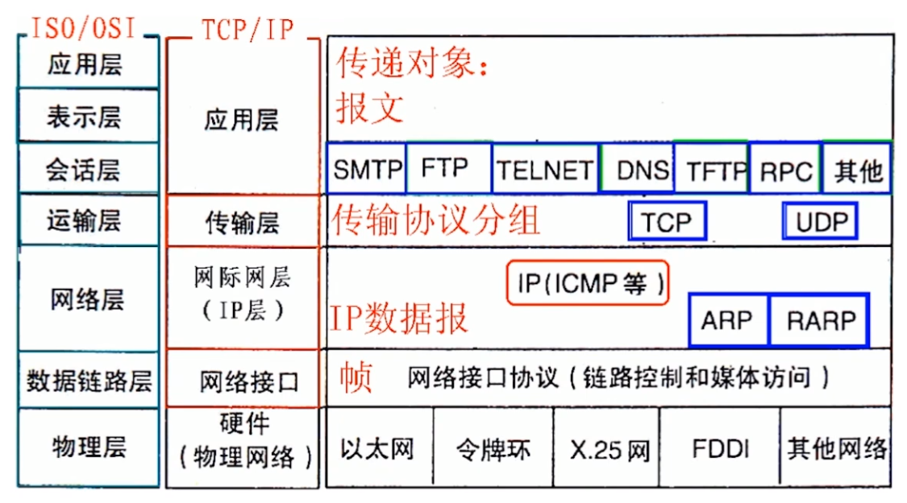

#### 网络地址转换NAT

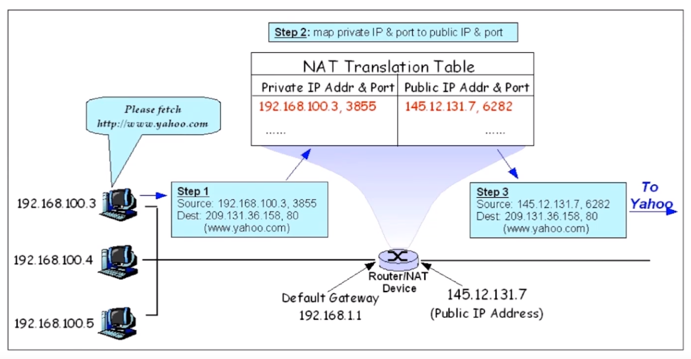

#### Ping & Telnet

1. Ping：用于验证IP的可达性，基于ICMP协议

2. Telnet：验证服务的可用性

   ```sh
   $ telnet <ip> <port>
   ```

   

### VIP的方式访问

每创建一个容器VIP就会改变

### Link单向通信

```
docker run -d --name web --link database hellotom
```

- 这样就可以直接在容器hellotom中ping通database
- 即通过名称访问是通过link单向联通实现的

### Bridge双向通信

> 容器之间的互相访问可以通过容器名的方式，前提是创建一个网桥，并把容器与网桥连接
>
> 默认的网桥并不能实现容器名方式的容器之间的像话访问

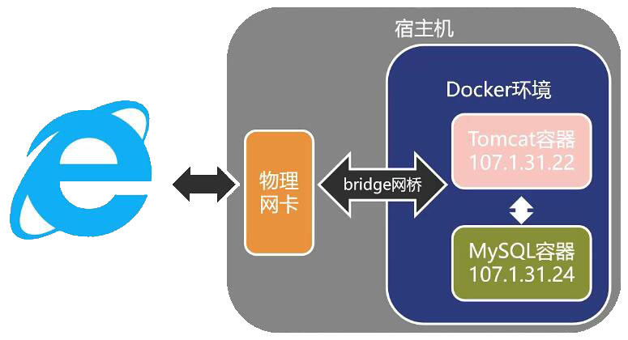

把想联网的机器连接到同一个创建的网桥上，这些容器就是互联互通的

```sh
$ docker network --help
# 创建网桥
$ docker network create -d bridge <bridge-name>
# 查询网桥列表
$ docker network ls
# 删除网桥
$ docker network rm <bridge-name>
# 删除未使用的网桥
$ docker network prune
# 把网桥连接到某个容器上
$ docker network connect/disconnect <bridge-name> <container-name> 
# 查看某个网桥的具体信息
$ docker network inspect <bridge-name>
```

指定网络

1. 启动容器时指定

   ```sh
   docker run -d --network <bridge-name>
   ```

2. 运行过程中加入某个网桥

   ```sh
   docker networkconnect <bridge-name> <container-name|container-id>
   ```

### Volume共享数据

> 关于数据卷的挂载: [Docker数据卷](https://blog.csdn.net/s1990218yao/article/details/122987447)
>
> **数据卷必须在首次启动时候挂载**
>
> 数据卷的映射中, 宿主机的路径可以是一个**绝对路径**, 也可以是一个**别名**
>
> 1. **绝对路径数据卷**: 不会保留容器中的原始数据
> 2. **别名数据卷**: 会保留容器中的原始数据
>    - 别名是Docker自身维护的数据卷. 列出Docker维护的所有数据卷: `docker volume ls`, 查看数据卷详细内容: `docker inspect <volumn>`

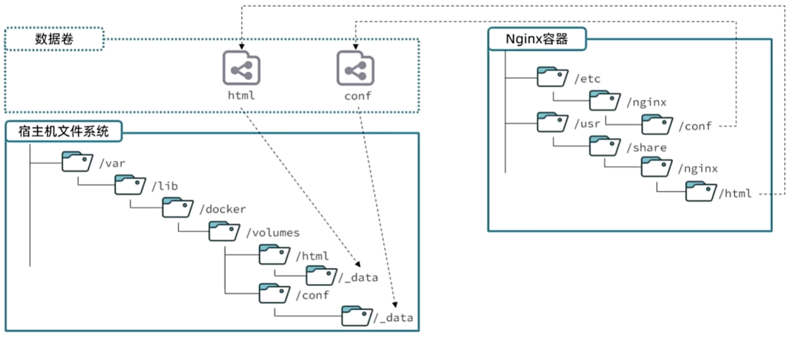

#### 数据卷相关命令

```sh
# 查看Docker挂载的数据卷名称列表
$ docker volumn ls
# 全盘扫描数据卷别名
$ find / -name <volumn-name>
#/var/lib/docker/volumns/<volumn-name>
# 使用docker命令查询数据卷详细信息
$ docker volumn inspect <volumn-name|alias>
# 删除数据卷
$ docker volumn rm <volumn-name|alias>
```

#### 参数`-v`挂载

```sh
$ docker run --name web -v <host-path|alias>:<container-path> <image-name>
```

#### 共享数据卷

```sh
# 创建共享数据卷
$ docker create --name <shared-volume-alias> -v <host-path>:<container-path> <image-name> /bin/true
# 运行共享数据卷挂载点
$ docker run --volumes-from <shared-volume-name> --name <container-name> -d <image-name>
```

## Docker的资源限制

### 限制内存

```sh
# 限制内存占用
$ docker run --memory=200M ubuntu-stress --vm 1 --verbose
```


## Docker Compose

[Docker — 从入门到实践 (gitbook.io)](https://yeasy.gitbook.io/docker_practice/)

### 认识

- 是一个用于定义和运行多个docker容器的命令工具
- Docker Compose是单机多容器部署工具
- 通过`yml`文件定义多容器如何部署
- Win、Mac默认提供Docker Compose，Linux需要安装

### 安装

1. 在线下载安装

   ```sh
   $ curl -L "https://github.com/docker/compose/releases/download/1.29.2/docker-compose-$(uname -s)-$(uname -m)" -o /usr/local/bin/docker-compose
   $ chmod +x /usr/local/bin/docker-compose
   $ docker-compose -version
   ```

2. 在线yum安装

   ```
   yum install -y epel-release
   yum install docker-compose
   docker-compose --version
   ```

3. 在线pip安装(未验证)

   ```
   yum install python-pip -y
   pip install --upgrade pip
   pip install docker-compose --ignore-installed
   docker-compose -v
   ```

4. 离线安装

   - 手动下载`docker-compose`脚本???
   - 其余同在线安装

5. [与Docker的兼容性](https://docs.docker.com/compose/compose-file/compose-file-v3/)

   There are several versions of the Compose file format – 1, 2, 2.x, and 3.x. The table below is a quick look. For full details on what each version includes and how to upgrade, see **[About versions and upgrading](https://docs.docker.com/compose/compose-file/compose-versioning/)**.

   This table shows which Compose file versions support specific Docker releases.

   | **Compose file format** | **Docker Engine release** |
   | :---------------------- | :------------------------ |
   | 3.8                     | 19.03.0+                  |
   | 3.7                     | 18.06.0+                  |
   | 3.6                     | 18.02.0+                  |
   | 3.5                     | 17.12.0+                  |
   | 3.4                     | 17.09.0+                  |
   | 3.3                     | 17.06.0+                  |
   | 3.2                     | 17.04.0+                  |
   | 3.1                     | 1.13.1+                   |
   | 3.0                     | 1.13.0+                   |
   | 2.4                     | 17.12.0+                  |
   | 2.3                     | 17.06.0+                  |
   | 2.2                     | 1.13.0+                   |
   | 2.1                     | 1.12.0+                   |
   | 2.0                     | 1.10.0+                   |


### 命令

```sh
$ docker-compose --help
Define and run multi-container applications with Docker.

Usage:
  docker-compose [-f <arg>...] [options] [COMMAND] [ARGS...]
  docker-compose -h|--help

Options:
  -f, --file FILE             Specify an alternate compose file (default: docker-compose.yml)
  -p, --project-name NAME     Specify an alternate project name (default: directory name)
  --verbose                   Show more output
  --no-ansi                   Do not print ANSI control characters
  -v, --version               Print version and exit
  -H, --host HOST             Daemon socket to connect to

  --tls                       Use TLS; implied by --tlsverify
  --tlscacert CA_PATH         Trust certs signed only by this CA
  --tlscert CLIENT_CERT_PATH  Path to TLS certificate file
  --tlskey TLS_KEY_PATH       Path to TLS key file
  --tlsverify                 Use TLS and verify the remote
  --skip-hostname-check       Don't check the daemon's hostname against the name specified
                              in the client certificate (for example if your docker host
                              is an IP address)
  --project-directory PATH    Specify an alternate working directory
                              (default: the path of the Compose file)

Commands:
  build              Build or rebuild services
  bundle             Generate a Docker bundle from the Compose file
  config             Validate and view the Compose file
  create             Create services
  down               Stop and remove containers, networks, images, and volumes
  events             Receive real time events from containers
  exec               Execute a command in a running container
  help               Get help on a command
  images             List images
  kill               Kill containers
  logs               View output from containers
  pause              Pause services
  port               Print the public port for a port binding
  ps                 List containers
  pull               Pull service images
  push               Push service images
  restart            Restart services
  rm                 Remove stopped containers
  run                Run a one-off command
  scale              Set number of containers for a service
  start              Start services
  stop               Stop services
  top                Display the running processes
  unpause            Unpause services
  up                 Create and start containers
  version            Show the Docker-Compose version information
```

> [Docker Compose 命令详解_BUG弄潮儿的博客-CSDN博客](https://blog.csdn.net/huangjinjin520/article/details/124030335)

```sh
# 在包含`docker-compose.yml`文件的目录启动
$ docker-compose [-f docker-compose.yml ]up -d
# 清除所有`docker-compose.yml`的缓存
$ docker-compose down
# 查看启动日志
$ docker-compose logs <service-name>
# 重启所有容器，貌似有问题，一直处于重启状态
$ docker-compose restart <service-name>
$ docker-compose stop     # 停止compose服务
$ docker-compose restart     # 重启compose服务
$ docker-compose kill     # kill compose服务
$ docker-compose ps     #查看compose服务状态
$ docker-compose rm     #删除compose服务
$ docker-compose --version # 验证docker-compose安装是否成功
```

### 配置文件

1. `version`: 使用的`docker-compose`项目的版本号, 依赖于docker的版本, 具体参考: [Compose file version 3 reference](https://docs.docker.com/compose/compose-file/compose-file-v3/)

2. `docker run`和`docker-compose`参数对应关系

   | <span style="white-space:nowrap;">run 参数</span> | <span style="white-space:nowrap;">compose 模板指令</span> | 备注                                                         |
   | ------------------------------------------------- | --------------------------------------------------------- | ------------------------------------------------------------ |
   | -e                                                | environment                                               | compose默认情况下是不会为我们自动创建不存在的文件夹          |
   | -p                                                | ports                                                     | 端口映射                                                     |
   | -v                                                | volume                                                    | compose中别名的方式需要进行声明才能使用, services同级别添加节点`volumes`以及子节点`<alias>` |
   | 无                                                | image                                                     | 镜像                                                         |

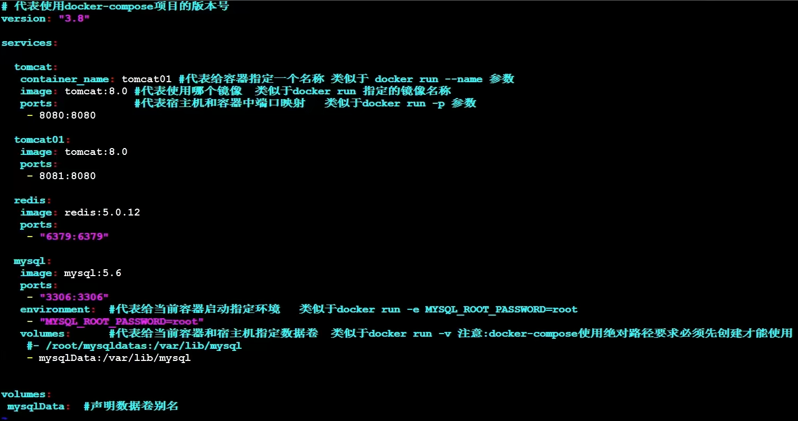

### 自动结束容器

场景：在自动化测试中，测试任务完成后，测试容器退出，那么API服务也应该退出，加上参数启动即可实现

```sh
$ docker-compose up --abort-on-container-exit
```

### 示例

##### WrodPress

```sh
https://docs.docker.com/samples/wordpress/
cd /opt/
mkdir wordpress
cd wordpress/
vi docker-compose.yml
docker-compose up -d
docker ps
```

##### bsbdj

```yml
# docker-compose.yml
version: '3.3'
services:
  db:
    build: ./bsbdj-db/
    restart: always
    environment:
      MYSQL_ROOT_PASSWORD: root
  app:
    build: ./bsbdj-app/
    restart: always
    depends_on:
      - db
    ports:
      - "80:80"
```

```dockerfile
# bsbdj-app Dockerfile
FROM openjdk:8u222-jre
WORKDIR /usr/local/bsbdj
ADD bsbdj.jar .
ADD application.yml .
ADD application-dev.yml .
EXPOSE 80
CMD ["java","-jar","bsbdj.jar"]
```

```dockerfile
# bsbdj-db Dockerfile
FROM mysql:5.7
WORKDIR /docker-entrypoint-initdb.d
ADD init-db.sql .
```

##### Caddy

[使用Docker搭建Caddy+Typecho个人博客网站 - 知乎](https://zhuanlan.zhihu.com/p/93839317)

```yml
version: '3'

services:
    caddy:
        image: abiosoft/caddy
        ports:
            - "80:80"
            - "443:443"
        volumes:
            - ./path/to/your/Caddyfile:/etc/Caddyfile
            - /path/to/certificate/.caddy:/root/.caddy
            - /your/site/root:/srv
        restart: always
        environment:
            - CLOUDFLARE_EMAIL=your_email_here
            - CLOUDFLARE_API_KEY=your_api_key
            - ACME_AGREE=true
            - TZ=Asia/Shanghai
        networks:
            - frontend

    db:
        image: mysql:5.7
        volumes:
            - ./path/to/database:/var/lib/mysql
        restart: always
        expose:
            - "3306"
        environment:
            - MYSQL_ROOT_PASSWORD=password
            - MYSQL_DATABASE=typecho
            - MYSQL_USER=typecho
            - MYSQL_PASSWORD=password
            - TZ=Asia/Shanghai
        networks:
            - frontend

    php:
        image: php:fpm
        volumes:
            - /your/site/root:/var/www/html
        restart: always
        expose:
            - "9000"
        environment:
            - TZ=Asia/Shanghai
        depends_on:
            - db
            - caddy
        networks:
            - frontend

networks:
    frontend:
```

说明：

- 首行的`version: '3'`是必要的，表明使用的compose版本，注意**版本1和2语法不能兼容**。
- `services`是要启动的服务，是一级项目，其中的内容需要缩进。
- `caddy`等二级项目是服务名称，可以通过`docker-compose start/stop/restart service_name`单独控制某一服务。
- `image`是使用镜像名称，因为我是用的都是官方镜像，不需要`build`条目，启动时会检查本地镜像文件，本地不存在时会自动拉取镜像，无需提前拉取。
- `volumes`绑定目录，进行持久化存储。这个选项将宿主机的目录映射到容器中，是必需内容，否则容器删除后数据也就都没有了。还有各服务的配置文件也需要挂载以便容器启动时读取。将上面我的实例文件中的路径换成你要存储数据的路径即可，其中`./`表示当前目录，即docker-compose.yml文件所在目录。你所绑定的目录需提前创建(我不太确定会不会自动创建)。
- `restart`是重启策略，可以不写，具体参考官方reference。
- `environment`是环境变量设置。
- `expose`开放指定端口。
- `depends_on`是`version 3`才有的参数，其中指定的服务会先于当前服务启动。
- `network`指定容器连接的虚拟网络，连接在同一网络的服务可以使用服务名进行通信。version 3不推荐使用`--link`，使用`network`替代其功能，也更方便管理。
- 一级的`network`是虚拟网络的定义，可以指定网络类型和参数等，我是用了默认的网络类型，参数部分留空就可以。

## Docker Swarm

### Swarm概述

# 服务运维实战

## 服务部署

### Nginx部署

```sh
$ docker run -d -p 80:80 --name nginx-server -v /opt/nginx-server:/usr/share/nginx/html:ro nginx
```

- `:ro`在 Docker run 命令中的作用是让容器能够访问并修改宿主机上的特定目录或文件夹，而不是默认情况下的所有内容。

### 数据库部署

#### MySQL

##### 单节点部署

1. 启动容器

   ```sh
   $ systemctl start docker
   ```

2. 搜索软件, 一般目的是检查拼写是否正确

   ```sh
   $ docker search mysql
   ```

3. 拉取镜像

   ```sh
   $ docker pull mysql:5.7
   ```

   - 如果出现以下错误:

     ```log
     error pulling image configuration: Get https://production.cloudflare.docker.com/registry-v2/docker/registry/v2/blobs/sha256/2c/2c9028880e5814e8923c278d7e2059f9066d56608a21cd3f83a01e3337bacd68/data?verify=1621095663-QsBGfwvp09cnSEXcybH1y1Aw1CQ%3D: net/http: TLS handshake timeout
     ```

     则使用下面方法解决:

     ```sh
     $ echo "DOCKER_OPTS=\"\$DOCKER_OPTS --registry-mirror=http://f2d6cb40.m.daocloud.io\"" | tee -a /etc/default/docker
     DOCKER_OPTS="$DOCKER_OPTS --registry-mirror=http://f2d6cb40.m.daocloud.io"
     $ service docker restart
     ```

4. 启动容器

   ```sh
   $ docker run -d \
   -p 3306:3306 \
   -e TZ=Asia/Shanghai \
   -e MYSQL_ROOT_PASSWORD=mysql57 \
   -v /opt/docker/mysql/conf:/etc/mysql \
   -v /opt/docker/mysql/logs:/var/log/mysql \
   -v /opt/docker/mysql/data:/var/lib/mysql \
   -v /opt/docker/mysql/init:/docker-entrypoint-initdb.d \
   --privileged=true \
   --lower_case_table_names=1 \
   --character-set-server=utf8mb4 \
   --collation-server=utf8mb4_general_ci \
   --restart=always \
   --name mysql \
   mysql:5.7
   
   # 配置文件：/opt/docker/mysql/conf/mysql.cnf
   [client]
   default_character_set=utf8mb4
   [mysql]
   default_character_set=utf8mb4
   [mysqld]
   character_set_server=utf8mb4
   collation_server=utf8mb4_unicode_ci
   init_connect='SET NAMES utf8mb4'
   # 初始化脚本：/opt/docker/mysql/init/init.sql
   # 自行编写数据库初始化的相关SQL语句
   ```

   - -–name: 容器名, 此处命名为mysql
   - -e: Environment, 环境配置信息, 此处配置mysql的root用户的登陆密码
   - -p: Port端口映射, 此处映射 主机3306端口 到 容器的3306端口
   - -d: Deamon后台运行容器, 保证在退出终端后容器继续运行
   - -v: 主机和容器的目录映射关系, `宿主机目录:容器目录`. MySQL(5.7.19)的默认配置文件是 /etc/mysql/my.cnf 文件。如果想要自定义配置, 建议向 /etc/mysql/conf.d 目录中创建 .cnf 文件。新建的文件可以任意起名, 只要保证后缀名是 cnf 即可。新建的文件中的配置项可以覆盖 /etc/mysql/my.cnf 中的配置项。 
   - --character-set-server=utf8mb4 --collation-server=utf8mb4_general_ci 设值数据库默认编码

5. 查看运行的容器

   ```sh
   $ docker ps [-a]
   $ docker container ls
   ```

6. 进入容器

   ```sh
   $ docker exec -it mysql5 bash
   $ docker exec -it mysql mysql -uroot -p
   ```

7. 进入MySQL

   ```sh
   $ mysql -uroot -p
   ```

   - 也可以在宿主机安装一个mariadb

     ```sh
     $ yum install -y mariadb
     $ mysql -h <ip> -uroot -p
     ```

8. 授权远程访问

   ```sh
   # 开发访问
   $ GRANT ALL PRIVILEGES ON *.* TO 'root'@'111.19.40.98' IDENTIFIED BY 'mysql57' WITH GRANT OPTION;
   # 本机访问
   $ GRANT ALL PRIVILEGES ON *.* TO 'root'@'127.0.0.1' IDENTIFIED BY 'mysql57' WITH GRANT OPTION;
   # 本机访问
   $ GRANT ALL PRIVILEGES ON *.* TO 'root'@'localhost' IDENTIFIED BY 'mysql57' WITH GRANT OPTION;
   $ flush PRIVILEGES;
   ```

##### 主从部署

1. 部署主节点mysql-master

   ```sh
   $ docker run -d\
   -p 3306:3306 \
   -v /opt/mysql/mysql-master/log:/var/1og/mysql\
   -V /opt/mysql/mysql-master/data:/var/lib/mysql
   -v /opt/mysql/mysql-master/conf:/etc/mysql\
   -v /opt/mysql/mysql-master/mysql.conf.d:/etc/mysq1/mysq1.conf.d \
   -v /opt/mysql/mysql-master/conf.d:/etc/mysql/conf.d\
   -e MYSQL_ROOT_PASSWORD=root
   --name mysql-master\
   mysql:5.7
   ```

2. 添加主节点配置文件

   ```properties
   # cat /opt/mysql/mysql-master/conf/my.cnf
   [client]
   default-character-set=utf8
   
   [mysql]
   default-character-set=utf8
   
   [mysqld]
   init_connect='SET collation_connection = utf8_unicode_ci'
   init_connect='SET NAMES utf8'
   character-set-server=utf8
   collation-server=utf8_unicode_ci
   skip-character-set-client-handshake
   skip-name-resolve
   
   server_id=1
   log-bin=mysql-bin
   read-only=0
   binlog-do-db=<db-name>
   
   replicate-ignore-db=mysql
   replicate-ignore-db=sys
   replicate-ignore-db=information_schema
   replicate-ignore-db=performance_schema
   ```

3. 部署从节点

   ```sh
   $ docker run -d \
   -p 3307:3306
   -v /opt/mysql/mysql-slave/log:/var/log/mysql \
   -v /opt/mysql/mysql-slave/data:/var/lib/mysql \
   -v /opt/mysql/mysql-slave/conf:/etc/mysql \
   -v /opt/mysql/mysql-slave/mysql.conf.d:/etc/mysql/mysql.conf.d \
   -v /opt/mysql/mysql-slave/conf.d:/etc/mysql/conf.d \
   -e MYSQL_ROOT_PASSWORD=root \
   --link mysql-master:mysql-master \
   --name mysql-slave \
   mysql:5.7
   ```

4. 添加从节点配置文件

   ```properties
   # cat /opt/mysql/mysql-slave/conf/my.cnf
   [client]
   default-character-set=utf8
   
   [mysql]
   default-character-set=utf8
   
   [mysqld]
   init_connect='SET collation_connection = utf8_unicode_ci'
   init_connect='SET NAMES utf8'
   character-set-server=utf8
   collation-server=utf8_unicode_ci
   skip-character-set-client-handshake
   skip-name-resolve
   
   server_id=2
   1og-bin=mysql-bin
   read-only=1
   binlog-do-db=<db-name>
   
   replicate-ignore-db=mysql
   replicate-ignore-db=sys
   replicate-ignore-db=information_schema
   replicate-ignore-db=performance_schema
   ```

5. 主从配置：主节点配置

   - 登录MySQL添加授权：

     ```mysql
     MySQL(master)> grant replication slave on *.* to '<db-user>'@'%' identified by '123456;
     ```

   - 重启容器：`docker restart mysql-master`

   - 登录MySQL查看状态：

     ```mysql
     MySQL(master)> show master status \G
     ```

6. 主从配置：从节点配置

   - 重启从节点：`docker restart mysql-slave`

   - 登录MySQL设置该从节点的主节点：

     ```mysql
     $ mysql -h <ip> -uroot -proot -P3307
     
     # 设置主节点
     MySQL(slave)> change master to master_host='mysql-master',master_user='<db-user>',master_password='123456',master_log_file='mysql-bin.000001',master_log_pos=154，master_port=3306;
     
     # 启动从节点
     MySQL(slave)> start slave;
     
     # 检查状态
     MySQL(slave)> show slave status \G
     ```

7. 验证集群可用性

   - 主节点添加数据库`<db-name>`

     ```mysql
     MySQL(master)> create database <db-name>
     ```

   - 从节点验证

     ```mysql
     MySQL(slave)> show databases;
     ```

#### Redis

##### 单节点部署

```sh
$ mkdir -p /opt/service-redis/conf

$ touch /opt/service-redis/conf/redis.conf

$ docker run -d \
-p 6379:6379 \
-v /opt/service-redis/data:/data \
-v /opt/service-redis/conf:/etc/redis \
--name service-redis \
--save 60 1 \
--loglevel warning \
redis redis-server /etc/redis/redis.conf
```

验证测试：

1. 方式1：

   ```sh
   $ docker run -it[ --network <network>] --rm service-redis redis-cli -h <redis-ip>
   
   #或者
   
   $ docker exec -it service-redis redis-cli
   ```

2. 方式2

   ```sh
   $ wget -O /etc/yum.repos.d/epel.repo http://mirrors.aliyun.com/repo/epel-7.repo
   $ yum -y install redis
   $ redis-cli -h <host-ip> -p 6379
   ```

##### 主从部署

> 3主3从方式，从为了同步备份，主进行Slot数据分片

1. 创建并运行搭建Redis集群节点脚本

   > - 脚本执行后6个容器就启动了
   > - 注意：
   >   - 修改`<host-ip>`
   >   - 该搭建全部在**一个节点**上，需要根据节点数的需要更新`<host-ip>`

   ```sh
   # redis-cluster.sh
   for port in $(seq 8001 8006);
   do \
   mkdir -p /mydata/redis/node-S{port}/conf
   touch /mydata/redis/node-${port}/conf/redis.conf
   cat << EOF >/mydata/redis/node-${port}/conf/redis.conf
   port ${port}
   cluster-enabled yes
   cluster-config-file nodes.conf
   cluster-node-timeout 5000
   cluster-announce-ip <host-ip>
   cluster-announce-port ${port}
   cluster-announce-bus-port 1${port}
   appendonly yes
   EOF
   docker run -d \
   -p ${port}:${port} \
   -p 1${port}:1${port} \
   --name redis-${port} \
   -v /mydata/redis/node-${port}/data:/data \
   -v /mydata/redis/node-${port}/conf/redis.conf:/etc/redis/redis.conf \
   redis:5.0.7 redis-server /etc/redis/redis.conf; \
   done
   ```

   - 验证测试：

     ```sh
     $ redis-cli -h <host-ip> -p 8006
     ```

2. 创建集群

   ```sh
   # 登录redis集群任意节点
   $ docker exec -it redis-8001 bash
   
   # 把所有节点添加到集群，并进行Slot数据分片，完成后主从的配置就存储在nodes.conf之中
   root@redis-8001 $ redis-cli --cluster create <host-ip>:8001 <host-ip>:8002 <host-ip>:8003 <host-ip>:8004 <host-ip>:8005 <host-ip>:8006 --cluster-replicas 1
   ```

### 日志系统部署

#### ElasticSearch(ES)+Kibana

##### 部署单节点ElasticSearch

```sh
$ mkdir -p /opt/es/{config, data, plugins}

$ chmod -R 777 /opt/es/

$ echo "http.host: 0.0.0.0" >> /opt/es/config/elasticsearch.yml

$ docker run -d \
-p 9200:9200 \
-p 9300:9300 \
-e "discovery.type=single-node" \
-e ES_JAVA_OPTS="-Xms64m-Xmx512m" \
-v /opt/es/config/elasticsearch.yml:/usr/share/elasticsearch/config/elasticsearch.yml \
-v /opt/es/data:/usr/share/elasticsearch/data \
-v /opt/es/plugins:/usr/share/elasticsearch/plugins \
--name elasticsearch \
elasticsearch:7.17.10

# -e 指定环境变量
```

测试：`http://<host-ip>:9200`，返回如下数据即可：

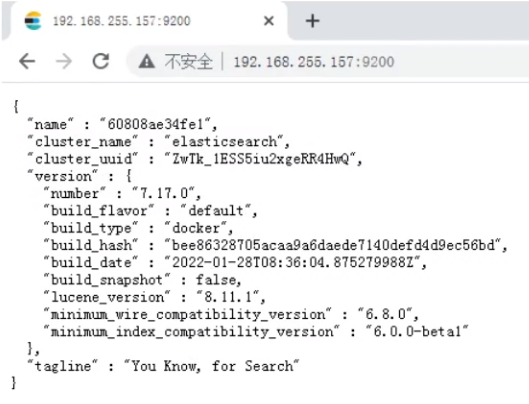

#### Kibana

> Kibana是一个开源的分析和可视化平台，主要用于与Elasticsearch协作，提供数据搜索、查看、交互以及多种图表类型的功能。

```sh
$ docker run -d \
-p 5601:5601 \
-e ELASTICSEARCH_HOSTS=http://<host-ip>:9200 \
--name kibana \
kibana:7.17.10
```

测试：`http://<host-ip>:5601`，正常访问即可

### 消息队列部署

#### RabbitMQ

> 部署的时候建议选择带有管理控制台的版本，即版本名称中带有`management`

```sh
$ docker run -d \
-p 5671:5671 \
-p 5672:5672 \
-p 4369:4369 \
-p 25672:25672 \
-p 15671:15671 \
-p 15672:15672 \
-v /opt/rabbitmq:/var/lib/rabbitmq \
--name rabbitmq \
rabbitmq:management

# 端口说明:
# 4369，25672：Erlang发现&集群端口
# 5671，5672：AMQP端口，即业务应用对接RabbitMQ的时候使用
# 61613，61614：STOMP协议端口
# 1883，8883：MQTT协议端口
# 15671：管理监听端口
# 15672：web管理后台端口
```

控制台验证测试：`http://<host-ip>:15672`

用户名密码都是`guest`，这个`guest`是一个管理员权限的用户，正常生产环境需要添加用户，并修改guest用户的密码

#### RocketMQ

#### Kafka

### 微服务部署

#### Nacos测试部署

```sh
docker pull nacos/nacos-server

docker run -d -e MODE=standalone -p 8848:8848 --name nacos nacos/nacos-server
```

访问：http://192.168.1.50:8848/nacos

## 数据备份

Docker数据卷的挂载方案缺失对于数据的安全起到了非常重要的作用, 但是其备份的是数据库的文件系统, 不利于我们进行数据的备份

使用官方推荐的工具`MySQLdump`工具就可以将数据库中的数据以SQL的形式导出

1. 导出全部数据

   ```sh
   $ docker exec <container-id|container-name> sh -c 'exec mysqldump --all-databases -uroot -p"$MYSQL_ROOT_PASSWORD"' > <path-to-save-dump-file>/all-databases.sql
   ```

2. 导出指定数据库

   ```sh
   $ docker exec <container-id|container-name> sh -c 'exec mysqldump --databases <db-name> -uroot -p"$MYSQL_ROOT_PASSWORD"' > <path-to-save-dump-file>/<db-name>.sql
   ```

3. 导出指定数据库的所有表结构

   ```sh
   $ docker exec <container-id|container-name> sh -c 'exec mysqldump --no-data --databases <db-name> -uroot -p"$MYSQL_ROOT_PASSWORD"' > <path-to-save-dump-file>/<db-name>.sql
   ```

## 数据恢复

```sh
$ docker exec -i mysql sh -c 'exec mysql -uroot -p"$MYSQL_ROOT_PASSWORD"' < <data>.sql
```

## 部署项目

```sh
# 修改服务器Docker配置, 开放Docker的远程连接访问
$ vim /usr/lib/systemd/system/docker.service
  #将ExecStart属性value值改为
  #/usr/bin/dockerd -H tcp://0.0.0.0:2375 -H unix://var/run/docker.sock
# 重启docker
$ systemctl daemon-reload
$ systemctl restart docker
# 开放防火墙2375端口
  # 一个是服务器安全组(网页操作), 另外一个是防火墙(代码如下)
  $ firewall-cmd --add-port=2375/tcp --permanent
    $ firewall-cmd --reload
    $ firewall-cmd --zone=public --list-ports
# IDEA配置
# 在 `File | Settings | Build, Execution, Deployment | Docker` 中添加一个Docker配置
# 在配置中修改Docker服务器地址
# 在 `... | Docker | Registry` 中修改加速地址为阿里云加速
# pom.xml添加配置
# <plugin>
#     <groupId>com.spotify</groupId>
#     <artifactId>docker-maven-plugin</artifactId>
#     <version>1.0.0</version>
#     <configuration>
#         <!--Docker地址-->
#         <dockerHost>http://8.140.16.117:2375</dockerHost>
#         <!--镜像名-->
#         <imageName>${docker.image.prefix}/${project.artifactId}</imageName>
#         <!--DockerFile的位置-->
#         <dockerDirectory>${project.basedir}/src/main/docker/</dockerDirectory>
#         <resources>
#             <resource>
#                 <targetPath>/</targetPath>
#                 <directory>${project.build.directory}</directory>
#                 <include>${project.build.finalName}.jar</include>
#             </resource>
#         </resources>
#     </configuration>
# </plugin>
# 添加Dockerfile到/src/main/docker/下
# FROM java:8
# VOLUME /tmp
# ADD faith.jar /faith.jar
# ENTRYPOINT ["java", "-jar", "faith.jar"]
# 
# 运行clean package docker-build
# 在IDEA下面的Docker选项卡中, 有个images, 在线就能看到我们上传到服务器上的image镜像了
# 在该镜像上 `create container | create` 填写container name和run option:-d -p 8080:8080
```

关于 docker-maven-plugin 的使用可参考: [Maven 插件之 docker-maven-plugin 的使用](https://www.cnblogs.com/jpfss/p/10945324.html)


# 其他相关工具

## 搭建COS的工具：Vagrant

> Vagrant + VBox

## 测试工具：busybox

```sh
# 启动容器
$ docker run -d \
-c "while true; do sleep 3600; done"
--name test1 \
busybox /bin/sh

# 交互式进入容器shell
$ docker exec -it <container-id> /bin/sh
```


# 图灵Docker笔记

主讲老师：Fox

有道笔记地址链接：https://note.youdao.com/s/8eWHV1Jr

2013年发布至今， [Docker](https://www.docker.com/) 一直广受瞩目，被认为可能会改变软件行业。  

但是，许多人并不清楚 Docker 到底是什么，要解决什么问题，好处又在哪里？今天就来详细解释，帮助大家理解它，还带有简单易懂的实例，教你如何将它用于日常开发。

## Docker详解

### Docker简介

Docker是一个开源的容器化平台，可以帮助开发者将应用程序和其依赖的环境打包成一个可移植、可部署的容器。Docker的主要目标是通过容器化技术实现应用程序的快速部署、可移植性和可扩展性，从而简化应用程序的开发、测试和部署过程。

容器化是一种虚拟化技术，它通过在操作系统层面隔离应用程序和其依赖的运行环境，使得应用程序可以在一个独立的、封闭的环境中运行，而不受底层操作系统和硬件的影响。与传统的虚拟机相比，容器化具有以下优势：

- 轻量级: 容器与宿主机共享操作系统内核，因此容器本身非常轻量级，启动和停止速度快，资源占用少。
- 可移植性: 容器可以在任何支持相应容器运行时的系统上运行，无需关注底层操作系统的差异，提供了高度的可移植性。
- 快速部署: 容器化应用程序可以通过简单的操作进行打包、分发和部署，减少了部署过程的复杂性和时间成本。
- 弹性扩展: 可以根据应用程序的需求快速创建、启动和停止容器实例，实现应用程序的弹性扩展和负载均衡。
- 环境隔离: 每个容器都具有独立的运行环境，容器之间相互隔离，不会相互干扰，提供了更好的安全性和稳定性。

**docker和传统虚拟机区别**

虚拟机是一个主机模拟出多个主机，需要先拥有独立的系统。传统虚拟机，利用hypervisor，模拟出独立的硬件和系统，在此之上创建应用。docker 是在主机系统中建立多个应用及配套环境，把应用及配套环境独立打包成一个单位，是进程级的隔离。

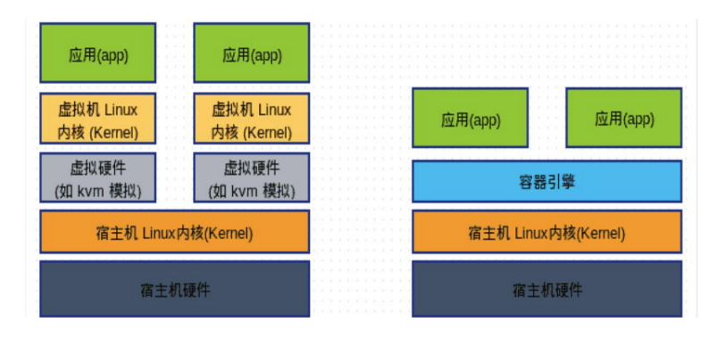

### Docker架构

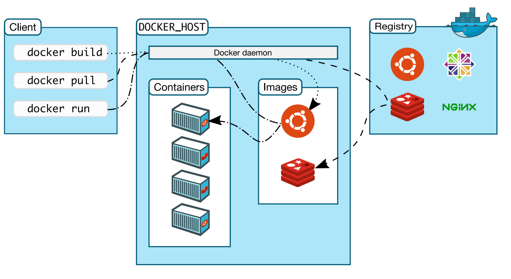

- **Docker daemon（ Docker守护进程）**

Docker daemon是一个运行在宿主机（ DOCKER-HOST）的后台进程。可通过 Docker客户端与之通信。

- **Client（ Docker客户端）**

Docker客户端是 Docker的用户界面，它可以接受用户命令和配置标识，并与 Docker daemon通信。图中， docker build等都是 Docker的相关命令。

- **Images（ Docker镜像）**

Docker镜像是一个只读模板，它包含创建 Docker容器的说明。**它和系统安装光盘有点像**，使用系统安装光盘可以安装系统，同理，使用Docker镜像可以运行 Docker镜像中的程序。

- **Container（容器）**

容器是镜像的可运行实例。**镜像和容器的关系有点类似于面向对象中，类和对象的关系**。可通过 Docker API或者 CLI命令来启停、移动、删除容器。

- **Registry**

Docker Registry是一个集中存储与分发镜像的服务。构建完 Docker镜像后，就可在当前宿主机上运行。但如果想要在其他机器上运行这个镜像，就需要手动复制。此时可借助 Docker Registry来避免镜像的手动复制。

一个 Docker Registry可包含多个 Docker仓库，每个仓库可包含多个镜像标签，每个标签对应一个 Docker镜像。这跟 Maven的仓库有点类似，如果把 Docker Registry比作 Maven仓库的话，那么 Docker仓库就可理解为某jar包的路径，而镜像标签则可理解为jar包的版本号。

Docker Registry可分为公有Docker Registry和私有Docker Registry。 最常⽤的Docker Registry莫过于官方的[Docker Hub](https://hub.docker.com/)， 这也是默认的Docker Registry。 Docker Hub上存放着大量优秀的镜像， 我们可使用Docker命令下载并使用。

### Docker 安装

Docker 是一个开源的商业产品，有两个版本：社区版（Community Edition，缩写为 CE）和企业版（Enterprise Edition，缩写为 EE）。企业版包含了一些收费服务，个人开发者一般用不到。下面的介绍都针对社区版。

Docker CE 的安装请参考[官方文档](https://docs.docker.com/engine/install/centos/)，**我们这里以CentOS为例：**

1、Docker 要求 CentOS 系统的内核版本高于 3.10 

通过 uname -r 命令查看你当前的内核版本

uname -r

2、使用 root 权限登录 Centos。确保 yum 包更新到最新。

yum -y update

3、卸载旧版本(如果安装过旧版本的话)

yum remove -y docker*

4、安装需要的软件包， yum-util 提供yum-config-manager功能，另外两个是devicemapper驱动依赖的

yum install -y yum-utils

5、设置yum源，并更新 yum 的包索引

yum-config-manager --add-repo http://mirrors.aliyun.com/docker-ce/linux/centos/docker-ce.repo yum makecache fast

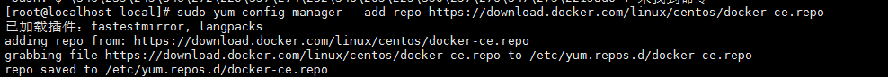

6、可以查看所有仓库中所有docker版本，并选择特定版本安装

yum list docker-ce --showduplicates | sort -r

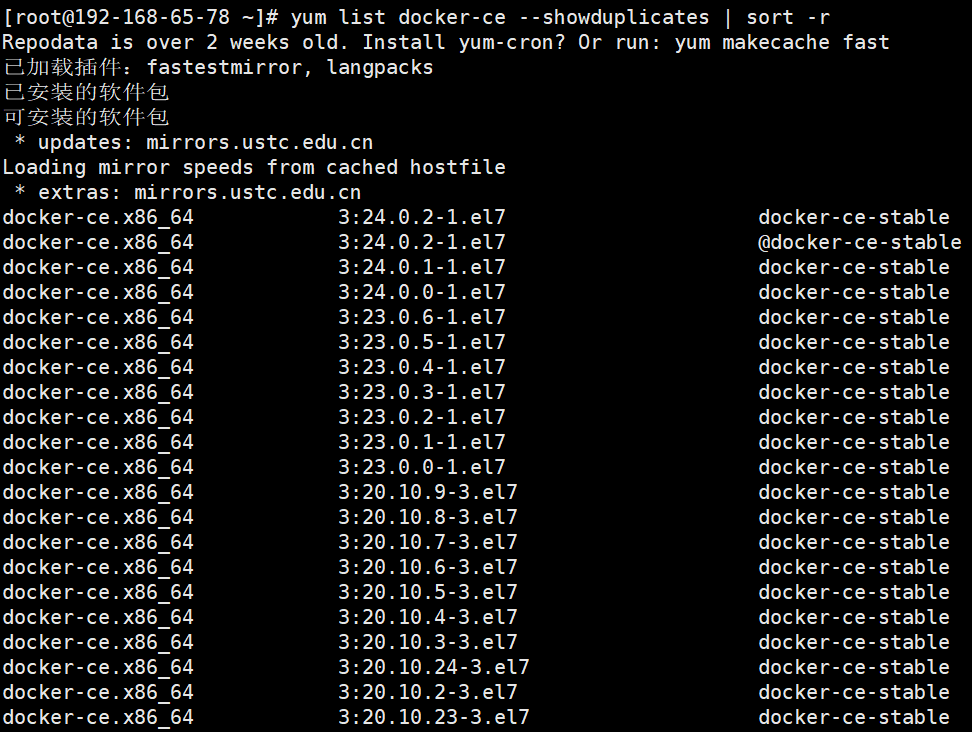

7、安装docker

yum install -y docker-ce-3:24.0.2-1.el7.x86_64 # 这是指定版本安装

8、启动并加入开机启动

systemctl start docker && systemctl enable docker

9、验证安装是否成功(有client和service两部分表示docker安装启动都成功了)

docker version

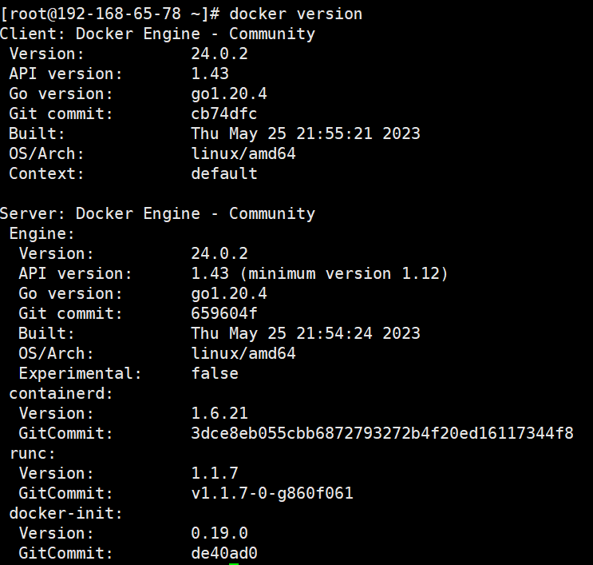

**注意：一般需要配置docker镜像加速器**

我们可以借助阿里云的镜像加速器，登录阿里云(https://cr.console.aliyun.com/#/accelerator)

可以看到镜像加速地址如下图：

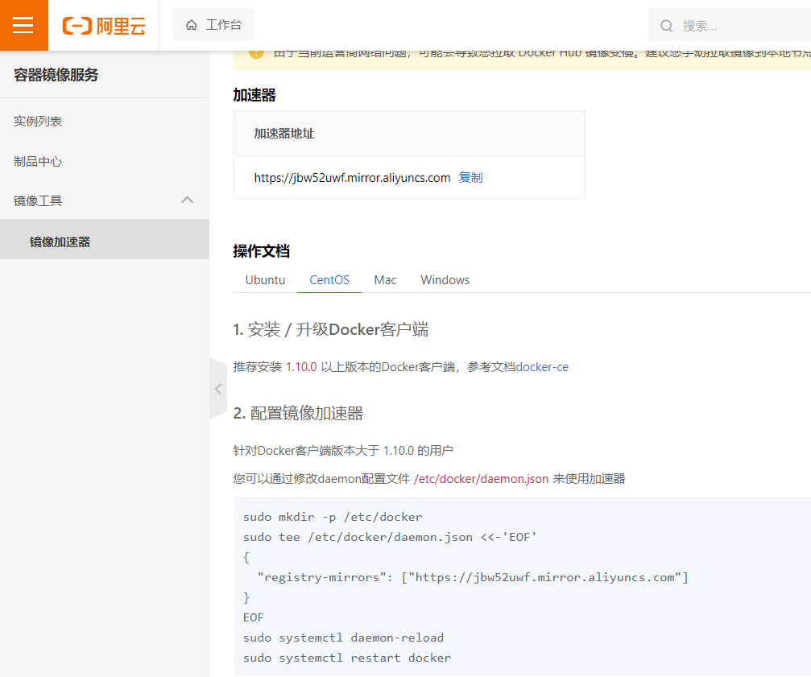

cd /etc/docker

查看有没有 daemon.json。这是docker默认的配置文件。

如果没有新建，如果有，则修改。

vim daemon.json {  "registry-mirrors": ["https://jbw52uwf.mirror.aliyuncs.com"] }

保存退出。

重启docker服务

systemctl daemon-reload systemctl restart docker

成功！

10、卸载docker

yum remove -y docker* rm -rf /etc/systemd/system/docker.service.d rm -rf /var/lib/docker rm -rf /var/run/docker

### Docker使用

**镜像相关命令**

**1、搜索镜像**

可使用 docker search命令搜索存放在 Docker Hub中的镜像。执行该命令后， Docker就会在Docker Hub中搜索含有 java这个关键词的镜像仓库。

docker search java

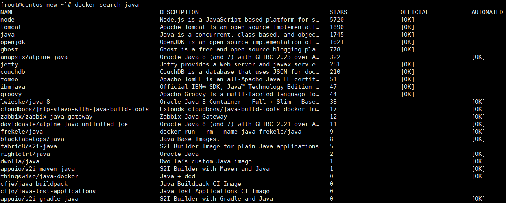

以上列表包含五列，含义如下：

\- NAME:镜像仓库名称。

\- DESCRIPTION:镜像仓库描述。

\- STARS：镜像仓库收藏数，表示该镜像仓库的受欢迎程度，类似于 GitHub的 stars0

\- OFFICAL:表示是否为官方仓库，该列标记为[0K]的镜像均由各软件的官方项目组创建和维护。

\- AUTOMATED：表示是否是自动构建的镜像仓库。

**2、下载镜像**

使用命令docker pull命令即可从 Docker Registry上下载镜像，执行该命令后，Docker会从 Docker Hub中的 java仓库下载最新版本的 Java镜像。如果要下载指定版本则在java后面加冒号指定版本，例如：docker pull java:8

docker pull java:8

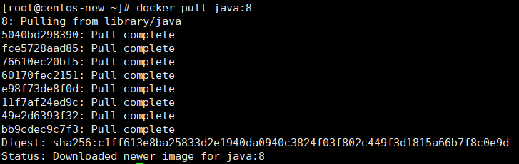

docker pull nginx

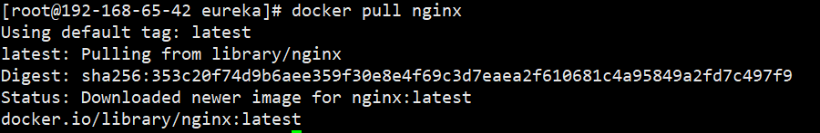

**3、列出镜像**

使用 docker images命令即可列出已下载的镜像

docker images

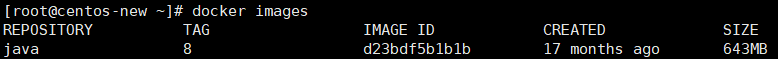

以上列表含义如下

\- REPOSITORY：镜像所属仓库名称。

\- TAG:镜像标签。默认是 latest,表示最新。

\- IMAGE ID：镜像 ID，表示镜像唯一标识。

\- CREATED：镜像创建时间。

\- SIZE: 镜像大小。

**4、删除本地镜像**

使用 docker rmi命令即可删除指定镜像，强制删除加 -f

docker rmi java 

删除所有镜像

docker rmi $(docker images -q)

**容器相关命令** 

**1、新建并启动容器**

使用以下docker run命令即可新建并启动一个容器，该命令是最常用的命令，它有很多选项，下面将列举一些常用的选项。

-d选项：表示后台运行

-P选项：随机端口映射

-p选项：指定端口映射，有以下四种格式。 

-- ip:hostPort:containerPort 

-- ip::containerPort

-- hostPort:containerPort 

-- containerPort

--net选项：指定网络模式，该选项有以下可选参数：

--net=bridge:**默认选项**，表示连接到默认的网桥。

--net=host:容器使用宿主机的网络。

--net=container:NAME-or-ID：告诉 Docker让新建的容器使用已有容器的网络配置。

--net=none：不配置该容器的网络，用户可自定义网络配置。

docker run -d -p 91:80 nginx

这样就能启动一个 Nginx容器。在本例中，为 docker run添加了两个参数，含义如下：

-d 后台运行

-p 宿主机端口:容器端口 #开放容器端口到宿主机端口

访问 http://Docker宿主机 IP:91/，将会看到nginx的主界面如下：

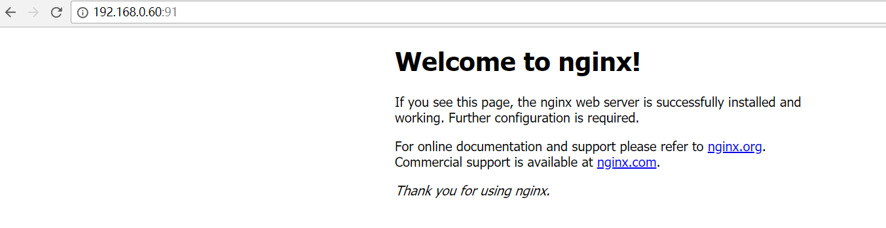

需要注意的是，使用 docker run命令创建容器时，会先检查本地是否存在指定镜像。如果本地不存在该名称的镜像， Docker就会自动从 Docker Hub下载镜像并启动一个 Docker容器。

**2、列出容器**

用 docker ps命令即可列出运行中的容器

docker ps

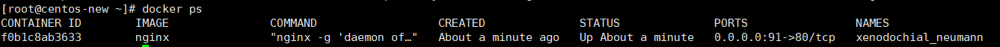

如需列出所有容器（包括已停止的容器），可使用-a参数。该列表包含了7列，含义如下

\- CONTAINER_ID：表示容器 ID。

\- IMAGE:表示镜像名称。

\- COMMAND：表示启动容器时运行的命令。

\- CREATED：表示容器的创建时间。 

\- STATUS：表示容器运行的状态。UP表示运行中， Exited表示已停止。 

\- PORTS:表示容器对外的端口号。 

\- NAMES:表示容器名称。该名称默认由 Docker自动生成，也可使用 docker run命令的--name选项自行指定。

**3、停止容器**

使用 docker stop命令，即可停止容器

docker stop f0b1c8ab3633

其中f0b1c8ab3633是容器 ID,当然也可使用 docker stop容器名称来停止指定容器

**4、强制停止容器**

可使用 docker kill命令发送 SIGKILL信号来强制停止容器

docker kill f0b1c8ab3633

**5、启动已停止的容器**

使用docker run命令，即可**新建**并启动一个容器。对于已停止的容器，可使用 docker start命令来**启动**

docker start f0b1c8ab3633

**6、查看容器所有信息**

docker inspect f0b1c8ab3633

**7、查看容器日志**

docker container logs f0b1c8ab3633

**8、查看容器里的进程**

docker top f0b1c8ab3633

**9、容器与宿主机相互复制文件**

- 从容器里面拷文件到宿主机：

docker cp 容器id:要拷贝的文件在容器里面的路径  宿主机的相应路径  如：docker cp 7aa5dc458f9d:/etc/nginx/nginx.conf /mydata/nginx

- 从宿主机拷文件到容器里面：

docker cp 要拷贝的宿主机文件路径 容器id:要拷贝到容器里面对应的路径

**10、进入容器**

使用docker exec命令用于进入一个正在运行的docker容器。如果docker run命令运行容器的时候，没有使用-it参数，就要用这个命令进入容器。一旦进入了容器，就可以在容器的 Shell 执行命令了

docker exec -it f0b1c8ab3633 /bin/bash  (有的容器需要把 /bin/bash 换成 sh)

**11、容器内安装vim、ping、ifconfig等指令**

apt-get update apt-get install vim           #安装vim apt-get install iputils-ping  #安装ping apt-get install net-tools     #安装ifconfig 

**12、删除容器**

使用 docker rm命令即可删除指定容器

docker rm f0b1c8ab3633

该命令只能删除**已停止**的容器，如需删除正在运行的容器，可使用-f参数

强制删除所有容器

docker rm -f $(docker ps -a -q)

## 使用Dockerfile构建Docker镜像

Dockerfile是一个文本文件，其中包含了若干条指令，指令描述了构建镜像的细节

先来编写一个最简单的Dockerfile，以前文下载的Nginx镜像为例，来编写一个Dockerfile修改该Nginx镜像的首页

1、新建一个空文件夹docker-demo，在里面再新建文件夹app，在app目录下新建一个名为Dockerfile的文件，在里面增加如下内容：

`FROM nginx RUN echo '<h1>This is Tuling Nginx!!!</h1>' > /usr/share/nginx/html/index.html`

该Dockerfile非常简单，其中的 FROM、 RUN都是 Dockerfile的指令。 FROM指令用于指定基础镜像， RUN指令用于执行命令。

2、在Dockerfile所在路径执行以下命令构建镜像： 

`docker build -t nginx:tuling .`

其中，-t指定镜像名字，命令最后的点（.）表示Dockerfile文件所在路径

3、执行以下命令，即可使用该镜像启动一个 Docker容器

`docker run -d -p 92:80 nginx:tuling`

4、访问 http://DockerIP:92/，可看到下图所示界面

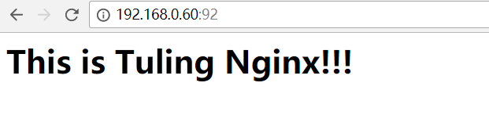

### Dockerfile常用指令

| 命令      | 用途                                                         |
| --------- | ------------------------------------------------------------ |
| FROM      | 基础镜像文件                                                 |
| RUN       | 构建镜像阶段执行命令                                         |
| ADD       | 添加文件，从src目录复制文件到容器的dest，其中 src可以是 Dockerfile所在目录的相对路径，也可以是一个 URL,还可以是一个压缩包 |
| COPY      | 拷贝文件，和ADD命令类似，但不支持URL和压缩包                 |
| CMD       | 容器启动后执行命令                                           |
| EXPOSE    | 声明容器在运行时对外提供的服务端口                           |
| WORKDIR   | 指定容器工作路径                                             |
| ENV       | 指定环境变量                                                 |
| ENTRYPINT | 容器入口， ENTRYPOINT和 CMD指令的目的一样，都是指定 Docker容器启动时执行的命令，可多次设置，但只有最后一个有效。 |
| USER      | 该指令用于设置启动镜像时的用户或者 UID,写在该指令后的 RUN、 CMD以及 ENTRYPOINT指令都将使用该用户执行命令。 |
| VOLUME    | 指定挂载点，该指令使容器中的一个目录具有持久化存储的功能，该目录可被容器本身使用，也可共享给其他容器。当容器中的应用有持久化数据的需求时可以在 Dockerfile中使用该指令。格式为： VOLUME["/data"]。 |

注意：RUN命令在 image 文件的构建阶段执行，执行结果都会打包进入 image 文件；CMD命令则是在容器启动后执行。另外，一个 Dockerfile 可以包含多个RUN命令，但是只能有一个CMD命令。

注意，指定了CMD命令以后，docker container run命令就不能附加命令了（比如前面的/bin/bash），否则它会覆盖CMD命令。

### 使用Dockerfile构建微服务镜像

以项目tulingmall-member为例，将该微服务的可运行jar包构建成docker镜像

1、将jar包上传linux服务器/root/tulingmall/tulingmall-member目录，在jar包所在目录创建名为Dockerfile的文件

2、在Dockerfile中添加以下内容

\# 基于哪个镜像 From java:8 # 复制文件到容器 ADD tulingmall-member-0.0.5.jar /tulingmall-member-0.0.5.jar # 声明需要暴露的端口 EXPOSE 8877 # 配置容器启动后执行的命令 ENTRYPOINT java ${JAVA_OPTS} -jar /tulingmall-member-0.0.5.jar

3、使用docker build命令构建镜像

docker build -t tulingmall-member:0.0.5 .

\# 格式： docker  build  -t  镜像名称:标签  Dockerfile的相对位置

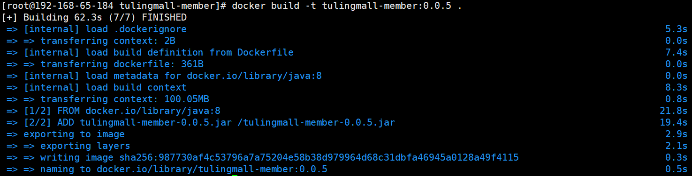

4、启动镜像，加-d可在后台启动

docker run -d -p 8877:8877 tulingmall-member:0.0.5

加上JVM参数：

\# --cap-add=SYS_PTRACE 这个参数是让docker能支持在容器里能执行jdk自带类似jinfo，jmap这些命令，如果不需要在容器里执行这些命令可以不加 docker run  -d -p 8877:8877 \ -e SPRING_CLOUD_NACOS_CONFIG_SERVER_ADDR=192.168.65.174:8848  \ -e JAVA_OPTS='-Xmx1g -Xms1g -XX:MaxMetaspaceSize=512m'  \ --cap-add=SYS_PTRACE  \ tulingmall-member:0.0.5

5、访问会员服务接口

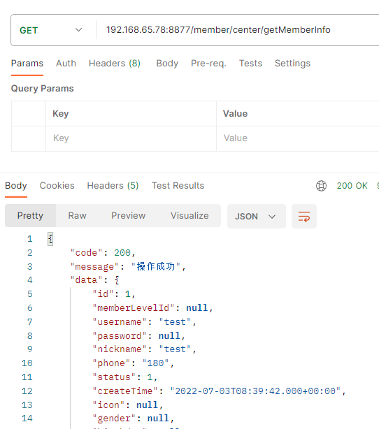

## 将微服务镜像发布到阿里云远程镜像仓库

我们制作好了微服务镜像，一般需要发布到镜像仓库供别人使用，我们可以选择自建镜像仓库，也可以直接使用官方镜像仓库，这里我们选择

阿里云docker镜像仓库：https://cr.console.aliyun.com/cn-hangzhou/instance/repositories

首先，我们需要注册一个阿里云账号，创建容器镜像服务

然后，在linux服务器上用docker login命令登录镜像仓库

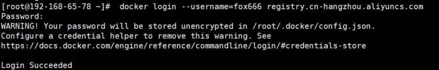

要把镜像推送到镜像仓库

docker tag tulingmall-member:0.0.5 registry.cn-hangzhou.aliyuncs.com/fox666/tulingmall-member:0.0.5

最后将镜像推送到远程仓库

docker push registry.cn-hangzhou.aliyuncs.com/fox666/tulingmall-member:0.0.5

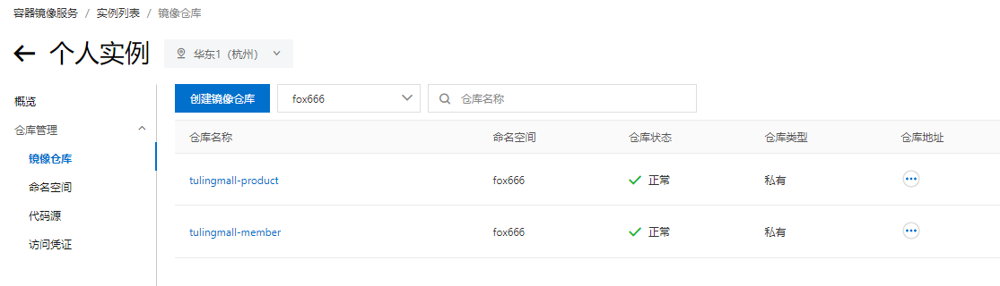

## 将微服务镜像发布到私有镜像仓库

**4.1 搭建私有docker镜像仓库**

1. 配置 Docker 私有仓库：

- 创建一个用于存储仓库数据的目录，例如 /data/docker-registry。
- 创建一个名为 

docker-compose.yml 的文件，并在其中定义 Docker 私有仓库的配置。示例配置如下：

version: '3' services:  registry:    container_name: docker-registry    image: registry:2    ports:      - 5000:5000    volumes:      - /data/docker-registry:/var/lib/registry

这将创建一个名为 docker-registry 的容器，并将其映射到主机的 5000 端口。仓库数据将存储在主机上的 /data/docker-registry 目录中。

1. 启动私有仓库：

- 在包含 docker-compose.yml 文件的目录中，运行以下命令启动私有仓库容器：

docker compose up -d

- 私有仓库将在后台运行，并监听主机的 5000 端口。

1. 设置私有仓库的用户名和密码

在 CentOS 7.9 中，可以使用 httpd-tools 软件包中的 htpasswd 工具来生成加密密码。

yum install httpd-tools # 生成密码文件 htpasswd -Bc auth.htpasswd <用户名>

配置 Docker Daemon：

vim /etc/docker/daemon.json # 将 <私有仓库地址> 替换为实际的私有仓库地址 {  "registry-mirrors": ["https://jbw52uwf.mirror.aliyuncs.com"],"insecure-registries": ["192.168.65.78:5000"] }

重启 Docker Daemon:

 systemctl daemon-reload && systemctl restart docker

**4.2 上传镜像到私有仓库**

要上传镜像到私有仓库，您可以按照以下步骤进行操作：

1. 构建您的镜像：

- 在本地开发环境中使用 Dockerfile 构建您的镜像。确保您的镜像正确地命名为私有仓库的地址，例如 192.168.65.78:5000/tulingmall-product:latest。
- 运行以下命令来构建并标记您的镜像：

docker build -t 192.168.65.78:5000/tulingmall-member:latest .

1. 登录到私有仓库：

- 在上传镜像之前，您需要登录到私有仓库以进行身份验证。
- 运行以下命令来登录到私有仓库：

docker login 192.168.65.78:5000

- 输入您的用户名和密码，以登录到私有仓库。

1. 推送镜像到私有仓库：

- 完成登录后，您可以使用以下命令将镜像推送到私有仓库：

docker push 192.168.65.78:5000/tulingmall-member:latest

- Docker 将会上传您的镜像到私有仓库中。
- 可以通过以下命令来验证镜像是否已经成功推送到私有仓库：

curl -X GET http://192.168.65.78:5000/v2/_catalog
