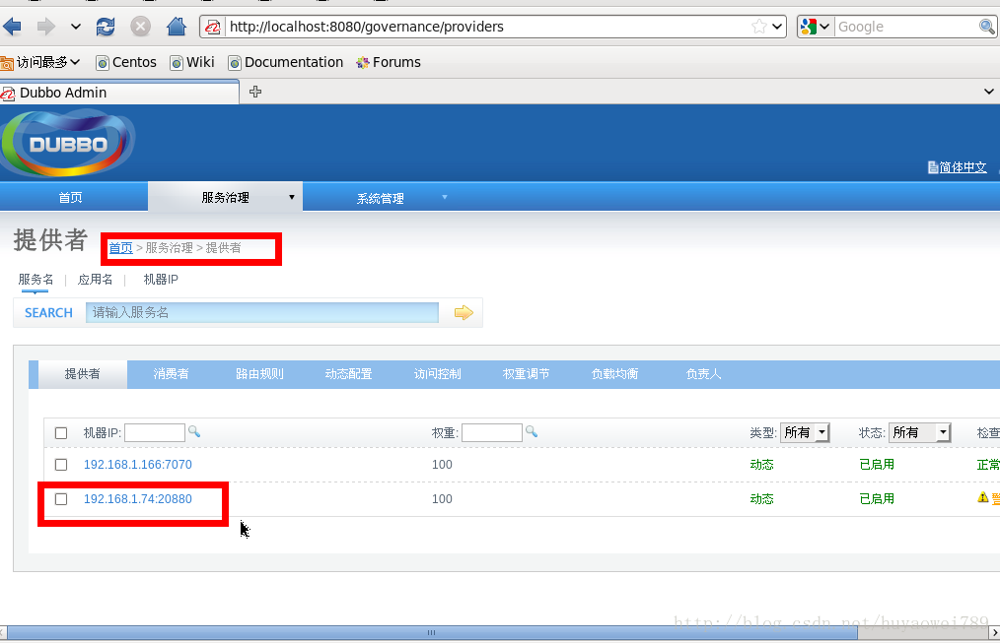

# Dubbo Notes

## Dubbo是什么？

Dubbo是一个分布式服务框架，致力于提供高性能和透明化的RPC远程服务调用方案，以及SOA服务治理方案。简单的说，Dubbo就是个服务框架，如果没有分布式的需求，其实是不需要用的，只有在分布式的时候，才有Dubbo这样的分布式服务框架的需求，并且本质上是个服务调用的东东，说白了就是个**远程服务调用的分布式框架**（告别Web Service模式中的WSdl，以服务者与Consumer的方式在Dubbo上注册）
其核心部分包含：

1. **远程通讯**：提供对多种基于长连接的NIO框架抽象封装，包括多种线程模型，序列化，以及“请求-响应”模式的信息交换方式。
2. **集群容错**：提供基于接口方法的透明远程过程调用，包括多协议支持，以及软负载均衡，失败容错，地址路由，动态配置等集群支持。
3. **自动发现**：基于注册中心目录服务，使服务消费方能动态的查找服务提供方，使地址透明，使服务提供方可以平滑增加或减少机器。

总结：Dubbo = Netty赋能远程通讯 + ZooKeeper赋能容错和自动发现；

## Dubbo能做什么

1. 透明化的远程方法调用，就像调用本地方法一样调用远程方法，只需简单配置，没有任何API侵入。
2. 软[负载均衡](https://cloud.tencent.com/developer/article/1638477)及容错机制，可在内网替代F5等硬件负载均衡器，降低成本，减少单点。
3. 服务自动注册与发现，不再需要写死服务提供方地址，注册中心基于接口名查询服务Provider的IP地址，并且能够平滑添加或删除服务Provider。

Dubbo采用全Spring配置方式，透明化接入应用，对应用没有任何API侵入，只需用Spring加载Dubbo的配置即可，Dubbo基于Spring的Schema扩展进行加载。
之前使用Web Service，我想测试接口可以通过模拟消息的方式通过soapui或LR进行功能测试或性能测试。但现在使用Dubbo，接口之间不能直接交互，我尝试通过模拟Consumer地址测试，结果不堪入目，再而使用jmeter通过junit进行测试，但还是需要往Dubbo上去注册，如果再不给提供源代码的前提下，这个测试用例不好写啊….

## Dubbo的架构

Dubbo架构图如下所示：


节点角色说明：

**Provider**：暴露服务的服务提供方。
**Consumer**：调用远程服务的服务消费方。
**Registry**：服务注册与发现的注册中心。
**Monitor**：统计服务的调用次调和调用时间的监控中心。
**Container**：服务运行容器。

这点我觉得非常好，角色分明，可以根据每个节点角色的状态来确定该服务是否正常。

调用关系说明：

1. 服务容器负责启动，加载，运行服务Provider。

2. 服务Provider在启动时，向注册中心注册自己提供的服务。

3. 服务Consumer在启动时，向注册中心订阅自己所需的服务。

4. 注册中心返回服务Provider地址列表给Consumer，如果有变更，注册中心将基于长连接推送变更数据给Consumer。

5. 服务Consumer，从Provider地址列表中，基于软负载均衡算法，选一台Provider进行调用，如果调用失败，再选另一台调用。

   | 名称                          | 说明                                                         |
   | :---------------------------- | :----------------------------------------------------------- |
   | **Random**LoadBalance         | 随机算法，根据权重设置随机的概率                             |
   | **LeastActive**LoadBalance    | 最少活跃数算法，指请求数和完成数之差，使执行效率高的服务接收更多请求 |
   | **RoundRobin**LoadBalance     | 加权轮训算法，根据权重设置轮训比例                           |
   | **ConsistentHash**LoadBalance | 一致性Hash算法，相同请求参数分配到相同提供者                 |

6. 服务Consumer和Provider，在内存中累计调用次数和调用时间，定时每分钟发送一次统计数据到监控中心。

Dubbo的容错性显而易见，性能方面还没有还得及测，我们系统某页面需要掉5次接口，本来想建议做个缓存，但业务关系不能采纳，还需要研究下Dubbo的性能调优问题…

## Dubbo使用方法

Dubbo采用全Spring配置方式，透明化接入应用，对应用没有任何API侵入，只需用Spring加载Dubbo的配置即可，Dubbo基于Spring的Schema扩展进行加载。如果不想使用Spring配置，而希望通过API的方式进行调用（不推荐）

下面我们就来看看Spring配置方式的写法：

### **服务Provider：**

1. 下载ZooKeeper注册中心，下载地址：
   http：//www.apache.org/dyn/closer.cgi/zookeeper/ 下载后解压即可，进入D：\apach-zookeeper-3.4.5\bin，双击zkServer.cmd启动注册中心服务。
2. 定义服务接口：(该接口需单独打包，在服务提供方和消费方共享)

下面这个例子不错，写的很详细可以做个model.

```java
package com.unj.Dubbotest.provider;  
import java.util.List;  
public interface DemoService {  
    String sayHello(String name);  
    public List getUsers();  
}
```

在服务提供方实现接口：(对服务消费方隐藏实现)

```java
package com.unj.Dubbotest.provider;  

import java.util.ArrayList;  
import java.util.LinkedList;  
import java.util.List;  

public class DemoServiceImpl implements DemoService{  

     public String sayHello(String name) {  
            return "Hello " + name;  
     }  
     public List getUsers() {  
         List list = new ArrayList();  
         User u1 = new User();  
         u1.setName("jack");  
         u1.setAge(20);  
         u1.setSex("男");  

         User u2 = new User();  
         u2.setName("tom");  
         u2.setAge(21);  
         u2.setSex("女");  

         User u3 = new User();  
         u3.setName("rose");  
         u3.setAge(19);  
         u3.setSex("女");  

         list.add(u1);  
         list.add(u2);  
         list.add(u3);  
         return list;  
     }  
}
```

用Spring配置声明暴露服务：

```xml
<?xml version="1.0" encoding="UTF-8"?>  
<beans xmlns="http：//www.Springframework.org/schema/beans"  
    xmlns：xsi="http：//www.w3.org/2001/XMLSchema-instance"  
    xmlns：Dubbo="http：//code.alibabatech.com/schema/Dubbo"  
    xsi：schemaLocation="http：//www.Springframework.org/schema/beans  
        http：//www.Springframework.org/schema/beans/Spring-beans.xsd  
        http：//code.alibabatech.com/schema/Dubbo  
        http：//code.alibabatech.com/schema/Dubbo/Dubbo.xsd  
        ">  

    <!-- 具体的实现bean -->  
    <bean id="demoService" class="com.unj.Dubbotest.provider.DemoServiceImpl" />  

    <!-- 提供方应用信息，用于计算依赖关系 -->  
    <Dubbo：application name="xixi_provider"  />  

    <!-- 使用multicast广播注册中心暴露服务地址   
    <Dubbo：registry address="multicast：//224.5.6.7：1234" />-->  

    <!-- 使用ZooKeeper注册中心暴露服务地址 -->  
    <Dubbo：registry address="ZooKeeper：//127.0.0.1：2181" />   

    <!-- 用Dubbo协议在20880端口暴露服务 -->  
    <Dubbo：protocol name="Dubbo" port="20880" />  

    <!-- 声明需要暴露的服务接口 -->  
    <Dubbo：service interface="com.unj.Dubbotest.provider.DemoService" ref="demoService" />  

</beans>
```

加载Spring配置，启动服务：

```java
package com.unj.Dubbotest.provider;  

import org.Springframework.context.support.ClassPathXmlApplicationContext;  

public class Provider {
    public static void main(String[] args) throws Exception {  
        ClassPathXmlApplicationContext context = new ClassPathXmlApplicationContext(new String[] {"applicationContext.xml"});  
        context.start();  
        System.in.read(); // 为保证服务一直开着，利用输入流的阻塞来模拟  
    }  
}
```

### **服务Consumer：**

applicationContext-Dubbo.xml 中注册自己需要调用的接口，我刚开始测试的时候需要的接口很多，所以把这个文件写的满满的，后来熟悉了把接口按业务类型分开，写了N多个 applicationContext-Dubbo-***.xml 简练多了 。

```xml
<?xml version="1.0" encoding="UTF-8"?>  
<beans xmlns="http：//www.Springframework.org/schema/beans"  
    xmlns：xsi="http：//www.w3.org/2001/XMLSchema-instance" xmlns：Dubbo="http：//code.alibabatech.com/schema/Dubbo"  
    xsi：schemaLocation="http：//www.Springframework.org/schema/beans  
        http：//www.Springframework.org/schema/beans/Spring-beans.xsd  
        http：//code.alibabatech.com/schema/Dubbo  
        http：//code.alibabatech.com/schema/Dubbo/Dubbo.xsd  
        ">  

    <!-- 消费方应用名，用于计算依赖关系，不是匹配条件，不要与提供方一样 -->  
    <Dubbo：application name="hehe_consumer" />  

    <!-- 使用ZooKeeper注册中心暴露服务地址 -->  
    <!-- <Dubbo：registry address="multicast：//224.5.6.7：1234" /> -->  
    <Dubbo：registry address="ZooKeeper：//127.0.0.1：2181" />  

    <!-- 生成远程服务代理，可以像使用本地bean一样使用demoService -->  
    <Dubbo：reference id="demoService" interface="com.unj.Dubbotest.provider.DemoService" />  

</beans>
```

2.加载Spring配置，并调用远程服务：

```java
package com.alibaba.Dubbo.demo.pp;  

import java.util.List;  
import org.Springframework.context.support.ClassPathXmlApplicationContext;  
import com.unj.Dubbotest.provider.DemoService;  

public class Consumer {  
    public static void main(String[] args) throws Exception {  
        ClassPathXmlApplicationContext context = new ClassPathXmlApplicationContext(  
                new String[] { "applicationContext.xml" });  
        context.start();  
        DemoService demoService = (DemoService) context.getBean("demoService"); //  
        String hello = demoService.sayHello("tom"); // ִ  
        System.out.println(hello); //   
				
        List list = demoService.getUsers();  
        if (list != null && list.size() > 0) {  
            for (int i = 0; i < list.size(); i++) {  
                System.out.println(list.get(i));  
            }  
        }  
        // System.out.println(demoService.hehe());  
        System.in.read();  
    }  

}
```

调用结果为：


### Dubbo管理页面：

这个管理页面还需要部署一个环境的(dubbo-admin) ，一开始我还以为是Dubbo自带的，找了半天没有找到….

应用页面：

Provider页面：

Consumer页面：

服务页面：

测试是否成功，我觉得只要看看状态是否正常，就ok了 ….

案例代码下载：http：//download.csdn.net/detail/yiyu1/7116319

## Dubbo服务治理

| 特性         | 描述                                                         |
| ------------ | ------------------------------------------------------------ |
| 透明远程调用 | 就像调用本地方法一样调用远程方法；只需简单配置，没有任何API侵入； |
| 负载均衡机制 | Client端LB，可在内网替代F5等硬件负载均衡器；                 |
| 容错重试机制 | 服务Mock数据，重试次数、超时机制等；                         |
| 自动注册发现 | 注册中心基于接口名查询服务提 供者的IP地址，并且能够平滑添加或删除服务提供者； |
| 性能日志监控 | Monitor统计服务的调用次调和调用时间的监控中心；              |
| 服务治理中心 | 路由规则，动态配置，服务降级，访问控制，权重调整，负载均衡，等手动配置。 |
| 自动治理中心 | 无，比如：熔断限流机制、自动权重调整等；                     |

## Dubbo支持哪些协议

| 协议              | 说明                                                         | <span style="white-space:nowrap;">备注</span> |
| ----------------- | ------------------------------------------------------------ | --------------------------------------------- |
| **dubbo**://      | 单一长连接和 NIO 异步通讯，适合大并发小数据量的服务调用，以及消费者远大于提供者。传输协议 TCP，异步，Hessian 序列化； | 默认推荐                                      |
| **rmi**://        | 采用 JDK 标准的 rmi 协议实现，传输参数和返回参数对象需要实现SerialiZable 接口，使用 java 标准序列化机制，使用阻塞式短连接，传输数据包大小混合，消费者和提供者个数差不多，可传文件，传输协议 TCP。 多个短连接，TCP 协议传输，同步传输，适用常规的远程服务调用和 rmi 互操作。在依赖低版本的 Common-Collections 包，java 序列化存在安全漏洞； |                                               |
| **hessian**://    | 集成 Hessian 服务，基于 HTTP 通讯，采用 Servlet 暴露服务， Dubbo内嵌 Jetty 作为服务器时默认实现，提供与 Hession 服务互操作。多个短连接，同步 HTTP 传输，Hessian 序列化，传入参数较大，提供者大于消费者，提供者压力较大，可传文件； |                                               |
| **http**://       | 基于 HTTP 表单提交的远程调用协议，使用 Spring 的 HTTPInvoke 实现。多个短连接，传输协议 HTTP，传入参数大小混合，提供者个数多于消费者，需要给应用程序和浏览器 JS 调用； |                                               |
| **webservice**:// | 基于 WebService 的远程调用协议，集成 CXF 实现，提供和原生 WebService 的互操作。多个短连接，基于 HTTP 传输，同步传输，适用系统集成和跨语言调用； |                                               |
| **thrift**://     |                                                              |                                               |
| memcached://      | 基于 memcached 实现的 RPC 协议                               |                                               |
| **redis**://      | 基于 redis 实现的 RPC 协议                                   |                                               |
| **rest**://       |                                                              |                                               |


## Dubbo有些哪些注册中心

- **Multicast**：不需要任何中心节点，只要广播地址，就能进行服务注册和发现。基于网络中**组播传输**实现；

- **ZooKeeper**：基于分布式协调系统 Zookeeper 实现，采用Zookeeper 的 watch 机制实现数据变更； 

- **Redis**：基于 redis 实现，采用 key/Map 存储，住 key 存储服务名和类型，Map 中 key 存储服务 URL，value 服务过期时间。基于 redis 的发布/订阅模式通知数据变更； 

- **Simple** ：可以用在本地测试中

## Dubbo集群的负载均衡策略

Dubbo提供了常见的集群策略实现，并预留扩展点予以自行实现。 

| 名称                          | 说明                                                         |
| :---------------------------- | :----------------------------------------------------------- |
| **Random**LoadBalance         | 随机算法，根据权重设置随机的概率                             |
| **LeastActive**LoadBalance    | 最少活跃数算法，指请求数和完成数之差，使执行效率高的服务接收更多请求 |
| **RoundRobin**LoadBalance     | 加权轮训算法，根据权重设置轮训比例                           |
| **ConsistentHash**LoadBalance | 一致性Hash算法，相同请求参数分配到相同提供者                 |

## Dubbo框架设计层级

划分了 10 个层

- 服务接口层(Service)：该层是与实际业务逻辑相关的，根据服务提供方和服务消费方的业务设计对应的接口和实现。 
- 配置层(Config)：对外配置接口，以 ServiceConfig 和ReferenceConfig 为中心。 
- 服务代理层(Proxy)：服务接口透明代理，生成服务的客户端 Stub 和服务器端 Skeleton。 
- 服务注册层(Registry)：封装服务地址的注册与发现，以服务 URL为中心。 
- 集群层(Cluster)：封装多个提供者的路由及负载均衡，并桥接注册中心，以 Invoker 为中心。 
- 监控层(Monitor)：RPC 调用次数和调用时间监控。 
- 远程调用层(Protocol)：封将 RPC 调用，以 Invocation 和 Result为中心，扩展接口为 Protocol、Invoker 和 Exporter。 
- 信息交换层(Exchange)：封装请求响应模式，同步转异步，以Request 和 Response 为中心。 
- 网络传输层(Transport)：抽象 mina 和 netty 为统一接口，以essage 为中心。 
- 数据序列化层(Serialize)：可复用的一些工具，扩展接口为 Serialization、 ObjectInput、ObjectOutput 和 ThreadPool Dubbo 


## Dubbo配置

| 配置              | 配置说明     |
| ----------------- | ------------ |
| dubbo:service     | 服务配置     |
| dubbo:reference   | 引用配置     |
| dubbo:protocol    | 协议配置     |
| dubbo:application | 应用配置     |
| dubbo:module      | 模块配置     |
| dubbo:registry    | 注册中心配置 |
| dubbo:monitor     | 监控中心配置 |
| dubbo:provider    | 提供方配置   |
| dubbo:consumer    | 消费方配置   |
| dubbo:method      | 方法配置     |
| dubbo:argument    | 参数配置     |

## Dubbo安全机制

Dubbo通过 Token 令牌防止用户绕过注册中心直连，然后在注册中心上管理授权。Dubbo还提供服务黑白名单，来控

制服务所允许的调用方。 

## Dubbo服务集群集群容错模式

在集群调用失败时，Dubbo提供了多种容错方案，缺省为 failover 重试。可以自行扩展集群容错策略 

l **Failover Cluster**(默认) 

失败自动切换，当出现失败，重试其它服务器。(缺省)通常用于读操作，但重试会带来更长延迟。可通过retries="2"来设置重试次数(不含第一次)。

```
<Dubbo：service retries="2" cluster="failover"/>      或：         <Dubbo：reference retries="2" cluster="failover"/>         cluster="failover"可以不用写,因为默认就是 failover   
```

l **Failfast Cluster** 

快速失败，只发起一次调用，失败立即报错。通常用于非幂等性的写操作，比如新增记录。 

```
Dubbo：service cluster="failfast" />      或：        
<Dubbo：reference cluster="failfast" />   
cluster="failfast"和 把 cluster="failover"、retries="0"是一样的效果,retries="0"就是不重试   
```

l **Failsafe Cluster**

失败安全，出现异常时，直接忽略。通常用于写入审计日志等操作。

```xml
<Dubbo：service cluster="failsafe" /> 
<!-- 或： -->
<Dubbo：reference cluster="failsafe" />
```

l **Failback Cluster** 

  失败自动恢复，后台记录失败请求，定时重发。通常用于消息通知操作。

```xml
<Dubbo：service cluster="failback" /> 
<!-- 或： --> 
<Dubbo：reference cluster="failback" /> 
```

l **Forking Cluster** 

  并行调用多个服务器，只要一个成功即返回。通常用于实时性要求较高的读操作，但需要浪费更多服务资源。可通过forks="2"来设置最大并行数。 

```xml
<Dubbo：service cluster=“forking" forks="2"/>
<!-- 或： -->
<Dubbo：reference cluster=“forking" forks="2"/> 
```

| **Broadcast Cluster**

广播调用所有提供者，逐个调用，任意一台报错则报错 。通常用于通知所有提供者更新缓存或日志等本地资源信息。

| 集群容错方案      | 说明                                       |
| ----------------- | ------------------------------------------ |
| Failover Cluster  | 失败自动切换，自动重试其它服务器（默认）   |
| Failfast Cluster  | 快速失败，立即报错，只发起一次调用         |
| Failsafe Cluster  | 失败安全，出现异常时，直接忽略             |
| Failback Cluster  | 失败自动恢复，记录失败请求，定时重发       |
| Forking Cluster   | 并行调用多个服务器，只要一个成功即返回     |
| Broadcast Cluster | 广播逐个调用所有提供者，任意一个报错则报错 |

l **配置** 

```xml
# 服务端服务级别
<Dubbo：service interface="..."  loadbalance="roundrobin" />
# 客户端服务级别
<Dubbo：reference interface="..." loadbalance="roundrobin" />
# 服务端方法级别
<Dubbo：service interface="..."> 
<Dubbo：method name="..." loadbalance="roundrobin"/>
# 客户端方法级别
<Dubbo：reference interface="..">
 <Dubbo：method name="..."  loadbalance="roundrobin"/>
```

## Dubbo协议为什么不能传大包

因 Dubbo协议采用单一长连接， 

如果每次请求的数据包大小为 500KByte，假设网络为千兆网卡(1024Mbit=128MByte)，每条连接最大 7MByte(不同的环境可能不一样，供参考)， 

单个服务提供者的 TPS(每秒处理事务数)最大为：128MByte / 500KByte = 262。 

单个消费者调用单个服务提供者的 TPS(每秒处理事务数)最大为：7MByte / 500KByte = 14。如果能接受，可以考虑使用，否则网络将成为瓶颈。 

## Dubbo协议适用范围和适用场景

适用范围：传入传出参数数据包较小(建议小于100K)，消费者比提供者个数多，单一消费者无法压满提供者，尽量不要用Dubbo协议传输大文件或超大字符串。 

适用场景：常规远程服务方法调用 

dubbo协议补充： 

连接个数：单连接

连接方式：长连接

传输协议：TCP 

传输方式：NIO 异步传输 

序列化：Hessian 二进制序列化

## Dubbo配置文件如何加载到Spring中

Spring 容器在启动的时候，会读取到 Spring 默认的一些 schema 以及 Dubbo 自定义的 schema，每个 schema 都会对应一个自己的 NamespaceHandler， NamespaceHandler 里面通过 BeanDefinitionParser 来解析配置信息并转化为需要加载的 bean 对象！

## Dubbo的高性能是怎么实现的

- 基于底层TCP协议
  - 由Netty实现
  - 简洁的通信协议

## [RPC vs REST](https://blog.csdn.net/qq_41534566/article/details/82790865)

- 性能角度
  - RPC > REST
- 灵活度角度
  - RPC：强版本关系依赖，install到仓库并引用之后才能使用，可通过整合swagger让每个服务的代码与文档一体化
  - REST：REST方式的服务依赖较为灵活
- 平台敏感性
  - RPC：只能Java应用
  - REST：跨平台
