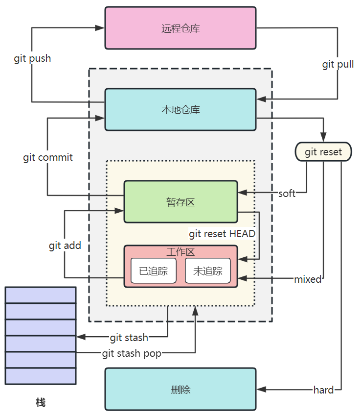

# Git Commands

## 常用命令

> [【五分钟学会git stash 以及相关使用场景】](https://www.bilibili.com/video/BV1nv4y1R78d?vd_source=9ea3ddc4cd6185ce0bf48843c9cc3e78)
>
> https://www.processon.com/diagraming/60e5c6e3e0b34d548fc12655



### 初始化

> **简易的命令行入门教程:**
>
> Git 全局设置:
>
> ```sh
> git config --global user.name "ShrekerNil"
> git config --global user.email "shrekernil@qq.com"
> ```
>
> 创建 git 仓库:
>
> ```sh
> mkdir AmzTools
> cd AmzTools
> git init 
> touch README.md
> git add README.md
> git commit -m "first commit"
> git remote add origin git@gitee.com:QLPython/AmzTools.git
> git push -u origin "master"
> ```
>
> 已有仓库?
>
> ```sh
> cd existing_git_repo
> git remote add origin git@gitee.com:QLPython/AmzTools.git
> git push -u origin "master"
> ```

### 分支

```sh
# 查看分支
git branch -v

# 拉取远程分支，并切换到这个分支
git checkout -b dev origin/dev
```


## Git命令

### 仓库

```sh
# 在当前目录新建一个Git代码库
$ git init

# 新建一个目录，将其初始化为Git代码库
$ git init [project-name]

# 下载一个项目和它的整个代码历史
$ git clone [url]
```

### 配置

```sh
# 显示当前的Git配置
$ git config --list

# 编辑Git配置文件
$ git config -e [--global]

# 设置提交代码时的用户信息
$ git config [--global] user.name "[name]"
$ git config [--global] user.email "[email address]"
```

### 增加/删除文件

```sh
# 添加指定文件到暂存区
$ git add [file1] [file2] ...

# 添加指定目录到暂存区，包括子目录
$ git add [dir]

# 添加当前目录的所有文件到暂存区
$ git add .

# 添加每个变化前，都会要求确认
# 对于同一个文件的多处变化，可以实现分次提交
$ git add -p

# 删除工作区文件，并且将这次删除放入暂存区
$ git rm [file1] [file2] ...

# 停止追踪指定文件，但该文件会保留在工作区
$ git rm --cached [file]

# 改名文件，并且将这个改名放入暂存区
$ git mv [file-original] [file-renamed]
```

### 代码提交

```sh
# 提交暂存区到仓库区
$ git commit -m [message]

# 提交暂存区的指定文件到仓库区
$ git commit [file1] [file2] ... -m [message]

# 提交工作区自上次commit之后的变化，直接到仓库区
$ git commit -a

# 提交时显示所有diff信息
$ git commit -v

# 使用一次新的commit，替代上一次提交
# 如果代码没有任何新变化，则用来改写上一次commit的提交信息
$ git commit --amend -m [message]

# 重做上一次commit，并包括指定文件的新变化
$ git commit --amend [file1] [file2] ...
```

### 分支

```sh
# 列出所有本地分支
$ git branch

# 列出所有远程分支
$ git branch -r

# 列出所有本地分支和远程分支
$ git branch -a

# 新建一个分支，但依然停留在当前分支
$ git branch [branch-name]

# 新建一个分支，并切换到该分支
$ git checkout -b [branch]

# 新建一个分支，指向指定commit
$ git branch [branch] [commit]

# 新建一个分支，与指定的远程分支建立追踪关系
$ git branch --track [branch] [remote-branch]

# 切换到指定分支，并更新工作区
$ git checkout [branch-name]

# 切换到上一个分支
$ git checkout -

# 建立追踪关系，在现有分支与指定的远程分支之间
$ git branch --set-upstream [branch] [remote-branch]

# 合并指定分支到当前分支
$ git merge [branch]

# 选择一个commit，合并进当前分支
$ git cherry-pick [commit]

# 删除分支
$ git branch -d [branch-name]

# 删除远程分支
$ git push origin --delete [branch-name]
$ git branch -dr [remote/branch]
```

### 标签

```sh
# 列出所有tag
$ git tag

# 新建一个tag在当前commit
$ git tag [tag]

# 新建一个tag在指定commit
$ git tag [tag] [commit]

# 删除本地tag
$ git tag -d [tag]

# 删除远程tag
$ git push origin :refs/tags/[tagName]

# 查看tag信息
$ git show [tag]

# 提交指定tag
$ git push [remote] [tag]

# 提交所有tag
$ git push [remote] --tags

# 新建一个分支，指向某个tag
$ git checkout -b [branch] [tag]
```

### 查看信息

```sh
# 显示有变更的文件
$ git status

# 显示当前分支的版本历史
$ git log

# 显示commit历史，以及每次commit发生变更的文件
$ git log --stat

# 搜索提交历史，根据关键词
$ git log -S [keyword]

# 显示某个commit之后的所有变动，每个commit占据一行
$ git log [tag] HEAD --pretty=format:%s

# 显示某个commit之后的所有变动，其"提交说明"必须符合搜索条件
$ git log [tag] HEAD --grep feature

# 显示某个文件的版本历史，包括文件改名
$ git log --follow [file]
$ git whatchanged [file]

# 显示指定文件相关的每一次diff
$ git log -p [file]

# 显示过去5次提交
$ git log -5 --pretty --oneline

# 显示所有提交过的用户，按提交次数排序
$ git shortlog -sn

# 显示指定文件是什么人在什么时间修改过
$ git blame [file]

# 显示暂存区和工作区的差异
$ git diff

# 显示暂存区和上一个commit的差异
$ git diff --cached [file]

# 显示工作区与当前分支最新commit之间的差异
$ git diff HEAD

# 显示两次提交之间的差异
$ git diff [first-branch]...[second-branch]

# 显示今天你写了多少行代码
$ git diff --shortstat "@{0 day ago}"

# 显示某次提交的元数据和内容变化
$ git show [commit]

# 显示某次提交发生变化的文件
$ git show --name-only [commit]

# 显示某次提交时，某个文件的内容
$ git show [commit]:[filename]

# 显示当前分支的最近几次提交
$ git reflog
```

### 远程同步

```sh
# 下载远程仓库的所有变动
$ git fetch [remote]

# 显示所有远程仓库
$ git remote -v

# 显示某个远程仓库的信息
$ git remote show [remote]

# 增加一个新的远程仓库，并命名
$ git remote add [shortname] [url]

# 取回远程仓库的变化，并与本地分支合并
$ git pull [remote] [branch]

# 上传本地指定分支到远程仓库
$ git push [remote] [branch]

# 强行推送当前分支到远程仓库，即使有冲突
$ git push [remote] --force

# 推送所有分支到远程仓库
$ git push [remote] --all
```

### 撤销

```sh
# 恢复暂存区的指定文件到工作区
$ git checkout [file]

# 恢复某个commit的指定文件到暂存区和工作区
$ git checkout [commit] [file]

# 恢复暂存区的所有文件到工作区
$ git checkout .

# 重置暂存区的指定文件，与上一次commit保持一致，但工作区不变
$ git reset [file]

# 重置暂存区与工作区，与上一次commit保持一致
$ git reset --hard

# 重置当前分支的指针为指定commit，同时重置暂存区，但工作区不变
$ git reset [commit]

# 重置当前分支的HEAD为指定commit，同时重置暂存区和工作区，与指定commit一致
$ git reset --hard [commit]

# 重置当前HEAD为指定commit，但保持暂存区和工作区不变
$ git reset --keep [commit]

# 新建一个commit，用来撤销指定commit
# 后者的所有变化都将被前者抵消，并且应用到当前分支
$ git revert [commit]
```

### 暂存

```sh
# 存 / 入栈
git stash
git stash save '<note>'

# 取 / 出栈
git stash pop [<stack-index>]

# 取 / 不出栈(类似peak)
git stash apply

# 清空暂存 / 删除暂存
git stash drop
git stash clear

# 查看
git stash list
git stash show [<stack-index>]
```

### 清空缓存

```sh
# git根目录执行，清空当前repo缓存
git rm -r --cached ./

# 不删除物理文件，仅将该文件从缓存中删除；
git rm --cached "文件路径"

# 不仅将该文件从缓存中删除，还会将物理文件删除（不会回收到垃圾桶）
git rm --f "文件路径
```


## 密钥对

```sh
ssh-keygen -t rsa -C 'SSH.S-COMMON'
ssh-keygen -t rsa -b 4096 -C "SSH-COMMON"
```

## safe.directory

在 Git 中，`safe.directory` 配置项用于指定哪些目录被认为是安全的，从而允许 Git 操作这些目录。当你遇到需要使用 `git config --global --add safe.directory` 的情况时，通常是因为 Git 默认将一些目录视为潜在的不安全目录，比如那些位于用户主目录之外的目录。

如果你希望避免每次都需要添加新的仓库目录到 `safe.directory`，可以考虑以下几种方法：

### 1. 修改全局配置

你可以将当前用户的所有仓库目录都加入到 `safe.directory` 列表中，这样就不需要为每个新仓库单独添加了。执行以下命令：

```bash
git config --global --add safe.directory '*'
```

这会将 `*` 添加到 `safe.directory` 列表中，意味着对当前用户下的所有目录都视为安全。请注意，这种方法可能会降低安全性，因为它允许 Git 操作任何目录，包括那些可能被恶意软件修改的目录。

### 2. 关闭安全目录检查

Git 提供了一个配置选项 `safe.directory`，但没有直接的配置选项来完全关闭这个安全检查。不过，你可以通过设置一个不存在的目录到 `safe.directory` 来“禁用”这个检查：

```bash
git config --global --add safe.directory /non/existent/path
```

这会使得 Git 认为所有目录都是安全的，因为与 `/non/existent/path` 相比，任何实际存在的目录都会被视为更安全。然而，这种方法并不推荐，因为它绕过了 Git 的安全机制，可能会带来风险。

### 3. 仅对特定目录禁用

如果你只是想对特定的仓库禁用这个检查，可以考虑在该仓库的 `.git/config` 文件中直接修改，而不是使用全局配置。在仓库的 `.git/config` 文件中添加以下内容：

```
[core]
    safeDirectories = /path/to/your/repo
```

将 `/path/to/your/repo` 替换为你的仓库路径。

### 总结

虽然可以采取措施减少重复添加仓库到 `safe.directory` 的需要，但出于安全考虑，通常不建议完全关闭这个功能。如果你选择修改全局配置，请确保你了解可能带来的风险，并且只在你信任的目录中操作 Git。如果你对安全有特别的考虑，建议不要使用上述方法来绕过安全检查。

# Git Tools

## Git-FTP

**Brackets Git** offers built-in support for **Git-FTP**, an FTP extension which allows sync repositories using FTP, to install this extension follow these steps:

1. Download the **Git-FTP** script [from this link](/docs/src/git-ftp) (N.B.: the script does not have an extension)
2. Move the downloaded script inside your Git binaries installation folder (usually `C:\Program Files\Git\bin\` on Windows, `/usr/bin` on GNU/Linux or `/usr/local/bin` on OS X)
3. Open **Brackets Git** settings and enable Git-FTP.

Now you should be able to use **Git-FTP** through **Brackets Git**.


# Git Problems

## 删除并忽略已提交的文件

1. ignore文件中添加要忽略的文件或者文件夹

   - 文件夹采用：`文件夹名/`

2. Git执行如下命令

   ```
   # 文件夹
   git rm -r --cached <文件夹路径>
   
   # 文件
   git rm --cached <文件路径>
   ```

   接着检查状态提交即可
