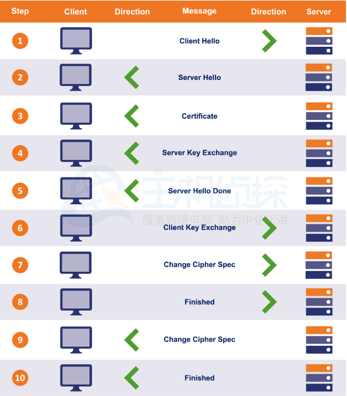
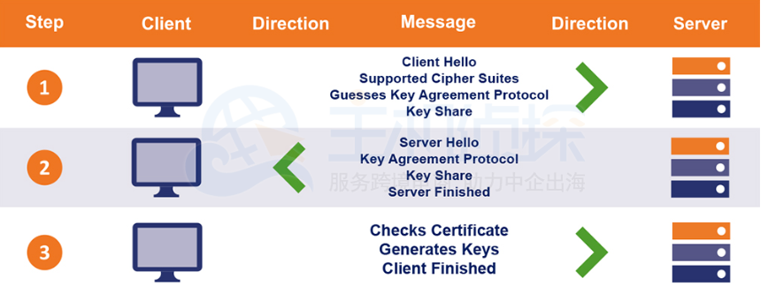

# TLS 1.2和1.3中的SSL / TLS握手过程

来源：https://www.idcspy.com/18523.html

## 什么是SSL / TLS握手？

在每个HTTPS连接开始时，客户端（互联网用户的Web浏览器）和服务器（托管网站）都必须进行一系列检查，以便彼此进行身份验证并确定参数，进行加密的连接。这被称为TLS握手，也被称为SSL握手。

TLS握手过程主要完成了三件事：

1）将服务器认证为非对称公钥/私钥对的合法所有者。

2）确定将用于连接的TLS版本和密码套件。

3）交换将用于通信的对称会话密钥。

如果简化公钥基础结构（PKI），那么实际上就是安全密钥交换。在HTTPS连接期间，实际上是使用对称会话密钥（通常是256位高级加密标准（AES）密钥）完成通信，该会话密钥是在事物的客户端生成的。生成对称密钥时，双方都会得到一份副本。他们可以使用它来加密和解密在它们之间传输的数据。

## TLS 1.2和TLS 1.3中的SSL / TLS握手过程

TLS 1.2使用一次握手，可以在客户端和服务器之间进行多次往返。如图所示：

TLS握手工作过程：（这些步骤都在很短很短的时间内发生）

1）客户端和服务器相互ping通。

2）服务器出示其SSL / TLS证书。

3）客户端验证证书颁发机构（CA）签名的证书。

4）他们交换一列受支持的密码套件并达成协议，然后进行密钥交换。

另一方面，TLS 1.3将TLS握手改进为单个往返。如图所示：

显然，这减少了连接启动所花费的时间（毫秒），因此可能并不明显（除非是大规模的）。TLS 1.3还允许恢复0-RTT，从而进一步简化了与启用TLS 1.3的网站的后续连接。

**相关知识推荐：**《[SSL / TLS握手失败错误说明及解决方法](https://www.idcspy.com/18561.html)》

**SSL证书申请推荐：**[GeoTrust](https://www.idcspy.com/geotrust.html)（性比价最高的证书品牌）、[Comodo](https://www.idcspy.com/comodo.html)（申请价格便宜）

# Oracle JDK 8u261支持TLS1.3

来源：https://www.jdon.com/54595

TLS 1.3已反向移植到昨天发布的Oracle JDK 8u261中， 还增加了TLS 1.2的GCM密码套件的优先级。更详细的Java加密路线图点击：https://java.com/en/jre-jdk-cryptoroadmap.html。