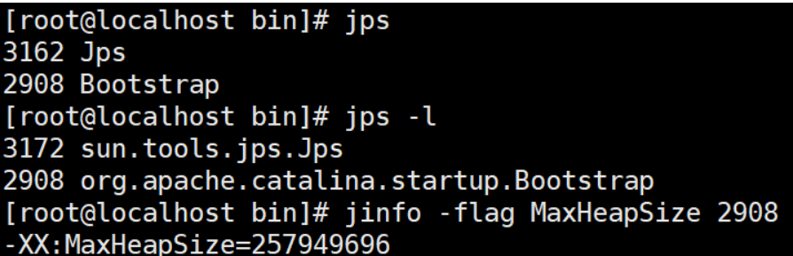
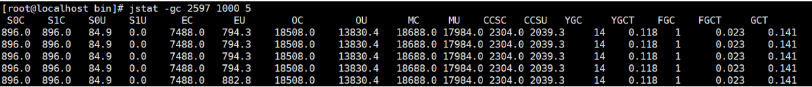

# JVM问题总结

## JVM内存模型

- JVM组成：类装载子系统、运行时数据区、字节码执行引擎

  

### JVM组件之间的关系


### 堆内存区


## 类加载过程


## CMS和G1的工作流程

### CMS收集器的工作过程图


### G1收集器运行示意图


## JVM垃圾回收算法总结

| 算法                                              | 说明                                                         | 优点                                                         | 缺点                          |
| ------------------------------------------------- | ------------------------------------------------------------ | ------------------------------------------------------------ | ----------------------------- |
| <span style="white-space:nowrap;">标记清除</span> | 1、标记：从根节点开始标记引用的对象。假设这会儿有效内存空间耗尽了，JVM将会停止应用程序的运行并开启GC线程，然后开始进行标记工作。<br/>2、清除：未被标记引用的对象就是垃圾对象，可以被清理。 | 标记清除算法解决了引用计数算法中的循环引用的问题，没有从root节点引用的对象都会被回收。 | 效率低<br/>内存碎片化<br/>STW |
| 标记整理                                          | 从根节点开始，对对象的引用进行标记，在清理阶段，将存活的对象整理到内存的一端，然后清理边界以外的垃圾，从而解决了碎片化的问题。 | 解决内存碎片问题                                             | 复制对象性能影响              |
| 复制                                              | 原有的内存空间一分为二，每次只用其中的一块，在垃圾回收时，将正在使用的对象复制到另一个内存空间中，然后将该内存空间清空，交换两个内存的角色，完成垃圾的回收。 | 垃圾多的情况下效率较高                                       | 浪费内存空间                  |
| 分代                                              | 根据不同的数据特征采用响应的算法进行垃圾回收                 |                                                              |                               |

## CMS GC 参数配置

参考：[一文彻底搞懂 CMS GC 参数配置](https://cloud.tencent.com/developer/article/1545238)

**CMS GC 要点**

CMS(Concurrent Mark Sweep，并发-标记-清除)是目前最常用的 JVM 垃圾回收器，这里不解释 CMS 的工作过程，只记录一些基础要点以帮助理解后面的内容：

- CMS 是一种基于并发、使用标记清除算法的垃圾回收器。CMS 会尽可能让 GC 线程与用户线程并发执行，可以消除长时间的 GC 停顿(STW)。
- CMS 不会对新生代做垃圾回收，默认只针对老年代进行垃圾回收。此外，CMS 还可以开启对永久代的垃圾回收(或元空间)，避免由于 PermGen 空间耗尽带来 FullGC，JDK6以上受参数 -XX:+CMSClassUnloadingEnabled 控制，这个参数在 JDK8 之前默认关闭，JDK8 默认开启了。
- CMS 要与一个新生代垃圾回收器搭配使用，所谓"分代收集"。能与 CMS 配合工作的新生代回收器有 Serial 收集器和 ParNew 收集器，我们一般使用支持多线程执行的 ParNew 收集器。
- 使用 CMS GC 策略时，GC 类别可以分为：Young GC(又称 MinorGC)，Old GC(又称 Major GC)，以及FullGC。其中 FullGC 是对整个堆的垃圾回收，STW 时间较长，对业务影响较大，应该尽量避免 FullGC。

**JVM 参数配置**

经过理解各个参数的含义及取值影响，总结了以下的 JVM 参数配置，可以几乎不用调整使用：

```javascript
-Xmx32g -Xms32g -Xmn1g -Xss256k-XX:SurvivorRatio=2 -XX:MaxPermSize=256m-XX:+UseParNewGC-XX:+UseConcMarkSweepGC-XX:ParallelGCThreads=10-XX:ParallelCMSThreads=16-XX:+CMSParallelRemarkEnabled-XX:MaxTenuringThreshold=15-XX:+UseCMSCompactAtFullCollection-XX:+UseCMSInitiatingOccupancyOnly-XX:CMSInitiatingOccupancyFraction=70-XX:+CMSClassUnloadingEnabled-XX:-DisableExplicitGC-XX:+HeapDumpOnOutOfMemoryError-verbose:gc-XX:+PrintGCDetails-XX:+PrintGCTimeStamps-XX:+PrintGCDateStamps-Xloggc:/app/log/hbase/gc-hbase-REGIONSERVER-`hostname`-`date +%Y%m%d`.log
```

如果是 64G 及以上的大堆，-Xmn 可以调整到2g，其他参数不变或微调。下面对一些重要的 JVM 参数介绍说明。

**重点参数解析**

以下参数解析都建立在使用 CMS GC 策略基础上，这里使用 CMS GC 表示老年代垃圾回收，Young GC 表示新生代垃圾回收。

① **-Xmx, -Xms, -Xmn**

-Xmx、-Xms 分别表示 JVM 堆的最大值，初始化大小。-Xmx 等价于-XX:MaxHeapSize，-Xms 等价于-XX:InitialHeapSize。

-Xmn表示新生代大小，等价于-XX:MaxNewSize、-XX:NewSize，这个参数的设置对 GC 性能影响较大，设置小了会影响 CMS GC 性能，设置大了会影响 Young GC 性能，建议取值范围在1~3g，比如32g堆大小时可以设为1g，64g堆大小时可以设为2g，通常性能会比较高。

② **-Xss**

表示线程栈的大小，等价于-XX:ThreadStackSize，默认1M，一般使用不了这么多，建议值256k。

③ **-XX:SurvivorRatio**

新生代中 Eden 区与一个 Survivor 区的比值，默认8，这个参数设置过大会导致 CMS GC 耗时过长，建议调小，使得短寿对象在Young区可以被充分回收，减少晋升到Old区的对象数量，以此提升 CMS GC 性能。

④ **-XX:+UseParNewGC, -XX:+UseConcMarkSweepGC**

分别表示使用并行收集器 ParNew 对新生代进行垃圾回收，使用并发标记清除收集器 CMS 对老年代进行垃圾回收。

⑤ **-XX:ParallelGCThreads, -XX:ParallelCMSThreads**

分别表示 Young GC 与 CMS GC 工作时的并行线程数，建议根据处理器数量进行合理设置。

⑥ **-XX:MaxTenuringThreshold**

对象从新生代晋升到老年代的年龄阈值(每次 Young GC 留下来的对象年龄加一)，默认值15，表示对象要经过15次 GC 才能从新生代晋升到老年代。设置太小会严重影响 CMS GC 性能，建议默认值即可。

⑦ **-XX:+UseCMSCompactAtFullCollection**

由于 CMS GC 会产生内存碎片，且只在 FullGC 时才会进行内存碎片压缩(因此 使用 CMS 垃圾回收器避免不了 FullGC)。这个参数表示开启 FullGC 时的压缩功能，减少内存碎片。

⑧ **-XX:CMSInitiatingOccupancyFraction**，**-XX:+UseCMSInitiatingOccupancyOnly **

-XX:CMSInitiatingOccupancyFraction 表示触发 CMS GC 的老年代使用阈值，一般设置为 70~80(百分比)，设置太小会增加 CMS GC GC的频率，设置太大可能会导致并发模式失败或晋升失败。默认为 -1，表示 CMS GC 会由 JVM 自动触发。

-XX:+UseCMSInitiatingOccupancyOnly 表示 CMS GC 只基于 CMSInitiatingOccupancyFraction 触发，如果未设置该参数则 JVM 只会根据 CMSInitiatingOccupancyFraction 触发第一次 CMS GC ，后续还是会自动触发。建议同时设置这两个参数。

⑨ **-XX:+CMSClassUnloadingEnabled**

表示开启 CMS 对永久代的垃圾回收(或元空间)，避免由于永久代空间耗尽带来 FullGC。

### **在线工具**

- GC在线参数检查与优化：https://xxfox.perfma.com
- GC在线日志分析：https://gceasy.io/

## 关于GC的选择

除非应用程序有非常严格的暂停时间要求，否则请先运行应用程序并允许VM选择收集器(如果没有特别要求。使用VM提供给的默认GC就好)。

如有必要，调整堆大小以提高性能。 如果性能仍然不能满足目标，请使用以下准则作为选择收集器的起点：

- 如果应用程序的数据集较小(最大约100 MB)，则选择带有选项`-XX:+ UseSerialGC`的串行收集器。
- 如果应用程序将在单个处理器上运行，并且没有暂停时间要求，则选择带有选项`-XX:+UseSerialGC`的串行收集器。
- 如果(a)峰值应用程序性能是第一要务，并且(b)没有暂停时间要求或可接受一秒或更长时间的暂停，则让VM选择收集器或使用`-XX:+ UseParallelGC`选择并行收集器 。
- 如果响应时间比整体吞吐量更重要，并且垃圾收集暂停时间必须保持在大约一秒钟以内，则选择具有`-XX:+ UseG1GC`。(值得注意的是JDK9中CMS已经被Deprecated，不可使用！移除该选项)
- 如果使用的是JDK8，并且堆内存达到了16G，那么推荐使用G1收集器，来控制每次垃圾收集的时间。如果响应时间是高优先级，或使用的堆非常大，请使用-XX：UseZGC选择完全并发的收集器。(值得注意的是JDK11开始可以启动ZGC，但是此时ZGC具有实验性质，在JDK15中[202009发布]才取消实验性质的标签，可以直接显示启用，但是JDK15默认GC仍然是G1)

这些准则仅提供选择收集器的起点，因为性能取决于堆的大小，应用程序维护的实时数据量以及可用处理器的数量和速度。

如果推荐的收集器没有达到所需的性能，则首先尝试调整堆和新生代大小以达到所需的目标。 如果性能仍然不足，尝试使用其他收集器

**总体原则**：减少`STOP THE WORD`时间，使用并发收集器(比如`CMS+ParNew`，`G1`)来减少暂停时间，加快响应时间，并使用并行收集器来增加多处理器硬件上的总体吞吐量。

## JDK默认垃圾回收器

```bash
C:\Users\Shreker>java -XX:+PrintCommandLineFlags -version
-XX:InitialHeapSize=266772608 -XX:MaxHeapSize=4268361728 -XX:+PrintCommandLineFlags -XX:+UseCompressedClassPointers -XX:+UseCompressedOops -XX:-UseLargePagesIndividualAllocation -XX:+UseParallelGC
java version "1.8.0_201"
Java(TM) SE Runtime Environment (build 1.8.0_201-b09)
Java HotSpot(TM) 64-Bit Server VM (build 25.201-b09, mixed mode)

C:\Users\Shreker>java -XX:+PrintGCDetails -version
java version "1.8.0_201"
Java(TM) SE Runtime Environment (build 1.8.0_201-b09)
Java HotSpot(TM) 64-Bit Server VM (build 25.201-b09, mixed mode)
Heap
 PSYoungGen      total 76288K, used 3932K [0x000000076b300000, 0x0000000770800000, 0x00000007c0000000)
  eden space 65536K, 6% used [0x000000076b300000,0x000000076b6d7240,0x000000076f300000)
  from space 10752K, 0% used [0x000000076fd80000,0x000000076fd80000,0x0000000770800000)
  to   space 10752K, 0% used [0x000000076f300000,0x000000076f300000,0x000000076fd80000)
 ParOldGen       total 175104K, used 0K [0x00000006c1800000, 0x00000006cc300000, 0x000000076b300000)
  object space 175104K, 0% used [0x00000006c1800000,0x00000006c1800000,0x00000006cc300000)
 Metaspace       used 2365K, capacity 4480K, committed 4480K, reserved 1056768K
  class space    used 255K, capacity 384K, committed 384K, reserved 1048576K
  
// 修改为 Parallel New(ParNew) + CMS
java -XX:+UseParNewGC -XX:+UseConcMarkSweepGC -XX:+CMSClassUnloadingEnabled -XX:+UseCMSInitiatingOccupancyOnly -XX:CMSInitiatingOccupancyFraction=75 -jar your-application.jar
```

- UseParallelGC = Parallel Scavenge + Parallel Old

| 参数                           | 描述                                                         |
| :----------------------------- | :----------------------------------------------------------- |
| UseSerialGC                    | 虚拟机运行在Client模式下的默认值，打开此开关后，使用Serial + Serial Old的收集器组合进行内存回收 |
| **UseParNewGC**                | 打开此开关后，使用ParNew + Serial Old的收集器组合进行内存回收 |
| UseConcMarkSweepGC             | 打开此开关后，使用ParNew + CMS + Serial Old的收集器组合进行内存回收。Serial Old收集器将作为CMS收集器出现Concurrent Mode Failure失败后的后备收集器使用 |
| **UseParallelGC**              | 虚拟机运行在Server模式下的默认值，打开此开关后，使用Parallel Scavenge + Serial Old(PS MarkSweep)的收集器组合进行内存回收 |
| UseParallelOldGC               | 打开此开关后，使用Parallel Scavenge + Parallel Old 的收集器组合进行内存回收 |
| SurvivorRatio                  | 新生代中Eden区域与Survivor区域的容量比值，默认为8，代表Eden : Survivor=8:1 |
| PretenureSizeThreshold         | 直接晋升到老年代的对象大小，设置这个参数后，大于这个参数的对象将直接在老年代分配 |
| MaxTenuringThreshold           | 晋升到老年代的对象年龄。每个对象在坚持过一次MinorGC之后，年龄就增加1，当超过这个参数值时就进入老年代 |
| UseAdaptiveSizePolicy          | 动态调整Java堆中各个区域的大小以及进入老年代的年龄           |
| HandlePromotionFailure         | 是否允许分配担保失败，即老年代的剩余空间不足以应付新生代的整个Eden和Survivor区的所有对象都存活的极端情况 |
| ParallelGCThreads              | 设置并行GC时进行内存回收的线程数                             |
| GCTimeRatio                    | GC时间占总时间的比率，默认值为99，即允许1%的GC时间。仅使用Parallel Scavenge收集器时生效 |
| MaxGCPauseMillis               | 设置GC的最大停顿时间。仅在使用Parallel Scavenge收集器生效    |
| CMSInitiatingOccupancyFraction | 设置CMS收集器在老年代空间被使用多少后触发垃圾收集，默认值为68%，仅使用CMS收集器时生效 |
| UseCMSCompactAtFullCollection  | 设置CMS收集器在完成垃圾收集后是否要进行一次内存碎片整理。仅在使用CMS收集器时生效 |
| CMSFullGCsBeforeCompaction     | 设置CMS收集器在进行若干次垃圾收集后再启动一次内存碎片整理。仅在使用CMS收集器时生效 |


## 内存溢出的原因，线上如何排查

- 内存溢出与内存泄漏

  - 内存溢出：内存不够了分配了
  - 内存泄漏：开辟内存后不管了，一直开辟，可导致内存溢出，类似于野指针

- 线上的JVM一定要设置OOM时Dump堆栈信息

  ```
  -XX:+HeapDumpOnOutOfMemoryError 设置当首次遭遇内存溢出时导出此时堆中相关信息
  -XX：HeapDumpPath=/opt/jvmdump/heapdump.hprof 指定导出堆信息时的路径或文件名
  ```

- 常见OOM：

  - java.lang.OutOfMemoryError： ......**java heap space**..... 堆栈溢出，代码问题的可能性极大
  - java.lang.OutOfMemoryError： **GC over head limit exceeded** 系统处于高频的GC状态，而且回收的效果依然不佳的情况，就会开始报这个错误，这种情况一般是产生了很多不可以被释放的对象，有可能是引用使用不当导致，或申请大对象导致，但是java heap space的内存溢出有可能提前不会报这个错误，也就是可能内存就直接不够导致，而不是高频GC.
  - java.lang.OutOfMemoryError： **PermGen space** JDK1.7之前才会出现的问题 ，原因是系统的代码非常多或引用的第三方包非常多、或代码中使用了大量的常量、或通过intern注入常量、或者通过动态代码加载等方法，导致常量池的膨胀
  - java.lang.OutOfMemoryError： **Direct buffer memory** 直接内存不足，因为jvm垃圾回收不会回收掉直接内存这部分的内存，所以可能原因是直接或间接使用了ByteBuffer中的allocateDirect方法的时候，而没有做clear；**开启Netty的引用计数本地复现，注意不要线上开启**
  - java.lang.StackOverflowError - Xss设置的太小了，**小心错误递归**
  - java.lang.OutOfMemoryError： unable to create new native thread 堆外内存不足，无法为线程分配内存区域
  - java.lang.OutOfMemoryError： request {} byte for {}out of swap 地址空间不够
- 记录一次Metaspace OOM的问题：[线上事故](RealAccident.md)

## 内存溢出的解决方案是什么

- 从代码层面进行优化完善，尽量避免该情况发生；
- 调整优化服务器配置： 
  1) 设置－Xms、－Xmx等 
  2) 设置NewSize、MaxNewSize相等 
  3) 设置 Heap size，PermGen space

## 如何提前避免内存泄漏

- **尽早释放无用对象的引用** 
  好的办法是使用临时变量的时候，让引用变量在推出活动域后自动设置为null，暗示垃圾收集器来收集该对象，防止发生内存泄漏。
- **程序进行字符串处理时，尽量避免使用String，而应该使用StringBuffer**。 
  因为String类是不可变的，每一个String对象都会独立占用内存一块区域。
- **尽量少用静态变量** 
  因为静态变量是全局的，存在方法区，GC不会回收。(用永久代实现的方法区，垃圾回收行为在这个区域是比较少出现的，垃圾回收器的主要目标是针对常量池和类型的卸载)
- **避免集中创建对象，尤其是大对象，如果可以的话尽量使用流操作** 
  JVM会突然需要大量neicun，这时会出发GC优化系统内存环境
- **尽量运用对象池技术以提高系统性能** 
  生命周期长的对象拥有生命周期短的对象时容易引发内存泄漏，例如大集合对象拥有大数据量的业务对象的时候，可以考虑分块进行处理，然后解决一块释放一块的策略。
- **不要在经常调用的方法中创建对象，尤其忌讳在循环中创建对象** 
  可以适当的使用hashtable，vector创建一组对象容器，然后从容器中去取这些对象，而不用每次new之后又丢弃。
- **优化配置**

## 内存泄露产生的原因和避免方式

内存泄露原指那些在内存中已经访问不到的对象，但是确实占据着内存空间，但是由于可达性分析的存在，这部分数据我们称之为垃圾，现在的内存泄露是指那些占据着内存却没有什么实际用途或者不怎么使用的数据所占的内存。

一、内存泄露如何产生？

Java内存泄漏的根本原因是长生命周期的对象持有短生命周期对象的引用就很可能发生内存泄漏，尽管短生命周期对象已经不再需要，但是因为长生命周期持有它的引用而导致不能被回收。

具体主要有如下几大类：

１、**静态集合类引起内存泄漏**：像HashMap、Vector等的使用最容易出现内存泄露，这些静态变量的生命周期和应用程序一致，他们所引用的所有的对象Object也不能被释放，因为他们也将一直被Vector等引用着。

２、当集合里面的对象属性被修改后，再调用remove()方法时不起作用，此时造成内存泄露？？？

３、**不移除监听器引起内存泄漏**：通常一个应用当中会用到很多监听器，我们会调用一个控件的诸如addXXXListener()等方法来增加监听器，但往往在释放对象的时候却没有记住去删除这些监听器，从而增加了内存泄漏的机会。

4、**不关闭连接引起内存泄漏**：比如数据库连接(dataSourse.getConnection())，网络连接(socket)，IO连接等，除非其显式的调用了其close()方法将其连接关闭，否则是不会自动被 GC 回收的。对于Resultset 和Statement 对象可以不进行显式回收，但Connection 一定要显式回收，因为Connection 在任何时候都无法自动回收，而Connection一旦回收，Resultset 和Statement 对象就会立即为NULL。**但是如果使用连接池就不一样了**，除了要显式地关闭连接，还必须显式地关闭Resultset Statement 对象(关闭其中一个，另外一个也会关闭)，否则就会造成大量的Statement对象无法释放，从而引起内存泄漏。这种情况下一般都会在try里面去的连接，在finally里面释放连接。

5、**内部类和外部模块的引用引起内存泄漏**：内部类对象的引用是比较容易遗忘的一种，而且一旦没释放可能导致一系列的后继类对象没有释放。此外我们还要小心外部模块不经意的引用，内部类是否提供相应的操作去除外部引用。

6、单例模式：由于单例的静态特性使得其生命周期跟应用的生命周期一样长，所以如果使用不恰当的话，很容易造成内存泄漏。单例对象在初始化后将在JVM的整个生命周期中存在(以静态变量的方式)，如果单例对象持有外部的引用，那么外部对象将不能被JVM正常回收，导致内存泄漏。

二、常见的内存泄露的处理方式

１、静态集合持有元素不释放

集合类如果仅仅有添加元素的方法，而没有相应的删除机制，导致内存被占用。如果这个集合类是全局性的变量 (比如类中的静态属性，全局性的 map 等即有静态引用或 final 一直指向它)，那么没有相应的删除机制，很可能导致集合所占用的内存只增不减。因此，在编写代码的时候，集合类需要有成对出现添加和删除或者清空的操作。

２、单例对象持有不释放

```java
public class AppManager {
  private static AppManager instance;
  private Context context;
  private AppManager(Context context) {
    this.context = context;
  }
  public static AppManager getInstance(Context context) {
    if (instance == null) {
      instance = new AppManager(context);
    }
    return instance;
  }
}
```

这是一个普通的单例模式，当创建这个单例的时候，由于需要传入一个Context，所以这个Context的生命周期的长短至关重要：

1、如果此时传入的是 Application 的 Context，因为 Application 的生命周期就是整个应用的生命周期，所以这将没有任何问题。

2、如果此时传入的是 Activity 的 Context，当这个 Context 所对应的 Activity 退出时，由于该 Context 的引用被单例对象所持有，其生命周期等于整个应用程序的生命周期，所以当前 Activity 退出时它的内存并不会被回收，这就造成泄漏了。

还是利用静态变量的生命周期与应用的生命周期一致的特性，进行单例修改，从而避免内存泄露　方法如下

```java
//方式一
public class AppManager {
  private static AppManager instance;
  private Context context;
  private AppManager(Context context) {
    this.context = context.getApplicationContext();// 使用Application 的context
  }
  public static AppManager getInstance(Context context) {
    if (instance == null) {
      instance = new AppManager(context);
    }
    return instance;
  }
}

//方式二 在你的 Application 中添加一个静态方法，getContext() 返回Application 的 context
public class AppManager {
  private static AppManager instance;
  private Context context;
  private AppManager() {
    this.context = MyApplication.getContext();// 使用Application 的context
  }
  public static AppManager getInstance() {
    if (instance == null) {
      instance = new AppManager();
    }
    return instance;
  }
}
```

３、非静态内部类创建静态实例造成的内存泄漏

```java
public class MainActivity extends AppCompatActivity {
  private static TestResource mResource = null;

  @Override
  protected void onCreate(Bundle savedInstanceState) {
    super.onCreate(savedInstanceState);
    setContentView(R.layout.activity_main);
    if (mManager == null) {
      mManager = new TestResource();
    }
    //...
  }

  class TestResource {
    //...
  }
}
```

在Activity内部创建了一个非静态内部类的单例，每次启动Activity时都会使用该单例的数据，这样虽然避免了资源的重复创建，不过这种写法却会造成内存泄漏，因为非静态内部类默认会持有外部类的引用，而该非静态内部类又创建了一个静态的实例，该实例的生命周期和应用的一样长，这就导致了该静态实例一直会持有该Activity的引用，导致Activity的内存资源不能正常回收。

正确的做法为：将该内部类设为静态内部类或将该内部类抽取出来封装成一个单例

４、匿名内部类/异步线程

```java
public class MainActivity extends AppCompatActivity {

  @Override
  protected void onCreate(Bundle savedInstanceState) {
    super.onCreate(savedInstanceState);
    setContentView(R.layout.activity_main);

    new Thread(new MyRunnable()).start();
    new MyAsyncTask(this).execute();
  }

  class MyAsyncTask extends AsyncTask<Void, Void, Void> {

    // ...

    public MyAsyncTask(Context context) {
      // ...
    }

    @Override
    protected Void doInBackground(Void... params) {
      // ...
      return null;
    }

    @Override
    protected void onPostExecute(Void aVoid) {
      // ...
    }
  }

  class MyRunnable implements Runnable {
    @Override
    public void run() {
      // ...
    }
  }
}
```

AsyncTask和Runnable都使用了匿名内部类，那么它们将持有其所在Activity的隐式引用。如果任务在Activity销毁之前还未完成，那么将导致Activity的内存资源无法被回收，从而造成内存泄漏。
解决方法：将AsyncTask和Runnable类独立出来或者使用静态内部类，这样便可以避免内存泄漏

５、Handler造成的内存泄露

由于 Handler 属于 TLS(Thread Local Storage) 变量, 生命周期和 Activity 是不一致的。因此这种实现方式一般很难保证跟 View 或者 Activity 的生命周期保持一致，故很容易导致无法正确释放

```java
public class SampleActivity extends Activity {

  private final Handler mLeakyHandler = new Handler() {
    @Override
    public void handleMessage(Message msg) {
      // ...
    }
  }

  @Override
  protected void onCreate(Bundle savedInstanceState) {
    super.onCreate(savedInstanceState);

    // Post a message and delay its execution for 10 minutes.
    mLeakyHandler.postDelayed(new Runnable() {
      @Override
      public void run() { /* ... */ }
    }, 1000 * 60 * 10);

    // Go back to the previous Activity.
    finish();
  }
}
```


## CMS和G1的区别

- 算法：
  - CMS：标记清除：容易造成内存碎片
  - G1：标记整理
- 可伸缩性
  - G1：可根据**可预测的停顿时间模型**配置自主决策清理多少内存，动态调整各个分代的大小
  - CMS：不支持

## G1什么时候触发FullGC

- G1地清理速度赶不上应用线程的分配速度。
  - Evacuation的时候没有足够的to-space来存放晋升的对象；
  - 并发处理过程完成之前空间耗尽；

  - 由于对象进行了分代处理，因此垃圾回收区域、时间也不一样。GC有两种类型：Scavenge GC和FullGC。
    * Scavenge GC：一般情况下，当新对象生成，并且在Eden申请空间失败时，就会触发Scavenge GC，对Eden区域进行GC，清除非存活对象，并且把尚且存活的对象移动到Survivor区。然后整理Survivor的两个区。这种方式的GC是对年轻代的Eden区进行，不会影响到年老代。因为大部分对象都是从Eden区开始的，同时Eden区不会分配的很大，所以Eden区的GC会频繁进行。因而，一般在这里需要使用速度快、效率高的算法，使Eden区能尽快空闲出来。
    * FullGC：对整个堆进行整理，包括Young、Tenured和Perm。FullGC因为需要对整个堆进行回收，所以比Scavenge GC要慢，因此应该尽可能减少FullGC的次数。在对JVM调优的过程中，很大一部分工作就是对于FullGC的调节。有如下原因可能导致FullGC：
      * 年老代(Tenured)被写满
      * 持久代(Perm，即方法区)被写满
      * System.gc()被显示调用
      * 上一次GC之后Heap的各域分配策略动态变化

## G1垃圾回收器的调优

1. 不要手动调整分代的大小

   - G1收集器在运行过程中，会自己调整新生代和老年代的大小，其实是通过adapt代的大小来调整对象晋升的速度和年龄，从而达到为收集器设置的暂停时间目标
   - 如果手动设置了大小，就意味着放弃了G1的自动调优

2. 不断测试合理的STW时间

   - 一般情况下这个值设置到100ms到200ms都是可以的(不同情况下会不一样)
   - 但如果设置成50ms就不太合理，因为暂停时间设置的太短，就会导致出现G1跟不上垃圾产生的速度。最终退化成FullGC
   - 所以对这个参数的调优是一个持续的过程，逐步调整到最佳状态。暂停时间只是一个目标，并不能总是得到满足

3. 适当增加标记线程的数量

   > **IHOP**参数表示**老年代占用堆内存的百分比**。当老年代的使用量达到这个百分比时，G1垃圾回收器会启动并发标记周期。这个机制的目的是为了确保在进行并发标记之前，老年代有足够的空间来存放应用程序在并发标记期间产生的新对象。
   >
   > G1垃圾回收器中的IHOP(Initiating Heap Occupancy Percent)是一个关键参数，它用于决定何时开始执行并发标记周期(Concurrent Marking Cycle)。并发标记周期是G1垃圾回收器中用于识别堆中存活对象和垃圾对象的一个重要阶段。

   - 参数：`-XX:ConcGCThreads=n`
   - IHOP阈值如果设置过高，可能会遇到转移失败的风险，比如对象进行转移时空间不足
   - IHOP阀值如果设置过低，就会使标记周期运行过于频繁，并且有可能混合收集期回收不到空间
   - IHOP阈值如果设置合理，但是在并发周期时间过长时，可以尝试增加并发线程数，调高ConcGcThreads。

4. MixedGC调优

   - 默认情况下回收1/8

     ```
     -XX:InitiatingHeapOccupancyPercent
     -XX:G1MixedGCLiveThresholdPercent
     -XX:G1MixedGCCountTarger
     -XX:G1OldSetRegionThresholdPercent
     ```

5. 适当增加内存
6. 适当调整MetaSpace的大小
   - 有时候会发现系统刚刚启动的时候，就会发生一次FullGC，但是老年代空间比较充足
   - 一般是由MetaSpace区域空间不足引起的。可以通过Metaspacesize适当增加其大家，比如256M
     

## 垃圾回收器的组合

- 垃圾回收器的组合出现分代回收算法时代，G1比较特殊

- 常见组合：

  - Serial + Serial Old
  - Parallel Scavenge + Parallel Old
  - ParNew + CMS

  

- 吞吐量优先和响应时间的回收器组合

  - 吞吐量优先：Parallel Scavenge + Parallel Old (并行)
  - 响应时间：ParNew + CMS (并发) | G1

## 生产环境如何选择合适的垃圾收集器

> 官方指导链接：[https://docs.oracle.com/javase/8/docs/technotes/guides/vm/gctuning/collectors.html#sthref28](https://docs.oracle.com/javase/8/docs/technotes/guides/vm/gctuning/collectors.html#sthref28)
>
> 注意：
>
> 停顿时间越短，就越适合需要和用户交互的程序，良好的响应速度能提升用户体验，如CMS/G1
> 吞吐量越高，就越适合高效地利用CPU时间，尽快完成程序的运算任务，主要适合在后台运算而不需要太多交互的任务，如Parallel

* 优先调整堆的大小让服务器自己来选择
* 如果内存小于100M，使用`Serial`
* 如果是单核，并且没有停顿时间要求，使用`Serial`或JVM自己选
* 如果性能要求比较高，允许停顿时间超过1秒，选择`Parallel`或JVM自己选
* 如果响应时间最重要，并且不能超过1秒，使用`CMS`/`G1`

## JDK8及之前C2编译器的Bug

https://ke.qq.com/webcourse/3583073/103725980#taid=11648638505102433&vid=3701925920872990005

[论JDK 1.8 Hotspot虚拟机 C2 编译器的Bug---线程安全点激进优化消除](https://zhuanlan.zhihu.com/p/383840699)

线程安全点(Safe Point)发生在方法调用前


解决方案：

1、problem 线程的 int 修改为 long

2、关闭C2编译器 -XX:UseOnStackReplacement


globals.hpp 包含所有 hotspot 的参数

## 老年代担保机制是什么

老年代担保机制是指在新生代发生MinorGC之前，JVM会检查老年代的可用内存空间是否足够大，以确保这些对象可以顺利进入老年代。如果新生代的对象在MinorGC后仍然存活且无法全部容纳在Survivor区，则通过空间分配担保机制将这些对象直接分配到老年代

## 方法区的几个概念

方法区：JVM规范的内容，用来存放类结构信息等

元空间：HotSpot对方法区的实现，在JDK8中元空间也可以理解为一个逻辑概念和物理概念(堆外内存)的合体

- 有元空间概念之前：常量池，静态变量，类结构信息都放在永久代
- 有元空间概念之后：常量池，静态变量放在了堆中，而类结构信息放在堆外内存的元空间中
- 但是这几部分内容都属于JVM规范的方法区范畴

PemGen：JDK8之前HotSpot对方法区的实现

## 常量池

[彻底弄懂java中的常量池](https://cloud.tencent.com/developer/article/1450501)，这篇文章非常详细，值得一读

JVM常量池主要分为**Class文件常量池**、**运行时常量池**，**全局字符串常量池**，以及**基本类型包装类对象常量池**。

1. **Class文件常量池**：存放两大常量：**字面量和符号引用**
2. **运行时常量池**：存储**class文件常量池**中的符号信息
3. **全局字符串常量池**：
4. **基本类型包装类对象常量池**：

## 常量池是在堆还是在方法区

我们知道在JDK1.8中取消了永久代，区而代之使用了元空间来实现方法区。话虽如此，但是关于字符串常量池和运行时常量池的模棱两可的说法一直都是争论不休的。

### 方法区包含哪些内容？

方法区包含哪些内容，摘录自《java虚拟机规范-第8版》：

方法区包含：

- 运行时常量池
- 自动和方法数据
- 构造函数和普通方法的字节码内容
- 一些特殊方法

这里虽然没有说明"字符串常量池"，但是它也是方法区的一部分。

### 运行时常量池存在什么地方？

下面是《深入理解Java虚拟机》一段摘录：

能够看到：运行时常量池是在方法区中
    对于运行时常量池，《Java虚拟机规范》并没有做任何细节的要求，不同提供商实现的虚拟机可以按照自己的需要来实现这个内存区域

### 取消永久代后，方法区的实现？

取消永久代后，使用元空间来实现方法区。

JDK7的Hotspot：把原本放在永久代的字符串常量池和静态变量移出。？？？到哪？？？方法区？？？

JDK1.8的Hotspot：把JDK7中永久代还剩余的内容(主要是类型信息)全部移到元空间中。注意这里的剩余内容：说明原来从永久代移出的字符串常量池，静态常量，在更换了方法区实现后，并没有顺势进入到元空间，那么它们到哪里去了呢？

### 字符串常量池和运行时常量池究竟去了哪里？

在JDK1.8中，使用元空间代替永久代来实现方法区，但是方法区并没有改变，所谓"Your father will always be your father"，变动的只是方法区中内容的物理存放位置。正如上面所说，**类型信息(元数据信息)等其他信息被移动到了元空间中；但是运行时常量池和字符串常量池被移动到了堆中。**但是不论它们物理上如何存放，逻辑上还是属于方法区的。

JDK1.8中字符串常量池和运行时常量池逻辑上属于方法区，但是实际存放在堆内存中，因此既可以说两者存放在堆中，也可以说两则存在于方法区中，这就是造成误解的地方。

关于佐证运行常量池和字符串常量池被移动到了堆中，可以参考这个博客：https://mp.weixin.qq.com/s__biz=MzI4NDY5Mjc1Mg==&mid=2247485613&idx=1&sn=b2b1679033d24e965a3dd73dfab6dfaa&chksm=ebf6d0d2dc8159c4ae291d99e9c337b0cdb05578ecf7bb43671ad02cdbecfdf916a98ab18929&scene=27#wechat_redirect

其实，移除永久代的工作从JDK1.7就开始了。

JDK1.7中，存储在永久代的部分数据就已经转移到了Java Heap 或者是 Native。但永久代仍存在于JDK1.7中，并没完全移除

- 符号引用(Symbols)转移到了native
- 字面量(interned strings)转移到了java heap；
- 类的静态变量(class statics)转移到了java heap。

我们可以通过一段程序来比较 JDK 1.6 与 JDK 1.7及 JDK 1.8 的区别，以字符串常量为例：

```java
package com.paddx.test.memory;

import java.util.ArrayList;
import java.util.List;

public class StringOomMock {
  static String  base = "string";
  public static void main(String[] args) {
    List<String> list = new ArrayList<String>();
    for (int i=0;i< Integer.MAX_VALUE;i++){
      String str = base + base;
      base = str;
      list.add(str.intern());
    }
  }
}
```

这段程序以2的指数级不断的生成新的字符串，这样可以比较快速的消耗内存。我们通过 JDK 1.6、JDK 1.7 和 JDK 1.8 分别运行：


从上述结果可以看出，JDK 1.6下，会出现"PermGen Space"的内存溢出，而在 JDK 1.7和 JDK 1.8 中，会出现堆内存溢出，并且 JDK 1.8中 PermSize 和 MaxPermGen 已经无效。因此，可以大致验证 **JDK 1.7 和 1.8 将字符串常量由永久代转移到堆中**

### 元空间是什么？

元空间的本质和永久代类似，都是对JVM规范中方法区的实现。不过元空间与永久代之间最大的区别在于：元空间并不在虚拟机中，而是使用本地内存。因此，默认情况下，元空间的大小仅受本地内存限制，但可以通过以下参数来指定元空间的大小：

- -XX:MetaspaceSize，初始空间大小，达到该值就会触发垃圾收集进行类型卸载，同时GC会对该值进行调整：如果释放了大量的空间，就适当降低该值；如果释放了很少的空间，那么在不超过MaxMetaspaceSize时，适当提高该值。

- -XX:MaxMetaspaceSize，最大空间，默认是没有限制的。

除了上面两个指定大小的选项以外，还有两个与 GC 相关的属性：

- -XX:MinMetaspaceFreeRatio，在GC之后，最小的Metaspace剩余空间容量的百分比，减少为分配空间所导致的垃圾收集

- -XX:MaxMetaspaceFreeRatio，在GC之后，最大的Metaspace剩余空间容量的百分比，减少为释放空间所导致的垃圾收集

现在我们在 JDK8下重新运行一下代码段 4，不过这次不再指定 PermSize 和 MaxPermSize。而是指定 MetaSpaceSize 和 MaxMetaSpaceSize的大小。输出结果如下：


### 关于为什么移除永久代

字符串存在永久代中，容易出现性能问题和内存溢出。
类及方法的信息等比较难确定其大小，因此对于永久代的大小指定比较困难，太小容易出现永久代溢出，太大则容易导致老年代溢出。
永久代会为 GC 带来不必要的复杂度，并且回收效率偏低。
Oracle 可能会将HotSpot 与 JRockit 合二为一。

## 元空间、永久代以及方法区的联系

元空间(Metaspace)、永久代(PermGen)和方法区(Method Area)都是Java虚拟机(JVM)中用于存储类信息、常量、静态变量、即时编译器编译后的代码等数据的内存区域。它们之间存在紧密的联系，主要体现在以下几个方面：

1. **方法区**：
   - 方法区是JVM规范中定义的一个概念，用于存储类信息、常量、静态变量等数据。
   - 在JVM的早期版本中，方法区是堆内存的一部分。

2. **永久代**：
   - 在JVM的早期版本中，永久代(PermGen)是方法区的一个实现。它是一个固定大小的内存区域，位于JVM堆内存中。
   - 永久代用于存储类的元数据，如类的名称、字段、方法、常量池等信息。
   - 永久代的大小是有限的，并且在JVM启动时就固定了，这可能导致内存溢出(OutOfMemoryError)。

3. **元空间**：
   - JDK8引入了元空间(Metaspace)，它取代了之前版本中的永久代(PermGen)。
   - 元空间是方法区的一个实现，但与方法区不同的是，它不再位于JVM的堆内存中，而是使用本地内存(即操作系统内存)。
   - 元空间的引入解决了永久代的大小限制问题。元空间的大小会根据需要动态扩展，直到达到系统内存的限制。这样，JVM可以更有效地管理内存，减少因方法区溢出导致的内存问题。
   - 元空间还支持类卸载，即当一个类不再被使用时，其相关数据可以从元空间中移除，进一步优化内存使用。

总结来说，方法区是JVM规范中定义的一个概念，永久代是方法区在JVM早期版本中的一个实现，而元空间是方法区在JDK8及以后版本中的一个现代实现。元空间使用本地内存，解决了永久代的大小限制问题，并且支持类卸载，优化了内存管理。

## 聊一下字符串常量池

字符串常量池是一个用于管理字符串常量的一个数据结构，是一个逻辑概念，并不存在一块独立的、物理上连续的内存空间用于保存字符串常量池。

在JDK8之前的版本中，字符串常量池也是以逻辑概念的形式存在于JVM中，而不是一个独立的、物理上连续的内存区域。字符串常量池中的字符串常量同样分散在堆内存的各个区域，但主要位于永久代(PermGen)中。永久代是JVM堆内存的一部分，用于存储类的元数据信息，包括类的结构信息、方法数据、方法代码等，以及字符串常量池。字符串常量池中的字符串常量在垃圾收集过程中也会在堆内存的不同区域之间迁移，但它们始终是堆内存的一部分。当字符串常量池位于永久代时，它同样由JVM内部的数据结构进行管理，这些数据结构负责维护字符串常量的引用和存储。JVM会自动处理字符串常量的存储和重用，以节省内存并提高性能。

随着JDK8的发布，永久代被移除，取而代之的是元空间(Metaspace)，而字符串常量池则被移动到了堆内存的年轻代中。这一变化主要是为了更好地管理内存和提高垃圾收集的效率。尽管字符串常量池的位置发生了变化，但其管理方式和逻辑概念保持一致，即字符串常量池是一个逻辑概念，用于存储和管理字符串常量，以实现字符串的重用和优化内存使用。

# JVM原理

## JVM的主要组成部分及其作用


JVM包含两个子系统和两个组件

1. 两个子系统为
   - `Class Loader`(类装载)：根据给定的全限定名类名(如：java.lang.Object)来装载class文件到Runtime data area中的method area。
   - `Execution Engine`(执行引擎)：执行classes中的指令
2. 两个组件为
   - `Runtime Data Area`(运行时数据区)：这就是我们常说的JVM的内存
   - `Native Interface`(本地接口)：与native libraries交互，是其它编程语言交互的接口

Java程序执行流程

首先通过编译器把 Java 代码转换成字节码，类加载器(ClassLoader)再把字节码加载到内存中的运行时数据区(Runtime data area)的方法区内，而字节码文件只是 JVM 的一套有逻辑的指令，并不能直接交给底层操作系统去执行，因此需要特定的命令解析器执行引擎(Execution Engine)，将字节码翻译成底层系统指令，再交由 CPU 去执行，而这个过程中需要调用其他语言的本地库接口(Native Interface)来实现整个程序的功能。

## 堆和栈的区别

1. 堆
   - 主要存放Java对象以及数组对象
   - 分配的地址是不连续的，是需要垃圾回收的，性能相对栈慢
   - 对象在运行期分配内存从而确定大小
2. 栈代表的是线程的执行指令次序
   - 线程执行完成，该线程对应的栈就会被自动销毁
   - 不需要垃圾回收，性能相对于堆较快
   - 栈的大小在编译期就确定

> 注意：
>
> 1. 局部变量的对象一般是放在栈中的，方法共享的成员变量是放在堆中的，这样就能减轻堆上GC的压力
> 2. 堆和方法区对于线程都是共享、可见的。栈只对于线程是可见的。所以也是线程私有，他的生命周期和线程相同。
> 3. **静态变量**放在**方法区**、**静态对象**放在**堆**？？

## Java中New的对象一定存在于堆中吗

不一定，要看这个对象有没有出现逃逸的情况

简单的说就是有没有外界使用，在创建对象的时候会有一个过程，叫做逃逸分析，逃逸分为三种情况：

1. 方法逃逸
   - 在局部创建的对象引用在方法外部使用
2. 线程逃逸
   - 一个线程中创建的对象，在另外一个线程中使用
3. 无逃逸
   - 只在局部有引用

凡是出现逃逸的情况，该对象就在堆中，凡是无逃逸的情况如果对象不是特别大就在栈中，否则也在堆中

可以通过JVM的参数指定所有的对象都放在堆中：`-XX:-DoEscapeAnalysis`

## Java中的对象引用

- https://www.cnblogs.com/aspirant/p/8662690.html
- 在JDK1.2以前，Java中的引用的定义很传统：如果reference类型的数据中存储的数值代表的是另外一块内存的起始地址，就称这块内存代表着一个引用。在JDK1.2之后，Java对引用的概念进行了扩充，将引用分为强引用(Strong Reference)、软引用(Soft Reference)、弱引用(Weak Reference)、虚引用(Phantom Reference)4种，这4种引用强度依次逐渐减弱。
- 强软弱虚这四种引用强度依次逐渐减弱。无论是通过引用计数算法判断对象的引用数量，还是通过可达性分析算法判断对象的引用链是否可达，判定对象是否存活都与"引用"有关。
    * **强**引用：在程序代码中普遍存在的，类似 Object obj = new Object() 这类引用，只要强引用还存在，垃圾收集器永远不会回收掉被引用的对象。 
    * **软**引用：用来描述一些还有用但并非必须的对象。对于软引用关联着的对象，**在系统将要发生内存溢出异常之前，将会把这些对象列进回收范围之中进行第二次回收**。如果这次回收后还没有足够的内存，才会抛出内存溢出异常。使用`SoftReference`来实现；在实现一些缓存的时候会用到
    * **弱**引用：也是用来描述非必需对象的，但是它的强度比软引用更弱一些，被弱引用关联的对象只能生存到下一次垃圾收集发生之前。当垃圾收集器工作时，**无论当前内存是否足够，都会回收掉只被弱引用关联的对象**。在JDK1.2之后，提供了`WeakReference`类来实现弱引用。比如Threadlocal的实现就有所应用
    * **虚**引用：也叫幽灵引用或幻影引用(名字真会取，很魔幻的样子)，是最弱的一种引用关系。一个对象是否有虚引用的存在，完全不会对其生存时间构成影响，也无法通过虚引用来取得一个对象实例。它的作用是能**在这个对象被收集器回收时收到一个系统通知**。在JDK1.2之后，提供了`PhantomReference`类来实现虚引用。主要用来指向操作系统内存的对象。

## JVM类加载机制

JVM类加载机制有三大特性：

1. 全盘负责

   - 当一个类加载器负责加载某个Class时，该Class所依赖和引用的其他Class也将由该类加载器负责载入，除非显式指定另外一个类加载器来载入

2. 双亲委派

   - 子类加载器如果没有加载过该目标类，就先委托父类加载器加载该目标类，只有在父类加载器找不到字节码文件的情况下才从自己的类路径中查找并装载目标类

     - **BootStrapClassLoader**是ExtClassLoader的父类加载器，默认负责加载`%JAVA_HOME%/lib`下的jar包和class文件。如：`rt.jar`
     - **ExtClassLoader**是AppClassLoader的父类加载器，负责加载`%JAVA_HOME%/lib/ext`文件夹下的jar包和class类
     - **AppClassLoader**是自定义类加载器的父类，负责加载classpath下的jar和类文件。是一个系统类加载器，也是一个线程上下文加载器，需要继承ClassLoader实现自定义类加载器。

   - 双亲委派缺陷：https://zhuanlan.zhihu.com/p/185612299

     - 在**BootstrapClassLoader**或**ExtClassLoader**加载的类A中如果使用到**AppClassLoader**类加载器加载的类B，由于双亲委托机制不能向下委托，那可以在类A中通过线程上下文类加载器获得AppClassLoader，从而去加载类B，这不是委托，说白了这是作弊，也是JVM为了解决双亲委托机制的缺陷不得已的操作！

     

3. 缓存机制
   - 缓存机制将会保证所有加载过的Class都将在内存中缓存，当程序中需要使用某个Class时，类加载器先从内存的缓存区寻找该Class，只有缓存区不存在，系统才会读取该类对应的二进制数据，并将其转换成Class对象，存入缓存区
   - 修改了Class后，必须重启JVM，程序的修改才会生效，就是因为有缓存的存在
   - 对于一个类加载器实例来说，相同全名的类只加载一次，即 loadClass方法不会被重复调用。
   - JDK8使用的是**直接内存**，所以会用到直接内存进行缓存。这也就是我们的类变量为什么只会被初始化一次的原因

## JDK9类在机制

在JDK8中，扩展类加载器(Extension ClassLoader)负责加载位于`<JAVA_HOME>/lib/ext`目录下的JAR文件，这些JAR文件通常包含Java平台的扩展库。

到了JDK9，引入了模块化系统(Jigsaw项目)，这导致了类加载器结构和类路径(classpath)概念的重大变化。JDK9不再使用`<JAVA_HOME>/lib/ext`目录，而是引入了模块路径(module path)。模块路径上的模块由平台类加载器(Platform ClassLoader)负责加载，而不是扩展类加载器。

平台类加载器是JDK9中引入的一个新的类加载器，它位于应用程序类加载器(Application ClassLoader)和应用程序类加载器(App ClassLoader)之间。平台类加载器负责加载Java平台模块系统中定义的模块，这些模块位于`<JAVA_HOME>/jmods`目录下。

因此，在JDK9中，原本由扩展类加载器加载的`<JAVA_HOME>/lib/ext`目录下的JAR文件，现在由平台类加载器通过模块路径来加载。这反映了JDK9对类加载机制的改进和模块化系统的引入。

在JDK9中，为了支持模块化系统，类加载器的结构进行了调整：

- 引导类加载器(Bootstrap ClassLoader)：依然负责加载Java核心库，其位置和功能保持不变。
- **平台类加载器**(Platform ClassLoader)：取代了原来的扩展类加载器，负责加载Java平台模块系统中定义的模块，这些模块位于`<JAVA_HOME>/jmods`目录下。
- 应用程序类加载器(Application ClassLoader)：负责加载应用程序的类路径(classpath)中的类，其位置和功能也保持不变。

## JVM中常量池分类

1. 静态常量池

   - **静态常量池**是相对于**运行时常量**池来说的，属于描述class文件结构的一部分

   - 由**字面量**和**符号引用**组成，在类被加载后会将静态常量池加载到内存中也就是运行时常量池

     - **字面量**：文本，字符串以及Final修饰的内容
     - **符号引用**：类，接口，方法，字段等相关的描述信息

     直接引用：我的符号引用已经具体的落地到了内存，有了自己的地址

2. 运行时常量池

   - 当静态常量池被加载到内存后就会变成运行时常量池。也就是真正的把文件的内容落地到JVM内存了

3. 字符串常量池

   - 是一个HashTable，所以在自缚传常量池中是用key找value的方式进行检测超找的
   - **设计理念：**字符串作为最常用的数据类型，为减小内存的开销，专门为其开辟了一块内存区域(字符串常量池)用以存放。
   - JDK1.6及之前版本，字符串常量池是位于永久代(相当于现在的方法区)。
   - JDK1.7之后，字符串常量池位于Heap堆中

<center>内存中常量池的布局</center>


**面试常问点：(笔试居多)**

下列三种操作最多产生哪些对象

**1.直接赋值**

`String a = "aaaa";`

解析：最多创建一个字符串对象。

首先"aaaa"会被认为字面量，先在字符串常量池中查找(.equals()),如果没有找到，在堆中创建"aaaa"字符串对象，并且将"aaaa"的引用维护到字符串常量池中(实际是一个hashTable结构，存放key-value结构数据)，再返回该引用；如果在字符串常量池中已经存在"aaaa"的引用，直接返回该引用。

**2.new String()**

`String a = new String("aaaa");`

解析：最多会创建两个对象。

首先"aaaa"会被认为字面量，先在字符串常量池中查找(.equals()),如果没有找到，在堆中创建"aaaa"字符串对象，然后再在堆中创建一个"aaaa"对象，返回后面"aaaa"的引用；

**3.intern()**

```java
String s1 = new String("yzt");
String s2 = s1.intern();
System.out.println(s1 == s2); //false
```

解析：

String中的intern方法是一个 native 的方法，当调用 intern方法时，

1. 如果常量池已经包含一个等于此String对象的字符串(用equals(object)方法确定)，则返回池中的字符串。
2. 否则，将intern返回的引用指向当前字符串 s1(jdk1.6版本需要将s1 复制到字符串常量池里)

## 访问对象有哪几种方式

1. 访问对象一般有两种方式

   - 句柄池访问

     - 使用句柄访问对象，会在堆中开辟一块内存作为句柄池，句柄中储存了对象实例数据(属性值结构体) 的内存地址，访问类型数据的内存地址(类信息，方法类型信息)，对象实例数据一般也在heap中开辟，类型数据一般储存在方法区中。
     - **优点** :reference存储的是稳定的句柄地址，在对象被移动(垃圾收集时移动对象是非常普遍的行为) 时只会改变句柄中的实例数据指针，而reference本身不需要改变。
     - **缺点** :增加了一次指针定位的时间开销。

     

   - 直接指针访问

     - 直接指针访问方式指reference中直接储存对象在heap中的内存地址，但对应的类型数据访问地址需要 在实例中存储。
     - **优点** :节省了一次指针定位的开销。
     - **缺点** :在对象被移动时(如进行GC后的内存重新排列)，reference本身需要被修改

   

## Java类的生命周期

一个类的完整声明周期会经过5个阶段：

1. 加载/Loading：
   - 将字节码文件加载JVM的方法区
2. 链接/Linking：
   - 验证/Verify：验证字节码文件的语法等
   - 准备/Prepare：变量默认值初始化
   - 解析/Analysis：将字节码文件中的字符引用解析成直接引用
3. 初始化/Initializing：
   - 当类被使用的时候才会被初始化
   - 本质上就是在堆中创建对象
4. 使用Using：
   - 使用对象
5. 卸载/Unloading：


## Java对象的生命周期

1. 创建阶段
   - 为对象分配存储空间
   - 开始构造对象
   - 从超类到子类对static成员进行初始化
   - 超类成员变量按顺序初始化，递归调用超类的构造方法
   - 子类成员变量按顺序初始化，子类构造方法调用，并且一旦对象被创建，并被分派给某些变量赋值，这个对象的状态就切换到了应用阶段
2. 应用阶段
   - 系统至少维护着对象的一个强引用(Strong Reference)
   - 所有对该对象的引用全部是强引用
     - 除非我们显式地使用了：软引用(Soft Reference)、弱引用(Weak Reference)或虚引用(Phantom Reference)
3. 不可见阶段
   - 不可见阶段的对象在虚拟机的对象根引用集合中再也找不到直接或者间接的强引用，最常见的就是线程或者函数中的临时变量。程序不在持有对象的强引用。
     - 但是某些类的静态变量或者JNI是有可能持有的
4. 不可达阶段
   - 指对象不再被任何强引用持有，GC发现该对象已经不可达
5. 回收阶段
6. 终结阶段
7. 空间重新分配阶段

## Java对象的创建过程

1. 类加载: 首先，JVM会从类路径中加载需要创建的对象的类。如果类还没有被加载，JVM会根据类的全限定名找到对应的字节码文件，并加载到内存中。
2. 分配内存: 一旦类被加载，JVM会在堆中分配内存来存储对象的实例数据。在堆中生成的内存地址将作为对象的引用。
3. 初始化零值: 在分配内存后，JVM会对分配的内存进行初始化。基本数据类型的字段会被初始化为默认值(例如，int类型初始化为0)，而引用类型的字段会被初始化为null。
4. 设置对象头: 在对象的实例数据之前，JVM会设置对象头，用于存储对象的元信息，如哈希码、GC信息等。对象头的大小由JVM的实现决定。
5. 执行构造函数: 一旦对象的内存空间准备好，并且对象头设置完毕，JVM就会调用对象的构造函数来完成对象的初始化过程。构造函数会对对象的实例字段进行初始化，可以执行其他必要的操作。
6. 返回对象引用: 当构造函数执行完毕后，对象的状态就被完全初始化了。此时，JM会返回对象的引用，可以将该引用赋值给变量，以便后续使用对象。


## Java对象的内存布局/对象头

### 内存布局


有一些工具和方法可以间接地帮助我们了解对象头的信息：

1. **JVM参数**：
   使用JVM参数`-XX:+PrintFieldLayout`可以打印出对象的内存布局，包括对象头的信息。这需要在JVM启动时指定该参数。

2. **JOL (Java Object Layout)**：
   JOL是一个开源库，可以用来分析Java对象的内存布局。通过JOL，你可以获取对象头的详细信息，包括Mark Word、Class Pointer等。JOL提供了API和命令行工具，可以方便地集成到你的项目中。

   ```xml
   <dependency>
       <groupId>org.openjdk.jol</groupId>
       <artifactId>jol-core</artifactId>
       <version>0.9</version>
   </dependency>
   ```

   ```java
   public static void main(String[] args) throws InterruptedException {
       Thread.sleep(5000);
       Object o = new Object();
       System.out.println(ClassLayout.parseInstance(o).toPrintable());
   
       new Thread(() -> {
   
           synchronized (o){
               //t1  - 偏向锁
               System.out.println("t1:" + ClassLayout.parseInstance(o).toPrintable());
           }
       }).start();
       //main - 偏向锁 - 轻量级锁CAS - 重量级锁
       synchronized (o){
           System.out.println("main:" + ClassLayout.parseInstance(o).toPrintable());
       }
   }
   ```

### Java对象模型的对齐填充

64位操作系统意味着：

1. 1次寻址是64个二进制位，即8字节
2. 寻址空间是2^64

对齐填充的意义是 **提高CPU访问数据的效率** ，主要针对会存在**该实例对象数据跨内存地址区域存储**的情况。

## Java分代对象的垃圾回收流程


一般情况下，新创建的对象都会被分配到Eden区，一些特殊的大的对象会直接分配到Old区。

我是一个普通的Java对象,我出生在Eden区,在Eden区我还看到和我长的很像的小兄弟,我们在Eden区中玩了挺长时间。有一天Eden区中的人实在是太多了,我就被迫去了Survivor区的"From"区,自从去了Survivor区,我就开始漂了,有时候在Survivor的"From"区,有时候在Survivor的"To"区,居无定所。直到我18岁的时候,爸爸说我成人了,该去社会上闯闯了。于是我就去了年老代那边,年老代里,人很多,并且年龄都挺大的。

## 对象的内存分配方式

1. 指针碰撞
   - 条件：内存规整(已使用内存和未使用内存存在明显的边界)
   - 分配方式：维护一个指针，指向已使用内存和未使用内存的边界，当需要分配内存的时候，指针向未使用内存方向移动该对象大小对应的距离
   - 应用场景：适合于带有整理压缩功能的GC管理的内存。如复制算法、标记复制算法、标记整理算法等
2. 空闲列表
   - 条件：维护一个未使用内存情况的列表
   - 分配方式：遍历列表，找到一个合适大小的未使用内存空间，将该空间作为本次分配的内存空间
   - 应用场景：适合于未带有整理压缩功能的GC管理的内存，如标记清除等

## JVM分配内存的线程安全

对象创建在虚拟机中是非常频繁的操作，即使仅仅修改一个指针所指向的位置，在并发情况下也会引起线程不安全。

主要有两种方案：

1. CAS
   - 采用CAS分配重试的方式来保证更新操作的原子性
2. 锁 + TLAB
   - 每个线程在Java堆中预先分配一小块内存，也就是**本地线程分配缓冲区**(Thread Local Allocation Buffer，TLAB)
   - 要分配内存的线程，先在本地缓冲区中分配，只有本地缓冲区用完了，分配新的缓存区时才需要同步锁定

## 内存泄露产生的原因和避免方式

内存泄露：对象没用，但是GC回收不了，即产生了内存泄露

内存泄露产生可能有以下几种原因：

1. 静态集合类持有没用但不移除的对象：
   - 静态集合的生命周期和 JVM 一致，所以静态集合引用的对象不能被释放
2. 单例模式持有没用但不移除的对象：
   - 单例对象在初始化后会以静态变量的方式在 JVM 的整个生命周期中存在。如果单例对象持有外部的引用，那么这个外部对象将不能被 GC 回收，导致内存泄漏。
3. IO等类似资源的未关闭释放
   - 数据连接、IO、Socket等连接
   - 只有连接被关闭后，GC 才会回收对应的对象(Connection，Statement，ResultSet，Session)。忘记关闭这些资源会导致持续占有内存，无法被 GC 回收。
4. 变量作用域过大
   - 一个变量的定义作用域大于其使用范围，很可能存在内存泄漏；或不再使用对象没有及时将对象设置为 null，很可能导致内存泄漏的发生
   - 如：一个成员变量只在某一个方法中使用
5. Hash值发生变化
   - 对象Hash值改变，使用HashMap、HashSet等容器中时候，由于对象修改之后的Hah值和存储进容器时的Hash值不同，所以无法找到存入的对象，自然也无法单独删除了，这也会造成内存泄漏。
   - 这也是为什么String类型被设置成了不可变类型的原因所在。
6. ThreadLocal与线程池配合不当
   - ThreadLocal中的Map的entry中的key是一个WeakReference对象，所以key没有问题
   - 而value是一个强引用，thread强引用ThreadLocalMap，ThreadLocalMap强引用value，而线程不会被回收，即value也不会被回收，有内存泄露

## JMM内存模型

Java内存模型(Java Memory Model，简称JMM)是Java虚拟机(JVM)规范中定义的一种抽象模型，用于描述Java程序中各种变量(包括实例字段、静态字段和数组元素)的访问规则。JMM规定了多线程环境下共享变量的可见性和有序性问题，确保了Java程序在不同平台和处理器架构上的行为一致性。

定义了JVM变量与内存之间的协作关系，保证变量高效且正确的运行(保证了变量在操作时候的可见性)

### JMM主要特点

1. **主内存和工作内存**：JMM将内存分为两个部分：主内存(Main Memory)和工作内存(Working Memory)。主内存用于存储所有线程共享的变量，而工作内存则存储线程私有的局部变量和对共享变量的副本。

2. **可见性**/volatile：JMM规定，当一个线程修改了共享变量的值后，其他线程能够立即看到这个修改。这通常通过volatile关键字、synchronized块或final字段来实现。

3. **有序性**/synchronized：JMM允许编译器和处理器对指令进行重排序，但保证了重排序不会改变单线程程序的执行结果。对于多线程程序，JMM通过**happens-before**规则来保证特定操作的执行顺序。
   - 其中牵扯到内存屏障，详见：Thread.md#内存屏障


### happens-before规则：

- **程序顺序规则**：单个线程中的每个操作，happens-before于该线程中的任意后续操作。
- **监视器锁规则**：对一个锁的解锁操作，happens-before于随后对这个锁的加锁操作。
- **volatile变量规则**：对一个volatile变量的写操作，happens-before于随后对这个volatile变量的读操作。
- **传递性**：如果操作A happens-before操作B，且操作B happens-before操作C，那么操作A happens-before操作C。

happens-before作用: 保证多线程环境下操作的正确性和有序性

A happens-before B 保障以下两项内容:

1. 可见性: B读取到A最新修改的值(通过内存屏障)
2. 顺序性: 编译器优化、处理器重排序等因素不会影先执行A再执行B的顺序。

### 使用场景：

- **并发编程**：在多线程环境下，JVM通过JMM来保证线程安全，开发者需要理解JMM的规则来编写正确的并发代码。
- **性能优化**：了解JMM的内存模型和happens-before规则，可以帮助开发者进行性能优化，例如通过合理使用volatile和synchronized来避免不必要的同步开销。

### 注意事项

- **理解JMM**：开发者需要理解JMM的规则和特性，以确保多线程程序的正确性和性能。
- **避免竞态条件**：在多线程编程中，需要避免竞态条件，确保共享变量的正确访问和修改。
- **合理使用同步机制**：合理使用synchronized、volatile和final关键字，以及并发集合和原子变量，来保证线程安全。

JMM是Java并发编程的基础，理解JMM对于编写高效、线程安全的Java程序至关重要。

## 触发垃圾回收的条件

GC是由JVM自动完成的，根据JVM系统环境而定，所以时机是不确定的。
当然，我们可以手动进行垃圾回收，比如调用System.gc()方法通知JVM进行一次垃圾回收，但是具体什么时刻运行也无法控制。也就是说System.gc()只是通知要回收，什么时候回收由JVM决定。**但是不建议手动调用该方法，因为GC消耗的资源比较大**。

1. Eden区或者S区不够用了
2. 老年代空间不够用了
3. 方法区空间不够用了
4. System.gc()     //通知      时机也不确定      执行的Full  GC

## 老年代空间不足会触发哪类GC

触发Old GC还是Full GC取决于所使用的垃圾回收器、当前的内存使用情况以及JVM的配置。

1. 当JVM使用的是老年代专用的垃圾回收器时，JVM会触发Old GC，如：Parallel GC、CMS GC
2. 其他情况下，当老年代空间不足时，JVM可能会触发Full GC

# JVM垃圾回收

## 如何定义一个对象为垃圾

这个取决于使用的垃圾回收算法：

1. 引用计数
   - 对象的引用计数为0，这个对象就是一个垃圾对象
   - 使用引用计数的案例：OC语言、Netty中对ByteBuf的内存管理
2. 可达性分析算法/根搜索算法
   - 不再可达性分析链上的对象都是垃圾对象
   - 可达性分析都是从GcRoots开始的
   - 可作为GcRoots的对象
       - **线程栈**中引用的对象(栈帧中的本地变量表)；
       - **方法区**中类静态属性引用的对象；
       - **方法区**中常量引用的对象；
       - **本地方法栈**中JNI(Native方法)引用的对象。

## 常见的垃圾回收算法


### 标记清除/Mark-Sweep

遍历整个堆，找到存活对象和垃圾对象，清除垃圾对象

### 标记复制/Mark-Copy

标记复制算法是复制算法的一种，它在标记阶段标记出所有活跃的对象，然后在复制阶段将这些活跃对象复制到新的内存区域(这个新的区域一般就是从Eden到To区)。

标记复制算法通常用于新生代(Young Generation)的垃圾回收，因为它适用于生命周期短的对象。

标记复制算法同样需要额外的内存空间，但它的优点是避免了内存碎片问题。

与简单的**复制算法**不同，**标记-复制算法不需要将内存分为两个相等的部分**，它可以在整个堆内存中进行标记和复制操作。标记-复制算法同样避免了内存碎片问题，但同样需要额外的内存空间。

### 标记整理/Mark-Compact

标记整理算法是**标记清除算法的变种**，它结合了标记阶段和整理阶段。

- 在标记阶段，GC会遍历所有对象，标记出活跃的对象。在整理阶段，它将标记为活跃的对象移动到内存的一端，未被标记的对象则认为是垃圾，不会被移动。
- 标记整理算法适用于老年代(Old Generation)的垃圾回收，因为它可以有效利用整个内存空间，避免了内存碎片问题。
- 标记整理算法的缺点是移动对象需要更新引用，这可能会增加垃圾回收的开销。

利用多个指针将存货对象移动到堆头或者堆尾，整理的回收算法：

1. 随机整理
2. 线性整理
3. 滑动整理

### 复制算法

将内存分为两个相等的部分，称为"半区"(From Space和To Space)。

在垃圾回收过程中，活跃的对象从一个半区复制到另一个半区，然后交换两个半区的角色，未被复制的对象(即垃圾)则被丢弃。复制算法的优点是回收速度快，且没有内存碎片问题，但缺点是需要额外的内存空间，因为每次只能使用半区的内存。

### 分代回收算法

1. Young区：复制算法
   - 对象在被分配之后，可能生命周期比较短，Young区复制效率比较高
2. Old区：标记清除或标记整理
   - Old区对象存活时间比较长，复制来复制去没必要，不如做个标记再清理

### 三色标记算法

三色标记算法是垃圾回收(GC)中用于追踪和标记活动对象的一种算法。

它在JVM的并发标记阶段使用，特别是在使用了G1(Garbage-First)垃圾回收器和CMS(Concurrent Mark Sweep)垃圾回收器时。

三色标记算法帮助JVM区分哪些对象是可达的(即仍然被引用的)，哪些对象是不可达的(即可以被回收的)。

三色标记的意义：

1. 用于垃圾回收器升级，将STW变为并发标记
   - STW就是在标记垃圾的时候，必须暂停程序，而使用并发标记，就是程序一边运行，一边标记垃圾。
2. 避免重复扫描对象，提升标记阶段的效率

在并发标记阶段，对象的状态可能发生改变，GC在进行可达性分析算法分析对象时，用三色来标识对象的状态

1. 白色：这个对象没有被GCRoots遍历过。在重新标记时该对象如果是白色的话，那么将会被回收
2. 灰色：这个对象及其部分的引用没有被GCRoots遍历。在重新标记时重新遍历引用灰色的对象
3. 黑色：这个对象及其所有引用都已被GCRoots遍历，**黑色的对象不会被回收**

### 增量回收


## 常见的垃圾回收器


Serial / Serial Old收集器运行示意图


ParNew/Serial Old组合收集器运行示意图


Parallel Scavenge/Parallel Old运行示意图


### **串行**垃圾回收器

* 串行回收器分类
  * **Serial收集器(复制)**：
    * 新生代单线程收集器
    * JDK1.3.1前唯一的选择，也是目前单核CPU的最佳选择，因为没有CPU切换的代价
    * 标记和清理都是单线程
    * 使用的是复制算法
    * 优点是简单高效。
    * client级别默认的GC方式，可以通过-XX:+UseSerialGC来强制指定
  * **Serial Old收集器(标记整理)**：
    * 老年代单线程收集器，Serial收集器的老年代版本。
    * 使用的是标记整理算法

### **并行**垃圾回收器

* JDK7和JDK8默认使用

* 并行回收器分类
  * **Parallel Scavenge 收集器(复制)**：
  
    * 并行收集器，追求高吞吐量，高效利用CPU
  
    * 吞吐量一般为99%， 吞吐量=用户线程时间/(用户线程时间+GC线程时间)
  
    * 适合后台应用等对交互相应要求不高的场景，是server级别默认采用的新生代GC方式
  
    * 算法：复制算法
  
    * 缺点：单CPU性能比Serial差
  
    * 用法：
  
      ```
      -XX:+UseParallelGC 来强制指定使用Parallel Scavenge
      -XX:ParallelGCThreads=4 来指定线程数
      -XX:MaxGCPauseMillis 控制最大的垃圾收集停顿时间，
      -XX:GCRatio 直接设置吞吐量的大小。1~100
      ```
  
  * **Parallel Old收集器(标记整理)**：
  
    * Parallel Scavenge收集器的老年代版本
  
    * 并行收集器，吞吐量优先
  
    * 算法：标记整理
  
    * 用法：
  
      ```
      -XX:+UseParallelOldGC
      ```
  
      
  
  * **ParNew收集器(复制)**：
  
    * 新生代收集器
    * 算法：复制算法
    * 可以认为是Serial收集器的多线程版本，在多核CPU环境下有着比Serial更好的表现。
    * 主流方案：ParNew(新生代) + CMS(老年代)

### **CMS**：标记-清理算法

即：Concurrent Mark Sweep，一种以获取**最短回收停顿时间**为目标的收集器

> 从JDK9开始，CMS垃圾回收器已经被标记为废弃(deprecated)，并且在JDK14中被完全移除

* 特点：

  * 高并发、低停顿、快响应

  * CPU占用比较高

* 场景：多核CPU追求高响应时间的选择

* 算法：标记清除

* 用法：`-XX:+UseConcMarkSweepGC`

* 回收过程

  * 初始标记：CMS initial mark：标记GcRoots直接关联对象，不用Tracing，速度很快
  * 并发标记：CMS concurrent mark：进行GcRoots Tracing
  * 重新标记：CMS remark：修改并发标记因用户程序变动的内容，主要使用三色标记法进行处理
  * 并发回收：CMS concurrent sweep：清除不可达对象回收空间，同时有新垃圾产生，留着下次清理，称为浮动垃圾
  * 并发重置：将已经打好的标记清理
  
  

### G1 / Garbage First

> 一个**非分代**垃圾回收器
>
> JDK7开始引入，JDK8非常成熟，JDK9默认的垃圾收集器，适用于新生代和老年代。
>
> 使用条件(官网)：
>
> 1. 至少6G的堆内存大小(4C8G)，低于0.5秒的可预测暂停时间
> 2. 50%以上的堆被存活对象占用
> 3. 对象分配和晋升的速度变化非常大
> 4. 垃圾回收时间比较长，大于0.5秒

- https://baijiahao.baidu.com/s?id=1663956888745443356&wfr=spider&for=pc

  

- JDK9默认使用G1

- 设计用于替代CMS

  - 采用**分代不分区**的分而治之的设计思路：Eden、Survivor、Old、Humongous

  - 把内存区域划分成Region，每个Region的大小从1M到32M不等，但都是2的幂次方，其中Humongous是存放超大对象的可以跨连续Region的一块区域

    

  - 注意：当一个被回收的Eden的Region下次有可能是Old

- 算法

  - 并发标记 & 并发回收
    - 在并发上本质没有太大区别

- 特点：**软实时，低延时、可设定停顿时间目标**

  - 并发收集

  - 压缩空闲空间不会延长GC暂停的时间

    设置STW最大时间：`-XX：MaxGCPauseMillis=N (default 250)`

  - 更容易徐策暂停时间

  - 适用于不需要实现很高吞吐量的场景

- 实现：将堆划分成等大的区域Region -XX:G1HeapRegionSize=N 2048 by default，配置后以配置为准；否则以计算为准

  - 还是会把堆分为Eden，Survivor，Old，Humongous(属于老年代，专门存放巨大无比的对象)，但是这些分区都不是连续的了
  - 无需回收整个堆，而是选择一个Collection Set(CS)
  - 估计每个Region的垃圾比例，优先回收垃圾比例多的Region

- 两种GC

  * Fully Yong GC

    * STW (Evacuation Pause)
    * 构建CSet (Eden+Survivor)
    * 扫描GCRoots
    * Update RS：排空 Dirty Card Queue
    * Process RS：找到被哪些老年代对象引用
    * Object Copying
    * Reference Processing

  * Mixed GC (相当于CMS，当堆分配内存占用达到45%的时候触发：XX：InitiatingHeapOccupacyPercent)

    * 不一定立即发生

    * 选择若干个Region进行：默认1/8的Old Region(-XX：G1MixedGCCountTarget=N)；Eden+Survivor Region；STW Parallel Copying

    * 根据暂停目标选择垃圾最多的Old Region优先进行
      -XX：G1MixedGCLiveThresholdPercent=N (default=85) 满足85%的对象都是或对象就会被选择为要进行GC的Region
      -XX：G1HeapWastePercent=N 用来控制有多少对象是垃圾的就可以放弃本次GC

    * 过程

      初始标记STW：从GCRoot开始标记

      并发标记：顺着GCRoot找引用的对象

      最终标记STW：第二步标记过程中变化的进行重新标记

      筛选回收STW：筛选最需要回收的，并拷贝

  * FullGC

    * JDK10之前都是串行FullGC，之后是并行

    * 如果频繁FGC怎么办

      扩内存

      提高CPU性能、

      降低Mixed GC触发阈值，让MixedGC提早发生：XX：InitiatingHeapOccupacyPercent


  - Card Table & Collection Set(CSet) & Rememberd Set(RSet)

    - Card Table：记录每个Region中的哪些Card被引用。由于做YGC时，需要扫描整个Old区，效率非常低，所以JVM设计了CardTable， 如果一个Old区CardTable中有对象指向Y区，就将它设为Dirty，下次扫描时，只需要扫描Dirty Card；在结构上，Card Table用BitMap来实现；
    - Collection Set：一组可被回收的分区的集合。在CSet中存活的对象会在GC的过程中被移动到另一个可用分区，CSet中的分区可以来自Eden、Survivor、Old；CSet会占用整个堆不到1%的大小。
    - Rememberd Set：记录哪个Region的哪个Card引用了当前Region的对象。其价值在于使得垃圾回收器不需要扫描整个堆即找到谁引用了当前Region中的对象，只需要扫描RSet即可。
  - Parallel和G1的选择

    - 如果追求吞吐量，建议选择 Parallel
    - 如果追求响应时间，建议选择 G1
  - 关于G1中新老年代比例

    - 5% ~ 60%
    - 一般不需要手工指定，因为这是G1预测停顿时间的基准
    - G1中新老年代比例是根据上一次GC的时长动态调整

- 阿里JVM

  - 每个租户在JVM中有单独的空间
  - Session Based GC：专门针对WebApp的GC

## 什么是记忆集和卡表

在Java虚拟机(JVM)的垃圾回收(GC)过程中，记忆集(Remembered Set)和卡表(Card Table)是用于支持垃圾回收器处理跨代引用的关键数据结构。它们主要用于解决分代垃圾回收中新生代和老年代之间的引用问题。

#### 记忆集

记忆集是一种数据结构，用于记录堆内存中跨代引用的信息。在分代垃圾回收中，不同代(如新生代和老年代)之间可能存在引用关系。为了能够正确地进行垃圾回收，垃圾回收器需要知道哪些老年代对象引用了新生代对象。记忆集就是用来存储这些跨代引用信息的。

记忆集通常与每个代相关联，特别是对于新生代。当一个老年代对象引用了一个新生代对象时，这个引用关系会被记录在新生代对应的记忆集中。这样，在进行新生代的垃圾回收时，垃圾回收器可以通过记忆集快速找到所有需要检查的跨代引用，从而正确地识别出哪些新生代对象是存活的。

1. 场景：当我们进行Young GC时，我们的**GcRoots除了常见的栈引用、静态变量、常量、锁对象、class对象**这些常见的之外，如果**老年代有对象引用了我们的新生代对象**，那么老年代的对象也应该加入GcRoots的范围中，但是如果每次进行young gc我们都需要扫描一次老年代的话，那我们进行垃圾回收的代价实在是太大了，因此我们引入了一种叫做记忆集的抽象数据结构来记录这种引用关系。
2. 定义：记忆集是一种用于记录从非收集区域指向收集区域的指针集合的数据结构。
3. 如果我们不考虑效率和成本问题，我们可以用一个数组存储所有有指针指向新生代的老年代对象。但是如果这样的话我们维护成本就很好，打个比方，假如所有的老年代对象都有指针指向了新生代，那么我们需要维护整个老年代大小的记忆集，毫无疑问这种方法是不可取的。因此我们引入了卡表的数据结构，CMS中就存在这个数据结构，G1中有一个变种，但不是卡表

#### 卡表

卡表是记忆集的一种实现方式，它将堆内存划分为固定大小的区域，每个区域称为一个"卡"(Card)。卡表是一个数组，每个元素对应一个卡，用于记录该卡是否包含跨代引用。

当一个老年代对象引用了一个新生代对象时，这个引用关系会被记录在对应卡的卡表条目中。卡表条目通常是一个简单的标记位，当卡中存在跨代引用时，该标记位被设置为"脏"(dirty)。在垃圾回收过程中，垃圾回收器只需要检查标记为"脏"的卡，从而大大减少了需要检查的区域数量，提高了垃圾回收的效率。

卡表的大小和卡的大小是可配置的参数，它们会影响垃圾回收的性能。卡的大小通常在几百字节到几千字节之间，这个大小需要在内存使用和性能之间做出权衡。

1. 记忆集是我们针对于跨代引用问题提出的思想，而卡表则是针对于该种思想的具体实现。

2. [1字节，00000000，1字节，1字节]
3. 在hotspot虚拟机中，卡表是一个字节数组，数组的每一项对应着内存中的某一块连续地址的区域，如果该区域中有引用指向了待回收区域的对象，卡表数组对应的元素将被置为1，没有则置为0；
4. 实现原理
   - 卡表是使用一个字节数组实现:CARD_TABLE[],每个元素对应着其标识的内存区域一块特定大小的内存块,称为"卡页"。hotSpot使用的卡页是2^9大小,即512字节
   - 一个卡页中可包含多个对象,只要有一个对象的字段存在跨代指针,其对应的卡表的元素标识就变成1,表示该元素变脏,否则为0。GC时,只要筛选本收集区的卡表中变脏的元素加入GcRoots里。
5. **卡表其他作用：**
   - 老年代识别新生代的时候
   - 对应的card table被标识为相应的值(card table中是一个byte，有八位，约定好每一位的含义就可区分哪个是引用新生代，哪个是并发标记阶段修改过的)

## 卡表在哪些垃圾回收器中有应用

卡表（Card Table）在多种垃圾回收器中都有应用，尤其是在那些支持分代垃圾回收的垃圾回收器中。以下是一些使用卡表的垃圾回收器：

1. **Parallel Scavenge**：这是JVM中用于新生代的垃圾回收器之一，它使用复制算法进行垃圾回收。在处理新生代和老年代之间的引用时，Parallel Scavenge会使用卡表来记录跨代引用。

2. **G1垃圾回收器（Garbage-First Garbage Collector）**：G1垃圾回收器是JVM中用于处理大堆内存的垃圾回收器，它将堆内存划分为多个区域（Region），并使用卡表来记录跨区域的引用。G1垃圾回收器特别依赖于卡表来优化垃圾回收过程，尤其是在并发标记和混合垃圾回收阶段。

3. **CMS垃圾回收器（Concurrent Mark Sweep Garbage Collector）**：虽然CMS垃圾回收器主要用于老年代的垃圾回收，并且它主要使用增量更新（Incremental Update）来跟踪跨代引用，但在某些情况下，它也可能使用卡表来记录跨代引用。

4. **ZGC（Z Garbage Collector）**和**Shenandoah**：这两种垃圾回收器是JVM中较新的垃圾回收器，它们都旨在提供低延迟的垃圾回收。虽然它们使用了不同的技术来处理垃圾回收，但在处理跨代引用时，它们也可能使用卡表或类似的机制。

卡表是垃圾回收器中处理跨代引用的重要工具，它使得垃圾回收器能够快速定位到可能包含跨代引用的区域，从而提高垃圾回收的效率。不同的垃圾回收器可能会根据其设计和优化目标，以不同的方式使用卡表。在实际应用中，垃圾回收器的实现细节可能会随着JVM版本的更新而发生变化。因此，了解特定JVM版本中垃圾回收器的实现细节，对于进行垃圾回收调优和故障排查是非常重要的。

## 记忆集和三色标记有什么联系

记忆集（Remembered Set）和三色标记（Tri-color Marking）是两种不同的概念，它们在垃圾回收（GC）中扮演着不同的角色，但它们之间存在联系，尤其是在处理分代垃圾回收和并发垃圾回收时。

### 记忆集（Remembered Set）

记忆集是一种数据结构，用于记录堆内存中跨代引用的信息。在分代垃圾回收中，不同代之间可能存在引用关系。记忆集记录了这些跨代引用，使得垃圾回收器能够正确地识别出哪些对象是存活的，即使它们被其他代的对象引用。记忆集通常用于新生代和老年代之间的引用跟踪。

### 三色标记（Tri-color Marking）

三色标记是一种用于并发垃圾回收的算法，它将对象分为三种颜色：

- **白色**：尚未被垃圾回收器访问的对象。
- **灰色**：已经被垃圾回收器访问，但其引用的对象尚未全部访问的对象。
- **黑色**：已经被垃圾回收器访问，并且其引用的对象也全部访问过的对象。

三色标记算法通过颜色的变化来追踪对象的可达性，从而识别出存活对象和垃圾对象。在并发垃圾回收过程中，三色标记算法可以减少垃圾回收器与应用程序线程之间的停顿时间。

### 联系

记忆集和三色标记之间的联系主要体现在它们都用于处理引用关系和对象的可达性分析。在并发垃圾回收中，记忆集用于记录跨代引用，而三色标记算法用于追踪对象的可达性。记忆集帮助垃圾回收器快速定位到可能包含跨代引用的区域，而三色标记算法则用于在这些区域中进行对象的可达性分析。

例如，在G1垃圾回收器中，记忆集用于记录每个区域（Region）之间的引用关系，而三色标记算法用于并发标记阶段，以确定哪些对象是存活的。通过结合记忆集和三色标记算法，G1垃圾回收器能够在保持低停顿时间的同时，有效地进行垃圾回收。

总结来说，记忆集和三色标记虽然在垃圾回收中扮演着不同的角色，但它们共同协作，帮助垃圾回收器更高效地处理引用关系和对象的可达性分析。

## JDK的各个版本默认的垃圾回收器

| JDK版本 | 默认垃圾回收器 | 备注                                                         |
| :------ | :------------: | ------------------------------------------------------------ |
| JDK7    |  Parallel GC   | 它是一种并行垃圾回收器，适用于多核处理器，旨在最大化吞吐量   |
| JDK8    |  Parallel GC   | JDK8 引入了G1垃圾回收器作为垃圾回收器的候选者                |
| JDK9 +  |     G1 GC      | G1(Garbage-First)垃圾回收器旨在提供可预测的停顿时间，适用于大内存服务器环境 |

## 常见垃圾回收器搭配方案

|                 方案                 | 说明                                                         | 优点                                                         | 缺点                                                         | 适用场景                                                     |
| :----------------------------------: | ------------------------------------------------------------ | :----------------------------------------------------------- | :----------------------------------------------------------- | :----------------------------------------------------------- |
|         Serial + Serial Old          |                                                              | - 简单高效，适用于单核处理器或小内存应用<br>- 低开销         | - 停顿时间长，不适合对响应时间敏感的应用<br>- 不适合多核处理器 | - 客户端应用<br>- 单核小内存应用                             |
| **Parallel Scavenge + Parallel Old** |                                                              | - 高吞吐量，适合后台计算密集型应用<br>- 并行处理，充分利用多核处理器 | - 停顿时间可能较长<br>- 内存碎片问题                         | - 批处理应用<br>- 不需要快速响应的应用<br/>- 内存4G以下<br/>- ToB场景 |
|           **ParNew + CMS**           | - ParNew：复制算法、并行、单核不如Serial<br/>-CMS：并发标记清除 | - 低停顿时间，适合对响应时间敏感的应用<br>- 并行处理，利用多核处理器优势 | - CPU资源消耗，可能导致CPU使用率上升<br>- 内存碎片问题       | - Web服务器<br>- 交互式应用<br/>- 高并发场景<br/>- 内存4~8G<br/>- ToC场景 |
|                **G1**                | - 年轻代：复制<br/>- 老年代：标记-整理                       | - 可预测的停顿时间，适用于大内存服务器环境<br>- 管理内存碎片 | - 在某些情况下可能消耗更多CPU资源                            | - 响应要求较高的系统<br/>- 内存8G以上<br/>- 大规模企业级Web应用 |
|                 ZGC                  |                                                              | - 极低停顿时间，适用于高响应性应用<br>- 适用于大内存应用     | - 需要更多内存和CPU资源<br>- 在某些情况下可能不如G1 GC成熟稳定 | - 需要极低停顿时间的应用<br>- 内存百G以上                    |
|              Shenandoah              |                                                              | - 极低停顿时间，适用于高响应性应用<br>- 适用于大内存应用     | - 需要更多内存和CPU资源<br>- 在某些情况下可能不如G1 GC成熟稳定 | - 需要极低停顿时间的应用<br>- 大内存应用                     |

- ZGC和Shenandoah都是JDK 11及之后版本引入的低停顿垃圾回收器，它们可以同时管理新生代和老年代
- Epsilon GC是一种无操作(No-Op)垃圾回收器，它不执行任何垃圾回收操作


# JVM优化调优

> JVM调优的目的是极致地压榨系统性能

## Java命令参数

> https://blog.csdn.net/m0_67402774/article/details/126744106

1. 标准参数：所有的JVM实现都必须实现这些参数的功能，而且向后兼容；

   - 参数不会随着JDK版本的变化而变化，如
     - **-version**：`java -version`
     
     - **-cp/-classpath**：`java -cp/-classpath`：用于指定Java应用程序运行时查找类和资源的路径
     
     - **-client**：设置jvm使用client模式，特点是启动速度比较快，但运行时性能和内存管理效率不高，通常用于客户端应用程序或者PC应用开发和调试。
     
     - **-server**：设置jvm使server模式，特点是启动速度比较慢，但运行时性能和内存管理效率很高，适用于生产环境。在具有64位能力的jdk环境下将默认启用该模式，而忽略-client参数
     
     - **-agentlib:libname[=options]**：用于装载本地lib包
     
       - 其中libname为本地代理库文件名，默认搜索路径为环境变量PATH中的路径，options为传给本地库启动时的参数，多个参数之间用逗号分隔。在Windows平台上jvm搜索本地库名为libname.dll的文件，在linux上jvm搜索本地库名为libname.so的文件，搜索路径环境变量在不同系统上有所不同，比如Solaries上就默认搜索LD_LIBRARY_PATH。
       - 比如：**-agentlib:hprof**：用来获取jvm的运行情况，包括CPU、内存、线程等的运行数据，并可输出到指定文件中；windows中搜索路径为JRE_HOME/bin/hprof.dll。
     
     - **-classpath classpath** / **-cp classpath**
       告知jvm搜索目录名、jar文档名、zip文档名，之间用分号;分隔；使用-classpath后jvm将不再使用CLASSPATH中的类搜索路径，如果-classpath和CLASSPATH都没有设置，则jvm使用当前路径(.)作为类搜索路径。
       jvm搜索类的方式和顺序为：Bootstrap，Extension，User。
       Bootstrap中的路径是jvm自带的jar或zip文件，jvm首先搜索这些包文件，用System.getProperty("sun.boot.class.path")可得到搜索路径。
       Extension是位于JRE_HOME/lib/ext目录下的jar文件，jvm在搜索完Bootstrap后就搜索该目录下的jar文件，用System.getProperty("java.ext.dirs")可得到搜索路径。
       User搜索顺序为当前路径.、CLASSPATH、-classpath，jvm最后搜索这些目录，用System.getProperty("java.class.path")可得到搜索路径。
     
     - **-Dproperty=value**
       设置系统属性名/值对，运行在此jvm之上的应用程序可用System.getProperty("property")得到value的值。
       如果value中有空格，则需要用双引号将该值括起来，如-Dname="space string"。
       该参数通常用于设置系统级全局变量值，如配置文件路径，以便该属性在程序中任何地方都可访问。
     
     - **-enableassertions[:"…" | : ]** / **-ea[:"…" | : ]**
       上述参数就用来设置jvm是否启动断言机制(从JDK 1.4开始支持)，缺省时jvm关闭断言机制。
       用-ea 可打开断言机制，不加和classname时运行所有包和类中的断言，如果希望只运行某些包或类中的断言，可将包名或类名加到-ea之后。例如要启动包com.wombat.fruitbat中的断言，可用命令java -ea:com.wombat.fruitbat…。
     
     - **-disableassertions[:"…" | :<class ; ]** / **-da[:"…" | : ]**
       用来设置jvm关闭断言处理，packagename和classname的使用方法和-ea相同，jvm默认就是关闭状态。
       该参数一般用于相同package内某些class不需要断言的场景，比如com.wombat.fruitbat需要断言，但是com.wombat.fruitbat.Brickbat该类不需要，则可以如下运行：
       java -ea:com.wombat.fruitbat…-da:com.wombat.fruitbat.Brickbat 。
     
     - **-enablesystemassertions** / **-esa**
       激活系统类的断言。
     
     - **-disablesystemassertions** / **-dsa**
       关闭系统类的断言。
     
     - **-jar**
       指定以jar包的形式执行一个应用程序。
       要这样执行一个应用程序，必须让jar包的manifest文件中声明初始加载的Main-class，当然那Main-class必须有public static void main(String[] args)方法。
     
     - **-javaagent:jarpath[=options]**
       指定jvm启动时装入java语言设备代理。
       Jarpath文件中的mainfest文件必须有Agent-Class属性。代理类也必须实现公共的静态public static void premain(String agentArgs, Instrumentation inst)方法(和main方法类似)。当jvm初始化时，将按代理类的说明顺序调用premain方法；具体参见java.lang.instrument软件包的描述。
     
     - **-verbose**
       -verbose:class
       输出jvm载入类的相关信息，当jvm报告说找不到类或者类冲突时可此进行诊断。
       -verbose:gc
       输出每次GC的相关情况。
       -verbose:jni
       输出native方法调用的相关情况，一般用于诊断jni调用错误信息。
     
     - -version
       输出java的版本信息，比如jdk版本、vendor、model。
       -version:release
       指定class或者jar运行时需要的jdk版本信息；若指定版本未找到，则以能找到的系统默认jdk版本执行；一般情况下，对于jar文件，可以在manifest文件中指定需要的版本信息，而不是在命令行。
       release中可以指定单个版本，也可以指定一个列表，中间用空格隔开，且支持复杂组合，比如：
     
     - -version:"1.5.0_04 1.5*&1.5.1_02+"
       指定class或者jar需要jdk版本为1.5.0_04或者是1.5系列中比1.5.1_02更高的所有版本。
     
       -showversion
       输出java版本信息(与-version相同)之后，继续输出java的标准参数列表及其描述。
     
     - -help
       输出java标准参数列表及其描述。
     
     - -X
       输出非标准的参数列表及其描述。

2. 非标准参数

   - -X参数：默认jvm实现这些参数的功能，但是并不保证所有jvm实现都满足，且不保证向后兼容；

     - 修改JVM的模式

       ```cmd
       // 修改JVM为解释执行：interpreted mode
       java -Xint -version
       // 修改JVM为编译执行：compiled mode
       java -Xcomp -version
       ```

   - -XX参数：此类参数各个jvm实现会有所不同，将来可能会随时取消，需要慎重使用；

     - 调优dubug等用的最多的参数，分为以下几种
     - 布尔类型(+/-)：`-XX:+UseG1`
     - KeyValue：`-XX:MaxHeapSize=1024M`、`-XX:InitialHeapSize=512M`

   - 其他参数

     - 命令简写
       - `-Xms512M` 等价于 `-XX:InitialHeapSize=512M`
       - `-Xmx1024M` 等价于 `-XX:MaxHeapSize=1024M`
       - `-Xss1M` 等价于 `-XX:ThreadStackSize=1M`

3. 查看JVM参数状态值

   - `java -XX:+PrintFlagsFinal -version`
   - 打印结果
     - 等号前面有冒号：该值被修改过，已经不是系统默认值
     - 最后一列的含义：
       - manageable：可通过jinfo实时修改
       - product：不可通过jinfo修改

4. 设置参数的常见方式

   * 开发工具中设置比如IDEA，eclipse启动配置中
   * 运行jar包的时候：`java -XX:+UseG1GC xxx.jar`
   * web容器比如tomcat，可以在脚本中的进行设置
   * 通过jinfo实时调整某个JVM进程的参数(参数只有被标记为`manageable`的flags可以被实时修改)

5. 常见JVM参数表

   | 参数                                                         | 含义                                                         | 说明                                                         |
   | :----------------------------------------------------------- | :----------------------------------------------------------- | :----------------------------------------------------------- |
   | -XX:CICompilerCount=3                                        | 最大并行编译数                                               | 如果设置大于1，虽然编译速度会提高，但是同样影响系统稳定性，会增加JVM崩溃的可能 |
   | -XX:InitialHeapSize=100M                                     | 初始化堆大小                                                 | 简写-Xms100M                                                 |
   | -XX:MaxHeapSize=100M                                         | 最大堆大小                                                   | 简写-Xms100M                                                 |
   | -XX:NewSize=20M                                              | 设置年轻代的大小                                             |                                                              |
   | -XX:MaxNewSize=50M                                           | 年轻代最大大小                                               |                                                              |
   | -XX:OldSize=50M                                              | 设置老年代大小                                               |                                                              |
   | -XX:MetaspaceSize=50M                                        | 设置方法区大小                                               |                                                              |
   | -XX:MaxMetaspaceSize=50M                                     | 方法区最大大小                                               |                                                              |
   | -XX:+UseParallelGC                                           | 使用UseParallelGC                                            | 新生代，吞吐量优先                                           |
   | -XX:+UseParallelOldGC                                        | 使用UseParallelOldGC                                         | 老年代，吞吐量优先                                           |
   | -XX:+UseConcMarkSweepGC                                      | 使用CMS                                                      | 老年代，停顿时间优先                                         |
   | -XX:+UseG1GC                                                 | 使用G1GC                                                     | 新生代，老年代，停顿时间优先                                 |
   | -XX:NewRatio                                                 | 新老生代的比值                                               | 比如-XX:Ratio=4，则表示新生代:老年代=1:4，也就是新生代占整个堆内存的1/5 |
   | -XX:SurvivorRatio                                            | 两个S区和Eden区的比值                                        | 比如-XX:SurvivorRatio=8，也就是(S0+S1):Eden=2:8，也就是一个S占整个新生代的1/10 |
   | -XX:+HeapDumpOnOutOfMemoryError                              | 启动堆内存溢出打印                                           | 当JVM堆内存发生溢出时，也就是OOM，自动生成dump文件           |
   | -XX:HeapDumpPath=heap.hprof                                  | 指定堆内存溢出打印目录                                       | 表示在当前目录生成一个heap.hprof文件                         |
   | -XX:+PrintGCDetails<br/>-XX:+PrintGCTimeStamps<br/>-XX:+PrintGCDateStamps<br/>-Xloggc:g1-gc.log | 打印出GC日志                                                 | 可以使用不同的垃圾收集器，对比查看GC情况                     |
   | -Xss128k                                                     | 设置每个线程的堆栈大小                                       | 经验值是3000-5000最佳                                        |
   | -XX:MaxTenuringThreshold=6                                   | 一般称为分代年龄，超过这个年龄会被移动到老年代               | 默认值为 15                                                  |
   | -XX:InitiatingHeapOccupancyPercent                           | 启动并发GC周期时堆内存使用占比                               | G1之类的垃圾收集器用它来触发并发GC周期,基于整个堆的使用率,而不只是某一代内存的使用比. 值为 0 则表示"一直执行GC循环". 默认值为 45. |
   | -XX:G1HeapWastePercent                                       | 允许的浪费堆空间的占比                                       | 默认是10%，如果并发标记可回收的空间小于10%,则不会触发MixedGC。 |
   | -XX:MaxGCPauseMillis=200ms                                   | G1最大停顿时间                                               | 暂停时间不能太小，太小的话就会导致出现G1跟不上垃圾产生的速度。最终退化成FullGC。所以对这个参数的调优是一个持续的过程，逐步调整到最佳状态。 |
   | -XX:ConcGCThreads=n                                          | 并发垃圾收集器使用的线程数量                                 | 默认值随JVM运行的平台不同而不同                              |
   | -XX:G1MixedGCLiveThresholdPercent=65                         | 混合垃圾回收周期中要包括的旧区域设置占用率阈值               | 默认占用率为 65%                                             |
   | -XX:G1MixedGCCountTarget=8                                   | 设置标记周期完成后，对存活数据上限为 G1MixedGCLIveThresholdPercent 的旧区域执行混合垃圾回收的目标次数 | 默认8次混合垃圾回收，混合回收的目标是要控制在此目标次数以内  |
   | -XX:G1OldCSetRegionThresholdPercent=1                        | 描述Mixed GC时，Old Region被加入到CSet中                     | 默认情况下，G1只把10%的Old Region加入到CSet中                |

## GC常用参数

一般各个垃圾收集器都可以使用的一些打印类参数以及大(类似于堆内存大小这种)参数

| 重要程度 | 参数                                                         | 说明                                                         |
| :------: | ------------------------------------------------------------ | ------------------------------------------------------------ |
|    *     | -Xms                                                         | 设置堆的初始值，一般设置成和 Xmx 一样的大小来避免动态扩容。  InitialHeapSize |
|    *     | -Xmx                                                         | 设置堆的最大值，一般为操作系统的 2/3 大小   MaxHeapSize      |
|          | -Xmn                                                         | 表示年轻代的大小，默认新生代占堆大小的 1/3。高并发、对象快消亡场景可适当加大这个区域，对半，或者更多，都是可以的。但是在 G1 下，就不用再设置这个值了，它会自动调整 |
|          | -Xss                                                         | 用于设置栈的大小，默认为 1M，如果代码中局部变量不多，可设置成256K节约空间 |
|    *     | -XX:NewSize=n                                                | 设置年轻代大小                                               |
|    *     | -XX:NewRatio=n                                               | 设置老年代和年轻代的比值，如当n为3代表年轻代和老年代比值为1:3，即年轻代站总的1/4 |
|    *     | -XX:SurvivorRatio=n                                          | 设置年轻代中Eden和两个Survivor的比值，如当n为8代表Eden:S1:S2为8:1::1，即Eden占年轻代8/10 |
|    *     | -XX:MaxPermSize=n                                            | 设置永久代大小                                               |
|          | -XX:+UseTLAB                                                 | 使用TLAB，默认打开                                           |
|          | -XX:+PrintTLAB                                               | 打印TLAB的使用情况                                           |
|          | -XX:TLABSize                                                 | 设置TLAB大小                                                 |
|          | -XX:+DisableExplicitGC                                       | 启用用于禁用对的调用处理的选项System.gc()                    |
|          | -XX:+PrintGC                                                 | 查看GC基本信息                                               |
|          | -XX:+PrintGCDetails                                          | 查看GC详细信息                                               |
|          | -XX:+PrintHeapAtGC                                           | 每次一次GC后，都打印堆信息                                   |
|          | -XX:+PrintGCTimeStamps                                       | 启用在每个GC上打印时间戳的功能                               |
|          | <span style="white-space:nowrap;">-XX:+PrintGCApplicationConcurrentTime</span> | 打印应用程序时间(低)                                         |
|          | -XX:+PrintGCApplicationStoppedTime                           | 打印暂停时长(低)                                             |
|          | -XX:+PrintReferenceGC                                        | 记录回收了多少种不同引用类型的引用(重要性低)                 |
|          | -XX:+PrintVMOptions                                          | 可在程序运行时，打印虚拟机接受到的命令行显示参数             |
|          | -XX:+PrintFlagsFinal<br/>-XX:+PrintFlagsInitial              | 打印所有的JVM参数、查看所有JVM参数启动的初始值(必须会用)     |
|          | -XX:MaxTenuringThreshold                                     | 升代(分代)年龄，这个值在CMS下默认为 6，G1 下默认为 15，这个值和我们前面提到的对象提升有关，改动效果会比较明显。 |
|          | -XX:+PrintTenuringDistribution                               | 打印对象的年龄分布，如果后面几代的大小总是差不多，证明过了某个年龄后的对象总能晋升到老生代，就可以把晋升阈值设小 |
|          | -verbose:class                                               | 类加载详细过程                                               |

### Parallel常用参数

| 参数                       | 说明                                                         |
| -------------------------- | ------------------------------------------------------------ |
| -XX:SurvivorRatio          | 设置伊甸园空间大小与幸存者空间大小之间的比率。默认情况下，此选项设置为**8** |
| -XX:PreTenureSizeThreshold | 对象到达一定的限定值的时候  会直接进入老年代<br/>大对象到底多大，大于这个值的参数直接在老年代分配 |
| -XX:MaxTenuringThreshold   | 升代年龄，最大值15，**并行(吞吐量)收集器的默认值为**15，而CMS收集器的默认值为6 |
| -XX:+ParallelGCThreads     | 并行收集器的线程数，同样适用于**CMS**，一般设为和CPU核数相同 N+1 |
| -XX:+UseAdaptiveSizePolicy | 自动选择各区大小比例                                         |

### CMS常用参数

| 参数                                   | 说明                                                         |
| -------------------------------------- | ------------------------------------------------------------ |
| -XX:+UseConcMarkSweepGC                | **启用**CMS垃圾回收器                                        |
| -XX:+ParallelGCThreads                 | 并行收集器的线程数，同样适用于**CMS**，一般设为和CPU核数相同 |
| -XX:CMSInitiatingOccupancyFraction     | 并发失败的模式<br/>**使用多少比例的老年代后开始**CMS收集，默认是68%(近似值)，如果频繁发生SerialOld卡顿，应该调小，(频繁CMS回收) |
| -XX:CMSInitiatingPermOccupancyFraction | **达到什么比例时进行**Perm Space回收，**JDK8**中不推荐使用此选项，不能替代。 |
| -XX:+UseCMSCompactAtFullCollection     | **在**FGC时进行压缩                                          |
| -XX:CMSFullGCsBeforeCompaction         | **多少次**FGC之后进行压缩                                    |
| -XX:+CMSClassUnloadingEnabled          | 使用并发标记扫描(**CMS**)垃圾收集器时，启用类卸载。默认情况下启用此选项 |
| -XX:GCTimeRatio                        | 设置**GC**时间占用程序运行时间的百分比(不推荐使用)           |
| -XX:MaxGCPauseMillis                   | 停顿时间，是一个建议时间，**GC**会尝试用各种手段达到这个时间，比如减小年轻代 |

### G1常用参数

| 参数                                                         | 说明                                                         |
| ------------------------------------------------------------ | ------------------------------------------------------------ |
| -XX:+UseG1GC                                                 | 启用G1垃圾收集器                                             |
| -XX:MaxGCPauseMillis                                         | **设置最大**GC暂停时间的目标(以毫秒为单位)。<br/>这是一个软目标，并且JVM将尽最大的努力(G1会尝试调整Young区的块数来)来实现它。默认情况下，没有最大暂停时间值。 |
| -XX:GCPauseIntervalMillis                                    | GC的间隔时间                                                 |
| -XX:+G1HeapRegionSize                                        | 你的堆内存小于2G的时候，4C8G起步<br/>**单个Region大小，取值是1M-32M，建议逐渐增大该值，**1 2 4 8 16 32**。随着size增加，垃圾的存活时间更长，GC间隔更长，但每次GC的时间也会更长-XX:G1NewSizePercent，新生代最小比例，默认为**1/2000 |
| -XX:G1MaxNewSizePercent                                      | **新生代最大比例，默认为**60%                                |
| -XX:GCTimeRatioGC                                            | 时间建议比例，**G1**会根据这个值调整堆空间                   |
| -XX:ConcGCThreads                                            | 初始标记线程数量                                             |
| <span style="white-space:nowrap;">-XX:InitiatingHeapOccupancyPercent</span> | **启动**G1**的堆空间占用比例，根据整个堆的占用而触发并发**GC周期 |

### 日志打印

| 参数                   | 说明 |
| ---------------------- | ---- |
| -XX:+PrintGC           |      |
| -XX:+PrintGCDetails    |      |
| -XX:+PrintGCTimeStamps |      |
| -Xloggc:filename       |      |

## JVM常见监控和故障处理工具

### 概览

清楚排查问题时能使用哪些工具：

1. 公司的监控系统:大部分公司都会有，可全方位监控M的各项指标

2. JDK的自带工具，包括jmap、jstat等常用命令

3. 可视化的堆内存分析工具:JVisuaIVM、MAT等

### 内置工具

这些工具是Java开发者和系统管理员在进行**JVM监控**、**性能调优**和**故障排查**时的重要辅助工具

JVM监控和故障处理工具及其主要功能的表格：

| 工具名称  | 主要功能                                                     |
| :-------: | :----------------------------------------------------------- |
| jconsole  | 提供图形用户界面监控JVM的性能和资源使用情况，可以理解为jstat的可视化版本，包括内存、线程、类加载等。 |
| jvisualvm | 提供比jconsole更丰富的功能，包括CPU和内存分析、线程分析、内存泄漏检测、远程监控等。 |
|    jps    | 列出JVM进程的ID和状态，查看正在运行的JVM进程。               |
|   jinfo   | 显示JVM的配置参数信息，包括系统属性和JVM参数。               |
|   jstat   | 监控JVM的性能统计信息，如垃圾回收统计、类加载统计等。        |
|  jstack   | 生成JVM中线程的堆栈跟踪信息，有助于诊断线程死锁和分析线程状态。 |
|   jmap    | 生成JVM内存的快照(heap dump)，用于分析内存使用情况，包括对象的实例数量和内存占用。 |

#### jconsole

一个内置的Java性能分析器，相当于jstat的可视化工具，主要指标

1. 堆内存使用量
2. 线程
3. 类
4. CPU占用率

主要应用

1. 排查死锁
2. 内存泄露
3. 类加载异常

#### jvisualvm

VisualVM 是一款免费的，集成了多个 JDK 命令行工具的可视化工具，它能为您提供强大的分析能力，对 Java 应用程序做性能分析和调优。这些功能包括

1. 生成和分析海量数据(加载并分析Dump文件)
2. 跟踪内存泄漏
3. 监控垃圾回收器(需要安装 [Visual Gc Plugin](https://visualvm.github.io/plugins.html) 插件)
4. 执行内存
5. CPU 分析

#### jps

> 查看JVM进程

```
The jps command lists the instrumented Java HotSpot VMs on the target system. The command is limited to reporting information on JVMs for which it has the access permissions.
```



#### jinfo

> (1)实时查看和调整JVM配置参数

```
The jinfo command prints Java configuration information for a specified Java process or core file or a remote debug server. The configuration information includes Java system properties and Java Virtual Machine (JVM) command-line flags.
```

> (2)查看用法
>
> jinfo -flag name <PID>     查看某个JVM进程的name属性的值

```
jinfo -flag MaxHeapSize <PID> 
jinfo -flag UseG1GC <PID>
```


> (3)修改
>
> **参数只有被标记为manageable的flags可以被实时修改**

```
jinfo -flag [+|-] <PID>
jinfo -flag <name>=<value> <PID>
```

> (4)查看曾经赋过值的一些参数

```
jinfo -flags <PID>
```


#### jstat

`jstat` 是一个用于监控Java虚拟机(JVM)统计信息的命令行工具。它属于Java开发工具包(JDK)的一部分，可以用来查看JVM中堆的使用情况、垃圾收集(GC)情况等。

1. 查看虚拟机性能统计信息
   - The jstat command displays performance statistics for an instrumented Java HotSpot VM. The target JVM is identified by its virtual machine identifier, or vmid option.

2. 查看类装载信息

```sh
# 查看某个JVM进程的类装载信息，每1000毫秒输出一次，共输出10次
jstat -class <PID> 1000 10
```


3. 查看垃圾收集信息

```sh
jstat -gc <PID> 1000 10
# 每隔1秒输出一次指定JVM进程(由pid标识)的垃圾收集统计信息，并且每20行输出一次列标题，以便于阅读和分析
jstat -gcutil -h20 <PID> 1000
```



#### jstack

主要用于分析死锁的线程

jstack多用于生成虚拟机当前时刻的线程快照。

**线程快照**就是当前虚拟机内每一条线程正在执行的方法堆栈的集合，生成线程快照的主要目的是定位线程出现长时间停顿的原因，如线程间死锁、死循环、请求外部资源导致的长时间等待等都是导致线程长时间停顿的常见原因。

> (1)查看线程堆栈信息

```
The jstack command prints Java stack traces of Java threads for a specified Java process, core file, or remote debug server.
```

> (2)用法

```
jstack <PID>
```


> (4)排查死锁案例

* DeadLockDemo

```java
//运行主类
public class DeadLockDemo
{
    public static void main(String[] args)
    {
        DeadLock d1=new DeadLock(true);
        DeadLock d2=new DeadLock(false);
        Thread t1=new Thread(d1);
        Thread t2=new Thread(d2);
        t1.start();
        t2.start();
    }
}
//定义锁对象
class MyLock{
    public static Object obj1=new Object();
    public static Object obj2=new Object();
}
//死锁代码
class DeadLock implements Runnable{
    private boolean flag;
    DeadLock(boolean flag){
        this.flag=flag;
    }
    public void run() {
        if(flag) {
            while(true) {
                synchronized(MyLock.obj1) {
                    System.out.println(Thread.currentThread().getName()+"----if获得obj1锁");
                    synchronized(MyLock.obj2) {
                        System.out.println(Thread.currentThread().getName()+"----if获得obj2锁");
                    }
                }
            }
        }
        else {
            while(true){
                synchronized(MyLock.obj2) {
                    System.out.println(Thread.currentThread().getName()+"----否则获得obj2锁");
                    synchronized(MyLock.obj1) {
                        System.out.println(Thread.currentThread().getName()+"----否则获得obj1锁");

                    }
                }
            }
        }
    }
}
```

* 运行结果


* jstack分析


> 把打印信息拉到最后可以发现


#### jmap

> (1)生成堆转储快照

```
The jmap command prints shared object memory maps or heap memory details of a specified process, core file, or remote debug server.
```

> (2)打印出堆内存相关信息

```
jmap -heap <PID>
```

```
jinfo -flag UsePSAdaptiveSurvivorSizePolicy 35352
-XX:SurvivorRatio=8
```


> (3)dump出堆内存相关信息

```
jmap -dump:format=b,file=heap.hprof <PID>
jmap -dump:live,file=/home/hive01/dump.hprof <pid>
```


> (4)要是在发生堆内存溢出的时候，能自动dump出该文件就好了

一般在开发中，JVM参数可以加上下面两句，这样内存溢出时，会自动dump出该文件

```
-XX:+HeapDumpOnOutOfMemoryError -XX:HeapDumpPath=heap.hprof
```

设置堆内存大小: `-Xms20M -Xmx20M`
启动，然后访问`localhost:9090/heap`，使得堆内存溢出

#### jhat

主要用于分析dump文件

```cmd
jhat dump <file-name>
```

当屏幕显示"Serveris ready."的提示后，用户在浏览器中键入http://localhost:7000/就可以访问详情。

但是一般不会用，因为会占用服务器的性能

#### 常用命令总结

```sh
# 查看JVM进程的PID
jps

-------------------------------------------------

# 查看JVM进程的被修改过的/非默认的参数配置
jinfo -flags <PID>

# 查看某个JVM进程的属性配置情况
jinfo -flag MaxHeapSize <PID>
jinfo -flag UseG1GC <PID>

# 启用(+)/禁用(-)参数<name>
jinfo -flag [+ | -]<flag> <PID>
jinfo -flag +UseG1GC <PID>

# 设置参数的值：注意：参数只有被标记为manageable的flags可以被实时修改
jinfo -flag <flag>=<value> <PID>
jinfo -flag MaxHeapSize=2g <PID>

-------------------------------------------------

# 查看某个JVM进程的类装载信息，每1000毫秒输出一次，共输出10次
jstat -class <PID> 1000 10

# 查看GC次数，时间等信息，每隔1000毫秒打印一次
jstat -gc <PID> 1000

# 查看堆内存各区域的使用率以及GC情况：每隔1秒输出一次指定JVM进程的垃圾收集统计信息，并且每20行输出一次列标题，以便于阅读和分析(OOM)
jstat -gcutil -h20 <PID> 1000

-------------------------------------------------

jstack <PID>

-------------------------------------------------

# 查看各个分代的容量、使用、空闲、使用率的信息
jmap -heap <PID>

# 查看堆内存占用空间最大的前20个对象类型,可初步査看是哪个对象占用了内存：获取指定JVM进程的堆内存中对象的统计信息的前20行
# 默认排序是按照对象实例的数量进行降序排列
jmap -histo <PID> | head -20

# 导出dump堆内存文件
jmap -dump:[live,]format=b,file=<filename> <PID>
jmap -dump:live,format=b,file=heapdump.hprof 12345
```
`jstat -gc`输出列：

|                 S0C                  |                 S1C                  |                  S0U                   |                    S1U                     |            EC            |                EU                |        OC        |           OU           |        MC        |         MU         |         CCSC         |          CCSU          |                        ~~PC~~                        |                       ~~PU~~                       |                    YGC                     |                      YGCT                      |                      FGC                       |                     FGCT                     |                       GCT                        |
| :----------------------------------: | :----------------------------------: | :------------------------------------: | :----------------------------------------: | :----------------------: | :------------------------------: | :--------------: | :--------------------: | :--------------: | :----------------: | :------------------: | :--------------------: | :--------------------------------------------------: | :------------------------------------------------: | :----------------------------------------: | :--------------------------------------------: | :--------------------------------------------: | :------------------------------------------: | :----------------------------------------------: |
| 年轻代中第一个survivor空间的容量(KB) | 年轻代中第二个survivor空间的容量(KB) | 年轻代中第一个survivor空间已使用的容量 | 年轻代中第二个survivor空间已使用的容量(KB) | 轻代中Eden空间的容量(KB) | 年轻代中Eden空间已使用的容量(KB) | 老年代的容量(KB) | 老年代已使用的容量(KB) | 元空间的容量(KB) | 元空间的使用量(KB) | 压缩类空间的容量(KB) | 压缩类空间的使用量(KB) | 永久代(PermGen)的容量(KB)，DK8及以后的版本中不再输出 | 永久代已使用的容量(KB)，JDK8及以后的版本中不再输出 | 从应用程序启动到采样时年轻代中发生GC的次数 | 从应用程序启动到采样时年轻代中GC所用的时间(秒) | 从应用程序启动到采样时老年代中发生FullGC的次数 | 从应用程序启动到采样时老年代GC所用的时间(秒) | 从应用程序启动到采样时所有GC事件所用的总时间(秒) |

`jstat -gcutil`输出列：

|                 S0                 |                 S1                 |            E             |       O        |                              P                               |                    YGC                     |                      YGCT                      |                      FGC                       |                     FGCT                     |                       GCT                        |
| :--------------------------------: | :--------------------------------: | :----------------------: | :------------: | :----------------------------------------------------------: | :----------------------------------------: | :--------------------------------------------: | :--------------------------------------------: | :------------------------------------------: | :----------------------------------------------: |
| 年轻代中第一个survivor空间的使用率 | 年轻代中第二个survivor空间的使用率 | 年轻代中Eden空间的使用率 | 老年代的使用率 | 永久代(PermGen)的使用率，在JDK8及以后的版本中，这个值通常为0 | 从应用程序启动到采样时年轻代中发生GC的次数 | 从应用程序启动到采样时年轻代中GC所用的时间(秒) | 从应用程序启动到采样时老年代中发生FullGC的次数 | 从应用程序启动到采样时老年代GC所用的时间(秒) | 从应用程序启动到采样时所有GC事件所用的总时间(秒) |


### 三方工具

#### Arthas

阿里开源诊断工具

#### MAT

Java 堆内存分析工具

#### GChisto

GC日志分析工具

#### GCViwer

GC日志分析工具

#### JProfiler

商用的性能分析利器

## JVM调优指南


### 问题排查指南

1. 查看监控，以了解出现问题的时间点以及当前FGC的频率(可对比正常情况看频率是否正常)
2. 了解该时间点之前有没有程序上线、基础组件升级等情况。
3. 了解JVM的参数设置，包括：堆空间各个区域的大小设置，新生代和老年代分别采用了哪些垃圾收集器，然后分析JM参数设置是否合理。
4. 再对步骤1中列出的可能原因做排除法，其中元空间被打满、内存泄漏、代码显式调用gc方法比较容易排查。
5. 针对大对象或者长生命周期对象导致的FGC，可通过`jmap -histo`命令并结合dump堆内存文件作进一步分析，需要先定位到可疑对象。
6. 通过可疑对象定位到具体代码再次分析，这时候要结合GC原理和IM参数设置，弄清楚可疑对象是否满足了进入到老年代的条件才能下结论。

## 常见问题解决

### 线上主机CPU飙高的排查

1. 通过`top`命令找到CPU占用过高的进程PID
2. 通过`top -H -p <process-pid>`命令找到CPU占用过高的线程PID
3. 通过`print '0x%x\n' <thread-pid>`将该线程PID转换为十六进制
4. 通过`jstack <process-pid> | grep <hex-thread-pid> -A 20`打印该线程的一些信息
   - 该信息就会明确标明出问题的代码位置

### 线上主机内存飙高的排查

分析:内存飚高如果是发生在JVM进程上，一般是因为创建了大量对象所导致，持续飚高说明

1. 垃圾回收跟不上对象创建的速度
2. 内存泄露导致对象无法回收

排查步骤

1. 先观察垃圾回收的情况
   - `jstat -gc <PID> 1000`：查看GC次数，时间等信息，每隔一秒打印一次
   - `jmap -histo <PID> | head -20`：查看堆内存占用空间最大的前20个对象类型,可初步査看是哪个对象占用了内存
   - 如果每次GC次数频繁，而且每次回收的内存空间也正常，那说明是因为对象创建速度快导致内存一直占用很高
   - 如果每次回收的内存非常少，那么很可能是因为内存泄露导致内存一直无法被回收。
2. 导出堆内存文件快照
   - `jmap -dump:live,format=b,file=/home/myheapdump.hprof <PID>`：dump堆内存信息到文件
   - 在jvisualvm中载入查看

### 频繁MinorGC/MajorGC的排查

通常情况下，由于新生代空间较小，Eden区很快被填满，就会导致频繁MinorGC，因此可以通过增大新生代空间`-Xmn`来降低MinorGC的频率

1. 确认是否有频繁的MinorGC
   - 通过命令`jstat -gc <PID> 1000`：查看各个分代内存的使用情况，如指标YGC(YGC总耗时)和YGCT(YGC总次数)
   - 如果出现比如10s就触发一次YGC，也不一定就是代码的问题
2. 排查堆内存
   - 如果堆内存满了之后经过FullGC可以回收大部分对象，说明年轻代设置太小

### 频繁FullGC的排查

确认是否有频繁的FullGC

- 通过命令`jstat -gc <PID> 1000`：查看各个分代内存的使用情况，如指标
  - OC(老年代总容量)和OU(老年代使用量)
  - FGC(YGC总耗时)和FGCT(YGC总次数)

从程序的角度讲可能导致FGC的原因：

1. **大对象**：系统一次性加载了过多数据到内存中(比如SQL查询未做分页)，导致大对象进入了老年代
2. **内存泄漏**：频繁创建了大量对象，但是无法被回收(比如IO对象使用完后未调用close方法释放资源)，先引发FGC，最后导致OOM.
3. **频繁生成长生命周期**的对象：当这些对象的存活年龄超过分代年龄时便会进入老年代，最后引发FGC
4. **程序BUG**：有的程序bug是是有苛刻的触发条件的
5. **显式调用了System.gc()**：包括自己的代码甚至框架中的代码。
6. **JVM参数设置**问题：包括总内存大小、新生代和老年代的大小、Eden区和S区的大小、元空间大小、垃圾回收算法

### OOM

**造成OOM的原因**：

1. 一次性搞出太多对象放在内存中
   - 如千万级数据表的`select * ...`
2. 没用的资源不释放
   - 如IO不进行close操作
3. 本身资源不够
   - 可利用命令查看堆内存使用的具体信息：`jmap -heap <PID>`

**快速定位OOM**：

1. 快速获取对应的Dump文件
   - 系统启动设置JVM参数：`-XX:+HeapDumpOnOutOfMemoryError -XX:HeapDumpPath=heap.hprof`
   - 线上命令导出：`jmap -dump:format=b,file=dump.hprof <pid>`
2. 结合jvisualvm进行调试
   - 查看跟业务有关最多的对象->找到GCRoot->查看线程栈

# Java黑科技之源：JVMTI完全解读

> 相关资料：
>
> 1. [JVM TI](https://www.cnblogs.com/zhaozhengwu/p/10774743.html)
> 2. [Java黑科技之源：JVMTI完全解读](https://blog.csdn.net/duqi_2009/article/details/94518203)
> 3. [JVMTI 调试接口、状态监测 接口](https://blog.csdn.net/LawssssCat/article/details/105003693)

## 概述


Java生态中有一些非常规的技术，它们能达到一些特别的效果。这些技术的实现原理不去深究的话一般并不是广为人知。

这种技术通常被称为黑科技。而这些黑科技中的绝大部分底层都是通过JVMTI实现的。

形象地说，JVMTI是Java虚拟机提供的一整套后门。通过这套后门可以对虚拟机方方面面进行监控，分析。甚至干预虚拟机的运行。

**JVM TI** 全名Java Virtual Machine Tool Interface，是开发虚拟机监控工具使用的编程接口，它可以监控JVM内部事件的执行，也可以控制JVM的某些行为，可以实现调试、监控、线程分析、覆盖率分析工具等

JVM TI属于Java Platform Debugger Architecture中的一员，在Debugger Architecture上JVM TI可以算是一个back-end，通过JDWP和front-end JDI去做交互，需要注意的是Android内的JDWP并不是基于JVM TI开发的

## JVMTI是什么

### JVMTI的定义及原理

在介绍**JVMTI/JVM Tool Interface**之前，需要先了解下Java平台调试体系**JPDA**/Java Platform Debugger Architecture。

它是Java虚拟机为调试和监控虚拟机专门提供的一套接口。如下图所示，JPDA被抽象为三层实现。其中**JVMTI就是JVM对外暴露的接口**。**JDI**是实现了JDWP通信协议的客户端，调试器通过它和JVM中被调试程序通信。

JVMTI 本质上是在JVM内部的许多事件进行了埋点。通过这些埋点可以给外部提供当前上下文的一些信息。甚至可以接受外部的命令来改变下一步的动作。外部程序一般利用C/C++实现一个JVMTIAgent，在Agent里面注册一些JVM事件的回调。当事件发生时JVMTI调用这些回调方法。Agent可以在回调方法里面实现自己的逻辑。JVMTIAgent是以动态链接库的形式被虚拟机加载的。


### JVMTI的历史

JVMTI 的**前身**是

1. **JVMDI**(Java Virtual Machine Debug Interface) ：虚拟机调试接口
2. **JVMPI**(Java Virtual Machine Profiler Interface) ：虚拟机性能调节接口

在 J2SE 5.0 之后 JDK 取代了**JVMDI** 和 **JVMPI** 这两套接口，**JVMDI** 在最新的 Java SE 6 中已经不提供支持，而 **JVMPI** 也计划在 Java SE 7 后被彻底取代。

### JVMTI的接口

JVMTI处于整个JPDA 体系的最底层，所有调试功能本质上都需要通过 JVMTI 来提供。

从大的方面来说，JVMTI 提供了可用于 debug 和 profiler 的接口；同时，在 **Java 5/6** 中，虚拟机接口也增加了**监听**(Monitoring)，**线程分析**(Thread analysis)以及**覆盖率分析**(Coverage Analysis)等功能。从小的方面来说包含了虚拟机中线程、内存、堆、栈、类、方法、变量，事件、定时器处理等等诸多功能。

通过这些接口，开发人员不仅可以调试在该虚拟机上运行的 Java 程序，还能查看它们运行的状态，设置回调函数，控制某些环境变量，从而优化程序性能。

具体可以参考oracle 的文档：[《JVM Tool Interface》](https://docs.oracle.com/javase/1.5.0/docs/guide/jvmti/jvmti.html)。

### JVMTI的实现

JVMTI 并不一定在所有的 Java 虚拟机上都有实现，不同的虚拟机的实现也不尽相同。不过在一些主流的虚拟机中，比如 Sun 和 IBM，以及一些开源的如Apache Harmony DRLVM 中，都提供了标准 JVMTI 实现。

## JVM TI支持的功能

### 线程相关事件 → 监控线程创建堆栈、锁信息

[`ThreadStart`](https://docs.oracle.com/javase/8/docs/platform/jvmti/jvmti.html#ThreadStart)：线程在执行方法前产生线程启动事件

[`ThreadEnd`](https://docs.oracle.com/javase/8/docs/platform/jvmti/jvmti.html#ThreadEnd)：线程结束事件

[`MonitorWait`](https://docs.oracle.com/javase/8/docs/platform/jvmti/jvmti.html#MonitorWait)：wait方法调用后

[`MonitorWaited`](https://docs.oracle.com/javase/8/docs/platform/jvmti/jvmti.html#MonitorWaited)：wai方法完成等待

[`MonitorContendedEnter`](https://docs.oracle.com/javase/8/docs/platform/jvmti/jvmti.html#MonitorContendedEnter)：当线程试图获取一个已经被其他线程持有的对象锁时

[`MonitorContendedEntered`](https://docs.oracle.com/javase/8/docs/platform/jvmti/jvmti.html#MonitorContendedEntered)：当线程获取到对象锁继续执行时

### 类加载准备事件 → 监控类加载

[`ClassFileLoadHook`](https://docs.oracle.com/javase/8/docs/platform/jvmti/jvmti.html#ClassFileLoadHook)：在类加载之前触发

[`ClassLoad`](https://docs.oracle.com/javase/8/docs/platform/jvmti/jvmti.html#ClassLoad)：某个类首次被加载

[`ClassPrepare`](https://docs.oracle.com/javase/8/docs/platform/jvmti/jvmti.html#ClassPrepare)：某个类的准备阶段完成

### 异常事件 → 监控异常信息

Exception：有异常抛出的时候

ExceptionCatch：当捕获到一个异常的时候

### 调试相关

SingleStep：步进事件，可以实现相当细粒度的字节码执行顺序，这个功能可以探查多线程下的字节码执行序列

Breakpoint：当线程执行到一个带断点的位置，断点可以通过JVMTI setBreakpoint的方法来设置

### 方法执行

FramePop：当方法执行到return指令或者出现异常时候产生，手动调用NofityFramePop JVM TI函数也可产生该事件

MethodEntry：当开始执行一个java方法的时候

MethodExit：当方法执行完成后，产生异常退出时

FieldAccess：当访问了设置了观察点的属性时产生事件，观察点使用SetFieldAccessWatch函数设置

FieldModification：当设置了观察点的属性值被修改后，观察点使用SetDieldModificationWatch设置

### GC → GC事件与时间

GarbageCollectionStart：GC启动时

GarbageCollectionFinish：GC结束后

### 对象事件 → 监控内存分配

ObjectFree：GC释放一个对象时

VMObjectAlloc：虚拟机分配一个对象的时候

### 其他

NativeMethodBind：在首次调用本地方法时或者调用JNI RegisterNatives的时候产生该事件，通过该回调可以将一个JNI调用切换到指定的方法上

## JVMTI可以用来实现哪些黑科技

### 使用JVMTI对class文件加密

有时一些涉及到关键技术的class文件或者jar包我们不希望对外暴露，因而需要进行加密。使用一些常规的手段(例如使用混淆器或者自定义类加载器)来对class文件进行加密很容易被反编译。反编译后的代码虽然增加了阅读的难度，但花费一些功夫也是可以读懂的。使用JVMTI我们可以将解密的代码封装成.dll，或.so 文件。这些文件想要反编译就很麻烦了，另外还能加壳。解密代码不能被破解，从而也就保护了我们想要加密的class文件。

### 使用JVMTI实现应用性能监控(APM)

在微服务大行其道的环境下，分布式系统的逻辑结构变得越来越复杂。这给系统性能分析和问题定位带来了非常大的挑战。基于JVMTI的APM能够解决分布式架构和微服务带来的监控和运维上的挑战。APM通过汇聚业务系统各处理环节的实时数据，分析业务系统各事务处理的交易路径和处理时间，实现对应用的全链路性能监测。开源的Pinpoint， ZipKin， Hawkular，商业的 AppDynamics，OneAPM，Google Dapper等都是个中好手。

### 产品运行时错误监测及调试

想要看生产环境的异常，最原始的方式是登录到生产环境的机器查看日志。稍微高级一点的方式是通过日志监控或者APM等工具将异常采集上来。但是这些手段都有许多明显的缺点。

首先，不是所有的异常都会被打印到日志中，有些异常可能被代码吃掉了；

其次，打印异常的时候通常只有异常堆栈信息，异常发生时上下文的变量值很难获取到(除非有经验的程序员将其打印出来了)，而这些信息对定位异常的原因至关重要。

基于JVMTI可以开发出一款工具来时事监控生产环境的异常。这方面有一款成熟的商业软件OverOps，其有三个主要的功能：

1. 采集到所有的异常，包括try catch之后没有打印出来的异常；
2. 可以采集到异常发生时上下文所有变量的值；
3. 可以将异常发生的堆栈对应的源代码采集展示出来，从而在一个系统上就可以看代码定位问题，不需要打开ide调试源代码。

### JAVA程序的调试(debug)

一般JAVA的IDE都自带了调试工具。例如Eclipse的调试器相信大部分人都使用过。它的调试器org.eclipse.jdt.debug插件底层就是调用的JVMTI来实现的。不仅如此，随着服务云化的发展，google甚至推出了云端调试工具 Cloud Debugger。它是一个web应用，可以直接对生产环境进行远程调试，不需要重启或者中断服务。阿里也有类似的工具Zdebugger。

### JAVA程序的诊断(profile)

当出现cpu使用率过高、线程死锁等问题时，需要使用一些JAVA性能剖析或者诊断工具来分析具体的原因。例如Alibaba开源的Java诊断工具**Arthas**，深受开发者喜爱。**Arthas**的功能十分强大，它可以查看或者动态修改某个变量的值、统计某个方法调用链上的耗时、拦截方法前后，打印参数值和返回值，以及异常信息等。

### 热加载

热加载指的是在不重启虚拟机的情况下重新加载一些class。热加载可以使本地调试代码非常节省时间，不用每次更新代码都重启一边程序。同时，在一线不方便重启的线上环境也能派上用场。这方面的代表产品有商业产品JRebel等。JRebel能够对应用中的任何class起作用。

### 参考

1. https://docs.oracle.com/javase/1.5.0/docs/guide/jvmti/jvmti.html
2. https://www.ibm.com/developerworks/cn/java/j-lo-jpda2/
3. http://blog.caoxudong.info/blog/2017/12/07/jvmti_reference
4. http://lovestblog.cn/blog/2015/09/14/javaagent/
5. https://www.jianshu.com/p/e59c4eed44a2

## JVM TI实现原理

JVM TI Agent的启动需要虚拟机的支持，我们的Agent和虚拟机运行在同一个进程中，虚拟机通过dlopen打开我们的Agent动态链接库，然后通过Agent_OnAttach方法来调用我们定义的初始化逻辑

JVM TI的原理其实很简单，以VmObjectAlloc事件为例，当我们通过SetEventNotificationMode函数设置JVMTI_EVENT_VM_OBJECT_ALLOC回调的时候，最终会调用到 art:Runtime:Current() → GetHeap() → SetAllocationListener(listener)

在这个方法中，listener是JVM TI实现的一个虚拟机提供的art::gc::AllocationListener回调，当虚拟机分配对象内存的时候会调用该回调，同时在该回调函数里也会调用我们之前设置的callback方法，这样事件和相关的数据就会透传到我们的Agent里，来实现完成事件的监听

类似atrace和StrictMode，JVM TI的每个事件都需要在源码中埋点支持

