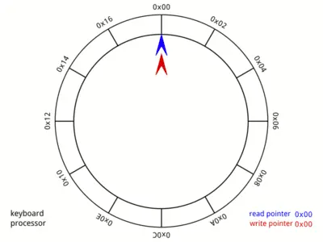
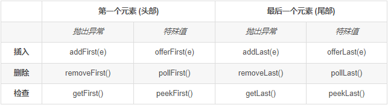
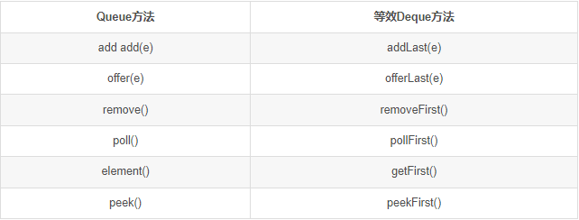
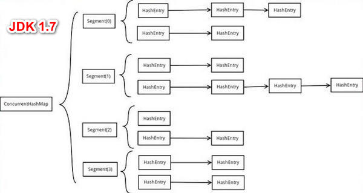
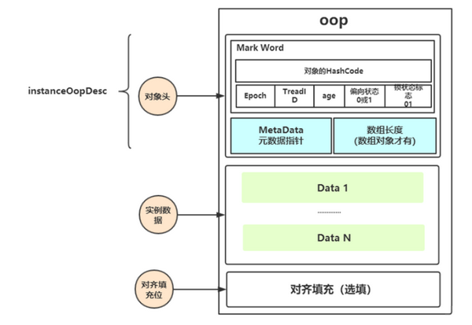
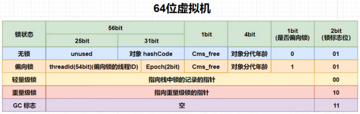

# 常用知识整理

## 枚举

- [Enum](Enum.md)

## 时间与时间戳

- [Timestamp.md](Timestamp.md)
- [Date&Time.md](Date&Time.md)


# JavaSE 数据结构


## 环形队列 & 双端队列

- 环形队列

  - 环形队列图形

    

  - 环形队列应用场景

    - **Memory Management**: The unused memory locations in the case of ordinary queues can be utilized in circular queues.
    - **Traffic system**: In computer controlled traffic system, circular queues are used to switch on the traffic lights one by one repeatedly as per the time set.
    - **CPU Scheduling**: Operating systems often maintain a queue of processes that are ready to execute or that are waiting for a particular event to occur.
    - **Lock Free Queue**: When high performance is required, we don't want to use lock. Circular Queue can is the top 1 data structure for lock free queue.

- 双端队列

  - java.util.Deque：Deque是一个线性collection，支持在两端插入和移除元素。名称 deque 是“double ended queue(双端队列)”的缩写，通常读为“deck”。大多数 Deque 实现对于它们能够包含的元素数没有固定限制，但此接口既支持有容量限制的双端队列，也支持没有固定大小限制的双端队列。

    此接口定义在双端队列两端访问元素的方法。提供插入、移除和检查元素的方法。每种方法都存在两种形式：一种形式在操作失败时抛出异常，另一种形式返回一个特殊值(null 或 false，具体取决于操作)。插入操作的后一种形式是专为使用有容量限制的 Deque 实现设计的；在大多数实现中，插入操作不能失败。

  - 相关方法：

  

  ​	Deque接口扩展(继承)了 Queue 接口。在将双端队列用作队列时，将得到 FIFO(先进先出)行为。将元素添加到双端队列的末尾，从双端队列的开头移除元素。从 Queue 接口继承的方法完全等效于 Deque 方法，如下表所示：



## 常见的阻塞队列

- ArrayBlockingQueue：一个由**数组**结构组成的**有界**阻塞队列

  - 不会**扩容**，即：有界；
  - 一把锁
  - 可以直接一次性加载到CPU缓存行，因为地址连续

- LinkedBlockingQueue：一个由**链表**结构组成的**无界**阻塞队列

  - 先天性**扩容**：无界
  - 两把锁：take锁和put锁：锁的粒度小，即并发上去了
  - 不可以加载到CPU缓存行

- 扩展

  - PriorityBlockingQueue：一个**支持优先级排序**的**无界**阻塞队列，可以实现精确的定时任务

    - 排序基础：1：一个数据结构，小顶堆，大顶堆？？？？？；2：comparable接口

  - DelayQueue：一个**使用优先级队列**实现的**无界**阻塞队列，可以实现精确的定时任务

  - SynchronousQueue：一个不存储元素的阻塞队列，线程池

    - 容量为0的队列

  - LinkedTransferQueue：一个由**链表**结构组成的**无界**阻塞队列

  - LinkedBlockingDeque：一个由**链表**结构组成的**双向无界**阻塞队列，可以用在“工作窃取”模式中

## 计算一个数最近且小的2的幂次的数

- 2的幂次的数的二进制特点：最高位为1，其他全为0
- 所以把一个数换算成二进制，把除了最高位外其他的位置设置成0即可

## HashMap下标的计算

通过源码发现HashMap中计算下标的时候使用 & 运算，而没有使用 %；即：`index = hashCode & (table.length - 1)`

- 首先需要明确，我们的目的是通过计算得到一个数组的下标
- 数组的长度是一个`2^N`，这个长度减去1之后，低于这位的数字全部变为1，而数组的下标的范围也就在全0和这个全1的数字之间，即通过&运算可以得到一个数，这个数的范围刚好是数组的索引范围

## HashMap中table数组用transient修饰

transient 表示易变的意思，在 Java 中，被该关键字修饰的变量不会被默认的序列化机制序列化。我们再回到源码中，考虑一个问题：桶数组 table 是 HashMap 底层重要的数据结构，不序列化的话，别人还怎么还原呢？

这里简单说明一下吧，HashMap 并没有使用默认的序列化机制，而是通过实现readObject/writeObject两个方法自定义了序列化的内容。这样做是有原因的，试问一句，HashMap 中存储的内容是什么？不用说，大家也知道是键值对。所以只要我们把键值对序列化了，我们就可以根据键值对数据重建 HashMap。有的朋友可能会想，序列化 table 不是可以一步到位，后面直接还原不就行了吗？这样一想，倒也是合理。但序列化 talbe 存在着两个问题：

1)table 多数情况下是无法被存满的，序列化未使用的部分，浪费空间。
2)同一个键值对在不同 JVM 下，所处的桶位置可能是不同的，在不同的 JVM 下反序列化 table 可能会发生错误。

以上两个问题中，第一个问题比较好理解，第二个问题解释一下。HashMap 的get/put/remove等方法第一步就是根据 hash 找到键所在的桶位置，但如果键没有覆写 hashCode 方法，计算 hash 时最终调用 Object 中的 hashCode 方法。但 Object 中的 hashCode 方法是 native 型的，不同的 JVM 下，可能会有不同的实现，产生的 hash 可能也是不一样的。也就是说同一个键在不同平台下可能会产生不同的 hash，此时再对在同一个 table 继续操作，就会出现问题。

## ConcurrentHashMap比HashTable效率高

**HashTable**：使用一把锁（锁住整个链表结构）处理并发问题，多个线程竞争一把锁，容易阻塞；

**ConcurrentHashMap**：

1. JDK 1.7 中使用分段锁（ReentrantLock + Segment + HashEntry），相当于把一个 HashMap 分成多个段，每段分配一把锁，这样支持多线程访问。锁粒度：基于 Segment，包含多个 HashEntry。
2. JDK 1.8 中使用 CAS + synchronized + Node + 红黑树。锁粒度：Node（首结点）（实现 Map.Entry）。锁粒度降低了。

## ConcurrentHashMap的应用场景

1. 用作本地缓存

## ConcurrentHashMap在什么情况下会使用红黑树

在 **数组的长度≥64** 且 **链表的长度 ≥ 8**

在数组长度低于64，且链表长度≥8的时候，就会触发数组扩容

红黑树的元素个数到6的时候红黑树退化为链表

## ConcurrentHashMap如何保证写操作的线程安全

1. 当有两个Node同时放在数组中的同一个位置上的时候，使用CAS来保证线程安全
2. 当数组的某个位置已经有数据的时候依赖synchronized的方式保证线程安全

## ConcurrentHashMap计数器是怎么保证线程安全的

使用LongAdder来保证计数器的线程安全的

LongAdder底层是通过CAS来实现的

而CAS有一个性能问题会造成CPU的性能浪费，JDK巧妙地通过分段的方式化解了一个问题

即构造了一个`CounterCell`数组，数组的每个元素对象都维护了一个`long`类型的数值，当计数器计算的时候可以去找数组中得意一个元素进行计数计算，当前`ConcurrentHashMap`对象的对象数量就是这个数组中long数值的和

而且`ConcurrentHashMap`的内部类`CounterCell`这个类使用了一个注解`@sun.misc.Contented`来避免缓存行竞争带来的性能问题

而且`CounterCell`的数组最大长度和CPU的核数一致

## JDK7和JDK8的HashMap的变化

- 数据结构
  - JDK7：数组+单向链表
  - JDK8：数组+单向链表+红黑树
- 插入位置
  - JDK7：头插法：多线程下有形成循环链表的风险
  - JDK8：尾插法
- Hash调整
  - JDK8：相比JDK7的hash算法，将hash值的前16位参与到取模运算中，为计算结果增加不确定因素，减少hash碰撞的概率
- 扩容机制
  - JDK7：对之前已经存储的全部节点rehash
  - JDK8：采用**2**倍扩容机制元素不需要重新计算所有节点的hash值，而是通过算法先去计算是否需要移动
    - 2倍是为了和hash算法配合，就有很多的元素是不需要移动的



## JDK7和JDK8的ConcurrentHashMap的变化

ConcurrentHashMap在JDK7中：

1. 使用分段锁来提升整体的并发度
   - 默认并发度是segment数组的长度，为16
2. 哈希冲突使用链表解决

ConcurrentHashMap在JDK8中：

1. 使用CAS+Synchronized
   - 当哈希槽位为空的时候只会触发CAS
   - 当哈希槽位是一个链表/红黑树的时候会触发CAS+Synchronized
2. 哈希冲突使用链表+红黑树
3. 扩缩容操作可能会引起链表到红黑树的转化以及红黑树到链表的转化

针对JDK7的优化点：

1. 存储结构的优化
   - 引入红黑树
2. 加锁粒度的优化
   - 引入CAS+Synchronized锁头结点
3. 扩容操作有一个协助扩容的优化
4. 计数器的优化
   - 引入类似LongAdder的机制提升计数效率

## JDK7中ConcurrentHashMap的并发度

concurrencyLevel不能代表ConccurentHashMap实际并发度，ConccurentHashMap会使用**大于等于该值的2的幂指数的最小值**作为实际并发度，实际并发度即为segments数组的长度。创建时未指定concurrencyLevel则默认为16。

并发度对ConccurentHashMap性能具有举足轻重的作用，如果并发度设置的过小，会带来严重的锁竞争问题；如果并发度设置的过大，原本位于同一个Segment内的访问会扩散到不同的Segment中，CPU cache命中率会下降，从而引起程序性能下降。

## JDK8中不直接把链表变为红黑树

为什么非要等到链表的长度大于等于8的时候，才转变成红黑树？在这里可以从两方面来解释：

(1)**节点少时增删性能**：put和remove过程中，红黑树要通过左旋，右旋、变色这些操作来保持平衡，另外构造红黑树要比构造链表复杂，在链表的节点不多的时候，从整体的性能看来， 数组+链表+红黑树的结构可能不一定比数组+链表的结构性能高。就好比杀鸡焉用牛刀的意思。

(2)**节点多时频繁扩容性能**：HashMap频繁的扩容，会造成底部红黑树不断的进行拆分和重组，这是非常耗时的。因此，也就是链表长度比较长的时候转变成红黑树才会显著提高效率。

## ConcurrentHashMap的散列算法

### `spread`方法的实现

`spread`方法的目的是将键的哈希值（`hashCode`）转换为一个更均匀分布的散列值，以减少哈希冲突。具体步骤如下：

1. 1.**右移16位**：将哈希值右移16位，这样可以将哈希值的高位和低位进行混合。
2. 2.**异或运算**：将右移后的哈希值与原始哈希值进行异或（XOR）运算。异或运算的特点是，相同位为0，不同位为1，这样可以进一步混合高位和低位的信息。
3. 3.**与`HASH_BITS`进行与运算**：最后，将异或运算的结果与`HASH_BITS`进行与（AND）运算。`HASH_BITS`是一个常量，其值为`0x7fffffff`，即二进制的`01111111 11111111 11111111 11111111`。这个操作的目的是确保最终的散列值为非负数，因为Java中的哈希值可能是负数。

### 为什么使用这种散列算法

`ConcurrentHashMap`使用这种散列算法的原因包括：

- **减少哈希冲突**：通过将哈希值的高位和低位进行混合，使得hashCode的高位和低位都能参与到索引的计算之中，可以更均匀地分布哈希值，从而减少哈希冲突。
- **提高性能**：减少哈希冲突可以提高`ConcurrentHashMap`的性能，尤其是在高并发环境下，因为减少了需要处理的冲突和链表长度。
- **适应数组长度为2的幂次**：`ConcurrentHashMap`的内部数组长度总是2的幂次，这种散列算法可以确保哈希值的每一位都能参与到索引计算中，从而充分利用数组的容量。

下面是源码：

```java
// java.util.concurrent.ConcurrentHashMap#putVal
final V putVal(K key, V value, boolean onlyIfAbsent) {
    // ConcurrentHashMap不允许key或者value出现为null的值，跟HashMap的区别
    if (key == null || value == null) throw new NullPointerException();
    // 根据key的hashCode计算出一个hash值，后期得出当前key-value要存储在哪个数组索引位置
    int hash = spread(key.hashCode());
    // 一个标识，在后面有用！
    int binCount = 0;
    // 省略大量的代码……
}

// 计算当前Node的hash值的方法
static final int spread(int h) {
    // 将key的hashCode值的高低16位进行^运算，最终又与HASH_BITS进行了&运算
    // 将高位的hash也参与到计算索引位置的运算当中
    // 为什么HashMap、ConcurrentHashMap，都要求数组长度为2^n
    // HASH_BITS让hash值的最高位符号位肯定为0，代表当前hash值默认情况下一定是正数，因为hash值为负数时，有特殊的含义
    // static final int MOVED     = -1; // 代表当前hash位置的数据正在扩容！
    // static final int TREEBIN   = -2; // 代表当前hash位置下挂载的是一个红黑树
    // static final int RESERVED  = -3; // 预留当前索引位置……
    return (h ^ (h >>> 16)) & HASH_BITS;
    // 计算数组放到哪个索引位置的方法   (f = tabAt(tab, i = (n - 1) & hash)
    // n：是数组的长度
}
00001101 00001101 00101111 10001111  - h = key.hashCode

运算方式
00000000 00000000 00000000 00001111  - 15 (n - 1)
&
(
  (
  00001101 00001101 00101111 10001111  - h
  ^
  00000000 00000000 00001101 00001101  - h >>> 16
  -----------------------------------
  00001101 00001101 00100010 10000010  - h ^ (h >>> 16) | 使得在数组长度很小的情况下也能让每一位都参与Hash运算，进而打散key的分布
  )
  &                                    - 用来保证计算结果是一个正数，因为hash值为负数有特殊的含义：MOVED、TREEBIN、RESERVED
  01111111 11111111 11111111 11111111  - HASH_BITS(0x7fffffff)
)
```

## ConcurrentHashMap初始化数组的流程

```java
// java.util.concurrent.ConcurrentHashMap#putVal

final V putVal(K key, V value, boolean onlyIfAbsent) {
    // 省略部分代码…………
    // 将Map的数组赋值给tab，死循环
    for (Node<K,V>[] tab = table;;) {
        // 声明了一堆变量~~
        // n:数组长度
        // i:当前Node需要存放的索引位置
        // f: 当前数组i索引位置的Node对象
        // fn：当前数组i索引位置上数据的hash值
        Node<K,V> f; int n, i, fh;
        // 判断当前数组是否还没有初始化
        if (tab == null || (n = tab.length) == 0)
            // 将数组进行初始化。
            tab = initTable();
        // 基于 (n - 1) & hash 计算出当前Node需要存放在哪个索引位置
        // 基于tabAt获取到i位置的数据
        else if ((f = tabAt(tab, i = (n - 1) & hash)) == null) {
            // 现在数组的i位置上没有数据，基于CAS的方式将数据存在i位置上
            if (casTabAt(tab, i, null,new Node<K,V>(hash, key, value, null)))
                // 如果成功，执行break跳出循环，插入数据成功
                break;   
        }
        // 判断当前位置数据是否正在扩容……
        else if ((fh = f.hash) == MOVED)
            // 让当前插入数据的线程协助扩容
            tab = helpTransfer(tab, f);
        // 省略部分代码…………
    }
    // 省略部分代码…………
}

private transient volatile int sizeCtl;
// sizeCtl：是一个控制数组在初始化和扩容操作时的变量，甚至决定下次扩容的阈值
// < -1：低16位代表当前数组正在扩容的线程个数（如果1个线程扩容，值为-2，如果2个线程扩容，值为-3）
// = -1：代表当前数组正在初始化
// = 0：代表数组还没初始化
// > 0：代表当前数组的扩容阈值，或者是当前数组的初始化大小
// 初始化数组方法
private final Node<K,V>[] initTable() {
    // 声明标识
    Node<K,V>[] tab; int sc;
    // 再次判断数组没有初始化，并且完成tab的赋值
    while ((tab = table) == null || tab.length == 0) { // ①
        // 将sizeCtl赋值给sc变量，并判断是否小于0，如果小于0那么其他线程正在进程初始化
        if ((sc = sizeCtl) < 0)
            Thread.yield(); 
        // 可以尝试初始化数组，线程会以CAS的方式，将sizeCtl修改为-1，代表当前线程可以初始化数组
        else if (U.compareAndSwapInt(this, SIZECTL, sc, -1)) { // ②
            // 尝试初始化！
            try {
                // 再次判断当前数组是否已经初始化完毕。
                if ((tab = table) == null || tab.length == 0) { // ③： ①②③组成了一个单例模式的DCL
                    // 开始初始化，
                    // 如果sizeCtl > 0，就初始化sizeCtl长度的数组
                    // 如果sizeCtl == 0，就初始化默认的长度
                    int n = (sc > 0) ? sc : DEFAULT_CAPACITY;
                    // 初始化数组！
                    Node<K,V>[] nt = (Node<K,V>[])new Node<?,?>[n];
                    // 将初始化的数组nt，赋值给tab和table
                    table = tab = nt;
                    // sc赋值为了数组长度 - 数组长度 右移 2位    16 - 4 = 12
                    // 将sc赋值为下次扩容的阈值
                    sc = n - (n >>> 2);
                }
            } finally {
                // 将赋值好的sc，设置给sizeCtl
                sizeCtl = sc;
            }
            break;
        }
    }
    return tab;
}
```

## ConcurrentHashMap扩容的流程

### 有三个地方会触发扩容

1. 链表转红黑树之前对数组长度判断后

   ```java 
   // java.util.concurrent.ConcurrentHashMap#treeifyBin
   // 在链表长度大于等于8时，尝试将链表转为红黑树
   private final void treeifyBin(Node<K,V>[] tab, int index) {
       Node<K,V> b; int n, sc;
       // 数组不能为空
       if (tab != null) {
           // 数组的长度n，是否小于64
           if ((n = tab.length) < MIN_TREEIFY_CAPACITY)
               // 如果数组长度小于64，不能将链表转为红黑树，先尝试扩容操作
               tryPresize(n << 1);
           // 省略部分代码……
       }
   }
   ```

2. 执行putAll方法传入的值过大

   ```java
   // size是将之前的数组长度 左移 1位得到的结果
   private final void tryPresize(int size) {
       // 如果扩容的长度达到了最大值，就使用最大值
       // 否则需要保证数组的长度为2的n次幂
       // 这块的操作，是为了初始化操作准备的，因为调用putAll方法时，也会触发tryPresize方法
       // 如果刚刚new的ConcurrentHashMap直接调用了putAll方法的话，会通过tryPresize方法进行初始化
       int c = (size >= (MAXIMUM_CAPACITY >>> 1)) ? MAXIMUM_CAPACITY :
           tableSizeFor(size + (size >>> 1) + 1);
       // 这些代码和initTable一模一样
       // 声明sc
       int sc;
       // 将sizeCtl的值赋值给sc，并判断是否大于0，这里代表没有初始化操作，也没有扩容操作
       while ((sc = sizeCtl) >= 0) {
           // 将ConcurrentHashMap的table赋值给tab，并声明数组长度n
           Node<K,V>[] tab = table; int n;
           // 数组是否需要初始化
           if (tab == null || (n = tab.length) == 0) {
               // 进来执行初始化
               // sc是初始化长度，初始化长度如果比计算出来的c要大的话，直接使用sc，如果没有sc大，
               // 说明sc无法容纳下putAll中传入的map，使用更大的数组长度
               n = (sc > c) ? sc : c;
               // 设置sizeCtl为-1，代表初始化操作
               if (U.compareAndSwapInt(this, SIZECTL, sc, -1)) {
                   try {
                       // 再次判断数组的引用有没有变化
                       if (table == tab) {
                           // 初始化数组
                           Node<K,V>[] nt = (Node<K,V>[])new Node<?,?>[n];
                           // 数组赋值
                           table = nt;
                           // 计算扩容阈值
                           sc = n - (n >>> 2);
                       }
                   } finally {
                       // 最终赋值给sizeCtl
                       sizeCtl = sc;
                   }
               }
           }
           // 如果计算出来的长度c如果小于等于sc，直接退出循环结束方法
           // 数组长度大于等于最大长度了，直接退出循环结束方法
           else if (c <= sc || n >= MAXIMUM_CAPACITY)
               break;
           // 省略部分代码
       }
   }
   
   // 将c这个长度设置到最近的2的n次幂的值，   15 - 16     17 - 32
   // c == size + (size >>> 1) + 1
   // size = 17
   00000000 00000000 00000000 00010001
   + 
   00000000 00000000 00000000 00001000
   +
   00000000 00000000 00000000 00000001
   // c = 26
   00000000 00000000 00000000 00011010
   private static final int tableSizeFor(int c) {
       // 00000000 00000000 00000000 00011001
       int n = c - 1;
       // 00000000 00000000 00000000 00011001
       // 00000000 00000000 00000000 00001100
       // 00000000 00000000 00000000 00011101
       n |= n >>> 1;
       // 00000000 00000000 00000000 00011101
       // 00000000 00000000 00000000 00000111
       // 00000000 00000000 00000000 00011111
       n |= n >>> 2;
       // 00000000 00000000 00000000 00011111
       // 00000000 00000000 00000000 00000001
       // 00000000 00000000 00000000 00011111
       n |= n >>> 4;
       // 00000000 00000000 00000000 00011111
       // 00000000 00000000 00000000 00000000
       // 00000000 00000000 00000000 00011111
       n |= n >>> 8;
       // 00000000 00000000 00000000 00011111
       n |= n >>> 16;
       // 00000000 00000000 00000000 00100000
       return (n < 0) ? 1 : (n >= MAXIMUM_CAPACITY) ? MAXIMUM_CAPACITY : n + 1;
   
   }
   ```

3. 数据量达到阈值会触发

   ```java
   // java.util.concurrent.ConcurrentHashMap#addCount
   private final void addCount(long x, int check) {
       // ================================计数=====================================
       // as： CounterCell[]
       // s：是自增后的元素个数
       // b：原来的baseCount
       CounterCell[] as; long b, s;
       // 判断CounterCell不为null，代表之前有冲突问题，有冲突直接进到if中
       // 如果CounterCell[]为null，直接执行||后面的CAS操作，直接修改baseCount
       if ((as = counterCells) != null ||
           // 如果对baseCount++成功。直接告辞。 如果CAS失败，直接进到if中
           !U.compareAndSwapLong(this, BASECOUNT, b = baseCount, s = b + x)) {
           // 导致，说明有并发问题。
           // 进来的方式有两种：
           // 1. counterCell[] 有值。
           // 2. counterCell[] 无值，但是CAS失败。
           // m：数组长度 - 1
           // a：当前线程基于随机数，获得到的数组上的某一个CounterCell
           CounterCell a; long v; int m;
           // 是否有冲突，默认为true，代表没有冲突
           boolean uncontended = true;
           // 判断CounterCell[]没有初始化，执行fullAddCount方法，初始化数组
           if (as == null || (m = as.length - 1) < 0 ||
               // CounterCell[]已经初始化了，基于随机数拿到数组上的一个CounterCell
               // 如果为null，执行fullAddCount方法，初始化CounterCell
               (a = as[ThreadLocalRandom.getProbe() & m]) == null ||
               // CounterCell[]已经初始化了，并且指定索引位置上有CounterCell
               // 直接CAS修改指定的CounterCell上的value即可。
               // CAS成功，直接告辞！
               // CAS失败，代表有冲突，uncontended = false，执行fullAddCount方法
               !(uncontended = U.compareAndSwapLong(a, CELLVALUE, v = a.value, v + x))) {
               fullAddCount(x, uncontended);
               return;
           }
           // 如果链表长度小于等于1，不去判断扩容
           if (check <= 1)
               return;
           // 将所有CounterCell中记录的信累加，得到最终的元素个数
           s = sumCount();
       }
   
       // ================================判断扩容=======================================
       // 判断check大于等于，remove的操作就是小于0的。 因为添加时，才需要去判断是否需要扩容
       if (check >= 0) {
           // 一堆小变量
           Node<K,V>[] tab, nt; int n, sc;
           // 当前元素个数是否大于扩容阈值，并且数组不为null，数组长度没有达到最大值。
           while (s >= (long)(sc = sizeCtl) && (tab = table) != null &&
                  (n = tab.length) < MAXIMUM_CAPACITY) {
               // 扩容表示戳
               int rs = resizeStamp(n);
               // 正在扩容
               if (sc < 0) {
                   // 判断是否可以协助扩容
                   if ((sc >>> RESIZE_STAMP_SHIFT) != rs || sc == rs + 1 ||
                       sc == rs + MAX_RESIZERS || (nt = nextTable) == null ||
                       transferIndex <= 0)
                       break;
                   // 协助扩容
                   if (U.compareAndSwapInt(this, SIZECTL, sc, sc + 1))
                       transfer(tab, nt);
               }
               // 没有线程执行扩容，我来扩容
               else if (U.compareAndSwapInt(this, SIZECTL, sc,
                                            (rs << RESIZE_STAMP_SHIFT) + 2))
                   transfer(tab, null);
               // 重新计数。
               s = sumCount();
           }
       }
   }
   
   
   //  CounterCell的类，就类似于LongAdder的Cell
   @sun.misc.Contended static final class CounterCell {
       // volatile修饰的value，并且外部基于CAS的方式修改
       volatile long value;
       CounterCell(long x) { value = x; }
   }
   @sun.misc.Contended（JDK1.8）：
   这个注解是为了解决伪共享的问题（解决缓存行同步带来的性能问题）。
   CPU在操作主内存变量前，会将主内存数据缓存到CPU缓存（L1,L2,L3）中，
   CPU缓存L1，是以缓存行为单位存储数据的，一般默认的大小为64字节。
   缓存行同步操作，影响CPU一定的性能。
   @Contented注解，会将当前类中的属性，会独占一个缓存行，从而避免缓存行失效造成的性能问题。
   @Contented注解，就是将一个缓存行的后面7个位置，填充上7个没有意义的数据。
   long value;    long l1,l2,l3,l4,l5,l6,l7;
   
   
   // 整体CounterCell数组数据到baseCount
   final long sumCount() {
       // 拿到CounterCell[]
       CounterCell[] as = counterCells; CounterCell a;
       // 拿到baseCount
       long sum = baseCount;
       // 循环走你，遍历CounterCell[]，将值累加到sum中，最终返回sum
       if (as != null) {
           for (int i = 0; i < as.length; ++i) {
               if ((a = as[i]) != null)
                   sum += a.value;
           }
       }
       return sum;
   }
   
   
   // CounterCell数组没有初始化
   // CounterCell对象没有构建
   // 什么都有，但是有并发问题，导致CAS失败
   private final void fullAddCount(long x, boolean wasUncontended) {
       // h：当前线程的随机数
       int h;
       // 判断当前线程的Probe是否初始化。
       if ((h = ThreadLocalRandom.getProbe()) == 0) {
           // 初始化一波
           ThreadLocalRandom.localInit();  
           // 生成随机数。
           h = ThreadLocalRandom.getProbe();
           // 标记，没有冲突
           wasUncontended = true;
       }
       // 阿巴阿巴
       boolean collide = false;   
       // 死循环…………   
       for (;;) {
           // as：CounterCell[]
           // a：CounterCell对 null
           // n：数组长度
           // v：value值
           CounterCell[] as; CounterCell a; int n; long v;
           // CounterCell[]不为null时，做CAS操作
           if ((as = counterCells) != null && (n = as.length) > 0) {
               // 拿到当前线程随机数对应的CounterCell对象，为null
               // 第一个if：当前数组已经初始化，但是指定索引位置没有CounterCell对象，构建CounterCell对象放到数组上
               if ((a = as[h & (n - 1)]) == null) {
                   // 判断cellsBusy是否为0，
                   if (cellsBusy == 0) {  
                       // 构建CounterCell对象
                       CounterCell r = new CounterCell(x); 
                       // 在此判断cellsBusy为0，CAS从0修改为1，代表可以操作当前数组上的指定索引，构建CounterCell，赋值进去
                       if (cellsBusy == 0 &&
                           U.compareAndSwapInt(this, CELLSBUSY, 0, 1)) {
                           // 构建未完成
                           boolean created = false;
                           try {   
                               // 阿巴阿巴 
                               CounterCell[] rs; int m, j;
                               // DCL，还包含复制
                               if ((rs = counterCells) != null && (m = rs.length) > 0 &&
                                   // 再次拿到指定索引位置的值，如果为null，正常将前面构建的CounterCell对象，赋值给数组
                                   rs[j = (m - 1) & h] == null) {
                                   // 将CounterCell对象赋值到数组
                                   rs[j] = r;
                                   // 构建完成
                                   created = true;
                               }
                           } finally {
                               // 归位
                               cellsBusy = 0;
                           }
                           if (created)
                               // 跳出循环，告辞
                               break;
                           continue;           // Slot is now non-empty
                       }
                   }
                   collide = false;
               }
               // 指定索引位置上有CounterCell对象，有冲突，修改冲突标识
               else if (!wasUncontended)   
                   wasUncontended = true;
               // CAS，将数组上存在的CounterCell对象的value进行 + 1操作
               else if (U.compareAndSwapLong(a, CELLVALUE, v = a.value, v + x))
                   // 成功，告辞。
                   break;
               // 之前拿到的数组引用和成员变量的引用值不一样了，
               // CounterCell数组的长度是都大于CPU内核数，不让CounterCell数组长度大于CPU内核数。
               else if (counterCells != as || n >= NCPU)
                   // 当前线程的循环失败，不进行扩容
                   collide = false;   
               // 如果没并发问题，并且可以扩容，设置标示位，下次扩容   
               else if (!collide)
                   collide = true;
               // 扩容操作
               // 先判断cellsBusy为0，再基于CAS将cellsBusy从0修改为1。
               else if (cellsBusy == 0 &&
                        U.compareAndSwapInt(this, CELLSBUSY, 0, 1)) {
                   try {
                       // DCL!
                       if (counterCells == as) {
                           // 构建一个原来长度2倍的数组
                           CounterCell[] rs = new CounterCell[n << 1];
                           // 将老数组数据迁移到新数组
                           for (int i = 0; i < n; ++i)
                               rs[i] = as[i];
                           // 新数组复制给成员变量
                           counterCells = rs;
                       }
                   } finally {
                       // 归位
                       cellsBusy = 0;
                   }
                   // 归位
                   collide = false;
                   // 开启下次循环
                   continue;  
               }
               // 重新设置当前线程的随机数，争取下次循环成功！
               h = ThreadLocalRandom.advanceProbe(h);
           }
           // CounterCell[]没有初始化
           // 判断cellsBusy为0.代表没有其他线程在初始化或者扩容当前CounterCell[]
           // 判断counterCells还是之前赋值的as，代表没有并发问题
           else if (cellsBusy == 0 && counterCells == as &&
               // 修改cellsBusy，从0改为1，代表当前线程要开始初始化了
               U.compareAndSwapInt(this, CELLSBUSY, 0, 1)) {
               // 标识，init未成功
               boolean init = false;
               try {   
                   // DCL!  
                   if (counterCells == as) {
                       // 构建CounterCell[]，默认长度为2
                       CounterCell[] rs = new CounterCell[2];
                       // 用当前线程的随机数，和数组长度 - 1，进行&运算，将这个位置上构建一个CounterCell对象，赋值value为1
                       rs[h & 1] = new CounterCell(x);
                       // 将声明好的rs，赋值给成员变量
                       counterCells = rs;
                       // init成功
                       init = true;
                   }
               } finally {
                   // cellsBusy归位。
                   cellsBusy = 0;
               }
               if (init)
                   // 退出循环
                   break;
           }
           // 到这就直接在此操作baseCount。
           else if (U.compareAndSwapLong(this, BASECOUNT, v = baseCount, v + x))
               break;                          // Fall back on using base
       }
   }
   ```

### 扩容方法

1. 触发扩容的三个地方
2. 先根据老数组长度计算一个扩容标识戳
   - 基于扩容标识戳来判断能不能协助扩容
3. 第一个进来的线程将扩容标识戳左移16位，最高位就变为1，期扩容标识戳为一个负数，即正在扩容
   - 扩容标识戳的第16为1
4. 扩容标识戳做完上面的操作之后加2，标识有1个线程正在协助扩容
5. 开始执行transfer方法进行扩容
   1. 计算每个线程一次性迁移多少数据到新数组，默认一次最小迁移长度为16的数据
   2. 第一个进来的线程初始化新数组，老长度左移一位，相当于乘以2
   3. 每个线程根据计算的迁移数据量领取任务进行迁移，每个迁移完成的数组元素都会存放一个ForwardingNode(hashCode=-1)，用来表示数据已迁移
   4. 每个迁移完成自己任务的线程就会在扩容标识戳上减去1，当最后一个线程来的时候这个扩容标识戳完成后就变为1，这个时候，这个线程就会把老数组从头到尾检查一遍看看有没有遗漏的数据没有迁移

```java
private final void tryPresize(int size) {
    // n：数组长度
    while ((sc = sizeCtl) >= 0) {
        // 判断当前的tab是否和table一致，
        else if (tab == table) {
            // 计算扩容标识戳：根据当前数组的长度计算一个16位的扩容标识戳
            // 第一个作用是为了保证后面的sizeCtl赋值时，保证sizeCtl为小于-1的负数
            // 第二个作用用来记录当前是从什么长度开始扩容的
            int rs = resizeStamp(n);
            // BUG --- sc < 0，永远进不去~
            // 如果sc小于0，代表有线程正在扩容。
            if (sc < 0) {
                // 省略部分代码……协助扩容的代码（进不来~~~~）
            }
            // 代表没有线程正在扩容，我是第一个扩容的。
            else if (U.compareAndSwapInt(this, SIZECTL, sc,
                                         (rs << RESIZE_STAMP_SHIFT) + 2))
                // 省略部分代码……第一个扩容的线程……
        }
    }
}
// 计算扩容表示戳
// 32 =  00000000 00000000 00000000 00100000
// Integer.numberOfLeadingZeros(32) = 26
// 1 << (RESIZE_STAMP_BITS - 1) 
// 00000000 00000000 10000000 00000000
// 00000000 00000000 00000000 00011010
// 00000000 00000000 10000000 00011010
static final int resizeStamp(int n) {
    return Integer.numberOfLeadingZeros(n) | (1 << (RESIZE_STAMP_BITS - 1));
}
```

```java
// 开始扩容   tab=oldTable
// java.util.concurrent.ConcurrentHashMap#transfer
private final void transfer(Node<K,V>[] tab, Node<K,V>[] nextTab) {
    // n = 数组长度
    // stride = 每个线程一次性迁移多少数据到新数组
    int n = tab.length, stride;
    // 基于CPU的内核数量来计算，每个线程一次性迁移多少长度的数据最合理
    // NCPU = 4
    // 举个栗子：数组长度为1024 - 512 - 256 - 128 / 4 = 32
    // MIN_TRANSFER_STRIDE = 16,为每个线程迁移数据的最小长度
    if ((stride = (NCPU > 1) ? (n >>> 3) / NCPU : n) < MIN_TRANSFER_STRIDE)
        stride = MIN_TRANSFER_STRIDE; 
    // 根据CPU计算每个线程一次迁移多长的数据到新数组，如果结果大于16，使用计算结果。 如果结果小于16，就使用最小长度16
  	// 。。。。。
}
```


## ConcurrentHashMap的查询流程

> ConcurrentHashMap对读操作是不会加锁的

1. 根据key计算对应的hashCode，基于该hashCode定位到指定索引的位置
2. 如果该数组元素是我找的值，立即返回
3. 如果不是要找的元素，如果：
   - 当前元素是一个链表，则通过链表的next以O(n)复杂度进行查询
   - 当前元素是一个红黑树或者正在迁移(hashCode<0)，就那通过find方法进行查询
     - 如果数据已经迁移，则直接找到新数组进行查询
     - 如果是一个红黑树
       - 如果有写操作正在进行或者有写操作正在等待，则直接查询转换红黑树时保留的双向链表
       - 如果没有写操作正在进行或者有写操作正在等待。则在添加读标记之后，在红黑树上进行查找

```java
// 基于key查询value
public V get(Object key) {
    // tab：数组，  e：查询指定位置的节点  n：数组长度
    Node<K,V>[] tab; Node<K,V> e, p; int n, eh; K ek;
    // 基于传入的key，计算hash值
    int h = spread(key.hashCode());
    // 数组不为null，数组上得有数据，拿到指定位置的数组上的数据
    if ((tab = table) != null && (n = tab.length) > 0 && (e = tabAt(tab, (n - 1) & h)) != null) {
        // 数组上数据恩地hash值，是否和查询条件key的hash一样
        if ((eh = e.hash) == h) {
            // key的==或者equals是否一致，如果一致，数组上就是要查询的数据
            if ((ek = e.key) == key || (ek != null && key.equals(ek)))
                return e.val;
        }
        // 如果数组上的数据的hash为负数，有特殊情况，
        else if (eh < 0)
            // 三种情况，数据迁移走了，节点位置被占，红黑树
            return (p = e.find(h, key)) != null ? p.val : null;
        // 肯定走链表操作
        while ((e = e.next) != null) {
            // 如果hash值一致，并且key的==或者equals一致，返回当前链表位置的数据
            if (e.hash == h && ((ek = e.key) == key || (ek != null && key.equals(ek))))
                return e.val;
        }
    }
    // 如果上述三个流程都没有知道指定key对应的value，那就是key不存在，返回null即可
    return null;
}
```

```java
// 在查询数据时，发现当前桶位置已经放置了fwd，代表已经被迁移到了新数组
Node<K,V> find(int h, Object k) {
    // key：get(key)  h：key的hash   tab：新数组
    outer: for (Node<K,V>[] tab = nextTable;;) {
        // n：新数组长度，  e：新数组上定位的位置上的数组
        Node<K,V> e; int n;
        if (k == null || tab == null || (n = tab.length) == 0 || (e = tabAt(tab, (n - 1) & h)) == null)
            return null;
        // 开始在新数组中走逻辑
        for (;;) {
            // eh：新数组位置的数据的hash
            int eh; K ek;
            // 判断hash是否一致，如果一致，再判断==或者equals。
            if ((eh = e.hash) == h && ((ek = e.key) == k || (ek != null && k.equals(ek))))
                // 在新数组找到了数据
                return e;
            // 发现到了新数组，hash值又小于0
            if (eh < 0) {
                // 套娃，发现刚刚在扩容，到了新数组，发现又扩容
                if (e instanceof ForwardingNode) {
                    // 再次重新走最外层循环，拿到最新的nextTable
                    tab = ((ForwardingNode<K,V>)e).nextTable;
                    continue outer;
                }
                else
                    // 占了，红黑树
                    return e.find(h, k);
            }
            // 说明不在数组上，往下走链表
            if ((e = e.next) == null)
                // 进来说明链表没找到，返回null
                return null;
        }
    }
}
```

```java
// 在红黑树中检索数据
final Node<K,V> find(int h, Object k) {
    // 非空判断
    if (k != null) {
        // e：Treebin中的双向链表，
        for (Node<K,V> e = first; e != null; ) {
            int s; K ek;
            // s：TreeBin的锁状态
            // 00000010
            // 00000001
            if (((s = lockState) & (WAITER|WRITER)) != 0) {
                // 如果进来if，说明要么有写线程在等待获取写锁，要么是由写线程持有者写锁
                // 如果出现这个情况，他会去双向链表查询数据
                if (e.hash == h && ((ek = e.key) == k || (ek != null && k.equals(ek))))
                    return e;
                e = e.next;
            }
            // 说明没有线程等待写锁或者持有写锁，将lockState + 4，代表当前读线程可以去红黑树中检索数据
            else if (U.compareAndSwapInt(this, LOCKSTATE, s, s + READER)) {
                TreeNode<K,V> r, p;
                try {
                    // 基于findTreeNode在红黑树中检索数据
                    p = ((r = root) == null ? null : r.findTreeNode(h, k, null));
                } finally {
                    Thread w;
                    // 会对lockState - 4，读线程拿到数据了，释放读锁
                    // 可以确认，如果-完4，等于WAITER，说明有写线程可能在等待，判断waiter是否为null
                    if (U.getAndAddInt(this, LOCKSTATE, -READER) == (READER|WAITER) && (w = waiter) != null)
                        // 当前我是最后一个在红黑树中检索的线程，同时有线程在等待持有写锁，唤醒等待的写线程
                        LockSupport.unpark(w);
                }
                return p;
            }
        }
    }
    return null;
}
```


## ConcurrentHashMap计数器的实现原理

计数器是为了保存ConcurrentHashMap元素个数的

1. ConcurrentHashMap中有个long类型baseCount，是在并发量不太大的时候用于计数的
2. 如果并发量大时候CounterCell数组就登场了
   1. CounterCell使用@Contented注解进行了修饰，用来避免CPU的伪共享问题
   2. 持有一个long类型的value
   3. 当并发量比较大的时候，ConcurrentHashMap就会初始化CounterCell数组，并行的向CounterCell元素中加1
   4. 获取元素大小的时候就把所有的CounterCell里面的value累加即可得到

```java
// java.util.concurrent.ConcurrentHashMap#addCount
private final void addCount(long x, int check) {
    // ================================计数=====================================
    // as： CounterCell[]
    // s：是自增后的元素个数
    // b：原来的baseCount
    CounterCell[] as; long b, s;
    // 判断CounterCell不为null，代表之前有冲突问题，有冲突直接进到if中
    // 如果CounterCell[]为null，直接执行||后面的CAS操作，直接修改baseCount
    if ((as = counterCells) != null ||
        // 如果对baseCount++成功。直接告辞。 如果CAS失败，直接进到if中
        !U.compareAndSwapLong(this, BASECOUNT, b = baseCount, s = b + x)) {
        // 导致，说明有并发问题。
        // 进来的方式有两种：
        // 1. counterCell[] 有值。
        // 2. counterCell[] 无值，但是CAS失败。
        // m：数组长度 - 1
        // a：当前线程基于随机数，获得到的数组上的某一个CounterCell
        CounterCell a; long v; int m;
        // 是否有冲突，默认为true，代表没有冲突
        boolean uncontended = true;
        // 判断CounterCell[]没有初始化，执行fullAddCount方法，初始化数组
        if (as == null || (m = as.length - 1) < 0 ||
            // CounterCell[]已经初始化了，基于随机数拿到数组上的一个CounterCell，如果为null，执行fullAddCount方法，初始化CounterCell
            (a = as[ThreadLocalRandom.getProbe() & m]) == null ||
            // CounterCell[]已经初始化了，并且指定索引位置上有CounterCell
            // 直接CAS修改指定的CounterCell上的value即可。
            // CAS成功，直接告辞！
            // CAS失败，代表有冲突，uncontended = false，执行fullAddCount方法
            !(uncontended = U.compareAndSwapLong(a, CELLVALUE, v = a.value, v + x))) {
            fullAddCount(x, uncontended);
            return;
        }
        // 如果链表长度小于等于1，不去判断扩容
        if (check <= 1)
            return;
        // 将所有CounterCell中记录的信累加，得到最终的元素个数
        s = sumCount();
    }

    // ================================判断扩容=======================================
    // 判断check大于等于，remove的操作就是小于0的。 因为添加时，才需要去判断是否需要扩容
    if (check >= 0) {
        // 一堆小变量
        Node<K,V>[] tab, nt; int n, sc;
        // 当前元素个数是否大于扩容阈值，并且数组不为null，数组长度没有达到最大值。
        while (s >= (long)(sc = sizeCtl) && (tab = table) != null &&
               (n = tab.length) < MAXIMUM_CAPACITY) {
            // 扩容表示戳
            int rs = resizeStamp(n);
            // 正在扩容
            if (sc < 0) {
                // 判断是否可以协助扩容
                if ((sc >>> RESIZE_STAMP_SHIFT) != rs || sc == rs + 1 ||
                    sc == rs + MAX_RESIZERS || (nt = nextTable) == null ||
                    transferIndex <= 0)
                    break;
                // 协助扩容
                if (U.compareAndSwapInt(this, SIZECTL, sc, sc + 1))
                    transfer(tab, nt);
            }
            // 没有线程执行扩容，我来扩容
            else if (U.compareAndSwapInt(this, SIZECTL, sc,
                                         (rs << RESIZE_STAMP_SHIFT) + 2))
                transfer(tab, null);
            // 重新计数。
            s = sumCount();
        }
    }
}


//  CounterCell的类，就类似于LongAdder的Cell
@sun.misc.Contended static final class CounterCell {
    // volatile修饰的value，并且外部基于CAS的方式修改
    volatile long value;
    CounterCell(long x) { value = x; }
}
@sun.misc.Contended（JDK1.8）：
这个注解是为了解决伪共享的问题（解决缓存行同步带来的性能问题）。
CPU在操作主内存变量前，会将主内存数据缓存到CPU缓存（L1,L2,L3）中，
CPU缓存L1，是以缓存行为单位存储数据的，一般默认的大小为64字节。
缓存行同步操作，影响CPU一定的性能。
@Contented注解，会将当前类中的属性，会独占一个缓存行，从而避免缓存行失效造成的性能问题。
@Contented注解，就是将一个缓存行的后面7个位置，填充上7个没有意义的数据。
long value;    long l1,l2,l3,l4,l5,l6,l7;


// 整体CounterCell数组数据到baseCount
final long sumCount() {
    // 拿到CounterCell[]
    CounterCell[] as = counterCells; CounterCell a;
    // 拿到baseCount
    long sum = baseCount;
    // 循环走你，遍历CounterCell[]，将值累加到sum中，最终返回sum
    if (as != null) {
        for (int i = 0; i < as.length; ++i) {
            if ((a = as[i]) != null)
                sum += a.value;
        }
    }
    return sum;
}


// CounterCell数组没有初始化
// CounterCell对象没有构建
// 什么都有，但是有并发问题，导致CAS失败
private final void fullAddCount(long x, boolean wasUncontended) {
    // h：当前线程的随机数
    int h;
    // 判断当前线程的Probe是否初始化。
    if ((h = ThreadLocalRandom.getProbe()) == 0) {
        // 初始化一波
        ThreadLocalRandom.localInit();  
        // 生成随机数。
        h = ThreadLocalRandom.getProbe();
        // 标记，没有冲突
        wasUncontended = true;
    }
    // 阿巴阿巴
    boolean collide = false;   
    // 死循环…………   
    for (;;) {
        // as：CounterCell[]
        // a：CounterCell对 null
        // n：数组长度
        // v：value值
        CounterCell[] as; CounterCell a; int n; long v;
        // CounterCell[]不为null时，做CAS操作
        if ((as = counterCells) != null && (n = as.length) > 0) {
            // 拿到当前线程随机数对应的CounterCell对象，为null
            // 第一个if：当前数组已经初始化，但是指定索引位置没有CounterCell对象，构建CounterCell对象放到数组上
            if ((a = as[h & (n - 1)]) == null) {
                // 判断cellsBusy是否为0，
                if (cellsBusy == 0) {  
                    // 构建CounterCell对象
                    CounterCell r = new CounterCell(x); 
                    // 在此判断cellsBusy为0，CAS从0修改为1，代表可以操作当前数组上的指定索引，构建CounterCell，赋值进去
                    if (cellsBusy == 0 &&
                        U.compareAndSwapInt(this, CELLSBUSY, 0, 1)) {
                        // 构建未完成
                        boolean created = false;
                        try {   
                            // 阿巴阿巴 
                            CounterCell[] rs; int m, j;
                            // DCL，还包含复制
                            if ((rs = counterCells) != null && (m = rs.length) > 0 &&
                                // 再次拿到指定索引位置的值，如果为null，正常将前面构建的CounterCell对象，赋值给数组
                                rs[j = (m - 1) & h] == null) {
                                // 将CounterCell对象赋值到数组
                                rs[j] = r;
                                // 构建完成
                                created = true;
                            }
                        } finally {
                            // 归位
                            cellsBusy = 0;
                        }
                        if (created)
                            // 跳出循环，告辞
                            break;
                        continue;           // Slot is now non-empty
                    }
                }
                collide = false;
            }
            // 指定索引位置上有CounterCell对象，有冲突，修改冲突标识
            else if (!wasUncontended)   
                wasUncontended = true;
            // CAS，将数组上存在的CounterCell对象的value进行 + 1操作
            else if (U.compareAndSwapLong(a, CELLVALUE, v = a.value, v + x))
                // 成功，告辞。
                break;
            // 之前拿到的数组引用和成员变量的引用值不一样了，
            // CounterCell数组的长度是都大于CPU内核数，不让CounterCell数组长度大于CPU内核数。
            else if (counterCells != as || n >= NCPU)
                // 当前线程的循环失败，不进行扩容
                collide = false;   
            // 如果没并发问题，并且可以扩容，设置标示位，下次扩容   
            else if (!collide)
                collide = true;
            // 扩容操作
            // 先判断cellsBusy为0，再基于CAS将cellsBusy从0修改为1。
            else if (cellsBusy == 0 &&
                     U.compareAndSwapInt(this, CELLSBUSY, 0, 1)) {
                try {
                    // DCL!
                    if (counterCells == as) {
                        // 构建一个原来长度2倍的数组
                        CounterCell[] rs = new CounterCell[n << 1];
                        // 将老数组数据迁移到新数组
                        for (int i = 0; i < n; ++i)
                            rs[i] = as[i];
                        // 新数组复制给成员变量
                        counterCells = rs;
                    }
                } finally {
                    // 归位
                    cellsBusy = 0;
                }
                // 归位
                collide = false;
                // 开启下次循环
                continue;  
            }
            // 重新设置当前线程的随机数，争取下次循环成功！
            h = ThreadLocalRandom.advanceProbe(h);
        }
        // CounterCell[]没有初始化
        // 判断cellsBusy为0.代表没有其他线程在初始化或者扩容当前CounterCell[]
        // 判断counterCells还是之前赋值的as，代表没有并发问题
        else if (cellsBusy == 0 && counterCells == as &&
            // 修改cellsBusy，从0改为1，代表当前线程要开始初始化了
            U.compareAndSwapInt(this, CELLSBUSY, 0, 1)) {
            // 标识，init未成功
            boolean init = false;
            try {   
                // DCL!  
                if (counterCells == as) {
                    // 构建CounterCell[]，默认长度为2
                    CounterCell[] rs = new CounterCell[2];
                    // 用当前线程的随机数，和数组长度 - 1，进行&运算，将这个位置上构建一个CounterCell对象，赋值value为1
                    rs[h & 1] = new CounterCell(x);
                    // 将声明好的rs，赋值给成员变量
                    counterCells = rs;
                    // init成功
                    init = true;
                }
            } finally {
                // cellsBusy归位。
                cellsBusy = 0;
            }
            if (init)
                // 退出循环
                break;
        }
        // 到这就直接在此操作baseCount。
        else if (U.compareAndSwapLong(this, BASECOUNT, v = baseCount, v + x))
            break;                          // Fall back on using base
    }
}
```


## HashMap 和 HashTable

- 安全性：HashMap 是线程不安全的，HashTable 是线程安全的；
- 由于线程安全，所以 HashMap 的效率高于 HashTable；
- HashMap 最多只允许一条记录的键为null，允许多条记录的值为null，而 HashTable不允许；
- HashMap 默认初始化数组的大小为16，扩容两倍，HashTable 为 11，扩容两倍+1；
- HashMap 需要重新计算 hash 值，而 HashTable 直接使用对象的 hashCode

## HashMap&TreeMap&LinkedHashMap

HashMap：一般情况下使用最多，输出的顺序和输入的顺序不相同，在 Map 中插入、删除和定位元素时使用；

TreeMap：实现 SortMap 接口，能够把它保存的记录根据键排序（默认按键值升序排序，也可以指定排序的比较器），在需要按自然顺序或自定义顺序遍历键的情况下使用；

LinkedHashMap：保存了记录的插入顺序，在用 Iterator 遍历时，先取到的记录肯定是先插入的；遍历比 HashMap 慢；在需要输出的顺序和输入的顺序相同的情况下使用。

## 介绍红黑树

由于二叉查找树(BST)存在数据倾斜的问题(极端情况下会形成一个链表)，所以平衡二叉查找树(Balanced BST)产生了。平衡树在插入和删除的时候，会通过旋转操作将高度保持在logN。其中两款具有代表性的平衡树分别为AVL树和红黑树。AVL树由于实现比较复杂，而且插入和删除性能差，因此在实际环境中我们更多的是应用红黑树。

红黑树(Red-Black Tree)以下简称RBTree的实际应用非常广泛，比如Linux内核中的完全公平调度器、高精度计时器、ext3文件系统等等，各种语言的函数库如Java的TreeMap和TreeSet，C++ STL的map、multimap、multiset等，是函数式语言中最常用的持久数据结构之一。

由于在java8里HashMap的底层实现用RBTree取代链表，使得性能得到了提升，因此很多人才去关注或者深入学习红黑树。

红黑树特性，RBT树上的每个节点，都要遵循下面的规则：
① 每个节点都是红色或者黑色；
② 根节点必须始终是黑色；
③ 没有两个相邻的红色节点；
④对每个结点，从该结点到其子孙节点的所有路径上包含相同数目的黑结点。

RBT树在理论上还是一棵BST树，但是它在对BST的插入和删除操作时会维持树的平衡，即保证树的高度在`[logN,logN+1]`(理论上，极端的情况下可以出现RBTree的高度达到2*logN，但实际上很难遇到)。这样RBTree的查找时间复杂度始终保持在`O(logN)`，从而接近于理想的BST。RBTree的删除和插入操作的时间复杂度也是O(logN)。RBT的查找操作就是BST的查找操作。

# JavaSE 基础

## ==和equals区别

- ==是运算符，全部数据类型都可以使用；equals是个方法，只能用于引用类型，默认情况下是一样的
- Object默认的hashCode方法能够保证同一个类的不同对象的hashCode不同，但是默认判断两个对象是否是同一个对象的引用需要两个方法equals和hashCode，equals返回true，在逻辑上我们认为是同一个对象，但是hashCode与我们的逻辑冲突，所以需要自定义hashCode来迎合我们的业务逻辑

## 双亲委派

- 加载一个类的时候自己先不去加载，而是找父加载器，除非已经是顶级加载器，如果自己没有加载过就交给子加载器去加载

## 双亲委派缺陷

https://zhuanlan.zhihu.com/p/185612299

在**BootstrapClassLoader**或**ExtClassLoader**加载的类A中如果使用到**AppClassLoader**类加载器加载的类B，由于双亲委托机制不能向下委托，那可以在类A中通过线上线程上下文类加载器获得AppClassLoader，从而去加载类B，这不是委托，说白了这是作弊，也是JVM为了解决双亲委托机制的缺陷不得已的操作！

## Tomcat要重写类加载器

- 无法实现隔离性
  - 在同一个Tomcat中可能部署多个程序，而多个程序可能会用到同名但不同版本的类库，如果纯JDK的类加载器的话，可能都加载的是上层实现的，自己配置的类库可能就加载不到了
- 无法实现热替换
  - jsp转化Java转化为class字节码，修改JSP后同名的类由于双亲委派已经加载过了，所以必须自定义加载器让JVM重新加载这个类才能实现JSP修改过后即时生效

## Java对象结构





## Java对象的大小

[**一、程序中计算对象大小的方法**](https://www.cnblogs.com/bobsha/p/6896552.html)

 Java中如何计算对象的大小呢，找到了4种方法：

1. java.lang.instrument.Instrumentation的getObjectSize方法；

2. BTraceUtils的sizeof方法；

3. http://yueyemaitian.iteye.com/blog/2033046中提供的代码计算；

4. https://github.com/mingbozhang/memory-measurer提供的工具包；

二、估算Java对象的大小

[JVM调优基础篇-java对象大小计算](https://blog.csdn.net/azhida/article/details/106175005)

## Java SPI

SPI的全名为Service Provider Interface，主要是应用于厂商自定义组件或插件中。在java.util.ServiceLoader的文档里有比较详细的介绍。

简单的总结下java SPI机制的思想：我们系统里抽象的各个模块，往往有很多不同的实现方案，比如日志模块、xml解析模块、jdbc模块等方案。面向的对象的设计里，我们一般推荐模块之间基于接口编程，模块之间不对实现类进行硬编码。一旦代码里涉及具体的实现类，就违反了可拔插的原则，如果需要替换一种实现，就需要修改代码。为了实现在模块装配的时候能不在程序里动态指明，这就需要一种**服务发现机制**。 Java SPI就是提供这样的一个机制：**为某个接口寻找服务实现的机制。**有点类似IOC的思想，就是将装配的控制权移到程序之外，在模块化设计中这个机制尤其重要。

SPI具体约定：
Java SPI的具体约定为：当服务的提供者提供了服务接口的一种实现之后，在jar包的META-INF/services/目录里同时创建一个以服务接口命名的文件。该文件里就是实现该服务接口的具体实现类。而当外部程序装配这个模块的时候，就能通过该jar包META-INF/services/里的配置文件找到具体的实现类名，并装载实例化，完成模块的注入。基于这样一个约定就能很好的找到服务接口的实现类，而不需要在代码里制定。

jdk提供服务实现查找的一个工具类：java.util.ServiceLoader。

## 接口和抽象类

接口更接近于制定一组规范

抽象类更加趋近于复用，提供一组默认实现

## 其它

- 生成验证码

  ```java
  int num = (int) ((Math.random() * 9 + 1) * Math.pow(10, 5));
  System.out.println(num);
  ```


# 相关工具

## [Lombok.md](Lombok.md)

## [MapStruct.md](MapStruct.md)
