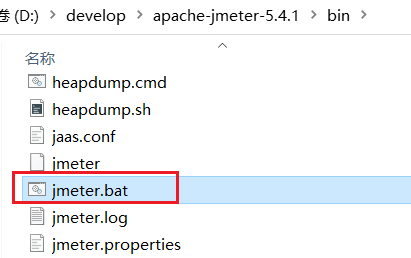
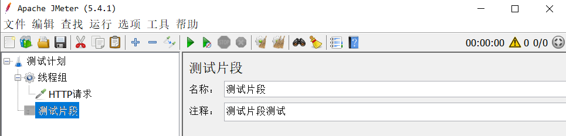

# Jmeter快速入门


# 一、安装Jmeter

Jmeter依赖于JDK，所以必须确保当前计算机上已经安装了JDK，并且配置了环境变量。


## 下载

可以Apache Jmeter官网下载，地址：http：//jmeter.apache.org/download_jmeter.cgi


当然，我们课前资料也提供了下载好的安装包：


## 解压

因为下载的是zip包，解压缩即可使用，目录结构如下：


其中的bin目录就是执行的脚本，其中包含启动脚本：



### 运行

双击即可运行，但是有两点注意：

- 启动速度比较慢，要耐心等待
- 启动后黑窗口不能关闭，否则Jmeter也跟着关闭了


# 二、快速入门


## 设置中文语言

默认Jmeter的语言是英文，需要设置：


效果：


> **注意**：上面的配置只能保证本次运行是中文，如果要永久中文，需要修改Jmeter的配置文件


打开jmeter文件夹，在bin目录中找到 **jmeter.properties**，添加下面配置：

```properties
language=zh_CN
```


> 注意：前面不要出现#，#代表注释，另外这里是下划线，不是中划线


## 基本用法

在测试计划上点鼠标右键，选择添加 > 线程（用户） > 线程组：


在新增的线程组中，填写线程信息：


给线程组点鼠标右键，添加http取样器：


编写取样器内容：


添加监听报告：


添加监听结果树：


汇总报告结果：


结果树：


# 三、JMeter详细介绍

> https://www.bilibili.com/video/BV1VE411P7mX/

## JMeter功能组成

### 线程组


#### 线程组分类

1. **SetUp Thread Group**：SetUp线程组
   - 用来配置请求之前需要完成的事情
2. **TearDown Thread Group**：TearDown线程组
   - 用来配置请求之后需要完成的事情
3. **Thread Group**：线程组
   - 用来配置线程参数的(用来定义发送请求的并发参数)，使用率最高

#### 执行错误之后的动作

1. **继续**：忽略当前错误然后直接继续运行
2. **启动下一进程循环**/Start next thread loop：忽略当前的错误然后继重头开始继续执行
3. **停止线程**：将当前有错的线程停掉，然后其它的线程继续执行
4. **停止测试**：在当前错误继程执行完毕之后将测试计划停止
5. **立即停止测试**/Stop test now：立即停止所有的测试操作

#### 线程属性

1. **线程数**：设置一个具体的数值 就表示当前准备多少个用户
2. **准备时长**：单位是s表示当前的所有线程会在多少秒之类准备完成
3. **循环的次数**：设置一个具体的数值 表示当前请求会被执行多少次
4. **调度器**：可以通过设置具体的时间来对该测试计划进行可控的时间管理操作

### 测试片段



测试片段里面存放的内容默认是不会执行的，一般是在需要的时候通过其它的元件让它能够执行

### 执行元件

我们可以将Jmeter中实现某一些相同效果的组件集合称之为元件。

组件：某一个功能的具体封装

#### 执行元件的分类

1. 逻辑控制器：我们可以将它分为二类，其中一类就是用来对当前的具体操作进行分类。男外的一类就可以用来对具体的操作执行进行相应的控制
2. 配置元件：这个元件一般是用来为具体的操作提供数据支持
3. 定时器：它可以帮我们控制当前操作的时间
4. 前置处理器：某一个请求真正发出之前有可能需要完成其它的操作，此时我们就可以通过这个元件来实现
5. 取样器：它就是jmeter 当中真正去执行请求的元件
6. 后置处理器：当某个请求完成之后如果想要做一些相应的操作就可以基于此元件来实现
7. 断言：我们可以基于预期的结果对当前请求的实现返回结果进行相应的判断
8. 监听器：它为我们的测试提供了可视化的图形显示界面

#### 执行元件的作用域

8个执行元件分为三类

1. 逻辑控制器：它对它下面的“子元素”有绝对的控制权
2. 取样器：因为该元件最终都是需要被执行的，所以它放在哪里元所谓。不影响作用域
3. 另外六个：
   - 如果某个元件的父亲是个取样器，那么该元件就对当前取样器起作用
   - 如果这个元件的父亲不是取样器那么该元件就对当前父亲下面的所有子元件起作用(是可以穿透的)

#### 元件的执行顺序

默认情况下如果八个元件都存在那么它们的执行顺序就是：

逻辑控制器 → 配置元件 → 前置处理器 → 取样器 → 后置处理器 → 断言 → 监听器

## JMeter录制脚本

### 相关概念

1. 脚本：对于jmet! 来说我们可以将后缀名为 jmx 的文件称之为 脚本,
2. 录制：所谓的录制就可以理解为将原来手动添加的一些操作通过其它的形式保存为Jmx的过程。

### JMeter实现脚本录制

1. 在JMeter的工作台当中添加一个HTTP代理服务器，然后将它属性当中的“目标控制器”设置正确【在测试计划申添加一个线程组，然后勾选此即可】，完成之后需要将当前服务启动才会生效

   - JMeter5：

     

2. 此时我们需要在internet 选项申设置相应的代理服务器配置【 127.0.0.1-8080】

3. 上述操作完成之后就可以在浏览器进行相应的手工操作，然后这些操作就会被Jmeter 保存起来，方便我们后续的测试

## JMeter参数化

### 概念

参数化：在实际测当中我们需要对某些数据进行可变的处理，此时我们就可以通过参数化来完成jmeter当中存在多种实现方式。

### 参数化实现

#### 用户参数实现参数化

1. 在请求的前面添加前置处理器 → 用户参数
2. 在用户参数当申设置相应的变量名和变量值，名字和值都可以存在多个
3. 在具体的请求里去使用相应的变量【 在jmeter里同样是S{变量名}的形式来使用变量 】

> 用户参数如果想要做到值不同则应该在请求的时候分配多个用户数而不是循环次数。

#### 用户定义的变量实现参数化

> 通过配置元件中的用户定义的变量来实现

1. 在请求之前添加一个配置元件 → 用户定义的变量
2. 在该元件申设置我们想要的数据
3. 在需要使用的数据的地方直接通过${变量名}的格武来获取数据

> 可以通过 逻辑控制器 中的 FroEach控制器 来实现参数多样化

#### 外部文件实现参数化

> 原理：这种方法本质就是通过 jmeter 去读取外部文件的数据，然后实现数据的可变调用。

1. 在请求之前添加一个配置元件----csv data set config
2. 在该元件当中引入相应存放数据的文件【通过路径来引入】
3. 设置具体的调用参数【 单独分析的内容】
4. 在需要使用数据的地方直接调用相应的变量即可

csv data set config 的属性

1. fiename：该选项就是用来设置被引入文件的路径【 绝对路径或者相对路径
2. 文件编码：只有保证编码统一里面的数据才会正常显示。【utf-8】
3. 变量名称：在外部文件中可以存放多个不同类型的数据，我们在Jme期里需要通过变量来进行调用，此选项当中就是用来设置具体的调用变量名，多个变量名之间用逗号隔开。
4. 分割符：默认是逗号，如果在文件当中是用 tab 空格来分分割的我们就需要写入\t
5. 数据读到文件结尾之后是否循环：true 表示重头循环false 表示不循环
6. 数据读到文件结尾之后是否停止错误线程：true 表示停止，false 表示不停止
