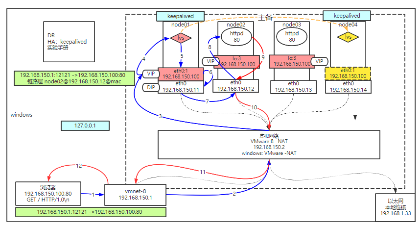

# LVS

## LVS概念

**LVS**是**Linux Virtual Server**的简写，意即**Linux虚拟服务器**，是一个虚拟的服务器集群系统。本项目在1998年5月由[章文嵩](https://baike.baidu.com/item/章文嵩/6689425)博士成立，是中国国内最早出现的自由软件项目之一。

## 四层负载 VS 七层负载


## 几个重要的IP

- **CIP**：Client IP
- **VIP**：Virtual IP
- **DIP**：Delivery IP
- **RIP**：Real IP


## 三种路由模式

三种路由模型解决的都是数据包从**负载均衡**到**RealServer**的方式

### NAT：网络地址转换模型

要求：Real Server的GW要指向负载均衡服务器

缺点：服务端上行带宽称为瓶颈


### DR：直接路由模型

要求：负载均衡和RS要在同一个局域网


### TUN：隧道模式

要求：


## DR模式常见概念

### 隐藏VIP方法

对外隐藏，对内可见 ：

**kernel parameter**:
目标mac地址为全F，交换机触发广播
 /proc/sys/net/ipv4/conf/\*IF\*/

**arp_ignore**: 定义接收到ARP请求时的响应级别；
 0：只要本地配置的有相应地址，就给予响应；
 1：仅在请求的目标(MAC)地址配置请求，到达的接口上的时候，才给予响应；

**arp_announce**：定义将自己地址向外通告时的通告级别；
 0：将本地任何接口上的任何地址向外通告；
 1：试图仅向目标网络通告与其网络匹配的地址；
 2：仅向与本地接口上地址匹配的网络进行通告；

### 四种静态

rr:轮循
wrr:
dh:
sh:

### 动态调度方法

lc: 最少连接
wlc: 加权最少连接
sed: 最短期望延迟
nq: never queue
LBLC: 基于本地的最少连接
DH:
LBLCR: 基于本地的带复制功能的最少连接

### ipvs内核模块

`yum install ipvsadm -y`

### 管理集群服务匹配规则

#### 添加规则

`ipvsadm -A -t | u | f <service-address> [-s <scheduler>]`
`-t`: TCP协议的集群
`-u`: UDP协议的集群
`<service-address>`:   IP:PORT
`-f`: FWM: 防火墙标记
`<service-address>`: Mark Number

`ipvsadm -A -t 192.168.9.100:80 -s rr`

#### 修改规则

`-E`

#### 删除规则

`ipvsadm -D -t|u|f service-address`

### 管理集群服务中的RS

#### 添加

`ipvsadm -a -t|u|f service-address -r server-address [-g|i|m] [-w weight]`
` -t|u|f service-address`：事先定义好的某集群服务
` -r server-address`: 某RS的地址，在NAT模型中，可使用IP：PORT实现端口映射；

`[-g|i|m]`: LVS类型

 `-g`: DR
 ` -i`: TUN
 `-m`: NAT

`[-w weight]`: 定义服务器权重

#### 修改

`-e`

#### 删除

```sh
-d -t|u|f service-address -r server-address
\# ipvsadm -a -t 172.16.100.1:80 -r 192.168.10.8 –g
\# ipvsadm -a -t 172.16.100.1:80 -r 192.168.10.9 -g
```

#### 查看

 `-L|l`
 `-n`: 数字格式显示主机地址和端口
 `--stats`：统计数据
 `--rate`: 速率
 `--timeout`: 显示tcp、tcpfin和udp的会话超时时长
 `-:c` 显示当前的ipvs连接状况

#### 删除所有集群服务

 `-C`：清空ipvs规则

#### 保存规则

 `-S`
 `ipvsadm -S > /path/to/somefile`

#### 恢复规则

 `-R`
`ipvsadm -R < /path/form/somefile`

## LVS部署实验


### 配置RS

#### 修改node02/node03响应级别

```sh
echo 1 > /proc/sys/net/ipv4/conf/eth0/arp_ignore
echo 2 > /proc/sys/net/ipv4/conf/eth0/arp_announce

echo 1 > /proc/sys/net/ipv4/conf/all/arp_ignore
echo 2 > /proc/sys/net/ipv4/conf/all/arp_announce
```

#### 配置node02/node03子接口

`ifconfig eth0:2 192.168.150.100 netmask 255.255.255.255`

#### node02/node03安装httpd

```sh
yum install -y httpd
service httpd start
echo "from 192.168.150.12" > /var/www/html/index.html
echo "from 192.168.150.13" > /var/www/html/index.html
```

### 配置node01

#### 配置node01子接口

`ifconfig eth0:2 192.168.150.100/24`

或

`ifconfig eth0:2 192.168.150.100 netmask 255.255.255.0`

#### 删除子接口

`ifconfig eth0:2 down`

#### 安装ipvsadm

`yum install -y ipvsadm`

#### 配置入包规则

`ipvsadm -A -t 192.168.150.100:80 -s rr`

#### 查看配置的规则

`ipvsadm -ln`

#### 配置负载规则

`ipvsadm -a -t 192.168.150.100:80 -r 192.168.150.12 -g -w 1`

`ipvsadm -a -t 192.168.150.100:80 -r 192.168.150.13 -g -w 1`

### 验证

#### 浏览器访问

192.168.150.100

#### Node01

`netstat -natp`：看不到socket连接

`ipvsadm -lnc`：查看RS连接的统计，如果状态中有SYNC_RECV，说明后面的网络层出现问题了

#### Node02

`netstat -natp`：有很多socket连接

# 基于KeepAlived的LVS

## 单独基于LVS的问题


1、LVS可能会挂掉，全部业务下线，单点故障

解决单点的两个思路：主备 | 多主

2、RS可能会挂掉，部分客户端段请求异常

## KeepAlived作用

KeepAlived是一个通用的工具，主要用于实现HA

- 监控服务
- Master上的KA通告Master上的LVS健康状态，Backup的KA监听Master的状态
- 配置VIP，添加IPVS，KA有配置文件
- 对后端Server做健康检查

## 部署基于keepalived的LVS



清除[LVS部署实验](##LVS部署实验)中node01的ipvsadm的各种配置，node02和node03配置不变

### 配置node01

```sh
ipvsadm -C
ifconfig eth0:8 down
yum install -y keepalived ipvsadm
vi /etc/keepalived/keepalived.conf
```

配置文件参考这里：[keepalived.conf](LinuxIO.assets/keepalived.conf)

[配置文件详解：](https://www.cnblogs.com/along1226/p/5027838.html)

```nginx
第一部分：全局定义块
1、email通知。作用：有故障，发邮件报警。
2、Lvs负载均衡器标识（lvs_id）。在一个网络内，它应该是唯一的。
3、花括号“{}”。用来分隔定义块，因此必须成对出现。如果写漏了，keepalived运行时，不会得到预期的结果。由于定义块内存在嵌套关系，因此很容易遗漏结尾处的花括号，这点要特别注意。
global_defs {
  notification_email {  #指定keepalived在发生切换时需要发送email到的对象，一行一个
    sysadmin@fire.loc
  }
  notification_email_from Alexandre.Cassen@firewall.loc #指定发件人
    smtp_server localhost #指定smtp服务器地址
    smtp_connect_timeout 30 #指定smtp连接超时时间
    router_id LVS_DEVEL #运行keepalived机器的一个标识
}

第二部分：vrrp_sync_group作用：确定失败切换（FailOver）包含的路由实例个数。即在有2个负载均衡器的场景，一旦某个负载均衡器失效，需要自动切换到另外一个负载均衡器的实例是哪些？ 实例组group{}至少包含一个vrrp实例
vrrp_sync_group VG_1{ #监控多个网段的实例
  group {
    VI_1 #实例名
      VI_2　　　　......
  }
  notify_master /path/xx.sh #指定当切换到master时，执行的脚本
    netify_backup /path/xx.sh #指定当切换到backup时，执行的脚本
    notify_fault "path/xx.sh VG_1" #故障时执行的脚本
    notify /path/xx.sh
    smtp_alert #使用global_defs中提供的邮件地址和smtp服务器发送邮件通知
}

第三部分：vrrp_instance，实例名出自实例组group所包含的那些名字。  
vrrp_instance VI_1 {
  state BACKUP #指定那个为master，那个为backup，如果设置了nopreempt这个值不起作用，主备考priority决定
    interface eth0 #设置实例绑定的网卡
    dont_track_primary #忽略vrrp的interface错误（默认不设置）
    track_interface{ #设置额外的监控，里面那个网卡出现问题都会切换
    eth0
      eth1
  }
  mcast_src_ip #发送多播包的地址，如果不设置默认使用绑定网卡的primary ip
    garp_master_delay #在切换到master状态后，延迟进行gratuitous ARP请求
    virtual_router_id 50 #VPID标记
    priority 99 #优先级，高优先级竞选为master
    advert_int 1 #检查间隔，默认1秒
    nopreempt #设置为不抢占 注：这个配置只能设置在backup主机上，而且这个主机优先级要比另外一台高
    preempt_delay #抢占延时，默认5分钟
    debug #debug级别
    authentication { #设置认证
    auth_type PASS #认证方式
      auth_pass 111111 #认证密码
  }
  virtual_ipaddress { #设置vip
    192.168.202.200
  }
}

第四部分：
虚拟服务器virtual_server定义块 ，虚拟服务器定义是keepalived框架最重要的项目了，是keepalived.conf必不可少的部分。 该部分是用来管理LVS的，是实现keepalive和LVS相结合的模块。ipvsadm命令可以实现的管理在这里都可以通过参数配置实现，注意：real_server是被包含在viyual_server模块中的，是子模块。
virtual_server 192.168.202.200 23 { //VIP地址要和vrrp_instance模块中的virtual_ipaddress地址一致
    delay_loop 6 #健康检查时间间隔 lb_algo rr 
    #lvs调度算法rr|wrr|lc|wlc|lblc|sh|dh
    #lb_kind DR #负载均衡转发规则NAT|DR|RUN 
    persistence_timeout 5 #会话保持时间
    protocol TCP #使用的协议
    persistence_granularity <NETMASK> #lvs会话保持粒度
    virtualhost <string> #检查的web服务器的虚拟主机（host：头）
    sorry_server<IPADDR> <port> #备用机，所有realserver失效后启用
    real_server 192.168.200.5 23 {             //RS的真实IP地址
      weight 1 #默认为1,0为失效
      inhibit_on_failure #在服务器健康检查失效时，将其设为0，而不是直接从ipvs中删除
      notify_up <string> | <quoted-string> #在检测到server up后执行脚本
      notify_down <string> | <quoted-string> #在检测到server down后执行脚本

      TCP_CHECK {                    //常用
        connect_timeout 3 #连接超时时间
        nb_get_retry 3 #重连次数
        delay_before_retry 3 #重连间隔时间
        connect_port 23  健康检查的端口的端口
        bindto <ip>
    }
    HTTP_GET | SSL_GET{          //不常用
        url{ #检查url，可以指定多个
        path /
          digest <string> #检查后的摘要信息
          status_code 200 #检查的返回状态码
      }
      connect_port <port>
        bindto <IPADD>
        connect_timeout 5
        nb_get_retry 3
        delay_before_retry 2
    }

    SMTP_CHECK{                 //不常用
        host{
        connect_ip <IP ADDRESS>
          connect_port <port> #默认检查25端口
          bindto <IP ADDRESS>
      }
      connect_timeout 5
        retry 3
        delay_before_retry 2
        helo_name <string> | <quoted-string> #smtp helo请求命令参数，可选
    }
    MISC_CHECK{                 //不常用
        misc_path <string> | <quoted-string> #外部脚本路径
        misc_timeout #脚本执行超时时间
        misc_dynamic #如设置该项，则退出状态码会用来动态调整服务器的权重，返回0 正常，不修改；返回1：检查失败，权重改为0；返回2-255：正常，权重设置为：返回状态码-2
    }
  }
```

可以利用man命令查看帮助文件

`man 5 keepalived.conf`

然后搜索关键字即可

#### Master(Node01)修改项

```sh
vrrp_instance VI_1 {
    state MASTER
    interface eth0
    virtual_router_id 51
    priority 100
    advert_int 1
    authentication {
        auth_type PASS
        auth_pass 1111
    }
    virtual_ipaddress {
        192.168.150.100/24 dev eth0 label eth0:3    ### 修改的部分
    }
}

virtual_server 192.168.150.100 80 {    ### 修改的部分
    delay_loop 6
    lb_algo rr
    lb_kind DR    ### 修改的部分
    persistence_timeout 50    # 亲密到一个Server的超时时间，单位秒
    protocol TCP

    real_server 192.168.150.12 80 {    ### 修改的部分
        weight 1
        HTTP_GET {    ### 修改的部分 RS健康检查
            url {
              path /
              status_code 200    ### 修改的部分
            }
            connect_timeout 3
            nb_get_retry 3
            delay_before_retry 3
        }
    }
    real_server 192.168.150.13 80 {    ### 来自上面的复制
        weight 1
        HTTP_GET {    ### 修改的部分 RS健康检查
            url {
              path /
              status_code 200    ### 修改的部分
            }
            connect_timeout 3
            nb_get_retry 3
            delay_before_retry 3
        }
    }
}

### 修改的部分 删除后面的 virtual_server
```

### 配置node04

安装：`yum install -y keepalived ipvsadm`

把配置文件keepalived.conf拷贝到node04，并修改`state MASTER`为`state BACKUP`；`priority 100`为`priority 50`

即可

### 启动

Node01、Node04：`service keepalived start`

### 检查

`ifconfig`：检查VIP是否已经配置好，Node01应该有，Node04不应该有

`ipvsadm -ln`：检查内核模块的负载是否已经配置好，两台都应该已经配置好

### 测试

Node01：`ifconfig eth0 down`，可以看到Node01中的网卡已经down，而Node04的eth0:3已经被自动配置并正常工作，需要说明的是，物理网卡eth0被down后，所有的子label接口也会被down

Node01：`ifconfig eth0 up`，这个时候Node01的网卡eth0正常up，Node04的eth0:3已经被卸掉

#### 说明

不是所有的Master被修复后都能立马抢回Master的地位，要具体参看成本

### 异常

当Master的keepalived由于不可知原因退出，导致退出前还没有来得及收回子标签网卡，造成互联网上出现两个同样的VIP出现

即：keepalived存在问题

解决：ZooKeeper集群替代

附录：[keepalived配置注释](https://www.cnblogs.com/SimpleWu/p/11004902.html)

```nginx
#检测脚本
vrrp_script chk_http_port {
  script "/usr/local/src/check_nginx_pid.sh" #心跳执行的脚本，检测nginx是否启动
  interval 2                          #（检测脚本执行的间隔，单位是秒）
  weight 2                            #权重
}
#vrrp 实例定义部分
vrrp_instance VI_1 {
  state MASTER            # 指定keepalived的角色，MASTER为主，BACKUP为备
  interface ens33         # 当前进行vrrp通讯的网络接口卡(当前centos的网卡) 用ifconfig查看你具体的网卡
  virtual_router_id 66    # 虚拟路由编号，主从要一直
  priority 100            # 优先级，数值越大，获取处理请求的优先级越高
  advert_int 1            # 检查间隔，默认为1s(vrrp组播周期秒数)
  
  authentication { #授权访问
    auth_type PASS #设置验证类型和密码，MASTER和BACKUP必须使用相同的密码才能正常通信
    auth_pass 1111
  }
  track_script {
    chk_http_port            #（调用检测脚本）
  }
  virtual_ipaddress {
    192.168.16.130            # 定义虚拟ip(VIP)，可多设，每行一个
  }
}
```

