# Network & IO

## 客户端服务端通信

- 服务端启动，创建ServerSocket，就会启动监听(类似于死循环的方式监听accept队列的文件描述符)

- 客户端发送请求

  - 客户端发送连接请求：**三次握手**

    - 客户端发送SYN给服务端，客户端状态→SYN-SENT
    - 服务端收到后发送SYN+ACK，服务端状态→SYN-RCVD
    - 客户端收到反馈后发送ACK给服务端，客户端状态→ESTABLISHED
    - 服务端收到反馈，状态→ESTABLISHED

  - 三次握手是**客户端操作系统与服务端操作系统之间建立连接**，操作系统会维护一个accept队列，服务端口可以设置这个accept队列的大小：backlog。

    ```sh
    # 全连接数量：服务端所能accept即处理数据的最大客户端数量，即完成连接上限 默认128
    cat /proc/sys/net/core/somaxconn
    # 半连接数量 默认1024
    cat /proc/sys/net/ipv4/tcp_max_syn_backlog
    ```

  - [全连接数量和半连接数量](https://blog.51cto.com/wujianwei/2104779)示例：某某发布公告要邀请四海之内若干客人到场参加酒席。客人参加酒席分为两个步骤：

    **1、到大厅；**
    **2、找到座位(吃东西，比如糖果、饭菜、酒等)**。
    `tcp_max_syn_backlog`用于指定酒席现场面积允许容纳多少人进来；
    `somaxconn`用于指定有多少个座位。
    显然`tcp_max_syn_backlog`>=`somaxconn`。
    如果要前来的客人数量超过`tcp_max_syn_backlog`，那么多出来的人虽然会跟主任见面握手，但是要在门外等候；
    如果到大厅的客人数量大于`somaxconn`，那么多出来的客人就会没有位置坐(必须坐下才能吃东西)，只能等待有人吃完有空位了才能吃东西。

- 服务端**操作系统创建SOCKET**，并将这个SOCKET加入到**操作系统维护的accept队列**中

- 服务端监听到有SOCKET加入到accept队列中，根据具体的IO来处理数据

  - 服务端监听到SOCKET之后处理的IO策略模型
    - BIO：server.accept() 阻塞等待返回
    - NIO：server.accept() 立即返回1(获取到连接)/0(未获取到连接)
    - 基于NIO的多路复用器：select、poll、epoll 这些多路复用器只是和内核调用之后知道了是否有SOCKET加入accept队列的事件

- 客户端请求完成，向服务端请求断开连接：四次挥手

  - 客户端发送FIN给服务端，客户端状态→WAIT1
  - 服务端收到FIN的请求，反馈FIN+ACK给客户端，服务端状态→CLOSE-WAIT
  - 客户端收到服务端的FIN+ACK反馈，更新自身状态→WAIT2
  - 服务端发送FIN给客户端，服务端更新自身状态→LAST-ACK
  - 客户端收到服务端的FIN，并发送ACK个体服务端，客户端更新自身的状态→TIME-WAIT
  - 服务端收到客户端的ACK后，更新自身状态→CLOSED

- ~~服务端涉及到的Socket~~

  - LISTEN-SOCKET：服务端的bind方法+listen就会产生LISTEN-SOCKET
    - SEND-Q：还可以有多少SOCKET入队？？？
    - RECV-Q：应用可以通过accept队列拿走的SOCKET数
  - ESTABLISHED-SOCKET：客户端的connect()就会在服务端操作系统产生ESTABLISHED-SOCKET，然后应用通过accept方法获取到该Socket
    - SEND-Q：积压的没有发送完的**字节数**？不是socket数量？
    - RECV-Q：积压的没有读取完的字节数

- Linux测试

  - 服务端A启动监听：`nc -l localhost 8989`
  - 服务端A查看listen状态：
    - `netstat -natp`
    - `ss -lna`
  - 客户端A发起连接
    - `nc localhost 8989`

## 长连接与短链接

- [HTTP1.0、HTTP1.1 和 HTTP2.0 的区别](https://www.cnblogs.com/heluan/p/8620312.html)

- 长连接和短链接只需要看一点：这个连接是不是复用了，举例：

  - HTTP 1.0，1.1 没有开启keepalive*保持，连接只负责一次同步阻塞的请求+响应，短连接！

  - HTTP 1.0，1.1 开启了keepalive保持，同步复用连接：多次(请求+响应)，以上是无状态通信，长连接！

  - Dubbo协议(RPC)，打开连接，同步/异步复用连接：多次

    - 同步：请求+响应
    - 异步：请求请求、响应响应

    当复用连接的时候，需要消息的ID，而且客户端和服务端同时完成这个约束，有状态通信，长连接

- 注意点

  - TCP只是连接，受应用层协议的控制
  - 在HTTP1.0和HTTP1.1协议中都有对KeepAlive的支持。其中HTTP1.0需要在request中增加`Connection： keep-alive`的header才能够支持，而HTTP1.1默认支持。

## IO模型

- IO是程序对着内核的socket-Queue的包装
  - BIO：读取内核accept队列，一直等Queue里有才返回，阻塞模型，每连接对应一个线程
  - NIO：读取内核accept队列，立刻返回：两种结果，读到，没读到，程序逻辑要自己维护，非阻塞模型
    - 基于NIO的多路复用器：内核增加select，poll，epoll新增的和数据地接收无关的调用，得到是对应socket的事件，可以有效地去再次accept，R/W
    - 多路复用的三种方式：select：最大连接数1024、poll：最大连接数不限、epoll
    - epoll，基于事件驱动，[TheCoreOfEpoll.md](TheCoreOfEpoll.md)
  - AIO：完全异步的处理方式，基于事件驱动模型，Linux不支持，Win已经实现
  
- [Reactor.md](Reactor.md)

- [NIO原理插曲(01:48:30)视频](https://ke.qq.com/webcourse/index.html#cid=398381&term_id=100475149&taid=3799285120767021&type=1024&vid=5285890793309969846)

- [BIO-NIO-VAIO.pos](LinuxIO.assets/BIO-NIO-VAIO.pos)

  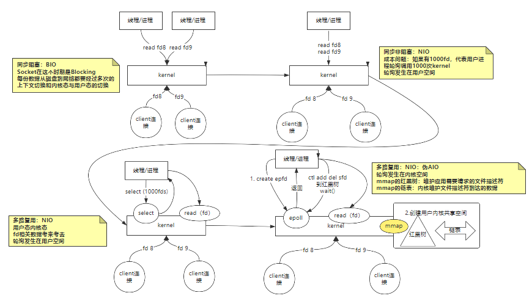

- IO模型从两个阶段看
  - 磁盘到内核态
  - 内核态到用户态
  
- IO模型对应场景

## 同步阻塞与同步非阻塞

- BIO，NIO，多路复用器，在IO模型上都是同步的，都是程序自己accpet，R/W
- 非阻塞的概念并不是在所有过程都不会阻塞

## 粘包&拆包

- 产生这个现象的本质原因：因为在TCP中，没有包的概念，只有流的概念
- 发生场景：
- 因为TCP是面向流，没有边界，而操作系统在发送TCP数据时，会通过缓冲区来进行优化，例如缓冲区为1024个字节大小。如果一次请求发送的数据量比较小，没达到缓冲区大小，TCP则会将多个请求合并为同一个请求进行发送，这就形成了**粘包**问题。如果一次请求发送的数据量比较大，超过了缓冲区大小，TCP就会将其拆分为多次发送，这就是**拆包**。
- 常见解决方案：

  - 发送端将每个包都封装成固定的长度，比如100字节大小。如果不足100字节可通过补0或空等进行填充到指定长度；
  - 发送端在每个包的末尾使用固定的分隔符，例如\r\n。如果发生拆包需等待多个包发送过来之后再找到其中的\r\n进行合并；例如，FTP协议；
  - 将消息分为头部和消息体，头部中保存整个消息的长度，只有读取到足够长度的消息之后才算是读到了一个完整的消息；
  - 通过自定义协议进行粘包和拆包的处理。
- Netty对粘包和拆包问题的处理

  - Netty对解决粘包和拆包的方案做了抽象，提供了一些解码器(Decoder)来解决粘包和拆包的问题。如：

    1. LineBasedFrameDecoder：以行为单位进行数据包的解码；

    2. DelimiterBasedFrameDecoder：以特殊的符号作为分隔来进行数据包的解码；

    3. FixedLengthFrameDecoder：以固定长度进行数据包的解码；

    4. LenghtFieldBasedFrameDecode：适用于消息头包含消息长度的协议(最常用)；

  - 基于Netty进行网络读写的程序，可以直接使用这些Decoder来完成数据包的解码。

  - 对于高并发、大流量的系统来说，每个数据包都不应该传输多余的数据(所以补齐的方式不可取)，LenghtFieldBasedFrameDecode更适合这样的场景。

## 什么是WAL

- [REFERENCE](https://www.cnblogs.com/mengxinJ/p/14211427.html)
- **W**rite **A**head **L**og：预写日志。在写一份数据的时候要先去记录一份日志。是实现事务持久性的一个常用技术，基本原理是在提交事务时，为了避免磁盘页面的随机写，只需要保证事务的redo log写入磁盘即可，这样可以通过redo log的顺序写代替页面的随机写，并且可以保证事务的持久性，提高了数据库系统的性能。虽然WAL使用顺序写替代了随机写，但是，每次事务提交，仍然需要有一次日志刷盘动作，受限于磁盘IO，这个操作仍然是事务并发的瓶颈。
- 应用：MySQL的RedoLog、HBase(LSM树)
- IO在效率维度上的分类：
  * 顺序IO：直接向文件末尾追加数据
  * 随机IO：找到数据的地址，然后进行增删改操作
  * **顺序IO的效率远远大于随机IO的效率**
- 当数据写入磁盘失败，只要有WAL，可保证数据不丢失。在一定程度上减少丢失数据的可能性


# [Linux的5种IO模型梳理](https://zhuanlan.zhihu.com/p/127170201)

作者：[Java修仙道路](https://www.zhihu.com/column/c_1087293936418197504)

## 一、基本概念

五种IO模型包括：**阻塞IO、非阻塞IO、IO多路复用、信号驱动IO、异步IO**。

首先需要了解下系统调用的几个函数和基本概念。

### **1.1 简单介绍几个系统调用函数**

由于我对于C语言不熟悉，几个系统函数参考了一些文章，如果错误欢迎指出！

**recvfrom**
Linux系统提供给用户用于接收网络IO的系统接口。**从套接字上接收一个消息，可同时应用于面向连接和无连接的套接字**。

如果此系统调用返回值<0，并且 `errno`为`EWOULDBLOCK`或`EAGAIN`（套接字已标记为非阻塞，而接收操作被阻塞或者接收超时 ）时，连接正常，**阻塞**接收数据（这很关键，前4种IO模型都涉及此系统调用）。

**select**
select系统调用允许程序同时在多个底层文件描述符上等待输入的到达或输出的完成。以**数组**形式存储文件描述符，64位机器默认**2048**个。当有数据准备好时，无法感知具体是哪个流OK了，所以需要一个一个的遍历，函数的时间复杂度为**O(n)**。

**poll**
以**链表**形式存储文件描述符，没有长度限制。本质与select相同，函数的时间复杂度也为**O(n)**。

**epoll**
基于事件驱动，如果某个流准备好了，会以事件通知，知道具体是哪个流，因此不需要遍历，函数的时间复杂度为**O(1)**。

**sigaction**
用于设置对信号的处理方式，也可检验对某信号的预设处理方式。Linux使用**SIGIO信号**来实现IO异步通知机制。

### **1.2 同步&异步**

同步和异步是针对应用程序和内核交互而言的，也可理解为**被调用者（操作系统）**的角度来说。
同步是用户进程触发IO操作并等待或轮询的去查看是否就绪，而异步是指用户进程触发IO操作以后便开始做自己的事情，而当IO操作已经完成的时候会得到IO完成的通知，需要CPU支持。

### **1.3 阻塞&非阻塞**

阻塞和非阻塞是针对于进程在访问数据的时候，也可理解为**调用者（程序）**角度来说。根据IO操作的就绪状态来采取的不同的方式。

阻塞方式下读取或写入方法将一直等待，而非阻塞方式下读取或写入方法会立即返回一个状态值。

下午撸代码饿了，好久没吃KFC了，决定去**整个全家桶** ，这一切都要从一个全家桶说起~

我跑去肯德基买全家桶，但是很不巧，轮到我时，全家桶**卖完了**，我只能等着新做一份 ...

## 二、阻塞IO模型

学习过操作系统的知识后，可以知道：不管是网络IO还是磁盘IO，对于读操作而言，都是等到网络的某个数据分组到达后/数据**准备好**后，将数据**拷贝到内核空间的缓冲区中，再从内核空间拷贝到用户空间的缓冲区**。
有关操作系统的知识可以参考我之前写的操作系统相关文章~

拓展阅读：
[网络IO和磁盘IO详解](https://www.cnblogs.com/sunsky303/p/8962628.html)
此处需要一个清新的脑回路，我就是程序，我想要全家桶，于是**发起了系统调用**，而后厨加工的过程就是在做**数据准备和拷贝**工作。全家桶最终到手，数据终于从内核空间拷贝到了用户空间。

简单看下**执行流程**：

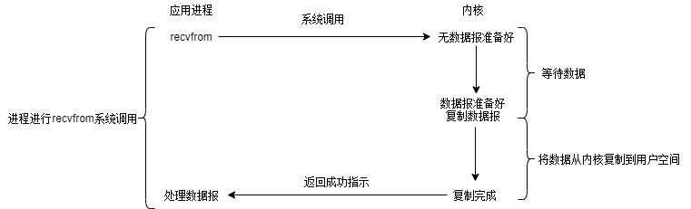阻塞IO模型

接下来发挥看图说话的专长了：

阻塞IO的执行过程是进程进行**系统调用**，**等待内核**将数据准备好并复制到用户态缓冲区后，进程**放弃使用CPU**并**一直阻塞**在此，直到数据准备好。

## 三、**非阻塞IO模型**

此时我**每隔5分钟**询问全家桶好了没，在数次盘问后，终于出炉了。在每一次盘问之前，对于程序来说是**非阻塞的**，**占用CPU资源**，可以做其他事情。

每次应用程序**询问内核**是否有数据准备好。如果就绪，就进行**拷贝**操作；如果未就绪，就**不阻塞程序**，内核直接返回未就绪的返回值，等待用户程序下一个轮询。

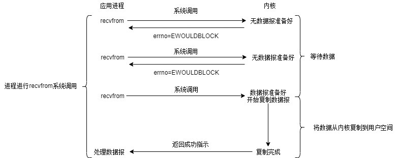

非阻塞IO模型大致经历两个阶段：

- **等待数据阶段**：未阻塞， 用户进程需要盲等，不停的去轮询内核。
- **数据复制阶段**：阻塞，此时进行数据复制。

在这两个阶段中，用户进程只有在数据复制阶段被阻塞了，而等待数据阶段没有阻塞，但是用户进程需要盲等，不停地轮询内核，看数据是否准备好。

## 四、IO多路复用模型

排了很长的队，终于轮到我支付后，拿到了一张小票，上面有**号次**。当全家桶出炉后，会喊相应的号次来取。KFC营业员小姐姐打小票出号次的动作相当于操作系统**多开了个线程**，专门接收客户端的连接。我只关注叫到的是不是我的号，因此程序还需在服务端**注册我想监听的事件**类型。

多路复用一般都是用于网络IO，服务端与多个客户端的建立连接。下面是神奇的多路复用执行过程：

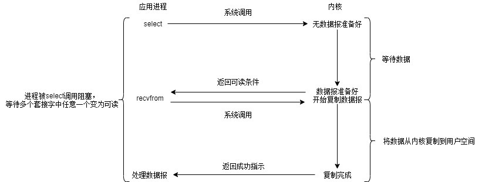

IO多路复用模型

相比于阻塞IO模型，多路复用只是多了一个**select/poll/epoll函数**。

select函数会不断地轮询自己所负责的文件描述符/套接字的到达状态，当某个套接字就绪时，就对这个套接字进行处理。

select负责**轮询等待**，recvfrom负责**拷贝**。当用户进程调用该select，select会监听所有注册好的IO，如果所有IO都没注册好，调用进程就阻塞。

对于客户端来说，一般**感受不到阻塞**，因为请求来了，可以放到线程池里执行；但对于执行select的操作系统而言，是阻塞的，需要阻塞地**等待某个套接字变为可读**。

IO多路复用其实是阻塞在select，poll，epoll这类系统调用上的，复用的是执行select，poll，epoll的线程。

## 五、信号驱动IO模型

跑KFC嫌麻烦，刚好有个会员，直接点份外卖，美滋滋。当外卖送达时，会收到取餐电话（信号）。在收到取餐电话之前，我可以愉快地吃鸡或者学习。

当数据报准备好的时候，内核会向应用程序**发送一个信号**，进程对信号进行**捕捉**，并且调用信号处理函数来获取数据报。

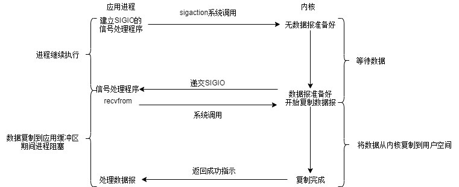

信号驱动IO模型

该模型也分为两个阶段：

- **数据准备阶段**：未阻塞，当数据准备完成之后，会主动的通知用户进程数据已经准备完成，对用户进程做一个回调。
- **数据拷贝阶段**：阻塞用户进程，等待数据拷贝。

## 六、异步IO模型

此时科技的发展已经超乎想象了，外卖机器人将全家桶自动送达并**转换成营养**快速注入我的体内，同时还能得到口感的满足。注入结束后，机器人会提醒我注入完毕。在这个期间我可以放心大胆的玩，甚至注射的时候也**不需要停下来**！

类比一下，就是用户进程发起系统调用后，立刻就可以开始去做其他的事情，然后直到I/O**数据准备好并复制完成后**，内核会给用户进程**发送通知**，告诉用户进程操作**已经完成**了。

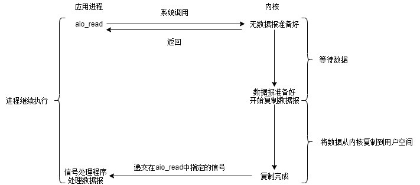异步IO模型

特点：

1. 异步I/O执行的两个阶段**都不会阻塞读写操作，**由内核完成。
2. 完成后内核将数据放到指定的缓冲区，**通知**应用程序来取。

## 七、Java中的BIO，NIO，AIO

操作系统的IO模型是底层基石，Java对于IO的操作其实就是**进一步的封装**。适配一些系统调用方法，让我们玩地更爽。
BIO，NIO，AIO涉及**相关实操代码**已收录至我的github，欢迎star~

### **7.1 BIO--同步阻塞的编程方式**

JDK1.4之前常用的编程方式。
**实现过程**：首先在服务端启动一个ServerSocket来**监听网络请求**，客户端启动Socket发起网络请求，默认情况下ServerSocket会**建立一个线程**来处理此请求，如果服务端没有线程可用，客户端则会**阻塞等待**或遭到**拒绝**，**并发效率比较低**。

服务器实现的模式是**一个连接一个线程**，若有客户端有连接请求服务端就需要启动一个线程进行处理，如果这个连接不做任何事情会造成不必要的**线程开销**。当然，也可以通过线程池机制改善。

**使用场景**
BIO适用于连接数目比较小且固定的架构，对服务器资源要求高，并发局限于应用中。

### **7.2 NIO--同步非阻塞的编程方式**

#### **7.2.1 NIO简介**

NIO 本身是基于**事件驱动**思想来完成的，当 socket 有流可读或可写入时，操作系统会相应地**通知**应用程序进行处理，应用再将流读取到缓冲区或写入操作系统。**一个有效的请求**对应**一个线程**，当连接没有数据时，是没有工作线程来处理的。

服务器实现模式为**一个请求一个通道**，即客户端发送的连接请求都会**注册到多路复用器**上，多路复用器轮询到连接**有I/O请求时**才**启动**一个线程进行处

**使用场景**
NIO 方式适用于连接数目多且连接比较短（轻操作）的架构，比如聊天服务器，并发局限于应用中，编程复杂，JDK1.4 开始支持。

#### **7.2.2 NIO中的几种重要角色**

有缓冲区Buffer，通道Channel，多路复用器Selector。

**7.2.2.1 Buffer**

在NIO库中，所有数据都是用**缓冲区（用户空间缓冲区）**处理的。在读取数据时，它是直接读到缓冲区中的；在写入数据时，也是写入到缓冲区中。任何时候访问NIO中的数据，都是通过缓冲区进行操作。
缓冲区实际上是一个数组，并提供了对数据的**结构化访问**以及**维护读写位置**等信息。

**Buffer的应用固定逻辑**

相关的代码我会更新至github~

写操作顺序

1. clear()
2. put() -> 写操作
3. flip() ->重置游标
4. SocketChannel.write(buffer); ->将缓存数据发送到网络的另一端
5. clear()

读操作顺序

1. clear()
2. SocketChannel.read(buffer); ->从网络中读取数据
3. buffer.flip()
4. buffer.get() ->读取数据
5. buffer.clear()

**7.2.2.2 Channel**

nio中对数据的读取和写入要通过Channel，它就像**水管一样**，是一个通道。通道不同于流的地方就是通道是**双向**的，可以用于读、写和同时读写操作。

**7.2.2.3 Selector**

多路复用器，用于注册通道。客户端发送的连接请求都会注册到多路复用器上，多路复用器轮询到连接有I/O请求时才启动一个线程进行处理

### **7.3 AIO--异步非阻塞编程方式**

进行读写操作时，只须直接调用api的read或write方法即可。一个有效请求对应一个线程，客户端的IO请求都是OS先完成了再通知服务器应用去启动线程进行处理。

**使用场景**
AIO 方式使用于连接数目多且连接比较长（重操作）的架构，比如相册服务器，充分调用 OS 参与并发操作，编程比较复杂，JDK1.7 开始支持。

## 总结

从效率上来说，可以简单理解为阻塞IO<非阻塞IO<多路复用IO<信号驱动IO<异步IO。

从同步和异步来说，**只有异步IO模型是异步的**，其他均为同步。

**参考文章：**
https://zhuanlan.zhihu.com/p/113467811
https://zhuanlan.zhihu.com/p/60196409

# 8张图看懂零拷贝

作者：[小林图解计算机基础](https://www.zhihu.com/column/c_1185131592262148096)

## **前言**

磁盘可以说是计算机系统最慢的硬件之一，读写速度相差内存 10 倍以上，所以针对优化磁盘的技术非常的多，比如**零拷贝**、**直接I/O**、**异步I/O** 等等，这些优化的目的就是为了提高系统的吞吐量，另外操作系统内核中的**磁盘高速缓存区**，可以有效的减少磁盘的访问次数。

这次，我们就以「文件传输」作为切入点，来分析I/O工作方式，以及如何优化传输文件的性能。

## 正文

DMA：Direct Memory Access，即直接内存访问

### **为什么要有 DMA 技术?**

在没有 DMA 技术前，I/O 的过程是这样的：

- CPU 发出对应的指令给磁盘控制器，然后返回；
- **磁盘控制器**收到指令后，于是就开始准备数据，会把数据放入到磁盘控制器的内部缓冲区中，然后产生一个**中断**；
- CPU 收到中断信号后，停下手头的工作，接着把磁盘控制器的缓冲区的数据一次一个字节地读进自己的寄存器，然后再把寄存器里的数据写入到内存，而在数据传输的期间 CPU 是无法执行其他任务的。

为了方便你理解，我画了一副图：

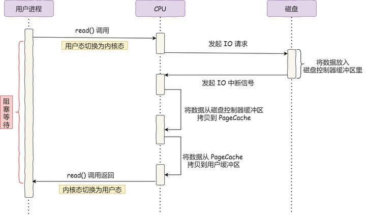

可以看到，整个数据的传输过程，都要需要 CPU 亲自参与搬运数据的过程，而且这个过程，CPU 是不能做其他事情的。

简单的搬运几个字符数据那没问题，但是如果我们用千兆网卡或者硬盘传输大量数据的时候，都用 CPU 来搬运的话，肯定忙不过来。

计算机科学家们发现了事情的严重性后，于是就发明了 DMA 技术。

什么是 DMA 技术？简单理解就是，**在进行I/O设备和内存的数据传输的时候，数据搬运的工作全部交给 DMA 控制器，而 CPU 不再参与任何与数据搬运相关的事情，这样 CPU 就可以去处理别的事务**。

那使用 DMA 控制器进行数据传输的过程究竟是什么样的呢？下面我们来具体看看。

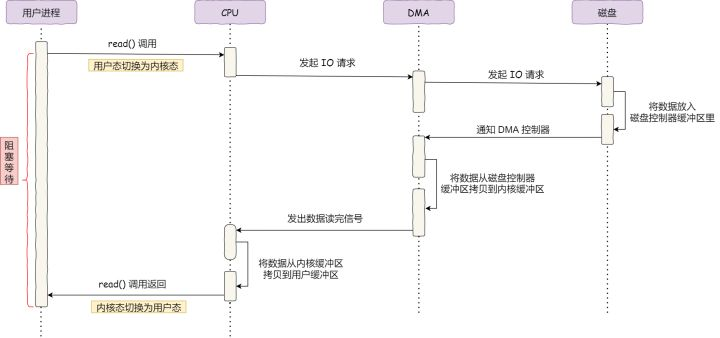

具体过程：

- 用户进程调用 read 方法，向操作系统发出I/O请求，请求读取数据到自己的内存缓冲区中，进程进入阻塞状态；
- 操作系统收到请求后，进一步将I/O请求发送 DMA，然后让 CPU 执行其他任务；
- DMA 进一步将I/O请求发送给磁盘；
- 磁盘收到 DMA 的I/O请求，把数据从磁盘读取到磁盘控制器的缓冲区中，当磁盘控制器的缓冲区被读满后，向 DMA 发起中断信号，告知自己缓冲区已满；
- **DMA 收到磁盘的信号，将磁盘控制器缓冲区中的数据拷贝到内核缓冲区中，此时不占用 CPU，CPU 可以执行其他任务**；
- 当 DMA 读取了足够多的数据，就会发送中断信号给 CPU；
- CPU 收到 DMA 的信号，知道数据已经准备好，于是将数据从内核拷贝到用户空间，系统调用返回；

可以看到， 整个数据传输的过程，CPU 不再参与数据搬运的工作，而是全程由 DMA 完成，但是 CPU 在这个过程中也是必不可少的，因为传输什么数据，从哪里传输到哪里，都需要 CPU 来告诉 DMA 控制器。

早期 DMA 只存在在主板上，如今由于I/O设备越来越多，数据传输的需求也不尽相同，所以每个I/O设备里面都有自己的 DMA 控制器。

------

### **传统的文件传输有多糟糕？**

如果服务端要提供文件传输的功能，我们能想到的最简单的方式是：将磁盘上的文件读取出来，然后通过网络协议发送给客户端。

传统I/O的工作方式是，数据读取和写入是从用户空间到内核空间来回复制，而内核空间的数据是通过操作系统层面的I/O接口从磁盘读取或写入。

代码通常如下，一般会需要两个系统调用：

```c
read(file, tmp_buf, len);
write(socket, tmp_buf, len);
```

代码很简单，虽然就两行代码，但是这里面发生了不少的事情。

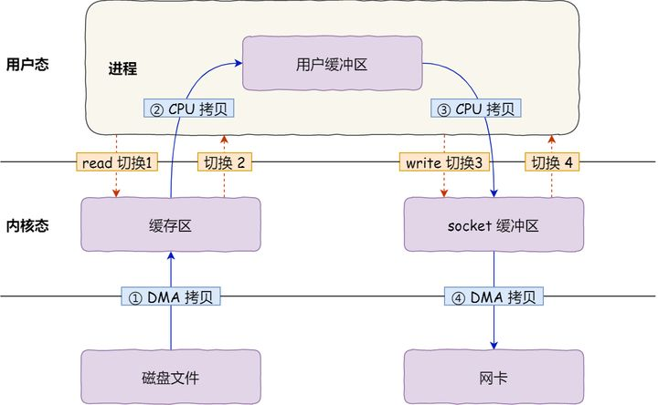

首先，期间共**发生了 4 次用户态与内核态的上下文切换**，因为发生了两次系统调用，一次是 `read()` ，一次是 `write()`，每次系统调用都得先从用户态切换到内核态，等内核完成任务后，再从内核态切换回用户态。

上下文切换到成本并不小，一次切换需要耗时几十纳秒到几微秒，虽然时间看上去很短，但是在高并发的场景下，这类时间容易被累积和放大，从而影响系统的性能。

其次，还**发生了 4 次数据拷贝**，其中两次是 DMA 的拷贝，另外两次则是通过 CPU 拷贝的，下面说一下这个过程：

- *第一次拷贝*，把磁盘上的数据拷贝到操作系统内核的缓冲区里，这个拷贝的过程是通过 DMA 搬运的。
- *第二次拷贝*，把内核缓冲区的数据拷贝到用户的缓冲区里，于是我们应用程序就可以使用这部分数据了，这个拷贝到过程是由 CPU 完成的。
- *第三次拷贝*，把刚才拷贝到用户的缓冲区里的数据，再拷贝到内核的 socket 的缓冲区里，这个过程依然还是由 CPU 搬运的。
- *第四次拷贝*，把内核的 socket 缓冲区里的数据，拷贝到网卡的缓冲区里，这个过程又是由 DMA 搬运的。

我们回过头看这个文件传输的过程，我们只是搬运一份数据，结果却搬运了 4 次，过多的数据拷贝无疑会消耗 CPU 资源，大大降低了系统性能。

这种简单又传统的文件传输方式，存在冗余的上文切换和数据拷贝，在高并发系统里是非常糟糕的，多了很多不必要的开销，会严重影响系统性能。

所以，**要想提高文件传输的性能，就需要减少「用户态与内核态的上下文切换」和「内存拷贝」的次数**。

------

### **如何优化文件传输的性能？**

> 先来看看，如何减少「用户态与内核态的上下文切换」的次数呢？

读取磁盘数据的时候，之所以要发生上下文切换，这是因为用户空间没有权限操作磁盘或网卡，内核的权限最高，这些操作设备的过程都需要交由操作系统内核来完成，所以一般要通过内核去完成某些任务的时候，就需要使用操作系统提供的系统调用函数。

而一次系统调用必然会发生 2 次上下文切换：首先从用户态切换到内核态，当内核执行完任务后，再切换回用户态交由进程代码执行。

所以，**要想减少上下文切换到次数，就要减少系统调用的次数**。

> 再来看看，如何减少「数据拷贝」的次数？

在前面我们知道了，传统的文件传输方式会历经 4 次数据拷贝，而且这里面，「从内核的读缓冲区拷贝到用户的缓冲区里，再从用户的缓冲区里拷贝到 socket 的缓冲区里」，这个过程是没有必要的。

因为文件传输的应用场景中，在用户空间我们并不会对数据「再加工」，所以数据实际上可以不用搬运到用户空间，因此**用户的缓冲区是没有必要存在的**。

------

### 实现零拷贝方式

零拷贝技术实现的方式通常有 2 种：

- mmap + write
- sendfile
- splice / Linux 内核 2.6.17

下面就谈一谈，它们是如何减少「上下文切换」和「数据拷贝」的次数。

#### **mmap + write**

在前面我们知道，`read()` 系统调用的过程中会把内核缓冲区的数据拷贝到用户的缓冲区里，于是为了减少这一步开销，我们可以用 `mmap()` 替换 `read()` 系统调用函数。

```text
buf = mmap(file, len);
write(sockfd, buf, len);
```

`mmap()` 系统调用函数会直接把内核缓冲区里的数据「**映射**」到用户空间，这样，操作系统内核与用户空间就不需要再进行任何的数据拷贝操作。

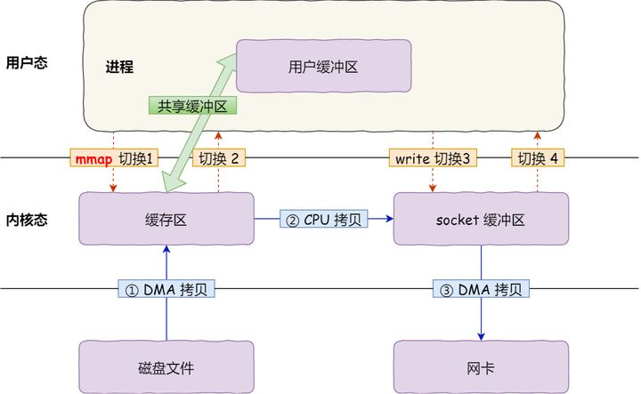

具体过程如下：

- 应用进程调用了 `mmap()` 后，DMA 会把磁盘的数据拷贝到内核的缓冲区里。接着，应用进程跟操作系统内核「共享」这个缓冲区；
- 应用进程再调用 `write()`，操作系统直接将内核缓冲区的数据拷贝到 socket 缓冲区中，这一切都发生在内核态，由 CPU 来搬运数据；
- 最后，把内核的 socket 缓冲区里的数据，拷贝到网卡的缓冲区里，这个过程是由 DMA 搬运的。

我们可以得知，通过使用 `mmap()` 来代替 `read()`， 可以减少一次数据拷贝的过程。

但这还不是最理想的零拷贝，因为仍然需要通过 CPU 把内核缓冲区的数据拷贝到 socket 缓冲区里，而且仍然需要 4 次上下文切换，因为系统调用还是 2 次。

#### **sendfile**

在 Linux 内核版本 `2.1` 中，提供了一个专门发送文件的系统调用函数 `sendfile()`，函数形式如下：

```text
#include <sys/socket.h>
ssize_t sendfile(int out_fd, int in_fd, off_t *offset, size_t count);
```

它的前两个参数分别是目的端和源端的文件描述符，后面两个参数是源端的偏移量和复制数据的长度，返回值是实际复制数据的长度。

首先，它可以替代前面的 `read()` 和 `write()` 这两个系统调用，这样就可以减少一次系统调用，也就减少了 2 次上下文切换的开销。

其次，该系统调用，可以直接把内核缓冲区里的数据拷贝到 socket 缓冲区里，不再拷贝到用户态，这样就只有 2 次上下文切换，和 3 次数据拷贝。如下图：

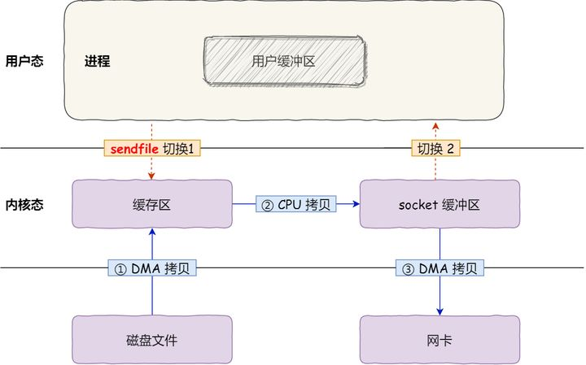

**但是这还不是真正的零拷贝技术**，如果网卡支持 **SG-DMA**（*The Scatter-Gather Direct Memory Access*）技术（和普通的 DMA 有所不同），我们可以进一步减少通过 CPU 把内核缓冲区里的数据拷贝到 socket 缓冲区的过程。

你可以在你的 Linux 系统通过下面这个命令，查看网卡是否支持 scatter-gather 特性：

```sh
$ ethtool -k eth0 | grep scatter-gather
scatter-gather: on
$ ethtool -k eth0 | grep scatter-gather
scatter-gather: on
        tx-scatter-gather: on
        tx-scatter-gather-fraglist: off [fixed]
```

于是，从 Linux 内核 `2.4` 版本开始起，对于支持网卡支持 SG-DMA 技术的情况下， `sendfile()` 系统调用的过程发生了点变化，具体过程如下：

- 第一步，通过 DMA 将磁盘上的数据拷贝到内核缓冲区里；
- 第二步，缓冲区描述符和数据长度传到 socket 缓冲区，这样网卡的 **SG-DMA 控制器**就可以直接将内核缓存中的数据拷贝到网卡的缓冲区里，此过程不需要将数据从操作系统内核缓冲区拷贝到 socket 缓冲区中，这样就减少了一次数据拷贝；

所以，这个过程之中，只进行了 2 次数据拷贝，如下图：

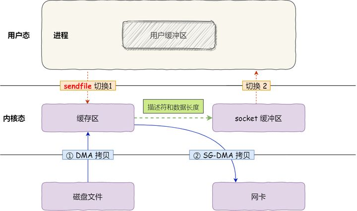

这就是所谓的**零拷贝（Zero-copy）技术，因为我们没有在内存层面去拷贝数据，也就是说全程没有通过 CPU 来搬运数据，所有的数据都是通过 DMA 来进行传输的。**。

零拷贝技术的文件传输方式相比传统文件传输的方式，减少了 2 次上下文切换和数据拷贝次数，**只需要 2 次上下文切换和数据拷贝次数，就可以完成文件的传输，而且 2 次的数据拷贝过程，都不需要通过 CPU，2 次都是由 DMA 来搬运。**

**sendFile缺点**：只适用于将数据从文件拷贝到套接字上，限定了它的使用范围。有的场景下，需要将数据从-个套接字直接拷贝到另一个套接字，例如代理服务器，这种场景下，sendFile无法满足需求:

所以，总体来看，**零拷贝技术可以把文件传输的性能提高至少一倍以上**。

MMap和sendfile的区别：

1. mmap 适合小数据量读写，sendFile 适合大文件传输。
2. mmap 需要4次上下文切换，3次数据拷贝; sendFile 需要两次次上下文切换，两次数据拷贝。
3. sendFile 可以利用DMA方式，减少CPU拷贝，mmap 则不能(必须从内核拷贝到Socket 缓冲区)。

#### splice

Linux在2.6.17版本引入`splice`系统调用，用于在两个文件描述符中移动数据


### 使用零拷贝技术的项目

事实上，Kafka 这个开源项目，就利用了「零拷贝」技术，从而大幅提升了I/O的吞吐率，这也是 Kafka 在处理海量数据为什么这么快的原因之一。

如果你追溯 Kafka 文件传输的代码，你会发现，最终它调用了 Java NIO 库里的 `transferTo` 方法：

```java
@Overridepublic
long transferFrom(FileChannel fileChannel, long position, long count) throws IOException {
    return fileChannel.transferTo(position, count, socketChannel);
}
```

如果 Linux 系统支持 `sendfile()` 系统调用，那么 `transferTo()` 实际上最后就会使用到 `sendfile()` 系统调用函数。

曾经有大佬专门写过程序测试过，在同样的硬件条件下，传统文件传输和零拷拷贝文件传输的性能差异，你可以看到下面这张测试数据图，使用了零拷贝能够缩短 `65%` 的时间，大幅度提升了机器传输数据的吞吐量。

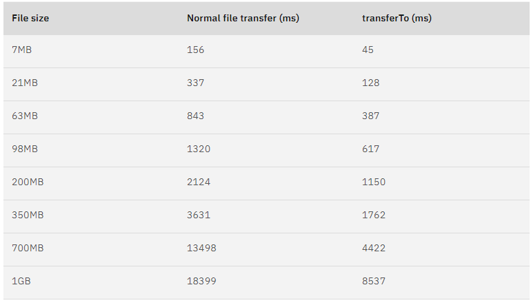

另外，Nginx 也支持零拷贝技术，一般默认是开启零拷贝技术，这样有利于提高文件传输的效率，是否开启零拷贝技术的配置如下：

```text
http {
...
    sendfile on
...
}
```

sendfile 配置的具体意思:

- 设置为 on 表示，使用零拷贝技术来传输文件：sendfile ，这样只需要 2 次上下文切换，和 2 次数据拷贝。
- 设置为 off 表示，使用传统的文件传输技术：read + write，这时就需要 4 次上下文切换，和 4 次数据拷贝。

当然，要使用 sendfile，Linux 内核版本必须要 2.1 以上的版本。

------

### **PageCache 有什么作用？**

回顾前面说道文件传输过程，其中第一步都是先需要先把磁盘文件数据拷贝「内核缓冲区」里，这个「内核缓冲区」实际上是**磁盘高速缓存（PageCache）**。

由于零拷贝使用了 PageCache 技术，可以使得零拷贝进一步提升了性能，我们接下来看看 PageCache 是如何做到这一点的。

读写磁盘相比读写内存的速度慢太多了，所以我们应该想办法把「读写磁盘」替换成「读写内存」。于是，我们会通过 DMA 把磁盘里的数据搬运到内存里，这样就可以用读内存替换读磁盘。

但是，内存空间远比磁盘要小，内存注定只能拷贝磁盘里的一小部分数据。

那问题来了，选择哪些磁盘数据拷贝到内存呢？

我们都知道程序运行的时候，具有「局部性」，所以通常，刚被访问的数据在短时间内再次被访问的概率很高，于是我们可以用 **PageCache 来缓存最近被访问的数据**，当空间不足时淘汰最久未被访问的缓存。

所以，读磁盘数据的时候，优先在 PageCache 找，如果数据存在则可以直接返回；如果没有，则从磁盘中读取，然后缓存 PageCache 中。

还有一点，读取磁盘数据的时候，需要找到数据所在的位置，但是对于机械磁盘来说，就是通过磁头旋转到数据所在的扇区，再开始「顺序」读取数据，但是旋转磁头这个物理动作是非常耗时的，为了降低它的影响，**PageCache 使用了「预读功能」**。

比如，假设 read 方法每次只会读 `32 KB` 的字节，虽然 read 刚开始只会读 0 ～ 32 KB 的字节，但内核会把其后面的 32～64 KB 也读取到 PageCache，这样后面读取 32～64 KB 的成本就很低，如果在 32～64 KB 淘汰出 PageCache 前，进程读取到它了，收益就非常大。

所以，PageCache 的优点主要是两个：

- 缓存最近被访问的数据；
- 预读功能；

这两个做法，将大大提高读写磁盘的性能。

**但是，在传输大文件（GB 级别的文件）的时候，PageCache 会不起作用，那就白白浪费 DMA 多做的一次数据拷贝，造成性能的降低，即使使用了 PageCache 的零拷贝也会损失性能**

这是因为如果你有很多 GB 级别文件需要传输，每当用户访问这些大文件的时候，内核就会把它们载入 PageCache 中，于是 PageCache 空间很快被这些大文件占满。

另外，由于文件太大，可能某些部分的文件数据被再次访问的概率比较低，这样就会带来 2 个问题：

- PageCache 由于长时间被大文件占据，其他「热点」的小文件可能就无法充分使用到 PageCache，于是这样磁盘读写的性能就会下降了；
- PageCache 中的大文件数据，由于没有享受到缓存带来的好处，但却耗费 DMA 多拷贝到 PageCache 一次；

所以，针对大文件的传输，不应该使用 PageCache，也就是说不应该使用零拷贝技术，因为可能由于 PageCache 被大文件占据，而导致「热点」小文件无法利用到 PageCache，这样在高并发的环境下，会带来严重的性能问题。

------

### **大文件传输用什么方式实现？**

那针对大文件的传输，我们应该使用什么方式呢？

我们先来看看最初的例子，当调用 read 方法读取文件时，进程实际上会阻塞在 read 方法调用，因为要等待磁盘数据的返回，如下图：

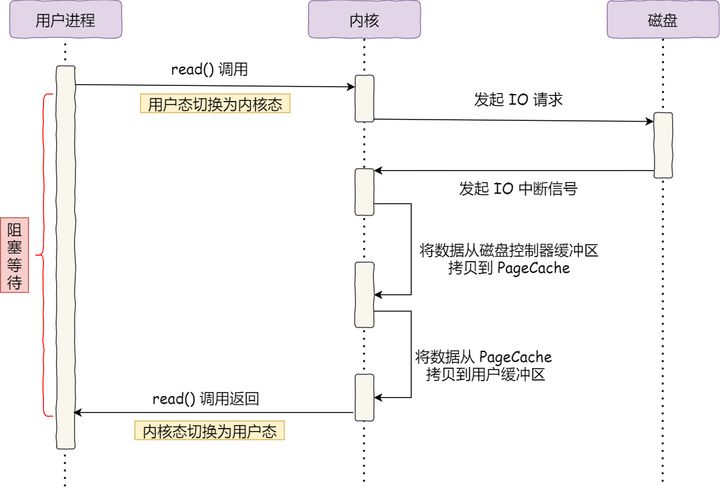

具体过程：

- 当调用 read 方法时，会阻塞着，此时内核会向磁盘发起I/O请求，磁盘收到请求后，便会寻址，当磁盘数据准备好后，就会向内核发起I/O中断，告知内核磁盘数据已经准备好；
- 内核收到I/O中断后，就将数据从磁盘控制器缓冲区拷贝到 PageCache 里；
- 最后，内核再把 PageCache 中的数据拷贝到用户缓冲区，于是 read 调用就正常返回了。

**对于阻塞的问题，可以用异步I/O来解决**，它工作方式如下图：

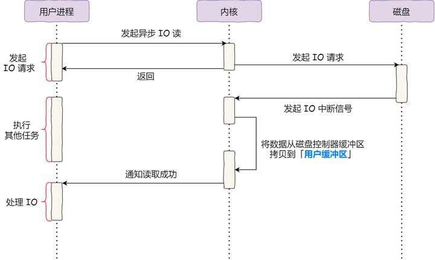

它把读操作分为两部分：

- 前半部分，内核向磁盘发起读请求，但是可以**不等待数据就位就可以返回**，于是进程此时可以处理其他任务；
- 后半部分，当内核将磁盘中的数据拷贝到进程缓冲区后，进程将接收到内核的**通知**，再去处理数据；

而且，我们可以发现，异步I/O并没有涉及到 PageCache，所以**使用异步I/O就意味着要绕开 PageCache**。

**绕开 PageCache 的 I/O 叫直接 I/O**，**使用 PageCache 的 I/O 则叫缓存 I/O**。通常，对于磁盘，异步I/O只支持直接 I/O。

前面也提到，大文件的传输不应该使用 PageCache，因为可能由于 PageCache 被大文件占据，而导致「热点」小文件无法利用到 PageCache。

于是，**在高并发的场景下，针对大文件的传输的方式，应该使用「异步I/O + 直接 I/O」来替代零拷贝技术**。

**直接I/O应用场景**常见的两种：

- 应用程序已经实现了磁盘数据的缓存，那么可以不需要 PageCache 再次缓存，减少额外的性能损耗。**在 MySQL 数据库中，可以通过参数设置开启直接 I/O，默认是不开启；**
- 传输大文件的时候，由于大文件难以命中 PageCache 缓存，而且会占满 PageCache 导致「热点」文件无法充分利用缓存，从而增大了性能开销，因此，这时应该使用直接 I/O。

另外，由于直接I/O绕过了 PageCache，就无法享受内核的这两点的优化：

- 内核的I/O调度算法会缓存尽可能多的I/O请求在 PageCache 中，最后「**合并**」成一个更大的I/O请求再发给磁盘，这样做是为了减少磁盘的寻址操作；
- 内核也会「**预读**」后续的I/O请求放在 PageCache 中，一样是为了减少对磁盘的操作；

于是，传输大文件的时候，使用「异步I/O+ 直接 I/O」了，就可以无阻塞地读取文件了。

所以，传输文件的时候，我们要根据文件的大小来使用不同的方式：

- 传输大文件的时候，使用「异步I/O+ 直接 I/O」；
- 传输小文件的时候，则使用「零拷贝技术」；

在 nginx 中，我们可以用如下配置，来根据文件的大小来使用不同的方式：

```text
location /video/ {
    sendfile on;
    aio on;
    directio 1024m;
}
```

当文件大小大于 `directio` 值后，使用「异步I/O+ 直接 I/O」，否则使用「零拷贝技术」。

------

### **总结**

早期I/O操作，内存与磁盘的数据传输的工作都是由 CPU 完成的，而此时 CPU 不能执行其他任务，会特别浪费 CPU 资源。

于是，为了解决这一问题，DMA 技术就出现了，每个I/O设备都有自己的 DMA 控制器，通过这个 DMA 控制器，CPU 只需要告诉 DMA 控制器，我们要传输什么数据，从哪里来，到哪里去，就可以放心离开了。后续的实际数据传输工作，都会由 DMA 控制器来完成，CPU 不需要参与数据传输的工作。

传统 IO 的工作方式，从硬盘读取数据，然后再通过网卡向外发送，我们需要进行 4 上下文切换，和 4 次数据拷贝，其中 2 次数据拷贝发生在内存里的缓冲区和对应的硬件设备之间，这个是由 DMA 完成，另外 2 次则发生在内核态和用户态之间，这个数据搬移工作是由 CPU 完成的。

为了提高文件传输的性能，于是就出现了零拷贝技术，它通过一次系统调用（`sendfile` 方法）合并了磁盘读取与网络发送两个操作，降低了上下文切换次数。另外，拷贝数据都是发生在内核中的，天然就降低了数据拷贝的次数。

Kafka 和 Nginx 都有实现零拷贝技术，这将大大提高文件传输的性能。

零拷贝技术是基于 PageCache 的，PageCache 会缓存最近访问的数据，提升了访问缓存数据的性能，同时，为了解决机械硬盘寻址慢的问题，它还协助I/O调度算法实现了 IO 合并与预读，这也是顺序读比随机读性能好的原因。这些优势，进一步提升了零拷贝的性能。

需要注意的是，零拷贝技术是不允许进程对文件内容作进一步的加工的，比如压缩数据再发送。

另外，当传输大文件时，不能使用零拷贝，因为可能由于 PageCache 被大文件占据，而导致「热点」小文件无法利用到 PageCache，并且大文件的缓存命中率不高，这时就需要使用「异步 IO + 直接 IO 」的方式。

在 Nginx 里，可以通过配置，设定一个文件大小阈值，针对大文件使用异步 IO 和直接 IO，而对小文件使用零拷贝。

## **絮叨**

小林在知乎写了很多**图解网络和操作系统**的系列文章，很高兴收获到很多知乎朋友的认可和支持，正好最近图解网络和操作系统的文章连载的有 **20+ 篇**了，也算有个体系了。

所以为了方便知乎的朋友们阅读，**小林把自己原创的图解网络和图解操作系统整理成了 PDF**，一整理后，没想到每个图解都输出了 **15 万字 + 500 张图，**质量也是杠杠的，有很多朋友特地私信我，看了我的图解拿到了大厂的offer。

**图解系统 PDF 开源下载：**

突击大厂面试，图解系统开放下载！mp.weixin.qq.com/s/K_BFbsvC27cU3by6vmzdUA

**图解网络 PDF 开源下载：**

突击大厂面试，图解网络开放下载！mp.weixin.qq.com/s/_23WhJ9bOV9vjRq5EXsaXA_

最后祝大家前程似锦，在编码的道路上一马平川。

如果文章对你帮助的话，可以给[@小林coding](https://www.zhihu.com/people/b99d048edd00b50737e17328ffb2bf2c) **点个赞，点个收藏，评论下更先显温情！**

# 5分钟搞懂Linux中直接I/O原理

在介绍直接I/O之前，先来介绍下直接I/O这种机制产生的原因。毕竟已经有了缓存I/O（Buffered I/O），那肯定能够像到缓存I/O有缺陷吧，就按照这个思路来。

## 什么是缓存I/O(Buffered I/O)

缓存I/O又被称作标准 I/O，大多数文件系统的默认I/O操作都是缓存 I/O。在 Linux 的缓存I/O机制中，**操作系统会将I/O的数据缓存在文件系统的页缓存（ page cache ）中，也就是说，数据会先被拷贝到操作系统内核的缓冲区中，然后才会从操作系统内核的缓冲区拷贝到应用程序的地址空间**。**写的过程就是数据流反方向**。

缓存I/O有以下这些优点：

1. 缓存I/O使用了操作系统内核缓冲区，在一定程度上分离了应用程序空间和实际的物理设备。
2. 缓存I/O可以减少读盘的次数，从而提高性能。

**对于读操作**：当应用程序要去读取某块数据的时候，如果这块数据已经在页缓存中，那就返回之。而不需要经过硬盘的读取操作了。如果这块数据不在页缓存中，就需要从硬盘中读取数据到页缓存。

**对于写操作**：应用程序会将数据先写到页缓存中，数据是否会被立即写到磁盘，这取决于所采用的写操作机制：

- 同步机制，数据会立即被写到磁盘中，直到数据写完，写接口才返回；
- 延迟机制：写接口立即返回，操作系统会定期地将页缓存中的数据刷到硬盘。所以这个机制会存在丢失数据的风险。想象下写接口返回的时候，页缓存的数据还没刷到硬盘，正好断电。对于应用程序来说，认为数据已经在硬盘中。

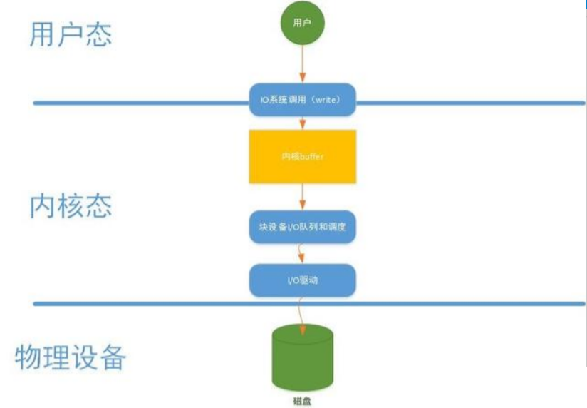

## 缓存I/O的缺点

在缓存I/O的机制中，以写操作为例，**数据先从用户态拷贝到内核态中的页缓存中，然后又会从页缓存中写到磁盘中，**这些拷贝操作带来的CPU以及内存的开销是非常大的。

对于某些特殊的应用程序来说，能够绕开内核缓冲区能够获取更好的性能，这就是**直接I/O**出现的意义。

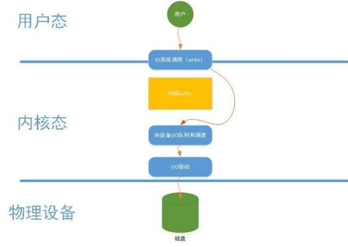

## 直接I/O介绍

凡是通过**直接I/O**方式进行数据传输，**数据直接从用户态地址空间写入到磁盘中**，直接跳过内核缓冲区。对于一些应用程序，例如：数据库。他们更倾向于自己的缓存机制，这样可以提供更好的缓冲机制提高数据库的读写性能。**直接I/O**写操作如上图所示。

## 直接I/O设计与实现

要在块设备中执行直接 I/O，进程必须在打开文件的时候设置对文件的访问模式为 **O_DIRECT**，这样就等于告诉操作系统进程在接下来使用 **read**() 或者 **write**() 系统调用去读写文件的时候使用的是**直接 I/O** 方式，所传输的数据均不经过操作系统内核缓存空间。使用**直接 I/O** 读写数据必须要注意**缓冲区对齐**（ buffer alignment ）以及缓冲区的大小的问题，即对应 read() 以及 write() 系统调用的第二个和第三个参数。这里边说的对齐指的是文件系统块大小的对齐，缓冲区的大小也必须是该块大小的整数倍。

下面主要介绍三个函数：open()，read() 以及 write()。Linux 中访问文件具有多样性，所以这三个函数对于处理不同的文件访问方式定义了不同的处理方法，本文主要介绍其与直接I/O方式相关的函数与功能．首先，先来看 open() 系统调用，其函数原型如下所示：

```c
int open(const char *pathname, int oflag, … /*, mode_t mode * / ) ;
```

当应用程序需要直接访问文件而不经过操作系统页高速缓冲存储器的时候，它打开文件的时候需要指定 **O_DIRECT** 标识符。

操作系统内核中处理 open() 系统调用的内核函数是 **sys_open**()，**sys_open**() 会调用 **do_sys_open**() 去处理主要的打开操作。它主要做了三件事情：

1. 调用 getname() 从进程地址空间中读取文件的路径名；
2. do_sys_open() 调用 get_unused_fd() 从进程的文件表中找到一个空闲的文件表指针，相应的新文件描述符就存放在本地变量 fd 中；
3. 函数 do_filp_open() 会根据传入的参数去执行相应的打开操作。

下面列出了操作系统内核中处理 open() 系统调用的一个主要函数关系图。

```javascript
sys_open()
 |-----do_sys_open()
 |---------getname()
 |---------get_unused_fd()
 |---------do_filp_open()
 |--------nameidata_to_filp()
 |----------__dentry_open()
```

函数 **do_flip_open**() 在执行的过程中会调用函数 **nameidata_to_filp**()，而 **nameidata_to_filp**() 最终会调用 **__dentry_open**() 函数，若进程指定了 **O_DIRECT** 标识符，则该函数会检查直接I/O操作是否可以作用于该文件。下面列出了 __dentry_open() 函数中与直接I/O操作相关的代码。

```c
if (f->f_flags & O_DIRECT) {
  if (!f->f_mapping->a_ops ||
      ((!f->f_mapping->a_ops->direct_IO) &&
       (!f->f_mapping->a_ops->get_xip_page))) {
    fput(f);
    f = ERR_PTR(-EINVAL);
  }
}
```

当文件打开时指定了 **O_DIRECT** 标识符，那么操作系统就会知道接下来对文件的读或者写操作都是要使用直接I/O方式的。

下边我们来看一下当进程通过 read() 系统调用读取一个已经设置了 O_DIRECT 标识符的文件的时候，系统都做了哪些处理。 函数 read() 的原型如下所示：

```javascript
ssize_t read(int feledes, void *buff, size_t nbytes) ;
```

操作系统中处理 read() 函数的入口函数是 sys_read()，其主要的调用函数关系图如下：

```javascript
sys_read()
 |-----vfs_read()
 |----generic_file_read()
 |----generic_file_aio_read()
 |--------- generic_file_direct_IO()
```

函数 sys_read() 从进程中获取文件描述符以及文件当前的操作位置后会调用 vfs_read() 函数去执行具体的操作过程，而 vfs_read() 函数最终是调用了 file 结构中的相关操作去完成文件的读操作，即调用了 generic_file_read() 函数，其代码如下所示：

```c
ssize_t  generic_file_read(struct file *filp,   char __user *buf, size_t count, loff_t *ppos)
{
  struct iovec local_iov = { .iov_base = buf, .iov_len = count };
  struct kiocb kiocb;
  ssize_t ret;

  init_sync_kiocb(&kiocb, filp);
  ret = __generic_file_aio_read(&kiocb, &local_iov, 1, ppos);
  if (-EIOCBQUEUED == ret)
    ret = wait_on_sync_kiocb(&kiocb);
  return ret;
}
```

函数 generic_file_read() 初始化了 iovec 以及 kiocb 描述符。描述符 iovec 主要是用于存放两个内容：用来接收所读取数据的用户地址空间缓冲区的地址和缓冲区的大小；描述符 kiocb 用来跟踪I/O操作的完成状态。之后，函数 generic_file_read() 凋用函数 __generic_file_aio_read()。该函数检查 iovec 中描述的用户地址空间缓冲区是否可用，接着检查访问模式，若访问模式描述符设置了 O_DIRECT，则执行与直接I/O相关的代码。函数 __generic_file_aio_read() 中与直接I/O有关的代码如下所示：

```c
if (filp->f_flags & O_DIRECT) {  
  loff_t pos = *ppos, size;  
  struct address_space *mapping;  
  struct inode *inode;  

  mapping = filp->f_mapping;  
  inode = mapping->host;  
  retval = 0;  
  if (!count)  
    goto out;  
  size = i_size_read(inode);  
  if (pos < size) {  
    retval = generic_file_direct_IO(READ, iocb,  
                                    iov, pos, nr_segs);  
    if (retval > 0 && !is_sync_kiocb(iocb))  
      retval = -EIOCBQUEUED;  
    if (retval > 0)  
      *ppos = pos + retval;  
  }  
  file_accessed(filp);  
  goto out;  
} 
```

上边的代码段主要是检查了文件指针的值，文件的大小以及所请求读取的字节数目等，之后，该函数调用 generic_file_direct_io()，并将操作类型 READ，描述符 iocb，描述符 iovec，当前文件指针的值以及在描述符 io_vec 中指定的用户地址空间缓冲区的个数等值作为参数传给它。当 generic_file_direct_io() 函数执行完成，函数 __generic_file_aio_read（）会继续执行去完成后续操作：更新文件指针，设置访问文件 i 节点的时间戳；这些操作全部执行完成以后，函数返回。 函数 generic_file_direct_IO() 会用到五个参数，各参数的含义如下所示：

1. rw：操作类型，可以是 READ 或者 WRITE
2. iocb：指针，指向 kiocb 描述符　
3. iov：指针，指向 iovec 描述符数组
4. offset：file 结构偏移量
5. nr_segs：iov 数组中 iovec 的个数

函数 generic_file_direct_IO() 代码如下所示：

```c
static ssize_t  generic_file_direct_IO(int rw, struct kiocb *iocb, const struct iovec *iov,  loff_t offset, unsigned long nr_segs)  
{  
  struct file *file = iocb->ki_filp;  
  struct address_space *mapping = file->f_mapping;  
  ssize_t retval;  
  size_t write_len = 0;  

  if (rw == WRITE) {  
    write_len = iov_length(iov, nr_segs);  
    if (mapping_mapped(mapping))  
      unmap_mapping_range(mapping, offset, write_len, 0);  
  }  

  retval = filemap_write_and_wait(mapping);  
  if (retval == 0) {  
    retval = mapping->a_ops->direct_IO(rw, iocb, iov,  
                                       offset, nr_segs);  
    if (rw == WRITE && mapping->nrpages) {  
      pgoff_t end = (offset + write_len - 1)  
      >> PAGE_CACHE_SHIFT;  
      int err = invalidate_inode_pages2_range(mapping,  
                                              offset >> PAGE_CACHE_SHIFT, end);  
      if (err)  
        retval = err;  
    }  
  }  
  return retval;  
} 
```

函数 generic_file_direct_IO() 对 WRITE 操作类型进行了一些特殊处理。除此之外，它主要是调用了 direct_IO 方法去执行直接I/O的读或者写操作。在进行直接I/O读操作之前，先将页缓存中的相关脏数据刷回到磁盘上去，这样做可以确保从磁盘上读到的是最新的数据。这里的 direct_IO 方法最终会对应到 __blockdev_direct_IO() 函数上去。__blockdev_direct_IO() 函数的代码如下所示：

```javascript
ssize_t  __blockdev_direct_IO(int rw, struct kiocb *iocb, struct inode *inode,  
                              struct block_device *bdev, const struct iovec *iov, loff_t offset,  
                              unsigned long nr_segs, get_block_t get_block, dio_iodone_t end_io,  
                              int dio_lock_type)  
{  
  int seg;  
  size_t size;  
  unsigned long addr;  
  unsigned blkbits = inode->i_blkbits;  
  unsigned bdev_blkbits = 0;  
  unsigned blocksize_mask = (1 << blkbits) - 1;  
  ssize_t retval = -EINVAL;  
  loff_t end = offset;  
  struct dio *dio;  
  int release_i_mutex = 0;  
  int acquire_i_mutex = 0;  

  if (rw & WRITE)  
    rw = WRITE_SYNC;  

  if (bdev)  
    bdev_blkbits = blksize_bits(bdev_hardsect_size(bdev));  

  if (offset & blocksize_mask) {  
    if (bdev)  
      blkbits = bdev_blkbits;  
    blocksize_mask = (1 << blkbits) - 1;  
    if (offset & blocksize_mask)  
      goto out;  
  }  

  for (seg = 0; seg < nr_segs; seg++) {  
    addr = (unsigned long)iov[seg].iov_base;  
    size = iov[seg].iov_len;  
    end += size;  
    if ((addr & blocksize_mask) || (size & blocksize_mask)) {  
      if (bdev)  
        blkbits = bdev_blkbits;  
      blocksize_mask = (1 << blkbits) - 1;  
      if ((addr & blocksize_mask) || (size & blocksize_mask))  
        goto out;  
    }  
  }  

  dio = kmalloc(sizeof(*dio), GFP_KERNEL);  
  retval = -ENOMEM;  
  if (!dio)  
    goto out;  
  dio->lock_type = dio_lock_type;  
  if (dio_lock_type != DIO_NO_LOCKING) {  
    if (rw == READ && end > offset) {  
      struct address_space *mapping;  

      mapping = iocb->ki_filp->f_mapping;  
      if (dio_lock_type != DIO_OWN_LOCKING) {  
        mutex_lock(&inode->i_mutex);  
        release_i_mutex = 1;  
      }  

      retval = filemap_write_and_wait_range(mapping, offset,  
                                            end - 1);  
      if (retval) {  
        kfree(dio);  
        goto out;  
      }  

      if (dio_lock_type == DIO_OWN_LOCKING) {  
        mutex_unlock(&inode->i_mutex);  
        acquire_i_mutex = 1;  
      }  
    }  

    if (dio_lock_type == DIO_LOCKING)  
      down_read_non_owner(&inode->i_alloc_sem);  
  }  

  dio->is_async = !is_sync_kiocb(iocb) && !((rw & WRITE) &&  
                                            (end > i_size_read(inode)));  

  retval = direct_io_worker(rw, iocb, inode, iov, offset,  
                            nr_segs, blkbits, get_block, end_io, dio);  

  if (rw == READ && dio_lock_type == DIO_LOCKING)  
    release_i_mutex = 0;  

  out:  
  if (release_i_mutex)  
    mutex_unlock(&inode->i_mutex);  
  else if (acquire_i_mutex)  
    mutex_lock(&inode->i_mutex);  
  return retval;  
} 
```

该函数将要读或者要写的数据进行拆分，并检查缓冲区对齐的情况。本文在前边介绍 **open**() 函数的时候指出，使用直接I/O读写数据的时候必须要注意缓冲区对齐的问题，从上边的代码可以看出，缓冲区对齐的检查是在 **__blockdev_direct_IO**() 函数里边进行的。用户地址空间的缓冲区可以通过 iov 数组中的 iovec 描述符确定。直接I/O的读操作或者写操作都是同步进行的，也就是说，函数 **__blockdev_direct_IO**() 会一直等到所有的I/O操作都结束才会返回，因此，一旦应用程序 read() 系统调用返回，应用程序就可以访问用户地址空间中含有相应数据的缓冲区。但是，这种方法在应用程序读操作完成之前不能关闭应用程序，这将会导致关闭应用程序缓慢。

## 直接I/O 优点

最大的优点就是减少操作系统缓冲区和用户地址空间的拷贝次数。降低了CPU的开销，和内存带宽。对于某些应用程序来说简直是福音，将会大大提高性能。

## 直接I/O 缺点

直接IO并不总能让人如意。直接IO的开销也很大，应用程序没有控制好读写，将会导致磁盘读写的效率低下。磁盘的读写是通过磁头的切换到不同的磁道上读取和写入数据，如果需要写入数据在磁盘位置相隔比较远，就会导致寻道的时间大大增加，写入读取的效率大大降低。

## 总结

直接IO方式确实能够减少CPU的使用率以及内存带宽的占用，但是有时候也会造成性能的影响。所以在使用直接IO之前一定要清楚它的原理，只有在各项都清晰的情况下，才考虑使用。本人只是介绍了原理，如想深入，建议参考内核相关文档。

