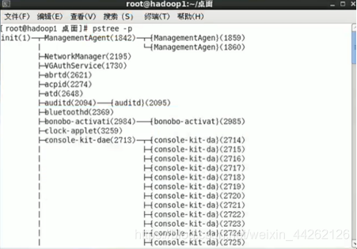
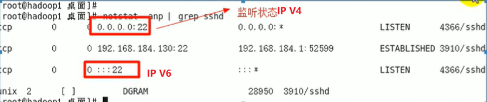

# Linux超全面总结

————————————————
原文链接：https://blog.csdn.net/weixin_44262126/article/details/108217320

## 1 Linux入门

### 1.1 为什么是Linux

Linux是一个开源、免费的操作系统，其稳定性、安全性和处理多并发等已经受到业界的认可，同时，由于是Linux是开源的，所以，用户可以根据自己的需求修改代码，在商业使用上还不会像Windows一样有很多局限性。

Linux是在伟大的GNU计划上产生的，它建立在Unix的基础上。GNU计划表示操作系统上的任何软件都应该是开源的，而且是可以任意删除与修改的。


上述图像表示：应用程序→shell命令解释器→Linux内核→硬件。

### 1.2 为什么是CentOS，而不是其他Linux发行版

Linux发行版有很多，包括CentOS、Ubantu、红帽等。我们之所以用CentOS，是因为大数据的开发一般都在CentOS上运行的，Python一般都是在Ubantu上运行。

### 1.3 什么是虚拟机

虚拟机就像是一个虚拟的计算机，当配置好这个计算机的内存、网络等一系列硬件后，就可以在上面安装系统。

常用的虚拟机软件是Vmware，我们可以在该软件上安装CentOS或者Ubantu操作系统。

## 2 VMware、CentOS的安装

### 2.1 手动安装

自己动手一步步安装CentOS，而不是用VMware软件的傻瓜式安装。安装文档和安装包在如下链接，
链接：https://pan.baidu.com/s/14yTMA6B6t48xqfnI4mrwRw
提取码：ming

### 2.2 自动安装

用安装好的VMware的自动安装来安装CentOS，真的太香了。

### 2.3 走过的弯路

1） 如果不用VMware的自动安装，而是按照教程安装，要时刻做好系统崩溃的准备。
2） 虚拟机中系统的关机千万不能用直接关闭虚拟机来解决，而是在该系统中老老实实的点关机，不然该系统很容易奔溃。这一点很容易理解，就像我们自己电脑的windows一样。
3） 如果自己安装VMware tools的话，我之前也写了一个教程，但是这只是不是再VMware的自动安装下才有的，如果是VMware的自动安装，它会自动安装。
4） 推荐先按照这份教程手动的安装，先了解一下Linux的很多细节，后期再通过VMware自动安装。
5） 在配置虚拟机时，网络连接存在三种方式，包括桥接模式、网络地址转化模式（NAT-Network Address Transaction）、主机模式，我们一般选择NAT模式。三者的区别如下：


如上图所示，

NAT模式的意思就是我的电脑上单独产生一个字段与虚拟机连接。
好处与坏处：

虚拟机不占用其他的ip,所以不会ip冲突
内网的其他人不能和虚拟机通讯

桥接模式则是，我的电脑上不单独产生一个字段与虚拟机连接，该实验室网络环境下，包括虚拟机、我的电脑、同事小乐的电脑都用的是192.168.14.x字段。
好处与坏处：

内网的其他人可以和虚拟机通讯。
一个网址的最后一位，0是保留地址，255是广播地址，1是网关地址，所以，桥接模式中，最多只能有253台服务器。

主机模式则是把虚拟机单独看成一台新的主机来对待。（不常用）

 

## 3 Linux的目录结构

### 3.1 介绍

与Windows不同的是，在Linux中，万物都可以当成文件来对待。即使是一个硬件设备，在Linux中，也是使用文本来标记。如下图，硬件对应的是不同目录下的文件：


Linux的目录结构：linux 的文件系统是采用级层式的树状目录结构，在此结构中的最上层是根目录“/”，然后在此目录下再创建其他的目录。

### 3.2 Linux的文件目录树


另外还有五个目录，分别是：

**/boot**：分区：用于Linux系统的启动
**/swap**：分区：虚拟内存。作用是当我的物理内存不够用的时候，可以临时作为虚拟内存
**/proc**：这个目录是一个虚拟的目录，它是系统内存的映射，访问这个目录来获取系统信息
**/srv**：service缩写，该目录存放一些服务启动之后需要提取的数据
**/sys**：这是linux2.6内核的一个很大的变化。该目录下安装了2.6内核中新出现的一个文件系统 sysfs


## 4 远程管理Linux

Xshell5对应的是命令行的管理，XFtp5对应的是文件的上传和下载。安装包在这里：
链接：https://pan.baidu.com/s/1TDuSI8JjFhwCzPtF_GFC3A
提取码：ming

备注：在工作中，大部分时候，我们都是用命令行远程管理Linux服务器的，这也就是为什么我们要通过这两个工具来连接到自己电脑中VMware中CentOS的原因。

## 5 Vi和Vim编辑器

所有的Linux系统都会内建Vi文本编辑器。Vim 具有程序编辑的能力，可以看做是Vi 的增强版本，可以主动的以字体颜色辨别语法的正确性，方便程序设计。代码补完、编译及错误跳转等方便编程的功能特别丰富，在程序员中被广泛使用。

### 5.1 Vim三种模式的切换

有个地方需要修改一下，就是去掉图中命令模式到命令行的三个选择的冒号。


| 选项 | 作用                 |
| ---- | -------------------- |
| q    | 离开vim              |
| q!   | 不想保存修改强制离开 |
| wq   | 保存后离开           |

### 5.2 Vim常用的快捷键

    拷贝当前行：yy,拷贝当前行向下的5行：5yy。粘贴：p。【一般模式】
    删除当前行：dd,删除当前行向下的5行：5dd 【一般模式】
    在文件中查找某个单词 【命令模式下：/关键字，回车查找,输入n就是查找下一个】
    编辑/etc/profile文件，使用快捷键到底文档的最末行[G]和最首行[gg]【一般模式下】
    在一个文件中输入“hello”,然后又撤销这个动作u【一般模式下】

备注：更多Vim快捷键请点击：[Vim快捷键](https://www.cnblogs.com/markleaf/p/7808817.html)

## 6 Linux用户、组与权限管理

### 6.1 为什么需要Linux不同用户

因为在实际的工作中，是不可能让每一个人都用最高管理权限的root用户，只能是让他们用到低第一级的用户权限。登录时尽量少用root帐号登录，因为它是系统管理员，最大的权限，避免操作失误。

如果在操作中真的需要管理员权限，可以利用普通用户登录，登录后再用”su-root’命令来切换成系统管理员身份。

### 6.2 用户组管理

在linux中每个文件有所有者、所在组、其它组的概念。用户组是为了让系统可以对有共性的多个用户进行统一的管理。

当我们创建一个用户后，默认会在/home/xx 创建一个和用户名相同的目录，该目录就是该用户的家目录。当一个新用户登录后，默认会切换到/home/xx下。一个用户默认是不能进入到其他用户的该目录下。

### 6.2.1 新建以及删除用户

Linux 系统是一个多用户多任务的操作系统，任何一个要使用系统资源的用户，都必须首先向系统管理员申请一个账号，然后以这个账号的身份进入系统。

    useradd -d(可以不加，不加的话默认放在/home) 新的用户名 【root用户下】
    在root用户下，用su–切换到其他用户不需要填密码，反正，则需要填root的密码。
    当需要返回到原来用户时，使用exit指令
    如果su–没有带用户名，则默认切换到root用户
    passwd sharm 普通用户更新密码(sharm为我的普通用户)
    删除用户和用户主目录用：userdel [-r 目录] [用户名] (一般在实际工作中保留主目录，那就是userdel [用户名])

### 6.2.2 组管理

1）文件/目录的所有者一般为文件的创建者，谁创建了该文件，就自然的成为该文件的所有者。

2）查看文件的所有者与所在组的指令——ls ahl (第一个为所有者名称，第二个为所在组名称)

3）组自身的一些命令：

    增加组：groupadd lab
    新增一个用户，并且将他指定到一个新增的组中 groupadd -g lab sharm（当这个语句用不了的话就只能是一步一步操作）

4）文件与组的一些操作：

    修改文件的所有者：chown 用户名 文件名 （修改文件的所有者时，它的所在组还是属于原来的组）
    运用chown同时修改所有者和所有组：chown newowner:newgroup 文件名
    修改文件所在的组： chgrp 组名 文件名
    删除组：groupdel lab (前提是这个组里没有用户了)

5）所有者与所在组之间的一些操作

    在已有组中添加一个新用户： useradd -g 组名 新用户
    修改所有者的所在组：usermod -g 新的组名 用户
    改变该用户登陆的初始目录：usermod –d 目录名 用户名

备注：文件的所在组不一定是所有者的所在组。

### 6.2.3 用户和组的相关文件

/etc/passwd 文件——用户（user）的配置文件，记录用户的各种信息
每行的含义：用户名:口令:用户标识号:组标识号:注释性描述:主目录:登录Shell
/etc/shadow 文件——口令的配置文件
每行的含义：登录名:加密口令:最后一次修改时间:最小时间间隔:最大时间间隔:警告时间:不活动时间:失效时间:保留
/etc/group 文件——组(group)的配置文件，记录Linux包含的组的信息
每行的含义：组名:口令:组标识号:组内用户列表（一般是看不到的）

### 6.3 关机与重启

    shutdown -h now(立刻关机)           shutdown -h 1 (一分钟后关机) ，其中h表示halt，关机
    shotdown -r now (立刻重启)           shutdown -r 2 (二分钟后重启 ) ，其中r表示reboot，重启

注意：在关机和重启前，一定要打入sync 将内存的数据写入磁盘。

### 6.4 运行级别

Linux的几个运行级别如下图所示：


常用的运行级别是3和5。我们在主界面下的运行级别就是5，用Xshell登录就是3。如果要修改默认的运行级别，可通过vim来修改/ect/inittab文件中的 id:5:initdefault: 这一行中的数字。或者直接在终端的命令行输入：init 5。

例题：当忘记root密码时，如何找回密码：

启动时->快速输入 enter->输入 e-> 进入到编辑界面-> 选择中间有 kernel 项->输入 e(edit)-> 在该行的最后写入 1 [表示修改内核，临时生效]-> 输入 enter->输入 b [boot]-> 进入到单用模式。

## 7 Linux实用指令

### 7.1 帮助指令

7.1.2 man [命令或者配置文件]

示例： man cd 查看cd命令的作用（全而杂）
7.1.2 help [命令]

示例： help cd 查看cd命令的作用

### 7.2 文件和目录相关的指令

7.2.1 pwd

该命令行的意思就是print working directory，显示当前工作目录的绝对路径。
7.2.2 ls [选项] 显示当前目录下的文件和目录

选项：
-a ：显示当前目录所有的文件和目录，包括隐藏的 (文件名以.开头就是隐藏，默认是不显示的)
-l ： 以列表的方式显示信息
-h ： 显示文件大小时，以 k , m, G 单位显示
示例：

    ls -alh 显示当前目录的全部文件和目录
    ls -alh /home 显示/home目录的全部文件和目录

7.2.3 cd [选项] 进入到某个目录

示例：

    cd ~或者cd: 回到自己的家目录
    cd … 回到当前目录的上一级目录
    cd ./tp 到当前目录的tp目录下

绝对路径和相对路径：


7.2.4 mkdir

该命令行的意思就是make directory，新建一个文件夹（目录）

示例：

    单级目录：mkdir 目录名 mkdir sharm 创建sharm这个文件夹
    多级目录：mkdir –p 目录名 【指的是中间的目录不存在也能直接创建，一次可以创建多级文件夹】

7.2.5 touch [文件名] [文件名] ……

创建一个或者多个空文件，如果文件存在，则刷新文件的修改时间
7.2.6 rmdir [空目录]

只能删除空目录
7.2.7 remove [文件名]

删除文件
7.2.8 rm -rf [空目录或者非空目录]

删除空或者非空目录，其中选项r表示文件与子目录全部删除，f表示全部删除，不需要询问
7.2.9 clear 或者 Ctrl+L

清除bash上的命令行
7.2.10 cp [选项] [source源] [dest目的文件]

选项为-r表示递归复制整个文件夹
7.2.11 mv

移动文件或者重命名

示例：

    将 /home/aaa.txt 文件 重新命名为 pig.txt
    mv /home/aaa.txt /home/pig/txt
    将 /home/pig.txt 文件 移动到 /root 目录下
    mv /home/pig.txt /root/
    将/sharm目录下的dataset文件夹移动到/sharm目录下的/Tumor下
    mv /sharm/dataset /sharm/tumor/

7.2.12 cat [选项 -n表示显示行号]

以只读形式打开文件

说明：
如果需要一行行，输入 enter；
如果需要翻页，输入空格键；
如果需要退出，输入 q。
7.2.13 more

采用more来查看文件

说明：
空格键 代表向下翻一页；
enter 代表向下翻一行；
q 代表立刻离开 more ，不再显示该文件内容；
ctrl+F 表示向下滚动一屏；
ctrl+B 表示返回上一屏；
= 表示输出当前行的行号。
7.2.14 less

和more的功能类似，但是其并不是一次将整个文件加载进来再显示，而是根据需要再显示，之后看大型的日志一般推荐less。
选项：


7.2.15 >与 >>

单个>：输出重定向指令 （会将原来的文件的内容跟覆盖）
两个>>：追加指令 （不会覆盖原来文件的内容，而是追加到文件的尾部）

示例：

    ls -l >sharm.txt （功能描述：列表的内容写入文件sharm.txt中（覆盖写））
    ls -l >>sharm.txt （功能描述：列表的内容追加到文件sharm.txt的末尾）
    cat 文件1 > 文件2 （功能描述：将文件1的内容覆盖到文件2）
    cat 文件1 >> 文件2 （功能描述：将文件1的内容追加到到文件2末尾）
    echo “内容”> 文件 （将内容下写道文件中（覆盖写））
    echo “内容”>> 文件 （将内容下追加到文件末尾）

7.2.16 echo $PATH

输出当前的环境变量
示例：

    echo hello world 在命令行（控制台）输出hello world

7.2.17 head 文件

用于显示文件的开头部分内容，默认情况下head 指令显示文件的前10 行内容

示例：

    head -n 5 文件 （查看文件头5行内容，5可以是任意行数）

7.2.18 tail 文件

用于输出文件中尾部的内容，默认情况下tail 指令显示文件的后10 行内容

示例：

    tail -n 5 文件（功能描述：查看文件后5 行内容，5 可以是任意行数）
    tail -f 文件（功能描述：实时追踪该文档的所有更新）

7.2.19 ln -s [原文件或目录] [软链接名]

给原文件创建一个软链接，软链接也成为符号链接，类似于windows 里的快捷方式，主要存放了链接其他文件的路径，当我们使用pwd 指令查看目录时，仍然看到的是软链接所在目录。
示例：

    ln -s /root/ linkToRoot 在/home目录下创建一个软连接linkToRoot，连接到/root 目录
    rm -rf [软链接名] 删除软链接。删除软链接时，软链接名后面不要带斜杠

7.2.20 history

查看已经执行过得历史命令，也可以执行历史命令
示例：

    history 显示所有的历史命令
    history 10 显示最近使用过的10个指令
    !5 （在已经输入history的前提下，执行历史编号为5的指令）

 


### 7.3 时间日期类

7.3.1 date

示例：

    date 显示当前时间
    date +%Y 显示当前年份
    date +%m 显示当前月份
    date +%d 显示当前是那一天
    date “+%Y-%m-%d %H:%M:%S” 显示当前年月日时分秒（中间的-可以用任何符号代替，但最前面的+一定要有）
    date -s 字符串时间(“2020-11-11 12:22:56”) 作用：自己人为设置当前时间

7.3.2 cal

显示本月日历
示例：

    cal 显示本月日历
    cal 2020 显示2020年日历

### 7.4 搜索查找类

7.4.1 find [搜索范围] [选项] [文件]

find指令是将从指定目录向下递归地遍历其各个子目录，将满足条件的文件或者目录显示在终端。
在这里插入图片描述
示例：

    find /home -name hello.txt 根据文件名称查找/home目录下的hello.txt文件
    find /home -user sharm 根据文件所有者查找/home目录下用户名为sharm的文件
    find /home -size +10M 查找整个linux系统下大于10M的文件（+n大于-n小于n等于）

7.4.2 locate

locate指令可以快速定位文件路径。locate指令利用事先建立的系统中所有文件名称及路径的locate数据库实现快速定位给定的文件。Locate指令无需遍历整个文件系统，查询速度较快。为了保证查询结果的准确度，管理员必须定期更新locate时刻。由于locate指令基于数据库进行查询，所以第一次运行前，必须使用updatedb指令创建locate数据库。

示例：

    updatedb
    locate hello.txt 查找整个Linux系统下hello.txt的位置

7.4.3 grep 与管道符“|”

grep的作用是过滤查找，|的作用是将前一命令的结果传到后一命令上
grep的选项：
-n 显示匹配行及行号；
-i 忽略字母大小写；
示例：

    grep -n if /home/hello.txt
    cat /home/hello.txt |grep -n if 两者的作用相同，均是在hello.txt文件中找到if的行号，就像英文中的主动与被动语法。

7.5 压缩和解压类
7.5.1 gzip与gunzip

gzip为压缩文件命令，只能将文件压缩为*.gz文件(不能压缩文件夹)；gunzip为解压文件命令

示例：

    gzip /home/hello.txt 将hello.txt文件压缩成*gz的压缩包（删除原文件）
    gunzip /home/hello.txt.gz 将hello.txt.gz解压缩为原文件类型，同时可以 加入选项-d 将解压后的文件存放在指定目录

7.5.2 zip与unzip

即可以压缩/解压缩文件，还可以压缩/解压缩文件夹

选项：
-r 递归压缩，即压缩目录
-d 指定压缩后文件的存放目录
示例：

    zip -r nn.zip /home/temp/ 将/home目录下的temp文件夹压缩成名为nn.zip的文件，同时保留原文件，注意，要写全，如/home/temp/
    unzip -d /home/haha nn.zip 将nn.zip文件解压到/home/haha中，如果没有该目录，则自动创建该目录（在当前文件夹中操作另一个文件夹，那么该文件夹的前面不要加/,不然电脑会识别到根目录的下一层上）

7.5.3 tar

tar 指令 是打包指令，最后打包后的文件是 .tar.gz 的文件。该命令可以压缩，也可以解压缩

选项：


示例：

    tar -zcvf a.tar.gz haha.txt mimi.txt 将haha.txt和mimi.txt合并打包为a.tar.gz文件
    tar -zcvf myhome.tar.gz /home/ 将/home文件夹下的所有东西打包成一个myhome.tar.gz文件
    tar -zxvf a.tar.gz 将z.tar.gz压缩文件解压到该原目录下
    tar -zxvf a.tar.gz -C /opt/tmp 将a.tar.gz压缩文件解压到/opt/tmp文件夹下，该文件夹需要事先创建

## 8 权限管理

### 8.1 权限介绍

命令行输入 ls -l ，会出现如以下所示的输出，它们分别代表的是：

-rwxrw-r-- 1 root police 1213 Feb 2 09:39 abc.txt

    1
    
    第0位确定文件类型，其中-:普通文件；d:目录；l:连接文件；c:字符设备文件[键盘,鼠标]；b:块设备文件[硬盘]
    第1-3位确定所有者（该文件的所有者）拥有该文件的权限（r:读权限;w:写权限；x:执行权限）
    第4-6位确定所属组（同用户组的）拥有该文件的权限
    第7-9位确定其他用户拥有该文件的权限
    1:如果是文件，表示硬链接的数目（一般都是1）；如果是目录，则表示有多少个子目录
    root表示所有者名称
    police表示所属组名称
    1213：表示文件存储的大小，如果是目录，则统一为4096
    Feb209:39表示文件最后的修改时间

### 8.2 rwx权限详情

1）rwx作用到文件

    [r]代表可读(read):可以读取,查看
    [w]代表可写(write):可以修改,但是不代表可以删除该文件,删除一个文件的前提条件是对该文件所在的目录有写权限，才能删除该文件
    [x]代表可执行(execute):可以被执行

2）rwx作用到目录

    [r]代表可读(read):可以读取，ls查看目录内容
    [w]代表可写(write):可以修改,目录内创建+删除+重命名目录
    [x]代表可执行(execute):可以进入该目录

### 8.3 修改权限命令—chmod

通过chmod指令，可以修改文件或者目录的权限

1） 第一种方式，通过+、-、=变更权限
u：所有者 g：所有组 o：其他人 a：所有人(u、g、o的总和)

示例：

    chmod u=rwx,g=rx,o=x 文件、目录 【表示：给所有者rwx, 给所在组的用户 rx, 给其他人 x】
    chmod o+w 文件、目录 【表示：给其它用户增加w 的权限】
    chmod a-x文件、目录 【表示：给所有用户 去掉 x权限】

2） 第二种方式，通过数字变更权限
r=4 w=2 x=1 rwx=4+2+1=7

示例：

    chmod u=rwx,g=rx,o=x 文件、目录
    chmod 751 文件、目录 两者的功能是相同的

备注：对于目录，只有给用户“执行”的权限，才能进入，同时该用户要重新登录一次。需要用root角色来更改各个用户的权限。

## 9 任务调度

很多时候，我们在linux中，需要自动执行某一个脚本（代码），这个时候，我们就需要任务调度的作用。任务调度分为两类，第一类，系统工作：有些重要的工作必须周而复始地执行。如病毒扫描等。第二类，个别用户工作：个别用户可能希望执行某些程序，比如对mysql数据库的备份。

任务调度的两种方式：
1）直接通过命令行来调度
2）通过调用脚本来调度
本质上两者是相同的，只不过当内容太多时，放在脚本中比较方便。
9.1 crontab [选项]

选项：
-e 编辑crontab定时任务
-l 查询crontab任务
-r 删除当前用户所有的crontab任务

快速入门：
第一步：设置任务调度文件：/etc/crontab
第二步：设置个人任务调度。执行crontab –e命令。
第三步：接着输入任务到调度文件
如：*/1 * * * * ls –l /etc/ > /tmp/to.txt
意思说每小时的每分钟执行 ls –l /etc/ > /tmp/to.txt命令

占位符的说明：
在这里插入图片描述
参数说明：

    星号 * 代表任何时间。比如第一个“*”就代表一小时中每分钟都执行一次的意思。
    逗号，代表不连续的时间。比如“0 8,12,16 * * * 命令”，就代表在每天的8点0分，12点0分，16点0分都执行一次命令
    破折号 - 代表连续的时间范围。比如“0 5 * * 1-6命令”，代表在周一到周六的凌晨5点0分执行命令
    这个符号*/n 代表每隔多久执行一次。比如“*/10 * * * * 命令”，代表每隔10分钟就执行一遍命令

案例：

    45 22 * * * 命令 在每天的22点45分执行命令
    0 17 * * 1 命令 每周1 的17点0分执行命令
    0 5 1,15 * * 命令 每月1号和15号的凌晨5点0分执行命令
    40 4 * * 1-5 命令 每周一到周五的凌晨4点40分执行命令
    */10 4 * * * 命令 每天的凌晨4点，每隔10分钟执行一次命令（就在4点这个区间）
    0 0 1,15 * 1 命令 每月1号和15号，每周1的0点0分都会执行命令。注意：星期几和几号最好不要同时出现，因为他们定义的都是天。非常容易让管理员混乱。

操作示意：

    案例1：每隔1分钟，就将当前的日期信息，追加到 /tmp/temporary/writeDate.log 文件中(直接用命令行形式)
    crontab -e
    (vim的输入操作) */1 * * * date >> writeDate.log (各个符号中的空格很重要，同时该命令行的前提是我已经进入到该目录下)
    crontab -r(删除定时调度)
    案例2：每隔1分钟， 将当前日期和日历都追加到 /home/mycal.log 文件中（用脚本形式）（思路，我先把写好的脚本放在某个文件夹下，然后通过crontab调度这个脚本）
    cd /tmp/tp/crontask.sh (放脚本的位置)
    在该脚本中写入 date >> /tmp/tp/mycal.log
    cal >> /tmp/tp/mycal.log （存放保存文件的位置）
    [root@localhost tp]# chmod 755 ./crontask.sh （对了，还要给它一个可执行的权限）
    crontab -e
    */1 * * * * /tmp/tp/mycal.log
    crontab -r

 


## 10 磁盘分区与挂载

### 10.1 分区的方式

1) mbr分区:

    最多支持四个主分区
    系统只能安装在主分区
    扩展分区要占一个主分区
    MBR最大只支持2TB，但拥有最好的兼容性

2) gtp分区（✔）:

    支持无限多个主分区（但操作系统可能限制，比如windows下最多128个分区）
    最大支持18EB的大容量（1EB=1024PB，1PB=1024TB）
    windows764位以后支持gtp

### 10.2 Linux与Windows分区的区别

1） Windows分区


2）Linux分区

    对Linux来说无论有几个分区，分给哪一目录使用，它归根结底就只有一个根目录，一个独立且唯一的文件结构,Linux中每个分区都是用来组成整个文件系统的一部分。
    Linux采用了一种叫“载入(mount)”的处理方法，它的整个文件系统中包含了一整套的文件和目录，且将一个分区和一个目录联系起来。这时要载入的一个分区将使它的存储空间在一个目录下获得。
    示意图【分区和文件目录】


### 10.3 Linux下的磁盘说明

Linux硬盘分IDE硬盘和SCSI硬盘，目前基本上是SCSI硬盘。

    对于IDE硬盘，驱动器标识符为“hdx”,其中“hd”表明分区所在设备的类型，这里是指IDE硬盘了。“x”为盘号（a为基本盘，b为基本从属盘，c为辅助主盘，d为辅助从属盘）,“”代表分区，前四个分区用数字1到4表示，它们是主分区或扩展分区，从5开始就是逻辑分区。例，hda3表示为第一个IDE硬盘上的第三个主分区或扩展分区,hdb2表示为第二个IDE硬盘上的第二个主分区或扩展分区。
    对于SCSI硬盘则标识为“sdx~”，SCSI硬盘是用“sd”来表示分区所在设备的类型的，其余则和IDE硬盘的表示方法一样。sdb1 [表示第2块scsi 硬盘的第1个分区]

### 10.4 lsblk 或者lsblk -f

查看所有设备(光驱 /media，u盘， 硬盘)挂载情况


### 10.5 经典案例

在系统中增加一块硬盘，挂载到/home/newdisk上

步骤：

增加一块硬盘 1G [到设置中添加一块硬盘即可]


重启一下服务器 reboot

lsblk


给sdb 硬盘分区，分区命令：fdisk /dev/sdb
选项：
m 显示命令列表
p 显示磁盘分区 同 fdisk –l
n 新增分区
d 删除分区
w 写入并退出
说明：开始分区后输入n，新增分区，然后选择p ，分区类型为主分区。两次回车默认剩余全部空间。最后输入w写入分区并退出，若不保存退出输入q。


格式化 sdb1
mdfs -t ext4 /dev/sdb1 [把 /dev/sdb1 分区格式化]


挂载
mkdir /home/newdisk
mount /dev/sdb1 /home/newdisk [说明；挂载时，当前目录不要在 /home/newdisk ]


上面的方式，只是临时生效，当你重启系统，挂载的关系没有， 配置Linux的分区表，实现启动时，自动挂载。
vim /etc/fstab


重启后，会自动挂载

如果，我们希望卸载
umount /dev/sdb1(设备名)或/home/newDisk（挂载名）

### 10.6 磁盘的另外一些命令

1）查询系统整体磁盘使用情况 df -h
2）查询指定目录的磁盘占用情况（默认为当前目录） du -h 目录

选项：
-s 指定目录占用大小汇总
-h 带计量单位
-a 含文件
–max-depth=1 子目录深度
-c 列出明细的同时，增加汇总值
实例：
3）du -ach --max-depth= 1 /usr 查询 /usr 目录的磁盘占用情况，深度为 1
4）ls –l /home/ | grep “^-” | wc -l 统计/home 文件夹下文件的个数
5）ls –l /home/ | grep “^d” | wc -l 统计/home 文件夹下目录的个数
6）ls –lR /home/ | grep “^-” | wc -l 统计/home 文件夹下文件的个数，包括子文件夹里的
7）ls –lR /home/ | grep “^d” | wc -l 统计/home 文件夹下目录的个数，包括子文件夹里的

## 11 网络配置原理和说明

### 11.1 前景知识

手动安装好Linux系统时，会出现一个问题，那就是连接网络仅仅是在右上角点击连接网络来进行，而且可能每次Linux上网时，IP地址都会改变。这在实际工作中的效率是很低的，所以，要好好学一下网络配置。

NAT模式的连接图：


### 11.2 Linux网络环境配置

11.2.1 自动获取

操作如下：系统-首选项-网络连接-自动连接，重启后会发现之后都可以网络自动连接。然而这种方法运用后，每次linux启动后会自动获取ip，也就是说每次ip可能不一样，所以不适合用在服务器上，因为我们服务器的ip需要是固定的。
11.2.2 配置固定的IP地址（推荐）

修改该文件：vim /etc/sysconfig/network-scripts/ifcfg-eth0


其中，网关的序号可以在VMware的菜单栏-编辑-虚拟网络编辑器中查看。该文件修改好后reboot(重启电脑)或者service network restart (重启网络)即可达到目的。

按照上面这步骤操作虽然会有很多迷糊，但一步一步弄下来就是正确的。

### 11.3 ping

测试当前服务器是否可以连接到目的主机

示例：
ping www.baidu.com   测试Linux服务器是否可以连接到百度的服务器
ctrl+c                   终止命令

### 11.4 修改主机名

```sh
# 修改主机名
hostnamectl set-hostname <your-name>
# 更新hosts
```

## 进程管理

### 12.1 概念

1）在Linux中，每个执行的程序（代码）都称为一个进程。每一个进程都分配一个ID号。
2）每一个进程，都会对应一个父进程，而这个父进程可以复制多个子进程。
3）每个进程都可能以两种方式存在的。前台与后台，所谓前台进程就是用户目前的屏幕上可以进行操作的。后台进程则是实际在操作，但由于屏幕上无法看到的进程，通常使用后台方式执行。
4）一般系统的服务都是以后台进程的方式存在，而且都会常驻在系统中。直到关机才才结束。

### 12.2 ps -aux

查看当前进程，或者加入管道命令|得到我们关注的进程


其中，

    STAT：进程状态，其中S-睡眠，s-表示该进程是会话的先导进程，N-表示进程拥有比普通优先级更低的优先级，R-正在运行，D-短期等待，Z-僵死进程，T-被跟踪或者被停止等等
    STARTED：进程的启动时间
    TIME：CPU时间，即进程使用CPU的总时间
    COMMAND：启动进程所用的命令和参数，如果过长会被截断显示
    或者命令ps -ef 以全格式显示当前所有的进程

### 12.3 kill和killall

在windows中，我们常常用可视化来终止，但在linux中，我们常常用命令行。

    kill [选项] 进程号   （功能描述：通过进程号杀死进程 选项-9表示强制终止）
    killall 进程名称     （功能描述：通过进程名称杀死进程，也支持通配符，这在系统因负载过大而变得很慢时很有用）


### 12.4 pstree

以树状图的形式来显示进程

选项：
-p :显示进程的PID
-u :显示进程的所属用户



### 12.5 进程管理之服务service管理

服务(service) 本质就是进程，但是是运行在后台的，通常都会监听某个端口，等待其它程序的请求，比如(mysql , sshd 防火墙等)，因此我们又称为守护进程，是Linux 中非常重要的知识点。


service管理指令：
service 服务名 [start|stop|restart|reload|status]
在CentOS7.0后不再使用service,而是systemctl

示例：

    service iptables status 查看当前防火墙的状况，关闭防火墙和重启防火墙

注意：

    关闭或者启用防火墙后，立即生效。
    telnet ip [端口] 利用telnet指令检查linux的某个端口是否在运行
    talnet 192.168.184.130 22(在window下测试)
    service iptables stop；service iptables start
    这种方式只是临时生效，当重启系统后，还是回归以前对服务的设置。
    如果希望设置某个服务自启动或关闭永久生效，要使用chkconfig指令

### 12.6 查看服务名

方式1：使用菜单栏setup-系统服务
方式2: more /etc/init.d/服务名称

### 12.7 运行级别

查看或者修改默认级别： vim /etc/inittab
Linux系统有7种运行级别(runlevel)：常用的是级别3和5

    运行级别0：系统停机状态，系统默认运行级别不能设为0，否则不能正常启动
    运行级别1：单用户工作状态，root权限，用于系统维护，禁止远程登陆
    运行级别2：多用户状态(没有NFS)，不支持网络
    运行级别3：完全的多用户状态(有NFS)，登陆后进入控制台命令行模式
    运行级别4：系统未使用，保留
    运行级别5：X11控制台，登陆后进入图形GUI模式
    运行级别6：系统正常关闭并重启，默认运行级别不能设为6，否则不能正常启动

开机的流程说明：


12.7.1 chkconfig –list

查看所有的服务在不同级别下的自启动按钮


    chkconfig -list | grep sshd 如果只关心一个服务，那就用grep进行筛选
    chkconfig sshd –list 或者直接输入该服务名
    chkconfig --level 5 服务名 直接修改sshd在某个级别下自启动
    chkconfig ssh off 如果在所有级别下都修改某个服务的自启动，那就不要加level这个词。
    设计好之后，一定要reboot

### 12.8 进程管理之监控服务top

top与ps命令很相似。它们都用来显示正在执行的进程。Top与ps最大的不同之处，在于top在执行一段时间可以更新正在运行的的进程(默认每3秒变化一次)

选项：


交互操作说明：


应用实例：

    如何监视特定用户
    top：输入此命令，按回车键，查看执行的进程
    u：然后输入“u”回车，再输入用户名
    如何终止指定的进程
    top：输入此命令，按回车键，查看执行的进程
    k：然后输入“k”回车，再输入要结束的进程ID号

### 12.9 netstat

选项：
-an 按一定顺序排列输出
-p 显示哪个进程在调用

应用案例:

netstat –anp | grep sshd 查看服务名为 sshd 的服务的信息



## 13 RPM和YUM包管理器

### 13.1 rpm 包的管理

一种用于互联网下载包的打包及安装工具,它包含在某些Linux 分发版中。它生成具有.RPM 扩展名的文件。RPM是RedHat Package Manage（r RedHat软件包管理工具）的缩写，类似windows的setup.exe，这一文件格式名称虽然打上了RedHat的标志，但理念是通用的。Linux的分发版本（suse,redhat,centos等等）都有采用，可以算是公认的行业标准了。
13.1.1 rpm包的简单查询指令

rpm –qa|grep xx 查询已安装的rpm列表（其中-qa代表的是query all）


可选参数：

    rpm -qa 查询所安装的所有rpm软件包
    rpm -qa | grep firefox 具体到某一个软件包
    rpm -q 软件包名 查询该软件包是否安装
    rpm -qi 软件包名 查询该软件包的信息
    rpm -ql 查询该软件安装后形成了哪些文件，这些文件放在哪些文件
    rpm -qf 查询某个文件属于哪个rpm包

13.1.2 rpm包名基本格式

一个rpm包名：firefox-45.0.1-1.el6.centos.x86_64.rpm

    名称:firefox
    版本号：45.0.1-1
    适用操作系统: el6.centos.x86_64，表示centos6.x的64位系统，如果是i686、i386表示32位系统，noarch表示通用

13.1.3 卸载某一个软件包

    rpm -e firefox 卸载软件包
    rpm -e –nodeps firefox 强制删除

13.1.4 安装某一个软件包

这里自己又新获得了一个知识点：原来光驱的挂载意思就是把光盘插在电脑里，只不过现在的都是虚拟光驱。同理，挂载光驱后，则可以在/media目录下查看该光驱里面的文件。

步骤：
1）挂载光驱
2）进入到光驱的目录（cd /media/CentOS_6.8_Final/Packages ）
3）cp firefox-45.0.1-1.el6.centos.x86_64.rpm /opt
4）rpm -ivh /opt/firefox-45.0.1-1.el6.centos.x86_64.rpm
   参数说明：
   i=install 安装 v=verbose 提示 h=hash 进度条

### 13.2 yum包管理器的使用

yum 是一个Shell 软件包管理器。基于RPM包管理，能够从指定的服务器自动下载RPM包并且安装，可以自动处理依赖性关系，并且一次安装所有依赖的软件包。

yum的基本指令:

    yum list|grep xx软件列表    查询yum服务器是否有需要安装的软件
    yum install xxx        安装指定的yum包（默认会安装最新版本的软件）
