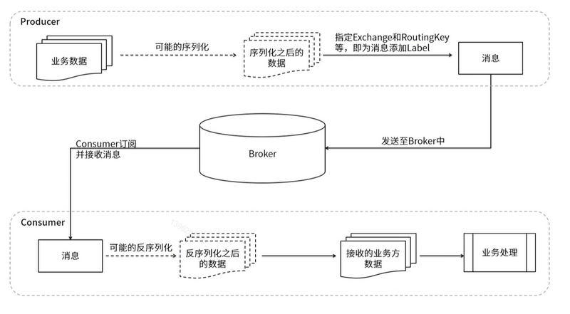
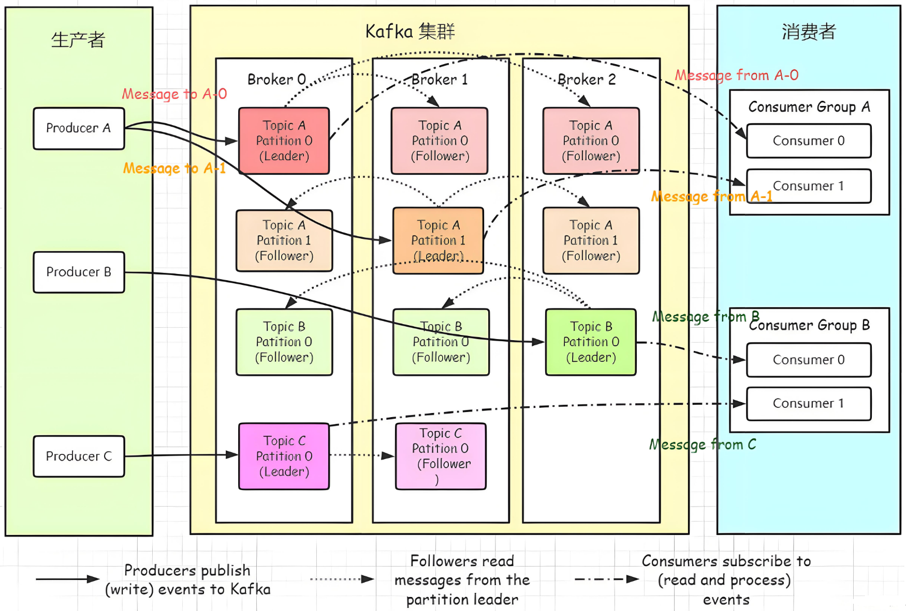
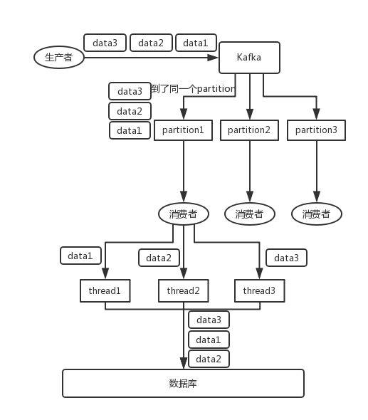

# MessageQueue常见问题

## 消息队列的作用

1. **解耦**：MQ的消费者就算是挂了，也不会影响MQ之前的所有服务
2. **异步**：消息放入MQ之后就返回了
3. **削峰**：所谓的削峰填谷，就是把高峰的流量数据放在MQ中处理，MQ始终不紧不慢的处理之中
4. **限流**：对于MQ的消费者来说，MQ还有一个限流的作用，不敢上游的流量有多大，消费者始终都是一个处理速度

## 常见消息队列中间件对比

|    对比项    |   Kafka    | RocketMQ |        RabbitMQ         |             ActiveMQ              |
| :----------: | :--------: | :------: | :---------------------: | :-------------------------------: |
|   单机性能   |   100W/S   |  10W/S   |         1.2W/S          |              2000/S               |
|  公司/社区   |   Apache   |   阿里   |         Rabbit          |              Apache               |
|   开发语言   | Java&Scala |   Java   |         Erlang          |               Java                |
|   支持协议   |   自定义   |  自定义  | AMQP、XMPP、SMTPS、TOMP | OpenWire、STOMP、REST、XMPP、AMQP |
|    可用性    |     高     |    高    |           高            |               一般                |
| 消息延迟级别 |   毫秒内   |  毫秒级  |         微秒级          |              毫秒级               |
|    可靠性    |    一般    |    高    |           高            |               一般                |


|   对比点   |                           Kafka                           |                           RocketMQ                           |                      RabbitMQ                       |             ActiveMQ              |         ZeroMQ         |
| :--------: | :-------------------------------------------------------: | :----------------------------------------------------------: | :-------------------------------------------------: | :-------------------------------: | :--------------------: |
|   成熟度   |                           成熟                            |                             成熟                             |                        成熟                         |               成熟                |         不成熟         |
|    协议    |                          仿AMQP                           |                          自定义协议                          |                        AMQP                         | OpenWire、STOMP、REST、XMPP、AMQP |        TCP、UDP        |
|   持久化   |                         磁盘文件                          |                           磁盘文件                           |                     内存、文件                      |        内存、文件、数据库         |    在消息发送端保存    |
|   多语言   |                         主流语言                          |                             Java                             |                      主流语言                       |             主流语言              |                        |
|    事务    |                           支持                            |                             支持                             |                       不支持                        |               支持                |         不支持         |
|    集群    |                           支持                            |                             支持                             |                        支持                         |               支持                |         不支持         |
|  负载均衡  |                                                           |                             支持                             |                        支持                         |               支持                |         不支持         |
|  管理界面  |                           一般                            |                          可视化管理                          |                         好                          |               一般                |           无           |
|  消息顺序  |                          不严格                           |                         保证严格顺序                         |                       不严格                        |              不严格               |        无法保障        |
|  单机性能  |                          10万级                           |                            10万级                            |                        万级                         |               万级                |         10万级         |
|    优点    | 多文件并发写入<br/>高吞吐量<br/>天生分布式<br/>大数据支持 | 支持上万个队列<br/>多种消费模式<br/>可靠性好<br/>模型简单、接口易用<br/>有大规模应用案例 |       Erlang 语言开发<br/>并发能力，性能很好        |   功能齐全，大量老开源项目使用    | 低延时，低开销，高性能 |
|    缺点    |                 运维难度大<br/>带宽要求高                 |                          只支持Java                          | 内部机制只能通过官方文档了解<br/>集群不支持动态扩展 |        缺乏大规模使用案例         |                        |
| 社区活跃度 |                            高                             |                              中                              |                         高                          |                高                 |           低           |
|  授权方式  |                           开源                            |                             开源                             |                        开源                         |               开源                |          开源          |

> Erlang是一种专为构建并发、分布式、容错和实时系统设计的编程语言和运行时环境

### RabbitMQ

- [MQ-RabbitMQ.md](MQ-RabbitMQ.md)

### RocketMQ

- [MQ-RocketMQ.md](MQ-RocketMQ.md)

### Kafka

- [MQ-Kafka.md](MQ-Kafka.md)

## AMQP协议

### RabbitMQ中的AMQP模型


## 如何确保消息的顺序性

|            | Rabbit | Rocket        | Kafka             |
| ---------- | ------ | ------------- | ----------------- |
| 消息的发送 | Queue  | Queue & Topic | Partition & Topic |
| 消费模式   |        | 推送模式      | 拉取模式          |


### 方案1
> 需要注意的是，消息的重试机制可能会导致消息乱序

1. 生产者单线程生产投递
2. 一个Topic只能对应一个QueueId
3. 一个消费者按照顺序消费

### 方案2

1. 消息带有自增编号
2. 消费者记录当前消费编号，如果拿到的消息的编号**大于**当前编号+1，那么先缓存下来，直到拉取到编号**等于**当前编号+1
3. 消费者在处理新消息之前先检查本地缓存有没有编号**等于**当前编号+1的消息，有的话直接消费，没有的话再去拿最新的消息

## MQ消息积压如何处理

1. 代码问题：消费者故障：宕机、速度比较慢
   - 版本更新导致API的变化，或者新的处理
   - 死锁
2. 突发性流量
   - 动态扩容 

预防性措施：

1. 经常性检查重试队列的负载情况

## 数据传输的事务定义有哪三种？

数据传输的事务定义通常有以下三种级别：

(1)最多一次: 消息不会被重复发送，最多被传输一次，但也有可能一次不传输

(2)最少一次: 消息不会被漏发送，最少被传输一次，但也有可能被重复传输.

(3)精确的一次(Exactly once):不会漏传输也不会重复传输,每个消息都传输被一次而且仅仅被传输一次，这是大家所期望的


## 如何解决重复消费？

消息被重复消费，就是消费方多次接受到了同一条消息。根本原因就是，第一次消费完之后，消费方给 MQ 确认已消费的反馈，MQ 没有成功接受。比如网络原因、MQ 重启等。所以 MQ 是无法保证消息不被重复消费的，只能业务系统层面考虑。不被重复消费的问题，就被转化为消息消费的幂等性的问题。幂等性就是指一次和多次请求的结果一致，多次请求不会产生副作用。保证消息消费的幂等性可以考虑下面的方式：给消息生成全局 id，消费成功过的消息可以直接丢弃消息中保存业务数据的主键字段，结合业务系统需求场景进行处理，避免多次插入、是否可以根据主键多次更新而并不影响结果等

## 如何设计一个消息队列

1. **数据存储角度：**
   - 理论上，从速度来看，分布式文件系统>分布式KV(持久化)>数据库，而可靠性却截然相反，如果追求性能可以基于文件系统的顺序写。
2. **高可用角度：**
   - 分区+复制+选举的思想
3. **网络框架角度：**
   - 选用高效的Netty框架，producer 同步异步发送消息，consumer 同步异步接收消息。同步能够保证结果，异步能够保证性能。

## 有几百万消息持续积压几小时怎么解决

发生了线上故障，几千万条数据在MQ里积压很久。是修复consumer的问题，让他恢复消费速度，然后等待几个小时消费完毕？这是个解决方案。不过有时候我们还会进行临时紧急扩容。
一个消费者一秒是1000条，一秒3个消费者是3000条，一分钟是18万条。1000多万条，所以如果积压了几百万到上千万的数据，即使消费者恢复了，也需要大概1小时的时间才能恢复过来。
一般这个时候，只能操作临时紧急扩容了，具体操作步骤和思路如下：
先修复consumer的问题，确保其恢复消费速度，然后将现有consumer都停掉。
新建一个topic，partition是原来的10倍，临时建立好原先10倍或者20倍的queue数量。然后写一个临时的分发数据的consumer程序，这个程序部署上去消费积压的数据，消费之后不做耗时的处理，直接均匀轮询写入临时建立好的10倍数量的queue。
接着临时征用10倍的机器来部署consumer，每一批consumer消费一个临时queue的数据。
这种做法相当于是临时将queue资源和consumer资源扩大10倍，以正常的10倍速度来消费数据。
等快速消费完积压数据之后，再恢复原先部署架构，重新用原先的consumer机器来消费消息。

## 消息队列有什么优点和缺点?

1. 优点：
   - 解耦
   - 异步
   - 削峰
   - 限流
2. 缺点：
   - **系统可用性降低**：系统引入的外部依赖越多，越容易挂掉，本来你就是A系统调用BCD三个系统的接口就好了，ABCD四个系统好好的，没啥问题，你偏加个MQ进来，万一MQ挂了怎么办？MQ挂了，整套系统崩溃了，业务也就停顿了。
   - **系统复杂性提高**：硬生生加个MQ进来，怎么保证消息没有重复消费？怎么处理消息丢失的情况？怎么保证消息传递的顺序性？
   - **出现不一致性问题**：A系统处理完了直接返回成功了，人都以为你这个请求就成功了；但是问题是，要是BCD三个系统那里，BD两个系统写库成功了，结果C系统写库失败了，你这数据就不一致了。所以消息队列实际是一种非常复杂的架构，你引入它有很多好处，但是也得针对它带来的坏处做各种额外的技术方案和架构来规避掉


## 常见的MQ实现分布式事务对比

> 基于MQ的分布式事务一般称为TCC，本质上就是与业务耦合，自己实现分布式事务
>
> Seata也提供TCC模式，是否可以尝试 TCC@Seata + RocketMQ 的模式呢？毕竟这是同一家公司的产品

### 常见的处理思路

1. 利用 本地事件表 + 消息队列 实现分布式事务
2. 利用消息队列事务机制实现分布式事务

### RocketMQ分布式事务

> 两阶段提交 + 消费者最大可能 + 失败补偿

RocketMQ有一个定时的事务回查机制

1. 生产者开启本地事务
2. 生产者给MQ发送一个Half消息
3. 生产者处理本地业务
4. 如果本地业务成功则向MQ发送提交，否则向MQ发送回滚，即删除Hlaf消息
5. 消费者在生产者提交之后拿到消息开启消费者本地事务
6. 消费者本地业务执行
   - 成功：则向MQ发送ACK确认，提交本地事务，意味着整个分布式事务成功完成
   - 失败：则向MQ发送NACK，调用生产者回滚接口，或者生产者订阅MQ死信队列

## 常见的MQ发送事务型消息对比

> **如果出现在commit或者rollback之前宕机，RabbitMQ和Kafka没有提供类似RocketMQ类似的事务回查机制，那么生产者宕机重启后需要手工处理这些异常消息**

在Java中，RabbitMQ、RocketMQ和Kafka都提供了发送事务型消息的能力。下面分别介绍如何在这三种消息队列中实现生产者发送事务型消息。

### RabbitMQ

RabbitMQ使用AMQP协议，它支持事务消息。在RabbitMQ中，你可以使用`Channel`对象的`txSelect`、`txCommit`和`txRollback`方法来实现事务控制。

```java
import com.rabbitmq.client.Channel;
import com.rabbitmq.client.Connection;
import com.rabbitmq.client.ConnectionFactory;

public class RabbitMQProducer {
    private final static String QUEUE_NAME = "test_queue";

    public static void main(String[] argv) throws Exception {
        ConnectionFactory factory = new ConnectionFactory();
        factory.setHost("localhost");
        try (
          Connection connection = factory.newConnection();
          Channel channel = connection.createChannel())
        {
            channel.queueDeclare(QUEUE_NAME, false, false, false, null);

            channel.txSelect(); // 开启事务
            try {
                String message = "Hello World!";
                channel.basicPublish("", QUEUE_NAME, null, message.getBytes());
                // 处理本地事务
                channel.txCommit(); // 提交事务
            } catch (Exception e) {
                channel.txRollback(); // 回滚事务
                throw e;
            }
        }
    }
}
```

### RocketMQ

RocketMQ是阿里巴巴开源的消息中间件，它也支持事务消息。在RocketMQ中，事务消息的发送需要使用`TransactionMQProducer`类，并且需要实现`TransactionListener`接口。

```java
import org.apache.rocketmq.client.producer.LocalTransactionState;
import org.apache.rocketmq.client.producer.TransactionListener;
import org.apache.rocketmq.client.producer.TransactionMQProducer;
import org.apache.rocketmq.common.message.Message;
import org.apache.rocketmq.remoting.common.RemotingHelper;

public class RocketMQProducer {
    public static void main(String[] args) throws Exception {
        // 如果你希望增加回查次数或调整回查间隔，可以这样做
        Properties properties = new Properties();
        properties.put("checkImmunityTimeInMin", 20); // 设置回查次数为20次
        properties.put("checkImmunityTime", 120000); // 设置回查间隔为2分钟（120000毫秒）

        TransactionMQProducer producer = new TransactionMQProducer("test_tx_producer_group");
        producer.setProperties(properties);
        producer.setNamesrvAddr("127.0.0.1:9876");

        producer.setTransactionListener(new TransactionListener() {
            @Override
            public LocalTransactionState executeLocalTransaction(Message msg, Object arg) {
                // 执行本地事务逻辑
                System.out.println("executeLocalTransaction: " + new String(msg.getBody()));
                return LocalTransactionState.COMMIT_MESSAGE;
            }

            @Override
            public LocalTransactionState checkLocalTransaction(Message msg) {
                // 检查本地事务状态
                System.out.println("checkLocalTransaction: " + new String(msg.getBody()));
                return LocalTransactionState.COMMIT_MESSAGE;
            }
        });

        producer.start();
        String transactionId = "tx_01";
        Message msg = new Message("test_topic", "TagA", "OrderID188", "Hello world".getBytes(RemotingHelper.DEFAULT_CHARSET));
        SendResult sendResult = producer.sendMessageInTransaction(msg, transactionId);
        System.out.printf("%s%n", sendResult);

        producer.shutdown();
    }
}
```

### Kafka

Kafka从0.11版本开始支持事务消息。在Kafka中，你可以使用`KafkaProducer`的以下几个方法来实现事务控制：

1. `initTransactions`
2. `beginTransaction`
3. `send`
4. `commitTransaction`
5. `abortTransaction`

```java
import org.apache.kafka.clients.producer.KafkaProducer;
import org.apache.kafka.clients.producer.ProducerRecord;
import org.apache.kafka.clients.producer.ProducerConfig;
import org.apache.kafka.common.serialization.StringSerializer;

import java.util.Properties;

public class KafkaProducer {
    private static final String BOOTSTRAP_SERVERS = "localhost:9092";
    private static final String TRANSACTIONAL_ID = "test-transactional-id";

    public static void main(String[] args) {
        Properties props = new Properties();
        props.put(ProducerConfig.BOOTSTRAP_SERVERS_CONFIG, BOOTSTRAP_SERVERS);
        props.put(ProducerConfig.KEY_SERIALIZER_CLASS_CONFIG, StringSerializer.class.getName());
        props.put(ProducerConfig.VALUE_SERIALIZER_CLASS_CONFIG, StringSerializer.class.getName());
        props.put(ProducerConfig.TRANSACTIONAL_ID_CONFIG, TRANSACTIONAL_ID);

        KafkaProducer<String, String> producer = new KafkaProducer<>(props);
        producer.initTransactions();

        try {
            producer.beginTransaction();
            try {
                ProducerRecord<String, String> record = new ProducerRecord<>("test_topic", "key", "value");
                producer.send(record);
                producer.commitTransaction();
            } catch (Exception e) {
                producer.abortTransaction();
                throw e;
            }
        } finally {
            producer.close();
        }
    }
}
```

在使用事务消息时，需要注意的是，事务消息的使用会增加消息发送的复杂度和性能开销，因此在不需要严格事务保证的场景下，可以考虑使用普通的消息发送方式。同时，确保在异常情况下正确处理事务的回滚，避免消息丢失或重复发送。

## 三大MQ的优缺点对比

|  对比项  | Kafka                                                        | RocketMQ                                                     | RabbitMQ                                                     |
| :------: | ------------------------------------------------------------ | ------------------------------------------------------------ | ------------------------------------------------------------ |
|   优点   | 1、吞吐量高：Kafka的设计目标是实现高吞吐量的消息传递，适用于处理大量的实时数据流<br/>2、扩展性高：Kafka采用分布式架构，允许构建具有高可用性和可伸缩性的消息系统<br/>3、可靠性高：Kafka将消息持久化到磁盘上，可以长期保留数据，并支持高效的消息回放 | 1、高吞吐量和低延迟：RocketMQ是为处理大规模数据流设计的，具有高吞吐量和低延迟的特点。RocketMQ的时延<br/>2、可靠性高：存在持久化机制、确认机制，具有高可靠性<br/>3、扩展性高：RocketMQ支持水平扩展，可以通过添加更多的节点来提高系统的性能和容量 | 1、功能丰富度：RabbitMQ支持灵活的路由机制和多种消息模式，如点对点、发布-订阅和主题订阅等<br/>2、可靠性：RabbitMQ通过消息确认机制和持久化可以保证消息的可靠传递<br/>3、兼容性：RabbitMQ使用标准的AMQP协议，支持跨语言和平台的互操作性 |
|   缺点   | 1、复杂性高：Kafka的配置和管理相对较复杂，需要一定的学习和运维成本<br/>2、实时性低：由于Kafka是批量处理数据的，并且由于需要在分区之间进行数据的复制和同步，所以相对于其它MQ，kafka会存在一定时延<br/>3、功能丰富度单一：支持的消费模式比较单一 | 1、社区支持：相对于Kafka和RabbitMQ，RocketMQ的社区支持相对较弱<br/>2、功能丰富度：RocketMQ在功能上相对较为简化，可能不适用于复杂的消息处理场景 | 1、吞吐量：没有做拉升吞吐量的优化所以相比于其他消息队列系统，RabbitMQ的吞吐量较低<br/>2、扩展性：RabbitMQ的集群管理较为复杂，需要很多额外的配置和管理 |
| 适用场景 | Kafka在大数据领域具有广泛的应用，与Hadoop、Spark等工具有良好的集成 | RocketMQ在互联网领域应用较为广泛，适用于电商、物流等场景     | 适用于对消息可靠性要求高或者灵活的消息路由和多种消息模式的场景，如任务队列、发布-订阅和事件驱动架构 |

Kafka和Rocket适用的场景是高度重叠的，**RocketMQ和Kafka都专注于高吞吐量和低延迟的场景**，因此它们都适用于需要处理大规模数据流和实时消息传递的应用

## 消息队列如何保证消息的可靠性

1. 生产者和消费者端由消息队列的确认机制保证消息的生产和消费的可靠性
   - RocketMQ：
     - 发送方确认：RocketMQ可以设置为同步发送，也就是发送方确认模式。在这种模式下，消息被发送后会被立即确认，如果Broker没有接收到消息，生产者会收到异常。
     - 消费者确认：RocketMQ可以设置为异步消息模式，在这种模式下，消费者需要显式地向Broker发送消息消费成功的确认，如果Broker在指定时间内没有收到确认，消息会被重新投递。
   - RabbitMQ：
     - 发送方确认：RabbitMQ可以开启发送方确认模式，在这种模式下，消息被确认送达交换器后才会被确认。
     - 消费者确认：消费者在接收消息后可以选择自动发送确认或者手动确认，如果启用了手动确认，需要在代码中显式调用API确认消息。
   - Kafka：
     - 分区内消息确认：Kafka默认在分区内是有序的，可以通过等待所有同步副本都成功接收消息来确认消息。
     - 分区复制确认：在配置中可以设置需要所有副本都复制完成后才发送确认，以确保消息持久性。
2. MQ的消息持久化保证消息在MQ中保存的可靠性

## 消息队列如何保证消息的顺序性

保证消息的有序性的思路：

1. 思路一：一个生产者按序生产，放入消息队列同一个消息分区，单个消费者按序从消息分区中消费
   - 消息分区
     - 对于 Kafka 和 RocketMQ，就是讲消息发送到同一个**partition**中
     - 对于 Rabbit，可根据 Exchange 和 Queue 的绑定方式来确保相关消息发送到同一个**Queue**
2. 思路二：消息自带序号，消费端消费的时候按照序号进行处理，如果遇到超前序号，消息进行缓存
   - 生产者只要确保消息自带的序号与其业务关系一致

## 消息队列如何保证消息的高可用

RabbitMQ、Kafka、RocketMQ都是常见的消息中间件，它们都有着高可用性的设计思路，下面是它们的实现思路：

### RabbitMQ

RabbitMQ使用了AMQP（Advanced Message Queuing Protocol）协议，它是一个可靠的、面向消息的、异步的消息传递协议。

RabbitMQ使用了许多高可用性的机制来保证消息的可靠传输，其中最重要的是：

- 集群模式： RabbitMQ的集群模式可以确保即使其中一个节点宕机，系统依然可以继续工作
- 镜像队列：RabbitMQ可以将队列镜像到多个节点上，确保即使其中一个节点宕机，队列依然可以继续工作
- 消息持久化：RabbitMQ可以将消息存储在磁盘上，以便在节点宕机时不会丢失数据
- 生产者确认：生产者可开启confirm模式，等待消息确认
- 消费者确认：可以设置消费者要确认收到消息后才从队列中移除





### Kafka

Kafka是一个分布式、可扩展、高吞吐量的发布-订阅消息系统。Kafka使用了一些高可用性的机制来保证消息的可靠传输，其中最重要的是：

- 复制机制：Kafka通过副本机制将消息存储在多个节点上，确保即使其中一个节点宕机，数据依然可以访问。
- 分区机制：Kafka将数据划分为多个分区，每个分区可以独立存储，确保即使其中一个分区宕机，数据依然可以访问。
- 消息持久化：所有消息都被持久化到磁盘




### RocketMQ

RocketMQ是一个分布式的、可靠的、高吞吐量的消息队列。RocketMQ使用了一些高可用性的机制来保证消息的可靠传输，其中最重要的是：

- 复制机制：RocketMQ通过副本机制将消息存储在多个节点上，确保即使其中一个节点宕机，数据依然可以访问。
- 主从模式：RocketMQ使用主从模式，确保即使其中一个节点宕机，系统依然可以继续工作。
- 优先级队列：RocketMQ可以将消息按照优先级进行排序，确保重要的消息能够优先得到处理。


### 三者比较


# Kafka Questions

## Kafka的特性

1. 消息持久化
2. 高吞吐 100万
3. 动态扩容
4. 多客户端语言支持(Java、C、C++ GO、Python)
5. Kafka Stream (流处理) 双十一销售大屏
6. 安全确认机制
7. 适合数据备份
8. 轻量级，新版本不依赖ZK
9. 消息压缩

## Kafka为什么那么快

1. 顺序写磁盘
2. 零拷贝技术
3. 批处理
4. 数据压缩
5. 充分利用 Page Cache
6. 利用 Partition 实现并行处理

## Kafka适合哪些场景

Apache Kafka是一个**分布式流处理平台**，它主要用于构建实时数据管道和流应用程序。Kafka适合以下场景：

1. **构建实时数据管道**：Kafka可以用来将数据从一个系统传输到另一个系统，例如，从数据库或日志文件中收集数据并将其发送到数据仓库、搜索索引或日志聚合系统。

2. **构建实时流应用程序**：Kafka支持构建实时流应用程序，这些应用程序可以订阅数据流，处理数据，并将结果输出到其他系统。例如，实时分析、实时监控、实时报告等。

3. **事件驱动架构**：Kafka可以作为事件驱动架构中的事件总线，用于在不同的服务和系统之间传递事件。这种架构模式特别适合于微服务架构和分布式系统。

4. **消息队列**：Kafka可以作为消息队列系统使用，用于解耦生产者和消费者，提高系统的可扩展性和容错性。例如，用于处理用户请求、任务队列、异步处理等。

5. **日志聚合**：Kafka可以用于收集和聚合日志数据，将日志数据从多个服务器传输到中央日志存储系统，便于日志分析和监控。

6. **数据流处理**：Kafka与流处理框架(如Apache Storm、Apache Flink、Apache Spark Streaming等)结合使用，可以构建复杂的实时数据流处理应用程序。

7. **数据集成**：Kafka可以用于数据集成，将不同来源的数据集成到一个统一的平台中，便于数据管理和分析。

8. **事件源**：Kafka可以作为事件源(Event Sourcing)的实现，用于记录和查询对象的变更历史。

9. **实时分析**：Kafka可以与实时分析工具结合使用，例如，实时分析用户行为、实时监控系统性能等。

10. **物联网(IoT)数据处理**：Kafka可以用于处理物联网设备产生的大量数据流，例如，收集传感器数据、处理设备状态更新等。

Kafka的这些特性使其成为构建大规模、高吞吐量、低延迟的实时数据处理和流应用程序的理想选择。

---

Kafka适合

1. **日志收集**：默认落盘，百万级别的并发
2. **消息系统**：使用acks实现了生产端的消息确认机制，使用手动提交offset的方式实现消费端的消息确认机制
3. **流式处理**：原生有API支持

但是Kafka没有定时消息，不适合于做限时订单

## Kafka消息的有序性如何保证

### 场景

比如说我们建了一个 topic，有三个 partition。生产者在写的时候，其实可以指定一个 key，比如说我们指定了某个订单 id 作为 key，那么这个订单相关的数据，一定会被分发到同一个 partition 中去，而且这个 partition 中的数据一定是有顺序的。
消费者从 partition 中取出来数据的时候，也一定是有顺序的。到这里，顺序还是 ok 的，没有错乱。接着，我们在消费者里可能会搞多个线程来并发处理消息。因为如果消费者是单线程消费处理，而处理比较耗时的话，比如处理一条消息耗时几十 ms，那么 1 秒钟只能处理几十条消息，这吞吐量太低了。而多个线程并发跑的话，顺序可能就乱掉了。



### 解决方案

- 一个 topic，一个 partition，一个 consumer，内部单线程消费，单线程吞吐量太低，一般不会用这个。
- **写 N 个内存 queue，具有相同 key 的数据都到同一个内存 queue；然后对于 N 个线程，每个线程分别消费一个内存 queue 即可，这样就能保证顺序性**。


## Kafka高可用架构设计


集群特征：

1. 每个Topic的消息会被分割到不同的Partition中，每个Partition分布在由一个Leader-Follower组成的集群节点中
2. 只有Leader对外提供读写服务
3. 数据写入Leader的时候，数据会自动同步到对应的Follower中

## Kafka消息丢失场景及解决方案

**消息发送的消息丢失场景**

| 场景                         | 场景说明                                                     | 解决方案                              | 方案说明                                                     |
| ---------------------------- | ------------------------------------------------------------ | ------------------------------------- | ------------------------------------------------------------ |
| 不开启确认机制               | Producer发送消息完，不管结果了，如果发送失败也就丢失了       | ack=all/-1<br/>tries>1                | 1、Producer发送完消息，等待follower同步完再返回<br/>2、如果异常则重试<br/>3、副本的数量可能影响吞吐量 |
| 开启确认机制，但是Leader崩溃 | Producer发送消息完，等待Leader写入成功就返回，但Leader崩溃，这时follower没来及同步，消息丢失 | ack=all/-1<br/>min.insync.replicas>1  | 1、副本指定必须确认写操作成功的最小副本数量<br/>2、如果不能满足这个最小值，则生产者将引发一个异常(要么是`NotEnoughReplicas`，要么是`NotEnoughReplicasAfterAppend`)<br/>3、`min.insync.replicas`和`ack`共同来保证更大的持久性。确保如果大多数副本没有收到写操作，则生产者将引发异常<br/>4、`ack=all/-1`设置之后参数`min.insync.replicas`才会生效 |
| 使用OSR副本集合作为Leader    | 1、允许选举ISR以外的副本作为Leader,会导致数据丢失，默认为false<br/>2、Producer发送完异步消息，等待Leader写入成功就返回，但是Leader崩溃了，且这时ISR中没有follower，Leader将从OSR中选举，因为OSR中本来落后于Leader，从而造成消息丢失 | unclean.leader.election.enable: false | 禁止使用OSR的副本集合，避免数据丢失                          |

失败的offset进行单独记录
Producer发送消息失败会自动重试，遇到不可恢复异常会抛出可以捕获异常记录到数据库或缓存，进行单独处理。

ISR：**In-Sync Replicas**：

- 指与Leader副本保持同步的副本集合
- 在Kafka中，为了保证数据的高可用性和容错性，每个分区的数据都会被复制到多个副本(Replicas)上。其中，一个副本被选为Leader，负责处理客户端的读写请求，而其他副本则作为Follower，复制Leader的数据。
- 为了确保数据的一致性，Kafka要求ISR中的副本必须与Leader保持同步。同步的定义是Follower副本的高水位(High Watermark)必须与Leader副本的高水位相同。高水位是Kafka中用来标识消息是否已经提交的标记，只有达到高水位的消息才被认为是已提交的。
- 当一个Follower副本落后于Leader副本太多时，它会被暂时移出ISR集合，直到它追上Leader的进度。这样做的目的是为了保证ISR中的副本都是可用的，并且数据是最新的。

OSR：**Out-of-Sync Replicas**：

- 指那些与Leader副本不同步的副本集合

- 这些副本由于各种原因(如网络延迟、硬件故障等)未能及时复制Leader的数据，导致它们的高水位落后于Leader的高水位。因此，它们被暂时移出ISR，直到它们能够追上Leader的进度

- 在Kafka中，OSR中的副本不会参与数据的读写操作，因为它们的数据可能不是最新的。只有当它们追上Leader的进度后，才会重新加入ISR集合


其他

1. `min.insync.replicas`参数定义了为了保证消息的持久性，必须有多少个副本处于“in-sync”状态
2. `acks`参数则定义了生产者在发送消息后需要等待多少个副本确认消息已接收

**消息接收的消息丢失场景**

| 场景               | 说明                                                         | 方案                                   |
| ------------------ | ------------------------------------------------------------ | -------------------------------------- |
| 先Commit后消费处理 | 如果消费者是在接收到消息之后先commit，后消费处理，那么如果消费的过程中出现异常，且没有做缓存处理，那就再也消费不到该消息了，即消息丢失 | 先处理消息，后进行commit               |
| Broker崩溃         | 当消息发送到Broker之后，Broker崩溃，那么容易造成消息丢失     | 通过减小刷盘间隔来减小消息丢失的可能性 |

## Kafka是Pull还是Push消息

Kafka中默认是采用Pull模式，这样的话消费者的自主性会更强

下面是Pull模式和Push模式的优劣：

| 模式     | 优点                                                         | 优劣                                                         |
| -------- | ------------------------------------------------------------ | ------------------------------------------------------------ |
| Pull模式 | 1、根据Consumer的消费能力进行数据拉取，可以控制速率<br/>2、可以批量拉取、也可以单条拉取<br/>3、可以设置不同的提交方式，实现不同的传输语义 | 1、缺点：如果Kafka没有数据，会导致consumer空循环，消耗资源<br/>2、解决：通过参数设置，Consumer拉取数据为空或者没有达到一定数量时进行阻塞 |
| Push模式 | 不会导致Consumer循环等待                                     | 缺点：速率固定、忽略了consumer的消费能力，可能导致拒绝服务或者网络拥塞等情况 |

## Kafka中ZK的作用

在Apache Kafka的早期版本中，ZK扮演了非常关键的角色，它负责管理Kafka集群的状态和协调。以下是ZK在Kafka中的一些主要作用：

1. **集群管理**：ZK用于跟踪集群中的所有Broker节点，包括它们的健康状态和角色。它帮助Kafka集群知道哪些节点是活跃的，哪些节点已经宕机或不可用。

2. **Topic管理**：Kafka使用ZK来存储和管理主题(topics)的元数据信息，包括主题的分区数量、副本分布情况等。这些信息对于Kafka的正常运行至关重要。

3. **分区分配**：当创建新的分区时，ZK负责协调分区的分配过程，确保分区能够均匀地分布在不同的Broker上，以实现负载均衡。

4. **Leader选举**：Kafka的每个分区都有一个Leader副本(leader replica)，负责处理该分区的所有读写请求。ZK用于在Broker宕机或分区Leader不可用时进行Leader选举，确保分区的高可用性。

5. **同步和协调**：ZK帮助Kafka集群中的Broker节点保持同步。例如当一个Broker节点需要更新其元数据信息时，ZK会确保所有其他节点也得到更新。

6. **消费者协调**：对于Kafka的消费者组(consumer groups)，ZK用于跟踪消费者组的状态，包括消费者组的成员信息、消费者偏移量(offsets)等。这有助于实现消费者组的负载均衡和状态管理。

随着Kafka版本的演进，特别是从Kafka2.8.0版本开始，Kafka引入了KRaft模式，这是一种新的元数据管理方式，它允许Kafka在不需要ZK的情况下运行。KRaft模式通过内置的Raft协议来管理集群状态，从而减少了对ZK的依赖。

尽管如此，ZK在Kafka早期版本中扮演了至关重要的角色，它帮助Kafka实现了高可用性、负载均衡和状态管理等关键功能。随着Kafka的不断发展，ZK的角色可能会进一步减少，但其在Kafka历史上的重要性不容忽视。

ZK中一些关键节点：

1. `/brokers/ids`：
   - 临时节点
   - 保存所有Broker节点信息，存储Broker的物理地址、版本信息、启动时间等
   - 节点名称为BrokerID
   - Broker定时发送心跳到ZK，如果断开则该BrokerID会被删除
2. `/brokers/topics`：
   - 临时节点
   - 节点保存Broker节点下所有的topic信息
     - 每一个topic节点下包含一个固定的partitions节点
     - partitions的子节点就是topic的分区
     - 每个分区下保存一个state节点，保存着当前leader分区和ISR的BrokeriD
   - state节点由leader创建，若leader宕机该节点会被删除，直到有新的leader选举产生、重新生成state节点
3. `/consumers/[group_id]/owners/[topic]/[Broker_id-partitidn_id]`
   - 维护消费者和分区的注册关系
4. `/consumers/[group_id]/offsets/[topic]/[Broker_id-partition_id]`
   - 分区消息的消费进度Offset
5. client通过topic找到topic树下的state节点，获取leader的BrokerlD，到Broker树中找到Broker的物理地址，但是client不会直连ZK，而是通过配置的Broker获取到ZK中的信息

## Kafka高性能的原因

Kafka的高性能可能源自于多个方面：

1. 架构层级
   - 分区的设计加大了系统整体的吞吐量
2. 强大的消息堆积能力
   - Kafka是基于硬盘存储的
     - 硬盘的高性能原因源自于
       - 寻址时间的节省：磁盘的顺序写
       - 写入次数的节省：对硬盘的批量写入
       - 分区的分段存储：分段(segment)存储易于删除
3. 系统层级零拷贝的支持
   - 使用的是操作系统的指令支持
   - 直接将内核缓冲区的数据发送到网卡传输
4. 写操作基于PageCache交换数据
   - Kafka不太依赖JVM，主要依赖操作系统的pageCache
   - 如果生产消费速率相当，则直接用pageCache交换数据不需要经过磁盘IO

## Kafka的rebalance机制

消费组中的消费者与topic下的partion重新匹配的过程

Rebalance出现时机：

1. 消费组中的**消费者个数**发生变化
2. 消费组订阅的**topic个数**发生变化
3. 消费组订阅的**topic分区数**发生变化
4. Consumer消费超时

> 注意：
>
> 1. 当Kafka的处理的消息量比较大的时候，rebalance的使用就比较频繁
> 2. 当进行Rebalance的时候，读写会被阻塞

对于监控消费者数量、topic个数、topic分区数、超时通常由协调者(Coordinator)、Consumer Leader来完成

**协调者**

协调者一般用来监控 消费者的各种变化(如：宕机、消费超时等)

协调者通常是partition的leader节点所在的broker，负责监控消费组中consumer的存活，维持consumer到Coordinator的心跳，判断consumer的消费超时

Rebalance的过程大致如下：

1. Coordinator通过心跳返回通知现存的Consumer进行Rebalance
2. Consumer请求Coordinator加入组，Coordinator选举产生一个Consumer Leader
3. Consumer Leader从Coordinator获取所有的Consumer，发送syncGroup(分配信息)给到Coordinator
4. Coordinator通过心跳机制将syncGroup下发给Consumer
5. 完成Rebalance

**Consumer Leader**

Consumer Leader一般是用来监控Topic相关变化的，如果有变则通知Coordinator触发Rebalance

Rebalance导致的重复提交问题：

如果C1消费消息超时未提交offset，触发Rebalance，重新分配后、该消息会被其他消费者消费，此时C1消费完成提交offset，从而导致错误

解决：

1. Coordinator每次Rebalance，会标记一个Generation给到Consumer
2. 每次Rebalance该Generation会加1
3. Consumer提交offset时，Coordinator会比对Generation
4. 不一致则拒绝提交

## Kafka的系统设计

1. Kafka将消息以 topic 为单位进行归纳
2. 将向 Kafkatopic 发布消息的程序称为 producer.
3. 将订阅 topics 并消费消息的程序成为 consumer.
4. Kafka以集群的方式运行，可以由一个或多个服务组成，每个服务叫做一个 Broker. 
5. producer 通过网络将消息发送到 Kafka集群，集群向 consumer 提供消息

## Kafka判断一个节点是否还活着有那两个条件

(1)节点必须可以维护和 ZK 的连接，ZK 通过心跳机制检查每个节点的连接

(2)如果节点是个 follower,他必须能及时的同步 leader 的写操作，延时不能太久

## Kafka生产者是否直接将数据发送到 Broker 的 leader

producer 直接将数据发送到 Broker 的 leader(主节点)，不需要在多个节点进行分发，为了帮助 producer 做到这点，所有的 Kafka节点都可以及时的告知:哪些节点是活动的，目标topic 目标分区的 leader 在哪。这样 producer 就可以直接将消息发送到目的地了

## Kafka消费者是否可以消费指定分区消息

Kafaconsumer 消费消息时，向 Broker 发出"fetch"请求去消费特定分区的消息，consumer 指定消息在日志中的偏移量(offset)，就可以消费从这个位置开始的消息，customer 拥有了 offset 的控制权，可以向后回滚去重新消费之前的消息，这是很有意义的

## Kafka消息是采用 Pull 模式，还是 Push 模式

Kafka最初考虑的问题是，customer 应该从 brokes 拉取消息还是 Brokers 将消息推送到

consumer，也就是 pull 还 push。在这方面，Kafka遵循了一种大部分消息系统共同的传统的设计：producer 将消息推送到 Broker，consumer 从 Broker 拉取消息

一些消息系统比如 Scribe 和 ApacheFlume 采用了 push 模式，将消息推送到下游的 consumer。这样做有好处也有坏处：由 Broker 决定消息推送的速率，对于不同消费速率的 consumer 就不太好处理了。消息系统都致力于让 consumer 以最大的速率最快速的消费消息，但不幸的是，push 模式下，当 Broker 推送的速率远大于 consumer 消费的速率时， consumer 恐怕就要崩溃了。最终 Kafka还是选取了传统的 pull 模式

Pull 模式的另外一个好处是 consumer 可以自主决定是否批量的从 Broker 拉取数据。Push 模式必须在不知道下游 consumer 消费能力和消费策略的情况下决定是立即推送每条消息还是缓存之后批量推送。如果为了避免 consumer 崩溃而采用较低的推送速率，将可能导致一次只推送较少的消息而造成浪费。Pull 模式下，consumer 就可以根据自己的消费能力去决定这些策略

Pull 有个缺点是，如果 Broker 没有可供消费的消息，将导致 consumer 不断在循环中轮询， 

直到新消息到 t 达。为了避免这点，Kafka有个参数可以让 consumer 阻塞知道新消息到达

(当然也可以阻塞知道消息的数量达到某个特定的量这样就可以批量发

## Kafka存储在硬盘上的消息格式是什么？

消息由一个固定长度的头部和可变长度的字节数组组成。头部包含了一个版本号和 CRC32

校验码。

·消息长度: 4 bytes (value: 1+4+n)

·版本号: 1 byte

·CRC 校验码: 4 bytes

·具体的消息: n bytes

## Kafka高效文件存储设计特点：

(1).Kafka把 topic 中一个 parition 大文件分成多个小文件段，通过多个小文件段，就容易定期清除或删除已经消费完文件，减少磁盘占用。

(2).通过索引信息可以快速定位 message 和确定 response 的最大大小。

(3).通过 index 元数据全部映射到 memory，可以避免 segment file 的 IO 磁盘操作。(4).通过索引文件稀疏存储，可以大幅降低 index 文件元数据占用空间大小。

## Kafka与传统消息系统之间有三个关键区别

(1).Kafka持久化日志，这些日志可以被重复读取和无限期保留

(2).Kafka是一个分布式系统：它以集群的方式运行，可以灵活伸缩，在内部通过复制数据提升容错能力和高可用性

(3).Kafka支持实时的流式处理

## Kafka创建 Topic 时如何将分区放置到不同的 Broker 中

·副本因子不能大于 Broker 的个数；

·第一个分区(编号为 0)的第一个副本放置位置是随机从 BrokerList 选择的；

·其他分区的第一个副本放置位置相对于第 0 个分区依次往后移。也就是如果我们有 5 个

Broker，5 个分区，假设第一个分区放在第四个 Broker 上，那么第二个分区将会放在第五个

Broker上；第三个分区将会放在第一个Broker上；第四个分区将会放在第二个Broker 上，依次类推；

·剩余的副本相对于第一个副本放置位置其实是由 nextReplicaShift 决定的，而这个数也是随机产生的

## Kafka新建的分区会在哪个目录下创建

在启动 Kafka集群之前，我们需要配置好 log.dirs 参数，其值是 Kafka数据的存放目录， 这个参数可以配置多个目录，目录之间使用逗号分隔，通常这些目录是分布在不同的磁盘上用于提高读写性能。

1、为什么使用消息队列？ 
其实就是问问你消息队列都有哪些使用场景，然后你项目里具体是什么场景，说说你在这个场景里用消息队列是什么？
面试官问你这个问题，期望的一个回答是说，你们公司有个什么业务场景，这个业务场景有个什么技术挑战，如果不用MQ可能会很麻烦，但是你现在用了MQ之后带给了你很多的好处。消息队列的常见使用场景，其实场景有很多，但是比较核心的有3个：解耦、异步、削峰。
解耦：
A系统发送个数据到BCD三个系统，接口调用发送，那如果E系统也要这个数据呢？那如果C系统现在不需要了呢？现在A系统又要发送第二种数据了呢？而且A系统要时时刻刻考虑BCDE四个系统如果挂了咋办？要不要重发？我要不要把消息存起来？
你需要去考虑一下你负责的系统中是否有类似的场景，就是一个系统或者一个模块，调用了多个系统或者模块，互相之间的调用很复杂，维护起来很麻烦。但是其实这个调用是不需要直接同步调用接口的，如果用MQ给他异步化解耦，也是可以的，你就需要去考虑在你的项目里，是不是可以运用这个MQ去进行系统的解耦。
异步：
A系统接收一个请求，需要在自己本地写库，还需要在BCD三个系统写库，自己本地写库要30ms，BCD三个系统分别写库要300ms、450ms、200ms。最终请求总延时是30 + 300 + 450 + 200 = 980ms，接近1s，异步后，BCD三个系统分别写库的时间，A系统就不再考虑了。
削峰：
每天0点到16点，A系统风平浪静，每秒并发请求数量就100个。结果每次一到16点~23点，每秒并发请求数量突然会暴增到1万条。但是系统最大的处理能力就只能是每秒钟处理1000个请求啊。怎么办？需要我们进行流量的削峰，让系统可以平缓的处理突增的请求。


## Kafka配置中你熟悉的参数

### acks

Kafk内部的复制机制是比较复杂的，这里不谈论内部机制(后续章节进行细讲)，我们只讨论生产者发送消息时与副本的关系。
指定了必须要有多少个分区副本收到消息，生产者才会认为写入消息是成功的，这个参数对消息丢失的可能性有重大影响。

1. acks=0：生产者在写入消息之前不会等待任 何来自服务器的响应，容易丢消息，但是吞吐量高。
2. acks=1：只要集群的首领节点收到消息，生产者会收到来自服务器的成功响应。如果消息无法到达首领节点(比如首领节点崩溃，新首领没有选举出来)，生产者会收到一个错误响应，为了避免数据丢失，生产者会重发消息。不过，如果一个没有收到消息的节点成为新首领，消息还是会丢失。默认使用这个配置。
3. acks=all：只有当所有参与复制的节点都收到消息，生产者才会收到一个来自服务器的成功响应。延迟高。

金融业务，主备外加异地灾备。所以很多高可用场景一般不是设置2个副本，有可能达到5个副本，不同机架上部署不同的副本，异地上也部署一套副本。创建生产者对象时有三个属性必须指定。

### batch.size

当多个消息被发送同一个分区时，生产者会把它们放在同一个批次里一次发送，可以节省RTT。

该参数指定了一个批次可以使用的内存大小，按照字节数计算。

当批次内存被填满后，批次里的所有消息会被发送出去。

但是生产者不一定都会等到批次被填满才发送，半满甚至只包含一个消息的批次也有可能被发送。默认16384(16k)，如果一条消息超过了批次的大小，会写不进去。

### linger.ms

指定了生产者在发送批次前等待更多消息加入批次的时间。它和batch.size以先到者为先。也就是说，一旦我们获得消息的数量够batch.size的数量了，他将会立即发送而不顾这项设置，然而如果我们获得消息字节数比batch.size设置要小的多，我们需要“linger”特定的时间以获取更多的消息。这个设置默认为0，即没有延迟。设定linger.ms=5，例如，将会减少请求数目，但是同时会增加5ms的延迟，但也会提升消息的吞吐量。

### max.request.size

控制生产者发送请求最大大小。

默认这个值为1M，如果一个请求里只有一个消息，那这个消息不能大于1M，如果一次请求是一个批次，该批次包含了1000条消息，那么每个消息不能大于1KB。

注意：broker具有自己对消息记录尺寸的覆盖，如果这个尺寸小于生产者的这个设置，会导致消息被拒绝。这个参数和Kafka主机的message.max.bytes 参数有关系。如果生产者发送的消息超过message.max.bytes设置的大小，就会被Kafka服务器拒绝。

### 其他参数

#### bootstrap.servers

该属性指定broker的地址清单，地址的格式为host:port。清单里不需要包含所有的broker地址，生产者会从给定的broker里查询其他broker的信息。不过最少提供2个broker的信息(用逗号分隔，比如: 127.0.0.1:9092,192.168.0.13:9092)，一旦其中一个宕机，生产者仍能连接到集群上。

#### key.serializer

生产者接口允许使用参数化类型，可以把Java对象作为键和值传broker，但是broker希望收到的消息的键和值都是字节数组，所以，必须提供将对象序列化成字节数组的序列化器。key.serializer必须设置为实现org.apache.Kafka.common.serialization.Serializer的接口类，Kafka的客户端默认提供了ByteArraySerializer,IntegerSerializer, StringSerializer，也可以实现自定义的序列化器。

#### value.serializer

同 key.serializer。

#### buffer.memory

设置生产者内存缓冲区的大小(结合生产者发送消息的基本流程)，生产者用它缓冲要发送到服务器的消息。如果数据产生速度大于向broker发送的速度，导致生产者空间不足，producer会阻塞或者抛出异常。缺省33554432 (32M)

#### max.block.ms

指定了在调用send()方法或者使用partitionsFor()方法获取元数据时生产者的阻塞时间。当生产者的发送缓冲区已满，或者没有可用的元数据时，这些方法就会阻塞。在阻塞时间达到max.block.ms时，生产者会抛出超时异常。缺省60000ms

#### retries

发送失败时，指定生产者可以重发消息的次数(缺省Integer.MAX_VALUE)。默认情况下，生产者在每次重试之间等待100ms，可以通过参数retry.backoff.ms参数来改变这个时间间隔。
receive.buffer.bytes和send.buffer.bytes
指定TCP socket接受和发送数据包的缓存区大小。如果它们被设置为-1，则使用操作系统的默认值。如果生产者或消费者处在不同的数据中心，那么可以适当增大这些值，因为跨数据中心的网络一般都有比较高的延迟和比较低的带宽。缺省102400

#### compression.type

producer用于压缩数据的压缩类型。默认是无压缩。正确的选项值是none、gzip、snappy。压缩最好用于批量处理，批量处理消息越多，压缩性能越好。snappy占用cpu少，提供较好的性能和可观的压缩比，如果比较关注性能和网络带宽，用这个。如果带宽紧张，用gzip，会占用较多的cpu，但提供更高的压缩比。

#### client.id

当向server发出请求时，这个字符串会发送给server。目的是能够追踪请求源头，以此来允许ip/port许可列表之外的一些应用可以发送信息。这项应用可以设置任意字符串，因为没有任何功能性的目的，除了记录和跟踪。

#### max.in.flight.requests.per.connection 

指定了生产者在接收到服务器响应之前可以发送多个消息，值越高，占用的内存越大，当然也可以提升吞吐量。发生错误时，可能会造成数据的发送顺序改变,默认是5 (修改)。
如果需要保证消息在一个分区上的严格顺序，这个值应该设为1。不过这样会严重影响生产者的吞吐量。

#### request.timeout.ms

客户端将等待请求的响应的最大时间,如果在这个时间内没有收到响应，客户端将重发请求;超过重试次数将抛异常，默认30秒。

#### metadata.fetch.timeout.ms

是指我们所获取的一些元数据的第一个时间数据。元数据包含：topic，host，partitions。此项配置是指当等待元数据fetch成功完成所需要的时间，否则会跑出异常给客户端


以上参数不用去，一般来说，就记住acks、batch.size、linger.ms、max.request.size就行了，因为这4个参数重要些，其他参数一般没有太大必要调整。

## Kafka可以不用ZK么

新版本的Kafka可以不用，3.0以上提供了Kafka with Kraft的选项，就可以不依赖ZK了

## 为什么Kafka不支持读写分离

1. 数据一致性问题：数据从主节点转到从节点，必然会有一个延时的时间窗口，这个时间窗口会导致主从节点之间的数据不一致。

2. 延时问题：Kafka追求高性能，如果走主从复制，延时严重
3. 如果实现了主写从读，那就没有办法实现负载均衡了，如果就简单的主写主读，架构简单出错的可能性比较小
4. 多副本的复杂度比较高，影响整体的稳定性

## Kafka中是怎么做到消息顺序性的？

一个 topic，一个 partition，一个 consumer，内部单线程消费。
生产者在发送消息的时候指定要发送到特定Partition(分区)
将 producer 发送的数据封装成一个 ProducerRecord 对象。
(1)指明 partition 的情况下，直接将指明的值直接作为 partiton 值；
(2)没有指明 partition 值但有 key 的情况下，在Producer往Kafka插入数据时，控制同一Key分发到同一Partition，并且设置参数max.in.flight.requests.per.connection=1，也即同一个链接只能发送一条消息，如此便可严格保证Kafka消息的顺序

## Kafka的ISR机制

> ISR机制是Kafka对高可用和高性能之间的权衡
>
> 副本之间看起来是异步的复制，但是有Ack的机制保证数据的可靠性

Apache Kafka是一个分布式流处理平台，它被广泛用于构建实时数据管道和流应用程序。在 Kafka中，**ISR**(In-Sync Replicas)机制是**保证数据可靠性和一致性**的重要组成部分。

### ISR机制概述

ISR机制是指在 Kafka中，只有那些与 Leader 副本保持同步的 Follower 副本才会被认为是 In-Sync。换句话说，ISR 是一个包含所有与 Leader 副本保持同步的 Follower 副本的集合。当 Leader 副本接收到新的消息时，它会等待 ISR 中的所有副本都成功写入消息后，才会认为该消息已经被成功提交。

### ISR机制的工作原理

1. **消息写入**：当生产者发送消息到 Kafka集群时，消息首先被写入 Leader 副本。

2. **同步到 Follower**：Leader 副本将消息同步到 ISR 中的所有 Follower 副本。只有当所有 ISR 中的副本都成功写入消息后，该消息才被认为是提交的。

3. **确认提交**：一旦消息被 ISR 中的所有副本成功写入，Leader 副本就会通知生产者该消息已经提交。

4. **故障处理**：如果 Leader 副本发生故障，Kafka会从 ISR 中选择一个新的 Leader。由于 ISR 中的副本都与原 Leader 保持同步，因此可以保证数据的一致性。

### ISR机制的优势

- **数据一致性**：通过确保只有同步的副本才能成为 Leader，ISR机制保证了数据的一致性。
- **高可用性**：即使部分副本发生故障，只要 ISR 中的副本仍然可用，Kafka集群就可以继续正常工作。
- **故障恢复**：当 Leader 副本发生故障时，Kafka可以从 ISR 中选择一个新的 Leader，从而实现快速的故障恢复。

### ISR机制的配置

Kafka提供了几个参数来配置 ISR机制：

- `replica.lag.time.max.ms`：这是 Follower 副本落后 Leader 副本的最长时间。如果 Follower 副本在该时间内没有同步数据，则会被移出 ISR。
- `replica.lag.max.messages`：这是 Follower 副本可以落后 Leader 副本的最大消息数。如果 Follower 副本落后超过这个数量，则会被移出 ISR。
- `min.insync.replicas`：确保至少有指定数量的副本在 Leader 副本写入消息后同步了这些消息。这意味着，即使 Leader 副本发生故障，只要 ISR 中的副本数量不低于该参数的值，消息就不会丢失。

通过合理配置这些参数，可以平衡数据一致性和系统性能。

### 总结

Kafka的 ISR机制是确保数据可靠性和一致性的重要机制。通过维护一个与 Leader 副本保持同步的副本集合，Kafka能够在保证数据一致性的同时，提供高可用性和快速的故障恢复能力。通过配置相关的参数，可以进一步优化 ISR机制以满足不同的业务需求。

## Kafka如何做到每秒发布百万级条消息

Kafka：如何做到1秒发布百万级条消息。Kafka是分布式发布-订阅消息系统，是一个分布式的，可划分的，冗余备份的持久性的日志服务。它主要用于处理活跃的流式数据。

现在被广泛地应用于构建实时数据管道和流应用的场景中，具有横向扩展，容错，快等优点，并已经运行在众多大中型公司的生产环境中，成功应用于大数据领域，本文分享一下我所了解的Kafka。

1 Kafka高吞吐率性能揭秘

Kafka的第一个突出特定就是“快”，而且是那种变态的“快”，在普通廉价的虚拟机器上，比如一般SAS盘做的虚拟机上，据LINDEDIN统计，最新的数据是每天利用Kafka处理的消息超过1万亿条，在峰值时每秒钟会发布超过百万条消息，就算是在内存和CPU都不高的情况下，Kafka的速度最高可以达到每秒十万条数据，并且还能持久化存储。

作为消息队列，要承接读跟写两块的功能，首先是写，就是消息日志写入Kafka，那么，Kafka在“写”上是怎么做到写变态快呢?

1.1 Kafka让代码飞起来之写得快

首先，可以使用Kafka提供的生产端API发布消息到1个或多个Topic(主题)的一个(保证数据的顺序)或者多个分区(并行处理，但不一定保证数据顺序)。Topic可以简单理解成一个数据类别，是用来区分不同数据的。

Kafka维护一个Topic中的分区log，以顺序追加的方式向各个分区中写入消息，每个分区都是不可变的消息队列。分区中的消息都是以k-v形式存在。

? k表示offset，称之为偏移量，一个64位整型的唯一标识，offset代表了Topic分区中所有消息流中该消息的起始字节位置。

? v就是实际的消息内容，每个分区中的每个offset都是唯一存在的，所有分区的消息都是一次写入，在消息未过期之前都可以调整offset来实现多次读取。

以上提到Kafka“快”的第一个因素：消息顺序写入磁盘。

我们知道现在的磁盘大多数都还是机械结构(SSD不在讨论的范围内)，如果将消息以随机写的方式存入磁盘，就会按柱面、磁头、扇区的方式进行(寻址过程)，缓慢的机械运动(相对内存)会消耗大量时间，导致磁盘的写入速度只能达到内存写入速度的几百万分之一，为了规避随机写带来的时间消耗，Kafka采取顺序写的方式存储数据，如下图所示：


新来的消息只能追加到已有消息的末尾，并且已经生产的消息不支持随机删除以及随机访问，但是消费者可以通过重置offset的方式来访问已经消费过的数据。

即使顺序读写，过于频繁的大量小I/O操作一样会造成磁盘的瓶颈，所以Kafka在此处的处理是把这些消息集合在一起批量发送，这样减少对磁盘IO的过度读写，而不是一次发送单个消息。

另一个是无效率的字节复制，尤其是在负载比较高的情况下影响是显着的。为了避免这种情况，Kafka采用由Producer，Broker和consumer共享的标准化二进制消息格式，这样数据块就可以在它们之间自由传输，无需转换，降低了字节复制的成本开销。

同时，Kafka采用了MMAP(Memory Mapped Files，内存映射文件)技术。很多现代操作系统都大量使用主存做磁盘缓存，一个现代操作系统可以将内存中的所有剩余空间用作磁盘缓存，而当内存回收的时候几乎没有性能损失。

由于Kafka是基于JVM的，并且任何与Java内存使用打过交道的人都知道两件事：

? 对象的内存开销非常高，通常是实际要存储数据大小的两倍;

? 随着数据的增加，java的垃圾收集也会越来越频繁并且缓慢。

基于此，使用文件系统，同时依赖页面缓存就比使用其他数据结构和维护内存缓存更有吸引力：

? 不使用进程内缓存，就腾出了内存空间，可以用来存放页面缓存的空间几乎可以翻倍。

? 如果Kafka重启，进行内缓存就会丢失，但是使用操作系统的页面缓存依然可以继续使用。

可能有人会问Kafka如此频繁利用页面缓存，如果内存大小不够了怎么办?

Kafka会将数据写入到持久化日志中而不是刷新到磁盘。实际上它只是转移到了内核的页面缓存。

利用文件系统并且依靠页缓存比维护一个内存缓存或者其他结构要好，它可以直接利用操作系统的页缓存来实现文件到物理内存的直接映射。完成映射之后对物理内存的操作在适当时候会被同步到硬盘上。

1.2 Kafka让代码飞起来之读得快

Kafka除了接收数据时写得快，另外一个特点就是推送数据时发得快。

Kafka这种消息队列在生产端和消费端分别采取的push和pull的方式，也就是你生产端可以认为Kafka是个无底洞，有多少数据可以使劲往里面推送，消费端则是根据自己的消费能力，需要多少数据，你自己过来Kafka这里拉取，Kafka能保证只要这里有数据，消费端需要多少，都尽可以自己过来拿。

▲零拷贝

具体到消息的落地保存，Broker维护的消息日志本身就是文件的目录，每个文件都是二进制保存，生产者和消费者使用相同的格式来处理。维护这个公共的格式并允许优化最重要的操作：网络传输持久性日志块。 现代的unix操作系统提供一个优化的代码路径，用于将数据从页缓存传输到socket;在[Linux](https://www.2cto.com/os/linux/)中，是通过sendfile系统调用来完成的。Java提供了访问这个系统调用的方法：FileChannel.transferTo API。

要理解senfile的影响，重要的是要了解将数据从文件传输到socket的公共数据路径，如下图所示，数据从磁盘传输到socket要经过以下几个步骤：


? 操作系统将数据从磁盘读入到内核空间的页缓存

? 应用程序将数据从内核空间读入到用户空间缓存中

? 应用程序将数据写回到内核空间到socket缓存中

? 操作系统将数据从socket缓冲区复制到网卡缓冲区，以便将数据经网络发出

这里有四次拷贝，两次系统调用，这是非常低效的做法。如果使用sendfile，只需要一次拷贝就行：允许操作系统将数据直接从页缓存发送到网络上。所以在这个优化的路径中，只有最后一步将数据拷贝到网卡缓存中是需要的。


常规文件传输和zeroCopy方式的性能对比：


假设一个Topic有多个消费者的情况， 并使用上面的零拷贝优化，数据被复制到页缓存中一次，并在每个消费上重复使用，而不是存储在存储器中，也不在每次读取时复制到用户空间。 这使得以接近网络连接限制的速度消费消息。

这种页缓存和sendfile组合，意味着Kafka集群的消费者大多数都完全从缓存消费消息，而磁盘没有任何读取活动。

▲批量压缩

在很多情况下，系统的瓶颈不是CPU或磁盘，而是网络带宽，对于需要在广域网上的数据中心之间发送消息的数据流水线尤其如此。所以数据压缩就很重要。可以每个消息都压缩，但是压缩率相对很低。所以Kafka使用了批量压缩，即将多个消息一起压缩而不是单个消息压缩。

Kafka允许使用递归的消息集合，批量的消息可以通过压缩的形式传输并且在日志中也可以保持压缩格式，直到被消费者解压缩。

Kafka支持Gzip和Snappy压缩协议。

2 Kafka数据可靠性深度解读


Kafka的消息保存在Topic中，Topic可分为多个分区，为保证数据的安全性，每个分区又有多个Replia。

? 多分区的设计的特点：

1.为了并发读写，加快读写速度;

2.是利用多分区的存储，利于数据的均衡;

3.是为了加快数据的恢复速率，一但某台机器挂了，整个集群只需要恢复一部分数据，可加快故障恢复的时间。


每个Partition分为多个Segment，每个Segment有.log和.index 两个文件，每个log文件承载具体的数据，每条消息都有一个递增的offset，Index文件是对log文件的索引，Consumer查找offset时使用的是二分法根据文件名去定位到哪个Segment，然后解析msg，匹配到对应的offset的msg。

2.1 Partition recovery过程

每个Partition会在磁盘记录一个RecoveryPoint,，记录已经flush到磁盘的最大offset。当Broker 失败重启时，会进行loadLogs。首先会读取该Partition的RecoveryPoint，找到包含RecoveryPoint的segment及以后的segment， 这些segment就是可能没有完全flush到磁盘segments。然后调用segment的recover，重新读取各个segment的msg，并重建索引。每次重启Kafka的Broker时，都可以在输出的日志看到重建各个索引的过程。

2.2 数据同步

Producer和Consumer都只与Leader交互，每个Follower从Leader拉取数据进行同步。


如上图所示，ISR是所有不落后的replica集合，不落后有两层含义：距离上次FetchRequest的时间不大于某一个值或落后的消息数不大于某一个值，Leader失败后会从ISR中随机选取一个Follower做Leader，该过程对用户是透明的。

当Producer向Broker发送数据时,可以通过request.required.acks参数设置数据可靠性的级别。

此配置是表明当一次Producer请求被认为完成时的确认值。特别是，多少个其他Brokers必须已经提交了数据到它们的log并且向它们的Leader确认了这些信息。

?典型的值：

0： 表示Producer从来不等待来自Broker的确认信息。这个选择提供了最小的时延但同时风险最大(因为当server宕机时，数据将会丢失)。

1：表示获得Leader replica已经接收了数据的确认信息。这个选择时延较小同时确保了server确认接收成功。

-1：Producer会获得所有同步replicas都收到数据的确认。同时时延最大，然而，这种方式并没有完全消除丢失消息的风险，因为同步replicas的数量可能是1。如果你想确保某些replicas接收到数据，那么你应该在Topic-level设置中选项min.insync.replicas设置一下。

仅设置 acks= -1 也不能保证数据不丢失,当ISR列表中只有Leader时,同样有可能造成数据丢失。要保证数据不丢除了设置acks=-1，还要保证ISR的大小大于等于2。

?具体参数设置：

request.required.acks:设置为-1 等待所有ISR列表中的Replica接收到消息后采算写成功。

min.insync.replicas: 设置为>=2,保证ISR中至少两个Replica。

Producer：要在吞吐率和数据可靠性之间做一个权衡。

Kafka作为现代消息中间件中的佼佼者，以其速度和高可靠性赢得了广大市场和用户青睐，其中的很多设计理念都是非常值得我们学习的，本文所介绍的也只是冰山一角，希望能够对大家了解Kafka有一定的作用。

## Kafka与传统的消息中间件对比

**RabbitMQ和Kafka从几个角度简单的对比**

业界对于消息的传递有多种方案和产品，本文就比较有代表性的两个MQ(rabbitMQ,Kafka)进行阐述和做简单的对比，

在应用场景方面，

RabbitMQ,遵循AMQP协议，由内在高并发的erlanng语言开发，用在实时的对可靠性要求比较高的消息传递上。

Kafka是Linkedin于2010年12月份开源的消息发布订阅系统,它主要用于处理活跃的流式数据,大数据量的数据处理上。

1)在架构模型方面，

RabbitMQ遵循AMQP协议，RabbitMQ的Broker由Exchange,Binding,queue组成，其中exchange和binding组成了消息的路由键；客户端Producer通过连接channel和server进行通信，Consumer从queue获取消息进行消费(长连接，queue有消息会推送到consumer端，consumer循环从输入流读取数据)。rabbitMQ以Broker为中心；有消息的确认机制。

Kafka遵从一般的MQ结构，producer，Broker，consumer，以consumer为中心，消息的消费信息保存的客户端consumer上，consumer根据消费的点，从Broker上批量pull数据；无消息确认机制。

2)在吞吐量，

Kafka具有高的吞吐量，内部采用消息的批量处理，zero-copy机制，数据的存储和获取是本地磁盘顺序批量操作，具有O(1)的复杂度，消息处理的效率很高。

rabbitMQ在吞吐量方面稍逊于Kafka，他们的出发点不一样，rabbitMQ支持对消息的可靠的传递，支持事务，不支持批量的操作；基于存储的可靠性的要求存储可以采用内存或者硬盘。

3)在可用性方面，

rabbitMQ支持miror的queue，主queue失效，miror queue接管。

Kafka的Broker支持主备模式。

4)在集群负载均衡方面，

Kafka采用ZK对集群中的Broker、consumer进行管理，可以注册topic到ZK上；通过ZK的协调机制，producer保存对应topic的Broker信息，可以随机或者轮询发送到Broker上；并且producer可以基于语义指定分片，消息发送到Broker的某分片上。

rabbitMQ的负载均衡需要单独的loadbalancer进行支持。


### Kafka对比 ActiveMQ

Kafka是LinkedIn 开发的一个高性能、分布式的消息系统，广泛用于日志收集、流式数据处理、在线和离线消息分发等场景。虽然不是作为传统的MQ来设计，在大部分情况，Kafaka 也可以代替原先ActiveMQ 等传统的消息系统。

Kafka将消息流按Topic 组织，保存消息的服务器称为Broker，消费者可以订阅一个或者多个Topic。为了均衡负载，一个Topic 的消息又可以划分到多个分区(Partition)，分区越多，Kafka并行能力和吞吐量越高。

Kafka集群需要ZK 支持来实现集群，最新的Kafka发行包中已经包含了ZK，部署的时候可以在一台服务器上同时启动一个ZK Server 和 一个KafkaServer，也可以使用已有的其他ZK集群。

和传统的MQ不同，消费者需要自己保留一个offset，从Kafka获取消息时，只拉去当前offset 以后的消息。Kafka的scala/java 版的client 已经实现了这部分的逻辑，将offset 保存到ZK 上。每个消费者可以选择一个id，同样id 的消费者对于同一条消息只会收到一次。一个Topic 的消费者如果都使用相同的id，就是传统的 Queue；如果每个消费者都使用不同的id, 就是传统的pub-sub.

　　ActiveMQ和Kafka，前者完全实现了JMS的规范，后者看上去有一些“野路子”，并没有纠结于JMS规范，剑走偏锋的设计了另一套吞吐非常高的分布式发布-订阅消息系统，目前非常流行。接下来我们结合三个点(消息安全性，服务器的稳定性容错性以及吞吐量)来分别谈谈这两个消息中间件。今天我们谈Kafka，[ActiveMQ的文章在此。](http://www.liubey.org/mq-activemq/)

　　**01 性能怪兽Kafka**
　　Kafka是LinkedIn开源的分布式发布-订阅消息系统，目前归属于Apache定级项目。”Apache Kafkais publish-subscribe messaging rethought as a distributed commit log.”，官网首页的一句话高度概括其职责。Kafka并没有遵守JMS规范，他只用文件系统来管理消息的生命周期。Kafka的设计目标是：
(1)以时间复杂度为O(1)的方式提供消息持久化能力，即使对TB级以上数据也能保证常数时间复杂度的访问性能。
(2)高吞吐率。即使在非常廉价的商用机器上也能做到单机支持每秒100K条以上消息的传输。
(3)支持KafkaServer间的消息分区，及分布式消费，同时保证每个Partition内的消息顺序传输。
(4)同时支持离线数据处理和实时数据处理。
(5)Scale out：支持在线水平扩展。
　　所以，不像AMQ，Kafka从设计开始极为高可用为目的，天然HA。Broker支持集群，消息亦支持负载均衡，还有副本机制。同样，Kafka也是使用ZK管理集群节点信息，包括consumer的消费信息也是保存在ZK中，下面我们分话题来谈：
**1)消息的安全性**
Kafka集群中的Leader负责某一topic的某一partition的消息的读写，理论上consumer和producer只与该Leader 节点打交道，一个集群里的某一Broker即是Leader的同时也可以担当某一partition的follower，即Replica。Kafka分配Replica的算法如下：
(1)将所有Broker(假设共n个Broker)和待分配的Partition排序
(2)将第i个Partition分配到第(i mod n)个Broker上
(3)将第i个Partition的第j个Replica分配到第((i + j) mode n)个Broker上
同时，Kafka与Replica既非同步也不是严格意义上的异步。一个典型的Kafka发送-消费消息的过程如下：首先首先Producer消息发送给某Topic的某Partition的Leader，Leader先是将消息写入本地Log，同时follower(如果落后过多将会被踢出出 Replica列表)从Leader上pull消息，并且在未写入log的同时即向Leader发送ACK的反馈，所以对于某一条已经算作commit的消息来讲，在某一时刻，其存在于Leader的log中，以及Replica的内存中。这可以算作一个危险的情况(听起来吓人)，因为如果此时集群挂了这条消息就算丢失了，但结合producer的属性(request.required.acks=2 当所有follower都收到消息后返回ack)可以保证在绝大多数情况下消息的安全性。当消息算作commit的时候才会暴露给consumer，并保证at-least-once的投递原则。
**2)服务的稳定容错性**
前面提到过，Kafka天然支持HA，整个leader/follower机制通过ZK调度，它在所有Broker中选出一个 controller，所有Partition的Leader选举都由controller决定，同时controller也负责增删Topic以及 Replica的重新分配。如果Leader挂了，集群将在ISR(in-sync replicas)中选出新的Leader，选举基本原则是：新的Leader必须拥有原来的Leader commit过的所有消息。假如所有的follower都挂了，Kafka会选择第一个“活”过来的Replica(不一定是ISR中的)作为 Leader，因为如果此时等待ISR中的Replica是有风险的，假如所有的ISR都无法“活”，那此partition将会变成不可用。
**3) 吞吐量**
Leader节点负责某一topic(可以分成多个partition)的某一partition的消息的读写，任何发布到此partition的消息都会被直接追加到log文件的尾部，因为每条消息都被append到该partition中，是顺序写磁盘，因此效率非常高(经验证，顺序写磁盘效率比随机写内存还要高，这是Kafka高吞吐率的一个很重要的保证)，同时通过合理的partition，消息可以均匀的分布在不同的partition里面。 Kafka基于时间或者partition的大小来删除消息，同时Broker是无状态的，consumer的消费状态(offset)是由 consumer自己控制的(每一个consumer实例只会消费某一个或多个特定partition的数据，而某个partition的数据只会被某一个特定的consumer实例所消费)，也不需要Broker通过锁机制去控制消息的消费，所以吞吐量惊人，这也是Kafka吸引人的地方。
最后说下由于ZK引起的脑裂(Split Brain)问题：每个consumer分别单独通过ZK判断哪些partition down了，那么不同consumer从ZK“看”到的view就可能不一样，这就会造成错误的reblance尝试。而且有可能所有的 consumer都认为rebalance已经完成了，但实际上可能并非如此。

 

如果在MQ的场景下，将Kafka和 ActiveMQ 相比:

### Kafka的优点

分布式可高可扩展。Kafka集群可以透明的扩展，增加新的服务器进集群。

高性能。Kafka的性能大大超过传统的ActiveMQ、RabbitMQ等MQ 实现，尤其是Kafka还支持batch 操作。下图是linkedin 的消费者性能压测结果:


容错。Kafka每个Partition的数据都会复制到几台服务器上。当某个Broker故障失效时，ZK服务将通知生产者和消费者，生产者和消费者转而使用其它Broker。

**Kafka的不利**

重复消息。Kafka只保证每个消息至少会送达一次，虽然几率很小，但一条消息有可能会被送达多次。 
消息乱序。虽然一个Partition 内部的消息是保证有序的，但是如果一个Topic 有多个Partition，Partition 之间的消息送达不保证有序。 
复杂性。Kafka需要ZK 集群的支持，Topic通常需要人工来创建，部署和维护较一般消息队列成本更高

## Kafka高效的文件存储设计

### Kafka是什么

Kafka是最初由Linkedin公司开发，是一个分布式、分区的、多副本的、多订阅者，基于ZK协调的分布式日志系统(也可以当做MQ系统)，常见可以用于web/nginx日志、访问日志，消息服务等等，Linkedin于2010年贡献给了Apache基金会并成为顶级开源项目。

### 1.前言

一个商业化消息队列的性能好坏，其文件存储机制设计是衡量一个消息队列服务技术水平和最关键指标之一。
下面将从Kafka文件存储机制和物理结构角度，分析Kafka是如何实现高效文件存储，及实际应用效果。

### 2.Kafka文件存储机制

Kafka部分名词解释如下：

- Broker：消息中间件处理结点，一个Kafka节点就是一个Broker，多个Broker可以组成一个Kafka集群。
- Topic：一类消息，例如page view日志、click日志等都可以以topic的形式存在，Kafka集群能够同时负责多个topic的分发。
- Partition：topic物理上的分组，一个topic可以分为多个partition，每个partition是一个有序的队列。
- Segment：partition物理上由多个segment组成，下面2.2和2.3有详细说明。
- offset：每个partition都由一系列有序的、不可变的消息组成，这些消息被连续的追加到partition中。partition中的每个消息都有一个连续的序列号叫做offset,用于partition唯一标识一条消息.

分析过程分为以下4个步骤：

- topic中partition存储分布
- partiton中文件存储方式
- partiton中segment文件存储结构
- 在partition中如何通过offset查找message

通过上述4过程详细分析，我们就可以清楚认识到Kafka文件存储机制的奥秘。

#### 2.1 topic中partition存储分布

假设实验环境中Kafka集群只有一个Broker，xxx/message-folder为数据文件存储根目录，在KafkaBroker中server.properties文件配置(参数log.dirs=xxx/message-folder)，例如创建2个topic名称分别为report_push、launch_info, partitions数量都为partitions=4
存储路径和目录规则为：
xxx/message-folder

```
              |--report_push-0
              |--report_push-1
              |--report_push-2
              |--report_push-3
              |--launch_info-0
              |--launch_info-1
              |--launch_info-2
              |--launch_info-3
```

在Kafka文件存储中，同一个topic下有多个不同partition，每个partition为一个目录，partiton命名规则为topic名称+有序序号，第一个partiton序号从0开始，序号最大值为partitions数量减1。


#### 2.2 partiton中文件存储方式

下面示意图形象说明了partition中文件存储方式:


- 每个partion(目录)相当于一个巨型文件被平均分配到多个大小相等segment(段)数据文件中。但每个段segment file消息数量不一定相等，这种特性方便old segment file快速被删除。
- 每个partiton只需要支持顺序读写就行了，segment文件生命周期由服务端配置参数决定。

这样做的好处就是能快速删除无用文件，有效提高磁盘利用率。

#### 2.3 partiton中segment文件存储结构

读者从2.2节了解到Kafka文件系统partition存储方式，本节深入分析partion中segment file组成和物理结构。

- segment file组成：由2大部分组成，分别为index file和data file，此2个文件一一对应，成对出现，后缀".index"和“.log”分别表示为segment索引文件、数据文件.
- segment文件命名规则：partion全局的第一个segment从0开始，后续每个segment文件名为上一个segment文件最后一条消息的offset值。数值最大为64位long大小，19位数字字符长度，没有数字用0填充。

下面文件列表是笔者在KafkaBroker上做的一个实验，创建一个topicXXX包含1 partition，设置每个segment大小为500MB,并启动producer向KafkaBroker写入大量数据,如下图2所示segment文件列表形象说明了上述2个规则：

以上述一对segment file文件为例，说明segment中index<—->data file对应关系物理结构如下：

上述索引文件存储大量元数据，数据文件存储大量消息，索引文件中元数据指向对应数据文件中message的物理偏移地址。
其中以索引文件中元数据3,497为例，依次在数据文件中表示第3个message(在全局partiton表示第368772个message)、以及该消息的物理偏移地址为497。

从上述了解到segment data file由许多message组成，下面详细说明message物理结构：
参数说明：

| 关键字              | 解释说明                                                     |
| ------------------- | ------------------------------------------------------------ |
| 8 byte offset       | 在parition(分区)内的每条消息都有一个有序的id号，这个id号被称为偏移(offset),它可以唯一确定每条消息在parition(分区)内的位置。即offset表示partiion的第多少message |
| 4 byte message size | message大小                                                  |
| 4 byte CRC32        | 用crc32校验message                                           |
| 1 byte “magic"      | 表示本次发布Kafka服务程序协议版本号                          |
| 1 byte “attributes" | 表示为独立版本、或标识压缩类型、或编码类型。                 |
| 4 byte key length   | 表示key的长度,当key为-1时，K byte key字段不填                |
| K byte key          | 可选                                                         |
| value bytes payload | 表示实际消息数据。                                           |

#### 2.4 在partition中如何通过offset查找message

例如读取offset=368776的message，需要通过下面2个步骤查找。

- 第一步查找segment file
  上述图2为例，其中00000000000000000000.index表示最开始的文件，起始偏移量(offset)为0.第二个文件00000000000000368769.index的消息量起始偏移量为368770 = 368769 + 1.同样，第三个文件00000000000000737337.index的起始偏移量为737338=737337 + 1，其他后续文件依次类推，以起始偏移量命名并排序这些文件，只要根据offset **二分查找**文件列表，就可以快速定位到具体文件。
  当offset=368776时定位到00000000000000368769.index|log
- 第二步通过segment file查找message
  通过第一步定位到segment file，当offset=368776时，依次定位到00000000000000368769.index的元数据物理位置和00000000000000368769.log的物理偏移地址，然后再通过00000000000000368769.log顺序查找直到offset=368776为止。

从上述图3可知这样做的优点，segment index file采取稀疏索引存储方式，它减少索引文件大小，通过mmap可以直接内存操作，稀疏索引为数据文件的每个对应message设置一个元数据指针,它比稠密索引节省了更多的存储空间，但查找起来需要消耗更多的时间。

### 3 Kafka文件存储机制–实际运行效果

实验环境：

- Kafka集群：由2台虚拟机组成
- cpu：4核
- 物理内存：8GB
- 网卡：千兆网卡
- jvm heap: 4GB
- ​           

从上述可以看出，Kafka运行时很少有大量读磁盘的操作，主要是定期批量写磁盘操作，因此操作磁盘很高效。这跟Kafka文件存储中读写message的设计是息息相关的。Kafka中读写message有如下特点:

写message

- 消息从java堆转入page cache(即物理内存)。
- 由异步线程刷盘,消息从page cache刷入磁盘。

读message

- 消息直接从page cache转入socket发送出去。
- 当从page cache没有找到相应数据时，此时会产生磁盘IO,从磁
  盘Load消息到page cache,然后直接从socket发出去

### 4.总结

Kafka高效文件存储设计特点

- Kafka把topic中一个parition大文件分成多个小文件段，通过多个小文件段，就容易定期清除或删除已经消费完文件，减少磁盘占用。
- 通过索引信息可以快速定位message和确定response的最大大小。
- 通过index元数据全部映射到memory，可以避免segment file的IO磁盘操作。
- 通过索引文件稀疏存储，可以大幅降低index文件元数据占用空间大小。

## Kafka的log存储解析

### 引言

Kafka中的Message是以topic为基本单位组织的，不同的topic之间是相互独立的。每个topic又可以分成几个不同的partition(每个topic有几个partition是在创建topic时指定的)，每个partition存储一部分Message。借用官方的一张图，可以直观地看到topic和partition的关系。


partition是以文件的形式存储在文件系统中，比如，创建了一个名为page_visits的topic，其有5个partition，那么在Kafka的数据目录中(由配置文件中的log.dirs指定的)中就有这样5个目录: page_visits-0， page_visits-1，page_visits-2，page_visits-3，page_visits-4，其命名规则为<topic_name>-<partition_id>，里面存储的分别就是这5个partition的数据。

接下来，本文将分析partition目录中的文件的存储格式和相关的代码所在的位置。

### Partition的数据文件

Partition中的每条Message由offset来表示它在这个partition中的偏移量，这个offset不是该Message在partition数据文件中的实际存储位置，而是逻辑上一个值，它唯一确定了partition中的一条Message。因此，可以认为offset是partition中Message的id。partition中的每条Message包含了以下三个属性：

- offset
- MessageSize
- data

其中offset为long型，MessageSize为int32，表示data有多大，data为message的具体内容。它的格式和Kafka通讯协议中介绍的MessageSet格式是一致。

Partition的数据文件则包含了若干条上述格式的Message，按offset由小到大排列在一起。它的实现类为FileMessageSet，类图如下：


它的主要方法如下：

- append: 把给定的ByteBufferMessageSet中的Message写入到这个数据文件中。
- searchFor: 从指定的startingPosition开始搜索找到第一个Message其offset是大于或者等于指定的offset，并返回其在文件中的位置Position。它的实现方式是从startingPosition开始读取12个字节，分别是当前MessageSet的offset和size。如果当前offset小于指定的offset，那么将position向后移动LogOverHead+MessageSize(其中LogOverHead为offset+messagesize，为12个字节)。
- read：准确名字应该是slice，它截取其中一部分返回一个新的FileMessageSet。它不保证截取的位置数据的完整性。
- sizeInBytes: 表示这个FileMessageSet占有了多少字节的空间。
- truncateTo: 把这个文件截断，这个方法不保证截断位置的Message的完整性。
- readInto: 从指定的相对位置开始把文件的内容读取到对应的ByteBuffer中。

我们来思考一下，如果一个partition只有一个数据文件会怎么样？

1. 新数据是添加在文件末尾(调用FileMessageSet的append方法)，不论文件数据文件有多大，这个操作永远都是O(1)的。
2. 查找某个offset的Message(调用FileMessageSet的searchFor方法)是顺序查找的。因此，如果数据文件很大的话，查找的效率就低。

那Kafka是如何解决查找效率的的问题呢？有两大法宝：1) 分段 2) 索引。

### 数据文件的分段

Kafka解决查询效率的手段之一是将数据文件分段，比如有100条Message，它们的offset是从0到99。假设将数据文件分成5段，第一段为0-19，第二段为20-39，以此类推，每段放在一个单独的数据文件里面，数据文件以该段中最小的offset命名。这样在查找指定offset的Message的时候，用二分查找就可以定位到该Message在哪个段中。

### 为数据文件建索引

数据文件分段使得可以在一个较小的数据文件中查找对应offset的Message了，但是这依然需要顺序扫描才能找到对应offset的Message。为了进一步提高查找的效率，Kafka为每个分段后的数据文件建立了索引文件，文件名与数据文件的名字是一样的，只是文件扩展名为.index。
索引文件中包含若干个索引条目，每个条目表示数据文件中一条Message的索引。索引包含两个部分(均为4个字节的数字)，分别为相对offset和position。

- 相对offset：因为数据文件分段以后，每个数据文件的起始offset不为0，相对offset表示这条Message相对于其所属数据文件中最小的offset的大小。举例，分段后的一个数据文件的offset是从20开始，那么offset为25的Message在index文件中的相对offset就是25-20 = 5。存储相对offset可以减小索引文件占用的空间。
- position，表示该条Message在数据文件中的绝对位置。只要打开文件并移动文件指针到这个position就可以读取对应的Message了。

index文件中并没有为数据文件中的每条Message建立索引，而是采用了稀疏存储的方式，每隔一定字节的数据建立一条索引。这样避免了索引文件占用过多的空间，从而可以将索引文件保留在内存中。但缺点是没有建立索引的Message也不能一次定位到其在数据文件的位置，从而需要做一次顺序扫描，但是这次顺序扫描的范围就很小了。

在Kafka中，索引文件的实现类为OffsetIndex，它的类图如下：


主要的方法有：

- append方法，添加一对offset和position到index文件中，这里的offset将会被转成相对的offset。
- lookup, 用二分查找的方式去查找小于或等于给定offset的最大的那个offset

### 小结

我们以几张图来总结一下Message是如何在Kafka中存储的，以及如何查找指定offset的Message的。

Message是按照topic来组织，每个topic可以分成多个的partition，比如：有5个partition的名为为page_visits的topic的目录结构为：


partition是分段的，每个段叫LogSegment，包括了一个数据文件和一个索引文件，下图是某个partition目录下的文件：

可以看到，这个partition有4个LogSegment。

借用博主@lizhitao博客上的一张图来展示是如何查找Message的。

比如：要查找绝对offset为7的Message：

1. 首先是用二分查找确定它是在哪个LogSegment中，自然是在第一个Segment中。
2. 打开这个Segment的index文件，也是用二分查找找到offset小于或者等于指定offset的索引条目中最大的那个offset。自然offset为6的那个索引是我们要找的，通过索引文件我们知道offset为6的Message在数据文件中的位置为9807。
3. 打开数据文件，从位置为9807的那个地方开始顺序扫描直到找到offset为7的那条Message。

这套机制是建立在offset是有序的。索引文件被映射到内存中，所以查找的速度还是很快的。

一句话，Kafka的Message存储采用了分区(partition)，分段(LogSegment)和稀疏索引这几个手段来达到了高效性。


# RabbitMQ Questions

## RabbitMQ 为什么需要信道，为什么不是TCP直接通信

1. TCP的创建和销毁，开销大，创建要三次握手，销毁要4次分手。
2. 如果不用信道，那应用程序就会TCP连接到Rabbit服务器，高峰时每秒成千上万连接就会造成资源的巨大浪费，而且操作系统底层每秒处理tcp连接数也是有限制的，必定造成性能瓶颈。
3. 信道的原理是一条线程一条信道，多条线程多条信道同用一条TCP连接，一条TCP连接可以容纳无限的信道，即使每秒成千上万的请求也不会成为性能瓶颈。

## Queue队列到底在消费者创建还是生产者创建？

1、 一般建议是在rabbitmq操作面板创建。这是一种稳妥的做法。
2、按照常理来说，确实应该消费者这边创建是最好，消息的消费是在这边。这样你承受一个后果，可能我生产在生产消息可能会丢失消息。
3、在生产者创建队列也是可以，这样稳妥的方法，消息是不会出现丢失。
4、如果你生产者和消费都创建的队列，谁先启动谁先创建，后面启动就覆盖前面的

## RabbitMQ三种模式

### 单机模式

用来本地测试

### 普通群模式

集群特征：

1. 一条消息只会存在集群中的一个节点上
2. 每个节点都会持有所有Queue的元信息

缺点：

1. 如果一台一个节点挂掉，那么这个节点上的所有的Queue的数据将会不可用

### 镜像集群模式

集群特征：

1. 每个节点都持有所有Queue数据
2. 当生产者往一个节点上写消息后，这条消息会自动同步到其他节点上

缺点：

1. 非分布式集群。即：消息堆积的多少，取决于这台机器的磁盘容量

## 数据丢失问题

三种场景：

1. 生产者投递失败
2. 生产者投递成功但是没有刷盘而且消费者未消费，Broker挂了
3. 消费者消费到这个数据还没有来得及处理，消费者挂了

解决方案：

1. 场景1：
   - 事务消息：同步阻塞
   - Confirm机制：异步回调
2. 场景2：
   - 持久化：两个步骤：1、创建元数据持久化的Queue；2、设置deliveryMode=2来持久化数据

## RabbitMQ中的vhost的作用

> vhost 内部均含有独立的queue、exchange 和 binding

vhost 可以理解为虚拟broker，即一个迷你版的RabbitMQ server。其内部均含有独立的queue、exchange 和 binding 等，但最最重要的是，其拥有独立的权限系统，可以做到vhost范围的用户控制，当然，从 RabbitvQ 的全局角度，vhost 可以作为不同权限隔离的手段(一个典型的例子就是不同的应用可以跑在不同的 vhost 中)

## RabbitMQ的一个queue中的message数量限制

> 默认无限制，可通过参数限制

默认情况下一般是无限制，因为限制取决于机器的内存，但是消息过多会导致处理效率的下降。
同时可以通过参数来限制，`x-max-length`:对队列中消息的条数进行限制，`x-max-length-bytes`:对队列中消息的内存占用进行限制。

## RabbitMQ中交换器4种类型

主要有以下4种。

1. direct: 把消息路由到BindingKey和RoutingKey完全匹配的队列中。
2. fanout: 把所有发送到该交换器的消息路由到所有与该交换器绑定的队列中。
3. topic: 匹配规则： RoutingKey 为一个 点号'.': 分隔的字符串。
   - 比如: java.xiaoka.show BindingKey和RoutingKey一样也是点号“.“分隔的字符串。
   - BindingKey可使用 `*` 和 `#` 用于做模糊匹配，`*`匹配一个单词，`#`匹配多个或者0个

4. headers: 不依赖路由键匹配规则路由消息。是根据发送消息内容中的headers属性进行匹配。性能差，基本用不到。

## RabbitMQ持久化机制的注意点

默认情况下队列是没有开启持久化机制的

1. 开启队列持久化
2. 交换机元数据持久化
3. 绑定关系数据持久化
4. 开启队列元数据持久化

> 开启持久化之后，消息队列的性能会急剧下降。1.2W/s左右 → 4000/s左右

## 说一说RabbitMQ中的AMQP

RabbitMQ就是 AMQP 协议的 Erlang 的实现(当然 RabbitMQ 还支持 STOMP2、 MQTT3 等协议 ) AMQP 的模型架构 和 RabbitMQ 的模型架构是一样的，生产者将消息发送给交换器，交换器和队列绑定 。RabbitMQ 中的交换器、交换器类型、队列、绑定、路由键等都是遵循的 AMQP 协议中相 应的概念。

## RabbitMQ中的vhost起什么作用？

虚拟消息服务器，vhost，本质上就是一个mini版的mq服务器，有自己的队列、交换器和绑定，最重要的，自己的权限机制。Vhost提供了逻辑上的分离，可以将众多客户端进行区分，又可以避免队列和交换器的命名冲突。Vhost必须在连接时指定，rabbitmq包含缺省vhost：“/”，通过缺省用户和口令guest进行访问。
rabbitmq里创建用户，必须要被指派给至少一个vhost，并且只能访问被指派内的队列、交换器和绑定。Vhost必须通过rabbitmq的管理控制工具创建。

## RabbitMQ的一个queue中message数量限制

默认情况下一般是无限制，因为限制取决于机器的内存，但是消息过多会导致处理效率的下降。
可以通过参数来限制， x-max-length ：对队列中消息的条数进行限制  ， x-max-length-bytes ：对队列中消息的总量进行限制


## RabbitMQ的高可用

只有一种方法：**镜像队列**

RabbitMQ的镜像队列（Mirrored Queues）是RabbitMQ提供的一种高可用性（High Availability, HA）解决方案。它允许你创建一个队列的多个副本（镜像），这些副本分布在不同的节点上。当主节点（拥有队列主副本的节点）出现故障时，RabbitMQ可以自动将队列的主副本切换到另一个节点，从而保证服务的连续性。

镜像队列的主要特点包括：

1. **自动故障转移**：当主节点宕机时，RabbitMQ会自动将队列的主副本切换到另一个镜像节点，确保队列继续可用。

2. **数据一致性**：镜像队列通过同步机制确保所有镜像节点上的队列数据保持一致。

3. **负载均衡**：客户端可以连接到任何镜像节点来发送或接收消息，RabbitMQ会自动在镜像节点之间进行负载均衡。

4. **配置简单**：在RabbitMQ中配置镜像队列相对简单，只需要在声明队列时指定镜像参数即可。

镜像队列的配置通常在RabbitMQ的管理界面中进行，或者通过命令行工具进行配置。在配置镜像队列时，你需要指定一个镜像集（镜像队列的节点集合），RabbitMQ会自动在这些节点上创建队列的镜像。

使用镜像队列时，需要注意以下几点：

- 镜像队列会增加网络和磁盘I/O的负载，因为所有写操作都需要在所有镜像节点上同步。
- 镜像队列不支持跨数据中心的高可用性配置，因为网络延迟和分区问题可能导致数据同步问题。
- 镜像队列的性能取决于最慢的镜像节点，因此所有镜像节点的性能应该保持一致。

总的来说，RabbitMQ的镜像队列是实现消息队列高可用性的一种有效方式，特别适合于需要保证消息不丢失、服务不中断的应用场景。

# RocketMQ Questions

## 你了解过哪些消息中间件

[常见消息中间件对比](HTTPs：//blog.csdn.net/qq_29229567/article/details/90060947)

| 中间件   | 开发语言 | 单机吞吐量 | 高可用     | 性能 | 支持的协议                        | 消息存储 \| 事务支持                             | 主要特点                 | 数据存储                                                     | 功能                         |
| -------- | -------- | ---------- | ---------- | ---- | --------------------------------- | ------------------------------------------------ | ------------------------ | ------------------------------------------------------------ | ---------------------------- |
| ActiveMQ | Java     | 6000+      | 主从架构   | ms级 | OpenWire、STOMP、REST、XMPP、AMQP | 内存、磁盘、数据库。**支持少量堆积** \| 支持事务 | 简单，稳定               |                                                              | 成熟的社区产品、文档丰富     |
| RabbitMQ | Erlang   | 1,2000+    | 主从架构   | us级 | AMQP                              | 内存、磁盘。**支持少量堆积** \| 支持事务         | 延迟比较低               |                                                              | 并发强、性能好、延时低       |
| RocketMQ | Java     | 10,0000+   | 分布式架构 | ms级 | 自定义                            | 磁盘。**支持大量堆积** \| 支持事务               | 面向互联网集群化功能丰富 |                                                              | 顺序消息、事务消息等功能完善 |
| Kafka    | Scala    | 100,0000+  | 分布式架构 | ms级 | 基于TCP自定义                     | 内存、磁盘、数据库。**支持大量堆积** \| 支持事务 | 面向日志功能丰富         | 1、数据分布在各个Partition上，每个消息都可以有副本备份的Partition<br/>2、生产者和消费者只能针对Leader进行读写 | 只支持主要的MQ功能           |

| 中间件   | 集群模式                                                     | 数据丢失解决                                                 |
| -------- | ------------------------------------------------------------ | ------------------------------------------------------------ |
| ActiveMQ |                                                              |                                                              |
| RabbitMQ | **单机模式**：单机部署，用于测试<br/>**普通集群**：每个Queue的元数据分布在所有节点上，请求打到任意节点都可以获取到数据<br/>**镜像集群**：每个节点都有完整的数据 | **事务消息**：同步效率低，channel.txSelect/txCommit/txRollback<br/>**Confirm**：对生产者异步回调，Queue持久化，对消费者关闭autoAck |
| RocketMQ |                                                              |                                                              |
| Kafka    |                                                              | **Confirm**：半同步生产，Queue持久化，对消费者关闭autoAck    |

| 比较项       | ActiveMQ | RabbitMQ                                    | RocketMQ                                                     | Kafka                                  |
| ------------ | -------- | ------------------------------------------- | ------------------------------------------------------------ | -------------------------------------- |
| 实现语言     |          |                                             | Java                                                         | Java                                   |
| 单机吞吐量   | 万级     | 万级                                        | 十万                                                         | 百万                                   |
| 消息堆积     |          |                                             | 10 亿级别                                                    |                                        |
| 异构系统支持 |          |                                             |                                                              |                                        |
| 时效性       | ms       |                                             |                                                              | ms                                     |
| 可用性架构   | 主从架构 |                                             | java 及 c++(不成熟)                                          | 分布式                                 |
| 可靠性       | 较低     | 较高                                        | 0 丢失                                                       | 较高                                   |
| 设计初衷     |          |                                             | 面相高并发业务处理                                           | 日志大数据处理                         |
| 应用场景     |          |                                             | 广泛应用在订单，交易，充值，流计算，消息推送，日志流式处理，binglog 分发 | 数据采集、实时计算                     |
| 管理界面     |          | 开源管理界面                                |                                                              | Kafka-Manager                          |
| 功能支持     |          |                                             |                                                              | 较为简单                               |
| 优点         |          | 健壮、稳定、易<br/>用、跨平台、支持多种语言 |                                                              |                                        |
| 缺点         |          | 商业版需要收费,学习成本较高                 | 没有实现 JMS 接口                                            | 单机超过 64 个队列/分区后，CPU持续飙高 |
| 社区活跃度   |          | 更新频率相当高                              | 一般                                                         | 社区更新较慢                           |

- [AMQP](HTTPs：//juejin.cn/post/6844903566650392590)：Advanced Message Queuing Protocal，高级消息队列协议
- 根据Topic和Broker分为三大阵营
  - 有Broker 重 Topic 流：Kafka，JMS
  - 有Broker 轻 Topic 流：RocketMQ
  - 无Broker：ZeroMQ


## NameServer的作用

NameServer 是专为 RocketMQ 设计的轻量级名称服务，具有简单、可集群横吐扩展、无状态，节点之间互不通信等特点。

Broker集群、Producer集群、Consumer集群都需要与NameServer集群进行通信

**Broker集群**

Broker用于处理**生产者发送消息**和**消费者消费消息**的请求。一个Broker集群由多组Master/Slave组成，Master可写可读，Slave只可以读，Master将写入的数据同步给Slave。每个Broker节点，**在启动时，都会遍历NameServer列表，与每个NameServer建立长连接，注册自己的信息，之后定时上报**。属于利用冗余保证服务的搞可用。

**Producer集群**

消息的生产者，通过NameServer集群获得Topic的路由信息，包括Topic下面有哪些Queue，这些Queue分布在哪些Broker上等。Producer只会将消息发送到Master节点上，因此只需要与Master节点建立连接。

**Consumer集群**

消息的消费者，通过NameServer集群获得Topic的路由信息，连接到对应的Broker上消费消息。注意，由于Master和Slave都可以读取消息，因此Consumer会与Master和Slave都建立连接。

整个RocketMQ集群的工作原理如下图所示：


## RMQ自己开发NameServer

目前可以作为服务发现组件有很多，如etcd、consul，zookeeper等：

事实上，在RocketMQ的早期版本，即MetaQ 1.x和MetaQ 2.x阶段，也是依赖Zookeeper的。但MetaQ 3.x（即RocketMQ）却去掉了ZooKeeper依赖，转而采用自己的NameServer。

而RocketMQ的架构设计决定了只需要一个轻量级的元数据服务器就足够了，只需要保持最终一致，而不需要Zookeeper这样的强一致性解决方案，不需要再依赖另一个中间件，从而减少整体维护成本。

根据CAP理论，RocketMQ在NameServer这个模块的设计上选择了AP，而不是CP

## RMQ消费消息模式

- 两种消费模式：
  - `DefaultLitePullConsumerImpl`  拉
  - `DefaultMQPushConsumerImpl`推
  - 两个实现 `DefaultLitePullConsumerImpl` `DefaultMQPushConsumerImpl`都实现了MQConsumerInner接口接口，名称上看起来是一个推，一个拉，但实际底层实现都是采用的**长轮询机制**，即拉取方式

Broker端属性 longPollingEnable 标记是否开启长轮询。默认开启。

## RMQ如何做负载均衡

- RocketMQ的消息负载均衡都是下放到Client端来实现的，具体可细分为2块：Producer端、Consumer端。

- 发送负载

  - **先拉取路由信息**：消息生产者Producer作为客户端发送消息时候，需要根据消息的Topic从本地缓存的TopicPublishInfoTable获取路由信息。如果没有则更新路由信息会从NameServer上重新拉取，同时Producer会默认每隔30s向NameServer拉取一次路由信息。

  - **再根据路由选择队列**

    - 默认方式(sendLatencyFaultEnable 开关关闭)

      生产者端发送消息时，会根据Topic信息(每条消息都必须指定有Topic信息)，从TopicPublishInfo中的messageQueueList中选择一个队列(MessageQueue)进行发送消息。随机递增式的轮询，每个生产者都通过ThreadLocal维护自己的一套下标index，初始化时产生随机数生成下标，后续每次都递增加1后对队列个数取模，从而获取对应下标的messageQueue。

    - Broker故障延迟方式(sendLatencyFaultEnable 开关打开)

      在随机递增取模的基础上，结合消息失败延迟策略，过滤掉暂时认为不可用的Broker的消息队列。消息失败延迟策略的算法在MQFaultStrategy上实现(MQFaultStrategy也被称为失败延迟策略实现的门面类)，其中2个重要的参数 latencyMax、notAvailableDuration(单位都是毫秒)。

      ```java
      private long[] latencyMax = {50L, 100L, 550L, 1000L, 2000L, 3000L, 15000L};
      private long[] notAvailableDuration = {0L, 0L, 30000L, 60000L, 120000L, 180000L, 600000L};
      ```

      这2个参数如何结合实现延迟的呢？latencyMax，在发送消息后，根据本次消息的发送耗时 currentLatency，从latencyMax数组最后一个值往前找，直到第一个比currentLatency小的值，其对应的下标为currentIdx，则可设置Broker的不可用时长为notAvailableDuration[currentIdx]，调用门面类updateFaultItem方法进行更新，以此达到退避的效果。

      举个例子，如果请求的latency为3300L，则currentLatency=5，对应的不可用时长为notAvailableDuration[5]=180000L，也即本次记录broker需要退避的时长180秒。

      该延迟机制(latencyFaultTolerance)也是消费者端实现高可用的核心所在。

   

- 消费负载
  这里主要讲消费端的集群消费模式下的处理(另一种模式是广播模式)。

  - 消息获取模型概述

    目前客户端与服务端(Broker)之间有两种模式：推模式、拉模式。

    这里的推模式是基于拉模式进行了封装，也即通过长轮询的方式来达到兼具Pull与Push的优点。在服务端收到客户端的请求后，会进行查询，如果队列里没有数据，此时服务端先挂起，不着急返回，等待一定时间(默认5s)后，会再进一步继续查询，当一直未查询到结果并超过重试次数后返回空结果(比较适合在客户端连接数量可控的场景中)。

    PS，RocketMQ的前身，第一代的Notify主要使用了推模型，解决了事务消息。第二代的MetaQ则主要使用了拉模型，解决了顺序消息和海量堆积的问题。所以一个优秀的项目其实都是在不断进化演变中的。

  - 消费者队列如何负载

    消息消费队列在同一消费组不同消费者之间的负载均衡，其核心设计理念是在一个消息消费队列在同一时间只允许被同一消费组内的一个消费者消费，一个消息消费者能同时消费多个消息队列。

    在RocketMQ中，消息队列的负载均衡是由客户端启动MQClientInstance实例部分时，触发负载均衡服务线程(具体由RebalanceService线程实现)，默认每20s执行一次。

    底层实现均衡的逻辑是在RebalanceImpl类的rebalanceByTopic()方法中。

    **具体过程解释**(针对集群模式)：

    1. 获取该topic下的所有mq消息队列；

    2. 获取该topic、消费者分组下的所有消费者id；

    3. 校验步骤1/2中任意一个结果，如果结果为空则跳过不做处理；否则进入步骤4；

    4. 获取消息队列分配策略；

    ​	目前RocketMQ提供了6种分配算法，默认使用消息队列的平均分配算法( AllocateMessageQueueAveragely)，也推荐使用这种。

    ​	平均算法举例说明：假设有8个队列，q1，q2，……，q8，有3个消费者c1，c2，c3，则在平均分配算法下，各消费者的分配队列如下：

    c1：q1，q2，q3

    c2：q4，q5，q6

    c3：q7，q8
    也因此可以看出，当消费者数量大于队列数量时，则会存在消费者无法分配到队列的情况

    5. 重均衡后，更新快照队列信息(ProcessQueueTable)

    此时调用RebalanceImpl#updateProcessQueueTableInRebalance()进行处理

    假设本次通过上面几个步骤分配后得到的队列集合(mqSet)为mq1，mq2，mq3，mq4，在更新ProcessQueueTable中，会拿已分配到的队列与当前的消费队列快照(Queue consumption snapshot)比对。

    

    变量解释说明：

    > **processQueueTable**：当前消费者负载的消息队列缓存表，结构是 ConcurrentMap<MessageQueue, ProcessQueue>
    >
    > 队列的比对情况(3种)以及对应执行的操作如下：
    >
    > 1)当前快照队列集合存在，新分配队列集合不存在(假设为上图processQueueTable标注的红色部分，e1，e2)执行剔除e1，e2的操作，将状态标识字段 droped 置为 true，这样，该 ProcessQueue 中的消息将不会再被消费。
    >
    > 2)当前快照队列集合存在，新分配队列集合也存在(假设为上图processQueueTable标注的绿色部分，e3，e4)Pull模式直接忽略不做调整；Push模式下判断processQueueTable中的该2个ProcessQueue是否已过期，已过期则移除。3)当前快照队列集合不存在，新分配队列集合存在(假设为上图processQueueTable标注的白色部分，e5，e6)；本次新增的消息队列，添加入processQueueTable中。

    至此，完成了消费端的负载均衡。

## RMQ中Broker消息删除机制

- 不会立即删除
  - 每条消息都会持久化到CommitLog中，每个Consumer连接到Broker后会维持消费进度信息，当有消息消费后只是当前Consumer的消费进度(CommitLog的Offset)更新了

## RMQ如何保证消息不丢失

- Producer：半消息
- Consumer：消息确认

## RMQ消息重复消费能否避免

幂等处理

## RMQ分布式事务支持的底层原理

两阶段提交：先去执行，执行都没有问题就提交

## RMQ消息堆积如何处理

两种方案

1. 新增Group从队列的最新位置开始消费，老的Group继续执行，这种方案要求Consumer本身在设计阶段就考虑幂等性，否则需要停机添加幂等特性

2. 写程序转移Topic，新增临时Group进行处理，避免了幂等性的问题

## RMQ底层架构


## RMQ磁盘数据存储和分布式架构实现

CommitLog

## RMQ消费模式

- 消费模型由Consumer决定，消费维度为Topic

- 广播模式

  - 消息将对一 个Consumer Group 下的各个 Consumer 实例都消费一遍。即即使这些 Consumer 属于同一个Consumer Group ，消息也会被 Consumer Group 中的每个 Consumer 都消费一次。

- 集群模式

  - 默认使用集群模式

  - 一组Consumer同时消费一个topic，可以分配消费负载均衡策略分配Consumer对应消费topic下的哪些Queue；多个group同时消费一个topic时，每个group都会消费到数据；一条消息只会被一个group中的Consumer消费

  - 消息分组，同一组的只会有一台Consumer会消费到消息，每组都会消费消息，负载均衡策略：

    

    - AllocateMessageQueueAveragely：平均分配策略(默认)

      

    - AllocateMessageQueueAveragelyByCircle：环形分配策略

      

    - AllocateMessageQueueByConfig：手动配置分配策略

    - AllocateMessageQueueByMachineRoom： 机房分配策略

    - (AllocateMessageQueueConsistentHash：一致性哈希分配策略

    - AllocateMachineRoomNearby：靠近机房策略

## RMQ的Broker如何处理拉取请求的

Consumer首次请求Broker

- Broker中是否有符合条件的消息
- 有 -> 
  - 响应Consumer
  - 等待下次Consumer的请求
- 没有
  - 挂起Consumer的请求，即不断开连接，也不返回数据
  - 挂起时间长短，写死在代码里的吗？长轮询写死5s，短轮询可以配默认1s
  - 使用Consumer的Offset，
    - DefaultMessageStore#ReputMessageService#run方法
      - 每隔1ms检查CommitLog中是否有新消息，有的话写入到pullRequestTable
      - 当有新消息的时候返回请求
    - PullRequestHoldService 来Hold连接，每个5s执行一次检查pullRequestTable有没有消息，有的话立即推送

## RMQ的顺序消费

- 保证消息被有序消费：
  - 同一topic
  - 同一个Queue
  - 发消息的时候一个线程去发送消息
  - 消费的时候 一个线程 消费一个Queue里的消息或者使用MessageListenerOrderly
  - 多个Queue 只能保证单个Queue里的顺序
- 顺序消费场景
  - 先进行数据清洗，再进行数据统计

## RMQ的消息类型

- 普通消息

- 顺序消息

- 事务消息：半事务消息、消息回查

  

## RMQ文件存储机制

参看：[RocketMQ存储篇--CommitLog](https://blog.csdn.net/meilong_whpu/article/details/76919267)

**CommitLog**：

**存储地址**：$HOME\store\CommitLog\${fileName}，每个文件的大小默认1G =1024\*1024\*1024

**文件名**，名字长度为20位，左边补零，剩余为起始偏移量；比如00000000000000000000代表了第一个文件，起始偏移量为0，文件大小为1G=**1073741824**；当这个文件满了，第二个文件名字为0000000000**1073741824**，起始偏移量为**1073741824**，以此类推，第三个文件名字为00000000002147483648，起始偏移量为2147483648
消息存储的时候会顺序写入文件，当文件满了，写入下一个文件。

**删除策略**：

指定时间到了，磁盘不足，人工删除，满足任一条件，判断文件是否过期或者磁盘严重不足（超过 85%），是则删除，一批次最多删除 10 个文件。

## RocketMQ如何保证高可用性

> RocketMQ高可用：同步复制，异步刷盘：技能保证高可用，也能保证高性能

1. **架构层面**：避免用单节点或者简单的一主一从架构，可以采取**多主从的架构**，并且主从之间采用**同步复制**的方式进行数据双写。
2. **刷盘策略**：RocketMQ默认的异步刷盘，如果改成**同步刷盘**SYNC_FLUSH，可能会引起性能的极大降低。
3. **生产消息的高可用**：当消息发送失败了，在消息重试的时候，会尽量规避上一次发送的 Broker，选择还没推送过该消息的Broker，以增大消息发送的成功率。
4. **消费消息的高可用**：消费者获取到消息之后，可以等到整个业务处理完成，再进行CONSUME_SUCCESS状态确认，如果业务处理过程中发生了异常那么就会触发broker的重试机制。

## RocketMQ的存储机制

消息生产者发送消息到broker，都是会按照顺序存储在CommitLog文件中，单个CommitLog文件的大小为1G

1. **CommitLog**：存储所有的消息元数据，包括Topic、QueueId以及message
2. **ConsumerQueue**：消费逻辑队列：存储消息在CommitLog的原信息：offset、size、hashcode of tag(消息在CommitLog中的物理位置)
   - ConsumerQueue使得消息消费可以并行进行，因为每个ConsumerQueue对应一个消息队列，消费者可以同时消费多个ConsumerQueue
3. IndexFile：索引文件：存储消息的key和时间戳等信息，使得RocketMQ可以采用key和时间区间来查询消息
   - 消息快速检索定位：IndexFile允许用户根据消息的键（Key）或者消息发送的时间戳（Timestamp）快速检索到消息

也就是说，RocketMQ将消息均存储在CommitLog中，并分别提供了CosumerQueue和IndexFile两个索引，来快速检索消息

单个CommitLog的原因：

支持海量Topic的高并发写入：不分Topic按照先来后到的顺序写入CommitLog，然后会将每个消息的原信息生成并写入ConsumerQueue中

> Kafka中每个分区对应一个磁盘文件，使得Kafka的扩展性比较好

## RocketMQ性能比较高的原因

1. **高性能网络IO框架**：使用Netty作为网络通讯框架
2. **顺序写**：顺序写比随机写的性能会高很多，不会有大量寻址的过程
3. **异步刷盘**：相比较于同步刷盘，异步刷盘的性能会高很多
4. **零拷贝/MMAP**：使用mmap的方式进行零拷贝，提高了数据传输的效率
5. 锁优化：CAS机制
6. 存储设计：读写分离

## RocketMQ中Broker的部署方式

1.单台 Master 部署;
2.多台 Master部署
3.多台主从部署

## RocketMQ中Broker的刷盘策略

同步刷盘
SYNC_FLUSH（同步刷盘）：生产者发送的每一条消息都在保存到磁盘成功后才返回告诉生产者成功。这种方式不会存在消息丢失的问
题，但是有很大的磁盘IO开销，性能有一定影响。
异步刷盘
ASYNC_FLUSH（异步刷盘）：生产者发送的每一条消息并不是立即保存到磁盘，而是暂时缓存起来，然后就返回生产者成功。随后再异步的将缓存数据保存到磁盘，有两种情况：1是定期将缓存中更新的数据进行刷盘，2是当缓存中更新的数据条数达到某一设定值后进行刷盘。这种异步的方式会存在消息丢失（在还未来得及同步到磁盘的时候宕机），但是性能很好。默认是这种模式。

## 什么是路由注册？RocketMQ如何进行路由注册？

RocketMQ的路由注册是通过broker向NameServer发送心跳包实现的，首先borker每隔30s向nameserver发送心跳语句，nameserver处理

## 什么是路由发现？RocketMQ如何进行路由发现？

RocketMQ的路由发现不是实时的，NameServer不会主动向客户端推送，而是客户端定时拉取主题最新的路由，然后更新。

step1：调用RouterInfoManager的方法，从路由表topicQueueTable、brokerAddrTable、filterServerTable分别填充信息；

step2：如果主题对应的消息为顺序消息，则从NameServerKVconfig中获取关于顺序消息相关的配置填充路由信息；

## 什么是路由剔除？RocketMQ如何进行路由剔除？

路由删除有两个触发节点：

1）NameServer定时扫描brokerLiveTable检测上次心跳包与当前系统时间的时间差，如果大于120S，就需要删除；

2）Broker在正常关闭使，会执行unregisterBroker命令。

两种方法删除的逻辑都是一致的。

step1：申请写锁

step2：从brokerLiveTable、filterServerTable移除，从brokerAddrTable、clusterAddrTable、topicQueueTable移除

step3：释放锁

## 使用RocketMQ过程中遇到过什么问题？

1. 消息挤压问题
2. 消息丢失问题
3. 消息重复消费问题
4. RocketMQ内存不够OOM问题

## RocketMQ的总体架构，以及每个组件的功能？

RocketMQ 一共由四个部分组成：NameServer、Broker、Producer、Consumer，它们分别对应着发现、存、发、收四个功能。这四部分的功能很像邮政系统，Producer 相当于负责发送信件的发件人，Consumer 相当于负责接收信件的收件人，Broker 相当于负责暂存信件传输的邮局，NameServer 相当于负责协调各个地方邮局的管理机构。一般情况下，为了保证高可用，每一部分都是以集群形式部署的。

## RocketMQ中的分布式事务及实现

1. 生产者发开启事务并送Half消息给RocketMQ
2. Half消息发送成功，则执行本地事务
3. 如果生产者本地事务失败，则向RocketMQ发送rollback消息，Half消息就会被删除
   - 如果生产者本地事务失败之后还没有来得及向RocketMQ发送回滚消息就发生故障了，这个时候就会触发RocketMQ的事务回查机制，我们在收到这个回查请求的时候需要去检查该事务的状态
     - 如果本地事务成功，则commit
     - 如果本地事务失败，则rollback
4. 如果生产者本地事务成功，则向RocketMQ发送commit消息，Half消息就会被移动到对应的消费者队列中
5. 消费者从RocketMQ中获取到消息，开启并执行本地事务
6. 如果消费者本地事务正常结束，那么消费者提交本地事务
7. 如果消费者本得事务失败，消费者则需要调用生产者的接口回滚事务


## 讲一讲RocketMQ中事务回查机制的实现


## 简单聊一下RocketMQ

RocketMQ是一款分布式消息中间件，最初是由阿里巴巴消息中间件团队研发并大规模应用于生产系统，满足线上海量消息堆积的需求， 在2016年底捐赠给Apache开源基金会成为孵化项目，经过不到一年时间正式成为了Apache顶级项目；早期阿里曾经基于ActiveMQ研发消息系统， 随着业务消息的规模增大，瓶颈逐渐显现，后来也考虑过Kafka，但因为在低延迟和高可靠性方面没有选择，最后才自主研发了RocketMQ， 各方面的性能都比目前已有的消息队列要好，RocketMQ和Kafka在概念和原理上都非常相似，所以也经常被拿来对比；RocketMQ默认采用长轮询的拉模式， 单机支持千万级别的消息堆积，可以非常好的应用在海量消息系统中。

## RocketMQ优点

RocketMQ 是阿里巴巴开发的一款开源的消息中间件，具有集群消费、广播消费、消息积压能力强、防止消息丢失、顺序消息、事务型消息、保证高可用、高性能读写数据等优点。

## RocketMQ如何保证高可用

1)master和slave 配合，master 支持读、写，slave 只读，producer 只能和 master 连接写入消息，consumer 可以连接 master 和 slave。

2)当 master 不可用或者繁忙时，consumer 会被自动切换到 slave 读。即使 master 出现故障，consumer 仍然可以从 slave 读消息，不受影响。

3)创建 topic 时，把 message queue 创建在多个 broker 组上(brokerName 一样，brokerId 不同)，当一个 broker 组的 master 不可用后，其他组的 master 仍然可以用，producer 可以继续发消息。

## RocketMQ消费者消费模式有几种？

1. 集群消费

一条消息只会投递到一个 Consumer Group 下面的一个实例。

2. 广播消费

消息将对一个Consumer Group 下的各个 Consumer 实例都投递一遍。即使这些 Consumer 属于同一个Consumer Group ，消息也会被 Consumer Group 中的每个 Consumer 都消费一次。

## RocketMQ的消息是有序的吗？

一个topic下有多个queue，为了保证发送有序，RocketMQ提供了MessageQueueSelector队列选择机制

1)可使用hash取模法,让同一个订单发送到同一个queue中，再使用同步发送，只有消息A发送成功，再发送消息B

2)RocketMQ的topic内的队列机制，可以保证存储满足FIFO，剩下的只需要消费者顺序消费即可

3)RocketMQ仅保证顺序发送，顺序消费由消费者业务保证

## RocketMQ事务消息的实现机制？

RocketMQ第一阶段发送Prepared消息时，会拿到消息的地址

RocketMQ第二阶段执行本地事务，第三阶段通过第一阶段拿到的地址去访问消息，并修改消息的状态。

RocketMQ会定期扫描消息集群中的事务消息，如果发现了Prepared消息，它会向消息发送端(生产者)确认，RocketMQ会根据发送端设置的策略来决定是回滚还是继续发送确认消息。这样就保证了消息发送与本地事务同时成功或同时失败。

## RocketMQ会有重复消费的问题吗？如何解决？

在网络中断的情况下可能出现，需要保证消费端处理消息的业务逻辑保持幂等性。

## RocketMQ延迟消息？如何实现的？

RocketMQ 支持定时消息，但是不支持任意时间精度，仅支持特定的 level，例如定时 5s， 10s， 1m 等。其中，level=0 级表示不延时，level=1 表示 1 级延时，level=2 表示 2 级延时。默认的配置是messageDelayLevel=1s 5s 10s 30s 1m 2m 3m 4m 5m 6m 7m 8m 9m 10m 20m 30m 1h 2h。

Message msg = new Message(topic, tags, keys, body);

msg.setDelayTimeLevel(3);

## RocketMQ是推模型还是拉模型？

RocketMQ不管是推模式还是拉模式底层都是拉模式，推模式也是在拉模式上做了一层封装.

消息存储在broker中，通过topic和tags区分消息队列。producer在发送消息时不关心consumer对应的topic和tags，只将消息发送到对应broker的对应topic和tags中。

推模式中broker则需要知道哪些consumer拥有哪些topic和tags，但在consumer重启或更换topic时，broker无法及时获取信息，可能将消息推送到旧的consumer中。对应consumer主动获取topic，这样确保每次主动获取时他对应的topic信息都是最新的。

## RocketMQ的负载均衡？

1)生产者负载均衡

从MessageQueue列表中随机选择一个(默认策略)，通过自增随机数对列表大小取余获取位置信息，但获得的MessageQueue所在的集群不能是上次的失败集群。

集群超时容忍策略，先随机选择一个MessageQueue，如果因为超时等异常发送失败，会优先选择该broker集群下其他的messeagequeue进行发送。如果没有找到则从之前发送失败broker集群中选择一个MessageQueue进行发送，如果还没有找到则使用默认策略。

2)消费者负载均衡

1)平均分配策略(默认)(AllocateMessageQueueAveragely)

2)环形分配策略(AllocateMessageQueueAveragelyByCircle)

3)手动配置分配策略(AllocateMessageQueueByConfig)

4)机房分配策略(AllocateMessageQueueByMachineRoom)

5)一致性哈希分配策略(AllocateMessageQueueConsistentHash)

6)靠近机房策略(AllocateMachineRoomNearby)

## RocketMQ消息积压问题

1)提高消费并行读 

同一个Consumer Group下，通过增加Consumer实例的数量来提高并行度，超过订阅队列数的Consumer实例无效。

提高单个Consumer的消费并行线程，通过修改Consumer的consumerThreadMin和consumerThreadMax来设置线程数 

2)批量方式消费 

通过设置Consumer的consumerMessageBathMaxSize这个参数，默认是1，一次只消费一条消息，例如设置N，那么每次消费的消息条数小于等于N 

3)丢弃非重要消息 

当消息发生堆积时，如果消费速度跟不上生产速度，可以选择丢弃一些不重要的消息

4)优化消息消费的过程 

对于消费消息的过程一般包括业务处理以及跟数据库的交互，可以试着通过一些其他的方法优化消费的逻辑。

临时解决方案：

新建一个topic，写一个临时的分发数据的consumer程序，这个程序部署上去消费积压的数据，消费之后不做耗时的处理，直接均匀轮询写入临时建立好的queue中。临时用一部分机器来部署consumer，每一批consumer消费一个临时queue的数据。等快速消费完积压数据之后，得恢复原先部署架构，重新用原先的consumer机器来消费消息。

## 为什么要自己写NameServer而不用Zk呢？

1、NameServer是自己写的，方便扩展，去中心化，只要有一个NameServer在，整个注册中心环境就可以用

2、Zk选举需要满足过半机制才可以使用

## RocketMQ四种集群方式

1. 单个Master节点：负载压力非常大，如果宕机的话，数据可能会丢失

2. 多个Master阶段：分摊存储数据，但是没有Slave节点的话，宕机的情况下数据可能会丢失

3. 多Master和多Slave节点，同步形式实现主从数据同步，在生产者将消息存放到主再同步到备Broker中才返回ack确认消息投递成功

4. 多Master和多Slave节点，异步形式实现主从数据同步，在生产者将消息存放到主，返回ack确认消息投递成功，异步同步到备Broker中，效率高，但是数据可能会丢失

## 在Broker扩容的时候会影响到其他的Broker,可以缩容吗？

不会影响，因为生产者是通过NameServer中注册的节点数通过轮询来实现数据的存放，节点数没有写死。

可以缩容，但是前提是Broker中的消息要被消费完。

## 单机版本中如何增加RocketMQ的吞吐量？

只需要增加队列和消费者

## 如何保证 RocketMQ 不丢失消息？

一条消息从生产到被消费，将会经历三个阶段：

- 生产阶段，Producer 新建消息，然后通过网络将消息投递给 MQ Broker

- 存储阶段，消息将会存储在 Broker 端磁盘中

- 消费阶段， Consumer 将会从 Broker 拉取消息

以上任一阶段都可能会丢失消息，只要找到这三个阶段丢失消息的原因，采用合理的办法避免丢失，就可以彻底解决消息丢失的问题。

### 生产阶段

生产者(Producer) 通过网络发送消息给 Broker，当 Broker 收到之后，将会返回确认响应信息给 Producer。所以生产者只要接收到返回的确认响应，就代表消息在生产阶段未丢失。发送消息的方式有同步和异步2种方式，不管是同步还是异步，都会碰到网络问题导致发送失败的情况。针对这种情况，我们可以设置合理的重试次数，当出现网络问题，可以自动重试。

### 存储阶段

默认情况下，消息只要到了 Broker 端，将会优先保存到内存中，然后立刻返回确认响应给生产者。随后 Broker 定期批量的将一组消息从内存异步刷入磁盘。

这种方式减少 I/O 次数，可以取得更好的性能，但是如果发生机器掉电，异常宕机等情况，消息还未及时刷入磁盘，就会出现丢失消息的情况。

若想保证 Broker 端不丢消息，保证消息的可靠性，我们需要将消息保存机制修改为同步刷盘方式，即消息存储磁盘成功，才会返回响应。

修改 Broker 端配置如下：

默认情况为 ASYNC_FLUSH 

flushDiskType = SYNC_FLUSH 

若Broker未在同步刷盘时间内(默认为5s)完成刷盘，将会返回 SendStatus.FLUSH_DISK_TIMEOUT 状态给生产者。

集群部署

为了保证可用性，Broker 通常采用一主(master)多从(slave)部署方式。为了保证消息不丢失，消息还需要复制到 slave 节点。

默认方式下，消息写入 master 成功，就可以返回确认响应给生产者，接着消息将会异步复制到 slave 节点。

注：master 配置：flushDiskType = SYNC_FLUSH

此时若 master 突然宕机且不可恢复，那么还未复制到 slave 的消息将会丢失。

为了进一步提高消息的可靠性，我们可以采用同步的复制方式，master 节点将会同步等待 slave 节点复制完成，才会返回确认响应。

同时这个过程我们还需要生产者配合，判断返回状态是否是 SendStatus.SEND_OK。若是其他状态，就需要考虑补偿重试。

虽然上述配置提高消息的高可靠性，但是会降低性能，生产实践中需要综合选择。

### 消费阶段

消费者从 broker 拉取消息，然后执行相应的业务逻辑。一旦执行成功，将会返回 ConsumeConcurrentlyStatus.CONSUME_SUCCESS 状态给 Broker。

如果Broker未收到消费确认响应或收到其他状态，消费者下次还会再次拉取到该条消息，进行重试。这样的方式有效避免了消费者消费过程发生异常，或者消息在网络传输中丢失的情况。

我们需要注意返回消息状态。只有当业务逻辑真正执行成功，我们才能返回 ConsumeConcurrentlyStatus.CONSUME_SUCCESS，否则我们需要返回 ConsumeConcurrentlyStatus.RECONSUME_LATER，稍后再重试。

总结

虽然以上方法提高了消息的可靠性，但是可能导致消息重发，重复消费。

所以对于消费客户端，需要注意保证幂等性。

## 保证幂等性的几种方法

1. 可以在redis里面设置一个标记key，例如给已经下过的订单做个下单标记，每次下单时可以检查是否存在这个key，有就代表下过单了，直接返回；没有则继续下单。

2. 另一种方法在数据库里做查询，在插入记录之前。或者使用数据库的唯一索引机制，保证唯一性。

3. 使用zookeeper的目录节点等等，道理都是一样的，就是在业务执行前做标记检查(去重)。

## RocketMQ延迟消息

4.x把延迟小的时间分为了18个等级：1s 5s 10s 30s 1m 2m 3m 4m 5m 6m 7m 8m 9m 10m 20m 30m 1h 2h

5.x是可以自定义时间，可以设置延迟时间，也可以设置投递时间

## RocketMQ&Kafka的高可用

1. RocketMQ集群是有主从概念的，正常情况消息的发布和消费都走主节点，只有在主节点不可用的时候才会走从节点(备份节点)，而且所有的消息都会异步落盘
2. Kafka集群没有主从概念，所有节点都是同一个级别的，但是分区上有主从的概念

## RocketMQ消息的发送方式

在RocketMQ中，消息的发送方式主要分为同步发送（Sync）、异步发送（Async）和单向发送（One-way）。这些发送方式与消息是否是事务消息无关，它们适用于所有类型的消息，包括普通消息和事务消息。

1. **同步发送（Sync）**：同步发送是最基本的消息发送方式。生产者发送消息后，会阻塞等待响应，直到消息发送成功或失败。这种方式可以确保消息发送的可靠性，但可能会降低消息发送的吞吐量。
2. **异步发送（Async）**：异步发送允许生产者在发送消息后继续执行其他操作，消息发送的结果会通过回调函数返回。这种方式可以提高消息发送的吞吐量，但需要处理回调函数中的发送结果。
3. **单向发送（One-way）**：单向发送是最简单的消息发送方式，生产者发送消息后不等待响应，也不关心消息是否发送成功。这种方式适用于对消息发送可靠性要求不高的场景。

**事务型消息**，RocketMQ提供了特殊的发送方式，即事务消息发送。事务消息发送方式与上述三种方式不同，它涉及到本地事务的执行和事务状态的回查。在事务消息发送过程中，生产者首先发送一个半事务消息到Broker，然后执行本地事务。根据本地事务的执行结果，生产者会提交或回滚事务消息。如果本地事务执行结果不确定，RocketMQ会进行事务回查。

总结来说，RocketMQ中的消息发送方式主要分为同步发送、异步发送和单向发送，而事务消息发送是一种特殊的发送方式，它涉及到本地事务的执行和事务状态的回查。这些发送方式适用于所有类型的消息，包括普通消息和事务消息。
