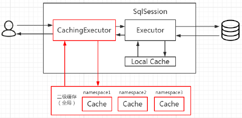
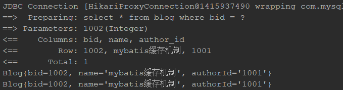

# MyBatis Notes

## Mybatis中的JDBCType

[MyBatis中文官网：MyBatis JdbcType介绍](http://www.mybatis.cn/archives/150.html)

| JDBC Type     | Java Type                  |
| ------------- | -------------------------- |
| CHAR          | String                     |
| VARCHAR       | String                     |
| LONGVARCHAR   | String                     |
| NUMERIC       | java.math.BigDecimal       |
| DECIMAL       | java.math.BigDecimal       |
| BIT           | boolean                    |
| BOOLEAN       | boolean                    |
| TINYINT       | byte                       |
| SMALLINT      | short                      |
| INTEGER       | INTEGER                    |
| BIGINT        | long                       |
| REAL          | float                      |
| FLOAT         | double                     |
| DOUBLE        | double                     |
| BINARY        | byte[]                     |
| VARBINARY     | byte[]                     |
| LONGVARBINARY | byte[]                     |
| DATE          | java.sql.Date              |
| TIME          | java.sql.Time              |
| TIMESTAMP     | java.sql.Timestamp         |
| CLOB          | Clob                       |
| BLOB          | Blob                       |
| ARRAY         | Array                      |
| DISTINCT      | mapping of underlying type |
| STRUCT        | Struct                     |
| REF           | Ref                        |
| DATALINK      | java.net.URL               |

## MyBatis扩展点

[MyBatis的扩展点(plugins)](https://blog.csdn.net/weixin_34179762/article/details/92410945)

MyBatis的扩展是通过拦截器Interceptor来实现的，本质上就是JDK的动态代理，所以它只能对接口进行拦截，MyBatis可以对以下四个接口类型进行拦截，也就是说会对这4种对象进行代理，所有的代理拦截都是通过 `InterceptorChain.pluginAll(Object target)` 来实现的。

- **Executor**：执行器，执行SQL语句（所有的sql都通过它来执行），并且对事务、缓存等提供统一接口。
  - 在这一层上做拦截的权限会更大
- **StatementHandler**：对statement进行预处理，并且提供统一的原子的增、删、改、查接口。
  - 如果要在SQL执行前进行拦截的话，拦截这里就可以了
- **ResultSetHandler**：对返回结果ResultSet进行处理
- **PameterHandler**：对参数进行赋值

## MyBatis缓存

[MyBatis缓存机制](MyBatisCache.md)

缓存是一般的ORM 框架都会提供的功能，目的就是提升查询的效率和减少数据库的压力。跟Hibernate 一样，MyBatis 也有一级缓存和二级缓存，并且预留了集成第三方缓存的接口。

MyBatis 跟缓存相关的类都在cache 包里面，其中有一个Cache 接口，只有一个默认的实现类 PerpetualCache，它是用HashMap 实现的。


### 一级缓存

MyBaits 称其为 Local Cache

一级缓存也叫本地缓存，MyBatis 的一级缓存是在会话（SqlSession）层面进行缓存的。MyBatis 的一级缓存是默认开启的，不需要任何的配置。

一级缓存的不足：

使用一级缓存的时候，因为缓存不能跨会话共享，不同的会话之间对于相同的数据可能有不一样的缓存。**在有多个会话或者分布式环境下，会存在脏数据的问题。**如果要解决这个问题，就要用到二级缓存。

MyBatis 一级缓存**无法关闭**，但是有两种级别可选：

1. **Session级别的缓存**，在同一个 sqlSession 内，对同样的查询将不再查询数据库，直接从缓存中。
2. **Statement级别的缓存**，避坑： 为了避免这个问题，可以将一级缓存的级别设为 statement 级别的，这样每次查询结束都会清掉一级缓存。

### 二级缓存

二级缓存是用来解决一级缓存不能跨会话共享的问题的，范围是namespace级别的，可以被多个SqlSession 共享（只要是同一个Mapper里面的相同方法，都可以共享），生命周期和应用同步。

二级缓存是需要配置开启的。

如果你的MyBatis使用了二级缓存，并且你的Mapper和select语句也配置使用了二级缓存，那么在执行select查询的时候，MyBatis会先从二级缓存中取输入，其次才是一级缓存，即MyBatis查询数据的顺序是：二级缓存 → 一级缓存 → 数据库。

MyBatis 用了一个装饰器的类来维护二级缓存，就是CachingExecutor。如果启用了二级缓存，MyBatis 在创建Executor 对象的时候会对Executor 进行装饰。CachingExecutor 对于查询请求，会判断二级缓存是否有缓存结果，如果有就直接返回，如果没有委派交给真正的查询器Executor 实现类，比如SimpleExecutor 来执行查询，再走到一级缓存的流程。最后会把结果缓存起来，并且返回给用户。



开启二级缓存

```xml
<!--mybatis-configuration.xml 打开二级缓存开关  -->
<settings>    
	<setting name="cacheEnabled" value="true"/>
</settings>
```

```xml
<!-- UserMapper.xml 开启具体Mapper的二级缓存，以下两种方式二选一 -->
<cache /> <!--mapper节点下-->
<cache type="org.apache.ibatis.cache.impl.PerpetualCache" /> <!--默认实现类-->

<!-- 禁用具体某个查询的二级缓存：useCache="false" -->
<select id="selectUserByUserId" useCache="false" resultType="com.ys.twocache.User" parameterType="int">    
  select * from user where id=#{id}
</select>

<!-- 执行完commit操作都需要刷新缓存，flushCache=true表示刷新缓存，这样可以避免数据库脏读。默认为true -->
<select id="selectUserByUserId" flushCache="true" useCache="false" resultType="com.ys.twocache.User" parameterType="int">    
  select * from user where id=#{id}
</select>
```

```xml
<!-- UserMapper.xml 开启具体Mapper的二级EhCache缓存 -->
<cache type="org.mybatis.caches.ehcache.EhcacheCache" ></cache>

<!-- ehcache.xml -->
<?xml version="1.0" encoding= "UTF-8" ?>
<ehcache xmlns:xsi= "http://www.w3.org/2001/XMLSchema-instance" xsi:noNamespaceSchemaLocation= "../config/ehcache.xsd" >
  <diskStore path= "F:\develop\ehcache" />
  <defaultCache maxElementsInMemory= "10000"
                eternal= "false"
                timeToIdleSeconds= "120"
                timeToLiveSeconds= "120"
                maxElementsOnDisk= "10000000"
                diskExpiryThreadIntervalSeconds= "120"
                memoryStoreEvictionPolicy= "LRU">
    <persistence strategy= "localTempSwap" />
  </defaultCache>
</ehcache>
```

## MyBatis中的 #{} 和 ${}

> https://www.cnblogs.com/xiao-lin-unit/p/13644004.html

1、在MyBatis 的映射配置文件中，动态传递参数有两种方式：

（1）`#{}` 占位符

（2）`${}` 拼接符

2、`#{}` 和 `${}` 的区别

（1）

　　1）`#{}` 为参数占位符 ?，即sql 预编译

　　2）`${}` 为字符串替换，即 sql 拼接

（2）

　　1）`#{}`：动态解析 -> 预编译 -> 执行

　　2）`${}`：动态解析 -> 编译 -> 执行

（3）

　　1）`#{}` 的变量替换是在 DBMS 中

　　2）`${}` 的变量替换是在 DBMS 外

（4）

　　1）变量替换后，`#{}` 对应的变量自动加上单引号 ''

　　2）变量替换后，`${}` 对应的变量不会加上单引号 ''

（5）

　　1）`#{}` 能防止sql 注入

　　2）`${}` 不能防止sql 注入

3、`#{}` 和 `${}` 的实例：假设传入参数为 1

（1）开始

　　1）`#{}`：select * from t_user where uid=#{uid}

　　2）`${}`：select * from t_user where uid= '${uid}'

（2）然后

1）`#{}`：select * from t_user where uid= ?

2）`${}`：select * from t_user where uid= '1'

（3）最后

　　1）`#{}`：select * from t_user where uid= '1'

　　2）`${}`：select * from t_user where uid= '1'

4、`#{}` 和 `${}` 的大括号中的值

（1）单个参数的情形

　　1）`#{}`：无MyBatis 默认值，可任意，且与参数名无关


　　2）`${}`：

　　　　<1>使用 MyBatis 默认值 value，即 ${value}


　　　　<2>使用自定义参数名，前提：在映射器接口方法的参数前加注解@Param("")


（2）多个参数的情形

　　1）`#{}`

　　　　<1>使用MyBatis 默认值 `arg0`、`arg1`、`arg2 `… 或 `param1`、`param2`、`param3`…


　　　　<2>使用自定义参数名，前提：在映射器接口方法的参数前加注解@Param("")


　　2）`${}`

　　　　<1>使用MyBatis 默认值 `arg0`、`arg1`、`arg2`… 或 `param1`、`param2`、`param3`…


　　　　<2>使用自定义参数名，前提：在映射器接口方法的参数前加注解@Param("")


　　　　注：@Param("") 是 @Param(value="") 的简写

5、`#{}` 和 `${}` 在使用中的技巧和建议

（1）不论是单个参数，还是多个参数，一律都建议使用注解@Param("")

（2）能用 `#{}` 的地方就用 `#{}`，不用或少用 `${}`

（3）表名作参数时，必须用 `${}`。如：select * from `${tableName}`

（4）order by 时，必须用 `${}`。如：select * from t_user order by `${columnName}`

（5）使用 `${}` 时，要注意何时加或不加单引号，即 `${}` 和 '`${}`'


# MyBatis问题总结

## 介绍下MyBatis中的工作原理

1。介绍MyBatis的基本情况：ORM

2。原理：

* MyBatis框架的初始化操作
* 处理SQL请求的流程

1.系统启动的时候会加载解析全局配置文件和对应映射文件。加载解析的相关信息存储在 Configuration 对象

```
@Test
    public void test1() throws  Exception{
        // 1.获取配置文件
        InputStream in = Resources.getResourceAsStream("mybatis-config.xml");
        // 2.加载解析配置文件并获取SqlSessionFactory对象
        // SqlSessionFactory 的实例我们没有通过 DefaultSqlSessionFactory直接来获取
        // 而是通过一个Builder对象来建造的
        // SqlSessionFactory 生产 SqlSession 对象的  SqlSessionFactory 应该是单例
        // 全局配置文件和映射文件 也只需要在 系统启动的时候完成加载操作
        // 通过建造者模式来 构建复杂的对象  1.完成配置文件的加载解析  2.完成SqlSessionFactory的创建
        SqlSessionFactory factory = new SqlSessionFactoryBuilder().build(in);
        // 3.根据SqlSessionFactory对象获取SqlSession对象
        SqlSession sqlSession = factory.openSession();
        // 4.通过SqlSession中提供的 API方法来操作数据库
        List<User> list = sqlSession.selectList("com.boge.mapper.UserMapper.selectUserList");
        // 获取接口的代码对象  得到的其实是 通过JDBC代理模式获取的一个代理对象
       // UserMapper mapper = sqlSession.getMapper(UserMapper.class);
        //List<User> list = mapper.selectUserList();
        System.out.println("list.size() = " + list.size());

        // 5.关闭会话
        sqlSession.close(); // 关闭session  清空一级缓存

    }
```

SqlSessionFactory: new DefaultSqlSessionFactory  全局配置文件的加载解析【Configuration】，映射文件的加载解析【Configuration，MappedStatement】

SqlSession：new DefaultSqlSession,创建相关的事务工厂，完成Executor的创建，已经二级缓存 CachingExecutor的装饰，同时完成了插件逻辑的植入。

selectOne();  二级缓存 -> 一级缓存 --> 数据库插入

SqlSession.getMapper();


源码结构


## 介绍下MyBatis中的缓存设计

1。缓存的作用

```
缓存的作用：减低数据源的访问频率。从而提高数据源的处理能力。或者提高服务器的响应速度
```

2。MyBatis中的缓存设计

* MyBatis中的缓存的架构设计：装饰器模式
* MyBatis中的一级缓存和二级缓存
* 一级缓存：session级别
* 二级缓存：SqlSessionFactory级别

**缓存的设计**

```
  通过装饰模式实现缓存功能扩展
```

**缓存的应用**

```
  一级缓存和二级缓存
```

一级缓存和二级缓存的顺序问题：先二级缓存再一级缓存

为什么会先走二级缓存再走一级缓存？

二级缓存的作用域是SqlSessionFactory级别-90%找到

一级缓存是SqlSession级别的-5%找到

1  2

2 1

一级缓存开关

二级缓存开关

## 聊下MyBatis中如何实现缓存的扩展

1。考察你的MyBatis中缓存架构的理解

2。考察你对MyBatis缓存的扩展。实际动手能力

* 创建Cache接口的实现。重新getObject和putObject方法
* 怎么让我们自定义的实现：在cache标签中通过type属性关联我们自定义的Cache接口的实现

## MyBatis中涉及到的设计模式

1。从MyBatis的整体架构设计来分析

基础模块：

缓存模块：装饰器模式

日志模块：适配器模式【策略模式】代理模式

反射模块：工厂模式，装饰器模式

Mapping:代理模式

SqlSessionFactory  ：SqlSessionFactoryBuilder 建造者模式

模板方法模式：

## 谈谈你对SqlSessionFactory的理解

SqlSessionFactory是MyBatis中非常核心的一个API。是一个SqlSessionFactory工厂。目的是创建SqlSession对象。SqlSessionFactory应该是单例。SqlSessionFactory对象的创建是通过SqlSessionFactoryBuilder来实现。在SqlSessionFactoryBuilder即完成了SqlSessionFactory对象的创建。也完成了全局配置文件和相关的映射文件的加载和解析操作。相关的加载解析的信息会被保存在Configuration对象中。

而且涉及到了两种涉及模式：工厂模式，建造者模式

## 谈谈你对SqlSession的理解

SqlSession是MyBatis中非常核心的一个API：作用是通过相关API来实现对应的数据库数据的操作。

SqlSession对象的获取需要通过SqlSessionFactory来实现。是一个会话级别的。当一个新的会话到来的时候。我们需要新建一个SqlSession对象来处理。当一个会话结束后我们需要关闭相关的会话资源。处理请求的方式：

1. 通过相关的增删改查的API直接处理
2. 可以通过getMapper(xxx.class) 来获取相关的mapper接口的代理对象来处理

## 谈谈你对MyBatis的理解

MyBatis应该是我们在工作中使用频率最高的一个ORM框架。持久层框架

1. 提供非常方便的API来实现增删改查操作
2. 支持灵活的缓存处理方案，一级缓存、二级缓存，三级缓存
3. 还支持相关的延迟数据加载的处理
4. 还提供了非常多的灵活标签来实现复杂的业务处理，if forech where trim set bind ...
5. 相比于Hibernate会更加的灵活

## 谈谈MyBatis中的分页原理

1。谈谈分页的理解：数据太多。用户并不需要这么多。我们的内存也放不下这么多的数据

```
SQL：
    MySQL：limit
    Oracle：rowid
```

2。谈谈MyBatis中的分页实现

在MyBatis中实现分页有两种实现

1. 逻辑分页：RowBounds
2. 物理分页：拦截器实现

## Spring中是如何解决DefaultSqlSession的数据安全问题的

DefaultSqlSession是线程非安全的。也就意味着我们不能够把DefaultSqlSession声明在成员变量中。

在Spring中提供了一个SqlSessionTemplate来实现SqlSession的相关的定义。然后在SqlSessionTemplate中的每个方法都通过SqlSessionProxy来操作。这个是一个动态代理对象。然后在动态代理对象中通过方法级别的DefaultSqlSession来实现相关的数据库的操作

## 谈谈你对MyBatis中的延迟加载的理解

延迟加载：等一会加载。在多表关联查询操作的时候可以使用到的一种方案。如果是单表操作就完全没有延迟加载的概念。比如。查询用户和部门信息。如果我们仅仅只是需要用户的信息。而不需要用户对应的部门信息。这时就可以使用延迟加载机制来处理。

1。需要开启延迟加载


2。需要配置多表关联

* association 一对一的关联配置
* collection 一对多的关联配置

延迟加载的原理：代理对象

## 谈谈对MyBatis中插件的原理理解

MyBatis中的插件设计的目的是什么：方便我们开发人员实现对MyBatis功能的增强

设计中允许我们对：

* Executor
* ParameterHandler
* ResultSetHandler
* StatementHandler

这四个对象的相关方法实现增强

要实现自定义的拦截器：

1. 创建自定义的Java类。通过@Interceptors注解来定义相关的方法签名
2. 我们需要在对应的配置文件中通过plugins来注册自定义的拦截器

我们可以通过拦截器做哪些操作？

1. 检查执行的SQL。比如 sql 中有select * . delete from 。。。
2. 对执行的SQL的参数做处理
3. 对查询的结果做装饰处理
4. 对查询SQL的分表处理

## 使用MyBatis的mapper接口调用时有哪些要求？

MyBatis中的Mapper接口实现的本质是代理模式

1. Mapper映射文件的namespace的值必须是Mapper接口对应的全类路径的名称
2. Mapper接口中的方法名必须在mapper的映射文件中有对应的sql的id
3. Mapper接口中的入参类型必须和mapper映射文件中的每个sql 的parameterType类型相同
4. Mapper接口中的出参类型必须和mapper映射文件中的么个sql的resultType类型相同
5. 接口名称和Mapper映射文件同名

## 如何获取MyBatis中自增的主键

需要获取自增的主键：在同一个事务中操作多表。我们需要关联的id信息。

```xml
<insert id="xxx" useGeneratedKeys="true" keyProperty="id">
```

```java
User user = new User();
userMapper.insert(user);
System.out.println("自增的主键:id" + user.getId());
```

## 不同Mapper中的id是否可以相同？

可以相同：每一个映射文件的namespace都会设置为对应的mapper接口的全类路径名称。也就是保证了每一个Mapper映射文件的namespace是惟一的。那么我们只需要满足在同一个映射文件中的id是不同的就可以了

UserMapper.xml: com.boge.mapper.UserMapper  #selectList

RoleMapper.xml com.boge.mapper.RoleMapper   #selectList

## 谈谈你对MyBatis的架构设计的理解

1. 接口层：面向开发者。提供相关的API
2. 核心层：MyBatis的核心功能的实现：增删改查操作
3. 基础模块：由很多相互之间没用关联的模块组成。作用是支持核心层来完成核心的功能


## 传统JDBC的不足和MyBatis的解决方案

1. 我们需要频繁的创建和释放数据库库的连接对象。会造成系统资源的浪费。从而影响系统的性能，针对这种情况我们的解决方案是数据库连接池。然后在MyBatis中的全局配置文件中我们可以设置相关的数据库连接池。当然和Spring整合后我们也可以配置相关的数据库连接。
2. SQL语句我们是直接添加到了代码中了，造成维护的成本增加。所以对应SQL的动态性要求比较高。这时我们可以考虑把SQL和我们的代码分离，在MyBatis中专门提供了映射文件。我们在映射文件中通过标签来写相关的SQL
3. 向SQL中传递参数也很麻烦，因为SQL语句的where条件不一定。可能有很多值也可能很少。占位符和参数需要一一对应。在MyBatis中自动完成java对象和sql中参数的映射
4. 对于结果集的映射也很麻烦，主要是SQL本身的变化会导致解析的难度。我们的解决方案。在MyBatis中通过ResultSetHandler来自动把结果集映射到对应的Java对象中。
5. 传统的JDBC操作不支持事务。缓存。延迟加载等功能。在MyBatis中都提供了相关的实现

## MyBatis编程步骤是怎么样的？

1. 创建SqlSessionFactory--》SqlSessionFactoryBuilder --》建造成模式 --》Configuration
2. 通过创建的SqlSessionFactory对象来获取SqlSession对象 --》 Executor
3. 通过SqlSession对象执行数据库操作 --》API和Mapper接口代理对象  --》缓存 --》装饰者模式
4. 调用SqlSession中的commit方法来显示的提交事务 --》 数据源和事务模块 --》 JDBC和Managed
5. 调式SqlSession中的close方法来关闭会话

## 当实体中的属性和表中的字段不一致的情况下怎么办？

1. 我们可以在对应的SQL语句中通过别名的方式来解决这个问题
2. 我们通过自定义resultMap标签来设置属性和字段的映射关系

## 谈谈你对MyBatis中的Executor的理解

Executor的类型有三类：

* SIMPLE:默认  SimpleExecutor：每次操作都是一个新的Statement对象
* REUSE： ReuseExecutor，会根据SQL缓存Statement对象。实现Statement对象的复用
* BATCH： BatchExecutor 批处理

## 如何设置MyBatis的Executor类型

Executor的类型有三类：

* SIMPLE:默认  SimpleExecutor：每次操作都是一个新的Statement对象
* REUSE： ReuseExecutor，会根据SQL缓存Statement对象。实现Statement对象的复用
* BATCH： BatchExecutor 批处理

如何指定我们需要使用的类型呢？

1. 可以通过SqlSessionFactory的openSession方法中来指导对应的处理器类型
2. 可以通过全局配置文件中的settings来配置默认的执行器

## MyBatis中如何实现多个传参

### 循序传值

```java
public void selectUser(String name,int deptId);
```

```xml
<select id="selectUser" resultMap="baseResultMap">
    select * from t_user where user_name = #{0} and dept_id= #{1}
</select>
```

#{}里面的数字代表的是入参的顺序

但是这种方法不建议使用，SQL层次表达不直观，而且一旦循序错了很难找到。

###  @Param注解传值

```java
public void selectUser(@Param("name")String name,@Param("deptId")int deptId);
```

```xml
<select id="selectUser" resultMap="baseResultMap">
    select * from t_user where user_name = #{name} and dept_id= #{deptId}
</select>
```

#{}里面的名称对应的就是@Param注解中修饰的名称。

这种方案我们是非常推荐使用的。因为很直观。

### 通过Map传值

```java
public void selectUser(Map<String,Object> map);
```

```xml
<select id="selectUser" parameterType="java.util.Map" resultMap="baseResultMap">
    select * from t_user where user_name = #{name} and dept_id= #{deptId}
</select>
```

#{}里面的名称就是Map中对应的Key

这种方案适合传递多个参数，且参数灵活应变值得推荐

### 通过自定义对象传递

```java
public void selectUser(User user);
```

```xml
<select id="selectUser" parameterType="com.boge.bean.User" resultMap="baseResultMap">
    select * from t_user where user_name = #{name} and dept_id= #{deptId}
</select>
```

#{} 中的名称就是自定义对象的属性名称

这种方案很直观。但是需要创建一个实体类。扩展不容易。需要添加属性。但是代码的可读性很高。业务逻辑处理也非常方便。值得推荐

## 谈谈你对日志模块的理解

1. MyBatis中的日志模块使用了适配器模式
2. 如果我们需要适配MyBatis没有提供的日志框架。那么对应的需要添加相关的适配类

3. 在全局配置文件中设置日志的实现

4. 在MyBatis的日志框架中提供了一个 jdbc 这个包。里面实现了JDBC相关操作的日志记录

## 谈谈MyBatis中能够记录SQL执行的原理

在MyBatis中对执行JDBC操作的日志记录的本质是创建了相关核心对象的代理对象

* Connection -- ConnectionLogger
* PreparedStatement -- PreparedStatementLogger
* ResultSet --ResultSetLogger

本质就是通过代理对象来实现的。代理对象中完成相关的日志操作。然后再调用对应的目标对象完成相关的数据库的操作处理。

## MyBatis中数据源模块的设计

在MyBatis中单独设计了DataSource这个数据源模块


在使用MyBatis的时候我们都需要单独的设置DataSource


完成相关的DataSource节点的解析


UnpooledDataSource：非数据库连接池的实现

PooledDataSource：数据库连接池的实现

* 从连接池中获取连接对象：如果有空闲连接直接返回。活跃连接数是否超过了最大连接数。是否有连接超时的连接
* 数据库连接池关闭连接。如果空闲连接没有超过最大连接数那么就放回空闲队列中。否则关闭真实的连接


## MyBatis中事务模块的设计

1。谈谈你对事务的理解【ACID】

2。MyBatis中的事务的管理


事务接口的定义：定义了事务的基本行为


3。在MyBatis的事务管理中有两个选择

* jdbc：在MyBatis中自己处理事务的管理
* Managed：在MyBatis中没有处理任何的事务操作。这种情况下事务的处理会交给Spring容器来管理

4。如何设置事务管理的方式


5。在MyBatis中执行DML操作事务的处理逻辑

SqlSession.commit();

## 谈谈你对Mapper接口的设计理解

1。谈下MyBatis中Mapper接口对应的规则

2。谈下MyBatis中的Mapper接口的设计原理--代理模式的使用

3。代理对象执行的逻辑的本质还是会执行SqlSession中相关的DML操作的方法


4。为什么会多一个代理对象的处理

## 谈谈你对Reflector模块的理解

Reflector是MyBatis中提供的一个针对反射封装简化的模块：简化反射的相关操作。MyBatis是一个ORM框架。表结构的数据和Java对象中数据的映射。那么不可避免的会存在非常多的反射操作。

Reflector是一个独立的模块。我们是可以把这个模块单独抽取出来直接使用的。

反射模块的具体的设计


## 谈谈你对MyBatis中的类型转换模块的理解

MyBatis中是如何解决Java中的类型和数据库中字段类型的映射。


类型转换处理器的设计

TypeHandler --》 BaseTypeHandler---》具体的TypeHandler

预处理占位符赋值


## 谈谈MyBatis和Spring的整合的理解

1。回答的比较简单些。梳理下MyBatis和Spring整合的步骤

* 单纯的Spring和MyBatis的整合
* 在SpringBoot项目中的整合


2。重点分析下整合的jar包的原理

MybatisSqlSessionFactoryBean--》 这个就是我们需要关注的重点了。

## 谈谈你对MyBatis的理解

MyBatis是一个非常主流的半自动的ORM框架。非常简便的帮助我们完成相关的数据库操作。

提供动态SQL，缓存和延迟加载等高级功能。

然后整体的架构非常简单

* 外层接口
* 核心处理层
* 基础模块


# MyBatis Plus入门

> 原文来自哔哩哔哩南哥
>
> 国产的开源框架，基于 MyBatis
>
> 核心功能就是简化 MyBatis 的开发，提高效率

## MyBatis Plus 快速上手

Spring Boot(2.3.0) + MyBatis Plus（国产的开源框架，并没有接入到 Spring 官方孵化器中）

1、创建 Maven 工程

2、pom.xml 引入 MyBatis Plus 的依赖

```xml
<dependency>
    <groupId>com.baomidou</groupId>
    <artifactId>mybatis-plus-boot-starter</artifactId>
    <version>3.3.1.tmp</version>
</dependency>
```

3、创建实体类

```java
package com.southwind.mybatisplus.entity;

import lombok.Data;

@Data
public class User {
    private Integer id;
    private String name;
    private Integer age;
}
```

4、创建 Mapper 接口

```java
package com.southwind.mybatisplus.mapper;

import com.baomidou.mybatisplus.core.mapper.BaseMapper;
import com.southwind.mybatisplus.entity.User;

public interface UserMapper extends BaseMapper<User> {

}
```

5、application.yml

```yaml
spring:
  datasource:
    driver-class-name: com.mysql.cj.jdbc.Driver
    url: jdbc:mysql://localhost:3306/db?useUnicode=true&characterEncoding=UTF-8
    username: root
    password: root
# 打印日志
mybatis-plus:
  configuration:
    log-impl: org.apache.ibatis.logging.stdout.StdOutImpl
```

6、启动类需要添加 @MapperScan("mapper所在的包")，否则无法加载 Mppaer bean。

```java
package com.southwind.mybatisplus;

import org.mybatis.spring.annotation.MapperScan;
import org.springframework.boot.SpringApplication;
import org.springframework.boot.autoconfigure.SpringBootApplication;

@SpringBootApplication
@MapperScan("com.southwind.mybatisplus.mapper")
public class MybatisplusApplication {

    public static void main(String[] args) {
        SpringApplication.run(MybatisplusApplication.class, args);
    }

}
```

7、测试

```java
package com.southwind.mybatisplus.mapper;

import org.junit.jupiter.api.Test;
import org.springframework.beans.factory.annotation.Autowired;
import org.springframework.boot.test.context.SpringBootTest;

@SpringBootTest
class UserMapperTest {

    @Autowired
    private UserMapper mapper;

    @Test
    void test(){
        mapper.selectList(null).forEach(System.out::println);
    }

}
```


## 常用注解

### @TableName

映射数据库的表名

```java
package com.southwind.mybatisplus.entity;

import com.baomidou.mybatisplus.annotation.TableName;
import lombok.Data;

@Data
@TableName(value = "user")
public class Account {
    private Integer id;
    private String name;
    private Integer age;
}
```

### @TableId

设置主键映射，value 映射主键字段名

type 设置主键类型，主键的生成策略，

```java
@TableId(value = "id", type = IdType.AUTO)

AUTO(0),
NONE(1),
INPUT(2),
ASSIGN_ID(3),
ASSIGN_UUID(4),
/** @deprecated */
@Deprecated
ID_WORKER(3),
/** @deprecated */
@Deprecated
ID_WORKER_STR(3),
/** @deprecated */
@Deprecated
UUID(4);
```

| 值          | 枚举值 | 描述                                                         |
| ----------- | ------ | ------------------------------------------------------------ |
| AUTO        | 0      | 数据库自增，默认就是数据库自增，开发者无需赋值               |
| NONE        | 1      | MybatisPlus设置主键，雪花算法实现                            |
| INPUT       | 2      | 需要开发者手动赋值，如果开发者没有手动赋值，则数据库通过自增的方式给主键赋值，如果开发者手动赋值，则存入该值。 |
| ASSIGN_ID   | 3      | MybatisPlus 分配 ID，Long、Integer、String，自动赋值，雪花算法 |
| ASSIGN_UUID | 4      | 分配 UUID，String，主键的数据类型必须是 String，自动生成 UUID 进行赋值 |

### @TableField

```
@TableField(value = "user_name")
```

映射非主键字段，value 映射字段名

exist 表示是否为数据库字段 false，如果实体类中的成员变量在数据库中没有对应的字段，则可以使用 exist，VO、DTO

select 表示是否查询该字段

fill 表示是否自动填充，将对象存入数据库的时候，由 MyBatis Plus 自动给某些字段赋值，create_time、update_time

1、给表添加 create_time、update_time 字段

2、实体类中添加成员变量

```java
package com.southwind.mybatisplus.entity;

import com.baomidou.mybatisplus.annotation.FieldFill;
import com.baomidou.mybatisplus.annotation.TableField;
import com.baomidou.mybatisplus.annotation.TableId;
import com.baomidou.mybatisplus.annotation.TableName;
import lombok.Data;

import java.util.Date;

@Data
@TableName(value = "user")
public class User {
    @TableId
    private String id;
    @TableField(value = "name",select = false)
    private String title;
    private Integer age;
    @TableField(exist = false)
    private String gender;
    @TableField(fill = FieldFill.INSERT)
    private Date createTime;
    @TableField(fill = FieldFill.INSERT_UPDATE)
    private Date updateTime;
}
```

3、创建自动填充处理器

```java
package com.southwind.mybatisplus.handler;

import com.baomidou.mybatisplus.core.handlers.MetaObjectHandler;
import org.apache.ibatis.reflection.MetaObject;
import org.springframework.stereotype.Component;

import java.util.Date;

@Component
public class MyMetaObjectHandler implements MetaObjectHandler {
    @Override
    public void insertFill(MetaObject metaObject) {
        this.setFieldValByName("createTime",new Date(),metaObject);
        this.setFieldValByName("updateTime",new Date(),metaObject);
    }

    @Override
    public void updateFill(MetaObject metaObject) {
        this.setFieldValByName("updateTime",new Date(),metaObject);
    }
}
```

### @Version

标记乐观锁，通过 version 字段来保证数据的安全性，当修改数据的时候，会以 version 作为条件，当条件成立的时候才会修改成功。

```
线程1：update ... set version = 2 where version = 1
线程2：update ... set version = 2 where version = 1
```

1、数据库表添加 version 字段，默认值为 1

2、实体类添加 version 成员变量，并且添加 @Version

```java
package com.southwind.mybatisplus.entity;

import com.baomidou.mybatisplus.annotation.*;
import lombok.Data;

import java.util.Date;

@Data
@TableName(value = "user")
public class User {
    
    @TableId
    private String id;
    
    @TableField(value = "name",select = false)
    private String title;
    
    private Integer age;
    
    @TableField(exist = false)
    private String gender;
    
    @TableField(fill = FieldFill.INSERT)
    private Date createTime;
    
    @TableField(fill = FieldFill.INSERT_UPDATE)
    private Date updateTime;
    
    @Version
    private Integer version;
}
```

3、注册配置类

```java
package com.southwind.mybatisplus.config;

import com.baomidou.mybatisplus.extension.plugins.OptimisticLockerInterceptor;
import org.springframework.context.annotation.Bean;
import org.springframework.context.annotation.Configuration;

@Configuration
public class MyBatisPlusConfig {
    @Bean
    public OptimisticLockerInterceptor optimisticLockerInterceptor(){
        return new OptimisticLockerInterceptor();
    }
}
```

### @EnumValue

1、通用枚举类注解方式，将数据库字段映射成实体类的枚举类型成员变量

```java
package com.southwind.mybatisplus.enums;

import com.baomidou.mybatisplus.annotation.EnumValue;

public enum StatusEnum {
    WORK(1,"上班"),
    REST(0,"休息");

    StatusEnum(Integer code, String msg) {
        this.code = code;
        this.msg = msg;
    }

    @EnumValue
    private Integer code;
    private String msg;
}
```

```java
package com.southwind.mybatisplus.entity;

import com.baomidou.mybatisplus.annotation.*;
import com.southwind.mybatisplus.enums.StatusEnum;
import lombok.Data;

import java.util.Date;

@Data
@TableName(value = "user")
public class User {
    @TableId
    private String id;
    @TableField(value = "name",select = false)
    private String title;
    private Integer age;
    @TableField(exist = false)
    private String gender;
    @TableField(fill = FieldFill.INSERT)
    private Date createTime;
    @TableField(fill = FieldFill.INSERT_UPDATE)
    private Date updateTime;
    @Version
    private Integer version;
    private StatusEnum status;
}
```

application.yml

```yaml
type-enums-package:  com.southwind.mybatisplus.enums
```

2、实现接口的方式

```java
package com.southwind.mybatisplus.enums;

import com.baomidou.mybatisplus.core.enums.IEnum;

public enum AgeEnum implements IEnum<Integer> {
    ONE(1,"一岁"),
    TWO(2,"两岁"),
    THREE(3,"三岁");

    private Integer code;
    private String msg;

    AgeEnum(Integer code, String msg) {
        this.code = code;
        this.msg = msg;
    }

    @Override
    public Integer getValue() {
        return this.code;
    }
}
```

### @TableLogic

映射逻辑删除

1、数据表添加 deleted 字段

2、实体类添加注解

```java
package com.southwind.mybatisplus.entity;

import com.baomidou.mybatisplus.annotation.*;
import com.southwind.mybatisplus.enums.AgeEnum;
import com.southwind.mybatisplus.enums.StatusEnum;
import lombok.Data;

import java.util.Date;

@Data
@TableName(value = "user")
public class User {
    @TableId
    private String id;
    @TableField(value = "name",select = false)
    private String title;
    private AgeEnum age;
    @TableField(exist = false)
    private String gender;
    @TableField(fill = FieldFill.INSERT)
    private Date createTime;
    @TableField(fill = FieldFill.INSERT_UPDATE)
    private Date updateTime;
    @Version
    private Integer version;
    @TableField(value = "status")
    private StatusEnum statusEnum;
    @TableLogic
    private Integer deleted;
}
```

3、application.yml 添加配置

```yaml
global-config:
  db-config:
    logic-not-delete-value: 0
    logic-delete-value: 1
```


## 数据查询

```java
//mapper.selectList(null);
QueryWrapper wrapper = new QueryWrapper();
//        Map<String,Object> map = new HashMap<>();
//        map.put("name","小红");
//        map.put("age",3);
//        wrapper.allEq(map);
//        wrapper.gt("age",2);
//        wrapper.ne("name","小红");
//        wrapper.ge("age",2);

//				 like '%小'
//        wrapper.likeLeft("name","小");
//				 like '小%'
//        wrapper.likeRight("name","小");

//				 inSQL
//        wrapper.inSql("id","select id from user where id < 10");
//        wrapper.inSql("age","select age from user where age > 3");

//        wrapper.orderByDesc("age");

//        wrapper.orderByAsc("age");
//        wrapper.having("id > 8");

mapper.selectList(wrapper).forEach(System.out::println);
```


```java
//        System.out.println(mapper.selectById(7));
//        mapper.selectBatchIds(Arrays.asList(7,8,9)).forEach(System.out::println);

//Map 只能做等值判断，逻辑判断需要使用 Wrapper 来处理
//        Map<String,Object> map = new HashMap<>();
//        map.put("id",7);
//        mapper.selectByMap(map).forEach(System.out::println);

QueryWrapper wrapper = new QueryWrapper();
wrapper.eq("id",7);
////        System.out.println(mapper.selectCount(wrapper));
//
//        //将查询的结果集封装到Map中
//        mapper.selectMaps(wrapper).forEach(System.out::println);
//        System.out.println("-------------------");
//        mapper.selectList(wrapper).forEach(System.out::println);

//分页查询
//        Page<User> page = new Page<>(2,2);
//        Page<User> result = mapper.selectPage(page,null);
//        System.out.println(result.getSize());
//        System.out.println(result.getTotal());
//        result.getRecords().forEach(System.out::println);

//        Page<Map<String,Object>> page = new Page<>(1,2);
//        mapper.selectMapsPage(page,null).getRecords().forEach(System.out::println);

//        mapper.selectObjs(null).forEach(System.out::println);


System.out.println(mapper.selectOne(wrapper));
```


### 自定义SQL

```java
package com.southwind.mybatisplus.entity;

import lombok.Data;

@Data
public class ProductVO {
    private Integer category;
    private Integer count;
    private String description;
    private Integer userId;
    private String userName;
}
```

```java
package com.southwind.mybatisplus.mapper;

import com.baomidou.mybatisplus.core.mapper.BaseMapper;
import com.southwind.mybatisplus.entity.ProductVO;
import com.southwind.mybatisplus.entity.User;
import org.apache.ibatis.annotations.Select;

import java.util.List;

public interface UserMapper extends BaseMapper<User> {
    @Select("select p.*,u.name userName from product p,user u where p.user_id = u.id and u.id = #{id}")
    List<ProductVO> productList(Integer id);
}
```

### 添加

```java
User user = new User();
user.setTitle("小明");
user.setAge(22);
mapper.insert(user);
System.out.println(user);
```

### 删除

```java
//mapper.deleteById(1);
//        mapper.deleteBatchIds(Arrays.asList(7,8));
//        QueryWrapper wrapper = new QueryWrapper();
//        wrapper.eq("age",14);
//        mapper.delete(wrapper);

Map<String,Object> map = new HashMap<>();
map.put("id",10);
mapper.deleteByMap(map);
```

### 修改

```java
//        //update ... version = 3 where version = 2
//        User user = mapper.selectById(7);
//        user.setTitle("一号");
//
//        //update ... version = 3 where version = 2
//        User user1 = mapper.selectById(7);
//        user1.setTitle("二号");
//
//        mapper.updateById(user1);
//        mapper.updateById(user);

User user = mapper.selectById(1);
user.setTitle("小红");
QueryWrapper wrapper = new QueryWrapper();
wrapper.eq("age",22);
mapper.update(user,wrapper);
```


## QueryWrapper

原文：[MybatisPlus之QueryWrapper、LambdaQueryWrapper以及LambdaQueryChainWrapper用法](https://www.cnblogs.com/donleo123/p/14109889.html)

### QueryWrapper

```
 .like("email", "24252") //email对应数据库中列名
```

```java
/**
 * 条件构造器 查询操作
 */
@Test
void TestQueryWrapperSelect() {
    //1、条件用法
    List<User> userList = userMapper.selectList(
        new QueryWrapper<User>()
        .like("email", "24252")
        .between("age", 20, 22)
        .or()
        .eq("name", "zcx")
    );
    System.out.println("userList:" + userList);

    //2、排序用法
    List<User> users = userMapper.selectList(
        new QueryWrapper<User>()
        .eq("nick_name", "xx")
        .orderByAsc("age")  //升序
        //.orderByDesc("age") //降序
        .last("limit 0,3") //last用法：在sql末尾添加sql语句，有sql注入风险
    );
    System.out.println("users:"+users);
}
```

### LambdaQueryWrapper

```java
queryWrapper.eq(User::getName,"liangd1"); //可以通过Lambda获取数据库列名
```

```java
@Test
void TestLambdaQueryWrapper() {
    //1、查询单条
    LambdaQueryWrapper<User> queryWrapper = new LambdaQueryWrapper<>();
    queryWrapper.eq(User::getName,"liangd1");
    
    User selectOne = userMapper.selectOne(queryWrapper);
    System.out.println(selectOne);

    //2、查询list以及统计条数
    queryWrapper.eq(User::getName, "zcx");
    
    List<User> userList = userMapper.selectList(queryWrapper);
    System.out.println("userList:" + userList);
    Integer result = userMapper.selectCount(queryWrapper);
    System.out.println("result:" + result);
}
```

### LambdaQueryChainWrapper

```java
//链式查询方式
User one = new LambdaQueryChainWrapper<>(userMapper)
    .eq(User::getName, "liangd1")
    .one();
```

```java
@Test
void TestLambdaQueryChainWrapper() {
    //1、eq查询单条
    User one = new LambdaQueryChainWrapper<>(userMapper)
        .eq(User::getName, "liangd1")
        .one();
    System.out.println("UserOne:" + one);

    //2、查询list
    List<User> users = new LambdaQueryChainWrapper<>(userMapper)
        .eq(User::getName, "zcx")
        .list();
    System.out.println("UserList:" + users);

    //3、模糊查询
    List<User> LikeList = new LambdaQueryChainWrapper<>(userMapper)
        .like(User::getEmail, "test")
        .list();
    System.out.println("LikeUser:" + LikeList);
}
```


## MyBatisPlus系统生成器

根据数据表自动生成实体类、Mapper、Service、ServiceImpl、Controller

1、pom.xml 导入 MyBatis Plus Generator

```xml
<dependency>
    <groupId>com.baomidou</groupId>
    <artifactId>mybatis-plus-generator</artifactId>
    <version>3.3.1.tmp</version>
</dependency>

<dependency>
    <groupId>org.apache.velocity</groupId>
    <artifactId>velocity</artifactId>
    <version>1.7</version>
</dependency>
```

渲染框架：Velocity（默认）、Freemarker、Beetl

2、启动类

```java
package com.southwind.mybatisplus;

import com.baomidou.mybatisplus.annotation.DbType;
import com.baomidou.mybatisplus.generator.AutoGenerator;
import com.baomidou.mybatisplus.generator.config.DataSourceConfig;
import com.baomidou.mybatisplus.generator.config.GlobalConfig;
import com.baomidou.mybatisplus.generator.config.PackageConfig;
import com.baomidou.mybatisplus.generator.config.StrategyConfig;
import com.baomidou.mybatisplus.generator.config.rules.NamingStrategy;

public class Main {
    public static void main(String[] args) {
        //创建generator对象
        AutoGenerator autoGenerator = new AutoGenerator();
        //数据源
        DataSourceConfig dataSourceConfig = new DataSourceConfig();
        dataSourceConfig.setDbType(DbType.MYSQL);
        dataSourceConfig.setUrl("jdbc:mysql://ip:3306/db?useUnicode=true&characterEncoding=UTF-8");
        dataSourceConfig.setUsername("root");
        dataSourceConfig.setPassword("root");
        dataSourceConfig.setDriverName("com.mysql.cj.jdbc.Driver");
        autoGenerator.setDataSource(dataSourceConfig);
        //全局配置
        GlobalConfig globalConfig = new GlobalConfig();
        globalConfig.setOutputDir(System.getProperty("user.dir")+"/src/main/java");
        globalConfig.setOpen(false);
        globalConfig.setAuthor("Shreker.");
        globalConfig.setServiceName("%sService");
        autoGenerator.setGlobalConfig(globalConfig);
        //包信息
        PackageConfig packageConfig = new PackageConfig();
        packageConfig.setParent("com.southwind.mybatisplus");
        packageConfig.setModuleName("generator");
        packageConfig.setController("controller");
        packageConfig.setService("service");
        packageConfig.setServiceImpl("service.impl");
        packageConfig.setMapper("mapper");
        packageConfig.setEntity("entity");
        autoGenerator.setPackageInfo(packageConfig);
        //配置策略
        StrategyConfig strategyConfig = new StrategyConfig();
        strategyConfig.setEntityLombokModel(true);
        strategyConfig.setNaming(NamingStrategy.underline_to_camel);
        strategyConfig.setColumnNaming(NamingStrategy.underline_to_camel);
        autoGenerator.setStrategy(strategyConfig);

        autoGenerator.execute();
    }
}
```


# MyBatis Cache

## [MyBatis 缓存详解](https://www.cnblogs.com/wuzhenzhao/p/11103043.html)

缓存是一般的ORM 框架都会提供的功能，目的就是提升查询的效率和减少数据库的压力。跟Hibernate 一样，MyBatis 也有一级缓存和二级缓存，并且预留了集成第三方缓存的接口。

缓存体系结构：


MyBatis 跟缓存相关的类都在cache 包里面，其中有一个Cache 接口，只有一个默认的实现类 PerpetualCache，它是用HashMap 实现的。我们可以通过 以下类找到这个缓存的庐山真面目

**DefaultSqlSession**

-> **BaseExecutor**

　　-> **PerpetualCache** localCache

　　　　->**private Map<Object, Object> cache = new HashMap();**

除此之外，还有很多的装饰器，通过这些装饰器可以额外实现很多的功能：回收策略、日志记录、定时刷新等等。但是无论怎么装饰，经过多少层装饰，最后使用的还是基本的实现类（默认PerpetualCache）。可以通过 CachingExecutor 类 Debug 去查看。


所有的缓存实现类总体上可分为三类：基本缓存、淘汰算法缓存、装饰器缓存。


## 一级缓存（本地缓存）：

一级缓存也叫本地缓存，MyBatis 的一级缓存是在会话（SqlSession）层面进行缓存的。MyBatis 的一级缓存是默认开启的，不需要任何的配置。首先我们必须去弄清楚一个问题，在MyBatis 执行的流程里面，涉及到这么多的对象，那么缓存PerpetualCache 应该放在哪个对象里面去维护？如果要在同一个会话里面共享一级缓存，这个对象肯定是在SqlSession 里面创建的，作为SqlSession 的一个属性。

DefaultSqlSession 里面只有两个属性，Configuration 是全局的，所以缓存只可能放在Executor 里面维护——SimpleExecutor/ReuseExecutor/BatchExecutor 的父类BaseExecutor 的构造函数中持有了PerpetualCache。在同一个会话里面，多次执行相同的SQL 语句，会直接从内存取到缓存的结果，不会再发送SQL 到数据库。但是不同的会话里面，即使执行的SQL 一模一样（通过一个Mapper 的同一个方法的相同参数调用），也不能使用到一级缓存。

每当我们使用MyBatis开启一次和数据库的会话，MyBatis会创建出一个SqlSession对象表示一次数据库会话。

在对数据库的一次会话中，我们有可能会反复地执行完全相同的查询语句，如果不采取一些措施的话，每一次查询都会查询一次数据库,而我们在极短的时间内做了完全相同的查询，那么它们的结果极有可能完全相同，由于查询一次数据库的代价很大，这有可能造成很大的资源浪费。

为了解决这一问题，减少资源的浪费，MyBatis会在表示会话的SqlSession对象中建立一个简单的缓存，将每次查询到的结果结果缓存起来，当下次查询的时候，如果判断先前有个完全一样的查询，会直接从缓存中直接将结果取出，返回给用户，不需要再进行一次数据库查询了。

如下图所示，MyBatis会在一次会话的表示----一个SqlSession对象中创建一个本地缓存(local cache)，对于每一次查询，都会尝试根据查询的条件去本地缓存中查找是否在缓存中，如果在缓存中，就直接从缓存中取出，然后返回给用户；否则，从数据库读取数据，将查询结果存入缓存并返回给用户。


一级缓存的生命周期有多长？

1. MyBatis在开启一个数据库会话时，会 创建一个新的SqlSession对象，SqlSession对象中会有一个新的Executor对象，Executor对象中持有一个新的PerpetualCache对象；当会话结束时，SqlSession对象及其内部的Executor对象还有PerpetualCache对象也一并释放掉。
2. 如果SqlSession调用了close()方法，会释放掉一级缓存PerpetualCache对象，一级缓存将不可用；
3. 如果SqlSession调用了clearCache()，会清空PerpetualCache对象中的数据，但是该对象仍可使用；
4. SqlSession中执行了任何一个update操作(update()、delete()、insert()) ，都会清空PerpetualCache对象的数据，但是该对象可以继续使用；

SqlSession 一级缓存的工作流程：

1. 对于某个查询，根据statementId,params,rowBounds来构建一个key值，根据这个key值去缓存Cache中取出对应的key值存储的缓存结果
2. 判断从Cache中根据特定的key值取的数据数据是否为空，即是否命中；
3. 如果命中，则直接将缓存结果返回；
4. 如果没命中：

5. 1. 去数据库中查询数据，得到查询结果；
   2. 将key和查询到的结果分别作为key,value对存储到Cache中；
   3. 将查询结果返回；

接下来我们来验证一下，MyBatis 的一级缓存到底是不是只能在一个会话里面共享，以及跨会话（不同session）操作相同的数据会产生什么问题。判断是否命中缓存：如果再次发送SQL 到数据库执行，说明没有命中缓存；如果直接打印对象，说明是从内存缓存中取到了结果。

1、在同一个session 中共享（不同session 不能共享）

```
//同Session
SqlSession session1 = sqlSessionFactory.openSession();
BlogMapper mapper1 = session1.getMapper(BlogMapper.class);
System.out.println(mapper1.selectBlogById(1002));
System.out.println(mapper1.selectBlogById(1002));
```

执行以上sql我们可以看到控制台打印如下信息（需配置mybatis.configuration.log-impl=org.apache.ibatis.logging.stdout.StdOutImpl），会发现我们两次的查询就发送了一次查询数据库的操作，这说明了缓存在发生作用：

**

PS：一级缓存在BaseExecutor 的query()——queryFromDatabase()中存入。在queryFromDatabase()之前会get()。


```
public <E> List<E> query(MappedStatement ms, Object parameter, RowBounds rowBounds, ResultHandler resultHandler, CacheKey key, BoundSql boundSql) throws SQLException {
        ErrorContext.instance().resource(ms.getResource()).activity("executing a query").object(ms.getId());
　　。。。。。。try {
                ++this.queryStack;//从缓存中获取
                list = resultHandler == null ? (List)this.localCache.getObject(key) : null;
                if (list != null) {
                    this.handleLocallyCachedOutputParameters(ms, key, parameter, boundSql);
                } else {//缓存中获取不到，查询数据库
                    list = this.queryFromDatabase(ms, parameter, rowBounds, resultHandler, key, boundSql);
                }
　　。。。。。。
    }
```


2.同一个会话中，update（包括delete）会导致一级缓存被清空


```
//同Session
SqlSession session1 = sqlSessionFactory.openSession();
BlogMapper mapper1 = session1.getMapper(BlogMapper.class);
System.out.println(mapper1.selectBlogById(1002));
Blog blog3 = new Blog();
blog3.setBid(1002);
blog3.setName("mybatis缓存机制修改");
mapper1.updateBlog(blog3);
session1.commit();// 注意要提交事务，否则不会清除缓存
System.out.println(mapper1.selectBlogById(1002));
```


一级缓存是在BaseExecutor 中的update()方法中调用clearLocalCache()清空的（无条件），query 中会判断。


```
public int update(MappedStatement ms, Object parameter) throws SQLException {
        ErrorContext.instance().resource(ms.getResource()).activity("executing an update").object(ms.getId());
        if (this.closed) {
            throw new ExecutorException("Executor was closed.");
        } else {　　　　　　  //清除本地缓存
            this.clearLocalCache();
            return this.doUpdate(ms, parameter);
        }
}
```


3.其他会话更新了数据，导致读取到脏数据（一级缓存不能跨会话共享）


```
SqlSession session1 = sqlSessionFactory.openSession();
BlogMapper mapper1 = session1.getMapper(BlogMapper.class);
SqlSession session2 = sqlSessionFactory.openSession();
BlogMapper mapper2 = session2.getMapper(BlogMapper.class);
System.out.println(mapper2.selectBlogById(1002));
Blog blog3 = new Blog();
blog3.setBid(1002);
blog3.setName("mybatis缓存机制1");
mapper1.updateBlog(blog3);
session1.commit();
System.out.println(mapper2.selectBlogById(1002));
```


一级缓存的不足：

使用一级缓存的时候，因为缓存不能跨会话共享，不同的会话之间对于相同的数据可能有不一样的缓存。在有多个会话或者分布式环境下，会存在脏数据的问题。如果要解决这个问题，就要用到二级缓存。MyBatis 一级缓存（MyBaits 称其为 Local Cache）无法关闭，但是有两种级别可选：

1. session 级别的缓存，在同一个 sqlSession 内，对同样的查询将不再查询数据库，直接从缓存中。
2. statement 级别的缓存，避坑： 为了避免这个问题，可以将一级缓存的级别设为 statement 级别的，这样每次查询结束都会清掉一级缓存。

## 二级缓存

二级缓存是用来解决一级缓存不能跨会话共享的问题的，范围是namespace 级别的，可以被多个SqlSession 共享（只要是同一个接口里面的相同方法，都可以共享），生命周期和应用同步。如果你的MyBatis使用了二级缓存，并且你的Mapper和select语句也配置使用了二级缓存，那么在执行select查询的时候，MyBatis会先从二级缓存中取输入，其次才是一级缓存，即MyBatis查询数据的顺序是：二级缓存  —> 一级缓存 —> 数据库。

作为一个作用范围更广的缓存，它肯定是在SqlSession 的外层，否则不可能被多个SqlSession 共享。而一级缓存是在SqlSession 内部的，所以第一个问题，肯定是工作在一级缓存之前，也就是只有取不到二级缓存的情况下才到一个会话中去取一级缓存。第二个问题，二级缓存放在哪个对象中维护呢？ 要跨会话共享的话，SqlSession 本身和它里面的BaseExecutor 已经满足不了需求了，那我们应该在BaseExecutor 之外创建一个对象。

实际上MyBatis 用了一个装饰器的类来维护，就是CachingExecutor。如果启用了二级缓存，MyBatis 在创建Executor 对象的时候会对Executor 进行装饰。CachingExecutor 对于查询请求，会判断二级缓存是否有缓存结果，如果有就直接返回，如果没有委派交给真正的查询器Executor 实现类，比如SimpleExecutor 来执行查询，再走到一级缓存的流程。最后会把结果缓存起来，并且返回给用户。


开启二级缓存的方法

第一步：配置 mybatis.configuration.cache-enabled=true，只要没有显式地设置cacheEnabled=false，都会用CachingExecutor 装饰基本的执行器。

第二步：在Mapper.xml 中配置<cache/>标签：

```
<cache type="org.apache.ibatis.cache.impl.PerpetualCache"
    size="1024"
eviction="LRU"
flushInterval="120000"
readOnly="false"/>
```

基本上就是这样。这个简单语句的效果如下:

- 映射语句文件中的所有 select 语句的结果将会被缓存。
- 映射语句文件中的所有 insert、update 和 delete 语句会刷新缓存。
- 缓存会使用最近最少使用算法（LRU, Least Recently Used）算法来清除不需要的缓存。
- 缓存不会定时进行刷新（也就是说，没有刷新间隔）。
- 缓存会保存列表或对象（无论查询方法返回哪种）的 1024 个引用。
- 缓存会被视为读/写缓存，这意味着获取到的对象并不是共享的，可以安全地被调用者修改，而不干扰其他调用者或线程所做的潜在修改。

这个更高级的配置创建了一个 FIFO 缓存，每隔 60 秒刷新，最多可以存储结果对象或列表的 512 个引用，而且返回的对象被认为是只读的，因此对它们进行修改可能会在不同线程中的调用者产生冲突。可用的清除策略有：

- `LRU` – 最近最少使用：移除最长时间不被使用的对象。
- `FIFO` – 先进先出：按对象进入缓存的顺序来移除它们。
- `SOFT` – 软引用：基于垃圾回收器状态和软引用规则移除对象。
- `WEAK` – 弱引用：更积极地基于垃圾收集器状态和弱引用规则移除对象。

默认的清除策略是 LRU。

flushInterval（刷新间隔）属性可以被设置为任意的正整数，设置的值应该是一个以毫秒为单位的合理时间量。 默认情况是不设置，也就是没有刷新间隔，缓存仅仅会在调用语句时刷新。

size（引用数目）属性可以被设置为任意正整数，要注意欲缓存对象的大小和运行环境中可用的内存资源。默认值是 1024。

readOnly（只读）属性可以被设置为 true 或 false。只读的缓存会给所有调用者返回缓存对象的相同实例。 因此这些对象不能被修改。这就提供了可观的性能提升。而可读写的缓存会（通过序列化）返回缓存对象的拷贝。 速度上会慢一些，但是更安全，因此默认值是 false。

注：二级缓存是事务性的。这意味着，当 SqlSession 完成并提交时，或是完成并回滚，但没有执行 flushCache=true 的 insert/delete/update 语句时，缓存会获得更新。

Mapper.xml 配置了<cache>之后，select()会被缓存。update()、delete()、insert()会刷新缓存。：如果cacheEnabled=true，Mapper.xml 没有配置标签，还有二级缓存吗？（没有）还会出现CachingExecutor 包装对象吗？（会）

只要cacheEnabled=true 基本执行器就会被装饰。有没有配置<cache>，决定了在启动的时候会不会创建这个mapper 的Cache 对象，只是最终会影响到CachingExecutorquery 方法里面的判断。如果某些查询方法对数据的实时性要求很高，不需要二级缓存，怎么办？我们可以在单个Statement ID 上显式关闭二级缓存（默认是true）：

```
<select id="selectBlog" resultMap="BaseResultMap" useCache="false">
```

二级缓存验证（验证二级缓存需要先开启二级缓存）

 1、事务不提交，二级缓存不存在

```
System.out.println(mapper1.selectBlogById(1002));
// 事务不提交的情况下，二级缓存不会写入
// session1.commit();
System.out.println(mapper2.selectBlogById(1002));
```

为什么事务不提交，二级缓存不生效？因为二级缓存使用TransactionalCacheManager（TCM）来管理，最后又调用了TransactionalCache 的getObject()、putObject 和commit()方法，TransactionalCache里面又持有了真正的Cache 对象，比如是经过层层装饰的PerpetualCache。在putObject 的时候，只是添加到了entriesToAddOnCommit 里面，只有它的commit()方法被调用的时候才会调用flushPendingEntries()真正写入缓存。它就是在DefaultSqlSession 调用commit()的时候被调用的。

2、使用不同的session 和mapper，验证二级缓存可以跨session 存在取消以上commit()的注释

3、在其他的session 中执行增删改操作，验证缓存会被刷新

```java
System.out.println(mapper1.selectBlogById(1002));
//主键自增返回测试
Blog blog3 = new Blog();
blog3.setBid(1002);
blog3.setName("mybatis缓存机制");
mapper1.updateBlog(blog3);
session1.commit();
System.out.println(mapper2.selectBlogById(1002));
```

为什么增删改操作会清空缓存？在CachingExecutor 的update()方法里面会调用flushCacheIfRequired(ms)，isFlushCacheRequired 就是从标签里面渠道的flushCache 的值。而增删改操作的flushCache 属性默认为true。

什么时候开启二级缓存？

一级缓存默认是打开的，二级缓存需要配置才可以开启。那么我们必须思考一个问题，在什么情况下才有必要去开启二级缓存？

1. 因为所有的增删改都会刷新二级缓存，导致二级缓存失效，所以适合在查询为主的应用中使用，比如历史交易、历史订单的查询。否则缓存就失去了意义。
2. 如果多个namespace 中有针对于同一个表的操作，比如Blog 表，如果在一个namespace 中刷新了缓存，另一个namespace 中没有刷新，就会出现读到脏数据的情况。所以，推荐在一个Mapper 里面只操作单表的情况使用。

如果要让多个namespace 共享一个二级缓存，应该怎么做？跨namespace 的缓存共享的问题，可以使用<cache-ref>来解决：

```
<cache-ref namespace="com.wuzz.crud.dao.DepartmentMapper" />
```

cache-ref 代表引用别的命名空间的Cache 配置，两个命名空间的操作使用的是同一个Cache。在关联的表比较少，或者按照业务可以对表进行分组的时候可以使用。

注意：在这种情况下，多个Mapper 的操作都会引起缓存刷新，缓存的意义已经不大了.

第三方缓存做二级缓存

除了MyBatis 自带的二级缓存之外，我们也可以通过实现Cache 接口来自定义二级缓存。MyBatis 官方提供了一些第三方缓存集成方式，比如ehcache 和redis：https://github.com/mybatis/redis-cache ,这里就不过多介绍了。当然，我们也可以使用独立的缓存服务，不使用MyBatis 自带的二级缓存。

自定义缓存：

除了上述自定义缓存的方式，你也可以通过实现你自己的缓存，或为其他第三方缓存方案创建适配器，来完全覆盖缓存行为。

```
<cache type="com.domain.something.MyCustomCache"/>
```

这个示例展示了如何使用一个自定义的缓存实现。type 属性指定的类必须实现 org.mybatis.cache.Cache 接口，且提供一个接受 String 参数作为 id 的构造器。 这个接口是 MyBatis 框架中许多复杂的接口之一，但是行为却非常简单。

```java
public interface Cache {
  String getId();
  int getSize();
  void putObject(Object key, Object value);
  Object getObject(Object key);
  boolean hasKey(Object key);
  Object removeObject(Object key);
  void clear();
}
```

为了对你的缓存进行配置，只需要简单地在你的缓存实现中添加公有的 JavaBean 属性，然后通过 cache 元素传递属性值，例如，下面的例子将在你的缓存实现上调用一个名为 `setCacheFile(String file)` 的方法：

```
<cache type="com.domain.something.MyCustomCache">
  <property name="cacheFile" value="/tmp/my-custom-cache.tmp"/>
</cache>
```

你可以使用所有简单类型作为 JavaBean 属性的类型，MyBatis 会进行转换。 你也可以使用占位符（如 `${cache.file}`），以便替换成在配置文件属性中定义的值。从版本 3.4.2 开始，MyBatis 已经支持在所有属性设置完毕之后，调用一个初始化方法。 如果想要使用这个特性，请在你的自定义缓存类里实现 `org.apache.ibatis.builder.InitializingObject` 接口。

```
public interface InitializingObject {
  void initialize() throws Exception;
}
```

请注意，缓存的配置和缓存实例会被绑定到 SQL 映射文件的命名空间中。 因此，同一命名空间中的所有语句和缓存将通过命名空间绑定在一起。 每条语句可以自定义与缓存交互的方式，或将它们完全排除于缓存之外，这可以通过在每条语句上使用两个简单属性来达成。 默认情况下，语句会这样来配置：

```
<select ... flushCache="false" useCache="true"/>
<insert ... flushCache="true"/>
<update ... flushCache="true"/>
<delete ... flushCache="true"/>
```

鉴于这是默认行为，显然你永远不应该以这样的方式显式配置一条语句。但如果你想改变默认的行为，只需要设置 flushCache 和 useCache 属性。比如，某些情况下你可能希望特定 select 语句的结果排除于缓存之外，或希望一条 select 语句清空缓存。类似地，你可能希望某些 update 语句执行时不要刷新缓存。


