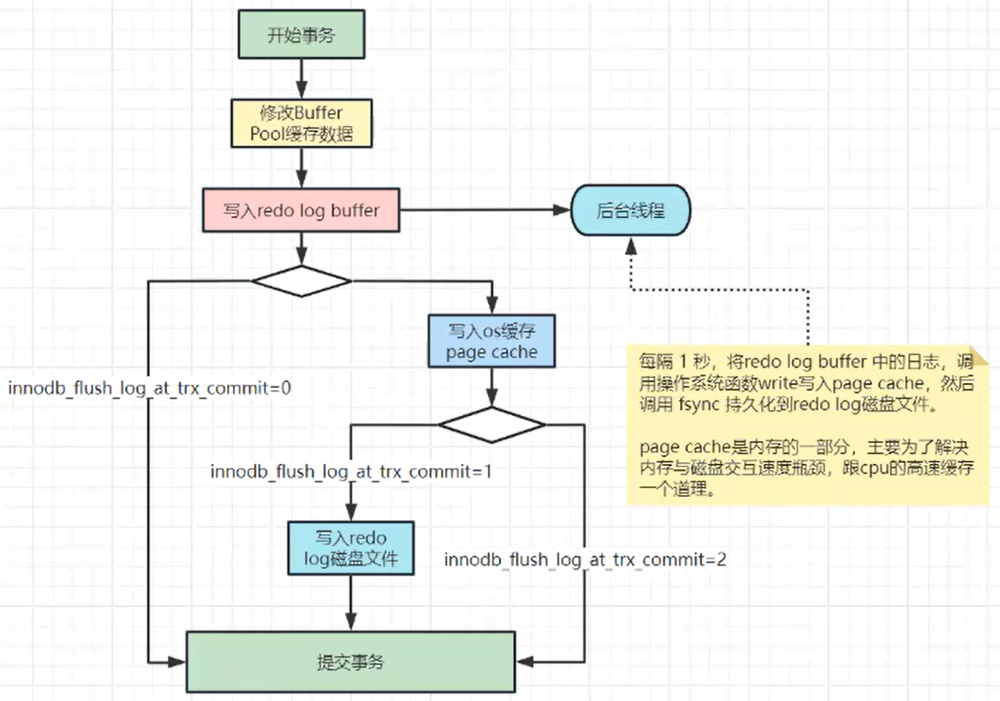
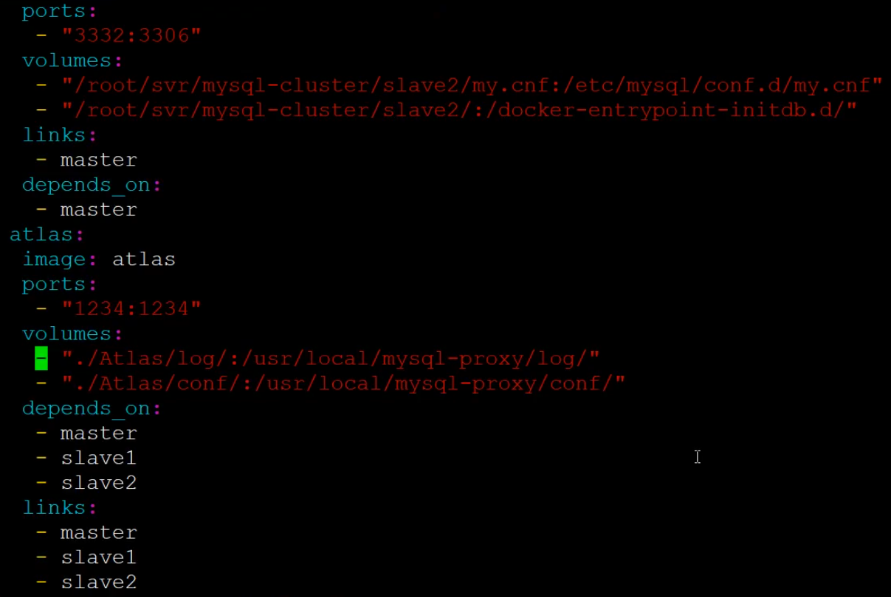

# MySQL安装

## RPM安装mysql

本文为大家介绍了*CentOS* 7 64位 安装 *MySQL5.7* 的详细步骤

### 配置YUM源

在[MySQL]官网中下载YUM源rpm安装包：http://dev.mysql.com/downloads/repo/yum/

下载mysql源安装包

``` 
$ wget http://dev.mysql.com/get/mysql57-community-release-el7-8.noarch.rpm
```

安装mysql源

```shell
$ yum localinstall mysql57-community-release-el7-8.noarch.rpm
```

检查mysql源是否安装成功

```shell
$ yum repolist enabled | grep "mysql.*-community.*"
```


### 安装MySQL

```shell
$  yum install mysql-community-server
```


### 配置默认编码为utf8 并且设置不区分大小写

修改/etc/my.cnf配置文件，在[mysqld]下添加编码配置，如下所示：

```mysql
[mysqld]

character_set_server=utf8

init_connect='SET NAMES utf8'

lower_case_table_names=1
```


### 启动MySQL服务

```shell
$  systemctl start mysqld
```


### 开机启动

```shell
$  systemctl enable mysqld 
$  systemctl daemon-reload
```


### 修改root默认密码

mysql安装完成之后，在/var/log/mysqld.log文件中给root生成了一个默认密码。通过下面的方式找到root默认密码，然后登录mysql进行修改：

```shell
$ grep 'temporary password' /var/log/mysqld.log
```

查看到密码后用root登录修改密码

```shell
$ mysql -uroot -p
```

```mysql
mysql> ALTER USER 'root'@'localhost' IDENTIFIED BY 'MyNewPass4!'; 
```

或者

```mysql
mysql> set password for 'root'@'localhost'=password('MyNewPass4!'); 
```

**注意**：mysql5.7默认安装了密码安全检查插件（validate_password），默认密码检查策略要求密码必须包含：大小写字母、数字和特殊符号，并且长度不能少于8位。否则会提示ERROR 1819 (HY000): Your password does not satisfy the current policy requirements错误


### 创建数据库并添加远程登录用户

默认只允许root帐户在本地登录，如果要在其它机器上连接mysql，必须修改root允许远程连接，或者添加一个允许远程连接的帐户，为了安全起见，我添加一个新的帐户：

```mysql
mysql>  create database yamidb CHARACTER SET utf8 COLLATE utf8_general_ci;
mysql>  GRANT ALL PRIVILEGES ON yamidb.* TO 'yami'@'%' IDENTIFIED BY 'Yami@2019';
```

## tar.gz安装

```
https://blog.csdn.net/wyg1995/article/details/134313843
https://blog.csdn.net/weixin_47962813/article/details/134673039

ALTER USER 'root'@'localhost' IDENTIFIED BY 'mysql5744';
ALTER USER 'root'@'localhost' PASSWORD EXPIRE NEVER;
FLUSH PRIVILEGES;
USE mysql;
UPDATE user SET host = '%' WHERE user = 'root';
FLUSH PRIVILEGES;
exit;

[mysqld]
bind-address=0.0.0.0
port=3306
basedir=/usr/local/mysql
datadir=/data/mysql
log-error=/data/mysql/mysql_err.log
pid-file=/data/mysql/mysql.pid
max_connections=200
max_connect_errors=10
socket=/tmp/mysql.sock
character-set-server=utf8mb4
default-storage-engine=INNODB
default_authentication_plugin=mysql_native_password
explicit_defaults_for_timestamp=true
[mysql]
default-character-set=utf8mb4
[client]
port=3306
default-character-set=utf8mb4

=============================================================================
[root@localhost ~]# mkdir packages
[root@localhost ~]# cd packages/
[root@localhost packages]# tar -zxf mysql-5.7.44-linux-glibc2.12-x86_64.tar.gz 
[root@localhost packages]# mv mysql-5.7.44-linux-glibc2.12-x86_64 mysql
[root@localhost packages]# cp -r ./mysql /usr/local/
[root@localhost packages]# groupadd mysql
[root@localhost packages]# useradd -r -g mysql mysql
[root@localhost packages]# mkdir -p /data/mysql
[root@localhost packages]# chown mysql:mysql -R /data/mysql
[root@localhost packages]# mv /etc/my.cnf /etc/my.cnf.bak
[root@localhost packages]# vi /etc/my.cnf
[root@localhost packages]# /usr/local/mysql/bin/mysqld --defaults-file=/etc/my.cnf --basedir=/usr/local/mysql/ --datadir=/data/mysql/ --user=mysql --initialize
[root@localhost packages]# cp /usr/local/mysql/support-files/mysql.server /etc/init.d/mysql
[root@localhost packages]# service mysql start
[root@localhost packages]# more /data/mysql/mysql_err.log
[root@localhost packages]# cd /usr/local/mysql/bin/
[root@localhost bin]# ./mysql -u root -p
mysql> SET PASSWORD = PASSWORD("mysql5744");
mysql> ALTER USER 'root'@'localhost' PASSWORD EXPIRE NEVER;
mysql> FLUSH PRIVILEGES;
mysql> use mysql;
mysql> update user set host = '%' where user = 'root';
mysql> FLUSH PRIVILEGES;
mysql> update mysql.user set authentication_string=password('mysql5744') where user='root';
mysql> flush privileges;
mysql> exit;
[root@localhost bin]# ln -s /usr/local/mysql/bin/mysql /usr/bin
[root@localhost bin]# mysql -u root -p
mysql> exit;
```


# MySQL笔记

> 思考：
>
> 1. MySQL中一个select的查询操作触发生成一个新的ReadView的条件是什么

## MySQL实战

> [MySQL实战45讲](MySQLWar45.md)

## MySQL优化

> [MySQLOptimize.md](MySQLOptimize.md)

## MySQL主从

> [MySQLMasterBackup.md](MySQLMasterBackup.md)

## BinLog数据恢复

> [BinLogRecoveryData.md](BinLogRecoveryData.md)


# MySQL进阶问题

## MySQL写缓存(ChangeBuffer)

https://blog.csdn.net/z694644032/article/details/104532860

写缓存(ChangeBuffer) 是一种特殊的数据结构，**用于在对数据变更时，如果数据所在的数据页没有在 BufferPool 中的话，在不影响数据一致性的前提下，InnoDB引擎会将对数据的操作缓存在 ChangeBuffer 中**，这样就省去了从磁盘中读入这个数据页。

将数据页从磁盘读入内存中涉及随机 IO 访问，这也是数据库里面成本最高的操作之一，而利用写缓存(ChangeBuffer)可以减少 IO 操作，从而提升数据库性能。

关于 MySQL 写缓存(ChangeBuffer)，我们先来看看InnoDB的技术架构图：


ChangeBuffer 是 BufferPool 中的一部分，虽然 ChangeBuffer 名字叫 Buffer ，但是它也是可以持久化的，在右边的 System Tablespace 中可以看到持久化 ChangeBuffer 的空间。触发写缓存(ChangeBuffer)持久化操作有以下几种情况：

- 1、数据库空闲时，后台有线程定时持久化
- 2、数据库缓冲池不够用时
- 3、数据库正常关闭时
- 4、RedoLog 写满时

再单独看看 ChangeBuffer 的架构图，如下所示：


图中详细的描述了 ChangeBuffer 的功能，ChangeBuffer 中的数据最终还是会刷回到数据所在的原始数据页中，ChangeBuffer 数据应用到原始数据页，得到新的数据页的过程称之为 merge。merge 过程中只会将 ChangeBuffer 中与原始数据页有关的数据应用到原始数据页，以下三种情况会发生 merge 操作：

- 1、原始数据页加载到 BufferPool 时。
- 2、系统后台定时触发 merge 操作。
- 3、MySQL 数据库正常关闭时。

## ChangeBuffer 的相关设置

上面就是写缓存(ChangeBuffer)的相关知识，写缓存(ChangeBuffer)我们也是可以使用命令参数来控制，MySQL 数据库提供了两个对写缓存(ChangeBuffer)的参数。


1、innodb_change_buffer_max_size

innodb_change_buffer_max_size 表示 ChangeBuffer 最大大小占 BufferPool 的百分比，默认为 25%。最大可以设置为 50%。

2、innodb_change_buffering

innodb_change_buffering 参数用来控制对哪些操作启用 ChangeBuffer 功能，默认是：all。innodb_change_buffering 参数有以下几种选择：

```
--all：默认值。开启buffer inserts、delete-marking operations、purges
--none：不开启ChangeBuffer
--inserts：只是开启buffer insert操作
--deletes：只是开delete-marking操作
--changes：开启buffer insert操作和delete-marking操作
--purges：对只是在后台执行的物理删除操作开启buffer功能
```

对上面写缓存(ChangeBuffer)如果你还是云里雾里的话，那么我们就用一个案例来说明一下 ChangeBuffer ，首先我们向数据库中插入两条数据：

```sql
mysql> insert into t(id，k) values(id1，k1)，(id2，k2);
```

结合下面这张图来分析这两条插入语句。


假设当前是 K索引树的状态，K1 所在的数据页 page1 在 BufferPool 中，k2 所在的数据页不在 BufferPool 中，来看看这两条语句的执行流程：

1、对于 k1 这条数据，Page 1 在内存中，所以直接更新内存，不会使用到 ChangeBuffer；

2、k2 对应的数据页 Page 2 没有在内存中，就在内存的 ChangeBuffer 区域，记录下"我要往 Page 2 插入一行"这个信息，这个地方及其关键，并没有从磁盘中将 page2 加载到内存。

3、将上述两个动作记入 RedoLog 中(图中 3 和 4)。

4、后台线程会定时将 page1 和 ChangeBuffer 中的数据持久化

主要地方在于步骤二，这就是写缓存(ChangeBuffer)提高性能的地方，虽然 page2 并没有在内存中，但是并没有妨碍我们往数据库 page2 中插入数据，这就是写缓存(ChangeBuffer)的巧妙之处，也是写缓存(ChangeBuffer)提高 MySQL
的地方。

## ChangeBuffer 适用场景

ChangeBuffer 并不是适用于所有场景，以下两种情况不适合开启 ChangeBuffer ：

- 1、数据库都是唯一索引

如果数据库都是唯一索引，那么在每次操作的时候都需要判断索引是否有冲突，势必要将数据加载到缓存中对比，因此也用不到 ChangeBuffer。

- 2、写入一个数据后，会立刻读取它

写入一个数据后，会立刻读取它，那么即使满足了条件，将更新先记录在 ChangeBuffer，但之后由于马上要访问这个数据页，会立即触发 merge 过程。这样随机访问 IO 的次数不会减少，反而增加了 ChangeBuffer 的维护代价。所以，对于这种业务模式来说，ChangeBuffer 反而起到了副作用。

**以下几种情况开启 ChangeBuffer，会使得 MySQL 数据库明显提升**：

- 1、数据库大部分是非唯一索引
- 2、业务是写多读少
- 3、写入数据之后并不会立即读取它

总体来说InnoDB的写缓存(ChangeBuffer)应用得当，会极大提高 MySQL 数据库的性能，使用不恰当的话，可能会适得其反。

## BufferPool是什么


1. BufferPool: 缓冲池，简称BP。其作用是用来缓存表数据与索引数据，减少磁盘IO操作，提升效率。
   - 存储MySQL加载**索引页数据**的内存
   - BufferPool的索引缓存页使用数组进行管理
2. BufferPool由**缓存数据页**(Page)和**对缓存数据页进行描述的控制块**组成， 控制块中存储着对应缓存页的所属的表空间、数据页的编号、以及对应缓存页在BufferPool中的地址等信息
   - BufferPool = 缓存数据页 + 元数据控制块
   - 元数据控制块 = 数据页的所属的表空间 + 数据页的编号 + 缓存页在BufferPool中的地址信息 + 。。。
   - BufferPool的数据结构：
     - 数组：管理索引缓存页，分为三种page
       - free page：空闲page，未被使用
       - clean page：被使用page，数据没有被修改过
       - dirty page：脏页，数据被修改过，Page页中数据和磁盘的数据不一致
     - 链表：管理控制块
       - free page 链表：管理free page。管理数组中当前未被使用的页块，链表每个节点称为一个控制块。
       - flush page 链表：管理dirty page。即管理被update的页块。
       - LRU page 链表：管理clean page和dirty page，即管理哪些数据是最近访问的。如果BufferPool满了就会把LRU链表最后的数据持久化到数据库，LRU链表分为热数据区和冷数据区
3. BufferPool默认大小是128M，以Page页为单位，Page页默认大小16K，而控制块的大小约为数据页的5%，大概是800字节，所以每次会多申请6M的内存空间用于存放控制块。

每次Update的数据的时候都是先去修改BufferPool中的数据。被修改的页数据会被系统定时的持久化到磁盘中。

在BufferPool中执行DDL操作

- DDL生成RedoLog存储到LogBuffer
- RedoLog持久化(事务提交的时候再进行持久化)
- BinLog持久化
- UndoLog，即事务回滚的时候修改BufferPool
- DDL操作成功

`innodb_flush_log_at_trx_commit`的取值与操作关系：


## 判断缓存页是否在BufferPool中缓存

MySQl中有一个哈希表数据结构，它使用表**空间号+数据页号**作为一个key，然后缓冲页对应的**控制块**作为value。


* 当需要访问某个页的数据时，先从哈希表中根据表空间号+页号看看是否存在对应的缓冲页。
* 如果有，则直接使用；如果没有，就从free链表中选出一个空闲的缓冲页，然后把磁盘中对应的页加载到该缓冲页的位置

## InnoDB如何管理Page页

**Page页分类**

BP的底层采用链表数据结构管理Page。在InnoDB访问表记录和索引时会在Page页中缓存，以后使用可以减少磁盘IO操作，提升效率。

Page根据状态可以分为三种类型：


* free page：空闲page，未被使用
* clean page：被使用page，数据没有被修改过
* dirty page：脏页，被使用page，数据被修改过，Page页中数据和磁盘的数据产生了不一致

Page页如何管理

针对上面所说的三种page类型，InnoDB通过三种链表结构来维护和管理

1. free page 链表：表示空闲缓冲区，管理free page

* free链表是把所有空闲的缓冲页对应的控制块作为一个个的节点放到一个链表中，这个链表便称之为free链表
* 基节点：free链表中只有一个基节点是不记录缓存页信息(单独申请空间)，它里面就存放了free链表的头节点的地址，尾节点的地址，还有free链表里当前有多少个节点。


2.flush page 链表： 表示需要刷新到磁盘的缓冲区，管理dirty page，内部page按修改时间排序。

* InnoDB引擎为了提高处理效率，在每次修改缓冲页后，并不是立刻把修改刷新到磁盘上，而是在未来的某个时间点进行刷新操作. 所以需要使用到flush链表存储脏页，凡是被修改过的缓冲页对应的控制块都会作为节点加入到flush链表.
* flush链表的结构与free链表的结构相似


**3.lru page 链表**：表示正在使用的缓冲区，管理clean page和dirty page，缓冲区以midpoint为基点，前面链表称为new列表区，存放经常访问的数据，占63%；后面的链表称为old列表区，存放使用较少数据，占37%


## 写缓冲区仅适用于非唯一普通索引页

### ChangeBuffer

ChangeBuffer/CB：写缓冲区，是针对二级索引(辅助索引)页的更新优化措施。

作用: 在进行DML操作时，如果请求的辅助索引没有在缓冲池中时，并不会立刻将磁盘页加载到缓冲池，而是在CB记录缓冲变更，等未来数据被读取时，再将数据合并恢复到BP中。


1. ChangeBuffer用于存储SQL变更操作，比如Insert/Update/Delete等SQL语句
2. ChangeBuffer中的每个变更操作都有其对应的数据页，并且该数据页未加载到缓存中；
3. 当ChangeBuffer中变更操作对应的数据页加载到缓存中后，InnoDB会把变更操作Merge到数据页上；
4. InnoDB会定期加载ChangeBuffer中操作对应的数据页到缓存中，并Merge变更操作；

### ChangeBuffer更新流程


### 写缓冲区仅适用于非唯一普通索引页原因

* 如果在索引设置唯一性，在进行修改时，InnoDB必须要做唯一性校验，因此必须查询磁盘，做一次IO操	作。会直接将记录查询到BufferPool中，然后在缓冲池修改，不会在ChangeBuffer操作。

## MySQL为什么改进LRU算法

> MySQL的预读机制以及临时查询会替换掉LRU链表的头部的热数据，所以将LRU链表分为热数据区和冷数据区，冷数据去的头结点保持1秒便会被移动到热数据区头结点

### 普通LRU算法

LRU = Least Recently Used(最近最少使用): 就是末尾淘汰法，新数据从链表头部加入，释放空间时从末尾淘汰.


1. 当要访问某个页时，如果不在BufferPool，需要把该页加载到缓冲池,并且把该缓冲页对应的控制块作为节点添加到LRU链表的头部。
2. 当要访问某个页时，如果在BufferPool中，则直接把该页对应的控制块移动到LRU链表的头部
3. 当需要释放空间时,从最末尾淘汰

#### 普通LRU链表的优缺点

优点

* 所有最近使用的数据都在链表表头，最近未使用的数据都在链表表尾,保证热数据能最快被获取到。

缺点

* 如果发生全表扫描(比如：没有建立合适的索引 or 查询时使用select * 等)，则有很大可能将真正的热数据淘汰掉.
* 由于MySQL中存在预读机制，很多预读的页都会被放到LRU链表的表头。如果这些预读的页都没有用到的话，这样，会导致很多尾部的缓冲页很快就会被淘汰。


### 改进型LRU算法

改进型LRU：将链表分为new和old两个部分，加入元素时并不是从表头插入，而是从中间midpoint位置插入(就是说从磁盘中新读出的数据会放在冷数据区的头部)，如果数据很快被访问，那么page就会向new列表头部移动，如果数据没有被访问，会逐步向old尾部移动，等待淘汰。


冷数据区的数据页什么时候会被转到到热数据区呢 ?

1. 如果该数据页在LRU链表中存在时间超过1s，就将其移动到链表头部  ( 链表指的是整个LRU链表)
2. 如果该数据页在LRU链表中存在的时间短于1s，其位置不变(由于全表扫描有一个特点，就是它对某个页的频繁访问总耗时会很短)
3. 1s这个时间是由参数 `innodb_old_blocks_time` 控制的

## 使用索引一定可以提升效率吗

索引就是排好序的,帮助我们进行快速查找的数据结构.

简单来讲，索引就是一种将数据库中的记录按照特殊形式存储的数据结构。通过索引，能够显著地提高数据查询的效率，从而提升服务器的性能.

索引的优势与劣势

- 优点

  - 提高数据检索的效率,降低数据库的IO成本
  - 通过索引列对数据进行排序,降低数据排序的成本,降低了CPU的消耗
- 缺点

  - 创建索引和维护索引要耗费时间，这种时间随着数据量的增加而增加
  - 索引需要占物理空间，除了数据表占用数据空间之外，每一个索引还要占用一定的物理空间
  - 当对表中的数据进行增加、删除和修改的时候，索引也要动态的维护，降低了数据的维护速度
- 创建索引的原则

  - 在经常需要搜索的列上创建索引，可以加快搜索的速度；
  - 在作为主键的列上创建索引，强制该列的唯一性和组织表中数据的排列结构；
  - 在经常用在连接的列上，这些列主要是一些外键，可以加快连接的速度；
  - 在经常需要根据范围进行搜索的列上创建索引，因为索引已经排序，其指定的范围是连续的；
  - 在经常需要排序的列上创建索引，因为索引已经排序，这样查询可以利用索引的排序，加快排序查询时间；
  - 在经常使用在WHERE子句中的列上面创建索引，加快条件的判断速度。

## 介绍一下Page页的结构

### Page介绍

Page是整个InnoDB存储的最基本构件，也是InnoDB磁盘管理的最小单位，与数据库相关的所有内容都存储在这种Page结构里。

Page分为几种类型，常见的页类型有:

1. 数据页(B+tree Node)
2. Undo页(UndoLog Page)
3. 系统页(System Page)
4. 事务数据页(Transaction System Page)等


**Page 各部分说明**

| **名称**               | **占用大小** | **说明**                                |
| ---------------------- | ------------ | --------------------------------------- |
| **File Header**        | **38字节**   | **文件头, 描述页信息**                  |
| **Page Header**        | **56字节**   | **页头,页的状态**                       |
| **Infimum + Supremum** | **26字节**   | **最大和最小记录,这是两个虚拟的行记录** |
| **User Records**       | **不确定**   | **用户记录,存储数据行记录**             |
| **Free Space**         | **不确定**   | **空闲空间,页中还没有被使用的空间**     |
| **Page Directory**     | **不确定**   | **页目录,存储用户记录的相对位置**       |
| **File Trailer**       | **8字节**    | **文件尾,校验页是否完整**               |

* File Header 字段用于记录 Page 的头信息，其中比较重要的是 FIL_PAGE_PREV 和 FIL_PAGE_NEXT 字段，通过这两个字段，我们可以找到该页的上一页和下一页，实际上所有页通过两个字段可以形成一条双向链表
* Page Header 字段用于记录 Page 的状态信息。
* Infimum 和 Supremum 是两个伪行记录，Infimum(下确界)记录比该页中任何主键值都要小的值，Supremum (上确界)记录比该页中任何主键值都要大的值，这个伪记录分别构成了页中记录的边界。
* User Records 中存放的是实际的数据行记录
* Free Space 中存放的是空闲空间，被删除的行记录会被记录成空闲空间
* Page Directory 记录着与二叉查找相关的信息
* File Trailer 存储用于检测数据完整性的校验和等数据。

### 页结构的三大部分

1) 通用部分 (File Header&File Trailer )

通用部分: 主要指文件头和文件尾，将页的内容进行封装，通过文件头和文件尾校验的CheckSum方式来确保页的传输是完整的。

其中比较重要的是在文件头中的 `FIL_PAGE_PREV` 和 `FIL_PAGE_NEXT` 字段，通过这两个字段，我们可以找到该页的上一页和下一页，实际上所有页通过两个字段可以形成一条双向链表


2) 记录部分(User Records&Free Space)

页的主要作用是存储记录，所以"最小和最大记录"和"用户记录"部分占了页结构的主要空间。另外空闲空间是个灵活的部分，当有新的记录插入时，会从空闲空间中进行分配用于存储新记录


**3)数据目录部分 (Page Directory)**

数据页中行记录按照主键值由小到大顺序串联成一个单链表(**页中记录是以单向链表的形式进行存储的**)，且单链表的链表头为最小记录，链表尾为最大记录。并且为了更快速地定位到指定的行记录，通过 `Page Directory`实现目录的功能，借助 `Page Directory`使用二分法快速找到需要查找的行记录。


## 说一下聚簇索引与非聚簇索引

聚集索引与非聚集索引的区别是：叶节点是否存放一整行记录

* **聚簇索引**: 将数据存储与索引放到了一块,索引结构的叶子节点保存了行数据.
* **非聚簇索引**：将数据与索引分开存储，索引结构的叶子节点指向了数据对应的位置.

InnoDB主键使用的是聚簇索引，MyISAM 不管是主键索引，还是二级索引使用的都是非聚簇索引。

在InnoDB引擎中，主键索引采用的就是聚簇索引结构存储。

### 聚簇索引(聚集索引)

* 聚簇索引是一种数据存储方式，InnoDB的聚簇索引就是按照主键顺序构建 B+Tree结构。B+Tree 的叶子节点就是行记录，行记录和主键值紧凑地存储在一起。 这也意味着InnoDB的主键索引就是数据表本身，它按主键顺序存放了整张表的数据，占用的空间就是整个表数据量的大小。通常说的主键索引就是聚集索引。
* InnoDB的表要求必须要有聚簇索引：
  * 如果表定义了主键，则主键索引就是聚簇索引
  * 如果表没有定义主键，则第一个非空unique列作为聚簇索引
  * 否则InnoDB会从建一个隐藏的row-id作为聚簇索引
* 辅助索引
  InnoDB辅助索引，也叫作二级索引，是根据索引列构建 B+Tree结构。但在 B+Tree 的叶子节点中只存了索引列和主键的信息。二级索引占用的空间会比聚簇索引小很多， 通常创建辅助索引就是为了提升查询效率。一个表InnoDB只能创建一个聚簇索引，但可以创建多个辅助索引。


### 非聚簇索引

与InnoDB表存储不同，MyISM使用的是非聚簇索引， 非聚簇索引的两棵B+树看上去没什么不同 ，节点的结构完全一致只是存储的内容不同而已，主键索引B+树的节点存储了主键，辅助键索引B+树存储了辅助键。

表数据存储在独立的地方，这两颗B+树的叶子节点都使用一个地址指向真正的表数据，对于表数据来说，这两个键没有任何差别。由于 索引树是独立的，通过辅助键检索无需访问主键的索引树 。


**聚簇索引的优点**

1. 当你需要取出一定范围内的数据时，用聚簇索引也比用非聚簇索引好。
2. 当通过聚簇索引查找目标数据时理论上比非聚簇索引要快，因为非聚簇索引定位到对应主键时还要多一次目标记录寻址,即多一次I/O。
3. 使用覆盖索引扫描的查询可以直接使用页节点中的主键值。

**聚簇索引的缺点**

1. 插入速度严重依赖于插入顺序 。
2. 更新主键的代价很高，因为将会导致被更新的行移动 。
3. 二级索引访问需要两次索引查找，第一次找到主键值，第二次根据主键值找到行数据。

## 索引有哪几种类型

### 1)普通索引

* **这是最基本的索引类型，基于普通字段建立的索引，没有任何限制。**

```
CREATE INDEX <索引的名字> ON tablename (字段名);
ALTER TABLE tablename ADD INDEX [索引的名字] (字段名);
CREATE TABLE tablename ( [...], INDEX [索引的名字] (字段名) );
```

### 2)唯一索引

* **与"普通索引"类似，不同的就是：索引字段的值必须唯一，但允许有空值 。**

```
CREATE UNIQUE INDEX <索引的名字> ON tablename (字段名);
ALTER TABLE tablename ADD UNIQUE INDEX [索引的名字] (字段名);
CREATE TABLE tablename ( [...], UNIQUE [索引的名字] (字段名) ;
```

### 3)主键索引

* **它是一种特殊的唯一索引，不允许有空值。在创建或修改表时追加主键约束即可，每个表只能有一个主键。**

```sql
CREATE TABLE tablename ( [...], PRIMARY KEY (字段名) );
ALTER TABLE tablename ADD PRIMARY KEY (字段名);
```

### 4)复合索引

* **用户可以在多个列上建立索引，这种索引叫做组复合索引(组合索引)。复合索引可以代替多个单一索引，相比多个单一索引复合索引所需的开销更小。**

```sql
CREATE INDEX <索引的名字> ON tablename (字段名1，字段名2...);

ALTER TABLE tablename ADD INDEX [索引的名字] (字段名1，字段名2...);

CREATE TABLE tablename ( [...], INDEX [索引的名字] (字段名1，字段名2...) );
```

* **复合索引使用注意事项：**
  * **何时使用复合索引，要根据where条件建索引，注意不要过多使用索引，过多使用会对更新操作效率有很大影响。**
  * **如果表已经建立了(col1，col2)，就没有必要再单独建立(col1)；如果现在有(col1)索引，如果查询需要col1和col2条件，可以建立(col1,col2)复合索引，对于查询有一定提高。**

### 5) 全文索引

查询操作在数据量比较少时，可以使用like模糊查询，但是对于大量的文本数据检索，效率很低。如果使用全文索引，查询速度会比like快很多倍。

在MySQL 5.6 以前的版本，只有MyISAM存储引擎支持全文索引，从MySQL 5.6开始MyISAM和InnoDB存储引擎均支持。

```
CREATE FULLTEXT INDEX <索引的名字> ON tablename (字段名);

ALTER TABLE tablename ADD FULLTEXT [索引的名字] (字段名);

CREATE TABLE tablename ( [...], FULLTEXT KEY [索引的名字] (字段名) ;
```

全文索引方式有自然语言检索 `IN NATURAL LANGUAGE MODE`和布尔检索 `IN BOOLEAN MODE`两种

和常用的like模糊查询不同，全文索引有自己的语法格式，使用 match 和 against 关键字，比如

```
SELECT * FROM users3 WHERE MATCH(NAME) AGAINST('aabb');

-- * 表示通配符,只能在词的后面
SELECT * FROM users3 WHERE MATCH(NAME) AGAINST('aa*'  IN BOOLEAN MODE);
```

全文索引使用注意事项：

* 全文索引必须在字符串、文本字段上建立。
* 全文索引字段值必须在最小字符和最大字符之间的才会有效。(innodb：3-84；myisam：4-84)

## 介绍一下最佳左前缀法则

1)最佳左前缀法则

最佳左前缀法则：如果创建的是联合索引,就要遵循该法则. 使用索引时，where后面的条件需要从索引的最左前列开始使用,并且不能跳过索引中的列使用。

* 场景1：按照索引字段顺序使用，三个字段都使用了索引,没有问题。

  ```
  EXPLAIN SELECT * FROM users WHERE user_name = 'tom' 
  AND user_age = 17 AND user_level = 'A';
  ```

* 场景2: 直接跳过user_name使用索引字段，索引无效，未使用到索引。

  ```
  EXPLAIN SELECT * FROM users WHERE user_age = 17 AND user_level = 'A';
  ```

* 场景3：不按照创建联合索引的顺序,使用索引

  ```
  EXPLAIN SELECT * FROM users WHERE 
  user_age = 17 AND user_name = 'tom' AND user_level = 'A';
  ```

  where后面查询条件顺序是 `user_age`、`user_level`、`user_name`与我们创建的索引顺序 `user_name`、`user_age`、`user_level`不一致，为什么还是使用了索引，原因是因为MySql底层优化器对其进行了优化。

* 最佳左前缀底层原理
  MySQL创建联合索引的规则是: 首先会对联合索引最左边的字段进行排序( 例子中是 `user_name` ), 在第一个字段的基础之上 再对第二个字段进行排序 ( 例子中是 `user_age` ) .

  

* 最佳左前缀原则其实是和B+树的结构有关系, 最左字段肯定是有序的, 第二个字段则是无序的(联合索引的排序方式是: 先按照第一个字段进行排序,如果第一个字段相等再根据第二个字段排序). 所以如果直接使用第二个字段 `user_age` 通常是使用不到索引的.

## 什么是索引下推

> 使用联合索引的时候，提前执行where中非模糊查询，把索引放在最后过滤，以减少回表的次数
>
> AI：索引下推就是让数据库在索引上直接进行一些条件判断，而不是等到找到所有可能的数据后再进行，从而加快查询速度

索引下推(index condition pushdown )简称ICP，在Mysql5.6的版本上推出，用于优化查询。

需求: 查询users表中 "名字第一个字是张，年龄为10岁的所有记录"。

```
SELECT * FROM users WHERE user_name LIKE '张%' AND user_age = 10;
```

根据最左前缀法则，该语句在搜索索引树的时候，只能匹配到名字第一个字是'张'的记录，接下来是怎么处理的呢

当然就是从该记录开始，逐个回表，到主键索引上找出相应的记录，再比对 `age` 这个字段的值是否符合。

图1: 在 (name,age) 索引里面特意去掉了 age 的值，这个过程InnoDB并不会去看 age 的值，只是按顺序把"name 第一个字是'张'"的记录一条条取出来回表。因此，需要回表 4 次


MySQL 5.6引入了索引下推优化，可以在索引遍历过程中，对索引中包含的字段先做判断，过滤掉不符合条件的记录，减少回表次数。

图2:InnoDB在 (name,age) 索引内部就判断了 age 是否等于 10，对于不等于 10 的记录，直接判断并跳过,减少回表次数.


总结

如果没有索引下推优化(或称ICP优化)，当进行索引查询时，首先根据索引来查找记录，然后再根据where条件来过滤记录；

在支持ICP优化后，MySQL会在取出索引的同时，判断是否可以进行where条件过滤再进行索引查询，也就是说提前执行where的部分过滤操作，在某些场景下，可以大大减少回表次数，从而提升整体性能。

## 什么是自适应哈希索引

自适应Hash索引(Adatptive Hash Index，内部简称AHI)是InnoDB的三大特性之一，还有两个是 BufferPool 简称BP、双写缓冲区(Double Write Buffer)。

1、**自适应即我们不需要自己处理，当InnoDB引擎根据查询统计发现某一查询满足hash索引的数据结构特点，就会给其建立一个hash索引**；

2、hash索引底层的数据结构是**散列表**(Hash表)，其数据特点就是比较适合在**内存中使用**，自适应Hash索引存在于InnoDB架构中的缓存中(不存在于磁盘架构中)，见下面的InnoDB架构图。

3、自适应hash索引只适合搜索**等值查询**，如select * from table where index_col='xxx'，而对于其他查找类型，如范围查找，是不能使用的；


Adaptive Hash Index是针对B+树Search Path的优化，因此所有会涉及到Search Path的操作，均可使用此Hash索引进行优化.


根据索引键值(前缀)快速定位到叶子节点满足条件记录的Offset，减少了B+树Search Path的代价，将B+树从Root节点至Leaf节点的路径定位，优化为Hash Index的快速查询。

InnoDB的自适应Hash索引是默认开启的，可以通过配置下面的参数设置进行关闭。

```
innodb_adaptive_hash_index = off
```

自适应Hash索引使用分片进行实现的，分片数可以使用配置参数设置：

```
innodb_adaptive_hash_index_parts = 8
```

分片的使用有以下好处：

- **并发访问**：通过分片，可以减少并发访问时的锁竞争，因为不同的分片可以由不同的线程同时访问。
- **负载均衡**：分片可以将哈希索引的负载分散到多个分片上，从而提高整体的性能。
- **扩展性**：随着数据量的增加，分片可以动态地增加，以适应更大的数据集。

## 为什么LIKE以%开头索引会失效

like查询为范围查询，%出现在左边，则索引失效。%出现在右边索引未失效.

场景1: 两边都有% 或者 字段左边有%,索引都会失效。

```sql
EXPLAIN SELECT * FROM users WHERE user_name LIKE '%tom%';

EXPLAIN SELECT * FROM users WHERE user_name LIKE '%tom';
```

场景2: 字段右边有%,索引生效

```sql
EXPLAIN SELECT * FROM users WHERE user_name LIKE 'tom%';
```

**解决%出现在左边索引失效的方法，使用覆盖索引**

```sql
EXPLAIN SELECT user_name FROM users WHERE user_name LIKE '%jack%';

EXPLAIN SELECT user_name,user_age,user_level FROM users WHERE user_name LIKE '%jack%';
```

对比场景1可以知道, 通过使用覆盖索引 `type = index`,并且 `extra = Using index`,从全表扫描变成了全索引扫描.

**like 失效的原因**

1. **%号在右:** 由于B+树的索引顺序，是按照首字母的大小进行排序，%号在右的匹配又是匹配首字母。所以可以在B+树上进行有序的查找，查找首字母符合要求的数据。所以有些时候可以用到索引.
2. **%号在左:**  是匹配字符串尾部的数据，我们上面说了排序规则，尾部的字母是没有顺序的，所以不能按照索引顺序查询，就用不到索引.
3. **两个%%号:**  这个是查询任意位置的字母满足条件即可，只有首字母是进行索引排序的，其他位置的字母都是相对无序的，所以查找任意位置的字母是用不上索引的.

## 数据库主键的类型该如何选择

auto_increment的优点：

1. 字段长度较uuid小很多，可以是bigint甚至是int类型，这对检索的性能会有所影响。
2. 在写的方面，因为是自增的，所以主键是趋势自增的，也就是说新增的数据永远在后面，这点对于性能有很大的提升。
3. 数据库自动编号，速度快，而且是增量增长，按顺序存放，对于检索非常有利。
4. 数字型，占用空间小，易排序，在程序中传递也方便。

auto_increment的缺点：

1. 由于是自增，很容易通过网络爬虫知晓当前系统的业务量。
2. 高并发的情况下，竞争自增锁会降低数据库的吞吐能力。
3. 数据迁移或分库分表场景下，自增方式不再适用。

UUID的优点：

1. 不会冲突。进行数据拆分、合并存储的时候，能保证主键全局的唯一性
2. 可以在应用层生成，提高数据库吞吐能力

UUID的缺点：

1. 影响插入速度， 并且造成硬盘使用率低。与自增相比，最大的缺陷就是随机io，下面我们会去具体解释
2. 字符串类型相比整数类型肯定更消耗空间，而且会比整数类型操作慢。

**uuid 和自增 id 的索引结构对比**

1、**使用自增 id 的内部结构**


自增的主键的值是顺序的，所以InnoDB把每一条记录都存储在一条记录的后面。

* 当达到页面的最大填充因子时候(InnoDB默认的最大填充因子是页大小的 15/16，会留出 1/16 的空间留作以后的修改)。
* 下一条记录就会写入新的页中，一旦数据按照这种顺序的方式加载，主键页就会近乎于顺序的记录填满，提升了页面的最大填充率，不会有页的浪费。
* 新插入的行一定会在原有的最大数据行下一行，MySQL 定位和寻址很快，不会为计算新行的位置而做出额外的消耗。减少了页分裂和碎片的产生。

2、**使用 uuid 的索引内部结构**

插入UUID： 新的记录可能会插入之前记录的中间，因此需要移动之前的记录


被写满已经刷新到磁盘上的页可能会被重新读取


因为 uuid 相对顺序的自增 id 来说是毫无规律可言的，新行的值不一定要比之前的主键的值要大，所以InnoDB无法做到总是把新行插入到索引的最后，而是需要为新行寻找新的合适的位置从而来分配新的空间。

这个过程需要做很多额外的操作，数据的毫无顺序会导致数据分布散乱，将会导致以下的问题：

1. 写入的目标页很可能已经刷新到磁盘上并且从缓存上移除，或者还没有被加载到缓存中，InnoDB在插入之前不得不先找到并从磁盘读取目标页到内存中，这将导致大量的随机 IO。
2. 因为写入是乱序的，InnoDB不得不频繁的做页分裂操作，以便为新的行分配空间，页分裂导致移动大量的数据，一次插入最少需要修改三个页以上。
3. 由于频繁的页分裂，页会变得稀疏并被不规则的填充，最终会导致数据会有碎片。
4. 在把随机值(uuid 和雪花 id)载入到聚簇索引(InnoDB默认的索引类型)以后，有时候会需要做一次 OPTIMEIZE TABLE 来重建表并优化页的填充，这将又需要一定的时间消耗。

结论：使用InnoDB应该尽可能的按主键的自增顺序插入，并且尽可能使用单调的增加的聚簇键的值来插入新行。如果是分库分表场景下，分布式主键ID的生成方案 优先选择雪花算法生成全局唯一主键(雪花算法生成的主键在一定程度上是有序的)。

## InnoDB与MyISAM的区别

InnoDB和MyISAM是使用MySQL时最常用的两种引擎类型，我们重点来看下两者区别。

* 事务和外键
  InnoDB支持事务和外键，具有安全性和完整性，适合大量insert或update操作
  MyISAM不支持事务和外键，它提供高速存储和检索，适合大量的select查询操作

* 锁机制
  InnoDB支持行级锁，锁定指定记录。基于索引来加锁实现。
  MyISAM支持表级锁，锁定整张表。

* 索引结构
  InnoDB使用聚集索引(聚簇索引)，索引和记录在一起存储，既缓存索引，也缓存记录。
  MyISAM使用非聚集索引(非聚簇索引)，索引和记录分开。

* 并发处理能力
  MyISAM使用表锁，会导致写操作并发率低，读之间并不阻塞，读写阻塞。
  InnoDB读写阻塞可以与隔离级别有关，可以采用多版本并发控制(MVCC)来支持高并发

* 存储文件
  InnoDB表对应两个文件，一个.frm表结构文件，一个.ibd数据文件。InnoDB表最大支持64TB；
  MyISAM表对应三个文件，一个.frm表结构文件，一个MYD表数据文件，一个.MYI索引文件。从MySQL5.0开始默认限制是256TB。

  

MyISAM 适用场景

* 不需要事务支持(不支持)
* 并发相对较低(锁定机制问题)
* 数据修改相对较少，以读为主
* 数据一致性要求不高

InnoDB适用场景

* 需要事务支持(具有较好的事务特性)
* 行级锁定对高并发有很好的适应能力
* 数据更新较为频繁的场景
* 数据一致性要求较高
* 硬件设备内存较大，可以利用InnoDB较好的缓存能力来提高内存利用率，减少磁盘IO

两种引擎该如何选择

* 是否需要事务有，InnoDB
* 是否存在并发修改有，InnoDB
* 是否追求快速查询，且数据修改少是，MyISAM
* 在绝大多数情况下，推荐使用InnoDB

扩展资料：各个存储引擎特性对比


## B树和B+树的区别是什么

**1)B-Tree介绍**

B-Tree是一种平衡的多路查找树,B树允许一个节点存放多个数据. 这样可以在尽可能减少树的深度的同时,存放更多的数据(把瘦高的树变的矮胖).

B-Tree中所有节点的子树个数的最大值称为B-Tree的阶,用m表示.一颗m阶的B树,如果不为空,就必须满足以下条件.

m阶的B-Tree满足以下条件:

1. 每个节点最多拥有m-1个关键字(根节点除外),也就是m个子树
2. 根节点至少有两个子树(可以没有子树,有就必须是两个)
3. 分支节点至少有(m/2)颗子树 (除去根节点和叶子节点其他都是分支节点)
4. 所有叶子节点都在同一层,并且以升序排序


**什么是B-Tree的阶 ?**
所有节点中，节点【60,70,90】拥有的子节点数目最多，四个子节点(灰色节点)，所以上面的B-Tree为4阶B树。

**B-Tree结构存储索引的特点**

为了描述B-Tree首先定义一条记录为一个键值对[key, data] ，key为记录的键值，对应表中的主键值(聚簇索引)，data为一行记录中除主键外的数据。对于不同的记录，key值互不相同

* 索引值和data数据分布在整棵树结构中
* 白色块部分是指针,存储着子节点的地址信息。
* 每个节点可以存放多个索引值及对应的data数据
* 树节点中的多个索引值从左到右升序排列


**B-Tree的查找操作**

B-Tree的每个节点的元素可以视为一次I/O读取，树的高度表示最多的I/O次数，在相同数量的总元素个数下，每个节点的元素个数越多，高度越低，查询所需的I/O次数越少.

**B-Tree总结**

* 优点: B树可以在内部节点存储键值和相关记录数据，因此把频繁访问的数据放在靠近根节点的位置将大大提高热点数据的查询效率。
* 缺点: B树中每个节点不仅包含数据的key值,还有data数据. 所以当data数据较大时,会导致每个节点存储的key值减少,并且导致B树的层数变高.增加查询时的IO次数.
* 使用场景: B树主要应用于文件系统以及部分数据库索引，如MongoDB，大部分关系型数据库索引则是使用B+树实现

**2)B+Tree**

B+Tree是在B-Tree基础上的一种优化，使其更适合实现存储索引结构，InnoDB存储引擎就是用B+Tree实现其索引结构。

**B+Tree的特征**

- 非叶子节点只存储键值信息.
- 所有叶子节点之间都有一个链指针.
- 数据记录都存放在叶子节点中.


**B+Tree的优势**

1. B+Tree是B Tree的变种，B Tree能解决的问题，B+Tree也能够解决(降低树的高度，增大节点存储数据量)
2. B+Tree扫库和扫表能力更强，如果我们要根据索引去进行数据表的扫描，对B Tree进行扫描，需要把整棵树遍历一遍，而B+Tree只需要遍历他的所有叶子节点即可(叶子节点之间有引用)。
3. B+Tree磁盘读写能力更强，他的根节点和支节点不保存数据区，所有根节点和支节点同样大小的情况下，保存的关键字要比B Tree要多。而叶子节点不保存子节点引用。所以，B+Tree读写一次磁盘加载的关键字比B Tree更多。
4. B+Tree排序能力更强，如上面的图中可以看出，B+Tree天然具有排序功能。
5. B+Tree查询效率更加稳定，每次查询数据，查询IO次数一定是稳定的。当然这个每个人的理解都不同，因为在B Tree如果根节点命中直接返回，确实效率更高。

## 一个B+树中大概能存放多少条索引记录

MySQL设计者将一个B+Tree的节点的大小设置为等于一个页. (这样做的目的是每个节点只需要一次I/O就可以完全载入), InnoDB的一个页的大小是16KB,所以每个节点的大小也是16KB, 并且B+Tree的根节点是保存在内存中的,子节点才是存储在磁盘上.


**假设一个B+树高为2，即存在一个根节点和若干个叶子节点，那么这棵B+树的存放总记录数为：**

**根节点指针数*单个叶子节点记录行数.**

* **计算根节点指针数**: 假设表的主键为INT类型,占用的就是4个字节,或者是BIGINT占用8个字节, 指针大小为6个字节,那么一个页(就是B+Tree中的一个节点) ,大概可以存储: 16384B / (4B+6B) = 1638 ,一个节点最多可以存储1638个索引指针.
* **计算每个叶子节点的记录数**:我们假设一行记录的数据大小为1k,那么一页就可以存储16行数据,16KB / 1KB = 16.
* **一颗高度为2的B+Tree可以存放的记录数为**: 1638 * 16=26208 条数据记录, 同样的原理可以推算出一个高度3的B+Tree可以存放: 1638 * 1638 * 16 = 42928704条这样的记录.

**所以InnoDB中的B+Tree高度一般为1-3层,就可以满足千万级别的数据存储**,在查找数据时一次页的查找代表一次 IO，所以通过主键索引查询通常只需要 1-3 次 IO 操作即可查找到数据。

## explain 用过吗，有哪些主要字段

使用 `EXPLAIN` 关键字可以模拟优化器来执行SQL查询语句，从而知道MySQL是如何处理我们的SQL语句的。分析出查询语句或是表结构的性能瓶颈。

**MySQL查询过程**


**通过explain我们可以获得以下信息：**

* **表的读取顺序**
* **数据读取操作的操作类型**
* **哪些索引可以被使用**
* **哪些索引真正被使用**
* **表的直接引用**
* **每张表的有多少行被优化器查询了**

Explain使用方式: **explain+sql语句**, 通过执行explain可以获得sql语句执行的相关信息

```
explain select * from users;
```

## 执行计划的type字段中有哪些常见的值

**type字段在 MySQL 官网文档描述如下：**

> **The join type. For descriptions of the different types.**

**type字段显示的是连接类型 ( join type表示的是用什么样的方式来获取数据)，它描述了找到所需数据所使用的扫描方式, 是较为重要的一个指标。**

**下面给出各种连接类型,按照从最佳类型到最坏类型进行排序:**

```
-- 完整的连接类型比较多
system > const > eq_ref > ref > fulltext > ref_or_null > index_merge > unique_subquery > index_subquery > range > index > ALL

-- 简化之后,我们可以只关注一下几种
system > const > eq_ref > ref > range > index > ALL
```

> **一般来说,需要保证查询至少达到 range级别,最好能到ref,否则就要就行SQL的优化调整**

下面介绍type字段不同值表示的含义:

| **type类型** | **解释**                                                     |
| ------------ | ------------------------------------------------------------ |
| **system**   | **不进行磁盘IO,查询系统表,仅仅返回一条数据**                 |
| **const**    | **查找主键索引,最多返回1条或0条数据. 属于精确查找**          |
| **eq_ref**   | **查找唯一性索引,返回数据最多一条, 属于精确查找**            |
| **ref**      | **查找非唯一性索引,返回匹配某一条件的多条数据,属于精确查找,数据返回可能是多条.** |
| **range**    | **查找某个索引的部分索引,只检索给定范围的行,属于范围查找. 比如: > 、 < 、in 、between** |
| **index**    | **查找所有索引树,比ALL快一些,因为索引文件要比数据文件小.**   |
| **ALL**      | **不使用任何索引,直接进行全表扫描**                          |
|              |                                                              |

## 执行计划的extra有哪些主要指标

Extra 是 EXPLAIN 输出中另外一个很重要的列，该列显示MySQL在查询过程中的一些详细信息

| **extra类型**             | **解释**                                                     |
| ------------------------- | ------------------------------------------------------------ |
| **Using filesort**        | **MySQL中无法利用索引完成的排序操作称为  "文件排序"**        |
| **Using index**           | **表示直接访问索引就能够获取到所需要的数据(覆盖索引)，不需要通过索引回表** |
| **Using index condition** | **搜索条件中虽然出现了索引列，但是有部分条件无法使用索引，** **会根据能用索引的条件先搜索一遍再匹配无法使用索引的条件。** |
| **Using join buffer**     | **使用了连接缓存, 会显示join连接查询时,MySQL选择的查询算法** |
| **Using temporary**       | **表示MySQL需要使用临时表来存储结果集，常见于排序和分组查询** |
| **Using where**           | **意味着全表扫描或者在查找使用索引的情况下，但是还有查询条件不在索引字段当中** |


```mysql
# Using filesort
EXPLAIN SELECT * FROM users ORDER BY age;

# Using temporary
EXPLAIN SELECT COUNT(*),uname FROM users GROUP BY uname;

# Using where
EXPLAIN SELECT *FROM users WHERE age=10;
alter table users add index idx uname(uname);

# Using index
EXPLAIN SELECT uid,uname FRoM users WHERE uname='lisa';

# Using join buffer
EXPLAIN SELECT * FROM USerS U1 LEFT JOIN (SELECT * FROM users WHERE age = 1) u2 ON u1.age = u2.age,
```


## 如何进行分页查询优化

- 一般性分页

  一般的分页查询使用简单的 limit 子句就可以实现。limit格式如下：

  ```
  SELECT * FROM 表名 LIMIT [offset,] rows
  ```

  - 第一个参数指定第一个返回记录行的偏移量，注意从0开始；
  - 第二个参数指定返回记录行的最大数目；
  - 如果只给定一个参数，它表示返回最大的记录行数目；

  **思考1：如果偏移量固定，返回记录量对执行时间有什么影响**

  ```
  select * from user limit 10000,1;
  select * from user limit 10000,10;
  select * from user limit 10000,100;
  select * from user limit 10000,1000;
  select * from user limit 10000,10000;
  ```

  > 结果：在查询记录时，返回记录量低于100条，查询时间基本没有变化，差距不大。随着查询记录量越大，所花费的时间也会越来越多。

  **思考2：如果查询偏移量变化，返回记录数固定对执行时间有什么影响**

  ```
  select * from user limit 1,100;
  select * from user limit 10,100;
  select * from user limit 100,100;
  select * from user limit 1000,100;
  select * from user limit 10000,100;
  ```

  > 结果：在查询记录时，如果查询记录量相同，偏移量超过100后就开始随着偏移量增大，查询时间急剧的增加。(这种分页查询机制，每次都会从数据库第一条记录开始扫描，越往后查询越慢，而且查询的数据越多，也会拖慢总查询速度。)

- 分页优化方案

  **优化1: 通过索引进行分页**

  直接进行limit操作 会产生全表扫描,速度很慢. Limit限制的是从结果集的M位置处取出N条输出,其余抛弃.

  假设ID是连续递增的,我们根据查询的页数和查询的记录数可以算出查询的id的范围，然后配合 limit使用

  ```
  EXPLAIN SELECT * FROM user WHERE id  >= 100001 LIMIT 100;
  ```

  **优化2：利用子查询优化**

  ```
  -- 首先定位偏移位置的id
  SELECT id FROM user_contacts LIMIT 100000,1;
  
  -- 根据获取到的id值向后查询.
  EXPLAIN SELECT * FROM user_contacts WHERE id >=
  (SELECT id FROM user_contacts LIMIT 100000,1) LIMIT 100;
  ```

  原因：使用了id做主键比较(id>=)，并且子查询使用了覆盖索引进行优化。

## 如何做慢查询优化

**MySQL 慢查询的相关参数解释：**

* **slow_query_log**：是否开启慢查询日志，`ON(1)`表示开启,
  `OFF(0)` 表示关闭。
* **slow-query-log-file**：新版(5.6及以上版本)MySQL数据库慢查询日志存储路径。
* **long_query_time**： 慢查询**阈值**，当查询时间多于设定的阈值时，记录日志。

**慢查询配置方式**

1. **默认情况下slow_query_log的值为OFF，表示慢查询日志是禁用的**

```
mysql> show variables like '%slow_query_log%';
+---------------------+------------------------------+
| Variable_name       | Value                        |
+---------------------+------------------------------+
| slow_query_log      | ON                           |
| slow_query_log_file | /var/lib/mysql/test-slow.log |
+---------------------+------------------------------+
```

2. **可以通过设置slow_query_log的值来开启**

```
mysql> set global slow_query_log=1;
```

3. **使用** `set global slow_query_log=1`  开启了慢查询日志只对当前数据库生效，MySQL重启后则会失效。如果要永久生效，就必须修改配置文件my.cnf(其它系统变量也是如此)

```
-- 编辑配置
vim /etc/my.cnf

-- 添加如下内容
slow_query_log =1
slow_query_log_file=/var/lib/mysql/ruyuan-slow.log

-- 重启MySQL
service mysqld restart

mysql> show variables like '%slow_query%';
+---------------------+--------------------------------+
| Variable_name       | Value                          |
+---------------------+--------------------------------+
| slow_query_log      | ON                             |
| slow_query_log_file | /var/lib/mysql/ruyuan-slow.log |
+---------------------+--------------------------------+
```

4. 那么开启了慢查询日志后，什么样的SQL才会记录到慢查询日志里面呢 这个是由参数 `long_query_time`控制，默认情况下long_query_time的值为10秒.

```sql
mysql> show variables like 'long_query_time';
+-----------------+-----------+
| Variable_name   | Value     |
+-----------------+-----------+
| long_query_time | 10.000000 |
+-----------------+-----------+

mysql> set global long_query_time=1;
Query OK, 0 rows affected (0.00 sec)

mysql>  show variables like 'long_query_time';
+-----------------+-----------+
| Variable_name   | Value     |
+-----------------+-----------+
| long_query_time | 10.000000 |
+-----------------+-----------+
```

5. **修改了变量long_query_time，但是查询变量long_query_time的值还是10，难道没有修改到呢注意：使用命令 set global long_query_time=1 修改后，需要重新连接或新开一个会话才能看到修改值。**

```
mysql> show variables like 'long_query_time';
+-----------------+----------+
| Variable_name   | Value    |
+-----------------+----------+
| long_query_time | 1.000000 |
+-----------------+----------+
```

6. `log_output` 参数是指定日志的存储方式。`log_output='FILE'`  表示将日志存入文件，默认值是'FILE'。`log_output='TABLE'` 表示将日志存入数据库，这样日志信息就会被写入到 mysql.slow_log 表中。

```
mysql> SHOW VARIABLES LIKE '%log_output%';
+---------------+-------+
| Variable_name | Value |
+---------------+-------+
| log_output    | FILE  |
+---------------+-------+
```

> **MySQL数据库支持同时两种日志存储方式，配置的时候以逗号隔开即可，如：log_output='FILE,TABLE'。日志记录到系统的专用日志表中，要比记录到文件耗费更多的系统资源，因此对于需要启用慢查询日志，又需要能够获得更高的系统性能，那么建议优先记录到文件.**

7. 系统变量 `log-queries-not-using-indexes`：未使用索引的查询也被记录到慢查询日志中(可选项)。如果调优的话，建议开启这个选项。

```
mysql> show variables like 'log_queries_not_using_indexes';
+-------------------------------+-------+
| Variable_name                 | Value |
+-------------------------------+-------+
| log_queries_not_using_indexes | OFF   |
+-------------------------------+-------+

mysql> set global log_queries_not_using_indexes=1;
Query OK, 0 rows affected (0.00 sec)

mysql> show variables like 'log_queries_not_using_indexes';
+-------------------------------+-------+
| Variable_name                 | Value |
+-------------------------------+-------+
| log_queries_not_using_indexes | ON    |
+-------------------------------+-------+
```

**3) 慢查询测试**

1. **执行 test_index.sql 脚本,监控慢查询日志内容**

```
[root@localhost mysql]# tail -f /var/lib/mysql/ruyuan-slow.log 
/usr/sbin/mysqld, Version: 5.7.30-log (MySQL Community Server (GPL)). started with:
Tcp port: 0  Unix socket: /var/lib/mysql/mysql.sock
Time                 Id Command    Argument
```

2. **执行下面的SQL,执行超时 (超过1秒) 我们去查看慢查询日志**

```
SELECT * FROM test_index WHERE  
hobby = '20009951' OR hobby = '10009931' OR hobby = '30009931' 
OR dname = 'name4000' OR dname = 'name6600' ;
```

3. **日志内容**

**我们得到慢查询日志后，最重要的一步就是去分析这个日志。我们先来看下慢日志里到底记录了哪些内容。**

**如下图是慢日志里其中一条SQL的记录内容，可以看到有时间戳，用户，查询时长及具体的SQL等信息.**

```
## Time: 2022-02-23T13:50:45.005959Z
## User@Host: root[root] @ localhost []  Id：   3
## Query_time: 3.724273  Lock_time: 0.000371 Rows_sent: 5  Rows_examined: 5000000
SET timestamp=1645624245;
select * from test_index where hobby = '20009951' or hobby = '10009931' or hobby = '30009931' or dname = 'name4000' or dname = 'name6600';
```

* **Time: 执行时间**
* **User: 用户信息 ,Id信息**
* **Query_time: 查询时长**
* **Lock_time: 等待锁的时长**
* **Rows_sent:查询结果的行数**
* **Rows_examined: 查询扫描的行数**
* **SET timestamp: 时间戳**
* **SQL的具体信息**

**慢查询SQL优化思路**

**1) SQL性能下降的原因**

在日常的运维过程中，经常会遇到DBA将一些执行效率较低的SQL发过来找开发人员分析，当我们拿到这个SQL语句之后，在对这些SQL进行分析之前，需要明确可能导致SQL执行性能下降的原因进行分析，执行性能下降可以体现在以下两个方面：

- **等待时间长**

  ```
  锁表导致查询一直处于等待状态，后续我们从MySQL锁的机制去分析SQL执行的原理
  ```

- **执行时间长**

  ```
  1.查询语句写的烂
  2.索引失效 
  3.关联查询太多join 
  4.服务器调优及各个参数的设置
  ```

**2) 慢查询优化思路**

1. 优先选择优化高并发执行的SQL,因为高并发的SQL发生问题带来后果更严重.

   ```
   比如下面两种情况:
      SQL1: 每小时执行10000次, 每次20个IO 优化后每次18个IO,每小时节省2万次IO
      SQL2: 每小时10次,每次20000个IO,每次优化减少2000个IO,每小时节省2万次IO
      SQL2更难优化,SQL1更好优化.但是第一种属于高并发SQL,更急需优化 成本更低
   ```

2. 定位优化对象的性能瓶颈(在优化之前了解性能瓶颈在哪)

   ```
   在去优化SQL时,选择优化分方向有三个: 
     1.IO(数据访问消耗的了太多的时间,查看是否正确使用了索引) , 
     2.CPU(数据运算花费了太多时间, 数据的运算分组 排序是不是有问题) 
     3.网络带宽(加大网络带宽)
   ```

3. 明确优化目标

   ```
   需要根据数据库当前的状态
   数据库中与该条SQL的关系
   当前SQL的具体功能
   最好的情况消耗的资源,最差情况下消耗的资源,优化的结果只有一个给用户一个好的体验
   ```

4. 从explain执行计划入手

   ```
   只有explain能告诉你当前SQL的执行状态
   ```

5. 永远用小的结果集驱动大的结果集

   ```java
   小的数据集驱动大的数据集,减少内层表读取的次数
   
   类似于嵌套循环
   for(int i = 0; i < 5; i++){
    for(int i = 0; i < 1000; i++){
   
    }
   }
   如果小的循环在外层,对于数据库连接来说就只连接5次,进行5000次操作,如果1000在外,则需要进行1000次数据库连接,从而浪费资源，增加消耗.这就是为什么要小表驱动大表。
   ```

6. 尽可能在索引中完成排序

   ```
   排序操作用的比较多,order by 后面的字段如果在索引中,索引本来就是排好序的,所以速度很快,没有索引的话,就需要从表中拿数据,在内存中进行排序,如果内存空间不够还会发生落盘操作
   ```

7. 只获取自己需要的列

   ```
   不要使用select  * ,select * 很可能不走索引,而且数据量过大
   ```

8. 只使用最有效的过滤条件

   ```
   误区 where后面的条件越多越好,但实际上是应该用最短的路径访问到数据
   ```

9. 尽可能避免复杂的join和子查询

   ```
   每条SQL的JOIN操作 建议不要超过三张表
   将复杂的SQL, 拆分成多个小的SQL 单个表执行,获取的结果 在程序中进行封装
   如果join占用的资源比较多,会导致其他进程等待时间变长
   ```

10. 合理设计并利用索引

    ```
    如何判定是否需要创建索引?
     1.较为频繁的作为查询条件的字段应该创建索引.
     2.唯一性太差的字段不适合单独创建索引，即使频繁作为查询条件.(唯一性太差的字段主要是指哪些呢如状态字段，类型字段等等这些字段中的数据可能总共就是那么几个几十个数值重复使用)(当一条Query所返回的数据超过了全表的15%的时候，就不应该再使用索引扫描来完成这个Query了).
     3.更新非常频繁的字段不适合创建索引.(因为索引中的字段被更新的时候，不仅仅需要更新表中的数据，同时还要更新索引数据，以确保索引信息是准确的).
     4.不会出现在WHERE子句中的字段不该创建索引.
    
    如何选择合适索引?
     1.对于单键索引，尽量选择针对当前Query过滤性更好的索引.
     2.选择联合索引时,当前Query中过滤性最好的字段在索引字段顺序中排列要靠前.
     3.选择联合索引时,尽量索引字段出现在w中比较多的索引.
    ```

## Hash索引有哪些优缺点

MySQL中索引的常用数据结构有两种: 一种是B+Tree,另一种则是Hash.

Hash底层实现是由Hash表来实现的，是根据键值 <key,value> 存储数据的结构。非常适合根据key查找value值，也就是单个key查询，或者说等值查询。


对于每一行数据，存储引擎都会对所有的索引列计算一个哈希码，哈希码是一个较小的值,如果出现哈希码值相同的情况会拉出一条链表.

Hsah索引的优点

* 因为索引自身只需要存储对应的Hash值,所以索引结构非常紧凑, 只需要做等值比较查询，而不包含排序或范围查询的需求，都适合使用哈希索引 .
* 没有哈希冲突的情况下,等值查询访问哈希索引的数据非常快.(如果发生Hash冲突,存储引擎必须遍历链表中的所有行指针,逐行进行比较,直到找到所有符合条件的行).

Hash索引的缺点

* 哈希索引只包含哈希值和行指针，而不存储字段值，所以不能使用索引中的值来避免读取行。
* 哈希索引只支持等值比较查询。不支持任何范围查询和部分索引列匹配查找。
* 哈希索引数据并不是按照索引值顺序存储的，所以也就无法用于排序。

## 说一下InnoDB内存相关的参数优化

BufferPool参数优化

1.1 缓冲池内存大小配置

一个大的日志缓冲区允许大量的事务在提交之前不写日志到磁盘。因此，如果你有很多事务的更新，插入或删除操作，通过设置这个参数会大量的减少磁盘I/O的次数数。
建议: 在专用数据库服务器上，可以将缓冲池大小设置为服务器物理内存的60% - 80%.

* **查看缓冲池大小**

  ```
  mysql> show variables like '%innodb_buffer_pool_size%';
  +-------------------------+-----------+
  | Variable_name           | Value     |
  +-------------------------+-----------+
  | innodb_buffer_pool_size | 134217728 |
  +-------------------------+-----------+
  
  mysql> select 134217728 / 1024 / 1024;
  +-------------------------+
  | 134217728 / 1024 / 1024 |
  +-------------------------+
  |            128.00000000 |
  +-------------------------+
  ```

* **在线调整InnoDB缓冲池大小**
  **innodb_buffer_pool_size可以动态设置，允许在不重新启动服务器的情况下调整缓冲池的大小.**

  ```
  mysql> SET GLOBAL innodb_buffer_pool_size = 268435456; -- 512
  Query OK, 0 rows affected (0.10 sec)
  
  mysql> show variables like '%innodb_buffer_pool_size%';
  +-------------------------+-----------+
  | Variable_name           | Value     |
  +-------------------------+-----------+
  | innodb_buffer_pool_size | 268435456 |
  +-------------------------+-----------+
  ```

  **监控在线调整缓冲池的进度**

  ```
  mysql> SHOW STATUS WHERE Variable_name='InnoDB_buffer_pool_resize_status';
  +----------------------------------+----------------------------------------------------------------------+
  | Variable_name                    | Value                                                        |
  +----------------------------------+----------------------------------------------------------------------+
  | Innodb_buffer_pool_resize_status | Size did not change (old size = new size = 268435456. Nothing to do. |
  +----------------------------------+----------------------------------------------------------------------+
  ```

**1.3InnoDB缓存性能评估**

当前配置的innodb_buffer_pool_size是否合适，可以通过分析InnoDB缓冲池的缓存命中率来验证。

* 以下公式计算InnoDB BufferPool 命中率:一般情况下命中率低于90%就需要进行优化

  ```
  命中率 = innodb_buffer_pool_read_requests / (innodb_buffer_pool_read_requests+innodb_buffer_pool_reads)* 100
  
  参数1: innodb_buffer_pool_reads：表示InnoDB缓冲池无法满足的请求数。需要从磁盘中读取。
  参数2: innodb_buffer_pool_read_requests：表示从内存中读取页的请求数。
  ```

  ```
  mysql> show status like 'innodb_buffer_pool_read%';
  +---------------------------------------+-------+
  | Variable_name                         | Value |
  +---------------------------------------+-------+
  | Innodb_buffer_pool_read_ahead_rnd     | 0     |
  | Innodb_buffer_pool_read_ahead         | 0     |
  | Innodb_buffer_pool_read_ahead_evicted | 0     |
  | Innodb_buffer_pool_read_requests      | 12701 |
  | Innodb_buffer_pool_reads              | 455   |
  +---------------------------------------+-------+
  
  -- 此值低于90%，则可以考虑增加innodb_buffer_pool_size。
  mysql> select 12701 / (455 + 12701) * 100 ;
  +-----------------------------+
  | 12701 / (455 + 12701) * 100 |
  +-----------------------------+
  |                     96.5415 |
  +-----------------------------+
  ```

**1.4 Page管理相关参数**

**查看Page页的大小(默认16KB),**`innodb_page_size`只能在初始化MySQL实例之前配置，不能在之后修改。如果没有指定值，则使用默认页面大小初始化实例。

```
mysql> show variables like '%innodb_page_size%'; 
+------------------+-------+
| Variable_name    | Value |
+------------------+-------+
| innodb_page_size | 16384 |
+------------------+-------+
```

**Page页管理状态相关参数**

```
mysql> show global status like '%innodb_buffer_pool_pages%';
+----------------------------------+-------+
| Variable_name                    | Value |
+----------------------------------+-------+
| Innodb_buffer_pool_pages_data    | 515   |
| Innodb_buffer_pool_pages_dirty   | 0     |
| Innodb_buffer_pool_pages_flushed | 334   |
| Innodb_buffer_pool_pages_free    | 15868 |
| Innodb_buffer_pool_pages_misc    | 0     |
| Innodb_buffer_pool_pages_total   | 16383 |
+----------------------------------+-------+
```

**pages_data**: InnoDB缓冲池中包含数据的总页数。 该数字包括**脏页**和**干净页**，即改了的和没改的之和。

**pages_dirty**: 显示在内存中修改但尚未写入数据文件的InnoDB缓冲池数据页的数量(脏页刷新)。

**pages_flushed**: 表示从InnoDB缓冲池中刷新脏页的请求数。

**pages_free**: 显示InnoDB缓冲池中的空闲页面

**pages_misc**: 缓存池中当前已经被用作管理用途或hash index而不能用作为普通数据页的数目

**pages_total**: 缓存池的页总数目。单位是page。

## InnoDB日志相关的参数优化

**1.日志缓冲区相关参数配置**

**日志缓冲区的大小。一般默认值16MB是够用的，但如果事务之中含有blog/text等大字段，这个缓冲区会被很快填满会引起额外的IO负载。配置更大的日志缓冲区,可以有效的提高MySQL的效率.**

* **innodb_log_buffer_size 缓冲区大小**

  ```
  mysql> show variables like 'innodb_log_buffer_size';
  +------------------------+----------+
  | Variable_name          | Value    |
  +------------------------+----------+
  | innodb_log_buffer_size | 16777216 |
  +------------------------+----------+
  ```

* **innodb_log_files_in_group 日志组文件个数**
  **日志组根据需要来创建。而日志组的成员则需要至少2个，实现循环写入并作为冗余策略。**

  ```
  mysql> show variables like 'innodb_log_files_in_group';
  +---------------------------+-------+
  | Variable_name             | Value |
  +---------------------------+-------+
  | innodb_log_files_in_group | 2     |
  +---------------------------+-------+
  ```

* **innodb_log_file_size 日志文件大小**
  **参数innodb_log_file_size用于设定MySQL日志组中每个日志文件的大小(默认48M)。此参数是一个全局的静态参数，不能动态修改。**
  **参数innodb_log_file_size的最大值，二进制日志文件大小(innodb_log_file_size * innodb_log_files_in_group)不能超过512GB.所以单个日志文件的大小不能超过256G.**

  ```
  mysql> show variables like 'innodb_log_file_size';
  +----------------------+----------+
  | Variable_name        | Value    |
  +----------------------+----------+
  | innodb_log_file_size | 50331648 |
  +----------------------+----------+
  ```

**2.日志文件参数优化**

首先我们先来看一下日志文件大小设置对性能的影响

* 设置过小
  1. 参数 `innodb_log_file_size`设置太小，就会导致MySQL的日志文件(RedoLog)频繁切换，频繁的触发数据库的检查点(Checkpoint)，导致刷新脏页到磁盘的次数增加。从而影响IO性能。
  2. 处理大事务时，将所有的日志文件写满了，事务内容还没有写完，这样就会导致日志不能切换.
* 设置过大
  参数 `innodb_log_file_size`如果设置太大，虽然可以提升IO性能，但是当MySQL由于意外宕机时，二进制日志很大，那么恢复的时间必然很长。而且这个恢复时间往往不可控，受多方面因素影响。

**优化建议:**

如何设置合适的日志文件大小 ?

* 根据实际生产场景的优化经验,一般是计算一段时间内生成的事务日志(RedoLog)的大小， 而MySQL的日志文件的大小最少应该承载一个小时的业务日志量(官网文档中有说明)。

想要估计一下InnoDB RedoLog的大小，需要抓取一段时间内Log SequenceNumber(日志顺序号)的数据,来计算一小时内产生的日志大小.

> **Log sequence number**
>
> **自系统修改开始，就不断的生成redo日志。为了记录一共生成了多少日志，于是mysql设计了全局变量log sequence number，简称lsn，但不是从0开始，是从8704字节开始。**

```
-- pager分页工具, 只获取 sequence的信息
mysql> pager grep sequence;
PAGER set to 'grep sequence'

-- 查询状态,并倒计时一分钟
mysql> show engine innodb status\G select sleep(60);
Log sequence number 5399154
1 row in set (0.00 sec)

1 row in set (1 min 0.00 sec)

-- 一分时间内所生成的数据量 5406150
mysql> show engine innodb status\G;
Log sequence number 5406150

-- 关闭pager
mysql> nopager;
PAGER set to stdout
```

有了一分钟的日志量,据此推算一小时内的日志量

```
mysql> select (5406150 - 5399154) / 1024 as kb_per_min;
+------------+
| kb_per_min |
+------------+
|     6.8320 |
+------------+

mysql> select (5406150 - 5399154) / 1024 * 60 as kb_per_min;
+------------+
| kb_per_min |
+------------+
|   409.9219 |
+------------+
```

太大的缓冲池或非常不正常的业务负载可能会计算出非常大(或非常小)的日志大小。这也是公式不足之处，需要根据判断和经验。但这个计算方法是一个很好的参考标准。

## InnoDB IO线程相关参数优化了解过吗

数据库属于 IO 密集型的应用程序，其主要职责就是数据的管理及存储工作。从内存中读取一个数据库数据的时间是微秒级别，而从一块普通硬盘上读取一个IO是在毫秒级别。要优化数据库，IO操作是必须要优化的，尽可能将磁盘IO转化为内存IO。

### 1) 参数: query_cache_size&have_query_cache

MySQL查询缓存会保存查询返回的完整结果。当查询命中该缓存，会立刻返回结果，跳过了解析，优化和执行阶段。
查询缓存会跟踪查询中涉及的每个表，如果这些表发生变化，那么和这个表相关的所有缓存都将失效。

1. 查看查询缓存是否开启

```
-- 查询是否支持查询缓存
mysql> show variables like 'have_query_cache';
+------------------+-------+
| Variable_name    | Value |
+------------------+-------+
| have_query_cache | YES   |
+------------------+-------+

-- 查询是否开启查询缓存 默认关闭
mysql> show variables like '%query_cache_type%';
+------------------+-------+
| Variable_name    | Value |
+------------------+-------+
| query_cache_type | OFF   |
+------------------+-------+
```

2. 开启缓存,在my.ini中添加下面一行参数

```
query_cache_size=128M
query_cache_type=1

query_cache_type:
设置为0，OFF,缓存禁用
设置为1，ON,缓存所有的结果
设置为2，DENAND,只缓存在select语句中通过SQL_CACHE指定需要缓存的查询
```

3. 测试能否缓存查询

```
  mysql> show status like '%Qcache%';
  +-------------------------+---------+
  | Variable_name           | Value   |
  +-------------------------+---------+
  | Qcache_free_blocks      | 1       |
  | Qcache_free_memory      | 1031832 |
  | Qcache_hits             | 0       |
  | Qcache_inserts          | 0       |
  | Qcache_lowmem_prunes    | 0       |
  | Qcache_not_cached       | 1       |
  | Qcache_queries_in_cache | 0       |
  | Qcache_total_blocks     | 1       |
  +-------------------------+---------+
```

* **Qcache_free_blocks**:缓存中目前剩余的blocks数量(如果值较大，则查询缓存中的内存碎片过多)
* **Qcache_free_memory**:空闲缓存的内存大小
* **Qcache_hits**:命中缓存次数
* **Qcache_inserts**: 未命中然后进行正常查询
* **Qcache_lowmem_prunes**:查询因为内存不足而被移除出查询缓存记录
* **Qcache_not_cached**: 没有被缓存的查询数量
* **Qcache_queries_in_cache**:当前缓存中缓存的查询数量
* **Qcache_total_blocks**:当前缓存的block数量

**优化建议**: Query Cache的使用需要多个参数配合，其中最为关键的是 query_cache_size 和 query_cache_type ，前者设置用于缓存 ResultSet 的内存大小，后者设置在何场景下使用 Query Cache。

MySQL数据库数据变化相对不多，query_cache_size 一般设置为256MB比较合适 ,也可以通过计算Query Cache的命中率来进行调整

```
( Qcache_hits / ( Qcache_hits + Qcache_inserts ) * 100) )
```

### 参数: innodb_max_dirty_pages_pct 

该参数是InnoDB存储引擎用来控制BufferPool中脏页的百分比，当脏页数量占比超过这个参数设置的值时，InnoDB会启动刷脏页的操作。

```
-- innodb_max_dirty_pages_pct 参数可以动态调整，最小值为0， 最大值为99.99，默认值为 75。
mysql> show variables like 'innodb_max_dirty_pages_pct';
+----------------------------+-----------+
| Variable_name              | Value     |
+----------------------------+-----------+
| innodb_max_dirty_pages_pct | 75.000000 |
+----------------------------+-----------+
```

**优化建议**: 该参数比例值越大，从内存到磁盘的写入操作就会相对减少，所以能够一定程度下减少写入操作的磁盘IO。但是，如果这个比例值过大，当数据库 Crash 之后重启的时间可能就会很长，因为会有大量的事务数据需要从日志文件恢复出来写入数据文件中.最大不建议超过90,一般重启恢复的数据在超过1GB的话,启动速度就会变慢.

### 3) 参数: innodb_old_blocks_pct&innodb_old_blocks_time

`innodb_old_blocks_pct` 用来确定LRU链表中old sublist所占比例,默认占用37%

```
mysql> show variables like '%innodb_old_blocks_pct%';
+-----------------------+-------+
| Variable_name         | Value |
+-----------------------+-------+
| innodb_old_blocks_pct | 37    |
+-----------------------+-------+
```

`innodb_old_blocks_time`  用来控制old sublist中page的转移策略，新的page页在进入LRU链表中时，会先插入到old sublist的头部，然后page需要在old sublist中停留innodb_old_blocks_time这么久后，下一次对该page的访问才会使其移动到new sublist的头部，默认值1秒.

```
mysql> show variables like '%innodb_old_blocks_time%';
+------------------------+-------+
| Variable_name          | Value |
+------------------------+-------+
| innodb_old_blocks_time | 1000  |
+------------------------+-------+
```

**优化建议**: 在没有大表扫描的情况下，并且数据多为频繁使用的数据时，我们可以增加innodb_old_blocks_pct的值，并且减小innodb_old_blocks_time的值。让数据页能够更快和更多的进入的热点数据区。

## InnoDB脏页刷盘的写失效

> BufferPool中的数据刷盘的时候，值协议一部分之后，InnoDB就宕机了，这就是所谓的写失效，会遭横数据丢失

InnoDB的页和操作系统的页大小不一致，InnoDB页大小一般为16K，操作系统页大小为4K，InnoDB的页写入到磁盘时，一个页需要分4次写。

如果存储引擎正在写入页的数据到磁盘时发生了宕机，可能出现页只写了一部分的情况，比如只写了4K，就宕机了，这种情况叫做部分写失效(partial page write)，可能会导致数据丢失。


**双写缓冲区 Doublewrite Buffer**

为了解决写失效问题，InnoDB实现了double write buffer Files, 它位于系统表空间，是一个存储区域。

在BufferPool的page页刷新到磁盘文件真正的位置前，会先将数据拷贝到DWB。然后执行双写：

1. 先写在磁盘的共享表空间，作为数据副本
2. 再写入磁盘文件

这样在宕机重启时，如果出现数据页损坏，那么在应用RedoLog之前，需要通过该页的副本来还原该页，然后再进行RedoLog重做，double write实现了InnoDB引擎数据页的可靠性.

默认情况下启用双写缓冲区，如果要禁用Doublewrite 缓冲区，可以将 `innodb_doublewrite`设置为0。

```sql
mysql> show variables like '%innodb_doublewrite%';
+--------------------+-------+
| Variable_name      | Value |
+--------------------+-------+
| innodb_doublewrite | ON    |
+--------------------+-------+
1 row in set (0.01 sec)
```

数据双写流程


当进行缓冲池中的脏页刷新到磁盘的操作时,并不会直接写磁盘,每次脏页刷新必须要先拷贝到double write buffer.

1. 通过memcpy函数将脏页复制到内存中的double write buffer .
2. **第一次写**：double write buffer再分两次、每次1MB, 顺序写入共享表空间的物理磁盘上.
3. **第二次写**：在完成double write页的写入后，再将double wirite buffer中的页写入各个表的**独立表空间**文件中(数据文件 .ibd)。

### 为什么写两次

可能有的同学会有疑问，为啥写两次，刷一次数据文件保存数据不就可以了，为什么还要写共享表空间?

其实是因为共享表空间是在ibdbata文件中划出2M连续的空间，专门给DWB刷脏页用的, 由于在这个过程中，**DWB的存储是连续的，因此写入磁盘为顺序写，性能很高**；完成写共享表空间后，再将脏页写入实际的各个表空间文件，这时写入就是离散的了。顺序写的效率比较高，打断的几率比较小。

## InnoDB的行溢出

### 行记录格式

**1) 行格式分类**

表的行格式决定了它的行是如何物理存储的，这反过来又会影响查询和DML操作的性能。如果在单个page页中容纳更多行，查询和索引查找可以更快地工作，缓冲池中所需的内存更少，写入更新时所需的I/O更少。

InnoDB存储引擎支持四种行格式：Redundant、Compact、Dynamic 和 Compressed .

查询MySQL使用的行格式,默认为: dynamic

```sql
mysql> show variables like 'innodb_default_row_format';
+---------------------------+---------+
| Variable_name             | Value   |
+---------------------------+---------+
| innodb_default_row_format | dynamic |
+---------------------------+---------+
```

指定行格式语法

```sql
CREATE TABLE <table_name(column_name)> ROW_FORMAT=行格式名称
ALTER TABLE <table_name> ROW_FORMAT=行格式名称
```

### COMPACT行记录格式

Compact 设计目标是高效地存储数据，一个页中存放的行数据越多，其性能就越高。

Compact行记录由两部分组成: 记录放入额外信息 和  记录的真实数据.


#### 记录额外信息部分

服务器为了描述一条记录而添加了一些额外信息(元数据信息)，这些额外信息分为3类，分别是: 变长字段长度列表、NULL值列表和记录头信息.

1. **变长字段长度列表**

   MySQL支持一些变长的数据类型，比如VARCHAR(M)、VARBINARY(M)、各种TEXT类型，各种BLOB类型，这些变长的数据类型占用的存储空间分为两部分：

   - 真正的数据内容
   - 占用的字节数

   变长字段的长度是不固定的，所以在存储数据的时候要把这些数据占用的字节数也存起来，读取数据的时候才能根据这个长度列表去读取对应长度的数据。

   在 `Compact`行格式中，把所有变长类型的列的长度都存放在记录的开头部位形成一个列表，按照列的顺序逆序存放,这个列表就是 **变长字段长度列表**。

2. **NULL值列表**

   表中的某些列可能会存储NULL值，如果把这些NULL值都放到记录的真实数据中会比较浪费空间，所以Compact行格式把这些值为NULL的列存储到NULL值列表中。( 如果表中所有列都不允许为 NULL，就不存在NULL值列表 )

3. **记录头信息**

   记录头信息是由固定的5个字节组成，5个字节也就是40个二进制位，不同的位代表不同的意思，这些头信息会在后面的一些功能中看到。

   | 名称         | 大小(单位:bit) | 描述                                                         |
   | ------------ | -------------- | ------------------------------------------------------------ |
   | 预留位1      | 1              | 没有使用                                                     |
   | 预留位2      | 1              | 没有使用                                                     |
   | delete_mask  | 1              | 标记该记录是否被删除                                         |
   | min_rec_mask | 1              | 标记该记录是否是本层B+树的非叶子节点中的最小记录             |
   | n_owned      | 4              | 表示当前分组中管理的记录数                                   |
   | heap_no      | 13             | 表示当前记录在记录堆中的位置信息                             |
   | record_type  | 3              | 表示当前记录的类型:<br />0 表示普通记录,<br />1 表示B+树非叶子节点记录,<br />2 表示最小记录,3表示最大记录 |
   | next_record  | 16             | 表示下一条记录的相对位置                                     |


     - delete_mask：这个属性标记着当前记录是否被删除，占用1个二进制位，值为0 的时候代表记录并没有被删除，为1 的时候代表记录被删除掉了
    
     - min_rec_mask：B+树的每层非叶子节点中的最小记录都会添加该标记。
    
     - n_owned：代表每个分组里，所拥有的记录的数量，一般是分组里主键最大值才有的。
    
     - heap_no：在数据页的User Records中插入的记录是一条一条紧凑的排列的，这种紧凑排列的结构又被称为堆。为了便于管理这个堆，把记录在堆中的相对位置给定一个编号——heap_no。所以heap_no这个属性表示当前记录在本页中的位置。
    
     - record_type：这个属性表示当前记录的类型，一共有4种类型的记录， 0 表示普通用户记录， 1 表示B+树非叶节点记录， 2 表示最小记录， 3 表示最大记录。
    
     - next_record：表示从当前记录的真实数据到下一条记录的真实数据的地址偏移量，可以理解为指向下一条记录地址的指针。值为正数说明下一条记录在当前记录后面，为负数说明下一条记录在当前记录的前面。


#### 记录真实数据部分

记录的真实数据除了插入的那些列的数据，MySQL会为每个记录默认的添加一些列(也称为隐藏列)，具体的列如下：


| 列名           | 是否必须 | 占用空间 | 描述                  |
| -------------- | -------- | -------- | --------------------- |
| row_id         | 否       | 6字节    | 行ID,唯一标识一条记录 |
| transaction_id | 是       | 6字节    | 事务ID                |
| roll_pointer   | 是       | 7字节    | 回滚指针              |

生成隐藏主键列的方式有:


    1. 服务器会在内存中维护一个全局变量，每当向某个包含隐藏的row_id列的表中插入一条记录时，就会把该变量的值当作新记录的row_id列的值，并且把该变量自增1。
    2. 每当这个变量的值为256的倍数时，就会将该变量的值刷新到系统表空间的页号为7的页面中一个Max Row ID的属性处。
    3. 当系统启动时，会将页中的Max Row ID属性加载到内存中，并将该值加上256之后赋值给全局变量，因为在上次关机时该全局变量的值可能大于页中Max Row ID属性值。
    4. 

### Compact中的行溢出机制

#### 什么是行溢出

MySQL中是以页为基本单位,进行磁盘与内存之间的数据交互的,我们知道一个页的大小是16KB,16KB = 16384字节.而一个varchar(m) 类型列最多可以存储65532个字节,一些大的数据类型比如TEXT可以存储更多.

如果一个表中存在这样的大字段,那么一个页就无法存储一条完整的记录.这时就会发生行溢出,多出的数据就会存储在另外的溢出页中.

总结: 如果某些字段信息过长，无法存储在B树节点中，这时候会被单独分配空间，此时被称为溢出页，该字段被称为页外列。

#### Compact中的行溢出机制

InnoDB规定一页至少存储两条记录(B+树特点)，如果页中只能存放下一条记录，InnoDB存储引擎会自动将行数据存放到溢出页中.
当发生行溢出时，数据页只保存了前768字节的前缀数据，接着是20个字节的偏移量，指向行溢出页.


## 如何进行JOIN优化

JOIN 是 MySQL 用来进行联表操作的，用来匹配两个表的数据，筛选并合并出符合我们要求的结果集。

JOIN 操作有多种方式，取决于最终数据的合并效果。常用连接方式的有以下几种:


什么是驱动表 ?

* 多表关联查询时,第一个被处理的表就是驱动表,使用驱动表去关联其他表.
* 驱动表的确定非常的关键,会直接影响多表关联的顺序,也决定后续关联查询的性能

驱动表的选择要遵循一个规则:

* 在对最终的结果集没有影响的前提下,优先选择结果集最小的那张表作为驱动表

**3) 三种JOIN算法**

1.Simple Nested-Loop Join( 简单的嵌套循环连接 )

* **简单来说嵌套循环连接算法就是一个双层for 循环 ，通过循环外层表的行数据，逐个与内层表的所有行数据进行比较来获取结果.**

* **这种算法是最简单的方案，性能也一般。对内循环没优化。**

* **例如有这样一条SQL:**

  ```
  -- 连接用户表与订单表 连接条件是 u.id = o.user_id
  select * from user t1 left join order t2 on t1.id = t2.user_id;
  -- user表为驱动表,order表为被驱动表
  ```

* 转换成代码执行时的思路是这样的:

  ```
  for(user表行 uRow : user表){
      for(Order表的行 oRow : order表){
          if(uRow.id = oRow.user_id){
              return uRow;
          }
      }
  }
  ```

* **匹配过程如下图**

* **SNL 的特点**

  * **简单粗暴容易理解，就是通过双层循环比较数据来获得结果**
  * **查询效率会非常慢,假设 A 表有 N 行，B 表有 M 行。SNL 的开销如下：**
    * **A 表扫描 1 次。**
    * **B 表扫描 M 次。**
    * **一共有 N 个内循环，每个内循环要 M 次，一共有内循环 N * M 次**

**2) Index Nested-Loop Join( 索引嵌套循环连接 )**

* Index Nested-Loop Join 其优化的思路：**主要是为了减少内层表数据的匹配次数** , 最大的区别在于，用来进行 join 的字段已经在被驱动表中建立了索引。
* 从原来的  `匹配次数 = 外层表行数 * 内层表行数` , 变成了  `匹配次数 = 外层表的行数 * 内层表索引的高度`  ，极大的提升了 join的性能。
* 当 `order`  表的   `user_id`  为索引的时候执行过程会如下图：


**注意：使用Index Nested-Loop Join 算法的前提是匹配的字段必须建立了索引。**

**3) Block Nested-Loop Join( 块嵌套循环连接 )**

如果 join 的字段有索引，MySQL 会使用 INL 算法。如果没有的话，MySQL 会如何处理

因为不存在索引了，所以被驱动表需要进行扫描。这里 MySQL 并不会简单粗暴的应用 SNL 算法，而是加入了 buffer 缓冲区，降低了内循环的个数，也就是被驱动表的扫描次数。


* 在外层循环扫描 user表中的所有记录。扫描的时候，会把需要进行 join 用到的列都缓存到 buffer 中。buffer 中的数据有一个特点，里面的记录不需要一条一条地取出来和 order 表进行比较，而是整个 buffer 和 order表进行批量比较。

* 如果我们把 buffer 的空间开得很大，可以容纳下 user 表的所有记录，那么 order 表也只需要访问一次。

* MySQL 默认 buffer 大小 256K，如果有 n 个 join 操作，会生成 n-1 个 join buffer。

  ```
  mysql> show variables like '%join_buffer%';
  +------------------+--------+
  | Variable_name    | Value  |
  +------------------+--------+
  | join_buffer_size | 262144 |
  +------------------+--------+
  
  mysql> set session join_buffer_size=262144;
  Query OK, 0 rows affected (0.00 sec)
  ```

**4) JOIN优化总结**

1. 永远用小结果集驱动大结果集(其本质就是减少外层循环的数据数量)
2. 为匹配的条件增加索引(减少内层表的循环匹配次数)
3. 增大join buffer size的大小(一次缓存的数据越多，那么内层包的扫表次数就越少)
4. 减少不必要的字段查询(字段越少，join buffer 所缓存的数据就越多

## 索引哪些情况下会失效

1. 查询条件包含 or，会导致索引失效。
2. 隐式类型转换，会导致索引失效，例如 age 字段类型是 int，我们 where age = "1"，这样就会触发隐式类型转换
3. like 通配符会导致索引失效，注意:"ABC%" 不会失效，会走 range 索引，"% ABC" 索引会失效
4. 联合索引，查询时的条件列不是联合索引中的第一个列，索引失效。
5. 对索引字段进行函数运算。
6. 对索引列运算(如，+、-、*、/)，索引失效。
7. 索引字段上使用(!= 或者 < >，not in)时，会导致索引失效。
8. 索引字段上使用 is null， is not null，可能导致索引失效。
9. 相 join 的两个表的字符编码不同，不能命中索引，会导致笛卡尔积的循环计算
10. mysql 估计使用全表扫描要比使用索引快，则不使用索引。

## 什么是覆盖索引

**覆盖索引是一种避免回表查询的优化策略：只需要在一棵索引树上就能获取SQL所需的所有列数据，无需回表，速度更快。**

具体的实现方式:

* *将被查询的字段建立普通索引或者联合索引*，这样的话就可以直接返回索引中的的数据，不需要再通过聚集索引去定位行记录，避免了回表的情况发生。

```
EXPLAIN SELECT user_name,user_age,user_level FROM users 
WHERE user_name = 'tom' AND user_age = 17;
```


覆盖索引的定义与注意事项:

* 如果一个索引包含了 所有需要查询的字段的值 (不需要回表)，这个索引就是覆盖索引。
* MySQL只能使用B+Tree索引做覆盖索引 (因为只有B+树能存储索引列值)
* 在explain的Extra列, 如果出现 **`Using index`  表示 使用到了覆盖索引 , 所取的数据完全在索引中就能拿到

## 介绍一下MySQL中事务的特性

在关系型数据库管理系统中，一个逻辑工作单元要成为事务，必须满足这 4 个特性，即所谓的 ACID：原子性(Atomicity)、一致性(Consistency)、隔离性(Isolation)和持久性(Durability)。

1)原子性

原子性：事务作为一个整体被执行，包含在其中的对数据库的操作要么全部被执行，要么都不执行。

InnoDB存储引擎提供了两种事务日志：RedoLog(重做日志)和UndoLog(回滚日志)。其中RedoLog用于保证事务持久性；UndoLog则是事务原子性和隔离性实现的基础。


每写一个事务,都会修改BufferPool,从而产生相应的Redo/Undo日志:

- 如果要回滚事务，那么就基于UndoLog来回滚就可以了，把之前对缓存页做的修改都给回滚了就可以了。
- 如果事务提交之后，RedoLog刷入磁盘，结果MySQL宕机了，是可以根据RedoLog恢复事务修改过的缓存数据的。

实现原子性的关键，是当事务回滚时能够撤销所有已经成功执行的sql语句。

InnoDB实现回滚，靠的是UndoLog ：当事务对数据库进行修改时，InnoDB会生成对应的UndoLog  ；如果事务执行失败或调用了rollback ，导致事务需要回滚，便可以利用UndoLog中的信息将数据回滚到修改之前的样子。


2)一致性

一致性：事务应确保数据库的状态从一个一致状态转变为另一个一致状态。*一致状态*的含义是数据库中的数据应满足完整性约束。

- 约束一致性：创建表结构时所指定的外键、唯一索引等约束。
- 数据一致性：是一个综合性的规定，因为它是由原子性、持久性、隔离性共同保证的结果，而不是单单依赖于某一种技术。


3)隔离性

隔离性：指的是一个事务的执行不能被其他事务干扰，即一个事务内部的操作及使用的数据对其他的并发事务是隔离的。

不考虑隔离性会引发的问题:

- **脏读** : 一个事务读取到了另一个事务修改但未提交的数据。
- **不RR**: 一个事务中多次读取同一行记录的结果不一致，后面读取的跟前面读取的结果不一致。
- **幻读** : 一个事务中多次按相同条件查询，结果不一致。后续查询的结果和面前查询结果不同，多了或少了几行记录。

数据库事务的隔离级别有4个，由低到高依次为Read uncommitted 、Read committed、Repeatable read 、Serializable ，这四个级别可以逐个解决脏读 、不RR 、幻读 这几类问题。

4)持久性

持久性：指的是一个事务一旦提交，它对数据库中数据的改变就应该是永久性的，后续的操作或故障不应该对其有任何影响，不会丢失。

MySQL 事务的持久性保证依赖的日志文件: `RedoLog`

* RedoLog 也包括两部分：一是内存中的日志缓冲(RedoLog buffer)，该部分日志是易失性的；二是磁盘上的重做日志文件(RedoLog file)，该部分日志是持久的。RedoLog是物理日志，记录的是数据库中物理页的情况 。
* 当数据发生修改时，InnoDB不仅会修改BufferPool中的数据，也会在RedoLog buffer记录这次操作；当事务提交时，会对RedoLog buffer进行刷盘，记录到RedoLog file中。如果MySQL宕机，重启时可以读取RedoLog file中的数据，对数据库进行恢复。这样就不需要每次提交事务都实时进行刷脏了。


5)ACID总结

- 事务的持久化是为了应对系统崩溃造成的数据丢失.
- 只有保证了事务的一致性，才能保证执行结果的正确性
- 在非并发状态下，事务间天然保证隔离性，因此只需要保证事务的原子性即可保证一致性.
- 在并发状态下，需要严格保证事务的原子性、隔离性。


## MySQL的RR怎么实现的

RR(repeatable read)定义： 一个事务执行过程中看到的数据，总是跟这个事务在启动时看到的数据是一致的。

MVCC

* MVCC，多版本并发控制, 用于实现**读已提交**和**RR**隔离级别。
* MVCC的核心就是 UndoLog多版本链 + Read view，"MV"就是通过 UndoLog来保存数据的历史版本，实现多版本的管理，"CC"是通过 Read-view来实现管理，通过 Read-view原则来决定数据是否显示。同时针对不同的隔离级别， Read view的生成策略不同，也就实现了不同的隔离级别。

**UndoLog 多版本链**

每条数据都有两个隐藏字段:

* trx_id: 事务id,记录最近一次更新这条数据的事务id.
* roll_pointer: 回滚指针,指向之前生成的UndoLog


每一条数据都有多个版本,版本之间通过UndoLog链条进行连接通过这样的设计方式,可以保证每个事务提交的时候,一旦需要回滚操作,可以保证同一个事务只能读取到比当前版本更早提交的值,不能看到更晚提交的值。

**ReadView**

Read View是InnoDB在实现 MVCC 时用到的一致性读视图，即 consistent read view，用于支持 RC(Read Committed，读提交)和 RR(Repeatable Read，RR)隔离级别的实现.

Read View简单理解就是对数据在某个时刻的状态拍成照片记录下来。那么之后获取某时刻的数据时就还是原来的照片上的数据，是不会变的.

Read View中比较重要的字段有4个:

* `m_ids` : 用来表示MySQL中哪些事务正在执行,但是没有提交.
* `min_trx_id`: 就是m_ids里最小的值.
* `max_trx_id` : 下一个要生成的事务id值,也就是最大事务id
* `creator_trx_id`: 就是你这个事务的id


当一个事务第一次执行查询sql时，会生成一致性视图 read-view(快照)，查询时从 UndoLog 中最新的一条记录开始跟 read-view 做对比，如果不符合比较规则，就根据回滚指针回滚到上一条记录继续比较，直到得到符合比较条件的查询结果。

**Read View判断记录某个版本是否可见的规则如下**


1.如果当前记录的事务id落在绿色部分(trx_id < min_id)，表示这个版本是已提交的事务生成的，可读。
2.如果当前记录的事务id落在红色部分(trx_id > max_id)，表示这个版本是由将来启动的事务生成的，不可读。

3. 如果当前记录的事务id落在黄色部分(min_id <= trx_id <= max_id)，则分为两种情况：

4. 若当前记录的事务id在未提交事务的数组中，则此条记录不可读；
5. 若当前记录的事务id不在未提交事务的数组中，则此条记录可读。

RC 和 RR 隔离级别都是由 MVCC 实现，区别在于：

* RC 隔离级别时，read-view 是每次执行 select 语句时都生成一个；
* RR 隔离级别时，read-view 是在第一次执行 select 语句时生成一个，同一事务中后面的所有 select 语句都复用这个 read-view 。

## RepeatableRead解决了幻读问题吗

RR(repeatable read)定义： 一个事务执行过程中看到的数据，总是跟这个事务在启动时看到的数据是一致的。

不过理论上会出现幻读，简单的说幻读指的的当用户读取某一范围的数据行时，另一个事务又在该范围插入了新行，当用户在读取该范围的数据时会发现有新的幻影行。

**注意在RR隔离级别下，普通的查询是快照读，是不会看到别的事务插入的数据的。因此， 幻读在"当前读"下才会出现(查询语句添加for update，表示当前读)；**

在 MVCC 并发控制中，读操作可以分为两类: 快照读(`Snapshot Read`)与当前读 (`Current Read`)。

* 快照读
  快照读是指读取数据时不是读取最新版本的数据，而是基于历史版本读取的一个快照信息(mysql读取UndoLog历史版本) ，快照读可以使普通的SELECT 读取数据时不用对表数据进行加锁，从而解决了因为对数据库表的加锁而导致的两个如下问题
  1. 解决了因加锁导致的修改数据时无法对数据读取问题.
  2. 解决了因加锁导致读取数据时无法对数据进行修改的问题.
* 当前读
  当前读是读取的数据库最新的数据，当前读和快照读不同，因为要读取最新的数据而且要保证事务的隔离性，所以当前读是需要对数据进行加锁的(`插入/更新/删除操作，属于当前读，需要加锁`   , `select for update` 为当前读)

案例表结构

| id   | key  | value |
| ---- | ---- | ----- |
| 0    | 0    | 0     |
| 1    | 1    | 1     |

假设 select * from where value=1 for update，只在这一行加锁(注意这只是假设)，其它行不加锁，那么就会出现如下场景：


Session A的三次查询Q1-Q3都是select * from where value=1 for update，查询的value=1的所有row。

* T1：Q1只返回一行(1,1,1)；
* T2：session B更新id=0的value为1，此时表t中value=1的数据有两行
* T3：Q2返回两行(0,0,1),(1,1,1)
* T4：session C插入一行(6,6,1)，此时表t中value=1的数据有三行
* T5：Q3返回三行(0,0,1),(1,1,1),(6,6,1)
* T6：session A事物commit。

其中Q3读到value=1这一样的现象，就称之为幻读，**幻读指的是一个事务在前后两次查询同一个范围的时候，后一次查询看到了前一次查询没有看到的行**。

先对"幻读"做出如下解释：

* 要讨论「RR」隔离级别的幻读现象，是要建立在「当前读」的情况下，而不是快照读,因为在RR隔离级别下，普通的查询是快照读，是不会看到别的事务插入的数据的。

### Next-key Lock 锁

产生幻读的原因是，行锁只能锁住行，但是新插入记录这个动作，要更新的是记录之间的"间隙"。因此，InnoDB引擎为了解决「RR」隔离级别使用「当前读」而造成的幻读问题，就引出了 next-key 锁，就是记录锁和间隙锁的组合。

* RecordLock锁：锁定单个行记录的锁。(记录锁，RC、RR隔离级别都支持)
* GapLock锁：间隙锁，锁定索引记录间隙(不包括记录本身)，确保索引记录的间隙不变。(范围锁，RR隔离级别支持)
* Next-key Lock 锁：记录锁和间隙锁组合，同时锁住数据，并且锁住数据前后范围。(记录锁+范围锁，RR隔离级别支持)


**总结**

* RR隔离级别下间隙锁才有效，RC隔离级别下没有间隙锁；
* RR隔离级别下为了解决"幻读"问题："快照读"依靠MVCC控制，"当前读"通过间隙锁解决；
  * RR级别下默认是快照读，即MVCC版本链，加了for update之后就是当前读，RC天生就是当前读，本身不会出现幻读的现象

* 间隙锁和行锁合称临键锁，每个临键锁是前开后闭区间；
* 间隙锁的引入，可能会导致同样语句锁住更大的范围，影响并发度。

## MySQL在加间隙锁和临键锁的场景

> AI

在MySQL的InnoDB存储引擎中，间隙锁（Gap Lock）和临键锁（Next-Key Lock）是两种用于防止幻读（Phantom Reads）的锁机制。

它们在事务隔离级别为RR（REPEATABLE READ）时默认启用。以下是这两种锁在不同场景下的应用：

### 间隙锁（Gap Lock）

间隙锁用于锁定索引记录之间的间隙，防止其他事务在这些间隙中插入数据。间隙锁只在RR隔离级别下使用。

- **范围查询**：当使用**条件是开区间的范围查询**时，InnoDB会使用间隙锁来锁定查询范围内的间隙。如：
  - `SELECT ... WHERE ... BETWEEN ...`、

  - `SELECT ... WHERE ... > ...`、

  - `SELECT ... WHERE ... >= ...`、

  - `SELECT ... WHERE ... < ...`、

  - `SELECT ... WHERE ... <= ...`

- **唯一索引搜索**：即使使用唯一索引进行搜索，如果查询条件是**开区间**，InnoDB也可能使用间隙锁来防止幻读。

### 临键锁（Next-Key Lock）

临键锁是间隙锁和记录锁的组合，它锁定一个索引记录及其前面的间隙。临键锁在RR隔离级别下默认启用，用于防止幻读。

- **范围查询**：当使用**条件是闭区间范围查询并且查询**时，InnoDB会使用临键锁来锁定查询范围内的记录及其前面的间隙。

- **唯一索引搜索**：当使用唯一索引进行搜索并且查询条件是**闭区间**时，InnoDB会使用临键锁来锁定查询结果的记录及其前面的间隙。

- **插入操作**：当执行插入操作时，InnoDB会使用临键锁来锁定插入位置的记录及其前面的间隙，以防止其他事务在相同索引记录之间插入数据。

### 注意事项

- 间隙锁和临键锁只在RR隔离级别下使用。在RC隔离级别下，InnoDB使用的是记录锁。
- 间隙锁和临键锁是InnoDB存储引擎特有的，其他存储引擎（如MyISAM）不支持这些锁。

通过合理使用间隙锁和临键锁，MySQL的InnoDB存储引擎在RR下可以有效地防止幻读，确保事务的隔离性和一致性。然而，这些锁也可能导致性能问题和死锁，因此在设计数据库事务逻辑时需要谨慎考虑。

## 请说一下数据库锁的种类

**MySQL数据库由于其自身架构的特点,存在多种数据存储引擎, MySQL中不同的存储引擎支持不同的锁机制。**

* **MyISAM**和**MEMORY**存储引擎采用的表级锁，
* **InnoDB**存储引擎既支持行级锁，也支持表级锁，默认情况下采用行级锁。
* **BDB**采用的是页锁，也支持表级锁

**按照数据操作的类型分**

* 读锁(共享锁)：针对同一份数据，多个读操作可以同时进行而不会互相影响。
* 写锁(排他锁)：当前写操作没有完成前，它会阻断其他写锁和读锁。

**按照数据操作的粒度分**

* 表级锁：开销小，加锁快；不会出现死锁；锁定粒度大，发生锁冲突的概率最高，并发度最低。
* 行级锁： 开销大，加锁慢；会出现死锁；锁定粒度最小，发生锁冲突的概率最低，并发度也最高。
* 页面锁：开销和加锁时间界于表锁和行锁之间；会出现死锁；锁定粒度界于表锁和行锁之间，并发度一般

**按照操作性能可分为乐观锁和悲观锁**

* 乐观锁：一般的实现方式是对记录数据版本进行比对，在数据更新提交的时候才会进行冲突检测，如果发现冲突了，则提示错误信息。
* 悲观锁：在对一条数据修改的时候，为了避免同时被其他人修改，在修改数据之前先锁定，再修改的控制方式。共享锁和排他锁是悲观锁的不同实现，但都属于悲观锁范畴。

## 请说一下共享锁和排他锁

**行级锁 分为 共享锁 和 排他锁 两种**

行锁的是mysql锁中粒度最小的一种锁，因为锁的粒度很小，所以发生资源争抢的概率也最小，并发性能最大，但是也会造成死锁，每次加锁和释放锁的开销也会变大。

**使用MySQL行级锁的两个前提**

* 使用InnoDB引擎
* 开启事务 (隔离级别为 `Repeatable Read`)

**InnoDB行锁的类型**

* **共享锁**(S)：当事务对数据加上共享锁后, 其他用户可以并发读取数据，但任何事务都不能对数据进行修改(获取数据上的排他锁)，直到已释放所有共享锁。
* **排他锁**(X)：如果事务T对数据A加上排他锁后，则其他事务不能再对数据A加任任何类型的封锁。获准排他锁的事务既能读数据，又能修改数据。

**加锁的方式**

* InnoDB引擎默认更新语句，**update,delete,insert 都会自动给涉及到的数据加上排他锁**，select语句默认不会加任何锁类型，如果要加可以使用下面的方式:
* 加共享锁(S)：select * from table_name where ... **lock in share mode**;
* 加排他锁(x)：select * from table_name where ... **for update**;
* 在释放这个共享锁之前，您不能直接给这条记录加上排它锁。您需要先提交或回滚当前事务：`COMMIT;` --或者 `ROLLBACK;`

**锁兼容**

* 共享锁只能兼容共享锁, 不兼容排它锁
* 排它锁互斥共享锁和排它锁


## InnoDB的行锁是怎么实现的

I**nnoDB行锁是通过对索引数据页上的记录加锁实现的**，主要实现算法有 3 种：Record Lock、Gap Lock 和 Next-key Lock。

1. RecordLock锁/行级锁：锁定单个行记录的锁。(记录锁，RC、RR隔离级别都支持)
2. GapLock锁/间隙锁：锁定索引记录间隙，确保索引记录的间隙不变。(范围锁，RR隔离级别支持)
3. Next-key Lock锁/临键锁：记录锁和间隙锁组合，同时锁住数据，并且锁住数据前后范围。(记录锁+范围锁，RR隔离级别支持)

> 📢**注意**：
>
> 1. InnoDB这种行锁实现特点意味着：**只有通过索引条件检索数据，InnoDB才使用行级锁，否则，InnoDB将使用表锁**
> 2. 在RR隔离级别，InnoDB对于**记录加锁行为都是先采用临键锁**，但是当SQL操作含有**唯一索引**时，Innodb会对临键锁进行优化，**降级为RecordLock**，仅锁住索引本身而非范围。

### 各种操作加锁的特点

1. `select ... from` 语句：InnoDB引擎采用MVCC机制实现非阻塞读，所以对于普通的select语句，InnoDB不加锁
2. `select ... from lock in share mode` 语句：追加了共享锁，InnoDB会使用临键锁锁进行处理，如果扫描发现唯一索引，可以降级为RecordLock锁。
3. `select ... from for update` 语句：追加了排他锁，InnoDB会使用临键锁锁进行处理，如果扫描发现唯一索引，可以降级为RecordLock锁。
4. `update ... where` 语句：InnoDB会使用临键锁锁进行处理，如果扫描发现唯一索引，可以降级为RecordLock锁。
5. `delete ... where` 语句：InnoDB会使用临键锁锁进行处理，如果扫描发现唯一索引，可以降级为RecordLock锁。
6. insert语句：InnoDB会在将要插入的那一行设置一个排他的RecordLock锁。

### 加锁案例

下面以"update t1 set name='lisi' where id=10"操作为例，举例子分析下InnoDB对不同索引的加锁行为，以RR隔离级别为例。

1. 主键加锁

   加锁行为：仅在id=10的主键索引记录上加X锁。

   

2. 唯一键加锁

   加锁行为：现在唯一索引id上加X锁，然后在id=10的主键索引记录上加X锁。

   

3. 非唯一键加锁

   加锁行为：对满足id=10条件的记录和主键分别加X锁，然后在(6,c)-(10,b)、(10,b)-(10,d)、(10,d)-(11,f)范围分别加Gap Lock。


4. 无索引加锁

   加锁行为：表里所有行和间隙都会加X锁。(当没有索引时，会导致全表锁定，因为InnoDB引擎锁机制是基于索引实现的记录锁定)。


## 并发事务会产生哪些问题

### 事务并发带的问题

1. 更新丢失
   当两个或多个事务更新同一行记录，会产生更新丢失现象。可以分为回滚覆盖和提交覆盖。
   * 回滚覆盖：一个事务回滚操作，把其他事务已提交的数据给覆盖了。
   * 提交覆盖：一个事务提交操作，把其他事务已提交的数据给覆盖了。
2. 脏读
   一个事务读取到了另一个事务修改但未提交的数据。
3. 不可重复读
   一个事务中多次读取同一行记录不一致，后面读取的跟前面读取的不一致。
4. 幻读
   一个事务中多次按相同条件查询，结果不一致。后续查询的结果和面前查询结果不同，多了或少了几行记录。

"更新丢失"、"脏读"、"不可重复读"和"幻读"等并发事务问题，其实都是数据库一致性问题，为了解决这些问题，MySQL数据库是通过事务隔离级别来解决的，数据库系统提供了以下 4 种事务隔离级别供用户选择。


* **读未提交**
  Read Uncommitted 读未提交：解决了回滚覆盖类型的更新丢失，但可能发生脏读现象，也就是可能读取到其他会话中未提交事务修改的数据。
* **已提交读**
  Read Committed 读已提交：只能读取到其他会话中已经提交的数据，解决了脏读。但可能发生不RR现象，也就是可能在一个事务中两次查询结果不一致。
* **可重复度**
  Repeatable Read RR：解决了不可重复读，它确保同一事务的多个实例在并发读取数据时，会看到同样的数据行。不过理论上会出现幻读，简单的说幻读指的的当用户读取某一范围的数据行时，另一个事务又在该范围插入了新行，当用户在读取该范围的数据时会发现有新的幻影行。
* **可串行化**
  所有的增删改查串行执行。它通过强制事务排序，解决相互冲突，从而解决幻度的问题。这个级别可能导致大量的超时现象的和锁竞争，效率低下。

数据库的事务隔离级别越高，并发问题就越小，但是并发处理能力越差(代价)。读未提交隔离级别最低，并发问题多，但是并发处理能力好。以后使用时，可以根据系统特点来选择一个合适的隔离级别，比如对不RR和幻读并不敏感，更多关心数据库并发处理能力，此时可以使用Read Commited隔离级别。

事务隔离级别，针对Innodb引擎，支持事务的功能。像MyISAM引擎没有关系。

### 事务隔离级别和锁的关系

1. 事务隔离级别是SQL92定制的标准，相当于事务并发控制的整体解决方案，本质上是对锁和MVCC使用的封装，隐藏了底层细节。
   - 本质上：事务隔离级别是对锁和MVCC使用的封装，即事务隔离级别是配置好参数的锁和MVCC套装
2. 锁是数据库实现并发控制的基础，事务隔离性是采用锁来实现，对相应操作加不同的锁，就可以防止其他事务同时对数据进行读写操作。
3. 对用户来讲，首先选择使用隔离级别，当选用的隔离级别不能解决并发问题或需求时，才有必要在开发中手动的设置锁。

MySQL默认隔离级别：RR

Oracle、SQLServer默认隔离级别：读已提交

一般使用时，建议采用默认隔离级别，然后存在的一些并发问题，可以通过悲观锁、乐观锁等实现处理。

## 疑问：当ReadView版本链中间的某个事务回滚之后，版本链如何处置

## 说一下MVCC内部细节

**MVCC概念**

MVCC(Multi Version Concurrency Control)被称为多版本并发控制，是指在数据库中为了实现高并发的数据访问，对数据进行多版本处理，并通过事务的可见性来保证事务能看到自己应该看到的数据版本。

> MVCC最大的好处是读不加锁，读写不冲突。在读多写少的系统应用中，读写不冲突是非常重要的，极大的提升系统的并发性能，这也是为什么现阶段几乎所有的关系型数据库都支持 MVCC 的原因，不过目前MVCC只在 Read Commited 和 Repeatable Read 两种隔离级别下工作。

回答这个面试题时，主要介绍以下的几个关键内容：

**1)行记录的三个隐藏字段**


* `DB_ROW_ID` : 如果没有为表显式的定义主键，并且表中也没有定义唯一索引，那么InnoDB会自动为表添加一个row_id的隐藏列作为主键。
* `DB_TRX_ID` : 事务中对某条记录做增删改时,就会将这个事务的事务ID写入到trx_id中.
* `DB_ROLL_PTR`: 回滚指针,指向UndoLog的指针

**2)UndoLog 多版本链**

举例：事务 T-100 和 T-120 对表中 id = 1 的数据行做 update 操作，事务 T-130 进行 select 操作，即使 T-100 已经提交修改，三次 select 语句的结果都是"lisi"。


* 每一条数据都有多个版本,版本之间通过UndoLog链条进行连接


**3)ReadView**

Read View是InnoDB在实现 MVCC 时用到的一致性读视图，即 consistent read view，用于支持 RC(Read Committed，读提交)和 RR(Repeatable Read，RR)隔离级别的实现.

Read View简单理解就是对数据在每个时刻的状态拍成照片记录下来。那么之后获取某时刻的数据时就还是原来的照片上的数据，是不会变的.

Read View中比较重要的字段有4个:

* `m_ids` : 用来表示MySQL中哪些事务正在执行,但是没有提交.
* `min_trx_id`: 就是m_ids里最小的值.
* `max_trx_id` : 下一个要生成的事务id值,也就是最大事务id
* `creator_trx_id`: 就是你这个事务的id

**通过Read View判断记录的某个版本是否可见的方式总结:**

* trx_id = creator_trx_id
  如果被访问版本的trx_id,与readview中的creator_trx_id值相同,表明当前事务在访问自己修改过的记录,该版本可以被当前事务访问.
* trx_id < min_trx_id
  如果被访问版本的trx_id,小于readview中的min_trx_id值,表明生成该版本的事务在当前事务生成readview前已经提交,该版本可以被当前事务访问.
* trx_id >= max_trx_id
  如果被访问版本的trx_id,大于或等于readview中的max_trx_id值,表明生成该版本的事务在当前事务生成readview后才开启,该版本不可以被当前事务访问.
* trx_id > min_trx_id && trx_id < max_trx_id
  如果被访问版本的trx_id,值在readview的min_trx_id和max_trx_id之间，就需要判断trx_id属性值是不是在m_ids列表中
  * 在：说明创建readview时生成该版本的事务还是活跃的,该版本不可以被访问
  * 不在：说明创建readview时生成该版本的事务已经被提交,该版本可以被访问

**何时生成ReadView快照**

* 在 **读已提交(Read Committed， 简称RC)** 隔离级别下，**每一次**读取数据前都生成一个ReadVIew。
* 在 **RR** (Repeatable Read，简称RR)隔离级别下，在一个事务中，只在 **第一次**读取数据前生成一个ReadVIew。

**4)快照读(`Snapshot Read`)与当前读 (`Current Read`)**

在 MVCC 并发控制中，读操作可以分为两类: 快照读(`Snapshot Read`)与当前读 (`Current Read`)。

* 快照读
  快照读是指读取数据时不是读取最新版本的数据，而是基于历史版本读取的一个快照信息(mysql读取UndoLog历史版本) ，快照读可以使普通的SELECT 读取数据时不用对表数据进行加锁，从而解决了因为对数据库表的加锁而导致的两个如下问题
  1. 解决了因加锁导致的修改数据时无法对数据读取问题.
  2. 解决了因加锁导致读取数据时无法对数据进行修改的问题.
* 当前读
  当前读是读取的数据库最新的数据，当前读和快照读不同，因为要读取最新的数据而且要保证事务的隔离性，所以当前读是需要对数据进行加锁的(`Update delete insert select ....lock in share mode`   , `select for update` 为当前读)

**总结一下**

* 并发环境下，写-写操作有加锁解决方案，但为了提高性能，InnoDB存储引擎提供MVCC，目的是为了解决读-写，写-读操作下不加锁仍能安全进行。
* MVCC的过程，本质就是访问版本链，并判断哪个版本可见的过程。该判断算法是通过版本上的trx_id与快照ReadView的若干个信息进行对比。
* 快照生成的时机因隔离级别不同，读已提交隔离级别下，每一次读取前都会生成一个快照ReadView；而RR则仅在一个事务中，第一次读取前生成一个快照。

## 说一下MySQL死锁的原因和处理方法

**1) 表的死锁**

**产生原因:**

用户A访问表A(锁住了表A)，然后又访问表B；另一个用户B访问表B(锁住了表B)，然后企图访问表A；这时用户A由于用户B已经锁住表B，它必须等待用户B释放表B才能继续，同样用户B要等用户A释放表A才能继续，这就死锁就产生了。

用户A--》A表(表锁)--》B表(表锁)

用户B--》B表(表锁)--》A表(表锁)

**解决方案：**

这种死锁比较常见，是由于程序的BUG产生的，除了调整的程序的逻辑没有其它的办法。

仔细分析程序的逻辑，对于数据库的多表操作时，尽量按照相同的顺序进行处理，尽量避免同时锁定两个资源，如操作A和B两张表时，总是按先A后B的顺序处理， 必须同时锁定两个资源时，要保证在任何时刻都应该按照相同的顺序来锁定资源。

**2) 行级锁死锁**

**产生原因1：**

如果在事务中执行了一条没有索引条件的查询，引发全表扫描，把行级锁上升为全表记录锁定(等价于表级锁)，多个这样的事务执行后，就很容易产生死锁和阻塞，最终应用系统会越来越慢，发生阻塞或死锁。

**解决方案1：**

SQL语句中不要使用太复杂的关联多表的查询；使用explain"执行计划"对SQL语句进行分析，对于有全表扫描和全表锁定的SQL语句，建立相应的索引进行优化。

**产生原因2：**

- 两个事务分别想拿到对方持有的锁，互相等待，于是产生死锁

  

**产生原因3**：每个事务只有一个SQL,但是有些情况还是会发生死锁.

1. 事务1,从name索引出发 , 读到的[hdc, 1],  [hdc, 6]均满足条件, 不仅会加name索引上的记录X锁, 而且会加聚簇索引上的记录X锁, 加锁顺序为先[1,hdc,100], 后[6,hdc,10]
2. 事务2，从pubtime索引出发，[10,6],[100,1]均满足过滤条件，同样也会加聚簇索引上的记录X锁，加锁顺序为[6,hdc,10]，后[1,hdc,100]。
3. 但是加锁时发现跟事务1的加锁顺序正好相反，两个Session恰好都持有了第一把锁，请求加第二把锁，死锁就发生了。


**解决方案:** 如上面的原因2和原因3,  对索引加锁顺序的不一致很可能会导致死锁，所以如果可以，尽量以相同的顺序来访问索引记录和表。在程序以批量方式处理数据的时候，如果事先对数据排序，保证每个线程按固定的顺序来处理记录，也可以大大降低出现死锁的可能；

## 介绍一下MySQL的体系架构


**MySQL Server架构自顶向下大致可以分网络连接层、服务层、存储引擎层和系统文件层。**

**一、网络连接层**

* **客户端连接器(Client Connectors)：提供与MySQL服务器建立的支持。目前几乎支持所有主流的服务端编程技术，例如常见的 Java、C、Python、.NET等，它们通过各自API技术与MySQL建立连接。**

**二、服务层(MySQL Server)**

**服务层是MySQL Server的核心，主要包含系统管理和控制工具、连接池、SQL接口、解析器、查询优化器和缓存六个部分。**

* **连接池(Connection Pool)**：负责存储和管理客户端与数据库的连接，一个线程负责管理一个连接。

* **系统管理和控制工具(Management Services & Utilities)**：例如备份恢复、安全管理、集群管理等

* **SQL接口(SQL Interface)**：用于接受客户端发送的各种SQL命令，并且返回用户需要查询的结果。比如DML、DDL、存储过程、视图、触发器等。

* **解析器(Parser)**：负责将请求的SQL解析生成一个"解析树"。然后根据一些MySQL规则进一步检查解析树是否合法。

* **查询优化器(Optimizer)**：当"解析树"通过解析器语法检查后，将交由优化器将其转化成执行计划，然后与存储引擎交互。

  > **select uid,name from user where gender=1;**
  >
  > **选取--》投影--》联接 策略**
  >
  > **1)select先根据where语句进行选取，并不是查询出全部数据再过滤**
  >
  > **2)select查询根据uid和name进行属性投影，并不是取出所有字段**
  >
  > **3)将前面选取和投影联接起来最终生成查询结果**

* **缓存(Cache&Buffer)**： 缓存机制是由一系列小缓存组成的。比如表缓存，记录缓存，权限缓存，引擎缓存等。如果查询缓存有命中的查询结果，查询语句就可以直接去查询缓存中取数据。

**三、存储引擎层(Pluggable Storage Engines)**

**存储引擎负责MySQL中数据的存储与提取，与底层系统文件进行交互。MySQL存储引擎是插件式的，服务器中的查询执行引擎通过接口与存储引擎进行通信，接口屏蔽了不同存储引擎之间的差异 。现在有很多种存储引擎，各有各的特点，最常见的是MyISAM和InnoDB。**

**四、系统文件层(File System)**

**该层负责将数据库的数据和日志存储在文件系统之上，并完成与存储引擎的交互，是文件的物理存储层。主要包含日志文件，数据文件，配置文件，pid 文件，socket 文件等。**

* **日志文件**
  * **错误日志(Error log)**
    **默认开启，show variables like '%log_error%'**
  * **通用查询日志(General query log)**
    **记录一般查询语句，show variables like '%general%';**
  * **二进制日志(binary log)**
    **记录了对MySQL数据库执行的更改操作，并且记录了语句的发生时间、执行时长；但是它不记录select、show等不修改数据库的SQL。主要用于数据库恢复和主从复制。**
    **show variables like '%log_bin%'; //是否开启**
    **show variables like '%binlog%'; //参数查看**
    **show binary logs;//查看日志文件**
  * **慢查询日志(Slow query log)**
    **记录所有执行时间超时的查询SQL，默认是10秒。**
    **show variables like '%slow_query%'; //是否开启**
    **show variables like '%long_query_time%'; //时长**
* **配置文件**
  **用于存放MySQL所有的配置信息文件，比如my.cnf、my.ini等。**
* **数据文件**
  * **db.opt 文件：记录这个库的默认使用的字符集和校验规则。**
  * **frm 文件：存储与表相关的元数据(meta)信息，包括表结构的定义信息等，每一张表都会有一个frm 文件。**
  * **MYD 文件：MyISAM 存储引擎专用，存放 MyISAM 表的数据(data)，每一张表都会有一个 .MYD 文件。**
  * **MYI 文件：MyISAM 存储引擎专用，存放 MyISAM 表的索引相关信息，每一张 MyISAM 表对应一个 .MYI 文件。**
  * **ibd文件和 IBDATA 文件：存放InnoDB的数据文件(包括索引)。InnoDB存储引擎有两种表空间方式：独享表空间和共享表空间。独享表空间使用 .ibd 文件来存放数据，且每一张InnoDB表对应一个 .ibd 文件。共享表空间使用 .ibdata 文件，所有表共同使用一个(或多个，自行配置).ibdata 文件。**
  * **ibdata1 文件：系统表空间数据文件，存储表元数据、Undo日志等 。**
  * **ib_logfile0、ib_logfile1 文件：RedoLog 日志文件。**
* **pid 文件**
  **pid 文件是 mysqld 应用程序在 Unix/Linux 环境下的一个进程文件，和许多其他 Unix/Linux 服务端程序一样，它存放着自己的进程 id。**
* **socket 文件**
  **socket 文件也是在 Unix/Linux 环境下才有的，用户在 Unix/Linux 环境下客户端连接可以不通过 TCP/IP 网络而直接使用 Unix Socket 来连接 MySQL。**

## UndoLog、RedoLog、 BinLog的作用是什么

### UndoLog

> UndoLog存储的是写入之前的老数据
>
> UndoLog、RedoLog是InnoDB引擎提供用于事务的机制
>
> BinLog是MySQL的Server层提供的用于数据恢复的机制

#### UndoLog基本概念

* UndoLog是一种用于撤销回退的日志，在数据库事务开始之前，MySQL会先记录更新前的数据到 UndoLog日志文件里面，当事务回滚时或者数据库崩溃时，可以利用 UndoLog来进行回退。
* UndoLog产生和销毁：UndoLog在事务开始前产生；事务在提交时，并不会立刻删除UndoLog，innodb会将该事务对应的UndoLog放入到删除列表中，后面会通过后台线程purge thread进行回收处理。

> 📢注意: UndoLog也会产生RedoLog，因为UndoLog也要实现持久性保护。

#### UndoLog的作用

1. **提供回滚操作【UndoLog实现事务的原子性】**
   在数据修改的时候，不仅记录了RedoLog，还记录了相对应的UndoLog，如果因为某些原因导致事务执行失败了，可以借助UndoLog进行回滚。
   UndoLog 和 RedoLog 记录物理日志不一样，它是逻辑日志。可以认为当delete一条记录时，UndoLog中会记录一条对应的insert记录，反之亦然，当update一条记录时，它记录一条对应相反的update记录。
2. **提供多版本控制(MVCC)【*UndoLog实现多版本并发控制(MVCC)*】**
   MVCC，即多版本控制。在MySQL数据库InnoDB存储引擎中，用UndoLog来实现多版本并发控制(MVCC)。当读取的某一行被其他事务锁定时，它可以从UndoLog中分析出该行记录以前的数据版本是怎样的，从而让用户能够读取到当前事务操作之前的数据【快照读】。

### RedoLog

> RedoLog存储的是写入之后的新数据

#### RedoLog基本概念

* InnoDB引擎对数据的更新，是先将更新记录写入RedoLog日志，然后会在系统空闲的时候或者是按照设定的更新策略再将日志中的内容更新到磁盘之中。这就是所谓的预写式技术(WAL：Write Ahead logging)。这种技术可以大大减少IO操作的频率，提升数据刷新的效率。
* RedoLog：被称作重做日志, 包括两部分：一个是内存中的日志缓冲： `RedoLog buffer`，另一个是磁盘上的日志文件： `RedoLog file` 。

#### RedoLog的作用

* mysql 每执行一条 DML 语句，先将记录写入 RedoLog buffer 。后续某个时间点再一次性将多个操作记录写到 RedoLog file 。当故障发生致使内存数据丢失后，InnoDB会在重启时，经过重放 redo，将Page恢复到崩溃之前的状态 **通过RedoLog可以实现事务的持久性 。**

### BinLog

#### BinLog基本概念

* binlog是一个二进制格式的文件，用于记录用户对数据库更新的SQL语句信息，例如更改数据库表和更改内容的SQL语句都会记录到binlog里，但是不会记录SELECT和SHOW这类操作。
* binlog在MySQL的Server层实现(引擎共用)
* binlog为逻辑日志,记录的是一条SQL语句的原始逻辑
  * binlog不限制大小,追加写入,不会覆盖以前的日志.
  * 默认情况下，binlog日志是二进制格式的，不能使用查看文本工具的命令(比如，cat，vi等)查看，而使用mysqlbinlog解析查看。

#### BinLog的作用

1. 主从复制：在主库中开启Binlog功能，这样主库就可以把Binlog传递给从库，从库拿到Binlog后实现数据恢复达到主从数据一致性。
2. 数据恢复：通过mysqlbinlog工具来恢复数据。

## RedoLog与UndoLog的持久化策略

**RedoLog持久化**

缓冲区数据一般情况下是无法直接写入磁盘的，中间必须经过操作系统缓冲区( OS Buffer )。因此， RedoLog buffer 写入 RedoLogfile 实际上是先写入 OS Buffer，然后再通过系统调用 fsync() 将其刷到 RedoLog file.

Redo Buffer 持久化到 RedoLog 的策略，可通过 `Innodb_flush_log_at_trx_commit` 设置：

|                           参数值                            | 含义                                                         |
| :---------------------------------------------------------: | ------------------------------------------------------------ |
|                         0 (延迟写)                          | 事务提交时不会将 `RedoLog buffer`中日志写入到 `os buffer`， 而是每秒写入 `os buffer`并调用 `fsync()`写入到 `RedoLog file`中。 也就是说设置为0时是(大约)每秒刷新写入到磁盘中的，当系统崩溃，会丢失1秒钟的数据。 |
|                      1 (实时写,实时刷)                      | 事务每次提交都会将 `RedoLog buffer`中的日志写入 `os buffer`并 调用 `fsync()`刷到 `RedoLog file`中。这种方式即使系统崩溃也不会丢失任何数据，但是因为每次提交都写入磁盘，IO的性能较差。 |
| <span style="white-space:nowrap;">2 (实时写, 延时刷)</span> | 每次提交都仅写入到 `os buffer`，然后是每秒调用 `fsync()`将 `os buffer`中的日志写入到 `RedoLog file`。 |


一般建议选择取值2，因为 MySQL 挂了数据没有损失，整个服务器挂了才会损失1秒的事务提交数据

**UndoLog持久化**

MySQL中的UndoLog严格的讲不是Log，而是数据，因此他的管理和落盘都跟数据是一样的：

* Undo的磁盘结构并不是顺序的，而是像数据一样按Page管理
* Undo写入时，也像数据一样产生对应的RedoLog (因为undo也是对页面的修改，记录undo这个操作本身也会有对应的redo)。
* Undo的Page也像数据一样缓存在BufferPool中，跟数据Page一起做LRU换入换出，以及刷脏。Undo Page的刷脏也像数据一样要等到对应的RedoLog 落盘之后

当事务提交的时候，innodb不会立即删除UndoLog，因为后续还可能会用到UndoLog，如隔离级别为repeatable read时，事务读取的都是开启事务时的最新提交行版本，只要该事务不结束，该行版本就不能删除，即UndoLog不能删除。

但是在事务提交的时候，会将该事务对应的UndoLog放入到删除列表中，未来通过purge来删除。并且提交事务时，还会判断UndoLog分配的页是否可以重用，如果可以重用，则会分配给后面来的事务，避免为每个独立的事务分配独立的UndoLog页而浪费存储空间和性能。

## BinLog与UndoLog的区别

### BinLog与UndoLog

**1)RedoLog是InnoDB引擎特有的；binlog是MySQL的Server层实现的，所有引擎都可以使用。**

**2)RedoLog是物理日志，记录的是"在XXX数据页上做了XXX修改"；binlog是逻辑日志，记录的是原始逻辑，其记录是对应的SQL语句。**

* 物理日志: 记录的是每一个page页中具体存储的值是多少，在这个数据页上做了什么修改.  比如: 某个事物将系统表空间中的第100个页面中偏移量为1000处的那个字节的值1改为2.
* 逻辑日志: 记录的是每一个page页面中具体数据是怎么变动的，它会记录一个变动的过程或SQL语句的逻辑, 比如: 把一个page页中的一个数据从1改为2，再从2改为3,逻辑日志就会记录1->2,2->3这个数据变化的过程.

**3)RedoLog是循环写的，空间一定会用完，需要write pos和check point搭配；binlog是追加写，写到一定大小会切换到下一个，并不会覆盖以前的日志**

* RedoLog 文件内容是以顺序循环的方式写入文件，写满时则回溯到第一个文件，进行覆盖写。


* **write pos**: 表示日志当前记录的位置，当ib_logfile_4写满后，会从ib_logfile_1从头开始记录；
* **check point**: 表示将日志记录的修改写进磁盘，完成数据落盘，数据落盘后checkpoint会将日志上的相关记录擦除掉，即 `write pos -> checkpoint`  之间的部分是RedoLog空着的部分，用于记录新的记录，`checkpoint -> write pos` 之间是RedoLog 待落盘的数据修改记录
* 如果 write pos 追上 checkpoint，表示写满，这时候不能再执行新的更新，得停下来先擦掉一些记录，把 checkpoint 推进一下。

**3)RedoLog作为服务器异常宕机后事务数据自动恢复使用，Binlog可以作为主从复制和数据恢复使用。Binlog没有自动crash-safe能力**

CrashSafe指MySQL服务器宕机重启后，能够保证：

* 所有已经提交的事务的数据仍然存在。
* 所有没有提交的事务的数据自动回滚。

---

### Undo Log

在MySQL的InnoDB存储引擎中，`Undo Log`（撤销日志）用于支持事务的回滚操作和一致性非锁定读取。`Undo Log`记录了事务执行过程中对数据所做的修改，以便在事务失败或需要回滚时能够恢复到事务开始前的状态。

#### Undo Log的存储

`Undo Log`的存储方式与`Redo Log`不同。`Redo Log`是循环写入的，而`Undo Log`通常存储在`Undo Tablespaces`中。`Undo Tablespaces`是InnoDB存储引擎用来存储`Undo Log`的区域，它们可以配置为多个文件，以支持更大的存储需求。

#### Undo Log的管理

`Undo Log`的管理涉及到以下几个方面：

1. **Undo Tablespaces**：`Undo Tablespaces`是InnoDB存储引擎用来存储`Undo Log`的区域，它们可以配置为多个文件，以支持更大的存储需求。每个`Undo Tablespace`可以包含多个`Undo Segment`。

2. **Undo Segment**：每个`Undo Tablespace`可以包含多个`Undo Segment`，每个`Undo Segment`负责存储特定事务的`Undo Log`。`Undo Segment`在事务开始时分配，并在事务提交或回滚时释放。

3. **清理机制**：InnoDB存储引擎会定期清理不再需要的`Undo Log`，以释放空间。这个清理过程是自动进行的，以确保`Undo Log`的存储空间不会无限制地增长。

#### Undo Log的写入

当事务执行时，InnoDB存储引擎会为每个修改的记录生成`Undo Log`。这些`Undo Log`被写入到`Undo Segment`中，每个事务都有自己的`Undo Segment`。当事务提交时，`Undo Log`会被标记为可回收；当事务回滚时，`Undo Log`会被用来恢复数据。

#### 总结

`Undo Log`是InnoDB存储引擎中用于支持事务回滚和一致性非锁定读取的重要机制。`Undo Log`的存储和管理涉及到`Undo Tablespaces`和`Undo Segment`，它们负责存储和清理`Undo Log`。与`Redo Log`的循环写入不同，`Undo Log`的管理是基于事务的生命周期和`Undo Segment`的分配与释放进行的。通过合理管理`Undo Log`，InnoDB存储引擎能够确保事务的隔离性和数据的一致性。

## MySQL的binlog有几种日志格式

### binlog日志的三种模式

1)ROW(row-based replication, RBR)：日志中会记录每一行数据被修改的情况，然后在slave端对相同的数据进行修改。

* 优点：能清楚记录每一个行数据的修改细节，能完全实现主从数据同步和数据的恢复。而且不会出现某些特定情况下存储过程或function无法被正确复制的问题。
* 缺点：批量操作，会产生大量的日志，尤其是alter table会让日志量暴涨。

2)STATMENT(statement-based replication, SBR)：记录每一条修改数据的SQL语句(批量修改时，记录的不是单条SQL语句，而是批量修改的SQL语句事件), slave在复制的时候SQL进程会解析成和原来master端执行过的相同的SQL再次执行。简称SQL语句复制。

* 优点：日志量小，减少磁盘IO，提升存储和恢复速度
* 缺点：在某些情况下会导致主从数据不一致，比如last_insert_id()、now()等函数。


3)MIXED(mixed-based replication, MBR)：以上两种模式的混合使用，一般会使用STATEMENT模式保存binlog，对于STATEMENT模式无法复制的操作使用ROW模式保存binlog，MySQL会根据执行的SQL语句选择写入模式。

### 企业场景binlog的模式的选择

1. 如果生产中使用MySQL的特殊功能相对少(存储过程、触发器、函数)。选择默认的语句模式，Statement。
2. 如果生产中使用MySQL的特殊功能较多的，可以选择Mixed模式。
3. 如果生产中使用MySQL的特殊功能较多，又希望数据最大化一致，此时最好Row 模式；但是要注意，该模式的binlog日志量增长非常快.

## mysql 线上修改大表结构有哪些风险

在线修改大表的可能影响

* 在线修改大表的表结构执行时间往往不可预估，一般时间较长。
* 由于修改表结构是表级锁，因此在修改表结构时，影响表写入操作。
* 如果长时间的修改表结构，中途修改失败，由于修改表结构是一个事务，因此失败后会还原表结构，在这个过程中表都是锁着不可写入。
* 修改大表结构容易导致数据库CPU、IO等性能消耗，使MySQL服务器性能降低。
* 在线修改大表结构容易导致主从延时，从而影响业务读取。

修改方式：

1. 对表加锁(表此时只读)
2. 复制原表物理结构
3. 修改表的物理结构
4. 把原表数据导入中间表中 ，数据同步完后，**锁定中间表，并删除原表
5. rename中间表为原表
6. 刷新数据字典，并释放锁

使用工具： **online-schema-change** ，是percona推出的一个针对mysql在线ddl的工具。percona是一个mysql分支维护公司，专门提供mysql技术服务的。

## count(列名)、count(1)和 count(*)有什么区别?

**进行统计操作时,count中的统计条件可以三种选择:**

```
EXPLAIN  SELECT COUNT(*) FROM user;

EXPLAIN  SELECT COUNT(列名) FROM user;

EXPLAIN  SELECT COUNT(1) FROM user;
```

执行效果上：

* count(*) 包括了所有的列,在统计时 不会忽略列值为null的数据。
* count(1) 用1表示代码行,在统计时,不会忽略列值为null的数据。
* count(列名)在统计时,会忽略列值为空的数据,就是说某个字段的值为null时不统计。

## 什么是分库分表什么时候进行分库分表

**什么是分库分表**

简单来说，就是指通过某种特定的条件，将我们存放在同一个数据库中的数据分散存放到多个数据库(主机)上面，以达到分散单台设备负载的效果。


- 分库分表解决的问题

  **分库分表的目的是为了解决由于数据量过大而导致数据库性能降低的问题，将原来单体服务的数据库进行拆分.将数据大表拆分成若干数据表组成，使得单一数据库、单一数据表的数据量变小，从而达到提升数据库性能的目的。**

- 什么情况下需要分库分表

  - **单机存储容量遇到瓶颈.**
  - **连接数,处理能力达到上限.**

> 注意:
>
> 分库分表之前,要根据项目的实际情况 确定我们的数据量是不是够大,并发量是不是够大,来决定是否分库分表.
>
> 数据量不够就不要分表,单表数据量超过1000万或100G的时候, 速度就会变慢(官方测试),

分库分表包括： 垂直分库、垂直分表、水平分库、水平分表 四种方式。

**垂直分库**

- 数据库中不同的表对应着不同的业务，垂直切分是指按照业务的不同将表进行分类,分布到不同的数据库上面

  - 将数据库部署在不同服务器上，从而达到多个服务器共同分摊压力的效果

  

**垂直分表**

表中字段太多且包含大字段的时候，在查询时对数据库的IO、内存会受到影响，同时更新数据时，产生的binlog文件会很大，MySQL在主从同步时也会有延迟的风险

- 将一个表按照字段分成多表，每个表存储其中一部分字段。
- 对职位表进行垂直拆分, 将职位基本信息放在一张表, 将职位描述信息存放在另一张表


- 垂直拆分带来的一些提升
  - 解决业务层面的耦合，业务清晰
  - 能对不同业务的数据进行分级管理、维护、监控、扩展等
  - 高并发场景下，垂直分库一定程度的提高访问性能
- 垂直拆分没有彻底解决单表数据量过大的问题

**水平分库**

- 将单张表的数据切分到多个服务器上去，每个服务器具有相应的库与表，只是表中数据集合不同。 水平分库分表能够有效的缓解单机和单库的性能瓶颈和压力，突破IO、连接数、硬件资源等的瓶颈.

- 简单讲就是根据表中的数据的逻辑关系，将同一个表中的数据按照某种条件拆分到多台数据库(主机)上面, 例如将订单表 按照id是奇数还是偶数, 分别存储在不同的库中。

  

**水平分表**

- 针对数据量巨大的单张表(比如订单表)，按照规则把一张表的数据切分到多张表里面去。 但是这些表还是在同一个库中，所以库级别的数据库操作还是有IO瓶颈。

  

- 总结

  - **垂直分表**: 将一个表按照字段分成多表，每个表存储其中一部分字段。
  - **垂直分库**: 根据表的业务不同,分别存放在不同的库中,这些库分别部署在不同的服务器.
  - **水平分库**: 把一张表的数据按照一定规则,分配到**不同的数据库**,每一个库只有这张表的部分数据.
  - **水平分表**: 把一张表的数据按照一定规则,分配到**同一个数据库的多张表中**,每个表只有这个表的部分数据.

## 水平分表和水平表分区的区别


## 说说 MySQL 的主从复制

**主从复制的用途**

- 实时灾备，用于故障切换
- 读写分离，提供查询服务
- 备份，避免影响业务

**主从部署必要条件**

- 主库开启binlog日志(设置log-bin参数)
- 主从server-id不同
- 从库服务器能连通主库

**主从复制的原理**

- Mysql 中有一种日志叫做 bin 日志(二进制日志)。这个日志会记录下所有修改了数据库的SQL 语句(insert,update,delete,create/alter/drop table, grant 等等)。
- 主从复制的原理其实就是把主服务器上的 bin 日志复制到从服务器上执行一遍，这样从服务器上的数据就和主服务器上的数据相同了。


1. 主库db的更新事件(update、insert、delete)被写到binlog
2. 主库创建一个binlog dump thread，把binlog的内容发送到从库
3. 从库启动并发起连接，连接到主库
4. 从库启动之后，创建一个I/O线程，读取主库传过来的binlog内容并写入到relay log
5. 从库启动之后，创建一个SQL线程，从relay log里面读取内容，执行读取到的更新事件，将更新内容写入到slave的db

##  说一下 MySQL 执行一条查询语句的内部执行过程


* ①建立连接(Connectors&Connection Pool)，通过客户端/服务器通信协议与MySQL建立连接。MySQL 客户端与服务端的通信方式是 " 半双工 "。对于每一个 MySQL 的连接，时刻都有一个线程状态来标识这个连接正在做什么。
  通讯机制：

  * 全双工：能同时发送和接收数据，例如平时打电话。
  * 半双工：指的某一时刻，要么发送数据，要么接收数据，不能同时。例如早期对讲机
  * 单工：只能发送数据或只能接收数据。例如单行道

  线程状态：
  show processlist; //查看用户正在运行的线程信息，root用户能查看所有线程，其他用户只能看自己的

  * id：线程ID，可以使用kill xx；
  * user：启动这个线程的用户
  * Host：发送请求的客户端的IP和端口号
  * db：当前命令在哪个库执行
  * Command：该线程正在执行的操作命令
    * Create DB：正在创建库操作
    * Drop DB：正在删除库操作
    * Execute：正在执行一个PreparedStatement
    * Close Stmt：正在关闭一个PreparedStatement
    * Query：正在执行一个语句
    * Sleep：正在等待客户端发送语句
    * Quit：正在退出
    * Shutdown：正在关闭服务器
  * Time：表示该线程处于当前状态的时间，单位是秒
  * State：线程状态
    * Updating：正在搜索匹配记录，进行修改
    * Sleeping：正在等待客户端发送新请求
    * Starting：正在执行请求处理
    * Checking table：正在检查数据表
    * Closing table : 正在将表中数据刷新到磁盘中
    * Locked：被其他查询锁住了记录
    * Sending Data：正在处理Select查询，同时将结果发送给客户端
  * Info：一般记录线程执行的语句，默认显示前100个字符。想查看完整的使用show full processlist;

* ②查询缓存(Cache&Buffer)，这是MySQL的一个可优化查询的地方，如果开启了查询缓存且在查询缓存过程中查询到完全相同的SQL语句，则将查询结果直接返回给客户端；如果没有开启查询缓存或者没有查询到完全相同的 SQL 语句则会由解析器进行语法语义解析，并生成"解析树"。

  * 缓存Select查询的结果和SQL语句
  * 执行Select查询时，先查询缓存，判断是否存在可用的记录集，要求是否完全相同(包括参数值)，这样才会匹配缓存数据命中。
  * 即使开启查询缓存，以下SQL也不能缓存
    * 查询语句使用SQL_NO_CACHE
    * 查询的结果大于query_cache_limit设置
    * 查询中有一些不确定的参数，比如now()
  * show variables like '%query_cache%'; //查看查询缓存是否启用，空间大小，限制等
  * show status like 'Qcache%'; //查看更详细的缓存参数，可用缓存空间，缓存块，缓存多少等

* ③解析器(Parser)将客户端发送的SQL进行语法解析，生成"解析树"。预处理器根据一些MySQL规则进一步检查"解析树"是否合法，例如这里将检查数据表和数据列是否存在，还会解析名字和别名，看看它们是否有歧义，最后生成新的"解析树"。

* ④查询优化器(Optimizer)根据"解析树"生成最优的执行计划。MySQL使用很多优化策略生成最优的执行计划，可以分为两类：静态优化(编译时优化)、动态优化(运行时优化)。

  * 等价变换策略
    * 5=5 and a>5 改成 a > 5
    * a < b and a=5 改成b>5 and a=5
    * 基于联合索引，调整条件位置等
  * 优化count、min、max等函数
    * InnoDB引擎min函数只需要找索引最左边
    * InnoDB引擎max函数只需要找索引最右边
    * MyISAM引擎count(*)，不需要计算，直接返回
  * 提前终止查询
    * 使用了limit查询，获取limit所需的数据，就不在继续遍历后面数据
  * in的优化
    * MySQL对in查询，会先进行排序，再采用二分法查找数据。比如where id in (2,1,3)，变成 in (1,2,3)

* ⑤查询执行引擎负责执行 SQL 语句，此时查询执行引擎会根据 SQL 语句中表的存储引擎类型，以及对应的API接口与底层存储引擎缓存或者物理文件的交互，得到查询结果并返回给客户端。若开启用查询缓存，这时会将SQL 语句和结果完整地保存到查询缓存(Cache&Buffer)中，以后若有相同的 SQL 语句执行则直接返回结果。

  * 如果开启了查询缓存，先将查询结果做缓存操作
  * 返回结果过多，采用增量模式返回

## Mysql内部支持缓存查询吗

使用缓存的好处：当MySQL接收到客户端的查询SQL之后，仅仅只需要对其进行相应的权限验证之后，就会通过Query Cache来查找结果，甚至都不需要经过Optimizer模块进行执行计划的分析优化，更不需要发生任何存储引擎的交互.

mysql5.7支持内部缓存，8.0之后已废弃

mysql缓存的限制

1. mysql基本没有手段灵活的管理缓存失效和生效，尤其对于频繁更新的表
2. SQL必须完全一致才会导致cache命中
3. 为了节省内存空间，太大的result set不会被cache (< query_cache_limit)；
4. MySQL缓存在分库分表环境下是不起作用的；
5. 执行SQL里有触发器,自定义函数时，MySQL缓存也是不起作用的；
6. 在表的结构或数据发生改变时，基于该表相关cache立即全部失效。

替代方案

* 应用层组织缓存，最简单的是使用redis，ehcached等


# MySQL相关问题

## MySQL的InnoDB架构


## B Tree 和 B+Tree


## MySQL中Hash算法的数据结构


1. 时间复杂度永远O(1)，任何Key映射一次即可查出数据
2. Hashcode无序，所以不能做范围查询
3. 不可避免Hash碰撞

## MySQL的SQL中类型后面的数字

- [MySQL类型后面的数字](https://blog.csdn.net/weixin_35672450/article/details/113217143)
- 这个数字在不同的数据类型中表示含义是不同的
  - int(m)：后面的数字表示在显示时候的最小字符数量，没有zerofill，这个数字就是无用的
  - float(m，n)：m表示总字符长度，n表示小数位的字符长度。mysql会自动截取该字段能接受的最大值存入
  - char(m)：最大输入字符长度255，char(3) 最多能输入三个英文字母，或者3个汉字
  - varchar(M)： M为最大输入字符长度65535，varchar(6) 最多能输入6个英文字母，或者6个汉字
- 总体而言：**表示最少显示的字符数量**


## MySQL事务的执行

RedoLog配置：https://www.bilibili.com/video/BV1pS411K7sX?p=13&vd_source=9ea3ddc4cd6185ce0bf48843c9cc3e78



## SQL耗时如何优化

- SQL耗时问题可以开启MySQL的慢查询日志选项，并设置慢查询的阈值，[REFERENCE](https://blog.csdn.net/weixin_34530489/article/details/113342359)

  ```sql
  slow_query_log=ON  # 那么说明慢查询操作开启
  slow_launch_time : # SQL操作的时间阈值
  slow_query_log_file：# 慢查询日志存放地址
  ```

  我不建议生产环境开启慢查询选项，特别是在搞并发的场景下，因为会产生不同程度的性能消耗，毕竟要进行IO落盘，一般都会在预上线环境压测，预上线环境上的数据都是生产的真实数据。

  一般在灰度发布的时候使用这个参数验证系统，正式发布之后，参数需要关闭。

- 优化

  - **分析语句**：
    - 是否load了额外的数据，如不需要的字段等。对语句进行分析及重写
  - **执行计划**：是否正确使用且命中索引，是否需要额外建立索引
  - **数据量考量**：是否需要分库分表
    - 数据量比较大，就要考虑分库分表

## 索引优化心法

- 全值匹配我最爱，最左前缀要遵守；

  - 带头大哥不能死，中间兄弟不能断；

- 索引列上少计算，范围之后全失效；

  - 如果范围查询及之前符合索引要求，范围查看条件之后的就不会使用索引。

- like百分写最右，覆盖索引不写星；

  - 覆盖索引(covering index)指一个**查询语句的执行只用从索引中就能够取得**，不必回表

- 不等控制还有or，索引失效要少用；

- 变量引号不能丢，SQL高级也不难。

  

- 索引失效的情况

  - 组合索引不遵循最左匹配原则
  - 组合索引的前面索引列使用范围查询(<，>，like)，会导致后续的索引失效
  - 不要在索引上做任何操作(计算，函数，类型转换)
  - `is null`和`is not null`无法使用索引
  - 尽量少使用or操作符，否则连接时索引会失效
  - 字符串不添加引号会导致索引失效
  - 两表关联使用的条件字段中字段的长度、编码不一致会导致索引失效
    - 触发隐式转换
  - like语句中，以%开头的模糊查询
  - 如果mysql中使用全表扫描比使用索引快，也会导致索引失效

- 优化

  - `optimize table test;`
  - `force index` & `ignore index`
  - 优化这个问题其实不是说出现问题以后再去做，其实在系统设计的时候就应该考虑的问题，如关于表的设计，schema的设计等相关问题，但是实际上在生产环境上更多的还是在运行了一段时间之后出现问题，这时候就可以通过profile，performance_schema等方式来查看数据库的一些状态，结合出现的问题，进行问题的分析，如执行计划，索引，Sql优化，参数调整等方面来进行调优。

## MySQL优化流程

- 预发跑SQL explain
- 排除缓存SQLnocache
- 看一下行数对不对，不对可用 analyze table t 矫正
- 添加索引，索引不一定是最优的；force  index不建议使用
- 是否可优化回表情况
  - 覆盖索引
- 不要无限制的建立联合索引
- 是否合理安排联合索引的顺序
- 是否有索引失效的问题
  - 最左前缀原则
- 5.6后索引下推，减少回表次数

## 最左前缀原则

这条原则针对的是组合索引和前缀索引，理解：

1、在MySQL中，进行条件过滤时，是按照向右匹配直到遇到范围查询(>，<，between，like)就停止匹配，比如说a = 1 and b = 2 and c > 3 and d = 4 如果建立(a， b， c， d)顺序的索引，d是用不到索引的，如果建立(a， b， d， c)索引就都会用上，SQL语句条件中a，b，d的顺序可以任意调整。

2、= 和 in 可以乱序，比如 a = 1 and b = 2 and c = 3 建立(a， b， c)索引可以任意顺序，MySQL的查询优化器会优化索引可以识别的形式。

## 两阶段锁

传统的RDMS加锁的一个原则，就是2PL(Two-Phase Locking，二阶段锁)。

也就是说锁操作分为两个阶段：加锁阶段和解锁阶段，并且保证加锁阶段和解锁阶段不相交。也就是说在一个事务中，不管有多少条增删改，都是在加锁阶段加锁，在 commit 后，进入解锁阶段，才会全部解锁。

## MySQL什么情况下会触发表锁

MyISAM：所有DDL都会触发表锁

InnoDB：DDL可能会触发记录锁，行锁，间隙锁，临键锁

​	索引没有命中的时候就会触发表锁查询会触发表锁吗

## MySQL存储引擎与锁

**MyISAM**和**MEMORY**存储引擎采用的是**表**级锁(table-level locking)；

MyISAM存储引擎只支持表锁，这也是MySQL开始几个版本中唯一支持的锁类型。随着应用对事务完整性和并发性要求的不断提高，MySQL才开始开发基于事务的存储引擎，后来慢慢出现了支持页锁的BDB存储引擎和支持行锁的InnoDB存储引擎(实际 InnoDB是单独的一个公司，现在已经被Oracle公司收购)。但是MyISAM的表锁依然是使用最为广泛的锁类型。

**BDB**存储引擎采用的是**页**面锁(page-level locking)，但也支持表级锁；

**InnoDB**存储引擎既支持**行**级锁(row-level locking)，也支持表级锁，但默认情况下是采用行级锁。

## InnoDB相对于MyISAM

- 支持事务
- 采用了行级锁

## 常见的有哪些一致性

- [MySQL事务"一致性"理解](https://blog.csdn.net/Mr_YuanD/article/details/112400384)
- ACID中的**一致性**：包含两个层面
  - 数据库层面：一致性是一组约束、规则
  - 业务层面讲：一致性是指事务把数据库从一个有效的状态转移成另一个有效状态
- **一致性**哈希
  - 为了解决分布式缓存问题
- CAP定理的**一致性**
  - 指线性一致性，主要描述了在故障和延时下的副本之前的协同问题
- 分布式多副本**一致性**
  - 保持分布式系统中各个节点之间的数据一致

## 事务隔离级别

- MySQL默认：RR：repeatable-read

- 存在的意义：解决业务场景中各种并发事务引起的问题

- 实现原理：MVCC + 锁

  - MVCC使用隐藏字段(DB_TRX_ID、DB_ROLL_PTR)、UndoLog、ReadView实现

  | <span style="white-space:nowrap;">隔离级别</span>            | 描述                                                        | 说明                                     | 解决脏读 | 解决不RR | 解决幻读 |
  | ------------------------------------------------------------ | ----------------------------------------------------------- | ---------------------------------------- | :------: | :------: | :------: |
  | <span style="white-space:nowrap;">读未提交(**RU**:read-uncommitted)</span> | 事务A执行过程中，可以读取到其它事务没有提交的数据           | 读不加锁                                 |    ✖     |    ✖     |    ✖     |
  | 读已提交(**RC**:read-committed)                              | 事务A执行过程中，可以读取到最新的数据库已经提交的数据       | 每次读取数据前都生成一个ReadView         |    ✔     |    ✖     |    ✖     |
  | RR(**RR**:repeatable-read)                                   | 事务A执行过程中，可以对同一条记录重复读取，读取的是快照版本 | 在事务里第一次读取数据时生成一个ReadView |    ✔     |    ✔     |    ✖     |
  | 可串行化(Serialization)                                      | 所有的操作串行执行，不存在问题                              | 类似于单线程执行，天然的不存在问题       |    ✔     |    ✔     |    ✔     |

## MVCC机制

### MVCC相关概念

- **现象**：在MySQL默认的事务隔离级别下，事务开启后查询的结果基于开启事务时候的数据库数据状态，但是更新基于数据库最新的状态；

- **MVCC**：全称Multi-Version Concurrency Control，即多版本并发控制。MVCC是一种并发控制的方法，一般在数据库管理系统中，实现对数据库的并发访问，在编程语言中实现事务内存。
    - MVCC最大的好处是：读不加锁，读写不冲突。
    
- MVCC只会在`read-committed`和`repeatable-read`两种隔离级别下工作

    - `read-uncommitted`：MVCC基于ReadView链，都没有提交，根本不存在版本，所以说没有意义
    - `serialization`：串行化每步都相当于加锁，也没有版本存在必要

- 与MVVC相对的，是基于锁的并发控制，Lock-Based Concurrency Control

- MVCC的两个基本概念：

    - **当前读**：即读最新的数据。
      - 像`select lock in share mode`(共享锁)，`select for update`、`update`、 `insert` 、`delete`(排他锁)这些操作都是一种当前读
      - 为什么叫当前读就是它读取的是记录的最新版本，读取时还要保证其他并发事务不能修改当前记录，会对读取的记录进行加锁。
    - **快照读**：
      - 像不加锁的select操作就是快照读，即不加锁的非阻塞读；
      - 快照读的前提是隔离级别不是串行级别，串行级别下的快照读会退化成当前读；
      - 之所以出现快照读的情况，是基于提高并发性能的考虑，快照读的实现是基于多版本并发控制，即MVCC，可以认为MVCC是行锁的一个变种，但它在很多情况下，避免了加锁操作，降低了开销；
      - 既然快照读基于多版本，即快照读可能读到的并不一定是数据的最新版本，而有可能是之前的历史版本
    - 关系
      - MVCC多版本并发控制指的是维护一条数据的多个版本，使得读写操作没有冲突
      - 快照读是MySQL为实现MVCC的一个非阻塞读功能


### MVCC解决的问题

> MVCC在MySQL的InnoDB中的实现主要是为了提高数据库并发性能，用更好的方式去处理读写冲突，做到即使有读写冲突时，也能做到不加锁，非阻塞并发读。
>
> MVCC是一种用来解决读写冲突的无锁并发控制，也就是为事务分配单项增长的时间戳，为每个修改保存一个版本，版本与事务时间戳关联，读操作只读该事务开始前的数据库的快照
>
> 所以MVCC可以为数据库解决一下问题：
>
> 1. 在并发读写数据库时，可以做到在读操作时不用阻塞写操作，写操作也不用阻塞读操作，提高了数据库并发读写的性能：使用历史版本实现
> 2. 解决脏读、幻读、不RR的事务隔离问题，但是不能解决更新丢失问题

- 数据库并发场景有三种，分别为：
    1. 读读：不存在任何问题，也不需要并发控制
    2. **读写**：有线程安全问题，可能会造成事务隔离性问题，可能遇到的如下问题一般都是通过MVCC解决
       - **脏读**(一个事务读到了另一个事务未提交的数据)
       - **幻读**(一个事务读到了另一个事务新增的数据)
       - **不RR**(事务A读取到了事务B已提交的数据，不可指的是业务上不可接受)

    3. 写写：有线程安全问题，可能存在更新丢失问题

### MVCC实现原理

> MVCC=ReadView+版本链 
>
>  [官方文档：InnoDB Multi-Versioning](https://dev.mysql.com/doc/refman/5.7/en/innodb-multi-versioning.html)

- MVCC模块在MySQL中的具体实现是由三个组件(**隐式字段**，**UndoLog**、**ReadView**)来实现的

  1. **隐式字段**：每行记录除了我们自定义的字段外，还有数据库隐式定义的DB_TRX_ID，DB_ROLL_PTR，DB_ROW_ID等字段

    1. **DB_TRX_ID**：6字节，最近修改事务id，记录创建这条记录或者最后一次修改该记录的事务id

    2. **DB_ROLL_PTR**：7字节，回滚指针，指向这条记录的上一个版本，用于配合UndoLog，指向上一个旧版本

    3. DB_ROW_ID：6字节，隐藏的主键，如果数据表没有主键，那么InnoDB会自动生成一个6字节的主键

  
    
  
  2. **UndoLog**：回滚日志，表示在进行DML操作的时候产生的方便回滚的日志
  
    - 当进行insert操作的时候，产生的UndoLog只在事务回滚的时候需要，并且在事务提交之后可以被立刻丢弃
  
    - 当进行update和delete操作的时候，产生的UndoLog不一定会被清除
      - update和delete产生的UndoLog不仅仅在事务回滚的时候需要，在快照读的时候也需要，所以不能随便删除

      - 只有在快照读或事务回滚不涉及该日志时，对应的日志才会被purge线程统一清除

      - 当数据发生update和delete操作的时候都只是设置一下老记录的deleted_bit，并不是真正的将过时的记录删除，因为为了节省磁盘空间，InnoDB有专门的`purge`线程来清除deleted_bit为true的记录，如果某个记录的deleted_bit为true，并且**DB_TRX_ID相对于purge线程的ReadView可见**，那么这条记录一定是可以被清除的

    - UndoLog逻辑上是一个链表。每次修改数据都会把这条数据拷贝到UndoLog中，UndoLog中的这条数据的DB_ROLL_PTR指向上一次同一条数据修改的数据地址，这样同一条数据的多个事务修改在UndoLog中就形成了一个逻辑上的链表

    - 每次拷贝到UndoLog中的时候，如果已经有该条数据的记录，DB_TRX_ID就会加1
  

    

  3. **ReadView**：当前事务进行**快照读**操作的时候生产的**ReadView**，在该事务执行**快照读的那一刻，会生成一个数据系统当前的快照**，记录并维护系统当前活跃DB_TRX_ID列表以及事务信息

    - **ReadView最大作用是用来做可见性判断**

    - 当某个事务在执行快照读的时候创建一个ReadView，把它当作条件去判断当前事务能够看到哪个版本的数据，有可能读取到的是最新的数据，也有可能读取的是当前行记录的undolog中某个版本的数据
  
    - ReadView可见性算法：
       - 将要被修改的数据的**最新记录中的DB_TRX_ID**取出来，与系统当前其他活跃DB_TRX_ID列表(trx_list)去对比
  
       - 如果DB_TRX_ID跟ReadView的**全局属性**做了比较，不符合可见性，那么就通过DB_ROLL_PTR去取出undolog中的DB_TRX_ID做比较，即遍历链表中的DB_TRX_ID，直到找到满足条件的DB_TRX_ID，这个DB_TRX_ID所在的旧记录就是当前事务能看到的最新老版本数据。
  
       - ReadView中的三个全局属性如下(可以把同一条数据的UndoLog看成一个自上而下的链表，最上面的即up，最下面的即low)：
         - trx_list：一个数值列表，用来维护ReadView生成时刻系统正活跃的DB_TRX_ID
  
         - up_limit_id：记录trx_list列表中事务ID最小的ID
  
         - low_limit_id：ReadView生成时刻系统尚未分配的下一个事务ID的值(DB_TRX_ID)
  

#### 可见性判断规则

1. 如果DB_TRX_ID < up_limit_id，则代表这个DB_TRX_ID是另外一个事务的ID，那么**当前事务能看到DB_TRX_ID所在的记录**，否则进入下一个判断
2. 如果DB_TRX_ID ≥ low_limit_id，则代表DB_TRX_ID所在的记录在ReadView生成后才出现，那么对于当前事务肯定不可见，否则进入下一个判断
3. trx_list.contains(DB_TRX_ID)，成立则代表在ReadView生成的时刻，这个事务还是活跃状态，还没有commit，当前事务也是看不到修改的数据，否则这个事务在ReadView生成之前就已经commit，那么修改的结果是可见的
4. 注意两个概念：**最新的DB_TRX_ID**与**活动的DB_TRX_ID列表范围**进行比对
5. 规则总结：如果在生成ReadView的时候：
   - 当前事务的DB_TRX_ID小于同一条数据记录的trx_list中最小(up)的记录，那么**当前事务能看到DB_TRX_ID所在的记录**，即可见
   - 当前事务的DB_TRX_ID大于等于同一条数据记录的trx_list中最大(low)的记录，那么就不可见
   - 当前事务的DB_TRX_ID在trx_list中，则不可见，否则可见。


### 可见性与隔离级别的关系

1. RR：每次select都会生成一个新的ReadView
2. RC：值生成一次ReadView，后面使用的时候会复用

### MVCC执行流程

- 场景：事务1开始，事务2开始，事务3开始，事务4开始，事务4修改且已提交，事务2发起读操作

  |  事务1   |  事务2   |  事务3   |    事务4     |
  | :------: | :------: | :------: | :----------: |
  | 事务开始 | 事务开始 | 事务开始 |   事务开始   |
  |  ......  |  ......  |  ......  | 修改且已提交 |
  |  进行中  |  快照读  |  进行中  |              |
  |  ......  |  ......  |  ......  |              |

- 先拿该行记录的最新提交事务ID

- 用这个最新提交的事务ID去跟ReadView中的up_limit_id相比较，判断是否小于

  - 通过对比发现不小于，所以不符合条件
  - 继续判断4是否大于等于low_limit_id，通过比较发现也不大于，所以不符合条件
  - 判断事务4是否处理trx_list列表中，发现不在次列表中，那么符合可见性条件

- 所以事务4修改后提交的最新结果对事务2 的快照是可见的，因此，事务2读取到的最新数据记录是事务4所提交的版本，而事务4提交的版本也是全局角度的最新版本。


- 隔离级别

  - 当把隔离级别的因素加入以后，只需要改变ReadView的生成时间即可进行适应

- RC、RR级别下的InnoDB快照读有什么不同

  - RC：在RC级别下，事务中**每次快照读都会新生成一个快照和ReadView**，这就是我们在RC级别下的事务中可以看到别的事务提交的更新的原因。
  - RR：在RR级别下，**某个事务的对某条记录的第一次快照读会创建一个快照即ReadView**，将当前系统活跃的其他事务记录起来，此后在调用快照读的时候，还是使用的是同一个ReadView，所以只要当前事务在其他事务提交更新之前使用过快照读，那么之后的快照读使用的都是同一个ReadView，所以对之后的修改不可见；在RR级别下，快照读生成ReadView时，ReadView会记录此时所有其他活动和事务的快照，这些事务的修改对于当前事务都是不可见的，而早于ReadView创建的事务所做的修改均是可见
  - 验证
    - `set session transaction isolation level repeatable read;`
  - PS：RC：READ-COMMITED；RR：REPEATABLE-READ

## Spring事务失效的场景

1. **方法内自调用**: Spring事务是基于AOP的，只要使用代理对象调用某个方法时，Spring事务才能生效，而在一个方法中调用使用this.xxx()调用方法时，this并不是代理对象，所以会导致事务失效。
   1. a.解放办法1:把调用方法拆分到另外一个Bean中
   2. b.解决办法2:自己注入自己
   3. c.解决办法3:AopContext.currentProxy0+@EnableAspectJAutoProxy(exposeProxy = true)
2. **方法是pivate的**: sprng事务会基于CGLB来进行AOP，而CGL1B会基于父子类来失效，子类是代理类，父类是被代理类，如果父类中的某个方法是privnte的，那么子类就没有办法里写它，也就没有办法额外增加Spring事务的逻辑。
3. **方法是final的**: 原因和private是一样的，也是由于子类不能重写父类中的final的方法
4. 单独的线程调用方法: 当Mybatis或jdbcTemplate执行SQL时，会从ThreadLocal中去获取数据库连接对象，如果开启事务的线程和执行SQL的线程是同一个，那么就能拿到数据库连接对象，如果不是同一个线程，就拿不到数据连接对象，这样Mybais或jdbcTemplate就自己去新建一个数据在连接执行SQL，此数据库连接的autpocommt为True，那么执行完SQL就会很交，后续再抛异常也就不能回滚之前已经提交了的SQL了
5. **没加@Confiquraton注解**: 如果用SpringBoot基本没有这个问题，但是如果用的Spring，那么可能会有这个问题，这个问题的原因其实也是由于Mybatis或jdbcTemplate会从ThreadLocal中去获取效据库连接，但是ThreadLocal中存储的是一个MAP，MAP的key为Datasource对象，vale为连接对象，而如果我们没有在AppConfig上添加@Confguration注解的话，会导致MAP中存的Datasource对象和Mybatis和JdbcTemplate中的DataSource对象不相等，从而也拿不到数据库连接，导致自己去创建数据库连接了。
6. **异常被吃掉**: 如果Spring事务没有捕获到异常，那么也就不会回滚了，默认情况下Spring会捕获RuntimeException和Error
7. 类没有被Spring管理
8. 数据库不支持事务

## Spring事务嵌套/传播机制

> 1. PROPAGATION_REQUIRED: 如果存在一个事务，则支持当前事务。如果没有事务则开启
> 2. PROPAGATION_SUPPORTS: 如果存在一个事务，支持当前事务。如果没有事务，则非事务的执行
> 3. PROPAGATION_MANDATORY: 如果已经存在一个事务，支持当前事务。如果没有一个活动的事务，则抛出异常。
> 4. PROPAGATION_REQUIRES_NEW: 总是开启一个新的事务。如果一个事务已经存在，则将这个存在的事务挂起。
> 5. PROPAGATION_NOT_SUPPORTED: 总是非事务地执行，并挂起任何存在的事务。
> 6. PROPAGATION_NEVER: 总是非事务地执行，如果存在一个活动事务，则抛出异常
> 7. PROPAGATION_NESTED：如果一个活动的事务存在，则运行在一个嵌套的事务中. 如果没有活动事务， 则按TransactionDefinition.PROPAGATION_REQUIRED 属性执行


 - @Transactional等价于@Transactional(propagation=Propagation.REQUIRED)，默认使用这一套
   * 如果当前线程存在事务中，则使用这个事务，如果不存在事务中，则新建一个事务
 - @Transactional(propagation=Propagation.REQUIRES_NEW)
   * 如果当前线程存在于一个事务中，则挂起当前事务，然后开启一个新的事务执行；否则新建一个事务并执行
 - Controller中调用service的方法A，方法A里面又调用了同一个service的方法B，方法A和B都添加了@Transactional，那么方法B的事务就会失效
   * 原因：JDK动态代理导致。被代理对象直接调用的方法才能被代理。具体来说，方法A是被代理对象调用的，方法B是被Service的原始对象调用的。方法B是没有被事务管理的。只有被代理对象管理的方法的事务才会生效。
   * 解决，找到当前的代理对象，使用代理对象调用方法B即可解决；AopContext.currentProxy().B();也可以通过ApplicationContext获取到Service的代理对象。
- 示例
  - **REQUIRED+REQUIRED**
    - 假设外层事务 Service A 的 Method A() 调用内层Service B 的 Method B() PROPAGATION_REQUIRED(Spring 默认)，如果ServiceB#methodB() 的事务级别定义为 PROPAGATION_REQUIRED，那么执行 ServiceA#methodA() 的时候spring已经起了事务，这时调用 ServiceB#methodB()，ServiceB#methodB() 看到自己已经运行在 ServiceA#methodA() 的事务内部，就不再起新的事务。假如 ServiceB#methodB() 运行的时候发现自己没有在事务中，他就会为自己分配一个事务。这样，在 ServiceA#methodA() 或者在 ServiceB#methodB() 内的任何地方出现异常，事务都会被回滚。
  - **REQUIRED+REQUIRES_NEW**
    - 我们设计 ServiceA#methodA() 的事务级别为 PROPAGATION_REQUIRED，ServiceB#methodB() 的事务级别为 PROPAGATION_REQUIRES_NEW。那么当执行到 ServiceB#methodB() 的时候，ServiceA#methodA() 所在的事务就会挂起，ServiceB#methodB() 会起一个新的事务，等待 ServiceB#methodB() 的事务完成以后，它才继续执行。他与 PROPAGATION_REQUIRED 的事务区别在于事务的回滚程度了。因为 ServiceB#methodB() 是新起一个事务，那么就是存在两个不同的事务。如果 ServiceB#methodB() 已经提交，那么 ServiceA#methodA() 失败回滚，ServiceB#methodB() 是不会回滚的。如果 ServiceB#methodB() 失败回滚，如果他抛出的异常被 ServiceA#methodA() 捕获，ServiceA#methodA() 事务仍然可能提交(主要看B抛出的异常是不是A会回滚的异常)。
  - **REQUIRED+SUPPORTS**
    - 假设ServiceB#methodB() 的事务级别为 PROPAGATION_SUPPORTS，那么当执行到ServiceB#methodB()时，如果发现ServiceA#methodA()已经开启了一个事务，则加入当前的事务，如果发现ServiceA#methodA()没有开启事务，则自己也不开启事务。这种时候，内部方法的事务性完全依赖于最外层的事务。
  - **REQUIRED+NESTED**
    - ServiceB#methodB() 的事务属性被配置为 PROPAGATION_NESTED，ServiceB#methodB 如果 rollback， 那么内部事务(即 ServiceB#methodB) 将回滚到它执行前的 SavePoint 而外部事务(即 ServiceA#methodA()) 可以有以下两种处理方式:
    - 捕获异常，执行异常分支逻辑。这种方式也是嵌套事务最有价值的地方， 它起到分支执行的效果， 如果 ServiceB#methodB() 失败， 那么执行 ServiceC#methodC()， 而 ServiceB#methodB() 已经回滚到它执行之前的 SavePoint， 所以不会产生脏数据(相当于此方法从未执行过)， 这种特性可以用在某些特殊的业务中， 而 PROPAGATION_REQUIRED 和 PROPAGATION_REQUIRES_NEW 都没有办法做到这一点。
    - 外部事务回滚/提交，代码不做任何修改， 那么如果内部事务(ServiceB#methodB) rollback， 那么首先 ServiceB#methodB() 回滚到它执行之前的 SavePoint(在任何情况下都会如此)， 外部事务(即 ServiceA#methodA()) 将根据具体的配置决定自己是 commit 还是 rollback
  - 其他基本不用

## MySQL中的索引

 - 牵扯到**磁盘IO**和**数据结构**两个问题

   - 磁盘IO → 减少IO → 分块读取 → 局部性原理&磁盘预读
   - 数据结构 → 数据存储 → 加快查找的算法 → 二叉树 → AVL树 → 红黑树 → B树 → B+树

 - 索引是用来加快数据访问，提高查询效率的

 - 索引类似于字典的目录，Java中的索引存储的对象是KV对

 - 如何提高查询效率的Hash，二叉树，B数，B+树

   * Hash表

     > 必须要设计一个足够优秀的Hash算法，以保证数据的Hash值足够散列，如果在Hash运算的过程中出现大量的Hash碰撞，那么就会导致查询的效率非常低下。
     > 当需要进行范围查找的时候，需要把每个值都进行Hash计算，这样效率极其低下，而生产环境中大部分查询都是范围查询
     > 当数据量变大的时候，扩容就成了一个比较大的问题，需要全量Hash重新进行装通操作
     > Memory存储引擎支持Hash索引；InnoDB存储引擎支持自适应的Hash。自适应的Hash：有系统决定使用Hash索引还是B+数索引，认为不能干预

   * 二叉树，BST(二叉搜索树)，AVL(自平衡的二叉搜索树)，红黑树(自平衡的二叉搜索树)

     > 二叉树，BST，AVL，红黑树：每个节点有且仅有两个分支
     > BST，AVL，红黑树：都是有序的
     > AVL，红黑树：都是平衡树，平衡：尽量保证左右两个分支的节点数量相同。ALV：严格平衡树；红黑树：非严格平衡树
     > 通病：每个节点只有两个分支
     >
     > 1. BST是最基础的结构
     > 2. AVL树和红黑树都是为了提高BST的性能而设计的自平衡二叉搜索树。
     >    - AVL树提供了严格的平衡性，但可能在插入和删除操作上效率较低
     >    - 红黑树在保持相对平衡的同时，提供了更快的插入和删除操作

   * B+数

     > 3~4层的数据量足以支撑千万级别的数据量

 - B+树的存储特点：

   * 局部性原理

     > 时间局部性：之前被查询过的数据可能很快被再次查询
     > 空间局部性：程序和数据都有聚集成群的倾向，具备某个特点的数据经常聚集存储

   * 磁盘预读

     > 磁盘和内存在数据交互的时候有一个最基本的逻辑单位，称为页；数据交互得数量一般是页的整数倍。页的大小和操作系统相关，一般是4Kb，MySQL的InnoDB的存储引擎的页是16Kb。
     >
     > 读数据的时候能少读一个页就不要多读数据，即整体要减少内存与磁盘的IO

 - 索引的应用场景及优化点

   * 执行计划：explain
   * 减少回表
     * 覆盖索引
       * 所谓的索引覆盖：索引包含了要查询的数据，不用进行回表查询
     * [索引下推](https://cloud.tencent.com/developer/article/1787208)
       * **索引下推**(index condition pushdown )简称ICP，在**Mysql5.6**的版本上推出，用于优化查询。
       * 在不使用ICP的情况下，在使用**非主键索引(又叫普通索引或者二级索引)**进行查询时，存储引擎通过索引检索到数据，然后返回给MySQL服务器，服务器然后判断数据是否符合条件 。
       * 在使用ICP的情况下，如果存在某些被索引的列的判断条件时，MySQL服务器将这一部分判断条件传递给存储引擎，然后由存储引擎通过判断索引是否符合MySQL服务器传递的条件，只有当索引符合条件时才会将数据检索出来返回给MySQL服务器 。
       * **索引条件下推优化可以减少存储引擎查询基础表的次数，也可以减少MySQL服务器从存储引擎接收数据的次数**。
   * 最左匹配

  - 索引优化的实际案例

## 各种索引

- 聚簇索引/主键索引：MySQL的主键索引，在InnoDB的B+树的叶子节点上存储有整条的数据记录

- 非聚簇索引/辅助键索引：MySQL的非主键索引，在InnoDB的B+树的叶子节点上值存储了主键的键值

- 前缀索引：使用字符串的前几个字符作为索引

  `alter table <table-name> add index <index-name>(<column-name>(10));`

- 普通索引
- 唯一索引

## MySQL唯一索引和普通索引批量插入性能

对查询：普通索引和唯一索引对查询性能影响很小

对更新：唯一索引比普通索引更耗时

对插入：参考更新

### 查询流程

唯一索引找到第一个匹配数据后不继续往后查找.

1.普通索引：从索引树根节点开始按层往下查找，找到对应的数据页，然后二分法查找节点，找到第一个匹配的数据后，继续往后查找，直到不满足条件.然后返回.

2.唯一索引：从索引树根节点开始按层往下查找，找到对应的数据页，然后二分法查找节点，找到第一个匹配的数据后，直接返回.

### 更新流程

唯一索引对更新需要判断是否冲突

1.普通索引：找到对应的数据页，如果在内存中，直接更新，如果不在内存中，更新到ChangeBuffer中

2.唯一索引：找到对应的数据页，如果在内存中，直接更新，如果不在内存中，读取数据页，更新内存

## MySQL中的IN关键字会走索引吗

[MySQL中使用IN会不会走索引](https://www.cnblogs.com/bulushengse/p/12703789.html)

IN肯定会走索引，但是当IN的取值范围较大时会导致索引失效，走全表扫描

## 什么是OLTP与OLAP

- **存储引擎 的概念是 MySQL 的特点，Oracle 中没有专门的存储引擎的概念**，Oracle有OLTP和OLAP模式的区分。

- 不同的 存储引擎 决定了 MySQL 数据库中的表可以用不同的方式来 存储 。 我们可以根据数据的特点来选择不同的存储引擎。

  - OLTP：On-Line Transaction Processing：**联机事务处理**：关系型数据库
    - 支持业务系统，需要在短时间内返回结果
    - 应用：数据库：MySQL、Oracle、Db2
  - OLAP：On-Line Analytical Processing：**联机分析处理**：数据仓库
    - 对历史数据分析，产生决策
    - 应用：数据仓库：Hive、Apache Kylin

- 在互联网时代，海量数据的存储和访问成为系统设计与使用的瓶颈，对于海量数据处理，按照使用场景，主要分为两种类型：联机事务处理(OLTP)和联级分析处理(OLAP)。

  - **联级事务处理**也称为面向事务的处理系统，其基本特征是原始数据可以立即传送到计算中心进行处理，在很短的时间内给出处理结果。
  - **联级分析处理**是指通过多维的方式对数据进行分析、查询和报表，可以同数据挖掘工具、统计分析工具配合使用，增强决策分析功能。

- 两者之间的区别：

  |          | OLTP                   | OLAP                           |
  | -------- | ---------------------- | ------------------------------ |
  | 系统功能 | 日常交易处理           | 统计、分析、报表               |
  | DB设计   | 面向实时交易类应用     | 面向统计分析类应用             |
  | 数据处理 | 当前的，最新的细节的， | 历史的、聚集的、多维的、集成的 |
  | 实时性   | 实时读写要求高         | 实时要求读写低                 |
  | 事务     | 强一致性               | 弱事务                         |
  | 分析要求 | 低，简单               | 高，复杂                       |

## 主从复制原理

1. master数据写入，更新binlog
2. master创建一个dump线程向slave推送binlog
3. slave连接到master的时候，会创建一个IO线程接收binlog，并记录到relaylog中继日志中
4. slave再开启一个sql线程读取relay log事件并在slave执行，完成同步
5. slave记录自己的binlog


## MySQL分库分表有什么规则

|          | 功能                         | 实现机制               |
| -------- | ---------------------------- | ---------------------- |
| 主从复制 | 保证主从数据库的数据是一致的 | 使用BinLog实现         |
| 读写分离 | 以主从复制为基础             |                        |
| 分库分表 | 以主从复制为基础             | ShardingSphere & MyCat |

## MySQL分库分表中间件

- MyCat

  

- ShardingJDBC

- Atlas

## MySQL如何做分库分表

- 使用mycat或者shardingsphere中间件做分库分表，选择合适的中间件，水平分库，水平分表，垂直分库，垂直分表
- 在进行分库分表的时候要尽量遵循以下原则
  - 能不切分尽量不要切分
  - 如果要切分一定要选择合适的切分规则，提前规划好
  - 数据切分尽量通过数据冗余或表分组来降低跨库 Join 的可能
  - 由于数据库中间件对数据Join实现的优劣难以把握，而且实现高性能难度极大，业务读取尽量少使用多表Join

## MySQL主从同步

- 主从一共存在三个线程
  - 主节点：Master dump thread：BinLog
  - 从节点：Slave IO thread & SQL thread：RelayLog
- 默认异步
  - 全同步复制：所有从节点全部同步完毕才返回客户端
  - 半同步复制：一个从节点同步成功就返回客户端

## MySQL高可用

- 主备 + 主从

- 常见架构

  - 一主一从：用来提高数据库的可用性，不能替代数据的备份，成本比较低
  - 一主多从：读写分离，可实现耗时操作的隔离性
  - 双主：写操作太多，双主互相同步
  - 级联同步：减小Master的压力，Master挂掉后面是天然的主从
  - 环形多主：多个主节点之间形成环形，每个主节点后面有从节点

  

## MySQL读写分离方案实现：Atlas

- 通过多数据源的方式代码控制读写的数据库节点

- 通过中间代理的方式实现：Atlas：360开源

  

  - 整理布局

    

    

  - 编写配置文件

    

  - Master节点my.cnf配置

    

    - log-bin：BinLog文件名前缀
    - binlog-do-db：要进行同步的数据库
    - binlog-ignore-db：不需要同步的数据库

  - Slave节点的配置文件

    

    - replicate-do-db：要进行同步的数据库
    - replicate-ignore-db：不需要同步的数据库

  - 编写主从角色分配脚本init.sql：动态配置主节点信息

    ```mysql
    change master to master_host='mysql-master'， master_user='root'， master_password='12346';
    reset slave;
    start slave;
    ```

    - 手动操作需要使用`stop slave;`关闭slave
    - 可使用`show slave status`查看服务状态，确认 `Slave_IO_Running`=`Yes`& `Slave_SQL_Running`=`Yes`

  - 编写docker-compose.yml

    

    

    

  - 启动：`dc down -d`

## MySQL主从同步的延迟

- 延迟(延时)的原因：
  - **备库**所在的机器性能要比主库所在的机器**性能**差
  - **备库**的查询**压力**过大，消耗了大量的CPU资源，影响同步的速度
  - **大事务**执行
  - 主从**网络延迟**
- 解决：
  - **半同步**的方式解决
    - 半同步，BinLog数据同步到Slave的RelayLog再返回
    - 全同步：BinLog数据同步到Slave的DataBase再返回
  - 业务的持久化层的实现采用**分库架构**，MySql服务可平行扩展，分散压力。
    - 不同业务的mysql物理上放在不同机器，分散压力。
  - 单个库读写分离，一主多从，主写从读，分散压力。这样从库压力比主库高，保护主库。
  - 服务的基础架构在业务和mysql之间加入memcache或者redis的**cache层**。降低mysql的读压力。
  - 使用比主库更好的硬件设备作为slave，mysql压力小，延迟自然会变小。
  - 使用更加强劲的硬件设备
  - 科学的解决方案：
    - 利用切面的方式更新当前使用的数据源的方式来控制那些读走主库，哪些读走从库
    - 新增数据后写入缓存
- 不是所有的场景都适合主从复制，只有那些读远远大于写并且读的时效性要求并不是特别高的场景才适合

## MySQL的join操作的原理

- [MySQL JOIN原理](https://www.cnblogs.com/shengdimaya/p/7123069.html)

- MySQL是只支持一种Join算法Nested-Loop Join(嵌套循环连接)，不像其他商业数据库可以支持`哈希join`和`合并join`，不过在mysql中包含了多种变种，能够帮助MySQL提高join执行的效率。

- Simple Nested-Loop Join：简单嵌套循环连接

  - 笛卡尔积式(Cross Join) | M×N式地连接方式

  

- Index Nested-Loop Join：索引嵌套循环连接

  - 索引嵌套联系由于非驱动表上有索引，所以比较的时候不再需要一条条记录进行比较，而可以通过索引来减少比较，从而加速查询。这也就是平时我们在做关联查询的时候必须要求关联字段有索引的一个主要原因。

    这种算法在链接查询的时候，驱动表会根据关联字段的索引进行查找，当在索引上找到了符合的值，再回表进行查询，也就是只有当匹配到索引以后才会进行回表。至于驱动表的选择，MySQL优化器一般情况下是会选择记录数少的作为驱动表，但是当SQL特别复杂的时候不排除会出现错误选择。

    在索引嵌套链接的方式下，如果非驱动表的关联键是主键的话，这样来说性能就会非常的高，如果不是主键的话，关联起来如果返回的行数很多的话，效率就会特别的低，因为要多次的回表操作。先关联索引，然后根据二级索引的主键ID进行回表的操作。这样来说的话性能相对就会很差。

  

- Block Nested-Loop Join：块嵌套循环连接

  - 在有索引的情况下，MySQL会尝试去使用Index Nested-Loop Join算法，在有些情况下，可能Join的列就是没有索引，那么这时MySQL的选择绝对不会是最先介绍的Simple Nested-Loop Join算法，而是会优先使用Block Nested-Loop Join的算法。
  - Block Nested-Loop Join对比Simple Nested-Loop Join多了一个中间处理的过程，也就是JOIN BUFFER (`show variable like '%join_buffer_size%'`)，使用JOIN BUFFER将驱动表的查询JOIN相关列都给缓冲到了JOIN BUFFER当中，然后批量与非驱动表进行比较，这也来实现的话，可以将多次比较合并到一次，降低了非驱动表的访问频率。也就是只需要访问一次S表。这样来说的话，就不会出现多次访问非驱动表的情况了，也只有这种情况下才会访问JOIN BUFFER。
  - 效率介于Simple和Index之间，相比于Simple减少了IO

  


## MySQL高可用方案

- [MySQL高可用架构](https://www.cnblogs.com/GO-NO-1/p/14032679.html)

- MMM：Multi Master replication Manager

  

- MHA：Mysql High Available

  

- MGR：MySQL Group Replication

  

## MySQL是如何把数据存入数据库的

- 简化版：MySQL的架构体系上

  - Client想要执行一条SQL
  - 发送连接请求给Server，
  - Server把请求交给**连接器**
    - 权限等校验
  - 连接建立后进入**分析器**
    - 词法分析
    - 语法分析 AST抽象语法树
  - 完成后进入优化器
    - CBO：基于成本的优化
    - RBO：基于规则的优化
  - 把优化结果交给执行器，执行器调用存储引擎进行执行

- 代码功能上讲：人话

  


## MySQL的两阶段提交

- [MySQL两阶段提交串讲](https://www.cnblogs.com/ZhuChangwu/p/14255838.html)

- MySQL在执行DML的时候使用RedoLog+BinLog的来保证数据的一致性的方案

- 两个日志

  | <span style="white-space:nowrap;">区别项目</span> | BinLog                                                       | RedoLog                                        |
  | ------------------------------------------------- | ------------------------------------------------------------ | ---------------------------------------------- |
  | 所属                                              | Server层实现，所有引擎都可以使用                             | InnoDB引擎特有                                 |
  | 记录内容                                          | 逻辑日志，记录的是这个语句的原始逻辑，比如 "给ID=2这一行的c字段加1"<br/>Binlog有两种模式，statement 格式的话是记sql语句， row格式会记录行的内容，记两条，更新前和更新后都有。 | 物理日志，记录的是 "在某个数据页上做了什么修改 |
  | 空间                                              | 追加写入；BinLog 文件写到一定大小后会切换到下一个，并不会覆盖以前的日志 | 循环写的，空间固定会用完                       |

- InnoDB过程

  1. 执行器想要更新记录A
  2. InnoDB将记录A加载进BufferPool
  3. 将记录A的旧记录写入UndoLog -- 为回滚做准备
  4. 执行器更新BufferPool内存中对应的数据块的值
  5. 准备提交事务
  6. 执行器写prepare状态的RedoLog -- **第一阶段提交**
  7. 执行器写BinLog
  8. 执行器更新RedoLog状态为commit -- **第二阶段提交**

## 数据库三大范式

- 数据库的设计范式是数据库设计所需要满足的规范，满足这些规范的数据库是简洁的、结构明晰的，同时，不会发生插入(insert)、删除(delete)和更新(update)操作异常。
  - 第一范式(1NF)：**确保每列保持原子性**
    - 每一列属性都是不可再分的属性值，确保每一列的原子性
    - 两列的属性相近或相似或一样，尽量合并属性一样的列，确保不产生冗余数据
  - 第二范式(2NF)：**确保表中的每列都和主键相关**
    - 第二范式(2NF)是在第一范式(1NF)的基础上建立起来的，即满足第二范式(2NF)必须先满足第一范式(1NF)。
    - 第二范式(2NF)要求数据库表中的每个实例或行必须可以被惟一地区分。为实现区分通常需要为表加上一个列，以存储各个实例的惟一标识。这个惟一属性列被称为主键
  - 第三范式(3NF)：**确保每列都和主键列直接相关，而不是间接相关**
    - 数据不能存在传递关系，即每个属性都跟主键有直接关系而不是间接关系。
    - 像：a-->b-->c  属性之间含有这样的关系，是不符合第三范式的。

## 如何监控MySQL的锁

- 发生死锁，锁冲突怎么办

- 查看MySQL的锁

  ```sql
  # 打开如下变量
  show variables like '%innodb_status_output_locks%'
  set global innodb_status_output_locks=on;
  # 输入加锁命令
  select * from table1 where id = 1 for update;
  # 输入命令
  show engine innodb status\G
  # 结果就在下面这个标志之下：
  ------------
  TRANSACTIONS
  ------------
  # IX：意向排它锁
  # X：锁定记录本身和记录之前的间隙
  # S：锁定记录本身和记录之前的间隙
  # X，REC_NOT_GAP：只锁定记录本身
  # S，REC_NOT_GAP：只锁定记录本身
  # X，GAP：间隙锁，不锁定记录本身
  # S，GAP：间隙锁，不锁定记录本身
  # X，GAP，INSERT_INTENTION：插入意向锁
  ```

## MySQL更新数据的加锁过程


## MySQL中JDBC的Type

| JdbcType	   | Oracle	        |  MySql              |
|--------------|----------------|---------------------|
| ARRAY	 	     |                |                     |
| BIGINT	 	   |                |  BIGINT             |
| BINARY	 	   |                |                     |
| BIT	 	       |                |  BIT                |
| BLOB	       | BLOB	          |  BLOB               |
| BOOLEAN	  	 |                |                     |
| CHAR	       | CHAR	          |  CHAR               |
| CLOB	       | CLOB	          |  TEXT         |
| CURSOR	   	 |                |                     |
| DATE	       | DATE	          |  DATE               |
| DECIMAL	     | DECIMAL        |	DECIMAL             |
| DOUBLE	     | NUMBER	        |  DOUBLE             |
| FLOAT	       | FLOAT	        |  FLOAT              |
| INTEGER	     | INTEGER        |	INTEGER             |
| LONGVARBINARY|	 	            |                     |
| LONGVARCHAR	 | LONG           |  VARCHAR            |
| NCHAR		     | NCHAR          |                     |
| NCLOB		     | NCLOB          |                     |
| NULL	 	     |                |                     |
| NUMERIC	     | NUMERIC/NUMBER	|  NUMERIC            |
| NVARCHAR	 	 |                |                     |
| OTHER	 	     |                |                     |
| REAL	       | REAL	          |  REAL               |
| SMALLINT	   | SMALLINT	      |  SMALLINT           |
| STRUCT	   	 |                |                     |
| TIME	 	     | TIME           |                     |
| TIMESTAMP    | TIMESTAMP      |	TIMESTAMP/DATETIME  |
| TINYINT	     | TINYINT        |                     |
| UNDEFINED	 	 |                |                     |
| VARBINARY	 	 |                |                     |
| VARCHAR	     | VARCHAR	      |  VARCHAR            |

## MySQL查询缓存及失败的解决方法

> 都知道函数在使用前需要弄清楚参数的属性，这样才能对函数的使用有较好的了解。有些小伙伴学习了查询缓存后，直接进行了下一步的实战操作。

### 配置参数

(1) have_query_cache表示是否支持查询缓存，YES表示支持

(2) query_cache_type表示缓存类型，OFF表示关闭查询缓存，ON表示开启查询缓存，DEMAND表示用户自定义查询缓存

(3) query_cache_limit表示支持的最大单条查询sql数据量

(4) query_cache_min_res_unit表示查询缓存最小单位

(5) query_cache_size表示查询缓存空间大小

(6) query_cache_wlock_invalidate表示查询缓存是否支持写锁，OFF表示不支持，即读取数据不考虑写锁，ON表示支持，即读取数据会被写锁阻塞

MySQL的查询缓存默认是关闭的，需要手动配置参数query cache type，来开启查询缓存。query cache type该参数的可取值有三个 ：

1)OFF或0 ：查询缓存功能关闭；

2)ON或1 ：查询缓存功能打开，SELECT的结果符合缓存条件即会缓存，否则，不予缓存，显示指定SQL_NO_CACHE，不予缓存

3)DEMAND或2 ：查询缓存功能按需进行，显示指定SQL_CACHE的SELECT语句才会缓存；其他均不予缓存。

在/usr/my.cnf配置中，增加以下配置 ：

### 开启mysql的查询缓存

```
query_cache_type=1
```

配置完毕之后，重启服务即可生效；

然后就可以在命令行执行SQL语句进行验证，执行一条比较耗时的SQL语句，然后再多执行几次，查看后面几次的执行时间；

获取通过查看查询缓存的缓存命中数，来判定是否走查询缓存。

查询缓存使用

(1) 只有字符串相等查询sql才使用相同缓存，即select name from city与SELECT name FROM city不使用同一个缓存。

(2) 在query_cache_type为ON的情况下，默认所有查询都使用缓存，我们可以使用sql_no_cache显示指定某个查询不使用缓存

```sql
select sql_no_cache name from city;
```

**3.缓存失效：**

在表的结构或数据发生改变时，查询缓存中的数据不再有效。如INSERT、UPDATE、 DELETE、TRUNCATE、ALTER TABLE、DROP TABLE或DROP DATABASE会导致缓存数据失效。所以查询缓存适合有大量相同查询的应用，不适合有大量数据更新的应用。

一旦表数据进行任何一行的修改，基于该表相关cache立即全部失效。

## MySQL8主要的新增特性

1. 安全
   - 用户的创建与授权需要两条单独的SQL语句执行
   - 认证插件更新
   - 密码管理和角色管理发生变化
2. 隐式索引
   - 被隐藏的索引不会被优化器使用，但依然真实存在，主要用于软删除
   - 按降序保存不再对group by操作进行隐式排序
3. 原子DDL操作
   - 执行drop命令`drop tablet1，t2;`
     - 如果t1存在，t2不存在。之前会删t1，增强后不会

## 其他

- ETL：Extract Translate Load：数据清洗
- [Kettle](https://www.kettle.net.cn/) ：免费开源的、可视化的、功能强大的ETL工具

# MySQL问题总结

## MySQL术语

1. **索引覆盖/Index Covering**：指一个索引包含了查询所需要的所有数据，从而在查询中无需回表从原表中获取数据
2. **索引下推/Index Condition Pushdown，简称ICP**：把本应该在MySQLServer中进行的(过滤)操作放在了存储引擎中执行，索引下推默认：`index_condition_pushdown=on`
3. **回表**：表示使用非聚簇索引时，数据库引擎会先根据普通索引找到匹配的行，然后根据叶子节点中存储的聚簇索引的值去聚簇索引的索引树中查找整行记录的过程
4. **最左匹配原则**：主要适用于组合索引，指的是多个列值进行匹配的时候要严格遵循从左到右的顺序，否则会导致索引失效
   - 需要注意的是，如果查询的时候触发了索引覆盖，最左匹配原则时效
5. **事务(Transaction)**：一组操作，要么全部成功，要么全部失败，保证了数据的一致性和完整性。
6. **ACID属性**：事务的四个基本属性，即原子性(Atomicity)、一致性(Consistency)、隔离性(Isolation)和持久性(Durability)。
7. **锁(Locking)**：用于控制并发访问数据的机制，包括共享锁(Shared Locks)和排他锁(Exclusive Locks)。
8. **隔离级别(Isolation Levels)**：定义了事务之间的隔离程度，包括读未提交(Read Uncommitted)、读已提交(Read Committed)、RR(Repeatable Read)和串行化(Serializable)。
9. **主键(Primary Key)**：表中唯一标识每一行的列或列组合，不允许为空且必须唯一。
10. **外键(Foreign Key)**：用于在两个表之间建立关联关系的列，确保数据的参照完整性。
11. **索引(Index)**：提高数据库查询性能的数据结构，可以加快数据检索速度。
12. **查询优化器(Query Optimizer)**：MySQL中的组件，负责选择执行查询的最佳方式。`show variable like 'optimizer_switch';`
13. **执行计划(Execution Plan)**：查询优化器生成的用于执行SQL查询的步骤序列。
14. **EXPLAIN**：一个SQL命令，用于显示MySQL如何处理SELECT、DELETE、INSERT、REPLACE或UPDATE语句的执行计划。
15. **存储过程(Stored Procedure)**：一组为了完成特定功能的SQL语句集合，存储在数据库中。
16. **触发器(Trigger)**：在满足特定条件时自动执行的SQL语句集合。
17. **视图(View)**：虚拟表，由查询定义，可以简化复杂查询。
18. **分区(Partitioning)**：将表、索引或两者划分为多个更小、更易于管理的部分。
19. **复制(Replication)**：将数据从一个MySQL数据库服务器复制到另一个或多个服务器的过程。
20. **备份与恢复(Backup and Recovery)**：确保数据安全和在数据丢失时恢复数据的过程。
21. **慢查询日志(Slow Query Log)**：记录执行时间超过指定阈值的查询的日志。
22. **性能调优(Performance Tuning)**：调整数据库配置和查询以提高性能的过程。
23. **InnoDB和MyISAM存储引擎**：MySQL中两种常用的存储引擎，它们在功能和性能上有所不同。
24. **B树和B+树索引**：MySQL中常用的索引数据结构，用于快速检索数据。
25. **全文索引(Full-text Index)**：用于快速搜索文本数据的索引类型。
26. **JSON支持**：MySQL对JSON数据类型的支持，包括存储、查询和索引JSON文档。
27. **窗口函数(Window Functions)**：在SQL查询中进行复杂计算的函数，如排名、累计求和等。
28. **用户权限和角色管理**：管理数据库用户权限和角色，以控制对数据库的访问。

## MySQL索引

### 索引有哪些分类

索引的分类要按照不同的角度去进行分类：

1. 从**数据结构**的角度可以分为B+树索引、哈希索引、FULLTEXT索引、R-Tree索引(用于对GIS数据创建SPATIAL索引)
2. 从**物理存储**角度可以分为聚簇索引和非聚簇索引

3. 从**逻辑角度**可以分为主键索引、普通索引、唯一索引、组合索引

### 聚簇索引与非聚簇索引

在MYSQL的innodb存储引擎中，数据在进行插入的时候必须要跟某一个索引列绑定在一起进行存储，如果有主键，那么选择主键，如果没有主键，那么选择唯一键，如果没有唯一键，那么系统会生成一个6字节的rowid进行存储，因此：

1. 跟数据绑定存储的索引称之为聚簇索引

2. 没有跟数据绑定存储的索引称之为非聚簇索引


一张表中只有一个聚簇索引，其他非聚簇索引的叶子节点中存储的值为聚簇索引的列值

### 回表、索引覆盖、最左匹配原则、索引下推

####    回表

回表表示使用非聚簇索引时，数据库引擎会先根据普通索引找到匹配的行，然后根据叶子节点中存储的聚簇索引的值去聚簇索引的索引树中查找整行记录的过程。例如：

有一张表有如下字段：id，name，age，gender，address，其中id是主键，name是普通索引

那么要进行如下SQL语句的查询：

select * from table where name = 'zhangsan';

上述SQL语句的查找过程是：先根据name的值去name的索引树上进行检索，找到匹配的记录之后取出id的值，然后再根据id的值去id的B+树上检索整行的记录，在这个过程中，查找了两棵树，多进行了棵树的IO，因此效率比较低，在生产环境中应该尽量避免回表

####    索引覆盖

索引覆盖是指一个索引包含了查询所需要的所有数据，从而在查询中无需回表从原表中获取数据

假设有一张表，表中有以下字段：id，name，age，gender，address，其中id是主键，name是普通索引

那么要进行如下SQL语句的查询：

select id，name from table where name = 'zhangsan';

查找过程如下：在name的索引树上包含了要查询的所有字段，所以直接通过name字段去name的B+树上检索对应的记录即可，不需要找到id之后再去id的B+树上检索数据

索引覆盖可以提高查询的性能，所以在生产环境做SQL优化的时候，可以考虑索引覆盖

#### 最左匹配原则

最左匹配原则主要适用于组合索引，指的是多个列值进行匹配的时候要严格遵循从左到右的顺序，否则会导致索引失效

```sql
假设有一张表，表中有以下字段：id，name，age，gender，address
id是主键，(name，age)是组合索引

1、Select * from table where name = 'zhangsan' and age = 10;
2、Select * from table where name = 'zhangsan';
3、Select * from table where age = 10;
4、Select * from table where age = 10 and name = 'zhangsan';

上述的四条语句中，1，2，4都可以用到组合索引，3用不到，但是很多同学会有疑问，为什么第四条会用到，明明不符合最左匹配原则的顺序，这里需要注意，如果把第四条SQL语句的条件换一下顺序，会影响最终的查询结果吗答案是不会的，所以mysql中的优化器会进行优化，调整条件的顺序
```

#### 索引下推

ICP是针对mysql使用索引从表中检索行的情况进行优化，如果没有ICP，那么存储引擎会根据索引来定位到记录，然后将结果返回给mysql的server，然后在server上对where条件进行筛选。在启用ICP之后，如果where条件的一部分可以通过使用索引中的列来求值，那么mysql会把这部分的where条件筛选下推到存储引擎中。

使用索引下推的时候会有以下的条件：

1、当需要访问完整的行记录时，ICP用于range、ref、eq_ref和ref_or_null访问方法

2、ICP可以用于innodb和myisam表，包括分区的innodb表和myisam表

3、对于innodb表，ICP仅用于二级索引。ICP的目标是减少整行读取的次数，从而减少IO操作

4、在虚拟列上创建的二级索引不支持ICP

5、引用子查询的条件不能下推

6、引用存储函数的条件不能下推

7、触发器条件不能下推

8、不能将条件下推到包含对系统变量引用的派生表中

假设有一张表，表中有以下字段：id，name，age，gender，address，其中id是主键，(name，age)是组合索引

select * from table where name = 'zhangsan' and age = 10;

没有索引下推：mysql执行这条SQL语句的时候，会首先根据name的值去存储引擎中拉取数据，然后将数据返回到mysql server，然后在server层对age进行条件过滤，把符合条件的结果返回给客户端
有索引下推：mysql执行这条SQL语句的时候，会直接根据name和age的值去存储引擎中拉取数据，而无需在server层对数据进行条件过滤

所谓的下推指的是将条件的筛选从server层下推到存储引擎层

可以通过optizizer_switch中的index_condition_pushdown条件来是否开启，默认是开启的

```sql
SET optimizer_switch = 'index_condition_pushdown=off';
SET optimizer_switch = 'index_condition_pushdown=on';
```

### 索引的设计原则

1. 适合建立索引的情况
   - 在where后的order by字段上添加索引
     - 如果有where条件，是跟where条件一起创建，如果没有就只是order by
     - order by 会使用临时表进行排序
   - 在join on的条件字段上添加索引
   - 可以使用列前缀作为索引列
2. 不适合建立索引的情况
   - 离散度较低的列不适合建立索引
     - 离散度的计算公式count(distinct(column_name)) / count(*)，这个值越大，那么越适合做索引
   - 频繁更新的字段，不要创建索引，会增加索引的维护成本
   - 随机无序的值，不建议作为主键索引，如身份证号，UUID
3. 建立索引的注意点
   - 索引列占用的空间越小越好
   - 索引的个数不要过多，会增加索引的维护成本，一般单表5个顶天
   - 索引列在设计的时候最好不为NULL

### 索引失效的场景

1. **查询条件包含or**可能导致索引失效
2. 查询的数据类型与数据库字段类型不一致，即数据类型不匹配，会因为**隐式类型转换**导致索引失效
3. 第一个条件是**范围查询**的时候
4. like通配符以**%开头**可能导致索引失效
5. **不满足最左前缀**，联合索引查询时的条件列不是联合索引中的第一个列，索引失效
6. 对**索引列运算**(如，+、-、*、/)，或者**索引列使用mysql的内置函数**导致索引失效
7. 索引字段上使用(`!=`或者`<` `>`，`not in`)时，可能会导致索引失效
8. 索引字段上使用`is nul`，`is not null`，可能导致索引失效
9. 左连接查询或者右连接查询查询关联的字段**编码格式不一样**，可能导致索引失效
10. MySQL优化器估计使用全表扫描要比使用索引快，则不使用索引

### 主键为什么建议选择主键自增

为了性能

如果选择自增主键的话，每次新增数据时，都是以追加的形式进行存储，在本页索引写满之后，只需申请一个新页继续写入即可，不会产生页分裂问题

如果说采用业务字段作为主键的话，新增数据不一定是顺序的，需要挪动数据，页快满时还要去分裂页，保持索引的有序性，造成写数据成本较高

### 如何查看表的索引信息

查看表的索引信息一般都会用到MySQL执行计划

- 执行计划就是：SQL的执行查询顺序以及如何使用索引查询，返回结果集的行数

- 使用explain关键字来查询该Sql语句与索引等信息的关系

  - https://cloud.tencent.com/developer/article/1666118

- 执行计划中包含的信息

  | Column        | JSON Name     | Meaning                                                      |
  | :------------ | ------------- | :----------------------------------------------------------- |
  | id            | select_id     | The SELECT identifier \| select查询的序列号，包含一组数字，表示查询中执行select子句或者操作表的顺序，有几个select就显示几行，id值越大越优先执行，id号分为三种情况：<br/>1、如果id相同，那么执行顺序从上到下<br/>2、如果id不同，如果是子查询，id的序号会递增，id值越大优先级越高，越先被执行<br/>3、id相同和不同的，同时存在：相同的可以认为是一组，从上往下顺序执行，在所有组中，id值越大，优先级越高，越先执行 |
  | select_type   | None          | The SELECT type \| 每个select子句的查询类型(简单查询，关联查询，子查询等)，主要用来分辨查询的类型，是普通查询还是联合查询还是子查询<br/>具体请看下面的表 |
  | table         | table_name    | The table for the output row \| 当前select的查询对象         |
  | partitions    | partitions    | The matching partitions \| 当前select对应的数据分区          |
  | **type**      | access_type   | **system** > **const** > **eq_ref** > **ref** > fulltext > ref_or_null > index_merge > unique_subquery > index_subquery > range > index > **ALL**<br>NULL：无需访问表或者索引，比如获取一个索引列的最大值或最小值。<br/>system：表中只有一行记录，相当于系统表，是const的特殊情况<br>const：通过索引一次命中，匹配一行数据<br/>eq_ref：唯一性索引扫描，对于每个索引键，表中只有一条记录与之匹配。<br/>ref：非唯一性索引索引扫描，返回匹配某个值的所有记录。<br/>range：在一个索引上进行范围查找，使用一个索引选择行，一般用于between，<，>。<br/>index：遍历索引树查询，通常发生在查询结果只包含索引字段时。<br/>ALL：全表扫描，没有任何索引可以使用时。这是最差的情况，应该避免。 |
  | possible_keys | possible_keys | The possible indexes to choose \| 可能会走的索引名称         |
  | **key**       | key           | The index actually chosen \| 实际使用的索引名                |
  | key_len       | key_length    | The length of the chosen key \| 联合索引中牵涉到的列的字节数 |
  | ref           | ref           | The columns compared to the index \| 命中索引的字段名，常量为const |
  | **rows**      | rows          | Estimate of rows to be examined \| 优化器之后会读取多少行数据，越小越优 |
  | filtered      | filtered      | Percentage of rows filtered by table condition \| 经过条件过滤后剩余数据量占据rows的百分比，越高越好 |
  | extra         | None          | Additional information<br>**using filesort**：说明mysql无法利用索引进行排序，只能利用排序算法进行排序，会消耗额外的位置<br>**using index**：这个表示当前的查询时覆盖索引的，直接从索引中读取数据，而不用访问数据表。如果同时出现using where 表名索引被用来执行索引键值的查找，如果没有，表面索引被用来读取数据，而不是真的查找<br>**using temporary**：建立临时表来保存中间结果，查询完成之后把临时表删除<br>**using where**：使用where进行条件过滤<br>**using join buffer**：使用连接缓存，情况没有模拟出来<br>**impossible where**：where语句的结果总是false |

#### id

select查询的序列号，包含一组数字，表示查询中执行select子句或者操作表的顺序

id号分为三种情况：

1、如果id相同，那么执行顺序从上到下

```sql
explain select * from emp e join dept d on e.deptno = d.deptno join salgrade sg on e.sal between sg.losal and sg.hisal;
```

2、如果id不同，如果是子查询，id的序号会递增，id值越大优先级越高，越先被执行

```sql
explain select * from emp where ename not in (select ename from emp where ename like '%S%') ;
```

3、id相同和不同的，同时存在：相同的可以认为是一组，从上往下顺序执行，在所有组中，id值越大，优先级越高，越先执行

```sql
explain Select dept.*，person_num，avg_sal from dept，(select count(*) person_num，avg(sal) avg_sal，deptno from emp group by deptno) t where dept.deptno = t.deptno ;
```

#### **select_type**

主要用来分辨查询的类型，是普通查询还是联合查询还是子查询

| `select_type` Value                                          | JSON Name                    | Meaning                                                      |
| :----------------------------------------------------------- | :--------------------------- | :----------------------------------------------------------- |
| `SIMPLE`                                                     | None                         | Simple [`SELECT`](https://dev.mysql.com/doc/refman/8.0/en/select.html) (not using [`UNION`](https://dev.mysql.com/doc/refman/8.0/en/union.html) or subqueries) |
| `PRIMARY`                                                    | None                         | Outermost [`SELECT`](https://dev.mysql.com/doc/refman/8.0/en/select.html) |
| [`UNION`](https://dev.mysql.com/doc/refman/8.0/en/union.html) | None                         | Second or later [`SELECT`](https://dev.mysql.com/doc/refman/8.0/en/select.html) statement in a [`UNION`](https://dev.mysql.com/doc/refman/8.0/en/union.html) |
| `DEPENDENT UNION`                                            | `dependent` (`true`)         | Second or later [`SELECT`](https://dev.mysql.com/doc/refman/8.0/en/select.html) statement in a [`UNION`](https://dev.mysql.com/doc/refman/8.0/en/union.html)， dependent on outer query |
| `UNION RESULT`                                               | `union_result`               | Result of a [`UNION`](https://dev.mysql.com/doc/refman/8.0/en/union.html). |
| [`SUBQUERY`](https://dev.mysql.com/doc/refman/8.0/en/optimizer-hints.html#optimizer-hints-subquery) | None                         | First [`SELECT`](https://dev.mysql.com/doc/refman/8.0/en/select.html) in subquery |
| `DEPENDENT SUBQUERY`                                         | `dependent` (`true`)         | First [`SELECT`](https://dev.mysql.com/doc/refman/8.0/en/select.html) in subquery， dependent on outer query |
| `DERIVED`                                                    | None                         | Derived table                                                |
| `DEPENDENT DERIVED`                                          | `dependent` (`true`)         | Derived table dependent on another table                     |
| `MATERIALIZED`                                               | `materialized_from_subquery` | Materialized subquery                                        |
| `UNCACHEABLE SUBQUERY`                                       | `cacheable` (`false`)        | A subquery for which the result cannot be cached and must be re-evaluated for each row of the outer query |
| `UNCACHEABLE UNION`                                          | `cacheable` (`false`)        | The second or later select in a [`UNION`](https://dev.mysql.com/doc/refman/8.0/en/union.html) that belongs to an uncacheable subquery (see `UNCACHEABLE SUBQUERY`) |

```sql
--simple:简单的查询，不包含子查询和union
explain select * from emp;

--primary:查询中最外层的查询，如果查询中有子查询，则最外层的查询被标记为primary
explain select * from emp where ename not in (select ename from emp where ename like '%S%') ;

--union:若第二个select出现在union之后，则被标记为union
explain select * from emp where deptno = 10 union select * from emp where sal >2000;

--dependent union:跟union类似，此处的depentent表示union或union all联合而成的结果会受外部表影响
explain select * from emp e where e.empno  in ( select empno from emp where deptno = 10 union select empno from emp where sal >2000)

--union result:表示一个union的结果集作为一个单独的表返回，这通常发生在union操作之后，并且可能跟其他表进行join操作
explain select * from emp where deptno = 10 union select * from emp where sal >2000;

--subquery:在查询中作为另一个查询的子查询的查询，例如，在 `SELECT ... WHERE column IN (SELECT ...)` 结构中的子查询。
explain select * from emp where sal > (select avg(sal) from emp) ;

--dependent subquery:与subquery类似，但是这个查询依赖于外部查询的某些部分。
explain select e.empno，e.ename，e.sal from emp e where e.sal < (select e2.sal from emp e2 where e2.empno = e.mgr)

--DERIVED: 出现在from子句中的子查询，MySQL会为这个子查询生成一个临时表。这个值表示该查询是为派生表生成的。
explain select t.job from (select min(sal) min_sal，job from emp group by job) t where t.min_sal > 2500 ;
--dependent derived：与derived类似，但是这个查询依赖于外部查询的某些部分：未找到案例

--materialized：表示该子查询的结果被物化(即存储在临时表中)，以供稍后的join使用，这种类型的子查询在执行时比常规子查询要慢，
EXPLAIN 
select * from emp where deptno in (select deptno from (select min(sal) min_sal，deptno from emp group by deptno) a where min_sal < '2000') ;

--UNCACHEABLE SUBQUERY：一个子查询的结果不能被缓存，因此每次都会重新计算：未找到案例
--uncacheable union:一个union的结果不能被缓存，因此每次都会重新计算：未找到案例
```

#### table

对应行正在访问哪一个表，表名或者别名，可能是临时表或者union合并结果集

1. 如果是具体的表名，则表明从实际的物理表中获取数据，当然也可以是表的别名
2. 表名是derivedN的形式，表示使用了id为N的查询产生的衍生表

3. 当有union result的时候，表名是union n1，n2等的形式，n1，n2表示参与union的id

#### **type**

type显示的是访问类型，访问类型表示我是以何种方式去访问我们的数据，最容易想的是全表扫描，直接暴力的遍历一张表去寻找需要的数据，效率非常低下，访问的类型有很多，效率从最好到最坏依次是：

system > const > eq_ref > ref > fulltext > ref_or_null > index_merge > unique_subquery > index_subquery > range > index > ALL 

一般情况下，得保证查询至少达到range级别，最好能达到ref

```sql
--all:全表扫描，一般情况下出现这样的sql语句而且数据量比较大的话那么就需要进行优化。
explain select * from emp;

--index：全索引扫描这个比all的效率要好，主要有两种情况，一种是当前的查询时覆盖索引，即我们需要的数据在索引中就可以索取，或者是使用了索引进行排序，这样就避免数据的重排序
explain  select empno from emp;

--range：表示利用索引查询的时候限制了范围，在指定范围内进行查询，这样避免了index的全索引扫描，适用的操作符： =， <>， >， >=， <， <=， IS NULL， BETWEEN， LIKE， or IN() 
explain select * from emp where empno between 7000 and 7500;

--index_subquery：跟unique_subquery类型，使用的是辅助索引
SET optimizer_switch='materialization=off';
EXPLAIN select * from emp where ename not in (select dname from dept where dname like '%SALES' );
SET optimizer_switch='materialization=on';


--unique_subquery:子查询的结果由聚簇索引或者唯一索引覆盖
--dept表的deptno字段有主键
SET optimizer_switch='materialization=off';
EXPLAIN select * from emp where deptno not in (select deptno from dept where deptno >20 );
SET optimizer_switch='materialization=on';
 
--index_merge：索引合并，在where条件中使用不同的索引字段
--ename，deptno都创建索引
explain select * from emp where ename='SMITH' or deptno = 10;

--ref_or_null：跟ref类似，在ref的查询基础上，加一个null值的条件查询
explain select * from emp  where ename = 'SMITH' or ename is null;

--ref：使用了非聚集索引进行数据的查找
alter table emp add index idx_name(ename);
explain select * from emp  where ename = 'SMITH';

--eq_ref ：使用唯一性索引进行数据查找
explain select * from emp e，emp e2 where e.empno = e2.empno;

--const：这个表至多有一个匹配行，
explain select * from emp where empno = 7369;
 
--system：表只有一行记录(等于系统表)，这是const类型的特例，平时不会出现
```

####  **possible_keys** 

显示可能应用在这张表中的索引，一个或多个，查询涉及到的字段上若存在索引，则该索引将被列出，但不一定被查询实际使用

```sql
explain select * from emp where ename = 'SIMTH' and deptno = 10;
```

#### **key**

实际使用的索引，如果为null，则没有使用索引，查询中若使用了覆盖索引，则该索引和查询的select字段重叠。

```sql
explain select * from emp where ename = 'SIMTH' and deptno = 10;
```

#### **key_len**

表示索引中使用的字节数，可以通过key_len计算查询中使用的索引长度，在不损失精度的情况下长度越短越好。

```sql
explain select * from emp where ename = 'SIMTH' and deptno = 10;
```

#### **ref**

显示了那些列或常量被用于查找索引列，这对于非唯一索引查找有效

```sql
explain select * from emp，dept where emp.deptno = dept.deptno and emp.deptno = 10;
```

#### **rows**

根据表的统计信息及索引使用情况，大致估算出找出所需记录需要读取的行数，此参数很重要，直接反应的sql找了多少数据，在完成目的的情况下越少越好

```sql
explain select * from emp;
```

####  filtered

表示返回行的预估百分比，它显示了哪些行被过滤掉了，最大的值为100，这意味这没有对行进行筛选，从100开始递减的值表示过滤量在增加，rows表示预估的行数，rows*filtered表示与下表连接的行数

#### **extra**

提供查询的额外信息

```sql
--using filesort:说明mysql无法利用索引进行排序，只能利用排序算法进行排序，会消耗额外的位置
explain select * from emp order by sal;

--using temporary:建立临时表来保存中间结果，查询完成之后把临时表删除
explain select ename，count(*) from emp where deptno = 10 group by ename;

--using index:这个表示当前的查询时覆盖索引的，直接从索引中读取数据，而不用访问数据表。如果同时出现using where 表名索引被用来执行索引键值的查找，如果没有，表面索引被用来读取数据，而不是真的查找
explain select deptno，count(*) from emp group by deptno limit 10;

--using where:通常是进行全表或者全索引扫描后再用where子句完成结果过滤，需要添加索引
explain select * from emp where job='SMITH';

--using join buffer:使用连接缓存
explain select * from t3 join t2 on t3.c1 = t2.c1;

--impossible where：where语句的结果总是false
explain select * from emp where 1=0
```

## MySQL事务与锁

### 什么是事务

事务是一个不可分割的数据库操作序列，也是数据库并发控制的基本单位，其执行的结果必须使数据库从一种一致性状态变到另一种一致性状态

事务是逻辑上的一组操作，要么都执行，要么都不执行。

### 事务四大特性

- 基本特性：ACID
  - 原子性(Atomicity)：指事务是一个不可分割的工作单位，事务中的操作，要么都发生，要么都不发生
    - 全荣才荣，一损俱损
    - 实现方式：通过**UndoLog**实现，UndoLog同样也实现了部分MVCC(多版本并发控制)功能
  - 一致性(Consistency)：从一种一致性状态转变为另外一种一致性状态，一致性是对数据可见性的约束，中间状态对外不可见
    - [MySQL事务一致性理解](https://www.cnblogs.com/bc8web/p/8116447.html)
    - 实现方式：通过其他三个特性保证。最核心的特性。
  - 隔离性(Isolation)：多个事务中，事务的隔离性是指多个用户并发访问数据库时，一个用户的事务不能被其它用户的事务所干扰，多个并发事务之间数据要相互隔离。
    - 实现方式：通过 **锁 + MVCC的ReadView链表** 实现
  - 持久性(Durability)：指一个事务一旦被提交，它对数据库中数据的改变就是永久性的，接下来即使数据库发生故障也不应该对其有任何影响。
    - 实现方式：**RedoLog**实现

### MySQL中有哪些日志

1. MySQL Server的日志
   - BinLog/命令日志：用来实现主从复制和备份
     - 保存全量操作录
     - 持续增长
   - ErrorLog/错误日志
   - SlowLog/慢日志：记录执行较慢的SQL的日志
   - RelayLog/中继日志：主从架构中从节点接收主节点同步数据的日志
2. InnoDB的日志：
   - UndoLog/回滚日志：保证原子性和MVCC
     - 用完删除
   - RedoLog/复现日志：用来保证SQL执行的持久性/用来保证写磁盘数据不丢失的
     - 循环覆盖

### 事务的隔离性怎么实现的

事务的**隔离性**是通过**MVCC**和**锁**来实现的

[InnoDB解决幻读的方案--LBCC&MVCC](https://www.mdnice.com/writing/69edc0e0b91e460589524acd4426c4ab)

为了解决该隔离级别下的幻读的并发问题，提出了`LBCC`和`MVCC`两种方案：

> 两个基本概念：
>
> 1. **当前读**：在进行数据读取的时候始终是最新的数据，会通过加锁方式保证其他事务不会修改当前读取的数据，触发的操作：
>    - select …… lock in share mode
>    - select …… for update
>    - update …… / insert …… / delete ……
> 2. **快照读**：读取的是历史数据，触发的操作：
>    - 多事务中一般都是快照读

1. **LBCC**

`LBCC`是`Lock-Based Concurrent Control`的简称，意思是基于锁的并发控制。

`LBCC`解决的是**当前读**的幻读。

**何谓当前读的幻读**

> 所谓当前读的幻读，即读取数据库的时候利用临键锁的方式防止幻读

2. **MVCC**

`MVCC`是`Multi-Version Concurrency Control`的简称，意思是基于版本的并发控制。

`MVCC`解决的是**快照读**的幻读。

**何谓快照读的幻读**

> 快照读的幻读，即在读取某一个版本的ReadView，这种情况有幻读吗问题来了，`MVCC`解决的是**快照读**的幻读 这个结论还正确吗显然是有问题的

### 并发事务带来的问题

- 更新丢失

  * 多个事务操作同一条记录，后面的提交覆盖前面的提交
  * 解决：使用乐观锁解决

- 脏读(Dirty Read)

  * 事务A读取到了事务B尚未提交的数据，如果事务B回滚，则A读取到的数据无效。违背了一致性。
  * 解决：隔离级别中的可读已提交及以上

- 不可重复读(NonRepeatable Read)

  * 事务A读取到了事务B已经提交的数据。违背了隔离性。
  * 场景复原：开始，事务A和B都读取到同一个数据，两个程序都在执行各自执行后续操作，这时事务B修改了这个数据并提交数据库，然后事务A又去数据库获取了一次这个数据，事务A发现两次获取到的数据不同。
  * 解决：隔离级别中的RR

- 幻读(Phantom Read)

  * 事务A在执行了DML后读取到了事务B已经提交的新增的数据，违背了隔离性。

  * **幻读是不RR的一个子集**

  * 场景复原：当**当前读**和**快照读**出现在同一个事务的时候就可能出现幻读现象。幻读一般出现在范围查询中

    * DML之前的查询用的快照读

    * DML之时，更新了快照(ReadView)

    * DML之后，依然是快照读，但是使用的快照发生了改变
      

  * 复现场景

    | 时间 | 事务1                                                        | 事务2                                              |
    | ---- | ------------------------------------------------------------ | -------------------------------------------------- |
    |      | begin；                                                      |                                                    |
    | T1   | select * from user where age = 20;<br/># 2个结果             |                                                    |
    | T2   |                                                              | insert into user values(25，'25'，20);<br/>commit; |
    | T3   | select * from user where age =20;<br/># 2个结果              |                                                    |
    | T4   | update user set name='00' where age =20;<br/># 此时看到影响的行数为3 |                                                    |
    | T5   | select * from user where age =20;<br/># 3个结果              |                                                    |

  * 解决幻读

    | 时间 | 事务1                                        | 事务2                                                    |
    | ---- | -------------------------------------------- | -------------------------------------------------------- |
    | T1   | begin;                                       | begin;                                                   |
    | T2   | select * from user where age =20 for update; |                                                          |
    | T3   |                                              | insert into user values(25，'25'，20); #此时会阻塞等待锁 |
    | T4   | show engine innodb status\G                  |                                                          |

  * 解决：使用 **for update** 加**临键锁(Nested Key Lock)**的方式解决

    * 临键锁：把相邻的数据都加锁
    * 最近的数据：在使用了for update的查询语句之后，会给查询语句的条件所涉及的所有数据记录都会添加临键锁，，就会导致另外一个事务插入数据的时候，如果插入的数据条件和查询条件不一样，那么插入数据就在这个临键锁的范围之外，即可以随意插入；反之，受到临键锁影响，就会waiting；

### MySQL的锁

> 官方文档：[InnoDB Locking](https://dev.mysql.com/doc/refman/5.7/en/innodb-locking.html)

#### 锁的使用

1. MySQL的表锁以外锁都是通过`for update`来开启，表锁使用`flush tables with read lock`，不使用`set global readonly=true`

  ```sql
  LOCK TABLE test READ/WRITE;
  UNLOCK TABLES;
  SELECT * FROM test WHERE id=1 LOCK IN SHARE MODE;
  SELECT * FROM INNODB_LOCK_WAITS;
  SELECT * FROM INNODB_LOCKS;
  SHOW ENGINE INNODB STATUS;
  SELECT * FROM INFOMATION_SCHEMA.INNODB_LOCKS;
  SELECT * FROM INFOMATION_SCHEMA.INNODB_LOCKS_WAITS;
  ```

### 锁的特点

1. 开销大、加锁慢、会出现死锁

### 锁的分类

一般分为**乐观锁**和**悲观锁**，

乐观锁并不是数据库自带的，如果需要使用乐观锁，那么需要自己去实现，一般情况下，我们会在表中新增一个version字段，每次更新数据version+1，在进行提交之前会判断version是否一致。

下面是**悲观锁的各种分类**：

1. 基于**属性**分类：

   - 共享锁/Shared Locks：
     - 第一个行级别的锁就是我们在官网看到的共享锁，我们获取了一行数据的读锁以后，可以用来读取数据，所以它也叫做**读锁**。

     - 多个事务可以共享一把读锁。

     - 那怎么给一行数据加上读锁呢我们可以用`select …… lock in share mode;`的方式手工加上一把读锁。

     - 释放锁有两种方式，只要事务结束，锁就会自动释放

   - 排它锁/Exclusive Locks：
     - 第二个行级别的锁叫做排它锁，它是用来操作数据的，所以又叫做**写锁**。

     - 只要一个事务获取了一行数据的排它锁，其他的事务就不能再获取这一行数据的共享锁和排它锁。

     - 排它锁的加锁方式有两种，
       - 第一种是自动加排他锁，可能是同学们没有注意到的：我们在操作数据的时候，包括增删改，都会默认加上一个排它锁。

       - 还有一种是手工加锁，`select …… for update;`给一行数据加上一个排它锁，这个无论是在我们的代码里面还是操作数据的工具里面，都比较常用。

     - 释放锁的方式跟前面是一样的。

2. 基于**粒度**分类：表锁，页锁，行锁

  - 表锁：

    **意向锁**/IX：在获取某行的锁之前，必须要获取表的锁，分为意向共享锁，意向排它锁；

    **自增锁**：对自增字段所采用的特殊表级锁

  - 页锁：存在于BufferPool

  - 行锁：分为记录锁，间隙锁，临键锁

    - 记录锁(Record Lock)：只锁一条记录

    - 间隙锁(Gap Lock)：在事务加锁后其锁住的是表记录的某一个区间，当表的相邻ID之间出现空隙则会形成一个区间，遵循左开右闭原则。只会出现在 repeatable-read的事务隔离级别中。防止幻读问题出现。

      触发条件：范围`for update`查询时**未**命中记录，且命中索引。

    - 临键锁(Next-Key Lock/X)：InnoDB行锁的默认算法，记录锁和间隙锁的组合。会把查询出来的记录以及就之间的间隙锁住

      触发条件：范围`for update`查询时命中记录，且命中索引。

3. 基于**状态**分类：意向共享锁，意向排它锁

  - **意向锁**：如果事务A加锁成功之后就设置一个状态告诉后面的事务：已经有事务对表里的行加了排它锁，你们不能对这个**表**加共享或者排它锁。后面的事务在需要给表加锁的时候获取表有没有意向锁就可以判断是不是可以继续加锁，避免了对整个索引树的每个节点扫描是否有锁。
  - **意向共享锁**：当一个事务试图对整个表加共享锁之前，必须首先获得这张表的意向共享锁
  - **意向排它锁**：当一个事务试图对整个表加排它锁之前，必须首先获得这张表的意向排它锁

1. 锁模式的含义：

  - lock_mode IX：意向排它锁
  - **lock_mode X**：临键排他锁，锁定记录本身和记录之前的间隙
  - lock_mode S：临键共享锁，锁定记录本身和记录之前的间隙
  - **lock_mode X locks rec but not gap**：只锁定记录本身，即行锁
  - lock_mode S locks rec but not gap：只锁定记录本身，即行锁
  - **lock_mode X locks gap**：间隙锁，不锁定记录本身
  - lock_mode S locks gap： ，不锁定记录本身
  - lock_mode X，GAP，INSERT_INTENTION：插入意向锁
  - 其它补充
    - GEN_CLUST_INDEX：聚簇索引
2. 隔离级别 & 索引字段

### 什么是死锁如何解决死锁

死锁是指两个或者多个事务在同一资源上相互占用，并请求锁定对应的资源，从而导致恶性循环的现象，如图所示：


解决死锁的思路一般就是切断环路，尽量避免并发形成环路：

1. 如果不同程序会并发存取多个表，**尽量约定以相同的顺序访问表，可以大大降低死锁的概率**
2. 在同一个事务中，**尽可能做到一次锁定所有的资源，减少死锁产生的概率**
3. 对于非常容易产生死锁的业务部分，可以尝试使用**升级锁粒度**，通过表锁来减少死锁的概率

4. 死锁和索引密不可分，**合理优化索引**

分享两个死锁分析很好的文章，大家可以做参考：

https://mp.weixin.qq.com/s?__biz=MzkyMzU5Mzk1NQ==&mid=2247505885&idx=1&sn=7601fcf37cdc4e801d1a098ff2effe6a&source=41#wechat_redirect

https://mp.weixin.qq.com/s?__biz=MzkyMzU5Mzk1NQ==&mid=2247505849&idx=1&sn=1ef7

## MySQL架构

### 数据库如何处理大数据量

对数据库进行：分区、分库分表，主从架构(读写分离)。

1. 分区：隔离数据访问。
2. 分库分表
   - 水平分库/表，各个库和表的结构一模一样，数据量不一样。
   - 垂直分库/表，各个库和表的结构不一样，数据量一样。
3. 读写分离：主机负责写，从机负责读。

### 什么是表分区

MySQL支持表分区，这允许将表的数据分散存储在不同的物理区域中，从而提高查询性能、管理大型表和提高数据维护的效率。MySQL 5.1及以上版本支持分区表。

分区表是通过在创建表时使用`PARTITION BY`子句来定义的。分区的类型可以是范围(RANGE)、列表(LIST)、哈希(HASH)、键(KEY)等。下面是一些分区类型的简单示例：

#### 范围分区(RANGE)

范围分区是根据列的值在一系列连续的范围内进行分区。

```sql
CREATE TABLE orders (
    order_id INT，
    order_date DATE，
    customer_id INT
) PARTITION BY RANGE (YEAR(order_date)) (
    PARTITION p0 VALUES LESS THAN (1990)，
    PARTITION p1 VALUES LESS THAN (2000)，
    PARTITION p2 VALUES LESS THAN (2010)，
    PARTITION p3 VALUES LESS THAN MAXVALUE
);
```

#### 列表分区(LIST)

列表分区是根据列的值在一组离散的值中进行分区。

```sql
CREATE TABLE customers (
    customer_id INT，
    customer_name VARCHAR(50)，
    country VARCHAR(50)
) PARTITION BY LIST COLUMNS(country) (
    PARTITION p0 VALUES IN('USA'， 'Canada')，
    PARTITION p1 VALUES IN('UK'， 'France')，
    PARTITION p2 VALUES IN('Germany'， 'Spain')
);
```

#### 哈希分区(HASH)

哈希分区是根据列的值通过哈希函数进行分区。

```sql
CREATE TABLE employees (
    employee_id INT，
    employee_name VARCHAR(50)，
    department_id INT
) PARTITION BY HASH(department_id) PARTITIONS 4;
```

#### 键分区(KEY)

键分区类似于哈希分区，但使用的是内部的哈希函数。

```sql
CREATE TABLE employees (
    employee_id INT，
    employee_name VARCHAR(50)，
    department_id INT
) PARTITION BY KEY(department_id) PARTITIONS 4;
```

#### 注意事项

- 分区表必须有主键或唯一索引，并且分区列必须是索引的一部分。
- 分区表不支持外键约束。
- 分区表的性能取决于分区的数量和类型，以及数据的分布。
- 在进行分区操作之前，建议详细规划分区策略，以确保分区表能够满足应用的需求。

分区表的创建和管理涉及许多细节，因此在实际应用中，建议仔细阅读MySQL官方文档中关于分区的章节，以获取更详细的信息和最佳实践。

### MySQL中RelayLog

RelayLog存在的目的是用来缓解主从同步节奏不一致的问题

主节点写的时候可能是多线程并发写，而且有可能是组提交，即一组事务中大量SQL的执行提交

而从节点默认是单线程通过RelayLog复现，这就很有可能造成主从数据的短暂不一致的现象

为了解决这个问题MySQL在5.6引入了MTS(Multi-Threaded Slaves)，即从服务器使用多个线程来应用主服务器上的日志事件，大大的**提高性能**、**缓解主从延迟**、**提高从节点吞吐量**

### MySQL架构

> https://dev.mysql.com/doc/refman/5.7/en/innodb-architecture.html


# MySQL高级命令

> show @@help;

## 开启语句执行时间

```mysql
mysql > set profiling = on;

mysql > your statements

mysql > show profiles; # 语句执行花费的时间列表

mysql > show profile for query <Query_ID> # 针对某个查询每个步骤花费的时间
```

## 查看MySQL锁

show engine innodb status\G

show variables like '%innodb_status_output_locks%'

set global innodb_status_output_locks=on;

## MySQL常见命令

1. 查看支持的存储引擎：`show engines;`
2. 查看默认的存储引擎和当前的存储引擎：`show variables like '%storage_engine%';`
3. 查看"页"大小(InnoDB的页是计算机的4页：4Kb*4=16Kb)：`show global variables like 'innodb_page_size';`
4. 查看数据库当前的隔离级别：
   - `show variables like 'tx_isolation';`
   - `show variables like 'transaction_isolation';`
5. 临时设置事务隔离级别：`set tx_isolation 'REPEATABLE-READ';`
6. 查看BinLog文件：`show binary logs;`
7. 查看当前正在写的BinLog文件：`show master status;`
8. 查看BinLog内容：`show binlog events in '<bin-log-filename>';`
9. 查看RelayLog文件：`show relaylog events;`
10. 查看BinLog内容：`show relaylog events in '<relay-log-filename>';`
11. 执行计划 `explain select statement;`
12. 查看一个库中每个表的内存缓冲区状态：`select * from sys.innodb_buffer_stats_by_table where object_schema = 'faith';`
13. 查看InnoDB的BufferPage信息：`select * from information_schema.innodb_buffer_page limit 1\g;`
14. 查看表字段：`desc <table>;`
15. SQL文件导入：`source <sql-file>;`
16. MySQL本身默认的时间格式采用CST `show variables like '%time_zone%';`
17. 查看binlog是否开启：`SHOW VARIABLES LIKE 'LOG_BIN%';`
18. 查看performance_schema的属性：`SHOW VARIABLES LIKE 'performance_schema';`
19. 查看从节点数据状态：`SHOW SLAVE STATUS`


# MySQL加锁案例

> Source：https://www.mashibing.com/live/2583?r=2296&courseVersionId=3470
>
> show engine innodb status \G
>
> 临键锁标志：lock_mode X
>
> 间隙锁标志：lock_mode X locks gap before rec
>
> 记录锁标志：lock_mode X locks rec but not gap

## REPEATABLE-READ隔离级别+表无显式主键和索引

创建表t，没有索引和主键，并插入测试数据

```sql
create table t(id int default null，name char(20) default null);
insert into t values(10，'10')，(20，'20')，(30，'30');
```

手动开启事务，执行语句并采用for update方式(当前读)

```sql
begin;
select * from t for update;
show engine innodb status\G
```

从返回的信息中，可以看到对表添加了IX锁和4个记录锁，表中的三行记录上分别添加了临键锁锁，防止有数据变化发生幻读，例如进行了更新、删除操作。同时会出现" 0: len 8; hex 73757072656d756d; asc supremum;;"这样的描述信息，此操作也是为了防止幻读，会将最大索引值之后的间隙锁住并用supremum表示高于表中任何一个索引的值。

同表下，如果加上where条件之后，是否会产生临键锁呢执行如下语句：

```sql
begin;
select * from t where id = 10 for update;
show engine innodb status\G
```

从上述反馈信息中，可以发现跟不加where条件的加锁情况是一样的，会同时出现多个行的临键锁和supremum，这到底是为什么呢

出现supremum的原因是：虽然where的条件是10，但是每次插入记录时所需要生成的聚簇索引Row_id还是自增的，每次都会在表的最后插入，所以就有可能插入id=10这条记录，因此要添加一个supremum防止数据插入。

出现其他行的临键锁的原因是：为了防止幻读，如果不添加临键锁锁，这时若有其他会话执行DELETE或者UPDATE语句，则都会造成幻读。

## REPEATABLE-READ隔离级别+表有显式主键无索引

创建如下表并添加数据：

```sql
create table t2(id int primary key not null，name char(20) default null);
insert into t2 values(10，'10')，(20，'20')，(30，'30');
```

在此情况下要分为三种情况来进行分析，不同情况的加锁方式也不同：

1、不带where条件

```sql
begin;
select * from t2 for update;
show engine innodb status\G
```

通过上述信息可以看到，与之前的加锁方式是相同的。

2、where条件是主键字段

```sql
begin;
select * from t2 where id = 10 for update;
show engine innodb status\G
```

通过上述信息可以看到，只会对表中添加IX锁和对主键添加了记录锁(X locks rec but not gap)，并且只锁住了where条件id=10这条记录，因为主键已经保证了唯一性，所以在插入时就不会是id=10这条记录。

3、where条件包含主键字段和非关键字段

```sql
begin;
select * from t2 where id = 10 and name = '10' for update;
show engine innodb status\G
```

通过看到，加锁方式与where条件是主键字段的加锁方式相同，因为根据主键字段可以直接定位一条记录。

## REPEATABLE-READ隔离级别+表无显式主键有索引

1、不带where条件，跟之前的情况类似

2、where条件是普通索引字段或者(普通索引字段+非索引字段)

创建如下表：

```sql
create table t3(id int default null，name char(20) default null);
create index idx_id on t3(id);
insert into t3 values(10，'10')，(20，'20')，(30，'30');
```

执行如下语句：

```sql
begin;
select * from t3 where id = 10 for update;
show engine innodb status\G
```

通过上述信息可以看到，对表添加了IX锁，对id=10的索引添加了临键锁锁，区间是负无穷到10，对索引对应的聚集索引添加了X记录锁，为了防止幻读，对索引记录区间(10，20)添加间隙锁。

此时大家可以开启一个新的事务，插入负无穷到id=19的全部记录都会被阻塞，而大于等于20 的值不会被阻塞

3、where条件是唯一索引字段或者(唯一索引字段+非索引字段)

创建如下表：

```sql
create table t4(id int default null，name char(20) default null);
create unique index idx_id on t4(id);
insert into t4 values(10，'10')，(20，'20')，(30，'30');
```

执行如下语句：

```sql
begin;
select * from t4 where id = 10 for update;
show engine innodb status\G
```

通过上述信息可以看到，添加了id索引的记录锁，以及对应的聚簇索引的记录锁

## REPEATABLE-READ隔离级别+表有显式主键和索引

此情况可以分为以下几种：

1、表有显式主键和普通索引

创建如下表：

```sql
create table t5(id int not null，name char(20) default null，primary key(id)，key idx_name(name));
insert into t5 values(10，'10')，(20，'20')，(30，'30');
```

(1)不带where条件

```sql
begin;
select * from t5 for update;
show engine innodb status\G
```

通过上述信息可以看到，首先对表添加IX锁，然后对supremum添加临键锁，对name索引列添加临键锁，对主键索引添加X记录锁

(2)where条件是普通索引字段

```sql
begin;
select * from t5 where name='10' for update;
show engine innodb status\G
```

通过上述信息可以看到，首先对表添加IX锁，然后对name添加临键锁，对主键索引列添加X记录锁，为了防止幻读，对name的(10，20)添加间隙锁

(3)where条件是主键字段

```sql
begin;
select * from t5 where id=10 for update;
show engine innodb status\G
```

通过上述信息可以看到，对表添加了意向锁，对主键添加了记录锁。

(4)where条件同时包含普通索引字段和主键索引字段

```sql
begin;
select * from t5 where id=10 and name='10' for update;
show engine innodb status\G
```

此处大家需要注意，如果在执行过程中使用的是主键索引，那么跟使用主键字段是一致的，如果使用的是普通索引，那么跟普通字段是类似的，其实本质点就在于加锁的字段不同而已。

2、表有显式主键和唯一索引

创建如下表：

```sql
create table t6(id int not null，name char(20) default null，primary key(id)，unique key idx_name(name));
insert into t6 values(10，'10')，(20，'20')，(30，'30');
```

(1)不带where条件

```sql
begin;
select * from t6 for update;
show engine innodb status\G
```

通过上述信息可以看到，首先对表添加IX锁，然后对supremum添加临键锁，对name索引列添加临键锁，对主键索引添加X记录锁

(2)where条件是唯一索引字段

```sql
begin;
select * from t6 where name='10' for update;
show engine innodb status\G
```

通过上述信息可以看到，首先对表添加IX锁，然后对name和主键添加行锁

(3)where条件是主键字段

```sql
begin;
select * from t6 where id=10 for update;
show engine innodb status\G
```

通过上述信息可以看到，首先对表添加IX锁，然后主键添加行锁

(4)where条件是唯一索引字段和主键字段

```sql
begin;
select * from t6 where id=10 and name='10' for update;
show engine innodb status\G
```

此处大家需要注意，如果在执行过程中使用的是主键索引，那么跟使用主键字段是一致的，如果使用的是唯一索引，那么跟唯一索引字段是一样的，其实本质点就在于加锁的字段不同而已。

## READ-COMMITTED隔离级别+表无显式主键和索引

创建表t，没有索引和主键，并插入测试数据

```sql
create table t7(id int default null，name char(20) default null);
insert into t7 values(10，'10')，(20，'20')，(30，'30');
```

手动开启事务，执行语句并采用for update方式(当前读)

```sql
begin;
select * from t7 for update;
show engine innodb status\G
```

通过上述信息可以看到，首先对表添加IX锁，然后对表的三行记录添加记录锁(聚簇索引)

同表下，如果加上where条件之后，是否会产生临键锁呢执行如下语句：

```sql
begin;
select * from t7 where id = 10 for update;
show engine innodb status\G
```

通过上述信息可以看到，首先对表添加IX锁，然后会对聚集索引添加记录锁，因为RC隔离级别无法解决幻读问题，所以不会添加临键锁。

## READ-COMMITTED隔离级别+表有显式主键无索引

创建如下表并添加数据：

```sql
create table t8(id int primary key not null，name char(20) default null);
insert into t8 values(10，'10')，(20，'20')，(30，'30');
```

在此情况下要分为三种情况来进行分析，不同情况的加锁方式也不同：

1、不带where条件

```sql
begin;
select * from t8 for update;
show engine innodb status\G
```

通过上述信息可以看到，首先对表添加IX锁，然后对表的三行记录添加记录锁(主键)

2、where条件是主键字段

```sql
begin;
select * from t8 where id = 10 for update;
show engine innodb status\G
```

通过上述信息可以看到，首先对表添加IX锁，然后对表id=10的积累添加记录锁

3、where条件包含主键字段和非关键字段

```sql
begin;
select * from t8 where id = 10 and name = '10' for update;
show engine innodb status\G
```

通过上述信息可以看到，首先对表添加IX锁，然后对表id=10的积累添加记录锁

## READ-COMMITTED隔离级别+表无显式主键有索引

创建如下表：

```sql
create table t9(id int default null，name char(20) default null);
create index idx_id on t9(id);
insert into t9 values(10，'10')，(20，'20')，(30，'30');
```

1、不带where条件，跟之前的情况类似

```sql
begin;
select * from t9 for update;
show engine innodb status\G
```

通过上述信息可以看到，首先对表添加IX锁，然后对表的三行记录添加记录锁(聚簇索引)

2、where条件是普通索引字段或者(普通索引字段+非索引字段)

执行如下语句：

```sql
begin;
select * from t9 where id = 10 for update;
show engine innodb status\G
```

通过上述信息可以看到，对表添加了IX锁，对id=10的索引添加了行锁，对索引对应的聚集索引添加了行锁，

3、where条件是唯一索引字段或者(唯一索引字段+非索引字段)

创建如下表：

```sql
create table t10(id int default null，name char(20) default null);
create unique index idx_id on t10(id);
insert into t10 values(10，'10')，(20，'20')，(30，'30');
```

执行如下语句：

```sql
begin;
select * from t10 where id = 10 for update;
show engine innodb status\G
```

通过上述信息可以看到，对表添加了IX锁，对id=10的索引添加了行锁，对索引对应的聚集索引添加了行锁。

## READ-COMMITTED隔离级别+表有显式主键和索引

此情况可以分为以下几种：

1、表有显式主键和普通索引

创建如下表：

```sql
create table t11(id int not null，name char(20) default null，primary key(id)，key idx_name(name));
insert into t11 values(10，'10')，(20，'20')，(30，'30');
```

(1)不带where条件

```sql
begin;
select * from t11 for update;
show engine innodb status\G
```

通过上述信息可以看到，首先对表添加IX锁，然后对name索引列添加记录锁，对主键索引添加X记录锁

(2)where条件是普通索引字段

```sql
begin;
select * from t11 where name='10' for update;
show engine innodb status\G
```

通过上述信息可以看到，首先对表添加IX锁，然后对name添加X记录锁，对主键索引列添加X记录锁

(3)where条件是主键字段

```sql
begin;
select * from t11 where id=10 for update;
show engine innodb status\G
```

通过上述信息可以看到，对表添加了意向锁，对主键添加了记录锁。

(4)where条件同时包含普通索引字段和主键索引字段

```sql
begin;
select * from t11 where id=10 and name='10' for update;
show engine innodb status\G
```

此处大家需要注意，如果在执行过程中使用的是主键索引，那么跟使用主键字段是一致的，如果使用的是普通索引，那么跟普通字段是类似的，其实本质点就在于加锁的字段不同而已。

2、表有显式主键和唯一索引

创建如下表：

```sql
create table t12(id int not null，name char(20) default null，primary key(id)，unique key idx_name(name));
insert into t12 values(10，'10')，(20，'20')，(30，'30');
```

(1)不带where条件

```sql
begin;
select * from t12 for update;
show engine innodb status\G
```

通过上述信息可以看到，首先对表添加IX锁，然后对name索引列添加X记录锁，对主键索引添加X记录锁

(2)where条件是唯一索引字段

```sql
begin;
select * from t12 where name='10' for update;
show engine innodb status\G
```

通过上述信息可以看到，首先对表添加IX锁，然后对name和主键添加行锁

(3)where条件是主键字段

```sql
begin;
select * from t12 where id=10 for update;
show engine innodb status\G
```

通过上述信息可以看到，首先对表添加IX锁，然后主键添加行锁

(4)where条件是唯一索引字段和主键字段

```sql
begin;
select * from t12 where id=10 and name='10' for update;
show engine innodb status\G
```

此处大家需要注意，如果在执行过程中使用的是主键索引，那么跟使用主键字段是一致的，如果使用的是唯一索引，那么跟唯一索引字段是一样的，其实本质点就在于加锁的字段不同而已。

# MySQL部署

## 陌生生产环境

1. 查看安装位置

2. 查看配置信息

   ```sh
   $ mysql --verbose --help | grep -A 1 'Default options'
   ```


## 排错记录

自己玩的丐版机器部署有MySQL，有一天突然挂了，就去看，结果发现很多报错：

1. BufferPool 空间分配失败

   ```mysql
   2021-09-26 15:43:57.351339Z 0 [Note] InnoDB: Initializing BufferPool， total size = 128M， instances = 1， chunk size = 128M
   2021-09-26 15:43:57.351378Z 0 [ERROR] InnoDB: mmap(137428992 bytes) failed; errno 12
   2021-09-26 15:43:57.351389Z 0 [ERROR] InnoDB: Cannot allocate memory for the BufferPool
   2021-09-26 15:43:57.351395Z 0 [ERROR] InnoDB: Plugin initialization aborted with error Generic error
   2021-09-26 15:43:57.366822Z 0 [ERROR] Plugin 'InnoDB' init function returned error.
   2021-09-26 15:43:57.366832Z 0 [ERROR] Plugin 'InnoDB' registration as a STORAGE ENGINE failed.
   2021-09-26 15:43:57.366837Z 0 [ERROR] Failed to initialize builtin plugins.
   2021-09-26 15:43:57.366841Z 0 [ERROR] Aborting
   ```

   查看：innodb_buffer_pool_size的配置的第7条

2. 频繁重启

   ```sql
   2021-09-30 15:47:07.944556Z 0 [Note] --secure-file-priv is set to NULL. Operations related to importing and exporting data are disabled
   2021-09-30 15:47:07.944657Z 0 [Note] mysqld (mysqld 5.7.31) starting as process 2071 ...
   2021-09-30 15:47:07.950083Z 0 [Note] InnoDB: PUNCH HOLE support available
   2021-09-30 15:47:07.950111Z 0 [Note] InnoDB: Mutexes and rw_locks use GCC atomic builtins
   2021-09-30 15:47:07.950118Z 0 [Note] InnoDB: Uses event mutexes
   2021-09-30 15:47:07.950122Z 0 [Note] InnoDB: GCC builtin __sync_synchronize() is used for memory barrier
   2021-09-30 15:47:07.950126Z 0 [Note] InnoDB: Compressed tables use zlib 1.2.11
   2021-09-30 15:47:07.950130Z 0 [Note] InnoDB: Using Linux native AIO
   2021-09-30 15:47:07.950387Z 0 [Note] InnoDB: Number of pools: 1
   2021-09-30 15:47:07.950494Z 0 [Note] InnoDB: Using CPU crc32 instructions
   2021-09-30 15:47:07.951918Z 0 [Note] InnoDB: Initializing BufferPool， total size = 128M， instances = 1， chunk size = 128M
   2021-09-30 15:47:07.960070Z 0 [Note] InnoDB: Completed initialization of BufferPool
   2021-09-30 15:47:07.962701Z 0 [Note] InnoDB: If the mysqld execution user is authorized， page cleaner thread priority can be changed. See the man page of setpriority().
   2021-09-30 15:47:07.974222Z 0 [Note] InnoDB: Highest supported file format is Barracuda.
   2021-09-30 15:47:07.984976Z 0 [Note] InnoDB: Creating shared tablespace for temporary tables
   2021-09-30 15:47:07.985016Z 0 [Note] InnoDB: Setting file './ibtmp1' size to 12 MB. Physically writing the file full; Please wait ...
   2021-09-30 15:47:08.042270Z 0 [Note] InnoDB: File './ibtmp1' size is now 12 MB.
   2021-09-30 15:47:08.043207Z 0 [Note] InnoDB: 96 redo rollback segment(s) found. 96 redo rollback segment(s) are active.
   2021-09-30 15:47:08.043226Z 0 [Note] InnoDB: 32 non-redo rollback segment(s) are active.
   2021-09-30 15:47:08.043871Z 0 [Note] InnoDB: Waiting for purge to start
   2021-09-30 15:47:08.094021Z 0 [Note] InnoDB: 5.7.31 started; log sequence number 80748219
   2021-09-30 15:47:08.094369Z 0 [Note] Plugin 'FEDERATED' is disabled.
   2021-09-30 15:47:08.099875Z 0 [ERROR] Too many arguments (first extra is 'status').
   2021-09-30 15:47:08.099896Z 0 [Note] Use --verbose --help to get a list of available options!
   2021-09-30 15:47:08.099902Z 0 [ERROR] Aborting
   
   2021-09-30 15:47:08.099912Z 0 [Note] Binlog end
   2021-09-30 15:47:08.099961Z 0 [Note] Shutting down plugin 'ngram'
   2021-09-30 15:47:08.099971Z 0 [Note] Shutting down plugin 'ARCHIVE'
   2021-09-30 15:47:08.099975Z 0 [Note] Shutting down plugin 'BLACKHOLE'
   2021-09-30 15:47:08.099980Z 0 [Note] Shutting down plugin 'partition'
   2021-09-30 15:47:08.099984Z 0 [Note] Shutting down plugin 'MyISAM'
   2021-09-30 15:47:08.100005Z 0 [Note] Shutting down plugin 'CSV'
   2021-09-30 15:47:08.100012Z 0 [Note] Shutting down plugin 'INNODB_SYS_VIRTUAL'
   ...
   2021-09-30 15:47:08.100137Z 0 [Note] Shutting down plugin 'INNODB_TRX'
   2021-09-30 15:47:08.100141Z 0 [Note] Shutting down plugin 'InnoDB'
   2021-09-30 15:47:08.100386Z 0 [Note] InnoDB: Loading BufferPool(s) from /data/mysql/ib_buffer_pool
   2021-09-30 15:47:08.101376Z 0 [Note] InnoDB: BufferPool(s) load completed at 210930 23:47:08
   2021-09-30 15:47:08.104137Z 0 [Note] InnoDB: FTS optimize thread exiting.
   2021-09-30 15:47:08.104254Z 0 [Note] InnoDB: Starting shutdown...
   2021-09-30 15:47:08.204569Z 0 [Note] InnoDB: Dumping BufferPool(s) to /data/mysql/ib_buffer_pool
   2021-09-30 15:47:08.204741Z 0 [Note] InnoDB: BufferPool(s) dump completed at 210930 23:47:08
   2021-09-30 15:47:09.711662Z 0 [Note] InnoDB: Shutdown completed; log sequence number 80748238
   2021-09-30 15:47:09.713309Z 0 [Note] InnoDB: Removed temporary tablespace data file: "ibtmp1"
   2021-09-30 15:47:09.713331Z 0 [Note] Shutting down plugin 'MRG_MYISAM'
   2021-09-30 15:47:09.713336Z 0 [Note] Shutting down plugin 'MEMORY'
   2021-09-30 15:47:09.713342Z 0 [Note] Shutting down plugin 'PERFORMANCE_SCHEMA'
   2021-09-30 15:47:09.713404Z 0 [Note] Shutting down plugin 'sha256_password'
   2021-09-30 15:47:09.713408Z 0 [Note] Shutting down plugin 'mysql_native_password'
   2021-09-30 15:47:09.713529Z 0 [Note] Shutting down plugin 'binlog'
   2021-09-30 15:47:09.713795Z 0 [Note] mysqld: Shutdown complete
   ```

   针对`[Note] Plugin 'FEDERATED' is disabled.`在配置文件中添加`tmpdir="/data/mysql/tmp"`，注意权限：`chown -R mysql:mysql /data/mysql/`

   

3. DNS解析错误

   ```
   2021-09-30 15:50:11.220405Z 5 [Warning] IP address '111.19.40.108' could not be resolved: Temporary failure in name resolution
   ```

   禁用DNS反向解析：配置文件添加：`skip-name-resolve`


# BufferPool 参数

>  原文：https://blog.csdn.net/javaanddonet/article/details/109517031

## innodb_buffer_pool_size参数

对于参数innodb_buffer_pool_size的参数到底需要设置为多少比较合适我们这里展开讨论一下。

### 概念理解

它的是一个内存区域，用来缓存InnoDB存储引擎的表中的数据和索引数据。以便提高对InnoDB存储引擎表中数据的查询访问速度。

在查看innodb_buffer_pool_size这个参数值的时候，是以字节(byte)为单位进行展现的。它的默认值为134217728字节，也就是128MB(134217728/1204/1024=128MB，1MB=1024KB，1KB=1024Byte)。

在MySQL 5.7.5版本后，可以在不重启MySQL数据库服务的情况下，动态修改这个参数的值，但是在此版本之前的老版本修改后需要重启数据库服务才可以生效。

## 相关连的参数

### innodb_buffer_pool_chunk_size

innodb_buffer_pool_chunk_size默认值为134217728字节，即128MB。它可以按照1MB的单位进行增加或减小。

可以简单的把它理解成是innodb_buffer_pool_size增加或缩小最小单位。innodb_buffer_pool_size是有一个或多个innodb_buffer_pool_chunk_size组成的。

如果修改了innodb_buffer_pool_chunk_size的值将会导致innodb_buffer_pool_size的值改变。在修改该参数的时候，需要计算好最后的innodb_buffer_pool_size是否符合服务器的硬件配置。

参数innodb_buffer_pool_chunk_size的修改，需要重启MySQL数据库服务，不能再数据库服务运行的过程中修改。如果修改MySQL的配置文件my.cnf之后，需要重启MySQL服务。

### innodb_buffer_pool_instances

innodb_buffer_pool_instances的默认值为1，最大可以设置为64。

当innodb_buffer_pool_instances不为1的时候，表示需要启用多个缓冲池实例，即把整个innodb_buffer_pool_size在逻辑上划分为多个缓存池，多实例可以提高并发性，可以减少不同线程读写缓存页面时的争用。

参数innodb_buffer_pool_instances的修改，需要重启MySQL数据库服务，不能再数据库服务运行的过程中修改。

## 关联参数之间的关系

innodb_buffer_pool_size这个参数的设置，离不开另外两个参数的影响，它们分别是：innodb_buffer_pool_chunk_size和innodb_buffer_pool_instances。

它们三者存在这样的数学公式如下：

`innodb_buffer_pool_size = innodb_buffer_pool_instances * innodb_buffer_pool_chunk_size * x`

注意：

上述公式中的x的值要满足x>=1。
如果设置的innodb_buffer_pool_size的值不是innodb_buffer_pool_chunk_size * innodb_buffer_pool_instances两者的乘积或两者乘积的整数倍(即x倍)，那么innodb_buffer_pool_size会自动调整为另外一个值，使得这个值是上述两者的乘积或者乘积的整数倍，所以当我们设置innodb_buffer_pool_size的值之后，最后的结果并不一定会是我们所设置的结果。

从上图可以看出三个参数之间大概的关系

chunk的数目最多到1000。

instance的数目最多到64。

一个instance里面可以有一个或多个chunk，到底有几个chunk，取决于chunk的大小是多少。在BufferPool大小一定的情况下，instance数目一定的情况下，每一个instance下面放多少给chunk，取决于每一个chunk的大小。
例如：BufferPool大小设置为4GB，instance的值设置为8，那么chunk的值可以设置为默认的128MB，也可以设置为512MB，也可以设置为256MB。
因为：

4GB=8\*128MB\*4，此时chunk的值为128MB，每个instance里有4个chunk
4GB=8\*512MB\*1，此时chunk的值为512MB，每个instance里有1个chunk
4GB=8\*256MB\*2，此时chunk的值为256MB，每个instance里有2个chunk
其中的4、1、2就是每一个instance中chunk的数目。

## 设置innodb_buffer_pool_size时的注意事项

除了上面的数学公式之外，还需要满足以下几个约束：

1. innodb_buffer_pool_instances的取值范围为[1，64]。
2. 为了避免潜在的性能问题，chunk的数目不要超过1000这个阈值。也就是说：innodb_buffer_pool_size / innodb_buffer_pool_chunk_size的值需要在[1，1000)之间。
3. 当innodb_buffer_pool_instances的值大于1的时候，也就把说当把总的innodb_buffer_pool_size的大小按照innodb_buffer_pool_instances的数量划分为多个逻辑上的buffer_pool的时候，每个逻辑上的buffer_pool的大小要大于1GB。换算成公式就是说：innodb_buffer_pool_size / innodb_buffer_pool_instances > 1GB
4. innodb_buffer_pool_size的取值范围建议设置为物理服务器内存的50%75%，要留一些内存供服务器操作系统本身使用。如果在数据库服务器上面除了部署MySQL数据库服务，还有部署其他应用和服务，则可以适当再减少对应的百分比。原则上是去除其他应用服务，剩余的可用内存的50%70%作为innodb_buffer_pool_size的配置值。

## 占50%~75%的内存是否真合适

这里，我们再仔细想一想，前面我们提到的innodb_buffer_pool_size的值配置成服务器可用内存的75%是否对所有的服务都适用

比如你有一个256GB内存的服务器来作为MySQL数据库服务器，并且这个服务器上面没有其他的应用，只是用来部署MySQL数据库服务。那么此时我们把innodb_buffer_pool_size的大小设置为192GB(256GB * 0.75 = 192GB)，那么此时剩余的内存为64GB(256GB - 192GB = 64GB)。

此时我们的服务器操作系统在运行的时候，是需要使用64GB的内存吗显然是不需要那么多内存给服务器操作系统使用的。8GB的内存够操作系统使用了吧！

那还有56GB(64GB - 8GB = 56GB)的内存就是浪费掉了。所以这个75%的比例是不太合适的。应该是留足操作系统使用的内存，其余的就都给innodb_buffer_pool_size来使用就可以了。

我们不管它目前是不是需要那么多内存，既然我们已经觉得把一个256GB的服务器单独给MySQL来使用了，那么它现在用不了那么多的innodb_buffer_pool_size，不代表1年以后仍然用不了那么多的innodb_buffer_pool_size。所以我们在配置部署的时候，就把分配好的资源都配置好，即便现在不用，以后用到也不用再次排查调优配置了。

所以我们应该把服务器划分为不同的层级，然后再不同的层级采用不同的分配方式。

- 对于内存较小的系统(<= 1GB)
  对于内存少于1GB的系统，InnoDB缓冲池大小最好采用MySQL默认配置值128MB。

- 对于中等RAM (1GB - 32GB)的系统
  考虑到系统的RAM大小为1GB - 32GB的情况，我们可以使用这个粗糙的启发式计算OS需要:256MB + 256 * log2(RAM大小GB)
  这里的合理之处是，对于低RAM配置，我们从操作系统需要的256MB的基础值开始，并随着RAM数量的增加以对数的方式增加分配。这样，我们就可以得出一个确定性的公式来为我们的操作系统需求分配RAM。我们还将为MySQL的其他需求分配相同数量的内存。
  例如，在一个有3GB内存的系统中，我们会合理分配660MB用于操作系统需求，另外660MB用于MySQL其他需求，这样InnoDB的缓冲池大小约为1.6GB。

- 对于拥有较大RAM (> 32GB)的系统
  对于RAM大于32GB的系统，我们将返回到计算系统RAM大小的5%的OS需求，以及计算MySQL其他需求的相同数量。因此，对于一个RAM大小为192GB的系统，我们的方法将InnoDB缓冲池大小设为165GB左右，这也是使用的最佳值。

## 判断现在的innodb_buffer_pool_size是否合适

这个参数的默认值为128MB，我们该怎么判断一个数据库中的这个参数配置的值是否合适我们是应该增加它的值还是要减少它的值呢

### 判断依据

在开始判断innodb_buffer_pool_size设置的值是否合适之前，我们先来了解几个参数，因为在判断innodb_buffer_pool_size的值是否合适的时候，需要用到这几个参数的值去做比对衡量。
所以我们需要先了解这几个参数的具体含义才可以进行

- innodb_buffer_pool_reads：
  The number of logical reads that InnoDB could not satisfy from the BufferPool， and had to read directly from disk.
  翻译过来就是：缓存池中不能满足的逻辑读的次数，这些读需要从磁盘总直接读取。
  备注：逻辑读是指从缓冲池中读，物理读是指从磁盘读。

- innodb_buffer_pool_read_requests：
  The number of logical read requests.
  翻译过来就是：从BufferPool中逻辑读请求次数。

  从查询SQL命中BufferPool缓存的数据的概率上来判断当前BufferPool是否满足需求，计算从BufferPool中读取数据的百分比如下：

`percent = innodb_buffer_pool_read_requests / (innodb_buffer_pool_reads + innodb_buffer_pool_read_requests) * 100%`

上述的`percent >= 99%`，则表示当前的BufferPool满足当前的需求。否则需要考虑增加innodb_buffer_pool_size的值。

- innodb_buffer_pool_pages_data：
  The number of pages in the InnoDB BufferPool containing data. The number includes both dirty and
  clean pages.
  翻译过来就是：innodb BufferPool中的数据页的个数，它的值包括存储数据的数据页和脏数据页。

- innodb_buffer_pool_pages_total：
  The total size of the InnoDB BufferPool， in pages.
  翻译过来就是：innodb BufferPool中的总的数据页数目

- innodb_page_size：
  InnoDB page size (default 16KB). Many values are counted in pages; the page size enables them to be
  easily converted to bytes.
  翻译过来就是：innodb中的单个数据页的大小。

根据上述的参数解释，我们可以大概得到如下的公式，这个公式可以用来验证我们MySQL中的innodb_buffer_pool_pages_total的实际值是否匹配现在数据库中的两个参数的比值。

`innodb_buffer_pool_pages_total = innodb_buffer_pool_size / innodb_page_size`

从BufferPool中缓存的数据占用的数据页的百分比来判断BufferPool的大小是否合适。以上可以得到这样一个数学公式：

`percent = Innodb_buffer_pool_pages_data / Innodb_buffer_pool_pages_total * 100%`

上述的percent >= 95%则表示我们的innodb_buffer_pool_size的值是可以满足当前的需求的。
否则可以考虑增加innodb_buffer_pool_size的大小。
具体设置大小的值，可以参考下面的计算出来的值。

`innodb_buffer_pool_size = Innodb_buffer_pool_pages_data * Innodb_page_size * 1.05 / (1024*1024*1024)`

## 配置命令

由于我个人玩的云主机配置为丐版，所以配置的时候需要连同chunk一块修改，下面是默认参数：

```sql
mysql> select @@innodb_buffer_pool_instances;
+--------------------------------+
| @@innodb_buffer_pool_instances |
+--------------------------------+
|                              1 |
+--------------------------------+
1 row in set (0.00 sec)

mysql> select @@innodb_buffer_pool_chunk_size ;
+---------------------------------+
| @@innodb_buffer_pool_chunk_size |
+---------------------------------+
|                       134217728 |
+---------------------------------+
1 row in set (0.00 sec)

mysql> select @@innodb_buffer_pool_size;
+---------------------------+
| @@innodb_buffer_pool_size |
+---------------------------+
|                 134217728 |
+---------------------------+
1 row in set (0.00 sec)
```

修改配置文件

```properties
[mysqld]
default-time-zone='+08:00'
bind-address=0.0.0.0
port=3306
user=mysql
basedir=/usr/local/mysql/mysql-5.7.31
datadir=/data/mysql
socket=/tmp/mysql.sock
#character config
character_set_server=utf8mb4
symbolic-links=0
explicit_defaults_for_timestamp=true
log-error=/data/mysql/mysql.err
pid-file=/data/mysql/mysql.pid
# config chunk and pool size
innodb_buffer_pool_chunk_size=67108864
innodb_buffer_pool_size=67108864
```

重启MySQL服务，查看结果

```sql
mysql> select @@innodb_buffer_pool_instances;
+--------------------------------+
| @@innodb_buffer_pool_instances |
+--------------------------------+
|                              1 |
+--------------------------------+
1 row in set (0.00 sec)

mysql> select @@innodb_buffer_pool_chunk_size ;
+---------------------------------+
| @@innodb_buffer_pool_chunk_size |
+---------------------------------+
|                        67108864 |
+---------------------------------+
1 row in set (0.00 sec)

mysql> select @@innodb_buffer_pool_size;
+---------------------------+
| @@innodb_buffer_pool_size |
+---------------------------+
|                  67108864 |
+---------------------------+
1 row in set (0.00 sec)
```

