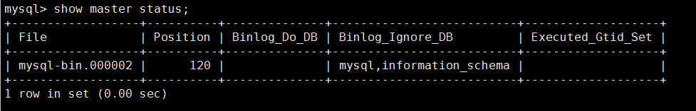
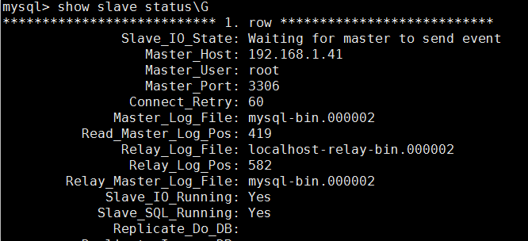

# MySQL Master SLAVE

## 主备环境搭建

环境准备
服务器: CENTOS7
数据库: MYSQL 5.7

## 主库配置

先给数据库添加一个专门用于同步的用户, 这里repl是用户名,123456是密码, 且只限于同一网段

```sql
GRANT REPLICATION SLAVE, REPLICATION CLIENT ON *.* TO repl@'192.168.0.%' IDENTIFIED BY '123456';
```

找到MYSQL的配置文件并添加以下配置。 我的是在/etc/my.cnf, 如果你的MYSQL是用docker安装的话, 则要进入docker容器里面找 `[mysqld]`

```properties
[mysqld]
##  binlog文件名
log_bin = mysql-bin
## MYSQL实例id, 不能重复
server_id = 10
## 仅将以下数据库记录binlog, 不记录的则不会同步
## binlog_do_db = dbname1,dbname2
## 以下是推荐配置, 且是默认配置
## sync_binlog = 1
## innodb_flush_log_at_trx_commit = 1
## innodb_support_xa = on
## binlog_format = row
```

## 备库配置

和主库一样, 先添加一个同步的用户

```sql
GRANT REPLICATION SLAVE, REPLICATION CLIENT ON *.* TO repl@'192.168.0.%' IDENTIFIED BY '123456';
```

找到配置文件, 添加以下配置

```properties
[mysqld]
log_bin = mysql-bin
server_id = 20
## 中继日志
relay_log = /var/log/mysql/mysql-relay-bin
## 允许备库将重放事件记录到自身的binlog中
log_slave_updates = 1
## 只读, 也可以不设置
read_only = 1
## 需要同步的数据库, 逗号分隔(不添加代表同步所有)
## replicate-do-db = dbname
## 不需要同步的表, 多个需要分别设置
## replicate-ignore-table = dbname.table_name1
## replicate-ignore-table = dbname.table_name2
```

## 开始同步

由于我们修改了数据库的配置 , 所以第一件事就是将两个数据库重启, 重启完成之后在主库执行命令`show master status`, 可以看到生成的binlog文件名	

```sql
mysql> show master status;
+—————————————————+——————————+——————————————+——————————————————+
| File            | Position | Binlog_Do_DB | Binlog_Ignore_DB |
+—————————————————+——————————+——————————————+——————————————————+
| mysql-bin.000001| 98       | dbname       |                  |
+—————————————————+——————————+——————————————+——————————————————+
```

注意: 如果主库已经运行了一段时间，而不是新安装的。那么需要先将主库克隆一份到备库，比如使用mysqldump转存一份到备库上

下一步就是告诉备库如何连接到主库并重放binlog, 这一步推荐使用`CHANGE MASTER TO`语句来执行, 而不是修改配置文件。在备库上执行以下语句:

```sql
CHANGE MASTER TO MASTER_HOST = 'MASTER_SERVER_HOST', MASTER_USER = 'repl', MASTER_PASSWORD = '123456', MASTER_LOG_FILE = 'mysql-bin.000001', MSTER_LOG_POS = 0;
```

`MSTER_LOG_POS`参数设置为0, 是因为要从日志的开头读起。执行完之后再通过`SHOW SLAVE_STATUS`检查复制是否正确执行。

```sql
mysql> show master status;
+—————————————————————+————————————————————+——————————————+—————————————+———————————————+——————————————————+—————————————————————+————————————————————————+———————————————————————+——————————————————+———————————————————+———+————————————————————————+
|   Slave_IO_State    | Master_Host        | Master_User  | Master_Port | Connect_Retry | Master_Log_File  | Read_Master_Log_Pos | Relay_Log_Pos          | Relay_Master_Log_File | Slave_IO_Running | Slave_Sql_Running | … | Seconds_Behind_Master  |
|                     | MASTER_SERVER_HOST | repl         | 3306        | 60            | mysql-bin.000001 | 4                   | mysql-relay-bin.000001 | mysql-bin.000001      | No               | No                | … | 0                      |
+—————————————————————+————————————————————+——————————————+—————————————+———————————————+——————————————————+—————————————————————+————————————————————————+———————————————————————+——————————————————+———————————————————+———+————————————————————————+
```

最后再执行START SLAVE语句开始进行同步。

没有显示错误则再次执行SHOW SLAVE_STATUS查看状态，也可以在主库及备库上通过SHOW PROCESSLIST命令查看同步线程的状态。

主库

| Id   | User | Host                     | db   | Command     | Time | State                                                        | Info |
| ---- | ---- | ------------------------ | ---- | ----------- | ---- | ------------------------------------------------------------ | ---- |
| 15   | repl | MASTER_SERVER_HOST:14732 |      | Binlog Dump | 2770 | Master has sent all binlog to slave; waiting for more updates |      |

备库

| Id   | User        | Host | db   | Command | Time | State                                                  | Info |
| ---- | ----------- | ---- | ---- | ------- | ---- | ------------------------------------------------------ | ---- |
| 1    | system user |      |      | Connect | 2749 | Waiting for master to send event                       |      |
| 2    | system user |      |      | Connect | 2742 | Slave has read all relay log; waiting for more updates |      |


# [MySQL双主热备宕机自动切换](https://www.cnblogs.com/guantou1992/p/9729465.html)

## 一、定义

通常说的「双机热备」是指两台机器都在运行，但并不是两台机器都同时在提供服务。当提供服务的一台出现故障的时候，另外一台会马上自动接管并且提供服务，而且切换的时间非常短。

## 二、原理

Keepalived的工作原理是VRRP（Virtual Router Redundancy Protocol）虚拟路由冗余协议。在VRRP中有两组重要的概念：VRRP路由器和虚拟路由器，主控路由器和备份路由器。 VRRP路由器是指运行VRRP的路由器，是物理实体，虚拟路由器是指VRRP协议创建的，是逻辑概念。一组VRRP路由器协同工作，共同构成一台虚拟路由器。 Vrrp中存在着一种选举机制，用以选出提供服务的路由即主控路由，其他的则成了备份路由。当主控路由失效后，备份路由中会重新选举出一个主控路由，来继续工作，来保障不间断服务。

## 三、架构环境

MASTER：192.168.1.40

BACKUP：192.168.1.41

VIP：192.168.1.44 （虚拟IP）

## 四、配置

1、配置两台Mysql主主同步

编辑my.cnf

```
# vi /etc/my.cnf
[mysqld]
server-id       = 1                             #backup这台设置为2
log-bin=mysql-bin
binlog-ignore-db = mysql,information_schema     #忽略写入binglog日志的库
auto-increment-increment = 2                    #字段变化增量值
auto-increment-offset = 1                       #初始字段ID为1
slave-skip-errors = all                         #忽略所有复制产生的错误
```

```
# /etc/init.d/mysqld restart
```

查看下MASTER的binglog日志和pos值的位置


查看下BACKUP的binglog日志和pos值的位置



master配置如下:

```
 mysql> GRANTREPLICATION SLAVE ON *.* TO 'root'@'192.168.1.41' IDENTIFIED  BY '123456';
 mysql> flush privileges;
 mysql> change master to
     -> master_host='192.168.1.41',
     -> master_user='root',
     -> master_password='123456',
     -> master_log_file='mysql-bin.000002',
     -> master_log_pos=120;
 mysql> start slave;
```

backup配置如下：

```
 mysql> GRANT REPLICATION SLAVE ON *.* TO 'root'@'192.168.1.40' IDENTIFIED BY '123456';
 mysql> flush privileges;
 mysql> change master to
     -> master_host='192.168.1.40',
     -> master_user='root',
     -> master_password='123456',
     -> master_log_file='mysql-bin.000002',
     -> master_log_pos=120;
 mysql> start slave;
```

主主同步配置完成，查看同步状态Slave_IO和Slave_SQL是YES说明主主同步成功。两边都要YES。如果一边yes，另外一边识别不到pos就无法同步；




master插入数据如下：


在backup查看是否同步：


可以看到已经成功同步过去，同样在backup插入到user表数据，一样同步过去，双主就做成功了。 

主主配置常见报错： 注：如果其中一边提示连接中，关闭防火墙即，或者对应IP不对，请注意查看salve的IP。其中一个显示NO，查底下报错，显示pos值匹配不到的，则说明你其中一边的bin-log不一致，关闭salve，重新配置即可。

2、配置keepalived实现热备

keepalived编译配置文件

```
# vi /etc/keepalived/keepalived.conf
! Configuration File for keepalived

global_defs {
  notification_email {
  11111111@qq.com
       }
  notification_email_from Alexandre.Cassen@firewall.loc
  smtp_server 127.0.0.1
  smtp_connect_timeout 30
  router_id MYSQL_HA
}
! Configuration File for keepalived

global_defs {
  notification_email {
    11111111@qq.com
  }
  advert_int 1
  nopreempt
  authentication {
    auth_type PASS
    auth_pass 1111
  }
  virtual_ipaddress {
    192.168.1.44
  }
}

virtual_server 192.168.1.44 3306 {
  delay_loop 2
  #lb_algo rr              #LVS算法，用不到，我们就关闭了
  #lb_kind DR              #LVS模式，如果不关闭，备用服务器不能通过VIP连接主MySQL
  persistence_timeout 50  #同一IP的连接60秒内被分配到同一台真实服务器
  protocol TCP
  real_server 192.168.0.40 3306 {   #检测本地mysql，backup也要写检测本地mysql
    persistence_timeout 50  #同一IP的连接60秒内被分配到同一台真实服务器
    protocol TCP
  }
  real_server 192.168.0.40 3306 {   #检测本地mysql，backup也要写检测本地mysql
    #lb_kind DR              #LVS模式，如果不关闭，备用服务器不能通过VIP连接主MySQL
    persistence_timeout 50  #同一IP的连接60秒内被分配到同一台真实服务器
    protocol TCP
  }
  real_server 192.168.0.40 3306 {   #检测本地mysql，backup也要写检测本地mysql
  weight 3
  notify_down /etc/keepalived/mysql.sh    #当mysq服down时，执行此脚本，杀死keepalived实现切换
  TCP_CHECK {
    connect_timeout 3   
    #连接超时
    nb_get_retry 3       #重试次数
    delay_before_retry 3 #重试间隔时间
  }
}
```

**采用keepalived作为高可用方案时，两个节点最好都设置成BACKUP模式，避免因为意外情况下（比如脑裂）相互抢占导致往两个节点写入相同数据而引发冲突；** 

backup服务器只修改priority为90、nopreempt不设置、real_server设置本地IP。

## 五、测试高可用性

1、通过Mysql客户端通过VIP连接，看是否连接成功。

2、停止master这台mysql服务，是否能正常切换过去，可通过ip addr命令来查看VIP在哪台服务器上。

当master数据库宕的时候，VIP就会自动切换到另一台上，实现主主自动切换。远程连接数据库的虚拟IP是可以连接的，实现应用切换的效率。部署应用的时候配置VIP即可共享数据库资源。

3.注意：当宕库恢复的时候，要启动keepalived，否则VIP无法自动切换回来。