# MySQL实战45讲

原文：[MySQL实战45讲](https://funnylog.gitee.io/mysql45/)

文中没有看懂的地方有标记：[考]

## 基础架构：查询语句是如何执行的

这是专栏的第一篇文章，我想来跟你聊聊MySQL的基础架构。我们经常说，看一个事儿千万不要直接陷入细节里，你应该先鸟瞰其全貌，这样能够帮助你从高维度理解问题。同样，对于MySQL的学习也是这样。平时我们使用数据库，看到的通常都是一个整体。比如，你有个最简单的表，表里只有一个ID字段，在执行下面这个查询语句时：

```mysql
mysql> select * from T where ID=10；
```

我们看到的只是输入一条语句，返回一个结果，却不知道这条语句在MySQL内部的执行过程。

所以今天我想和你一起把MySQL拆解一下，看看里面都有哪些**零件**，希望借由这个拆解过程，让你对MySQL有更深入的理解。这样当我们碰到MySQL的一些异常或者问题时，就能够直戳本质，更为快速地定位并解决问题。

下面我给出的是MySQL的基本架构示意图，从中你可以清楚地看到SQL语句在MySQL的各个功能模块中的执行过程。

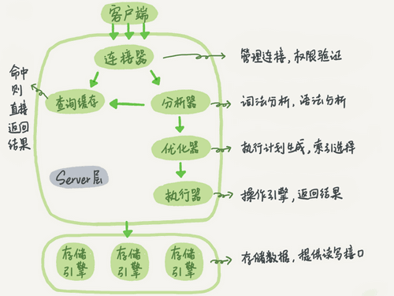

大体来说，MySQL可以分为**Server层**和**存储引擎层**两部分。

**Server层**：包括连接器、查询缓存、分析器、优化器、执行器等，涵盖MySQL的大多数核心服务功能，以及所有的内置函数(如日期、时间、数学和加密函数等)，所有跨存储引擎的功能都在这一层实现，比如存储过程、触发器、视图等。

**存储引擎层**：负责数据的存储和提取。其架构模式是插件式的，支持InnoDB、MyISAM、Memory等多个存储引擎。现在最常用的存储引擎是InnoDB，它从MySQL 5.5.5版本开始成为了默认存储引擎。

也就是说，你执行create table建表的时候，如果不指定引擎类型，默认使用的就是InnoDB。不过，你也可以通过指定存储引擎的类型来选择别的引擎，比如在create table语句中使用engine=memory, 来指定使用内存引擎创建表。不同存储引擎的表数据存取方式不同，支持的功能也不同，在后面的文章中，我们会讨论到引擎的选择。

从图中不难看出，不同的存储引擎共用一个**Server层**，也就是从连接器到执行器的部分。你可以先对每个组件的名字有个印象，接下来我会结合开头提到的那条SQL语句，带你走一遍整个执行流程，依次看下每个组件的作用。

### 连接器

第一步，你会先连接到这个数据库上，这时候接待你的就是连接器。连接器负责跟客户端建立连接、获取权限、维持和管理连接。**连接命令**一般是这么写的：

```sh
$ mysql -h<ip> -P<port> -u<user> -p
```

输完命令之后，你就需要在交互对话里面输入密码。虽然密码也可以直接跟在-p后面写在命令行中，但这样可能会导致你的密码泄露。如果你连的是生产服务器，强烈建议你不要这么做。

连接命令中的mysql是客户端工具，用来跟服务端建立连接。在完成经典的TCP握手后，连接器就要开始认证你的身份，这个时候用的就是你输入的用户名和密码。

- 如果用户名或密码不对，你就会收到一个"Access denied for user"的错误，然后客户端程序结束执行。
- 如果用户名密码认证通过，连接器会到权限表里面查出你拥有的权限。之后，这个连接里面的权限判断逻辑，都将依赖于此时读到的权限。

这就意味着，一个用户成功建立连接后，即使你用管理员账号对这个用户的权限做了修改，也不会影响已经存在连接的权限。修改完成后，只有再新建的连接才会使用新的权限设置。

连接完成后，如果你没有后续的动作，这个连接就处于空闲状态，你可以在`show processlist`命令中看到它。文本中这个图是执行的结果，其中的Command列显示为**Sleep**的这一行，就表示现在系统里面有一个空闲连接。

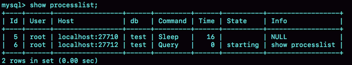

客户端如果太长时间没动静，连接器就会自动将它断开。这个时间是由参数`wait_timeout`控制的，默认值是**8小时**。

如果在连接被断开之后，客户端再次发送请求的话，就会收到一个错误提醒： Lost connection to MySQL server during query。这时候如果你要继续，就需要重连，然后再执行请求了。

数据库里面，长连接是指连接成功后，如果客户端持续有请求，则一直使用同一个连接。短连接则是指每次执行完很少的几次查询就断开连接，下次查询再重新建立一个。

建立连接的过程通常是比较复杂的，所以我建议你在使用中要尽量减少建立连接的动作，也就是尽量使用长连接。

但是全部使用长连接后，你可能会发现，有些时候MySQL占用内存涨得特别快，这是因为MySQL在执行过程中临时使用的内存是管理在连接对象里面的。这些资源会在连接断开的时候才释放。所以如果长连接累积下来，可能导致内存占用太大，被系统强行杀掉(OOM)，从现象看就是MySQL异常重启了。

怎么解决这个问题呢？你可以考虑以下两种55方案。

1. 定期断开长连接。使用一段时间，或者程序里面判断执行过一个占用内存的大查询后，断开连接，之后要查询再重连。
2. 如果你用的是MySQL 5.7或更新版本，可以在每次执行一个比较大的操作后，通过执行 `mysql_reset_connection`来重新初始化连接资源。这个过程不需要重连和重新做权限验证，但是会将连接恢复到刚刚创建完时的状态。

[考]：如何配置是长连接还是短连接？

### 查询缓存

连接建立完成后，你就可以执行select语句了。执行逻辑就会来到第二步：查询缓存。

MySQL拿到一个查询请求后，会先到查询缓存看看，之前是不是执行过这条语句。之前执行过的语句及其结果可能会以key-value对的形式被直接缓存在内存中。key是查询的语句，value是查询的结果。如果你的查询能够直接在这个缓存中找到key，那么这个value就会被直接返回给客户端。

如果语句不在查询缓存中，就会继续后面的执行阶段。执行完成后，执行结果会被存入查询缓存中。你可以看到，如果查询命中缓存，MySQL不需要执行后面的复杂操作，就可以直接返回结果，这个效率会很高。

**但是大多数情况下我会建议你不要使用查询缓存，为什么呢？因为查询缓存往往弊大于利。**

查询缓存的失效非常频繁，只要有对一个表的更新，这个表上所有的查询缓存都会被清空。因此很可能你费劲地把结果存起来，还没使用呢，就被一个更新全清空了。对于更新压力大的数据库来说，查询缓存的命中率会非常低。除非你的业务就是有一张静态表，很长时间才会更新一次。比如，一个系统配置表，那这张表上的查询才适合使用查询缓存。

好在MySQL也提供了这种**按需使用**的方式。你可以将参数`query_cache_type`设置成`DEMAND`，这样对于默认的SQL语句都不使用查询缓存。而对于你确定要使用查询缓存的语句，可以用`SQL_CACHE`显式指定，像下面这个语句一样：

```mysql
mysql> select SQL_CACHE * from T where ID=10；
```

需要注意的是，MySQL 8.0版本直接将查询缓存的整块功能删掉了，也就是说8.0开始彻底没有这个功能了。

### 分析器

如果没有命中查询缓存，就要开始真正执行语句了。首先，MySQL需要知道你要做什么，因此需要对SQL语句做解析。

分析器先会做**词法分析**。你输入的是由多个字符串和空格组成的一条SQL语句，MySQL需要识别出里面的字符串分别是什么，代表什么。

MySQL从你输入的"select"这个关键字识别出来，这是一个查询语句。它也要把字符串**T**识别成**表名T**，把字符串**ID**识别成**列ID**。

做完了这些识别以后，就要做**语法分析**。根据词法分析的结果，语法分析器会根据语法规则，判断你输入的这个SQL语句是否满足MySQL语法。

如果你的语句不对，就会收到**You have an error in your SQL syntax**的错误提醒，比如下面这个语句select少打了开头的字母**s**。

```mysql
mysql> elect * from t where ID=1;

ERROR 1064 (42000): You have an error in your SQL syntax; check the manual that corresponds to your MySQL server version for the right syntax to use near 'elect * from t where ID=1' at line 1
```

一般语法错误会提示第一个出现错误的位置，所以你要关注的是紧接**use near**的内容。

### 优化器

经过了分析器，MySQL就知道你要做什么了。在开始执行之前，还要先经过优化器的处理。

优化器是在表里面有多个索引的时候，决定使用哪个索引；或者在一个语句有多表关联(join)的时候，决定各个表的连接顺序。比如你执行下面这样的语句，这个语句是执行两个表的join：

```mysql
mysql> select * from t1 join t2 using(ID) where t1.c=10 and t2.d=20;
```

- 既可以先从表t1里面取出c=10的记录的ID值，再根据ID值关联到表t2，再判断t2里面d的值是否等于20。
- 也可以先从表t2里面取出d=20的记录的ID值，再根据ID值关联到t1，再判断t1里面c的值是否等于10。

这两种执行方法的逻辑结果是一样的，但是执行的效率会有不同，而优化器的作用就是决定选择使用哪一个方案。

优化器阶段完成后，这个语句的执行方案就确定下来了，然后进入执行器阶段。如果你还有一些疑问，比如优化器是怎么选择索引的，有没有可能选择错等等，没关系，我会在后面的文章中单独展开说明优化器的内容。

### 执行器

MySQL通过分析器知道了你要做什么，通过优化器知道了该怎么做，于是就进入了执行器阶段，开始执行语句。

开始执行的时候，要先判断一下你对这个表T有没有执行查询的权限，如果没有，就会返回没有权限的错误，如下所示(在工程实现上，如果命中查询缓存，会在查询缓存放回结果的时候，做权限验证。查询也会在优化器之前调用precheck验证权限)。

```mysql
mysql> select * from T where ID=10;

ERROR 1142 (42000): SELECT command denied to user 'b'@'localhost' for table 'T'
```

如果有权限，就打开表继续执行。打开表的时候，执行器就会根据表的引擎定义，去使用这个引擎提供的接口。

比如我们这个例子中的表T中，ID字段没有索引，那么执行器的执行流程是这样的：

1. 调用InnoDB引擎接口取这个表的第一行，判断ID值是不是10，如果不是则跳过，如果是则将这行存在结果集中；
2. 调用引擎接口取**下一行**，重复相同的判断逻辑，直到取到这个表的最后一行。
3. 执行器将上述遍历过程中所有满足条件的行组成的记录集作为结果集返回给客户端。

至此，这个语句就执行完成了。

对于有索引的表，执行的逻辑也差不多。第一次调用的是**取满足条件的第一行**这个接口，之后循环取**满足条件的下一行**这个接口，这些接口都是引擎中已经定义好的。

你会在数据库的慢查询日志中看到一个`rows_examined`的字段，表示这个语句执行过程中扫描了多少行。这个值就是在执行器每次调用引擎获取数据行的时候累加的。

在有些场景下，执行器调用一次，在引擎内部则扫描了多行，因此**引擎扫描行数跟rows_examined并不是完全相同的。**我们后面会专门有一篇文章来讲存储引擎的内部机制，里面会有详细的说明。

### 小结

今天我给你介绍了MySQL的逻辑架构，希望你对一个SQL语句完整执行流程的各个阶段有了一个初步的印象。由于篇幅的限制，我只是用一个查询的例子将各个环节过了一遍。如果你还对每个环节的展开细节存有疑问，也不用担心，后续在实战章节中我还会再提到它们。

我给你留一个问题吧，如果表T中没有字段k，而你执行了这个语句 select * from T where k=1, 那肯定是会报**不存在这个列**的错误： **Unknown column 'k' in 'where clause'**。你觉得这个错误是在我们上面提到的哪个阶段报出来的呢？

答案是：分析器

```my
mysqld --debug --console &后，
mysql> create database wxb;
Query OK, 1 row affected (0.01 sec)

mysql> use wxb;
Database changed
mysql> create table t(a int);
Query OK, 0 rows affected (0.01 sec)

mysql> select * from t where k=1;
ERROR 1054 (42S22): Unknown column 'k' in 'where clause'

T@4: | | | | | | | | | error: error: 1054 message: 'Unknown column 'k' in 'where clause''

Complete optimizer trace:
```

#### **执行流程**

1. 连接：认证，权限
2. 查询：查询缓存 Query Cache
3. 分析器：词法分析，语法分析，语义分析
4. 优化器：优化SQL{基于规则的优化(RBO)、基于成本的优化(CBO)}，决策执行方案
5. 执行器：根据表信息调用响应存储引擎的接口执行
6. 返回结果集，等待新的请求

### 总结性问题

1. MySQL的框架有几个组件, 各是什么作用?
2. Server层和存储引擎层各是什么作用?
3. `you have an error in your SQL syntax` 这个报错是在词法分析里还是在语法分析里报错?
4. 对于表的操作权限验证在哪里进行?
5. 执行器的执行查询语句的流程是什么样的?

```
1. wait_timeout是客户端 非交互式的连接时间，如果是交互连接,关联的时间参数为interactive_timeout, 这两个时间参数需要尽量一致吗,一般设置多少合适?
尽量设置成相同。值的话取决于业务。如果你面对的是成熟的开发（比如公司内部团队），可以设置小些，分钟级别就行

2. 关闭查询缓存是 query_cache_size=0 要匹配参数query_cache_type=off吗？ 还是直接query_cache_size=0 即可？
query_cache_type会好些（代码判断路径更短）
```


## 日志系统：更新语句是如何执行的

前面我们系统了解了一个查询语句的执行流程，并介绍了执行过程中涉及的处理模块。相信你还记得，一条查询语句的执行过程一般是经过连接器、分析器、优化器、执行器等功能模块，最后到达存储引擎。

那么，一条更新语句的执行流程又是怎样的呢？

之前你可能经常听DBA同事说，MySQL可以恢复到半个月内任意一秒的状态，惊叹的同时，你是不是心中也会不免会好奇，这是怎样做到的呢？

我们还是从一个表的一条更新语句说起，下面是这个表的创建语句，这个表有一个主键ID和一个整型字段c：

```mysql
mysql> create table T(ID int primary key, c int);
```

如果要将ID=2这一行的值加1，SQL语句就会这么写：

```mysql
mysql> update T set c=c+1 where ID=2;
```

前面我有跟你介绍过SQL语句基本的执行链路，这里我再把那张图拿过来，你也可以先简单看看这个图回顾下。首先，可以确定的说，查询语句的那一套流程，更新语句也是同样会走一遍。


你执行语句前要先连接数据库，这是连接器的工作。

前面我们说过，在一个表上有更新的时候，跟这个表有关的查询缓存会失效，所以这条语句就会把表T上所有缓存结果都清空。这也就是我们一般不建议使用查询缓存的原因。

接下来，分析器会通过词法和语法解析知道这是一条更新语句。优化器决定要使用ID这个索引。然后，执行器负责具体执行，找到这一行，然后更新。

与查询流程不一样的是，更新流程还涉及两个重要的日志模块，它们正是我们今天要讨论的主角：**redo log**（重做日志）和 **binlog**（归档日志）。如果接触MySQL，那这两个词肯定是绕不过的，我后面的内容里也会不断地和你强调。不过话说回来，redo log和binlog在设计上有很多有意思的地方，这些设计思路也可以用到你自己的程序里。

### 重要的日志模块：redo log

不知道你还记不记得《孔乙己》这篇文章，酒店掌柜有一个粉板，专门用来记录客人的赊账记录。如果赊账的人不多，那么他可以把顾客名和账目写在板上。但如果赊账的人多了，粉板总会有记不下的时候，这个时候掌柜一定还有一个专门记录赊账的账本。

如果有人要赊账或者还账的话，掌柜一般有两种做法：

- 一种做法是直接把账本翻出来，把这次赊的账加上去或者扣除掉；
- 另一种做法是先在粉板上记下这次的账，等打烊以后再把账本翻出来核算。

在生意红火柜台很忙时，掌柜一定会选择后者，因为前者操作实在是太麻烦了。首先，你得找到这个人的赊账总额那条记录。你想想，密密麻麻几十页，掌柜要找到那个名字，可能还得带上老花镜慢慢找，找到之后再拿出算盘计算，最后再将结果写回到账本上。

这整个过程想想都麻烦。相比之下，还是先在粉板上记一下方便。你想想，如果掌柜没有粉板的帮助，每次记账都得翻账本，效率是不是低得让人难以忍受？

同样，在MySQL里也有这个问题，如果每一次的更新操作都需要写进磁盘，然后磁盘也要找到对应的那条记录，然后再更新，整个过程IO成本、查找成本都很高。为了解决这个问题，MySQL的设计者就用了类似酒店掌柜粉板的思路来提升更新效率。

而粉板和账本配合的整个过程，其实就是MySQL里经常说到的WAL技术，WAL的全称是Write-Ahead Logging，它的关键点就是先写日志，再写磁盘，也就是先写粉板，等不忙的时候再写账本。

具体来说，当有一条记录需要更新的时候，InnoDB引擎就会先把记录写到redo log（粉板）里面，并更新内存，这个时候更新就算完成了。同时，InnoDB引擎会在适当的时候，将这个操作记录更新到磁盘里面，而这个更新往往是在系统比较空闲的时候做，这就像打烊以后掌柜做的事。

如果今天赊账的不多，掌柜可以等打烊后再整理。但如果某天赊账的特别多，粉板写满了，又怎么办呢？这个时候掌柜只好放下手中的活儿，把粉板中的一部分赊账记录更新到账本中，然后把这些记录从粉板上擦掉，为记新账腾出空间。

与此类似，InnoDB的redo log是固定大小的，比如可以配置为一组4个文件，每个文件的大小是1GB，那么这块“粉板”总共就可以记录4GB的操作。从头开始写，写到末尾就又回到开头循环写，如下面这个图所示。

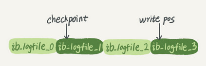

**write pos**是当前记录的位置，一边写一边后移，写到第3号文件末尾后就回到0号文件开头。**checkpoint**是当前要擦除的位置，也是往后推移并且循环的，擦除记录前要把记录更新到数据文件。

write pos和checkpoint之间的是“粉板”上还空着的部分，可以用来记录新的操作。如果write pos追上checkpoint，表示“粉板”满了，这时候不能再执行新的更新，得停下来先擦掉一些记录，把checkpoint推进一下。

有了redo log，InnoDB就可以保证即使数据库发生异常重启，之前提交的记录都不会丢失，这个能力称为**crash-safe**。

要理解crash-safe这个概念，可以想想我们前面赊账记录的例子。只要赊账记录记在了粉板上或写在了账本上，之后即使掌柜忘记了，比如突然停业几天，恢复生意后依然可以通过账本和粉板上的数据明确赊账账目。

### 重要的日志模块：binlog

前面我们讲过，MySQL整体来看，其实就有两块：一块是Server层，它主要做的是MySQL功能层面的事情；还有一块是引擎层，负责存储相关的具体事宜。上面我们聊到的粉板redo log是InnoDB引擎特有的日志，而Server层也有自己的日志，称为binlog（归档日志）。

我想你肯定会问，为什么会有两份日志呢？

因为最开始MySQL里并没有InnoDB引擎。MySQL自带的引擎是MyISAM，但是MyISAM没有crash-safe的能力，binlog日志只能用于归档。而InnoDB是另一个公司以插件形式引入MySQL的，既然只依靠binlog是没有crash-safe能力的，所以InnoDB使用另外一套日志系统——也就是redo log来实现crash-safe能力。

这两种日志有以下三点不同。

1. redo log是InnoDB引擎特有的；binlog是MySQL的Server层实现的，所有引擎都可以使用。
2. redo log是物理日志，记录的是“在某个数据页上做了什么修改”；binlog是逻辑日志，记录的是这个语句的原始逻辑，比如“给ID=2这一行的c字段加1 ”。
3. redo log是循环写的，空间固定会用完；binlog是可以追加写入的。“追加写”是指binlog文件写到一定大小后会切换到下一个，并不会覆盖以前的日志。

有了对这两个日志的概念性理解，我们再来看执行器和InnoDB引擎在执行这个简单的update语句时的内部流程。

1. 执行器先找引擎取ID=2这一行。ID是主键，引擎直接用树搜索找到这一行。如果ID=2这一行所在的数据页本来就在内存中，就直接返回给执行器；否则，需要先从磁盘读入内存，然后再返回。
2. 执行器拿到引擎给的行数据，把这个值加上1，比如原来是N，现在就是N+1，得到新的一行数据，再调用引擎接口写入这行新数据。
3. 引擎将这行新数据更新到内存中，同时将这个更新操作记录到redo log里面，此时redo log处于prepare状态。然后告知执行器执行完成了，随时可以提交事务。
4. 执行器生成这个操作的binlog，并把binlog写入磁盘。
5. 执行器调用引擎的提交事务接口，引擎把刚刚写入的redo log改成提交（commit）状态，更新完成。

这里我给出这个update语句的执行流程图，图中浅色框表示是在InnoDB内部执行的，深色框表示是在执行器中执行的。

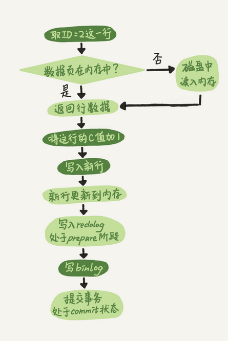

你可能注意到了，最后三步看上去有点“绕”，将redo log的写入拆成了两个步骤：prepare和commit，这就是"两阶段提交"。

### 两阶段提交

为什么必须有“两阶段提交”呢？这是为了让两份日志之间的逻辑一致。要说明这个问题，我们得从文章开头的那个问题说起：**怎样让数据库恢复到半个月内任意一秒的状态？**

前面我们说过了，binlog会记录所有的逻辑操作，并且是采用“追加写”的形式。如果你的DBA承诺说半个月内可以恢复，那么备份系统中一定会保存最近半个月的所有binlog，同时系统会定期做整库备份。这里的“定期”取决于系统的重要性，可以是一天一备，也可以是一周一备。

当需要恢复到指定的某一秒时，比如某天下午两点发现中午十二点有一次误删表，需要找回数据，那你可以这么做：

- 首先，找到最近的一次**全量备份**，如果你运气好，可能就是昨天晚上的一个备份，从这个备份恢复到临时库；
- 然后，从备份的时间点开始，将备份的**binlog**依次取出来，重放到中午误删表之前的那个时刻。[考]

这样你的临时库就跟误删之前的线上库一样了，然后你可以把表数据从临时库取出来，按需要恢复到线上库去。

好了，说完了数据恢复过程，我们回来说说，为什么日志需要“两阶段提交”。这里不妨用反证法来进行解释。

由于redo log和binlog是两个独立的逻辑，如果不用两阶段提交，要么就是先写完redo log再写binlog，或者采用反过来的顺序。我们看看这两种方式会有什么问题。

仍然用前面的update语句来做例子。假设当前ID=2的行，字段c的值是0，再假设执行update语句过程中在写完第一个日志后，第二个日志还没有写完期间发生了crash，会出现什么情况呢？

1. **先写redo log后写binlog**。假设在redo log写完，binlog还没有写完的时候，MySQL进程异常重启。由于我们前面说过的，redo log写完之后，系统即使崩溃，仍然能够把数据恢复回来，所以恢复后这一行c的值是1。
   但是由于binlog没写完就crash了，这时候binlog里面就没有记录这个语句。因此，之后备份日志的时候，存起来的binlog里面就没有这条语句。
   然后你会发现，如果需要用这个binlog来恢复临时库的话，由于这个语句的binlog丢失，这个临时库就会少了这一次更新，恢复出来的这一行c的值就是0，与原库的值不同。
2. **先写binlog后写redo log**。如果在binlog写完之后crash，由于redo log还没写，崩溃恢复以后这个事务无效，所以这一行c的值是0。但是binlog里面已经记录了“把c从0改成1”这个日志。所以，在之后用binlog来恢复的时候就多了一个事务出来，恢复出来的这一行c的值就是1，与原库的值不同。

可以看到，如果不使用“两阶段提交”，那么数据库的状态就有可能和用它的日志恢复出来的库的状态不一致。

你可能会说，这个概率是不是很低，平时也没有什么动不动就需要恢复临时库的场景呀？

其实不是的，不只是误操作后需要用这个过程来恢复数据。当你需要**扩容**的时候，也就是需要再多搭建一些备库来增加系统的读能力的时候，现在常见的做法也是用**全量备份加上应用binlog**来实现的，这个“不一致”就会导致你的线上出现主从数据库不一致的情况。

简单说，redo log和binlog都可以用于表示事务的提交状态，而两阶段提交就是让这两个状态保持逻辑上的一致。

### 小结

今天，我介绍了MySQL里面最重要的两个日志，即物理日志redo log和逻辑日志binlog。

redo log用于保证crash-safe能力。`innodb_flush_log_at_trx_commit`这个参数设置成1的时候，表示每次事务的redo log都直接持久化到磁盘。这个参数我建议你设置成1，这样可以保证MySQL异常重启之后数据不丢失。

`sync_binlog`这个参数设置成1的时候，表示每次事务的binlog都持久化到磁盘。这个参数我也建议你设置成1，这样可以保证MySQL异常重启之后binlog不丢失。

我还跟你介绍了与MySQL日志系统密切相关的“两阶段提交”。两阶段提交是跨系统维持数据逻辑一致性时常用的一个方案，即使你不做数据库内核开发，日常开发中也有可能会用到。

文章的最后，我给你留一个思考题吧。前面我说到定期全量备份的周期“取决于系统重要性，有的是一天一备，有的是一周一备”。那么在什么场景下，一天一备会比一周一备更有优势呢？或者说，它影响了这个数据库系统的哪个指标？

### 牛逼评论

> 首先谈一下，学习后的收获
> 1、redo是物理的，binlog是逻辑的；现在由于redo是属于InnoDB引擎，所以必须要有binlog，因为你可以使用别的引擎保证数据库的一致性，必须要保证2份日志一致，使用的2阶段式提交；其实感觉像事务，不是成功就是失败，不能让中间环节出现，也就是一个成功，一个失败
> 2、如果有一天mysql只有InnoDB引擎了，由redo来实现复制，那么感觉oracle的DG就诞生了，物理的速度也将远超逻辑的，毕竟只记录了改动向量
> 3、binlog几大模式，一般采用row，因为遇到时间，从库可能会出现不一致的情况，但是row更新前后都有，会导致日志变大
> 4、最后2个参数，保证事务成功，日志必须落盘，这样，数据库crash后，就不会丢失某个事务的数据了
> 5、其次说一下，对问题的理解
> 备份时间周期的长短，感觉有2个方便
> 首先，是恢复数据丢失的时间，既然需要恢复，肯定是数据丢失了。如果一天一备份的话，只要找到这天的全备，加入这天某段时间的binlog来恢复，如果一周一备份，假设是周一，而你要恢复的数据是周日某个时间点，那就需要全备+周一到周日某个时间点的全部binlog用来恢复，时间相比前者需要增加很多；看业务能忍受的程度
> 其次，是数据库丢失，如果一周一备份的话，需要确保整个一周的binlog都完好无损，否则将无法恢复；而一天一备，只要保证这天的binlog都完好无损；当然这个可以通过校验，或者冗余等技术来实现，相比之下，上面那点更重要
>
> 作者回复
> 👍🏿置顶了
> 你说的物理复制业界有团队在做了，而且官方新版本也把MySQL的表结构都收归InnoDB管理了😄

> 我再来说下自己的理解 。
> 1 prepare阶段 2 写binlog 3 commit
> 当在2之前崩溃时
> 重启恢复：后发现没有commit，回滚。备份恢复：没有binlog 。
> 一致
> 当在3之前崩溃
> 重启恢复：虽没有commit，但满足prepare和binlog完整，所以重启后会自动commit。备份：有binlog. 一致

> 1.首先客户端通过tcp/ip发送一条sql语句到server层的SQL interface
> 2.SQL interface接到该请求后，先对该条语句进行解析，验证权限是否匹配
> 3.验证通过以后，分析器会对该语句分析,是否语法有错误等
> 4.接下来是优化器器生成相应的执行计划，选择最优的执行计划
> 5.之后会是执行器根据执行计划执行这条语句。在这一步会去open table,如果该table上有MDL，则等待。
> 如果没有，则加在该表上加短暂的MDL(S)
> (如果opend_table太大,表明open_table_cache太小。需要不停的去打开frm文件)
> 6.进入到引擎层，首先会去innodb_buffer_pool里的data dictionary(元数据信息)得到表信息
> 7.通过元数据信息,去lock info里查出是否会有相关的锁信息，并把这条update语句需要的
> 锁信息写入到lock info里(锁这里还有待补充)
> 8.然后涉及到的老数据通过快照的方式存储到innodb_buffer_pool里的undo page里,并且记录undo log修改的redo
> (如果data page里有就直接载入到undo page里，如果没有，则需要去磁盘里取出相应page的数据，载入到undo page里)
> 9.在innodb_buffer_pool的data page做update操作。并把操作的物理数据页修改记录到redo log buffer里
> 由于update这个事务会涉及到多个页面的修改，所以redo log buffer里会记录多条页面的修改信息。
> 因为group commit的原因，这次事务所产生的redo log buffer可能会跟随其它事务一同flush并且sync到磁盘上
> 10.同时修改的信息，会按照event的格式,记录到binlog_cache中。(这里注意binlog_cache_size是transaction级别的,不是session级别的参数,
> 一旦commit之后，dump线程会从binlog_cache里把event主动发送给slave的I/O线程)
> 11.之后把这条sql,需要在二级索引上做的修改，写入到change buffer page，等到下次有其他sql需要读取该二级索引时，再去与二级索引做merge
> (随机I/O变为顺序I/O,但是由于现在的磁盘都是SSD,所以对于寻址来说,随机I/O和顺序I/O差距不大)
> 12.此时update语句已经完成，需要commit或者rollback。这里讨论commit的情况，并且双1
> 13.commit操作，由于存储引擎层与server层之间采用的是内部XA(保证两个事务的一致性,这里主要保证redo log和binlog的原子性),
> 所以提交分为prepare阶段与commit阶段
> 14.prepare阶段,将事务的xid写入，将binlog_cache里的进行flush以及sync操作(大事务的话这步非常耗时)
> 15.commit阶段，由于之前该事务产生的redo log已经sync到磁盘了。所以这步只是在redo log里标记commit
> 16.当binlog和redo log都已经落盘以后，如果触发了刷新脏页的操作，先把该脏页复制到doublewrite buffer里，把doublewrite buffer里的刷新到共享表空间，然后才是通过page cleaner线程把脏页写入到磁盘中
> 老师，你看我的步骤中有什么问题嘛？我感觉第6步那里有点问题,因为第5步已经去open table了，第6步还有没有必要去buffer里查找元数据呢?这元数据是表示的系统的元数据嘛,还是所有表的？谢谢老师指正
>
> 2018-11-16 21:16
>
> 作者回复
>
> 其实在实现上5是调用了6的过程了的，所以是一回事。MySQL server 层和InnoDB层都保存了表结构，所以有书上描述时会拆开说。
>
> 这个描述很详细，同时还有点到我们后面要讲的内通（编辑快来，有人来砸场子啦😄😄）

> 一个完整的交易过程：账本记上 卖一瓶可乐（redo log为 prepare状态），然后收钱放入钱箱（bin log记录）然后回过头在账本上打个勾（redo log置为commit）表示一笔交易结束。
> 如果收钱时交易被打断，回过头来整理此次交易，发现只有记账没有收钱，则交易失败，删掉账本上的记录（回滚）；如果收了钱后被终止，然后回过头发现账本有记录（prepare）而且钱箱有本次收入（bin log），则继续完善账本（commit），本次交易有效。

> 我理解备份就是救命药加后悔药，灾难发生的时候备份能救命，出现错误的时候备份能后悔。事情都有两面性，没有谁比谁好，只有谁比谁合适，完全看业务情况和需求而定。一天一备恢复时间更短，binlog更少，救命时候更快，但是后悔时间更短，而一周一备正好相反。我自己的备份策略是设置一个16小时延迟复制的从库，充当后悔药，恢复时间也较快。再两天一个全备库和binlog，作为救命药,最后时刻用。这样就比较兼顾了。

## 事务隔离：为什么你改了我还看不见

提到事务，你肯定不陌生，和数据库打交道的时候，我们总是会用到事务。最经典的例子就是转账，你要给朋友小王转100块钱，而此时你的银行卡只有100块钱。

转账过程具体到程序里会有一系列的操作，比如查询余额、做加减法、更新余额等，这些操作必须保证是一体的，不然等程序查完之后，还没做减法之前，你这100块钱，完全可以借着这个时间差再查一次，然后再给另外一个朋友转账，如果银行这么整，不就乱了么？这时就要用到“事务”这个概念了。

简单来说，事务就是要保证一组数据库操作，要么全部成功，要么全部失败。在MySQL中，事务支持是在引擎层实现的。你现在知道，MySQL是一个支持多引擎的系统，但并不是所有的引擎都支持事务。比如MySQL原生的MyISAM引擎就不支持事务，这也是MyISAM被InnoDB取代的重要原因之一。

今天的文章里，我将会以InnoDB为例，剖析MySQL在事务支持方面的特定实现，并基于原理给出相应的实践建议，希望这些案例能加深你对MySQL事务原理的理解。

### 隔离性与隔离级别

提到事务，你肯定会想到ACID（Atomicity、Consistency、Isolation、Durability，即原子性、一致性、隔离性、持久性），今天我们就来说说其中I，也就是“隔离性”。

当数据库上有多个事务同时执行的时候，就可能出现脏读（dirty read）、不可重复读（non-repeatable read）、幻读（phantom read）的问题，为了解决这些问题，就有了“隔离级别”的概念。

在谈隔离级别之前，你首先要知道，你隔离得越严实，效率就会越低。因此很多时候，我们都要在二者之间寻找一个平衡点。SQL标准的事务隔离级别包括：读未提交（read uncommitted）、读提交（read committed）、可重复读（repeatable read）和串行化（serializable ）。下面我逐一为你解释：

- 读未提交是指，一个事务还没提交时，它做的变更就能被别的事务看到。
- 读提交是指，一个事务提交之后，它做的变更才会被其他事务看到。
- 可重复读是指，一个事务执行过程中看到的数据，总是跟这个事务在启动时看到的数据是一致的。当然在可重复读隔离级别下，未提交变更对其他事务也是不可见的。
- 串行化，顾名思义是对于同一行记录，“写”会加“写锁”，“读”会加“读锁”。当出现读写锁冲突的时候，后访问的事务必须等前一个事务执行完成，才能继续执行。

其中“读提交”和“可重复读”比较难理解，所以我用一个例子说明这几种隔离级别。假设数据表T中只有一列，其中一行的值为1，下面是按照时间顺序执行两个事务的行为。

```
mysql> create table T(c int) engine=InnoDB;
insert into T(c) values(1);
```

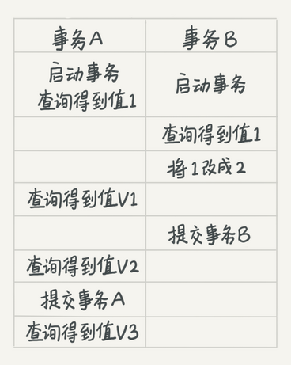
我们来看看在不同的隔离级别下，事务A会有哪些不同的返回结果，也就是图里面V1、V2、V3的返回值分别是什么。

- 若隔离级别是“读未提交”， 则V1的值就是2。这时候事务B虽然还没有提交，但是结果已经被A看到了。因此，V2、V3也都是2。
- 若隔离级别是“读提交”，则V1是1，V2的值是2。事务B的更新在提交后才能被A看到。所以， V3的值也是2。
- 若隔离级别是“可重复读”，则V1、V2是1，V3是2。之所以V2还是1，遵循的就是这个要求：事务在执行期间看到的数据前后必须是一致的。
- 若隔离级别是“串行化”，则在事务B执行“将1改成2”的时候，会被锁住。直到事务A提交后，事务B才可以继续执行。所以从A的角度看， V1、V2值是1，V3的值是2。

在实现上，数据库里面会创建一个视图，访问的时候以视图的逻辑结果为准。在“可重复读”隔离级别下，这个视图是在事务启动时创建的，整个事务存在期间都用这个视图。在“读提交”隔离级别下，这个视图是在每个SQL语句开始执行的时候创建的。这里需要注意的是，“读未提交”隔离级别下直接返回记录上的最新值，没有视图概念；而“串行化”隔离级别下直接用加锁的方式来避免并行访问。

我们可以看到在不同的隔离级别下，数据库行为是有所不同的。Oracle数据库的默认隔离级别其实就是“读提交”，因此对于一些从Oracle迁移到MySQL的应用，为保证数据库隔离级别的一致，你一定要记得将MySQL的隔离级别设置为“读提交”。

配置的方式是，将启动参数transaction-isolation的值设置成READ-COMMITTED。你可以用show variables来查看当前的值。

```
mysql> show variables like 'transaction_isolation';

+-----------------------+----------------+

| Variable_name | Value |

+-----------------------+----------------+

| transaction_isolation | READ-COMMITTED |

+-----------------------+----------------+
```

总结来说，存在即合理，哪个隔离级别都有它自己的使用场景，你要根据自己的业务情况来定。我想**你可能会问那什么时候需要“可重复读”的场景呢**？我们来看一个数据校对逻辑的案例。

假设你在管理一个个人银行账户表。一个表存了每个月月底的余额，一个表存了账单明细。这时候你要做数据校对，也就是判断上个月的余额和当前余额的差额，是否与本月的账单明细一致。你一定希望在校对过程中，即使有用户发生了一笔新的交易，也不影响你的校对结果。

这时候使用“可重复读”隔离级别就很方便。事务启动时的视图可以认为是静态的，不受其他事务更新的影响。

### 事务隔离的实现

理解了事务的隔离级别，我们再来看看事务隔离具体是怎么实现的。这里我们展开说明“可重复读”。

在MySQL中，实际上每条记录在更新的时候都会同时记录一条回滚操作。记录上的最新值，通过回滚操作，都可以得到前一个状态的值。

假设一个值从1被按顺序改成了2、3、4，在回滚日志里面就会有类似下面的记录。

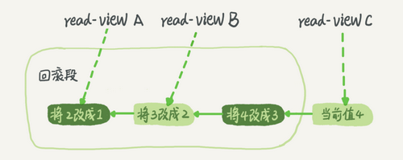
当前值是4，但是在查询这条记录的时候，不同时刻启动的事务会有不同的read-view。如图中看到的，在视图A、B、C里面，这一个记录的值分别是1、2、4，同一条记录在系统中可以存在多个版本，就是数据库的多版本并发控制（MVCC）。对于read-view A，要得到1，就必须将当前值依次执行图中所有的回滚操作得到。

同时你会发现，即使现在有另外一个事务正在将4改成5，这个事务跟read-view A、B、C对应的事务是不会冲突的。

你一定会问，回滚日志总不能一直保留吧，什么时候删除呢？答案是，在不需要的时候才删除。也就是说，系统会判断，当没有事务再需要用到这些回滚日志时，回滚日志会被删除。

什么时候才不需要了呢？就是当系统里没有比这个回滚日志更早的read-view的时候。

基于上面的说明，我们来讨论一下为什么建议你尽量不要使用长事务。

长事务意味着系统里面会存在很老的事务视图。由于这些事务随时可能访问数据库里面的任何数据，所以这个事务提交之前，数据库里面它可能用到的回滚记录都必须保留，这就会导致大量占用存储空间。

在MySQL 5.5及以前的版本，回滚日志是跟数据字典一起放在ibdata文件里的，即使长事务最终提交，回滚段被清理，文件也不会变小。我见过数据只有20GB，而回滚段有200GB的库。最终只好为了清理回滚段，重建整个库。

除了对回滚段的影响，长事务还占用锁资源，也可能拖垮整个库，这个我们会在后面讲锁的时候展开。

### 事务的启动方式

如前面所述，长事务有这些潜在风险，我当然是建议你尽量避免。其实很多时候业务开发同学并不是有意使用长事务，通常是由于误用所致。MySQL的事务启动方式有以下几种：

1. 显式启动事务语句， begin 或 start transaction。配套的提交语句是commit，回滚语句是rollback。
2. set autocommit=0，这个命令会将这个线程的自动提交关掉。意味着如果你只执行一个select语句，这个事务就启动了，而且并不会自动提交。这个事务持续存在直到你主动执行commit 或 rollback 语句，或者断开连接。

有些客户端连接框架会默认连接成功后先执行一个set autocommit=0的命令。这就导致接下来的查询都在事务中，如果是长连接，就导致了意外的长事务。

因此，我会建议你总是使用set autocommit=1, 通过显式语句的方式来启动事务。

但是有的开发同学会纠结“多一次交互”的问题。对于一个需要频繁使用事务的业务，第二种方式每个事务在开始时都不需要主动执行一次 “begin”，减少了语句的交互次数。如果你也有这个顾虑，我建议你使用commit work and chain语法。

在autocommit为1的情况下，用begin显式启动的事务，如果执行commit则提交事务。如果执行 commit work and chain，则是提交事务并自动启动下一个事务，这样也省去了再次执行begin语句的开销。同时带来的好处是从程序开发的角度明确地知道每个语句是否处于事务中。

你可以在information_schema库的innodb_trx这个表中查询长事务，比如下面这个语句，用于查找持续时间超过60s的事务。

```
select * from information_schema.innodb_trx where TIME_TO_SEC(timediff(now(),trx_started))>60
```

### 小结

这篇文章里面，我介绍了MySQL的事务隔离级别的现象和实现，根据实现原理分析了长事务存在的风险，以及如何用正确的方式避免长事务。希望我举的例子能够帮助你理解事务，并更好地使用MySQL的事务特性。

我给你留一个问题吧。你现在知道了系统里面应该避免长事务，如果你是业务开发负责人同时也是数据库负责人，你会有什么方案来避免出现或者处理这种情况呢？

你可以把你的思考和观点写在留言区里，我会在下一篇文章的末尾和你讨论这个问题。感谢你的收听，也欢迎你把这篇文章分享给更多的朋友一起阅读。

### 上期问题时间

在上期文章的最后，我给你留下的问题是一天一备跟一周一备的对比。

好处是“最长恢复时间”更短。

在一天一备的模式里，最坏情况下需要应用一天的binlog。比如，你每天0点做一次全量备份，而要恢复出一个到昨天晚上23点的备份。

一周一备最坏情况就要应用一周的binlog了。

系统的对应指标就是 @尼古拉斯·赵四 @慕塔 提到的RTO（恢复目标时间）。

当然这个是有成本的，因为更频繁全量备份需要消耗更多存储空间，所以这个RTO是成本换来的，就需要你根据业务重要性来评估了。

### 牛逼评论

> 1、务的特性：原子性、一致性、隔离性、持久性
> 2、多事务同时执行的时候，可能会出现的问题：脏读、不可重复读、幻读
> 3、事务隔离级别：读未提交、读提交、可重复读、串行化
> 4、不同事务隔离级别的区别：
> 读未提交：一个事务还未提交，它所做的变更就可以被别的事务看到
> 读提交：一个事务提交之后，它所做的变更才可以被别的事务看到
> 可重复读：一个事务执行过程中看到的数据是一致的。未提交的更改对其他事务是不可见的
> 串行化：对应一个记录会加读写锁，出现冲突的时候，后访问的事务必须等前一个事务执行完成才能继续执行
> 5、配置方法：启动参数transaction-isolation
> 6、事务隔离的实现：每条记录在更新的时候都会同时记录一条回滚操作。同一条记录在系统中可以存在多个版本，这就是数据库的多版本并发控制（MVCC）。
> 7、回滚日志什么时候删除？系统会判断当没有事务需要用到这些回滚日志的时候，回滚日志会被删除。
> 8、什么时候不需要了？当系统里么有比这个回滚日志更早的read-view的时候。
> 9、为什么尽量不要使用长事务。长事务意味着系统里面会存在很老的事务视图，在这个事务提交之前，回滚记录都要保留，这会导致大量占用存储空间。除此之外，长事务还占用锁资源，可能会拖垮库。
> 10、事务启动方式：一、显式启动事务语句，begin或者start transaction,提交commit，回滚rollback；二、set autocommit=0，该命令会把这个线程的自动提交关掉。这样只要执行一个select语句，事务就启动，并不会自动提交，直到主动执行commit或rollback或断开连接。
> 11、建议使用方法一，如果考虑多一次交互问题，可以使用commit work and chain语法。在autocommit=1的情况下用begin显式启动事务，如果执行commit则提交事务。如果执行commit work and chain则提交事务并自动启动下一个事务。
>
> 思考题：
>
> 在开发过程中，尽可能的减小事务范围，少用长事务，如果无法避免，保证逻辑日志空间足够用，并且支持动态日志空间增长。监控Innodb_trx表，发现长事务报警。
>
> 疑问：
>
> 关于第二节的思考题，读题干的意思，是在什么场景下，一天一备比一周一备更有优势。老师的答案只是给出了一天一备的优势，那么适用场景怎么理解呢？
>
> 2018-11-19 13:58
>
> 作者回复
>
> 总结得非常好👍🏿
>
> 第二讲问题，其实备份是强需求，至于多少合适，还是得平衡业务需求和存储成本

> 为该讲总结了几个问题, 大家复习的时候可以先尝试回答这些问题检查自己的掌握程度:
>
> 1.事务的概念是什么?
> 2.mysql的事务隔离级别读未提交, 读已提交, 可重复读, 串行各是什么意思?
> 3.读已提交, 可重复读是怎么通过视图构建实现的?
> 4.可重复读的使用场景举例? 对账的时候应该很有用?
> 5.事务隔离是怎么通过read-view(读视图)实现的?
> 6.并发版本控制(MCVV)的概念是什么, 是怎么实现的?
> 7.使用长事务的弊病? 为什么使用常事务可能拖垮整个库?
> 8.事务的启动方式有哪几种?
> 9.commit work and chain的语法是做什么用的?
> 10.怎么查询各个表中的长事务?
> 11.如何避免长事务的出现?

> 下面是我的自问自答，也是我的学习笔记，问下斌哥，这样理解准确吗？
> 在可重复读的隔离级别下，如何理解**当系统里没有比这个回滚日志更早的 read-view 的时候**，这个回滚日志就会被删除？
>
> 这也是**尽量不要使用长事务**的主要原因。
>
> 比如，在某个时刻（今天上午9:00）开启了一个事务A（对于可重复读隔离级别，此时一个视图read-view A也创建了），这是一个很长的事务……
>
> 事务A在今天上午9:20的时候，查询了一个记录R1的一个字段f1的值为1……
>
> 今天上午9:25的时候，一个事务B（随之而来的read-view B）也被开启了，它更新了R1.f1的值为2（同时也创建了一个由2到1的回滚日志），这是一个短事务，事务随后就被commit了。
>
> 今天上午9:30的时候，一个事务C（随之而来的read-view C）也被开启了，它更新了R1.f1的值为3（同时也创建了一个由3到2的回滚日志），这是一个短事务，事务随后就被commit了。
>
> ……
>
> 到了下午3:00了，长事务A还没有commit，为了保证事务在执行期间看到的数据在前后必须是一致的，那些老的事务视图、回滚日志就必须存在了，这就占用了大量的存储空间。
>
> 源于此，我们应该尽量不要使用长事务。

## 深入浅出索引(上)

提到数据库索引，我想你并不陌生，在日常工作中会经常接触到。比如某一个SQL查询比较慢，分析完原因之后，你可能就会说“给某个字段加个索引吧”之类的解决方案。但到底什么是索引，索引又是如何工作的呢？今天就让我们一起来聊聊这个话题吧。

数据库索引的内容比较多，我分成了上下两篇文章。索引是数据库系统里面最重要的概念之一，所以我希望你能够耐心看完。在后面的实战文章中，我也会经常引用这两篇文章中提到的知识点，加深你对数据库索引的理解。

一句话简单来说，索引的出现其实就是为了提高数据查询的效率，就像书的目录一样。一本500页的书，如果你想快速找到其中的某一个知识点，在不借助目录的情况下，那我估计你可得找一会儿。同样，对于数据库的表而言，索引其实就是它的“目录”。

### 索引的常见模型

索引的出现是为了提高查询效率，但是实现索引的方式却有很多种，所以这里也就引入了索引模型的概念。可以用于提高读写效率的数据结构很多，这里我先给你介绍三种常见、也比较简单的数据结构，它们分别是哈希表、有序数组和搜索树。

下面我主要从使用的角度，为你简单分析一下这三种模型的区别。

哈希表是一种以键-值（key-value）存储数据的结构，我们只要输入待查找的值即key，就可以找到其对应的值即Value。哈希的思路很简单，把值放在数组里，用一个哈希函数把key换算成一个确定的位置，然后把value放在数组的这个位置。

不可避免地，多个key值经过哈希函数的换算，会出现同一个值的情况。处理这种情况的一种方法是，拉出一个链表。

假设，你现在维护着一个身份证信息和姓名的表，需要根据身份证号查找对应的名字，这时对应的哈希索引的示意图如下所示：

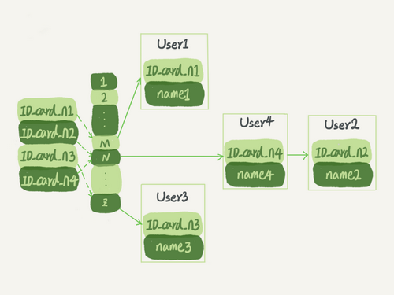

图1 哈希表示意图

图中，User2和User4根据身份证号算出来的值都是N，但没关系，后面还跟了一个链表。假设，这时候你要查ID_card_n2对应的名字是什么，处理步骤就是：首先，将ID_card_n2通过哈希函数算出N；然后，按顺序遍历，找到User2。

需要注意的是，图中四个ID_card_n的值并不是递增的，这样做的好处是增加新的User时速度会很快，只需要往后追加。但缺点是，因为不是有序的，所以哈希索引做区间查询的速度是很慢的。

你可以设想下，如果你现在要找身份证号在[ID_card_X, ID_card_Y]这个区间的所有用户，就必须全部扫描一遍了。

所以，**哈希表这种结构适用于只有等值查询的场景**，比如Memcached及其他一些NoSQL引擎。

而**有序数组在等值查询和范围查询场景中的性能就都非常优秀**。还是上面这个根据身份证号查名字的例子，如果我们使用有序数组来实现的话，示意图如下所示：

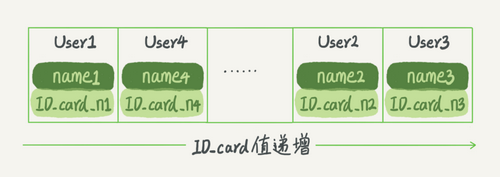

图2 有序数组示意图

这里我们假设身份证号没有重复，这个数组就是按照身份证号递增的顺序保存的。这时候如果你要查ID_card_n2对应的名字，用二分法就可以快速得到，这个时间复杂度是O(log(N))。

同时很显然，这个索引结构支持范围查询。你要查身份证号在[ID_card_X, ID_card_Y]区间的User，可以先用二分法找到ID_card_X（如果不存在ID_card_X，就找到大于ID_card_X的第一个User），然后向右遍历，直到查到第一个大于ID_card_Y的身份证号，退出循环。

如果仅仅看查询效率，有序数组就是最好的数据结构了。但是，在需要更新数据的时候就麻烦了，你往中间插入一个记录就必须得挪动后面所有的记录，成本太高。

所以，**有序数组索引只适用于静态存储引擎**，比如你要保存的是2017年某个城市的所有人口信息，这类不会再修改的数据。

二叉搜索树也是课本里的经典数据结构了。还是上面根据身份证号查名字的例子，如果我们用二叉搜索树来实现的话，示意图如下所示：

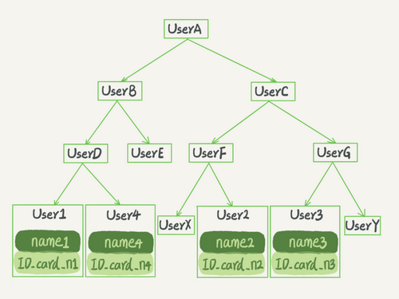

图3 二叉搜索树示意图

二叉搜索树的特点是：每个节点的左儿子小于父节点，父节点又小于右儿子。这样如果你要查ID_card_n2的话，按照图中的搜索顺序就是按照UserA -> UserC -> UserF -> User2这个路径得到。这个时间复杂度是O(log(N))。

当然为了维持O(log(N))的查询复杂度，你就需要保持这棵树是平衡二叉树。为了做这个保证，更新的时间复杂度也是O(log(N))。

树可以有二叉，也可以有多叉。多叉树就是每个节点有多个儿子，儿子之间的大小保证从左到右递增。二叉树是搜索效率最高的，但是实际上大多数的数据库存储却并不使用二叉树。其原因是，索引不止存在内存中，还要写到磁盘上。

你可以想象一下一棵100万节点的平衡二叉树，树高20。一次查询可能需要访问20个数据块。在机械硬盘时代，从磁盘随机读一个数据块需要10 ms左右的寻址时间。也就是说，对于一个100万行的表，如果使用二叉树来存储，单独访问一个行可能需要20个10 ms的时间，这个查询可真够慢的。

为了让一个查询尽量少地读磁盘，就必须让查询过程访问尽量少的数据块。那么，我们就不应该使用二叉树，而是要使用“N叉”树。这里，“N叉”树中的“N”取决于数据块的大小。

以InnoDB的一个整数字段索引为例，这个N差不多是1200。这棵树高是4的时候，就可以存1200的3次方个值，这已经17亿了。考虑到树根的数据块总是在内存中的，一个10亿行的表上一个整数字段的索引，查找一个值最多只需要访问3次磁盘。其实，树的第二层也有很大概率在内存中，那么访问磁盘的平均次数就更少了。

N叉树由于在读写上的性能优点，以及适配磁盘的访问模式，已经被广泛应用在数据库引擎中了。

不管是哈希还是有序数组，或者N叉树，它们都是不断迭代、不断优化的产物或者解决方案。数据库技术发展到今天，跳表、LSM树等数据结构也被用于引擎设计中，这里我就不再一一展开了。

你心里要有个概念，数据库底层存储的核心就是基于这些数据模型的。每碰到一个新数据库，我们需要先关注它的数据模型，这样才能从理论上分析出这个数据库的适用场景。

截止到这里，我用了半篇文章的篇幅和你介绍了不同的数据结构，以及它们的适用场景，你可能会觉得有些枯燥。但是，我建议你还是要多花一些时间来理解这部分内容，毕竟这是数据库处理数据的核心概念之一，在分析问题的时候会经常用到。当你理解了索引的模型后，就会发现在分析问题的时候会有一个更清晰的视角，体会到引擎设计的精妙之处。

现在，我们一起进入相对偏实战的内容吧。

在MySQL中，索引是在存储引擎层实现的，所以并没有统一的索引标准，即不同存储引擎的索引的工作方式并不一样。而即使多个存储引擎支持同一种类型的索引，其底层的实现也可能不同。由于InnoDB存储引擎在MySQL数据库中使用最为广泛，所以下面我就以InnoDB为例，和你分析一下其中的索引模型。

### InnoDB 的索引模型

在InnoDB中，表都是根据主键顺序以索引的形式存放的，这种存储方式的表称为索引组织表。又因为前面我们提到的，InnoDB使用了B+树索引模型，所以数据都是存储在B+树中的。

每一个索引在InnoDB里面对应一棵B+树。

假设，我们有一个主键列为ID的表，表中有字段k，并且在k上有索引。

这个表的建表语句是：

```
mysql> create table T(
id int primary key, 
k int not null, 
name varchar(16),
index (k))engine=InnoDB;
```

表中R1~R5的(ID,k)值分别为(100,1)、(200,2)、(300,3)、(500,5)和(600,6)，两棵树的示例示意图如下。

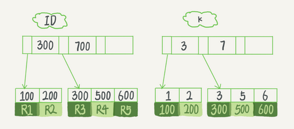

图4 InnoDB的索引组织结构

从图中不难看出，根据叶子节点的内容，索引类型分为主键索引和非主键索引。

主键索引的叶子节点存的是整行数据。在InnoDB里，主键索引也被称为聚簇索引（clustered index）。

非主键索引的叶子节点内容是主键的值。在InnoDB里，非主键索引也被称为二级索引（secondary index）。

根据上面的索引结构说明，我们来讨论一个问题：**基于主键索引和普通索引的查询有什么区别？**

- 如果语句是select * from T where ID=500，即主键查询方式，则只需要搜索ID这棵B+树；
- 如果语句是select * from T where k=5，即普通索引查询方式，则需要先搜索k索引树，得到ID的值为500，再到ID索引树搜索一次。这个过程称为回表。

也就是说，基于非主键索引的查询需要多扫描一棵索引树。因此，我们在应用中应该尽量使用主键查询。

### 索引维护

B+树为了维护索引有序性，在插入新值的时候需要做必要的维护。以上面这个图为例，如果插入新的行ID值为700，则只需要在R5的记录后面插入一个新记录。如果新插入的ID值为400，就相对麻烦了，需要逻辑上挪动后面的数据，空出位置。

而更糟的情况是，如果R5所在的数据页已经满了，根据B+树的算法，这时候需要申请一个新的数据页，然后挪动部分数据过去。这个过程称为页分裂。在这种情况下，性能自然会受影响。

除了性能外，页分裂操作还影响数据页的利用率。原本放在一个页的数据，现在分到两个页中，整体空间利用率降低大约50%。

当然有分裂就有合并。当相邻两个页由于删除了数据，利用率很低之后，会将数据页做合并。合并的过程，可以认为是分裂过程的逆过程。

基于上面的索引维护过程说明，我们来讨论一个案例：

> 你可能在一些建表规范里面见到过类似的描述，要求建表语句里一定要有自增主键。当然事无绝对，我们来分析一下哪些场景下应该使用自增主键，而哪些场景下不应该。

自增主键是指自增列上定义的主键，在建表语句中一般是这么定义的： NOT NULL PRIMARY KEY AUTO_INCREMENT。

插入新记录的时候可以不指定ID的值，系统会获取当前ID最大值加1作为下一条记录的ID值。

也就是说，自增主键的插入数据模式，正符合了我们前面提到的递增插入的场景。每次插入一条新记录，都是追加操作，都不涉及到挪动其他记录，也不会触发叶子节点的分裂。

而有业务逻辑的字段做主键，则往往不容易保证有序插入，这样写数据成本相对较高。

除了考虑性能外，我们还可以从存储空间的角度来看。假设你的表中确实有一个唯一字段，比如字符串类型的身份证号，那应该用身份证号做主键，还是用自增字段做主键呢？

由于每个非主键索引的叶子节点上都是主键的值。如果用身份证号做主键，那么每个二级索引的叶子节点占用约20个字节，而如果用整型做主键，则只要4个字节，如果是长整型（bigint）则是8个字节。

**显然，主键长度越小，普通索引的叶子节点就越小，普通索引占用的空间也就越小。**

所以，从性能和存储空间方面考量，自增主键往往是更合理的选择。

有没有什么场景适合用业务字段直接做主键的呢？还是有的。比如，有些业务的场景需求是这样的：

1. 只有一个索引；
2. 该索引必须是唯一索引。

你一定看出来了，这就是典型的KV场景。

由于没有其他索引，所以也就不用考虑其他索引的叶子节点大小的问题。

这时候我们就要优先考虑上一段提到的“尽量使用主键查询”原则，直接将这个索引设置为主键，可以避免每次查询需要搜索两棵树。

### 小结

今天，我跟你分析了数据库引擎可用的数据结构，介绍了InnoDB采用的B+树结构，以及为什么InnoDB要这么选择。B+树能够很好地配合磁盘的读写特性，减少单次查询的磁盘访问次数。

由于InnoDB是索引组织表，一般情况下我会建议你创建一个自增主键，这样非主键索引占用的空间最小。但事无绝对，我也跟你讨论了使用业务逻辑字段做主键的应用场景。

最后，我给你留下一个问题吧。对于上面例子中的InnoDB表T，如果你要重建索引 k，你的两个SQL语句可以这么写：

```
alter table T drop index k;
alter table T add index(k);
```

如果你要重建主键索引，也可以这么写：

```
alter table T drop primary key;
alter table T add primary key(id);
```

我的问题是，对于上面这两个重建索引的作法，说出你的理解。如果有不合适的，为什么，更好的方法是什么？

你可以把你的思考和观点写在留言区里，我会在下一篇文章的末尾给出我的参考答案。感谢你的收听，也欢迎你把这篇文章分享给更多的朋友一起阅读。

### 上期问题时间

我在上一篇文章末尾给你留下的问题是：如何避免长事务对业务的影响？

这个问题，我们可以从应用开发端和数据库端来看。

**首先，从应用开发端来看：**

1. 确认是否使用了set autocommit=0。这个确认工作可以在测试环境中开展，把MySQL的general_log开起来，然后随便跑一个业务逻辑，通过general_log的日志来确认。一般框架如果会设置这个值，也就会提供参数来控制行为，你的目标就是把它改成1。
2. 确认是否有不必要的只读事务。有些框架会习惯不管什么语句先用begin/commit框起来。我见过有些是业务并没有这个需要，但是也把好几个select语句放到了事务中。这种只读事务可以去掉。
3. 业务连接数据库的时候，根据业务本身的预估，通过SET MAX_EXECUTION_TIME命令，来控制每个语句执行的最长时间，避免单个语句意外执行太长时间。（为什么会意外？在后续的文章中会提到这类案例）

**其次，从数据库端来看：**

1. 监控 information_schema.Innodb_trx表，设置长事务阈值，超过就报警/或者kill；
2. Percona的pt-kill这个工具不错，推荐使用；
3. 在业务功能测试阶段要求输出所有的general_log，分析日志行为提前发现问题；
4. 如果使用的是MySQL 5.6或者更新版本，把innodb_undo_tablespaces设置成2（或更大的值）。如果真的出现大事务导致回滚段过大，这样设置后清理起来更方便。

### 牛逼评论

> 【今日收获】
>
> 1. 主键索引的叶子结点存储了整一行的内容（聚簇索引），使用主键可以快速获取到整行的数据。
> 2. 非主键索引的叶子结点存储的是主键的值，所以主键字段占用空间不宜过大。同时，其查找数据的过程称为“回表”，需要先查找自己得到主键值，再在主键索引上边查找数据内容。
> 3. 索引的实现由存储引擎来决定，InnoDB使用B+树（N叉树，比如1200叉树），把整颗树的高度维持在很小的范围内，同时在内存里缓存前面若干层的节点，可以极大地降低访问磁盘的次数，提高读的效率。
> 4. B+树的插入可能会引起数据页的分裂，删除可能会引起数据页的合并，二者都是比较重的IO消耗，所以比较好的方式是顺序插入数据，这也是我们一般使用自增主键的原因之一。
> 5. 在Key-Value的场景下，只有一个索引且是唯一索引，则适合直接使用业务字段作为主键索引。

> 1、如果插入的数据是在主键树叶子结点的中间，后面的所有页如果都是满的状态，是不是会造成后面的每一页都会去进行页分裂操作，直到最后一个页申请新页移过去最后一个值
> 2、还有之前看到过说是插入数据如果是在某个数据满了页的首尾，为了减少数据移动和页分裂，会先去前后两个页看看是否满了，如果没满会先将数据放到前后两个页上，不知道是不是有这种情况
>
> 2018-11-21 11:13
>
> 作者回复
>
> 1. 不会不会，只会分裂它要写入的那个页面。每个页面之间是用指针串的，改指针就好了，不需要“后面的全部挪动
>
> 2. 对，减为了增加空间利用率

> 总结：
> 1.索引的作用：提高数据查询效率
> 2.常见索引模型：哈希表、有序数组、搜索树
> 3.哈希表：键 - 值(key - value)。
> 4.哈希思路：把值放在数组里，用一个哈希函数把key换算成一个确定的位置，然后把value放在数组的这个位置
> 5.哈希冲突的处理办法：链表
> 6.哈希表适用场景：只有等值查询的场景
> 7.有序数组：按顺序存储。查询用二分法就可以快速查询，时间复杂度是：O(log(N))
> 8.有序数组查询效率高，更新效率低
> 9.有序数组的适用场景：静态存储引擎。
> 10.二叉搜索树：每个节点的左儿子小于父节点，父节点又小于右儿子
> 11.二叉搜索树：查询时间复杂度O(log(N))，更新时间复杂度O(log(N))
> 12.数据库存储大多不适用二叉树，因为树高过高，会适用N叉树
> 13.InnoDB中的索引模型：B+Tree
> 14.索引类型：主键索引、非主键索引，主键索引的叶子节点存的是整行的数据(聚簇索引)，非主键索引的叶子节点内容是主键的值(二级索引)
> 15.主键索引和普通索引的区别：主键索引只要搜索ID这个B+Tree即可拿到数据。普通索引先搜索索引拿到主键值，再到主键索引树搜索一次(回表)
> 16.一个数据页满了，按照B+Tree算法，新增加一个数据页，叫做页分裂，会导致性能下降。空间利用率降低大概50%。当相邻的两个数据页利用率很低的时候会做数据页合并，合并的过程是分裂过程的逆过程。
> 17.从性能和存储空间方面考量，自增主键往往是更合理的选择。
>
> 思考题：
> 如果删除，新建主键索引，会同时去修改普通索引对应的主键索引，性能消耗比较大。
> 删除重建普通索引貌似影响不大，不过要注意在业务低谷期操作，避免影响业务。

## 深入浅出索引(下)

在上一篇文章中，我和你介绍了InnoDB索引的数据结构模型，今天我们再继续聊聊跟MySQL索引有关的概念。

在开始这篇文章之前，我们先来看一下这个问题：

在下面这个表T中，如果我执行 select * from T where k between 3 and 5，需要执行几次树的搜索操作，会扫描多少行？

下面是这个表的初始化语句。

```
mysql> create table T (
ID int primary key,
k int NOT NULL DEFAULT 0, 
s varchar(16) NOT NULL DEFAULT '',
index k(k))
engine=InnoDB;

insert into T values(100,1, 'aa'),(200,2,'bb'),(300,3,'cc'),(500,5,'ee'),(600,6,'ff'),(700,7,'gg');
```


图1 InnoDB的索引组织结构

现在，我们一起来看看这条SQL查询语句的执行流程：

1. 在k索引树上找到k=3的记录，取得 ID = 300；
2. 再到ID索引树查到ID=300对应的R3；
3. 在k索引树取下一个值k=5，取得ID=500；
4. 再回到ID索引树查到ID=500对应的R4；
5. 在k索引树取下一个值k=6，不满足条件，循环结束。

在这个过程中，**回到主键索引树搜索的过程，我们称为回表**。可以看到，这个查询过程读了k索引树的3条记录（步骤1、3和5），回表了两次（步骤2和4）。

在这个例子中，由于查询结果所需要的数据只在主键索引上有，所以不得不回表。那么，有没有可能经过索引优化，避免回表过程呢？

### 覆盖索引

如果执行的语句是select ID from T where k between 3 and 5，这时只需要查ID的值，而ID的值已经在k索引树上了，因此可以直接提供查询结果，不需要回表。也就是说，在这个查询里面，索引k已经“覆盖了”我们的查询需求，我们称为覆盖索引。

**由于覆盖索引可以减少树的搜索次数，显著提升查询性能，所以使用覆盖索引是一个常用的性能优化手段。**

需要注意的是，在引擎内部使用覆盖索引在索引k上其实读了三个记录，R3~R5（对应的索引k上的记录项），但是对于MySQL的Server层来说，它就是找引擎拿到了两条记录，因此MySQL认为扫描行数是2。

> 备注：关于如何查看扫描行数的问题，我将会在第16文章《如何正确地显示随机消息？》中，和你详细讨论。

基于上面覆盖索引的说明，我们来讨论一个问题：**在一个市民信息表上，是否有必要将身份证号和名字建立联合索引？**

假设这个市民表的定义是这样的：

```mysql
CREATE TABLE `tuser` (
  `id` int(11) NOT NULL,
  `id_card` varchar(32) DEFAULT NULL,
  `name` varchar(32) DEFAULT NULL,
  `age` int(11) DEFAULT NULL,
  `ismale` tinyint(1) DEFAULT NULL,
  PRIMARY KEY (`id`),
  KEY `id_card` (`id_card`),
  KEY `name_age` (`name`,`age`)
) ENGINE=InnoDB
```

我们知道，身份证号是市民的唯一标识。也就是说，如果有根据身份证号查询市民信息的需求，我们只要在身份证号字段上建立索引就够了。而再建立一个（身份证号、姓名）的联合索引，是不是浪费空间？

如果现在有一个高频请求，要根据市民的身份证号查询他的姓名，这个联合索引就有意义了。它可以在这个高频请求上用到覆盖索引，不再需要回表查整行记录，减少语句的执行时间。

当然，索引字段的维护总是有代价的。因此，在建立冗余索引来支持覆盖索引时就需要权衡考虑了。这正是业务DBA，或者称为业务数据架构师的工作。

### 最左前缀原则

看到这里你一定有一个疑问，如果为每一种查询都设计一个索引，索引是不是太多了。如果我现在要按照市民的身份证号去查他的家庭地址呢？虽然这个查询需求在业务中出现的概率不高，但总不能让它走全表扫描吧？反过来说，单独为一个不频繁的请求创建一个（身份证号，地址）的索引又感觉有点浪费。应该怎么做呢？

这里，我先和你说结论吧。**B+树这种索引结构，可以利用索引的“最左前缀”，来定位记录。**

为了直观地说明这个概念，我们用（name，age）这个联合索引来分析。

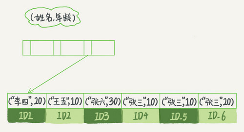

图2 （name，age）索引示意图

可以看到，索引项是按照索引定义里面出现的字段顺序排序的。

当你的逻辑需求是查到所有名字是“张三”的人时，可以快速定位到ID4，然后向后遍历得到所有需要的结果。

如果你要查的是所有名字第一个字是“张”的人，你的SQL语句的条件是"where name like ‘张%’"。这时，你也能够用上这个索引，查找到第一个符合条件的记录是ID3，然后向后遍历，直到不满足条件为止。

可以看到，不只是索引的全部定义，只要满足最左前缀，就可以利用索引来加速检索。这个最左前缀可以是联合索引的最左N个字段，也可以是字符串索引的最左M个字符。

基于上面对最左前缀索引的说明，我们来讨论一个问题：**在建立联合索引的时候，如何安排索引内的字段顺序。**

这里我们的评估标准是，索引的复用能力。因为可以支持最左前缀，所以当已经有了(a,b)这个联合索引后，一般就不需要单独在a上建立索引了。因此，**第一原则是，如果通过调整顺序，可以少维护一个索引，那么这个顺序往往就是需要优先考虑采用的。**

所以现在你知道了，这段开头的问题里，我们要为高频请求创建(身份证号，姓名）这个联合索引，并用这个索引支持“根据身份证号查询地址”的需求。

那么，如果既有联合查询，又有基于a、b各自的查询呢？查询条件里面只有b的语句，是无法使用(a,b)这个联合索引的，这时候你不得不维护另外一个索引，也就是说你需要同时维护(a,b)、(b) 这两个索引。

这时候，我们要**考虑的原则就是空间**了。比如上面这个市民表的情况，name字段是比age字段大的 ，那我就建议你创建一个（name,age)的联合索引和一个(age)的单字段索引。

### 索引下推

上一段我们说到满足最左前缀原则的时候，最左前缀可以用于在索引中定位记录。这时，你可能要问，那些不符合最左前缀的部分，会怎么样呢？

我们还是以市民表的联合索引（name, age）为例。如果现在有一个需求：检索出表中“名字第一个字是张，而且年龄是10岁的所有男孩”。那么，SQL语句是这么写的：

```
mysql> select * from tuser where name like '张%' and age=10 and ismale=1;
```

你已经知道了前缀索引规则，所以这个语句在搜索索引树的时候，只能用 “张”，找到第一个满足条件的记录ID3。当然，这还不错，总比全表扫描要好。

然后呢？

当然是判断其他条件是否满足。

在MySQL 5.6之前，只能从ID3开始一个个回表。到主键索引上找出数据行，再对比字段值。

而MySQL 5.6 引入的索引下推优化（index condition pushdown)， 可以在索引遍历过程中，对索引中包含的字段先做判断，直接过滤掉不满足条件的记录，减少回表次数。

图3和图4，是这两个过程的执行流程图。

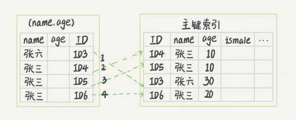

图3 无索引下推执行流程

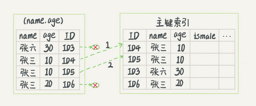

图4 索引下推执行流程

在图3和4这两个图里面，每一个虚线箭头表示回表一次。

图3中，在(name,age)索引里面我特意去掉了age的值，这个过程InnoDB并不会去看age的值，只是按顺序把“name第一个字是’张’”的记录一条条取出来回表。因此，需要回表4次。

图4跟图3的区别是，InnoDB在(name,age)索引内部就判断了age是否等于10，对于不等于10的记录，直接判断并跳过。在我们的这个例子中，只需要对ID4、ID5这两条记录回表取数据判断，就只需要回表2次。

### 小结

今天这篇文章，我和你继续讨论了数据库索引的概念，包括了覆盖索引、前缀索引、索引下推。你可以看到，在满足语句需求的情况下， 尽量少地访问资源是数据库设计的重要原则之一。我们在使用数据库的时候，尤其是在设计表结构时，也要以减少资源消耗作为目标。

接下来我给你留下一个问题吧。

实际上主键索引也是可以使用多个字段的。DBA小吕在入职新公司的时候，就发现自己接手维护的库里面，有这么一个表，表结构定义类似这样的：

```
CREATE TABLE `geek` (
  `a` int(11) NOT NULL,
  `b` int(11) NOT NULL,
  `c` int(11) NOT NULL,
  `d` int(11) NOT NULL,
  PRIMARY KEY (`a`,`b`),
  KEY `c` (`c`),
  KEY `ca` (`c`,`a`),
  KEY `cb` (`c`,`b`)
) ENGINE=InnoDB;
```

公司的同事告诉他说，由于历史原因，这个表需要a、b做联合主键，这个小吕理解了。

但是，学过本章内容的小吕又纳闷了，既然主键包含了a、b这两个字段，那意味着单独在字段c上创建一个索引，就已经包含了三个字段了呀，为什么要创建“ca”“cb”这两个索引？

同事告诉他，是因为他们的业务里面有这样的两种语句：

```
select * from geek where c=N order by a limit 1;
select * from geek where c=N order by b limit 1;
```

我给你的问题是，这位同事的解释对吗，为了这两个查询模式，这两个索引是否都是必须的？为什么呢？

你可以把你的思考和观点写在留言区里，我会在下一篇文章的末尾和你讨论这个问题。感谢你的收听，也欢迎你把这篇文章分享给更多的朋友一起阅读。

### 上期问题时间

上期的问题是，通过两个alter 语句重建索引k，以及通过两个alter语句重建主键索引是否合理。

在评论区，有同学问到为什么要重建索引。我们文章里面有提到，索引可能因为删除，或者页分裂等原因，导致数据页有空洞，重建索引的过程会创建一个新的索引，把数据按顺序插入，这样页面的利用率最高，也就是索引更紧凑、更省空间。

这道题目，我给你的“参考答案”是：

重建索引k的做法是合理的，可以达到省空间的目的。但是，重建主键的过程不合理。不论是删除主键还是创建主键，都会将整个表重建。所以连着执行这两个语句的话，第一个语句就白做了。这两个语句，你可以用这个语句代替 ： alter table T engine=InnoDB。在专栏的第12篇文章《为什么表数据删掉一半，表文件大小不变？》中，我会和你分析这条语句的执行流程。

### 牛逼评论

> 疑问：
> 1. 有些资料提到，在不影响排序结果的情况下，在取出主键后，回表之前，会在对所有获取到的主键排序，请问是否存在这种情况？
> 2. 索引下推那个例子，感觉5.6之前的机制很匪夷所思：感觉判断'张%'之后再“看age的值”是顺理成章的事。难道联合索引的底层实现结构在这期间发生了变化？
>
> 2018-11-23 09:01
>
> 作者回复
>
> 1. 有的， Multi-Range Read (MRR) 由于不论是否使用这个策略，SQL语句写法不变，就没有在正文中提
>
> 2. 不是，是接口能力发生了变化，以前只能传“搜索关键字” 。
>
> 如果你用过5.1 甚至5.0， 在从现在的观点看，你会发现很多“匪夷所思”。还有：并行复制官方5.6才引入、MDL 5.5 才有、Innodb 自增主键持久化、多源复制、online DDL ...
>
> 只能说，持续进化，幸甚至哉😄

## 全局锁和表锁：加个字段有这么多阻碍

今天我要跟你聊聊MySQL的锁。数据库锁设计的初衷是处理并发问题。作为多用户共享的资源，当出现并发访问的时候，数据库需要合理地控制资源的访问规则。而锁就是用来实现这些访问规则的重要数据结构。

**根据加锁的范围，MySQL里面的锁大致可以分成全局锁、表级锁和行锁三类**。今天这篇文章，我会和你分享全局锁和表级锁。而关于行锁的内容，我会留着在下一篇文章中再和你详细介绍。

这里需要说明的是，锁的设计比较复杂，这两篇文章不会涉及锁的具体实现细节，主要介绍的是碰到锁时的现象和其背后的原理。

### 全局锁

顾名思义，全局锁就是对整个数据库实例加锁。MySQL提供了一个加全局读锁的方法，命令是 `Flush tables with read lock` (FTWRL)。当你需要让整个库处于只读状态的时候，可以使用这个命令，之后其他线程的以下语句会被阻塞：数据更新语句（数据的增删改）、数据定义语句（包括建表、修改表结构等）和更新类事务的提交语句。

**全局锁的典型使用场景是，做全库逻辑备份。**也就是把整库每个表都select出来存成文本。

以前有一种做法，是通过FTWRL确保不会有其他线程对数据库做更新，然后对整个库做备份。注意，在备份过程中整个库完全处于只读状态。

但是让整库都只读，听上去就很危险：

- 如果你在主库上备份，那么在备份期间都不能执行更新，业务基本上就得停摆；
- 如果你在从库上备份，那么备份期间从库不能执行主库同步过来的binlog，会导致主从延迟。

看来加全局锁不太好。但是细想一下，备份为什么要加锁呢？我们来看一下不加锁会有什么问题。

假设你现在要维护“极客时间”的购买系统，关注的是用户账户余额表和用户课程表。

现在发起一个逻辑备份。假设备份期间，有一个用户，他购买了一门课程，业务逻辑里就要扣掉他的余额，然后往已购课程里面加上一门课。

如果时间顺序上是先备份账户余额表(u_account)，然后用户购买，然后备份用户课程表(u_course)，会怎么样呢？你可以看一下这个图：

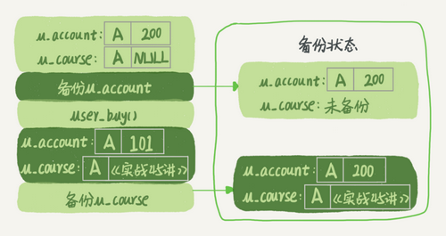

图1 业务和备份状态图

可以看到，这个备份结果里，用户A的数据状态是“账户余额没扣，但是用户课程表里面已经多了一门课”。如果后面用这个备份来恢复数据的话，用户A就发现，自己赚了。

作为用户可别觉得这样可真好啊，你可以试想一下：如果备份表的顺序反过来，先备份用户课程表再备份账户余额表，又可能会出现什么结果？

也就是说，不加锁的话，备份系统备份的得到的库不是一个逻辑时间点，这个视图是逻辑不一致的。

说到视图你肯定想起来了，我们在前面讲事务隔离的时候，其实是有一个方法能够拿到一致性视图的，对吧？

是的，就是在可重复读隔离级别下开启一个事务。

> 备注：如果你对事务隔离级别的概念不是很清晰的话，可以再回顾一下第3篇文章[《事务隔离：为什么你改了我还看不见？》](https://time.geekbang.org/column/article/68963)中的相关内容。

官方自带的逻辑备份工具是mysqldump。当mysqldump使用参数–single-transaction的时候，导数据之前就会启动一个事务，来确保拿到一致性视图。而由于MVCC的支持，这个过程中数据是可以正常更新的。

你一定在疑惑，有了这个功能，为什么还需要FTWRL呢？**一致性读是好，但前提是引擎要支持这个隔离级别。**比如，对于MyISAM这种不支持事务的引擎，如果备份过程中有更新，总是只能取到最新的数据，那么就破坏了备份的一致性。这时，我们就需要使用FTWRL命令了。

所以，**single-transaction方法只适用于所有的表使用事务引擎的库。**如果有的表使用了不支持事务的引擎，那么备份就只能通过FTWRL方法。这往往是DBA要求业务开发人员使用InnoDB替代MyISAM的原因之一。

你也许会问，**既然要全库只读，为什么不使用set global readonly=true的方式呢**？确实readonly方式也可以让全库进入只读状态，但我还是会建议你用FTWRL方式，主要有两个原因：

- 一是，在有些系统中，readonly的值会被用来做其他逻辑，比如用来判断一个库是主库还是备库。因此，修改global变量的方式影响面更大，我不建议你使用。
- 二是，在异常处理机制上有差异。如果执行FTWRL命令之后由于客户端发生异常断开，那么MySQL会自动释放这个全局锁，整个库回到可以正常更新的状态。而将整个库设置为readonly之后，如果客户端发生异常，则数据库就会一直保持readonly状态，这样会导致整个库长时间处于不可写状态，风险较高。

业务的更新不只是增删改数据（DML)，还有可能是加字段等修改表结构的操作（DDL）。不论是哪种方法，一个库被全局锁上以后，你要对里面任何一个表做加字段操作，都是会被锁住的。

但是，即使没有被全局锁住，加字段也不是就能一帆风顺的，因为你还会碰到接下来我们要介绍的表级锁。

### 表级锁

MySQL里面表级别的锁有两种：一种是表锁，一种是元数据锁（meta data lock，MDL)。

**表锁的语法是 lock tables … read/write。**与FTWRL类似，可以用unlock tables主动释放锁，也可以在客户端断开的时候自动释放。需要注意，lock tables语法除了会限制别的线程的读写外，也限定了本线程接下来的操作对象。

举个例子, 如果在某个线程A中执行lock tables t1 read, t2 write; 这个语句，则其他线程写t1、读写t2的语句都会被阻塞。同时，线程A在执行unlock tables之前，也只能执行读t1、读写t2的操作。连写t1都不允许，自然也不能访问其他表。

在还没有出现更细粒度的锁的时候，表锁是最常用的处理并发的方式。而对于InnoDB这种支持行锁的引擎，一般不使用lock tables命令来控制并发，毕竟锁住整个表的影响面还是太大。

**另一类表级的锁是MDL（metadata lock)。**MDL不需要显式使用，在访问一个表的时候会被自动加上。MDL的作用是，保证读写的正确性。你可以想象一下，如果一个查询正在遍历一个表中的数据，而执行期间另一个线程对这个表结构做变更，删了一列，那么查询线程拿到的结果跟表结构对不上，肯定是不行的。

因此，在MySQL 5.5版本中引入了MDL，当对一个表做增删改查操作的时候，加MDL读锁；当要对表做结构变更操作的时候，加MDL写锁。

- 读锁之间不互斥，因此你可以有多个线程同时对一张表增删改查。
- 读写锁之间、写锁之间是互斥的，用来保证变更表结构操作的安全性。因此，如果有两个线程要同时给一个表加字段，其中一个要等另一个执行完才能开始执行。

虽然MDL锁是系统默认会加的，但却是你不能忽略的一个机制。比如下面这个例子，我经常看到有人掉到这个坑里：给一个小表加个字段，导致整个库挂了。

你肯定知道，给一个表加字段，或者修改字段，或者加索引，需要扫描全表的数据。在对大表操作的时候，你肯定会特别小心，以免对线上服务造成影响。而实际上，即使是小表，操作不慎也会出问题。我们来看一下下面的操作序列，假设表t是一个小表。

> 备注：这里的实验环境是MySQL 5.6。

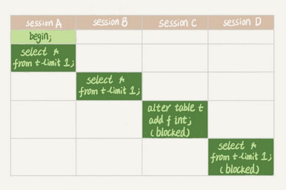

我们可以看到session A先启动，这时候会对表t加一个MDL读锁。由于session B需要的也是MDL读锁，因此可以正常执行。

之后session C会被blocked，是因为session A的MDL读锁还没有释放，而session C需要MDL写锁，因此只能被阻塞。

如果只有session C自己被阻塞还没什么关系，但是之后所有要在表t上新申请MDL读锁的请求也会被session C阻塞。前面我们说了，所有对表的增删改查操作都需要先申请MDL读锁，就都被锁住，等于这个表现在完全不可读写了。

如果某个表上的查询语句频繁，而且客户端有重试机制，也就是说超时后会再起一个新session再请求的话，这个库的线程很快就会爆满。

你现在应该知道了，事务中的MDL锁，在语句执行开始时申请，但是语句结束后并不会马上释放，而会等到整个事务提交后再释放。

基于上面的分析，我们来讨论一个问题，**如何安全地给小表加字段？**

首先我们要解决长事务，事务不提交，就会一直占着MDL锁。在MySQL的information_schema 库的 innodb_trx 表中，你可以查到当前执行中的事务。如果你要做DDL变更的表刚好有长事务在执行，要考虑先暂停DDL，或者kill掉这个长事务。

但考虑一下这个场景。如果你要变更的表是一个热点表，虽然数据量不大，但是上面的请求很频繁，而你不得不加个字段，你该怎么做呢？

这时候kill可能未必管用，因为新的请求马上就来了。比较理想的机制是，在alter table语句里面设定等待时间，如果在这个指定的等待时间里面能够拿到MDL写锁最好，拿不到也不要阻塞后面的业务语句，先放弃。之后开发人员或者DBA再通过重试命令重复这个过程。

MariaDB已经合并了AliSQL的这个功能，所以这两个开源分支目前都支持DDL NOWAIT/WAIT n这个语法。

```
ALTER TABLE tbl_name NOWAIT add column ...
ALTER TABLE tbl_name WAIT N add column ... 
```

### 小结

今天，我跟你介绍了MySQL的全局锁和表级锁。

全局锁主要用在逻辑备份过程中。对于全部是InnoDB引擎的库，我建议你选择使用–single-transaction参数，对应用会更友好。

表锁一般是在数据库引擎不支持行锁的时候才会被用到的。如果你发现你的应用程序里有lock tables这样的语句，你需要追查一下，比较可能的情况是：

- 要么是你的系统现在还在用MyISAM这类不支持事务的引擎，那要安排升级换引擎；
- 要么是你的引擎升级了，但是代码还没升级。我见过这样的情况，最后业务开发就是把lock tables 和 unlock tables 改成 begin 和 commit，问题就解决了。

MDL会直到事务提交才释放，在做表结构变更的时候，你一定要小心不要导致锁住线上查询和更新。

最后，我给你留一个问题吧。备份一般都会在备库上执行，你在用–single-transaction方法做逻辑备份的过程中，如果主库上的一个小表做了一个DDL，比如给一个表上加了一列。这时候，从备库上会看到什么现象呢？

你可以把你的思考和观点写在留言区里，我会在下一篇文章的末尾和你讨论这个问题。感谢你的收听，也欢迎你把这篇文章分享给更多的朋友一起阅读。

说明：这篇文章没有介绍到物理备份，物理备份会有一篇单独的文章。

### 上期问题时间

上期的问题是关于对联合主键索引和InnoDB索引组织表的理解。

我直接贴@老杨同志 的回复略作修改如下（我修改的部分用橙色标出）：

表记录
–a--|–b--|–c--|–d--
1 2 3 d
1 3 2 d
1 4 3 d
2 1 3 d
2 2 2 d
2 3 4 d
主键 a，b的聚簇索引组织顺序相当于 order by a,b ，也就是先按a排序，再按b排序，c无序。

索引 ca 的组织是先按c排序，再按a排序，同时记录主键
–c--|–a--|–主键部分b-- （注意，这里不是ab，而是只有b）
2 1 3
2 2 2
3 1 2
3 1 4
3 2 1
4 2 3
这个跟索引c的数据是一模一样的。

索引 cb 的组织是先按c排序，在按b排序，同时记录主键
–c--|–b--|–主键部分a-- （同上）
2 2 2
2 3 1
3 1 2
3 2 1
3 4 1
4 3 2

所以，结论是ca可以去掉，cb需要保留。

### 牛逼评论

> 如果mysqldump 备份的是整个schema，某个小表t1只是该schema上其中有一张表
> 情况1：
> master上对小表t1的DDL传输到slave去应用的时刻，mysqldump已经备份完了t1表的数据，此时slave 同步正常，不会有问题。
>
> 情况2：
> master上对小表t1的DDL传输到slave去应用的时刻，mysqldump正在备份t1表的数据,此时会发生MDL 锁，从库上t1表的所有操作都会Hang 住。
>
> 情况3：
> master 上对小表t1的DDL传输到slave去应用的时刻，mysqldump 还没对t1表进行备份，该DDL会在slave的t1表应用成功，但是当导出到t1表的时候会报“ERROR 1412 (HY000): Table definition has changed, please retry transaction” 错误，导致导出失败！

> mysql 5.6不是支持online ddl了吗？也就是对表操作增加字段等功能，实际上不会阻塞读写？
>
> 2018-11-26 09:38
>
> 作者回复
>
> Online DDL的过程是这样的：
> 1. 拿MDL写锁
> 2. 降级成MDL读锁
> 3. 真正做DDL
> 4. 升级成MDL写锁
> 5. 释放MDL锁
>
> 1、2、4、5如果没有锁冲突，执行时间非常短。第3步占用了DDL绝大部分时间，这期间这个表可以正常读写数据，是因此称为“online ”
>
> 我们文中的例子，是在第一步就堵住了

> 总结：
> 根据加锁范围：MySQL里面的锁可以分为：全局锁、表级锁、行级锁
>
> 一、全局锁：
> 对整个数据库实例加锁。
> MySQL提供加全局读锁的方法：Flush tables with read lock(FTWRL)
> 这个命令可以使整个库处于只读状态。使用该命令之后，数据更新语句、数据定义语句和更新类事务的提交语句等操作都会被阻塞。
> 使用场景：全库逻辑备份。
> 风险：
> 1.如果在主库备份，在备份期间不能更新，业务停摆
> 2.如果在从库备份，备份期间不能执行主库同步的binlog，导致主从延迟
> 官方自带的逻辑备份工具mysqldump，当mysqldump使用参数--single-transaction的时候，会启动一个事务，确保拿到一致性视图。而由于MVCC的支持，这个过程中数据是可以正常更新的。
>
> 一致性读是好，但是前提是引擎要支持这个隔离级别。
> 如果要全库只读，为什么不使用set global readonly=true的方式？
> 1.在有些系统中，readonly的值会被用来做其他逻辑，比如判断主备库。所以修改global变量的方式影响太大。
> 2.在异常处理机制上有差异。如果执行FTWRL命令之后由于客户端发生异常断开，那么MySQL会自动释放这个全局锁，整个库回到可以正常更新的状态。而将整个库设置为readonly之后，如果客户端发生异常，则数据库就会一直保持readonly状态，这样会导致整个库长时间处于不可写状态，风险较高。
> 二、表级锁
> MySQL里面表级锁有两种，一种是表锁，一种是元数据所(meta data lock,MDL)
> 表锁的语法是:lock tables ... read/write
> 可以用unlock tables主动释放锁，也可以在客户端断开的时候自动释放。lock tables语法除了会限制别的线程的读写外，也限定了本线程接下来的操作对象。
> 对于InnoDB这种支持行锁的引擎，一般不使用lock tables命令来控制并发，毕竟锁住整个表的影响面还是太大。
> MDL：不需要显式使用，在访问一个表的时候会被自动加上。
> MDL的作用：保证读写的正确性。
> 在对一个表做增删改查操作的时候，加MDL读锁；当要对表做结构变更操作的时候，加MDL写锁。
> 读锁之间不互斥。读写锁之间，写锁之间是互斥的，用来保证变更表结构操作的安全性。
> MDL 会直到事务提交才会释放，在做表结构变更的时候，一定要小心不要导致锁住线上查询和更新。

## 行锁功过：怎么减少行锁对性能的影响

在上一篇文章中，我跟你介绍了MySQL的全局锁和表级锁，今天我们就来讲讲MySQL的行锁。

MySQL的行锁是在引擎层由各个引擎自己实现的。但并不是所有的引擎都支持行锁，比如MyISAM引擎就不支持行锁。不支持行锁意味着并发控制只能使用表锁，对于这种引擎的表，同一张表上任何时刻只能有一个更新在执行，这就会影响到业务并发度。InnoDB是支持行锁的，这也是MyISAM被InnoDB替代的重要原因之一。

我们今天就主要来聊聊InnoDB的行锁，以及如何通过减少锁冲突来提升业务并发度。

顾名思义，行锁就是针对数据表中行记录的锁。这很好理解，比如事务A更新了一行，而这时候事务B也要更新同一行，则必须等事务A的操作完成后才能进行更新。

当然，数据库中还有一些没那么一目了然的概念和设计，这些概念如果理解和使用不当，容易导致程序出现非预期行为，比如两阶段锁。

### 从两阶段锁说起

我先给你举个例子。在下面的操作序列中，事务B的update语句执行时会是什么现象呢？假设字段id是表t的主键。
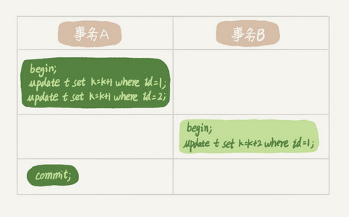

这个问题的结论取决于事务A在执行完两条update语句后，持有哪些锁，以及在什么时候释放。你可以验证一下：实际上事务B的update语句会被阻塞，直到事务A执行commit之后，事务B才能继续执行。

知道了这个答案，你一定知道了事务A持有的两个记录的行锁，都是在commit的时候才释放的。

也就是说，**在InnoDB事务中，行锁是在需要的时候才加上的，但并不是不需要了就立刻释放，而是要等到事务结束时才释放。这个就是两阶段锁协议。**

知道了这个设定，对我们使用事务有什么帮助呢？那就是，如果你的事务中需要锁多个行，要把最可能造成锁冲突、最可能影响并发度的锁尽量往后放。我给你举个例子。

假设你负责实现一个电影票在线交易业务，顾客A要在影院B购买电影票。我们简化一点，这个业务需要涉及到以下操作：

1. 从顾客A账户余额中扣除电影票价；
2. 给影院B的账户余额增加这张电影票价；
3. 记录一条交易日志。

也就是说，要完成这个交易，我们需要update两条记录，并insert一条记录。当然，为了保证交易的原子性，我们要把这三个操作放在一个事务中。那么，你会怎样安排这三个语句在事务中的顺序呢？

试想如果同时有另外一个顾客C要在影院B买票，那么这两个事务冲突的部分就是语句2了。因为它们要更新同一个影院账户的余额，需要修改同一行数据。

根据两阶段锁协议，不论你怎样安排语句顺序，所有的操作需要的行锁都是在事务提交的时候才释放的。所以，如果你把语句2安排在最后，比如按照3、1、2这样的顺序，那么影院账户余额这一行的锁时间就最少。这就最大程度地减少了事务之间的锁等待，提升了并发度。

好了，现在由于你的正确设计，影院余额这一行的行锁在一个事务中不会停留很长时间。但是，这并没有完全解决你的困扰。

如果这个影院做活动，可以低价预售一年内所有的电影票，而且这个活动只做一天。于是在活动时间开始的时候，你的MySQL就挂了。你登上服务器一看，CPU消耗接近100%，但整个数据库每秒就执行不到100个事务。这是什么原因呢？

这里，我就要说到死锁和死锁检测了。

### 死锁和死锁检测

当并发系统中不同线程出现循环资源依赖，涉及的线程都在等待别的线程释放资源时，就会导致这几个线程都进入无限等待的状态，称为死锁。这里我用数据库中的行锁举个例子。
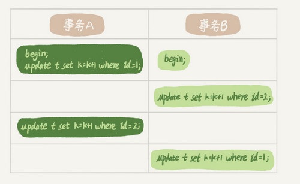

这时候，事务A在等待事务B释放id=2的行锁，而事务B在等待事务A释放id=1的行锁。 事务A和事务B在互相等待对方的资源释放，就是进入了死锁状态。当出现死锁以后，有两种策略：

- 一种策略是，直接进入等待，直到超时。这个超时时间可以通过参数innodb_lock_wait_timeout来设置。
- 另一种策略是，发起死锁检测，发现死锁后，主动回滚死锁链条中的某一个事务，让其他事务得以继续执行。将参数innodb_deadlock_detect设置为on，表示开启这个逻辑。

在InnoDB中，innodb_lock_wait_timeout的默认值是50s，意味着如果采用第一个策略，当出现死锁以后，第一个被锁住的线程要过50s才会超时退出，然后其他线程才有可能继续执行。对于在线服务来说，这个等待时间往往是无法接受的。

但是，我们又不可能直接把这个时间设置成一个很小的值，比如1s。这样当出现死锁的时候，确实很快就可以解开，但如果不是死锁，而是简单的锁等待呢？所以，超时时间设置太短的话，会出现很多误伤。

所以，正常情况下我们还是要采用第二种策略，即：主动死锁检测，而且innodb_deadlock_detect的默认值本身就是on。主动死锁检测在发生死锁的时候，是能够快速发现并进行处理的，但是它也是有额外负担的。

你可以想象一下这个过程：每当一个事务被锁的时候，就要看看它所依赖的线程有没有被别人锁住，如此循环，最后判断是否出现了循环等待，也就是死锁。

那如果是我们上面说到的所有事务都要更新同一行的场景呢？

每个新来的被堵住的线程，都要判断会不会由于自己的加入导致了死锁，这是一个时间复杂度是O(n)的操作。假设有1000个并发线程要同时更新同一行，那么死锁检测操作就是100万这个量级的。虽然最终检测的结果是没有死锁，但是这期间要消耗大量的CPU资源。因此，你就会看到CPU利用率很高，但是每秒却执行不了几个事务。

根据上面的分析，我们来讨论一下，怎么解决由这种热点行更新导致的性能问题呢？问题的症结在于，死锁检测要耗费大量的CPU资源。

**一种头痛医头的方法，就是如果你能确保这个业务一定不会出现死锁，可以临时把死锁检测关掉。**但是这种操作本身带有一定的风险，因为业务设计的时候一般不会把死锁当做一个严重错误，毕竟出现死锁了，就回滚，然后通过业务重试一般就没问题了，这是业务无损的。而关掉死锁检测意味着可能会出现大量的超时，这是业务有损的。

**另一个思路是控制并发度。**根据上面的分析，你会发现如果并发能够控制住，比如同一行同时最多只有10个线程在更新，那么死锁检测的成本很低，就不会出现这个问题。一个直接的想法就是，在客户端做并发控制。但是，你会很快发现这个方法不太可行，因为客户端很多。我见过一个应用，有600个客户端，这样即使每个客户端控制到只有5个并发线程，汇总到数据库服务端以后，峰值并发数也可能要达到3000。

因此，这个并发控制要做在数据库服务端。如果你有中间件，可以考虑在中间件实现；如果你的团队有能修改MySQL源码的人，也可以做在MySQL里面。基本思路就是，对于相同行的更新，在进入引擎之前排队。这样在InnoDB内部就不会有大量的死锁检测工作了。

可能你会问，**如果团队里暂时没有数据库方面的专家，不能实现这样的方案，能不能从设计上优化这个问题呢？**

你可以考虑通过将一行改成逻辑上的多行来减少锁冲突。还是以影院账户为例，可以考虑放在多条记录上，比如10个记录，影院的账户总额等于这10个记录的值的总和。这样每次要给影院账户加金额的时候，随机选其中一条记录来加。这样每次冲突概率变成原来的1/10，可以减少锁等待个数，也就减少了死锁检测的CPU消耗。

这个方案看上去是无损的，但其实这类方案需要根据业务逻辑做详细设计。如果账户余额可能会减少，比如退票逻辑，那么这时候就需要考虑当一部分行记录变成0的时候，代码要有特殊处理。

### 小结

今天，我和你介绍了MySQL的行锁，涉及了两阶段锁协议、死锁和死锁检测这两大部分内容。

其中，我以两阶段协议为起点，和你一起讨论了在开发的时候如何安排正确的事务语句。这里的原则/我给你的建议是：如果你的事务中需要锁多个行，要把最可能造成锁冲突、最可能影响并发度的锁的申请时机尽量往后放。

但是，调整语句顺序并不能完全避免死锁。所以我们引入了死锁和死锁检测的概念，以及提供了三个方案，来减少死锁对数据库的影响。减少死锁的主要方向，就是控制访问相同资源的并发事务量。

最后，我给你留下一个问题吧。如果你要删除一个表里面的前10000行数据，有以下三种方法可以做到：

- 第一种，直接执行delete from T limit 10000;
- 第二种，在一个连接中循环执行20次 delete from T limit 500;
- 第三种，在20个连接中同时执行delete from T limit 500。

你会选择哪一种方法呢？为什么呢？

你可以把你的思考和观点写在留言区里，我会在下一篇文章的末尾和你讨论这个问题。感谢你的收听，也欢迎你把这篇文章分享给更多的朋友一起阅读。

### 上期问题时间

上期我给你留的问题是：当备库用–single-transaction做逻辑备份的时候，如果从主库的binlog传来一个DDL语句会怎么样？

假设这个DDL是针对表t1的， 这里我把备份过程中几个关键的语句列出来：

```
Q1:SET SESSION TRANSACTION ISOLATION LEVEL REPEATABLE READ;
Q2:START TRANSACTION  WITH CONSISTENT SNAPSHOT；
/* other tables */
Q3:SAVEPOINT sp;
/* 时刻 1 */
Q4:show create table `t1`;
/* 时刻 2 */
Q5:SELECT * FROM `t1`;
/* 时刻 3 */
Q6:ROLLBACK TO SAVEPOINT sp;
/* 时刻 4 */
/* other tables */
```

在备份开始的时候，为了确保RR（可重复读）隔离级别，再设置一次RR隔离级别(Q1);

启动事务，这里用 WITH CONSISTENT SNAPSHOT确保这个语句执行完就可以得到一个一致性视图（Q2)；

设置一个保存点，这个很重要（Q3）；

show create 是为了拿到表结构(Q4)，然后正式导数据 （Q5），回滚到SAVEPOINT sp，在这里的作用是释放 t1的MDL锁 （Q6。当然这部分属于“超纲”，上文正文里面都没提到。

DDL从主库传过来的时间按照效果不同，我打了四个时刻。题目设定为小表，我们假定到达后，如果开始执行，则很快能够执行完成。

参考答案如下：

1. 如果在Q4语句执行之前到达，现象：没有影响，备份拿到的是DDL后的表结构。
2. 如果在“时刻 2”到达，则表结构被改过，Q5执行的时候，报 Table definition has changed, please retry transaction，现象：mysqldump终止；
3. 如果在“时刻2”和“时刻3”之间到达，mysqldump占着t1的MDL读锁，binlog被阻塞，现象：主从延迟，直到Q6执行完成。
4. 从“时刻4”开始，mysqldump释放了MDL读锁，现象：没有影响，备份拿到的是DDL前的表结构。

### 牛逼评论

> 方案一，事务相对较长，则占用锁的时间较长，会导致其他客户端等待资源时间较长。
> 方案二，串行化执行，将相对长的事务分成多次相对短的事务，则每次事务占用锁的时间相对较短，其他客户端在等待相应资源的时间也较短。这样的操作，同时也意味着将资源分片使用（每次执行使用不同片段的资源），可以提高并发性。
> 方案三，人为自己制造锁竞争，加剧并发量。
> 方案二相对比较好，具体还要结合实际业务场景。
>
> 另，对于innodb的行锁，我觉得可以增加一讲，如何加锁（依赖于具体的隔离级别，是否有索引，是否是唯一索引，SQL的执行计划），特别是在RR隔离级别下的GAP锁，对于innodb，RR级别是可以防止幻读的。

> 老师，本节课讲的不支持行锁的引擎，只能使用表锁，而表锁同一张表在同一时刻只能有一个更新。但是上节课讲的表级锁中的MDL锁，dml语句会产生MDL读锁，而MDL读锁不是互斥的，也就是说一张表可以同时有多个dml语句操作。感觉这两种说法有点矛盾，请老师解惑！
> 2018-11-28 19:29
>
> 作者回复
> 不矛盾，MDL锁和表锁是两个不同的结构。
> 比如：
> 你要在myisam 表上更新一行，那么会加MDL读锁和表的写锁；
> 然后同时另外一个线程要更新这个表上另外一行，也要加MDL读锁和表写锁。
>
> 第二个线程的*MDL读锁是能成功加上*的，但是被表写锁堵住了。从语句现象上看，就是第二个线程要等第一个线程执行完成。

## 事务到底是隔离的还是不隔离的

我在第3篇文章和你讲事务隔离级别的时候提到过，如果是可重复读隔离级别，事务T启动的时候会创建一个视图read-view，之后事务T执行期间，即使有其他事务修改了数据，事务T看到的仍然跟在启动时看到的一样。也就是说，一个在可重复读隔离级别下执行的事务，好像与世无争，不受外界影响。

但是，我在上一篇文章中，和你分享行锁的时候又提到，一个事务要更新一行，如果刚好有另外一个事务拥有这一行的行锁，它又不能这么超然了，会被锁住，进入等待状态。问题是，既然进入了等待状态，那么等到这个事务自己获取到行锁要更新数据的时候，它读到的值又是什么呢？

我给你举一个例子吧。下面是一个只有两行的表的初始化语句。

```
mysql> CREATE TABLE `t` (
  `id` int(11) NOT NULL,
  `k` int(11) DEFAULT NULL,
  PRIMARY KEY (`id`)
) ENGINE=InnoDB;
insert into t(id, k) values(1,1),(2,2);
```

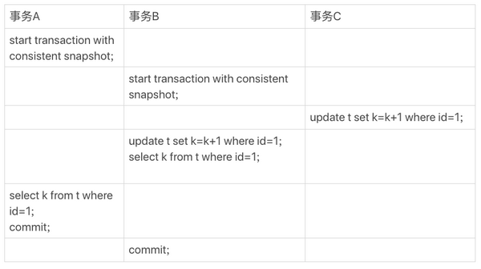

图1 事务A、B、C的执行流程

这里，我们需要注意的是事务的启动时机。

begin/start transaction 命令并不是一个事务的起点，在执行到它们之后的第一个操作InnoDB表的语句（第一个快照读语句），事务才真正启动。如果你想要马上启动一个事务，可以使用start transaction with consistent snapshot 这个命令。

还需要注意的是，在整个专栏里面，我们的例子中如果没有特别说明，都是默认autocommit=1。

在这个例子中，事务C没有显式地使用begin/commit，表示这个update语句本身就是一个事务，语句完成的时候会自动提交。事务B在更新了行之后查询; 事务A在一个只读事务中查询，并且时间顺序上是在事务B的查询之后。

这时，如果我告诉你事务B查到的k的值是3，而事务A查到的k的值是1，你是不是感觉有点晕呢？

所以，今天这篇文章，我其实就是想和你说明白这个问题，希望借由把这个疑惑解开的过程，能够帮助你对InnoDB的事务和锁有更进一步的理解。

在MySQL里，有两个“视图”的概念：

- 一个是view。它是一个用查询语句定义的虚拟表，在调用的时候执行查询语句并生成结果。创建视图的语法是create view ... ，而它的查询方法与表一样。
- 另一个是InnoDB在实现MVCC时用到的一致性读视图，即consistent read view，用于支持RC（Read Committed，读提交）和RR（Repeatable Read，可重复读）隔离级别的实现。

它没有物理结构，作用是事务执行期间用来定义“我能看到什么数据”。

在第3篇文章[《事务隔离：为什么你改了我还看不见？》](https://time.geekbang.org/column/article/68963)中，我跟你解释过一遍MVCC的实现逻辑。今天为了说明查询和更新的区别，我换一个方式来说明，把read view拆开。你可以结合这两篇文章的说明来更深一步地理解MVCC。

### “快照”在MVCC里是怎么工作的？

在可重复读隔离级别下，事务在启动的时候就“拍了个快照”。注意，这个快照是基于整库的。

这时，你会说这看上去不太现实啊。如果一个库有100G，那么我启动一个事务，MySQL就要拷贝100G的数据出来，这个过程得多慢啊。可是，我平时的事务执行起来很快啊。

实际上，我们并不需要拷贝出这100G的数据。我们先来看看这个快照是怎么实现的。

InnoDB里面每个事务有一个唯一的事务ID，叫作transaction id。它是在事务开始的时候向InnoDB的事务系统申请的，是按申请顺序严格递增的。

而每行数据也都是有多个版本的。每次事务更新数据的时候，都会生成一个新的数据版本，并且把transaction id赋值给这个数据版本的事务ID，记为row trx_id。同时，旧的数据版本要保留，并且在新的数据版本中，能够有信息可以直接拿到它。

也就是说，数据表中的一行记录，其实可能有多个版本(row)，每个版本有自己的row trx_id。

如图2所示，就是一个记录被多个事务连续更新后的状态。

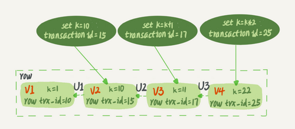

图2 行状态变更图

图中虚线框里是同一行数据的4个版本，当前最新版本是V4，k的值是22，它是被transaction id 为25的事务更新的，因此它的row trx_id也是25。

你可能会问，前面的文章不是说，语句更新会生成undo log（回滚日志）吗？那么，**undo log在哪呢？**

实际上，图2中的三个虚线箭头，就是undo log；而V1、V2、V3并不是物理上真实存在的，而是每次需要的时候根据当前版本和undo log计算出来的。比如，需要V2的时候，就是通过V4依次执行U3、U2算出来。

明白了多版本和row trx_id的概念后，我们再来想一下，InnoDB是怎么定义那个“100G”的快照的。

按照可重复读的定义，一个事务启动的时候，能够看到所有已经提交的事务结果。但是之后，这个事务执行期间，其他事务的更新对它不可见。

因此，一个事务只需要在启动的时候声明说，“以我启动的时刻为准，如果一个数据版本是在我启动之前生成的，就认；如果是我启动以后才生成的，我就不认，我必须要找到它的上一个版本”。

当然，如果“上一个版本”也不可见，那就得继续往前找。还有，如果是这个事务自己更新的数据，它自己还是要认的。

在实现上， InnoDB为每个事务构造了一个数组，用来保存这个事务启动瞬间，当前正在“活跃”的所有事务ID。“活跃”指的就是，启动了但还没提交。

数组里面事务ID的最小值记为低水位，当前系统里面已经创建过的事务ID的最大值加1记为高水位。

这个视图数组和高水位，就组成了当前事务的一致性视图（read-view）。

而数据版本的可见性规则，就是基于数据的row trx_id和这个一致性视图的对比结果得到的。

这个视图数组把所有的row trx_id 分成了几种不同的情况。

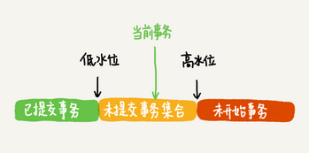

图3 数据版本可见性规则

这样，对于当前事务的启动瞬间来说，一个数据版本的row trx_id，有以下几种可能：

1. 如果落在绿色部分，表示这个版本是已提交的事务或者是当前事务自己生成的，这个数据是可见的；
2. 如果落在红色部分，表示这个版本是由将来启动的事务生成的，是肯定不可见的；
3. 如果落在黄色部分，那就包括两种情况
   a. 若 row trx_id在数组中，表示这个版本是由还没提交的事务生成的，不可见；
   b. 若 row trx_id不在数组中，表示这个版本是已经提交了的事务生成的，可见。

比如，对于图2中的数据来说，如果有一个事务，它的低水位是18，那么当它访问这一行数据时，就会从V4通过U3计算出V3，所以在它看来，这一行的值是11。

你看，有了这个声明后，系统里面随后发生的更新，是不是就跟这个事务看到的内容无关了呢？因为之后的更新，生成的版本一定属于上面的2或者3(a)的情况，而对它来说，这些新的数据版本是不存在的，所以这个事务的快照，就是“静态”的了。

所以你现在知道了，**InnoDB利用了“所有数据都有多个版本”的这个特性，实现了“秒级创建快照”的能力。**

接下来，我们继续看一下图1中的三个事务，分析下事务A的语句返回的结果，为什么是k=1。

这里，我们不妨做如下假设：

1. 事务A开始前，系统里面只有一个活跃事务ID是99；
2. 事务A、B、C的版本号分别是100、101、102，且当前系统里只有这四个事务；
3. 三个事务开始前，(1,1）这一行数据的row trx_id是90。

这样，事务A的视图数组就是[99,100], 事务B的视图数组是[99,100,101], 事务C的视图数组是[99,100,101,102]。

为了简化分析，我先把其他干扰语句去掉，只画出跟事务A查询逻辑有关的操作：

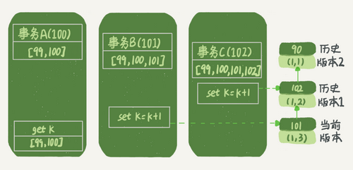

图4 事务A查询数据逻辑图

从图中可以看到，第一个有效更新是事务C，把数据从(1,1)改成了(1,2)。这时候，这个数据的最新版本的row trx_id是102，而90这个版本已经成为了历史版本。

第二个有效更新是事务B，把数据从(1,2)改成了(1,3)。这时候，这个数据的最新版本（即row trx_id）是101，而102又成为了历史版本。

你可能注意到了，在事务A查询的时候，其实事务B还没有提交，但是它生成的(1,3)这个版本已经变成当前版本了。但这个版本对事务A必须是不可见的，否则就变成脏读了。

好，现在事务A要来读数据了，它的视图数组是[99,100]。当然了，读数据都是从当前版本读起的。所以，事务A查询语句的读数据流程是这样的：

- 找到(1,3)的时候，判断出row trx_id=101，比高水位大，处于红色区域，不可见；
- 接着，找到上一个历史版本，一看row trx_id=102，比高水位大，处于红色区域，不可见；
- 再往前找，终于找到了（1,1)，它的row trx_id=90，比低水位小，处于绿色区域，可见。

这样执行下来，虽然期间这一行数据被修改过，但是事务A不论在什么时候查询，看到这行数据的结果都是一致的，所以我们称之为一致性读。

这个判断规则是从代码逻辑直接转译过来的，但是正如你所见，用于人肉分析可见性很麻烦。

所以，我来给你翻译一下。一个数据版本，对于一个事务视图来说，除了自己的更新总是可见以外，有三种情况：

1. 版本未提交，不可见；
2. 版本已提交，但是是在视图创建后提交的，不可见；
3. 版本已提交，而且是在视图创建前提交的，可见。

现在，我们用这个规则来判断图4中的查询结果，事务A的查询语句的视图数组是在事务A启动的时候生成的，这时候：

- (1,3)还没提交，属于情况1，不可见；
- (1,2)虽然提交了，但是是在视图数组创建之后提交的，属于情况2，不可见；
- (1,1)是在视图数组创建之前提交的，可见。

你看，去掉数字对比后，只用时间先后顺序来判断，分析起来是不是轻松多了。所以，后面我们就都用这个规则来分析。

### 更新逻辑

细心的同学可能有疑问了：**事务B的update语句，如果按照一致性读，好像结果不对哦？**

你看图5中，事务B的视图数组是先生成的，之后事务C才提交，不是应该看不见(1,2)吗，怎么能算出(1,3)来？

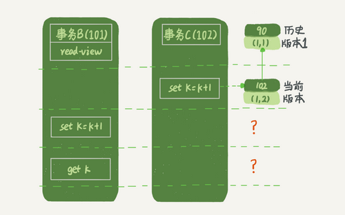

图5 事务B更新逻辑图

是的，如果事务B在更新之前查询一次数据，这个查询返回的k的值确实是1。

但是，当它要去更新数据的时候，就不能再在历史版本上更新了，否则事务C的更新就丢失了。因此，事务B此时的set k=k+1是在（1,2）的基础上进行的操作。

所以，这里就用到了这样一条规则：**更新数据都是先读后写的，而这个读，只能读当前的值，称为“当前读”（current read）。**

因此，在更新的时候，当前读拿到的数据是(1,2)，更新后生成了新版本的数据(1,3)，这个新版本的row trx_id是101。

所以，在执行事务B查询语句的时候，一看自己的版本号是101，最新数据的版本号也是101，是自己的更新，可以直接使用，所以查询得到的k的值是3。

这里我们提到了一个概念，叫作当前读。其实，除了update语句外，select语句如果加锁，也是当前读。

所以，如果把事务A的查询语句select * from t where id=1修改一下，加上lock in share mode 或 for update，也都可以读到版本号是101的数据，返回的k的值是3。下面这两个select语句，就是分别加了读锁（S锁，共享锁）和写锁（X锁，排他锁）。

```
mysql> select k from t where id=1 lock in share mode;
mysql> select k from t where id=1 for update;
```

再往前一步，假设事务C不是马上提交的，而是变成了下面的事务C’，会怎么样呢？

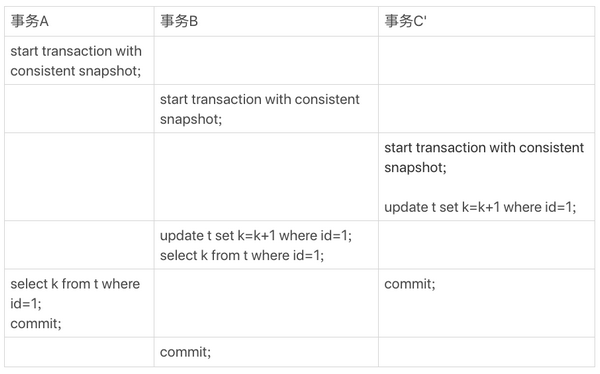

图6 事务A、B、C'的执行流程

事务C’的不同是，更新后并没有马上提交，在它提交前，事务B的更新语句先发起了。前面说过了，虽然事务C’还没提交，但是(1,2)这个版本也已经生成了，并且是当前的最新版本。那么，事务B的更新语句会怎么处理呢？

这时候，我们在上一篇文章中提到的“两阶段锁协议”就要上场了。事务C’没提交，也就是说(1,2)这个版本上的写锁还没释放。而事务B是当前读，必须要读最新版本，而且必须加锁，因此就被锁住了，必须等到事务C’释放这个锁，才能继续它的当前读。

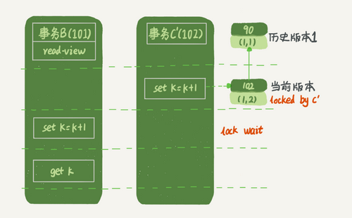

图7 事务B更新逻辑图（配合事务C'）

到这里，我们把一致性读、当前读和行锁就串起来了。

现在，我们再回到文章开头的问题：**事务的可重复读的能力是怎么实现的？**

可重复读的核心就是一致性读（consistent read）；而事务更新数据的时候，只能用当前读。如果当前的记录的行锁被其他事务占用的话，就需要进入锁等待。

而读提交的逻辑和可重复读的逻辑类似，它们最主要的区别是：

- 在可重复读隔离级别下，只需要在事务开始的时候创建一致性视图，之后事务里的其他查询都共用这个一致性视图；
- 在读提交隔离级别下，每一个语句执行前都会重新算出一个新的视图。

那么，我们再看一下，在读提交隔离级别下，事务A和事务B的查询语句查到的k，分别应该是多少呢？

这里需要说明一下，“start transaction with consistent snapshot; ”的意思是从这个语句开始，创建一个持续整个事务的一致性快照。所以，在读提交隔离级别下，这个用法就没意义了，等效于普通的start transaction。

下面是读提交时的状态图，可以看到这两个查询语句的创建视图数组的时机发生了变化，就是图中的read view框。（注意：这里，我们用的还是事务C的逻辑直接提交，而不是事务C’）

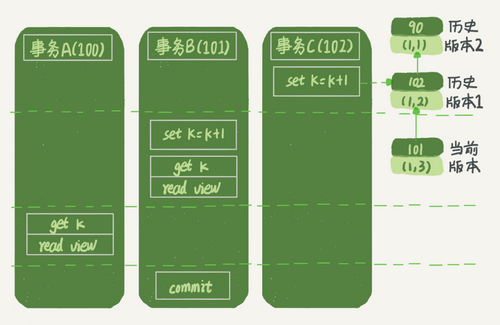

图8 读提交隔离级别下的事务状态图

这时，事务A的查询语句的视图数组是在执行这个语句的时候创建的，时序上(1,2)、(1,3)的生成时间都在创建这个视图数组的时刻之前。但是，在这个时刻：

- (1,3)还没提交，属于情况1，不可见；
- (1,2)提交了，属于情况3，可见。

所以，这时候事务A查询语句返回的是k=2。

显然地，事务B查询结果k=3。

### 小结

InnoDB的行数据有多个版本，每个数据版本有自己的row trx_id，每个事务或者语句有自己的一致性视图。普通查询语句是一致性读，一致性读会根据row trx_id和一致性视图确定数据版本的可见性。

- 对于可重复读，查询只承认在事务启动前就已经提交完成的数据；
- 对于读提交，查询只承认在语句启动前就已经提交完成的数据；

而当前读，总是读取已经提交完成的最新版本。

你也可以想一下，为什么表结构不支持“可重复读”？这是因为表结构没有对应的行数据，也没有row trx_id，因此只能遵循当前读的逻辑。

当然，MySQL 8.0已经可以把表结构放在InnoDB字典里了，也许以后会支持表结构的可重复读。

又到思考题时间了。我用下面的表结构和初始化语句作为试验环境，事务隔离级别是可重复读。现在，我要把所有“字段c和id值相等的行”的c值清零，但是却发现了一个“诡异”的、改不掉的情况。请你构造出这种情况，并说明其原理。

```
mysql> CREATE TABLE `t` (
  `id` int(11) NOT NULL,
  `c` int(11) DEFAULT NULL,
  PRIMARY KEY (`id`)
) ENGINE=InnoDB;
insert into t(id, c) values(1,1),(2,2),(3,3),(4,4);
```

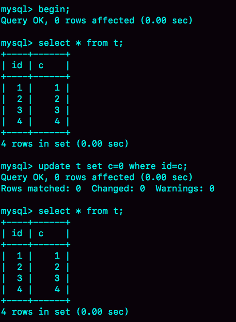
复现出来以后，请你再思考一下，在实际的业务开发中有没有可能碰到这种情况？你的应用代码会不会掉进这个“坑”里，你又是怎么解决的呢？

你可以把你的思考和观点写在留言区里，我会在下一篇文章的末尾和你讨论这个问题。感谢你的收听，也欢迎你把这篇文章分享给更多的朋友一起阅读。

### 上期问题时间

我在上一篇文章最后，留给你的问题是：怎么删除表的前10000行。比较多的留言都选择了第二种方式，即：在一个连接中循环执行20次 delete from T limit 500。

确实是这样的，第二种方式是相对较好的。

第一种方式（即：直接执行delete from T limit 10000）里面，单个语句占用时间长，锁的时间也比较长；而且大事务还会导致主从延迟。

第三种方式（即：在20个连接中同时执行delete from T limit 500），会人为造成锁冲突。

### 牛逼评论

> 这篇理论知识很丰富,需要先总结下
> 1.innodb支持RC和RR隔离级别实现是用的一致性视图(consistent read view)
>
> 2.事务在启动时会拍一个快照,这个快照是基于整个库的.
> 基于整个库的意思就是说一个事务内,整个库的修改对于该事务都是不可见的(对于快照读的情况)
> 如果在事务内select t表,另外的事务执行了DDL t表,根据发生时间,要嘛锁住要嘛报错(参考第六章)
>
> 3.事务是如何实现的MVCC呢?
> (1)每个事务都有一个事务ID,叫做transaction id(严格递增)
> (2)事务在启动时,找到已提交的最大事务ID记为up_limit_id。
> (3)事务在更新一条语句时,比如id=1改为了id=2.会把id=1和该行之前的row trx_id写到undo log里,
> 并且在数据页上把id的值改为2,并且把修改这条语句的transaction id记在该行行头
> (4)再定一个规矩,一个事务要查看一条数据时,必须先用该事务的up_limit_id与该行的transaction id做比对,
> 如果up_limit_id>=transaction id,那么可以看.如果up_limit_id<transaction id,则只能去undo log里去取。去undo log查找数据的时候,也需要做比对,必须up_limit_id>transaction id,才返回数据
>
> 4.什么是当前读,由于当前读都是先读后写,只能读当前的值,所以为当前读.会更新事务内的up_limit_id为该事务的transaction id
>
> 5.为什么rr能实现可重复读而rc不能,分两种情况
> (1)快照读的情况下,rr不能更新事务内的up_limit_id,
> 而rc每次会把up_limit_id更新为快照读之前最新已提交事务的transaction id,则rc不能可重复读
> (2)当前读的情况下,rr是利用record lock+gap lock来实现的,而rc没有gap,所以rc不能可重复读

> 老师你好，有个问题不太理解，对于文中的例子假设transaction id为98的事务在事务A执行select（Q2）之前更新了字段，那么事务A发现这个字段的row trx_id是98，比自己的up_limit_id要小，那此时事务A不就获取到了transaction id为98的事务更新后的值了吗？
> 换句话说对于文中"之后的更新，产生的新的数据版本的 row trx_id 都会大于 up_limit_id"这句话不太理解， up_limit_id是已经提交事务id的最大值，那也可能存在一个没有提交的id小于up_limit_id的事务对数据进行更新？还是说transaction id比up_limit_id小的事务都是保证已经提交的？
>
> 2018-11-30 15:01
>
> 作者回复
> 你的问题被引用最多，我回复你哈，其它同学看过来😄
> 好吧，今天的课后问题其实比较简单，本来是隐藏在思考题里的彩蛋，被你问出来了哈。
> Innodb 要保证这个规则：事务启动以前所有还没提交的事务，它都不可见。
> 但是只存一个已经提交事务的最大值是不够的。 因为存在一个问题，那些比最大值小的事务，之后也可能更新（就是你说的98这个事务）
> 所以事务启动的时候还要保存“现在正在执行的所有事物ID列表”，如果一个row trx_id在这列表中，也要不可见。
> 虽然踩破了彩蛋，还是赞你的思考哈，置顶让大家学习😄

> 请教一个问题，业务上有这样的需求，A、B两个用户，如果互相喜欢，则成为好友。设计上是有两张表，一个是like表，一个是friend表，like表有user_id、liker_id两个字段，我设置为复合唯一索引即uk_user_id_liker_id。语句执行顺序是这样的：
> 以A喜欢B为例：
> 1、先查询对方有没有喜欢自己（B有没有喜欢A）
> select * from like where user_id = B and liker_id = A
> 2、如果有，则成为好友
> insert into friend
> 3、没有，则只是喜欢关系
> insert into like
>
> 如果A、B同时喜欢对方，会出现不会成为好友的问题。因为上面第1步，双方都没喜欢对方。第1步即使使用了排他锁也不行，因为记录不存在，行锁无法生效。请问这种情况，在mysql锁层面有没有办法处理
>
> 2018-12-05 16:51
>
> 作者回复
>
> 你这个问题很有趣。我想到一个不错的解法。不过我先置顶。让别的同学来回答看看。

> 老师，我有一个问题。当开启事务时，需要保存活跃事务的数组（A），然后获取高水位（B）。我的疑问就是，在这两个动作之间（A和B之间）会不会产生新的事务？如果产生了新的事务，那么这个新的事务相对于当前事务就是可见的，不管有没有提交。
>
> 2018-12-03 19:28
>
> 作者回复
>
> 好问题，有很深入的思考哈
>
> 代码实现上，获取视图数组和高水位是在事务系统的锁保护下做的，可以认为是原子操作，期间不能创建事务。

## 普通索引和唯一索引，应该怎么选择

在前面的基础篇文章中，我给你介绍过索引的基本概念，相信你已经了解了唯一索引和普通索引的区别。今天我们就继续来谈谈，在不同的业务场景下，应该选择普通索引，还是唯一索引？

假设你在维护一个市民系统，每个人都有一个唯一的身份证号，而且业务代码已经保证了不会写入两个重复的身份证号。如果市民系统需要按照身份证号查姓名，就会执行类似这样的SQL语句：

```
select name from CUser where id_card = 'xxxxxxxyyyyyyzzzzz';
```

所以，你一定会考虑在id_card字段上建索引。

由于身份证号字段比较大，我不建议你把身份证号当做主键，那么现在你有两个选择，要么给id_card字段创建唯一索引，要么创建一个普通索引。如果业务代码已经保证了不会写入重复的身份证号，那么这两个选择逻辑上都是正确的。

现在我要问你的是，从性能的角度考虑，你选择唯一索引还是普通索引呢？选择的依据是什么呢？

简单起见，我们还是用第4篇文章[《深入浅出索引（上）》](https://time.geekbang.org/column/article/69236)中的例子来说明，假设字段 k 上的值都不重复。

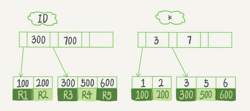

图1 InnoDB的索引组织结构

接下来，我们就从这两种索引对查询语句和更新语句的性能影响来进行分析。

### 查询过程

假设，执行查询的语句是 select id from T where k=5。这个查询语句在索引树上查找的过程，先是通过B+树从树根开始，按层搜索到叶子节点，也就是图中右下角的这个数据页，然后可以认为数据页内部通过二分法来定位记录。

- 对于普通索引来说，查找到满足条件的第一个记录(5,500)后，需要查找下一个记录，直到碰到第一个不满足k=5条件的记录。
- 对于唯一索引来说，由于索引定义了唯一性，查找到第一个满足条件的记录后，就会停止继续检索。

那么，这个不同带来的性能差距会有多少呢？答案是，微乎其微。

你知道的，InnoDB的数据是按数据页为单位来读写的。也就是说，当需要读一条记录的时候，并不是将这个记录本身从磁盘读出来，而是以页为单位，将其整体读入内存。在InnoDB中，每个数据页的大小默认是16KB。

因为引擎是按页读写的，所以说，当找到k=5的记录的时候，它所在的数据页就都在内存里了。那么，对于普通索引来说，要多做的那一次“查找和判断下一条记录”的操作，就只需要一次指针寻找和一次计算。

当然，如果k=5这个记录刚好是这个数据页的最后一个记录，那么要取下一个记录，必须读取下一个数据页，这个操作会稍微复杂一些。

但是，我们之前计算过，对于整型字段，一个数据页可以放近千个key，因此出现这种情况的概率会很低。所以，我们计算平均性能差异时，仍可以认为这个操作成本对于现在的CPU来说可以忽略不计。

### 更新过程

为了说明普通索引和唯一索引对更新语句性能的影响这个问题，我需要先跟你介绍一下change buffer。

当需要更新一个数据页时，如果数据页在内存中就直接更新，而如果这个数据页还没有在内存中的话，在不影响数据一致性的前提下，InooDB会将这些更新操作缓存在change buffer中，这样就不需要从磁盘中读入这个数据页了。在下次查询需要访问这个数据页的时候，将数据页读入内存，然后执行change buffer中与这个页有关的操作。通过这种方式就能保证这个数据逻辑的正确性。

需要说明的是，虽然名字叫作change buffer，实际上它是可以持久化的数据。也就是说，change buffer在内存中有拷贝，也会被写入到磁盘上。

将change buffer中的操作应用到原数据页，得到最新结果的过程称为merge。除了访问这个数据页会触发merge外，系统有后台线程会定期merge。在数据库正常关闭（shutdown）的过程中，也会执行merge操作。

显然，如果能够将更新操作先记录在change buffer，减少读磁盘，语句的执行速度会得到明显的提升。而且，数据读入内存是需要占用buffer pool的，所以这种方式还能够避免占用内存，提高内存利用率。

那么，**什么条件下可以使用change buffer呢？**

对于唯一索引来说，所有的更新操作都要先判断这个操作是否违反唯一性约束。比如，要插入(4,400)这个记录，就要先判断现在表中是否已经存在k=4的记录，而这必须要将数据页读入内存才能判断。如果都已经读入到内存了，那直接更新内存会更快，就没必要使用change buffer了。

因此，唯一索引的更新就不能使用change buffer，实际上也只有普通索引可以使用。

change buffer用的是buffer pool里的内存，因此不能无限增大。change buffer的大小，可以通过参数innodb_change_buffer_max_size来动态设置。这个参数设置为50的时候，表示change buffer的大小最多只能占用buffer pool的50%。

现在，你已经理解了change buffer的机制，那么我们再一起来看看**如果要在这张表中插入一个新记录(4,400)的话，InnoDB的处理流程是怎样的。**

第一种情况是，**这个记录要更新的目标页在内存中**。这时，InnoDB的处理流程如下：

- 对于唯一索引来说，找到3和5之间的位置，判断到没有冲突，插入这个值，语句执行结束；
- 对于普通索引来说，找到3和5之间的位置，插入这个值，语句执行结束。

这样看来，普通索引和唯一索引对更新语句性能影响的差别，只是一个判断，只会耗费微小的CPU时间。

但，这不是我们关注的重点。

第二种情况是，**这个记录要更新的目标页不在内存中**。这时，InnoDB的处理流程如下：

- 对于唯一索引来说，需要将数据页读入内存，判断到没有冲突，插入这个值，语句执行结束；
- 对于普通索引来说，则是将更新记录在change buffer，语句执行就结束了。

将数据从磁盘读入内存涉及随机IO的访问，是数据库里面成本最高的操作之一。change buffer因为减少了随机磁盘访问，所以对更新性能的提升是会很明显的。

之前我就碰到过一件事儿，有个DBA的同学跟我反馈说，他负责的某个业务的库内存命中率突然从99%降低到了75%，整个系统处于阻塞状态，更新语句全部堵住。而探究其原因后，我发现这个业务有大量插入数据的操作，而他在前一天把其中的某个普通索引改成了唯一索引。

### change buffer的使用场景

通过上面的分析，你已经清楚了使用change buffer对更新过程的加速作用，也清楚了change buffer只限于用在普通索引的场景下，而不适用于唯一索引。那么，现在有一个问题就是：普通索引的所有场景，使用change buffer都可以起到加速作用吗？

因为merge的时候是真正进行数据更新的时刻，而change buffer的主要目的就是将记录的变更动作缓存下来，所以在一个数据页做merge之前，change buffer记录的变更越多（也就是这个页面上要更新的次数越多），收益就越大。

因此，对于写多读少的业务来说，页面在写完以后马上被访问到的概率比较小，此时change buffer的使用效果最好。这种业务模型常见的就是账单类、日志类的系统。

反过来，假设一个业务的更新模式是写入之后马上会做查询，那么即使满足了条件，将更新先记录在change buffer，但之后由于马上要访问这个数据页，会立即触发merge过程。这样随机访问IO的次数不会减少，反而增加了change buffer的维护代价。所以，对于这种业务模式来说，change buffer反而起到了副作用。

### 索引选择和实践

回到我们文章开头的问题，普通索引和唯一索引应该怎么选择。其实，这两类索引在查询能力上是没差别的，主要考虑的是对更新性能的影响。所以，我建议你尽量选择普通索引。

如果所有的更新后面，都马上伴随着对这个记录的查询，那么你应该关闭change buffer。而在其他情况下，change buffer都能提升更新性能。

在实际使用中，你会发现，普通索引和change buffer的配合使用，对于数据量大的表的更新优化还是很明显的。

特别地，在使用机械硬盘时，change buffer这个机制的收效是非常显著的。所以，当你有一个类似“历史数据”的库，并且出于成本考虑用的是机械硬盘时，那你应该特别关注这些表里的索引，尽量使用普通索引，然后把change buffer 尽量开大，以确保这个“历史数据”表的数据写入速度。

### change buffer 和 redo log

理解了change buffer的原理，你可能会联想到我在前面文章中和你介绍过的redo log和WAL。

在前面文章的评论中，我发现有同学混淆了redo log和change buffer。WAL 提升性能的核心机制，也的确是尽量减少随机读写，这两个概念确实容易混淆。所以，这里我把它们放到了同一个流程里来说明，便于你区分这两个概念。

> 备注：这里，你可以再回顾下第2篇文章[《日志系统：一条SQL更新语句是如何执行的？》](https://time.geekbang.org/column/article/68633)中的相关内容。

现在，我们要在表上执行这个插入语句：

```
mysql> insert into t(id,k) values(id1,k1),(id2,k2);
```

这里，我们假设当前k索引树的状态，查找到位置后，k1所在的数据页在内存(InnoDB buffer pool)中，k2所在的数据页不在内存中。如图2所示是带change buffer的更新状态图。

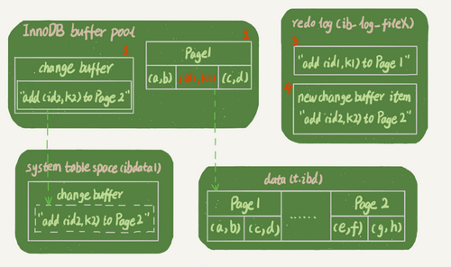

图2 带change buffer的更新过程

分析这条更新语句，你会发现它涉及了四个部分：内存、redo log（ib_log_fileX）、 数据表空间（t.ibd）、系统表空间（ibdata1）。

这条更新语句做了如下的操作（按照图中的数字顺序）：

1. Page 1在内存中，直接更新内存；
2. Page 2没有在内存中，就在内存的change buffer区域，记录下“我要往Page 2插入一行”这个信息
3. 将上述两个动作记入redo log中（图中3和4）。

做完上面这些，事务就可以完成了。所以，你会看到，执行这条更新语句的成本很低，就是写了两处内存，然后写了一处磁盘（两次操作合在一起写了一次磁盘），而且还是顺序写的。

同时，图中的两个虚线箭头，是后台操作，不影响更新的响应时间。

那在这之后的读请求，要怎么处理呢？

比如，我们现在要执行 select * from t where k in (k1, k2)。这里，我画了这两个读请求的流程图。

如果读语句发生在更新语句后不久，内存中的数据都还在，那么此时的这两个读操作就与系统表空间（ibdata1）和 redo log（ib_log_fileX）无关了。所以，我在图中就没画出这两部分。

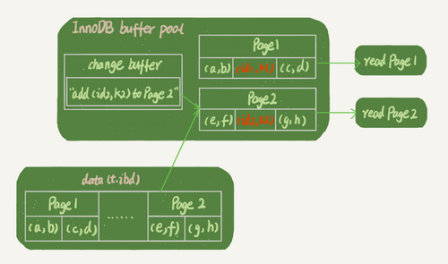

图3 带change buffer的读过程

从图中可以看到：

1. 读Page 1的时候，直接从内存返回。有几位同学在前面文章的评论中问到，WAL之后如果读数据，是不是一定要读盘，是不是一定要从redo log里面把数据更新以后才可以返回？其实是不用的。你可以看一下图3的这个状态，虽然磁盘上还是之前的数据，但是这里直接从内存返回结果，结果是正确的。
2. 要读Page 2的时候，需要把Page 2从磁盘读入内存中，然后应用change buffer里面的操作日志，生成一个正确的版本并返回结果。

可以看到，直到需要读Page 2的时候，这个数据页才会被读入内存。

所以，如果要简单地对比这两个机制在提升更新性能上的收益的话，**redo log 主要节省的是随机写磁盘的IO消耗（转成顺序写），而change buffer主要节省的则是随机读磁盘的IO消耗。**

### 小结

今天，我从普通索引和唯一索引的选择开始，和你分享了数据的查询和更新过程，然后说明了change buffer的机制以及应用场景，最后讲到了索引选择的实践。

由于唯一索引用不上change buffer的优化机制，因此如果业务可以接受，从性能角度出发我建议你优先考虑非唯一索引。

最后，又到了思考题时间。

通过图2你可以看到，change buffer一开始是写内存的，那么如果这个时候机器掉电重启，会不会导致change buffer丢失呢？change buffer丢失可不是小事儿，再从磁盘读入数据可就没有了merge过程，就等于是数据丢失了。会不会出现这种情况呢？

你可以把你的思考和观点写在留言区里，我会在下一篇文章的末尾和你讨论这个问题。感谢你的收听，也欢迎你把这篇文章分享给更多的朋友一起阅读。

**补充：**
评论区大家对“是否使用唯一索引”有比较多的讨论，主要是纠结在“业务可能无法确保”的情况。这里，我再说明一下：

- 首先，业务正确性优先。咱们这篇文章的前提是“业务代码已经保证不会写入重复数据”的情况下，讨论性能问题。如果业务不能保证，或者业务就是要求数据库来做约束，那么没得选，必须创建唯一索引。这种情况下，本篇文章的意义在于，如果碰上了大量插入数据慢、内存命中率低的时候，可以给你多提供一个排查思路。
- 然后，在一些“归档库”的场景，你是可以考虑使用唯一索引的。比如，线上数据只需要保留半年，然后历史数据保存在归档库。这时候，归档数据已经是确保没有唯一键冲突了。要提高归档效率，可以考虑把表里面的唯一索引改成普通索引。

### 上期问题时间

上期的问题是：如何构造一个“数据无法修改”的场景。评论区里已经有不少同学给出了正确答案，这里我再描述一下。

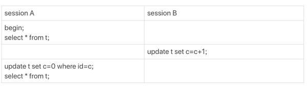
这样，session A看到的就是我截图的效果了。

其实，还有另外一种场景，同学们在留言区都还没有提到。

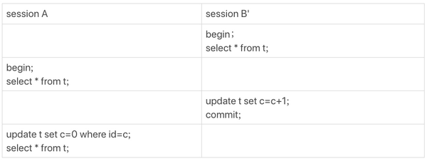

这个操作序列跑出来，session A看的内容也是能够复现我截图的效果的。这个session B’启动的事务比A要早，其实是上期我们描述事务版本的可见性规则时留的彩蛋，因为规则里还有一个“活跃事务的判断”，我是准备留到这里再补充的。

当我试图在这里讲述完整规则的时候，发现第8篇文章[《事务到底是隔离的还是不隔离的？》](https://time.geekbang.org/column/article/70562)中的解释引入了太多的概念，以致于分析起来非常复杂。

因此，我重写了第8篇，这样我们人工去判断可见性的时候，才会更方便。【看到这里，我建议你能够再重新打开第8篇文章并认真学习一次。如果学习的过程中，有任何问题，也欢迎你给我留言】

用新的方式来分析session B’的更新为什么对session A不可见就是：在session A视图数组创建的瞬间，session B’是活跃的，属于“版本未提交，不可见”这种情况。

业务中如果要绕过这类问题，@约书亚提供了一个“乐观锁”的解法，大家可以去上一篇的留言区看一下。

### 牛逼评论

> 今天这个问题不是特别明白为什么。session A开启了一致性读,session B delete或者insert,之前记录都已经放进了undo了。二级索引的记录也写进了redo和change buffer,应该说删除了索引页也不影响session A的重复读。估计是开启了一致性读之后,在这个事务执行期间,不能释放空间,导致统计信息变大。还是需要老师解释下具体的细节
>
> 今天有两个问题,想请教下老师
> 1.我的理解是由于B是查找(50000,100000),由于B+树有序,通过二分查找找到b=50000的值,从50000往右扫描,一条一条回表查数据,在执行器上做where a(1,1000)的筛选,然后做判断是否够不够limit的数,够就结束循环。由于这里b(50000,100000)必然不存在a(1,1000),所以需要扫描5W行左右.但是如果把a改为(50001,51000),扫描行数没有变。那么是因为优化器给的扫描行数有问题还是执行器没有结束循环？为什么不结束循环?
> (好像rows能直观展示limit起作用,必须在执行器上过滤数据,不能在索引上过滤数据,不知道为什么这样设计)
>
> 2.假设b上数据是会有很多重复的数据,b的最大值也存在多行重复
> select * from t where (a between 1 and 1000) and (b between 50000 and 100000) order by b desc limit 1;
> 这里倒序去扫描b索引树,选取的是b值最大,id值为一个固定值(既不最大也不最小)
> select * from t force index(a) where (a between 1 and 1000) and (b between 50000 and 100000) order by b desc limit 1;
> 由于这里选取的是a索引,排序不能用到索引,只能用优化排序.选取的是b值最大,id值最小那一行
> 这就是典型的两条相同的sql,但是索引选择的不同,出现的数据不一致。
> 所以如果是order by b,a就可以避免这种情况的引起的不一致,也可以避免堆排序造成的不一致
> 但是如果是asc没有出现这种情况。这里出现不一致,应该还不是由于堆排序造成的。这是什么原因造成的？
>
> 2018-12-05 20:54
>
> 作者回复
>
> \1. 好问题，而且你做了个不错的对照实验。是的，加了limit 1 能减少扫描多少行，其实优化器也不确定，【得执行才知道】，所以显示的时候还是按照“最多可能扫多少行”来显示。
>
> \2. 你这个例子里，如果确实是按照b扫描了，应该肯定是ID最大值呀，除非ID最大的那个记录，a条件不满足。但是一定是“满足a条件里面最大的那个ID的”，你再验证下。
>
> 而如果是用了a, 那就有临时表排序，临时表排序有三种算法，还分内存还是磁盘临时表… 这里展开不了了，后面《order by是怎么工作的》这篇会讲。

> change Buffer和数据页一样，也是物理页的一个组成部分，数据结构也是一颗B+树，这棵B+树放在共享表空间中，默认ibdata1中。change buffer 写入系统表空间机制应该和普通表的脏页刷新到磁盘是相同的机制--Checkpoint机制；
> 之所以change buffer要写入系统表空间，是为了保证数据的一致性，change buffer做修改时需要写redo，在做恢复时需要根据redo来恢复change buffer，若是不进行change buffer写入系统表空间，也就是不进行持久化，那么在change buffer写入内存后掉电（也就是篇尾提出的问题），则无法进行数据恢复。这样也会导致索引中的数据和相应表的相应列中的数据不一致。
> change buffer 写入到了系统表空间，purge 的时候会先查询change buffer里对应的记录，然后进行purge，因为change buffer B+树的key是表空间ID，所以查询根据表空间ID 查询change buffer会很快。

> 不会导致change buffer丢失。因为在更改change buffer 时也会写redo log，也需要持久化。
> change buffer 更新完成并且相应事务提交的情况下，首先要保证redo log落盘（二阶段提交），若此时掉电重启，则可以根据 redo 进行恢复;
> 若change buffer 更新完成但是相应事务未提交的情况下，则redo 有可能落盘了（redo 的组提交），也有可能未落盘，若落盘了，读取redo发现没有commit标志（还会进行lsn，binlog的对比），则回滚；若redo未落盘则也就不会出现前滚和回滚的情况，数据依旧一致。