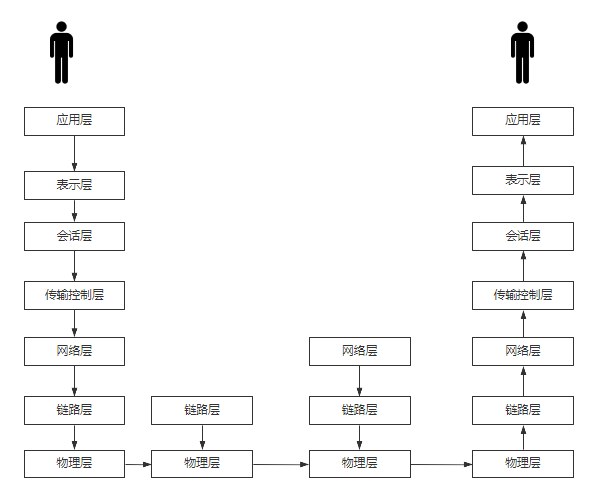

# 网络协议原理

## 网络模型

主讲人：张一明

[高并发负载均衡：网络协议原理](https://ke.qq.com/webcourse/index.html#cid=398381&term_id=100475149&taid=3385473611732013&type=1024&vid=5285890793326178319)

### OSI七层模型




### TCP/IP的参考四层模型


## 子网掩码的作用

```
IP:      192     .168        .150         .14
NETMASK: 255     .255        .255         .0

IP:      11000000.10101000.10010110.00001110
NETMASK: 11111111.11111111.11111111.00000000   &
-------------------------------------------------
&result: 11111111.11111111.11111111.00000000
```

IP和NetMask按位与得到路由条目

路由表：

```sh
[root@shreker ~]# route -n
Kernel IP routing table
Destination     Gateway         Genmask         Flags Metric Ref    Use Iface
0.0.0.0         172.17.63.253   0.0.0.0         UG    0      0        0 eth0
169.254.0.0     0.0.0.0         255.255.0.0     U     1002   0        0 eth0
172.17.48.0     0.0.0.0         255.255.240.0   U     0      0        0 eth0
172.18.0.0      0.0.0.0         255.255.0.0     U     0      0        0 docker0
```

## TCP的连接与断开


# 网络请求

## 浏览器网络请求的过程

[BroswerRequest.md](BroswerRequest.md)

