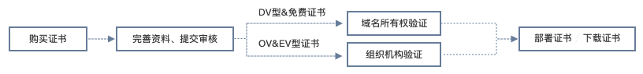
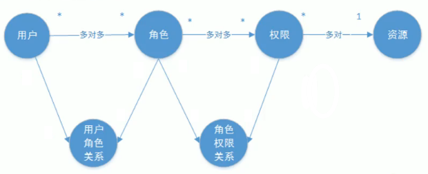
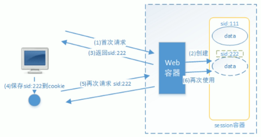

# Network Security Question

## HTTPS相关的问题

- 什么是SSL、TLS、HTTPS X.509？

- SSL只能用在HTTP上吗？

- HTTPS真的安全吗？

- CA

  - CA(Certificate Authority)，是负责签发证书、认证证书、管理已颁发证书的机关。它要制定政策和具体步骤来验证、识别用户身份，并对用户证书进行签名，以确保证书持有者的身份和公钥的拥有权。

    

## 对称加密和非对称加密

- 对称加密
  - DES、AES
  - 凯撒加密(移位算法)
- 非对称加密
  - 需要两个密钥：公开密钥(publickey)和私有密钥(privatekey)，公开密钥与私有密钥是一对，如果用公开密钥对数据进行加密，只有用对应的私有密钥才能解密；如果用私有密钥对数据进行加密，那么只有用对应的公开密钥才能解密。因为加密和解密使用的是两个不同的密钥，所以这种算法叫作非对称加密算法。
  - RSA
    - 使用公钥和私钥的一种进行加密，使用另外一个密钥解密
    - 公钥是使用私钥生成的
- 摘要算法
  - HASH
- 签名算法

## 301、302、307跳转陷阱

- 3XX开头的HTTP状态码都表示重定向的响应。

  | 状态码 | HTTP版本 | 重定向类型 | 其它                                              |
  | ------ | -------- | ---------- | ------------------------------------------------- |
  | 301    | HTTP 1.0 | 永久       | 不允许重定向时改变请求method，很多浏览器未执行    |
  | 302    | HTTP 1.0 | 临时       | 不允许重定向时改变请求method，很多浏览器未执行    |
  | 303    | HTTP 1.1 | 临时       | **允许**重定向时改变请求method，303响应禁止被缓存 |
  | 307    | HTTP 1.1 | 临时       | 不允许重定向时改变请求method                      |
  | 308    | HTTP 1.1 | 永久       | 不允许重定向时改变请求method                      |

- 永久重定向：新网址完全继承旧网址，旧网址的排名等完全清零

  - 301重定向是网页更改地址后对搜索引擎友好的最好方法，只要不是暂时搬移的情况，都建议使用301来做转址。

- 临时重定向：对旧网址没有影响，但新网址不会有排名

## 认证与授权

参考：QLNotes\Coder\Java\Spring Security OAuth2.0_v1.1.pdf

### 基础概念

#### 认证

判断是否是一个合法用户

基于Cookie的认证、基于Session的认证、基于JWT的认证

#### 会话

认证授权之后的请求响应不用每次都认证

#### 授权

一个合法用户是否拥有访问某项资源的权限

#### 权限数据模型

**主体** 对 **资源** 进行 **权限** 操作

资源：功能资源、数据/实体资源

### 类型

#### 基于Session的认证

### 实现框架

#### OAuth

##### OAuth简介

##### OAuth 1.0

##### OAuth 2.0

#### SpringSecurity

#### Shrio

## 会话管理方案

- Shiro
- Spring Security
- SSO CAS
- OAuth 2.0
- JWT

参考：

InternetArchitect\20 架构师三期 SpringCloud微服务架构\分布式系统会话管理

QLNotes\Coder\Java\02_JavaEE\分布式系统会话管理

## 会话安全

- 同源策略
  - 浏览器的保护策略：拒绝JS访问其他域的POST请求
  - 跨域请求处理
- CSRF跨域攻击
  - 基于浏览器多标签共享Cookie的特性的攻击
  - 场景：某个站点读取到已经打开的网银的cookie，sessionid提交到这个站点服务器，完成大量小额转账
  - 解决：cookie+页面隐藏数据提交验证
- DDoS/CC拒绝服务攻击
  - DDoS：Distribution Denial Of Service：分布式拒绝服务攻击：即黑客利用所控制的大量肉鸡在同一时间对同一目标发起请求，使受攻击主机的出口链路堵塞或忙于应付攻击请求，从而无法响应正常的服务，从而形成拒绝服务，又称为“洪水攻击”。
  - CC：Challenge Collapsar：攻击者借助代理服务器生成指向受害主机的合法请求，实现DDOS和伪装；CC主要是用来攻击页面的；
  - **大量半握手请求造成的服务端压力的攻击**
  - 方案：无法彻底解决
    - 硬件防火墙
    - 带宽对冲
    - 服务器软件优化
    - 大数据肉鸡拒绝部分肉机
- 重放攻击
  - XSS重放攻击：用户提交的内容包含脚本的攻击
    - 转义提交即可
  - 流量重放：大量请求造成服务器压力的攻击
    - 请求限制
  - 请求重放：对某些请求重放达到业务不一致的攻击
    - 幂等处理
- HTTPS浏览器数据安全加密原理
  - HTTPS = 非对称加密 + 对称加密
  - 非对称加密 + CA：解决响应结果是真实目标返回的响应，而不是中间某个节点返回的响应
  - 对称加密：解决真实数据传输的加密
- HTTPS + `HTTPDNS` App数据安全
  - `HTTPDNS`用来防止DNS劫持，App使用
- 风控与人机交互

# SSL / TLS

## [HandShakeInSSL&TLS.md](HandShakeInSSL&TLS.md)

