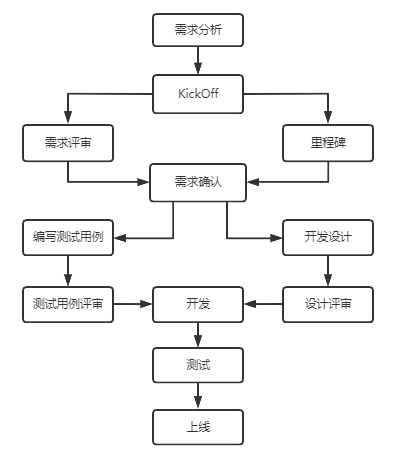

# Project Management Notes

## 项目过程

- 项目启动

  - 项目背景
  - 可行性分析
  - 立项

- 计划阶段

  - 资源计划

    - 人员安排：

      项目管理(高级项目经理+助理)、技术总监、运维、能力层、业务层、产品、安卓、iOS、H5、测试、运营、市场

  - 进度安排

  - 成本估计

  - 质量保证

  - 风险评估：如果做不完怎么办？

    - 加班、加人、先做核心功能，周边功能后面迭代

  - 实施计划

- 实施控制阶段

  

- 收尾

  - 产品验收

## 职责

- 工程设计，接口定义，与相关业务组的沟通，定期代码Review，核心功能开发
- 接口定义
  - 围绕资源设计
  - 版本号
  - Restful
  - 动作
    - post：新增数据、put：修改(修改后的全量数据)、patch：修改(修改哪个传哪个)；delete：删除；get：查询
  - 包名规划
- 工程设计
  - 安全层面：
    1. CIA保密性(Confidentiality)：传输过程加密，[数据脱敏](https://blog.csdn.net/u014553029/article/details/109277618)
    2. 完整性(Integrity)：防篡改
    3. 可用性(Availability)：指保证合法用户对信息和资源的使用不会被不正当地拒绝
  - 数据层面：JSoup、spring-HTMLUtils等特殊字符过滤权限控制
  - 异常处理
    1. Mapper层的异常在Service层打印
    2. 日志的详细规划，工具类
    3. 对外接口层异常全部打包成状态码
  - 方法变量命名规范

## 思考

- 程序员的效率在于产品设计思路是否明确
- 需要给程序员留一些时间：思考系统的优化

## 项目

- 项目开发完成上线试运行期间，由于运维新手的失误，造成部分服务CPU超负荷
  - [accept_mutex与性能的关系 (nginx)](https://www.cnblogs.com/sxhlinux/p/6254396.html)