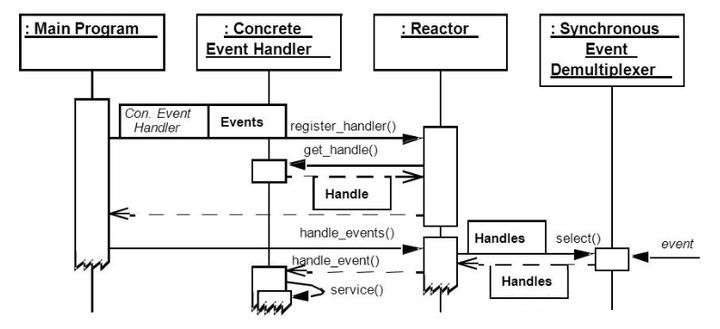
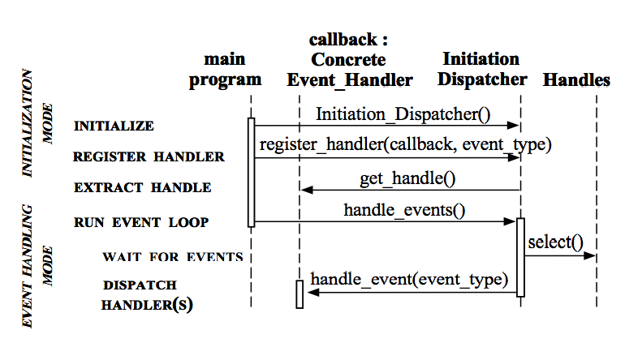
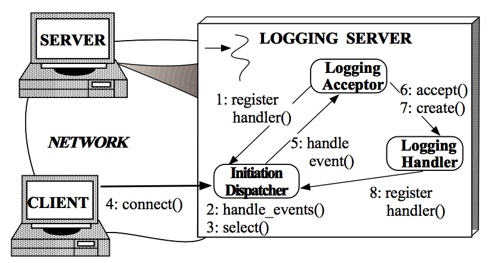
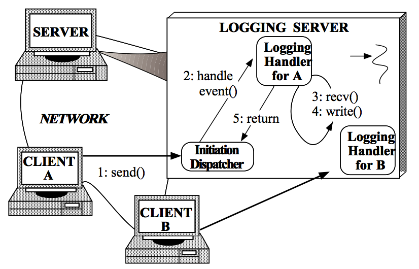
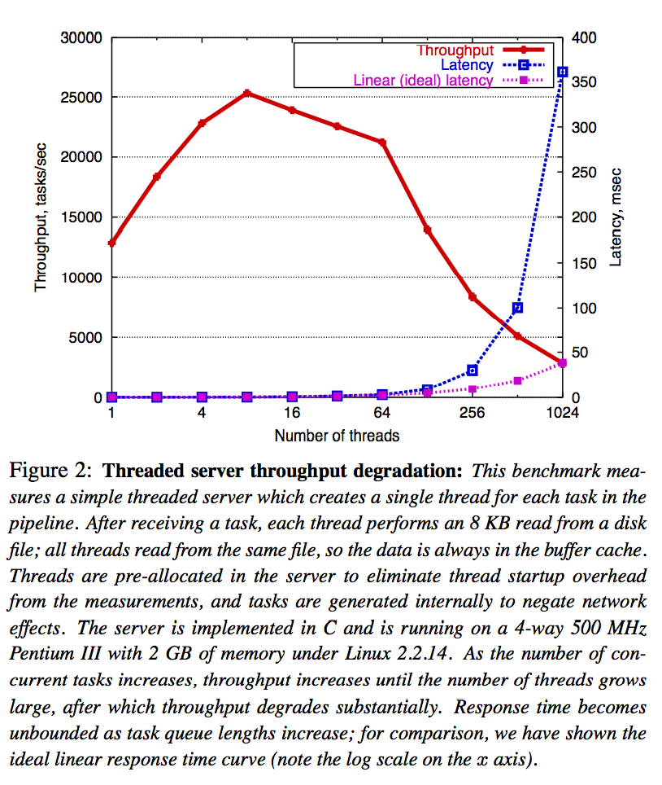
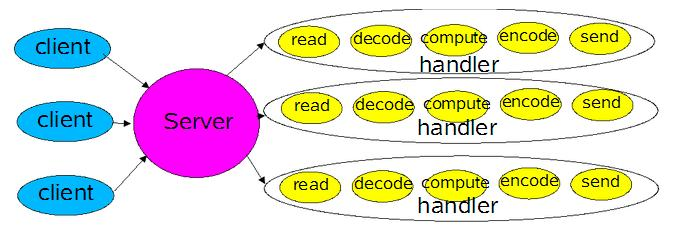
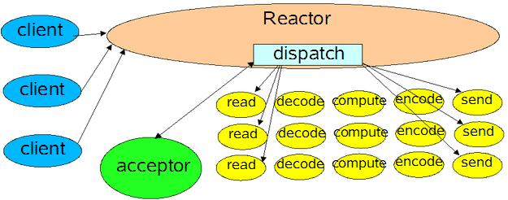
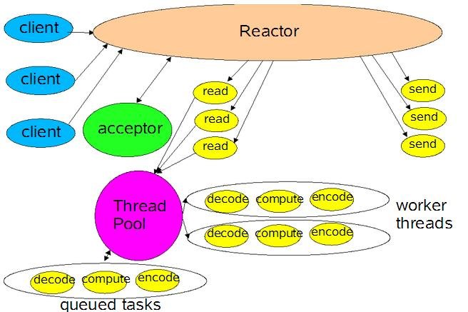
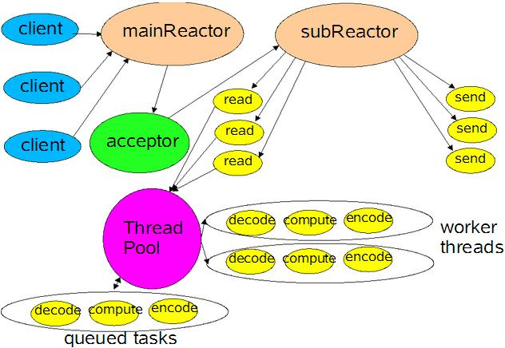

# [Reactor模式详解](http://www.blogjava.net/DLevin/archive/2015/09/02/427045.html)

## 前记

第一次听到Reactor模式是三年前的某个晚上，一个室友突然跑过来问我什么是Reactor模式？我上网查了一下，很多人都是给出NIO中的 Selector的例子，而且就是NIO里Selector多路复用模型，只是给它起了一个比较fancy的名字而已，虽然它引入了EventLoop概 念，这对我来说是新的概念，但是代码实现却是一样的，因而我并没有很在意这个模式。然而最近开始读Netty源码，而Reactor模式是很多介绍Netty的文章中被大肆宣传的模式，因而我再次问自己，什么是Reactor模式？本文就是对这个问题关于我的一些理解和尝试着来解答。



## 什么是Reactor模式

要回答这个问题，首先当然是求助Google或Wikipedia，其中Wikipedia上说：“The reactor design pattern is an event handling pattern for handling service requests delivered concurrently by one or more inputs. The service handler then demultiplexes the incoming requests and dispatches them synchronously to associated request handlers.”。从这个描述中，我们知道Reactor模式首先是**事件驱动的，有一个或多个并发输入源，有一个Service Handler，有多个Request Handlers**；这个Service Handler会同步的将输入的请求（Event）多路复用的分发给相应的Request Handler。如果用图来表达：


从结构上，这有点类似生产者消费者模式，即有一个或多个生产者将事件放入一个Queue中，而一个或多个消费者主动的从这个Queue中Poll事件来处理；而Reactor模式则并没有Queue来做缓冲，每当一个Event输入到Service Handler之后，该Service Handler会主动的根据不同的Event类型将其分发给对应的Request Handler来处理。

更学术的，这篇文章（[Reactor An Object Behavioral Pattern for Demultiplexing and Dispatching Handles for Synchronous Events](http://www.dre.vanderbilt.edu/~schmidt/PDF/reactor-siemens.pdf)）上说：“The Reactor design pattern handles service requests that are delivered concurrently to an application by one or more clients. Each service in an application may consistent of several methods and is represented by a separate event handler that is responsible for dispatching service-specific requests. Dispatching of event handlers is performed by an initiation dispatcher, which manages the registered event handlers. Demultiplexing of service requests is performed by a synchronous event demultiplexer. Also known as **Dispatcher, Notifier**”。这段描述和Wikipedia上的描述类似，有多个输入源，有多个不同的EventHandler（RequestHandler）来处理不同的请求，Initiation Dispatcher用于管理EventHander，EventHandler首先要注册到Initiation Dispatcher中，然后Initiation Dispatcher根据输入的Event分发给注册的EventHandler；然而Initiation Dispatcher并不监听Event的到来，这个工作交给Synchronous Event Demultiplexer来处理。

## Reactor模式结构

在解决了什么是Reactor模式后，我们来看看Reactor模式是由什么模块构成。图是一种比较简洁形象的表现方式，因而先上一张图来表达各个模块的名称和他们之间的关系：

**Handle：**即操作系统中的句柄，是对资源在操作系统层面上的一种抽象，它可以是打开的文件、一个连接(Socket)、Timer等。由于Reactor模式一般使用在网络编程中，因而这里一般指Socket Handle，即一个网络连接（Connection，在Java NIO中的Channel）。这个Channel注册到Synchronous Event Demultiplexer中，以监听Handle中发生的事件，对ServerSocketChannnel可以是CONNECT事件，对SocketChannel可以是READ、WRITE、CLOSE事件等。
**Synchronous Event Demultiplexer：**阻塞等待一系列的Handle中的事件到来，如果阻塞等待返回，即表示在返回的Handle中可以不阻塞的执行返回的事件类型。这个模块一般使用操作系统的select来实现。在Java NIO中用Selector来封装，当Selector.select()返回时，可以调用Selector的selectedKeys()方法获取Set\<SelectionKey\>，一个SelectionKey表达一个有事件发生的Channel以及该Channel上的事件类型。上图的"Synchronous Event Demultiplexer ---notifies--> Handle"的流程如果是对的，那内部实现应该是select()方法在事件到来后会先设置Handle的状态，然后返回。不了解内部实现机制，因而保留原图。
**Initiation Dispatcher：**用于管理Event Handler，即EventHandler的容器，用以注册、移除EventHandler等；另外，它还作为Reactor模式的入口调用Synchronous Event Demultiplexer的select方法以阻塞等待事件返回，当阻塞等待返回时，根据事件发生的Handle将其分发给对应的Event Handler处理，即回调EventHandler中的handle_event()方法。
**Event Handler：**定义事件处理方法：handle_event()，以供InitiationDispatcher回调使用。
**Concrete Event Handler：**事件EventHandler接口，实现特定事件处理逻辑。

## Reactor模式模块之间的交互

简单描述一下Reactor各个模块之间的交互流程，先从序列图开始：


1. 初始化InitiationDispatcher，并初始化一个Handle到EventHandler的Map。
2. 注册EventHandler到InitiationDispatcher中，每个EventHandler包含对相应Handle的引用，从而建立Handle到EventHandler的映射（Map）。
3. 调用InitiationDispatcher的handle_events()方法以启动Event Loop。在Event Loop中，调用select()方法（Synchronous Event Demultiplexer）阻塞等待Event发生。
4. 当某个或某些Handle的Event发生后，select()方法返回，InitiationDispatcher根据返回的Handle找到注册的EventHandler，并回调该EventHandler的handle_events()方法。
5. 在EventHandler的handle_events()方法中还可以向InitiationDispatcher中注册新的Eventhandler，比如对AcceptorEventHandler来，当有新的client连接时，它会产生新的EventHandler以处理新的连接，并注册到InitiationDispatcher中。

## Reactor模式实现

在[Reactor An Object Behavioral Pattern for Demultiplexing and Dispatching Handles for Synchronous Events](http://www.dre.vanderbilt.edu/~schmidt/PDF/reactor-siemens.pdf)中，一直以Logging Server来分析Reactor模式，这个Logging Server的实现完全遵循这里对Reactor描述，因而放在这里以做参考。Logging Server中的Reactor模式实现分两个部分：Client连接到Logging Server和Client向Logging Server写Log。因而对它的描述分成这两个步骤。
**Client连接到Logging Server**

1. Logging Server注册LoggingAcceptor到InitiationDispatcher。
2. Logging Server调用InitiationDispatcher的handle_events()方法启动。
3. InitiationDispatcher内部调用select()方法（Synchronous Event Demultiplexer），阻塞等待Client连接。
4. Client连接到Logging Server。
5. InitiationDisptcher中的select()方法返回，并通知LoggingAcceptor有新的连接到来。
6. LoggingAcceptor调用accept方法accept这个新连接。
7. LoggingAcceptor创建新的LoggingHandler。
8. 新的LoggingHandler注册到InitiationDispatcher中(同时也注册到Synchonous Event Demultiplexer中)，等待Client发起写log请求。

**Client向Logging Server写Log**

1. Client发送log到Logging server。
2. InitiationDispatcher监测到相应的Handle中有事件发生，返回阻塞等待，根据返回的Handle找到LoggingHandler，并回调LoggingHandler中的handle_event()方法。
3. LoggingHandler中的handle_event()方法中读取Handle中的log信息。
4. 将接收到的log写入到日志文件、数据库等设备中。
5. 4步骤循环直到当前日志处理完成。
6. 返回到InitiationDispatcher等待下一次日志写请求。

在[Reactor An Object Behavioral Pattern for Demultiplexing and Dispatching Handles for Synchronous Events](http://www.dre.vanderbilt.edu/~schmidt/PDF/reactor-siemens.pdf)有对Reactor模式的C++的实现版本，多年不用C++，因而略过。 

## Java NIO对Reactor的实现

在Java的NIO中，对Reactor模式有无缝的支持，即使用Selector类封装了操作系统提供的Synchronous Event Demultiplexer功能。这个Doug Lea已经在[Scalable IO In Java](http://gee.cs.oswego.edu/dl/cpjslides/nio.pdf)中有非常深入的解释了，因而不再赘述，另外[这篇文章](http://www.cnblogs.com/luxiaoxun/archive/2015/03/11/4331110.html)对Doug Lea的[Scalable IO In Java](http://gee.cs.oswego.edu/dl/cpjslides/nio.pdf)有一些简单解释，至少它的代码格式比Doug Lea的PPT要整洁一些。

需要指出的是，不同这里使用InitiationDispatcher来管理EventHandler，在Doug Lea的版本中使用SelectionKey中的Attachment来存储对应的EventHandler，因而不需要注册EventHandler这个步骤，或者设置Attachment就是这里的注册。而且在这篇文章中，Doug Lea从单线程的Reactor、Acceptor、Handler实现这个模式出发；演化为将Handler中的处理逻辑多线程化，实现类似Proactor模式，此时所有的IO操作还是单线程的，因而再演化出一个Main Reactor来处理CONNECT事件(Acceptor)，而多个Sub Reactor来处理READ、WRITE等事件(Handler)，这些Sub Reactor可以分别再自己的线程中执行，从而IO操作也多线程化。这个最后一个模型正是Netty中使用的模型。并且在[Reactor An Object Behavioral Pattern for Demultiplexing and Dispatching Handles for Synchronous Events](http://www.dre.vanderbilt.edu/~schmidt/PDF/reactor-siemens.pdf)的9.5 Determine the Number of Initiation Dispatchers in an Application中也有相应的描述。

## EventHandler接口定义

对EventHandler的定义有两种设计思路：single-method设计和multi-method设计：
**A single-method interface：**它将Event封装成一个Event Object，EventHandler只定义一个handle_event(Event event)方法。这种设计的好处是有利于扩展，可以后来方便的添加新的Event类型，然而在子类的实现中，需要判断不同的Event类型而再次扩展成 不同的处理方法，从这个角度上来说，它又不利于扩展。另外在Netty3的使用过程中，由于它不停的创建ChannelEvent类，因而会引起GC的不稳定。
**A multi-method interface：**这种设计是将不同的Event类型在 EventHandler中定义相应的方法。这种设计就是Netty4中使用的策略，其中一个目的是避免ChannelEvent创建引起的GC不稳定， 另外一个好处是它可以避免在EventHandler实现时判断不同的Event类型而有不同的实现，然而这种设计会给扩展新的Event类型时带来非常 大的麻烦，因为它需要该接口。

关于Netty4对Netty3的改进可以参考[这里](http://netty.io/wiki/new-and-noteworthy-in-4.0.html)：

**ChannelHandler with no event object**

In 3.x, every I/O operation created a `ChannelEvent` object. For each read / write, it additionally created a new `ChannelBuffer`. It simplified the internals of Netty quite a lot because it delegates resource management and buffer pooling to the JVM. However, it often was the root cause of GC pressure and uncertainty which are sometimes observed in a Netty-based application under high load.

4.0 removes event object creation almost completely by replacing the event objects with strongly typed method invocations. 3.x had catch-all event handler methods such as `handleUpstream()` and `handleDownstream()`, but this is not the case anymore. Every event type has its own handler method now:

## 为什么使用Reactor模式

归功与Netty和Java NIO对Reactor的宣传，本文慕名而学习的Reactor模式，因而已经默认Reactor具有非常优秀的性能，然而慕名归慕名，到这里，我还是要不得不问自己Reactor模式的好处在哪里？即为什么要使用这个Reactor模式？在[Reactor An Object Behavioral Pattern for Demultiplexing and Dispatching Handles for Synchronous Events](http://www.dre.vanderbilt.edu/~schmidt/PDF/reactor-siemens.pdf)中是这么说的：

**Reactor Pattern优点**

**Separation of concerns:** The Reactor pattern decouples application-independent demultiplexing and dispatching mechanisms from application-specific hook method functionality. The application-independent mechanisms become reusable components that know how to demultiplex events and dispatch the appropriate hook methods defined by Event Handlers. In contrast, the application-specific functionality in a hook method knows how to perform a particular type of service.

**Improve modularity, reusability, and configurability of event-driven applications:** The pattern decouples application functionality into separate classes. For instance, there are two separate classes in the logging server: one for establishing connections and another for receiving and processing logging records. This decoupling enables the reuse of the connection establishment class for different types of connection-oriented services (such as file transfer, remote login, and video-on-demand). Therefore, modifying or extending the functionality of the logging server only affects the implementation of the logging handler class.

**Improves application portability:** The Initiation Dispatcher’s interface can be reused independently of the OS system calls that perform event demultiplexing. These system calls detect and report the occurrence of one or more events that may occur simultaneously on multiple sources of events. Common sources of events may in- clude I/O handles, timers, and synchronization objects. On UNIX platforms, the event demultiplexing system calls are called select and poll [1]. In the Win32 API [16], the WaitForMultipleObjects system call performs event demultiplexing.

**Provides coarse-grained concurrency control:** The Reactor pattern serializes the invocation of event handlers at the level of event demultiplexing and dispatching within a process or thread. Serialization at the Initiation Dispatcher level often eliminates the need for more complicated synchronization or locking within an application process.

这些貌似是很多模式的共性：解耦、提升复用性、模块化、可移植性、事件驱动、细力度的并发控制等，因而并不能很好的说明什么，特别是它鼓吹的对性能的提升，这里并没有体现出来。当然在这篇文章的开头有描述过另一种直观的实现：Thread-Per-Connection，即传统的实现，提到了这个传统实现的以下问题：

**Thread Per Connection缺点**

**Efficiency:** Threading may lead to poor performance due to context switching, synchronization, and data movement [2];

**Programming simplicity:** Threading may require complex concurrency control schemes;

**Portability:** Threading is not available on all OS platforms.

对于性能，它其实就是第一点关于Efficiency的描述，即线程的切换、同步、数据的移动会引起性能问题。也就是说从性能的角度上，它最大的提升就是减少了性能的使用，即不需要每个Client对应一个线程。我的理解，其他业务逻辑处理很多时候也会用到相同的线程，IO读写操作相对CPU的操作还是要慢很多，即使Reactor机制中每次读写已经能保证非阻塞读写，这里可以减少一些线程的使用，但是这减少的线程使用对性能有那么大的影响吗？答案貌似是肯定的，这篇论文([SEDA: Staged Event-Driven Architecture - An Architecture for Well-Conditioned, Scalable Internet Service](http://www.eecs.harvard.edu/~mdw/papers/seda-sosp01.pdf))对随着线程的增长带来性能降低做了一个统计：



在这个统计中，每个线程从磁盘中读8KB数据，每个线程读同一个文件，因而数据本身是缓存在操作系统内部的，即减少IO的影响；所有线程是事先分配的，不会有线程启动的影响；所有任务在测试内部产生，因而不会有网络的影响。该统计数据运行环境：Linux 2.2.14，2GB内存，4-way 500MHz Pentium III。从图中可以看出，随着线程的增长，吞吐量在线程数为8个左右的时候开始线性下降，并且到64个以后而迅速下降，其相应事件也在线程达到256个后指数上升。即1+1<2，因为线程切换、同步、数据移动会有性能损失，线程数增加到一定数量时，这种性能影响效果会更加明显。

对于这点，还可以参考[C10K Problem](https://en.wikipedia.org/wiki/C10k_problem)，用以描述同时有10K个Client发起连接的问题，到2010年的时候已经出现10M Problem了。

当然也有人说：[Threads are expensive are no longer valid](http://cometdaily.com/2008/11/21/are-raining-comets-and-threads/).在不久的将来可能又会发生不同的变化，或者这个变化正在、已经发生着？没有做过比较仔细的测试，因而不敢随便断言什么，然而本人观点，即使线程变的影响并没有以前那么大，使用Reactor模式，甚至时SEDA模式来减少线程的使用，再加上其他解耦、模块化、提升复用性等优点，还是值得使用的。

## Reactor模式的缺点

Reactor模式的缺点貌似也是显而易见的：

1. 相比传统的简单模型，Reactor增加了一定的复杂性，因而有一定的门槛，并且不易于调试。
2. Reactor模式需要底层的Synchronous Event Demultiplexer支持，比如Java中的Selector支持，操作系统的select系统调用支持，如果要自己实现Synchronous Event Demultiplexer可能不会有那么高效。
3. Reactor模式在IO读写数据时还是在同一个线程中实现的，即使使用多个Reactor机制的情况下，那些共享一个Reactor的Channel如果出现一个长时间的数据读写，会影响这个Reactor中其他Channel的相应时间，比如在大文件传输时，IO操作就会影响其他Client的相应时间，因而对这种操作，使用传统的Thread-Per-Connection或许是一个更好的选择，或则此时使用Proactor模式。

## 参考

[Reactor Pattern WikiPedia](https://en.wikipedia.org/wiki/Reactor_pattern#cite_ref-1)
[Reactor An Object Behavioral Pattern for Demultiplexing and Dispatching Handles for Synchronous Events](http://www.dre.vanderbilt.edu/~schmidt/PDF/reactor-siemens.pdf)
[Scalable IO In Java](http://gee.cs.oswego.edu/dl/cpjslides/nio.pdf)
[C10K Problem WikiPedia](https://en.wikipedia.org/wiki/C10k_problem)

# [Scalable IO in Java 笔记](https://www.cnblogs.com/luxiaoxun/p/4331110.html)

## **Scalable IO in Java**

http://gee.cs.oswego.edu/dl/cpjslides/nio.pdf

基本上所有的网络处理程序都有以下基本的处理过程:
Read request
Decode request
Process service
Encode reply
Send reply

## **Classic Service Designs**



简单的代码实现：

```java
class Server implements Runnable {
    public void run() {
        try {
            ServerSocket ss = new ServerSocket(PORT);
            while (!Thread.interrupted())
            new Thread(new Handler(ss.accept())).start(); //创建新线程来handle
            // or, single-threaded, or a thread pool
        } catch (IOException ex) { /* ... */ }
    }
    
    static class Handler implements Runnable {
        final Socket socket;
        Handler(Socket s) { socket = s; }
        public void run() {
            try {
                byte[] input = new byte[MAX_INPUT];
                socket.getInputStream().read(input);
                byte[] output = process(input);
                socket.getOutputStream().write(output);
            } catch (IOException ex) { /* ... */ }
        }       
        private byte[] process(byte[] cmd) { /* ... */ }
    }
}
```

对于每一个请求都分发给一个线程，每个线程中都独自处理上面的流程。

这种模型由于IO在阻塞时会一直等待，因此在用户负载增加时，性能下降的非常快。

server导致阻塞的原因：

1、serversocket的accept方法，阻塞等待client连接，直到client连接成功。

2、线程从socket inputstream读入数据，会进入阻塞状态，直到全部数据读完。

3、线程向socket outputstream写入数据，会阻塞直到全部数据写完。

client导致阻塞的原因：

1、client建立连接时会阻塞，直到连接成功。

2、线程从socket输入流读入数据，如果没有足够数据读完会进入阻塞状态，直到有数据或者读到输入流末尾。

3、线程从socket输出流写入数据，直到输出所有数据。

4、socket.setsolinger()设置socket的延迟时间，当socket关闭时，会进入阻塞状态，直到全部数据都发送完或者超时。

改进：采用基于事件驱动的设计，当有事件触发时，才会调用处理器进行数据处理。

## **Basic Reactor Design**



代码实现：

```java
class Reactor implements Runnable { 
    
    final Selector selector;
    final ServerSocketChannel serverSocket;
    //Reactor初始化
    Reactor(int port) throws IOException { 
        selector = Selector.open();
        serverSocket = ServerSocketChannel.open();
        serverSocket.socket().bind(new InetSocketAddress(port));
        //非阻塞
        serverSocket.configureBlocking(false); 
        //分步处理,第一步,接收accept事件
        // SelectionKey可以理解为一种事件，一共四种OP_READ、OP_WRITE、OP_CONNECT、OP_ACCEPT
        SelectionKey sk = serverSocket.register(selector, SelectionKey.OP_ACCEPT); 
        // 给这个事件绑定对应的事件处理器，用于事件发生的时候的回调
        sk.attach(new AcceptEventHandler());
    }
    
    public void run() { 
        try {
            while (!Thread.interrupted()) {
                selector.select();
                // selector.keys 返回当前所有注册在selector中channel的selectionKey
                // selector.selectedKeys() 
                //   返回注册在selector中等待IO操作(及有事件发生)channel的selectionKey
                Set waittingKeys = selector.selectedKeys();
                Iterator it = waittingKeys.iterator();
                while (it.hasNext()) {
                    //Reactor负责dispatch收到的事件
                    dispatch((SelectionKey)(it.next()); 
                }
                waittingKeys.clear();
            }
        } catch (IOException ex) { /* ... */ }
    }
    
    void dispatch(SelectionKey k) {
        Runnable r = (Runnable)(k.attachment());
        // 调用之前注册的callback对象
        if (r != null) r.run();
    }
    
    class AcceptEventHandler implements Runnable { // inner
        public void run() {
            try {
                SocketChannel c = serverSocket.accept();
                if (c != null) new Handler(selector, c);
            }
            catch(IOException ex) { /* ... */ }
        }
    }
}

final class Handler implements Runnable {
    final SocketChannel socket;
    final SelectionKey sk;
    ByteBuffer input = ByteBuffer.allocate(MAXIN);
    ByteBuffer output = ByteBuffer.allocate(MAXOUT);
    static final int READING = 0, SENDING = 1;
    int state = READING;
    
    Handler(Selector sel, SocketChannel c) throws IOException {
        socket = c; c.configureBlocking(false);
        // Optionally try first read now
        sk = socket.register(sel, 0);
        sk.attach(this); //将Handler作为callback对象
        sk.interestOps(SelectionKey.OP_READ); //第二步,接收Read事件
        sel.wakeup();
    }
    boolean inputIsComplete() { /* ... */ }
    boolean outputIsComplete() { /* ... */ }
    void process() { /* ... */ }
    
    public void run() {
        try {
            if (state == READING) read();
            else if (state == SENDING) send();
        } catch (IOException ex) { /* ... */ }
    }
    
    void read() throws IOException {
        socket.read(input);
        if (inputIsComplete()) {
            process();
            state = SENDING;
            // Normally also do first write now
            sk.interestOps(SelectionKey.OP_WRITE); //第三步,接收write事件
        }
    }
    void send() throws IOException {
        socket.write(output);
        if (outputIsComplete()) sk.cancel(); //write完就结束了, 关闭select key
    }
}

//上面 的实现用Handler来同时处理Read和Write事件, 所以里面出现状态判断
//我们可以用State-Object pattern来更优雅的实现
class Handler { // ...
    public void run() { // initial state is reader
        socket.read(input);
        if (inputIsComplete()) {
            process();
            sk.attach(new Sender());  //状态迁移, Read后变成write, 用Sender作为新的callback对象
            sk.interest(SelectionKey.OP_WRITE);
            sk.selector().wakeup();
        }
    }
    class Sender implements Runnable {
        public void run(){ // ...
            socket.write(output);
            if (outputIsComplete()) sk.cancel();
        }
    }
}
```

这里用到了Reactor模式。

关于Reactor模式的一些概念：

Reactor：负责响应IO事件，当检测到一个新的事件，将其发送给相应的Handler去处理。

Handler：负责处理非阻塞的行为，标识系统管理的资源；同时将handler与事件绑定。

Reactor为单个线程，需要处理accept连接，同时发送请求到处理器中。

由于只有单个线程，所以处理器中的业务需要能够快速处理完。

改进：使用多线程处理业务逻辑。

## **Worker Thread Pools**



参考代码：

```java
class Handler implements Runnable {
    // uses util.concurrent thread pool
    static PooledExecutor pool = new PooledExecutor(...);
    static final int PROCESSING = 3;
    // ...
    synchronized void read() { // ...
        socket.read(input);
        if (inputIsComplete()) {
            state = PROCESSING;
            pool.execute(new Processer()); //使用线程pool异步执行
        }
    }
    
    synchronized void processAndHandOff() {
        process();
        state = SENDING; // or rebind attachment
        sk.interest(SelectionKey.OP_WRITE); //process完,开始等待write事件
    }
    
    class Processer implements Runnable {
        public void run() { processAndHandOff(); }
    }
}
```

将处理器的执行放入线程池，多线程进行业务处理。但Reactor仍为单个线程。

继续改进：对于多个CPU的机器，为充分利用系统资源，将Reactor拆分为两部分。

## **Using Multiple Reactors**




参考代码：

```java
Selector[] selectors; //subReactors集合, 一个selector代表一个subReactor
int next = 0;
class Acceptor { // ...
    public synchronized void run() { ...
        Socket connection = serverSocket.accept(); //主selector负责accept
        if (connection != null)
            new Handler(selectors[next], connection); //选个subReactor去负责接收到的connection
        if (++next == selectors.length) next = 0;
    }
}
```

mainReactor负责监听连接，accept连接给subReactor处理，为什么要单独分一个Reactor来处理监听呢？因为像TCP这样需要经过3次握手才能建立连接，这个建立连接的过程也是要耗时间和资源的，单独分一个Reactor来处理，可以提高性能。

 

参考：

http://www.cnblogs.com/fxjwind/p/3363329.html

 

作者：[阿凡卢](http://www.cnblogs.com/luxiaoxun/)

出处：http://www.cnblogs.com/luxiaoxun/

本文版权归作者所有，欢迎转载，但未经作者同意必须保留此段声明，且在文章页面明显位置给出原文连接，否则保留追究法律责任的权利。