# 线上事故记录

## 记录一次Metaspace OOM的问题

[记录一次Metaspace OOM的问题](https://blog.csdn.net/lbh199466/article/details/105555488)

事件
4.13号测试部署的服务突然爆oom异常

第一次OOM异常如下：

```
2020-04-14 14:42:43.092 - - [ERROR] Druid-ConnectionPool-Create-755299134 DruidDataSource  (DruidDataSource.java:2699) create connection SQLException, url: jdbc:mysql://10.24.65.26:4000/trade_event?characterEncoding=UTF8&socketTimeout=60000&allowMultiQueries=true, errorCode 0, state S1000
java.sql.SQLException: java.lang.OutOfMemoryError: Metaspace
        at com.mysql.jdbc.SQLError.createSQLException(SQLError.java:964) ~[mysql-connector-java-5.1.44.jar!/:5.1.44]
        at com.mysql.jdbc.SQLError.createSQLException(SQLError.java:897) ~[mysql-connector-java-5.1.44.jar!/:5.1.44]
        at com.mysql.jdbc.SQLError.createSQLException(SQLError.java:886) ~[mysql-connector-java-5.1.44.jar!/:5.1.44]
        at com.mysql.jdbc.SQLError.createSQLException(SQLError.java:860) ~[mysql-connector-java-5.1.44.jar!/:5.1.44]
        at com.mysql.jdbc.SQLError.createSQLException(SQLError.java:877) ~[mysql-connector-java-5.1.44.jar!/:5.1.44]
        at com.mysql.jdbc.SQLError.createSQLException(SQLError.java:873) ~[mysql-connector-java-5.1.44.jar!/:5.1.44]
        at com.mysql.jdbc.Util.handleNewInstance(Util.java:443) ~[mysql-connector-java-5.1.44.jar!/:5.1.44]
        at com.mysql.jdbc.ConnectionImpl.getInstance(ConnectionImpl.java:389) ~[mysql-connector-java-5.1.44.jar!/:5.1.44]
        at com.mysql.jdbc.NonRegisteringDriver.connect(NonRegisteringDriver.java:330) ~[mysql-connector-java-5.1.44.jar!/:5.1.44]
        at com.alibaba.druid.pool.DruidAbstractDataSource.createPhysicalConnection(DruidAbstractDataSource.java:1596) ~[druid-1.1.18.jar!/:1.1.18]
        at com.alibaba.druid.pool.DruidAbstractDataSource.createPhysicalConnection(DruidAbstractDataSource.java:1662) ~[druid-1.1.18.jar!/:1.1.18]
        at com.alibaba.druid.pool.DruidDataSource$CreateConnectionThread.run(DruidDataSource.java:2697) [druid-1.1.18.jar!/:1.1.18]
Caused by: java.lang.OutOfMemoryError: Metaspace
2020-04-14 14:42:44.943 - - [ERROR] Druid-ConnectionPool-Create-755299134 DruidDataSource  (DruidDataSource.java:2699) create connection SQLException, url: jdbc:mysql://10.24.65.26:4000/trade_event?characterEncoding=UTF8&socketTimeout=60000&allowMultiQueries=true, errorCode 0, state S1000
java.sql.SQLException: java.lang.OutOfMemoryError: Metaspace
        at com.mysql.jdbc.SQLError.createSQLException(SQLError.java:964) ~[mysql-connector-java-5.1.44.jar!/:5.1.44]
        at com.mysql.jdbc.SQLError.createSQLException(SQLError.java:897) ~[mysql-connector-java-5.1.44.jar!/:5.1.44]
        at com.mysql.jdbc.SQLError.createSQLException(SQLError.java:886) ~[mysql-connector-java-5.1.44.jar!/:5.1.44]
        at com.mysql.jdbc.SQLError.createSQLException(SQLError.java:860) ~[mysql-connector-java-5.1.44.jar!/:5.1.44]
        at com.mysql.jdbc.SQLError.createSQLException(SQLError.java:877) ~[mysql-connector-java-5.1.44.jar!/:5.1.44]
        at com.mysql.jdbc.SQLError.createSQLException(SQLError.java:873) ~[mysql-connector-java-5.1.44.jar!/:5.1.44]
        at com.mysql.jdbc.Util.handleNewInstance(Util.java:443) ~[mysql-connector-java-5.1.44.jar!/:5.1.44]
        at com.mysql.jdbc.ConnectionImpl.getInstance(ConnectionImpl.java:389) ~[mysql-connector-java-5.1.44.jar!/:5.1.44]
        at com.mysql.jdbc.NonRegisteringDriver.connect(NonRegisteringDriver.java:330) ~[mysql-connector-java-5.1.44.jar!/:5.1.44]
        at com.alibaba.druid.pool.DruidAbstractDataSource.createPhysicalConnection(DruidAbstractDataSource.java:1596) ~[druid-1.1.18.jar!/:1.1.18]
        at com.alibaba.druid.pool.DruidAbstractDataSource.createPhysicalConnection(DruidAbstractDataSource.java:1662) ~[druid-1.1.18.jar!/:1.1.18]
        at com.alibaba.druid.pool.DruidDataSource$CreateConnectionThread.run(DruidDataSource.java:2697) [druid-1.1.18.jar!/:1.1.18]
```

分析
1、Metaspace区域的oom 多考虑
	1）类重复加载
	2）加载的class过大
	3）类加载器过多导致Metaspace碎片化严重

2、将oom时的内存快照dump下来，使用MAT或者visualvm进行分析，确实有很多类被加载了

3、分析gc日志，由于metaspace太小 导致频繁fullgc

4、查看线上对JVM的监控

​	查看从部署到OOM期间 fullGC次数、metaspace使用情况
​	结合突增的时间点查看当时的rpc请求、MQ消费等

5、新增两个JVM参数 -XX:+TraceClassLoading -XX:+TraceClassUnloading，观察是什么类创建比较频繁
	但是log4j std.log并没有打印出来，需要将结果输出出来

​	形如这种参数： java -XX:+TraceClassLoading -jar demo-0.0.1-SNAPSHOT.jar > /Users/detail.log

​	将控制台信息输出到detail.log

​	而项目中的脚本是这样的 java [jvm参数] -jar xx.jar 2>&1 ，需要改动一下

6、对有改动的代码进行压测 看是否能复现
	暂时没有复现

​	2021-05-24 更新：
​	使用了新的分析工具Jprofile对之前的内存文件进行分析
​	可以进行引用源头分析

总结
1、-XX:MetaspaceSize参数
	这个参数的含义是 当Metaspace的使用达到size值时，会触发fullgc。
	所以这个值如果太小，在项目启动的时候加载的类太多，就会fullgc，导致启动变慢

2、对于项目确实要加载很多类的情形，需要根据实际情况设置
	-XX：MaxMetaspaceSize

3、-XX:+UnlockDiagnosticVMOptions,方便后续对JVM情况观察

```
jcmd 238794  GC.class_stats
238794:
GC.class_stats command requires -XX:+UnlockDiagnosticVMOptions
```

Unlocks the options intended for diagnosing the JVM. By default, this option is disabled and diagnostic options are not available.

From: https://docs.oracle.com/javase/8/docs/technotes/tools/unix/java.html

## 记一次由Arthas引起的Metaspace OOM问题

https://zhuanlan.zhihu.com/p/339443341

### 作者：闲鱼技术——萤音[Improve Metaspace reporting](https://link.zhihu.com/?target=https%3A//bugs.openjdk.java.net/browse/JDK-8201572)作者：闲鱼技术——萤音

> 如无特殊说明，本文默认基于以下环境叙述：
> JDK: OpenJDK 14GA
> macOS 10.15
> Arthas 3.3.9
> VisualVM 2.0.2
> 从Arthas 3.4.2开始，此问题已经被修复。感谢Arthas团队对此问题的重视。

### 背景

Arthas是一款由阿里巴巴开源的Java应用程序诊断工具，它功能强大，且不需要对原有的应用做任何改动，即可帮助开发者全方位地观测Java应用程序的运行状态，特别是在线上服务不便于调试，问题复现概率低的场景下极大地方便了开发人员的调试工作，因此深受集团内外的开发者喜爱，笔者在工作中也经常使用Arthas帮助定位一些服务运行过程中的问题。

今年8月中旬，在工作中需要使用Arthas的trace命令统计一个有大量get set及多种接口调用的巨大方法，执行trace命令后，Arthas迟迟没有显示命令调用成功的提示，同时连接Arthas的终端失去了响应。尝试重新连接Arthas，再次进行trace，结果却弹出了trace失败的提示:

```text
Enhance error! exception: java.lang.InternalError
error happens when enhancing class: null, check arthas log: /path/to/server-log/arthas.log
```

于是查看服务器上的Arthas运行日志，发现日志中有以下的异常堆栈:

```text
java.lang.InternalError: null
    at sun.instrument.InstrumentationImpl.retransformClasses0(Native Method)
    at sun.instrument.InstrumentationImpl.retransformClasses(InstrumentationImpl.java:144)
    at com.taobao.arthas.core.advisor.Enhancer.enhance(Enhancer.java:368)
    at com.taobao.arthas.core.command.monitor200.EnhancerCommand.enhance(EnhancerCommand.java:149)
    at com.taobao.arthas.core.command.monitor200.EnhancerCommand.process(EnhancerCommand.java:96)
    at com.taobao.arthas.core.shell.command.impl.AnnotatedCommandImpl.process(AnnotatedCommandImpl.java:82)
    at com.taobao.arthas.core.shell.command.impl.AnnotatedCommandImpl.access$100(AnnotatedCommandImpl.java:18)
    at com.taobao.arthas.core.shell.command.impl.AnnotatedCommandImpl$ProcessHandler.handle(AnnotatedCommandImpl.java:111)
// ...
```

几乎同时，笔者收到了监控平台发出的目标机器Metaspace OOM的告警，查看服务器监控面板，发现当前JVM的Metaspace已经爆满。回到开发环境，再次尝试了几次相同操作，竟然是稳定复现Metaspace OOM。于是开始着手排查这个问题。

### 问题分析

初窥Metaspace结构

目标应用运行在集团基于OpenJDK 8深度定制的AliJDK上，查阅相关文档知，它和普通的OpenJDK一样，Metaspace是实现为堆外内存，因此传统的Dump heap分析前后堆内对象数量变化的思路便行不通了，只能先从Metaspace的存储结构入手分析。

Metaspace 主要分为Non-Class space和Class space两部分。他们的作用分别如下所示:

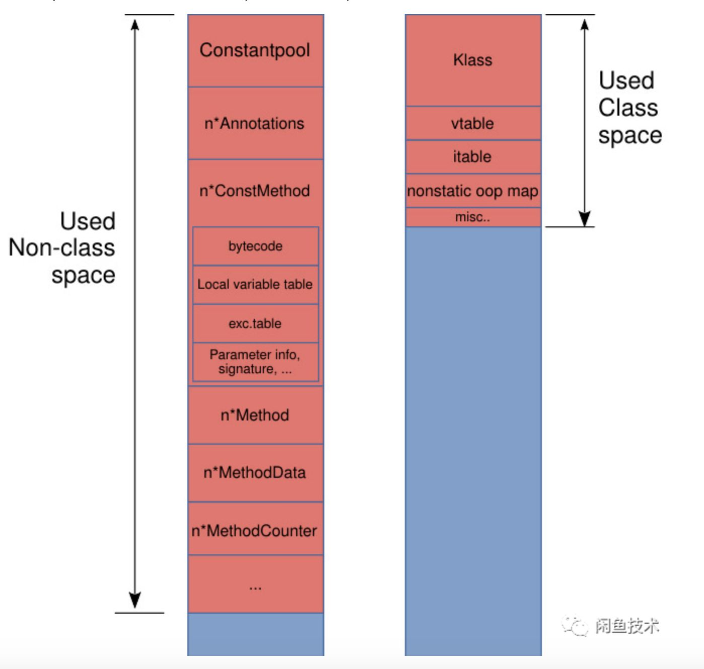


- Class space

存放Klass对象、vtable, itable, 以及记录类中非静态成员引用对象的地址的Map，等等。

- Klass对象是Java的类在JVM层次的运行时数据结构，当类被加载的时候，会产生一个描述当前类的InstanceKlass对象，这些Klass对象会保存在Metaspace的Class space区域。在Java对象的对象头中有指向对象所属类的Klass对象的指针。
- vtable 是为了实现Java中的虚分派功能而存在。HotSpot把Java中的方法都抽象成了`Method`对象，`InstanceKlass`中的成员属性`_methods`就保存了当前类所有方法对应的`Method`实例。HotSpot并没有显式地把虚函数表设计为`Klass`的field，而是提供了一个虚函数表视图。在`.class`文件被解析的过程中会计算vtable的大小，在类被连接的时候会真正产生出vtable。
- itable 记录的是当一个类有实现接口时，接口方法在vtable中的偏移量。在`.class`文件被解析的过程中会计算itable的大小，在类被连接的时候会真正产生出itable。


- Non-class Space

这个区域有很多的东西，下面这些占用了最多的空间：

- 常量池，可变大小（**注意是class文件中的常量池的结构化表示，而不是运行时的String常量**）；
- 每个成员方法的 Metadata：ConstMethod 结构，包含了好几个可变大小的内部结构，如方法字节码、局部变量表、异常表、参数信息、方法签名等；
- 运行时数据，用来控制 JIT 的行为；
- 注解数据等等

#### 查看诊断命令输出

了解Metaspace中主要存储的数据后，便可以使用诊断命令去查看Metaspace的内存占用情况。

对于JDK 8，可以使用命令

```text
jstat -gc <pid>
```

而 高版本的 JDK (通常在JDK 12以后), [引入了](https://link.zhihu.com/?target=https%3A//bugs.openjdk.java.net/browse/JDK-8201572)`VM.metaspace`诊断命令，

```text
jcmd <pid> VM.metaspace
```

可以输出更为全面的诊断信息。

先看trace前的`jstat`输出：

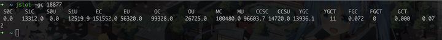

可以看到MU大约是95MB左右，CCSU大概在14MB左右。由于MU = Non-class Space + Class space, 因此Non-class space大概在80多MB。

如果使用了高版本的JDK，可以使用`VM.metaspace`命令查看更详细的结果：


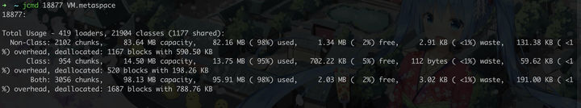


可以看到数据符合之前的预期。接下来看一下trace后的诊断信息：

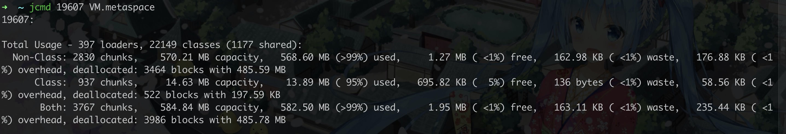

发现Non-class区大小激增，而Class区大小及已加载的类数量没有明显变化。这一现象说明，引起Metaspace OOM的原因很可能是JVM在解析Arthas增强后的类字节码数据，向Non-class区放入新生成的方法、常量池等数据时申请了大量的Non-class空间导致的。因此，接下来需要分析增强前后字节码的区别。

#### 分析Arthas的命令执行过程

因为增强后的字节码是由Arthas输出并注入到JVM的，在分析之前便需要搞清楚Arthas是如何产生增强后的字节码的。由于本例中的Arthas是以Agent方式运行的，因此直接看源码，了解ArthasAgent的附加过程：

```java
// arthas-agent-attach/src/main/java/com/taobao/arthas/agent/attach/ArthasAgent.java
public void init() throws IllegalStateException {
     // ...
   // 通过反射调用 ArthasBootstrap bootstrap = ArthasBootstrap.getInstance(inst);
        Class<?> bootstrapClass = arthasClassLoader.loadClass(ARTHAS_BOOTSTRAP);
        Object bootstrap = bootstrapClass.getMethod(GET_INSTANCE, Instrumentation.class, Map.class).invoke(null,instrumentation, configMap);
        boolean isBind = (Boolean) bootstrapClass.getMethod(IS_BIND).invoke(bootstrap);
        if (!isBind) {
                String errorMsg = "Arthas server port binding failed! Please check $HOME/logs/arthas/arthas.log for more details.";
                throw new RuntimeException(errorMsg);
        }
  // ...
}
```

最终会调用到ArthasBootstrap的构造方法：

```java
private ArthasBootstrap(Instrumentation instrumentation, Map<String, String> args) throws Throwable {
        // ...
        shutdown = new Thread("as-shutdown-hooker") {
            @Override
            public void run() {
                ArthasBootstrap.this.destroy();
            }
        };
        // 这里使用先前传入的instrumentation构造类字节码的transformerManager。
        transformerManager = new TransformerManager(instrumentation);
        Runtime.getRuntime().addShutdownHook(shutdown);
    }
```

跟入`TransformManager`可以看到注册类字节码增强回调函数的代码：

```java
public TransformerManager(Instrumentation instrumentation) {
        this.instrumentation = instrumentation;
        classFileTransformer = new ClassFileTransformer() {
            @Override
            public byte[] transform(ClassLoader loader, String className, Class<?> classBeingRedefined,
                    ProtectionDomain protectionDomain, byte[] classfileBuffer) throws IllegalClassFormatException {
                // ...
                // TraceTransformer
                for (ClassFileTransformer classFileTransformer : traceTransformers) {
                    byte[] transformResult = classFileTransformer.transform(loader, className, classBeingRedefined,protectionDomain, classfileBuffer);
                    if (transformResult != null) {
                        classfileBuffer = transformResult;
                    }
                }
                return classfileBuffer;
            }
        };
        instrumentation.addTransformer(classFileTransformer, true);
    }
```

很巧的是，这里有一个traceTransformers。对Arthas源码进行断点调试，发现trace操作确实会走到此回调方法。于是在此处修改Arthas的代码，判断如果待transform的类是会引发OOM的目标类，那就把`classfileBuffer`和transform完成的`transformResult`都保存到文件。以此方式顺利地拿到了增强前后的字节码。


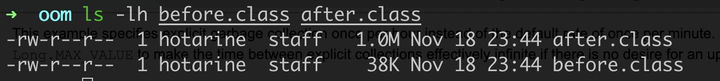

#### 分析增强前后的字节码结构

新生成的`.class`文件比老的`.class`文件大了很多。将两个`.class`文件拖入IDEA中进行反编译，查看对应的Java代码。由于被trace的方法体本身非常庞大，内部具有大量的DTO转换操作，充斥着大量的get set方法调用，因此Arthas在生成增强的字节码时在方法调用前后插入了大量的计时代码


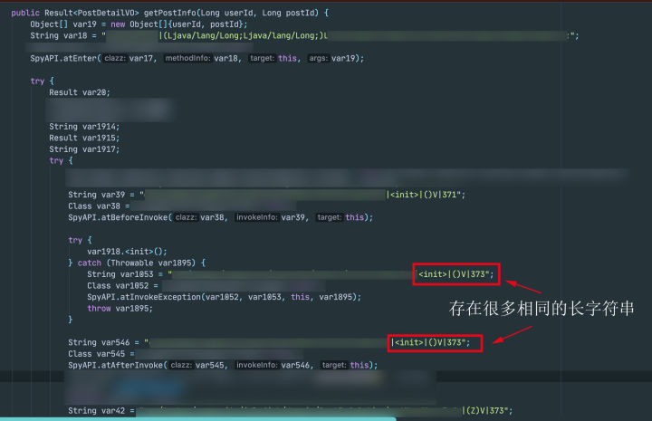


不过仔细看，可以发现，虽然看上去代码中有非常多的字符串，但是实际上很多字符串都是一模一样的，只是反编译过程中重复显示了而已，这一点可以从`.class`的文件大小得出结论：虽然新类中多了不少字符串，但是不同的字符串肯定很少，否则`.class`文件中需要耗费大量的空间去保存这些不一样的字符串，势必文件大小也会膨胀得厉害；而现在新类的`.class`文件才1M左右，与Metaspace OOM时暴涨500MB的表现实在是相去甚远，因此并不是常量过多引发Metaspace暴涨。

既然从反编译的结果中得不到问题的突破口，于是尝试使用`javap -verbose`输出增强前后的类字节码内容。

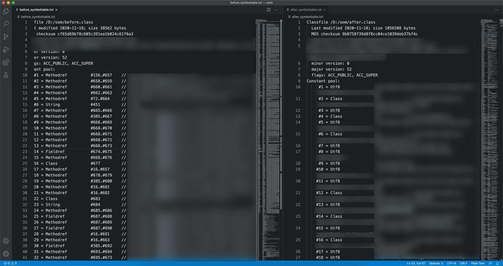

对比两个前后`javap`工具输出的信息，发现了两个令人在意的细节：

1. 增强后的类常量池区域的内容结构完全变了，增强前的类常量池一开始都只是些方法引用，字符串类型的常量index基本都在400、1200左右。而新的类常量池一开始全是类及字符串常量的index，方法引用、类引用夹杂在字符串常量之间。
2. StackMapTable产生了大量的Entries，且有很多Entry是full frame。


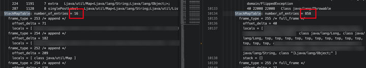


> **frame_type常见取值含义**:
> \> - frame_type = SAME ;/ *0-63* / 与上一个比较位置的局部变量表相同，且操作数栈为空，这个值也是隐含的 offset_delta > - frame_type = SAME_LOCALS_1_STACK_ITEM; / *64-127* / 当前帧与上一帧有相同的局部变量，操作数栈中的变量数目为 1，隐式 offset_delta 为 frame_type – 64 > - frame_type = SAME_LOCALS_1_STACK_ITEM_EXTENDED; / *247* / > - frame_type = CHOP / *248- 250* / > - frame_type = SAME_FRAME_EXTENDED / *251* / 局部变量信息和上一个帧相同，且操作数栈为空 > - frame_type = APPEND ; / *252-254* / 当前帧比上一帧多了k个局部变量，且操作数栈为空，其中 k = frame_type -251 > - frame_type = FULL_FRAME;/ *255* / 局部变量表和操作数栈做完整记录

考虑到StackMapTable的作用基本上是在字节码验证期间校验字节码合法性的，因此考虑先关闭JVM的字节码校验功能，看看排除了StackMapTable的影响后是否能够减轻Metaspace空间上涨的症状。


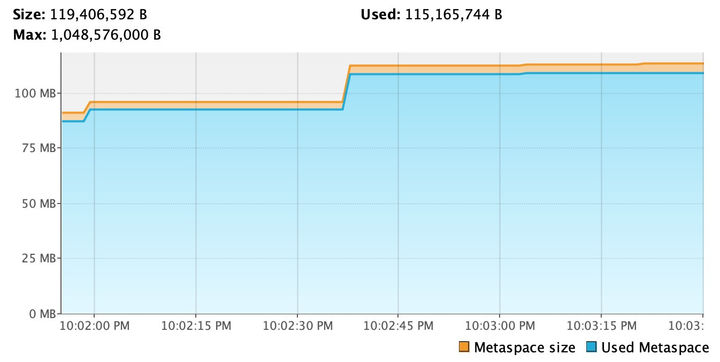


可以看到关闭字节码校验后，确实能够缓解Metaspace空间上涨的问题，但是关闭JVM的字节码校验功能并不见得是一个安全的操作，这使得应用更容易受到非法字节码的影响：不单单是增加了被恶意的字节码攻击应用的风险，而且在应用中为了实现AOP，也引入了不少的动态生成字节码的工具；缺乏字节码校验能力，同样也会增加由于字节码生成工具可能存在的问题而导致不合法的字节码影响应用稳定的风险。因此，在没有搞清楚问题根源就简单地关闭掉字节码校验，是弊大于利，得不偿失的。有必要进一步分析产生Metaspace OOM问题的原因。

### 问题定位

目前为止，虽然我们已经在字节码层面上看到了异常的ConstantPool layout以及庞大的StackMapTable，但却得不到更多的信息来发现问题了。因此只能考虑从JVM层面入手。

由于笔者发现Metaspace OOM的问题在普通的JDK上也存在（在macOS上测试了OpenJDK 8及14，在Ubuntu 18上测试了OpenJDK 12，问题均存在），于是下载一份OpenJDK 14的源码，打开slowdebug模式编译了一份可进行调试的JDK。我们知道类加载过程中申请Metaspace空间最终会调用到`share/memory/metaspace/spaceManager.cpp#SpaceManager::get_new_chunk`方法:

```cpp
Metachunk* SpaceManager::get_new_chunk(size_t chunk_word_size) {
      // Get a chunk from the chunk freelist
      Metachunk* next = chunk_manager()->chunk_freelist_allocate(chunk_word_size);
      if (next == NULL) {
        next = vs_list()->get_new_chunk(chunk_word_size,
                                        medium_chunk_bunch());
      }
      Log(gc, metaspace, alloc) log;
      if (log.is_trace() && next != NULL &&
          SpaceManager::is_humongous(next->word_size())) {
        log.trace("  new humongous chunk word size " PTR_FORMAT, next->word_size());
      }
      return next;
}
```

因此可以在方法头部下条件断点 `chunk_word_size > 8192`，期望能从调用栈中看到消耗Metaspace的“罪魁祸首"。

> 一个新产生的普通ClassLoader一开始会拿到4KB大小的chunks，直到申请次数达到一个上限（目前这个上限为4），接下来Allocator就会”失去耐心“，每次都给这个ClassLoader分配64K大小的chunks。因为是word_size，所以在笔者的x64 Mac上，一个word的size为64，64 Kbytes = 65536 bytes = 8192 * 64 / 8，因此设成8192是恰到好处的。

很快，发现了申请大量Metaspace的调用栈：


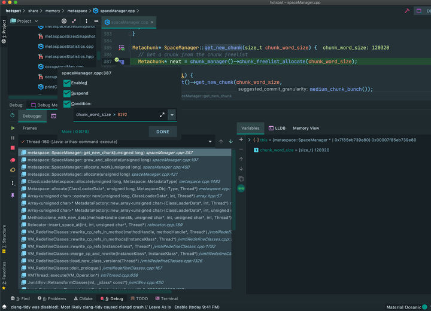

逐级跟入调用栈，发现有两个方法的注释值得关注：

```cpp
// We have entries mapped between the new and merged constant pools
    // so we have to rewrite some constant pool references.
    // 存在需要在新的及合并后的Constant Pool间映射的Entry，因此我们必须重写一些Constant Pool的引用。
    if (!rewrite_cp_refs(scratch_class, THREAD)) {
      return JVMTI_ERROR_INTERNAL;
    }
// Rewrite constant pool references in the specific method. This code
// was adapted from Rewriter::rewrite_method().
void VM_RedefineClasses::rewrite_cp_refs_in_method(methodHandle method,methodHandle *new_method_p, TRAPS) {
            // ...
            // the new value needs ldc_w instead of ldc
            u_char inst_buffer[4]; // max instruction size is 4 bytes
            bcp = (address)inst_buffer;
            // construct new instruction sequence
            *bcp = Bytecodes::_ldc_w;
            bcp++;
            Bytes::put_Java_u2(bcp, new_index);
            Relocator rc(method, NULL /* no RelocatorListener needed */);
            methodHandle m;
            {
              PauseNoSafepointVerifier pnsv(&nsv);
              // ldc is 2 bytes and ldc_w is 3 bytes
              //  执行到这一句进入空间分配
              m = rc.insert_space_at(bci, 3, inst_buffer, CHECK);
            }
            // return the new method so that the caller can update
            // the containing class
            *new_method_p = method = m;
            // switch our bytecode processing loop from the old method
            // to the new method
            // ...
          } // end we need ldc_w instead of ldc
        } // end if there is a mapped index
      } break;
          // ...
```

这个方法的主要作用是重写指定方法的字节码在常量池中的引用，从调试信息中可以看到，当前需要重写的字节码指令为ldc, 在老常量池中ldc的常量池引用index为2，而在新类中为385，不满足`new_index <= max_jubyte（255）`的条件，需要将`ldc`指令扩展为`ldc_w`，因此插入新的字节码指令


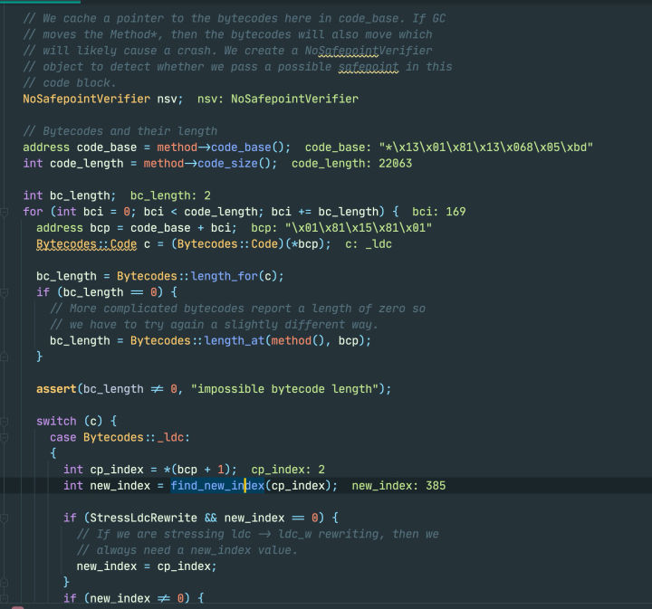


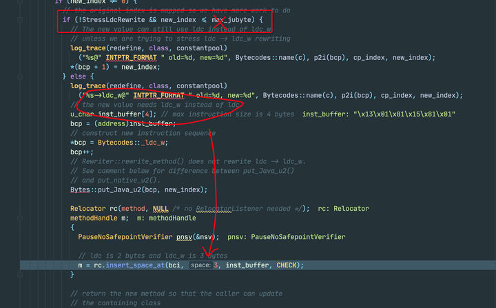

而在插入字节码指令的过程中，JDK会复制一遍当前方法的StackMapTable，


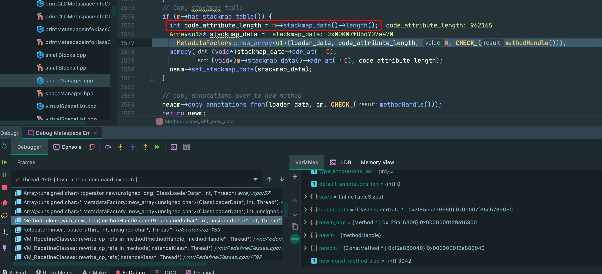

这个方法的StackMapTable很大，达到了900多KB，因此每扩展一次`ldc`指令到`ldc_w`，差不多就需要向Metaspace申请约1MB的空间。老类中的ldc指令只有32个，而新类中的ldc指令多达1054个，再考虑到刚才从`javap -verbose`结果中看到的，新类中Constant Pool layout与老类完全不同，这就意味着有很多的ldc指令因为错位而需要扩展，考虑到`max_jubyte`的取值为255，1054/2大约就是500个左右的ldc指令需要扩展。最终便导致了文章开头的情景：Metaspace激增了约500MB。


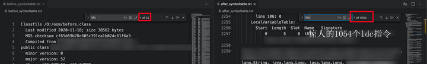

到这里，还剩下最后一个问题，为什么关掉JVM的字节码校验，就不会出现Metaspace激增呢？因为关闭JVM的字节码校验后，ClassFileParser就不会去解析`.class`文件的StackMapTable部分，进而走不到`if(m->has_stackmap_table())`语句，避免了StackMapTable的复制。这一点也可以从JVM源码中得到佐证：

```cpp
// src/hotspot/share/classfile/classFileParser.cpp # parse_stackmap_table
static const u1* parse_stackmap_table(const ClassFileStream* const cfs,
                                      u4 code_attribute_length,
                                      bool need_verify,
                                      TRAPS) {
  // ...
  // check code_attribute_length first
  cfs->skip_u1(code_attribute_length, CHECK_NULL);

  // 关注这一行
  if (!need_verify && !DumpSharedSpaces) {
    return NULL;
  }
  return stackmap_table_start;
}
```

如果不需要verify且不需要DumpSharedSpaces，那么parse_stackmap_table会直接返回NULL。

继续查看调用栈，整个栈是由`VM_RedefineClasses::load_new_class_versions`方法一路触发调用的，

```cpp
jvmtiError VM_RedefineClasses::load_new_class_versions(TRAPS) {
    // ...
  for (int i = 0; i < _class_count; i++) {
    // Create HandleMark so that any handles created while loading new class
    // versions are deleted. Constant pools are deallocated while merging
    // constant pools
    HandleMark hm(THREAD);
    InstanceKlass* the_class = get_ik(_class_defs[i].klass);
    Symbol*  the_class_sym = the_class->name();

    log_debug(redefine, class, load)
      ("loading name=%s kind=%d (avail_mem=" UINT64_FORMAT "K)",
       the_class->external_name(), _class_load_kind, os::available_memory() >> 10);

    // 构造了这个ClassFileStream对象↓
    ClassFileStream st((u1*)_class_defs[i].class_bytes,
                       _class_defs[i].class_byte_count,
                       "__VM_RedefineClasses__",
                       ClassFileStream::verify); 
    // ...
```

方法开头构造了一个`ClassFileStream`对象，这个对象的`verify_stream`属性被设置为`ClassFileStream::verify`，而这个值默认是为true。

在ClassFileParser的构造函数中有设置_need_verify的代码：

```cpp
// Figure out whether we can skip format checking (matching classic VM behavior)
  if (DumpSharedSpaces) { // 没有启动参数，为false
    // verify == true means it's a 'remote' class (i.e., non-boot class)
    // Verification decision is based on BytecodeVerificationRemote flag
    // for those classes.
    _need_verify = (stream->need_verify()) ? BytecodeVerificationRemote :
                                              BytecodeVerificationLocal;
  }
  else {
    // 走到这个分支
    _need_verify = Verifier::should_verify_for(_loader_data->class_loader(),
                                               stream->need_verify());
  }
bool Verifier::should_verify_for(oop class_loader, bool should_verify_class) {
  return (class_loader == NULL || !should_verify_class) ?
    BytecodeVerificationLocal : BytecodeVerificationRemote;
}
```

而`class_loader !=null`, `should_verify_class`为`true`，于是走到了取值`BytecodeVerificationRemote`，而这个值正好就是由`-noverify`启动参数决定的。只要在启动参数中关闭JVM字节码校验，那么`BytecodeVerificationRemote`就为`false`，最终方法就不会携带StackMapTable信息，避免了StackMapTable的复制而导致占用大量Metaspace空间。

至此，我们终于搞清楚了导致Metaspace OOM的根源：**在trace巨大方法时，Arthas产生新类的Constant Pool的Layout发生变化导致ldc指令需要rewrite，新的指令index超过max_jubyte后需要扩展ldc指令为ldc_w指令，指令扩展过程中需要插入新的字节码操作符，而插入新的字节码操作符时又需要复制StackMapTable，而巨大的StackMapTable以及大量的ldc指令需要扩展，最终导致Metaspace空间暴增，引发问题。**

### 问题解决

既然知道了Metaspace OOM是由StackMapTable的复制引起的，而StackMapTable的复制又是在新旧Constant Pool index需要映射的情况下发生，那有没有办法尽可能的保持Constant Pool layout一致，避免这样的重映射呢？阅读了Arthas的源码及其使用的字节码增强库bytebuddy的接口方法后，答案是肯定的。于是笔者开始尝试修改Arthas的代码，以便尽可能地保持新旧类的Constant Pool Layout一致。

> // com/alibaba/repackage-asm/0.0.7/com/alibaba/deps/org/objectweb/asm/ClassWriter.class
> 参数 ClassReader: ClassReader实例用于读取原始类文件，它将会被用于从原始类中复制完整的常量池、Bootstrap Method以及其他原始类中可复制部分的字节码。

修改`com.taobao.arthas.core.advisor.Enhancer`类两处，一处获取`ClassReader`实例的引用：

```java
// src/main/java/com/taobao/arthas/core/advisor/Enhancer.java
// ...
if (matchingClasses != null && !matchingClasses.contains(classBeingRedefined)) {
      return null;
}
ClassNode classNode = new ClassNode(Opcodes.ASM8);
// 在AsmUtils中新增方法，返回处理ClassNode的ClassReader。
// 此时这个ClassReader中已经保存了原始类的Constant Pool等信息
// 保持着这个ClassReader对象，在最后生成字节码的时候有用
ClassReader classReader = AsmUtils.toClassReader(classfileBuffer, classNode);
// remove JSR https://github.com/alibaba/arthas/issues/1304
classNode = AsmUtils.removeJSRInstructions(classNode);
// 生成增强字节码
DefaultInterceptorClassParser defaultInterceptorClassParser = new DefaultInterceptorClassParser();

// ...
```

一处将先前获取到的`ClassReader`实例传入字节码生成方法中用于复制常量池

```java
// src/main/java/com/taobao/arthas/core/advisor/Enhancer.java
// ...
// https://github.com/alibaba/arthas/issues/1223
if (classNode.version < Opcodes.V1_5) {
     classNode.version = Opcodes.V1_5;
}
byte[] enhanceClassByteArray = AsmUtils.toBytes(classNode, inClassLoader, classReader);
// 增强成功，记录类
classBytesCache.put(classBeingRedefined, new Object());
// dump the class
dumpClassIfNecessary(className, enhanceClassByteArray, affect);
// 成功计数
affect.cCnt(1);
// ...
```

再修改类`com.taobao.arthas.bytekit.utils.AsmUtils`，新增接受ClassReader参数的重载方法，用于在产生新字节码时复制常量池等信息

```java
// src/main/java/com/taobao/arthas/bytekit/utils/AsmUtils.java
// ...
// 新增方法如下
public static byte[] toBytes(ClassNode classNode, ClassLoader classLoader, ClassReader classReader) {
    int flags = ClassWriter.COMPUTE_FRAMES | ClassWriter.COMPUTE_MAXS;
    ClassWriter writer = new ClassLoaderAwareClassWriter(classReader, flags, classLoader);
    classNode.accept(writer);
    return writer.toByteArray();
}
```

编译打包修改后的Arthas，再次trace目标类，可见Metaspace没有再发生上涨，并且在AliJDK及OpenJDK 8上也测试正常。

对比`javap -verbose`输出的数据，可见两边的Constant Pool对于新旧类中共同存在的常量项，index基本不发生变化。


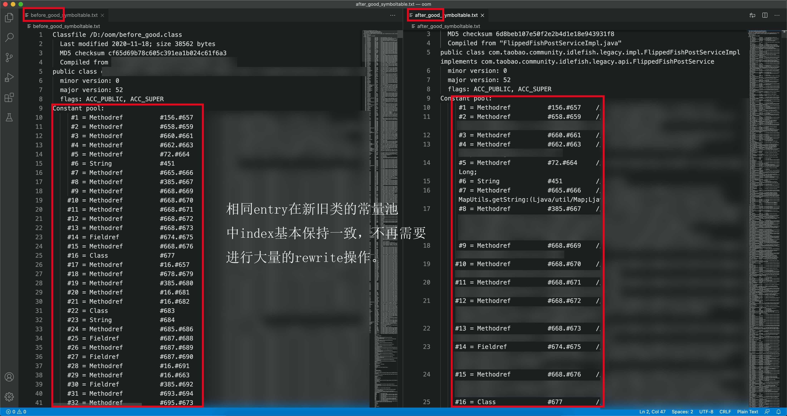


而Arthas为了实现trace统计而引入的计数器标识符常量，在新的类中基本上都排在了常量池的末尾，不再和旧类中的常量“抢位置”了。


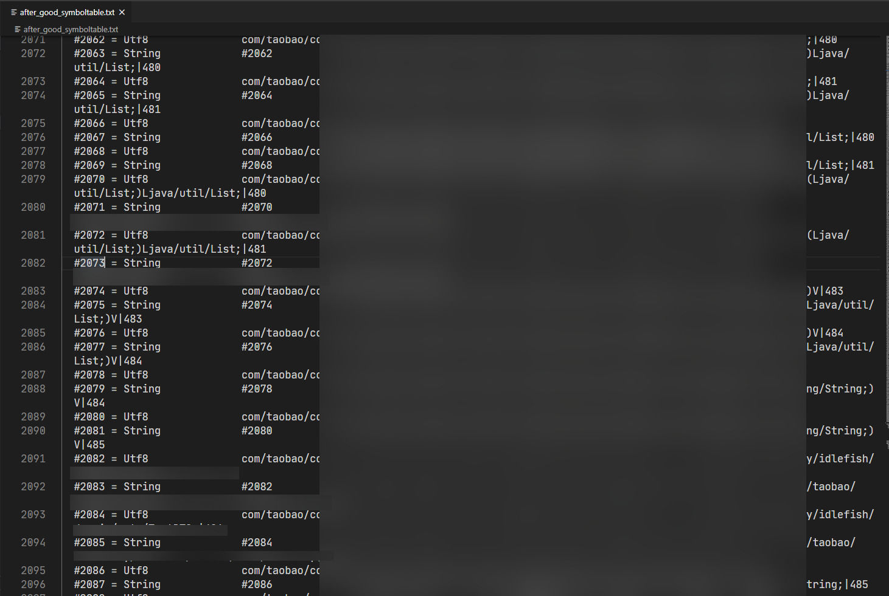


至此，一场由Arthas引起的Metaspace OOM问题就真正的告一段落。

### 思考

从发现文中提及的Metaspace OOM的问题，到真正解决此问题，断断续续地花费了笔者近2周的时间。在日常的开发工作中，我们通常情况下碰到的大部分是堆OOM的故障，这种情况下只要把堆Dump下来”作案现场“便一目了然。而本文介绍的Metaspace OOM问题在JDK 8后便成为了一种”堆外内存泄露“问题；并且，在JDK 8环境中甚至还缺乏`VM.metaspace`之类的诊断命令，种种原因相加，导致了堆外内存泄漏相较于堆内内存泄漏更难定位、分析。

而整篇文章分析下来，可以发现解决该问题最有力的抓手，正是”已加载类数量"，"Non-class Space Size", "Class Space Size"等几个重要的堆外内存监控指标，目前这些更加细节的堆外内存使用指标还没有很清晰地反映在生产环境的监控系统中。私以为，在以后的开发工作中，可以充分发挥集团内有自研AliJDK的优势，补足这些监控指标，将高版本OpenJDK才开始具备的诊断命令提早集成到AliJDK中，方便开发同学对JVM的运行状态有更全面的把握，降低诸如此类堆外内存泄露的排查难度，进一步确保生产环境的安全稳定。

### 后记

笔者准备了一个可复现上述情形的Demo: [https://github.com/LinZong/HugeStackMapTableOom](https://link.zhihu.com/?target=https%3A//github.com/LinZong/HugeStackMapTableOom) 欢迎感兴趣的读者尝试。

## 记一次Metaspace OOM 引发的线上问题排查

https://www.jianshu.com/p/e95ea462703d

### 背景

最近线上服务平均两周就会出现重启的现象，同时SRE的同事发现重启前服务占用内存非常高，重启后内存下降，可见该服务是逐步耗尽系统内存。给力的SRE同事最后发现是服务所用的框架导致的内存被撑爆了。本文在本地模拟在这次线上问题，并记录这次问题的排查过程

### 本地模拟

首先由于线上服务间隔两周才出现重启的情况，为了在本地模拟线上Metaspace OOM的情况， 采用JMeter对本地服务进行压测。本地的操作系统是Mac OS。 使用`top` 命令查看压测之前的程序的内存占用情况，如下图所示


可以看到程序整体占用2495M。然后用JMeter对服务进行压测。
 在压测的过程中在终端使用反复使用`jcmd [PID] GC.heap_info`命令，
 重点观察Metaspace 区域数据变化


可以看到Metaspace中committed在飙升
 关于Metasapce中`used`, `capacity`, `committed`的意义可以参考[Stackoverflow](https://links.jianshu.com/go?to=https%3A%2F%2Fstackoverflow.com%2Fquestions%2F40891433%2Funderstanding-metaspace-line-in-jvm-heap-printout)上的回答。

### 排查与解决

使用`jmap -dump:format=b,file=[filename].bin [PID]`命令分别在压测刚开始和结束之前打印堆快照。然后使用MAT工具对快照进行分析。
 下面第一张图片一开始的快照， 第二张是压测之后的快照。


对比上面两张图可以明显看到，压测一段时间后Class的数量与Class loader的数量有了显著的上升。我们知道Java 8使用Metaspace来存贮类的元数据以及类加载器，Metaspace占用的是本地堆内存（native heap），所以Metaspace的增长导致了本地内存“撑爆”了。

**为什么Metaspace会无限增长，为什么会有这么多TranslateClassLoader呢？**
 使用`jcmd [PID] VM.flags`查看JVM启动参数，可以发现并没有对Metaspce进行相关设置， 所以造成了Metasace无限增长。


可以通过`-XX:MaxMetaspaceSize`来设置触发Metaspace回收的阈值， 保证Metaspace不会太大，超过阈值就FullGC。但是这治标不治本，为什么会有这么多类加载器呢？

TranletClassLoader并不是业务层自定义的ClassLoader, 深入到框架层面的代码发现有如下代码。


每次请求都会调用`template.newTransformer()`， 该方法每次都会生成一个`TransletClassLoader` 去加载类`TemplatesImpl`，慢慢导致Metaspace不断增长。询问同事知道，这个API是框架层面暴露给监控部门调用，获取服务的健康状态， 请求量不是很大，所以才会有两个礼拜内存才满的现象。

找到问题的原因之后，目前先给线上服务加上`-XX:MaxMetaspaceSize`参数，框架部门的同事开始着手处理代码问题。

### 总结

Java 8开始彻底移除`PermGen`, 引入Metaspace来解决`java.lang.OutOfMemoryError: PermGen`。但是不代表对Metaspace可以不管不问了，使用不当Metaspace会导致本地内存溢出的情况。 阿里大牛[“你假笨”](https://links.jianshu.com/go?to=http%3A%2F%2Flovestblog.cn%2Fblog%2F2016%2F04%2F24%2Fclassloader-unload%2F)就觉得Metaspace取代perm的好处不是那么明显，有点费力不讨好的感觉。

PS：在面试的时候，经常会碰到有面试官蜜汁微笑的问有没有线上内存溢出、内存泄漏问题解决或者性能调优的经验。其实大多数开发遇到这种问题的概率不是很大，就算遇到可能有强大的SRE同事帮你定位和解决，就比如以上这个案例。但是还是希望大家遇到这种类型的问题的时候能够兴奋起来，毕竟机会难得，够你在一次面试的时候吹一波了，而且 如果离开了强大的SRE，在一家创业公司工作，一切就要靠自己解决了 🙂。

