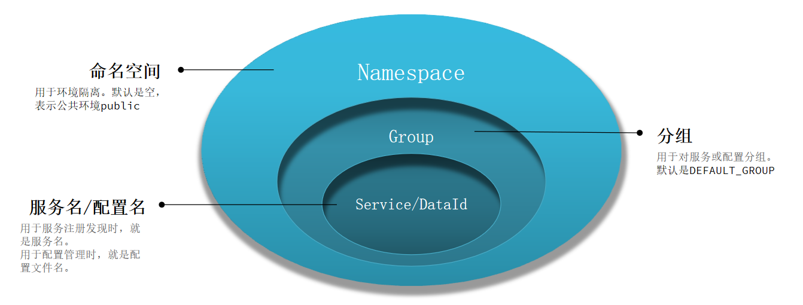
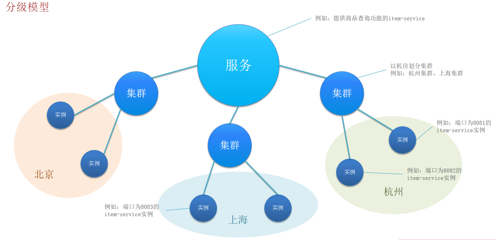
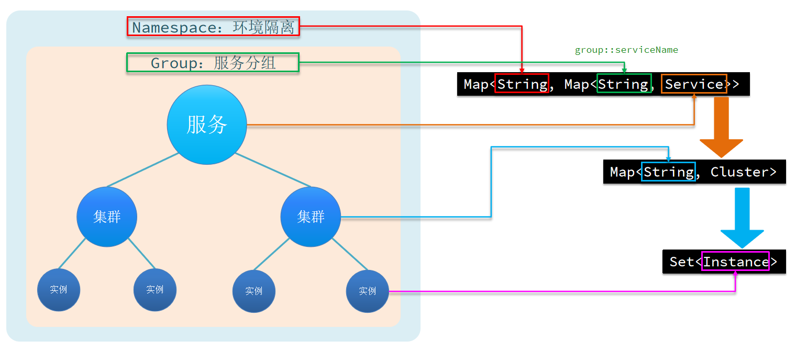

# Register

> Nacos源码解析：[NacosCodeAnlyse.md](NacosCodeAnlyse.md)
>
> Eureka：[Eureka.md](Eureka.md)

## 环境隔离

企业实际开发中，往往会搭建多个运行环境，例如:开发环境、测试环境、发布环境。不同环境之间需要隔离。或者不同项目使用了一套Nacos，不同项目之间要做环境隔离。

## 分级模型

大厂的服务可能部署在多个不同机房，物理上被隔离为多个集群。Nacos支持对于这种集群的划分。

## Nacos和Eureka

### Nacos和Eureka区别

1. 相同点：
   - 整体上的原理是类似的
   - 都是支持集群的，用来支持高可用
2. 不同点：
   - **节点关系**：Nacos可以配置为主从，而Eureka节点之间是平等的关系
   - **功能结构**：Nacos提供了多种功能，如注册发现、配置管理，而Eureka的功能结构较为单一，就是用来做服务的注册发现的
   - **健康监测周期**：与Nacos服务的**心跳续约**和**服务拉取**的周期是5秒，而与Eureka服务的**心跳续约**和**服务拉取**的周期是30秒
   - **健康监测方式**：Nacos可以配置**主动询问式健康监测**，而Eureka则没有
     - 主动询问式健康监测需要将服务实例修改为永久实例，默认的实例都是临时实例，需要注意的是永久实例挂了之后也不会从服务列表中剔除
   - **服务变更推送**：Nacos在服务提供者有变动的情况下有推送服务列表的功能，而Eureka没有
     - 响应更加敏捷
   - **AC灵活性**：Nacos支持AP和CP，Eureka只支持AP
   - **高可用实现机制**：Nacos通过主从节点的选举机制来保证高可用，Eureka通过节点间的心跳机制和数据同步来保证高可用

