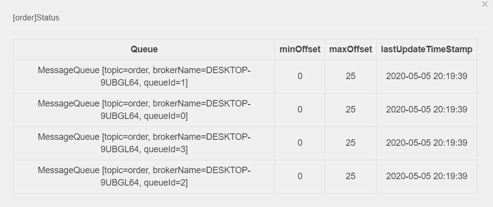

# RocketMQ 高性能揭秘

[本文](https://zhuanlan.zhihu.com/p/93602392)主要从性能角度考虑 RocketMQ 的实现。

### 整体架构

这是网络上流行的 RocketMQ 的集群部署图。

RocketMQ 主要由 Broker、NameServer、Producer 和 Consumer 组成的一个集群。

- **NameServer**：整个集群的注册中心和配置中心，管理集群的元数据。包括 Topic 信息和路由信息、Producer 和 Consumer 的客户端注册信息、Broker 的注册信息。
- **Broker**：负责接收消息的生产和消费请求，并进行消息的持久化和消息的读取。
- **Producer**：负责生产消息。
- **Consumer**：负责消费消息。

在实际生产和消费消息的过程中，NameServer 为生产者和消费者提供 Meta 数据，以确定消息该发往哪个 Broker 或者该从哪个 Broker 拉取消息。有了 Meta 数据后，生产者和消费者就可以直接和 Broker 交互了。这种点对点的交互方式最大限度降低了消息传递的中间环节，缩短了链路耗时。

### 网络模型

RocketMQ 使用 Netty 框架实现高性能的网络传输。

### 基于 Netty 实现网络通信模块

### **Netty 主要特点**

- 具有统一的 API，用户无需关心 NIO 的编程模型和概念。通过 Netty 的 ChannelHandler 可以对通信框架进行灵活的定制和扩展。
- Netty 封装了网络编程涉及的基本功能：拆包解包、异常检测、零拷贝传输。
- Netty 解决了 NIO 的 Epoll Bug，避免空轮询导致 CPU 的 100% 利用率。
- 支持多种 Reactor 线程模型。
- 使用范围广泛，有较好的的开源社区支持。Hadoop、Spark、Dubbo 等项目都集成 Netty。

### **Netty 的高性能传输的体现**

- 非阻塞 IO
- Ractor 线程模型
- 零拷贝。使用 FileChannel.transfer 避免在用户态和内核态之间的拷贝操作；通过 CompositeByteBuf 组合多个 ByteBuffer；通过 slice 获取 ByteBuffer 的切片；通过 wrapper 把普通 ByteBuffer 封装成 netty.ByteBuffer。

### RocketMQ 网络模型

RocketMQ 的 Broker 端基于 Netty 实现了主从 Reactor 模型。架构如下：

具体流程：

1. eventLoopGroupBoss 作为 acceptor 负责接收客户端的连接请求
2. eventLoopGroupSelector 负责 NIO 的读写操作
3. NettyServerHandler 读取 IO 数据，并对消息头进行解析
4. disatch 过程根据注册的消息 code 和 processsor 把不同的事件分发给不同的线程。由 processTable 维护（类型为 HashMap）

### 业务线程池隔离

RocketMQ 对 Broker 的线程池进行了精细的隔离。使得消息的生产、消费、客户端心跳、客户端注册等请求不会互相干扰。如下是各个业务执行线程池和 Broker 处理的报文类型的对应关系，从下图中我们也可以看出 Broker 的核心功能点。

### 消息的生产

RocketMQ 支持三种消息发送方式：同步发送、异步发送和 One-Way 发送。One-Way 发送时客户端无法确定服务端消息是否投递成功，因此是不可靠的发送方式。

### 客户端发送时序图

流程说明

1. 客户端 API 调 DefaultMQProducer 的 send 方法进行消息的发送。
2. makeSureStateOk 检查客户端的发送服务是否 ok。RocketMQ 客户端维护了一个单例的 MQClientInstance，可通过 start 和 shutdown 来管理相关的网络服务。
3. tryToFindTopicPublishInfo 用来获取 Topic 的 Meta 信息，主要是可选的 MessageQueue 列表。
4. selectOneMessageQueue 根据当前的故障容错机制，路由到一个特定的 MessageQueue。
5. sendKernelImpl 的核心方法是调用 NettyRemotingClient 的 sendMessage 方法，该方法中会根据用户选择的发送策略进行区别处理，时序图中只体现了同步发送的方式。
6. invokeSync 通过调用 Netty 的 channel.writeAndFlush 把消息的字节流发送到 TCP 的 Socket 缓冲区，至此客户端消息完成发送。

### **三种发送方式实现上的区别**

- 同步发送：注册 ResponseFuture 到 responseTable，发送 Request 请求，并同步等待 Response 返回。
- 异步发送：注册 ResponseFuture 到 responseTable，发送 Request 请求，不需要同步等待 Response 返回，当 Response 返回后会调用注册的 Callback 方法，从而异步获取发送的结果。
- One-Way：发送 Request 请求，不需要等待 Response 返回，不需要触发 Callback 方法回调。

### 客户端故障容错机制

MQFaultStrategy 实现了基于 RT 耗时的容错策略。当某个 Broker 的 RT 过大时，认为该 Broker 存在问题，会禁用该 Broker 一段时间。latencyMax 和 notAvailableDuration 的对应关系如下图：

latencyMaxnotAvailableDuration50L0L100L0L550L30000L1000L60000L2000L120000L3000L180000L15000L600000L

### 客户端高效发送总结

1. One-Way 的发送方式是效率最高的，不需要同步等待过程，也不需要额外 CallBack 调用开销，但是消息发送不可靠
2. MQClientInstance 的单例模式统一管理维护网络通道，发送消息前只需要做一次服务状态可用性检查即可
3. Topic 的 Meta 信息在本地建立缓存，避免每次发送消息从 NameServer 拉取 Meta 数据
4. 高效的故障容错机制，保证消息发送失败时进行快速重发

### Broker 接收消息时序图

**流程说明**

1. Broker 通过 Netty 接收 RequestCode 为 SEND_MESSAGE 的请求，并把该请求交给 SendMessageProcessor 进行处理。
2. SendMessageProcessor 先解析出 SEND_MESSAGE 报文中的消息头信息（Topic、queueId、producerGroup 等），并调用存储层进行处理。
3. putMessage 中判断当前是否满足写入条件：Broker 状态为 running；Broker 为 master 节点；磁盘状态可写（磁盘满则无法写入）；Topic 长度未超限；消息属性长度未超限；pageCache 未处于繁忙状态（pageCachebusy 的依据是 putMessage 写入 mmap 的耗时，如果耗时超过 1s，说明由于缺页导致页加载慢，此时认定 pageCache 繁忙，拒绝写入）。
4. 从 MappedFileQueue 中选择已经预热过的 [MappedFile](https://www.jianshu.com/p/9bd672e1c5c1);
5. AppendMessageCallback 中执行消息的操作 doAppend，直接对 mmap 后的文件的 bytbuffer 进行写入操作。

### Broker 端对写入性能的优化

### 自旋锁减少上下文切换

RocketMQ 的 CommitLog 为了避免并发写入，使用一个 PutMessageLock。PutMessageLock 有 2 个实现版本：PutMessageReentrantLock 和 PutMessageSpinLock。

PutMessageReentrantLock 是基于 java 的同步等待唤醒机制；PutMessageSpinLock 使用 Java 的 CAS 原语，通过自旋设值实现上锁和解锁。RocketMQ 默认使用 PutMessageSpinLock 以提高高并发写入时候的上锁解锁效率，并减少线程上下文切换次数。

### [MappedFile](https://www.jianshu.com/p/9bd672e1c5c1) 预热和零拷贝机制

RocketMQ 消息写入对延时敏感，为了避免在写入消息时，CommitLog 文件尚未打开或者文件尚未加载到内存引起的 load 的开销，RocketMQ 实现了文件预热机制。

Linux 系统在写数据时候不会直接把数据写到磁盘上，而是写到磁盘对应的 PageCache 中，并把该页标记为脏页。当脏页累计到一定程度或者一定时间后再把数据 flush 到磁盘（当然在此期间如果系统掉电，会导致脏页数据丢失）。RocketMQ 实现文件预热的关键代码如下：

```text
public void warmMappedFile(FlushDiskType type, int pages) {
        ByteBuffer byteBuffer = this.mappedByteBuffer.slice();
        int flush = 0;
        long time = System.currentTimeMillis();
        for (int i = 0, j = 0; i < this.fileSize; i += MappedFile.OS_PAGE_SIZE, j++) {
            byteBuffer.put(i, (byte) 0);
            // force flush when flush disk type is sync
            if (type == FlushDiskType.SYNC_FLUSH) {
                if ((i / OS_PAGE_SIZE) - (flush / OS_PAGE_SIZE) >= pages) {
                    flush = i;
                    mappedByteBuffer.force();
                }
            }
                        ...
        }
        // force flush when prepare load finished
        if (type == FlushDiskType.SYNC_FLUSH) {
            log.info("mapped file warm-up done, force to disk, mappedFile={}, costTime={}",
                this.getFileName(), System.currentTimeMillis() - beginTime);
            mappedByteBuffer.force();
        }
        this.mlock();
    }
```

**代码分析**

1. 对文件进行 mmap 映射。
2. 对整个文件每隔一个 PAGE_SIZE 写入一个字节，如果是同步刷盘，每写入一个字节进行一次强制的刷盘。
3. 调用 libc 的 mlock 函数，对文件所在的内存区域进行锁定。(系统调用 mlock 家族允许程序在物理内存上锁住它的部分或全部地址空间。这将阻止 Linux 将这个内存页调度到交换空间（swap space），即使该程序已有一段时间没有访问这段空间）。

### 同步和异步刷盘

RocketMQ 提供了**同步刷盘**和**异步刷盘**两种机制。默认使用异步刷盘机制。

当 CommitLog 在 putMessage() 中收到 MappedFile 成功追加消息到内存的结果后，便会调用 handleDiskFlush() 方法进行刷盘，将消息存储到文件中。handleDiskFlush() 便会根据两种刷盘策略，调用不同的刷盘服务。

抽象类 FlushCommitLogService 负责进行刷盘操作，该抽象类有 3 中实现：

- GroupCommitService：同步刷盘
- FlushRealTimeService：异步刷盘
- CommitRealTimeService：异步刷盘并且开启 TransientStorePool(ByteBuffer池实现)

每个实现类都是一个 ServiceThread 实现类。ServiceThread 可以看做是一个封装了基础功能的后台线程服务。有完整的生命周期管理，支持 start、shutdown、weakup、waitForRunning。

### **同步刷盘流程**

1. 所有的 flush 操作都由 GroupCommitService 线程进行处理
2. 当前接收消息的线程封装一个 GroupCommitRequest，并提交给 GroupCommitService 线程，然后当前线程进入一个 CountDownLatch 的等待
3. 一旦有新任务进来 GroupCommitService 被立即唤醒，并调用 MappedFile.flush 进行刷盘。底层是调用 mappedByteBuffer.force ()
4. flush 完成后唤醒等待中的接收消息线程。从而完成同步刷盘流程

### 异步刷盘流程

1. RocketMQ 每隔 200ms 进行一次 flush 操作（把数据持久化到磁盘）
2. 当有新的消息写入时候会主动唤醒 flush 线程进行刷盘
3. 当前接收消息线程无须等待 flush 的结果。

### 消息消费

高性能的消息队列应该保证最快的消息周转效率：即发送方发送的一条消息被 Broker 处理完之后因该尽快地投递给消息的消费方。

### 消息存储结构

RocketMQ 的存储结构最大特点：

- 所有的消息写入转为顺序写（相比于 Kafka，RocketMQ 即使对于 1w+ 以上的 Topic 也能够应付自如）
- 读写文件分离。通过 ReputMessageService 服务生成 ConsumeQueue

**结构说明**

- ConsumeQueue 与 CommitLog 不同，采用定长存储结构，如下图所示。为了实现定长存储，ConsumeQueue 存储了消息 Tag 的 Hash Code，在进行 Broker 端消息过滤时，通过比较 Consumer 订阅 Tag 的 HashCode 和存储条目中的 Tag Hash Code 是否一致来决定是否消费消息。
- ReputMessageService 持续地读取 CommitLog 文件并生成 ConsumeQueue。

### 顺序消费与并行消费

串行消费和并行消费最大的区别在于消费队列中消息的顺序性。顺序消费保证了同一个 Queue 中的消费时的顺序性。RocketMQ 的顺序性依赖于分区锁的实现。消息消费有推拉两种模式，我们这里只考虑推这种模式

### **并行消费**

1. 并行消费的实现类为 ConsumeMessageConcurrentlyService。
2. PullMessageService 内置一个 scheduledExecutorService 线程池，主要负责处理 PullRequest 请求，从 Broker 端拉取最新的消息返回给客户端。拉取到的消息会放入 MessageQueue 对应的 ProcessQueue。
3. ConsumeMessageConcurrentlyService 把收到的消息封装成一个 ConsumeRequest，投递给内置的 consumeExecutor 独立线程池进行消费。
4. ConsumeRequest 调用 MessageListener.consumeMessage 执行用户定义的消费逻辑，返回消费状态。
5. 如果消费状态为 SUCCESS。则删除 ProcessQueue 中的消息，并提交 offset。
6. 如果消费状态为 RECONSUME。则把消息发送到延时队列进行重试，并对当前失败的消息进行延迟处理。

### **串行消费**

1. 串行消费的实现类为 ConsumeMessageOrderlyService。
2. PullMessageService 内置一个 scheduledExecutorService 线程池，主要负责处理 PullRequest 请求，从 Broker 端拉取最新的消息返回给客户端。拉取到的消息会放入 MessageQueue 对应的 ProcessQueue。
3. ConsumeMessageOrderlyService 把收到的消息封装成一个 ConsumeRequest，投递给内置的 consumeExecutor 独立线程池进行消费。
4. 消费时首先获取 MessageQueue 对应的 objectLock，保证当前进程内只有一个线程在处理对应的的 MessageQueue, 从 ProcessQueue 的 **msgTreeMap 中按 offset 从低到高的顺序取消息，从而保证了消息的顺序性**。
5. ConsumeRequest 调用 MessageListener.consumeMessage 执行用户定义的消费逻辑，返回消费状态。
6. 如果消费状态为 SUCCESS。则删除 ProcessQueue 中的消息，并提交 offset。
7. 如果消费状态为 SUSPEND。判断是否达到最大重试次数，如果达到最大重试次数，就把消息投递到死信队列，继续下一条消费；否则消息重试次数 + 1，在延时一段时间后继续重试。

可见，串行消费如果某条消息一直无法消费成功会造成阻塞，严重时会引起消息堆积和关联业务异常。

### Broker 端的 PullMessage 长连接实现

消息队列中的消息是由业务触发而产生的，如果使用周期性的轮询，不能保证每次都取到消息，且轮询的频率过快或者过慢都会对消息的延时有严重的影响。因此 RockMQ 在 Broker 端使用长连接的方式处理 PullMessage 请求。具体实现流程如下：

1. PullRequest 请求中有个参数 brokerSuspendMaxTimeMillis，默认值为 15s，控制请求 hold 的时长。
2. PullMessageProcessor 接收到 Request 后，解析参数，校验 Topic 的 Meta 信息和消费者的订阅关系。对于符合要求的请求，从存储中拉取消息。
3. 如果拉取消息的结果为 PULL_NOT_FOUND，表示当前 MessageQueue 没有最新消息。
4. 此时会封装一个 PullRequest 对象，并投递给 PullRequestHoldService 内部线程的 pullRequestTable 中。
5. PullRequestHoldService 线程会周期性轮询 pullRequestTable，如果有新的消息或者 hold 时间超时 polling time，就会封装 Response 请求发给客户端。
6. 另外 DefaultMessageStore 中定义了 messageArrivingListener，当产生新的 ConsumeQueue 记录时候，会触发 messageArrivingListener 回调，立即给客户端返回最新的消息。

长连接机制使得 RocketMQ 的网络利用率非常高效，并且最大限度地降低了消息拉取时的等待开销。实现了毫秒级的消息投递。

### RocketMQ 的其他性能优化手段

### 关闭偏向锁

在 RocketMQ 的性能测试中，发现存在大量的 RevokeBias 停顿，偏向锁主要是消除无竞争情况下的同步原语以提高性能，但考虑到 RocketMQ 中该场景比较少，便通过 `- XX:-UseBiasedLocking` 关闭了偏向锁特性。

在没有实际竞争的情况下，还能够针对部分场景继续优化。如果不仅仅没有实际竞争，自始至终，使用锁的线程都只有一个，那么，维护轻量级锁都是浪费的。偏向锁的目标是，减少无竞争且只有一个线程使用锁的情况下，使用轻量级锁产生的性能消耗。轻量级锁每次申请、释放锁都至少需要一次 CAS，但偏向锁只有初始化时需要一次 CAS。

偏向锁的使用场景有局限性，只适用于单个线程使用锁的场景，如果有其他线程竞争，则偏向锁会膨胀为轻量级锁。当出现大量 RevokeBias 引起的小停顿时，说明偏向锁意义不大，此时通过 `- XX:-UseBiasedLocking` 进行优化，因此 RocketMQ 的 JVM 参数中会默认加上 `- XX:-UseBiasedLocking`。

### 写在最后

最后附上阿里中间件的延时性能对比。RocketMQ 在低延迟方面依然具有领先地位，如下图所示，RocketMQ 仅有少量 10~50ms 的毛刺延迟，Kafka 则有不少 500~1000ms 的毛刺。


# RocketMQ之消息存储和查询原理

[原文地址](https://blog.csdn.net/qq_24313635/article/details/106516000)

## 一、CommitLog

`CommitLog`，消息存储文件，所有主题的消息都存储在 `CommitLog` 文件中。

我们的业务系统向 `RocketMQ` 发送一条消息，不管在中间经历了多么复杂的流程，最终这条消息会被持久化到`CommitLog`文件。

我们知道，一台`Broker服务器`只有一个`CommitLog`文件(组)，`RocketMQ`会将所有主题的消息存储在同一个文件中，这个文件中就存储着一条条Message，每条Message都会按照顺序写入。


也许有时候，你会希望看看这个 `CommitLog` 文件中，存储的内容到底长什么样子？

1、消息发送

当然，我们需要先往 `CommitLog` 文件中写入一些内容，所以先来看一个消息发送的例子。

```java
public static void main(String[] args) throws Exception {
    MQProducer producer = getProducer();
    for (int i = 0;i<10;i++){
        Message message = new Message();
        message.setTopic("topic"+i);
        message.setBody(("清幽之地的博客").getBytes());
        SendResult sendResult = producer.send(message);
    }
    producer.shutdown();
}
```

我们向10个不同的主题中发送消息，如果只有一台`Broker`机器，它们会保存到同一个`CommitLog`文件中。此时，这个文件的位置处于 `C:/Users/shiqizhen/store/commitlog/00000000000000000000`。

2、读取文件内容

这个文件我们不能直接打开，因为它是一个二进制文件，所以我们需要通过程序来读取它的字节数组。

```
public static ByteBuffer read(String path)throws Exception{
    File file = new File(path);
    FileInputStream fin = new FileInputStream(file);
    byte[] bytes = new byte[(int)file.length()];
    fin.read(bytes);
    ByteBuffer buffer = ByteBuffer.wrap(bytes);
    return buffer;
}
```

如上代码，可以通过传入文件的路径，读取该文件所有的内容。为了方便下一步操作，我们把读取到的字节数组转换为`java.nio.ByteBuffer`对象。

3、解析

在解析之前，我们需要弄明白两件事：

- 消息的格式，即一条消息包含哪些字段；
- 每个字段所占的字节大小。

在上面的图中，我们已经看到了消息的格式，包含了19个字段。关于字节大小，有的是 4 字节，有的是 8 字节，我们不再一一赘述，直接看代码。

```java
/**
 * commitlog 文件解析
 * @param byteBuffer
 * @return
 * @throws Exception
 */
public static MessageExt decodeCommitLog(ByteBuffer byteBuffer)throws Exception {
 
	MessageExt msgExt = new MessageExt();
 
	// 1 TOTALSIZE
	int storeSize = byteBuffer.getInt();
	msgExt.setStoreSize(storeSize);
 
	if (storeSize<=0){
	    return null;
	}
 
	// 2 MAGICCODE
	byteBuffer.getInt();
 
	// 3 BODYCRC
	int bodyCRC = byteBuffer.getInt();
	msgExt.setBodyCRC(bodyCRC);
 
	// 4 QUEUEID
	int queueId = byteBuffer.getInt();
	msgExt.setQueueId(queueId);
 
	// 5 FLAG
	int flag = byteBuffer.getInt();
	msgExt.setFlag(flag);
 
	// 6 QUEUEOFFSET
	long queueOffset = byteBuffer.getLong();
	msgExt.setQueueOffset(queueOffset);
 
	// 7 PHYSICALOFFSET
	long physicOffset = byteBuffer.getLong();
	msgExt.setCommitLogOffset(physicOffset);
 
	// 8 SYSFLAG
	int sysFlag = byteBuffer.getInt();
	msgExt.setSysFlag(sysFlag);
 
	// 9 BORNTIMESTAMP
	long bornTimeStamp = byteBuffer.getLong();
	msgExt.setBornTimestamp(bornTimeStamp);
 
	// 10 BORNHOST
	int bornhostIPLength = (sysFlag & MessageSysFlag.BORNHOST_V6_FLAG) == 0 ? 4 : 16;
	byte[] bornHost = new byte[bornhostIPLength];
	byteBuffer.get(bornHost, 0, bornhostIPLength);
	int port = byteBuffer.getInt();
	msgExt.setBornHost(new InetSocketAddress(InetAddress.getByAddress(bornHost), port));
 
	// 11 STORETIMESTAMP
	long storeTimestamp = byteBuffer.getLong();
	msgExt.setStoreTimestamp(storeTimestamp);
 
	// 12 STOREHOST
	int storehostIPLength = (sysFlag & MessageSysFlag.STOREHOSTADDRESS_V6_FLAG) == 0 ? 4 : 16;
	byte[] storeHost = new byte[storehostIPLength];
	byteBuffer.get(storeHost, 0, storehostIPLength);
	port = byteBuffer.getInt();
	msgExt.setStoreHost(new InetSocketAddress(InetAddress.getByAddress(storeHost), port));
 
	// 13 RECONSUMETIMES
	int reconsumeTimes = byteBuffer.getInt();
	msgExt.setReconsumeTimes(reconsumeTimes);
 
	// 14 Prepared Transaction Offset
	long preparedTransactionOffset = byteBuffer.getLong();
	msgExt.setPreparedTransactionOffset(preparedTransactionOffset);
 
	// 15 BODY
	int bodyLen = byteBuffer.getInt();
	if (bodyLen > 0) {
	    byte[] body = new byte[bodyLen];
	    byteBuffer.get(body);
	    msgExt.setBody(body);
	}
 
	// 16 TOPIC
	byte topicLen = byteBuffer.get();
	byte[] topic = new byte[(int) topicLen];
	byteBuffer.get(topic);
	msgExt.setTopic(new String(topic, CHARSET_UTF8));
 
	// 17 properties
	short propertiesLength = byteBuffer.getShort();
	if (propertiesLength > 0) {
	    byte[] properties = new byte[propertiesLength];
	    byteBuffer.get(properties);
	    String propertiesString = new String(properties, CHARSET_UTF8);
	    Map<String, String> map = string2messageProperties(propertiesString);
	}
	int msgIDLength = storehostIPLength + 4 + 8;
	ByteBuffer byteBufferMsgId = ByteBuffer.allocate(msgIDLength);
	String msgId = createMessageId(byteBufferMsgId, msgExt.getStoreHostBytes(), msgExt.getCommitLogOffset());
	msgExt.setMsgId(msgId);
 
	return msgExt;
}
```

4、输出消息内容

```java
public static void main(String[] args) throws Exception {
    String filePath = "C:\\Users\\shiqizhen\\store\\commitlog\\00000000000000000000";
    ByteBuffer buffer = read(filePath);
    List<MessageExt> messageList = new ArrayList<>();
    while (true){
        MessageExt message = decodeCommitLog(buffer);
        if (message==null){
            break;
        }
        messageList.add(message);
    }
    for (MessageExt ms:messageList) {
        System.out.println("主题:"+ms.getTopic()+" 消息:"+
            new String(ms.getBody())+"队列ID:"+ms.getQueueId()+" 存储地址:"+ms.getStoreHost());
    }
}
```

运行这段代码，我们就可以直接看到`CommitLog`文件中的内容：

```
主题:topic0 消息:清幽之地的博客 队列ID:1 存储地址:/192.168.44.1:10911
主题:topic1 消息:清幽之地的博客 队列ID:0 存储地址:/192.168.44.1:10911
主题:topic2 消息:清幽之地的博客 队列ID:1 存储地址:/192.168.44.1:10911
主题:topic3 消息:清幽之地的博客 队列ID:0 存储地址:/192.168.44.1:10911
主题:topic4 消息:清幽之地的博客 队列ID:3 存储地址:/192.168.44.1:10911
主题:topic5 消息:清幽之地的博客 队列ID:1 存储地址:/192.168.44.1:10911
主题:topic6 消息:清幽之地的博客 队列ID:2 存储地址:/192.168.44.1:10911
主题:topic7 消息:清幽之地的博客 队列ID:3 存储地址:/192.168.44.1:10911
主题:topic8 消息:清幽之地的博客 队列ID:2 存储地址:/192.168.44.1:10911
主题:topic9 消息:清幽之地的博客 队列ID:0 存储地址:/192.168.44.1:10911
```

不用过多的文字描述，通过上面这些代码，相信你对`CommitLog`文件就有了更进一步的了解。

此时，我们再考虑另外一个问题：

**`CommitLog` 文件保存了所有主题的消息，但我们消费时，更多的是订阅某一个主题进行消费。`RocketMQ`是怎么样进行高效的检索消息的呢 ？**

## 二、ConsumeQueue

为了解决上面那个问题，`RocketMQ`引入了`ConsumeQueue`消费队列文件。

在继续往下说`ConsumeQueue`之前，我们必须先了解到另外一个概念，即`MessageQueue`。

1、MessageQueue

我们知道，在发送消息的时候，要指定一个Topic。那么，在创建Topic的时候，有一个很重要的参数`MessageQueue`。简单来说，就是你这个Topic对应了多少个队列，也就是几个`MessageQueue`，默认是4个。那它的作用是什么呢 ？

它是一个数据分片的机制。比如我们的Topic里面有100条数据，该Topic默认是4个队列，那么每个队列中大约25条数据。 然后，这些`MessageQueue`是和`Broker`绑定在一起的，就是说每个`MessageQueue`都可能处于不同的`Broker`机器上，这取决于你的队列数量和Broker集群。



我们来看上面的图片，Topic名称为order的主题，一共有4个`MessageQueue`，每个里面都有25条数据。因为在笔者的本地环境只有一个`Broker`，所以它们的`brokerName`都是指向同一台机器。

既然`MessageQueue`是多个，那么在消息发送的时候，势必要通过某种方式选择一个队列。默认的情况下，就是通过轮询来获取一个消息队列。

```java
public MessageQueue selectOneMessageQueue() {
    int index = this.sendWhichQueue.getAndIncrement();
    int pos = Math.abs(index) % this.messageQueueList.size();
    if (pos < 0)
        pos = 0;
    return this.messageQueueList.get(pos);
}
```

当然，`RocketMQ`还有一个故障延迟机制，在选择消息队列的时候会复杂一些，我们今天先不讨论。

2、ConsumeQueue

说完了`MessageQueue`，我们接着来看`ConsumerQueue`。上面我们说，它是为了高效检索主题消息的。

`ConsumerQueue`也是一组组文件，它的位置在`C:/Users/shiqizhen/store/consumequeue`。该目录下面是以Topic命名的文件夹，然后再下一级是以`MessageQueue`队列ID命名的文件夹，最后才是一个或多个文件。


这样分层之后，`RocketMQ`至少可以得到以下几个讯息：

- 先通过主题名称，可以定位到具体的文件夹；
- 然后根据消息队列ID找到具体的文件；
- 最后根据文件内容，找到具体的消息。

那么，这个文件里面存储的又是什么内容呢 ？

3、解析文件

为了加速`ConsumerQueue`的检索速度和节省磁盘空间，文件中不会存储消息的全量消息。其存储的格式如下：


同样的，我们先写一段代码，按照这个格式输出一下`ConsumerQueue`文件的内容。

```java
public static void main(String[] args)throws Exception {
    String path = "C:\\Users\\shiqizhen\\store\\consumequeue\\order\\0\\00000000000000000000";
    ByteBuffer buffer = read(path);
    while (true){
        long offset = buffer.getLong();
        long size = buffer.getInt();
        long code = buffer.getLong();
        if (size==0){
            break;
        }
        System.out.println("消息长度:"+size+" 消息偏移量:" +offset);
    }
    System.out.println("--------------------------");
}
```

在前面，我们已经向`order`这个主题中写了100条数据，所以在这里它的`order#messagequeue#0`里面有25条记录。

```
消息长度:173 消息偏移量:2003
消息长度:173 消息偏移量:2695
消息长度:173 消息偏移量:3387
消息长度:173 消息偏移量:4079
消息长度:173 消息偏移量:4771
消息长度:173 消息偏移量:5463
消息长度:173 消息偏移量:6155
消息长度:173 消息偏移量:6847
消息长度:173 消息偏移量:7539
消息长度:173 消息偏移量:8231
消息长度:173 消息偏移量:8923
消息长度:173 消息偏移量:9615
消息长度:173 消息偏移量:10307
消息长度:173 消息偏移量:10999
消息长度:173 消息偏移量:11691
消息长度:173 消息偏移量:12383
消息长度:173 消息偏移量:13075
消息长度:173 消息偏移量:13767
消息长度:173 消息偏移量:14459
消息长度:173 消息偏移量:15151
消息长度:173 消息偏移量:15843
消息长度:173 消息偏移量:16535
消息长度:173 消息偏移量:17227
消息长度:173 消息偏移量:17919
消息长度:173 消息偏移量:18611
--------------------------
```

细心的朋友，肯定发现了。上面输出的结果中，**消息偏移量的差值等于 = 消息长度 * 队列长度**。

4、查询消息

现在我们通过`ConsumerQueue`已经知道了消息的长度和偏移量，那么查找消息就比较容易了。

```java
public static MessageExt getMessageByOffset(ByteBuffer commitLog,long offset,int size) throws Exception {
    ByteBuffer slice = commitLog.slice();
    slice.position((int)offset);
    slice.limit((int) (offset+size));
    MessageExt message = CommitLogTest.decodeCommitLog(slice);
    return message;
}
```

然后，我们可以依靠这种方法，来实现通过`ConsumerQueue`获取消息的具体内容。

```java
public static void main(String[] args) throws Exception {
 
	//consumerqueue根目录
	String consumerPath = "C:\\Users\\shiqizhen\\store\\consumequeue";
	//commitlog目录
	String commitLogPath = "C:\\Users\\shiqizhen\\store\\commitlog\\00000000000000000000";
	//读取commitlog文件内容
	ByteBuffer commitLogBuffer = CommitLogTest.read(commitLogPath);
	
	//遍历consumerqueue目录下的所有文件
	File file = new File(consumerPath);
	File[] files = file.listFiles();
	for (File f:files) {
		if (f.isDirectory()){
			File[] listFiles = f.listFiles();
			for (File queuePath:listFiles) {
				String path = queuePath+"/00000000000000000000";
				//读取consumerqueue文件内容
				ByteBuffer buffer = CommitLogTest.read(path);
				while (true){
					//读取消息偏移量和消息长度
					long offset = (int) buffer.getLong();
					int size = buffer.getInt();
					long code = buffer.getLong();
					if (size==0){
						break;
					}
					//根据偏移量和消息长度，在commitloh文件中读取消息内容
					MessageExt message = getMessageByOffset(commitLogBuffer,offset,size);
					if (message!=null){
						System.out.println("消息主题:"+message.getTopic()+" MessageQueue:"+
							message.getQueueId()+" 消息体:"+new String(message.getBody()));
					}
				}
			}
		}
	}
}
```

运行这段代码，就可以得到之前测试样例中，10个主题的所有消息。

```
消息主题:topic0 MessageQueue:1 消息体:清幽之地的博客
消息主题:topic1 MessageQueue:0 消息体:清幽之地的博客
消息主题:topic2 MessageQueue:1 消息体:清幽之地的博客
消息主题:topic3 MessageQueue:0 消息体:清幽之地的博客
消息主题:topic4 MessageQueue:3 消息体:清幽之地的博客
消息主题:topic5 MessageQueue:1 消息体:清幽之地的博客
消息主题:topic6 MessageQueue:2 消息体:清幽之地的博客
消息主题:topic7 MessageQueue:3 消息体:清幽之地的博客
消息主题:topic8 MessageQueue:2 消息体:清幽之地的博客
消息主题:topic9 MessageQueue:0 消息体:清幽之地的博客
```

5、消费消息

消息消费的时候，其查找消息的过程也是差不多的。不过值得注意的一点是，`ConsumerQueue`文件和`CommitLog`文件可能都是多个的，所以会有一个定位文件的过程，我们来看源码。

首先，根据消费进度来查找对应的`ConsumerQueue`，获取其文件内容。

```java
public SelectMappedBufferResult getIndexBuffer(final long startIndex) {
    //ConsumerQueue文件大小
    int mappedFileSize = this.mappedFileSize;	
    //根据消费进度，找到在consumerqueue文件里的偏移量
    long offset = startIndex * CQ_STORE_UNIT_SIZE;
    if (offset >= this.getMinLogicOffset()) {
        //返回ConsumerQueue映射文件
        MappedFile mappedFile = this.mappedFileQueue.findMappedFileByOffset(offset);
        if (mappedFile != null) {
            //返回文件里的某一块内容
            SelectMappedBufferResult result = mappedFile.selectMappedBuffer((int) (offset % mappedFileSize));
            return result;
        }
    }
    return null;
}
```

然后拿到消息在`CommitLog`文件中的偏移量和消息长度，获取消息。

```java
public SelectMappedBufferResult getMessage(final long offset, final int size) {
    //commitlog文件大小
    int mappedFileSize = this.defaultMessageStore.getMessageStoreConfig().getMappedFileSizeCommitLog();
    //根据消息偏移量，定位到具体的commitlog文件
    MappedFile mappedFile = this.mappedFileQueue.findMappedFileByOffset(offset, offset == 0);
    if (mappedFile != null) {
        //根据消息偏移量和长度，获取消息内容
        int pos = (int) (offset % mappedFileSize);
        return mappedFile.selectMappedBuffer(pos, size);
    }
    return null;
}
```

6、通过 Message Id 查询

上面我们看到了通过消息偏移量来查找消息的方式，但`RocketMQ`还提供了其他几种方式可以查询消息。

- 通过Message Key查询；
- 通过Unique Key查询；
- 通过Message Id查询。

在这里，`Message Key和Unique Key`都是在消息发送之前，由客户端生成的。我们可以自己设置，也可以由客户端自动生成，`Message Id`是在`Broker`端存储消息的时候生成。

`Message Id`总共 16 字节，包含消息存储主机地址和在`CommitLog`文件中的偏移量offset。有源码为证：

```java
/**
 * 创建消息ID
 * @param input     
 * @param addr      Broker服务器地址
 * @param offset    正在存储的消息，在Commitlog中的偏移量
 * @return
 */
public static String createMessageId(final ByteBuffer input, final ByteBuffer addr, final long offset) {
    input.flip();
    int msgIDLength = addr.limit() == 8 ? 16 : 28;
    input.limit(msgIDLength);
    input.put(addr);
    input.putLong(offset);
    return UtilAll.bytes2string(input.array());
}
```

当我们根据`Message Id`向Broker查询消息时，首先会通过一个`decodeMessageId`方法，将Broker地址和消息的偏移量解析出来。

```java
public static MessageId decodeMessageId(final String msgId) throws Exception {
    SocketAddress address;
    long offset;
    int ipLength = msgId.length() == 32 ? 4 * 2 : 16 * 2;
    byte[] ip = UtilAll.string2bytes(msgId.substring(0, ipLength));
    byte[] port = UtilAll.string2bytes(msgId.substring(ipLength, ipLength + 8));
    ByteBuffer bb = ByteBuffer.wrap(port);
    int portInt = bb.getInt(0);
    //解析出来Broker地址
    address = new InetSocketAddress(InetAddress.getByAddress(ip), portInt);
    //偏移量
    byte[] data = UtilAll.string2bytes(msgId.substring(ipLength + 8, ipLength + 8 + 16));
    bb = ByteBuffer.wrap(data);
    offset = bb.getLong(0);
    return new MessageId(address, offset);
}
```

所以通过`Message Id`查询消息的时候，实际上还是直接从特定Broker上的`CommitLog`指定位置进行查询，属于精确查询。

这个也没问题，但是如果通过 `Message Key 和 Unique Key` 查询的时候，`RocketMQ` 又是怎么做的呢？

## 三、Index

1、index索引文件

`ConsumerQueue`消息消费队列是专门为消息订阅构建的索引文件，提高根据主题与消息队列检索消息的速度。

另外，`RocketMQ`引入Hash索引机制，为消息建立索引，它的键就是`Message Key 和 Unique Key`。

那么，我们先看看index索引文件的结构：


 

为了便于理解，我们还是以代码的方式，来解析这个文件。

```java
public static void main(String[] args) throws Exception {
    //index索引文件的路径
    String path = "C:\\Users\\shiqizhen\\store\\index\\20200506224547616";
    ByteBuffer buffer = CommitLogTest.read(path);
    //该索引文件中包含消息的最小存储时间
    long beginTimestamp = buffer.getLong();
    //该索引文件中包含消息的最大存储时间
    long endTimestamp = buffer.getLong();
    //该索引文件中包含消息的最大物理偏移量(commitlog文件偏移量)
    long beginPhyOffset = buffer.getLong();
    //该索引文件中包含消息的最大物理偏移量(commitlog文件偏移量)
    long endPhyOffset = buffer.getLong();
    //hashslot个数
    int hashSlotCount = buffer.getInt();
    //Index条目列表当前已使用的个数
    int indexCount = buffer.getInt();

    //500万个hash槽，每个槽占4个字节，存储的是index索引
    for (int i=0;i<5000000;i++){
        buffer.getInt();
    }
    
    //2000万个index条目
    for (int j=0;j<20000000;j++){
        //消息key的hashcode
        int hashcode = buffer.getInt();
        //消息对应的偏移量
        long offset = buffer.getLong();
        //消息存储时间和第一条消息的差值
        int timedif = buffer.getInt();
        //该条目的上一条记录的index索引
        int pre_no = buffer.getInt();
    }
    System.out.println(buffer.position()==buffer.capacity());
}
```

我们看最后输出的结果为true，则证明解析的过程无误。

2、构建索引

我们发送的消息体中，包含`Message Key 或 Unique Key`，那么就会给它们每一个都构建索引。

这里重点有两个：

- 根据消息Key计算Hash槽的位置；
- 根据Hash槽的数量和Index索引来计算Index条目的起始位置。

将当前 **Index条目** 的索引值，写在Hash槽`absSlotPos`位置上；将**Index条目的具体信息**`(hashcode/消息偏移量/时间差值/hash槽的值)`，从起始偏移量`absIndexPos`开始，顺序按字节写入。

```java
public boolean putKey(final String key, final long phyOffset, final long storeTimestamp) {
    if (this.indexHeader.getIndexCount() < this.indexNum) {
        //计算key的hash
        int keyHash = indexKeyHashMethod(key);
        //计算hash槽的坐标
        int slotPos = keyHash % this.hashSlotNum;
        int absSlotPos = IndexHeader.INDEX_HEADER_SIZE + slotPos * hashSlotSize;
        //计算时间差值
        long timeDiff = storeTimestamp - this.indexHeader.getBeginTimestamp();
        timeDiff = timeDiff / 1000;
        //计算INDEX条目的起始偏移量
        int absIndexPos = IndexHeader.INDEX_HEADER_SIZE + this.hashSlotNum * hashSlotSize
                + this.indexHeader.getIndexCount() * indexSize;
        //依次写入hashcode、消息偏移量、时间戳、hash槽的值
        this.mappedByteBuffer.putInt(absIndexPos, keyHash);
        this.mappedByteBuffer.putLong(absIndexPos + 4, phyOffset);
        this.mappedByteBuffer.putInt(absIndexPos + 4 + 8, (int) timeDiff);
        this.mappedByteBuffer.putInt(absIndexPos + 4 + 8 + 4, slotValue);
        //将当前INDEX中包含的条目数量写入HASH槽
        this.mappedByteBuffer.putInt(absSlotPos, this.indexHeader.getIndexCount());
        return true;
    }
    return false;
}
```

这样构建完Index索引之后，根据`Message Key 或 Unique Key`查询消息就简单了。

比如我们通过`RocketMQ`客户端工具，根据`Unique Key`来查询消息。

```
adminImpl.queryMessageByUniqKey("order", "FD88E3AB24F6980059FDC9C3620464741BCC18B4AAC220FDFE890007");
```

在`Broker`端，通过`Unique Key`来计算Hash槽的位置，从而找到Index索引数据。从Index索引中拿到消息的物理偏移量，最后根据消息物理偏移量，直接到`CommitLog`文件中去找就可以了。