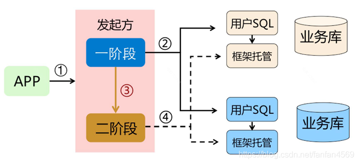
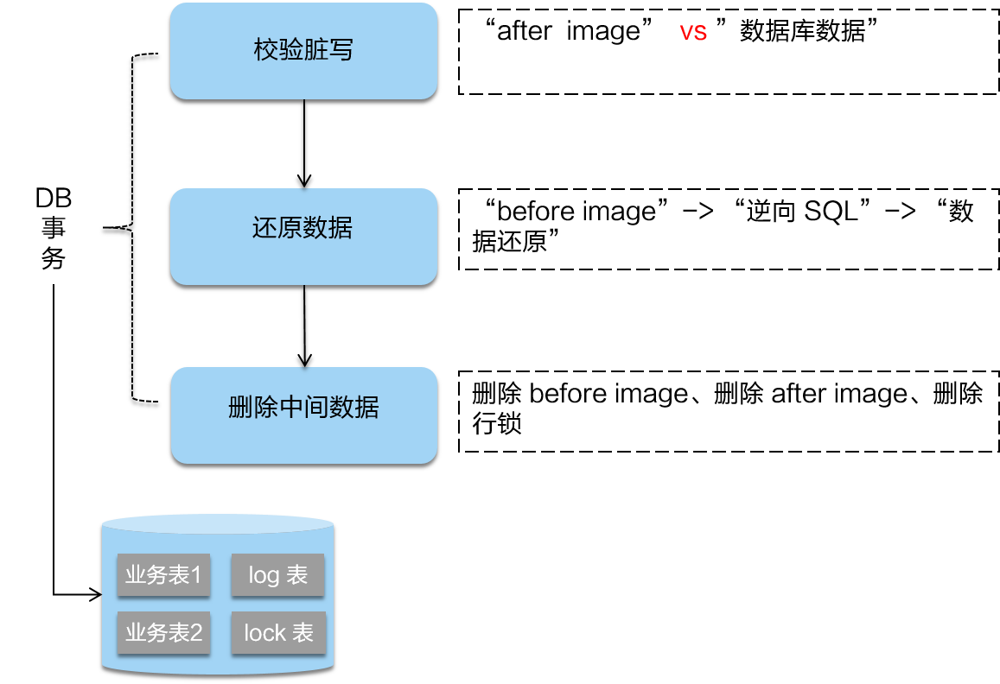

# 初识SEATA四种模式

## 一、简介

Seata：Simple Extensible Autonomous Transaction Architecture：简单可扩展自治事务框架

Seata提供全方位分布式事务解决方案

Seata有四种模式：AT、TCC、Sage、XA

## 二、四种模式

### 1、AT

在 AT 模式下，用户只需关心自己的 “业务SQL”

AT 模式分为两个阶段：

一阶段：执行用户SQL
二阶段：Seata框架自动生成
如图：

1）过程

一阶段
在一阶段，Seata 会拦截“业务 SQL”，首先解析 SQL 语义，找到“业务 SQL”要更新的业务数据，在业务数据被更新前，将其保存成“before image”，然后执行“业务 SQL”更新业务数据，在业务数据更新之后，再将其保存成“after image”，最后生成行锁。以上操作全部在一个数据库事务内完成，这样保证了一阶段操作的原子性。

如图：

二阶段提交
二阶段如果是提交的话，因为“业务 SQL”在一阶段已经提交至数据库， 所以 Seata 框架只需将一阶段保存的快照数据和行锁删掉，完成数据清理即可。

如图：

二阶段回滚
二阶段如果是回滚的话，Seata 就需要回滚一阶段已经执行的“业务 SQL”，还原业务数据。回滚方式便是用“before image”还原业务数据；但在还原前要首先要校验脏写，对比“数据库当前业务数据”和 “after image”，如果两份数据完全一致就说明没有脏写，可以还原业务数据，如果不一致就说明有脏写，出现脏写就需要转人工处理。

如图：

2）优点

AT 模式的一阶段、二阶段提交和回滚均由 Seata 框架自动生成，用户只需编写“业务 SQL”，便能轻松接入分布式事务，AT 模式是一种对业务无任何侵入的分布式事务解决方案。

### 2、TCC

TCC分为三个阶段：

Try：做业务检查和资源预留
Confirm：确认提交
Cancel：业务执行错误需要回滚的状态下执行分支事务的业务取消，预留资源释放

1）过程
Try

Confirm

Cancel

2）三种异常处理
空回滚：Try未执行，Cancel 执行了
出现原因：

幂等：多次调用方法（Confirm）
出现原因：

网络异常
TC Server 异常
悬挂：Cancel接口 比 Try接口先执行
出现原因：

超时

3）优点

相对于 AT 模式，TCC 模式对业务代码有一定的侵入性，但是 TCC 模式无 AT 模式的全局行锁，TCC 性能会比 AT 模式高很多。

### 3、Sage

Sage 是长事务解决方案，事务驱动，参见Event Sourcing

如图：

1）过程
如图：

2）适用场景
业务流程长/多
参与者包含其他公司或遗留系统服务，无法提供 TCC 模式要求的三个接口
典型业务系统：如金融网络（与外部金融机构对接）、互联网微贷、渠道整合、分布式架构服务集成等业务系统
银行业金融机构使用广泛
3）三种异常
空补偿：原服务未执行，补偿服务执行了
出现原因：

原服务超时（丢包）
Saga 事务触发回滚
未收到原服务请求，先收到补偿请求
悬挂：补偿服务比原服务先执行
原服务超时（拥堵）
Saga 事务回滚，触发回滚
拥堵的原服务到达
幂等：原服务与补偿服务都需要保证幂等性
4）优点
一阶段提交本地数据库事务，无锁，高薪能
补偿服务即正向服务的 “反向”，高吞吐
参与者可异步执行，高吞吐

### 4、XA

XA 模式是 Seata 将会开源的另一种无侵入的分布式事务解决方案

1）过程
2）优点
无侵入
将快照数据和行锁等通过 XA 指令委托给了数据库来完成

## 三、如何选择模式

四种分布式事务模式，分别在不同的时间被提出，每种模式都有它的适用场景

- **AT模式**：无侵入的分布式事务解决方案，适用于不希望对业务进行改造的场景，几乎0学习成本。

- **TCC模式**：高性能分布式事务解决方案，适用于核心系统等对性能有很高要求的场景。

- **Saga模式**：长事务解决方案，适用于业务流程长且需要保证事务最终一致性的业务系统，Saga 模式一阶段就会提交本地事务，无锁，长流程情况下可以保证性能，多用于渠道层、集成层业务系统。事务参与者可能是其它公司的服务或者是遗留系统的服务，无法进行改造和提供 TCC 要求的接口，也可以使用 Saga 模式。

- **XA模式**：分布式强一致性的解决方案，但性能低而使用较少。

## 四、资料

https://linux.cn/article-11164-1.html

https://www.sofastack.tech/blog/sofa-meetup-3-seata-retrospect/

https://www.infoq.cn/article/8bu33kuSyJ6P-wAAoELT