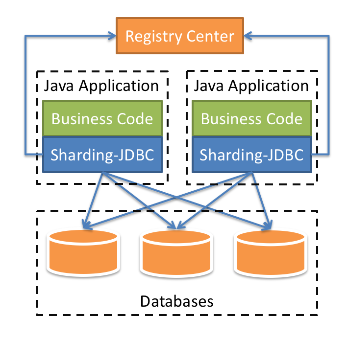
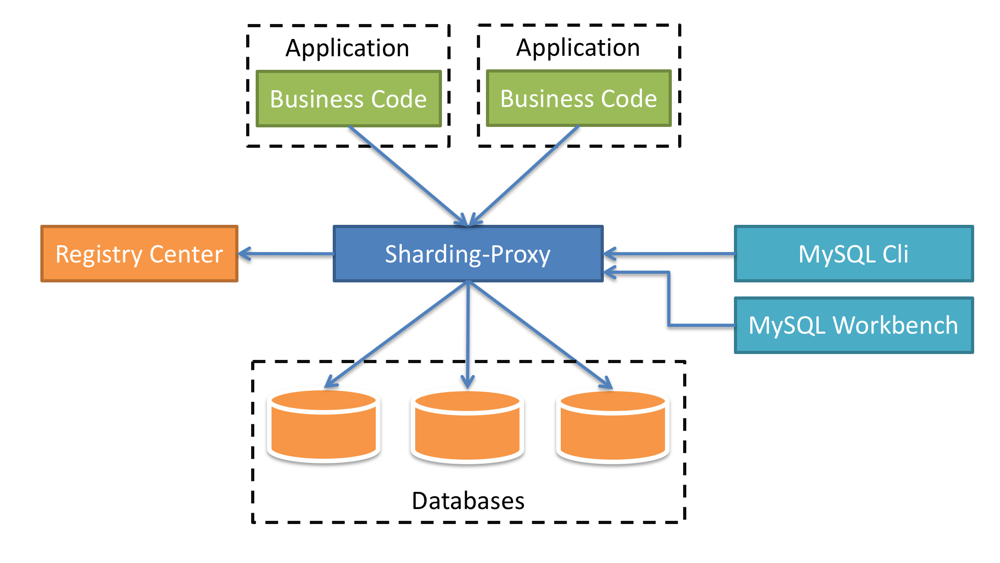

# ShardingSphere Notes

## 体系文档

QLNotes/Coder/MySQL/Sharding Sphere文档.pdf

QLNotes/Coder/MySQL/Sharding Sphere笔记.pdf

QLNotes/Coder/MySQL/MySQL主从配置步骤.pdf

## ShardingSphere基本概念

[官网](https://shardingsphere.apache.org/index_zh.html)、[文档](https://shardingsphere.apache.org/document/current/cn/overview/)

Apache ShardingSphere 是一套**开源的分布式数据库解决方案**组成的生态圈，它由 JDBC、Proxy 和 Sidecar（规划中）这 3 款既能够独立部署，又支持混合部署配合使用的产品组成。 它们均提供标准化的数据水平扩展、分布式事务和分布式治理等功能，可适用于如 Java 同构、异构语言、云原生等各种多样化的应用场景。

Apache ShardingSphere 旨在**充分合理地在分布式的场景下利用关系型数据库的计算和存储能力**，而并非实现一个全新的关系型数据库。 关系型数据库当今依然占有巨大市场份额，是企业核心系统的基石，未来也难于撼动，我们更加注重在原有基础上提供增量，而非颠覆。

Apache ShardingSphere 5.x 版本开始致力于可插拔架构，项目的功能组件能够灵活的以可插拔的方式进行扩展。 目前，数据分片、读写分离、数据加密、影子库压测等功能，以及 MySQL、PostgreSQL、SQLServer、Oracle 等 SQL 与协议的支持，均通过插件的方式织入项目。 开发者能够像使用积木一样定制属于自己的独特系统。Apache ShardingSphere 目前已提供数十个 SPI 作为系统的扩展点，仍在不断增加中。

ShardingSphere 已于2020年4月16日成为 Apache 软件基金会的顶级项目。

### 分库分表概念

#### 垂直

**垂直分表**：把一张表中的字段拆分到多张表中

优点：同一条记录的**并发度**提高，减少不必要的**数据量**传输

缺点：

**垂直分库**：按照业务把数据库拆分为多个数据库，专库专表

优点：服务器的压力分流

缺点：

#### 水平

**水平分表**：按照一定的规则把同一张表的数据分配到多张相同表结构的表中

优点：

缺点：

**水平分库**：按照一定的规则把同一个库的数据分配到多个相同库结构的表中

优点：

缺点：

### 分库分表的应用

1. 在数据库设计的时候考虑垂直分库和垂直分表
2. 随着数据量的增加，首先考虑索引，缓存，读写分离，如果这些都不能满足需求，再去考虑水平分库和水平分表

### 分库分表的问题

- 分库的查询问题：join、分页、排序
- 多数据源问题

## 基本组件

### Sharding-JDBC

#### 官方说明

定位为轻量级 Java 框架，在 Java 的 JDBC 层提供的额外服务。 它使用客户端直连数据库，以 jar 包形式提供服务，无需额外部署和依赖，可理解为增强版的 JDBC 驱动，完全兼容 JDBC 和各种 ORM 框架。

- 适用于任何基于 JDBC 的 ORM 框架，如：JPA, Hibernate, Mybatis, Spring JDBC Template 或直接使用 JDBC。
- 支持任何第三方的数据库连接池，如：DBCP, C3P0, BoneCP, Druid, HikariCP 等。
- 支持任意实现 JDBC 规范的数据库，目前支持 MySQL，Oracle，SQLServer，PostgreSQL 以及任何遵循 SQL92 标准的数据库。

#### 理解总结

1. Sharding-JDBC是一个轻量级 Java 框架，增强版的JDBC驱动
2. Sharding-JDBC的作用：简化分库分表之后的各种数据操作，数据分片、读写分离

#### Sharding-JDBC实操

参照：[官网文档](https://shardingsphere.apache.org/document/current/cn/user-manual/shardingsphere-jdbc/configuration/spring-boot-starter/)

### Sharding-Proxy

定位为透明化的数据库代理端，提供封装了数据库二进制协议的服务端版本，用于完成对异构语言的支持。 目前提供 MySQL 和 PostgreSQL 版本，它可以使用任何兼容 MySQL/PostgreSQL 协议的访问客户端(如：MySQL Command Client, MySQL Workbench, Navicat 等)操作数据，对 DBA 更加友好。

- 向应用程序完全透明，可直接当做 MySQL/PostgreSQL 使用。
- 适用于任何兼容 MySQL/PostgreSQL 协议的的客户端。

#### 理解总结

1. 透明化的数据库代理端
2. 独立安装的应用：https://shardingsphere.apache.org/document/current/cn/downloads/