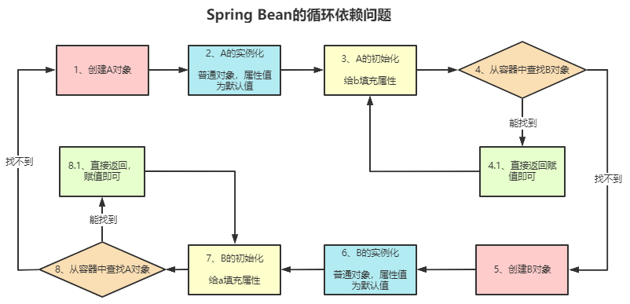
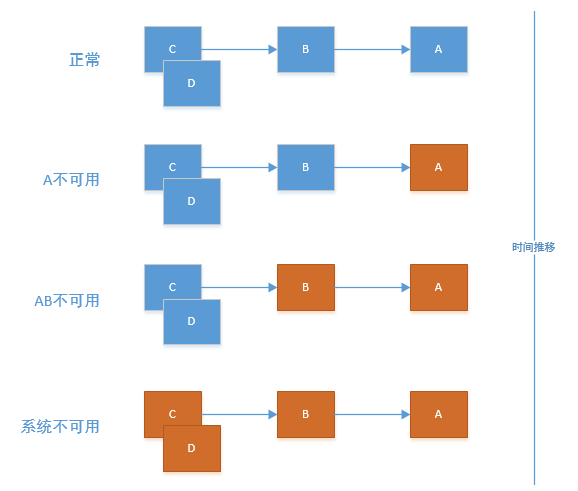
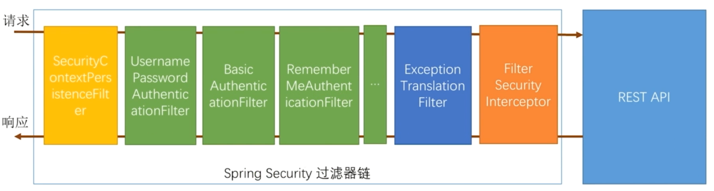

# 实践问题整理

## SpringBoot

### Spring的自动装配与泛型的冲突

可全局搜索已经实现好的Redis工具`Sky/RedisCacheBak`，内部已经实现了泛型，但是没有解决冲突

可能是对泛型的理解还不够

# Spring笔记

## Spring各种中文文档

- Spring FreamWork 中文文档：https://lfvepclr.gitbooks.io/spring-framework-5-doc-cn/content/

- Spring Boot 中文文档 ：https://docshome.gitbooks.io/springboot/content/

- Spring MVC 中文文档 : http://ifeve.com/spring-18-web-mvc/

- Spring Cloud 中文文档：https://www.springcloud.cc/

- Spring Security 中文文档：https://www.springcloud.cc/spring-security-zhcn.html#nsa-websocket-security

- Spring-JPA-Fenix 中文文档：https://blinkfox.github.io/fenix/#/README

## Spring容器初始化完毕监听

开发过程中遇到了要在项目启动后自动开启某个服务，由于使用了spring，我在使用了spring的listener，它有onApplicationEvent（）方法，在Spring容器将所有的Bean都初始化完成之后，就会执行该方法，可以进行加载本地缓存等操作

```java
import org.springframework.context.ApplicationListener;
import org.springframework.context.event.ContextRefreshedEvent;
public class StartAddDataListener implements ApplicationListener<ContextRefreshedEvent> {    
    @Override
    public void onApplicationEvent(ContextRefreshedEvent event) {
        // root application context 没有parent，他就是老大.
        if (event.getApplicationContext().getParent() == null) {
            // 需要执行的逻辑代码，当spring容器初始化完成后就会执行该方法。 
            System.out.println("容器初始化完毕1");
        }        
        // 或者下面这种方式
        if (event.getApplicationContext().getDisplayName().equals("Root WebApplicationContext")) {
            System.out.println("容器初始化完毕2");
        }
    }
}
```

```java
import org.springframework.boot.context.event.ApplicationStartedEvent;
import org.springframework.context.ApplicationListener;
import org.springframework.stereotype.Component;
import lombok.extern.slf4j.Slf4j;

@Slf4j
@Component
public class ApplicationStartedListener implements ApplicationListener<ApplicationStartedEvent> {    
    @Override
    public void onApplicationEvent(ApplicationStartedEvent startedEvent) {
        log.info("ApplicationStartedEvent");
    }    
}
```

## Spring中的事件

1. ContextRefreshedEvent
   - 当容器被实例化或refreshed时发布.如调用refresh()方法，此处的实例化是指所有的bean都已载,后置处理器都被激活,所有单例bean都已被实例化，所有的容器对象都已准备好可使用，如果支持热重载,则refresh可以被触发多次(XmlWebApplicatonContext支持热刷新,而GenericApplicationContext则不支持)
2. ContextStartedEvent
   - 当容器启动时发布,即调用start()方法，已启用意味着所有的Lifecycle bean都已显式接收到信号
3. ContextStoppedEvent
   - 当容器停止时发布,即调用stop()方法，即所有的Lifecycle bean都已显式接收到了stop信号的容器可以通过start()方法重启
4. ContextClosedEvent
   - 当容器关闭时发布,即调用close方法，关闭意味着所有的单例bean都已被销毁,关闭的容器不能或refresh
5. RequestHandledEvent
   - 这只在使用spring的DispatcherServlet时有效,当一个请求被处理完成时发布

## Session监听器

[REFERENCE](https://ke.qq.com/webcourse/index.html#cid=398381&term_id=100558952&taid=4185699033420845&type=1024&vid=5285890797218126105)

```java
import javax.servlet.http.HttpSessionEvent;
import javax.servlet.http.HttpSessionListener;

public class MyHttpSessionListener implements HttpSessionListener {

    public static int online = 0;

    @Override
    public void sessionCreated(HttpSessionEvent se) {
        System.out.println("创建session");
        online++;
    }

    @Override
    public void sessionDestroyed(HttpSessionEvent se) {
        System.out.println("销毁session");
    }
}
```

```java
@Bean
public ServletListenerRegistrationBean listenerRegist(){
    ServletListenerRegistrationBean srb = new ServletListenerRegistrationBean();
    srb.setListener(new MyHttpSessionListener());
    System.out.println("listener");
    return srb;
}
```


# Spring面试题

## 什么是Spring

一个轻量级的容器框架

容器：IoC & AOP

- 大小和开销两方面而言都是轻量级的
- 通过IoC的方式达到解耦的目的
- 通过AOP实现内聚性功能开发
  - 如果没有AOP，那么一些如日志之类的开发代码就会散列在代码中提升了代码的耦合度
- 配置和管理对象的生命周期：容器
- 将简单的配置、组合成为一个复杂的应用：框架


## Spring中AOP的实现

- AOP(Aspect Oriented Programming)：是一种能够在某个方面执行的之前之后插入某些逻辑的一种增强编程方式，它是IoC的一个扩展点(BeanPostProcessor)，即面向切面编程，底层通过动态代理的方式实现
  * JDK
  * CGLib
- Spring是根据代理对象的类型决定使用哪一种动态代理的方式的，如果是实现了接口，就使用JDK的方式，否则使用CGLib
- 总结：
  - AOP是IoC的扩展点：BeanPostProcessor
    - 代理对象的创建(advice，切面，切点)
    - 通过JDK或者CGLib的方式生成代理对象
    - 执行方法调用的时候会调用到DynamicAdvisoredInterceptor的intercept方法
    - 根据定义好的advice生成拦截器链
    - 从拦截器中依次获取每一个advice开始执行
- 案例：日志、异常、监控、事务、权限

## AOP和AspectJ的区别和联系

> [Intro to AspectJ](https://www.baeldung.com/aspectj)

1. 从整体上来讲：
   - AOP是面相切面编程，是一种编程思想
   - AspectJ是AOP的一种落地实现，还有一些其他的框架实现了AOP，如：aspectwerkz、JBoss 4.0等
   - Spring AOP也是AOP思想的一种落地实现
2. 另外从实现机制上来讲
   - AOP一般是通过动态代理来实现的
   - AspectJ是通过编译期字节码直接织入(嵌入)来实现的，使用开源框架ASM做字节码的操作

但是：AOP使用了AspectJ中的注解的定义，如：@Before、@After、@Around

如果一个Bean实现了接口，那么就会采用JDK动态代理来生成实现该接口的代理对象

如果一个Bean没有实现接口，那么就会采用CGLB来生成当前类的一个子类代理对象。

代理对象的作用就是代理原本的Bean对象，代理对象在执行某个方法时，会在该方法的基础上增加一些切面逻辑，使得我们可以利用AOP来实现一些诸如登录校验、权限控制、日志记录等统一功能。

1. Spring AOP和AspectJ之间并没有特别强的关系，AOP表示面向切面编程，这是一种思想，各个组织和个人都可以通过技术来实现这种思想，Aspect)就是其中之一，它会在编译期对类进行增强，所以要用Aspectj，得用Aspectj开发的编泽器来编泽你的项目。
2. SpringAOP则是采用动志代理的方式来实现AOP，只不过觉得AspectJ中设计的那几个注解比较好，比如@Before、@Ater、@Around等，同时也不给程序员造成困扰，所以Spring AOP中会对这几个注解进行支持，虽然注解是相同的，但是底层的支持实现是完全不一样的。

## AOP动态代理在哪里进行的

1. 容器启动的角度，Bean在初始化之后的BeanPostProcessor中
2. 容器启动会把AOP对应的类实例化：
   - `@SpringBootApplication`.`@EnableAutoConfiguration`.`@Import(AutoConfigurationImportSelector)`
   - `AutoConfigurationImportSelector`通过SPI的机制加载所有的`spring.factories`中的`EnableAutoConfiguration`的所有类，这些类中就有一个类`AopAutoConfiguration`，在的静态代码块中：`AopConfigUtils.registerAutoProxy`方法，注册了一个`BeanPostProcessor`
   - 在`DefaultAopProxyFactory.createAopProxy`方法中：如果实现接口就用JDK，否则用CGlib

## Spring中IoC和实现

- IoC(Inverse of Control)：容器，控制反转，依赖注入
  - 所谓IoC就是：在有IoC之前，一个对象的生命周期由使用者进行控制，而有了IoC之后，对象的生命周期管理交给容器。
  - 容器：用来管理Bean的。内部的存储结构使用Map，在Spring中存在三级缓存：singletonObjects、earlySingletonObjects、singletonFactories；singletonObjects就是用来存储这个Bean的，后两个主要是用来解决循环依赖问题的。一个Bean从创建到使用到销毁，管理工作全部都是由容器完成的。

## Spring后置处理器作用

> 后置处理器是Spring的扩展点

Spring的后置处理器有两种：

1. **BeanFactory后置处理器**
   - 启动过程中创建BeanFactory
   - 后置处理器就是用来在BeanFactory创建后做一些事情，如ComponentScan
2. **Bean后置处理器**
   - 创建Bean后做一些事情，如执行
     - @PostConstruct标注的方法
     - afterPropertiesSet方法
     - initMethod
     - 各种aware接口
     - @PreDestroy标注的方法
     - 实现了DispoasbleBean接口的方法
     - 。。。

## SpringBean的生命周期

1. 推断构造方法
2. 实例化
3. 属性填充-依赖注入
4. Aware接口回调
5. 初始化前：
   - 处理@PostConstuct注解
   - 处理 init-method

6. 初始化：处理InitialingBean接口
7. 初始化后：进行AOP的处理


> https://www.bilibili.com/video/BV1584y1r7n6/


> https://daimingzhi.blog.csdn.net/article/details/104786584


### 大厂高频面试题SpringBean生命周期最详解

> https://zhuanlan.zhihu.com/p/451683248


## Spring实例化一个Bean的过程

- 根据类对象生成对应的**BeanDefinition**对象

  * BeanDefinition对象就是对要实例化的Bean的属性描述，比如beanClass、scope、isLazy...
  * scope：prototype：原型Bean，每次Get的时候实例化，singleton：单例Bean，系统启动时实例化
- 根据BeanDefinition信息**实例化**得到一个原始对象

  - 这个里面会推断构造方法，可使用@Autowired注解指定使用哪一个构造方法
- 对象的**属性填充**

  - 循环依赖的处理：这一步骤中就会产生原始对象的代理对象，此时原始创建的对象就成为了一个Bean
  - 这个条件就是循环依赖的场景
- 检查**Aware**相关接口调用：invokeAwareMethod

  - 设置beanName，beanFactory，beanClassLoader
- **初始化**
  - 调用初始化BeanPostProcessor前置方法
    - ApplicationContextPostProcessor，可以设置applicationContext
  - 初始化(InitializingBean接口)

    - 检查是否实现了自定义的init的方法
  - 调用初始化BeanPostProcessor的后置方法

    - AOP就是在这里实现的：AbstractAutoProxyCreator
- 放入单例池(默认情况下)


## Spring容器的启动

 - 通过createBeanFactory方法创建一个BeanFactory：DefaultListableBeanFactory
 - 开始循环创建单例对象
   - 如果这个Bean的类型是单例的，那就调用getBean，doGetBean从BeanFactory中查找，找到就返回
   - 如果查找不到，就会通过createBean，doCreateBean的方法以反射的方法根据BeanDefination中的beanClass来创建原始对象。
   - 调用方法populateBean进行对象的属性填充
   - 调方法initializingBean来进行其他方法的初始化
- Bean创建完成后Spring就会发布一个容器启动事件(ContextRefreshedEvent)，启动结束
  - 其他的一些事件：ContextRefreshedEvent、ContextStartedEvent、RequestHandleEvent、ContextClosedEvent、ContextStoppedEvent等

## Spring解决循环依赖




> [Video：Spring如何处理循环依赖问题](https://www.bilibili.com/video/BV1EA411P7So?p=24&spm_id_from=pageDriver)

解决循环依赖的两种场景：

1、**利用构造方法参数注入填充成员属性**

Spring没有帮我们解决，直接抛异常，需要开发人员自己通过@Lazy的方式解决

2、**成员变量利用@Autowire注解注入成员属性**

- **如果发生循环依赖的对象不需要代理，二级缓存就能解决问题，当存在代理的时候必须使用三级来解决**

- 通过三级缓存解决

  * 使用`context.getBean(A.class)`，旨在获取容器内的单例A，显然初次获取A是不存在的，因此走**A的创建之路**
  * `实例化`A，并将它放进`缓存`，此时A已经实例化完成，已经可以被引用了
  * `初始化`A：`@Autowired`依赖注入B（此时需要去容器内获取B）
  * 为了完成依赖注入B，会通过`context.getBean(B)`去容器内找B。但此时B在容器内不存在，就走向**B的创建之路**
  * `实例化`B，并将其放入缓存。（此时B也能够被引用了）
  * `初始化`B，`@Autowired`依赖注入A（此时需要去容器内获取A）
  * 此处重要：初始化B时会调用`getBean(A)`去容器内找到A，上面我们已经说过了此时候因为A已经实例化完成了并且放进了缓存里，所以这个时候去看缓存里是已经存在A的引用了的，所以`getBean(A)`能够正常返回
  * **B初始化成功**（此时已经注入A成功了，已成功持有A的引用了），return（注意此处return相当于是返回最上面的`context.getBean(B)`这句代码，回到了初始化A的流程中~）。
  * 因为B实例已经成功返回了，因此最终**A也初始化成功**
  * **到此，B持有的已经是初始化完成的A，A持有的也是初始化完成的B**

- Spring的三级缓存具体如下：

  * 一级：ConcurrentHashMap-**singletonObjects**：用来存放已经完全创建好的单例bean[beanName → bean] 实例
  * 二级：HashMap-**earlySingletonObjects**：解决对象依赖问题，用来存放早期的bean[beanName → bean] 实例
  * 三级：HashMap-**singletonFactories**：解决对象依赖问题，用来存放单例bean的ObjectFactory实例，这个Lambda实例(用来保存)可以得到对应的早期对象
  * 临时缓存：Set\<String\> **singletonsCurrentlyInCreation**：对象创建之前会把BeanName添加进去

  
  
  

最简单环境搭建：

```xml
<!--新建Maven项目，添加如下依赖-->
<dependency>
    <groupId>org.springframework</groupId>
    <artifactId>spring-context</artifactId>
    <version>5.2.16.RELEASE</version>
</dependency>
```

```java
package psn.shreker;

import org.springframework.beans.factory.annotation.Autowired;
import org.springframework.stereotype.Component;

@Component
public class A {
    
    @Autowired
    private B b;
    
    public void test() {
        System.out.println("============A===========");
    }
    
}
//=====================================================
package psn.shreker;

import org.springframework.beans.factory.annotation.Autowired;
import org.springframework.stereotype.Component;

@Component
public class B {
    
    @Autowired
    private A a;
    
    public void test() {
        System.out.println("============B===========");
    }
    
}
//=====================================================
package psn.shreker;

import org.springframework.context.annotation.AnnotationConfigApplicationContext;

public class Main {
    
    public static void main(String[] args) {
        AnnotationConfigApplicationContext context = new AnnotationConfigApplicationContext("psn.shreker");
        A a = context.getBean(A.class);
        a.test();
    }
    
}
```

## Spring中三级缓存的实现逻辑

在Spring框架中，`singletonFactories`（三级缓存）中的对象是在bean的创建过程中被放入的。具体来说，当一个bean正在被创建时，如果检测到它依赖于另一个还未创建完成的bean，Spring容器会将当前正在创建的bean的工厂对象放入`singletonFactories`中。

这个过程通常发生在以下时机：

1. **创建Bean实例**：当Spring容器开始创建一个bean实例时，它会首先检查一级缓存（`singletonObjects`）和二级缓存（`earlySingletonObjects`）中是否已经存在该bean的实例。如果不存在，它会继续创建bean的实例。

2. **填充Bean属性**：在bean实例化之后，Spring容器会进行依赖注入，填充bean的属性。如果在这个过程中发现需要注入的bean还未创建，就会触发循环依赖的处理。

3. **创建工厂对象**：为了处理循环依赖，Spring容器会创建一个`ObjectFactory`对象，这个对象能够生成bean的早期引用（即尚未完全初始化的bean）。这个`ObjectFactory`对象随后被放入`singletonFactories`中。

4. **解决循环依赖**：如果存在循环依赖，Spring容器会使用`singletonFactories`中的工厂对象来创建一个早期引用，并将这个引用注入到正在创建的bean中。这样，即使另一个bean还未完全创建，当前bean也能获得它所需的依赖，从而解决循环依赖问题。

5. **完成Bean的创建**：一旦bean的依赖被注入，它会继续完成初始化过程，包括调用初始化方法（如`@PostConstruct`注解的方法或实现了`InitializingBean`接口的`afterPropertiesSet`方法）。完成初始化后，bean的最终实例会被放入一级缓存中。

6. **清理缓存**：在bean创建完成后，Spring容器会从二级缓存和三级缓存中移除对应的条目，以避免内存泄漏。

通过这种方式，Spring容器能够有效地处理单例作用域的bean之间的循环依赖问题。需要注意的是，这种处理方式只适用于单例作用域的bean，并且只解决了构造器注入之外的循环依赖问题。如果存在构造器注入的循环依赖，Spring容器是无法解决的，因为构造器注入要求在bean实例化时就必须提供所有依赖，而此时其他依赖的bean可能还未创建。

## Spring的事务实现

Spring中的事务实现方式有两种，一种是编程式事务，一种是声明式事务，由于编程式事务实现起来相对麻烦，所以现在基本采用声明式事务。

Spring事务的实现基于数据库和AOP机制

事务的处理步骤

1. Spring容器启动的时候会扫描到有@Transactional注解的类，自动给这些类创建代理对象
2. 当有请求的时候，这个请求会直接请求到代理对象上，在代理对象上实现事务的相关的前置后置切面
3. 完成后会判断是否有异常，有异常则回滚，没有异常则提交

## Spring的事务传播机制

- 所谓事务的传播机制讲的是多个事务之间的关系对多个事务对应的方法的影响

- 一共有下面几种：

  | 序号 | 传播类型     | 说明                                       |
  | ---- | ------------ | ------------------------------------------ |
  | 1    | REQUIRED     | 需要一个事务，有则加入，无则新建           |
  | 2    | SUPPORTS     | 支持事务，有则加入，无则以非事务方式运行   |
  | 3    | MANDATORY    | 强制在事务中执行，有则加入，无则异常       |
  | 4    | REQUIRES_NEW | 需要新事务，有则挂起已存在并新建，无则新建 |
  | 5    | NOT_SUPPORT  | 不支持事务，存在挂起，无则以非事务方式运行 |
  | 6    | NEVER        | 不用事务，有则异常，无则以非事务方式运行   |
  | 7    | NESTED       | 嵌套执行，有则嵌套，无则新建               |

- 事务嵌套怎么办

  | 父事务机制 | 子事务机制 | 说明 |
  | ---------- | ---------- | ---- |
  | NESTED     |            |      |

## Spring的Bean的线程安全性

Spring本身并没有针对Bean做线程安全的处理，所以：

1. Bean无状态，那么安全
2. Bean有状态，那么不安全

Bean的线程安全性和scope没有关系，安全性需要我们自己保证，方式：

1. 将scope设置成prototype，很明显有高并发场景的时候不可取
2. 将服务设计成无状态

## Spring的Bean的作用域

- **singleton**：默认，每个容器中只有一个bean的实例，单例的模式由BeanFactory自身来维护。该对象的生命周期是与Spring IOC容器一致的（但在第一次被注入时才会创建）。

- **prototype**：为每一个bean请求提供一个实例。在每次注入时都会创建一个新的对象

- **request**：bean被定义为在每个HTTP请求中创建一个单例对象，也就是说在单个请求中都会复用这一个单例对象。

- **session**：与request范围类似，确保每个session中有一个bean的实例，在session过期后，bean会随之失效。

- **application**：bean被定义为在ServletContext的生命周期中复用一个单例对象。

- **websocket**：bean被定义为在websocket的生命周期中复用一个单例对象。
- **global-session**：全局作用域，global-session和Portlet应用相关。当你的应用部署在Portlet容器中工作时，它包含很多portlet。如果你想要声明让所有的portlet共用全局的存储变量的话，那么这全局变量需要存储在global-session中。全局作用域与Servlet中的session作用域效果相同。

## Spring中用到的设计模式

[Java中的设计模式](https://www.w3cschool.cn/java/java-factory-pattern.html)

|                      设计模式                       | 说明                                                         | Spring案例                                                   | Spring案例解析                                               |            特征            |
| :-------------------------------------------------: | ------------------------------------------------------------ | ------------------------------------------------------------ | ------------------------------------------------------------ | :------------------------: |
|                      简单工厂                       | 由一个工厂类根据传入的参数，动态决定应该创建哪一个产品类。   | BeanFactory                                                  | Spring中的`BeanFactory`就是简单工厂模式的体现，根据传入一个唯一的标识来获得Bean对象，具体到是在传入参数后创建 还是 传入参数前创建这个要根据具体情况来定。`getBean` |                            |
|                      工厂方法                       | 根据类型获取实例<br>[DPFactoryMode.java](Spring.assets/DPFactoryMode.java) | FactoryBean<br/>ProxyFactory                                 | 实现了`FactoryBean`接口的bean是一类叫做factory的bean。特点：spring会在使用getBean()调用获得该bean时，会自动调用该bean的getObject()方法，所以返回的不是factory这个bean，而是这个bean.getOjbect()方法的返回值。 |                            |
|                      单例模式                       | 保证一个类仅有一个实例，并提供一个访问它的全局访问点         | 1、单例Bean<br/>2、SingletonTargetSource<br/>3、DefaultBeanNameGenerator<br/>4、SimpleAutowireCandidateResolver<br/>5、AnnotationAwareOrderComparator | Spring中的单例模式完成了后半句话，即提供了全局的访问点BeanFactory。但没有从构造器级别去控制单例，这是因为spring管理的是任意的java对象。 |                            |
|                     构建器模式                      |                                                              | 1、BeanDifinationBuilder<br/>2、BeanFactoryAspectJAdvisorsBuilder<br/>3、StringBuilder | 1、BeanDifination构建器<br/>2、解析井构造@AspecJ注解的Bean中所定义的Advisor |          Builder           |
| <span style="white-space:nowrap;">适配器模式</span> | 适配器模式作为两个不兼容接口之间的桥梁。通过使用适配器模式，我们可以统一两个不兼容的接口。<br/>[DPAdapterMode.java](Spring.assets/DPAdapterMode.java) | 1、ApplicationListenerMethodAdaptor<br/>2、AdvisorAdaptor<br/>3、HandlerAdapter | Spring定义了一个适配接口，使得每一种Controller有一种对应的适配器实现类，让适配器代替controller执行相应的方法。这样在扩展Controller时，只需要增加一个适配器类就完成了SpringMVC的扩展了。<br/>1、将@EventListener注解的方法适配成ApplicationListener<br/>2、把Advisor适配成MethodInterceptor |          Adapter           |
|                     访问者模式                      |                                                              | 1、PropertyAccessor<br/>2、MessageSourceAccessor             |                                                              |          Accessor          |
|                      装饰模式                       | 动态地给一个对象添加一些额外的职责。就增加功能来说，Decorator模式相比生成子类更为灵活。<br/>[DPDecoratorMode.java](Spring.assets/DPDecoratorMode.java) |                                                              | Spring中用到的装饰器模式在类名上有两种表现：一种是类名中含有Wrapper，另一种是类名中含有Decorator。 |   Wrapper<br/>Decorator    |
|                    动态代理模式                     |                                                              | 1、AOP<br/>2、@Configuration<br/>3、@Lazy                    | 切面在应用运行的时刻被织入。<br/>一般情况下，在织入切面时，AOP容器会为目标对象动态的创建一个代理对象。Spring的AOP就是以这种方式织入切面的。<br/>织入：把切面应用到目标对象并创建新的代理对象的过程。 |                            |
|                     装饰器模式                      |                                                              | 1、BeanWrapper<br/>2、HttpRequestWrapper                     |                                                              |                            |
|                     观察者模式                      | 观察者模式用于在一个对象被修改时通知其相关对象。观察者模式是一种行为模式类别。 | 1、ApplicationListener<br/>2、AdvisedSupportListener         | Spring的事件驱动模型使用的是 观察者模式 ，Spring中Observer模式常用的地方是listener的实现。 | Listener、Event、Multicast |
|                      策略模式                       | 在策略模式中，可以在运行时更改算法。是一种行为模式。我们创建表示各种算法的对象和运行算法的上下文对象。策略对象更改上下文对象上的算法。<br/>[DPStrategyMode.java](Spring.assets/DPStrategyMode.java) | 1、InstantiationStrategy<br/>2、BeanNameGenerator            | Spring框架的资源访问Resource接口。该接口提供了更强的资源访问能力，Spring 框架本身大量使用了Resource 接口来访问底层资源。<br/>在Java中的应用如排序，因为Comparator这个接口简直就是为策略模式而生的。Collections里面有一个sort方法，因为集合里面的元素有可能是复合对象，复合对象并不像基本数据类型，可以根据大小排序，复合对象怎么排序呢基于这个问题考虑，Java要求如果定义的复合对象要有排序的功能，就自行实现Comparable接口或Comparator接口. |                            |
|                    模板方法模式                     | 父类定义了骨架（调用哪些方法及顺序），某些特定方法由子类实现。除了子类要实现的特定方法，其他方法及方法调用顺序都在父类中预先写好了。 | AbstractApplicationContext                                   | refresh方法                                                  |                            |
|                     责任链模式                      |                                                              | 1、DefaultAdvisorChainFactory<br/>2、QualifierAnnotationAutowireCandidateResolver | AOP的时候的拦截器链                                          |                            |
|                     委托者模式                      |                                                              |                                                              |                                                              |          Delegate          |
|                      原型模式                       | 预先创建对象，在使用对象的时候直接clone返回。                |                                                              | 可以指定对象的scope为prototype。使用原型模式创建对象比直接new一个对象在性能上好得多，因为Object类的clone()方法是一个native方法，它直接操作内存中的二进制流，特别是复制大对象时，性能的差别非常明显。 |                            |
|                      外观模式                       | 外观模式要求一个子系统的外部与其内部的通信通过一个统一的外观对象进行，外观类将客户端与子系统的内部复杂性分隔开，使得客户端只需要与外观对象打交道，而不需要与子系统内部的很多对象打交道。<br/>外观模式的目的在于降低系统的复杂程度。 <br/>外观模式从很大程度上提高了**客户端使用的便捷性，使得**客户端无须关心子系统的工作细节，通过外观角色即可调用相关功能。 |                                                              | Tomcat中有很多场景都使用到了**外观模式**，因为Tomcat中有很多不同的组件，每个组件需要相互通信，但又不能将自己内部数据过多地暴露给其他组件。用外观模式隔离数据是个很好的方法。 |                            |
|                     迭代器模式                      | Iterable接口和Iterator接口 这两个都是迭代相关的接口，可以这么认为，实现了Iterable接口，则表示某个对象是可被迭代的；Iterator接口相当于是一个迭代器，实现了Iterator接口，等于具体定义了这个可被迭代的对象时如何进行迭代的。 |                                                              |                                                              |                            |

## Spring事务是如何回滚的

- Spring事务是AOP实现的，首先要生成具体的代理对象，然后根据AOP的流程执行，正常情况下要通过增强来完成核心的事务功能，但事务不是通过增强来实现的，而是TransactionInterceptor的invoke实现
  - 准备工作：解析事务相关属性，根据属性和环境决定是否要开启新的事务，如果需要开启新事物，获取诗句哭连接，关闭自动提交，开启事务
  - 执行SQL
  - 在过程中如果失败，通过接口的completeTransactionAfterThrowing完成事务的回滚，回滚逻辑是通过doRollback实现，注意是用连接对象进行回滚
  - 执行成功，通过commitTransactionAfterReturning完成
  - 事务执行完毕，调用cleanupTransactionInfo清理事务信息
  - TransactionInfo，TransactionStatus

## Spring事务失效的场景

Spring事务基于数据库事务，通过AOP实现，如果事务失效，那么就是AOP有问题了：两个层面：

### 代码层面：

1. 发生自调用
   - 没有使用代理对象调用事务方法而是用对象本身调用。如使用this关键字；
2. 非public方法
   - @Transactional 只能用于 public 的方法上，否则事务不会失效，如果要用在非 public 方法上，可以开启 AspectJ 代理模式。
3. 没有被Spring管理的对象
   - 需要事务处理的方法所在的类必须 被Spring容器管理
4. 异常被吃
   - 如内部的异常被try了

### 数据库层面

1. 存储引擎不支持事务
   - 如MyISAM

## Spring的Bean的自动装配方式

开启自动装配，只需要在xml配置文件中定义"autowire"属性。

`<bean id="cutomer" class="com.xxx.xxx.Customer" autowire="" />`

autowire属性有五种装配的方式：

|  装配方式   | 说明                                                         | 案例                                                         |
| :---------: | ------------------------------------------------------------ | ------------------------------------------------------------ |
|     no      | 手动装配：以value或ref的方式明确指定属性值都是手动装配。需要通过"ref"属性来连接bean。 | -                                                            |
|   byName    | 根据bean的属性名称进行自动装配                               | Cutomer的属性名称是person，Spring会将bean id为person的bean通过setter方法进行自动装配。<br/>`<bean id="cutomer" class="com.xxx.xxx.Cutomer" autowire="byName"/>`<br/>`<bean id="person" class="com.xxx.xxx.Person"/>` |
|   byType    | 根据bean的类型进行自动装配。                                 | Cutomer的属性person的类型为Person，Spirng会将Person类型通过setter方法进行自动装配。<br/>`<bean id="cutomer" class="com.xxx.xxx.Cutomer" autowire="byType"/>`<br/>`<bean id="person" class="com.xxx.xxx.Person"/>` |
| constructor | 类似byType，不过是应用于构造器的参数。如果一个bean与构造器参数的类型形同，则进行自动装配，否则导致异常。 | Cutomer构造函数的参数person的类型为Person，Spirng会将Person类型通过构造方法进行自动装配。<br/>`<bean id="cutomer" class="com.xxx.xxx.Cutomer" autowire="construtor"/>`<br/>`<bean id="person" class="com.xxx.xxx.Person"/>` |
| autodetect  | 如果有默认的构造器，则通过constructor方式进行自动装配，否则使用byType方式进行自动装配。 | -                                                            |

@Autowired自动装配bean，可以在字段、setter方法、构造函数上使用。

## BeanFactory&ApplicationContext

| 区别项                                                | BeanFactory                                                  | ApplicationContext                                           |
| ----------------------------------------------------- | ------------------------------------------------------------ | ------------------------------------------------------------ |
| **关系**                                              | 是ApplicationContext的父类                                   | 是BeanFactory的子类                                          |
| **完善性**                                            | -                                                            | 实现了BeanFactory没有的一些功能，如<br/>获取环境变量(EnvironmentCapable)、<br/>国际化(MessageSource)、<br/>事件发布(ApplicationEventPublisher)、<br/>加载资源(ResourcePatternResolver) |
| **父子上下文**                                        | -                                                            | 可以载入多个（有继承关系）上下文 ，使得每一个上下文都专注于一个特定的层次，比如应用的web层。 |
| **类加载**                                            | 用到某个Bean时(getBean())，才对该Bean进行加载实例化<br/>问题：用到的时候才知道配置有没有问题 | 容器启动时一次性创建了所有的单例Bean<br/>问题：配置的Bean较多时，启动较慢，内存瞬间到达峰值 |
| <span style="white-space:nowrap;">**创建方式**</span> | 编程的方式被创建                                             | 1、编程的方式被创建<br/>2、声明的方式被创建：ContextLoader   |
| **对后置处理器的支持**                                | BeanFactory需要手动注册BeanPostProcessor、BeanFactoryPostProcessor | 自动注册BeanPostProcessor、BeanFactoryPostProcessor          |

ApplicationContext实现TFactoryBean，ApplicationContext不生产Bean，而是通知FactoryBean来进行生产，getBean是一个门面方法:

1. 会自动帮我们把我们配置的bean 注册进来
2. 加载环境变量
3. 支持多语言
4. 实现事件监听
5. 注册很多对外扩展点

## BeanFactory&FactoryBean

- BeanFactory：用来管理Spring中所有的Bean的，是提供了IoC容器最基本的形式，给具体的IoC容器的实现提供了规范
- FactoryBean：用来生产Bean的，是一个能生产或者修饰对象生成的工厂Bean，为IoC容器中Bean的实现提供了更加灵活的方式，FactoryBean在IOC容器的基础上给Bean的实现加上了一个简单工厂模式和装饰模式，一个FactoryBean生产一个Bean
- BeanFactory重要的四个属性
  * beanDefinationMap：每一个BeanFactory生产的Bean的BeanDefination
  * singletonObjects：单例池
  * factoryBeanObjectCache：用来存放实现了FactoryBean接口生成的Bean的对象
  * beanPostProcessors：Bean后置处理器，当一个实例创建完成后，属性填充，Aware调用，初始化等操作都是通过这个Bean对应的后置处理器处理的
- 总结、
  * BeanFactory是Bean生命周期的管理者，FactoryBean只能创建原始对象
  * BeanFactory生成一堆Bean，FactoryBean只能生成一个

## Java对象转化成为Bean的方式

- 自动注入
  * @Bean注解的方式
  * 使用@Import的注解把一个类导入到Spring中
- 手动注入
  * xml：bean.property | constructor-arg
  * 在BeanFactoryPostProcessor中使用beanFactory的registerSingleton的方法注册
  * 实现FactoryBean的方式

## SpringBoot的SPI和Java的SPI的区别

SpringBoot的 SPI（Service Provider Interface）机制和 Java 的 SPI（Service Provider Interface）机制**都是用于实现服务的发现和加载**，但它们在实现和使用上有一定的区别。

### Java 的 SPI

Java 的 SPI 是 JDK 提供的一种服务发现机制，允许第三方实现 JDK 定义的接口。Java SPI 的主要使用场景是为框架或库提供可扩展性，允许第三方在不修改源代码的情况下，通过提供新的实现来扩展框架或库的功能。

Java SPI 的工作原理如下：

1. 在 `META-INF/services` 目录下创建一个以接口全限定名为名称的文件，文件中列出实现该接口的类的全限定名。
2. 当使用 `ServiceLoader` 类加载服务时，它会读取 `META-INF/services` 目录下的配置文件，加载并实例化文件中指定的类。

Java SPI 的缺点包括：

- 加载效率低：每次调用 `ServiceLoader` 加载服务时，都会重新解析 `META-INF/services` 目录下的文件，创建新的 `ServiceLoader` 实例。
- 缺乏灵活性：加载服务时，无法根据上下文条件选择性地加载服务。

### SpringBoot的 SPI

SpringBoot的 SPI 是 SpringBoot提供的一种扩展机制，允许开发者在不修改 SpringBoot源代码的情况下，添加或修改 SpringBoot的行为。SpringBoot的 SPI 机制主要通过 `spring.factories` 文件实现。

SpringBootSPI 的工作原理如下：

1. 在 `resources/META-INF` 目录下创建一个 `spring.factories` 文件。
2. 在 `spring.factories` 文件中，使用 `key=value` 的格式列出需要注册的扩展点和对应的实现类的全限定名。
3. 当 SpringBoot启动时，它会读取 `spring.factories` 文件，根据配置加载并注册扩展点的实现。

SpringBootSPI 的优点包括：

- 加载效率高：SpringBootSPI 机制只在应用启动时加载一次，之后可以重复使用加载的扩展点实现。
- 灵活性高：可以通过配置文件灵活地添加或修改扩展点的实现，而不需要修改 SpringBoot的源代码。

总的来说，SpringBoot的 SPI 机制是对 Java SPI 机制的一种改进和优化，它提供了更高的加载效率和更好的灵活性，使得开发者可以更加方便地扩展 SpringBoot的功能。

## @Import注解

- 用来想Spring中导入一个Bean
- 当这个Bean实现了接口ImportBeanDefinationRegistrar的时候就会执行这个类中方法registerBeanDefinations方法的逻辑

## JVM的类加载与Spring容器的类加载的分工

在Java应用程序中，JVM（Java虚拟机）和Spring容器各自负责类加载的一部分工作，它们之间存在一定的分工。以下是一些关于JVM和Spring容器在类加载方面的分工说明：

### JVM负责的类加载

1. **应用程序启动时的类加载**：
   - JVM在应用程序启动时负责加载Java标准库中的类，以及应用程序主类（main方法所在的类）和其依赖的类。

2. **系统类加载器（System ClassLoader）**：
   - JVM使用系统类加载器来加载应用程序的类路径（classpath）上的类。这是JVM默认的类加载机制。

3. **自定义类加载器**：
   - JVM允许开发者创建自定义的类加载器来加载特定的类或资源。这些自定义类加载器可以用来实现特定的类加载策略，如热部署、模块化加载等。

### Spring容器负责的类加载

1. **Bean定义中的类加载**：
   - 当Spring容器创建Bean时，它会根据Bean定义中的类名来加载相应的类。这个过程由Spring容器的内部机制控制，Spring容器可能会使用JVM的类加载器，也可能使用自定义的类加载器。

2. **依赖注入中的类加载**：
   - 在依赖注入过程中，如果需要加载依赖的类，Spring容器会负责加载这些类。这包括通过构造器注入、setter注入等方式注入的类。

3. **Spring特定的类加载**：
   - Spring框架本身使用自己的类加载机制来加载其内部使用的类，这些类可能不直接暴露给应用程序的类路径。

### 分工协作

- **JVM和Spring容器的协作**：
  - JVM主要负责应用程序的启动和标准类库的加载，而Spring容器则负责管理应用程序中定义的Bean的生命周期，包括类的加载、实例化、依赖注入等。
  - 当Spring容器需要加载一个类时，它会通过JVM的类加载器来完成这个任务。Spring容器可以使用系统类加载器，也可以使用自定义的类加载器，这取决于具体的配置和需求。

- **类加载的灵活性**：
  - Spring容器提供了高度的灵活性，允许开发者通过配置来指定类加载器，或者在Bean定义中指定特定的类加载策略。这使得Spring容器能够适应不同的部署环境和应用程序需求。

总的来说，JVM负责应用程序的启动和标准类库的加载，而Spring容器则负责管理应用程序中定义的Bean的生命周期，包括类的加载、实例化、依赖注入等。两者之间通过类加载器进行协作，以确保应用程序的正常运行。


# Spring面试专题

## 介绍下你的Spring的理解

这个几个维度

### Spring的发展历程

先介绍Spring是怎么来的，发展中有哪些核心的节点，当前的最新版本是什么等


通过上图可以比较清晰的看到Spring的各个时间版本对应的时间节点了。也就是Spring从之前单纯的xml的配置方式，到现在的完全基于注解的编程方式发展。

### Spring的组成

Spring是一个轻量级的IoC和AOP容器框架。是为Java应用程序提供基础性服务的一套框架，目的是用于简化企业应用程序的开发，它使得开发者只需要关心业务需求。常见的配置方式有三种：基于XML的配置、基于注解的配置、基于Java的配置.

主要由以下几个模块组成：

* Spring Core：核心类库，提供IOC服务；
* Spring Context：提供框架式的Bean访问方式，以及企业级功能（JNDI、定时任务等）；
* Spring AOP：AOP服务；
* Spring DAO：对JDBC的抽象，简化了数据访问异常的处理；
* Spring ORM：对现有的ORM框架的支持；
* Spring Web：提供了基本的面向Web的综合特性，例如多方文件上传；
* SpringMVC：提供面向Web应用的Model-View-Controller实现。

### Spring的好处

| 序号 | 好处              | 说明                                                         |
| ---- | ----------------- | :----------------------------------------------------------- |
| 1    | 轻量              | Spring 是轻量的，基本的版本大约2MB。                         |
| 2    | 控制反转          | Spring通过控制反转实现了松散耦合，对象们给出它们的依赖，`<br>`而不是创建或查找依赖的对象们。 |
| 3    | 面向切面编程(AOP) | Spring支持面向切面的编程，并且把应用业务逻辑和系统服务分开。 |
| 4    | 容器              | Spring 包含并管理应用中对象的生命周期和配置。                |
| 5    | MVC框架           | Spring的WEB框架是个精心设计的框架，是Web框架的一个很好的替代品。 |
| 6    | 事务管理          | Spring 提供一个持续的事务管理接口，`<br>`可以扩展到上至本地事务下至全局事务（JTA）。 |
| 7    | 异常处理          | Spring 提供方便的API把具体技术相关的异常 `<br>`(比如由JDBC，Hibernate or JDO抛出的)转化为一致的unchecked 异常。 |
| 8    | 最重要的          | 用的人多！！！                                               |

## Spring框架中用到了哪些设计模式

### 单例模式

单例模式应该是大家印象最深的一种设计模式了。在Spring中最明显的使用场景是在配置文件中配置注册bean对象的时候**设置scope的值为singleton** 。

```xml
<?xml version="1.0" encoding="UTF-8"?>
<beans xmlns="http://www.springframework.org/schema/beans"
  xmlns:xsi="http://www.w3.org/2001/XMLSchema-instance"
  xsi:schemaLocation="http://www.springframework.org/schema/beans 
 http://www.springframework.org/schema/beans/spring-beans.xsd">
  <bean class="com.dpb.pojo.User" id="user" scope="singleton">
    <property name="name" value="波波烤鸭"></property>
  </bean>
</beans>

```

### 原型模式

原型模式也叫克隆模式，Spring中该模式使用的很明显，和单例一样在bean标签中设置scope的属性prototype即表示该bean以克隆的方式生成

```xml
<?xml version="1.0" encoding="UTF-8"?>
<beans xmlns="http://www.springframework.org/schema/beans"
  xmlns:xsi="http://www.w3.org/2001/XMLSchema-instance"
  xsi:schemaLocation="http://www.springframework.org/schema/beans 
 http://www.springframework.org/schema/beans/spring-beans.xsd">
  <bean class="com.dpb.pojo.User" id="user" scope="prototype">
    <property name="name" value="波波烤鸭"></property>
  </bean>
</beans>

```

### 模板模式

模板模式的核心是父类定义好流程，然后将流程中需要子类实现的方法就抽象话留给子类实现，Spring中的JdbcTemplate就是这样的实现。我们知道jdbc的步骤是固定

1. 加载驱动,
2. 获取连接通道,
3. 构建sql语句.
4. 执行sql语句,
5. 关闭资源

在这些步骤中第3步和第四步是不确定的,所以就留给客户实现，而我们实际使用JdbcTemplate的时候也确实是只需要构建SQL就可以了.这就是典型的模板模式。我们以query方法为例来看下JdbcTemplate中的代码.


### 观察者模式

观察者模式定义的是对象间的一种一对多的依赖关系，当一个对象的状态发生改变时，所有依赖于它的对象都得到通知并被自动更新。使用比较场景是在监听器中而spring中Observer模式常用的地方也是listener的实现。如ApplicationListener.


### 工厂模式

**简单工厂模式**：

简单工厂模式就是通过工厂根据传递进来的参数决定产生哪个对象。Spring中我们通过getBean方法获取对象的时候根据id或者name获取就是简单工厂模式了。

```xml
<?xml version="1.0" encoding="UTF-8"?>
<beans xmlns="http://www.springframework.org/schema/beans"
  xmlns:xsi="http://www.w3.org/2001/XMLSchema-instance"
  xmlns:context="http://www.springframework.org/schema/context"
  xsi:schemaLocation="http://www.springframework.org/schema/beans http://www.springframework.org/schema/beans/spring-beans.xsd
    http://www.springframework.org/schema/context http://www.springframework.org/schema/context/spring-context-4.3.xsd">

  <context:annotation-config/>
  <bean class="com.dpb.pojo.User" id="user"  >
    <property name="name" value="波波烤鸭"></property>
  </bean>
</beans>

```

**工厂方法模式**：

在Spring中我们一般是将Bean的实例化直接交给容器去管理的，实现了使用和创建的分离，这时容器直接管理对象，还有种情况是，bean的创建过程我们交给一个工厂去实现，而Spring容器管理这个工厂。这个就是我们讲的工厂模式，在Spring中有两种实现一种是静态工厂方法模式，一种是动态工厂方法模式。以静态工厂来演示

```java
/**
 * User 工厂类
 * @author dpb[波波烤鸭]
 *
 */
public class UserFactory {

  /**
   * 必须是static方法
   * @return
   */
  public static UserBean getInstance(){
    return new UserBean();
  }
}

```

application.xml文件中注册

```xml
<beans xmlns="http://www.springframework.org/schema/beans"
  xmlns:xsi="http://www.w3.org/2001/XMLSchema-instance"
  xsi:schemaLocation="http://www.springframework.org/schema/beans 
  http://www.springframework.org/schema/beans/spring-beans.xsd">
  <!-- 静态工厂方式配置 配置静态工厂及方法 -->
  <bean class="com.dpb.factory.UserFactory" factory-method="getInstance" id="user2"/>
</beans>

```

### 适配器模式

将一个类的接口转换成客户希望的另外一个接口。使得原本由于接口不兼容而不能一起工作的那些类可以在一起工作。这就是适配器模式。在Spring中在AOP实现中的Advice和interceptor之间的转换就是通过适配器模式实现的。

```java
class MethodBeforeAdviceAdapter implements AdvisorAdapter, Serializable {

  @Override
  public boolean supportsAdvice(Advice advice) {
    return (advice instanceof MethodBeforeAdvice);
  }

  @Override
  public MethodInterceptor getInterceptor(Advisor advisor) {
    MethodBeforeAdvice advice = (MethodBeforeAdvice) advisor.getAdvice();
    // 通知类型匹配对应的拦截器
    return new MethodBeforeAdviceInterceptor(advice);
  }
}

```

### 装饰者模式

装饰者模式又称为包装模式(Wrapper),作用是用来动态的为一个对象增加新的功能。装饰模式是一种用于代替继承的技术，无须通过继承增加子类就能扩展对象的新功能。使用对象的关联关系代替继承关系，更加灵活，同时避免类型体系的快速膨胀。
spring中用到的包装器模式在类名上有两种表现：一种是类名中含有Wrapper，另一种是类名中含有Decorator。基本上都是动态地给一个对象添加一些额外的职责。
具体的使用在Spring session框架中的SessionRepositoryRequestWrapper使用包装模式对原生的request的功能进行增强，可以将session中的数据和分布式数据库进行同步，这样即使当前tomcat崩溃，session中的数据也不会丢失。

```xml
<dependency>
  <groupId>org.springframework.session</groupId>
  <artifactId>spring-session</artifactId>
  <version>1.3.1.RELEASE</version>
</dependency>

```

### 代理模式

代理模式应该是大家非常熟悉的设计模式了，在Spring中AOP的实现中代理模式使用的很彻底.

### 策略模式

策略模式对应于解决某一个问题的一个算法族，允许用户从该算法族中任选一个算法解决某一问题，同时可以方便的更换算法或者增加新的算法。并且由客户端决定调用哪个算法，spring中在实例化对象的时候用到Strategy模式。XmlBeanDefinitionReader,PropertiesBeanDefinitionReader

### 责任链默认

AOP中的拦截器链

### 委托者模式

DelegatingFilterProxy，整合Shiro，SpringSecurity的时候都有用到。

.....

## Autowired和Resource关键字的区别

这是一个相对比较简单的问题，@Resource和@Autowired都是做bean的注入时使用，其实@Resource并不是Spring的注解，它的包是javax.annotation.Resource，需要导入，但是Spring支持该注解的注入。

### 共同点

两者都可以写在字段和setter方法上。两者如果都写在字段上，那么就不需要再写setter方法.

### 不同点

**@Autowired**

@Autowired为Spring提供的注解，需要导入org.springframework.beans.factory.annotation.Autowired;只按照byType注入。

```java
public class TestServiceImpl {
    // 下面两种@Autowired只要使用一种即可
    @Autowired
    private UserDao userDao; // 用于字段上

    @Autowired
    public void setUserDao(UserDao userDao) { // 用于属性的方法上
        this.userDao = userDao;
    }
}
```

@Autowired注解是按照类型（byType）装配依赖对象，默认情况下它要求依赖对象必须存在，如果允许null值，可以设置它的required属性为false。如果我们想使用按照名称（byName）来装配，可以结合@Qualififier注解一起使用。如下：

```java
public class TestServiceImpl {
 @Autowired
 @Qualifier("userDao")
 private UserDao userDao; }
```

**@Resource**

@Resource默认按照ByName自动注入，由J2EE提供，需要导入包javax.annotation.Resource。@Resource有两个重要的属性：name和type，而Spring将@Resource注解的name属性解析为bean的名字，而type属性则解析为bean的类型。所以，如果使用name属性，则使用byName的自动注入策略，而使用type属性时则使用byType自动注入策略。如果既不制定name也不制定type属性，这时将通过反射机制使用byName自动注入策略.

```java
public class TestServiceImpl {
    // 下面两种@Resource只要使用一种即可
    @Resource(name="userDao")
    private UserDao userDao; // 用于字段上

    @Resource(name="userDao")
    public void setUserDao(UserDao userDao) { // 用于属性的setter方法上
        this.userDao = userDao;
    }
}
```

@Resource装配顺序：

1. 如果同时指定了name和type，则从Spring上下文中找到唯一匹配的bean进行装配，找不到则抛出异常。
2. 如果指定了name，则从上下文中查找名称（id）匹配的bean进行装配，找不到则抛出异常。
3. 如果指定了type，则从上下文中找到类似匹配的唯一bean进行装配，找不到或是找到多个，都会抛出异常。
4. 如果既没有指定name，又没有指定type，则自动按照byName方式进行装配；如果没有匹配，则回退为一个原始类型进行匹配，如果匹配则自动装配。

@Resource的作用相当于@Autowired，只不过@Autowired按照byType自动注入。

## Spring中常用的注解有哪些，重点介绍几个

@Controller  @Service @RestController @RequestBody,@Indexed  @Import等

@Indexed提升 @ComponentScan的效率

@Import注解是import标签的替换，在SpringBoot的自动装配中非常重要，也是EnableXXX的前置基础。

## 循环依赖

面试的重点，大厂必问之一：

### 什么是循环依赖

看下图


上图是循环依赖的三种情况，虽然方式有点不一样，但是循环依赖的本质是一样的，就你的完整创建要依赖与我，我的完整创建也依赖于你。相互依赖从而没法完整创建造成失败。

### 代码演示

我们再通过代码的方式来演示下循环依赖的效果

```java
public class CircularTest {

    public static void main(String[] args) {
        new CircularTest1();
    }
}
class CircularTest1{
    private CircularTest2 circularTest2 = new CircularTest2();
}

class CircularTest2{
    private CircularTest1 circularTest1 = new CircularTest1();
}
```

执行后出现了 StackOverflowError 错误


上面的就是最基本的循环依赖的场景，你需要我，我需要你，然后就报错了。而且上面的这种设计情况我们是没有办法解决的。那么针对这种场景我们应该要怎么设计呢这个是关键！

### 分析问题

首先我们要明确一点就是如果这个对象A还没创建成功，在创建的过程中要依赖另一个对象B，而另一个对象B也是在创建中要依赖对象A，这种肯定是无解的，这时我们就要转换思路，我们先把A创建出来，但是还没有完成初始化操作，也就是这是一个半成品的对象，然后在赋值的时候先把A暴露出来，然后创建B，让B创建完成后找到暴露的A完成整体的实例化，这时再把B交给A完成A的后续操作，从而揭开了循环依赖的密码。也就是如下图：


### 自己解决

明白了上面的本质后，我们可以自己来尝试解决下：

先来把上面的案例改为set/get来依赖关联

```java
public class CircularTest {

    public static void main(String[] args) throws Exception{
        System.out.println(getBean(CircularTest1.class).getCircularTest2());
        System.out.println(getBean(CircularTest2.class).getCircularTest1());
    }

    private static <T> T getBean(Class<T> beanClass) throws Exception{
        // 1.获取 实例对象
        Object obj = beanClass.newInstance();
        // 2.完成属性填充
        Field[] declaredFields = obj.getClass().getDeclaredFields();
        // 遍历处理
        for (Field field : declaredFields) {
            field.setAccessible(true); // 针对private修饰
            // 获取成员变量 对应的类对象
            Class<?> fieldClass = field.getType();
            // 获取对应的 beanName
            String fieldBeanName = fieldClass.getSimpleName().toLowerCase();
            // 给成员变量赋值 如果 singletonObjects 中有半成品就获取，否则创建对象
            field.set(obj,getBean(fieldClass));
        }
        return (T) obj;
    }
}

class CircularTest1{
    private CircularTest2 circularTest2;

    public CircularTest2 getCircularTest2() {
        return circularTest2;
    }

    public void setCircularTest2(CircularTest2 circularTest2) {
        this.circularTest2 = circularTest2;
    }
}

class CircularTest2{
    private CircularTest1 circularTest1;

    public CircularTest1 getCircularTest1() {
        return circularTest1;
    }

    public void setCircularTest1(CircularTest1 circularTest1) {
        this.circularTest1 = circularTest1;
    }
}
```

然后我们再通过把对象实例化和成员变量赋值拆解开来处理。从而解决循环依赖的问题

```java
public class CircularTest {
    // 保存提前暴露的对象，也就是半成品的对象
    private final static Map<String,Object> singletonObjects = new ConcurrentHashMap<>();

    public static void main(String[] args) throws Exception{
        System.out.println(getBean(CircularTest1.class).getCircularTest2());
        System.out.println(getBean(CircularTest2.class).getCircularTest1());
    }

    private static <T> T getBean(Class<T> beanClass) throws Exception{
        //1.获取类对象对应的名称
        String beanName = beanClass.getSimpleName().toLowerCase();
        // 2.根据名称去 singletonObjects 中查看是否有半成品的对象
        if(singletonObjects.containsKey(beanName)){
            return (T) singletonObjects.get(beanName);
        }
        // 3. singletonObjects 没有半成品的对象，那么就反射实例化对象
        Object obj = beanClass.newInstance();
        // 还没有完整的创建完这个对象就把这个对象存储在了 singletonObjects中
        singletonObjects.put(beanName,obj);
        // 属性填充来补全对象
        Field[] declaredFields = obj.getClass().getDeclaredFields();
        // 遍历处理
        for (Field field : declaredFields) {
            field.setAccessible(true); // 针对private修饰
            // 获取成员变量 对应的类对象
            Class<?> fieldClass = field.getType();
            // 获取对应的 beanName
            String fieldBeanName = fieldClass.getSimpleName().toLowerCase();
            // 给成员变量赋值 如果 singletonObjects 中有半成品就获取，否则创建对象
            field.set(obj,singletonObjects.containsKey(fieldBeanName)?
                    singletonObjects.get(fieldBeanName):getBean(fieldClass));
        }
        return (T) obj;
    }
}

class CircularTest1{
    private CircularTest2 circularTest2;

    public CircularTest2 getCircularTest2() {
        return circularTest2;
    }

    public void setCircularTest2(CircularTest2 circularTest2) {
        this.circularTest2 = circularTest2;
    }
}

class CircularTest2{
    private CircularTest1 circularTest1;

    public CircularTest1 getCircularTest1() {
        return circularTest1;
    }

    public void setCircularTest1(CircularTest1 circularTest1) {
        this.circularTest1 = circularTest1;
    }
}
```

运行程序你会发现问题完美的解决了


在上面的方法中的核心是getBean方法，Test1 创建后填充属性时依赖Test2，那么就去创建 Test2，在创建 Test2 开始填充时发现依赖于 Test1，但此时 Test1 这个半成品对象已经存放在缓存到 `singletonObjects` 中了，所以Test2可以正常创建，在通过递归把 Test1 也创建完整了。


最后总结下该案例解决的本质：


### Spring循环依赖

针对Spring中Bean对象的各种场景。支持的方案不一样：


然后我们再来看看Spring中是如何解决循环依赖问题的呢刚刚上面的案例中的对象的生命周期的核心就两个


而Spring创建Bean的生命周期中涉及到的方法就很多了。下面是简单列举了对应的方法


基于前面案例的了解，我们知道肯定需要在调用构造方法方法创建完成后再暴露对象，在Spring中提供了三级缓存来处理这个事情，对应的处理节点如下图：


对应到源码中具体处理循环依赖的流程如下：


上面就是在Spring的生命周期方法中和循环依赖出现相关的流程了。那么源码中的具体处理是怎么样的呢我们继续往下面看。

首先在调用构造方法的后会放入到三级缓存中


下面就是放入三级缓存的逻辑

```java
  protected void addSingletonFactory(String beanName, ObjectFactory<?> singletonFactory) {
    Assert.notNull(singletonFactory, "Singleton factory must not be null");
    // 使用singletonObjects进行加锁，保证线程安全
    synchronized (this.singletonObjects) {
      // 如果单例对象的高速缓存【beam名称-bean实例】没有beanName的对象
      if (!this.singletonObjects.containsKey(beanName)) {
        // 将beanName,singletonFactory放到单例工厂的缓存【bean名称 - ObjectFactory】
        this.singletonFactories.put(beanName, singletonFactory);
        // 从早期单例对象的高速缓存【bean名称-bean实例】 移除beanName的相关缓存对象
        this.earlySingletonObjects.remove(beanName);
        // 将beanName添加已注册的单例集中
        this.registeredSingletons.add(beanName);
      }
    }
  }
```

然后在填充属性的时候会存入二级缓存中

```java
earlySingletonObjects.put(beanName,bean);
registeredSingletons.add(beanName);
```

最后把创建的对象保存在了一级缓存中

```java
  protected void addSingleton(String beanName, Object singletonObject) {
    synchronized (this.singletonObjects) {
      // 将映射关系添加到单例对象的高速缓存中
      this.singletonObjects.put(beanName, singletonObject);
      // 移除beanName在单例工厂缓存中的数据
      this.singletonFactories.remove(beanName);
      // 移除beanName在早期单例对象的高速缓存的数据
      this.earlySingletonObjects.remove(beanName);
      // 将beanName添加到已注册的单例集中
      this.registeredSingletons.add(beanName);
    }
  }
```

### 疑问点

这些疑问点也是面试官喜欢问的问题点

#### 为什么需要三级缓存

三级缓存主要处理的是AOP的代理对象，存储的是一个ObjectFactory

三级缓存考虑的是带你对象，而二级缓存考虑的是性能-从三级缓存的工厂里创建出对象，再扔到二级缓存（这样就不用每次都要从工厂里拿）

#### 没有三级环境能解决吗

没有三级缓存是可以解决循环依赖问题的

#### 三级缓存分别什么作用

一级缓存：正式对象

二级缓存：半成品对象

三级缓存：工厂


## 说说事务的隔离级别

事务隔离级别指的是一个事务对数据的修改与另一个并行的事务的隔离程度，当多个事务同时访问相同数据时，如果没有采取必要的隔离机制，就可能发生以下问题：

|    问题    | 描述                                                         |
| :--------: | :----------------------------------------------------------- |
|    脏读    | 一个事务读到另一个事务未提交的更新数据，所谓脏读，就是指事务A读到了事务B还没有提交的数据，比如银行取钱，事务A开启事务，此时切换到事务B，事务B开启事务-->取走100元，此时切换回事务A，事务A读取的肯定是数据库里面的原始数据，因为事务B取走了100块钱，并没有提交，数据库里面的账务余额肯定还是原始余额，这就是脏读 |
|    幻读    | 是指当事务不是独立执行时发生的一种现象，例如第一个事务对一个表中的数据进行了修改，这种修改涉及到表中的全部数据行。 同时，第二个事务也修改这个表中的数据，这种修改是向表中插入一行新数据。那么，以后就会发生操作第一个事务的用户发现表中还有没有修改的数据行，就好象 发生了幻觉一样。 |
| 不可重复读 | 在一个事务里面的操作中发现了未被操作的数据 比方说在同一个事务中先后执行两条一模一样的select语句，期间在此次事务中没有执行过任何DDL语句，但先后得到的结果不一致，这就是不可重复读 |

**Spring支持的隔离级别**

| 隔离级别        | 描述                                                         |
| :-------------- | :----------------------------------------------------------- |
| DEFAULT         | 使用数据库本身使用的隔离级别 `<br>` ORACLE（读已提交） MySQL（可重复读） |
| READ_UNCOMITTED | 读未提交（脏读）最低的隔离级别，一切皆有可能。               |
| READ_COMMITED   | 读已提交，ORACLE默认隔离级别，有幻读以及不可重复读风险。     |
| REPEATABLE_READ | 可重复读，解决不可重复读的隔离级别，但还是有幻读风险。       |
| SERLALIZABLE    | 串行化，最高的事务隔离级别，不管多少事务，挨个运行完一个事务的所有子事务之后才可以执行另外一个事务里面的所有子事务，这样就解决了脏读、不可重复读和幻读的问题了 |


再必须强调一遍，不是事务隔离级别设置得越高越好，事务隔离级别设置得越高，意味着势必要花手段去加锁用以保证事务的正确性，那么效率就要降低，因此实际开发中往往要在效率和并发正确性之间做一个取舍，一般情况下会设置为READ_COMMITED，此时避免了脏读，并发性也还不错，之后再通过一些别的手段去解决不可重复读和幻读的问题就好了。

## 事务的传播行为

保证事务：ACID

事务的传播行为针对的是嵌套的关系

Spring中的7个事务传播行为:

| 事务行为                  | 说明                                                         |
| :------------------------ | :----------------------------------------------------------- |
| PROPAGATION_REQUIRED      | 支持当前事务，假设当前没有事务。就新建一个事务               |
| PROPAGATION_SUPPORTS      | 支持当前事务，假设当前没有事务，就以非事务方式运行           |
| PROPAGATION_MANDATORY     | 支持当前事务，假设当前没有事务，就抛出异常                   |
| PROPAGATION_REQUIRES_NEW  | 新建事务，假设当前存在事务。把当前事务挂起                   |
| PROPAGATION_NOT_SUPPORTED | 以非事务方式运行操作。假设当前存在事务，就把当前事务挂起     |
| PROPAGATION_NEVER         | 以非事务方式运行，假设当前存在事务，则抛出异常               |
| PROPAGATION_NESTED        | 如果当前存在事务，则在嵌套事务内执行。如果当前没有事务，则执行与PROPAGATION_REQUIRED类似的操作。 |

**举例说明**

**案例代码**

ServiceA

```java
ServiceA {   
     void methodA() {
         ServiceB.methodB();
     }
}
```

ServiceB

```java
ServiceB { 
     void methodB() {
     }  
}
```

#### 1.PROPAGATION_REQUIRED

假如当前正要运行的事务不在另外一个事务里，那么就起一个新的事务 比方说，ServiceB.methodB的事务级别定义PROPAGATION_REQUIRED, 那么因为执行ServiceA.methodA的时候，ServiceA.methodA已经起了事务。这时调用ServiceB.methodB，ServiceB.methodB看到自己已经执行在ServiceA.methodA的事务内部。就不再起新的事务。而假如ServiceA.methodA执行的时候发现自己没有在事务中，他就会为自己分配一个事务。这样，在ServiceA.methodA或者在ServiceB.methodB内的不论什么地方出现异常。事务都会被回滚。即使ServiceB.methodB的事务已经被提交，可是ServiceA.methodA在接下来fail要回滚，ServiceB.methodB也要回滚


#### 2.PROPAGATION_SUPPORTS

假设当前在事务中。即以事务的形式执行。假设当前不在一个事务中，那么就以非事务的形式执行

#### 3PROPAGATION_MANDATORY

必须在一个事务中执行。也就是说，他仅仅能被一个父事务调用。否则，他就要抛出异常

#### 4.PROPAGATION_REQUIRES_NEW

这个就比较绕口了。 比方我们设计ServiceA.methodA的事务级别为PROPAGATION_REQUIRED，ServiceB.methodB的事务级别为PROPAGATION_REQUIRES_NEW。那么当运行到ServiceB.methodB的时候，ServiceA.methodA所在的事务就会挂起。ServiceB.methodB会起一个新的事务。等待ServiceB.methodB的事务完毕以后，他才继续运行。
他与PROPAGATION_REQUIRED 的事务差别在于事务的回滚程度了。由于ServiceB.methodB是新起一个事务，那么就是存在两个不同的事务。假设ServiceB.methodB已经提交，那么ServiceA.methodA失败回滚。ServiceB.methodB是不会回滚的。假设ServiceB.methodB失败回滚，假设他抛出的异常被ServiceA.methodA捕获，ServiceA.methodA事务仍然可能提交。


#### 5.PROPAGATION_NOT_SUPPORTED

当前不支持事务。比方ServiceA.methodA的事务级别是PROPAGATION_REQUIRED 。而ServiceB.methodB的事务级别是PROPAGATION_NOT_SUPPORTED ，那么当执行到ServiceB.methodB时。ServiceA.methodA的事务挂起。而他以非事务的状态执行完，再继续ServiceA.methodA的事务。

#### 6.PROPAGATION_NEVER

不能在事务中执行。
如果ServiceA.methodA的事务级别是PROPAGATION_REQUIRED。 而ServiceB.methodB的事务级别是PROPAGATION_NEVER ，那么ServiceB.methodB就要抛出异常了。

#### 7.PROPAGATION_NESTED

如果当前存在事务，则在嵌套事务内执行。如果当前没有事务，则执行与PROPAGATION_REQUIRED类似的操作。

## Spring事务实现的方式

1. **编程式事务管理**：这意味着你可以通过编程的方式管理事务，这种方式带来了很大的灵活性，但很难维护。
2. **声明式事务管理**：这种方式意味着你可以将事务管理和业务代码分离。你只需要通过注解或者XML配置管理事务。

## 事务注解的本质是什么

@Transactional 这个注解仅仅是一些（和事务相关的）元数据，在运行时被事务基础设施读取消费，并使用这些元数据来配置bean的事务行为。 大致来说具有两方面功能，一是表明该方法要参与事务，二是配置相关属性来定制事务的参与方式和运行行为

声明式事务主要是得益于Spring AOP。使用一个事务拦截器，在方法调用的前后/周围进行事务性增强（advice），来驱动事务完成。

@Transactional注解既可以标注在类上，也可以标注在方法上。当在类上时，默认应用到类里的所有方法。如果此时方法上也标注了，则方法上的优先级高。 另外注意方法一定要是public的。

https://cloud.fynote.com/share/d/IVeyV0Jp

## 谈谈你对BeanFactory和ApplicationContext的理解

目的：考察对IoC的理解

BeanFactory:Bean工厂 ==》IoC容器

BeanDefinition ===》Bean定义

BeanDefinitionRegistry ==》 BeanDefinition 和 BeanFactory的关联

....

ApplicationContext:应用上下文

ApplicationContext ac = new ClasspathXmlApplicationContext(xxx.xml);

## 谈谈你对BeanFactoryPostProcessor的理解

BeanFactoryPostProcessor:是在BeanFactory创建完成后的后置处理

BeanFactory：对外提供Bean对象

需要知道怎么提供Bean对象-->BeanDefinition

XML/注解 --》 BeanDefinition --》注册 --》完成BeanFactory的处理

1. 需要交代BeanFactoryPostProcessor的作用

2. 举个例子

@Configuration 注解 --》 Java被 @Configuration注解标识--> 这是一个Java配置类

@Configuration--》@Component -->BeanDefinition --> 存储在BeanFactory中  是当做一个普通的Bean管理的

@Bean  @Primary 。。。。

ConfigurationClassPostProcessor

## 谈谈你对BeanPostProcessor的理解

针对Bean对象初始化前后。 针对Bean对象创建之后的处理操作。

SpringIoC 核心流程

BeanDefinition --> 注册BeanDefinition -->BeanFactory --》BeanFactory的后置处理 --> 单例bean -->  AOP  --》 代理对象 ---> advice pointcut join point 。。。

BeanPostProcessor 提供了一种扩展机制

自定义接口的实现 --》 **注册**到BeanFactory的 Map中

BeanDefinition --> 注册BeanDefinition -->BeanFactory --》BeanFactory的后置处理 --> 单例bean -->

遍历上面的Map 执行相关的行为 --> 。。。。。

==》 AOP

IoC 和AOP的关系

有了IoC 才有 AOP  DI

## 谈谈你对SpringMVC的理解

控制框架：前端控制器--》Servlet --》Web容器【Tomcat】

SpringMVC和Spring的关系  IoC容器关系--》父子关系

https://www.processon.com/view/link/63dc99aba7d181715d1f4569

Spring和SpringMVC的关系理解

Spring和SpringMVC整合的项目中

Controller  Service Dao

具体的有两个容器Spring中的IoC容器。然后SpringMVC中也有一个IoC容器

Controller中定义的实例都是SpringMVC组件维护的

Service和Dao中的实例都是由Spring的IoC容器维护的

这两个容器有一个父子容器的关系

Spring容器是SpringMVC容器的父容器

## 谈谈你对DelegatingFilterProxy的理解

web.xml

Shiro SpringSecurity

Spring整合的第三方的组件会非常多

JWT  单独登录  OAuth2.0

组件：组合起来的零件--》组件  组合起来的技术栈--》组件框架

## 谈谈你对SpringBoot的理解

约定由于配置

自动装配

SpringBoot和Spring的关系

SpringBoot的初始化 --> IoC Spring的初始化

SpringBoot的启动 --> IoC

@SpringApplication注解 --> @Configuration -->ConfigurationClassPostProcessor --》 @Import注解 --》 延迟加载 --》 自动装配 --> SPI  去重 排除 过滤

spring.factories

SSM框架的整合

1. 导入依赖
2. 添加配置文件
3. 设置配置文件 web.xml

## 介绍下Import注解的理解

@Import注解是在Spring3.0的时候提供。目的是为了替换在XML配置文件中的import标签。

@Import注解除了可以导入第三方的Java配置类还扩展了其他的功能

1. 可以把某个类型的对象注入到容器中
2. 导入的类型如果实现了ImportSelector接口。那么会调用接口中声明的方法。然后把方法返回的类型全类路径的类型对象注入到容器中
3. 如果导入的类型实现了ImportBeanDefinitionRegistrar这个接口。那么就会调用声明的方法在该方法中显示的提供注册器来完成注入

## SpringBoot自动装配中为什么用DeferredImportSelector

在SpringBoot自动装配中核心是会加载所有依赖中的META-INF/spring.factories文件中的配置信息。

我们可以有多个需要加载的spring.factories文件。那么我们就需要多次操作。我们可以考虑把所有的信息都加载后再统一把这些需要注入到容器中的内容注入进去

DeferredImportSelector：延迟注入Bean实例的作用

## SpringBoot中bootstrap.yml文件作用

在单体的SpringBoot项目中其实我们是用不到bootstrap.yml文件的，bootsrap.yml文件的使用需要SpringCloud的支持，因为在微服务环境下我们都是有配置中心的，来统一的管理系统的相关配置属性，那么怎么去加载配置中心的内容呢一个SpringBoot项目启动的时候默认只会加载对应的application.yml中的相关信息，这时bootstrap.yml的作用就体现出来了，会在SpringBoot正常启动前创建一个父容器来通过bootstrap.yml中的配置来加载配置中心的内容。

## 如果要对属性文件中的账号密码加密如何实现

> 搞一个Bean，实现接口即可

通过自定义监听器可以在加载解析了配置文件之后对加密的文件中做解密处理同时覆盖之前加密的内容，或者通过对应的后置处理器来处理，具体的实现如下：


然后我们通过案例代码来演示下，加深大家的理解
首先我们在属性文件中配置加密后的信息

```properties
spring.datasource.driverClassName=com.mysql.cj.jdbc.Driver
spring.datasource.url=jdbc:mysql://localhost:3306/mb?serverTimezone=UTC&useUnicode=true&characterEncoding=utf-8&useSSL=true
spring.datasource.username=root
## 对通过3DES对密码加密
spring.datasource.password=t5Jd2CzFWEw=

spring.datasource.type=com.alibaba.druid.pool.DruidDataSource

mybatis.mapper-locations=classpath:mapper/*.xml
```

在SpringBoot项目启动的时候在在刷新Spring容器之前执行的，所以我们要做的就是在加载完环境配置信息后，获取到配置的 `spring.datasource.password=t5Jd2CzFWEw=` 这个信息，然后解密并修改覆盖就可以了。
然后在属性文件的逻辑其实是通过发布事件触发对应的监听器来实现的


所以第一个解决方案就是你自定义一个监听器，这个监听器在加载属性文件(ConfigFileApplicationListener)的监听器之后处理,这种方式稍微麻烦点，
还有一种方式就是通过加载属性文件的一个后置处理器来处理，这就以个为例来实现

3DES的工具类

```java
/**
 * 3DES加密算法，主要用于加密用户id，身份证号等敏感信息,防止破解
 */
public class DESedeUtil {

    //秘钥
    public static final String  KEY = "~@#$y1a2n.&@+n@$%*(1)";
    //秘钥长度
    private static final int secretKeyLength = 24;
    //加密算法
    private static final String  ALGORITHM = "DESede";
    //编码
    private static final String CHARSET = "UTF-8";

    /**
     * 转换成十六进制字符串
     * @param key
     * @return
     */
    public static byte[] getHex(String key){
        byte[] secretKeyByte = new byte[24];
        try {
            byte[] hexByte;
            hexByte = new String(DigestUtils.md5Hex(key)).getBytes(CHARSET);
            //秘钥长度固定为24位
            System.arraycopy(hexByte,0,secretKeyByte,0,secretKeyLength);
        } catch (UnsupportedEncodingException e) {
            e.printStackTrace();
        }
        return secretKeyByte;
    }

    /**
     * 生成密钥，返回加密串
     * @param key 密钥
     * @param encodeStr 将加密的字符串
     * @return
     */
    public static String  encode3DES(String key,String encodeStr){
        try {
            Cipher cipher = Cipher.getInstance(ALGORITHM);
            cipher.init(Cipher.ENCRYPT_MODE, new SecretKeySpec(getHex(key), ALGORITHM));
            return Base64.encodeBase64String(cipher.doFinal(encodeStr.getBytes(CHARSET)));
        }catch(Exception e){
            e.printStackTrace();
        }
        return null;
    }
    /**
     * 生成密钥,解密，并返回字符串
     * @param key 密钥
     * @param decodeStr 需要解密的字符串
     * @return
     */
    public static String decode3DES(String key, String decodeStr){
        try {
            Cipher cipher = Cipher.getInstance(ALGORITHM);
            cipher.init(Cipher.DECRYPT_MODE, new SecretKeySpec(getHex(key),ALGORITHM));
            return new String(cipher.doFinal(new Base64().decode(decodeStr)),CHARSET);
        } catch(Exception e){
            e.printStackTrace();
        }
        return null;
    }


    public static void main(String[] args) {
        String userId = "123456";
        String encode = DESedeUtil.encode3DES(KEY, userId);
        String decode = DESedeUtil.decode3DES(KEY, encode);
        System.out.println("用户id>>>"+userId);
        System.out.println("用户id加密>>>"+encode);
        System.out.println("用户id解密>>>"+decode);
    }

}
```

声明后置处理器

```java
public class SafetyEncryptProcessor implements EnvironmentPostProcessor {
    @Override
    public void postProcessEnvironment(ConfigurableEnvironment environment, SpringApplication application) {
        for (PropertySource<?> propertySource : environment.getPropertySources()) {
            System.out.println("propertySource = " + propertySource);
            if(propertySource instanceof OriginTrackedMapPropertySource){
                OriginTrackedMapPropertySource source = (OriginTrackedMapPropertySource) propertySource;
                for (String propertyName : source.getPropertyNames()) {
                    //System.out.println(propertyName + "=" + source.getProperty(propertyName));
                    if("spring.datasource.password".equals(propertyName)){
                        Map<String,Object> map = new HashMap<>();
                        // 做解密处理
                        String property = (String) source.getProperty(propertyName);
                        String s = DESedeUtil.decode3DES(DESedeUtil.KEY, property);
                        System.out.println("密文：" + property);
                        System.out.println("解密后的：" + s);
                        map.put(propertyName,s);

                        // 注意要添加到前面，覆盖
                        environment.getPropertySources().addFirst(new MapPropertySource(propertyName,map));
                    }
                }
            }
        }
    }
}
```

然后在META-INF/spring.factories文件中注册

```properties
org.springframework.boot.env.EnvironmentPostProcessor=com.bobo.util.SafetyEncryptProcessor
```

然后启动项目就可以了


搞定


## 谈谈Indexed注解的作用

`@org.springframework.stereotype.Indexed`注解是Spring5.0提供

Indexed注解解决的问题：是随着项目越来越复杂那么@ComponentScan需要扫描加载的Class会越来越多。在系统启动的时候会造成性能损耗。所以Indexed注解的作用其实就是提升系统启动的性能。

在系统编译的时候那么会收集所有被@Indexed注解标识的Java类。然后记录在`META-INF/spring.components`文件中。那么系统启动的时候就只需要读取一个该文件中的内容就不用在遍历所有的目录了。提升的效率


## @Component, @Controller, @Repository,@Service 有何区别

1. @Component：这将 java 类标记为 bean。它是任何Spring管理组件的通用构造型。spring 的组件扫描机制现在可以将其拾取并将其拉入应用程序环境中。

2. @Controller：这将一个类标记为SpringWeb MVC 控制器。标有它的Bean 会自动导入到 IoC 容器中。

3. @Service：此注解是组件注解的特化。它不会对 @Component 注解提供任何其他行为。您可以在服务层类中使用@Service 而不是 @Component，因为它以更好的方式指定了意图。

4. @Repository：这个注解是具有类似用途和功能的 @Component 注解的特化。它为 DAO 提供了额外的好处。它将 DAO 导入 IoC 容器，并使未经检查的异常有资格转换为SpringDataAccessException。

## SpringAOP有哪些通知类型(Advice)

1. 前置通知：Before - 这些类型的 Advice 在 joinpoint 方法之前执行，并使用@Before 注解标记进行配置。

2. 后置通知：After Returning - 这些类型的 Advice 在连接点方法正常执行后执行，并使用@AfterReturning 注解标记进行配置。
3. 异常通知：After Throwing - 这些类型的 Advice 仅在 joinpoint 方法通过抛出异常退出并使用 @AfterThrowing 注解标记配置时执行。
4. 最终通知：After (finally) - 这些类型的 Advice 在连接点方法之后执行，无论方法退出是正常还是异常返回，并使用 @After 注解标记进行配置。
5. 环绕通知：Around - 这些类型的 Advice 在连接点之前和之后执行，并使用@Around 注解标记进行配置。

## 什么是Spring的依赖注入

依赖注入，是 IOC 的一个方面，是个通常的概念，它有多种解释。不用创建对象，而只需要描述它如何被创建。你不在代码里直接组装你的组件和服务，但是要在配置文件里描述哪些组件需要哪些服务，之后一个容器（IOC 容器）负责把他们组装起来。

BeanFactory

BeanDefinition

BeanDefinitionRegistry

ApplicationContext


## Spring 框架中的单例 bean 是线程安全的吗?

不，Spring 框架中的单例 bean 不是线程安全的。

# SpringBoot学习

## SpringBoot配置数据源

Spring Framework 为 SQL 数据库提供了广泛的支持。从直接使用 JdbcTemplate 进行 JDBC 访问到完全的对象关系映射（object relational mapping）技术，比如 Hibernate。Spring Data 提供了更多级别的功能，直接从接口创建的 Repository 实现，并使用了约定从方法名生成查询。

### JDBC

#### 导入依赖

```xml
<dependency>
  <groupId>org.springframework.boot</groupId>
  <artifactId>spring-boot-starter-jdbc</artifactId>
</dependency>
<dependency>
  <groupId>mysql</groupId>
  <artifactId>mysql-connector-java</artifactId>
  <scope>runtime</scope>
</dependency>
```

#### 配置数据源

```yaml
spring:
  datasource:
    username: root
    password: 123456
    url: jdbc:mysql://192.168.85.111:3306/sakila?serverTimezone=UTC&useUnicode=true@characterEncoding=utf-8
    driver-class-name: com.mysql.jdbc.Driver
```

#### 测试类代码

```java
import org.junit.jupiter.api.Test;
import org.springframework.beans.factory.annotation.Autowired;
import org.springframework.boot.test.context.SpringBootTest;
import javax.sql.DataSource;
import java.sql.Connection;
import java.sql.SQLException;

@SpringBootTest
class DataApplicationTests {

    @Autowired
    DataSource dataSource;

    @Test
    void contextLoads() throws SQLException {
        System.out.println(dataSource.getClass());
        Connection connection = dataSource.getConnection();
        System.out.println(connection);
        connection.close();
    }

}
```

可以看到默认配置的数据源为class com.zaxxer.hikari.HikariDataSource，我们没有经过任何配置，说明SpringBoot默认情况下支持的就是这种数据源，可以在DataSourceProperties.java文件中查看具体的属性配置


#### CRUD操作

1、有了数据源(com.zaxxer.hikari.HikariDataSource)，然后可以拿到数据库连接(java.sql.Connection)，有了连接，就可以使用连接和原生的 JDBC 语句来操作数据库
2、即使不使用第三方第数据库操作框架，如 MyBatis等，Spring 本身也对原生的JDBC 做了轻量级的封装，即 org.springframework.jdbc.core.JdbcTemplate。
3、数据库操作的所有 CRUD 方法都在 JdbcTemplate 中。
4、SpringBoot不仅提供了默认的数据源，同时默认已经配置好了 JdbcTemplate 放在了容器中，程序员只需自己注入即可使用
5、JdbcTemplate 的自动配置原理是依赖 org.springframework.boot.autoconfigure.jdbc 包下的 org.springframework.boot.autoconfigure.jdbc.JdbcTemplateAutoConfiguration 类

```java
import org.springframework.beans.factory.annotation.Autowired;
import org.springframework.jdbc.core.JdbcTemplate;
import org.springframework.web.bind.annotation.GetMapping;
import org.springframework.web.bind.annotation.PathVariable;
import org.springframework.web.bind.annotation.RestController;

import java.util.List;
import java.util.Map;

@RestController
public class JDBCController {

    @Autowired
    JdbcTemplate jdbcTemplate;

    @GetMapping("/emplist")
    public List<Map<String,Object>> empList(){
        String sql = "select * from emp";
        List<Map<String, Object>> maps = jdbcTemplate.queryForList(sql);
        return maps;
    }

    @GetMapping("/addEmp")
    public String addUser(){
        String sql = "insert into emp(empno,ename) values(1111,'zhangsan')";
        jdbcTemplate.update(sql);
        return "success";
    }

    @GetMapping("/updateEmp/{id}")
    public String updateEmp(@PathVariable("id") Integer id){
        String sql = "update emp set ename=? where empno = "+id;
        String name = "list";
        jdbcTemplate.update(sql,name);
        return "update success";
    }

    @GetMapping("/deleteEmp/{id}")
    public String deleteEmp(@PathVariable("id")Integer id){
        String sql = "delete from emp where empno = "+id;
        jdbcTemplate.update(sql);
        return "delete success";
    }
}
```

### 自定义数据源DruidDataSource

通过源码查看DataSourceAutoConfiguration.java

```java
@Configuration(proxyBeanMethods = false)
@ConditionalOnClass({ DataSource.class, EmbeddedDatabaseType.class })
@EnableConfigurationProperties(DataSourceProperties.class)
@Import({ DataSourcePoolMetadataProvidersConfiguration.class, DataSourceInitializationConfiguration.class })
public class DataSourceAutoConfiguration {

  @Configuration(proxyBeanMethods = false)
  @Conditional(EmbeddedDatabaseCondition.class)
  @ConditionalOnMissingBean({ DataSource.class, XADataSource.class })
  @Import(EmbeddedDataSourceConfiguration.class)
  protected static class EmbeddedDatabaseConfiguration {

  }

  @Configuration(proxyBeanMethods = false)
  @Conditional(PooledDataSourceCondition.class)
  @ConditionalOnMissingBean({ DataSource.class, XADataSource.class })
  @Import({ DataSourceConfiguration.Hikari.class, DataSourceConfiguration.Tomcat.class,
      DataSourceConfiguration.Dbcp2.class, DataSourceConfiguration.Generic.class,
      DataSourceJmxConfiguration.class })
  protected static class PooledDataSourceConfiguration {

  }

  /**
   * {@link AnyNestedCondition} that checks that either {@code spring.datasource.type}
   * is set or {@link PooledDataSourceAvailableCondition} applies.
   */
  static class PooledDataSourceCondition extends AnyNestedCondition {

    PooledDataSourceCondition() {
      super(ConfigurationPhase.PARSE_CONFIGURATION);
    }

    @ConditionalOnProperty(prefix = "spring.datasource", name = "type")
        static class ExplicitType {
    }

    @Conditional(PooledDataSourceAvailableCondition.class)
        static class PooledDataSourceAvailable {
    }

  }
```

1、添加druid的maven配置

```xml
<dependency>
    <groupId>com.alibaba</groupId>
    <artifactId>druid</artifactId>
    <version>1.1.12</version>
</dependency>
```

2、添加数据源的配置

```yaml
spring:
  datasource:
    username: root
    password: 123456
    url: jdbc:mysql://192.168.85.111:3306/demo?serverTimezone=UTC&useUnicode=true@characterEncoding=utf-8
    driver-class-name: com.mysql.jdbc.Driver
    type: com.alibaba.druid.pool.DruidDataSource
```

3、测试发现数据源已经更改

4、druid是数据库连接池，可以添加druid的独有配置

```yaml
spring:
  datasource:
    username: root
    password: 123456
    url: jdbc:mysql://192.168.85.111:3306/demo?serverTimezone=UTC&useUnicode=true@characterEncoding=utf-8
    driver-class-name: com.mysql.jdbc.Driver
    type: com.alibaba.druid.pool.DruidDataSource
    #SpringBoot默认是不注入这些属性值的，需要自己绑定
    #druid 数据源专有配置
    initialSize: 5
    minIdle: 5
    maxActive: 20
    maxWait: 60000
    timeBetweenEvictionRunsMillis: 60000
    minEvictableIdleTimeMillis: 300000
    validationQuery: SELECT 1 FROM DUAL
    testWhileIdle: true
    testOnBorrow: false
    testOnReturn: false
    poolPreparedStatements: true

    #配置监控统计拦截的filters，stat:监控统计、log4j：日志记录、wall：防御sql注入
    #如果允许时报错  java.lang.ClassNotFoundException: org.apache.log4j.Priority
    #则导入 log4j 依赖即可，Maven 地址： https://mvnrepository.com/artifact/log4j/log4j
    filters: stat,wall,log4j
    maxPoolPreparedStatementPerConnectionSize: 20
    useGlobalDataSourceStat: true
    connectionProperties: druid.stat.mergeSql=true;druid.stat.slowSqlMillis=500
```

测试类，发现配置的参数没有生效

```java
package com.mashibing;

import com.alibaba.druid.pool.DruidDataSource;
import org.junit.jupiter.api.Test;
import org.springframework.beans.factory.annotation.Autowired;
import org.springframework.boot.test.context.SpringBootTest;

import javax.sql.DataSource;
import java.sql.Connection;
import java.sql.SQLException;

@SpringBootTest
class DataApplicationTests {

    @Autowired
    DataSource dataSource;

    @Test
    void contextLoads() throws SQLException {
        System.out.println(dataSource.getClass());
        Connection connection = dataSource.getConnection();
        System.out.println(connection);

        DruidDataSource druidDataSource = (DruidDataSource)dataSource;
        System.out.println(druidDataSource.getMaxActive());
        System.out.println(druidDataSource.getInitialSize());
        connection.close();
    }

}

```

需要定义druidDatasource的配置类，绑定参数

```java
package com.mashibing.config;

import com.alibaba.druid.pool.DruidDataSource;
import org.springframework.boot.context.properties.ConfigurationProperties;
import org.springframework.context.annotation.Bean;
import org.springframework.context.annotation.Configuration;

import javax.sql.DataSource;

@Configuration
public class DruidConfig {
    @ConfigurationProperties(prefix = "spring.datasource")
    @Bean
    public DataSource druidDataSource(){
        return new DruidDataSource();
    }
}

```

Druid数据源还具有监控的功能，并提供了一个web界面方便用户进行查看。

加入log4j的日志依赖

```xml
<!-- https://mvnrepository.com/artifact/log4j/log4j -->
<dependency>
  <groupId>log4j</groupId>
  <artifactId>log4j</artifactId>
  <version>1.2.17</version>
</dependency>
```

向DruidConfig中添加代码，配置druid监控管理台的servlet

```java
package com.mashibing.config;

import com.alibaba.druid.pool.DruidDataSource;
import com.alibaba.druid.support.http.StatViewServlet;
import com.alibaba.druid.support.http.WebStatFilter;
import org.springframework.boot.context.properties.ConfigurationProperties;
import org.springframework.boot.web.servlet.FilterRegistrationBean;
import org.springframework.boot.web.servlet.ServletRegistrationBean;
import org.springframework.context.annotation.Bean;
import org.springframework.context.annotation.Configuration;

import javax.servlet.Servlet;
import javax.sql.DataSource;
import java.util.Arrays;
import java.util.HashMap;
import java.util.Map;

@Configuration
public class DruidConfig {
    @ConfigurationProperties(prefix = "spring.datasource")
    @Bean
    public DataSource druidDataSource(){
        return new DruidDataSource();
    }

    @Bean
    public ServletRegistrationBean druidServletRegistrationBean(){
        ServletRegistrationBean<Servlet> servletRegistrationBean = new ServletRegistrationBean<>(new StatViewServlet(),"/druid/*");
        Map<String,String> initParams = new HashMap<>();
        initParams.put("loginUsername","admin");
        initParams.put("loginPassword","123456");
        //后台允许谁可以访问
        //initParams.put("allow", "localhost")：表示只有本机可以访问
        //initParams.put("allow", "")：为空或者为null时，表示允许所有访问
        initParams.put("allow","");
        //deny：Druid 后台拒绝谁访问
        //initParams.put("msb", "192.168.1.20");表示禁止此ip访问

        servletRegistrationBean.setInitParameters(initParams);
        return servletRegistrationBean;
    }

    //配置 Druid 监控 之  web 监控的 filter
    //WebStatFilter：用于配置Web和Druid数据源之间的管理关联监控统计
    @Bean
    public FilterRegistrationBean webStatFilter() {
        FilterRegistrationBean bean = new FilterRegistrationBean();
        bean.setFilter(new WebStatFilter());

        //exclusions：设置哪些请求进行过滤排除掉，从而不进行统计
        Map<String, String> initParams = new HashMap<>();
        initParams.put("exclusions", "*.js,*.css,/druid/*");
        bean.setInitParameters(initParams);

        //"/*" 表示过滤所有请求
        bean.setUrlPatterns(Arrays.asList("/*"));
        return bean;
    }
}
```

### SpringBoot配置多数据源并动态切换

DataSource是和线程绑定的，动态数据源的配置主要是通过继承AbstractRoutingDataSource类实现的，实现在AbstractRoutingDataSource类中的 protected Object determineCurrentLookupKey()方法来获取数据源，所以我们需要先创建一个多线程线程数据隔离的类来存放DataSource，然后在determineCurrentLookupKey()方法中通过这个类获取当前线程的DataSource，在AbstractRoutingDataSource类中，DataSource是通过Key-value的方式保存的，我们可以通过ThreadLocal来保存Key，从而实现数据源的动态切换。

1、修改配置文件类

```yaml
spring:
  datasource:
    local:
      username: root
      password: 123456
      driver-class-name: com.mysql.jdbc.Driver
      jdbc-url: jdbc:mysql://localhost:3306/demo?serverTimezone=UTC&useUnicode=true@characterEncoding=utf-8
    remote:
      username: root
      password: 123456
      driver-class-name: com.mysql.jdbc.Driver
      jdbc-url: jdbc:mysql://192.168.85.111:3306/demo?serverTimezone=UTC&useUnicode=true@characterEncoding=utf-8
```

2、创建数据源枚举类

```java
package com.mashibing.mult;

public enum DataSourceType {
    REMOTE,
    LOCAL
}
```

3、数据源切换处理

创建一个数据源切换处理类，有对数据源变量的获取、设置和情况的方法，其中threadlocal用于保存某个线程共享变量。

```java
package com.mashibing.mult;

public class DynamicDataSourceContextHolder {

    /**
     * 使用ThreadLocal维护变量，ThreadLocal为每个使用该变量的线程提供独立的变量副本，
     *  所以每一个线程都可以独立地改变自己的副本，而不会影响其它线程所对应的副本。
     */
    private static final ThreadLocal<String> CONTEXT_HOLDER = new ThreadLocal<>();

    /**
     * 设置数据源变量
     * @param dataSourceType
     */
    public static void setDataSourceType(String dataSourceType){
        System.out.printf("切换到{%s}数据源", dataSourceType);
        CONTEXT_HOLDER.set(dataSourceType);
    }

    /**
     * 获取数据源变量
     * @return
     */
    public static String getDataSourceType(){
        return CONTEXT_HOLDER.get();
    }

    /**
     * 清空数据源变量
     */
    public static void clearDataSourceType(){
        CONTEXT_HOLDER.remove();
    }
}
```

4、继承AbstractRoutingDataSource

动态切换数据源主要依靠AbstractRoutingDataSource。创建一个AbstractRoutingDataSource的子类，重写determineCurrentLookupKey方法，用于决定使用哪一个数据源。这里主要用到AbstractRoutingDataSource的两个属性defaultTargetDataSource和targetDataSources。defaultTargetDataSource默认目标数据源，targetDataSources（map类型）存放用来切换的数据源。

```java
package com.mashibing.mult;

import org.springframework.jdbc.datasource.lookup.AbstractRoutingDataSource;

import javax.sql.DataSource;
import java.util.Map;

public class DynamicDataSource extends AbstractRoutingDataSource {

    public DynamicDataSource(DataSource defaultTargetDataSource, Map<Object, Object> targetDataSources) {
        super.setDefaultTargetDataSource(defaultTargetDataSource);
        super.setTargetDataSources(targetDataSources);
        // afterPropertiesSet()方法调用时用来将targetDataSources的属性写入resolvedDataSources中的
        super.afterPropertiesSet();
    }

    /**
     * 根据Key获取数据源的信息
     *
     * @return
     */
    @Override
    protected Object determineCurrentLookupKey() {
        return DynamicDataSourceContextHolder.getDataSourceType();
    }
}
```

5、注入数据源

```java
package com.mashibing.mult;

import org.springframework.boot.autoconfigure.condition.ConditionalOnProperty;
import org.springframework.boot.context.properties.ConfigurationProperties;
import org.springframework.boot.jdbc.DataSourceBuilder;
import org.springframework.context.annotation.Bean;
import org.springframework.context.annotation.Configuration;
import org.springframework.context.annotation.Primary;

import javax.sql.DataSource;
import java.util.HashMap;
import java.util.Map;

@Configuration
public class DataSourceConfig {
    @Bean
    @ConfigurationProperties("spring.datasource.remote")
    public DataSource remoteDataSource() {
        return DataSourceBuilder.create().build();
    }

    @Bean
    @ConfigurationProperties("spring.datasource.local")
    public DataSource localDataSource() {
        return DataSourceBuilder.create().build();
    }
    
    @Bean(name = "dynamicDataSource")
    @Primary
    public DynamicDataSource dataSource(DataSource remoteDataSource, DataSource localDataSource) {
        Map<Object, Object> targetDataSources = new HashMap<>();
        targetDataSources.put(DataSourceType.REMOTE.name(), remoteDataSource);
        targetDataSources.put(DataSourceType.LOCAL.name(), localDataSource);
        return new DynamicDataSource(remoteDataSource, targetDataSources);
    }
}
```

6、自定义多数据源切换注解

设置拦截数据源的注解，可以设置在具体的类上，或者在具体的方法上

```java
package com.mashibing.mult;

import java.lang.annotation.*;

@Target(ElementType.METHOD)
@Retention(RetentionPolicy.RUNTIME)
@Documented
public @interface DataSource {
    /**
     * 切换数据源名称
     */
    DataSourceType value() default DataSourceType.REMOTE;
}
```

7、AOP拦截类的实现

通过拦截上面的注解，在其执行之前处理设置当前执行SQL的数据源的信息，CONTEXT_HOLDER.set(dataSourceType)这里的数据源信息从我们设置的注解上面获取信息，如果没有设置就是用默认的数据源的信息。

```java
package com.mashibing.mult;

import org.aspectj.lang.ProceedingJoinPoint;
import org.aspectj.lang.annotation.Around;
import org.aspectj.lang.annotation.Aspect;
import org.aspectj.lang.annotation.Pointcut;
import org.aspectj.lang.reflect.MethodSignature;
import org.springframework.core.annotation.Order;
import org.springframework.stereotype.Component;

import java.lang.reflect.Method;

@Aspect
@Order(1)
@Component
public class DataSourceAspect {

    @Pointcut("@annotation(com.mashibing.mult.DataSource)")
    public void dsPointCut() {

    }

    @Around("dsPointCut()")
    public Object around(ProceedingJoinPoint point) throws Throwable {
        MethodSignature signature = (MethodSignature) point.getSignature();
        Method method = signature.getMethod();
        DataSource dataSource = method.getAnnotation(DataSource.class);
        if (dataSource != null) {
            DynamicDataSourceContextHolder.setDataSourceType(dataSource.value().name());
        }
        try {
            return point.proceed();
        } finally {
            // 销毁数据源 在执行方法之后
            DynamicDataSourceContextHolder.clearDataSourceType();
        }
    }
}
```

8、使用切换数据源注解

```java
package com.mashibing.mult;

import org.springframework.beans.factory.annotation.Autowired;
import org.springframework.jdbc.core.JdbcTemplate;
import org.springframework.web.bind.annotation.GetMapping;
import org.springframework.web.bind.annotation.RestController;

import java.util.List;
import java.util.Map;


@RestController
public class EmpController {

    @Autowired
    JdbcTemplate jdbcTemplate;

    @GetMapping("/local")
    @DataSource(value = DataSourceType.LOCAL)
    public List<Map<String, Object>> local(){
        List<Map<String, Object>> maps = jdbcTemplate.queryForList("select * from emp");
        return maps;
    }
    @GetMapping("/remote")
    @DataSource(value = DataSourceType.REMOTE)
    public List<Map<String, Object>> remote(){
        List<Map<String, Object>> maps = jdbcTemplate.queryForList("select * from emp");
        return maps;
    }

}
```

9、在启动项目的过程中会发生循环依赖的问题，直接修改启动类即可

```java
package com.mashibing;

import org.springframework.boot.SpringApplication;
import org.springframework.boot.autoconfigure.SpringBootApplication;
import org.springframework.boot.autoconfigure.jdbc.DataSourceAutoConfiguration;

@SpringBootApplication(exclude = DataSourceAutoConfiguration.class)
public class SpringBootDataApplication {

    public static void main(String[] args) {
        SpringApplication.run(SpringBootDataApplication.class, args);
    }
}
```


### SpringBoot整合mybatis

1、导入mybatis的依赖

```xml
<!-- https://mvnrepository.com/artifact/org.mybatis.spring.boot/mybatis-spring-boot-starter -->
<dependency>
    <groupId>org.mybatis.spring.boot</groupId>
    <artifactId>mybatis-spring-boot-starter</artifactId>
    <version>2.1.1</version>
</dependency>
```

2、配置数据源

```yaml
spring:
  datasource:
    username: root
    password: 123456
    url: jdbc:mysql://192.168.85.111:3306/demo?serverTimezone=UTC&useUnicode=true@characterEncoding=utf-8
    driver-class-name: com.mysql.jdbc.Driver
```

3、测试类

```java
package com.mashibing;

import com.alibaba.druid.pool.DruidDataSource;
import org.junit.jupiter.api.Test;
import org.springframework.beans.factory.annotation.Autowired;
import org.springframework.boot.test.context.SpringBootTest;

import javax.sql.DataSource;
import java.sql.Connection;
import java.sql.SQLException;

@SpringBootTest
class DataApplicationTests {

    @Autowired
    DataSource dataSource;

    @Test
    void contextLoads() throws SQLException {
        System.out.println(dataSource.getClass());
        Connection connection = dataSource.getConnection();
        System.out.println(connection);
        System.out.println(connection.getMetaData().getURL());

        connection.close();
    }
}
```

4、创建实体类

```java
package com.mashibing.entity;

import java.sql.Date;
import java.util.Objects;

public class Emp {
    private Integer empno;
    private String ename;
    private String job;
    private Integer mgr;
    private Date hiredate;
    private Double sal;
    private Double comm;
    private Integer deptno;

    public Emp() {
    }

    public Emp(Integer empno, String ename) {
        this.empno = empno;
        this.ename = ename;
    }

    public Emp(Integer empno, String ename, String job, Integer mgr, Date hiredate, Double sal, Double comm, Integer deptno) {
        this.empno = empno;
        this.ename = ename;
        this.job = job;
        this.mgr = mgr;
        this.hiredate = hiredate;
        this.sal = sal;
        this.comm = comm;
        this.deptno = deptno;
    }

    public Integer getEmpno() {
        return empno;
    }

    public void setEmpno(Integer empno) {
        this.empno = empno;
    }

    public String getEname() {
        return ename;
    }

    public void setEname(String ename) {
        this.ename = ename;
    }

    public String getJob() {
        return job;
    }

    public void setJob(String job) {
        this.job = job;
    }

    public Integer getMgr() {
        return mgr;
    }

    public void setMgr(Integer mgr) {
        this.mgr = mgr;
    }

    public Date getHiredate() {
        return hiredate;
    }

    public void setHiredate(Date hiredate) {
        this.hiredate = hiredate;
    }

    public Double getSal() {
        return sal;
    }

    public void setSal(Double sal) {
        this.sal = sal;
    }

    public Double getComm() {
        return comm;
    }

    public void setComm(Double comm) {
        this.comm = comm;
    }

    public Integer getDeptno() {
        return deptno;
    }

    public void setDeptno(Integer deptno) {
        this.deptno = deptno;
    }

    @Override
    public boolean equals(Object o) {
        if (this == o) return true;
        if (!(o instanceof Emp)) return false;
        Emp emp = (Emp) o;
        return Objects.equals(empno, emp.empno) &&
                Objects.equals(ename, emp.ename) &&
                Objects.equals(job, emp.job) &&
                Objects.equals(mgr, emp.mgr) &&
                Objects.equals(hiredate, emp.hiredate) &&
                Objects.equals(sal, emp.sal) &&
                Objects.equals(comm, emp.comm) &&
                Objects.equals(deptno, emp.deptno);
    }

    @Override
    public int hashCode() {

        return Objects.hash(empno, ename, job, mgr, hiredate, sal, comm, deptno);
    }

    @Override
    public String toString() {
        return "Emp{" +
                "empno=" + empno +
                ", ename='" + ename + '\'' +
                ", job='" + job + '\'' +
                ", mgr=" + mgr +
                ", hiredate=" + hiredate +
                ", sal=" + sal +
                ", comm=" + comm +
                ", deptno=" + deptno +
                '}';
    }
}
```

5、配置Mapper接口类

```java
package com.mashibing.mapper;

import com.mashibing.entity.Emp;
import org.apache.ibatis.annotations.Mapper;
import org.springframework.stereotype.Repository;

import java.util.List;

@Mapper
@Repository
public interface EmpMapper {

    List<Emp> selectEmp();

    Emp selectEmpById(Integer empno);

    Integer addEmp(Emp emp);

    Integer updateEmp(Emp emp);

    Integer deleteEmp(Integer empno);
}

```

6、在resources下创建Emp.xml文件

```xml
<?xml version="1.0" encoding="UTF-8" ?>
<!DOCTYPE mapper
        PUBLIC "-//mybatis.org//DTD Mapper 3.0//EN"
        "http://mybatis.org/dtd/mybatis-3-mapper.dtd">
<mapper namespace="com.mashibing.mapper.EmpMapper">

    <select id="selectEmp" resultType="Emp">
    select * from emp
  </select>

    <select id="selectEmpById" resultType="Emp">
    select * from emp where empno = #{empno}
    </select>

    <insert id="addEmp" parameterType="Emp">
    insert into emp (empno,ename) values (#{empno},#{ename})
    </insert>

    <update id="updateEmp" parameterType="Emp">
    update emp set ename=#{ename} where empno = #{empno}
    </update>

    <delete id="deleteEmp" parameterType="int">
    delete from emp where empno = #{empno}
</delete>
</mapper>
```

7、添加配置文件

```yaml
spring:
  datasource:
    username: root
    password: 123456
    url: jdbc:mysql://192.168.85.111:3306/demo?serverTimezone=UTC&useUnicode=true@characterEncoding=utf-8
    driver-class-name: com.mysql.jdbc.Driver
mybatis:
  mapper-locations: classpath:mybatis/mapper/*.xml
  type-aliases-package: com.mashibing.entity
```

8、编写controller

```java
package com.mashibing.contoller;

import com.mashibing.entity.Emp;
import com.mashibing.mapper.EmpMapper;
import org.springframework.beans.factory.annotation.Autowired;
import org.springframework.web.bind.annotation.GetMapping;
import org.springframework.web.bind.annotation.RestController;

import java.util.List;

@RestController
public class EmpController {
    @Autowired
    private EmpMapper empMapper;

    //选择全部用户
    @GetMapping("/selectEmp")
    public String selectEmp(){
        List<Emp> emps = empMapper.selectEmp();
        for (Emp Emp : emps) {
            System.out.println(Emp);
        }
        return "ok";
    }
    //根据id选择用户
    @GetMapping("/selectEmpById")
    public String selectEmpById(){
        Emp emp = empMapper.selectEmpById(1234);
        System.out.println(emp);
        return "ok";
    }
    //添加一个用户
    @GetMapping("/addEmp")
    public String addEmp(){
        empMapper.addEmp(new Emp(1234,"heheda"));
        return "ok";
    }
    //修改一个用户
    @GetMapping("/updateEmp")
    public String updateEmp(){
        empMapper.updateEmp(new Emp(1234,"heihei"));
        return "ok";
    }
    //根据id删除用户
    @GetMapping("/deleteEmp")
    public String deleteEmp(){
        empMapper.deleteEmp(1234);
        return "ok";
    }
}

```

9、测试即可


## SpringBoot配置文件详解

在之前的项目开发中，我们可以使用xml,properties进行相关的配置，这种配置方式比较简单，但是在应对复杂的商业需求下，多环境和编程化的配置无法得到满足，因此SpringBoot为我们提供了YAML的配置方式丰富功能和简化开发。

### Properties配置详解

#### properties配置实体

（1）在resources目录下创建application.properties

```properties
person.name=zhangsan
person.age=12
person.gender=男
person.desc=my name is ${person.name},my age is ${person.age}
```

（2）创建对应的实体类对象

```java
@Component
public class Person {
    @Value("${person.name}")
    private String name;
    @Value("${person.age}")
    private int age;
    private String sex;
    @Value("${person.desc}")
    private String desc;

    public Person() {
    }

    public Person(String name, int age, String sex) {
        this.name = name;
        this.age = age;
        this.sex = sex;
    }

    @Override
    public String toString() {
        return "Person{" +
                "name='" + name + '\'' +
                ", age=" + age +
                ", sex='" + sex + '\'' +
                ", desc='" + desc + '\'' +
                '}';
    }
}
```

（3）创建对应的测试类

```java
@SpringBootTest
class ConfigApplicationTests {

    @Autowired
    Person person;
    @Test
    void contextLoads() {
        System.out.println(person);
    }

}
```

#### properties文件中使用随机数

（1）在application.properties文件中添加如下属性

```properties
my.secret=${random.value}
my.number=${random.int}
my.bignumber=${random.long}
my.uuid=${random.uuid}
my.number.less.than.ten=${random.int(10)}
my.number.in.range=${random.int[1024,65536]}
```

（2）创建对应的实体类

```java
@Component
public class My {
    @Value("${my.secret}")
    private String screct;
    @Value("${my.number}")
    private int number;
    @Value("${my.bignumber}")
    private long bignumber;
    @Value("${my.uuid}")
    private UUID uuid;
    @Value("${my.number.less.than.ten}")
    private int lessThanTen;
    @Value("${my.number.in.range}")
    private int numberInRangel;

    @Override
    public String toString() {
        return "My{" +
                "screct=" + screct +
                ", number=" + number +
                ", bignumber=" + bignumber +
                ", uuid=" + uuid +
                ", lessThanTen=" + lessThanTen +
                ", numberInRangel=" + numberInRangel +
                '}';
    }
}
```

（3）创建对应的测试类

```java
@SpringBootTest
class ConfigApplicationTests {

    @Autowired
    My my;
    @Test
    void contextLoads() {
        System.out.println(my);
    }
}
```

#### 多环境配置

在实际开发中，我们的一套代码可能会被同时部署到开发、测试、生产等多个服务器中，每个环境中诸如数据库密码等这些个性化配置是避免不了的，虽然我们可以通过自动化运维部署的方式使用外部参数在服务启动时临时替换属性值，但这也意味着运维成本增高。

1、在resources目录下创建多个配置文件

application-dev.properties

application-test.properties

application-prod.properties

application.properties

```properties
spring.profiles.active=dev/test/prod
```

### YAML

YAML是"YAML Ain't Markup Language YAML不是一种标记语言"的外语缩写，但为了强调这种语言以数据做为中心，而不是以置标语言为重点，而用返璞词重新命名。它是一种直观的能够被电脑识别的数据序列化格式，是一个可读性高并且容易被人类阅读，容易和脚本语言交互，用来表达资料序列的编程语言。它是类似于标准通用标记语言的子集XML的数据描述语言，语法比XML简单很多。

基本原则：
1、大小写敏感 
2、使用缩进表示层级关系 
3、禁止使用tab缩进，只能使用空格键 
4、缩进长度没有限制，只要元素对齐就表示这些元素属于一个层级。 
5、使用#表示注释 
6、字符串可以不用引号标注

（1）使用yaml完成多环境配置:application.yaml

```yaml
spring:
  profiles:
    active: test
---
spring:
  profiles: dev
server:
  port: 8080
---
spring:
  profiles: test
server:
  port: 8081
```

（2）使用yaml进行相关参数的设置

```yaml
person:
  name: zhangsan
  age: 12
  sex: 男
  desc: my name is ${person.name},my age is ${person.age}
```

对应的实体类对象

```java
@Component
@ConfigurationProperties(prefix = "person")
public class Person {
//    @Value("${person.name}")
    private String name;
//    @Value("${person.age}")
    private int age;
    private String sex;
//    @Value("${person.desc}")
    private String desc;

    public Person() {
    }

    public Person(String name, int age, String sex) {
        this.name = name;
        this.age = age;
        this.sex = sex;
    }

    @Override
    public String toString() {
        return "Person{" +
                "name='" + name + '\'' +
                ", age=" + age +
                ", sex='" + sex + '\'' +
                ", desc='" + desc + '\'' +
                '}';
    }
}
```

### @ConfigurationProperties与@Value对比

| 功能       | @ConfigurationProperties | @Value |
| ---------- | ------------------------ | ------ |
| 松散绑定   | 是                       | 否     |
| 元数据支持 | 是                       | 否     |
| spEL表达式 | 否                       | 是     |


## SpringBoot运行原理

### 启动器

```xml
<dependency>
    <groupId>org.springframework.boot</groupId>
    <artifactId>spring-boot-starter-web</artifactId>
</dependency>
```

springboot-boot-starter:就是SpringBoot的场景启动器。SpringBoot将所有的功能场景都抽取出来，做成一个个的starter，只需要在项目中引入这些starter即可，所有相关的依赖都会导入进来，根据公司业务需求决定导入什么启动器即可。

### 主程序

```java
package com.mashibing;

import org.springframework.boot.SpringApplication;
import org.springframework.boot.autoconfigure.SpringBootApplication;
//SpringBootApplication注解用来标注一个主程序类，说明是一个SpringBoot应用
@SpringBootApplication
public class StudyApplication {

    public static void main(String[] args) {
        SpringApplication.run(StudyApplication.class, args);
    }
}
```

查看**@SpringBootApplication**

```java
/*
@ComponentScan:自动扫描并加载符合条件的组件或者bean，将这个bean定义加载到IOC容器中
@SpringBootConfiguration:标注在某个类上，表示这是一个SpringBoot的配置类。
@EnableAutoConfiguration:开启自动配置功能,之前在使用SpringBoot的时候，SpringBoot可以自动帮我们完成配置功能，@EnableAutoConfiguration告诉SpringBoot开启自动配置功能，这样自动配置才能生效
*/
@Target(ElementType.TYPE)
@Retention(RetentionPolicy.RUNTIME)
@Documented
@Inherited
@SpringBootConfiguration
@EnableAutoConfiguration
@ComponentScan(excludeFilters = { @Filter(type = FilterType.CUSTOM, classes = TypeExcludeFilter.class),
    @Filter(type = FilterType.CUSTOM, classes = AutoConfigurationExcludeFilter.class) })
public @interface SpringBootApplication {}
```

```java
/*
可以看到SpringBootConfiguration使用了Configuration注解来标注
*/
@Target(ElementType.TYPE)
@Retention(RetentionPolicy.RUNTIME)
@Documented
@Configuration
public @interface SpringBootConfiguration {}
```

```java
/*
可以看到Configuration也是容器中的一个组件
*/
@Target(ElementType.TYPE)
@Retention(RetentionPolicy.RUNTIME)
@Documented
@Component
public @interface Configuration {}
```

```java
/*
@AutoConfigurationPackage:自动配置包
@Import(AutoConfigurationImportSelector.class)：导入哪些组件的选择器，它将所有需要导入的组件以全类名的方式返回，这些组件就会被添加到容器中，它会给容器中导入非常多的自动配置类，就是给容器中导入这个场景需要的所有组件，并配置好这些组件
*/
@Target(ElementType.TYPE)
@Retention(RetentionPolicy.RUNTIME)
@Documented
@Inherited
@AutoConfigurationPackage
@Import(AutoConfigurationImportSelector.class)
public @interface EnableAutoConfiguration {}
```

```java
/*
给容器导入一个组件，导入的组件由AutoConfigurationPackages.Registrar.class将主配置类（@SpringBootApplication标注的类）的所在包及包下面所有子包里面的所有组件扫描到spring容器
*/
@Target(ElementType.TYPE)
@Retention(RetentionPolicy.RUNTIME)
@Documented
@Inherited
@Import(AutoConfigurationPackages.Registrar.class)
public @interface AutoConfigurationPackage {}
```

```java
/*
在AutoConfigurationImportSelector类中有如下方法，可以看到
*/
protected List<String> getCandidateConfigurations(AnnotationMetadata metadata, AnnotationAttributes attributes) {
    List<String> configurations = SpringFactoriesLoader.loadFactoryNames(getSpringFactoriesLoaderFactoryClass(),
        getBeanClassLoader());
    Assert.notEmpty(configurations, "No auto configuration classes found in META-INF/spring.factories. If you "
        + "are using a custom packaging, make sure that file is correct.");
    return configurations;
  }
/*

此时返回的就是启动自动导入配置文件的注解类
*/
protected Class<?> getSpringFactoriesLoaderFactoryClass() {
    return EnableAutoConfiguration.class;
  }

//进入SpringFactoriesLoader类中
/*
看到会读取对应的配置文件，位置在META-INF/spring.factories中

*/
public final class SpringFactoriesLoader {

  /**
   * The location to look for factories.
   * <p>Can be present in multiple JAR files.
   */
public static final String FACTORIES_RESOURCE_LOCATION = "META-INF/spring.factories";}

//进入loadFactoryNames方法中
public static List<String> loadFactoryNames(Class<?> factoryType, @Nullable ClassLoader classLoader) {
    String factoryTypeName = factoryType.getName();
    return loadSpringFactories(classLoader).getOrDefault(factoryTypeName, Collections.emptyList());
  }

  private static Map<String, List<String>> loadSpringFactories(@Nullable ClassLoader classLoader) {
    MultiValueMap<String, String> result = cache.get(classLoader);
    if (result != null) {
      return result;
    }

    try {
      Enumeration<URL> urls = (classLoader != null ?
          classLoader.getResources(FACTORIES_RESOURCE_LOCATION) :
          ClassLoader.getSystemResources(FACTORIES_RESOURCE_LOCATION));
      result = new LinkedMultiValueMap<>();
      while (urls.hasMoreElements()) {
        URL url = urls.nextElement();
        UrlResource resource = new UrlResource(url);
        Properties properties = PropertiesLoaderUtils.loadProperties(resource);
        for (Map.Entry<?, ?> entry : properties.entrySet()) {
          String factoryTypeName = ((String) entry.getKey()).trim();
          for (String factoryImplementationName : StringUtils.commaDelimitedListToStringArray((String) entry.getValue())) {
            result.add(factoryTypeName, factoryImplementationName.trim());
          }
        }
      }
      cache.put(classLoader, result);
      return result;
    }
    catch (IOException ex) {
      throw new IllegalArgumentException("Unable to load factories from location [" +
          FACTORIES_RESOURCE_LOCATION + "]", ex);
    }
  }
```

**SPI机制**：SpringBoot在启动的时候从类路径下的META-INF/spring.factories中获取EnableAutoConfiguration指定的值，将这些值作为自动配置类导入容器，自动配置类就生效，帮我们进行自动配置的工作：spring.factories文件位于springboot-autoconfigure.jar包中。

所以真正实现是从classpath中搜寻所有的**META-INF/spring.factories**配置文件，并将其中对应org.springframework.boot.autoconfigure.包下的配置项通过反射实例化为对应标注了@Configuration的JavaConfig形式的IOC容器配置类，然后将这些都汇总称为一个实例并加载到IOC容器中。


## SpringBoot源码解析

### 启动过程

SpringBoot的入口程序

```java
@SpringBootApplication
public class StartupApplication {

    public static void main(String[] args) {
        SpringApplication.run(StartupApplication.class, args);
    }
}
```

当程序开始执行之后，会调用SpringApplication的构造方法，进行某些初始参数的设置

```java
//创建一个新的实例，这个应用程序的上下文将要从指定的来源加载Bean
public SpringApplication(ResourceLoader resourceLoader, Class<?>... primarySources) {
    //资源初始化资源加载器，默认为null
  this.resourceLoader = resourceLoader;
    //断言主要加载资源类不能为 null，否则报错
  Assert.notNull(primarySources, "PrimarySources must not be null");
    //初始化主要加载资源类集合并去重
  this.primarySources = new LinkedHashSet<>(Arrays.asList(primarySources));
    //推断当前 WEB 应用类型，一共有三种：NONE,SERVLET,REACTIVE
  this.webApplicationType = WebApplicationType.deduceFromClasspath();
    //设置应用上线文初始化器,从"META-INF/spring.factories"读取ApplicationContextInitializer类的实例名称集合并去重，并进行set去重。（一共7个）
  setInitializers((Collection) getSpringFactoriesInstances(ApplicationContextInitializer.class));
    //设置监听器,从"META-INF/spring.factories"读取ApplicationListener类的实例名称集合并去重，并进行set去重。（一共11个）
  setListeners((Collection) getSpringFactoriesInstances(ApplicationListener.class));
    //推断主入口应用类，通过当前调用栈，获取Main方法所在类，并赋值给mainApplicationClass
  this.mainApplicationClass = deduceMainApplicationClass();
  }
```

在上述构造方法中，有一个判断应用类型的方法，用来判断当前应用程序的类型：

```java
  static WebApplicationType deduceFromClasspath() {
    if (ClassUtils.isPresent(WEBFLUX_INDICATOR_CLASS, null) && !ClassUtils.isPresent(WEBMVC_INDICATOR_CLASS, null)
        && !ClassUtils.isPresent(JERSEY_INDICATOR_CLASS, null)) {
      return WebApplicationType.REACTIVE;
    }
    for (String className : SERVLET_INDICATOR_CLASSES) {
      if (!ClassUtils.isPresent(className, null)) {
        return WebApplicationType.NONE;
      }
    }
    return WebApplicationType.SERVLET;
  }
//WebApplicationType的类型
public enum WebApplicationType {

  /**
   * The application should not run as a web application and should not start an
   * embedded web server.
   * 非web项目
   */
  NONE,

  /**
   * The application should run as a servlet-based web application and should start an
   * embedded servlet web server.
   * servlet web 项目
   */
  SERVLET,

  /**
   * The application should run as a reactive web application and should start an
   * embedded reactive web server.
   * 响应式 web 项目
   */
  REACTIVE;
```

SpringBoot启动的运行方法，可以看到主要是各种运行环境的准备工作

```java
public ConfigurableApplicationContext run(String... args) {
    //1、创建并启动计时监控类
  StopWatch stopWatch = new StopWatch();
  stopWatch.start();
    //2、初始化应用上下文和异常报告集合
  ConfigurableApplicationContext context = null;
  Collection<SpringBootExceptionReporter> exceptionReporters = new ArrayList<>();
    //3、设置系统属性"java.awt.headless"的值，默认为true，用于运行headless服务器，进行简单的图像处理，多用于在缺少显示屏、键盘或者鼠标时的系统配置，很多监控工具如jconsole 需要将该值设置为true
  configureHeadlessProperty();
    //4、创建所有spring运行监听器并发布应用启动事件，简单说的话就是获取SpringApplicationRunListener类型的实例（EventPublishingRunListener对象），并封装进SpringApplicationRunListeners对象，然后返回这个SpringApplicationRunListeners对象。说的再简单点，getRunListeners就是准备好了运行时监听器EventPublishingRunListener。
  SpringApplicationRunListeners listeners = getRunListeners(args);
  listeners.starting();
  try {
        //5、初始化默认应用参数类
    ApplicationArguments applicationArguments = new DefaultApplicationArguments(args);
        //6、根据运行监听器和应用参数来准备spring环境
    ConfigurableEnvironment environment = prepareEnvironment(listeners, applicationArguments);
        //将要忽略的bean的参数打开
    configureIgnoreBeanInfo(environment);
        //7、创建banner打印类
    Banner printedBanner = printBanner(environment);
        //8、创建应用上下文，可以理解为创建一个容器
    context = createApplicationContext();
        //9、准备异常报告器，用来支持报告关于启动的错误
    exceptionReporters = getSpringFactoriesInstances(SpringBootExceptionReporter.class,
          new Class[] { ConfigurableApplicationContext.class }, context);
        //10、准备应用上下文，该步骤包含一个非常关键的操作，将启动类注入容器，为后续开启自动化提供基础
    prepareContext(context, environment, listeners, applicationArguments, printedBanner);
        //11、刷新应用上下文
    refreshContext(context);
        //12、应用上下文刷新后置处理，做一些扩展功能
    afterRefresh(context, applicationArguments);
        //13、停止计时监控类
    stopWatch.stop();
        //14、输出日志记录执行主类名、时间信息
    if (this.logStartupInfo) {
        new StartupInfoLogger(this.mainApplicationClass).logStarted(getApplicationLog(), stopWatch);
    }
        //15、发布应用上下文启动监听事件
    listeners.started(context);
        //16、执行所有的Runner运行器
    callRunners(context, applicationArguments);
  }catch (Throwable ex) {
    handleRunFailure(context, ex, exceptionReporters, listeners);
    throw new IllegalStateException(ex);
  }
  try {
        //17、发布应用上下文就绪事件
    listeners.running(context);
  }catch (Throwable ex) {
    handleRunFailure(context, ex, exceptionReporters, null);
    throw new IllegalStateException(ex);
  }
    //18、返回应用上下文
  return context;
}
```

下面详细介绍各个启动的环节：

1、创建并启动计时监控类，可以看到记录当前任务的名称，默认是空字符串，然后记录当前SpringBoot应用启动的开始时间。

```java
StopWatch stopWatch = new StopWatch();
stopWatch.start();
//详细源代码
public void start() throws IllegalStateException {
  start("");
}
public void start(String taskName) throws IllegalStateException {
  if (this.currentTaskName != null) {
    throw new IllegalStateException("Can't start StopWatch: it's already running");
  }
  this.currentTaskName = taskName;
  this.startTimeNanos = System.nanoTime();
}
```

2、初始化应用上下文和异常报告集合

```java
ConfigurableApplicationContext context = null;
Collection<SpringBootExceptionReporter> exceptionReporters = new ArrayList<>();
```

3、设置系统属性java.awt.headless的值：

```java
/*
java.awt.headless模式是在缺少显示屏、键盘或者鼠标的系统配置
当配置了如下属性之后，应用程序可以执行如下操作：
  1、创建轻量级组件
  2、收集关于可用的字体、字体指标和字体设置的信息
  3、设置颜色来渲染准备图片
  4、创造和获取图像，为渲染准备图片
  5、使用java.awt.PrintJob,java.awt.print.*和javax.print.*类里的方法进行打印
*/
private void configureHeadlessProperty() {
    System.setProperty(SYSTEM_PROPERTY_JAVA_AWT_HEADLESS,
        System.getProperty(SYSTEM_PROPERTY_JAVA_AWT_HEADLESS, Boolean.toString(this.headless)));
}
```

4、创建所有spring运行监听器并发布应用启动事件

```java
SpringApplicationRunListeners listeners = getRunListeners(args);
listeners.starting();

//创建spring监听器
private SpringApplicationRunListeners getRunListeners(String[] args) {
  Class<?>[] types = new Class<?>[] { SpringApplication.class, String[].class };
  return new SpringApplicationRunListeners(logger,
        getSpringFactoriesInstances(SpringApplicationRunListener.class, types, this, args));
}
SpringApplicationRunListeners(Log log, Collection<? extends SpringApplicationRunListener> listeners) {
  this.log = log;
  this.listeners = new ArrayList<>(listeners);
}
//循环遍历获取监听器
void starting() {
  for (SpringApplicationRunListener listener : this.listeners) {
    listener.starting();
  }
}
//此处的监听器可以看出是事件发布监听器，主要用来发布启动事件
@Override
public void starting() {
    //这里是创建application事件‘applicationStartingEvent’
  this.initialMulticaster.multicastEvent(new ApplicationStartingEvent(this.application, this.args));
}
//applicationStartingEvent是SpringBoot框架最早执行的监听器，在该监听器执行started方法时，会继续发布事件，主要是基于spring的事件机制
  @Override
  public void multicastEvent(final ApplicationEvent event, @Nullable ResolvableType eventType) {
    ResolvableType type = (eventType != null ? eventType : resolveDefaultEventType(event));
        //获取线程池，如果为空则同步处理。这里线程池为空，还未初始化
    Executor executor = getTaskExecutor();
    for (ApplicationListener<?> listener : getApplicationListeners(event, type)) {
      if (executor != null) {
                //异步发送事件
        executor.execute(() -> invokeListener(listener, event));
      }
      else {
                //同步发送事件
        invokeListener(listener, event);
      }
    }
  }
```

5、初始化默认应用参数类

```java
ApplicationArguments applicationArguments = new DefaultApplicationArguments(args);
public DefaultApplicationArguments(String... args) {
  Assert.notNull(args, "Args must not be null");
  this.source = new Source(args);
  this.args = args;
}
```

6、根据运行监听器和应用参数来准备spring环境

```java
ConfigurableEnvironment environment = prepareEnvironment(listeners, applicationArguments);
//详细环境的准备
private ConfigurableEnvironment prepareEnvironment(SpringApplicationRunListeners listeners,
  ApplicationArguments applicationArguments) {
  // 获取或者创建应用环境
  ConfigurableEnvironment environment = getOrCreateEnvironment();
    // 配置应用环境，配置propertySource和activeProfiles
  configureEnvironment(environment, applicationArguments.getSourceArgs());
    //listeners环境准备，广播ApplicationEnvironmentPreparedEvent
  ConfigurationPropertySources.attach(environment);
  listeners.environmentPrepared(environment);
    //将环境绑定给当前应用程序
  bindToSpringApplication(environment);
    //对当前的环境类型进行判断，如果不一致进行转换
  if (!this.isCustomEnvironment) {
    environment = new EnvironmentConverter(getClassLoader()).convertEnvironmentIfNecessary(environment,
          deduceEnvironmentClass());
  }
    //配置propertySource对它自己的递归依赖
  ConfigurationPropertySources.attach(environment);
  return environment;
}
// 获取或者创建应用环境，根据应用程序的类型可以分为servlet环境、标准环境(特殊的非web环境)和响应式环境
private ConfigurableEnvironment getOrCreateEnvironment() {
    //存在则直接返回
    if (this.environment != null) {
      return this.environment;
    }
    //根据webApplicationType创建对应的Environment
    switch (this.webApplicationType) {
    case SERVLET:
      return new StandardServletEnvironment();
    case REACTIVE:
      return new StandardReactiveWebEnvironment();
    default:
      return new StandardEnvironment();
    }
  }
//配置应用环境
protected void configureEnvironment(ConfigurableEnvironment environment, String[] args) {
  if (this.addConversionService) {
    ConversionService conversionService = ApplicationConversionService.getSharedInstance();
    environment.setConversionService((ConfigurableConversionService) conversionService);
  }
    //配置property sources
  configurePropertySources(environment, args);
    //配置profiles
  configureProfiles(environment, args);
}
```

7、创建banner的打印类

```java
Banner printedBanner = printBanner(environment);
//打印类的详细操作过程
private Banner printBanner(ConfigurableEnvironment environment) {
    if (this.bannerMode == Banner.Mode.OFF) {
      return null;
    }
    ResourceLoader resourceLoader = (this.resourceLoader != null) ? this.resourceLoader
        : new DefaultResourceLoader(getClassLoader());
    SpringApplicationBannerPrinter bannerPrinter = new SpringApplicationBannerPrinter(resourceLoader, this.banner);
    if (this.bannerMode == Mode.LOG) {
      return bannerPrinter.print(environment, this.mainApplicationClass, logger);
    }
    return bannerPrinter.print(environment, this.mainApplicationClass, System.out);
  }
```

8、创建应用的上下文:根据不同哦那个的应用类型初始化不同的上下文应用类

```java
context = createApplicationContext();
protected ConfigurableApplicationContext createApplicationContext() {
    Class<?> contextClass = this.applicationContextClass;
    if (contextClass == null) {
      try {
        switch (this.webApplicationType) {
        case SERVLET:
          contextClass = Class.forName(DEFAULT_SERVLET_WEB_CONTEXT_CLASS);
          break;
        case REACTIVE:
          contextClass = Class.forName(DEFAULT_REACTIVE_WEB_CONTEXT_CLASS);
          break;
        default:
          contextClass = Class.forName(DEFAULT_CONTEXT_CLASS);
        }
      }
      catch (ClassNotFoundException ex) {
        throw new IllegalStateException(
            "Unable create a default ApplicationContext, please specify an ApplicationContextClass", ex);
      }
    }
    return (ConfigurableApplicationContext) BeanUtils.instantiateClass(contextClass);
  }
```

9、准备异常报告器

```java
exceptionReporters = getSpringFactoriesInstances(SpringBootExceptionReporter.class,
          new Class[] { ConfigurableApplicationContext.class }, context);
private <T> Collection<T> getSpringFactoriesInstances(Class<T> type, Class<?>[] parameterTypes, Object... args) {
    ClassLoader classLoader = getClassLoader();
    // Use names and ensure unique to protect against duplicates
    Set<String> names = new LinkedHashSet<>(SpringFactoriesLoader.loadFactoryNames(type, classLoader));
    List<T> instances = createSpringFactoriesInstances(type, parameterTypes, classLoader, args, names);
    AnnotationAwareOrderComparator.sort(instances);
    return instances;
  }
```

10、准备应用上下文

```java
prepareContext(context, environment, listeners, applicationArguments, printedBanner);

private void prepareContext(ConfigurableApplicationContext context, ConfigurableEnvironment environment,
      SpringApplicationRunListeners listeners, ApplicationArguments applicationArguments, Banner printedBanner) {
      //应用上下文的environment
    context.setEnvironment(environment);
      //应用上下文后处理
    postProcessApplicationContext(context);
      //为上下文应用所有初始化器，执行容器中的applicationContextInitializer(spring.factories的实例)，将所有的初始化对象放置到context对象中
    applyInitializers(context);
      //触发所有SpringApplicationRunListener监听器的ContextPrepared事件方法。添加所有的事件监听器
    listeners.contextPrepared(context);
        //记录启动日志
    if (this.logStartupInfo) {
      logStartupInfo(context.getParent() == null);
      logStartupProfileInfo(context);
    }
    // 注册启动参数bean，将容器指定的参数封装成bean，注入容器
    ConfigurableListableBeanFactory beanFactory = context.getBeanFactory();
    beanFactory.registerSingleton("springApplicationArguments", applicationArguments);
      //设置banner
    if (printedBanner != null) {
      beanFactory.registerSingleton("SpringBootBanner", printedBanner);
    }
    if (beanFactory instanceof DefaultListableBeanFactory) {
      ((DefaultListableBeanFactory) beanFactory)
          .setAllowBeanDefinitionOverriding(this.allowBeanDefinitionOverriding);
    }
    if (this.lazyInitialization) {
      context.addBeanFactoryPostProcessor(new LazyInitializationBeanFactoryPostProcessor());
    }
    // 加载所有资源，指的是启动器指定的参数
    Set<Object> sources = getAllSources();
    Assert.notEmpty(sources, "Sources must not be empty");
      //将bean加载到上下文中
    load(context, sources.toArray(new Object[0]));
      //触发所有springapplicationRunListener监听器的contextLoaded事件方法，
    listeners.contextLoaded(context);
  }
-------------------
    //这里没有做任何的处理过程，因为beanNameGenerator和resourceLoader默认为空，可以方便后续做扩展处理
    protected void postProcessApplicationContext(ConfigurableApplicationContext context) {
    if (this.beanNameGenerator != null) {
      context.getBeanFactory().registerSingleton(AnnotationConfigUtils.CONFIGURATION_BEAN_NAME_GENERATOR,
          this.beanNameGenerator);
    }
    if (this.resourceLoader != null) {
      if (context instanceof GenericApplicationContext) {
        ((GenericApplicationContext) context).setResourceLoader(this.resourceLoader);
      }
      if (context instanceof DefaultResourceLoader) {
        ((DefaultResourceLoader) context).setClassLoader(this.resourceLoader.getClassLoader());
      }
    }
    if (this.addConversionService) {
      context.getBeanFactory().setConversionService(ApplicationConversionService.getSharedInstance());
    }
  }
---------------------
    //将启动器类加载到spring容器中，为后续的自动化配置奠定基础，之前看到的很多注解也与此相关
    protected void load(ApplicationContext context, Object[] sources) {
    if (logger.isDebugEnabled()) {
      logger.debug("Loading source " + StringUtils.arrayToCommaDelimitedString(sources));
    }
    BeanDefinitionLoader loader = createBeanDefinitionLoader(getBeanDefinitionRegistry(context), sources);
    if (this.beanNameGenerator != null) {
      loader.setBeanNameGenerator(this.beanNameGenerator);
    }
    if (this.resourceLoader != null) {
      loader.setResourceLoader(this.resourceLoader);
    }
    if (this.environment != null) {
      loader.setEnvironment(this.environment);
    }
    loader.load();
  }
---------------------
    //SpringBoot会优先选择groovy加载方式，找不到在选择java方式
    private int load(Class<?> source) {
    if (isGroovyPresent() && GroovyBeanDefinitionSource.class.isAssignableFrom(source)) {
      // Any GroovyLoaders added in beans{} DSL can contribute beans here
      GroovyBeanDefinitionSource loader = BeanUtils.instantiateClass(source, GroovyBeanDefinitionSource.class);
      load(loader);
    }
    if (isComponent(source)) {
      this.annotatedReader.register(source);
      return 1;
    }
    return 0;
  }
```

11、刷新应用上下文

```java
refreshContext(context);

private void refreshContext(ConfigurableApplicationContext context) {
    refresh(context);
    if (this.registerShutdownHook) {
      try {
        context.registerShutdownHook();
      }
      catch (AccessControlException ex) {
        // Not allowed in some environments.
      }
    }
  }

------------
    public void refresh() throws BeansException, IllegalStateException {
    synchronized (this.startupShutdownMonitor) {
      // Prepare this context for refreshing.
            //刷新上下文环境，初始化上下文环境，对系统的环境变量或者系统属性进行准备和校验
      prepareRefresh();

      // Tell the subclass to refresh the internal bean factory.
            //初始化beanfactory，解析xml，相当于之前的xmlBeanfactory操作
      ConfigurableListableBeanFactory beanFactory = obtainFreshBeanFactory();

      // Prepare the bean factory for use in this context.
            //为上下文准备beanfactory，对beanFactory的各种功能进行填充，如@autowired，设置spel表达式解析器，设置编辑注册器，添加applicationContextAwareprocessor处理器等等
      prepareBeanFactory(beanFactory);

      try {
        // Allows post-processing of the bean factory in context subclasses.
                //提供子类覆盖的额外处理，即子类处理自定义的beanfactorypostProcess
        postProcessBeanFactory(beanFactory);

        // Invoke factory processors registered as beans in the context.
                //激活各种beanfactory处理器
        invokeBeanFactoryPostProcessors(beanFactory);

        // Register bean processors that intercept bean creation.
                //注册拦截bean创建的bean处理器，即注册beanPostProcessor
        registerBeanPostProcessors(beanFactory);

        // Initialize message source for this context.
                //初始化上下文中的资源文件如国际化文件的处理
        initMessageSource();

        // Initialize event multicaster for this context.
                //初始化上下文事件广播器
        initApplicationEventMulticaster();

        // Initialize other special beans in specific context subclasses.
                //给子类扩展初始化其他bean
        onRefresh();

        // Check for listener beans and register them.
                //在所有的bean中查找listener bean,然后 注册到广播器中
        registerListeners();

        // Instantiate all remaining (non-lazy-init) singletons.
                //初始化剩余的非懒惰的bean，即初始化非延迟加载的bean
        finishBeanFactoryInitialization(beanFactory);

        // Last step: publish corresponding event.
                //发完成刷新过程，通知声明周期处理器刷新过程，同时发出ContextRefreshEvent通知别人
        finishRefresh();
      }

      catch (BeansException ex) {
        if (logger.isWarnEnabled()) {
          logger.warn("Exception encountered during context initialization - " +
              "cancelling refresh attempt: " + ex);
        }

        // Destroy already created singletons to avoid dangling resources.
        destroyBeans();

        // Reset 'active' flag.
        cancelRefresh(ex);

        // Propagate exception to caller.
        throw ex;
      }

      finally {
        // Reset common introspection caches in Spring's core, since we
        // might not ever need metadata for singleton beans anymore...
        resetCommonCaches();
      }
    }
  }
```

12、应用上下文刷新后置处理

```java
afterRefresh(context, applicationArguments);
//当前方法的代码是空的，可以做一些自定义的后置处理操作
protected void afterRefresh(ConfigurableApplicationContext context, ApplicationArguments args) {
  }
```

13、停止计时监控类：计时监听器停止，并统计一些任务执行信息

```java
stopWatch.stop();
public void stop() throws IllegalStateException {
    if (this.currentTaskName == null) {
      throw new IllegalStateException("Can't stop StopWatch: it's not running");
    }
    long lastTime = System.nanoTime() - this.startTimeNanos;
    this.totalTimeNanos += lastTime;
    this.lastTaskInfo = new TaskInfo(this.currentTaskName, lastTime);
    if (this.keepTaskList) {
      this.taskList.add(this.lastTaskInfo);
    }
    ++this.taskCount;
    this.currentTaskName = null;
  }
```

14、输出日志记录执行主类名、时间信息

```java
if (this.logStartupInfo) {
  new StartupInfoLogger(this.mainApplicationClass).logStarted(getApplicationLog(), stopWatch);
}
```

15、发布应用上下文启动完成事件：触发所有SpringapplicationRunListener监听器的started事件方法

```java
listeners.started(context);
  void started(ConfigurableApplicationContext context) {
    for (SpringApplicationRunListener listener : this.listeners) {
      listener.started(context);
    }
  }
```

16、执行所有Runner执行器：执行所有applicationRunner和CommandLineRunner两种运行器

```java
callRunners(context, applicationArguments);
private void callRunners(ApplicationContext context, ApplicationArguments args) {
    List<Object> runners = new ArrayList<>();
    runners.addAll(context.getBeansOfType(ApplicationRunner.class).values());
    runners.addAll(context.getBeansOfType(CommandLineRunner.class).values());
    AnnotationAwareOrderComparator.sort(runners);
    for (Object runner : new LinkedHashSet<>(runners)) {
      if (runner instanceof ApplicationRunner) {
        callRunner((ApplicationRunner) runner, args);
      }
      if (runner instanceof CommandLineRunner) {
        callRunner((CommandLineRunner) runner, args);
      }
    }
  }
```

17、发布应用上下文就绪事件：触发所有springapplicationRunnListener将挺起的running事件方法

```java
listeners.running(context);
void running(ConfigurableApplicationContext context) {
    for (SpringApplicationRunListener listener : this.listeners) {
      listener.running(context);
    }
  }
```

18、返回应用上下文

```java
return context;
```

-------------------------------------------------------------------------

注意：

整个SpringBoot框架中获取factorys文件的方式统一如下：

```java
private <T> Collection<T> getSpringFactoriesInstances(Class<T> type) {
  return getSpringFactoriesInstances(type, new Class<?>[] {});
}
-------------------------------------
private <T> Collection<T> getSpringFactoriesInstances(Class<T> type, Class<?>[] parameterTypes, Object... args) {
    ClassLoader classLoader = getClassLoader();
    // Use names and ensure unique to protect against duplicates
    Set<String> names = new LinkedHashSet<>(SpringFactoriesLoader.loadFactoryNames(type, classLoader));
    List<T> instances = createSpringFactoriesInstances(type, parameterTypes, classLoader, args, names);
    AnnotationAwareOrderComparator.sort(instances);
    return instances;
}
-----------------------------
    public static List<String> loadFactoryNames(Class<?> factoryType, @Nullable ClassLoader classLoader) {
    String factoryTypeName = factoryType.getName();
    return loadSpringFactories(classLoader).getOrDefault(factoryTypeName, Collections.emptyList());
  }

  private static Map<String, List<String>> loadSpringFactories(@Nullable ClassLoader classLoader) {
    MultiValueMap<String, String> result = cache.get(classLoader);
    if (result != null) {
      return result;
    }

    try {
      Enumeration<URL> urls = (classLoader != null ?
          classLoader.getResources(FACTORIES_RESOURCE_LOCATION) :
          ClassLoader.getSystemResources(FACTORIES_RESOURCE_LOCATION));
      result = new LinkedMultiValueMap<>();
      while (urls.hasMoreElements()) {
        URL url = urls.nextElement();
        UrlResource resource = new UrlResource(url);
        Properties properties = PropertiesLoaderUtils.loadProperties(resource);
        for (Map.Entry<?, ?> entry : properties.entrySet()) {
          String factoryTypeName = ((String) entry.getKey()).trim();
          for (String factoryImplementationName : StringUtils.commaDelimitedListToStringArray((String) entry.getValue())) {
            result.add(factoryTypeName, factoryImplementationName.trim());
          }
        }
      }
      cache.put(classLoader, result);
      return result;
    }
    catch (IOException ex) {
      throw new IllegalArgumentException("Unable to load factories from location [" +
          FACTORIES_RESOURCE_LOCATION + "]", ex);
    }
  }
-------------------------
    private <T> List<T> createSpringFactoriesInstances(Class<T> type, Class<?>[] parameterTypes,
      ClassLoader classLoader, Object[] args, Set<String> names) {
    List<T> instances = new ArrayList<>(names.size());
    for (String name : names) {
      try {
                //装载class文件到内存
        Class<?> instanceClass = ClassUtils.forName(name, classLoader);
        Assert.isAssignable(type, instanceClass);
        Constructor<?> constructor = instanceClass.getDeclaredConstructor(parameterTypes);
                //通过反射创建实例
        T instance = (T) BeanUtils.instantiateClass(constructor, args);
        instances.add(instance);
      }
      catch (Throwable ex) {
        throw new IllegalArgumentException("Cannot instantiate " + type + " : " + name, ex);
      }
    }
    return instances;
  }
```

spring.factory文件中的类的作用：

```properties
## PropertySource Loaders 属性文件加载器
org.springframework.boot.env.PropertySourceLoader=\
## properties文件加载器
org.springframework.boot.env.PropertiesPropertySourceLoader,\
## yaml文件加载器
org.springframework.boot.env.YamlPropertySourceLoader

## Run Listeners 运行时的监听器
org.springframework.boot.SpringApplicationRunListener=\
## 程序运行过程中所有监听通知都是通过此类来进行回调
org.springframework.boot.context.event.EventPublishingRunListener

## Error Reporters  错误报告器
org.springframework.boot.SpringBootExceptionReporter=\
org.springframework.boot.diagnostics.FailureAnalyzers

## Application Context Initializers
org.springframework.context.ApplicationContextInitializer=\
## 报告spring容器的一些常见的错误配置
org.springframework.boot.context.ConfigurationWarningsApplicationContextInitializer,\
## 设置spring应用上下文的ID
org.springframework.boot.context.ContextIdApplicationContextInitializer,\
## 使用环境属性context.initializer.classes指定初始化器进行初始化规则
org.springframework.boot.context.config.DelegatingApplicationContextInitializer,\
org.springframework.boot.rsocket.context.RSocketPortInfoApplicationContextInitializer,\
## 将内置servlet容器实际使用的监听端口写入到environment环境属性中
org.springframework.boot.web.context.ServerPortInfoApplicationContextInitializer

## Application Listeners
org.springframework.context.ApplicationListener=\
## 应用上下文加载完成后对缓存做清除工作，响应事件ContextRefreshEvent
org.springframework.boot.ClearCachesApplicationListener,\
## 监听双亲应用上下文的关闭事件并往自己的孩子应用上下文中传播，相关事件ParentContextAvailableEvent/ContextClosedEvent
org.springframework.boot.builder.ParentContextCloserApplicationListener,\
org.springframework.boot.cloud.CloudFoundryVcapEnvironmentPostProcessor,\
## 如果系统文件编码和环境变量中指定的不同则终止应用启动。具体的方法是比较系统属性file.encoding和环境变量spring.mandatory-file-encoding是否相等(大小写不敏感)。
org.springframework.boot.context.FileEncodingApplicationListener,\
## 根据spring.output.ansi.enabled参数配置AnsiOutput
org.springframework.boot.context.config.AnsiOutputApplicationListener,\
## EnvironmentPostProcessor，从常见的那些约定的位置读取配置文件，比如从以下目录读取#application.properties,application.yml等配置文件：
## classpath:
## file:.
## classpath:config
## file:./config/:
## 也可以配置成从其他指定的位置读取配置文件
org.springframework.boot.context.config.ConfigFileApplicationListener,\
## 监听到事件后转发给环境变量context.listener.classes指定的那些事件监听器
org.springframework.boot.context.config.DelegatingApplicationListener,\
## 一个SmartApplicationListener,对环境就绪事件ApplicationEnvironmentPreparedEvent/应用失败事件ApplicationFailedEvent做出响应，往日志DEBUG级别输出TCCL(thread context class loader)的classpath。
org.springframework.boot.context.logging.ClasspathLoggingApplicationListener,\
## 检测正在使用的日志系统，默认时logback，，此时日志系统还没有初始化
org.springframework.boot.context.logging.LoggingApplicationListener,\
## 使用一个可以和SpringBoot可执行jar包配合工作的版本替换liquibase ServiceLocator
org.springframework.boot.liquibase.LiquibaseServiceLocatorApplicationListener

## Environment Post Processors
org.springframework.boot.env.EnvironmentPostProcessor=\
org.springframework.boot.cloud.CloudFoundryVcapEnvironmentPostProcessor,\
org.springframework.boot.env.SpringApplicationJsonEnvironmentPostProcessor,\
org.springframework.boot.env.SystemEnvironmentPropertySourceEnvironmentPostProcessor,\
org.springframework.boot.reactor.DebugAgentEnvironmentPostProcessor

## Failure Analyzers
org.springframework.boot.diagnostics.FailureAnalyzer=\
org.springframework.boot.diagnostics.analyzer.BeanCurrentlyInCreationFailureAnalyzer,\
org.springframework.boot.diagnostics.analyzer.BeanDefinitionOverrideFailureAnalyzer,\
org.springframework.boot.diagnostics.analyzer.BeanNotOfRequiredTypeFailureAnalyzer,\
org.springframework.boot.diagnostics.analyzer.BindFailureAnalyzer,\
org.springframework.boot.diagnostics.analyzer.BindValidationFailureAnalyzer,\
org.springframework.boot.diagnostics.analyzer.UnboundConfigurationPropertyFailureAnalyzer,\
org.springframework.boot.diagnostics.analyzer.ConnectorStartFailureAnalyzer,\
org.springframework.boot.diagnostics.analyzer.NoSuchMethodFailureAnalyzer,\
org.springframework.boot.diagnostics.analyzer.NoUniqueBeanDefinitionFailureAnalyzer,\
org.springframework.boot.diagnostics.analyzer.PortInUseFailureAnalyzer,\
org.springframework.boot.diagnostics.analyzer.ValidationExceptionFailureAnalyzer,\
org.springframework.boot.diagnostics.analyzer.InvalidConfigurationPropertyNameFailureAnalyzer,\
org.springframework.boot.diagnostics.analyzer.InvalidConfigurationPropertyValueFailureAnalyzer

## FailureAnalysisReporters
org.springframework.boot.diagnostics.FailureAnalysisReporter=\
org.springframework.boot.diagnostics.LoggingFailureAnalysisReporter

## Initializers
org.springframework.context.ApplicationContextInitializer=\
org.springframework.boot.autoconfigure.SharedMetadataReaderFactoryContextInitializer,\
org.springframework.boot.autoconfigure.logging.ConditionEvaluationReportLoggingListener

## Application Listeners
org.springframework.context.ApplicationListener=\
## 另外单独启动一个线程实例化并调用run方法，包括验证器、消息转换器等
org.springframework.boot.autoconfigure.BackgroundPreinitializer

## Auto Configuration Import Listeners
org.springframework.boot.autoconfigure.AutoConfigurationImportListener=\
org.springframework.boot.autoconfigure.condition.ConditionEvaluationReportAutoConfigurationImportListener

## Auto Configuration Import Filters
org.springframework.boot.autoconfigure.AutoConfigurationImportFilter=\
org.springframework.boot.autoconfigure.condition.OnBeanCondition,\
org.springframework.boot.autoconfigure.condition.OnClassCondition,\
org.springframework.boot.autoconfigure.condition.OnWebApplicationCondition

## Auto Configure
org.springframework.boot.autoconfigure.EnableAutoConfiguration=\
org.springframework.boot.autoconfigure.admin.SpringApplicationAdminJmxAutoConfiguration,\
org.springframework.boot.autoconfigure.aop.AopAutoConfiguration,\
org.springframework.boot.autoconfigure.amqp.RabbitAutoConfiguration,\
org.springframework.boot.autoconfigure.batch.BatchAutoConfiguration,\
org.springframework.boot.autoconfigure.cache.CacheAutoConfiguration,\
org.springframework.boot.autoconfigure.cassandra.CassandraAutoConfiguration,\
org.springframework.boot.autoconfigure.cloud.CloudServiceConnectorsAutoConfiguration,\
org.springframework.boot.autoconfigure.context.ConfigurationPropertiesAutoConfiguration,\
org.springframework.boot.autoconfigure.context.MessageSourceAutoConfiguration,\
org.springframework.boot.autoconfigure.context.PropertyPlaceholderAutoConfiguration,\
org.springframework.boot.autoconfigure.couchbase.CouchbaseAutoConfiguration,\
org.springframework.boot.autoconfigure.dao.PersistenceExceptionTranslationAutoConfiguration,\
org.springframework.boot.autoconfigure.data.cassandra.CassandraDataAutoConfiguration,\
org.springframework.boot.autoconfigure.data.cassandra.CassandraReactiveDataAutoConfiguration,\
org.springframework.boot.autoconfigure.data.cassandra.CassandraReactiveRepositoriesAutoConfiguration,\
org.springframework.boot.autoconfigure.data.cassandra.CassandraRepositoriesAutoConfiguration,\
org.springframework.boot.autoconfigure.data.couchbase.CouchbaseDataAutoConfiguration,\
org.springframework.boot.autoconfigure.data.couchbase.CouchbaseReactiveDataAutoConfiguration,\
org.springframework.boot.autoconfigure.data.couchbase.CouchbaseReactiveRepositoriesAutoConfiguration,\
org.springframework.boot.autoconfigure.data.couchbase.CouchbaseRepositoriesAutoConfiguration,\
org.springframework.boot.autoconfigure.data.elasticsearch.ElasticsearchAutoConfiguration,\
org.springframework.boot.autoconfigure.data.elasticsearch.ElasticsearchDataAutoConfiguration,\
org.springframework.boot.autoconfigure.data.elasticsearch.ElasticsearchRepositoriesAutoConfiguration,\
org.springframework.boot.autoconfigure.data.elasticsearch.ReactiveElasticsearchRepositoriesAutoConfiguration,\
org.springframework.boot.autoconfigure.data.elasticsearch.ReactiveRestClientAutoConfiguration,\
org.springframework.boot.autoconfigure.data.jdbc.JdbcRepositoriesAutoConfiguration,\
org.springframework.boot.autoconfigure.data.jpa.JpaRepositoriesAutoConfiguration,\
org.springframework.boot.autoconfigure.data.ldap.LdapRepositoriesAutoConfiguration,\
org.springframework.boot.autoconfigure.data.mongo.MongoDataAutoConfiguration,\
org.springframework.boot.autoconfigure.data.mongo.MongoReactiveDataAutoConfiguration,\
org.springframework.boot.autoconfigure.data.mongo.MongoReactiveRepositoriesAutoConfiguration,\
org.springframework.boot.autoconfigure.data.mongo.MongoRepositoriesAutoConfiguration,\
org.springframework.boot.autoconfigure.data.neo4j.Neo4jDataAutoConfiguration,\
org.springframework.boot.autoconfigure.data.neo4j.Neo4jRepositoriesAutoConfiguration,\
org.springframework.boot.autoconfigure.data.solr.SolrRepositoriesAutoConfiguration,\
org.springframework.boot.autoconfigure.data.redis.RedisAutoConfiguration,\
org.springframework.boot.autoconfigure.data.redis.RedisReactiveAutoConfiguration,\
org.springframework.boot.autoconfigure.data.redis.RedisRepositoriesAutoConfiguration,\
org.springframework.boot.autoconfigure.data.rest.RepositoryRestMvcAutoConfiguration,\
org.springframework.boot.autoconfigure.data.web.SpringDataWebAutoConfiguration,\
org.springframework.boot.autoconfigure.elasticsearch.jest.JestAutoConfiguration,\
org.springframework.boot.autoconfigure.elasticsearch.rest.RestClientAutoConfiguration,\
org.springframework.boot.autoconfigure.flyway.FlywayAutoConfiguration,\
org.springframework.boot.autoconfigure.freemarker.FreeMarkerAutoConfiguration,\
org.springframework.boot.autoconfigure.gson.GsonAutoConfiguration,\
org.springframework.boot.autoconfigure.h2.H2ConsoleAutoConfiguration,\
org.springframework.boot.autoconfigure.hateoas.HypermediaAutoConfiguration,\
org.springframework.boot.autoconfigure.hazelcast.HazelcastAutoConfiguration,\
org.springframework.boot.autoconfigure.hazelcast.HazelcastJpaDependencyAutoConfiguration,\
org.springframework.boot.autoconfigure.http.HttpMessageConvertersAutoConfiguration,\
org.springframework.boot.autoconfigure.http.codec.CodecsAutoConfiguration,\
org.springframework.boot.autoconfigure.influx.InfluxDbAutoConfiguration,\
org.springframework.boot.autoconfigure.info.ProjectInfoAutoConfiguration,\
org.springframework.boot.autoconfigure.integration.IntegrationAutoConfiguration,\
org.springframework.boot.autoconfigure.jackson.JacksonAutoConfiguration,\
org.springframework.boot.autoconfigure.jdbc.DataSourceAutoConfiguration,\
org.springframework.boot.autoconfigure.jdbc.JdbcTemplateAutoConfiguration,\
org.springframework.boot.autoconfigure.jdbc.JndiDataSourceAutoConfiguration,\
org.springframework.boot.autoconfigure.jdbc.XADataSourceAutoConfiguration,\
org.springframework.boot.autoconfigure.jdbc.DataSourceTransactionManagerAutoConfiguration,\
org.springframework.boot.autoconfigure.jms.JmsAutoConfiguration,\
org.springframework.boot.autoconfigure.jmx.JmxAutoConfiguration,\
org.springframework.boot.autoconfigure.jms.JndiConnectionFactoryAutoConfiguration,\
org.springframework.boot.autoconfigure.jms.activemq.ActiveMQAutoConfiguration,\
org.springframework.boot.autoconfigure.jms.artemis.ArtemisAutoConfiguration,\
org.springframework.boot.autoconfigure.groovy.template.GroovyTemplateAutoConfiguration,\
org.springframework.boot.autoconfigure.jersey.JerseyAutoConfiguration,\
org.springframework.boot.autoconfigure.jooq.JooqAutoConfiguration,\
org.springframework.boot.autoconfigure.jsonb.JsonbAutoConfiguration,\
org.springframework.boot.autoconfigure.kafka.KafkaAutoConfiguration,\
org.springframework.boot.autoconfigure.ldap.embedded.EmbeddedLdapAutoConfiguration,\
org.springframework.boot.autoconfigure.ldap.LdapAutoConfiguration,\
org.springframework.boot.autoconfigure.liquibase.LiquibaseAutoConfiguration,\
org.springframework.boot.autoconfigure.mail.MailSenderAutoConfiguration,\
org.springframework.boot.autoconfigure.mail.MailSenderValidatorAutoConfiguration,\
org.springframework.boot.autoconfigure.mongo.embedded.EmbeddedMongoAutoConfiguration,\
org.springframework.boot.autoconfigure.mongo.MongoAutoConfiguration,\
org.springframework.boot.autoconfigure.mongo.MongoReactiveAutoConfiguration,\
org.springframework.boot.autoconfigure.mustache.MustacheAutoConfiguration,\
org.springframework.boot.autoconfigure.orm.jpa.HibernateJpaAutoConfiguration,\
org.springframework.boot.autoconfigure.quartz.QuartzAutoConfiguration,\
org.springframework.boot.autoconfigure.rsocket.RSocketMessagingAutoConfiguration,\
org.springframework.boot.autoconfigure.rsocket.RSocketRequesterAutoConfiguration,\
org.springframework.boot.autoconfigure.rsocket.RSocketServerAutoConfiguration,\
org.springframework.boot.autoconfigure.rsocket.RSocketStrategiesAutoConfiguration,\
org.springframework.boot.autoconfigure.security.servlet.SecurityAutoConfiguration,\
org.springframework.boot.autoconfigure.security.servlet.UserDetailsServiceAutoConfiguration,\
org.springframework.boot.autoconfigure.security.servlet.SecurityFilterAutoConfiguration,\
org.springframework.boot.autoconfigure.security.reactive.ReactiveSecurityAutoConfiguration,\
org.springframework.boot.autoconfigure.security.reactive.ReactiveUserDetailsServiceAutoConfiguration,\
org.springframework.boot.autoconfigure.security.rsocket.RSocketSecurityAutoConfiguration,\
org.springframework.boot.autoconfigure.security.saml2.Saml2RelyingPartyAutoConfiguration,\
org.springframework.boot.autoconfigure.sendgrid.SendGridAutoConfiguration,\
org.springframework.boot.autoconfigure.session.SessionAutoConfiguration,\
org.springframework.boot.autoconfigure.security.oauth2.client.servlet.OAuth2ClientAutoConfiguration,\
org.springframework.boot.autoconfigure.security.oauth2.client.reactive.ReactiveOAuth2ClientAutoConfiguration,\
org.springframework.boot.autoconfigure.security.oauth2.resource.servlet.OAuth2ResourceServerAutoConfiguration,\
org.springframework.boot.autoconfigure.security.oauth2.resource.reactive.ReactiveOAuth2ResourceServerAutoConfiguration,\
org.springframework.boot.autoconfigure.solr.SolrAutoConfiguration,\
org.springframework.boot.autoconfigure.task.TaskExecutionAutoConfiguration,\
org.springframework.boot.autoconfigure.task.TaskSchedulingAutoConfiguration,\
org.springframework.boot.autoconfigure.thymeleaf.ThymeleafAutoConfiguration,\
org.springframework.boot.autoconfigure.transaction.TransactionAutoConfiguration,\
org.springframework.boot.autoconfigure.transaction.jta.JtaAutoConfiguration,\
org.springframework.boot.autoconfigure.validation.ValidationAutoConfiguration,\
org.springframework.boot.autoconfigure.web.client.RestTemplateAutoConfiguration,\
org.springframework.boot.autoconfigure.web.embedded.EmbeddedWebServerFactoryCustomizerAutoConfiguration,\
org.springframework.boot.autoconfigure.web.reactive.HttpHandlerAutoConfiguration,\
org.springframework.boot.autoconfigure.web.reactive.ReactiveWebServerFactoryAutoConfiguration,\
org.springframework.boot.autoconfigure.web.reactive.WebFluxAutoConfiguration,\
org.springframework.boot.autoconfigure.web.reactive.error.ErrorWebFluxAutoConfiguration,\
org.springframework.boot.autoconfigure.web.reactive.function.client.ClientHttpConnectorAutoConfiguration,\
org.springframework.boot.autoconfigure.web.reactive.function.client.WebClientAutoConfiguration,\
org.springframework.boot.autoconfigure.web.servlet.DispatcherServletAutoConfiguration,\
org.springframework.boot.autoconfigure.web.servlet.ServletWebServerFactoryAutoConfiguration,\
org.springframework.boot.autoconfigure.web.servlet.error.ErrorMvcAutoConfiguration,\
org.springframework.boot.autoconfigure.web.servlet.HttpEncodingAutoConfiguration,\
org.springframework.boot.autoconfigure.web.servlet.MultipartAutoConfiguration,\
org.springframework.boot.autoconfigure.web.servlet.WebMvcAutoConfiguration,\
org.springframework.boot.autoconfigure.websocket.reactive.WebSocketReactiveAutoConfiguration,\
org.springframework.boot.autoconfigure.websocket.servlet.WebSocketServletAutoConfiguration,\
org.springframework.boot.autoconfigure.websocket.servlet.WebSocketMessagingAutoConfiguration,\
org.springframework.boot.autoconfigure.webservices.WebServicesAutoConfiguration,\
org.springframework.boot.autoconfigure.webservices.client.WebServiceTemplateAutoConfiguration

## Failure analyzers
org.springframework.boot.diagnostics.FailureAnalyzer=\
org.springframework.boot.autoconfigure.diagnostics.analyzer.NoSuchBeanDefinitionFailureAnalyzer,\
org.springframework.boot.autoconfigure.flyway.FlywayMigrationScriptMissingFailureAnalyzer,\
org.springframework.boot.autoconfigure.jdbc.DataSourceBeanCreationFailureAnalyzer,\
org.springframework.boot.autoconfigure.jdbc.HikariDriverConfigurationFailureAnalyzer,\
org.springframework.boot.autoconfigure.session.NonUniqueSessionRepositoryFailureAnalyzer

## Template availability providers
org.springframework.boot.autoconfigure.template.TemplateAvailabilityProvider=\
org.springframework.boot.autoconfigure.freemarker.FreeMarkerTemplateAvailabilityProvider,\
org.springframework.boot.autoconfigure.mustache.MustacheTemplateAvailabilityProvider,\
org.springframework.boot.autoconfigure.groovy.template.GroovyTemplateAvailabilityProvider,\
org.springframework.boot.autoconfigure.thymeleaf.ThymeleafTemplateAvailabilityProvider,\
org.springframework.boot.autoconfigure.web.servlet.JspTemplateAvailabilityProvider

```

### 自动装配原理

在之前的课程中我们讲解了SpringBoot的启动过程，其实在面试过程中问的最多的可能是自动装配的原理，而自动装配是在启动过程中完成，只不过在刚开始的时候我们选择性的跳过了，下面详细讲解自动装配的过程。

1、在SpringBoot的启动过程中，有一个步骤是创建上下文，如果不记得可以看下面的代码：

```java
public ConfigurableApplicationContext run(String... args) {
    StopWatch stopWatch = new StopWatch();
    stopWatch.start();
    ConfigurableApplicationContext context = null;
    Collection<SpringBootExceptionReporter> exceptionReporters = new ArrayList<>();
    configureHeadlessProperty();
    SpringApplicationRunListeners listeners = getRunListeners(args);
    listeners.starting();
    try {
      ApplicationArguments applicationArguments = new DefaultApplicationArguments(args);
      ConfigurableEnvironment environment = prepareEnvironment(listeners, applicationArguments);
      configureIgnoreBeanInfo(environment);
      Banner printedBanner = printBanner(environment);
      context = createApplicationContext();
      exceptionReporters = getSpringFactoriesInstances(SpringBootExceptionReporter.class,
          new Class[] { ConfigurableApplicationContext.class }, context);
            //此处完成自动装配的过程
      prepareContext(context, environment, listeners, applicationArguments, printedBanner);
      refreshContext(context);
      afterRefresh(context, applicationArguments);
      stopWatch.stop();
      if (this.logStartupInfo) {
        new StartupInfoLogger(this.mainApplicationClass).logStarted(getApplicationLog(), stopWatch);
      }
      listeners.started(context);
      callRunners(context, applicationArguments);
    }
    catch (Throwable ex) {
      handleRunFailure(context, ex, exceptionReporters, listeners);
      throw new IllegalStateException(ex);
    }

    try {
      listeners.running(context);
    }
    catch (Throwable ex) {
      handleRunFailure(context, ex, exceptionReporters, null);
      throw new IllegalStateException(ex);
    }
    return context;
  }
```

2、在prepareContext方法中查找load方法，一层一层向内点击，找到最终的load方法

```java
//prepareContext方法
  private void prepareContext(ConfigurableApplicationContext context, ConfigurableEnvironment environment,
      SpringApplicationRunListeners listeners, ApplicationArguments applicationArguments, Banner printedBanner) {
    context.setEnvironment(environment);
    postProcessApplicationContext(context);
    applyInitializers(context);
    listeners.contextPrepared(context);
    if (this.logStartupInfo) {
      logStartupInfo(context.getParent() == null);
      logStartupProfileInfo(context);
    }
    // Add boot specific singleton beans
    ConfigurableListableBeanFactory beanFactory = context.getBeanFactory();
    beanFactory.registerSingleton("springApplicationArguments", applicationArguments);
    if (printedBanner != null) {
      beanFactory.registerSingleton("SpringBootBanner", printedBanner);
    }
    if (beanFactory instanceof DefaultListableBeanFactory) {
      ((DefaultListableBeanFactory) beanFactory)
          .setAllowBeanDefinitionOverriding(this.allowBeanDefinitionOverriding);
    }
    if (this.lazyInitialization) {
      context.addBeanFactoryPostProcessor(new LazyInitializationBeanFactoryPostProcessor());
    }
    // Load the sources
    Set<Object> sources = getAllSources();
    Assert.notEmpty(sources, "Sources must not be empty");
        //load方法完成该功能
    load(context, sources.toArray(new Object[0]));
    listeners.contextLoaded(context);
  }


  /**
   * Load beans into the application context.
   * @param context the context to load beans into
   * @param sources the sources to load
   * 加载bean对象到context中
   */
  protected void load(ApplicationContext context, Object[] sources) {
    if (logger.isDebugEnabled()) {
      logger.debug("Loading source " + StringUtils.arrayToCommaDelimitedString(sources));
    }
        //获取bean对象定义的加载器
    BeanDefinitionLoader loader = createBeanDefinitionLoader(getBeanDefinitionRegistry(context), sources);
    if (this.beanNameGenerator != null) {
      loader.setBeanNameGenerator(this.beanNameGenerator);
    }
    if (this.resourceLoader != null) {
      loader.setResourceLoader(this.resourceLoader);
    }
    if (this.environment != null) {
      loader.setEnvironment(this.environment);
    }
    loader.load();
  }

  /**
   * Load the sources into the reader.
   * @return the number of loaded beans
   */
  int load() {
    int count = 0;
    for (Object source : this.sources) {
      count += load(source);
    }
    return count;
  }
```

3、实际执行load的是BeanDefinitionLoader中的load方法，如下：

```java
  //实际记载bean的方法
  private int load(Object source) {
    Assert.notNull(source, "Source must not be null");
        //如果是class类型，启用注解类型
    if (source instanceof Class<?>) {
      return load((Class<?>) source);
    }
        //如果是resource类型，启动xml解析
    if (source instanceof Resource) {
      return load((Resource) source);
    }
        //如果是package类型，启用扫描包，例如@ComponentScan
    if (source instanceof Package) {
      return load((Package) source);
    }
        //如果是字符串类型，直接加载
    if (source instanceof CharSequence) {
      return load((CharSequence) source);
    }
    throw new IllegalArgumentException("Invalid source type " + source.getClass());
  }
```

4、下面方法将用来判断是否资源的类型，是使用groovy加载还是使用注解的方式

```java
  private int load(Class<?> source) {
        //判断使用groovy脚本
    if (isGroovyPresent() && GroovyBeanDefinitionSource.class.isAssignableFrom(source)) {
      // Any GroovyLoaders added in beans{} DSL can contribute beans here
      GroovyBeanDefinitionSource loader = BeanUtils.instantiateClass(source, GroovyBeanDefinitionSource.class);
      load(loader);
    }
        //使用注解加载
    if (isComponent(source)) {
      this.annotatedReader.register(source);
      return 1;
    }
    return 0;
  }
```

5、下面方法判断启动类中是否包含@Component注解，但是会神奇的发现我们的启动类中并没有该注解，继续更进发现MergedAnnotations类传入了一个参数SearchStrategy.TYPE_HIERARCHY，会查找继承关系中是否包含这个注解，@SpringBootApplication-->@SpringBootConfiguration-->@Configuration-->@Component,当找到@Component注解之后，会把该对象注册到AnnotatedBeanDefinitionReader对象中

```java
private boolean isComponent(Class<?> type) {
   // This has to be a bit of a guess. The only way to be sure that this type is
   // eligible is to make a bean definition out of it and try to instantiate it.
   if (MergedAnnotations.from(type, SearchStrategy.TYPE_HIERARCHY).isPresent(Component.class)) {
      return true;
   }
   // Nested anonymous classes are not eligible for registration, nor are groovy
   // closures
   return !type.getName().matches(".*\\$_.*closure.*") && !type.isAnonymousClass()
         && type.getConstructors() != null && type.getConstructors().length != 0;
}

  /**
   * Register a bean from the given bean class, deriving its metadata from
   * class-declared annotations.
   * 从给定的bean class中注册一个bean对象，从注解中找到相关的元数据
   */
  private <T> void doRegisterBean(Class<T> beanClass, @Nullable String name,
      @Nullable Class<? extends Annotation>[] qualifiers, @Nullable Supplier<T> supplier,
      @Nullable BeanDefinitionCustomizer[] customizers) {

    AnnotatedGenericBeanDefinition abd = new AnnotatedGenericBeanDefinition(beanClass);
    if (this.conditionEvaluator.shouldSkip(abd.getMetadata())) {
      return;
    }

    abd.setInstanceSupplier(supplier);
    ScopeMetadata scopeMetadata = this.scopeMetadataResolver.resolveScopeMetadata(abd);
    abd.setScope(scopeMetadata.getScopeName());
    String beanName = (name != null ? name : this.beanNameGenerator.generateBeanName(abd, this.registry));

    AnnotationConfigUtils.processCommonDefinitionAnnotations(abd);
    if (qualifiers != null) {
      for (Class<? extends Annotation> qualifier : qualifiers) {
        if (Primary.class == qualifier) {
          abd.setPrimary(true);
        }
        else if (Lazy.class == qualifier) {
          abd.setLazyInit(true);
        }
        else {
          abd.addQualifier(new AutowireCandidateQualifier(qualifier));
        }
      }
    }
    if (customizers != null) {
      for (BeanDefinitionCustomizer customizer : customizers) {
        customizer.customize(abd);
      }
    }

    BeanDefinitionHolder definitionHolder = new BeanDefinitionHolder(abd, beanName);
    definitionHolder = AnnotationConfigUtils.applyScopedProxyMode(scopeMetadata, definitionHolder, this.registry);
    BeanDefinitionReaderUtils.registerBeanDefinition(definitionHolder, this.registry);
  }

  /**
   * Register the given bean definition with the given bean factory.
   * 注册主类，如果有别名可以设置别名
   */
  public static void registerBeanDefinition(
      BeanDefinitionHolder definitionHolder, BeanDefinitionRegistry registry)
      throws BeanDefinitionStoreException {

    // Register bean definition under primary name.
    String beanName = definitionHolder.getBeanName();
    registry.registerBeanDefinition(beanName, definitionHolder.getBeanDefinition());

    // Register aliases for bean name, if any.
    String[] aliases = definitionHolder.getAliases();
    if (aliases != null) {
      for (String alias : aliases) {
        registry.registerAlias(beanName, alias);
      }
    }
  }

//@SpringBootApplication
@Target(ElementType.TYPE)
@Retention(RetentionPolicy.RUNTIME)
@Documented
@Inherited
@SpringBootConfiguration
@EnableAutoConfiguration
@ComponentScan(excludeFilters = { @Filter(type = FilterType.CUSTOM, classes = TypeExcludeFilter.class),
    @Filter(type = FilterType.CUSTOM, classes = AutoConfigurationExcludeFilter.class) })
public @interface SpringBootApplication {}

//@SpringBootConfiguration
@Target(ElementType.TYPE)
@Retention(RetentionPolicy.RUNTIME)
@Documented
@Configuration
public @interface SpringBootConfiguration {}

//@Configuration
@Target(ElementType.TYPE)
@Retention(RetentionPolicy.RUNTIME)
@Documented
@Component
public @interface Configuration {}
```

当看完上述代码之后，只是完成了启动对象的注入，自动装配还没有开始，下面开始进入到自动装配。

6、自动装配入口，从刷新容器开始

```java
@Override
  public void refresh() throws BeansException, IllegalStateException {
    synchronized (this.startupShutdownMonitor) {
      // Prepare this context for refreshing.
      prepareRefresh();

      // Tell the subclass to refresh the internal bean factory.
      ConfigurableListableBeanFactory beanFactory = obtainFreshBeanFactory();

      // Prepare the bean factory for use in this context.
      prepareBeanFactory(beanFactory);

      try {
        // Allows post-processing of the bean factory in context subclasses.
        postProcessBeanFactory(beanFactory);

        // Invoke factory processors registered as beans in the context.
                // 此处是自动装配的入口
        invokeBeanFactoryPostProcessors(beanFactory);
            }
```

7、在invokeBeanFactoryPostProcessors方法中完成bean的实例化和执行

```java
/**
   * Instantiate and invoke all registered BeanFactoryPostProcessor beans,
   * respecting explicit order if given.
   * <p>Must be called before singleton instantiation.
   */
  protected void invokeBeanFactoryPostProcessors(ConfigurableListableBeanFactory beanFactory) {
        //开始执行beanFactoryPostProcessor对应实现类,需要知道的是beanFactoryPostProcessor是spring的扩展接口，在刷新容器之前，该接口可以用来修改bean元数据信息
    PostProcessorRegistrationDelegate.invokeBeanFactoryPostProcessors(beanFactory, getBeanFactoryPostProcessors());

    // Detect a LoadTimeWeaver and prepare for weaving, if found in the meantime
    // (e.g. through an @Bean method registered by ConfigurationClassPostProcessor)
    if (beanFactory.getTempClassLoader() == null && beanFactory.containsBean(LOAD_TIME_WEAVER_BEAN_NAME)) {
      beanFactory.addBeanPostProcessor(new LoadTimeWeaverAwareProcessor(beanFactory));
      beanFactory.setTempClassLoader(new ContextTypeMatchClassLoader(beanFactory.getBeanClassLoader()));
    }
  }
```

8、查看invokeBeanFactoryPostProcessors的具体执行方法

```java
  public static void invokeBeanFactoryPostProcessors(
      ConfigurableListableBeanFactory beanFactory, List<BeanFactoryPostProcessor> beanFactoryPostProcessors) {

    // Invoke BeanDefinitionRegistryPostProcessors first, if any.
    Set<String> processedBeans = new HashSet<>();

    if (beanFactory instanceof BeanDefinitionRegistry) {
      BeanDefinitionRegistry registry = (BeanDefinitionRegistry) beanFactory;
      List<BeanFactoryPostProcessor> regularPostProcessors = new ArrayList<>();
      List<BeanDefinitionRegistryPostProcessor> registryProcessors = new ArrayList<>();
      //开始遍历三个内部类，如果属于BeanDefinitionRegistryPostProcessor子类，加入到bean注册的集合，否则加入到regularPostProcessors
      for (BeanFactoryPostProcessor postProcessor : beanFactoryPostProcessors) {
        if (postProcessor instanceof BeanDefinitionRegistryPostProcessor) {
          BeanDefinitionRegistryPostProcessor registryProcessor =
              (BeanDefinitionRegistryPostProcessor) postProcessor;
          registryProcessor.postProcessBeanDefinitionRegistry(registry);
          registryProcessors.add(registryProcessor);
        }
        else {
          regularPostProcessors.add(postProcessor);
        }
      }

      // Do not initialize FactoryBeans here: We need to leave all regular beans
      // uninitialized to let the bean factory post-processors apply to them!
      // Separate between BeanDefinitionRegistryPostProcessors that implement
      // PriorityOrdered, Ordered, and the rest.
      List<BeanDefinitionRegistryPostProcessor> currentRegistryProcessors = new ArrayList<>();

      // First, invoke the BeanDefinitionRegistryPostProcessors that implement PriorityOrdered.
            //通过BeanDefinitionRegistryPostProcessor获取到对应的处理类"org.springframework.context.annotation.internalConfigurationAnnotationProcessor"，但是需要注意的是这个类在SpringBoot中搜索不到，这个类的完全限定名在AnnotationConfigEmbeddedWebApplicationContext中，在进行初始化的时候会装配几个类，在创建AnnotatedBeanDefinitionReader对象的时候会将该类注册到bean对象中，此处可以看到internalConfigurationAnnotationProcessor为bean名称，容器中真正的类是ConfigurationClassPostProcessor
      String[] postProcessorNames =
          beanFactory.getBeanNamesForType(BeanDefinitionRegistryPostProcessor.class, true, false);
            //首先执行类型为PriorityOrdered的BeanDefinitionRegistryPostProcessor
            //PriorityOrdered类型表明为优先执行
      for (String ppName : postProcessorNames) {
        if (beanFactory.isTypeMatch(ppName, PriorityOrdered.class)) {
                    //获取对应的bean
          currentRegistryProcessors.add(beanFactory.getBean(ppName, BeanDefinitionRegistryPostProcessor.class));
                    //用来存储已经执行过的BeanDefinitionRegistryPostProcessor
          processedBeans.add(ppName);
        }
      }
      sortPostProcessors(currentRegistryProcessors, beanFactory);
      registryProcessors.addAll(currentRegistryProcessors);
            //开始执行装配逻辑
      invokeBeanDefinitionRegistryPostProcessors(currentRegistryProcessors, registry);
      currentRegistryProcessors.clear();

      // Next, invoke the BeanDefinitionRegistryPostProcessors that implement Ordered.
            //其次执行类型为Ordered的BeanDefinitionRegistryPostProcessor
            //Ordered表明按顺序执行
      postProcessorNames = beanFactory.getBeanNamesForType(BeanDefinitionRegistryPostProcessor.class, true, false);
      for (String ppName : postProcessorNames) {
        if (!processedBeans.contains(ppName) && beanFactory.isTypeMatch(ppName, Ordered.class)) {
          currentRegistryProcessors.add(beanFactory.getBean(ppName, BeanDefinitionRegistryPostProcessor.class));
          processedBeans.add(ppName);
        }
      }
      sortPostProcessors(currentRegistryProcessors, beanFactory);
      registryProcessors.addAll(currentRegistryProcessors);
      invokeBeanDefinitionRegistryPostProcessors(currentRegistryProcessors, registry);
      currentRegistryProcessors.clear();

      // Finally, invoke all other BeanDefinitionRegistryPostProcessors until no further ones appear.
            //循环中执行类型不为PriorityOrdered，Ordered类型的BeanDefinitionRegistryPostProcessor
      boolean reiterate = true;
      while (reiterate) {
        reiterate = false;
        postProcessorNames = beanFactory.getBeanNamesForType(BeanDefinitionRegistryPostProcessor.class, true, false);
        for (String ppName : postProcessorNames) {
          if (!processedBeans.contains(ppName)) {
            currentRegistryProcessors.add(beanFactory.getBean(ppName, BeanDefinitionRegistryPostProcessor.class));
            processedBeans.add(ppName);
            reiterate = true;
          }
        }
        sortPostProcessors(currentRegistryProcessors, beanFactory);
        registryProcessors.addAll(currentRegistryProcessors);
        invokeBeanDefinitionRegistryPostProcessors(currentRegistryProcessors, registry);
        currentRegistryProcessors.clear();
      }

      // Now, invoke the postProcessBeanFactory callback of all processors handled so far.  
            //执行父类方法，优先执行注册处理类
      invokeBeanFactoryPostProcessors(registryProcessors, beanFactory);
            //执行有规则处理类
      invokeBeanFactoryPostProcessors(regularPostProcessors, beanFactory);
    }

    else {
      // Invoke factory processors registered with the context instance.
      invokeBeanFactoryPostProcessors(beanFactoryPostProcessors, beanFactory);
    }

    // Do not initialize FactoryBeans here: We need to leave all regular beans
    // uninitialized to let the bean factory post-processors apply to them!
    String[] postProcessorNames =
        beanFactory.getBeanNamesForType(BeanFactoryPostProcessor.class, true, false);

    // Separate between BeanFactoryPostProcessors that implement PriorityOrdered,
    // Ordered, and the rest.
    List<BeanFactoryPostProcessor> priorityOrderedPostProcessors = new ArrayList<>();
    List<String> orderedPostProcessorNames = new ArrayList<>();
    List<String> nonOrderedPostProcessorNames = new ArrayList<>();
    for (String ppName : postProcessorNames) {
      if (processedBeans.contains(ppName)) {
        // skip - already processed in first phase above
      }
      else if (beanFactory.isTypeMatch(ppName, PriorityOrdered.class)) {
        priorityOrderedPostProcessors.add(beanFactory.getBean(ppName, BeanFactoryPostProcessor.class));
      }
      else if (beanFactory.isTypeMatch(ppName, Ordered.class)) {
        orderedPostProcessorNames.add(ppName);
      }
      else {
        nonOrderedPostProcessorNames.add(ppName);
      }
    }

    // First, invoke the BeanFactoryPostProcessors that implement PriorityOrdered.
    sortPostProcessors(priorityOrderedPostProcessors, beanFactory);
    invokeBeanFactoryPostProcessors(priorityOrderedPostProcessors, beanFactory);

    // Next, invoke the BeanFactoryPostProcessors that implement Ordered.
    List<BeanFactoryPostProcessor> orderedPostProcessors = new ArrayList<>(orderedPostProcessorNames.size());
    for (String postProcessorName : orderedPostProcessorNames) {
      orderedPostProcessors.add(beanFactory.getBean(postProcessorName, BeanFactoryPostProcessor.class));
    }
    sortPostProcessors(orderedPostProcessors, beanFactory);
    invokeBeanFactoryPostProcessors(orderedPostProcessors, beanFactory);

    // Finally, invoke all other BeanFactoryPostProcessors.
    List<BeanFactoryPostProcessor> nonOrderedPostProcessors = new ArrayList<>(nonOrderedPostProcessorNames.size());
    for (String postProcessorName : nonOrderedPostProcessorNames) {
      nonOrderedPostProcessors.add(beanFactory.getBean(postProcessorName, BeanFactoryPostProcessor.class));
    }
    invokeBeanFactoryPostProcessors(nonOrderedPostProcessors, beanFactory);

    // Clear cached merged bean definitions since the post-processors might have
    // modified the original metadata, e.g. replacing placeholders in values...
    beanFactory.clearMetadataCache();
  }
```

9、开始执行自动配置逻辑（启动类指定的配置，非默认配置），可以通过debug的方式一层层向里进行查找，会发现最终会在ConfigurationClassParser类中，此类是所有配置类的解析类，所有的解析逻辑在parser.parse(candidates)中

```java
public void parse(Set<BeanDefinitionHolder> configCandidates) {
    for (BeanDefinitionHolder holder : configCandidates) {
      BeanDefinition bd = holder.getBeanDefinition();
      try {
                //是否是注解类
        if (bd instanceof AnnotatedBeanDefinition) {
          parse(((AnnotatedBeanDefinition) bd).getMetadata(), holder.getBeanName());
        }
        else if (bd instanceof AbstractBeanDefinition && ((AbstractBeanDefinition) bd).hasBeanClass()) {
          parse(((AbstractBeanDefinition) bd).getBeanClass(), holder.getBeanName());
        }
        else {
          parse(bd.getBeanClassName(), holder.getBeanName());
        }
      }
      catch (BeanDefinitionStoreException ex) {
        throw ex;
      }
      catch (Throwable ex) {
        throw new BeanDefinitionStoreException(
            "Failed to parse configuration class [" + bd.getBeanClassName() + "]", ex);
      }
    }
      //执行配置类
    this.deferredImportSelectorHandler.process();
  }
-------------------
      protected final void parse(AnnotationMetadata metadata, String beanName) throws IOException {
    processConfigurationClass(new ConfigurationClass(metadata, beanName));
  }
-------------------
    protected void processConfigurationClass(ConfigurationClass configClass) throws IOException {
    if (this.conditionEvaluator.shouldSkip(configClass.getMetadata(), ConfigurationPhase.PARSE_CONFIGURATION)) {
      return;
    }

    ConfigurationClass existingClass = this.configurationClasses.get(configClass);
    if (existingClass != null) {
      if (configClass.isImported()) {
        if (existingClass.isImported()) {
          existingClass.mergeImportedBy(configClass);
        }
        // Otherwise ignore new imported config class; existing non-imported class overrides it.
        return;
      }
      else {
        // Explicit bean definition found, probably replacing an import.
        // Let's remove the old one and go with the new one.
        this.configurationClasses.remove(configClass);
        this.knownSuperclasses.values().removeIf(configClass::equals);
      }
    }

    // Recursively process the configuration class and its superclass hierarchy.
    SourceClass sourceClass = asSourceClass(configClass);
    do {
            //循环处理bean,如果有父类，则处理父类，直至结束
      sourceClass = doProcessConfigurationClass(configClass, sourceClass);
    }
    while (sourceClass != null);

    this.configurationClasses.put(configClass, configClass);
  }
```

10、继续跟进doProcessConfigurationClass方法，此方式是支持注解配置的核心逻辑

```java
/**
   * Apply processing and build a complete {@link ConfigurationClass} by reading the
   * annotations, members and methods from the source class. This method can be called
   * multiple times as relevant sources are discovered.
   * @param configClass the configuration class being build
   * @param sourceClass a source class
   * @return the superclass, or {@code null} if none found or previously processed
   */
  @Nullable
  protected final SourceClass doProcessConfigurationClass(ConfigurationClass configClass, SourceClass sourceClass)
      throws IOException {

        //处理内部类逻辑，由于传来的参数是启动类，并不包含内部类，所以跳过
    if (configClass.getMetadata().isAnnotated(Component.class.getName())) {
      // Recursively process any member (nested) classes first
      processMemberClasses(configClass, sourceClass);
    }

    // Process any @PropertySource annotations
        //针对属性配置的解析
    for (AnnotationAttributes propertySource : AnnotationConfigUtils.attributesForRepeatable(
        sourceClass.getMetadata(), PropertySources.class,
        org.springframework.context.annotation.PropertySource.class)) {
      if (this.environment instanceof ConfigurableEnvironment) {
        processPropertySource(propertySource);
      }
      else {
        logger.info("Ignoring @PropertySource annotation on [" + sourceClass.getMetadata().getClassName() +
            "]. Reason: Environment must implement ConfigurableEnvironment");
      }
    }

    // Process any @ComponentScan annotations
        // 这里是根据启动类@ComponentScan注解来扫描项目中的bean
    Set<AnnotationAttributes> componentScans = AnnotationConfigUtils.attributesForRepeatable(
        sourceClass.getMetadata(), ComponentScans.class, ComponentScan.class);
    if (!componentScans.isEmpty() &&
        !this.conditionEvaluator.shouldSkip(sourceClass.getMetadata(), ConfigurationPhase.REGISTER_BEAN)) {
            
      for (AnnotationAttributes componentScan : componentScans) {
        // The config class is annotated with @ComponentScan -> perform the scan immediately
                //遍历项目中的bean，如果是注解定义的bean，则进一步解析
        Set<BeanDefinitionHolder> scannedBeanDefinitions =
            this.componentScanParser.parse(componentScan, sourceClass.getMetadata().getClassName());
        // Check the set of scanned definitions for any further config classes and parse recursively if needed
        for (BeanDefinitionHolder holder : scannedBeanDefinitions) {
          BeanDefinition bdCand = holder.getBeanDefinition().getOriginatingBeanDefinition();
          if (bdCand == null) {
            bdCand = holder.getBeanDefinition();
          }
          if (ConfigurationClassUtils.checkConfigurationClassCandidate(bdCand, this.metadataReaderFactory)) {
                        //递归解析，所有的bean,如果有注解，会进一步解析注解中包含的bean
            parse(bdCand.getBeanClassName(), holder.getBeanName());
          }
        }
      }
    }

    // Process any @Import annotations
        //递归解析，获取导入的配置类，很多情况下，导入的配置类中会同样包含导入类注解
    processImports(configClass, sourceClass, getImports(sourceClass), true);

    // Process any @ImportResource annotations
        //解析@ImportResource配置类
    AnnotationAttributes importResource =
        AnnotationConfigUtils.attributesFor(sourceClass.getMetadata(), ImportResource.class);
    if (importResource != null) {
      String[] resources = importResource.getStringArray("locations");
      Class<? extends BeanDefinitionReader> readerClass = importResource.getClass("reader");
      for (String resource : resources) {
        String resolvedResource = this.environment.resolveRequiredPlaceholders(resource);
        configClass.addImportedResource(resolvedResource, readerClass);
      }
    }

    // Process individual @Bean methods
        //处理@Bean注解修饰的类
    Set<MethodMetadata> beanMethods = retrieveBeanMethodMetadata(sourceClass);
    for (MethodMetadata methodMetadata : beanMethods) {
      configClass.addBeanMethod(new BeanMethod(methodMetadata, configClass));
    }

    // Process default methods on interfaces
        // 处理接口中的默认方法
    processInterfaces(configClass, sourceClass);

    // Process superclass, if any
        //如果该类有父类，则继续返回，上层方法判断不为空，则继续递归执行
    if (sourceClass.getMetadata().hasSuperClass()) {
      String superclass = sourceClass.getMetadata().getSuperClassName();
      if (superclass != null && !superclass.startsWith("java") &&
          !this.knownSuperclasses.containsKey(superclass)) {
        this.knownSuperclasses.put(superclass, configClass);
        // Superclass found, return its annotation metadata and recurse
        return sourceClass.getSuperClass();
      }
    }

    // No superclass -> processing is complete
    return null;
  }

```

11、查看获取配置类的逻辑

```java
processImports(configClass, sourceClass, getImports(sourceClass), true);

  /**
   * Returns {@code @Import} class, considering all meta-annotations.
   */
  private Set<SourceClass> getImports(SourceClass sourceClass) throws IOException {
    Set<SourceClass> imports = new LinkedHashSet<>();
    Set<SourceClass> visited = new LinkedHashSet<>();
    collectImports(sourceClass, imports, visited);
    return imports;
  }
------------------
      /**
   * Recursively collect all declared {@code @Import} values. Unlike most
   * meta-annotations it is valid to have several {@code @Import}s declared with
   * different values; the usual process of returning values from the first
   * meta-annotation on a class is not sufficient.
   * <p>For example, it is common for a {@code @Configuration} class to declare direct
   * {@code @Import}s in addition to meta-imports originating from an {@code @Enable}
   * annotation.
   * 看到所有的bean都以导入的方式被加载进去
   */
  private void collectImports(SourceClass sourceClass, Set<SourceClass> imports, Set<SourceClass> visited)
      throws IOException {

    if (visited.add(sourceClass)) {
      for (SourceClass annotation : sourceClass.getAnnotations()) {
        String annName = annotation.getMetadata().getClassName();
        if (!annName.equals(Import.class.getName())) {
          collectImports(annotation, imports, visited);
        }
      }
      imports.addAll(sourceClass.getAnnotationAttributes(Import.class.getName(), "value"));
    }
  }
```

12、继续回到ConfigurationClassParser中的parse方法中的最后一行,继续跟进该方法：

```java
this.deferredImportSelectorHandler.process()
-------------
public void process() {
      List<DeferredImportSelectorHolder> deferredImports = this.deferredImportSelectors;
      this.deferredImportSelectors = null;
      try {
        if (deferredImports != null) {
          DeferredImportSelectorGroupingHandler handler = new DeferredImportSelectorGroupingHandler();
          deferredImports.sort(DEFERRED_IMPORT_COMPARATOR);
          deferredImports.forEach(handler::register);
          handler.processGroupImports();
        }
      }
      finally {
        this.deferredImportSelectors = new ArrayList<>();
      }
    }
---------------
  public void processGroupImports() {
      for (DeferredImportSelectorGrouping grouping : this.groupings.values()) {
        grouping.getImports().forEach(entry -> {
          ConfigurationClass configurationClass = this.configurationClasses.get(
              entry.getMetadata());
          try {
            processImports(configurationClass, asSourceClass(configurationClass),
                asSourceClasses(entry.getImportClassName()), false);
          }
          catch (BeanDefinitionStoreException ex) {
            throw ex;
          }
          catch (Throwable ex) {
            throw new BeanDefinitionStoreException(
                "Failed to process import candidates for configuration class [" +
                    configurationClass.getMetadata().getClassName() + "]", ex);
          }
        });
      }
    }
------------
    /**
     * Return the imports defined by the group.
     * @return each import with its associated configuration class
     */
    public Iterable<Group.Entry> getImports() {
      for (DeferredImportSelectorHolder deferredImport : this.deferredImports) {
        this.group.process(deferredImport.getConfigurationClass().getMetadata(),
            deferredImport.getImportSelector());
      }
      return this.group.selectImports();
    }
  }
------------
    public DeferredImportSelector getImportSelector() {
      return this.importSelector;
    }
------------
    @Override
    public void process(AnnotationMetadata annotationMetadata, DeferredImportSelector deferredImportSelector) {
      Assert.state(deferredImportSelector instanceof AutoConfigurationImportSelector,
          () -> String.format("Only %s implementations are supported, got %s",
              AutoConfigurationImportSelector.class.getSimpleName(),
              deferredImportSelector.getClass().getName()));
      AutoConfigurationEntry autoConfigurationEntry = ((AutoConfigurationImportSelector) deferredImportSelector)
          .getAutoConfigurationEntry(getAutoConfigurationMetadata(), annotationMetadata);
      this.autoConfigurationEntries.add(autoConfigurationEntry);
      for (String importClassName : autoConfigurationEntry.getConfigurations()) {
        this.entries.putIfAbsent(importClassName, annotationMetadata);
      }
    }

```

### SpringBoot内嵌tomcat

在使用SpringBoot搭建一个web应用程序的时候，我们发现不需要自己搭建一个tomcat服务器，只需要引入spring-boot-starter-web,在应用启动时会自动启动嵌入式的tomcat作为服务器，下面来分析下源码的分析流程：之前我们已经讲过了自动装配的原理，其实tomcat的实现机制也是从自动装配开始的。

1、ServletWebServerFactoryAutoConfiguration类

```java
@Configuration(proxyBeanMethods = false)
@AutoConfigureOrder(Ordered.HIGHEST_PRECEDENCE)
@ConditionalOnClass(ServletRequest.class)
@ConditionalOnWebApplication(type = Type.SERVLET)
@EnableConfigurationProperties(ServerProperties.class)
@Import({ ServletWebServerFactoryAutoConfiguration.BeanPostProcessorsRegistrar.class,
    ServletWebServerFactoryConfiguration.EmbeddedTomcat.class,
    ServletWebServerFactoryConfiguration.EmbeddedJetty.class,
    ServletWebServerFactoryConfiguration.EmbeddedUndertow.class })
public class ServletWebServerFactoryAutoConfiguration {

  @Bean
  public ServletWebServerFactoryCustomizer servletWebServerFactoryCustomizer(ServerProperties serverProperties) {
    return new ServletWebServerFactoryCustomizer(serverProperties);
  }

  @Bean
  @ConditionalOnClass(name = "org.apache.catalina.startup.Tomcat")
  public TomcatServletWebServerFactoryCustomizer tomcatServletWebServerFactoryCustomizer(
      ServerProperties serverProperties) {
    return new TomcatServletWebServerFactoryCustomizer(serverProperties);
  }

  @Bean
  @ConditionalOnMissingFilterBean(ForwardedHeaderFilter.class)
  @ConditionalOnProperty(value = "server.forward-headers-strategy", havingValue = "framework")
  public FilterRegistrationBean<ForwardedHeaderFilter> forwardedHeaderFilter() {
    ForwardedHeaderFilter filter = new ForwardedHeaderFilter();
    FilterRegistrationBean<ForwardedHeaderFilter> registration = new FilterRegistrationBean<>(filter);
    registration.setDispatcherTypes(DispatcherType.REQUEST, DispatcherType.ASYNC, DispatcherType.ERROR);
    registration.setOrder(Ordered.HIGHEST_PRECEDENCE);
    return registration;
  }

  /**
   * Registers a {@link WebServerFactoryCustomizerBeanPostProcessor}. Registered via
   * {@link ImportBeanDefinitionRegistrar} for early registration.
   */
  public static class BeanPostProcessorsRegistrar implements ImportBeanDefinitionRegistrar, BeanFactoryAware {

    private ConfigurableListableBeanFactory beanFactory;

    @Override
    public void setBeanFactory(BeanFactory beanFactory) throws BeansException {
      if (beanFactory instanceof ConfigurableListableBeanFactory) {
        this.beanFactory = (ConfigurableListableBeanFactory) beanFactory;
      }
    }

    @Override
    public void registerBeanDefinitions(AnnotationMetadata importingClassMetadata,
        BeanDefinitionRegistry registry) {
      if (this.beanFactory == null) {
        return;
      }
      registerSyntheticBeanIfMissing(registry, "webServerFactoryCustomizerBeanPostProcessor",
          WebServerFactoryCustomizerBeanPostProcessor.class);
      registerSyntheticBeanIfMissing(registry, "errorPageRegistrarBeanPostProcessor",
          ErrorPageRegistrarBeanPostProcessor.class);
    }

    private void registerSyntheticBeanIfMissing(BeanDefinitionRegistry registry, String name, Class<?> beanClass) {
      if (ObjectUtils.isEmpty(this.beanFactory.getBeanNamesForType(beanClass, true, false))) {
        RootBeanDefinition beanDefinition = new RootBeanDefinition(beanClass);
        beanDefinition.setSynthetic(true);
        registry.registerBeanDefinition(name, beanDefinition);
      }
    }

  }

}

```

从这个类上可以看到，当前配置类主要导入了BeanPostProcessorRegister,该类实现了ImportBeanDefinitionRegister接口，可以用来注册额外的BeanDefinition，同时，该类还导入了EmbeddedTomcat，EmbeddedJetty，EmbeddedUndertow三个类，可以根据用户的需求去选择使用哪一个web服务器，默认情况下使用的是tomcat

2、当自动装配功能完成之后会接着执行onRefresh的方法（ServletWebServerApplicationContext）

```java
@Override
protected void onRefresh() {
    //创建主题对象，不用在意
  super.onRefresh();
  try {
        //开始创建web服务
    createWebServer();
  }
  catch (Throwable ex) {
    throw new ApplicationContextException("Unable to start web server", ex);
  }
}
```

3、创建web服务，默认获取的是tomcat的web容器（ServletWebServerApplicationContext）

```java
private void createWebServer() {
  WebServer webServer = this.webServer;
  ServletContext servletContext = getServletContext();
  if (webServer == null && servletContext == null) {
        //获取servletWebServerFactory,从上下文注册bean中可以找到
    ServletWebServerFactory factory = getWebServerFactory();
        //获取servletContextInitializer,获取webServer
    this.webServer = factory.getWebServer(getSelfInitializer());
  }
  else if (servletContext != null) {
    try {
      getSelfInitializer().onStartup(servletContext);
    }
    catch (ServletException ex) {
      throw new ApplicationContextException("Cannot initialize servlet context", ex);
    }
  }
    //替换servlet相关的属性资源
  initPropertySources();
}
```

如何获取tomcat的bean的实例对象呢从如下代码中可以看出

**ServletWebServerApplicationContext**

```java
protected ServletWebServerFactory getWebServerFactory() {
    // Use bean names so that we don't consider the hierarchy
    String[] beanNames = getBeanFactory().getBeanNamesForType(ServletWebServerFactory.class);
    if (beanNames.length == 0) {
      throw new ApplicationContextException("Unable to start ServletWebServerApplicationContext due to missing "
          + "ServletWebServerFactory bean.");
    }
    if (beanNames.length > 1) {
      throw new ApplicationContextException("Unable to start ServletWebServerApplicationContext due to multiple "
          + "ServletWebServerFactory beans : " + StringUtils.arrayToCommaDelimitedString(beanNames));
    }
    return getBeanFactory().getBean(beanNames[0], ServletWebServerFactory.class);
  }
```

```java
protected ServletWebServerFactory getWebServerFactory() {
    // Use bean names so that we don't consider the hierarchy
    String[] beanNames = getBeanFactory().getBeanNamesForType(ServletWebServerFactory.class);
    if (beanNames.length == 0) {
      throw new ApplicationContextException("Unable to start ServletWebServerApplicationContext due to missing "
          + "ServletWebServerFactory bean.");
    }
    if (beanNames.length > 1) {
      throw new ApplicationContextException("Unable to start ServletWebServerApplicationContext due to multiple "
          + "ServletWebServerFactory beans : " + StringUtils.arrayToCommaDelimitedString(beanNames));
    }
    return getBeanFactory().getBean(beanNames[0], ServletWebServerFactory.class);
  }
```

**DefaultListableBeanFactoryf**

```java
/*
第一个参数type表示要查找的类型
第二个参数表示是否考虑非单例bean
第三个参数表示是否允许提早初始化
*/
@Override
  public String[] getBeanNamesForType(@Nullable Class<?> type, boolean includeNonSingletons, boolean allowEagerInit) {
        //配置还未被冻结或者类型为null或者不允许早期初始化
    if (!isConfigurationFrozen() || type == null || !allowEagerInit) {
      return doGetBeanNamesForType(ResolvableType.forRawClass(type), includeNonSingletons, allowEagerInit);
    }
        //此处注意isConfigurationFrozen为false的时候表示beanDefinition可能还会发生更改和添加，所以不能进行缓存，如果允许非单例bean，那么从保存所有bean的集合中获取，否则从单例bean中获取
    Map<Class<?>, String[]> cache =
        (includeNonSingletons ? this.allBeanNamesByType : this.singletonBeanNamesByType);
    String[] resolvedBeanNames = cache.get(type);
    if (resolvedBeanNames != null) {
      return resolvedBeanNames;
    }
        //如果缓存中没有获取到，那么只能重新获取，获取到之后就存入缓存
    resolvedBeanNames = doGetBeanNamesForType(ResolvableType.forRawClass(type), includeNonSingletons, true);
    if (ClassUtils.isCacheSafe(type, getBeanClassLoader())) {
      cache.put(type, resolvedBeanNames);
    }
    return resolvedBeanNames;
  }

```

```java
private String[] doGetBeanNamesForType(ResolvableType type, boolean includeNonSingletons, boolean allowEagerInit) {
    List<String> result = new ArrayList<>();

    // Check all bean definitions.
    for (String beanName : this.beanDefinitionNames) {
      // Only consider bean as eligible if the bean name
      // is not defined as alias for some other bean.
            //如果时别名则跳过（当前集合会保存所有的主beanname，并且不会保存别名，别名由beanfactory中别名map维护）
      if (!isAlias(beanName)) {
        try {
                    //获取合并的beandefinition，合并的beandefinition是指spring整合了父beandefinition的属性，将其beandefinition编程了rootBeanDefinition
          RootBeanDefinition mbd = getMergedLocalBeanDefinition(beanName);
          // Only check bean definition if it is complete.
                    //抽象的beandefinition是不做考虑，抽象的就是拿来继承的，如果允许早期初始化，那么直接短路，进入方法体，如果不允许早期初始化，那么需要进一步判断，如果是不允许早期初始化的，并且beanClass已经被加载或者它是可以早期初始化的，那么如果当前bean是工厂bean，并且指定的bean又是工厂那么这个bean就必须被早期初始化，也就是说就不符合我们制定的allowEagerInit为false的情况，直接跳过

          if (!mbd.isAbstract() && (allowEagerInit ||
              (mbd.hasBeanClass() || !mbd.isLazyInit() || isAllowEagerClassLoading()) &&
                  !requiresEagerInitForType(mbd.getFactoryBeanName()))) {
                        //如果当前bean是工厂bean
            boolean isFactoryBean = isFactoryBean(beanName, mbd);
                        //如果允许早期初始化，那么基本上会调用最后的isTypeMatch方法，这个方法会导致工厂的实例化，但是当前不允许进行早期实例化在不允许早期实例化的情况下，如果当前bean是工厂bean，那么它只能在已经被创建的情况下调用isTypeMatch进行匹配判断否则只能宣告匹配失败，返回false
            BeanDefinitionHolder dbd = mbd.getDecoratedDefinition();
            boolean matchFound = false;
            boolean allowFactoryBeanInit = allowEagerInit || containsSingleton(beanName);
            boolean isNonLazyDecorated = dbd != null && !mbd.isLazyInit();
            if (!isFactoryBean) {
              if (includeNonSingletons || isSingleton(beanName, mbd, dbd)) {
                matchFound = isTypeMatch(beanName, type, allowFactoryBeanInit);
              }
            }
            else  {
                            //如果没有匹配到并且他是个工厂bean，那么加上&前缀，表示要获取factorybean类型的bean
              if (includeNonSingletons || isNonLazyDecorated ||
                  (allowFactoryBeanInit && isSingleton(beanName, mbd, dbd))) {
                matchFound = isTypeMatch(beanName, type, allowFactoryBeanInit);
              }
              if (!matchFound) {
                // In case of FactoryBean, try to match FactoryBean instance itself next.
                beanName = FACTORY_BEAN_PREFIX + beanName;
                matchFound = isTypeMatch(beanName, type, allowFactoryBeanInit);
              }
            }
                        //找到便记录到result集合中，等待返回
            if (matchFound) {
              result.add(beanName);
            }
          }
        }
        catch (CannotLoadBeanClassException | BeanDefinitionStoreException ex) {
          if (allowEagerInit) {
            throw ex;
          }
          // Probably a placeholder: let's ignore it for type matching purposes.
          LogMessage message = (ex instanceof CannotLoadBeanClassException) ?
              LogMessage.format("Ignoring bean class loading failure for bean '%s'", beanName) :
              LogMessage.format("Ignoring unresolvable metadata in bean definition '%s'", beanName);
          logger.trace(message, ex);
          onSuppressedException(ex);
        }
      }
    }
// Check manually registered singletons too.
    //从单例注册集合中获取，这个单例集合石保存spring内部注入的单例对象，他们的特点就是没有beanDefinition
    for (String beanName : this.manualSingletonNames) {
      try {
        // In case of FactoryBean, match object created by FactoryBean.
                //如果是工厂bean,那么调用其getObjectType去匹配是否符合指定类型
        if (isFactoryBean(beanName)) {
          if ((includeNonSingletons || isSingleton(beanName)) && isTypeMatch(beanName, type)) {
            result.add(beanName);
            // Match found for this bean: do not match FactoryBean itself anymore.
            continue;
          }
          // In case of FactoryBean, try to match FactoryBean itself next.
          beanName = FACTORY_BEAN_PREFIX + beanName;
        }
        // Match raw bean instance (might be raw FactoryBean).
                //如果没有匹配成功，那么匹配工厂类
        if (isTypeMatch(beanName, type)) {
          result.add(beanName);
        }
      }
      catch (NoSuchBeanDefinitionException ex) {
        // Shouldn't happen - probably a result of circular reference resolution...
        logger.trace(LogMessage.format("Failed to check manually registered singleton with name '%s'", beanName), ex);
      }
    }

    return StringUtils.toStringArray(result);
  }
```


4、tomcat对象的初始化（ServletWebServerApplicationContext）

```java
private org.springframework.boot.web.servlet.ServletContextInitializer getSelfInitializer() {
    return this::selfInitialize;
  }

private void selfInitialize(ServletContext servletContext) throws ServletException {
    //使用给定的完全加载的servletContext准备WebApplicationContext
  prepareWebApplicationContext(servletContext);
  registerApplicationScope(servletContext);
    //使用给定的BeanFactory注册特定于web的作用域bean（contextParameters,contextAttributes）
  WebApplicationContextUtils.registerEnvironmentBeans(getBeanFactory(), servletContext);
  for (ServletContextInitializer beans : getServletContextInitializerBeans()) {
    beans.onStartup(servletContext);
  }
}
```

5、完成内嵌tomcat的api调用（TomcatServletWebServerFactory）

```java
@Override
public WebServer getWebServer(ServletContextInitializer... initializers) {
  if (this.disableMBeanRegistry) {
    Registry.disableRegistry();
  }
    //完成tomcat的api调用
  Tomcat tomcat = new Tomcat();
  File baseDir = (this.baseDirectory != null) ? this.baseDirectory : createTempDir("tomcat");
  tomcat.setBaseDir(baseDir.getAbsolutePath());
  Connector connector = new Connector(this.protocol);
  connector.setThrowOnFailure(true);
  tomcat.getService().addConnector(connector);
  customizeConnector(connector);
  tomcat.setConnector(connector);
  tomcat.getHost().setAutoDeploy(false);
  configureEngine(tomcat.getEngine());
  for (Connector additionalConnector : this.additionalTomcatConnectors) {
    tomcat.getService().addConnector(additionalConnector);
  }
    //准备tomcatEmbeddedContext并设置到tomcat中
  prepareContext(tomcat.getHost(), initializers);
    //构建tomcatWebServer
  return getTomcatWebServer(tomcat);
}
```

6、获取tomcat服务（TomcatServletWebServerFactory）

```java
protected TomcatWebServer getTomcatWebServer(Tomcat tomcat) {
  return new TomcatWebServer(tomcat, getPort() >= 0);
}
public TomcatWebServer(Tomcat tomcat, boolean autoStart) {
  Assert.notNull(tomcat, "Tomcat Server must not be null");
  this.tomcat = tomcat;
  this.autoStart = autoStart;
    //初始化
  initialize();
}
```

7、完成tomcat的初始化

```java
private void initialize() throws WebServerException {
    logger.info("Tomcat initialized with port(s): " + getPortsDescription(false));
    synchronized (this.monitor) {
      try {
                //engineName拼接instanceId
        addInstanceIdToEngineName();

        Context context = findContext();
        context.addLifecycleListener((event) -> {
          if (context.equals(event.getSource()) && Lifecycle.START_EVENT.equals(event.getType())) {
            // Remove service connectors so that protocol binding doesn't
            // happen when the service is started.
                        //删除Connectors，以便再启动服务时不发生协议绑定
            removeServiceConnectors();
          }
        });

        // Start the server to trigger initialization listeners
                //启动服务触发初始化监听器
        this.tomcat.start();

        // We can re-throw failure exception directly in the main thread
                //在主线程中重新抛出失败异常
        rethrowDeferredStartupExceptions();

        try {
          ContextBindings.bindClassLoader(context, context.getNamingToken(), getClass().getClassLoader());
        }
        catch (NamingException ex) {
          // Naming is not enabled. Continue
        }

        // Unlike Jetty, all Tomcat threads are daemon threads. We create a
        // blocking non-daemon to stop immediate shutdown
                //所有的tomcat线程都是守护线程，我们创建一个阻塞非守护线程来避免立即关闭
        startDaemonAwaitThread();
      }
      catch (Exception ex) {
                //异常停止tomcat
        stopSilently();
        destroySilently();
        throw new WebServerException("Unable to start embedded Tomcat", ex);
      }
    }
  }
-----------------------
      private void removeServiceConnectors() {
    for (Service service : this.tomcat.getServer().findServices()) {
      Connector[] connectors = service.findConnectors().clone();
            //将将要移除的conntector放到缓存中暂存
      this.serviceConnectors.put(service, connectors);
      for (Connector connector : connectors) {
                //移除connector
        service.removeConnector(connector);
      }
    }
  }
```

8、除了refresh方法之外，在finishRefresh()方法中也对tomcat做了相关的处理（ServletWebServerApplicationContext）

```java
  protected void finishRefresh() {
        //调用父类的finishRefresh方法
    super.finishRefresh();
        //启动webServer
    WebServer webServer = startWebServer();
    if (webServer != null) {
            //发布webServer初始化完成事件
      publishEvent(new ServletWebServerInitializedEvent(webServer, this));
    }
  }
```

ServletWebServerApplicationContext

```java
  private WebServer startWebServer() {
    WebServer webServer = this.webServer;
    if (webServer != null) {
            //启动webserver
      webServer.start();
    }
    return webServer;
  }
```

**TomcatWebServer**

```java
  public void start() throws WebServerException {
    synchronized (this.monitor) {
      if (this.started) {
        return;
      }
      try {
                //添加之前移除的connector
        addPreviouslyRemovedConnectors();
        Connector connector = this.tomcat.getConnector();
        if (connector != null && this.autoStart) {
                    //延迟加载启动
          performDeferredLoadOnStartup();
        }
                //检查connector启动状态是否为失败，失败抛出异常
        checkThatConnectorsHaveStarted();
        this.started = true;
        logger.info("Tomcat started on port(s): " + getPortsDescription(true) + " with context path '"
            + getContextPath() + "'");
      }
      catch (ConnectorStartFailedException ex) {
                //异常停止tomcat
        stopSilently();
        throw ex;
      }
      catch (Exception ex) {
        if (findBindException(ex) != null) {
          throw new PortInUseException(this.tomcat.getConnector().getPort());
        }
        throw new WebServerException("Unable to start embedded Tomcat server", ex);
      }
      finally {
        Context context = findContext();
                //context解绑classload
        ContextBindings.unbindClassLoader(context, context.getNamingToken(), getClass().getClassLoader());
      }
    }
  }
```

```java
private void addPreviouslyRemovedConnectors() {
    Service[] services = this.tomcat.getServer().findServices();
    for (Service service : services) {
            //从上面移除connector添加的缓存中取出connector
      Connector[] connectors = this.serviceConnectors.get(service);
      if (connectors != null) {
        for (Connector connector : connectors) {
                    //添加到tomcat service中
          service.addConnector(connector);
          if (!this.autoStart) {
                        //如果不是自动启动，则暂停connector
            stopProtocolHandler(connector);
          }
        }
                //添加完成后移除
        this.serviceConnectors.remove(service);
      }
    }
  }
```

```java
private void performDeferredLoadOnStartup() {
    try {
      for (Container child : this.tomcat.getHost().findChildren()) {
        if (child instanceof TomcatEmbeddedContext) {
                    //延迟加载启动
          ((TomcatEmbeddedContext) child).deferredLoadOnStartup();
        }
      }
    }
    catch (Exception ex) {
      if (ex instanceof WebServerException) {
        throw (WebServerException) ex;
      }
      throw new WebServerException("Unable to start embedded Tomcat connectors", ex);
    }
  }
```

```java
  void deferredLoadOnStartup() throws LifecycleException {
    doWithThreadContextClassLoader(getLoader().getClassLoader(),
        () -> getLoadOnStartupWrappers(findChildren()).forEach(this::load));
  }
```

9、应用上下文关闭时会调用tomcat的关闭

在refreshContext中注册一个关闭的钩子函数，而钩子函数可以完成关闭的功能

**ServletWebServerApplicationContext**

```java
  @Override
  protected void onClose() {
    super.onClose();
    stopAndReleaseWebServer();
  }
```

```java
  private void stopAndReleaseWebServer() {
    WebServer webServer = this.webServer;
    if (webServer != null) {
      try {
        webServer.stop();
        this.webServer = null;
      }
      catch (Exception ex) {
        throw new IllegalStateException(ex);
      }
    }
  }
```

**TomcatWebServer**

```java
@Override
  public void stop() throws WebServerException {
    synchronized (this.monitor) {
      boolean wasStarted = this.started;
      try {
        this.started = false;
        try {
          stopTomcat();
          this.tomcat.destroy();
        }
        catch (LifecycleException ex) {
          // swallow and continue
        }
      }
      catch (Exception ex) {
        throw new WebServerException("Unable to stop embedded Tomcat", ex);
      }
      finally {
        if (wasStarted) {
          containerCounter.decrementAndGet();
        }
      }
    }
  }
```

### 监听器

在看SpringBoot的源码过程中，发现内部使用了大量的监听器，下面来看下监听器的作用。

在SpringBoot的监听器有如下两类：

```properties
## Run Listeners
#事件发布运行监听器，是SpringBoot中配置的唯一一个应用运行监听器，作用是通过一个多路广播器，将SpringBoot运行状态的变化，构建成事件，并广播给各个监听器
org.springframework.boot.SpringApplicationRunListener=\
org.springframework.boot.context.event.EventPublishingRunListener

## Application Listeners
org.springframework.context.ApplicationListener=\
org.springframework.boot.ClearCachesApplicationListener(),\
org.springframework.boot.builder.ParentContextCloserApplicationListener,\
org.springframework.boot.cloud.CloudFoundryVcapEnvironmentPostProcessor,\
org.springframework.boot.context.FileEncodingApplicationListener,\
org.springframework.boot.context.config.AnsiOutputApplicationListener,\
org.springframework.boot.context.config.ConfigFileApplicationListener,\
org.springframework.boot.context.config.DelegatingApplicationListener,\
org.springframework.boot.context.logging.ClasspathLoggingApplicationListener,\
org.springframework.boot.context.logging.LoggingApplicationListener,\
org.springframework.boot.liquibase.LiquibaseServiceLocatorApplicationListener

## Application Listeners
org.springframework.context.ApplicationListener=\
org.springframework.boot.autoconfigure.BackgroundPreinitializer
```

当程序开始运行的时候，可以看到启动了一个运行时监听器，并且创建了一个SpringApplicationRunListeners对象，该对象是一个封装工具类，封装了所有的启动监听器：代码如下

```java
class SpringApplicationRunListeners {

  private final Log log;

    //启动类监听器
  private final List<SpringApplicationRunListener> listeners;

  SpringApplicationRunListeners(Log log, Collection<? extends SpringApplicationRunListener> listeners) {
    this.log = log;
    this.listeners = new ArrayList<>(listeners);
  }
//启动上下文事件监听
  void starting() {
    for (SpringApplicationRunListener listener : this.listeners) {
      listener.starting();
    }
  }
//environment准备完毕事件监听
  void environmentPrepared(ConfigurableEnvironment environment) {
    for (SpringApplicationRunListener listener : this.listeners) {
      listener.environmentPrepared(environment);
    }
  }
//spring上下文准备完毕事件监听
  void contextPrepared(ConfigurableApplicationContext context) {
    for (SpringApplicationRunListener listener : this.listeners) {
      listener.contextPrepared(context);
    }
  }
//上下文配置类加载事件监听
  void contextLoaded(ConfigurableApplicationContext context) {
    for (SpringApplicationRunListener listener : this.listeners) {
      listener.contextLoaded(context);
    }
  }
//上下文刷新调用事件
  void started(ConfigurableApplicationContext context) {
    for (SpringApplicationRunListener listener : this.listeners) {
      listener.started(context);
    }
  }
//上下文刷新完成，在run方法执行完之前调用该事件
  void running(ConfigurableApplicationContext context) {
    for (SpringApplicationRunListener listener : this.listeners) {
      listener.running(context);
    }
  }
//在运行过程中失败调起的事件
  void failed(ConfigurableApplicationContext context, Throwable exception) {
    for (SpringApplicationRunListener listener : this.listeners) {
      callFailedListener(listener, context, exception);
    }
  }

  private void callFailedListener(SpringApplicationRunListener listener, ConfigurableApplicationContext context,
      Throwable exception) {
    try {
      listener.failed(context, exception);
    }
    catch (Throwable ex) {
      if (exception == null) {
        ReflectionUtils.rethrowRuntimeException(ex);
      }
      if (this.log.isDebugEnabled()) {
        this.log.error("Error handling failed", ex);
      }
      else {
        String message = ex.getMessage();
        message = (message != null) ? message : "no error message";
        this.log.warn("Error handling failed (" + message + ")");
      }
    }
  }

}

```

在启动源码的流程中，我们知道不同的方法会在不同的时间点触发执行，然后广播出不同的事件，进入到EventPublishingRunListener类中

```java
public EventPublishingRunListener(SpringApplication application, String[] args) {
    this.application = application;
    this.args = args;
    this.initialMulticaster = new SimpleApplicationEventMulticaster();
    for (ApplicationListener<?> listener : application.getListeners()) {
      this.initialMulticaster.addApplicationListener(listener);
    }
  }
```

在当前类的构造方法中默认创建了SimpleApplicationEventMulticaster类，用来完成创建全局的事件发布功能

```java
@Override
  public void starting() {
    this.initialMulticaster.multicastEvent(new ApplicationStartingEvent(this.application, this.args));
  }

  @Override
  public void environmentPrepared(ConfigurableEnvironment environment) {
    this.initialMulticaster
        .multicastEvent(new ApplicationEnvironmentPreparedEvent(this.application, this.args, environment));
  }

  @Override
  public void contextPrepared(ConfigurableApplicationContext context) {
    this.initialMulticaster
        .multicastEvent(new ApplicationContextInitializedEvent(this.application, this.args, context));
  }

  @Override
  public void contextLoaded(ConfigurableApplicationContext context) {
    for (ApplicationListener<?> listener : this.application.getListeners()) {
      if (listener instanceof ApplicationContextAware) {
        ((ApplicationContextAware) listener).setApplicationContext(context);
      }
      context.addApplicationListener(listener);
    }
    this.initialMulticaster.multicastEvent(new ApplicationPreparedEvent(this.application, this.args, context));
  }

  @Override
  public void started(ConfigurableApplicationContext context) {
    context.publishEvent(new ApplicationStartedEvent(this.application, this.args, context));
  }

  @Override
  public void running(ConfigurableApplicationContext context) {
    context.publishEvent(new ApplicationReadyEvent(this.application, this.args, context));
  }

  @Override
  public void failed(ConfigurableApplicationContext context, Throwable exception) {
    ApplicationFailedEvent event = new ApplicationFailedEvent(this.application, this.args, context, exception);
    if (context != null && context.isActive()) {
      // Listeners have been registered to the application context so we should
      // use it at this point if we can
      context.publishEvent(event);
    }
    else {
      // An inactive context may not have a multicaster so we use our multicaster to
      // call all of the context's listeners instead
      if (context instanceof AbstractApplicationContext) {
        for (ApplicationListener<?> listener : ((AbstractApplicationContext) context)
            .getApplicationListeners()) {
          this.initialMulticaster.addApplicationListener(listener);
        }
      }
      this.initialMulticaster.setErrorHandler(new LoggingErrorHandler());
      this.initialMulticaster.multicastEvent(event);
    }
  }
```

在进行事件广播的时候，会进入如下方法：

```java
@Override
  public void multicastEvent(final ApplicationEvent event, @Nullable ResolvableType eventType) {
    ResolvableType type = (eventType != null ? eventType : resolveDefaultEventType(event));
        //获取线程池
    Executor executor = getTaskExecutor();
        //根据事件类型选取需要通知的监听器
    for (ApplicationListener<?> listener : getApplicationListeners(event, type)) {
      //如果不为空，则异步执行  
            if (executor != null) {
        executor.execute(() -> invokeListener(listener, event));
      }
      else {
                //如果为空，则同步执行
        invokeListener(listener, event);
      }
    }
  }
```

在进行事件广播之前，需要将监听器进行过滤，符合类型的留下，不符合类型的过滤掉

```java
protected Collection<ApplicationListener<?>> getApplicationListeners(
      ApplicationEvent event, ResolvableType eventType) {

    Object source = event.getSource();
    Class<?> sourceType = (source != null ? source.getClass() : null);
    ListenerCacheKey cacheKey = new ListenerCacheKey(eventType, sourceType);

    // Quick check for existing entry on ConcurrentHashMap...
    ListenerRetriever retriever = this.retrieverCache.get(cacheKey);
    if (retriever != null) {
      return retriever.getApplicationListeners();
    }

    if (this.beanClassLoader == null ||
        (ClassUtils.isCacheSafe(event.getClass(), this.beanClassLoader) &&
            (sourceType == null || ClassUtils.isCacheSafe(sourceType, this.beanClassLoader)))) {
      // Fully synchronized building and caching of a ListenerRetriever
      synchronized (this.retrievalMutex) {
        retriever = this.retrieverCache.get(cacheKey);
        if (retriever != null) {
          return retriever.getApplicationListeners();
        }
        retriever = new ListenerRetriever(true);
        Collection<ApplicationListener<?>> listeners =
            retrieveApplicationListeners(eventType, sourceType, retriever);
        this.retrieverCache.put(cacheKey, retriever);
        return listeners;
      }
    }
    else {
      // No ListenerRetriever caching -> no synchronization necessary
      return retrieveApplicationListeners(eventType, sourceType, null);
    }
  }
```

实际处理判断逻辑的类：

```java
private Collection<ApplicationListener<?>> retrieveApplicationListeners(
      ResolvableType eventType, @Nullable Class<?> sourceType, @Nullable ListenerRetriever retriever) {

    List<ApplicationListener<?>> allListeners = new ArrayList<>();
    Set<ApplicationListener<?>> listeners;
    Set<String> listenerBeans;
    synchronized (this.retrievalMutex) {
      listeners = new LinkedHashSet<>(this.defaultRetriever.applicationListeners);
      listenerBeans = new LinkedHashSet<>(this.defaultRetriever.applicationListenerBeans);
    }

    // Add programmatically registered listeners, including ones coming
    // from ApplicationListenerDetector (singleton beans and inner beans).
    for (ApplicationListener<?> listener : listeners) {
      if (supportsEvent(listener, eventType, sourceType)) {
        if (retriever != null) {
          retriever.applicationListeners.add(listener);
        }
        allListeners.add(listener);
      }
    }

    // Add listeners by bean name, potentially overlapping with programmatically
    // registered listeners above - but here potentially with additional metadata.
    if (!listenerBeans.isEmpty()) {
      ConfigurableBeanFactory beanFactory = getBeanFactory();
      for (String listenerBeanName : listenerBeans) {
        try {
          if (supportsEvent(beanFactory, listenerBeanName, eventType)) {
            ApplicationListener<?> listener =
                beanFactory.getBean(listenerBeanName, ApplicationListener.class);
            if (!allListeners.contains(listener) && supportsEvent(listener, eventType, sourceType)) {
              if (retriever != null) {
                if (beanFactory.isSingleton(listenerBeanName)) {
                  retriever.applicationListeners.add(listener);
                }
                else {
                  retriever.applicationListenerBeans.add(listenerBeanName);
                }
              }
              allListeners.add(listener);
            }
          }
          else {
            // Remove non-matching listeners that originally came from
            // ApplicationListenerDetector, possibly ruled out by additional
            // BeanDefinition metadata (e.g. factory method generics) above.
            Object listener = beanFactory.getSingleton(listenerBeanName);
            if (retriever != null) {
              retriever.applicationListeners.remove(listener);
            }
            allListeners.remove(listener);
          }
        }
        catch (NoSuchBeanDefinitionException ex) {
          // Singleton listener instance (without backing bean definition) disappeared -
          // probably in the middle of the destruction phase
        }
      }
    }

    AnnotationAwareOrderComparator.sort(allListeners);
    if (retriever != null && retriever.applicationListenerBeans.isEmpty()) {
      retriever.applicationListeners.clear();
      retriever.applicationListeners.addAll(allListeners);
    }
    return allListeners;
  }
```

在监听器实例化之前，检查是否符合固定的类型

```java
    protected boolean supportsEvent(
      ApplicationListener<?> listener, ResolvableType eventType, @Nullable Class<?> sourceType) {
    //判断监听器是否是GenericApplicationListener子类，如不是返回一个GenericApplicationListenerAdapter
    GenericApplicationListener smartListener = (listener instanceof GenericApplicationListener ?
        (GenericApplicationListener) listener : new GenericApplicationListenerAdapter(listener));
    return (smartListener.supportsEventType(eventType) && smartListener.supportsSourceType(sourceType));
  }
```

```java
public interface GenericApplicationListener extends ApplicationListener<ApplicationEvent>, Ordered {
  boolean supportsEventType(ResolvableType eventType);
  default boolean supportsSourceType(@Nullable Class<?> sourceType) {
    return true;
  }
  @Override
  default int getOrder() {
    return LOWEST_PRECEDENCE;
  }

}
```

此时可以看到GenericApplicationListener类，该类是spring提供的用于重写匹配监听器事件的接口，如果需要判断的监听器是GenericApplicationListener的子类，说明类型匹配方法已被重现，就调用子类的匹配方法，如果不是，提供一个默认的适配器来匹配GenericApplicationListenerAdapter

```java
  public boolean supportsEventType(ResolvableType eventType) {
    if (this.delegate instanceof SmartApplicationListener) {
      Class<? extends ApplicationEvent> eventClass = (Class<? extends ApplicationEvent>) eventType.resolve();
      return (eventClass != null && ((SmartApplicationListener) this.delegate).supportsEventType(eventClass));
    }
    else {
      return (this.declaredEventType == null || this.declaredEventType.isAssignableFrom(eventType));
    }
  }
```

可以看到该类最终调用的是`declaredEventType.isAssignableFrom(eventType)`方法，也就是说，如果我们没有重写监听器匹配方法，那么发布的事件 event 会被监听 event以及监听event的父类的监听器监听到。


# SpringBoot面试题

## 什么是SpringBoot

SpringBoot是由 Pivotal 团队提供的基于Spring的全新框架，旨在简化Spring应用的初始搭建和开发过程。该框架使用了特定的方式来进行配置，从而使开发人员不再需要定义样板化的配置。 约定大于（优于）配置

## SpringBoot的Starter

启动器是一套方便的依赖描述符，它可以放在自己的程序中。你可以一站式的获取你所需要的Spring和相关技术，而不需要依赖描述符的通过示例代码搜索和复制黏贴的负载。

例如，如果你想使用 Sping 和 JPA 访问数据库，只需要你的项目包含 spring-boot-starter-data-jpa 依赖项，你就可以完美进行。

定义一个Starter步骤：加入我们自己写了个Doer，现在需要搞成一个starter：

1. 新建Maven项目
2. 正常开发功能
3. 开发Starter
   - 新建带有@Configuration的DoerConfiguration类
   - 把项目必须的对象通过Java注解的方式配置在DoerConfiguration中
   - 在项目的META-INF/spring.factories文件中写入需要装配的类名到如下的key下
     - `org.springframework.boot.autoconfigure.EnableAutoConfiguration`
4. 打包，发布

开发人员在项目中引入这个doer-starter，项目在启动的时候，SpringBoot会按照Spring的SPI机制读取META-INF/spring.factories，从而加载配置类以及配置类中的Bean

验证 spring.factories 中的配置

## 介绍几个常用的starter

1. spring-boot-starter-web ：提供web开发需要servlet与jsp支持 + 内嵌的 Tomcat 。
2. spring-boot-starter-data-jpa ：提供SpringJPA + Hibernate 。
3. spring-boot-starter-data-Redis ：提供 Redis 。
4. mybatis-spring-boot-starter ：第三方的mybatis集成starter。
5. spring-boot-starter-data-solr solr支持

## SpringBoot常用注解

SpringBoot核心注解：@SpringBootApplication，启动类标识注解，由3个注解组成：

1. @SpringBootConfiguration，其实就是@Configuration
2. @ComponentScan：默认扫描路径
3. @EnableAutoConfiguration：向容器中导入一个Selector，用来加载ClassPath路径下spring.factories中定义的自动配置类，从而加载响应的Bean到Spring的容器中。

还有一些应用注解，如@Controller、@Service、@Repository、@Component、@PostConstruct、@Autowired等

## SpringBoot自动装配原理

@Import + @Configuration +SpringAPI

自动配置类由各个starter提供，使用@Configuration + @Bean定义配置类，放到`META-INF/spring.factories`下，使用Spring SPI扫描META-INF/spring.factories下的配置类，使用@Import导入自动配置类

`@SpringBootApplication`.`@EnableAutoConfiguration`.`@Import`(`AutoConfigurationImportSelector`).`selectImports`(){`SpringFactoriesLoader.loadFactoryNames`(){`加载META-INF/spring.factories`}}

1. 自动装配是什么解决的问题是什么
2. 自动装配原理
   - SpringBoot启动，创建SpringApplication对象，构造方法中：
     - 参数初始化，主要是应用程序的类型以及初始化器和监听器
     - 加载spring.factories文件：SPI
   - 执行run方法，主要有两个方法如下
     - prepareContext：context对象创建，banner打印，异常报告器
     - refreshContext：context对象完成后容器的刷新


## SpringBoot读取配置的6中方式

- 读取Spring默认配置文件

  1. 直接在成员上使用`@Value("<key>")`
     - 所在的对象必须是个一个Bean
     - `<key>`在配置文件中必须存在
     - 成员变量是static/final也会不生效
     - 缺点：必须逐个赋值
  2. 给类配置key前缀`@ConfigurationProperties(prefix="<key-prefix>")`
     - 保证变量名与`<key-prefix>`后面的值保持一致
     - 优点：可以批量赋值
  3. 通过`Environment`对象获取
     - `Environment`对象的获取：`@Resource`注解注入 / `EnvironmentAware`接口注入
     - 通过`env.getProperty("key")`的方式动态获取

- 读取自定义配置文件

  1. 通过类注解`@PropertySources+@Value`批量获取

     ```java
     @Propertyspurces(
       {
     		@PropertySource(value = "classpath:test.properties",encoding = "utf-8")
     	}
     )
     ```

  2. 通过配置Bean获取YML配置文件

     ```java
     @Bean
     public static PropertySourcesPlaceholderconfigurer yamlconfigurer(){
       PropertysourcesPlaceholderConfigurer confieurer = new PropertySourcesPlaceholderConfigurer();
       YamlPropertiesFactoryBean yaml = new YamlPropertiesFactoryBean();
       yaml.setResources(new classPathResource("test.yml"));
       configurer.setProperties(objects.requireNonNull(yaml.getObject()));
       return configurer;
     }
     // 然后就可以通过@Value的方式获取自定义的YML配置了
     ```

  3. 最原始读取输入流的方式

     ```java
     @Test
     public void customTest(){
       Properties props =new Properties();
       try {
         InputStreamReader inputStreamReader = new InputStreamReader(
           this.getClass().getClassLoader().getResourceAsStream("test.properties"),
           StandardCharsets.UTF_8);
         props.load(inputstreamReader); 
       }catch(IoException el){
         System.out.println(el);
       }
       System.out.println("properties Name:" + props.getProperty("test.name"));
     }
     ```

## SpringBoot解决跨域的5种方式

### 什么是跨域

1. 域名不同：当前在访问A网站，需要从B网站获取一些资源
   - 包括二级域名不同
2. 协议不同：http://... → https://...
3. 端口不同：http://...:80 → https://...:8080
4. IP不同：同一个域名的不同IP的访问

### 跨域的异常

```
Access to xMLHttpRequest at "http://localhost:8080/user/1 from originhttp://localhost:8081 test.html:1 has been blocked by coRs policy: No 'Access-control-Allow-0rigin’ header is present on the requested resource.
```

跨域一定会出现异常吗答案是否定的，只有在前端才会出现，这是由于**浏览器的同源策略**导致的问题

如网站A在前端通过Ajax访问B网站获取资源，就会出现跨域问题，但是后台服务器调用B网站的资源是不会出现问题的

但是我们目前一般都是前后端分离的项目，所以肯定会有跨域的问题

### 跨域解决方案

解决方案大致分为3大类：JSONP、CORS、Nginx

#### JSONP跨域处理

JSONP优点：因为他够老，能兼容各种览器，无兼容问题

JSONP缺点：只支持get，而且存在安全问题、前后端耦合

技术发展至今，jsonp这种前后端耦合的方式基本已被代替

1. 前端

   ```js
   $.ajax({
     url:'http://localhost:8080/cors/jsonp/1',
     dataType:"jsonp", 
     // jsonp: a, //不指定默认callback
     // jsonpCallback:"cc", //不指定自动生成
     type:'GET',
     success:function(result){
       alert(result.data)
     }
   })
   ```

2. 后端

   ```java
   @GetMapping(@v"/jsonp/{id}")
   public JSoNPobject getUser(@PathVariable Integer id, String callback){
     User user = new User("usertest", "jsonp");
     //usertest(data)
   	return new JSONPObiect(callback,new Result<>(200, "Success", user));
   }
   ```

#### CORS跨域处理

前端不需要有何的干预，只需要服务端进行配置

1. CORS从具体的代码实现上来说比较方便
   - 前端几乎不需要写任何代码就可以支持。主要是靠服务端进行配置
2. CORS需要浏览器和服务器同时支持
   - 目前所有浏览器都支持该功能，IE浏览器不能低于IE10。浏览器一旦发现AJAX请求跨源，就会自动添加一些附加的头信息
3. 有时还会多出一次附加的请求，但用户不会有感觉

后端的处理方式有三种：

1. 设置单个跨域接口：通过`@CrossOrigin`注解

   ```java
   @GetMapping("{id}")
   @Crossorigin("http://localhost:8081")
   public Result getUser(@PathVariable Integer id){
     User user = new User("xushu", "@CrossOrigin");
     return new Result<>(200,"SUCCEss", user);
   }
   ```

2. 全局批量跨域接口：通过实现接口`WebMvcConfigurer`

   ```java
   @Configuration
   public class MyWebMvcConfigurer implements WebMvcConfigurer {
       @Override
       public void addCorsMappings(CorsRegistry registry){
           registry.addMapping( pathPattern:"/user/*")
               .allowedorigins("http://localhost:8080")
               .allowedMethods("GET","POST","DELETE","PUT");
       }
   }
   ```

3. 所有接口支持跨域：通过过滤器`CorsFilter`

   ```java
   @Configuration
   public class MyCorsFilter {
     @Bean
     public CorsFilter corsFilter(){
       //1.创建CORS配置对象
       CorsConfiguration config =new CorsConfiguration();
       // 配置支持域
       config.addAllowedoriginPattern("*");
       // 是否发送 Cookie
       config.setAllowCredentials(true);
       //支持请求方式
       config.addAllowedMethod("*");
       // 添加地址映射
       UrlBasedcorsConfigurationSource corsConfigurationSource = new UrlBasedcorsconfigurationsource();
       corsConfigurationSource.registercorsConfiguration( pattern: "/**", config);
       //3.返回 CorsFilter 对象
       return new CorsFilter(corsConfigurationSource);
     }
   }
   ```

#### Nginx跨域处理

就是把所有的跨域请求通过Nginx转发，例如：

浏览器请求地址：`http://1ocalhost:8081/cors/1`

Nginx的处理：凡是路径中带有cors的都会修改为转发到8080

```nginx
location /cors/ {
  #proxy_set header Host $http host;
  #proxy _set header X-Real-Ip $remote addr;
  #proxy set header REMOTE-HoST $remote addr;
  #proxy_set header X-Forwarded-For $proxy_add x forwarded for;
  
  proxy_pass http://localhost:8080/user/;
}
```

## SpringBoot能同时处理多少请求

SpringBoot中的确有一些配置可以来控制同时处理的请求数据量

spring-configuration-metadata.json配置文件中有四个参数：

1. 最大连接数：server.tomcat.max-connections=8192
2. 最大等待数：server.tomcat.accept-count=100
3. 最小线程数：server.tomcat.threads.min-spare=10
4. 最大线程数：server.tomcat.threads.max=200
   - 每一次HTTP请求到达Web服务，tomcat都会创建一个线程来处理该请求，那么最大线程数决定了Web服务容器可以同时处理多少个请求。
   - maxThreads默认200，肯定建议增加。但是，增加线程是有成本的，更多的线程，不仅仅会带来更多的线程上下文切换成本，而且意味着带来更多的内存消耗。
   - JVM中默认情况下在创建新线程时会分配大小为1M的线程栈，所以，更多的线程异味着需要更多的内存。
   - 线程数的经验值为：1核2g，线程数经验值200，4核8g，线程数经验值800

所以默认情况下最大处理的请求数量就是：最大连接数+最大等待数=8292

## 注解@SpringBootApplication的作用

一般情况我们会在启动类上使用注解`@SpringBootApplication`，在启动类中会使用`SpringApplication.run(MyApplication.class);`启动Spring容器

启动类的字节码(`MyApplication.class`)会作为Spring容器的配置类作为参数传入

这个注解是一个复合注解，主要包含以下几个注解：

1. @SpringBootConfiguration：
   - 也是一个复合注解
   - 等价于@Configuration
2. @EnableAutoConfiguration：这个注解会负责进行自动配置类的导入，也就是将项目中的自动配置类导入到Spring容器中，从而得到解析
   - 也是一个复合注解，包含：
   - @AutoConfigurationPackage：指明所有自动配置类所在包
   - @Import({AutoconfigurationImportSelector.class})
     - AutoconfigurationImportSelector会找到项目中所有的自动配置类
3. @ComponentScan：Spring容器会进行扫描，扫描路径为当前在解析的这个类所在的包路径

## SpringBoot的四种Handler类型

1. @Controller + @RequestMapping

   ```java
   @RestController
   public class XushuController {
   	@GetMapping("/test")
     public String test() {
       return "xushu";
     }
   }
   ```

2. @Controller

   ```java
   @Component("/beanNameController")
   public class XushuBeanNameController implements Controller {
     @Override
   	public ModelAndView handleRequest(HttpServletRequest request, HttpServletResponse response) throws Exception {
       response.getWriter().println("XushuBeanNameController");
       return null;
     }
   }
   ```

3. HttpRequestHandler

   ```java
   @Component("/beanNameHandler")
   public class XushuBeanNameHandler implements HttpRequestHandler {
     @Override
   	public void handleRequest(HttpServletRequest request, HttpServletResponse response) throws IOException {
       response.getWriter().println("XushuBeanNameHandler");
     }
   }
   ```

4. RouterFunction

   - `RouterFunction`是Spring WebFlux框架中的一个核心组件，它代表了一个路由函数。

   - 在Spring WebFlux中，`RouterFunction`用于定义应用程序中的路由规则，即根据请求的路径（URI）和HTTP方法（如GET、POST等）来决定如何处理请求，并将请求映射到相应的处理函数（Handler Function）。

   - `RouterFunction`是**函数式编程风格**在Spring WebFlux中的体现，它允许开发者以声明式的方式定义路由，而不是使用传统的注解或XML配置。这种方式使得路由定义更加灵活和可组合。

   - 一个简单的`RouterFunction`示例可能如下所示：

     ```java
     import org.springframework.context.annotation.Bean;
     import org.springframework.context.annotation.Configuration;
     import org.springframework.web.reactive.function.server.RouterFunction;
     import org.springframework.web.reactive.function.server.ServerResponse;
     
     import static org.springframework.web.reactive.function.server.RequestPredicates.*;
     import static org.springframework.web.reactive.function.server.RouterFunctions.route;
     
     @Configuration
     public class RouterConfig {
     
       @Bean
       public RouterFunction<ServerResponse> route() {
         /*
         return route(GET("/hello"), request -> ServerResponse
                      .ok()
                      .bodyValue("Hello, World1!"))
           .andRoute(POST("/hello"), request -> ServerResponse
                     .ok()
                     .bodyValue("Hello, World2!"));
         */
         return route()
           .GET("/getUserName", request -> ServerResponse.ok().body("Hello, World1!"))
           .POST("/getUserName", request -> ServerResponse.ok().body("Hello, World2!"))
           .build();
       }
     }
     ```

     - 在这个例子中，我们定义了一个`RouterFunction`，它有两个路由规则：
       1. 当接收到一个GET请求到`/getUserName`路径时，返回一个包含"Hello, World1!"的响应体。
       2. 当接收到一个POST请求到`/hello`路径时，也返回一个包含"Hello, World2!"的响应体。
     - `RouterFunction`的定义通常在配置类中通过`@Bean`注解的方法来完成，这样Spring容器就可以管理这些路由函数。通过组合不同的`RouterFunction`，可以构建出复杂的路由逻辑，以满足应用程序的需求。
     - `RouterFunction`是Spring WebFlux**响应式编程**模型的一部分，它支持非阻塞和异步的请求处理，适用于构建高并发的Web应用程序。


## SpringBoot的run方法做了什么事

run方法其实就是做了一个IOC初始化的操作

## @ComponentScan注解是干什么的

被@ComponentScan修饰的java类，如果没有指定具体的扫描路径。实际上他默认的扫描路径是当前JAVA类所在的路径及其子路径，都是被扫描的范围。

## @EnableAutoConfiguration注解是干什么的

@EnableAutoConfiguration        开启自动配置        开启自动装配

## Import注解的三种使用用法

1. 静态注入
   - 在类上直接使用注解`@Import({Xxx.class})`直接把Xxx类注入到容器中
2. 动态注入
   - 创建Bean并实现ImportSelector接口，重写selectImports方法，该方法返回值就是selectImports的方法的返回类型。
   - 创建Bean并实现ImportBeanDefinitionRegistrar接口，重写registerBeanDefinitions方法。那么这个时候我们可以自行封装BeanDefinition
     - 与上一种方法相比，这种方法更加底层

## SpringBoot自动装配的核心配置文件有哪些

> 这两个文件中的每一行都是一个键值对，键是自动配置类的全限定名，而值是一个或多个条件表达式，这些表达式定义了自动配置类和加载的条件。

1. META-INF/spring.factories
   - 候选
   - 文件位于SpringBoot 自动配置模块的 `META-INF` 目录下。这个文件是一个属性文件，它列出了所有可能被自动配置的类。当SpringBoot 启动时，它会读取这个文件，以确定哪些自动配置类应该被加载。
2. META-INF/spring-autoconfigure-metadata.properties
   - 过滤
   - 该文件是SpringBoot 2.1 及以后版本引入的，它用于提供更细粒度的自动配置控制，位于 `META-INF/` 目录下，它允许开发者指定自动配置类的条件，这些条件用于决定是否应该应用某个自动配置类。

## SpringBoot自动装配的流程是怎样的

1. SpringBoot肯定是执行了Main方法中的run方法，而我们的run方法中会做IOC的初始化，
   - SpringBoot显然不会进行配置文件的初始化，而是注解初始化。
2. 将java配置类的类对象传递进去，我们会走到@SpringBootApplication注解，起作用的是@EnableAutoConfiguration注解，
3. 这个注解会去加载我们的`spring.factories`跟`spring-autoconfigure-metadata.properties`这两个配置文件，进行候选以及筛选的工作
4. 加载进内存之后，在`AutoConfigationImportSelect`中加载`spring.factories`跟`spring-autoconfigure-metadata.properties`，我们会在返回的时候加载进入容器，这就是自动装配的流程。

## bootstrap.yml的意义

SpringBoot中默认支持的属性文件有下面4种

application.properties    application.xml

application.yml       aplication.yaml

那么为什么还有一类bootstrap.yml      bootstrap.properties文件

bootstrap.yml在SpringBoot中默认是不支持的，需要在SpringCloud环境下才支持，作用是在SpringBoot项目启动之前启动的一个父容器，该父容器可以在SpringBoot容器启动之前完成一些加载初始化的操作。比如加载配置中心中的信息。

## 运行SpringBoot项目的方式

1. 打包用命令或者者放到容器中运行

2. 用 Maven/ Gradle 插件运行

3. 直接执行 main 方法运行

## SpringBoot中如何配置log4j

在引用log4j之前，需要先排除项目创建时候带的日志，因为那个是Logback，然后再引入log4j的依赖，引入依赖之后，去src/main/resources目录下的log4j-spring.properties配置文件，就可以开始对应用的日志进行配置使用。

## SpringBoot的优点

SpringBoot优点非常多，如：

1. 独立运行

   - SpringBoot而且内嵌了各种servlet容器，Tomcat、Jetty等，现在不再需要打成war包部署到容器中，SpringBoot只要打成一个可执行的jar包就能独立运行，所有的依赖包都在一个jar包内。

2. 简化配置

   - spring-boot-starter-web启动器自动依赖其他组件，简少了maven的配置。

3. 自动配置

   - SpringBoot能根据当前类路径下的类、jar包来自动配置bean，如添加一个spring-boot-starter-web启动器就能拥有web的功能，无需其他配置。

4. 无代码生成和XML配置

   - SpringBoot配置过程中无代码生成，也无需XML配置文件就能完成所有配置工作，这一切都是借助于条件注解完成的，这也是Spring4.x的核心功能之一。

5. 应用监控

   - SpringBoot提供一系列端点可以监控服务及应用，做健康检测


## SpringBoot、SpringMVC 和Spring有什么区别

1. Spring
   - Spring最重要的特征是依赖注入。所有 SpringModules 不是依赖注入就是 IOC 控制反转。

   - 当我们恰当的使用 DI 或者是 IOC 的时候，我们可以开发松耦合应用。松耦合应用的单元测试可以很容易的进行。

2. SpringMVC

   - SpringMVC 提供了一种分离式的方法来开发 Web 应用。通过运用像 DispatcherServelet，MoudlAndView 和 ViewResolver 等一些简单的概念，开发 Web 应用将会变的非常简单。

3. SpringBoot
   - Spring 和 SpringMVC 的问题在于需要配置大量的参数。


SpringBoot通过一个自动配置和启动的项来目解决这个问题。为了更快的构建产品就绪应用程序，SpringBoot提供了一些非功能性特征。

## RequestMapping 和 GetMapping 的不同之处在哪里

RequestMapping 具有类属性的，可以进行 GET,POST,PUT 或者其它的注释中具有的请求方法。GetMapping 是 GET 请求方法中的一个特例。它只是 ResquestMapping 的一个延伸，目的是为了提高清晰度。

## 我们如何连接一个像MySQL或者Orcale 一样的外部数据库

让我们以MySQL为例来思考这个问题：

第一步 - 把MySQL连接器的依赖项添加至 pom.xml


第二步 - 从 pom.xml 中移除 H2 的依赖项

或者至少把它作为测试的范围。


第三步 - 安装你的MySQL数据库

第四步 - 配置你的MySQL数据库连接

配置 application.properties

```yml
rootspring.jpa.hibernate.ddl-auto=none 
spring.datasource.url=jdbc:mysql://localhost:3306/test
spring.datasource.username=root
spring.datasource.password=root
```

第五步 - 重新启动，你就准备好了！

## SpringBoot需要独立的容器运行吗

可以不需要，内置了 Tomcat/ Jetty 等容器。

## 你如何理解SpringBoot中的Starters

Starters可以理解为启动器，它包含了一系列可以集成到应用里面的依赖包，你可以一站式集成Spring及其他技术，而不需要到处找示例代码和依赖包。如你想使用SpringJPA 访问数据库，只要加入 spring-boot-starter-data-jpa 启动器依赖就能使用了。

## SpringBoot支持哪些日志框架推荐和默认的日志框架是哪个

SpringBoot支持 Java Util Logging, Log4j2, Lockback 作为日志框架，如果你使用 Starters 启动器，SpringBoot将使用 Logback 作为默认日志框架.

## SpringBoot实现热部署有哪几种方式

主要有两种方式：

1、Spring Loaded

这可以使用DEV工具来实现。通过这种依赖关系，您可以节省任何更改，嵌入式tomcat将重新启动。

SpringBoot有一个开发工具（DevTools）模块，它有助于提高开发人员的生产力。Java开发人员面临的一个主要挑战是将文件更改自动部署到服务器并自动重启服务器。

开发人员可以重新加载SpringBoot上的更改，而无需重新启动服务器。这将消除每次手动部署更改的需要。SpringBoot在发布它的第一个版本时没有这个功能。

这是开发人员最需要的功能。DevTools模块完全满足开发人员的需求。该模块将在生产环境中被禁用。它还提供H2数据库控制台以更好地测试应用程序。


2、Spring-boot-devtools：

同样的，如果你想自动装载页面，有可以看看 FiveReload


## SpringBoot的核心注解是哪个它主要由哪几个注解组成的

启动类上面的注解是@SpringBootApplication，它也是 SpringBoot的核心注解，主要组合包含了以下 3 个注解：

● @SpringBootConfiguration：组合了 @Configuration 注解，实现配置文件的功能。

● @EnableAutoConfiguration：打开自动配置的功能，也可以关闭某个自动配置的选项，

如关闭数据源自动配置功能： @SpringBootApplication(exclude = { DataSourceAutoConfiguration.class })。

● @ComponentScan：Spring组件扫描

## SpringBoot有哪几种读取配置的方式

SpringBoot默认的配置文件有两种格式: 

1. application.properties
2. application.yml

查找顺序是首先从application.properties 查找，

1. @PropertySource

   - 用于指定资源文件读取的位置，它不仅能读取properties文件，也能读取xml文件，并且通过YAML解析器，配合自定义PropertySourceFactory实现解析YAML文件。

2. @Value

   - 在成员变量上使用，读取application.properties中的属性，这种方法适用于对象的参数比较少的情况

   - 我们可以直接在对象的属性上使用 `@Value` 注解，同时以 `${}` 的形式传入配置文件中对应的属性。同时需要在该类的上方使用 `@Configuration` 注解，将该类作为配置

3. @Environment

   - SpringCore中的一个用于读取配置文件的类，将Environment使用 @Autowired 注入到类中就可以使用它的getProperty方法来获取某个配置项的值。

4. @ConfigurationProperties

   - 如果对象的参数比较多情况下，推荐使用 @ConfigurationProperties 会更简单一些，不需要在每一个字段的上面的使用@Value注解。

   - @ConfigurationProperties注解声明当前类为配置读取类

   - prefix="rabbitmq" 表示读取前缀为app的属性

     ```properties
     app.name=MyApp
     ```

     ```java
     package com.example.demo.config;
     
     import org.springframework.boot.context.properties.ConfigurationProperties;
     import org.springframework.stereotype.Component;
     
     @Component
     @ConfigurationProperties(prefix = "app")
     public class AppConfig {
     
         private String name;
     
         // Getters and setters for the fields
         public String getName() {
             return name;
         }
     
         public void setName(String name) {
             this.name = name;
         }
     }
     ```

## SpringBoot如何定义多套不同环境配置

基于properties配置文件
第一步
创建各环境对应的properties配置文件
applcation.properties

application-dev.properties

application-test.properties

application-prod.properties
第二步
然后在applcation.properties文件中指定当前的环境spring.profiles.active=test,这时候读取的就是
application-test.properties文件。
基于yml配置文件
只需要一个applcation.yml文件就能搞定，推荐此方式。

## SpringBoot如何兼容老Spring项目

可以兼容，使用 @ImportResource 注解导入老Spring项目配置文件。

`@ImportResource` 是 Spring 框架中的一个注解，用于导入一个或多个 Spring 配置文件（XML 或 Java 配置类）。这个注解允许开发者将传统的 Spring XML 配置或 Java 配置类导入到使用注解配置的 Spring 应用程序中。

### 使用场景

`@ImportResource` 通常用于以下场景：

1. **迁移现有项目**：当从传统的 Spring XML 配置迁移到基于注解的配置时，可以使用 `@ImportResource` 来导入现有的 XML 配置文件。
2. **混合配置**：在一些情况下，你可能需要同时使用 XML 配置和注解配置。`@ImportResource` 允许你将 XML 配置与注解配置混合使用。
3. **模块化配置**：在大型项目中，你可能希望将配置分散到不同的模块或子项目中。`@ImportResource` 可以用来导入这些模块的配置。

### 使用方法

要使用 `@ImportResource`，你只需要在你的配置类或主类上添加该注解，并指定要导入的配置文件路径。

#### 导入 XML 配置文件

```java
import org.springframework.context.annotation.Configuration;
import org.springframework.context.annotation.ImportResource;

@Configuration
@ImportResource("classpath:applicationContext.xml")
public class AppConfig {
    // ...
}
```

在上面的例子中，`@ImportResource("classpath:applicationContext.xml")` 表示导入位于类路径下的 `applicationContext.xml` 配置文件。

#### 导入 Java 配置类

```java
import org.springframework.context.annotation.Configuration;
import org.springframework.context.annotation.ImportResource;

@Configuration
@ImportResource("classpath:other-config.xml")
public class AppConfig {
    // ...
}
```

在上面的例子中，`@ImportResource("classpath:other-config.xml")` 表示导入位于类路径下的 `other-config.xml` 配置文件。

### 注意事项

- 当使用 `@ImportResource` 导入 XML 配置文件时，需要确保 Spring 的 XML 配置支持已经添加到项目中，通常通过添加 `spring-context` 依赖来实现。
- `@ImportResource` 可以用于导入任意数量的配置文件，只需在注解中用逗号分隔各个文件路径即可。
- 在使用 Spring Boot 时，通常推荐使用 `@SpringBootApplication` 注解，它已经包含了 `@Configuration`、`@EnableAutoConfiguration` 和 `@ComponentScan` 等注解，因此很少需要使用 `@ImportResource`。但在某些特定情况下，`@ImportResource` 仍然非常有用。

通过 `@ImportResource`，你可以灵活地将 Spring 的 XML 配置或 Java 配置类导入到基于注解的 Spring 应用程序中，从而实现配置的无缝迁移和模块化管理。

## 如何在 SpringBoot启动的时候运行一些特定的代码

可以实现接口 ApplicationRunner 或者 CommandLineRunner，这两个接口实现方式一样，它们都只提供了一个 run 方法，实现上述接口的类加入IOC容器即可生效。

## 你如何理解SpringBoot配置加载顺序

1. 开发者工具 `Devtools` 全局配置参数；
2. 单元测试上的 `@TestPropertySource` 注解指定的参数；
3. 单元测试上的 `@SpringBootTest` 注解指定的参数；
4. 命令行指定的参数，如 `java -jar springboot.jar --name="Java技术栈"`；
5. 命令行中的 `SPRING_APPLICATION_JSON` 指定参数, 如 `java -Dspring.application.json='{"name":"Java技术栈"}' -jar springboot.jar`
6. `ServletConfig` 初始化参数；
7. `ServletContext` 初始化参数；
8. JNDI参数（如 `java:comp/env/spring.application.json`）；
9. Java系统参数（来源：`System.getProperties()`）；
10. 操作系统环境变量参数；
11. `RandomValuePropertySource` 随机数，仅匹配：`ramdom.*`；
12. JAR包外面的配置文件参数（`application-{profile}.properties（YAML）`）
13. JAR包里面的配置文件参数（`application-{profile}.properties（YAML）`）
14. JAR包外面的配置文件参数（`application.properties（YAML）`）
15. JAR包里面的配置文件参数（`application.properties（YAML）`）
16. `@Configuration`配置文件上 `@PropertySource` 注解加载的参数；
17. 默认参数（通过 `SpringApplication.setDefaultProperties` 指定）；

数字越小优先级越高，即数字小的会覆盖数字大的参数值。


## 如何实现SpringBoot应用程序的安全性?

为了实现SpringBoot的安全性，我们使用 spring-boot-starter-security 依赖项，并且必须添加安全配置。它只需要很少的代码。配置类将必须扩展WebSecurityConfigurerAdapter并覆盖其方法。


## SpringBoot中如何实现定时任务?

定时任务也是一个常见的需求，SpringBoot中对于定时任务的支持主要还是来自Spring框架。

在 SpringBoot中使用定时任务主要有两种不同的方式，

* 一个就是使用Spring中的 @Scheduled 注解，
  * 使用Spring中的 @Scheduled 的方式主要通过 @Scheduled 注解来实现。

* 另一个则是使用第三方框架 Quartz。
  * 使用 Quartz，则按照 Quartz 的方式，定义 Job 和 Trigger 即可。一般在分布式项目中使用比较多。


## SpringBoot中的监视器是什么呢?

* SpringBootactuator是spring启动框架中的重要功能之一。
* SpringBoot监视器可帮助您访问生产环境中正在运行的应用程序的当前状态。
* 有几个指标必须在生产环境中进行检查和监控。
* 即使一些外部应用程序可能正在使用这些服务来向相关人员触发警报消息。
* 监视器模块公开了一组可直接作为HTTP URL访问的REST端点来检查状态。


## SpringBoot打成的jar和普通jar有什么区别?

SpringBoot项目最终打包成的 jar 是可执行 jar ，这种 jar 可以直接通过 java -jar xxx.jar 命令来运行，这种 jar 不可以作为普通的 jar 被其他项目依赖，即使依赖了也无法使用其中的类。

SpringBoot的 jar 无法被其他项目依赖，主要还是他和普通 jar 的结构不同。

普通的 jar 包，解压后直接就是包名，包里就是我们的代码，而 SpringBoot打包成的可执行 jar 解压后，在 \BOOT-INF\classes 目录下才是我们的代码，因此无法被直接引用。

如果非要引用，可以在 pom.xml 文件中增加配置，将 SpringBoot项目打包成两个 jar ，一个可执行，一个可引用。

# SpringMVC笔记

## SpringMVC工作流程

1. 请求从前端发送给服务器，服务器把这个请求转交给DispatcherServlet(DS)
2. DS调用HandlerMapping用来查找该请求对应的处理器
3. DS调用HandlerAdapter来执行处理器，返回对应的ModelAndView给DispatcherServlet
4. DS将ModelAndView交给ViewResolver，把ModelAndView转化成对应的页面数据
5. DS把数据返回给客户端

**SpringMVC中的几个角色：**

1. **DispatcherServlet**是老板
2. **HandlerAdapter**是使用工具干活的人
3. **HandlerMapping**能找到这个工具
4. **Handler**是干活的工具


## SpringMVC主要组件

1. HandlerMapping
   - initHandlerMapping(context)
   - 处理映射器，根据用户请求URI查找对应的Handler(即Controller)的，内部维护URI与Handler的映射关系
2. HandlerAdapter
   - initHandlerAdapter(context)
   - 处理适配器，为了适配不同的控制器的实现方式(Controller接口、@Controller注解、Servlet)
3. HandlerExceptionResolver
   - initHandlerExceptionResolver(context)
   - SpringMVC中异常统一处理类，根据异常来设置ModelAndView，之后交给ViewResolver
4. ViewResolver
   - initViewResolver(context)
   - 使用哪个模板，用什么技术填入参数
5. RequestToViewNameTranslator
   - initRequestToViewNameTranslator(context)
   - 解决Controller有返回值，而Servlet没有返回值的问题
6. LocaleResolver
   - initLocaleResolver(context)
   - 国际化
7. ThemeResolver
   - initThemeResolver(context)
   - 主题渲染
8. MultipartResolver
   - initMultipartResolver(context)
   - 文件上传
9. FlashMapManager
   - initFlashMapManager(context)
   - 管理FlashMap，redirect中传递参数

## HTTP状态码

### 状态码必须精确

客户端的每一次请求，服务器都必须给出回应。回应包括 HTTP 状态码和数据两部分。

HTTP 状态码就是一个三位数，分成五个类别。

> - `1xx`：相关信息
> - `2xx`：操作成功
> - `3xx`：重定向
> - `4xx`：客户端错误
> - `5xx`：服务器错误

这五大类总共包含[100多种](https://en.wikipedia.org/wiki/List_of_HTTP_status_codes)状态码，覆盖了绝大部分可能遇到的情况。每一种状态码都有标准的（或者约定的）解释，客户端只需查看状态码，就可以判断出发生了什么情况，所以服务器应该返回尽可能精确的状态码。

API 不需要`1xx`状态码，下面介绍其他四类状态码的精确含义。

### 状态码详述

#### 2xx 状态码

`200`状态码表示操作成功，但是不同的方法可以返回更精确的状态码。

> - GET: 200 OK
> - POST: 201 Created
> - PUT: 200 OK
> - PATCH: 200 OK
> - DELETE: 204 No Content

上面代码中，`POST`返回`201`状态码，表示生成了新的资源；`DELETE`返回`204`状态码，表示资源已经不存在。

此外，`202 Accepted`状态码表示服务器已经收到请求，但还未进行处理，会在未来再处理，通常用于异步操作。下面是一个例子。

> ```http
> HTTP/1.1 202 Accepted
> 
> {
> "task": {
>  "href": "/api/company/job-management/jobs/2130040",
>  "id": "2130040"
> }
> }
> ```

#### 3xx 状态码

API 用不到`301`状态码（永久重定向）和`302`状态码（暂时重定向，`307`也是这个含义），因为它们可以由应用级别返回，浏览器会直接跳转，API 级别可以不考虑这两种情况。

API 用到的`3xx`状态码，主要是`303 See Other`，表示参考另一个 URL。它与`302`和`307`的含义一样，也是"暂时重定向"，区别在于`302`和`307`用于`GET`请求，而`303`用于`POST`、`PUT`和`DELETE`请求。收到`303`以后，浏览器不会自动跳转，而会让用户自己决定下一步怎么办。下面是一个例子。

> ```http
> HTTP/1.1 303 See Other
> Location: /api/orders/12345
> ```

#### 4xx 状态码

`4xx`状态码表示客户端错误，主要有下面几种。

`400 Bad Request`：服务器不理解客户端的请求，未做任何处理。

`401 Unauthorized`：用户未提供身份验证凭据，或者没有通过身份验证。

`403 Forbidden`：用户通过了身份验证，但是不具有访问资源所需的权限。

`404 Not Found`：所请求的资源不存在，或不可用。

`405 Method Not Allowed`：用户已经通过身份验证，但是所用的 HTTP 方法不在他的权限之内。

`410 Gone`：所请求的资源已从这个地址转移，不再可用。

`415 Unsupported Media Type`：客户端要求的返回格式不支持。比如，API 只能返回 JSON 格式，但是客户端要求返回 XML 格式。

`422 Unprocessable Entity` ：客户端上传的附件无法处理，导致请求失败。

`429 Too Many Requests`：客户端的请求次数超过限额。

#### 5xx 状态码

`5xx`状态码表示服务端错误。一般来说，API 不会向用户透露服务器的详细信息，所以只要两个状态码就够了。

`500 Internal Server Error`：客户端请求有效，服务器处理时发生了意外。

`503 Service Unavailable`：服务器无法处理请求，一般用于网站维护状态。

# SpringMVC面试题

## 谈谈你对RESTfu1规范的理解

很多求职者对**RESTfu风格**有误解，认为它是一个新的协议，其实他就是普通的http请求。RESTfuI其实是一种风格规范而不是一种协议。

其中REST表示**Resource Representational State Transfer**，直接翻译即"**资源表现层状态转移**"

1. Resource代表互联网资源。
   - 所谓"资源"是网络上的一个实体，或者说网上的一个具体信息。
   - 它可以是一段文本、一首歌曲、一种服务，可以使用一个URI指向它，每种"资源"对应一个URI(统一资源标识符**Uniform Resource ldentifier**)。
2. Representational是"表现层"意思。
   - "资源"是一种消息实体，它可以有多种外在的表现形式，把"资源"具体呈现出来的形式叫作它的"表现层"。
   - 例如说文本可以用TXT格式进行表现，也可以使用XML格式、JSON格式和二进制格式;视频可以用MP4格式表现，也可以用AV格式表现。
   - URI只代表资源的实体，不代表它的形式。它的具体**表现形式**，应该由HTTP请求的头信息**Accept和Content-Type**字段指定，这两个字段是对"表现层"的描述。
3. State Transfer是指"状态转移"。
   - 客户端访问服务的过程中必然涉及数据和状态的转化。
   - 如果客户端想要操作服务端资源，必须通过某种手段，让服务器端资源发生"状态转移"。
   - 而这种转化是建立在表现层之上的，所以被称为"表现层状态转移"。
   - 客户端通过使用HTTP协议中的常用的四个动词来实现上述操作，它们分别是
     - 获取资源的GET
     - 新建或更新资源的POST
     - 更新资源的PUT
     - 删除资源的DELETE

RestTemplate是由Spring提供，用于封装HTTP调用，它可以简化客户端与HTTP服务器之间的交互，并且它强制使用RESTful风格。它会处理HTTP连接和关闭，只需要使用者提供服务器的地址(URL)和模板参数。PROPAGATION_REQUIRED_new

# Distributed System

>  分布式系统

## 分布式基础理论

### CAP理论

- **一致性**：**C**onsistency：用户访问分布式系统中的任意节点，得到的数据必须一致

- **可用性**：**A**vailability：用户访问分布式系统时，读或写操作总能成功。只能读不能写，或者只能写不能读，或者两者都不能执行，就说明系统弱可用或不可用。

- **分区容错性**：**P**artition Tolerance：

  - 分为两部分
    - Partition(分区)：因为网络故障或其它原因导致分布式系统中的部分节点与其它节点失去连接，形成独立分区

    - Tolerance(容错)：系统要能容忍网络分区现象，出现分区时，整个系统也要持续对外提供服务

  - 如果此时只允许读，不允许写，满足所有节点一致性。但是牺牲了可用性。符合CP

  - 如果此时允许任意读写，满足了可用性。但由于node3无法同步，导致数据不一致，牺牲了一致性。符合AP

- 在分布式环境下，为了保证系统可用性，通常都采取了复制的方式，避免一个节点损坏，导致系统不可用。那么就出现了每个节点上的数据出现了很多个副本的情况，而数据从一个节点复制到另外的节点时需要时间和要求网络畅通的，所以，当P发生时，也就是无法向某个节点复制数据时，这时候你有两个选择：

  - 选择可用性 **A(Availability)**，此时，那个失去联系的节点依然可以向系统提供服务，不过它的数据就不能保证是同步的了(失去了C属性)。
  - 选择一致性 **C(Consistency)**，为了保证数据库的一致性，我们必须等待失去联系的节点恢复过来，在这个过程中，那个节点是不允许对外提供服务的，这时候系统处于不可用状态(失去了A属性)。

- 最常见的例子是读写分离，某个节点负责写入数据，然后将数据同步到其它节点，其它节点提供读取的服务，当两个节点出现通信问题时，你就面临着选择A(继续提供服务，但是数据不保证准确)，C(用户处于等待状态，一直等到数据同步完成)。

  

### BASE理论

BASE理论是对CAP中一致性和可用性权衡的结果，其来源于对大规模互联网系统分布式实践的总结， 是基于CAP定理逐步演化而来的。BASE理论的核心思想是：即使无法做到强一致性，但每个应用都可以根据自身业务特点，采用适当的方式来使系统达到最终一致性。接下来看一下BASE中的三要素：

- **基本可用(Basically Available)**：指分布式系统在出现不可预知故障的时候，允许损失部分可用性，即保证核心可用
- **软状态(Soft state)**：在一定时间内，允许出现中间状态，比如临时的不一致状态
- **最终一致性(Eventually consistent)**：虽然无法保证强一致性，但是在软状态结束后，最终达到数据一致

总的来说，BASE理论面向的是**大型高可用可扩展的分布式系统**，和传统的事物ACID特性是相反的，它**完全不同于ACID的强一致性模型**，而是通过牺牲强一致性来获得可用性，并允许数据在一段时间内是不一致的，但最终达到一致状态。

但同时，在实际的分布式场景中，**不同业务单元和组件对数据一致性的要求是不同的**，因此在具体的分布式系统架构设计过程中，ACID特性和BASE理论往往又会结合在一起。

而分布式事务最大的问题是各个子事务的一致性问题，因此可以借鉴CAP定理和BASE理论:

1. CP模式(Seata的XA模式)：各个子事务执行后互相等待，同时提交，同时回滚，达成强一致。但事务等待过程中，处于弱可用状态
2. AP模式(Seata的AT模式)：各子事务分别执行和提交，允许出现结果不一致，然后采用弥补措施恢复数据即可，实现最终一致

## AT模式的脏写问题

Seata中的AT模式下，有一个分支事务要更新一条数据，就会：

1. 执行第一阶段
   1. 获取DB锁，先去注册分支事务
   2. 记录更新前的快照
   3. 执行事务
   4. 释放DB锁，提交并报告事务状态
2. 执行第二阶段
   1. 当总事务正常要删除快照
   2. 当总事务异常则根据快照进行回滚恢复

脏写问题：

在事务1在执行第一阶段完成之后，事务2又对该条记录做了更新，这时候事务1异常了，就进行了混滚，导致事务1回滚的数据将事务2的更新覆盖

问题解决：

AT模式提供了一个全局锁来解决这个问题，过程如下：

1. 在事务1在执行更新的时候回去获取全局锁
2. 如果在事务1执行的过程中有事务2也更新该条数据，也会去获取该全局锁
3. 如果事务2获取失败就会进行等待事务1的全局锁释放


## 常用的分布式ID生成方案

> **分布式ID的特性**
>
> 1. **唯一性**：确保生成的ID是全网唯一的。
> 2. **高可用**：确保任何时候都能正确的生成ID。
> 3. **有序递增**：确保生成的ID是对于某个用户或者业务是按一定的数字有序递增的。
> 4. 携带时间：ID里面包含时间，不容易重复。

### UUID

算法的核心思想是结合机器的网卡、当地时间、一个随记数来生成UUID。

优点：本地生成，生成简单，性能好，没有高可用风险

缺点：长度过长，存储冗余，且无序不可读，查询效率低

### 数据库自增ID

使用数据库的id自增策略，如 MySQL 的 auto_increment。并且可以使用两台数据库分别设置不同步长，生成不重复ID的策略来实现高可用。

优点：数据库生成的ID绝对有序，高可用实现方式简单

缺点：需要独立部署数据库实例，成本高，有性能瓶颈

### 批量生成ID

一次按需批量生成多个ID，每次生成都需要访问数据库，将数据库修改为最大的ID值，并在内存中记录当前值及最大值。

优点：避免了每次生成ID都要访问数据库并带来压力，提高性能

缺点：属于本地生成策略，存在单点故障，服务重启造成ID不连续

### Redis生成ID

Redis的所有命令操作都是单线程的，本身提供像 incr 和 increby 这样的自增原子命令，所以能保证生成的 ID 肯定是唯一有序的。

优点：不依赖于数据库，灵活方便，且性能优于数据库；数字ID天然排序，对分页或者需要排序的结果很有帮助。

缺点：如果系统中没有Redis，还需要引入新的组件，增加系统复杂度；需要编码和配置的工作量比较大。

考虑到单节点的性能瓶颈，可以使用 Redis 集群来获取更高的吞吐量。假如一个集群中有5台Redis。可以初始化每台 Redis 的值分别是1, 2, 3, 4, 5，然后步长都是 5。

### Twitter的snowflflake算法

> 代码实现：[【SnowFlake】雪花算法（Java版本）](https://blog.csdn.net/weixin_47274607/article/details/126141772)


Twitter 利用 zookeeper 实现了一个全局ID生成的服务 Snowflflake，俗称雪花算法

如上图的所示，Twitter 的 Snowflflake 算法由下面几部分组成：

1. **1位符号位**：由于 long 类型在 java 中带符号的，最高位为符号位，正数为 0，负数为 1，且实际系统中所使用的ID一般都是正数，所以最高位为 0。
2. **41位时间戳**/毫秒级：
   - 需要注意的是此处的 41 位时间戳并非存储当前时间的时间戳，而是存储时间戳的差值（当前时间戳 - 起始时间戳）
   - 这里的**起始时间戳**一般是ID生成器开始使用的时间戳，由程序来指定，所以41位毫秒时间戳最多可以使用 (1 << 41) / (1000x60x60x24x365) = 69年 。
3. **10位数据机器位**：包括5位数据标识位和5位机器标识位，这10位决定了分布式系统中最多可以部署 1 << 10 = 1024个节点。超过这个数量，生成的ID就有可能会冲突。
4. **12位毫秒内的序列**：这 12 位计数支持每个节点每毫秒（同一台机器，同一时刻）最多生成 1 << 12 = 4096个ID加起来刚好64位，为一个Long型。

优点：高性能，低延迟，按时间有序，一般不会造成ID碰撞

缺点：需要独立的开发和部署，依赖于机器的时钟

### 百度UidGenerator

UidGenerator是百度开源的分布式ID生成器，**基于snowflflake算法**的实现，看起来感觉还行。不过，国内开源的项目维护性真是堪忧。

### 美团Leaf

Leaf 是美团开源的分布式ID生成器，能保证全局唯一性、趋势递增、单调递增、信息安全，

注意：需要依赖关系数据库、Zookeeper等中间件。

## 分布式锁实现方案

- 加锁的目的：数据的一致性C
- MySQL实现
  - 使用数据库自带行锁实现：当要为某个商品添加锁，就想一张表(专门存锁记录的表)插入一条数据，主键使用商品主键，插入成功后开始执行具体的业务，当业务都执行完毕的时候，再去删除这条记录
  - 锁记录：需要包含业务的唯一字段和锁的开始时间，结束时间，防止锁无法释放的情况
- Redis实现
  - 使用命令setnx实现：`set <key> <value> nx ex <time>`
    - 使用续约线程(看门狗)避免key已经过期但是业务还在执行
    - 使用ex所谓Redis的内存泄漏
    - ☞ 如果出现Redis挂了怎么办？主从
  - Redis主从实现：一主、二从、三哨兵
    - ☞ 如果主从不同步的状态下Master挂了，造成的分布式锁失效的问题，怎么办？红锁
  - 红锁Redlock实现：Red(is) Lock
    - 搭建5台单机Redis，每个加锁请求都是按照机器编号顺序给每个Redis加锁，拿到过半的锁数量那么加锁成功
    - 中间的一两台挂了也没有关系
    - 只要加锁失败，全部释放
    - 红锁的缺陷：线程A在1号、2号、3号Redis加锁成功返回，这时3号Redis重启，线程B在3号、4号、5号上加锁成功，两个线程同时拿到了锁？如何解决 @晁老师
    - 线程A拿到锁后JVM突然STW，看门狗也停了，key过期，线程B加锁成功
      1. 暂时还没有想到解决方案，如果要求比较严格，那就使用ZK的方案
- ZooKeeper实现
  - 线程A拿到锁后把节点序号1存入MySQL，并添加版本号，这时线程A的JVM突然STW，JVM和ZooKeeper的连接断了，ZooKeeper上的节点就没了，线程B就去拿锁，成功拿到锁，并把对应节点序号2覆盖MySQL数据库的序号1，线程A的STW结束，开始继续执行更新操作，发现版本序号变了，直接回滚，保证了数据一致性

参考：[Redission实现分布式锁完美方案](https://blog.csdn.net/asd051377305/article/details/108384490)

|               分类                | 方案                                                         | 实现原理                                                     | 优点                                                         | 缺点                                                         |
| :-------------------------------: | ------------------------------------------------------------ | ------------------------------------------------------------ | ------------------------------------------------------------ | ------------------------------------------------------------ |
|            基于数据库             | 基于mysql 表唯一索引                                         | 1.表增加唯一索引<br>2.加锁：执行insert语句，若报错，则表明加锁失败 3.解锁：执行delete语句 | 完全利用DB现有能力，实现简单                                 | 1.锁无超时自动失效机制，有死锁风险<br/>2.不支持锁重入，不支持阻塞等待<br/>3.操作数据库开销大，性能不高 |
| 基于MongoDB findAndModify原子操作 | 1.加锁：执行findAndModify原子命令查找document，若不存在则新增<br/>2.解锁：删除document | 实现也很容易，较基于MySQL唯一索引的方案，性能要好很多        |                                                              | 1.大部分公司数据库用MySQL，可能缺乏相应的MongoDB运维、开发人员<br/>2.锁无超时自动失效机制 |
|        基于分布式协调系统         | 基于ZooKeeper                                                | 1.加锁：在/lock目录下创建临时有序节点，判断创建的节点序号是否最小。若是，则表示获取到锁；否，则则watch /lock目录下序号比自身小的前一个节点<br/>2.解锁：删除节点 | 1.由ZK保障系统高可用<br/>2.Curator框架已原生支持系列分布式锁命令，使用简单 | 需单独维护一套ZK集群，维保成本高                             |
|             基于Redis             | 基于redis命令                                                | 1. 加锁：执行setnx，若成功再执行expire添加过期时间<br/>2. 解锁：执行delete命令 | 实现简单，相比数据库和分布式系统的实现，该方案最轻，性能最好 | 1.delete命令存在误删除非当前线程持有的锁的可能<br/>2.不支持阻塞等待、不可重入 |
|       基于redis Lua脚本能力       | 1. 加锁：执行SET lock_name random_value EX seconds NX 命令<br>2. 解锁：执行Lua脚本，释放锁时验证random_value  -- ARGV[1]为random_value, KEYS[1]为lock_name if redis.call("get", KEYS[1]) == ARGV[1] then  return redis.call("del",KEYS[1])else  return 0end | 同上；实现逻辑上也更严谨，除了单点问题，生产环境采用用这种方案，问题也不大。 | 不支持锁重入，不支持阻塞等待                                 |                                                              |
|             基于ETCD              |                                                              |                                                              |                                                              |                                                              |

## 分布式事务理论

> 解决分布式事务的最佳方案：尽量避免分布式事务
>
> 不管是什么模式或者框架，都不能100%解决数据一致性和可用性，因为牵扯到网络交互

### TX-LCN

**TX-LCN**(Transactional Local-Confirm-Notify)是一种**分布式事务处理机制**，它通过本地事务确认和通知机制来保证分布式系统中数据的一致性。其基本原理是：

1. **本地事务**：在分布式系统中，每个服务节点首先执行本地事务，确保本地数据的正确性和一致性。

2. **确认**：本地事务执行成功后，服务节点向事务协调器(TC)发送确认消息。

3. **通知**：事务协调器收到所有服务节点的确认消息后，向所有服务节点发送事务提交通知。

4. **提交**：收到提交通知后，服务节点提交本地事务，完成整个分布式事务。

5. **回滚**：如果在确认阶段，有任何服务节点报告失败，事务协调器将通知所有服务节点回滚事务。

通过这种方式，TX-LCN确保了分布式系统中数据的一致性和事务的原子性。它适用于需要保证数据一致性的分布式系统场景。

LCN是基于TX-LCN机制实现的一个分布式事务框架：https://github.com/codingapi/tx-lcn 目前已经停止维护

### XA规范

- XA规范是由X/Open组织(现为The Open Group的一部分)制定的分布式事务处理(DTP, Distributed Transaction Processing)模型中的一个标准。
- XA规范定义了**资源管理器**(如数据库管理系统)与**事务管理器**(负责协调全局事务的组件)之间的接口，以确保跨多个资源的事务能够正确地执行。
- XA规范的核心是**两阶段提交**(2PC, Two-Phase Commit)协议，XA规范的目的是为了在分布式系统中实现强一致性。
  - 它确保了分布式事务的原子性(Atomicity)、一致性(Consistency)、隔离性(Isolation)和持久性(Durability)，即ACID属性。

- 四个角色：**事务管理器**TM、**资源管理器**RM、**应用程序**AP、**通信资源管理器**CRM
- JTA(Java Transaction API)是Java对XA规范的实现
- 优缺点
  - 优点：
    - 提供了**强一致性保证**，适用于需要严格事务一致性的场景。
    - 支持跨多个资源的事务操作。
  - 缺点：
    - **性能开销较大**，特别是在准备阶段，所有资源管理器必须等待事务管理器的最终决定。
    - **单点故障**问题：如果事务管理器失败，整个事务可能无法完成。
    - **阻塞问题**：在准备阶段，资源管理器必须锁定资源，直到事务管理器做出最终决定。


### 两/三阶段提交

- https://www.cnblogs.com/spiritmark/p/13009643.html

两阶段提交(2PC, Two-Phase Commit)和三阶段提交(3PC, Three-Phase Commit)是分布式系统中用于保证多个节点间事务一致性的协议。它们的主要区别在于处理事务提交过程的阶段数量和复杂性，以及在面对故障时的容错能力。

强一致性的实现

#### 两阶段提交(2PC)

>  应用中基本都是2PC的应用


##### 步骤

1. **阶段一：准备阶段**

   - 协调者(Coordinator)向所有参与者(Participants)发送准备请求(Prepare)。

   - 参与者执行本地事务，并将事务状态锁定，然后向协调者发送准备就绪(Ready)或拒绝(Not Ready)的响应。


2. **阶段二：提交/回滚阶段**
   - 如果所有参与者都回复了准备就绪，协调者向所有参与者发送提交请求(Commit)。
   - 参与者收到提交请求后，提交本地事务，并向协调者发送提交确认(Commit Acknowledgment)。
   - 如果有任何参与者回复拒绝或超时未响应，协调者向所有参与者发送回滚请求(Rollback)。

##### 优缺点

1. 优点
   - 简单明了，易于实现。

2. 缺点
   - 协调者是单点故障，如果协调者失败，整个事务可能无法完成。
   - 阻塞：在准备阶段，所有参与者都必须等待协调者的最终决定，这可能导致系统长时间阻塞。
   - 性能问题：在高并发场景下，协调者可能成为瓶颈。

#### 三阶段提交(3PC)

##### 步骤

1. 阶段一：准备阶段(CanCommit)
   - 协调者向所有参与者发送准备请求(CanCommit)。
   - 参与者检查本地资源，如果可以提交，则锁定资源并回复可以提交(Yes)。

2. 阶段二：预提交阶段(PreCommit)
   - 协调者等待所有参与者回复后，如果所有参与者都回复可以提交，则向所有参与者发送预提交请求(PreCommit)。
   - 参与者收到预提交请求后，执行预提交操作，并回复预提交确认(PreCommit Ack)。

3. 阶段三：提交/回滚阶段(DoCommit)
   1. 如果所有参与者都回复了预提交确认，协调者向所有参与者发送提交请求(DoCommit)。
   2. 参与者收到提交请求后，提交本地事务，并向协调者发送提交确认(Commit Ack)。
   3. 如果协调者或任何参与者在预提交阶段失败，协调者向所有参与者发送回滚请求(Abort)。

##### 优缺点

1. 优点
   - 减少了阻塞时间：在预提交阶段，参与者可以提前释放资源，减少了等待时间。
   - 提高了容错性：即使协调者在预提交阶段失败，系统也可以通过参与者之间的协商来决定事务的最终状态。

2. 缺点
   - 实现复杂度增加：相比2PC，3PC的实现更为复杂。
   - 仍然存在单点故障问题：协调者仍然是系统中的单点故障点。

**总的来说**，三阶段提交协议在一定程度上提高了分布式事务的容错性和效率，但并没有完全解决单点故障问题。在实际应用中，还需要结合其他机制(如分布式事务管理器、消息队列等)来进一步提高系统的可靠性和性能。随着技术的发展，还有其他更先进的分布式事务解决方案，如基于事件的最终一致性模型、Saga模式等，这些方案在某些场景下可能更适合。

### TCC模式

最终一致性的实现

补偿事务，和数据库没有关系，从业务编码上解决

TCC模式与AT模式非常相似，每阶段都是独立事务，不同的是TCC通过人工编码来实现数据恢复。需要实现三个方法：

1. **T**ry：资源的检测和预留
2. **C**onfirm：完成资源操作业务;要求Try成功 Confirm 一定要能成功
3. **C**ancel：预留资源释放，可以理解为try的反向操作


TCC与AT一致性对比：

1. 共同点：最终一致性：第一阶段都是各自提交，DB锁很快释放，性能非常好，由于第一阶段完成后会有失败、也有成功，所以会出现短暂不一致，只有等待第二阶段完成之后才会最终一致性

TCC与AT隔离性的对比：

1. AT需要加全局锁实现隔离，而TCC是不需要进行加锁
   - 那TCC如何处置脏写问题


优缺点：

1. 优点
   - 一阶段完成直接提交事务，释放数据库资源，性能好
   - 相比AT模型，无需生成快照，无需使用全局锁，性能最强
   - 不依赖数据库事务，而是依赖补偿操作，可以用于非事务型数据库
2. 缺点
   - 有代码侵入，需要人为编写try、Confirm和Cancel接口，太麻烦
   - 软状态，事务是最终一致
   - 需要考虑Confirm和Cancel的失败情况，做好幂等处理

### Saga模式

流水线事务，最终一致性的实现

Saga模式是一种分布式事务管理的模式，它允许将一个大型的分布式事务分解为一系列的本地事务，每个本地事务都有对应的补偿操作。

Saga模式适用于那些需要跨多个服务或数据库进行事务操作的场景，特别是在微服务架构中，由于服务之间可能使用不同的数据库系统，XA事务（两阶段提交）可能不适用或难以实现。

缺点：保证不了事务的隔离性

#### Saga模式的工作原理

1. **本地事务**：Saga模式中的每个服务执行自己的本地事务，并在成功完成后向Saga协调器报告。

2. **协调器**：Saga协调器负责管理整个事务的流程，确保所有服务的本地事务按顺序执行，并处理可能出现的错误。

3. **补偿操作**：如果在执行过程中某个服务的本地事务失败，Saga协调器会触发之前所有成功执行的本地事务的补偿操作，以回滚整个事务。

#### Saga模式的类型

Saga模式主要有两种实现方式：

- **命令/补偿（Choreography）**
  - 在这种模式中，服务之间通过事件驱动的方式进行通信。
    - 每个服务在完成自己的本地事务后，发布一个事件，其他服务监听这些事件并执行相应的本地事务。如果事务失败，发布一个补偿事件，触发补偿操作。

- **编排（Orchestration）**：
  - 在这种模式中，有一个中央协调器负责管理整个事务的流程。
    - 协调器会向各个服务发送指令来执行本地事务，并在必要时触发补偿操作。


#### Saga模式的优点

- **灵活性**：Saga模式允许服务使用不同的数据库和编程语言，提高了系统的灵活性和可扩展性。
- **容错性**：通过补偿操作，Saga模式可以处理部分失败的情况，确保系统的一致性。
- **性能**：Saga模式避免了两阶段提交的阻塞问题，提高了系统的性能和响应速度。

#### Saga模式的缺点

- **复杂性**：Saga模式的实现比传统的事务管理更为复杂，需要仔细设计补偿操作和事务流程。
- **一致性**：虽然Saga模式可以保证最终一致性，但在事务执行过程中，系统可能处于不一致的状态。

Saga模式是一种在分布式系统中实现事务一致性的有效方法，尤其适用于微服务架构。通过合理设计和实现，Saga模式可以在保证系统灵活性和可扩展性的同时，确保数据的一致性和事务的完整性。随着微服务架构的普及，Saga模式在现代分布式系统设计中变得越来越重要。

#### Saga模式的实现

Saga模式并不是特定于某个框架的，它是一种分布式事务处理的模式，可以被不同的框架和系统实现。

Saga模式的核心思想是将一个大型的分布式事务分解为一系列的本地事务，并为每个本地事务提供一个补偿操作。这种模式可以被集成到各种微服务架构中，以实现跨服务的事务一致性。

在实际应用中，Saga模式可以由以下几种方式实现：

1. **自定义实现**：开发者可以自己编写代码来实现Saga模式，包括本地事务的执行、事件的发布和监听、补偿操作的触发等。

2. **消息队列**：使用消息队列（如RabbitMQ、Kafka等）来实现事件驱动的Saga模式。服务之间通过发布和订阅消息来协调事务的执行和补偿。

3. **服务网格（Service Mesh）**：如Istio、Linkerd等服务网格工具可以提供分布式事务的管理功能，通过它们的流量控制和故障恢复机制来实现Saga模式。

4. **特定的微服务框架**：一些微服务框架或库提供了对Saga模式的支持，例如Seata（以前称为Fescar）是一个开源的分布式事务解决方案，它支持Saga模式，并且可以与Spring Cloud、Dubbo等微服务框架集成。

5. **分布式事务框架**：如TX-LCN、LCN等分布式事务框架，它们提供了Saga模式的实现，允许开发者在微服务架构中实现分布式事务。

Saga模式的实现可以非常灵活，可以根据具体的应用场景和需求选择合适的实现方式。重要的是理解Saga模式的核心原则，并根据这些原则来设计和实现分布式事务的处理逻辑。在选择实现方式时，需要考虑系统的复杂性、事务的规模、团队的技术栈等因素。

### 最大努力通知

**最大努力通知**是一种最终一致性的分布式事务解决方案

顾名思议，就是通过消息通知的方式来通知事务参与者完成业务执行，如果执行失败会多次通知。无需任何分布式事务组件介入

最常见的案例就是调用**支付接口**，在方案中主要保证两点：

1. 有一定的消息重复通知机制。因为接收通知方（图中的我方支付系统）可能没有接收到通知，此时要有一定的机制对消息进行重复通知。

2. 消息校对机制。如果尽最大努力也没有通知到接收方，或者接收方消费消息后要再次消费，此时可由接收方主动向通知方查询消息信息来满足需求。


落地：

这种解决方案，其实针对内部系统和外部系统，有不同的做法。

1. 公司内部系统。针对公司内部系统来做的话，可以通过系统直接订阅消息队列来完成。因为都是自己的系统，直接订阅就可以。

2. 公司外部系统。针对公司外部系统来做的话，直接让消费方订阅消息队列就有点不合适了，毕竟不能让两家公司同时对一个消息队列进行操作，所以此时，可以在内部写一个程序来订阅消息队列，通过RPC的方式，调用消费方，使其被动的的接受通知消息。在接支付宝和微信时，一般都是采用这种方式。


## 分布式事务实现框架

### LCN

- 占用连接资源；会有脏写问题(人工解决)

- LCN是基于TX-LCN机制实现的一个分布式事务框架：https://github.com/codingapi/tx-lcn 目前已经停止维护


### Seata

Simple Extensible Autonomous Transaction Architecture：不占用连接资源，直接落库提交，因为有本次数据更新的镜像


- SEATA的[四种模式](https://blog.csdn.net/fanfan4569/article/details/102522210)：[SEATA4Modes](SEATA4Modes.md)
  - **AT**：第一阶段执行提交，第二阶段失败快照恢复或者成功删除快照
    - **无侵入**的**最终一致性**的分布式事务解决方案，适用于不希望对业务进行改造的场景，几乎零学习成本
  - XA：第一阶段分支事务执行，第二阶段分支事务统一提交
    - 分布式**强一致性的解决方案**，但性能低而使用较少
  - **TCC**：第一阶段检测预留，第二阶段人工提交预留或者回滚预留
    - 高性能分布式事务解决方案，适用于核心系统等对性能有很高要求的场景
  - Sage：
    - 第一阶段就会提交本地事务，无锁，长流程情况下可以保证性能，多用于渠道层、集成层业务系统
    - 长事务解决方案，适用于业务流程长且需要保证事务最终一致性的业务系统
    - 事务参与者可能是其它公司的服务或者是遗留系统的服务，无法进行改造和提供 TCC 要求的接口，也可以使用 Saga 模式。


从性能上来说：TCC > AT > XA

1. AT优于XA
   - 因为XA中各个分支事务会阻塞等待事务管理器发出提交的指令，而AT则是直接提交
   - 但是AT可能会出现多线程脏写的问题，所以Seata提供了全局锁来解决
2. TCC优于AT
   - 因为TCC不会加锁，而AT会加全局锁

## Seata的四个模式

### Seata的AT模式

1. 阶段一：开启全局事务、注册分支事务、储存全局锁、业务数据和回滚日志(undoLog)进行提交
2. 阶段二：事务协调者根据所有分支的情况，决定本次全局事务是Commit还是Rollback (二阶段是完全异步删除undolog日志，全局事务、分支事务、储存的全局锁）


## 分布式事务常见解决方案

| 对比项   | Seata                                                        | TCC                                                          | Saga           | XA             |
| -------- | ------------------------------------------------------------ | ------------------------------------------------------------ | -------------- | -------------- |
| 实现理论 | 改进型2PC/两阶段提交                                         | 2PC/两阶段提交                                               | 2PC/两阶段提交 | 2PC/两阶段提交 |
| 模式     | AT                                                           | TCC                                                          | Saga           | XA             |
| 实现方   | 阿里Seata框架                                                | BеуеTCC<br/>TCC-Transaction<br/>Himly                        |                |                |
| 侵入性   | 无侵入                                                       | 侵入性较强                                                   |                |                |
| 是否有锁 | 数据库行锁                                                   | 无锁，所以性能更强                                           |                |                |
| 实现方式 | 1、记录Undo、Redo数据：拦截业务SQL，保存原数据为before image，数据入库，保留位after image、生成行锁<br/>2、成功则：删除Undo、Redo数据，失败则：根据Undo数据逆向SQL来还原数据，删除Undo、Redo数据，删除行锁 | 业务场景中实现Try、Confirm/Cancel操作：<br/>1、生产者向MQ发送一条预备消息，直接提交本地事务，如果失败，则让MQ删除预备消息，如果成功则向MQ提交消息<br/>2、消费者如果成功则整个事务成功，否则进行尝试，如果在尝试次数内也一直失败，则向开发人员发送警告处理 |                |                |
| 增强方式 |                                                              | 使用MQ，称为可靠消息最终一致性方案                           |                |                |
| 相关注解 | @GlobalTransactional                                         |                                                              |                |                |

## 负载均衡类型

- 类型

  - 硬件：F5、A10

  - 软件：Nginx、HAProxy、LVS

    

## 负载均衡算法

1. **轮询**：RR ，Round Robin，挨个发，适合于所有服务器硬件都相同的场景。一个一个来，如果有两个服务器，第一次是你，第二次就是我。

   - 代码实现：用 i 保存服务器的下标。第一次来取0，第二次来取1，第三次来取0。

     ```java
     public class RoundRobinLoadBalancer {
         private int index = 0;
     
         public <T> T pick(List<T> servers) {
             if (servers == null || servers.isEmpty()) {
                 return null;
             }
             return servers.get(index++ % servers.size());
         }
     }
     ```

2. **加权轮询**：Weighted Round Robin，WRR，按照权重不同来分发，基本上是基于配置。

   - 代码实现：比如：两个服务权重分别是6和4，我们的方法，在1-10之间取随机数，比如取到 1-6，就走6的权重，取到7-10，就走4权重的服务。

     ```java
     public class WeightedRoundRobinLoadBalancer {
         private List<Integer> weights;
         private List<Integer> currentWeights;
         private int totalWeight;
     
         public WeightedRoundRobinLoadBalancer(List<Integer> weights) {
             this.weights = weights;
             this.currentWeights = new ArrayList<>(weights.size());
             this.totalWeight = 0;
             for (int weight : weights) {
                 this.totalWeight += weight;
                 this.currentWeights.add(0);
             }
         }
     
         public <T> T pick(List<T> servers) {
             if (servers == null || servers.isEmpty() || weights.isEmpty()) {
                 return null;
             }
     
             int pos = -1;
             int maxWeight = 0;
             for (int i = 0; i < weights.size(); i++) {
                 int weight = weights.get(i);
                 int currentWeight = currentWeights.get(i);
                 int nextWeight = currentWeight + weight;
                 currentWeights.set(i, nextWeight);
                 if (nextWeight > maxWeight) {
                     maxWeight = nextWeight;
                     pos = i;
                 }
             }
     
             T server = servers.get(pos);
             currentWeights.set(pos, 0); // Reset the weight for the next round
             return server;
         }
     }
     ```

     

3. **随机**：Random

   - 代码实现：这个就随意了

     ```java
     public class RandomLoadBalancer {
         private Random random = new Random();
     
         public <T> T pick(List<T> servers) {
             if (servers == null || servers.isEmpty()) {
                 return null;
             }
             return servers.get(random.nextInt(servers.size()));
         }
     }
     ```

4. 加权随机：Weighted Random

   - 代码实现

     ```java
     public class WeightedRandomLoadBalancer {
         private List<Integer> weights;
         private Random random = new Random();
     
         public WeightedRandomLoadBalancer(List<Integer> weights) {
             this.weights = weights;
         }
     
         public <T> T pick(List<T> servers) {
             if (servers == null || servers.isEmpty() || weights.isEmpty()) {
                 return null;
             }
     
             int totalWeight = weights.stream().mapToInt(Integer::intValue).sum();
             int randomWeight = random.nextInt(totalWeight);
             int pos = 0;
             int currentWeight = 0;
     
             for (int weight : weights) {
                 currentWeight += weight;
                 if (randomWeight < currentWeight) {
                     return servers.get(pos);
                 }
                 pos++;
             }
     
             return servers.get(servers.size() - 1); // Fallback
         }
     }
     ```

     

5. **最少连接：**Least Connections，记录每个服务器正在处理的连接数（请求数），将新的请求分发到最少连接的服务器上，这是最符合负载均衡的算法

   - 代码实现：放到redis里，做个hash。可以用：incr。

     ```redis
     redis> SET key 20
     OK
     redis> INCR key(integer) 21
     redis> GET key    # 数字值在 Redis 中以字符串的形式保存"21"
     ```

   - 每次调用一次，服务次数+1。

6. **源地址散列**：Source Hashing，根据请求来源的ip地址 进行hash计算，只要原地址不变，每次请求映射来的后面提供服务的节点也不变。这有利于进行session信息的维护。

   - 代码实现

     ```java
     public <T> T pickWithSourceHash(List<T> servers, String sourceIp) {
         if (servers == null || servers.isEmpty() || sourceIp == null || sourceIp.isEmpty()) {
             return null;
         }
     
         try {
             int hash = InetAddress.getByName(sourceIp).hashCode();
             int index = Math.abs(hash) % servers.size();
             return servers.get(index);
         } catch (UnknownHostException e) {
             e.printStackTrace();
             return null;
         }
     }
     ```


## 分布式架构下Session共享方案

- 采用无状态服务，干掉Session
  - JWT、TOKEN
- Cookie
  - 不建议，安全性太差
- 服务器间Session同步
  - 服务器数量较多的时候，延迟明显，不建议
- IP绑定
  - IP的hash路由
- Redis存储
  - 使用`Spring Session`实现
  - [REFERENCE](https://blog.csdn.net/asd33398/article/details/82998145)

## 远程调用的方式 


- 需要先去运营Java/bin下的registry

## RPC落地框架比较

| 功能               | gRPC               | Thrift        | Dubbo   | Dubbox   | Spring Cloud | Hessian | Montan                       | rpcx   |
| ------------------ | ------------------ | ------------- | ------- | -------- | ------------ | ------- | ---------------------------- | ------ |
| **开源机构**       | Google             | Apache        | Alibaba | Dangdang | Apache       | Caucho  | Weibo                        | Apache |
| **开发语言**       | 跨语言             | 跨语言        | Java    | Java     | Java         | 跨语言  | Java                         | Go     |
| **服务治理**       | ✘                  | ✘             | ✔       | ✔        | ✔            | ✘       | ✔                            | ✔      |
| **序列化框架支持** | ✘ (只支持protobuf) | ✘(thrift格式) | ✔       | ✔        | ✔            | hessian | ✔(支持Hessian2、Json,可扩展) | ✔      |
| **多种注册中心**   | ✘                  | ✘             | ✔       | ✔        | ✔            | ✘       | ✔                            | ✔      |
| **管理中心**       | ✘                  | ✘             | ✔       | ✔        | ✔            | ✘       | ✔                            | ✔      |
| **跨编程语言**     | ✔                  | ✔             | ✘       | ✘        | ✘            | ✔       | ✘(支持Php Client和C Server)  | ✘      |
| **RESTful支持**    | ✘                  | ✘             | ✘       | ✔        | ✔            | ✘       | ✘                            | ✘      |
| **关注度**         | 中                 | 中            | 中      | 高       | 中           | 低      | 中                           | 低     |
| **上手难度**       | 中                 | 中            | 低      | 低       | 中           | 低      | 低                           | 中     |
| **运维成本**       | 中                 | 低            | 中      | 中       | 中           | 低      | 中                           | 中     |

## RPC与HTTP


1. HTTP
   - 优势：
     1. 可读性好
     2. 防火墙支持
     3. 跨语言，兼容异构系统
   - 劣势
     1. 属于七层网络模型，相对于四层来说效率较低
2. RPC
   - 不光是通信的问题，还包括动态代理、序列化与反序列化
   - 基于单纯Restful风格的HTTP的弱点开发的RPC
     - 这里HTTP只是作为实现RPC的一种可选方案

## 分布式一致性算法

> [无知影](https://www.zhihu.com/people/wu-zhi-ying-29)

### 为什么需要一致性

1. 数据不能存在单个节点（主机）上，否则可能出现单点故障。
2. 多个节点（主机）需要保证具有相同的数据。
3. 一致性算法就是为了解决上面两个问题。

### 一致性算法的定义

> *一致性*就是数据保持*一致*，在分布式系统中，可以理解为多个节点中数据的值是*一致*的。

### 一致性的分类

- 强一致性

- - 说明：保证系统改变提交以后立即改变集群的状态。

  - 模型：

  - - Paxos
    - Raft（muti-paxos）
    - ZAB（muti-paxos）

- 弱一致性

- - 说明：也叫最终一致性，系统不保证改变提交以后立即改变集群的状态，但是随着时间的推移最终状态是一致的。

  - 模型：

  - - DNS系统
    - Gossip协议

### 一致性算法实现举例

- Google的Chubby分布式锁服务，采用了Paxos算法
- etcd分布式键值数据库，采用了Raft算法
- ZooKeeper分布式应用协调服务，Chubby的开源实现，采用ZAB算法

### 四种算法的思路

#### Paxos算法

- 概念介绍

1. Proposal提案，即分布式系统的修改请求，可以表示为**[提案编号N，提案内容value]**
2. Client用户，类似社会民众，负责提出建议
3. Propser议员，类似基层人大代表，负责帮Client上交提案
4. Acceptor投票者，类似全国人大代表，负责为提案投票，**不同意比自己以前接收过的提案编号要小的提案，其他提案都同意**，例如A以前给N号提案表决过，那么再收到小于等于N号的提案时就直接拒绝了
5. Learner提案接受者，类似记录被通过提案的记录员，负责记录提案

- Basic Paxos算法 步骤

1. Propser准备一个N号提案
2. Propser询问Acceptor中的多数派是否接收过N号的提案，如果都没有进入下一步，否则本提案不被考虑
3. Acceptor开始表决，Acceptor**无条件同意**从未接收过的N号提案，达到多数派同意后，进入下一步
4. Learner记录提案


- Basic Paxos算法

- 节点故障
  - 若Proposer故障，没关系，再从集群中选出Proposer即可
  - 若Acceptor故障，表决时能达到多数派也没问题
  - 潜在问题-**活锁**

  - 假设系统有多个Proposer，他们不断向Acceptor发出提案，还没等到上一个提案达到多数派下一个提案又来了，就会导致Acceptor放弃当前提案转向处理下一个提案，于是所有提案都别想通过了。
- Multi Paxos算法

- 根据Basic Paxos的改进：整个系统**只有一个**Proposer，称之为Leader。
- 步骤

1. 若集群中没有Leader，则在集群中选出一个节点并声明它为**第M任Leader**。
2. 集群的Acceptor只表决**最新的Leader**发出的最新的提案
3. 其他步骤和Basic Paxos相同


Multi Paxos算法

- 算法优化
  Multi Paxos角色过多，对于计算机集群而言，可以将Proposer、Acceptor和Learner三者身份**集中在一个节点上**，此时只需要从集群中选出Proposer，其他节点都是Acceptor和Learner，这就是接下来要讨论的Raft算法

#### Raft算法

- 说明：Paxos算法不容易实现，Raft算法是对Paxos算法的简化和改进
- 概念介绍

1. Leader总统节点，负责发出提案
2. Follower追随者节点，负责同意Leader发出的提案
3. Candidate候选人，负责争夺Leader

Raft算法中的角色

- 步骤：Raft算法将一致性问题分解为两个的子问题，**Leader选举**和**状态复制**

- - Leader选举

1. 每个Follower都持有一个**定时器**


2.当定时器时间到了而集群中仍然没有Leader，Follower将声明自己是Candidate并参与Leader选举，同时**将消息发给其他节点来争取他们的投票**，若其他节点长时间没有响应Candidate将重新发送选举信息


3. 集群中其他节点将给Candidate投票


4. 获得多数派支持的Candidate将成为**第M任Leader**（M任是最新的任期）


5. 在任期内的Leader会**不断发送心跳**给其他节点证明自己还活着，其他节点受到心跳以后就清空自己的计时器并回复Leader的心跳。这个机制保证其他节点不会在Leader任期内参加Leader选举。


6. 当Leader节点出现故障而导致Leader失联，没有接收到心跳的Follower节点将准备成为Candidate进入下一轮Leader选举

7. 若出现两个Candidate同时选举并获得了相同的票数，那么这两个Candidate将**随机推迟一段时间**后再向其他节点发出投票请求，这保证了再次发送投票请求以后不冲突


- - 状态复制

1. Leader负责接收来自Client的提案请求**（红色提案表示未确认）**


2. 提案内容将包含在Leader发出的**下一个心跳中**


3. Follower接收到心跳以后回复Leader的心跳


4. Leader接收到多数派Follower的回复以后**确认提案**并写入自己的存储空间中并**回复Client**


5. Leader**通知Follower节点确认提案**并写入自己的存储空间，随后所有的节点都拥有相同的数据


6. 若集群中出现网络异常，导致集群被分割，将出现多个Leader


7. 被分割出的非多数派集群将无法达到共识，即**脑裂**，如图中的A、B节点将无法确认提案


8. 当集群再次连通时，将**只听从最新任期Leader**的指挥，旧Leader将退化为Follower，如图中B节点的Leader（任期1）需要听从D节点的Leader（任期2）的指挥，此时集群重新达到一致性状态


#### ZAB算法

- 说明：ZAB也是对Multi Paxos算法的改进，大部分和raft相同
- 和raft算法的主要区别：

1. 对于Leader的任期，raft叫做term，而ZAB叫做epoch
2. 在状态复制的过程中，raft的心跳从Leader向Follower发送，而ZAB则相反。

#### Gossip算法

- 说明：Gossip算法每个节点都是对等的，即没有角色之分。Gossip算法中的每个节点都会将数据改动告诉其他节点**（类似传八卦）**。有话说得好："最多通过六个人你就能认识全世界任何一个陌生人"，因此数据改动的消息很快就会传遍整个集群。
- 步骤：

1. 集群启动，如下图所示（这里设置集群有20个节点）


2. 某节点收到数据改动，并将改动传播给其他4个节点，传播路径表示为较粗的4条线


3. 收到数据改动的节点重复上面的过程直到所有的节点都被感染

### 参考文献

[Raft](https://link.zhihu.com/?target=http%3A//thesecretlivesofdata.com/raft/)

[https://github.com/flopezluis/gossip-simulator](https://link.zhihu.com/?target=https%3A//github.com/flopezluis/gossip-simulator)

[https://www.youtube.com/channel/UCrTVwxlwmn2CJINfuaiLB1Q](https://link.zhihu.com/?target=https%3A//www.youtube.com/channel/UCrTVwxlwmn2CJINfuaiLB1Q)


# Micro Service

> 微服务

> Spring Initializr：
>
> 1. https://start.aliyun.com/
> 2. https://start.spring.io/

## 微服务整体架构


## 组件版本依赖关系

> https://sca.aliyun.com/docs/2021/overview/version-explain/
>
> https://spring.io/projects/spring-cloud-alibaba

| Spring Cloud Alibaba                                         | Sentinel | Nacos | RocketMQ | Dubbo | Seata |
| ------------------------------------------------------------ | -------- | ----- | -------- | ----- | ----- |
| 2021.0.6.0                                                   | 1.8.6    | 2.2.0 | 4.9.4    | ~     | 1.6.1 |
| 2021.0.5.0                                                   | 1.8.6    | 2.2.0 | 4.9.4    | ~     | 1.6.1 |
| 2021.0.4.0                                                   | 1.8.5    | 2.0.4 | 4.9.4    | ~     | 1.5.2 |
| 2021.0.1.0                                                   | 1.8.3    | 1.4.2 | 4.9.2    | ~     | 1.4.2 |
| 2021.1<br/>2.2.5.RELEASE<br/>2.1.4.RELEASE<br/>2.0.4.RELEASE | 1.8.0    | 1.4.1 | 4.4.0    | 2.7.8 | 1.3.0 |


| Spring Cloud Alibaba | Spring Cloud          | Spring Boot |
| -------------------- | --------------------- | ----------- |
| 2021.0.6.0*          | Spring Cloud 2021.0.5 | 2.6.13      |
| 2021.0.5.0           | Spring Cloud 2021.0.5 | 2.6.13      |
| 2021.0.4.0           | Spring Cloud 2021.0.4 | 2.6.11      |
| 2021.0.1.0           | Spring Cloud 2021.0.1 | 2.6.3       |
| 2021.1               | Spring Cloud 2020.0.1 | 2.4.2       |


## 各种注册中心对比

|    功能支持     |           Nacos            |   Eureka    |      Consul       |  CoreDNS   | ZooKeeper  |
| :-------------: | :------------------------: | :---------: | :---------------: | :--------: | :--------: |
|   一致性协议    |          CA + AP           |     AP      |        CP         |     -      |     CP     |
|    健康检查     | TCP/HTTP/MYSQL/Client Beat | Client Beat | TCP/HTTP/gRPC/Cmd |     -      | Keep Alive |
|    负载均衡     |   权重/metadata/Selector   |   Ribbon    |       Fabio       | RoundRobin |     -      |
|    雪崩保护     |            支持            |    支持     |      不支持       |   不支持   |   不支持   |
|  实例自动注销   |            支持            |    支持     |       支持        |   不支持   |    支持    |
|    访问协议     |          HTTP/DNS          |    HTTP     |     HTTP/DNS      |    DNS     |    TCp     |
|    监听支持     |            支持            |    支持     |       支持        |   不支持   |    支持    |
|   多数据中心    |            支持            |    支持     |       支持        |   不支持   |   不支持   |
| 跨注册中心同步  |            支持            |   不支持    |       支持        |   不支持   |   不支持   |
| SpringCloud集成 |            支持            |    支持     |       支持        |   不支持   |    支持    |
|    Dubbo集成    |            支持            |   不支持    |       支持        |   不支持   |    支持    |
|     K8S集成     |            支持            |   不支持    |       支持        |    支持    |   不支持   |

## 微服务系统的问题

- 小服务**管理**：注册中心
- 小服务**通讯**：通讯协议Restful/RPC
- 小服务**访问**：网关
- 小服务**排错**：容错 & 链路追踪
- 小服务**保护**：限流与降级(限流：防止用户流量压垮；降级：防止下层服务拖垮)

## 微服务常见解决方案

|   服务项   |     SpringCloud Alibaba     |     SpringCloud Netflix     | SpringCloud Offical | SpringCloud ZooKeeper | SpringCloud Consul | SpringCloud K8S |
| :--------: | :-------------------------: | :-------------------------: | :-----------------: | :-------------------: | :----------------: | :-------------: |
|  配置中心  |        Nacos Config         |          Archaius           | SpringCloud Config  |       ZooKeeper       |       Consul       |    ConfigMap    |
|  注册中心  |       Nacos Discovery       |           Eureka            |          -          |       ZooKeeper       |       Consul       |   Api Server    |
|  服务熔断  |          Sentinel           |           Hystrix           |          -          |           -           |         -          |        -        |
|  服务路由  |       Dubbo + Servlet       |            Zuul             | SpringCloud Gateway |           -           |         -          |        -        |
|  负载均衡  |      Dubbo LoadBalance      |   Ribbon(Nacos集成Ribbon)   |          -          |           -           |         -          |        -        |
|  消息总线  |        RocketMQ Bus         |              -              |    RabbitMQ Bus     |           -           |     Consul bus     |        -        |
| 分布式事务 |            Seata            |              -              |          -          |           -           |         -          |        -        |
| 分布式消息 |     SCS RocketMQ Binder     |              -              | SCS RabbitMQ Binder |           -           | SCS Consul Binder  |        -        |
|  SideCar   | SpringCloud Alibaba SideCar | SpringCloud Netflix SideCar |          -          |           -           |         -          |        -        |

## 微服务中容错

- 思路

  - 隔离
    - 线程池隔离
    - 信号量隔离
  - 超时
    - 设置最大超时时间，过时判定为失败，释放资源
  - 限流
    - 限流算法：令牌桶算法、漏斗算法、计数器
  - 熔断
    - 为了整体的可用性临时切断对响应过慢或失败的下游服务的访问
    - 三种状态：熔断**开**、**半**熔断、熔断**关**
  - 降级
    - 防止下游服务不可用的托底备用方案

- 解决方案

  | 特性           | Sentinel                                                 | Hystrix         | Resilience4J                     |
  | -------------- | -------------------------------------------------------- | --------------- | -------------------------------- |
  | 隔离策略       | 信号量                                                   | 线程池/信号量   | 信号量                           |
  | 熔断降级策略   | 基于响应时间RT、异常比率、异常数                         | 基于异常比率    | 基于响应时间、异常比率           |
  | 实时统计       | 滑动窗口 LeapArray                                       | 滑动窗口 RxJava | Ring Bit Buffer                  |
  | 动态规则配置   | 支持多种数据源                                           | 支持多种数据源  | 有限支持                         |
  | 扩展性         | 多个扩展点                                               | 插件扩展        | 接口扩展                         |
  | 注解的支持     | 支持                                                     | 支持            | 支持                             |
  | 限流           | 基于QPS，支持基于调用关系的限流                          | 有限地支持      | Rate Limiter                     |
  | 流量整形       | 支持预热模式、匀速器模式、预热排队模式                   | 不支持          | Rate Limiter                     |
  | 系统自适应保护 | 支持                                                     | 不支持          | 不支持                           |
  | 控制台         | 提供开箱即用的控制台，可配置规则、查看秒级监控、机器发现 | 简单监控查看    | 不提供控制台、可对接其它监控系统 |

- Sentinel

  - 主要功能：
    - 流量控制
    - 熔断降级
    - 负载保护
  - 各种规则(BlockException)
    - 流控规则(FlowException)：流控模式(直接、关联、链路) 、流控效果(快速失败、Warm Up、排队等待)
    - 降级规则(DegradeException)：降级策略：RT，异常比例，异常数
    - 热点规则(ParamException)
    - 授权规则(AuthorityException)：黑白名单
    - 系统规则(SystemBlockException)
  - 分为两部分
    - Client
    - Dashboard
  - Dashboard启动配置文件：[application.properties](DistributedSystem.assets/application.properties)

## 微服务中网关

- 网关实现

  - 鉴权
  - 限流
    - 单体限流
    - 服务限流
    - 网站限流
  - 黑白名单
    - 开发平台的调用限制
  - 路由转发：动态路由
  - 地址隐藏
  - 用户权限认证
    - OAuth 2.0
    - JWT + Redis
  - 跨域处理

- 网关常见解决方案

  

## 微服务中的链路追踪

- 常见的链路追踪解决方案：Cat、Zipkin、PinPoint、SkyWalking、Sleuth

  

  

  

  

## 常见的配置中心对比

| 对比项       | SpringCloud Config           | Appollo                             | Nacos Config                |
| ------------ | ---------------------------- | ----------------------------------- | --------------------------- |
| 开源时间     | 2014/09                      | 2016/05                             | 2018/06                     |
| 实时推送     | 支持/SpringCloud Bus         | 支持/HTTP长轮询1秒内                | 支持/HTTP长轮询1秒内        |
| 版本管理     | 支持/Git                     | 自动管理                            | 自动管理                    |
| 配置回滚     | 支持/Git                     | 支持                                | 支持                        |
| 灰度发布     | 支持                         | 支持                                | 待支持                      |
| 权限管理     | 支持                         | 支持                                | 待支持                      |
| 多集群多环境 | 支持                         | 支持                                | 支持                        |
| 监听查询     | 支持                         | 支持                                | 支持                        |
| 多语言       | 支持                         | Go/C++/Python/Java/.net/OpenAPI     | Python/Java/Objects/OpenAPI |
| 配置格式校验 | 支持                         | 支持                                | 支持                        |
| 通讯协议     | HTTP+AMQP                    | HTTP                                | HTTP                        |
| 数据一致性   | Git保证，配置服务器从Git读取 | 数据库模拟消息队列，Appollo定时读取 | HTTP异步通知                |
| 单机读/TPS   | 7(限流所致)                  | 9000                                | 15000                       |
| 单机写/TPS   | 5(限流所致)                  | 1100                                | 1800                        |
| 3节点读      | 21(限流所致)                 | 27000                               | 45000                       |
| 3节点写      | 5(限流所致)                  | 3300                                | 5600                        |

## Nacos配置中心的管理

1. 命名空间：一般分为线上环境、开发环境、测试环境
2. Group：一般是按照项目进行分组，一个项目一个分组
3. Data Id：具体到某个服务的配置项目

bootstrap.yml是SpringCloud扩展的配置文件，必须使用bootstrap.yml/properties来配置NacosServer的地址

而且只有配置中的相关的配置才写在bootstrap.yml中

bootstrap.yml如果采用yml后缀，也必须在配置文件中声明：`spring.cloud.config.file-extension=yaml`

## 常见的注册中心

- Eureka

- Zookeeper

- Dubbo

  

- Consule

- Nacos：阿里云

## Eureka和ZooKeeper注册中心

- Eureka采用的是AP模型，即可用性比较高，但是数据的一致性稍微差一些

  - Eureka支持健康检查，自我保护等
  - 服务列表变更Zookeeper服务端会有通知

  

- ZooKeeper采用的事CP模型，数据一致性有保障，但是数据并发量比不上Eureka，但是绝大多数公司够用了

  - 服务列表变更Eureka通过长轮询来实现

- 作为服务发现产品，可用性优先级较高，一致性的特点并不重要，宁可返回错误的数据，也比不反回结果要好得多。

  | Feature                               | Eureka                       | Zookeeper             |
  | ------------------------------------- | ---------------------------- | --------------------- |
  | 服务健康检查                          | 可配支持                     | (弱)长连接，keepalive |
  | CAP                                   | AP                           | CP                    |
  | watch支持(客户端观察到服务提供者变化) | 支持 long polling/大部分增量 | 支持                  |
  | 自我保护                              | 支持                         | -                     |
  | 客户端缓存                            | 支持                         | -                     |
  | 自身集群的监控                        | metrics                      | -                     |

  


## ZooKeeper和Eureka的区别


| 比较项   | ZooKeeper                  | Eureka                        | Nacos                                 |
| -------- | -------------------------- | ----------------------------- | ------------------------------------- |
| CAP      | 一致性(CP)<br/>ZAB协议保证 | 可用性(AP)<br/>Eureka主主模型 | 一致性(CP) \| 可用性(AP)<br/>Raft算法 |
| 设计初衷 | 分布式协调系统             | 服务注册中心                  |                                       |
|          |                            |                               |                                       |


- ZK：一般主从，主负责写从负责读，如果写请求发送到了从，从会把请求路由给主

## Dubbo栈 & SpringCloud栈

- 通信协议：Dubbo协议相比HTTP在内部节点同信的效率更高
- 通信传输：Dubbo的二进制相比SpringCloud的JSON的效率更高
- 资源消耗：Dubbo的长连接相对比较耗
- 模型定义：Dubbo讲一个接口定义为一个服务，SpringCloud将一个应用定义为一个服务
- 技术栈完整性：SpringCloud有完整的生态，而Dubbo只解决了服务治理问题

|                | Spring Cloud                           | Dubbo            |
| -------------- | -------------------------------------- | ---------------- |
| 注册中心       | Eureka，Nacos，Consul，ETCD，Zookeeper | Zookeeper        |
| 服务间调用方式 | RESTful API 基于 http协议              | RPC基于dubbo协议 |
| 服务监控       | Spring Boot Admin                      | Dubbo-Monitor    |
| 熔断器         | Spring Cloud Circuit Breaker           | 不完善           |
| 网关           | Zuul，Gateway                          | 无               |
| 配置中心       | Config，Nacos                          | 无               |
| 服务追踪       | Sleuth + Zipkin                        | 无               |
| 数据流         | Spring Cloud Stream                    | 无               |
| 批量任务       | Spring Cloud Task                      | 无               |
| 消息总线       | Spring Cloud Bus                       | 无               |

从上面的比较可以看出，Spring Cloud技术栈的功能比Dubbo更全面，更完善，并且作为Spring 的旗舰项目，它可以与Spring其他项目无缝结合，完美对接，整个软件生态环境比较好。

1. Spring Cloud就像品牌机，整合在Spring的大家庭中，并做了大量的兼容性测试，保证了机器各部件的稳定。

2. Dubbo就像组装机，每个组件的选择自由度很高，但是如果你不是高手，如果你选择的某个组件出问题，就会导致整个机器的宕机，造成整体服务的可不用。

## 微服务中的负载均衡

### 负载均衡原理

自`SpringCloud2020`版本开始，SpringCloud弃用`Ribbon`，改用Spring自己开源的`Spring Cloud LoadBalancer`了，我们使用的OpenFeign、Gateway都已经与其整合。OpenFeign在整合SpringCloudLoadBalancer时，与我们手动服务发现、复杂均衡的流程类似：

1. 获取serviceId，也就是服务名称
2. 根据serviceId拉取服务列表
3. 利用负载均衡算法选择一个服务
4. 重构请求的URL路径，发起远程调用

已经有了三个三酸可供选择：

1. RoundRobinLoadBalancer
2. RandomLoadBalancer
3. NacosLoadBalancer：随机加权

前两个是由Spring-Cloud-Loadbalancer模块提供的，而`NacosLoadBalancer`则是由`Nacos-Discorvery`模块提供的。

默认的策略是RoundRobinLoadBalancer，即轮询负载均衡

### 切换负载均衡算法

1. 编写一个算法类，注意不要添加配置注解

   ```java
   public class LoadBalancerConfiguration {
       @Bean
       public ReactorLoadBalancer<ServiceInstance> reactorServiceInstanceLoadBalancer(Environment environment, NacosDiscoveryProperties properties, LoadBalancerClientFactory loadBalancerClientFactory) {
           String name = environment.getProperty(LoadBalancerClientFactory.PROPERTY_NAME);
           return new NacosLoadBalancer(loadBalancerClientFactory.getLazyProvider(name, ServiceInstanceListSupplier.class),name,properties);
       }
   }
   ```

2. 在启动类上添加：`@LoadBalancerClients(defaultConfiguration = XxxConfiguration.class)`


## Ribbon的原理是什么

> 用 @LoadBalanced 修饰 RestTemplate 对象


原理如下：

1. 通过拦截器对被注解@LoadBalanced修饰的RestTemplate进行拦截。

2. 将RestTemplate中调用的服务名，解析成具体的IP地址，由于一个服务名会对应多个地址，那么在选择具体服务地址的时候，需要做负载均衡。

3. 确定目标服务的IP和PORT后，通过Httpclient进行http的调用。


## 如何优雅停服

- 为了防止有的服务停机后又被其他机器唤醒，需要根据机器的依赖关系和环境做具体的规划，不能随便停机

## 微服务划分原则

1. 单一职责原则

   - 定义：一个模块只负责一个业务领域中的相应职责
   - 单一职责，也就是我们经常所说的专人干专事
   - 单一职责原则是实现高内聚、低耦合的指导方针，它是最简单但又最难运用的原则

2. 高内聚原则

   - 高内聚，从系统架构层次说的是系统的复用性，也就是java的封装、框架思想
   - 任何复用性的系统架构都有一个前置系统，前置层是用来处理非共用的逻辑，也就是适配微服务的**网关服务**可以理解为是技术前置，既然有有的使用业务前置，有的技术前置，前置处理层那就说明复用性是有边界的
   - 内聚类型
     - 偶然内聚：模块的各成分之间没有关联，只是把分散的功能合并在一起。
     - 逻辑内聚：逻辑上相关的功能被放在同一模块中
     - 时间内聚：模块完成的功能必须在同一时间内执行，但这些功能只是因为时间因素才有关联
     - 过程内聚：模块内部的处理成分是相关的，而且这些处理必须以特定的次序进行执行
     - 通信内聚：模块的所有成分都操作同一数据集或生成同一数据集
     - 顺序内聚：模块的各个成分和同一个功能密切相关，而且一个成分的输出作为另一个成分的输入
     - 功能内聚：模块的所有成分对于完成单一的功能都是必须的

3. 低耦合原则

   - 低耦合，从系统架构层次说的是系统的扩展性

   - 保证系统的扩展性，常用的设计原则就是单一职责、开闭原则，开闭原则常用的设计模式：模板方法、适配器、装饰器、职责链等

   - 耦合类型：

     - 内容耦合：一个模块直接修改或操作另一个模块的数据,或者直接转入另一个模块
     - 公共耦合：两个以上的模块共同引用一个全局数据项
     - 外部耦合：模块与软件的外部设备相连，共享外部资源
     - 控制耦合：一个模块在界面上传递一个信号控制另一个模块，接收信号的模块的动作根据信号值进行调整
     - 标记耦合：模块间通过参数传递复杂的内部数据结构
     - 数据耦合：模块间通过参数传递基本类型的数据
     - 非直接耦合：模块间没有信息传递

   - 低内聚高耦合的坏处

     - 低内聚的坏处
       一个模块内聚很低的情况下，模块的功能很可能不单一，模块的职责也不明确，比较松散，更有甚者是完成不相关的功能，可读性也很差，在一个模块中看到不相关的内容，扩展性也会受到许多影响。

     - 高耦合的坏处
       耦合度很高的情况下，维护代码时修改一个地方会牵连到很多地方，如果修改时没有理清这些耦合关系，那么带来的后果可能会是灾难性的，特别是对于需求变化较多以及多人协作开发维护的项目，修改一个地方会引起本来已经运行稳定的模块错误，严重时会导致恶性循环，问题永远改不完，开发和测试都在各种问题之间奔波劳累，最后导致项目延期，用户满意度降低，成本也增加了，这对用户和开发商影响都是很恶劣的，各种风险也就不言而喻了

4. 粒度把控原则

   - 弓箭原理

     

     平衡拆分粒度可以从两方面进行权衡，一是业务发展的复杂度，二是团队规模的人数。如上图，它就像弓箭一样，只有当业务复杂度和团队人数足够大的时候，射出的服务拆分粒度这把剑才会飞的更远，发挥出最大的威力。比如说电商的商品服务，当我们把商品从大的单体里拆分出来的时候，就商品服务本身来讲，逻辑并没有足够复杂到 2~3 个人没法维护的地步，这时我们没有必要继续将商品服务拆的更细，但是随着业务的发展，商品的业务逻辑变的越来越复杂，可能同时服务公司的多个平台，此时你会发现商品服务本身面临的问题跟单体架构阶段面临的问题基本一样，这个阶段就需要我们将商品拆成更细粒度的服务，比如：库存服务、价格服务、类目服务、商品基础信息服务等等。虽然业务复杂度已经满足了，如果公司此时没有足够的人力（招聘不及时或员工异动比较多），服务最好也不要拆分，拆分会因为人力的不足导致更多的问题，如研发效率大幅下降（一个开发负责与其不匹配数量的服务）。这里引申另外一个问题，一个微服务究竟需要几个开发维护是比较理性的？

   - 三个火枪手原则

     为什么说是三个人分配一个服务是比较理性的？而不是 4 个，也不是 2 个呢？首先，从系统规模来讲，3 个人负责开发一个系统，系统的复杂度刚好达到每个人都能全面理解整个系统，又能够进行分工的粒度；如果是 2 个人开发一个系统，系统的复杂度不够，开发人员可能觉得无法体现自己的技术实力；如果是 4 个甚至更多人开发一个系统，系统复杂度又会无法让开发人员对系统的细节都了解很深。其次，从团队管理来说，3 个人可以形成一个稳定的备份，即使 1 个人休假或者调配到其他系统，剩余 2 个人还可以支撑；如果是 2 个人，抽调 1 个后剩余的 1 个人压力很大；如果是 1 个人，这就是单点了，团队没有备份，某些情况下是很危险的，假如这个人休假了，系统出问题了怎么办？最后，从技术提升的角度来讲，3 个人的技术小组既能够形成有效的讨论，又能够快速达成一致意见；如果是 2 个人，可能会出现互相坚持自己的意见，或者 2 个人经验都不足导致设计缺陷；如果是 1 个人，由于没有人跟他进行技术讨论，很可能陷入思维盲区导致重大问题；如果是 4 个人或者更多，可能有的参与的人员并没有认真参与，只是完成任务而已。“三个火枪手”的原则主要应用于微服务设计和开发阶段，如果微服务经过一段时间发展后已经比较稳定，处于维护期了，无须太多的开发，那么平均 1 个人维护 1 个微服务甚至几个微服务都可以。当然考虑到人员备份问题，每个微服务最好都安排 2 个人维护，每个人都可以维护多个微服务。

     **综上所诉，拆分粒度不是越细越好，粒度需要符合弓箭原理及三个火枪手原则。**

5. 前后端分离原则

6. AKF原则

   - 可拓展模型

     

   - AKF原则是微服务架构设计中的一种扩展模型，由AKF公司提出，用于指导如何系统地扩展微服务架构。AKF原则将系统扩展分为三个维度：X轴、Y轴和Z轴。

     1. **X轴（水平扩展）**：X轴扩展关注于通过增加更多的服务实例来实现水平扩展，即“加机器解决问题”。这通常通过集群和负载均衡来实现，以提升单个服务的可用性和容量。例如，一个服务可以运行多个实例，通过负载均衡器进行请求分配。

     2. **Y轴（功能拆分）**：Y轴扩展关注于将庞大的整体应用拆分为多个服务，每个服务实现一组相关的功能。这种拆分基于不同的业务需求，例如订单管理、客户管理等。通过服务化架构（SOA）实现，每个服务可以独立部署和管理。

     3. **Z轴（数据分区）**：Z轴扩展关注于服务和数据的优先级划分，如按地域划分。这种扩展通常用于处理数据量大或访问模式复杂的情况，通过数据分区来优化性能和可扩展性。

     AKF原则的核心思想是通过这三个维度的扩展，可以将一个单体系统进行无限扩展，以应对不断增长的业务需求和用户量。在实际应用中，根据具体的业务场景和需求，可以灵活运用这三个维度来设计和优化微服务架构。

7. 无状态Restful服务

8. 以业务为中心

### IDEALS原则

在IDEALS原则中，作者提出了6个原则，目前这些原则虽然笔者无法保证可以适用于所有的微服务体系的东西，但是却是关键点与成功点。

1. Interface Segregation（接口分离）
2. Deployability（可部署性）
3. EventDriven（事件驱动）
4. Availability Over Consistency（可用性高于一致性）
5. Loose Coupling（松耦合）
6. Single Responsibility（单一责任）

## 微服务设计原则

1. **单一职责**原则：让每个服务能独立，有界限的工作，每个服务只关注自己的业务。做到高内聚，服务和服务之间做到低耦合。
2. **服务自治**原则：每个服务要能做到独立开发、独立测试、独立构建、独立部署，独立运行，与其他服务进行解耦。
3. **轻量通信**原则：让每个服务之间的调用是轻量级，并且能够跨平台、跨语言。例如采用RESTful风格，利用消息队列进行通信等。
4. **粒度进化**原则：对每个服务的粒度把控，其实没有统一的标准，这个得结合解决的具体业务问题。不要过度设计。服务的粒度随着业务和用户的发展而发展。

还有一句话别忘了：软件是为业务服务的，好的系统不是设计出来的，而是进化出来的。

## 微服务划分的考虑点

1. 基于业务功能：将服务划分为不同的业务功能单元，例如订单服务、支付服务、用户服务等
2. 基于数据域：将服务按照数据领域进行划分，例如客户中心、订单中心、库存中心等
3. 基于可扩展性：将服务划分为可以水平扩展的单元，例如，服务划分为多个负载均衡的实例每个实例都可以处理一部分流量。
4. 基于可维护性：将服务划分为易于维护和更新的单元，例如将核心服务与辅助服务分离，将通用功能提取为独立的服务。

## 可扩展架构的方法论AKF

- **AKF扩展立方体(Scalability Cube)**，是《架构即未来》一书中提出的可扩展模型，这个立方体有三个轴线，每个轴线描述扩展性的一个维度，他们分别是产品、流程和团队：

  - X轴：代表无差别的克隆服务和数据，工作可以很均匀的分散在不同的服务实例上；

    - 单体复制：**能力不够，数量来凑**。全量镜像。
    - 可实现主备的模型
    - 问题：可导致数据一致性，解决**强一致性降低可用性**

  - Y轴：关注应用中职责的划分，比如数据类型，交易执行类型的划分；

    - 业务拆分：**资源不均，分家平均**。

  - Z轴：关注服务和数据的优先级划分，如分地域划分。

    - 数据分区：**地域分片**。

    


## Eureka生产优化

- Eureka原理
- 优化点
  - 关闭自我保护
  - 调整自我保护的阈值
  - 自动剔除定时间隔为1s
    - 多线程并行处理定时任务时，Timer运行多个TimerTask时，只要其中之一没有捕获抛出的异常，其它任务便会自动终止运行，建议使用ScheduledExecutorService。
  - 关闭从readOnly读服务列表
  - 调整readWrite和readOnly同步的时间间隔
- Eureka的三级缓存
  - registry
  - readWriteCacheMap
  - readOnlyCacheMap
- Eureka中的CAP
  - Eureka为什么没有实现CAP中的C？
  - Eureka几种间的同步
- 自我保护
  - 哪些服务开自我保护？哪些不开？
- 服务测算

## 如何提升QPS

- 提升并发数
  - 能用多线程就用多线程
  - 各种连接的复用 & 调整最大连接数
    - MySQL，Tomcat，Redis的连接数等
  - 横向扩展(前提条件：服务无状态)
  - 均衡服务器的能力与接受的连接数
- 减少响应时间
  - 异步，保证最终一致性
  - 缓存，减少磁盘IO
  - 数据库优化
  - 数据分批次返回，如分页
  - 减少调用链
  - 实时选用长连接
    - 主要用户客户端频繁轮询服务的场景
    - 注意：长连接会降低服务的并发数，所以要考虑业务场景来权衡

## Hystrix机制

#### 分布式容错框架

- 阻止故障的连锁反应，实现熔断
- 快速失败，实现优雅降级
- 提供实时的监控和告警

#### 资源隔离

**线程隔离**：Hystrix会给每一个Command分配一个单独的线程池，这样在进行单个服务调用的时候，就可以在独立的线程池里面进行，而不会对其他线程池造成影响

**信号量隔离**：客户端需向依赖服务发起请求时，首先要获取一个信号量才能真正发起调用，由于信号量的数量有限，当并发请求量超过信号量个数时，后续的请求都会直接拒绝，进入fallback流程。信号量隔离主要是通过控制并发请求量，防止请求线程大面积阻塞，从而达到限流和防止雪崩的目的。

#### 熔断和降级

调用服务失败后快速失败

**熔断**：为了防止异常不扩散，保证系统的稳定性

**降级**：编写好调用失败的补救逻辑，然后对服务直接停止运行，这样这些接口就无法正常调用，但又不
至于直接报错，只是服务水平下降

#### 说明

- 通过HystrixCommand 或者HystrixObservableCommand 将所有的外部系统(或者称为依赖)包装起来，整个包装对象是单独运行在一个线程之中(这是典型的命令模式)。
- 超时请求应该超过你定义的阈值
- 为每个依赖关系维护一个小的线程池(或信号量); 如果它变满了，那么依赖关系的请求将立即被拒绝，而不是排队等待。
- 统计成功，失败(由客户端抛出的异常)，超时和线程拒绝。
- 打开断路器可以在一段时间内停止对特定服务的所有请求，如果服务的错误百分比通过阈值，手动或自动的关闭断路器。
- 当请求被拒绝、连接超时或者断路器打开，直接执行fallback逻辑。
- 近乎实时监控指标和配置变化。


## 微服务组件比较

微服务给系统开发带来了一些问题和挑战，如：

1. 服务调用的复杂性
2. 分布式事务的处理
3. 服务的动态管理等。

为了更好地解决这些问题和挑战，各种微服务治理的组件应运而生，充当微服务架构的基石和支撑。


| 组件            | 功能               | 简述                                                         | 所属技术栈  |
| --------------- | ------------------ | ------------------------------------------------------------ | ----------- |
| Eureka          | 注册中心           |                                                              | SpringCloud |
| Nacos           | 注册中心、配置中心 | 一个更易于构建云原生应用的动态服务发现、配置管理和服务管理平台。https://nacos.io/zh-cn/ |             |
| Consul          | 注册中心、配置中心 | Consul是google开源的一个使用go语言开发的服务发现、配置管理中心服务。https://www.consul.io/  service mesh ？？？ |             |
| Config          | 配置中心           | Spring Cloud Config provides server and client-side support for externalized configuration in a distributed system. https://spring.io/projects/spring-cloud-config | SpringCloud |
| Feign/OpenFeign | RPC调用            | This project provides [OpenFeign](https://github.com/OpenFeign/feign) integrations for Spring Boot apps through autoconfiguration and binding to the Spring Environment and other Spring programming model idioms. https://spring.io/projects/spring-cloud-openfeign | SpringCloud |
| Dubbo           | RPC调用            | Apache Dubbo 是一款高性能、轻量级的开源服务框架。https://dubbo.apache.org/zh/ |             |
| Kong            | 服务网关           |                                                              |             |
| Zuul            | 服务网关           |                                                              |             |
| Gateway         | 服务网关           |                                                              |             |
| Ribbon          | 负载均衡           |                                                              | SpringCloud |
| Sleuth          | 链路追踪           |                                                              |             |
| Zipkin          | 链路追踪           |                                                              |             |
| Seata           | 分布式事务         |                                                              |             |
| Sentinel        | 服务降级熔断       |                                                              |             |
| Hystrix         | 服务降级熔断       |                                                              | SpringCloud |

## HTTP和RPC的区别

严格来讲，HTTP和RPC不是一个层面的东西:


1. HTTP(Hypertext Transfer Protocol)是一种应用层协议，主要强调的是网络通信
2. RPC(Remote Procedure Call，远程过程调用)是一种用于分布式系统之间通信的协议，强调的是服务之间的远程调用

一些RPC框架比如gRPC，底层传输协议其实也是用的HTTP2，包括Dubbo3，也兼容了gRPC，使用了HTTP2作为传输层的协议

## Sentinel与Hystrix对比

> https://github.com/alibaba/Sentinel/wiki

|    对比项    |                    Sentinel                    |           Hystrix            |
| :----------: | :--------------------------------------------: | :--------------------------: |
|   隔离策略   |                   信号量隔离                   |     线程隔离/信号量隔离      |
| 熔断降级策略 |            基于响应时间或者失败比例            |         基于失败比例         |
| 实际指标实现 |                    滑动窗口                    |     滑动窗口(基于RxJava)     |
|   规则配置   |                 支持多种数据源                 |        支持多种数据源        |
|    扩展性    |                   多个扩展点                   |           插件形式           |
|  注解的支持  |                      支持                      |             支持             |
|   限流支持   |        基于QPS，支持基于调用关系的限流         |          有限的支持          |
|   流量整形   |             支持慢启动、匀速器模式             |            不支持            |
| 系统负载保护 |                      支持                      |            不支持            |
|    控制台    | 开箱即用，可配置规则、查看秒级监控、机器发现等 |            不完善            |
| 常见框架适配 |       Servlet、SpringCloud、Dubbo、gRPC        | Servlet、SpringCloud Netflix |

## 注册中心的存储结构

Map里面套Map

`ConcurrentHashMap<服务名, Map<ip+port, 实例信息>>`

## 注册中心有哪些必要的接口

- 消费者端
  - 注册实例接口
  - 实例心跳接口
    - 实现服务剔除功能
  - 下线实例接口
- 生产者端
  - 查询服务接口
- 注册中心集群
  - 集群节点间的注册表同步接口

## 请描述一下熔断和降级的区别

> 两个机制的出发点不同：
>
> 1. 熔断：出发点是防止请求积累越来越多造成的系统性雪崩
> 2. 降级：是熔断的临时处置方案，调用某个备用的方法
>    - 可以是返回一个特定的值
>    - 也可以是放入缓存或者消息队列
>    - 同时也可能是触发线上警报

- 相似性：
  - 目的一致：都是从可用性和可靠性着想，为防止系统的整体响应缓慢甚至崩溃，而采用的临时技术手段。
  - 最终表现类似：对于两者来说，最终让用户体验到的是某些功能暂时不可达或不可用。
  - 粒度一致：都是服务级别的。
  - 自治性要求很高：熔断模式一般都是服务基于策略的自动触发，降级虽说可人工干预，但在微服务架构下，完全靠人显然不可能，开关预置、配置中心都是必要手段。
- 区别：
  - 触发原因不一样：服务熔断一般是某个下游服务故障引起，而服务降级一般是从整体负荷考虑。
  - 管理目标的层次不一样：熔断时一个框架级的处理，每个服务都需要，而降级一般有业务层级之分，例如，降级一般在服务调用的上层处理。

## 如何提升系统的并发能力

1. 分流：
   - 负载均衡：一个处理不过来，就部署多个
   - 消息队列：非紧急业务异步化
   - 数据库拆分：表分区、分库分表、读写分离的手段进行压力分散
2. 导流：
   - 缓存：增加不同层次的缓存
   - CDN：分地区路由，把用户导流到最近的服务器
3. 并行：遇到互不依赖，但是都非常耗时的操作，可采用并行计算的方式

## 服务划分的依据

服务划分的核心是识别项目的划分边界，因为不同的项目在划分之前的情况不同

即服务的划分最后要达到的目的是：尽量少的代价获得足够的收益

## 认证和授权区别

1. Authentication（认证）是验证您的身份的凭据（例如用户名/用户ID和密码），通过这个凭据，系统得以知道你就是你，也就是说系统存在你这个用户。所以，Authentication 被称为身份/用户验证。

2. Authorization（授权）发生在 Authentication（认证） 之后。授权，它主要掌管访问系统的权限。例如有些特定资源，只能是具有特定权限的人才能访问例如admin，有些对系统资源操作例如删除、添加、更新只能特定人才具有。


## 服务保护的方式

### 线程隔离

线程隔离有两种方式实现：

1. 线程池隔离（Hystix默认采用）：
   - 特点：
     1. 使用线程池本身的线程数量限制请求的数量和资源的利用率
     2. 调用每个服务都去使用该服务对应的线程池来实现服务调用的隔离
   - 优势
     1. 隔离性比较好
     2. 可以实现异步调用，实现非阻塞远程调用
     3. 对线程的控制性比较好
   - 劣势
     1. 如果当前服务依赖的服务比较多，就会创建很多的线程池，造成资源的浪费
2. 信号量隔离（Sentinel默认采用）：
   - 特点
     1. 使用计数器的方式限制同时调用某子服务的个数
   - 优势
     1. 相对于线程池来说，没有额外的消耗，因为不用创建线程池
   - 劣势
     1. 对远程调用的线程控制比较弱


### 信号量计数算法

#### 固定窗口计数器算法

固定窗口计数器算法概念如下：

1. 将时间划分为多个窗口，窗口时间跨度称为Interval，本例中为1000ms；
2. 每个窗口分别计数统计，每有一次请求就将计数器加一，限流就是设置计数器阈值，本例为3
3. 如果计数器超过了限流阈值，则超出阈值的请求都被丢弃。


实现：Redis，incr自增key，ttl 固定为1秒，如果key的value超过阈值就限流

#### 滑动窗口算法

滑动窗口计数器算法会将一个窗口划分为n个更小的区间，例如

1. 窗口时间跨度Interval为1秒；区间数量 n = 2 ，则每个小区间时间跨度为500ms，每个区间都有计数器
2. 限流阈值依然为3，时间窗口（1秒）内请求超过阈值时，超出的请求被限流
3. 窗口会根据当前请求所在时间（currentTime）移动，窗口范围是从（currentTime-Interval）之后的第一个时区开始，到currentTime所在时区结束。


##### 动窗口代码实现

```java
import redis.clients.jedis.Jedis;

public class SlidingWindowRateLimiter {
    private Jedis jedis;
    private String keyPrefix;
    private int windowSize; // 时间窗口大小，单位秒
    private int maxRequests; // 允许的最大请求次数

    public SlidingWindowRateLimiter(Jedis jedis, String keyPrefix, int windowSize, int maxRequests) {
        this.jedis = jedis;
        this.keyPrefix = keyPrefix;
        this.windowSize = windowSize;
        this.maxRequests = maxRequests;
    }

    public boolean allowRequest(String clientId) {
        String key = keyPrefix + clientId;
        long now = System.currentTimeMillis() / 1000; // 当前时间戳（秒）

        // 添加当前请求的时间戳
        jedis.zadd(key, now, String.valueOf(now));

        // 删除窗口外的请求 remove range by score
        jedis.zremrangeByScore(key, 0, now - windowSize);

        // 获取窗口内的请求数量
        long count = jedis.zcard(key);

        // 如果请求数量超过限制，则拒绝请求
        return count <= maxRequests;
    }
}
```


#### 漏桶算法

漏桶算法说明：

1. 将每个请求视作"水滴"放入"漏桶"进行存储；
2. "漏桶"以固定速率向外"漏"出请求来执行，
3. 如果"漏桶"空了则停止"漏水”；
4. 如果"漏桶"满了则多余的"水滴"会被直接丢弃。


Sentinel内部基于漏桶算法实现了排队等待效果，**桶的容量**取决**限流的QPS阈值**以及**允许等待的最大超时时间**：例如：

限流QPS=5，队列超时时间为2000ms。我们让所有请求进入一个队列中，如同进入漏桶中。由于漏桶是固定频率执行，因此QPS为5就是每200ms执行一个请求。那第N个请求的预期的执行时间 是第(N - 1) * 200ms。如果请求预期的执行时间超出最大时长2000ms，说明“桶满了”，新的请求则会被拒绝。


##### 漏铜算法代码实现

漏桶算法（Leaky Bucket Algorithm）是一种用于控制数据传输速率的算法，它确保数据以恒定的速率流出，从而防止网络拥塞。

漏桶算法可以用来实现流量整形（Traffic Shaping）和流量控制（Traffic Policing）。

以下是一个简单的漏桶算法的Java实现，使用了`LinkedList`来模拟漏桶，以及`ScheduledExecutorService`来定期从漏桶中取出数据。

```java
import java.util.LinkedList;
import java.util.Queue;
import java.util.concurrent.Executors;
import java.util.concurrent.ScheduledExecutorService;
import java.util.concurrent.TimeUnit;

public class LeakyBucket {
    /**
      * 漏桶
      */
    private final Queue<Object> bucket;
    /**
      * 漏桶的容量限制。
      */
    private final long capacity;
    /**
      * 漏桶漏水的速率，单位为毫秒。表示每过多少毫秒，漏桶中的一个数据项会被“漏掉”。
      */
    private final long leakRate;
    /**
      * 用于定时执行漏水操作的调度器。
      */
    private final ScheduledExecutorService scheduler;

    public LeakyBucket(long capacity, long leakRate) {
        this.capacity = capacity;
        this.leakRate = leakRate;
        this.bucket = new LinkedList<>();
        this.scheduler = Executors.newScheduledThreadPool(1);
    }

    /**
      * 向漏桶中添加数据项。
      * @param data 要添加的数据项。
      * @return 如果数据项成功添加到漏桶中，则返回true；如果漏桶已满，则返回false。
      */
    public synchronized boolean offer(Object data) {
        if (bucket.size() < capacity) {
            bucket.offer(data);
            scheduleLeak();
            return true;
        }
        return false;
    }

    /**
      * 安排漏桶漏水操作。
      */
    private void scheduleLeak() {
        scheduler.schedule(() -> {
            if (!bucket.isEmpty()) {
                bucket.poll();
                scheduleLeak();
            }
        }, leakRate, TimeUnit.MILLISECONDS);
    }

    /**
      * 从漏桶中取出数据项。
      * @return 从漏桶中取出的数据项，如果漏桶为空，则返回null。
      */
    public synchronized Object poll() {
        return bucket.isEmpty() ? null : bucket.poll();
    }

    /**
      * 关闭漏桶，释放资源。
      */
    public void shutdown() {
        scheduler.shutdown();
    }
}
```

##### 使用方法

```java
public class LeakyBucketExample {
    public static void main(String[] args) {
        LeakyBucket leakyBucket = new LeakyBucket(10, 1000); // 漏桶容量为10，每秒漏水1次

        // 模拟数据流入
        for (int i = 0; i < 20; i++) {
            if (leakyBucket.offer("data")) {
                System.out.println("Data accepted: " + i);
            } else {
                System.out.println("Data rejected: " + i);
            }
        }

        // 模拟数据流出
        for (int i = 0; i < 20; i++) {
            Object data = leakyBucket.poll();
            if (data != null) {
                System.out.println("Data drained: " + data);
            }
        }

        leakyBucket.shutdown();
    }
}
```

在这个例子中，我们创建了一个容量为10的漏桶，每秒漏水1次。我们尝试向漏桶中添加20个数据项，由于漏桶容量限制，一些数据项会被拒绝。然后，我们模拟数据流出，每秒从漏桶中取出一个数据项。

请注意，这个实现是一个简单的示例，它没有考虑多线程环境下的线程安全问题，也没有实现复杂的流量控制逻辑。在实际应用中，你可能需要根据具体需求进行调整和优化。

#### 令牌桶算法

令牌桶算法说明：

1. 以固定的速率生成令牌，存入令牌桶中，如果令牌桶满了以后，停止生成
2. 请求进入后，必须先尝试从桶中获取令牌，获取到令牌后才可以被处理
3. 如果令牌桶中没有令牌，则请求等待或丢弃


##### 令牌桶算法代码实现

令牌桶算法（Token Bucket Algorithm）是一种用于控制数据传输速率的算法，它允许突发流量，但同时确保平均传输速率不超过设定的阈值。下面是一个简单的Java实现，使用了`LinkedList`来模拟令牌桶，以及`ScheduledExecutorService`来定期生成令牌。

```java
import java.util.LinkedList;
import java.util.Queue;
import java.util.concurrent.Executors;
import java.util.concurrent.ScheduledExecutorService;
import java.util.concurrent.TimeUnit;

public class TokenBucket {
    private final Queue<Long> tokens;
    private final long capacity;
    private final long refillRate;
    private final long refillAmount;
    private final ScheduledExecutorService scheduler;

    public TokenBucket(long capacity, long refillRate, long refillAmount) {
        this.capacity = capacity;
        this.refillRate = refillRate;
        this.refillAmount = refillAmount;
        this.tokens = new LinkedList<>();
        this.scheduler = Executors.newScheduledThreadPool(1);

        // 定时任务，用于定期向令牌桶中添加令牌
        scheduler.scheduleAtFixedRate(() -> {
            long now = System.currentTimeMillis();
            while (tokens.size() < capacity) {
                tokens.offer(now);
            }
        }, 0, refillRate, TimeUnit.MILLISECONDS);
    }

    /**
     * 尝试从令牌桶中获取一个令牌，如果获取成功则返回true，否则返回false。
     * @return 是否成功获取令牌
     */
    public synchronized boolean consume() {
        long now = System.currentTimeMillis();
        if (tokens.isEmpty()) {
            return false;
        }
        tokens.poll();
        return true;
    }

    public void shutdown() {
        scheduler.shutdown();
    }
}
```

##### 使用方法

```java
public class TokenBucketExample {
    public static void main(String[] args) {
        TokenBucket tokenBucket = new TokenBucket(10, 1000, 1); // 令牌桶容量为10，每1000毫秒生成1个令牌

        // 模拟数据流入
        for (int i = 0; i < 20; i++) {
            if (tokenBucket.consume()) {
                System.out.println("Data accepted: " + i);
            } else {
                System.out.println("Data rejected: " + i);
            }
        }

        tokenBucket.shutdown();
    }
}
```

在这个例子中，我们创建了一个容量为10的令牌桶，每1000毫秒生成1个令牌。我们尝试向令牌桶中请求20次令牌，由于令牌桶容量限制，一些请求会被拒绝。然后，我们关闭令牌桶，释放资源。

请注意，这个实现是一个简单的示例，它没有考虑多线程环境下的线程安全问题，也没有实现复杂的流量控制逻辑。在实际应用中，你可能需要根据具体需求进行调整和优化。

#### 算法总结

1. **固定窗口计数器算法**：
   - 这是最简单的限流算法，它将时间划分为固定长度的窗口，每个窗口内允许通过的请求次数是固定的。例如，如果设置每秒允许通过100个请求，那么在每个1秒的窗口内，前100个请求会被允许通过，之后的请求会被拒绝。
   - 这种算法实现简单，但存在“突刺”问题，即在窗口切换的瞬间可能会有大量请求同时到达，导致瞬间流量超过限制。
2. **滑动窗口计数器算法**：
   - 为了解决固定窗口计数器算法的“突刺”问题，滑动窗口算法将时间划分为多个小窗口，并且这些小窗口是连续的。每个小窗口内都有一个计数器，记录该窗口内的请求次数。当新请求到来时，会根据当前时间计算出它属于哪个小窗口，并更新该窗口的计数器。
   - 滑动窗口算法可以更平滑地控制流量，减少流量突刺现象，但实现相对复杂。
3. **漏桶算法（Leaky Bucket）**：
   - 漏桶算法将请求比作水滴，系统处理请求的能力比作漏桶的漏水速率。无论请求的到达速率如何，系统都会以恒定的速率处理请求，多余的请求会被暂时存储在桶中，直到系统有空闲处理它们。
   - 漏桶算法可以保证系统处理请求的速率是恒定的，但可能会导致请求的延迟增加。
4. **令牌桶算法（Token Bucket）**：
   - 令牌桶算法与漏桶算法类似，但处理方式不同。系统会有一个令牌桶，桶中始终有固定数量的令牌。系统以恒定速率向桶中添加令牌，当请求到达时，需要从桶中获取一个令牌才能被处理。如果桶中没有令牌，请求将被拒绝或延迟处理。
   - 令牌桶算法可以允许在短时间内突发大量请求，只要令牌桶中有足够的令牌，但长期来看，请求的平均处理速率是恒定的。
5. **基于计数器的滑动窗口算法**：
   - 这种算法结合了滑动窗口和计数器的概念，通过维护一个滑动窗口内的请求计数来实现限流。每个请求到来时，都会更新滑动窗口内的计数，如果计数超过了预设的阈值，则拒绝请求。
   - 这种算法可以有效地控制流量，同时避免了固定窗口算法的“突刺”问题。

在实际应用中，可以根据业务场景和需求选择合适的限流算法。

例如：

1. 对于需要严格控制流量的场景，可以使用令牌桶算法或基于计数器的滑动窗口算法；
2. 对于需要平滑处理流量的场景，可以使用漏桶算法。
3. 此外，还可以结合使用多种算法，以达到最佳的限流效果。

#### 令牌桶算法和漏桶算法在应用场景上有何不同

令牌桶算法（Token Bucket Algorithm）和漏桶算法（Leaky Bucket Algorithm）都是用于流量整形和控制的算法，它们在处理网络流量时有着不同的特点和应用场景。

##### 令牌桶算法

- **特点**：令牌桶算法允许突发流量，即在短时间内可以发送超过平均速率的数据，只要令牌桶中有足够的令牌。它通过生成令牌来控制数据的发送速率，令牌的生成速率是固定的，而令牌桶的容量是有限的。
- **应用场景**：
  - **网络流量整形**：在需要允许突发流量但又需要控制平均发送速率的场景中，如网络带宽管理。
  - **服务接口限流**：在需要对服务接口进行限流，允许在短时间内处理大量请求的场景中，如API限流。
  - **视频流媒体**：在视频流媒体服务中，允许用户在缓冲时快速下载数据，但又需要控制平均下载速率以避免网络拥塞。

##### 漏桶算法

- **特点**：漏桶算法以恒定的速率处理数据，它不允许突发流量，即无论输入速率如何，输出速率都是恒定的。它通过一个“漏桶”来控制数据的发送速率，数据以恒定的速率从桶中流出，而桶的容量是有限的。
- **应用场景**：
  - **网络拥塞控制**：在需要防止网络拥塞的场景中，如网络设备的流量控制。
  - **服务接口限流**：在需要对服务接口进行限流，确保服务稳定运行的场景中，如数据库连接池的限流。
  - **实时数据处理**：在需要对实时数据流进行平滑处理的场景中，如实时消息队列。

##### 总结

- **令牌桶算法**适用于需要允许突发流量的场景，它提供了更高的灵活性和吞吐量。
- **漏桶算法**适用于需要防止突发流量，确保恒定输出速率的场景，它提供了更稳定的流量控制。

在实际应用中，选择哪种算法取决于具体需求和场景。例如，如果服务需要处理突发请求但又不希望影响整体性能，令牌桶算法可能更合适；如果服务需要避免因突发流量导致的网络拥塞，漏桶算法可能更合适。

### Sentinel的限流与Gateway的限流的差别

限流算法常见的有三种实现：滑动时间窗口、令牌桶算法、漏桶算法。

**Gateway**则采用了基于Redis实现的令牌桶算法

**Sentinel**内部却比较复杂：

1. Sentinel默认限流模式是基于`滑动时间窗口`算法
2. Sentinel中断路器的计数也是基于`滑动时间窗口`算法限流后可以快速失败和排队等待，其中排队等待基于`漏桶算法`而热点参数限流则是基于`令牌桶算法`

## 在Gateway中怎样实现服务平滑迁移

使用**Weight路由的断言工厂**进行服务权重的配置，并将配置放到Nacos配置中心进行动态迁移

该断言工厂中包含两个参数，分别是用于表示组 group，与权重 weight。对于同一组中的多个 uri 地址，路由器会根据设置的

配置：

```yml
spring:
    cloud:
        Gateway:
            routes:
                - id: weight_high
                  uri: https://weighthigh.org
                  predicates:
                  	  - Weight=group1, 8
                  - id: weight_low
                  uri: https://weightlow.org
                  predicates:
                      - Weight=group1, 2
```

在 Spring Cloud 中，路由断言工厂（Route Predicate Factory）用于定义路由规则，它决定了请求是否应该被路由到特定的服务实例。Weight路由断言工厂是一种特殊的路由断言，它允许你根据权重将流量分配到不同的服务实例。

### 使用场景

Weight路由断言工厂通常用于以下场景：

- **灰度发布**：将一部分流量发送到新版本的服务实例，而将另一部分流量发送到旧版本的服务实例。
- **流量分配**：根据不同的权重比例，将流量分配到不同的服务实例，以实现负载均衡。

### Weight路由断言工厂的配置

在 Spring Cloud Gateway 中，你可以通过配置文件来设置 Weight 路由断言。以下是一个配置示例：

```yaml
spring:
  cloud:
    Gateway:
      routes:
        - id: example-weight-route
          uri: lb://SERVICE_NAME
          predicates:
            - Weight=group1, 8
            - Weight=group2, 2
```

在这个配置中：

- `Weight=group1, 8` 表示将 80% 的流量发送到标记为 `group1` 的服务实例。
- `Weight=group2, 2` 表示将 20% 的流量发送到标记为 `group2` 的服务实例。

### 注意事项

- `Weight` 断言需要与 `Group` 断言一起使用，以确保流量能够根据权重正确地分配到不同的服务实例。
- `Weight` 断言的权重值必须是正整数，并且所有权重值的总和决定了流量的分配比例。
- 在实际部署时，需要确保服务实例被正确地标记为相应的 `group`。

通过使用 Weight 路由断言工厂，你可以灵活地控制流量的分配，从而实现更加精细的路由策略。这在微服务架构中非常有用，可以帮助你更好地管理服务的版本发布和流量分配。


# SpringCloud笔记

## SpringCloud概览


SpringBoot和SpringCloud的版本匹配关系

https://spring.io/projects/spring-cloud#overview

| SpringCloud Release Train                                    | Spring Boot Generation                    |
| ------------------------------------------------------------ | ----------------------------------------- |
| [2023.0.x](https://github.com/spring-cloud/spring-cloud-release/wiki/Spring-Cloud-2023.0-Release-Notes) aka Leyton | 3.2.x                                     |
| [2022.0.x](https://github.com/spring-cloud/spring-cloud-release/wiki/Spring-Cloud-2022.0-Release-Notes) aka Kilburn | 3.0.x, 3.1.x (Starting with 2022.0.3)     |
| **[2021.0.x](https://github.com/spring-cloud/spring-cloud-release/wiki/Spring-Cloud-2021.0-Release-Notes) aka Jubilee** | **2.6.x, 2.7.x (Starting with 2021.0.3)** |
| [2020.0.x](https://github.com/spring-cloud/spring-cloud-release/wiki/Spring-Cloud-2020.0-Release-Notes) aka Ilford | 2.4.x, 2.5.x (Starting with 2020.0.3)     |
| [Hoxton](https://github.com/spring-cloud/spring-cloud-release/wiki/Spring-Cloud-Hoxton-Release-Notes) | 2.2.x, 2.3.x (Starting with SR5)          |
| [Greenwich](https://github.com/spring-projects/spring-cloud/wiki/Spring-Cloud-Greenwich-Release-Notes) | 2.1.x                                     |
| [Finchley](https://github.com/spring-projects/spring-cloud/wiki/Spring-Cloud-Finchley-Release-Notes) | 2.0.x                                     |
| [Edgware](https://github.com/spring-projects/spring-cloud/wiki/Spring-Cloud-Edgware-Release-Notes) | 1.5.x                                     |
| [Dalston](https://github.com/spring-projects/spring-cloud/wiki/Spring-Cloud-Dalston-Release-Notes) | 1.5.x                                     |

## SpringCloud常用组件

|      功能      | 组件                 | 备注                                                     |
| :------------: | -------------------- | -------------------------------------------------------- |
|  **注册中心**  |                      | 服务的注册、获取、调用、续约、下线、剔除、同步、自我保护 |
|                | Eureka               |                                                          |
|                | Nacos                |                                                          |
|                | Consul               |                                                          |
|                | ZooKeeper            |                                                          |
|  **配置中心**  |                      | 动态配置更新、权限控制                                   |
|                | Nacos                | Nacos1使用Ribbon，Nacos2默认使用LoadBalancer             |
|                | SpringCloud Config   |                                                          |
|                | Apollo               |                                                          |
|                | Consul               |                                                          |
|  **远程调用**  | Feign/OpenFeign      |                                                          |
|                | Dubbo                |                                                          |
|  **服务网关**  | Kong                 |                                                          |
|                | Zuul/Zuul2           |                                                          |
|                | SpringCloud Gateway  | 请求的过滤、路由、鉴权、限流                             |
|  **负载均衡**  | Ribbon               |                                                          |
|  **链路追踪**  |                      | 调用链路展示、链路节点指标监控                           |
|                | SpringCloud Sleuth   | Netflix                                                  |
|                | Zipkin               | Netflix                                                  |
|                | SkyWalking           | 比较吃性能                                               |
|                | CAT                  | 比较中庸                                                 |
|                | PingPoint            | 大数据醒目                                               |
|  **系统监控**  |                      | CPU、内存、磁盘、网络、日志告警                          |
|                | Prometheus + Grafana | ELK                                                      |
| **分布式事务** | Seata                |                                                          |
|  **服务熔断**  | Sentinel             |                                                          |
|                | Hystrix              |                                                          |
| **分布式存储** |                      |                                                          |
|                | Ceph                 |                                                          |
|                | GluestFS             |                                                          |

## SpringCloud组件

SpringCloud组件比较全的网站：

http://c.biancheng.net/spring_cloud/

### Hystrix

### 熔断器

#### 雪崩效应

在微服务架构中通常会有多个服务层调用，基础服务的故障可能会导致级联故障，进而造成整个系统不可用的情况，这种现象被称为服务雪崩效应。服务雪崩效应是一种因“服务提供者”的不可用导致“服务消费者”的不可用,并将不可用逐渐放大的过程。

如果下图所示：A作为服务提供者，B为A的服务消费者，C和D是B的服务消费者。A不可用引起了B的不可用，并将不可用像滚雪球一样放大到C和D时，雪崩效应就形成了。




#### 熔断器（CircuitBreaker）

熔断器的原理很简单，如同电力**过载保护器**。它可以实现**快速失败**，如果它在一段时间内侦测到许多类似的错误，会强迫其以后的多个调用快速失败，不再访问远程服务器，从而防止应用程序不断地尝试执行可能会失败的操作，使得应用程序继续执行而不用等待修正错误，或者浪费CPU时间去等到长时间的超时产生。熔断器也可以使应用程序能够诊断错误是否已经修正，如果已经修正，应用程序会再次尝试调用操作。

熔断器模式就像是那些容易导致错误的操作的一种代理。这种代理能够记录最近调用发生错误的次数，然后决定使用允许操作继续，或者立即返回错误。熔断器开关相互转换的逻辑如下图：


熔断器就是保护服务高可用的最后一道防线。


### Hystrix特性

#### 断路器机制

断路器很好理解，当Hystrix Command请求后端服务失败数量超过一定比例(默认50%)，断路器会切换到开路状态(Open). 这时所有请求会直接失败而不会发送到后端服务. 断路器保持在开路状态一段时间后(默认5秒)，自动切换到半开路状态(HALF-OPEN). 这时会判断下一次请求的返回情况，如果请求成功，断路器切回闭路状态(CLOSED)，否则重新切换到开路状态(OPEN). Hystrix的断路器就像我们家庭电路中的保险丝，一旦后端服务不可用，断路器会直接切断请求链，避免发送大量无效请求影响系统吞吐量，并且断路器有自我检测并恢复的能力.

#### Fallback

Fallback相当于是降级操作. 对于查询操作，我们可以实现一个fallback方法，当请求后端服务出现异常的时候，可以使用fallback方法返回的值. fallback方法的返回值一般是设置的默认值或者来自缓存.

#### 资源隔离

在Hystrix中，主要通过线程池来实现资源隔离. 通常在使用的时候我们会根据调用的远程服务划分出多个线程池. 例如调用产品服务的Command放入A线程池，调用账户服务的Command放入B线程池. 这样做的主要优点是运行环境被隔离开了. 这样就算调用服务的代码存在bug或者由于其他原因导致自己所在线程池被耗尽时，不会对系统的其他服务造成影响. 但是带来的代价就是维护多个线程池会对系统带来额外的性能开销. 如果是对性能有严格要求而且确信自己调用服务的客户端代码不会出问题的话，可以使用Hystrix的信号模式(Semaphores)来隔离资源.

### Feign Hystrix

因为熔断只是作用在服务调用这一端，因此我们根据上一篇的示例代码只需要改动spring-cloud-consumer项目相关代码就可以。因为，Feign中已经依赖了Hystrix所以在maven配置上不用做任何改动。

#### 配置文件

application.properties添加这一条：

```properties
feign.hystrix.enabled=true
```

#### 创建回调类

创建HelloRemoteHystrix类继承与HelloRemote实现回调的方法

```java
@Component
public class HelloRemoteHystrix implements HelloRemote{
  @Override
  public String hello(@RequestParam(value = "name") String name) {
    return "hello" +name+"，this messge send failed ";
  }
}
```

#### 添加fallback属性

在`HelloRemote`类添加指定fallback类，在服务熔断的时候返回fallback类中的内容。

```java
@FeignClient(name= "spring-cloud-producer",fallback = HelloRemoteHystrix.class)
public interface HelloRemote {
    @RequestMapping(value = "/hello")
    public String hello(@RequestParam(value = "name") String name);
}
```

改动点就这点，很简单吧。

#### 测试

那我们就来测试一下看看效果吧。

依次启动spring-cloud-eureka、spring-cloud-producer、spring-cloud-consumer三个项目。

浏览器中输入：`http://localhost:9001/hello/neo`

返回：`hello neo，this is first messge`

说明加入熔断相关信息后，不影响正常的访问。接下来我们手动停止spring-cloud-producer项目再次测试：

浏览器中输入：`http://localhost:9001/hello/neo`

返回：`hello neo，this messge send failed`

根据返回结果说明熔断成功。

**[示例代码](https://github.com/ityouknow/spring-cloud-starter)**


# SpringCloud问题总结

## 零碎杂记

- SpringCloud是SOA(Service Oriented Architecture) 的落地，解决计算的瓶颈
- 业务比较多，比较杂，计算的数据量比较大，业务层级比较清晰

## SpringCloud与Dubbo

| 功能       | Dubbo         | [SpringCloudAlibaba](https://www.cnblogs.com/ooo0/p/14776186.html) | SpringCloud                  |
| :--------- | :------------ | ------------------------------------------------------------ | ---------------------------- |
| 注册中心   | Zookeeper     | Nacos                                                        | Spring Cloud Netflix Eureka  |
| 调用方式   | RPC           | RPC                                                          | REST API                     |
| 服务监控   | Dubbo-monitor |                                                              | Spring Boot Admin            |
| 熔断降级   | 不完善        | Sentinel                                                     | Spring Cloud Netflix Hystrix |
| 服务网关   | 无            |                                                              | Spring Cloud Netflix Zuul    |
| 配置中心   | 无            | Nacos、ASM                                                   | Spring Cloud Config          |
| 服务跟踪   | 无            |                                                              | Spring Cloud Sleuth          |
| 消息总线   | 无            |                                                              | Spring Cloud Bus             |
| 数据流     | 无            |                                                              | Spring Cloud Stream          |
| 批量任务   | 无            |                                                              | Spring Cloud Task            |
| 分布式事务 |               | Seata                                                        | 无(三方方案：2PC)            |
| 消息中间件 |               | RecketMQ                                                     | 无(三方方案：RabbitMQ)       |
| 分布式调度 |               | Alibaba Cloud SchedulerX                                     |                              |

## SpringCloudAlibaba系列版本兼容


## SpringCloud核心组件


#### Eureka：服务注册与发现

**注册**：每个服务都向Eureka登记自己提供服务的元数据，包括服务的ip地址、端口号、版本号、通信协议等。eureka将各个服务维护在了一个服务清单中（双层Map，第一层key是服务名，第二层key是实例名，value是服务地址加端口）。同时对服务维持心跳，剔除不可用的服务，eureka集群各节点相互注册每个实例中都有一样的服务清单。
**发现**：eureka注册的服务之间调用不需要指定服务地址，而是通过服务名向注册中心咨询，并获取所有服务实例清单(缓存到本地)，然后实现服务的请求访问。

#### Ribbon：客户端负载均衡

服务间发起请求的时候，基于Ribbon做负载均衡，从⼀个服务的多台机器中选择⼀台 ，Ribbon通过发起http请求来进行服务调用，只不过是通过调用服务名的地址来实现的。虽然说Ribbon不用去具体请求服务实例的ip地址或域名了，但是每调用一个接口都还要手动去发起Http请求

```java
@RestController
public class ConsumerController {
  
  @Autowired
  RestTemplate restTemplate;
  
  @GetMapping("/ribbon-consumer")
  public String helloConsumer(){
    return
    restTemplate.getForEntity("http://exampleservice/index",String.class).getBody();
  }
  
}
```

#### Feign：简化服务调用

基于Feign的动态代理机制，根据注解和选择的机器，拼接请求URL地址，发起请求 ，简化服务间的调用，在Ribbon的基础上进行了进一步的封装。单独抽出了一个组件，就是Spring Cloud Feign。在引入Spring Cloud Feign后，我们只需要创建一个接口并用注解的方式来配置它，即可完成对服务提供方的接口绑定。使得调用远程就像调用本地服务一样

```java
@RestController
public class UserController {
  
  @GetMapping("/getUser")
  public String getUser(){
    List<String> list = new ArrayList<>();
    list.add("张三");
    return JSON.toJSONString(list);
  }
  
}

@FeignClient(name = "user")
public interface UserClient {
  
  @GetMapping("/getUser")
  String getUser();
  
}

@RestController
public class TestController {
  
  @Resource
  private UserClient userClient;
  
  @RequestMapping("/test")
  public String test(){
    return userClient.getUser();
  }
  
}
```

#### Hystrix：服务的降级熔断

发起请求是通过Hystrix的线程池来⾛的，不同的服务⾛不同的线程池，实现了不同服务调⽤的隔离，通过统计接口超时次数返回默认值，实现服务熔断和降级。

#### Zuul：请求校验转发

如果前端、移动端要调⽤后端系统，统⼀从Zuul网关进⼊，由Zuul网关转发请求给对应的服务，通过与Eureka进行整合，将自身注册为Eureka下的应用，从Eureka下获取所有服务的实例，来进行服务的路由。

Zuul还提供了一套过滤器机制，开发者可以自己指定哪些规则的请求需要执行校验逻辑，只有通过校验逻辑的请求才会被路由到具体服务实例上，否则返回错误提示。


## 监控预警

- 链路追踪
  - [分布式链路追踪框架的基本实现原理](https://www.cnblogs.com/whuanle/p/14321107.html)
  - 实现方案：
    - SpringCloud.SkyWalking → -agent

## 会话管理

- Spring Security
- SSO CAS
- OAuth2.0
- JWT


## 配置中心

- 常见的
  - SpringCloud config → 消息总线
  - Nacos
  - Apollo：携程
    - 相比Nacos，功能相对比较丰富，如灰度等

## Feign的性能优化

Feign底层默认是JDK自带的`HttpURLConnection`，它是单线程发送HTTP请求的，不能配置线程池，我们使用`Okhttp`或者`HttpClient`来发送http请求，并且它们两个都支持线程池。

### 常见HTTP客户端

1. **HttpURLConnection**：Java的标准类，它继承自 URLConnection，可用于向指定网站发送GET 请求、 POST 请求。HttpURLConnection 使用比较复杂，不像HttpClient 那样容易使用。
2. **HttpClient**：HttpClient 是 Apache Jakarta Common 下的子项目，用来提供高效的、最新的、功能丰富的支持 Http 协 议的客户端编程工具包，并且它支持 HTTP 协议最新版本和建议。HttpClient 相比传统 JDK 自带的 URLConnection，提升了易用性和灵活性，使客户端发送 HTTP 请求变得容易，提高了开发的效率。
3. **OkHttp**：一个处理网络请求的开源项目，是安卓端最火的轻量级框架，由 Square 公司贡献，用于替代HttpUrlConnection 和 Apache HttpClient。OkHttp 拥有简洁的 API、高效的性能，并支持多种协议 （HTTP/2 和 SPDY）。
4. **RestTemplate**：RestTemplate 是 Spring 提供的用于访问 Rest 服务的客户端，RestTemplate 提供了多种便捷访问远程 HTTP 服务的方法，能够大大提高客户端的编写效率。


# SpringSecurity Web集成

## 整体介绍

> 来源Bilibili黑马程序员视频教程：[手把手教你精通新版SpringSecurity](https://www.bilibili.com/video/BV1EE411u7YV)

### 目录

- [初识SpringSecurity](# SpringSecurity Single Web)
- [SpringSecurity在MVC项目中的使用](# SpringSecurity认证过程)
- [SpringSecurity在单机环境下的使用](# SpringSecurity在单机环境下使用)
- [SpringSecurity在分布式环境下的使用](# SpringSecurity在分布式环境下的使用)
- [OAuth2.0介绍](# OAuth2.0介绍)

## SpringSecurity Single Web

### 参考

来源于黑马程序员： [手把手教你精通新版SpringSecurity](https://www.bilibili.com/video/BV1EE411u7YV?p=1)

### 权限管理概念

权限管理，一般指根据系统设置的安全规则或者安全策略，用户可以访问而且只能访问自己被授权的资源。权限管
理几乎出现在任何系统里面，前提是需要有用户和密码认证的系统。

> 在权限管理的概念中，有两个非常重要的名词：
>
> - 认证：通过用户名和密码成功登陆系统后，让系统得到当前用户的角色身份。
> - 授权：系统根据当前用户的角色，给其授予对应可以操作的权限资源。

### 完成权限管理需要三个对象

- 用户：主要包含用户名，密码和当前用户的角色信息，可实现认证操作。
- 角色：主要包含角色名称，角色描述和当前角色拥有的权限信息，可实现授权操作。
- 权限：权限也可以称为菜单，主要包含当前权限名称，url地址等信息，可实现动态展示菜单。

> 注：这三个对象中，用户与角色是多对多的关系，角色与权限是多对多的关系，用户与权限没有直接关系，
> 二者是通过角色来建立关联关系的。

### 初识SpringSecurity

Spring Security是spring采用AOP思想，基于servlet过滤器实现的安全框架。它提供了完善的认证机制和方法级的
授权功能。是一款非常优秀的权限管理框架。

#### 创建SpringSecurity

Spring Security主要jar包功能介绍

- spring-security-core.jar：核心包，任何Spring Security功能都需要此包。
- spring-security-web.jar：web工程必备，包含过滤器和相关的Web安全基础结构代码。
- spring-security-config.jar：用于解析xml配置文件，用到Spring Security的xml配置文件的就要用到此包。
- spring-security-taglibs.jar：Spring Security提供的动态标签库，jsp页面可以用。

导入pom依赖

```pom
<dependency>
    <groupId>org.springframework.security</groupId>
    <artifactId>spring-security-taglibs</artifactId>
    <version>5.1.5.RELEASE</version>
</dependency>
<dependency>
    <groupId>org.springframework.security</groupId>
    <artifactId>spring-security-config</artifactId>
    <version>5.1.5.RELEASE</version>
</dependency>
```

最终依赖树


#### 配置web.xml

```xml
<web-app xmlns="http://java.sun.com/xml/ns/javaee"
xmlns:xsi="http://www.w3.org/2001/XMLSchema-instance"
xsi:schemaLocation="http://java.sun.com/xml/ns/javaee
http://java.sun.com/xml/ns/javaee/web-app_3_0.xsd"
version="3.0">
<display-name>Archetype Created Web Application</display-name>
<!--Spring Security过滤器链，注意过滤器名称必须叫springSecurityFilterChain-->
    <filter>
        <filter-name>springSecurityFilterChain</filter-name>
        <filter-class>org.springframework.web.filter.DelegatingFilterProxy</filter-class>
    </filter>
    <filter-mapping>
        <filter-name>springSecurityFilterChain</filter-name>
        <url-pattern>/*</url-pattern>
    </filter-mapping>
</web-app>
```

#### 配置SpringSecurity.xml

```xml
<?xml version="1.0" encoding="UTF-8"?>
<beans xmlns="http://www.springframework.org/schema/beans"
xmlns:xsi="http://www.w3.org/2001/XMLSchema-instance"
xmlns:context="http://www.springframework.org/schema/context"
xmlns:aop="http://www.springframework.org/schema/aop"
xmlns:tx="http://www.springframework.org/schema/tx"
xmlns:security="http://www.springframework.org/schema/security"
xsi:schemaLocation="http://www.springframework.org/schema/beans
http://www.springframework.org/schema/beans/spring-beans.xsd
http://www.springframework.org/schema/context
http://www.springframework.org/schema/context/spring-context.xsd
http://www.springframework.org/schema/aop
http://www.springframework.org/schema/aop/spring-aop.xsd
http://www.springframework.org/schema/tx
http://www.springframework.org/schema/tx/spring-tx.xsd
http://www.springframework.org/schema/security
http://www.springframework.org/schema/security/spring-security.xsd">
	<!--设置可以用spring的el表达式配置Spring Security并自动生成对应配置组件（过滤器）-->
    <security:http auto-config="true" use-expressions="true">
     	<!--使用spring的el表达式来指定项目所有资源访问都必须有ROLE_USER或ROLE_ADMIN角色-->
    	<security:intercept-url pattern="/**" access="hasAnyRole('ROLE_USER','ROLE_ADMIN')"/>
    </security:http>
    
    <!--设置Spring Security认证用户信息的来源 {noop}表示不加密认证-->
    <security:authentication-manager>
    	<security:authentication-provider>
    		<security:user-service>
			    <security:user name="user" password="{noop}user" authorities="ROLE_USER" />
		    	<security:user name="admin" password="{noop}admin" authorities="ROLE_ADMIN" />
		    </security:user-service>
    	</security:authentication-provider>
    </security:authentication-manager>
</beans>
```

### SpringSecurity常用过滤器介绍

过滤器是一种典型的AOP思想

#### SecurityContextPersistenceFilter

首当其冲的一个过滤器，作用之重要，自不必多言。

SecurityContextPersistenceFilter主要是使用SecurityContextRepository在session中保存或更新一SecurityContext，并将SecurityContext给以后的过滤器使用，来为后续filter建立所需的上下文。SecurityContext中存储了当前用户的认证以及权限信息。

#### WebAsyncManagerIntegrationFilter

此过滤器用于集成SecurityContext到Spring异步执行机制中的WebAsyncManager

#### HeaderWriterFilter

向请求的Header中添加相应的信息,可在http标签内部使用security:headers来控制（仅限于JSP页面）

#### CSRFFilter

CSRF又称跨域请求伪造，SpringSecurity会对所有post请求验证是否包含系统生成的CSRF的token信息，
如果不包含，则报错。起到防止CSRF攻击的效果。

#### LogoutFilter

匹配URL为/logout的请求，实现用户退出,清除认证信息。

#### UsernamePasswordAuthenticationFilter

认证操作全靠这个过滤器，默认匹配URL为/login且必须为POST请求。

#### DefaultLoginPageGeneratingFilter

如果没有在配置文件中指定认证页面，则由该过滤器生成一个默认认证页面。

#### DefaultLogoutPageGeneratingFilter

由此过滤器可以生产一个默认的退出登录页面

#### BasicAuthenticationFilter

此过滤器会自动解析HTTP请求中头部名字为Authentication，且以Basic开头的头信息。

#### RequestCacheAwareFilter

通过HttpSessionRequestCache内部维护了一个RequestCache，用于缓存HttpServletRequest

#### SecurityContextHolderAwareRequestFilter

针对ServletRequest进行了一次包装，使得request具有更加丰富的API

#### AnonymousAuthenticationFilter

当SecurityContextHolder中认证信息为空,则会创建一个匿名用户存入到SecurityContextHolder中。
spring security为了兼容未登录的访问，也走了一套认证流程，只不过是一个匿名的身份。

> 当用户以游客身份登录的时候，也就是可以通过设置某些接口可以匿名访问

#### SessionManagementFilter

SecurityContextRepository限制同一用户开启多个会话的数量

#### ExceptionTranslationFilter

异常转换过滤器位于整个springSecurityFilterChain的后方，用来转换整个链路中出现的异常

#### FilterSecurityInterceptor

获取所配置资源访问的授权信息，根据SecurityContextHolder中存储的用户信息来决定其是否有权
限

> 该过滤器限制哪些资源可以访问，哪些不能够访问

### SpringSecurity过滤器链加载原理

通过前面十五个过滤器功能的介绍，对于SpringSecurity简单入门中的疑惑是不是在心中已经有了答案了呀？
但新的问题来了！我们并没有在web.xml中配置这些过滤器啊？它们都是怎么被加载出来的？

#### DelegatingFilterProxy

我们在web.xml中配置了一个名称为springSecurityFilterChain的过滤器DelegatingFilterProxy，接下我直接对
DelegatingFilterProxy源码里重要代码进行说明，其中删减掉了一些不重要的代码，大家注意我写的注释就行了！


第二步debug结果如下


由此可知，DelegatingFilterProxy通过springSecurityFilterChain这个名称，得到了一个FilterChainProxy过滤器，最终在第三步执行了这个过滤器。

#### FilterChainProxy

注意代码注释！注意代码注释！注意代码注释！


第二步debug结果如下图所示，惊不惊喜？十五个过滤器都在这里了！


再看第三步，怀疑这么久！原来这些过滤器还真是都被封装进SecurityFilterChain中了。

#### SecurityFilterChain

最后看SecurityFilterChain，这是个接口，实现类也只有一个，这才是web.xml中配置的过滤器链对象！


#### 总结

通过此章节，我们对SpringSecurity工作原理有了一定的认识。但理论千万条，功能第一条，探寻底层，是
为了更好的使用框架。

那么，言归正传！到底如何使用自己的页面来实现SpringSecurity的认证操作呢？要完成此功能，首先要有一套
自己的页面！

### SpringSecurity使用自定义认证页面

在SpringSecurity主配置文件中指定认证页面配置信息


修改认证页面的请求地址


再次启动项目后就可以看到自定义的酷炫认证页面了！


然后你开开心心的输入了用户名user，密码user，就出现了如下的界面：


403什么异常？这是SpringSecurity中的权限不足！这个异常怎么来的？还记得上面SpringSecurity内置认证页面源码中的那个_CSRF隐藏input吗？问题就在这了！

完整的spring-security配置如下

```xml
<?xml version="1.0" encoding="UTF-8"?>
<beans xmlns="http://www.springframework.org/schema/beans"
        xmlns:xsi="http://www.w3.org/2001/XMLSchema-instance"
        xmlns:context="http://www.springframework.org/schema/context"
        xmlns:aop="http://www.springframework.org/schema/aop"
        xmlns:tx="http://www.springframework.org/schema/tx"
        xmlns:mvc="http://www.springframework.org/schema/mvc"
        xmlns:security="http://www.springframework.org/schema/security"
        xsi:schemaLocation="http://www.springframework.org/schema/beans
			    http://www.springframework.org/schema/beans/spring-beans.xsd
			    http://www.springframework.org/schema/context
			    http://www.springframework.org/schema/context/spring-context.xsd
			    http://www.springframework.org/schema/aop
			    http://www.springframework.org/schema/aop/spring-aop.xsd
			    http://www.springframework.org/schema/tx
			    http://www.springframework.org/schema/tx/spring-tx.xsd
			    http://www.springframework.org/schema/mvc
			    http://www.springframework.org/schema/mvc/spring-mvc.xsd
                http://www.springframework.org/schema/security
			    http://www.springframework.org/schema/security/spring-security.xsd">

    <!--释放静态资源-->
    <security:http pattern="/css/**" security="none"/>
    <security:http pattern="/img/**" security="none"/>
    <security:http pattern="/plugins/**" security="none"/>
    <security:http pattern="/failer.jsp" security="none"/>
    <!--配置springSecurity-->
    <!--
    auto-config="true"  表示自动加载springsecurity的配置文件
    use-expressions="true" 表示使用spring的el表达式来配置springsecurity
    -->
    <security:http auto-config="true" use-expressions="true">
        <!--让认证页面可以匿名访问-->
        <security:intercept-url pattern="/login.jsp" access="permitAll()"/>
        <!--拦截资源-->
        <!--
        pattern="/**" 表示拦截所有资源
        access="hasAnyRole('ROLE_USER')" 表示只有ROLE_USER角色才能访问资源
        -->
        <security:intercept-url pattern="/**" access="hasAnyRole('ROLE_USER')"/>
        <!--配置认证信息-->
        <security:form-login login-page="/login.jsp"
                             login-processing-url="/login"
                             default-target-url="/index.jsp"
                             authentication-failure-url="/failer.jsp"/>
        <!--配置退出登录信息-->
        <security:logout logout-url="/logout"
                         logout-success-url="/login.jsp"/>
        <!--去掉CSRF拦截的过滤器-->
        <!--<security:CSRF disabled="true"/>-->
    </security:http>

    <!--把加密对象放入的IOC容器中-->
    <bean id="passwordEncoder" class="org.springframework.security.crypto.bcrypt.BCryptPasswordEncoder"/>

    <!--设置Spring Security认证用户信息的来源-->
    <!--
    springsecurity默认的认证必须是加密的，加上{noop}表示不加密认证。
    -->
    <security:authentication-manager>
        <security:authentication-provider user-service-ref="userServiceImpl">
            <security:password-encoder ref="passwordEncoder"/>
        </security:authentication-provider>
    </security:authentication-manager>
</beans>
```

### SpringSecurity的CSRF防护机制

CSRF（Cross-site request forgery）跨站请求伪造，是一种难以防范的网络攻击方式。

SpringSecurity中CSRFFilter过滤器说明


通过源码分析，我们明白了，自己的认证页面，请求方式为POST，但却没有携带token，所以才出现了403权限不
足的异常。那么如何处理这个问题呢？

方式一：直接禁用CSRF，不推荐。

方式二：在认证页面携带token请求。

#### 禁用CSRF防护机制

在SpringSecurity主配置文件中添加禁用crsf防护的配置。


#### 在认证页面携带token请求


注：HttpSessionCSRFTokenRepository对象负责生成token并放入session域中。

### SpringSecurity使用数据库数据完成认证

#### 认证流程

先看主要负责认证的过滤器UsernamePasswordAuthenticationFilter，有删减，注意注释。


上面的过滤器的意思就是，我们发送的登录请求，请求地址需要是 /login，请求方法 post，然后用户名 username，密码为 password

#### AuthenticationManager

由上面源码得知，真正认证操作在AuthenticationManager里面！然后看AuthenticationManager的实现类ProviderManager：


#### AbstractUserDetailsAuthenticationProvider

咱们继续再找到AuthenticationProvider的实现类AbstractUserDetailsAuthenticationProvider


#### AbstractUserDetailsAuthenticationProvider中authenticate返回值

按理说到此已经知道自定义认证方法的怎么写了，但咱们把返回的流程也大概走一遍，上面不是说到返回了一个
UserDetails对象对象吗？跟着它，就又回到了AbstractUserDetailsAuthenticationProvider对象中authenticate方法的最后一行了。


#### UsernamePasswordAuthenticationToken

来到UsernamePasswordAuthenticationToken对象发现里面有两个构造方法


#### AbstractAuthenticationToken

再点进去super(authorities)看看：


由此，咱们需要牢记自定义认证业务逻辑返回的UserDetails对象中一定要放置权限信息啊！

现在可以结束源码分析了吧？先不要着急！

咱们回到最初的地方UsernamePasswordAuthenticationFilter，你看好看了，这可是个过滤器，咱们分析这么
久，都没提到doFilter方法，你不觉得心里不踏实？

可是这里面也没有doFilter呀？那就从父类找！

#### AbstractAuthenticationProcessingFilter

点开AbstractAuthenticationProcessingFilter，删掉不必要的代码！


可见AbstractAuthenticationProcessingFilter这个过滤器对于认证成功与否，做了两个分支，成功执行
successfulAuthentication，失败执行unsuccessfulAuthentication。

在successfulAuthentication内部，将认证信息存储到了SecurityContext中。并调用了loginSuccess方法，这就是
常见的“记住我”功能！此功能具体应用，咱们后续再研究！

### 初步实现认证功能

让我们自己的UserService接口继承UserDetailsService，毕竟SpringSecurity是只认UserDetailsService的：

#### 创建UserDetailsService

```java
public interface UserService extends UserDetailsService {
    public void save(SysUser user);
    public List<SysUser> findAll();
    public Map<String, Object> toAddRolePage(Integer id);
    public void addRoleToUser(Integer userId, Integer[] ids);
}
```

#### 编写loadUserByUsername业务

```java
@Override
public UserDetails loadUserByUsername(String username) throws UsernameNotFoundException {
    SysUser sysUser = userDao.findByName(username);
    if(sysUser==null){
        //若用户名不对，直接返回null，表示认证失败。
        return null;
    }
    List<SimpleGrantedAuthority> authorities = new ArrayList<>();
    List<SysRole> roles = sysUser.getRoles();
    for (SysRole role : roles) {
    	authorities.add(new SimpleGrantedAuthority(role.getRoleName()));
    }
    //最终需要返回一个SpringSecurity的UserDetails对象，{noop}表示不加密认证。
    return new User(sysUser.getUsername(), "{noop}"+sysUser.getPassword(), authorities);
}
```

#### 在SpringSecurity主配置文件中指定认证使用的业务对象

```xml
<!--设置Spring Security认证用户信息的来源-->
<security:authentication-manager>
  <security:authentication-provider user-service-ref="userServiceImpl">
  </security:authentication-provider>
</security:authentication-manager>
```

### 加密认证

#### 在IOC容器中提供加密对象

```xml
<!--加密对象-->
<bean id="passwordEncoder" class="org.springframework.security.crypto.bcrypt.BCryptPasswordEncoder"/>
<!--设置Spring Security认证用户信息的来源-->
<security:authentication-manager>
  <security:authentication-provider user-service-ref="userServiceImpl">
    <!--指定认证使用的加密对象-->
    <security:password-encoder ref="passwordEncoder"/>
  </security:authentication-provider>
</security:authentication-manager>
```

#### 修改认证方法

去掉{noop}，该方法可以让我们的密码不加密

```java
@Override
public UserDetails loadUserByUsername(String username) throws UsernameNotFoundException {
  SysUser sysUser = userDao.findByName(username);
  if(sysUser==null){
    //若用户名不对，直接返回null，表示认证失败。
    return null;
  }
  List<SimpleGrantedAuthority> authorities = new ArrayList<>();
  List<SysRole> roles = sysUser.getRoles();
  for (SysRole role : roles) {
    authorities.add(new SimpleGrantedAuthority(role.getRoleName()));
  }
  //最终需要返回一个SpringSecurity的UserDetails对象，{noop}表示不加密认证。
  return new User(sysUser.getUsername(), sysUser.getPassword(), authorities);
}
```

#### 修改添加用户的操作

```java
@Service
@Transactional
public class UserServiceImpl implements UserService {
  @Autowired
  private UserDao userDao;
  @Autowired
  private RoleService roleService;
  @Autowired
  private BCryptPasswordEncoder passwordEncoder;
  @Override
  public void save(SysUser user) {
    //对密码进行加密，然后再入库
    user.setPassword(passwordEncoder.encode(user.getPassword()));
    userDao.save(user);
  }
}
```

#### 手动将数据库中用户密码改为加密后的密文


## SpringSecurity认证过程

### 参考

来源于黑马程序员： [手把手教你精通新版SpringSecurity](https://www.bilibili.com/video/BV1EE411u7YV?p=17)

### 设置用户状态

用户认证业务里，我们封装User对象时，选择了三个构造参数的构造方法，其实还有另一个构造方法：

```java
public User(String username, String password, boolean enabled, boolean accountNonExpired,
            boolean credentialsNonExpired, boolean accountNonLocked, Collection<? extends GrantedAuthority>
            authorities) {
  if (username != null && !"".equals(username) && password != null) {
    this.username = username;
    this.password = password;
    this.enabled = enabled;
    this.accountNonExpired = accountNonExpired;
    this.credentialsNonExpired = credentialsNonExpired;
    this.accountNonLocked = accountNonLocked;
    this.authorities = Collections.unmodifiableSet(sortAuthorities(authorities));
  } else {
    throw new IllegalArgumentException("Cannot pass null or empty values to constructor");
  }
}
```

可以看到，这个构造方法里多了四个布尔类型的构造参数，其实我们使用的三个构造参数的构造方法里这四个布尔
值默认都被赋值为了true，那么这四个布尔值到底是何意思呢？

- boolean enabled 是否可用
- boolean accountNonExpired 账户是否失效
- boolean credentialsNonExpired 密码是否失效
- boolean accountNonLocked 账户是否锁定


在蘑菇博客中，就是这里进行定义的，然后在通过下面代码来进行判断该用户是否处于正常

```java
/**
  * 通过管理员Admin，生成一个SpringSecurity用户
  */
public static SecurityUser create(Admin admin) {
  boolean enabled = admin.getStatus() == EStatus.ENABLE;
  return new SecurityUser(
    admin.getUid(),
    admin.getUserName(),
    admin.getPassWord(),
    enabled,
    mapToGrantedAuthorities(admin.getRoleNames())
  );
}
```

### 注销功能

注意：一旦开启了csrf防护功能，logout处理器便只支持POST请求方式了！修改header.jsp中注销请求：

```html
<form action="${pageContext.request.contextPath}/logout" method="post">
    <security:csrfInput/>
    <input type="submit" value="注销">
</form>
```

### 记住我功能

#### 流程分析

还记得前面咱们分析认证流程时，提到的记住我功能吗？现在继续跟踪找到AbstractRememberMeServices对象的loginSuccess方法：


再点进去上面if判断中的rememberMeRequested方法，还在当前类中


如果上面方法返回true，就表示页面勾选了记住我选项了。继续顺着调用的方法找到PersistentTokenBasedRememberMeServices的onLoginSuccess方法：


#### 记住我功能页面代码

注意name和value属性的值不要写错哦！


先测试一下，认证通过后，关掉浏览器，再次打开页面，发现还要认证！为什么没有起作用呢？这是因为remember me功能使用的过滤器RememberMeAuthenticationFilter默认是不开启的！

#### 开启remember me过滤器

```java
<!--设置可以用spring的el表达式配置Spring Security并自动生成对应配置组件（过滤器）-->
<security:http auto-config="true" use-expressions="true">
    <!--省略其余配置-->
    <!--开启remember me过滤器，设置token存储时间为60秒-->
    <security:remember-me token-validity-seconds="60"/>
</security:http>
```

说明：RememberMeAuthenticationFilter中功能非常简单，会在打开浏览器时，自动判断是否认证，如果没有则
调用autoLogin进行自动认证。

#### remember me安全性分析

记住我功能方便是大家看得见的，但是安全性却令人担忧。因为Cookie毕竟是保存在客户端的，很容易盗取，而且 Cookie的值还与用户名、密码这些敏感数据相关，虽然加密了，但是将敏感信息存在客户端，还是不太安全。那么 这就要提醒喜欢使用此功能的，用完网站要及时手动退出登录，清空认证信息。

此外，SpringSecurity还提供了remember me的另一种相对更安全的实现机制 :在客户端的cookie中，仅保存一个
无意义的加密串（与用户名、密码等敏感数据无关），然后在db中保存该加密串-用户信息的对应关系，自动登录
时，用cookie中的加密串，到db中验证，如果通过，自动登录才算通过。

#### 持久化remember me信息

创建一张表，注意这张表的名称和字段都是固定的，不要修改。

```sql
CREATE TABLE `persistent_logins` (
`username` varchar(64) NOT NULL,
`series` varchar(64) NOT NULL,
`token` varchar(64) NOT NULL,
`last_used` timestamp NOT NULL,
PRIMARY KEY (`series`)
) ENGINE=InnoDB DEFAULT CHARSET=utf8
```

然后将spring-security.xml中 改为：

```xml
<!--
开启remember me过滤器，
data-source-ref="dataSource" 指定数据库连接池
token-validity-seconds="60" 设置token存储时间为60秒 可省略
remember-me-parameter="remember-me" 指定记住的参数名 可省略
-->
<security:remember-me data-source-ref="dataSource"
token-validity-seconds="60" remember-me-parameter="remember-me"/>
```

最后测试发现数据库中自动多了一条记录：


### 显示当前认证信息

在header.jsp中找到页面头部最右侧图片处添加如下信息：

```jsp
<span class="hidden-xs">
	<security:authentication property="principal.username" />
</span>
或者
<span class="hidden-xs">
	<security:authentication property="name" />
</span>
```

### 授权准备工作

为了模拟授权操作，咱们临时编写两个业务功能：处理器代码：


aside.jsp页面：


### 动态展示菜单

在aside.jsp对每个菜单通过SpringSecurity标签库指定访问所需角色


我们做个测试，xiaozhi这个用户现在只有普通用户角色ROLE_USER，用xiaozhi登录后，果然只看到了订单管理：


那么问题来了，是不是现在已经授权成功了呢？答案是否定的！你可以试试直接去访问产品的http请求地址：


我们发现xiaozhi其实是可以操作产品模块的，只是没有把产品功能展示给xiaozhi而已！

总结一句：页面动态菜单的展示只是为了用户体验，并未真正控制权限！

### 授权操作

#### IOC容器介绍


从这里我们就可以知道，我们的spring-security.xml需要放到父容器中被保护起来，不能放到子容器中被直接访问

说明：SpringSecurity可以通过注解的方式来控制类或者方法的访问权限。注解需要对应的注解支持，若注解放在
controller类中，对应注解支持应该放在mvc配置文件中，因为controller类是有mvc配置文件扫描并创建的，同
理，注解放在service类中，对应注解支持应该放在spring配置文件中。由于我们现在是模拟业务操作，并没有
service业务代码，所以就把注解放在controller类中了。

#### 开启授权的注解支持

这里给大家演示三类注解，但实际开发中，用一类即可！

```xml
<!--
开启权限控制注解支持
jsr250-annotations="enabled"    表示支持jsr250-api的注解，需要jsr250-api的jar包
pre-post-annotations="enabled"  表示支持spring表达式注解
secured-annotations="enabled"   这才是SpringSecurity提供的注解
-->
<security:global-method-security jsr250-annotations="enabled"
pre-post-annotations="enabled"
secured-annotations="enabled"/>
```

#### 在注解支持对应类或者方法上添加注解


我们也可以使用多种注解的方式

```java
@Controller
@RequestMapping("/product")
public class ProductController {

    //@Secured({"ROLE_PRODUCT","ROLE_ADMIN"})//springSecurity内部制定的注解
    //@RolesAllowed({"ROLE_PRODUCT","ROLE_ADMIN"})//jsr250注解
    @PreAuthorize("hasAnyAuthority('ROLE_PRODUCT','ROLE_ADMIN')")//spring的el表达式注解
    @RequestMapping("/findAll")
    public String findAll(){
        return "product-list";
    }
}
```

### 权限不足异常处理

大家也发现了，每次权限不足都出现403页面，着实难堪！体会一下：


用户体验不是很好，现在我们立马消灭它！


#### 方式一：在spring-security.xml配置文件中处理

```xml
<!--设置可以用spring的el表达式配置Spring Security并自动生成对应配置组件（过滤器）-->
<security:http auto-config="true" use-expressions="true">
<!--省略其它配置-->
<!--403异常处理-->
<security:access-denied-handler error-page="/403.jsp"/>
</security:http>
```

#### 方式二：在web.xml中处理

```bash
<error-page>
    <error-code>403</error-code>
    <location>/403.jsp</location>
</error-page>
```

#### 方式三：编写异常处理器

拦截器和过滤器的区别

- 拦截器：可以在Spring中进行使用
- 过滤器：只能在web.xml中进行配置，也就是只能在web工程中使用

或者我们可以实现一个Spring给我们提供好的接口

```java
@Component
public class HandlerControllerException implements HandlerExceptionResolver {
    /**
     * @param httpServletRequest
     * @param httpServletResponse
     * @param o  出现异常的对象
     * @param e  出现的异常信息
     * @return   ModelAndView
     */
    @Override
    public ModelAndView resolveException(HttpServletRequest httpServletRequest, HttpServletResponse httpServletResponse, Object o, Exception e) {
        ModelAndView mv = new ModelAndView();
        //将异常信息放入request域中，基本不用
        mv.addObject("errorMsg", e.getMessage());
        //指定不同异常跳转的页面
        if(e instanceof AccessDeniedException){
            mv.setViewName("redirect:/403.jsp");
        }else {
            mv.setViewName("redirect:/500.jsp");
        }
        return mv;
    }
}
```

下面一个更简单的方式，通过注解就相当于我们实现了 HandlerExceptionResolver

```java
@ControllerAdvice
public class HandlerControllerAdvice{

    @ExceptionHandler(AccessDeniedException.class)
    public String handlerException(){
        return "redirect:/403.jsp";
    }

    @ExceptionHandler(RuntimeException.class)
    public String runtimeHandlerException(){
        return "redirect:/500.jsp";
    }
}
```

## SpringSecurity在单机环境下使用

### 参考

来源于黑马程序员： [手把手教你精通新版SpringSecurity](https://www.bilibili.com/video/BV1EE411u7YV?p=33)

### 技术选型

SpringBoot2.1.3，SpringSecurity，MySQL，mybatis，jsp

### 初步整合认证第一版

#### 创建工程并导入jar包

先只导入SpringBoot

```xml
<parent>
    <groupId>org.springframework.boot</groupId>
    <artifactId>spring-boot-starter-parent</artifactId>
    <version>2.1.3.RELEASE</version>
    <relativePath/>
</parent>

<dependencies>
    <dependency>
    <groupId>org.springframework.boot</groupId>
    <artifactId>spring-boot-starter-web</artifactId>
    </dependency>
</dependencies>
```

#### 提供处理器

```java
@Controller
@RequestMapping("/product")
public class ProductController {
  @RequestMapping
  @ResponseBody
  public String hello(){
    return "success";
  }
}
```

#### 编写启动类

```java
@SpringBootApplication
public class SecurityApplication {
    public static void main(String[] args) {
    	SpringApplication.run(SecurityApplication.class, args);
    }
}
```

#### 测试效果

使用SpringBoot内置tomcat启动项目，即可访问处理器。


#### 加入SpringSecurity的jar包

```xml
<dependency>
  <groupId>org.springframework.boot</groupId>
  <artifactId>spring-boot-starter-security</artifactId>
</dependency>
```

#### 重启再次测试

SpringBoot已经为SpringSecurity提供了默认配置，默认所有资源都必须认证通过才能访问。


那么问题来了！此刻并没有连接数据库，也并未在内存中指定认证用户，如何认证呢？

其实SpringBoot已经提供了默认用户名user，密码在项目启动时随机生成，如图：


认证通过后可以继续访问处理器资源：


### 整合认证第二版

加入jsp，使用自定义认证页面

#### 说明

SpringBoot官方是不推荐在SpringBoot中使用jsp的，那么到底可以使用吗？答案是肯定的！

不过需要导入tomcat插件启动项目，不能再用SpringBoot默认tomcat了。

我们不能 通过启动类的方式来进行启动了，因为它会不识别Jsp页面，必须导入jar包，然后更换方法

#### 导入SpringBoot的tomcat启动插件jar包

```xml
<dependency>
    <groupId>org.springframework.boot</groupId>
    <artifactId>spring-boot-starter-tomcat</artifactId>
</dependency>
<dependency>
    <groupId>org.apache.tomcat.embed</groupId>
    <artifactId>tomcat-embed-jasper</artifactId>
</dependency>
```

#### 加入jsp页面等静态资源

在src/main目录下创建webapp目录


这时webapp目录并不能正常使用，因为只有web工程才有webapp目录，在pom文件中修改项目为web工程


这时webapp目录，可以正常使用了！


导入第一天案例中静态资源，注意WEB-INF就不用了哈！


修改login.jsp中认证的url地址


修改header.jsp中退出登录的url地址


#### 提供SpringSecurity配置类

```java
@Configuration
@EnableWebSecurity
@EnableGlobalMethodSecurity(securedEnabled=true)
public class WebSecurityConfig extends WebSecurityConfigurerAdapter {

  @Autowired
  private UserService userService;

  @Bean
  public BCryptPasswordEncoder passwordEncoder(){
    return new BCryptPasswordEncoder();
  }

  //指定认证对象的来源
  public void configure(AuthenticationManagerBuilder auth) throws Exception {
    auth.userDetailsService(userService).passwordEncoder(passwordEncoder());
  }
  //SpringSecurity配置信息
  public void configure(HttpSecurity http) throws Exception {
    http.authorizeRequests()
      .antMatchers("/login.jsp", "failer.jsp", "/css/**", "/img/**", "/plugins/**").permitAll()
      .antMatchers("/product").hasAnyRole("USER")
      .anyRequest().authenticated()
      .and()
      .formLogin()
      .loginPage("/login.jsp")
      .loginProcessingUrl("/login")
      .successForwardUrl("/index.jsp")
      .failureForwardUrl("/failer.jsp")
      .and()
      .logout()
      .logoutSuccessUrl("/logout")
      .invalidateHttpSession(true)
      .logoutSuccessUrl("/login.jsp")
      .and()
      .csrf()
      .disable();
  }
}
```

#### 修改产品处理器

有页面了，就跳转一个真的吧！

```java
@Controller
@RequestMapping("/product")
public class ProductController {
  @RequestMapping("/findAll")
  public String findAll(){
    return "product-list";
  }
}
```

#### 配置视图解析器


#### 使用tomcat插件启动项目


#### 测试效果

自定义的认证页面


认证成功页面


### 整合认证第三版【数据库认证】

#### 数据库环境准备

依然使用security_authority数据库，sql语句在第一天资料里。

#### 导入数据库操作相关jar包

```xml
<!--MySQL驱动包-->
<dependency>
    <groupId>mysql</groupId>
    <artifactId>mysql-connector-java</artifactId>
    <version>5.1.47</version>
</dependency>
<!--springboot启动类-->
<dependency>
    <groupId>tk.mybatis</groupId>
    <artifactId>mapper-spring-boot-starter</artifactId>
    <version>2.1.5</version>
</dependency>
<!--导入通用Mapper-->
<dependency>
    <groupId>tk.mybatis</groupId>
    <artifactId>mapper-spring-boot-starter</artifactId>
    <version>2.1.5</version>
</dependency>
```

#### 在配置文件中添加数据库操作相关配置


#### 在启动类上添加扫描dao接口包注解


#### 创建用户pojo对象

这里直接实现SpringSecurity的用户对象接口，并添加角色集合私有属性。注意接口属性都要标记不参与json的处理

```java
@Data
public class SysRole implements GrantedAuthority {

    private Integer id;
    private String roleName;
    private String roleDesc;
}
```


#### 创建角色pojo对象

这里直接使用SpringSecurity的角色规范，我们实现UserDetails的类型

```java
@Data
public class SysUser implements UserDetails {

    private Integer id;
    private String username;
    private String password;
    private Integer status;
    private List<SysRole> roles;
    
    @JsonIgnore
    @Override
    public Collection<? extends GrantedAuthority> getAuthorities() {
        return roles;
    }

    @Override
    public String getPassword() {
        return password;
    }

    @Override
    public String getUsername() {
        return username;
    }

    @JsonIgnore
    @Override
    public boolean isAccountNonExpired() {
        return true;
    }

    @JsonIgnore
    @Override
    public boolean isAccountNonLocked() {
        return true;
    }

    @JsonIgnore
    @Override
    public boolean isCredentialsNonExpired() {
        return true;
    }

    @JsonIgnore
    @Override
    public boolean isEnabled() {
        return true;
    }
}
```

#### 提供角色mapper接口

```java
public interface RoleMapper extends Mapper<SysRole> {
    @Select("SELECT r.id, r.role_name roleName, r.role_desc roleDesc " +
    "FROM sys_role r, sys_user_role ur " +
    "WHERE r.id=ur.rid AND ur.uid=#{uid}")
    public List<SysRole> findByUid(Integer uid);
}
```

#### 提供用户mapper接口

这里就用到了Mybatis的一对多进行操作

```java
public interface UserMapper extends Mapper<SysUser> {

    @Select("select * from sys_user where username = #{username}")
    @Results({
            @Result(id = true, property = "id", column = "id"),
            @Result(property = "roles", column = "id", javaType = List.class,
                many = @Many(select = "com.itheima.mapper.RoleMapper.findByUid"))
    })
    public SysUser findByName(String username);
}
```

#### 提供认证service接口

```java
@Service
@Transactional
public class UserServiceImpl implements UserService {
    @Autowired
    private UserMapper userMapper;
    @Override
    public UserDetails loadUserByUsername(String s) throws UsernameNotFoundException {
    	return userMapper.findByUsername(s);
    }
}
```

#### 在启动类中把加密对象放入IOC容器

```java
@SpringBootApplication
@MapperScan("com.itheima.mapper")
public class SecurityApplication {
    public static void main(String[] args) {
    	SpringApplication.run(SecurityApplication.class, args);
    }
    @Bean
    public BCryptPasswordEncoder passwordEncoder(){
    	return new BCryptPasswordEncoder();
    }
}
```

#### 修改配置类

```java
@Configuration
@EnableWebSecurity
@EnableGlobalMethodSecurity(securedEnabled=true)
public class WebSecurityConfig extends WebSecurityConfigurerAdapter {

    @Autowired
    private UserService userService;

    @Bean
    public BCryptPasswordEncoder passwordEncoder(){
        return new BCryptPasswordEncoder();
    }

    //指定认证对象的来源
    public void configure(AuthenticationManagerBuilder auth) throws Exception {
        auth.userDetailsService(userService).passwordEncoder(passwordEncoder());
    }
    //SpringSecurity配置信息
    public void configure(HttpSecurity http) throws Exception {
        http.authorizeRequests()
                .antMatchers("/login.jsp", "failer.jsp", "/css/**", "/img/**", "/plugins/**").permitAll()
                .antMatchers("/product").hasAnyRole("USER")
                .anyRequest().authenticated()
                .and()
                .formLogin()
                .loginPage("/login.jsp")
                .loginProcessingUrl("/login")
                .successForwardUrl("/index.jsp")
                .failureForwardUrl("/failer.jsp")
                .and()
                .logout()
                .logoutSuccessUrl("/logout")
                .invalidateHttpSession(true)
                .logoutSuccessUrl("/login.jsp")
                .and()
                .csrf()
                .disable();
    }
}
```

大功告成尽管测试，注意还是用插件启动项目，使用数据库表中的用户名和密码。

#### 整合实现授权功能

在启动类上添加开启方法级的授权注解


#### 在产品处理器类上添加注解

要求产品列表功能必须具有ROLE_ADMIN角色才能访问！


#### 重启项目测试

再次访问产品列表发现权限不足


#### 指定自定义异常页面

编写异常处理器拦截403异常

```java
@ControllerAdvice
public class HandleControllerException {
    @ExceptionHandler(RuntimeException.class)
    public String exceptionHandler(RuntimeException e){
    	if(e instanceof AccessDeniedException){
            //如果是权限不足异常，则跳转到权限不足页面！
            return "redirect:/403.jsp";
    	}
        //其余的异常都到500页面！
        return "redirect:/500.jsp";
    }
}
```

再次测试产品列表就可以到自定义异常页面了


## SpringSecurity在分布式环境下的使用

### 参考

来源于黑马程序员： [手把手教你精通新版SpringSecurity](https://www.bilibili.com/video/BV1EE411u7YV?p=43)

### 分布式认证概念说明

分布式认证，即我们常说的单点登录，简称SSO，指的是在多应用系统的项目中，用户只需要登录一次，就可以访
问所有互相信任的应用系统。

### 分布式认证流程图

首先，我们要明确，在分布式项目中，每台服务器都有各自独立的session，而这些session之间是无法直接共享资
源的，所以，session通常不能被作为单点登录的技术方案。最合理的单点登录方案流程如下图所示：


**总结一下，单点登录的实现分两大环节：**

- **用户认证：**这一环节主要是用户向认证服务器发起认证请求，认证服务器给用户返回一个成功的令牌token，
  主要在认证服务器中完成，即图中的A系统，注意A系统只能有一个。
- **身份校验：**这一环节是用户携带token去访问其他服务器时，在其他服务器中要对token的真伪进行检验，主
  要在资源服务器中完成，即图中的B系统，这里B系统可以有很多个。

### JWT介绍

#### 概念说明

从分布式认证流程中，我们不难发现，这中间起最关键作用的就是token，token的安全与否，直接关系到系统的
健壮性，这里我们选择使用JWT来实现token的生成和校验。
JWT，全称JSON Web Token，官网地址https://jwt.io，是一款出色的分布式身份校验方案。可以生成token，也可以解析检验token。

#### JWT生成的token由三部分组成

- **头部**：主要设置一些规范信息，签名部分的编码格式就在头部中声明。
- **载荷**：token中存放有效信息的部分，比如用户名，用户角色，过期时间等，但是不要放密码，会泄露！
- **签名**：将头部与载荷分别采用base64编码后，用“.”相连，再加入**盐**，最后使用头部声明的编码类型进行编
  码，就得到了签名。【通过随机盐在进行加密】

#### JWT生成token的安全性分析

从JWT生成的token组成上来看，要想避免token被伪造，主要就得看签名部分了，而签名部分又有三部分组成，其中头部和载荷的base64编码，几乎是透明的，毫无安全性可言，那么最终守护token安全的重担就落在了加入的盐上面了！

试想：如果生成token所用的盐与解析token时加入的盐是一样的。岂不是类似于中国人民银行把人民币防伪技术
公开了？大家可以用这个盐来解析token，就能用来伪造token。这时，我们就需要对盐采用非对称加密的方式进行加密，以达到生成token与校验token方所用的盐不一致的安全效果！

### 非对称加密RSA介绍

- **基本原理：**同时生成两把密钥：私钥和公钥，私钥隐秘保存，公钥可以下发给信任客户端
- **私钥加密**，持有私钥或公钥才可以解密
- **公钥加密**，持有私钥才可解密
- **优点**：安全，难以破解
- **缺点**：算法比较耗时，为了安全，可以接受
- **历史**：三位数学家Rivest、Shamir 和 Adleman 设计了一种算法，可以实现非对称加密。这种算法用他们三
  个人的名字缩写：RSA。

【总结】：也就是说，我们加密信息的时候，使用的是公钥，而验证token真伪的时候，使用的是公钥

### JWT相关工具类

#### jar包 

```xml
<dependency>
    <groupId>io.jsonwebtoken</groupId>
    <artifactId>jjwt-api</artifactId>
    <version>0.10.7</version>
</dependency>

<dependency>
    <groupId>io.jsonwebtoken</groupId>
    <artifactId>jjwt-impl</artifactId>
    <version>0.10.7</version>
    <scope>runtime</scope>
</dependency>

<dependency>
    <groupId>io.jsonwebtoken</groupId>
    <artifactId>jjwt-jackson</artifactId>
    <version>0.10.7</version>
    <scope>runtime</scope>
</dependency>
```

#### 载荷对象

```java
/**
* 为了方便后期获取token中的用户信息，将token中载荷部分单独封装成一个对象
*/
@Data
public class Payload<T> {

}
```

#### JWT工具类

```java
/**
 * 生成token以及校验token相关方法
 */
public class JwtUtils {

    private static final String JWT_PAYLOAD_USER_KEY = "user";

    /**
     * 私钥加密token
     *
     * @param userInfo   载荷中的数据
     * @param privateKey 私钥
     * @param expire     过期时间，单位分钟
     * @return JWT
     */
    public static String generateTokenExpireInMinutes(Object userInfo, PrivateKey privateKey, int expire) {
        return Jwts.builder()
                .claim(JWT_PAYLOAD_USER_KEY, JsonUtils.toString(userInfo))
                .setId(createJTI())
                .setExpiration(DateTime.now().plusMinutes(expire).toDate())
                .signWith(privateKey, SignatureAlgorithm.RS256)
                .compact();
    }

    /**
     * 私钥加密token
     *
     * @param userInfo   载荷中的数据
     * @param privateKey 私钥
     * @param expire     过期时间，单位秒
     * @return JWT
     */
    public static String generateTokenExpireInSeconds(Object userInfo, PrivateKey privateKey, int expire) {
        return Jwts.builder()
                .claim(JWT_PAYLOAD_USER_KEY, JsonUtils.toString(userInfo))
                .setId(createJTI())
                .setExpiration(DateTime.now().plusSeconds(expire).toDate())
                .signWith(privateKey, SignatureAlgorithm.RS256)
                .compact();
    }

    /**
     * 公钥解析token
     *
     * @param token     用户请求中的token
     * @param publicKey 公钥
     * @return Jws<Claims>
     */
    private static Jws<Claims> parserToken(String token, PublicKey publicKey) {
        return Jwts.parser().setSigningKey(publicKey).parseClaimsJws(token);
    }

    private static String createJTI() {
        return new String(Base64.getEncoder().encode(UUID.randomUUID().toString().getBytes()));
    }

    /**
     * 获取token中的用户信息
     *
     * @param token     用户请求中的令牌
     * @param publicKey 公钥
     * @return 用户信息
     */
    public static <T> Payload<T> getInfoFromToken(String token, PublicKey publicKey, Class<T> userType) {
        Jws<Claims> claimsJws = parserToken(token, publicKey);
        Claims body = claimsJws.getBody();
        Payload<T> claims = new Payload<>();
        claims.setId(body.getId());
        claims.setUserInfo(JsonUtils.toBean(body.get(JWT_PAYLOAD_USER_KEY).toString(), userType));
        claims.setExpiration(body.getExpiration());
        return claims;
    }

    /**
     * 获取token中的载荷信息
     *
     * @param token     用户请求中的令牌
     * @param publicKey 公钥
     * @return 用户信息
     */
    public static <T> Payload<T> getInfoFromToken(String token, PublicKey publicKey) {
        Jws<Claims> claimsJws = parserToken(token, publicKey);
        Claims body = claimsJws.getBody();
        Payload<T> claims = new Payload<>();
        claims.setId(body.getId());
        claims.setExpiration(body.getExpiration());
        return claims;
    }
}
```

#### RSA工具类

非对称加密工具列

```java
public class RsaUtils {

    private static final int DEFAULT_KEY_SIZE = 2048;
    /**
     * 从文件中读取公钥
     *
     * @param filename 公钥保存路径，相对于classpath
     * @return 公钥对象
     * @throws Exception
     */
    public static PublicKey getPublicKey(String filename) throws Exception {
        byte[] bytes = readFile(filename);
        return getPublicKey(bytes);
    }

    /**
     * 从文件中读取密钥
     *
     * @param filename 私钥保存路径，相对于classpath
     * @return 私钥对象
     * @throws Exception
     */
    public static PrivateKey getPrivateKey(String filename) throws Exception {
        byte[] bytes = readFile(filename);
        return getPrivateKey(bytes);
    }

    /**
     * 获取公钥
     *
     * @param bytes 公钥的字节形式
     * @return
     * @throws Exception
     */
    private static PublicKey getPublicKey(byte[] bytes) throws Exception {
        bytes = Base64.getDecoder().decode(bytes);
        X509EncodedKeySpec spec = new X509EncodedKeySpec(bytes);
        KeyFactory factory = KeyFactory.getInstance("RSA");
        return factory.generatePublic(spec);
    }

    /**
     * 获取密钥
     *
     * @param bytes 私钥的字节形式
     * @return
     * @throws Exception
     */
    private static PrivateKey getPrivateKey(byte[] bytes) throws NoSuchAlgorithmException, InvalidKeySpecException {
        bytes = Base64.getDecoder().decode(bytes);
        PKCS8EncodedKeySpec spec = new PKCS8EncodedKeySpec(bytes);
        KeyFactory factory = KeyFactory.getInstance("RSA");
        return factory.generatePrivate(spec);
    }

    /**
     * 根据密文，生存rsa公钥和私钥,并写入指定文件
     *
     * @param publicKeyFilename  公钥文件路径
     * @param privateKeyFilename 私钥文件路径
     * @param secret             生成密钥的密文
     */
    public static void generateKey(String publicKeyFilename, String privateKeyFilename, String secret, int keySize) throws Exception {
        KeyPairGenerator keyPairGenerator = KeyPairGenerator.getInstance("RSA");
        SecureRandom secureRandom = new SecureRandom(secret.getBytes());
        keyPairGenerator.initialize(Math.max(keySize, DEFAULT_KEY_SIZE), secureRandom);
        KeyPair keyPair = keyPairGenerator.genKeyPair();
        // 获取公钥并写出
        byte[] publicKeyBytes = keyPair.getPublic().getEncoded();
        publicKeyBytes = Base64.getEncoder().encode(publicKeyBytes);
        writeFile(publicKeyFilename, publicKeyBytes);
        // 获取私钥并写出
        byte[] privateKeyBytes = keyPair.getPrivate().getEncoded();
        privateKeyBytes = Base64.getEncoder().encode(privateKeyBytes);
        writeFile(privateKeyFilename, privateKeyBytes);
    }

    private static byte[] readFile(String fileName) throws Exception {
        return Files.readAllBytes(new File(fileName).toPath());
    }

    private static void writeFile(String destPath, byte[] bytes) throws IOException {
        File dest = new File(destPath);
        if (!dest.exists()) {
            dest.createNewFile();
        }
        Files.write(dest.toPath(), bytes);
    }
}
```

### SpringSecurity+JWT+RSA分布式认证思路分析

SpringSecurity主要是通过过滤器来实现功能的！我们要找到SpringSecurity实现认证和校验身份的过滤器！
回顾集中式认证流程

#### 用户认证

使用UsernamePasswordAuthenticationFilter过滤器中attemptAuthentication方法实现认证功能，该过滤
器父类中successfulAuthentication方法实现认证成功后的操作。

#### 身份校验

使用BasicAuthenticationFilter过滤器中doFilterInternal方法验证是否登录，以决定能否进入后续过滤器。
分析分布式认证流程

#### 用户认证

由于，分布式项目，多数是前后端分离的架构设计，我们要满足可以接受异步post的认证请求参数，需要修
改UsernamePasswordAuthenticationFilter过滤器中attemptAuthentication方法，让其能够接收请求体。

另外，默认successfulAuthentication方法在认证通过后，是把用户信息直接放入session就完事了，现在我
们需要修改这个方法，在认证通过后生成token并返回给用户。

#### 身份校验

原来BasicAuthenticationFilter过滤器中doFilterInternal方法校验用户是否登录，就是看session中是否有用
户信息，我们要修改为，验证用户携带的token是否合法，并解析出用户信息，交给SpringSecurity，以便于
后续的授权功能可以正常使用。

### SpringSecurity+JWT+RSA分布式认证实现

#### 创建父工程并导入jar包

```xml
<?xml version="1.0" encoding="UTF-8"?>
<project xmlns="http://maven.apache.org/POM/4.0.0"
         xmlns:xsi="http://www.w3.org/2001/XMLSchema-instance"
         xsi:schemaLocation="http://maven.apache.org/POM/4.0.0 http://maven.apache.org/xsd/maven-4.0.0.xsd">
    <modelVersion>4.0.0</modelVersion>

    <groupId>com.itheima</groupId>
    <artifactId>springboot_security_jwt_rsa_parent</artifactId>
    <packaging>pom</packaging>
    <version>1.0-SNAPSHOT</version>
    <modules>
        <module>heima_common</module>
        <module>heima_auth_server</module>
        <module>heima_source_product</module>
    </modules>

    <parent>
        <groupId>org.springframework.boot</groupId>
        <artifactId>spring-boot-starter-parent</artifactId>
        <version>2.1.3.RELEASE</version>
        <relativePath/>
    </parent>
</project>
```

### 通用模块

创建通用子模块并导入JWT相关jar包

```xml
<?xml version="1.0" encoding="UTF-8"?>
<project xmlns="http://maven.apache.org/POM/4.0.0"
         xmlns:xsi="http://www.w3.org/2001/XMLSchema-instance"
         xsi:schemaLocation="http://maven.apache.org/POM/4.0.0 http://maven.apache.org/xsd/maven-4.0.0.xsd">
    <parent>
        <artifactId>springboot_security_jwt_rsa_parent</artifactId>
        <groupId>com.itheima</groupId>
        <version>1.0-SNAPSHOT</version>
    </parent>
    <modelVersion>4.0.0</modelVersion>

    <artifactId>heima_common</artifactId>

    <dependencies>
        <dependency>
            <groupId>io.jsonwebtoken</groupId>
            <artifactId>jjwt-api</artifactId>
            <version>0.10.7</version>
        </dependency>
        <dependency>
            <groupId>io.jsonwebtoken</groupId>
            <artifactId>jjwt-impl</artifactId>
            <version>0.10.7</version>
            <scope>runtime</scope>
        </dependency>
        <dependency>
            <groupId>io.jsonwebtoken</groupId>
            <artifactId>jjwt-jackson</artifactId>
            <version>0.10.7</version>
            <scope>runtime</scope>
        </dependency>
        <!--jackson包-->
        <dependency>
            <groupId>com.fasterxml.jackson.core</groupId>
            <artifactId>jackson-databind</artifactId>
            <version>2.9.9</version>
        </dependency>
        <!--日志包-->
        <dependency>
            <groupId>org.springframework.boot</groupId>
            <artifactId>spring-boot-starter-logging</artifactId>
        </dependency>
        <dependency>
            <groupId>joda-time</groupId>
            <artifactId>joda-time</artifactId>
        </dependency>
        <dependency>
            <groupId>org.projectlombok</groupId>
            <artifactId>lombok</artifactId>
        </dependency>
        <dependency>
            <groupId>org.springframework.boot</groupId>
            <artifactId>spring-boot-starter-test</artifactId>
        </dependency>
    </dependencies>
</project>
```

#### 导入工具类

工具类如下


#### Payload.java

```java
/**
 * 为了方便后期获取token中的用户信息，将token中载荷部分单独封装成一个对象
 */
@Data
public class Payload<T> {
    private String id;
    private T userInfo;
    private Date expiration;
}
```

#### JsonUtil.java

```java
public class JsonUtils {

    public static final ObjectMapper mapper = new ObjectMapper();

    private static final Logger logger = LoggerFactory.getLogger(JsonUtils.class);

    public static String toString(Object obj) {
        if (obj == null) {
            return null;
        }
        if (obj.getClass() == String.class) {
            return (String) obj;
        }
        try {
            return mapper.writeValueAsString(obj);
        } catch (JsonProcessingException e) {
            logger.error("json序列化出错：" + obj, e);
            return null;
        }
    }

    public static <T> T toBean(String json, Class<T> tClass) {
        try {
            return mapper.readValue(json, tClass);
        } catch (IOException e) {
            logger.error("json解析出错：" + json, e);
            return null;
        }
    }

    public static <E> List<E> toList(String json, Class<E> eClass) {
        try {
            return mapper.readValue(json, mapper.getTypeFactory().constructCollectionType(List.class, eClass));
        } catch (IOException e) {
            logger.error("json解析出错：" + json, e);
            return null;
        }
    }

    public static <K, V> Map<K, V> toMap(String json, Class<K> kClass, Class<V> vClass) {
        try {
            return mapper.readValue(json, mapper.getTypeFactory().constructMapType(Map.class, kClass, vClass));
        } catch (IOException e) {
            logger.error("json解析出错：" + json, e);
            return null;
        }
    }

    public static <T> T nativeRead(String json, TypeReference<T> type) {
        try {
            return mapper.readValue(json, type);
        } catch (IOException e) {
            logger.error("json解析出错：" + json, e);
            return null;
        }
    }
}
```

#### jwtUitls.java

```java
public class JwtUtils {

    private static final String JWT_PAYLOAD_USER_KEY = "user";

    /**
     * 私钥加密token
     *
     * @param userInfo   载荷中的数据
     * @param privateKey 私钥
     * @param expire     过期时间，单位分钟
     * @return JWT
     */
    public static String generateTokenExpireInMinutes(Object userInfo, PrivateKey privateKey, int expire) {
        return Jwts.builder()
                .claim(JWT_PAYLOAD_USER_KEY, JsonUtils.toString(userInfo))
                .setId(createJTI())
                .setExpiration(DateTime.now().plusMinutes(expire).toDate())
                .signWith(privateKey, SignatureAlgorithm.RS256)
                .compact();
    }

    /**
     * 私钥加密token
     *
     * @param userInfo   载荷中的数据
     * @param privateKey 私钥
     * @param expire     过期时间，单位秒
     * @return JWT
     */
    public static String generateTokenExpireInSeconds(Object userInfo, PrivateKey privateKey, int expire) {
        return Jwts.builder()
                .claim(JWT_PAYLOAD_USER_KEY, JsonUtils.toString(userInfo))
                .setId(createJTI())
                .setExpiration(DateTime.now().plusSeconds(expire).toDate())
                .signWith(privateKey, SignatureAlgorithm.RS256)
                .compact();
    }

    /**
     * 公钥解析token
     *
     * @param token     用户请求中的token
     * @param publicKey 公钥
     * @return Jws<Claims>
     */
    private static Jws<Claims> parserToken(String token, PublicKey publicKey) {
        return Jwts.parser().setSigningKey(publicKey).parseClaimsJws(token);
    }

    private static String createJTI() {
        return new String(Base64.getEncoder().encode(UUID.randomUUID().toString().getBytes()));
    }

    /**
     * 获取token中的用户信息
     *
     * @param token     用户请求中的令牌
     * @param publicKey 公钥
     * @return 用户信息
     */
    public static <T> Payload<T> getInfoFromToken(String token, PublicKey publicKey, Class<T> userType) {
        Jws<Claims> claimsJws = parserToken(token, publicKey);
        Claims body = claimsJws.getBody();
        Payload<T> claims = new Payload<>();
        claims.setId(body.getId());
        claims.setUserInfo(JsonUtils.toBean(body.get(JWT_PAYLOAD_USER_KEY).toString(), userType));
        claims.setExpiration(body.getExpiration());
        return claims;
    }

    /**
     * 获取token中的载荷信息
     *
     * @param token     用户请求中的令牌
     * @param publicKey 公钥
     * @return 用户信息
     */
    public static <T> Payload<T> getInfoFromToken(String token, PublicKey publicKey) {
        Jws<Claims> claimsJws = parserToken(token, publicKey);
        Claims body = claimsJws.getBody();
        Payload<T> claims = new Payload<>();
        claims.setId(body.getId());
        claims.setExpiration(body.getExpiration());
        return claims;
    }
}
```

#### RsaUtils.java

```java
public class RsaUtils {

    private static final int DEFAULT_KEY_SIZE = 2048;
    /**
     * 从文件中读取公钥
     *
     * @param filename 公钥保存路径，相对于classpath
     * @return 公钥对象
     * @throws Exception
     */
    public static PublicKey getPublicKey(String filename) throws Exception {
        byte[] bytes = readFile(filename);
        return getPublicKey(bytes);
    }

    /**
     * 从文件中读取密钥
     *
     * @param filename 私钥保存路径，相对于classpath
     * @return 私钥对象
     * @throws Exception
     */
    public static PrivateKey getPrivateKey(String filename) throws Exception {
        byte[] bytes = readFile(filename);
        return getPrivateKey(bytes);
    }

    /**
     * 获取公钥
     *
     * @param bytes 公钥的字节形式
     * @return
     * @throws Exception
     */
    private static PublicKey getPublicKey(byte[] bytes) throws Exception {
        bytes = Base64.getDecoder().decode(bytes);
        X509EncodedKeySpec spec = new X509EncodedKeySpec(bytes);
        KeyFactory factory = KeyFactory.getInstance("RSA");
        return factory.generatePublic(spec);
    }

    /**
     * 获取密钥
     *
     * @param bytes 私钥的字节形式
     * @return
     * @throws Exception
     */
    private static PrivateKey getPrivateKey(byte[] bytes) throws NoSuchAlgorithmException, InvalidKeySpecException {
        bytes = Base64.getDecoder().decode(bytes);
        PKCS8EncodedKeySpec spec = new PKCS8EncodedKeySpec(bytes);
        KeyFactory factory = KeyFactory.getInstance("RSA");
        return factory.generatePrivate(spec);
    }

    /**
     * 根据密文，生存rsa公钥和私钥,并写入指定文件
     *
     * @param publicKeyFilename  公钥文件路径
     * @param privateKeyFilename 私钥文件路径
     * @param secret             生成密钥的密文
     */
    public static void generateKey(String publicKeyFilename, String privateKeyFilename, String secret, int keySize) throws Exception {
        KeyPairGenerator keyPairGenerator = KeyPairGenerator.getInstance("RSA");
        SecureRandom secureRandom = new SecureRandom(secret.getBytes());
        keyPairGenerator.initialize(Math.max(keySize, DEFAULT_KEY_SIZE), secureRandom);
        KeyPair keyPair = keyPairGenerator.genKeyPair();
        // 获取公钥并写出
        byte[] publicKeyBytes = keyPair.getPublic().getEncoded();
        publicKeyBytes = Base64.getEncoder().encode(publicKeyBytes);
        writeFile(publicKeyFilename, publicKeyBytes);
        // 获取私钥并写出
        byte[] privateKeyBytes = keyPair.getPrivate().getEncoded();
        privateKeyBytes = Base64.getEncoder().encode(privateKeyBytes);
        writeFile(privateKeyFilename, privateKeyBytes);
    }

    private static byte[] readFile(String fileName) throws Exception {
        return Files.readAllBytes(new File(fileName).toPath());
    }

    private static void writeFile(String destPath, byte[] bytes) throws IOException {
        File dest = new File(destPath);
        if (!dest.exists()) {
            dest.createNewFile();
        }
        Files.write(dest.toPath(), bytes);
    }
}
```

#### 在通用子模块中编写测试类生成rsa公钥和私钥

```java
public class RsaUtilsTest {
    private String publicFile = "D:\\auth_key\\rsa_key.pub";
    private String privateFile = "D:\\auth_key\\rsa_key";
    @Test
    public void generateKey() throws Exception {
    	RsaUtils.generateKey(publicFile, privateFile, "heima", 2048);
    }
}
```

执行后查看D:\auth_key目录发现私钥和公钥文件生成成功


### 认证服务

创建认证服务工程并导入jar包

```xml
<?xml version="1.0" encoding="UTF-8"?>
<project xmlns="http://maven.apache.org/POM/4.0.0"
         xmlns:xsi="http://www.w3.org/2001/XMLSchema-instance"
         xsi:schemaLocation="http://maven.apache.org/POM/4.0.0 http://maven.apache.org/xsd/maven-4.0.0.xsd">
    <parent>
        <artifactId>springboot_security_jwt_rsa_parent</artifactId>
        <groupId>com.itheima</groupId>
        <version>1.0-SNAPSHOT</version>
    </parent>
    <modelVersion>4.0.0</modelVersion>

    <artifactId>heima_auth_server</artifactId>

    <dependencies>
        <dependency>
            <groupId>org.springframework.boot</groupId>
            <artifactId>spring-boot-starter-web</artifactId>
        </dependency>
        <dependency>
            <groupId>org.springframework.boot</groupId>
            <artifactId>spring-boot-starter-security</artifactId>
        </dependency>
        <dependency>
            <groupId>com.itheima</groupId>
            <artifactId>heima_common</artifactId>
            <version>1.0-SNAPSHOT</version>
        </dependency>
        <dependency>
            <groupId>mysql</groupId>
            <artifactId>mysql-connector-java</artifactId>
            <version>5.1.47</version>
        </dependency>
        <dependency>
            <groupId>org.mybatis.spring.boot</groupId>
            <artifactId>mybatis-spring-boot-starter</artifactId>
            <version>2.1.0</version>
        </dependency>
    </dependencies>
</project>
```

#### 创建认证服务配置文件

```yaml
server:
  port: 9001
spring:
  datasource:
    driver-class-name: com.mysql.jdbc.Driver
    url: jdbc:mysql:///security_authority
    username: root
    password: root
mybatis:
  type-aliases-package: com.itheima.domain
  configuration:
    map-underscore-to-camel-case: true
logging:
  level:
    com.itheima: debug
rsa:
  key:
    pubKeyFile: D:\auth_key\id_key_rsa.pub
    priKeyFile: D:\auth_key\id_key_rsa
```

#### 提供解析公钥和私钥的配置类

```java
@Data
@ConfigurationProperties(prefix = "heima.key")
public class RsaKeyProperties {
    private String pubKeyPath;
    private String priKeyPath;
    private PublicKey publicKey;
    private PrivateKey privateKey;
    @PostConstruct
    public void loadKey() throws Exception {
        publicKey = RsaUtils.getPublicKey(pubKeyPath);
        privateKey = RsaUtils.getPrivateKey(priKeyPath);
    }
}
```

#### 创建认证服务启动类

```java
@SpringBootApplication
@MapperScan("com.itheima.mapper")
@EnableConfigurationProperties(RsaKeyProperties.class)
public class AuthApplication {
    public static void main(String[] args) {
    	SpringApplication.run(AuthApplication.class, args);
    }
}
```

#### 将上面集中式案例中数据库认证相关代码复制到认证服务中

需要复制的代码如果所示：


注意这里要去掉mapper中继承的通用mapper接口，处理器类上换成@RestController，这里前后端绝对分离，不能再跳转页面了，要返回数据。

```java
public class JwtLoginFilter extends UsernamePasswordAuthenticationFilter {

    private AuthenticationManager authenticationManager;
    private RsaKeyProperties prop;

    public JwtLoginFilter(AuthenticationManager authenticationManager, RsaKeyProperties prop) {
        this.authenticationManager = authenticationManager;
        this.prop = prop;
    }

    public Authentication attemptAuthentication(HttpServletRequest request, HttpServletResponse response) throws AuthenticationException {
        try {
            SysUser sysUser = new ObjectMapper().readValue(request.getInputStream(), SysUser.class);
            UsernamePasswordAuthenticationToken authRequest = new UsernamePasswordAuthenticationToken(sysUser.getUsername(), sysUser.getPassword());
            return authenticationManager.authenticate(authRequest);
        }catch (Exception e){
            try {
                response.setContentType("application/json;charset=utf-8");
                response.setStatus(HttpServletResponse.SC_UNAUTHORIZED);
                PrintWriter out = response.getWriter();
                Map resultMap = new HashMap();
                resultMap.put("code", HttpServletResponse.SC_UNAUTHORIZED);
                resultMap.put("msg", "用户名或密码错误！");
                out.write(new ObjectMapper().writeValueAsString(resultMap));
                out.flush();
                out.close();
            }catch (Exception outEx){
                outEx.printStackTrace();
            }
            throw new RuntimeException(e);
        }
    }

    public void successfulAuthentication(HttpServletRequest request, HttpServletResponse response, FilterChain chain, Authentication authResult) throws IOException, ServletException {
        SysUser user = new SysUser();
        user.setUsername(authResult.getName());
        user.setRoles((List<SysRole>) authResult.getAuthorities());
        String token = JwtUtils.generateTokenExpireInMinutes(user, prop.getPrivateKey(), 24 * 60);
        response.addHeader("Authorization", "Bearer "+token);
        try {
            response.setContentType("application/json;charset=utf-8");
            response.setStatus(HttpServletResponse.SC_OK);
            PrintWriter out = response.getWriter();
            Map resultMap = new HashMap();
            resultMap.put("code", HttpServletResponse.SC_OK);
            resultMap.put("msg", "认证通过！");
            out.write(new ObjectMapper().writeValueAsString(resultMap));
            out.flush();
            out.close();
        }catch (Exception outEx){
            outEx.printStackTrace();
        }
    }
}
```

#### 编写检验token过滤器

```java
public class JwtVerifyFilter extends BasicAuthenticationFilter {

    private RsaKeyProperties prop;

    public JwtVerifyFilter(AuthenticationManager authenticationManager, RsaKeyProperties prop) {
        super(authenticationManager);
        this.prop = prop;
    }

    public void doFilterInternal(HttpServletRequest request, HttpServletResponse response, FilterChain chain) throws IOException, ServletException {
        String header = request.getHeader("Authorization");
        if (header == null || !header.startsWith("Bearer ")) {
            //如果携带错误的token，则给用户提示请登录！
            chain.doFilter(request, response);
            response.setContentType("application/json;charset=utf-8");
            response.setStatus(HttpServletResponse.SC_FORBIDDEN);
            PrintWriter out = response.getWriter();
            Map resultMap = new HashMap();
            resultMap.put("code", HttpServletResponse.SC_FORBIDDEN);
            resultMap.put("msg", "请登录！");
            out.write(new ObjectMapper().writeValueAsString(resultMap));
            out.flush();
            out.close();
        } else {
            //如果携带了正确格式的token要先得到token
            String token = header.replace("Bearer ", "");
            //验证tken是否正确
            Payload<SysUser> payload = JwtUtils.getInfoFromToken(token, prop.getPublicKey(), SysUser.class);
            SysUser user = payload.getUserInfo();
            if(user!=null){
                UsernamePasswordAuthenticationToken authResult = new UsernamePasswordAuthenticationToken(user.getUsername(), null, user.getAuthorities());
                SecurityContextHolder.getContext().setAuthentication(authResult);
                chain.doFilter(request, response);
            }
        }
    }
}
```

#### 编写SpringSecurity配置类

```java
@Configuration
@EnableWebSecurity
@EnableGlobalMethodSecurity(securedEnabled=true)
public class WebSecurityConfig extends WebSecurityConfigurerAdapter {

    @Autowired
    private UserService userService;

    @Autowired
    private RsaKeyProperties prop;

    @Bean
    public BCryptPasswordEncoder passwordEncoder(){
        return new BCryptPasswordEncoder();
    }

    //指定认证对象的来源
    public void configure(AuthenticationManagerBuilder auth) throws Exception {
        auth.userDetailsService(userService).passwordEncoder(passwordEncoder());
    }
    //SpringSecurity配置信息
    public void configure(HttpSecurity http) throws Exception {
        http.csrf()
            .disable()
            .authorizeRequests()
            .antMatchers("/product").hasAnyRole("USER")
            .anyRequest()
            .authenticated()
            .and()
            .addFilter(new JwtLoginFilter(super.authenticationManager(), prop))
            .addFilter(new JwtVerifyFilter(super.authenticationManager(), prop))
            .sessionManagement().sessionCreationPolicy(SessionCreationPolicy.STATELESS);
    }
}
```

#### 启动测试认证服务

认证请求


认证通过结果


token在Headers中：


验证认证请求


### 资源服务

#### 说明

资源服务可以有很多个，这里只拿产品服务为例，记住，资源服务中只能通过公钥验证认证。不能签发token！

#### 创建产品服务并导入jar包

根据实际业务导包即可，咱们就暂时和认证服务一样了。

```xml
<?xml version="1.0" encoding="UTF-8"?>
<project xmlns="http://maven.apache.org/POM/4.0.0"
         xmlns:xsi="http://www.w3.org/2001/XMLSchema-instance"
         xsi:schemaLocation="http://maven.apache.org/POM/4.0.0 http://maven.apache.org/xsd/maven-4.0.0.xsd">
    <parent>
        <artifactId>springboot_security_jwt_rsa_parent</artifactId>
        <groupId>com.itheima</groupId>
        <version>1.0-SNAPSHOT</version>
    </parent>
    <modelVersion>4.0.0</modelVersion>

    <artifactId>heima_source_product</artifactId>

    <dependencies>
        <dependency>
            <groupId>org.springframework.boot</groupId>
            <artifactId>spring-boot-starter-web</artifactId>
        </dependency>
        <dependency>
            <groupId>org.springframework.boot</groupId>
            <artifactId>spring-boot-starter-security</artifactId>
        </dependency>
        <dependency>
            <groupId>com.itheima</groupId>
            <artifactId>heima_common</artifactId>
            <version>1.0-SNAPSHOT</version>
        </dependency>
        <dependency>
            <groupId>mysql</groupId>
            <artifactId>mysql-connector-java</artifactId>
            <version>5.1.47</version>
        </dependency>
        <dependency>
            <groupId>org.mybatis.spring.boot</groupId>
            <artifactId>mybatis-spring-boot-starter</artifactId>
            <version>2.1.0</version>
        </dependency>
    </dependencies>
</project>
```

#### 编写产品服务配置文件

切记这里只能有公钥地址！

```yaml
server:
  port: 9002
spring:
  datasource:
    driver-class-name: com.mysql.jdbc.Driver
    url: jdbc:mysql:///security_authority
    username: root
    password: root
mybatis:
  type-aliases-package: com.itheima.domain
  configuration:
    map-underscore-to-camel-case: true
logging:
  level:
    com.itheima: debug
rsa:
  key:
    pubKeyFile: D:\auth_key\id_key_rsa.pub
```

#### 编写读取公钥的配置类

```java
@ConfigurationProperties("rsa.key")
public class RsaKeyProperties {

    private String pubKeyFile;

    private PublicKey publicKey;

    @PostConstruct
    public void createRsaKey() throws Exception {
        publicKey = RsaUtils.getPublicKey(pubKeyFile);
    }

    public String getPubKeyFile() {
        return pubKeyFile;
    }

    public void setPubKeyFile(String pubKeyFile) {
        this.pubKeyFile = pubKeyFile;
    }

    public PublicKey getPublicKey() {
        return publicKey;
    }

    public void setPublicKey(PublicKey publicKey) {
        this.publicKey = publicKey;
    }
}
```

#### 编写启动类

```java
@SpringBootApplication
@MapperScan("com.itheima.mapper")
@EnableConfigurationProperties(RsaKeyProperties.class)
public class AuthSourceApplication {
    public static void main(String[] args) {
        SpringApplication.run(AuthSourceApplication.class, args);
    }
}
```

#### 复制认证服务中，用户对象，角色对象和校验认证的接口

这时目录结构如图：


复制认证服务中SpringSecurity配置类做修改，去掉“增加自定义认证过滤器”即可！

```java
@Configuration
@EnableWebSecurity
@EnableGlobalMethodSecurity(securedEnabled=true)
public class WebSecurityConfig extends WebSecurityConfigurerAdapter {

    @Autowired
    private RsaKeyProperties prop;

    //SpringSecurity配置信息
    public void configure(HttpSecurity http) throws Exception {
        http.csrf()
            .disable()
            .authorizeRequests()
            .antMatchers("/product").hasAnyRole("USER")
            .anyRequest()
            .authenticated()
            .and()
            .addFilter(new JwtVerifyFilter(super.authenticationManager(), prop))
            .sessionManagement().sessionCreationPolicy(SessionCreationPolicy.STATELESS);
    }
}
```

#### 编写产品处理器

```java
@RestController
@RequestMapping("/product")
public class ProductController {
    @GetMapping
    public String findAll(){
    	return "产品测试成功！";
    }
}
```

#### 启动产品服务做测试

携带token


在产品处理器上添加访问需要ADMIN角色

```java
@RestController
@RequestMapping("/product")
public class ProductController {
    @Secured("ROLE_ADMIN")
    @GetMapping
    public String findAll(){
    	return "产品测试成功！";
    }
}
```

重启测试权限不足


在数据库中手动给用户添加ADMIN角色


重新认证获取新token再测试OK了！


## OAuth2.0介绍

### 参考

来源于黑马程序员： [手把手教你精通新版SpringSecurity](https://www.bilibili.com/video/BV1EE411u7YV?p=52)

### 概念说明

先说OAuth，OAuth是Open Authorization的简写。OAuth协议为用户资源的授权提供了一个安全的、开放而又简易的标准。与以往的授权方式不同之处是OAuth的授权不会使第三方触及到用户的帐号信息（如用户名与密码），即第三方无需使用用户的用户名与密码就可以申请获得该用户资源的授权，因此OAuth是安全的。

OAuth2.0是OAuth协议的延续版本，但不向前兼容(即完全废止了OAuth1.0)。

### 使用场景

假设，A网站是一个打印照片的网站，B网站是一个存储照片的网站，二者原本毫无关联。
如果一个用户想使用A网站打印自己存储在B网站的照片，那么A网站就需要使用B网站的照片资源才行。
按照传统的思考模式，我们需要A网站具有登录B网站的用户名和密码才行，但是，现在有了OAuth2，只需要A网
站获取到使用B网站照片资源的一个通行令牌即可！这个令牌无需具备操作B网站所有资源的权限，也无需永久有
效，只要满足A网站打印照片需求即可。
这么听来，是不是有点像单点登录？NONONO！千万不要混淆概念！单点登录是用户一次登录，自己可以操作其
他关联的服务资源。OAuth2则是用户给一个系统授权，可以直接操作其他系统资源的一种方式。
但SpringSecurity的OAuth2也是可以实现单点登录的！

总结一句：SpringSecurity的OAuth2可以做服务之间资源共享，也可以实现单点登录！


### OAuth2.0中四种授权方式

为了说明四种模式先准备一张图


#### 授权码模式（authorization code）

##### 流程

说明：【A服务客户端】需要用到【B服务资源服务】中的资源

- 第一步：【A服务客户端】将用户自动导航到【B服务认证服务】，这一步用户需要提供一个回调地址，以备
  【B服务认证服务】返回授权码使用。
- 第二步：用户点击授权按钮表示让【A服务客户端】使用【B服务资源服务】，这一步需要用户登录B服务，也
  就是说用户要事先具有B服务的使用权限。
- 第三步：【B服务认证服务】生成授权码，授权码将通过第一步提供的回调地址，返回给【A服务客户端】。
  注意这个授权码并非通行【B服务资源服务】的通行凭证。
- 第四步：【A服务认证服务】携带上一步得到的授权码向【B服务认证服务】发送请求，获取通行凭证token。
- 第五步：【B服务认证服务】给【A服务认证服务】返回令牌token和更新令牌refresh token。

##### 使用场景

授权码模式是OAuth2中最安全最完善的一种模式，应用场景最广泛，可以实现服务之间的调用，常见的微
信，QQ等第三方登录也可采用这种方式实现。

#### 简化模式（implicit）

##### 流程

说明：简化模式中没有【A服务认证服务】这一部分，全部有【A服务客户端】与B服务交互，整个过程不再有
授权码，token直接暴露在浏览器。

- 第一步：【A服务客户端】将用户自动导航到【B服务认证服务】，这一步用户需要提供一个回调地址，以备
  【B服务认证服务】返回token使用，还会携带一个【A服务客户端】的状态标识state。
- 第二步：用户点击授权按钮表示让【A服务客户端】使用【B服务资源服务】，这一步需要用户登录B服务，也
  就是说用户要事先具有B服务的使用权限。
- 第三步：【B服务认证服务】生成通行令牌token，token将通过第一步提供的回调地址，返回给【A服务客户
  端】。

##### 使用场景

适用于A服务没有服务器的情况。比如：纯手机小程序，JavaScript语言实现的网页插件等

#### 密码模式（resource owner password credentials）

##### 流程

- 第一步：直接告诉【A服务客户端】自己的【B服务认证服务】的用户名和密码
- 第二步：【A服务客户端】携带【B服务认证服务】的用户名和密码向【B服务认证服务】发起请求获取
  token。
- 第三步：【B服务认证服务】给【A服务客户端】颁发token。

##### 使用场景

此种模式虽然简单，但是用户将B服务的用户名和密码暴露给了A服务，需要两个服务信任度非常高才能使
用

#### 客户端模式（client credentials）

##### 流程

说明：这种模式其实已经不太属于OAuth2的范畴了。A服务完全脱离用户，以自己的身份去向B服务索取
token。换言之，用户无需具备B服务的使用权也可以。完全是A服务与B服务内部的交互，与用户无关了。

- 第一步：A服务向B服务索取token。
- 第二步：B服务返回token给A服务。

##### 使用场景

A服务本身需要B服务资源，与用户无关。

### OAuth2.0中表结构说明

#### 说明

如果只是写个测试案例，完全可以不用连接数据库，直接将用户等信息写在项目中就行。但是，我们应该把眼光放在企业开发中。试想，我们自己做的一个软件，想使用微信第三方登录。难道你还指望微信去修改他们的代码，让我们去访问？想都别想！那么微信会怎么做呢？微信会提供好一个接入的入口，让我们自己去申请访问权限。这些数据自然而然需要保存在数据库中！

所以，我们将直接讲解数据库版实现方式！

#### 建表语句

官方SQL地址：
https://github.com/spring-projects/spring-security-oauth/blob/master/spring-security-oauth2/src/test/resources/schema.sql

#### oauth_client_details【核心表】

| 字段名                  | 字段说明                                                     |
| ----------------------- | ------------------------------------------------------------ |
| client_id               | 主键,必须唯一,不能为空. 用于唯一标识每一个客户端(client); 在注册时必须填写(也可由服务端自动生成). 对于不同的grant_type,该字段都是必须的. 在实际应用中的另一个名称叫appKey,与client_id是同一个概念 |
| resource_ids            | 资源的编号，相当于要访问的资源服务器编号                     |
| client_secret           | 用于指定客户端(client)的访问密匙; 在注册时必须填写(也可由服务端自动生成). 对于不同的grant_type,该字段都是必须的. 在实际应用中的另一个名称叫appSecret,与client_secret是同一个概念. |
| scope                   | 指定客户端申请的权限范围,可选值包括read,write,trust;若有多个权限范围用逗号(,)分隔,如:“read,write”. scope的值与security.xml中配置的‹intercept-url的access属性有关系.如‹intercept-url的配置为‹intercept-url pattern="/m/**"access=“ROLE_MOBILE,SCOPE_READ”/>则说明访问该URL时的客户端必须有read权限范围. write的配置值为SCOPE_WRITE, trust的配置值为SCOPE_TRUST. 在实际应该中, 该值一般由服务端指定, 常用的值为read,write. |
| authorized_grant_types  | 指定客户端支持的grant_type,可选值包括<authorization_code,password,refresh_token,implicit,client_credentials, 若支持多个grant_type用逗号(,)分隔,如: “authorization_code,password”. 在实际应用中,当注册时,该字段是一般由服务器端指定的,而不是由申请者去选择的,最常用的grant_type组合有:“authorization_code,refresh_token”(针对通过浏览器访问的客户端);“password,refresh_token”(针对移动设备的客户端). implicit与client_credentials在实际中很少使用. |
| web_server_redirect_uri | 客户端的重定向URI,可为空, 当grant_type为authorization_code或implicit时, 在Oauth的流程中会使用并检查与注册时填写的redirect_uri是否一致. 下面分别说明:当grant_type=authorization_code时, 第一步 从 spring-oauth-server获取 'code’时客户端发起请求时必须有redirect_uri参数, 该参数的值必须与 web_server_redirect_uri的值一致. 第二步 用 ‘code’ 换取 ‘access_token’ 时客户也必须传递相同的redirect_uri. 在实际应用中,web_server_redirect_uri在注册时是必须填写的, 一般用来处理服务器返回的code, 验证state是否合法与通过code去换取access_token值.在spring-oauth-client项目中, 可具体参考AuthorizationCodeController.java中的authorizationCodeCallback方法.当grant_type=implicit时通过redirect_uri的hash值来传递access_token值.如: |
| authorities             | 指定客户端所拥有的Spring Security的权限值,可选, 若有多个权限值,用逗号(,)分隔, 如: "ROLE_ |
| access_token_validity   | 设定客户端的access_token的有效时间值(单位:秒),可选, 若不设定值则使用默认的有效时间值(60 * 60 * 12, 12小时). 在服务端获取的access_token JSON数据中的expires_in字段的值即为当前access_token的有效时间值. 在项目中, 可具体参考DefaultTokenServices.java中属性accessTokenValiditySeconds. 在实际应用中, 该值一般是由服务端处理的, 不需要客户端自定义.refresh_token_validity 设定客户端的refresh_token的有效时间值(单位:秒),可选,若不设定值则使用默认的有效时间值(60 * 60 * 24 * 30, 30天). 若客户端的grant_type不包括refresh_token,则不用关心该字段 在项目中, 可具体参考DefaultTokenServices.java中属性refreshTokenValiditySeconds. 在实际应用中, 该值一般是由服务端处理的, 不需要客户端自定义. |
| additional_information  | 这是一个预留的字段,在Oauth的流程中没有实际的使用,可选,但若设置值,必须是JSON格式的数据,如:{“country”:“CN”,“country_code”:“086”}按照spring-security-oauth项目中对该字段的描述 Additional information for this client, not need by the vanilla OAuth protocolbut might be useful, for example,for storing descriptive information. (详见ClientDetails.java的getAdditionalInformation()方法的注释)在实际应用中, 可以用该字段来存储关于客户端的一些其他信息,如客户端的国家,地区,注册时的IP地址等等.create_time数据的创建时间,精确到秒,由数据库在插入数据时取当前系统时间自动生成(扩展字段) |
| archived                | 用于标识客户端是否已存档(即实现逻辑删除),默认值为’0’(即未存档). 对该字段的具体使用请参考CustomJdbcClientDetailsService.java,在该类中,扩展了在查询client_details的SQL加上archived = 0条件 (扩展字段) |
| trusted                 | 设置客户端是否为受信任的,默认为’0’(即不受信任的,1为受信任的). 该字段只适用于grant_type="authorization_code"的情况,当用户登录成功后,若该值为0,则会跳转到让用户Approve的页面让用户同意授权, 若该字段为1,则在登录后不需要再让用户Approve同意授权(因为是受信任的). 对该字段的具体使用请参考OauthUserApprovalHandler.java. (扩展字段) |
| autoapprove             | 设置用户是否自动Approval操作, 默认值为 ‘false’, 可选值包括 ‘true’,‘false’, ‘read’,‘write’. 该字段只适用于grant_type="authorization_code"的情况,当用户登录成功后,若该值为’true’或支持的scope值,则会跳过用户Approve的页面, 直接授权. 该字段与 trusted 有类似的功能, 是spring-security-oauth2 的 2.0 版本后添加的新属性. 在项目中,主要操作oauth_client_details表的类是JdbcClientDetailsService.java, 更多的细节请参考该类. 也可以根据实际的需要,去扩展或修改该类的实现. |

#### oauth_client_token

该表用于在客户端系统中存储从服务端获取的token数据, 在spring-oauth-server项目中未使用到.。对
oauth_client_token表的主要操作在JdbcClientTokenServices.java类中, 更多的细节请参考该类.


#### oauth_access_token


#### oauth_refresh_token


在项目中,主要操作oauth_refresh_token表的对象是JdbcTokenStore.java. (与操作oauth_access_token表的对象
一样);更多的细节请参考该类. 如果客户端的grant_type不支持refresh_token,则不会使用该表.

#### oauth_code


在项目中,主要操作oauth_code表的对象是JdbcAuthorizationCodeServices.java. 更多的细节请参考该类。 只有当grant_type为"authorization_code"时,该表中才会有数据产生; 其他的grant_type没有使用该表。

### OAuth2.0实战案例

#### 创建父工程并导入jar包

```xml
<?xml version="1.0" encoding="UTF-8"?>
<project xmlns="http://maven.apache.org/POM/4.0.0"
         xmlns:xsi="http://www.w3.org/2001/XMLSchema-instance"
         xsi:schemaLocation="http://maven.apache.org/POM/4.0.0 http://maven.apache.org/xsd/maven-4.0.0.xsd">
    <modelVersion>4.0.0</modelVersion>

    <groupId>com.itheima</groupId>
    <artifactId>springboot_security_oauth</artifactId>
    <packaging>pom</packaging>
    <version>1.0-SNAPSHOT</version>
    <modules>
        <module>heima_oauth_source</module>
        <module>heima_oauth_server</module>
    </modules>

    <parent>
        <groupId>org.springframework.boot</groupId>
        <artifactId>spring-boot-starter-parent</artifactId>
        <version>2.1.3.RELEASE</version>
        <relativePath/>
    </parent>

    <properties>
        <spring-cloud.version>Greenwich.RELEASE</spring-cloud.version>
    </properties>

    <dependencyManagement>
        <dependencies>
            <dependency>
                <groupId>org.springframework.cloud</groupId>
                <artifactId>spring-cloud-dependencies</artifactId>
                <version>${spring-cloud.version}</version>
                <type>pom</type>
                <scope>import</scope>
            </dependency>
        </dependencies>
    </dependencyManagement>

    <repositories>
        <repository>
            <id>spring-snapshots</id>
            <name>Spring Snapshots</name>
            <url>https://repo.spring.io/snapshot</url>
            <snapshots>
                <enabled>true</enabled>
            </snapshots>
        </repository>
        <repository>
            <id>spring-milestones</id>
            <name>Spring Milestones</name>
            <url>https://repo.spring.io/milestone</url>
            <snapshots>
                <enabled>false</enabled>
            </snapshots>
        </repository>
    </repositories>
</project>
```

#### 创建资源模块

##### 我们需要引入oauth2.0包

```xml
<dependency>
    <groupId>org.springframework.cloud</groupId>
    <artifactId>spring-cloud-starter-oauth2</artifactId>
    <version>2.1.0.RELEASE</version>
</dependency>
```

完整如下

```xml
<?xml version="1.0" encoding="UTF-8"?>
<project xmlns="http://maven.apache.org/POM/4.0.0"
         xmlns:xsi="http://www.w3.org/2001/XMLSchema-instance"
         xsi:schemaLocation="http://maven.apache.org/POM/4.0.0 http://maven.apache.org/xsd/maven-4.0.0.xsd">
    <parent>
        <artifactId>springboot_security_oauth</artifactId>
        <groupId>com.itheima</groupId>
        <version>1.0-SNAPSHOT</version>
    </parent>
    <modelVersion>4.0.0</modelVersion>
    <artifactId>heima_oauth_source</artifactId>
    <dependencies>
        <dependency>
            <groupId>org.springframework.boot</groupId>
            <artifactId>spring-boot-starter-web</artifactId>
        </dependency>
        <dependency>
            <groupId>org.springframework.boot</groupId>
            <artifactId>spring-boot-starter-security</artifactId>
        </dependency>
        <dependency>
            <groupId>org.springframework.cloud</groupId>
            <artifactId>spring-cloud-starter-oauth2</artifactId>
            <version>2.1.0.RELEASE</version>
        </dependency>
        <dependency>
            <groupId>mysql</groupId>
            <artifactId>mysql-connector-java</artifactId>
            <version>5.1.47</version>
        </dependency>
        <dependency>
            <groupId>org.mybatis.spring.boot</groupId>
            <artifactId>mybatis-spring-boot-starter</artifactId>
            <version>2.1.0</version>
        </dependency>
    </dependencies>
</project>
```

##### 然后创建配置文件

```yaml
server:
  port: 9002
spring:
  datasource:
    driver-class-name: com.mysql.jdbc.Driver
    url: jdbc:mysql:///security_authority
    username: root
    password: root
  main:
    allow-bean-definition-overriding: true #允许我们自己覆盖spring放入到IOC容器的对象
mybatis:
  type-aliases-package: com.itheima.domain
  configuration:
    map-underscore-to-camel-case: true
logging:
  level:
    com.itheima: debug
```

##### 提供启动类

```java
@SpringBootApplication
@MapperScan("com.itheima.mapper")
public class OauthSourceApplication {
    public static void main(String[] args) {
        SpringApplication.run(OauthSourceApplication.class, args);
    }
}
```

##### 提供处理器

这里不再连数据库了

```java
@RestController
@RequestMapping("/product")
public class ProductController {

    @GetMapping("/findAll")
    public String findAll(){
        return "产品列表查询成功！";
    }
}
```

##### 启动项目测试

由于此刻，项目中添加的有SpringBoot的Security包，默认不通过认证是无法访问处理器的，这个结果咱们在第三
天都已经知道了！那么如何解决呢？第三天我们是采用单点登录的方式解决了这个问题，那么今天我们把这个资源交给OAuth2来管理，使用通行的token来访问资源!


##### 将访问资源作为OAuth2的资源来管理

复制昨天项目中用户和角色对象，即便是用OAuth2管理资源，也一样需要认证，这两个对象还是需要的。


##### SysRole.java

```java
public class SysRole implements GrantedAuthority {

    private Integer id;
    private String roleName;
    private String roleDesc;
}
```

##### SysUser.java

```java
public class SysUser implements UserDetails {

    private Integer id;
    private String username;
    private String password;
    private Integer status;
    private List<SysRole> roles;
}
```

##### 编写资源管理配置类

```java
@Configuration
@EnableResourceServer
public class OauthSourceConfig extends ResourceServerConfigurerAdapter {

    // 只要配置了数据库的配置，就会将DataSource放入到IOC容器中
    @Autowired
    private DataSource dataSource;

    /**
     * 指定token的持久化策略
     * InMemoryTokenStore表示将token存储在内存
     * Redis表示将token存储在redis中
     * JdbcTokenStore存储在数据库中
     * @return
     */
    @Bean
    public TokenStore jdbcTokenStore(){
        return new JdbcTokenStore(dataSource);
    }

    /**
     * 指定当前资源的id和存储方案
     * @param resources
     * @throws Exception
     */
    @Override
    public void configure(ResourceServerSecurityConfigurer resources) throws Exception {
        // 也就是当前资源服务的id
        resources.resourceId("product_api").tokenStore(jdbcTokenStore());
    }

    @Override
    public void configure(HttpSecurity http) throws Exception{
        http.authorizeRequests()
                //指定不同请求方式访问资源所需要的权限，一般查询是read，其余是write。
                .antMatchers(HttpMethod.GET, "/**").access("#oauth2.hasScope('read')")
                .antMatchers(HttpMethod.POST, "/**").access("#oauth2.hasScope('write')")
                .antMatchers(HttpMethod.PATCH, "/**").access("#oauth2.hasScope('write')")
                .antMatchers(HttpMethod.PUT, "/**").access("#oauth2.hasScope('write')")
                .antMatchers(HttpMethod.DELETE, "/**").access("#oauth2.hasScope('write')")
                .and()
                .headers().addHeaderWriter((request, response) -> {
            //允许跨域
            response.addHeader("Access-Control-Allow-Origin", "*");
            //如果是跨域的预检请求，则原封不动向下传达请求头信息
            if (request.getMethod().equals("OPTIONS")) {
                response.setHeader("Access-Control-Allow-Methods", request.getHeader("Access-Control-Request-Method"));
                response.setHeader("Access-Control-Allow-Headers", request.getHeader("Access-Control-Request-Headers"));
            }
        });
    }
}
```

#### 创建授权模块

##### 创建工程导入jar包

```xml
<?xml version="1.0" encoding="UTF-8"?>
<project xmlns="http://maven.apache.org/POM/4.0.0"
         xmlns:xsi="http://www.w3.org/2001/XMLSchema-instance"
         xsi:schemaLocation="http://maven.apache.org/POM/4.0.0 http://maven.apache.org/xsd/maven-4.0.0.xsd">
    <parent>
        <artifactId>springboot_security_oauth</artifactId>
        <groupId>com.itheima</groupId>
        <version>1.0-SNAPSHOT</version>
    </parent>
    <modelVersion>4.0.0</modelVersion>

    <artifactId>heima_oauth_server</artifactId>

    <dependencies>
        <dependency>
            <groupId>org.springframework.boot</groupId>
            <artifactId>spring-boot-starter-web</artifactId>
        </dependency>
        <dependency>
            <groupId>org.springframework.boot</groupId>
            <artifactId>spring-boot-starter-security</artifactId>
        </dependency>
        <dependency>
            <groupId>org.springframework.cloud</groupId>
            <artifactId>spring-cloud-starter-oauth2</artifactId>
            <version>2.1.0.RELEASE</version>
        </dependency>
        <dependency>
            <groupId>mysql</groupId>
            <artifactId>mysql-connector-java</artifactId>
            <version>5.1.47</version>
        </dependency>
        <dependency>
            <groupId>org.mybatis.spring.boot</groupId>
            <artifactId>mybatis-spring-boot-starter</artifactId>
            <version>2.1.0</version>
        </dependency>
    </dependencies>
</project>
```

##### 编写配置文件

```yaml
server:
  port: 9001
spring:
  datasource:
    driver-class-name: com.mysql.jdbc.Driver
    url: jdbc:mysql:///security_authority
    username: root
    password: root
  main:
    allow-bean-definition-overriding: true
mybatis:
  type-aliases-package: com.itheima.domain
  configuration:
    map-underscore-to-camel-case: true
logging:
  level:
    com.itheima: debug
```

##### 提供启动类

```java
@SpringBootApplication
@MapperScan("com.itheima.mapper")
public class OauthServerApplication {
    public static void main(String[] args) {
        SpringApplication.run(OauthServerApplication.class, args);
    }
}
```

##### 将之前所有认证的代码复制进来


##### 提供SpringSecurity配置类

```java
@Configuration
@EnableWebSecurity
public class WebSecurityConfig extends WebSecurityConfigurerAdapter {

    @Autowired
    private UserService userService;

    @Bean
    public BCryptPasswordEncoder passwordEncoder(){
        return new BCryptPasswordEncoder();
    }

    @Override
    public void configure(AuthenticationManagerBuilder auth) throws Exception {
        auth.userDetailsService(userService).passwordEncoder(passwordEncoder());
    }

    @Override
    protected void configure(HttpSecurity http) throws Exception {
        http.authorizeRequests()
                .anyRequest().authenticated()
                .and()
                .formLogin()
                .loginProcessingUrl("/login")
            	// 允许匿名访问
                .permitAll()
                .and()
                .csrf()
                .disable();
    }

    //AuthenticationManager对象在OAuth2认证服务中要使用，提前放入IOC容器中【授权码模式使用】
    @Override
    @Bean
    public AuthenticationManager authenticationManagerBean() throws Exception {
        return super.authenticationManagerBean();
    }
}
```

##### 提供OAuth2授权配置类

```java
@Configuration
@EnableAuthorizationServer
public class OauthServerConfig extends AuthorizationServerConfigurerAdapter {

    //数据库连接池对象
    @Autowired
    private DataSource dataSource;

    //认证业务对象
    @Autowired
    private UserService userService;

    //授权模式专用对象
    @Autowired
    private AuthenticationManager authenticationManager;

    //客户端信息来源
    @Bean
    public JdbcClientDetailsService jdbcClientDetailsService(){
        return new JdbcClientDetailsService(dataSource);
    }

    //token保存策略
    @Bean
    public TokenStore tokenStore(){
        return new JdbcTokenStore(dataSource);
    }

    //授权信息保存策略
    @Bean
    public ApprovalStore approvalStore(){
        return new JdbcApprovalStore(dataSource);
    }

    //授权码模式数据来源
    @Bean
    public AuthorizationCodeServices authorizationCodeServices(){
        return new JdbcAuthorizationCodeServices(dataSource);
    }

    //指定客户端信息的数据库来源
    @Override
    public void configure(ClientDetailsServiceConfigurer clients) throws Exception {
        clients.withClientDetails(jdbcClientDetailsService());
    }

    //检查token的策略
    @Override
    public void configure(AuthorizationServerSecurityConfigurer security) throws Exception {
        security.allowFormAuthenticationForClients();
        security.checkTokenAccess("isAuthenticated()");
    }

    //OAuth2的主配置信息
    @Override
    public void configure(AuthorizationServerEndpointsConfigurer endpoints) throws Exception {
        endpoints
                .approvalStore(approvalStore())
                .authenticationManager(authenticationManager)
                .authorizationCodeServices(authorizationCodeServices())
                .tokenStore(tokenStore());
    }
}
```

#### 测试

##### 在数据库中手动添加客户端信息

所有要使用当前项目资源的项目，都是我们的客户端。比如我们之前举的例子，A服务打印照片，B服务存储照
片。A服务要使用B服务的资源，那么A服务就是B服务的客户端。这里要区分用户的信息和客户端信息，用户信息是用户在B服务上注册的用户信息，在sys_user表中。客户端信息是A服务在B服务中注册的账号，在OAuth2的oauth_client_details表中。测试数据sql语句如下：

```sql
INSERT INTO `oauth_client_details` (`client_id`,`resource_ids`,`client_secret`,`scope`,`authorized_grant_types`,`web_server_redirect_uri`,`authorities`,`access_token_validity`,`refresh_token_validity`,`additional_information`,`autoapprove`) VALUES
('heima_one','product_api','$2a$10$CYX9OMv0yO8wR8rE19N2fOaXDJondci5uR68k2eQJm50q8ESsDMlC','read, write','client_credentials,implicit,authorization_code,refresh_token,password','http://www.baidu.com',NULL,NULL,NULL,NULL,'false');
```

这里注意resource_ids不要写错，回调地址web_server_redirect_uri先写成百度。

#### 授权码模式测试

在地址栏访问地址 http://localhost:9001/oauth/authorize?response_type=code&client_id=heima_one
跳转到SpringSecurity默认认证页面，提示用户登录个人账户【这里是sys_user表中的数据】


登录成功后询问用户是否给予操作资源的权限，具体给什么权限。Approve是授权，Deny是拒绝。这里我们选择read和write都给予Approve


点击Authorize后跳转到回调地址并获取授权码


使用授权码到服务器申请通行令牌token


重启资源服务器，然后携带通行令牌再次去访问资源服务器，大功告成！


#### 简化模式测试

在地址栏访问地址
http://localhost:9001/oauth/authorize?response_type=token&client_id=heima_one
由于上面用户已经登录过了，所以无需再次登录，其实和上面是有登录步骤的，这时，浏览器直接返回了token


直接访问资源服务器


#### 密码模式测试

申请token


访问资源服务器


#### 客户端模式测试

申请token


访问资源服务


#### 刷新Token

前面三种模式中都会返回刷新token，因此我们如果想要刷新token 的时候，就需要携带对应的字段请求即可


#  SpringBoot整合SpringSecurity

> 前后端分离

## 整体概览

权限控制（动态拦截url）

https://www.bilibili.com/video/BV1pN411R7iL

> Spring Security是一个功能强大且可高度自定义的身份验证和访问控制框架。它是保护基于Spring的应用程序的事实上的标准。
>
> Spring Security是一个专注于为Java应用程序提供身份验证和授权的框架。与所有Spring项目一样，Spring Security的真正强大之处在于它可以轻松扩展以满足自定义要求。

**项目完整功能：**

1. 登录（根据所登录用户所具有的权限返回给前端JSON数据，动态的展示功能菜单）。
2. 注销。
3. 动态拦截url请求，根据当前登录用户所具有的权限，进行权限认证（防止不具有权限的用户直接通过url请求功能）。
4. 用户管理模块（查询所有用户[分页加模糊查询]、新增用户、修改用户、删除用户、为用户分配角色）。
5. 角色管理模块（查询所有角色[分页加模糊查询]、新增角色、修改角色、删除角色、为角色分配可访问的资源菜单）。
6. 菜单管理模块（查询所有菜单、新增菜单、修改菜单、删除菜单）。
7. 登录验证中增加额外数据（如ip地址，mac地址，验证码等）。
8. 其他(后期看能否添加定时任务,Aop等登录日志以及操作日志)


## spring-security简介并与shiro对比

1. Shiro比Spring更容易使用，实现和最重要的理解
2. Spring Security更加知名的唯一原因是因为品牌名称
3. "Spring"以简单而闻名，但讽刺的是很多人发现安装Spring Security很难
4. 然而，Spring Security却有更好的社区支持
5. Apache Shiro在Spring Security处理密码学方面有一个额外的模块
6. Spring-security 对Spring结合较好，如果项目用的SpringMVC，使用起来很方便。但是如果项目中没有用到Spring，那就不要考虑它了。
7. Shiro 功能强大、简单、灵活。是Apache 下的项目比较可靠，且不跟任何的框架或者容器绑定，可以独立运行

## 项目搭建

本篇文章环境：SpringBoot 2.x + Mybatis/MyBatis-Plus + Spring Security 5.x

**注意：SpringSecurity 5.0+ 版本变动较多，且不兼容之前版本，确保你的 SpringBoot 版本为 2.0，能帮你避免掉大部分的坑。**

### 需求分析


- login.html为登录页面,都可以访问
- 在登录成功之后，进入home.html主页
- 主页中有四个超链接,分别对应我们将要实现的四个功能用户管理、角色管理...
- 但是四个页面需要有不同的权限,主要看红色的字体

### 创建项目


### 准备页面

因为是示例程序，页面越简单越好，只用于登陆的`login.html`将其放置在 `resources/public` 目录下：

(1)login.html：

```html
<!DOCTYPE html>
<html lang="en">
<head>
    <meta charset="UTF-8">
    <title>用户登录</title>
</head>
<body>
<!--所有课件都是由小哥编写,仅供学习-->
<form action="/login" method="post">
    <p>
        <label for="username">用户名:</label>
        <input type="text" id="username" name="username">
    </p>
    <p>
        <label for="password">密码:</label>
        <input type="text" id="password" name="password">
    </p>
    <p><input type="submit" value="登录"></p>
</form>
</body>
</html>
```

> 用户的登陆认证是由Spring Security进行处理的，请求路径默认为`/login`，用户名字段默认为`username`，密码字段默认为`password`

我这里使用的模板引擎Thymeleaf,你们可以根据自己的喜好进行选择,这些页面我就放在`resources/templates`目录下了:

(2)home.html：

```html
<!DOCTYPE html>
<html lang="en">
<head>
    <meta charset="UTF-8">
    <title>主页面</title>
</head>
<body>
<h1>登陆成功</h1>
    <a href="/users">用户管理</a>
<br/>
    <a href="/roles">角色管理</a>
<br/>
    <a href="/menus">菜单管理</a>
<br/>
    <a href="/others">其他管理</a>
<br/>
<button onclick="window.location.href='/logout'">退出登录</button>
</body>
</html>
```

> 用户的注销也是由Spring Security进行处理的，请求路径默认为`/logout`

(3)users.html：

```html
<!DOCTYPE html>
<html lang="en">
<head>
    <meta charset="UTF-8">
    <title>用户管理</title>
</head>
<body>
<h1>用户管理</h1>
</body>
</html>
```

(4)roles.html：

```html
<!DOCTYPE html>
<html lang="en">
<head>
    <meta charset="UTF-8">
    <title>角色管理</title>
</head>
<body>
<h1>角色管理</h1>
</body>
</html>
```

(5)menus.html：

```html
<!DOCTYPE html>
<html lang="en">
<head>
    <meta charset="UTF-8">
    <title>菜单管理</title>
</head>
<body>
<h1>菜单管理</h1>
</body>
</html>
```

(6)others.html：

```html
<!DOCTYPE html>
<html lang="en">
<head>
    <meta charset="UTF-8">
    <title>其他管理</title>
</head>
<body>
<h1>其他管理</h1>
</body>
</html>
```

### 编写控制器类

SecurityController

```java
package com.xiaoge.controller;

import org.springframework.stereotype.Controller;
import org.springframework.web.bind.annotation.GetMapping;

@Controller
public class SecurityController {

    /**
     * 主页面
     * @return
     */
    @GetMapping("/home")
    public String home(){
        return "home";
    }

    /**
     * 用户管理
     * @return
     */
    @GetMapping("/users")
    public String users(){
        return "users";
    }

    /**
     * 角色管理
     * @return
     */
    @GetMapping("/roles")
    public String roles(){
        return "roles";
    }

    /**
     * 菜单管理
     * @return
     */
    @GetMapping("/menus")
    public String menus(){
        return "menus";
    }

    /**
     * 其他管理
     * @return
     */
    @GetMapping("/others")
    public String others(){
        return "others";
    }

    @GetMapping("/error")
    public String error(){
        return "error";
    }
}
```

### 项目结构


## HttpBasic模式登录认证

### HttpBasic模式的应用场景

HttpBasic登录验证模式是Spring Security实现登录验证最简单的一种方式，也可以说是最简陋的一种方式。它的目的并不是保障登录验证的绝对安全，而是提供一种“防君子不防小人”的登录验证。

就好像是我小时候写日记，都买一个带小锁头的日记本，实际上这个小锁头有什么用呢？如果真正想看的人用一根钉子都能撬开。它的作用就是：某天你的父母想偷看你的日记，拿出来一看还带把锁，那就算了吧，怪麻烦的。

举一个我使用HttpBasic模式的进行登录验证的例子：我曾经在一个公司担任部门经理期间，开发了一套用于统计效率、分享知识、生成代码、导出报表的Http接口。纯粹是为了工作中提高效率，同时我又有一点点小私心，毕竟各部之间是有竞争的，所以我给这套接口加上了HttpBasic验证。公司里随便一个技术人员，最多只要给上一两个小时，就可以把这个验证破解了。说白了，这个工具的数据不那么重要，加一道锁的目的就是不让它成为公开数据。如果有心人破解了，真想看看这里面的数据，其实也无妨。这就是HttpBasic模式的典型应用场景。

### 实现HttpBasic登录认证

**如果使用的Spring Boot版本为1.X版本,依赖的Security 4.X版本，那么就无需任何配置，启动项目访问则会弹出默认的httpbasic认证.**

我们现在使用的是spring boot2.0版本（依赖Security 5.X版本），HttpBasic不再是默认的验证模式，在spring security 5.x默认的验证模式已经是表单模式。所以我们要使用Basic模式，需要自己调整一下。并且`security.basic.enabled`已经过时了，所以我们需要自己去编码实现。

新建包auth,专门用来实现权限认证

创建类`WebSecurityConfig`，继承`WebSecurityConfigurerAdapter`类,重写三个`configure`方法,暂时先写着,后面再解释干嘛的

> WebSecurityConfigurerAdapter是适配器类, 在配置的时候需要我们自己写配置类去继承他,然后编写自己所特殊需要的配置

```java
@Configuration
public class WebSecurityConfig extends WebSecurityConfigurerAdapter {

    @Override
    protected void configure(AuthenticationManagerBuilder auth) throws Exception {
        super.configure(auth);
    }

    @Override
    public void configure(WebSecurity web) throws Exception {
        super.configure(web);
    }

    @Override
    protected void configure(HttpSecurity http) throws Exception {
        //开启httpBasic认证
        http.httpBasic()
            	//每个模块配置使用and结尾
                .and()
            	//配置路径拦截，表明路径访问所对应的权限，角色，认证信息
                .authorizeRequests()
                .anyRequest()
                //所有请求都需要登录认证才能访问
                .authenticated();
    }
}
```

配置完之后启动项目,可以看到如下信息：


访问：http://localhost:8080/home


输入用户名密码,成功进入主页


### 默认表单模式

注释掉刚刚写的配置类代码,重新启动项目运行,默认其实是使用的表单模式认证的,就是我们接下来要讲的formLogin模式

```java
//注释掉这里就行了
//@Configuration
public class WebSecurityConfig extends WebSecurityConfigurerAdapter {

    @Override
    protected void configure(AuthenticationManagerBuilder auth) throws Exception {
        super.configure(auth);
    }

    @Override
    public void configure(WebSecurity web) throws Exception {
        super.configure(web);
    }

    @Override
    protected void configure(HttpSecurity http) throws Exception {
        //开启httpBasic认证
        http.httpBasic()
                .and()
                .authorizeRequests()
                .anyRequest()
                //所有请求都需要登录认证才能访问
                .authenticated();
    }
}
```

启动项目重新运行,继续访问 http://localhost:8080/home


也可以通过application.yml指定配置用户名密码

```yaml
spring:
    security:
      user:
        name: xiaoge
        password: xiaoge
```

## 详解formLogin模式登录认证

### 什么是formLogin模式

通俗易懂的理解就是我们可以自定义我们的登录表单,而不是使用SpringSecurity帮我们指定的登录页面

### 实现方式

我们还是在原来代码的基础上进行修改，把刚刚注释掉的`@Configuration`打开

注释掉之前写的HttpBasic登录模式的代码，修改成如下代码

```java
@Configuration
public class WebSecurityConfig extends WebSecurityConfigurerAdapter {

  @Override
  protected void configure(AuthenticationManagerBuilder auth) throws Exception {
    super.configure(auth);
  }

  @Override
  public void configure(WebSecurity web) throws Exception {
    super.configure(web);
  }

  @Override
  protected void configure(HttpSecurity http) throws Exception {
    /*//开启httpBasic认证
        http.httpBasic()
                .and()
                .authorizeRequests()
                .anyRequest()
                //所有请求都需要登录认证才能访问
                .authenticated();*/

    http.authorizeRequests()
      //需要放行的url在这里配置,必须要放行/login和/login.html,不然会报错
      .antMatchers("/login","/login.html").permitAll()
      .anyRequest()
      .authenticated()
      .and()
      // 设置登陆页
      .formLogin().loginPage("/login.html")
      //登录表单form中action的地址，也就是处理认证请求的路径
      .loginProcessingUrl("/login")
      //登录表单form中用户名输入框input的name名，不修改的话默认是username
      .usernameParameter("username")
      //登录表单form中密码输入框input的name名，不修改的话默认是password
      .passwordParameter("password")
      //登录认证成功后默认转跳的路径
      .defaultSuccessUrl("/home");

    //关闭CSRF跨域
    //详解什么是CSRF:https://www.cnblogs.com/pengdai/p/12164754.html
    http.csrf().disable();
  }
}
```


访问： http://localhost:8080/login.html 进行测试,你会发现登录成功之后所有的链接都是可以访问的,接下来我们需要配置权限

### 静态权限配置

我们一步一步来,先实现静态权限,然后弄懂原理之后我们再一步步实现动态权限，继续修改代码

```java
package com.xiaoge.auth;

import org.springframework.context.annotation.Configuration;
import org.springframework.security.config.annotation.authentication.builders.AuthenticationManagerBuilder;
import org.springframework.security.config.annotation.web.builders.HttpSecurity;
import org.springframework.security.config.annotation.web.builders.WebSecurity;
import org.springframework.security.config.annotation.web.configuration.WebSecurityConfigurerAdapter;

@Configuration
public class WebSecurityConfig extends WebSecurityConfigurerAdapter {

  @Override
  protected void configure(AuthenticationManagerBuilder auth) throws Exception {
    super.configure(auth);
  }

  @Override
  public void configure(WebSecurity web) throws Exception {
    super.configure(web);
  }

  @Override
  protected void configure(HttpSecurity http) throws Exception {
    /*//开启httpBasic认证
        http.httpBasic()
                .and()
                .authorizeRequests()
                .anyRequest()
                //所有请求都需要登录认证才能访问
                .authenticated();*/

    http.authorizeRequests()
      //需要放行的url在这里配置,必须要放行/login和/login.html,不然会报错
      .antMatchers("/login","/login.html").permitAll()
      //访问/users和/roles必须要有user和admin权限
      .antMatchers("/users","/roles")
      //.hasAuthority("ROLE_user")
      .hasAnyAuthority("ROLE_user","ROLE_admin")
      .antMatchers("/menus","/others")
      //.hasRole("admin")
      .hasAnyRole("admin")
      .anyRequest()
      .authenticated()
      .and()
      // 设置登陆页
      .formLogin().loginPage("/login.html")
      //登录表单form中action的地址，也就是处理认证请求的路径
      .loginProcessingUrl("/login")
      //登录表单form中用户名输入框input的name名，不修改的话默认是username
      .usernameParameter("username")
      //登录表单form中密码输入框input的name名，不修改的话默认是password
      .passwordParameter("password")
      //登录认证成功后默认转跳的路径
      .defaultSuccessUrl("/home");

    //关闭CSRF跨域
    //详解什么是CSRF:https://www.cnblogs.com/pengdai/p/12164754.html
    http.csrf().disable();
  }
}
```

配置完成运行之后发现所有的超链接都会出现403禁止访问的错误,什么原因呢?其实就是我们没有配置用户名和密码,接下来需要配置登录的用户名和密码了,但是在配置之前我们先讲一下SpringSecurity给我们提供的密码加密模式

### PasswordEncoder密码加密

Spring Security封装了如bcrypt, PBKDF2, scrypt, Argon2等主流适应性单向加密方法（ adaptive one-way functions），用以进行密码存储和校验。单向校验安全性高，但开销很大，单次密码校验耗时可能高达1秒，故针对高并发性能要求较强的大型信息系统，SpringSecurity更推荐选择如：session, OAuth，Token等开销很小的短期加密策略（short term credential）实现系统信息安全。

PasswordEncoder 是Spring Scurity框架内处理密码加密与校验的接口。

```java
package org.springframework.security.crypto.password;

public interface PasswordEncoder {
   String encode(CharSequence rawPassword);

   boolean matches(CharSequence rawPassword, String encodedPassword);

   default boolean upgradeEncoding(String encodedPassword) {
      return false;
   }
}
```

这个接口有三个方法

- encode方法接受的参数是原始密码字符串，返回值是经过加密之后的hash值，hash值是不能被逆向解密的。这个方法通常在为系统添加用户，或者用户注册的时候使用。
- matches方法是用来校验用户输入密码rawPassword，和加密后的hash值encodedPassword是否匹配。如果能够匹配返回true，表示用户输入的密码rawPassword是正确的，反之返回fasle。也就是说虽然这个hash值不能被逆向解密，但是可以判断是否和原始密码匹配。这个方法通常在用户登录的时候进行用户输入密码的正确性校验。
- upgradeEncoding设计的用意是，判断当前的密码是否需要升级。也就是是否需要重新加密？需要的话返回true，不需要的话返回fasle。默认实现是返回false。

==使用方式==

```java
package com.xiaoge;

import org.junit.jupiter.api.Test;
import org.springframework.beans.factory.annotation.Autowired;
import org.springframework.boot.test.context.SpringBootTest;
import org.springframework.security.crypto.bcrypt.BCrypt;
import org.springframework.security.crypto.password.PasswordEncoder;

@SpringBootTest
class SpringbootSecurityApplicationTests {

    @Autowired
    private PasswordEncoder passwordEncoder;

    @Test
    void contextLoads() {

        //对密码进行加密
        String encode1 = passwordEncoder.encode("123");
        String encode2 = passwordEncoder.encode("123");

        //加密之后的密码
        System.out.println(encode1);
        System.out.println(encode2);

        //可以通过这段代码随机生成盐值
        System.out.println(BCrypt.gensalt());

        //能否匹配原始密码
        boolean matches1 = passwordEncoder.matches("123", encode1);
        boolean matches2 = passwordEncoder.matches("123", encode2);

        //打印匹配的结果
        System.out.println(matches1);
        System.out.println(matches2);

    }
}
```

==结果==

```:busts_in_silhouette:
$2a$10$NPreS1zn3BENBppW0YmyJ.vyKLDjeyLk801ioTKxX.lebjhQqmQTW
$2a$10$7wZNaGf2fkgR3ZCJrH1JmO5vuzaSmEphBjWsiX0CWw6jdaed96p.K
true
true
```

使用加密的方式在内存中配置用户名和密码,修改类`WebSecurityConfig`

```java
package com.xiaoge.auth;

import org.springframework.beans.factory.annotation.Autowired;
import org.springframework.context.annotation.Bean;
import org.springframework.context.annotation.Configuration;
import org.springframework.security.config.annotation.authentication.builders.AuthenticationManagerBuilder;
import org.springframework.security.config.annotation.web.builders.HttpSecurity;
import org.springframework.security.config.annotation.web.builders.WebSecurity;
import org.springframework.security.config.annotation.web.configuration.WebSecurityConfigurerAdapter;
import org.springframework.security.core.userdetails.UserDetailsService;
import org.springframework.security.crypto.bcrypt.BCryptPasswordEncoder;
import org.springframework.security.crypto.password.PasswordEncoder;

@Configuration
public class WebSecurityConfig extends WebSecurityConfigurerAdapter {

    @Bean
    public PasswordEncoder passwordEncoder(){
        return new BCryptPasswordEncoder();
    }

    @Autowired
    private PasswordEncoder passwordEncoder;

    @Autowired
    private UserDetailsService userDetailsService;

    @Override
    protected void configure(AuthenticationManagerBuilder auth) throws Exception {
        //在内存中配置用户名和密码
        auth.inMemoryAuthentication()
                .withUser("user")
                .password(passwordEncoder().encode("123"))
                .roles("user")
                .and()
                .withUser("admin")
                .password(passwordEncoder().encode("123"))
            	//.authorities("user:add","user:update")
                .roles("admin")
                .and()
                .passwordEncoder(passwordEncoder());//配置BCrypt加密
    }

    @Override
    public void configure(WebSecurity web) throws Exception {
        super.configure(web);
    }

    @Override
    protected void configure(HttpSecurity http) throws Exception {
        /*//开启httpBasic认证
        http.httpBasic()
                .and()
                .authorizeRequests()
                .anyRequest()
                //所有请求都需要登录认证才能访问
                .authenticated();*/

        http.authorizeRequests()
                //需要放行的url在这里配置,必须要放行/login和/login.html,不然会报错
                .antMatchers("/login","/login.html").permitAll()
                //
                .antMatchers("/users","/roles")
                //.hasAuthority("ROLE_user")
                .hasAnyAuthority("ROLE_user","ROLE_admin")
                .antMatchers("/menus","/others")
                //.hasRole("admin")
                .hasAnyRole("admin")
                .anyRequest()
                .authenticated()
                .and()
                // 设置登陆页
                .formLogin().loginPage("/login.html")
                //登录表单form中action的地址，也就是处理认证请求的路径
                .loginProcessingUrl("/login")
                //登录表单form中用户名输入框input的name名，不修改的话默认是username
                .usernameParameter("username")
                //登录表单form中密码输入框input的name名，不修改的话默认是password
                .passwordParameter("password")
                //登录认证成功后默认转跳的路径
                .defaultSuccessUrl("/home");

        //关闭CSRF跨域
        //详解什么是CSRF:https://www.cnblogs.com/pengdai/p/12164754.html
        http.csrf().disable();
    }
}
```

- `inMemoryAuthentication`指的是在内存里面存储用户的身份认证和授权信息。
- `withUser("user")`用户名是user
- `password(passwordEncoder().encode("123"))`密码是加密之后的123
- `.authorities("user:add","user:update")`指的是admin用户拥有资源ID对应的资源访问的的权限：用户添加和修改
- `roles()`方法用于指定用户的角色，一个用户可以有多个角色

添加完之后启动项目进行测试,发现可以使用user和admin进行登录,并且登录看到的效果是不一样的

## 数据库中读取用户信息

刚刚我们写的用户和权限都是定死的,并不是动态权限以及数据,接下来我们实现如何从数据库中获取数据,继续改造代码

### 创建数据库

一般权限控制有三层，即：`用户`<–>`角色`<–>`权限`，用户与角色是多对多，角色和权限也是多对多。这里我们先暂时不考虑权限，只考虑`用户`<–>`角色`。

创建用户表`sys_user`：

创建角色表`sys_role`：

创建用户-角色表`sys_user_role`：

整体SQL：

```sql
/*
 Navicat MySQL Data Transfer

 Source Server         : localhost
 Source Server Type    : MySQL
 Source Server Version : 80013
 Source Host           : localhost:3306
 Source Schema         : security

 Target Server Type    : MySQL
 Target Server Version : 80013
 File Encoding         : 65001

 Date: 05/02/2021 17:47:18
*/

SET NAMES utf8mb4;
SET FOREIGN_KEY_CHECKS = 0;

-- ----------------------------
-- Table structure for sys_role
-- ----------------------------
DROP TABLE IF EXISTS `sys_role`;
CREATE TABLE `sys_role`  (
  `id` int(11) NOT NULL,
  `name` varchar(255) CHARACTER SET utf8 COLLATE utf8_general_ci NOT NULL,
  PRIMARY KEY (`id`) USING BTREE
) ENGINE = InnoDB CHARACTER SET = utf8 COLLATE = utf8_general_ci ROW_FORMAT = Dynamic;

-- ----------------------------
-- Records of sys_role
-- ----------------------------
INSERT INTO `sys_role` VALUES (1, 'admin');
INSERT INTO `sys_role` VALUES (2, 'user');

-- ----------------------------
-- Table structure for sys_user
-- ----------------------------
DROP TABLE IF EXISTS `sys_user`;
CREATE TABLE `sys_user`  (
  `id` int(11) NOT NULL AUTO_INCREMENT,
  `username` varchar(255) CHARACTER SET utf8 COLLATE utf8_general_ci NOT NULL,
  `password` varchar(255) CHARACTER SET utf8 COLLATE utf8_general_ci NOT NULL,
  PRIMARY KEY (`id`) USING BTREE
) ENGINE = InnoDB CHARACTER SET = utf8 COLLATE = utf8_general_ci ROW_FORMAT = Dynamic;

-- ----------------------------
-- Records of sys_user
-- ----------------------------
INSERT INTO `sys_user` VALUES (1, 'xiaoge', '$2a$10$NPreS1zn3BENBppW0YmyJ.vyKLDjeyLk801ioTKxX.lebjhQqmQTW');
INSERT INTO `sys_user` VALUES (2, 'ange', '$2a$10$7wZNaGf2fkgR3ZCJrH1JmO5vuzaSmEphBjWsiX0CWw6jdaed96p.K');

-- ----------------------------
-- Table structure for sys_user_role
-- ----------------------------
DROP TABLE IF EXISTS `sys_user_role`;
CREATE TABLE `sys_user_role`  (
  `user_id` int(11) NOT NULL,
  `role_id` int(11) NOT NULL,
  PRIMARY KEY (`user_id`, `role_id`) USING BTREE,
  INDEX `fk_role_id`(`role_id`) USING BTREE,
  CONSTRAINT `fk_role_id` FOREIGN KEY (`role_id`) REFERENCES `sys_role` (`id`) ON DELETE CASCADE ON UPDATE CASCADE,
  CONSTRAINT `fk_user_id` FOREIGN KEY (`user_id`) REFERENCES `sys_user` (`id`) ON DELETE CASCADE ON UPDATE CASCADE
) ENGINE = InnoDB CHARACTER SET = utf8 COLLATE = utf8_general_ci ROW_FORMAT = Dynamic;

-- ----------------------------
-- Records of sys_user_role
-- ----------------------------
INSERT INTO `sys_user_role` VALUES (1, 1);
INSERT INTO `sys_user_role` VALUES (2, 2);

SET FOREIGN_KEY_CHECKS = 1;
```

初始化一下数据：

```sql
-- ----------------------------
-- Records of sys_user
-- ----------------------------
INSERT INTO `sys_user` VALUES (1, 'xiaoge', '$2a$10$NPreS1zn3BENBppW0YmyJ.vyKLDjeyLk801ioTKxX.lebjhQqmQTW');
INSERT INTO `sys_user` VALUES (2, 'ange', '$2a$10$7wZNaGf2fkgR3ZCJrH1JmO5vuzaSmEphBjWsiX0CWw6jdaed96p.K');

-- ----------------------------
-- Records of sys_role
-- ----------------------------
INSERT INTO `sys_role` VALUES (1, 'ROLE_admin', '超级管理员');
INSERT INTO `sys_role` VALUES (2, 'ROLE_user', '普通用户');

-- ----------------------------
-- Records of sys_user_role
-- ----------------------------
INSERT INTO `sys_user_role` VALUES (1, 1);
INSERT INTO `sys_user_role` VALUES (2, 2);
```

> 这里的权限格式为`ROLE_XXX`，是Spring Security规定的，不要乱起名字哦。
>
> Authority为 ROLE_XXX
>
> Role为XXX

### 导入依赖

因为这里使用MyBatis或者MyBatis-Plus实现,还需要用到MyBatis-Plus的代码自动生成器,所以这里导入一些需要的依赖

```xml
<!--mysql连接java的依赖-->
<dependency>
  <groupId>mysql</groupId>
  <artifactId>mysql-connector-java</artifactId>
  <version>8.0.13</version>
</dependency>

<!--swagger的依赖-->
<dependency>
  <groupId>io.springfox</groupId>
  <artifactId>springfox-swagger-ui</artifactId>
  <version>2.7.0</version>
</dependency>

<dependency>
  <groupId>io.springfox</groupId>
  <artifactId>springfox-swagger2</artifactId>
  <version>2.7.0</version>
</dependency>

<!--MyBatis-Plus的依赖-->
<dependency>
  <groupId>com.baomidou</groupId>
  <artifactId>mybatis-plus-boot-starter</artifactId>
  <version>3.4.1</version>
</dependency>

<!--代码自动生成器-->
<dependency>
  <groupId>com.baomidou</groupId>
  <artifactId>mybatis-plus-generator</artifactId>
  <version>3.4.1</version>
</dependency>

<!--添加 模板引擎 依赖，MyBatis-Plus 支持 Velocity（默认）-->
<dependency>
  <groupId>org.apache.velocity</groupId>
  <artifactId>velocity-engine-core</artifactId>
  <version>2.2</version>
</dependency>

<!--hutool工具类-->
<dependency>
  <groupId>cn.hutool</groupId>
  <artifactId>hutool-all</artifactId>
  <version>5.5.8</version>
</dependency>
```

### 代码生成器

```java
package com.xiaoge;

import com.baomidou.mybatisplus.annotation.DbType;
import com.baomidou.mybatisplus.annotation.IdType;
import com.baomidou.mybatisplus.core.exceptions.MybatisPlusException;
import com.baomidou.mybatisplus.generator.AutoGenerator;
import com.baomidou.mybatisplus.generator.config.*;
import com.baomidou.mybatisplus.generator.config.rules.DateType;
import com.baomidou.mybatisplus.generator.config.rules.NamingStrategy;
import org.apache.commons.lang3.StringUtils;

import java.util.Scanner;

public class CodeGenerator {

    /**
     * <p>
     * 读取控制台内容
     * </p>
     */
    public static String scanner(String tip) {
        Scanner scanner = new Scanner(System.in);
        StringBuilder help = new StringBuilder();
        help.append("请输入" + tip + "：");
        System.out.println(help.toString());
        if (scanner.hasNext()) {
            String ipt = scanner.next();
            if (StringUtils.isNotEmpty(ipt)) {
                return ipt;
            }
        }
        throw new MybatisPlusException("请输入正确的" + tip + "！");
    }

    public static void main(String[] args) {
        // 创建代码生成器对象
        AutoGenerator mpg = new AutoGenerator();

        // 全局配置
        GlobalConfig gc = new GlobalConfig();
        gc.setOutputDir(scanner("请输入你的项目路径") + "/src/main/java");
        gc.setAuthor("xiaoge");
        //生成之后是否打开资源管理器
        gc.setOpen(false);
        //重新生成时是否覆盖文件
        gc.setFileOverride(false);
        //%s 为占位符
        //mp生成service层代码,默认接口名称第一个字母是有I
        gc.setServiceName("%sService");
        //设置主键生成策略  自动增长
        gc.setIdType(IdType.AUTO);
        //设置Date的类型   只使用 java.util.date 代替
        gc.setDateType(DateType.ONLY_DATE);
        //开启实体属性 Swagger2 注解
        gc.setSwagger2(true);
        mpg.setGlobalConfig(gc);

        // 数据源配置
        DataSourceConfig dsc = new DataSourceConfig();
        dsc.setUrl("jdbc:mysql://localhost:3306/security?useUnicode=true&characterEncoding=UTF-8&serverTimezone=GMT%2B8");
        dsc.setDriverName("com.mysql.cj.jdbc.Driver");
        dsc.setUsername("root");
        dsc.setPassword("root");
        //使用mysql数据库
        dsc.setDbType(DbType.MYSQL);
        mpg.setDataSource(dsc);

        // 包配置
        PackageConfig pc = new PackageConfig();
        //pc.setModuleName(scanner("请输入模块名"));
        pc.setParent("com.xiaoge");
        pc.setController("controller");
        pc.setService("service");
        pc.setServiceImpl("service.impl");
        pc.setMapper("mapper");
        pc.setEntity("entity");
        pc.setXml("mapper");
        mpg.setPackageInfo(pc);

        // 策略配置
        StrategyConfig strategy = new StrategyConfig();
        //设置哪些表需要自动生成
        strategy.setInclude(scanner("表名，多个英文逗号分割").split(","));

        //实体类名称驼峰命名
        strategy.setNaming(NamingStrategy.underline_to_camel);

        //列名名称驼峰命名
        strategy.setColumnNaming(NamingStrategy.underline_to_camel);
        //使用简化getter和setter
        strategy.setEntityLombokModel(true);
        //设置controller的api风格  使用RestController
        strategy.setRestControllerStyle(true);
        //驼峰转连字符
        strategy.setControllerMappingHyphenStyle(true);
        //忽略表中生成实体类的前缀
        //strategy.setTablePrefix("t_");
        mpg.setStrategy(strategy);
        mpg.execute();
    }
}
```

### 配置application.yml

```yaml
spring:
  datasource:
    driver-class-name: com.mysql.cj.jdbc.Driver
    url: jdbc:mysql://localhost:3306/security?useUnicode=true&characterEncoding=UTF-8&serverTimezone=GMT%2B8
    username: root
    password: root

mybatis-plus:
  mapper-locations: classpath*:/mapper/*Mapper.xml
  configuration:
    log-impl: org.apache.ibatis.logging.stdout.StdOutImpl
  type-aliases-package: com.xiaoge.entity
```

### 配置SpringSecurity

首先我们需要自定义 `UserDetailsService` ，将用户信息和权限注入进来。

我们需要重写 `loadUserByUsername` 方法，参数是用户输入的用户名。返回值是`UserDetails`，这是一个接口，一般使用它的子类`org.springframework.security.core.userdetails.User`，它有三个参数，分别是用户名、密码和权限集。

> 实际情况下，大多将 DAO 中的 User 类继承 `org.springframework.security.core.userdetails.User` 返回。

添加类`UserDetailsServiceImpl`

```java
package com.xiaoge.service.impl;

import cn.hutool.core.util.StrUtil;
import com.baomidou.mybatisplus.core.conditions.query.LambdaQueryWrapper;
import com.xiaoge.entity.SysUser;
import com.xiaoge.mapper.SysUserMapper;
import org.springframework.beans.factory.annotation.Autowired;
import org.springframework.security.core.GrantedAuthority;
import org.springframework.security.core.authority.SimpleGrantedAuthority;
import org.springframework.security.core.userdetails.User;
import org.springframework.security.core.userdetails.UserDetails;
import org.springframework.security.core.userdetails.UserDetailsService;
import org.springframework.security.core.userdetails.UsernameNotFoundException;
import org.springframework.stereotype.Service;

import java.util.ArrayList;
import java.util.List;

@Service(value = "userDetailsService")
public class UserDetailsServiceImpl implements UserDetailsService {
  @Autowired
  private SysUserMapper sysUserMapper;

  @Override
  public UserDetails loadUserByUsername(String username) throws UsernameNotFoundException {
    //判断非空
    if(StrUtil.isEmpty(username)){
      throw new RuntimeException("用户名不能为空");
    }
    //如果不为空,则从数据库中通过用户名获取对应的用户信息
    LambdaQueryWrapper<SysUser> wrapper = new LambdaQueryWrapper<>();
    wrapper.eq(SysUser::getUsername,username);
    SysUser sysUser = sysUserMapper.selectOne(wrapper);
    if(sysUser==null){
      throw new UsernameNotFoundException(String.format("%s这个用户不存在",username));
    }
    //如果用户存在则要查询用户的角色集合
    List<GrantedAuthority> authorities = new ArrayList<>();
    List<String> codeList= sysUserMapper.getRoleCodeByUserName(username);
    codeList.forEach(code->{
      //如果数据库中没有添加ROLE_则这里需要添加一个
      //SimpleGrantedAuthority authority = new SimpleGrantedAuthority("ROLE_"+code);
      SimpleGrantedAuthority authority = new SimpleGrantedAuthority(code);
      authorities.add(authority);
    });
    return new User(sysUser.getUsername(),sysUser.getPassword(),authorities);
  }
}
```

修改类`WebSecurityConfig`

```java
package com.xiaoge.auth;

import org.springframework.beans.factory.annotation.Autowired;
import org.springframework.context.annotation.Bean;
import org.springframework.context.annotation.Configuration;
import org.springframework.security.config.annotation.authentication.builders.AuthenticationManagerBuilder;
import org.springframework.security.config.annotation.web.builders.HttpSecurity;
import org.springframework.security.config.annotation.web.builders.WebSecurity;
import org.springframework.security.config.annotation.web.configuration.WebSecurityConfigurerAdapter;
import org.springframework.security.core.userdetails.UserDetailsService;
import org.springframework.security.crypto.bcrypt.BCryptPasswordEncoder;
import org.springframework.security.crypto.password.PasswordEncoder;

@Configuration
public class WebSecurityConfig extends WebSecurityConfigurerAdapter {

  @Bean
  public PasswordEncoder passwordEncoder(){
    return new BCryptPasswordEncoder();
  }

  @Autowired
  private PasswordEncoder passwordEncoder;

  @Autowired
  private UserDetailsService userDetailsService;

  @Override
  protected void configure(AuthenticationManagerBuilder auth) throws Exception {
    /*
        //在内存中配置用户名和密码
        auth.inMemoryAuthentication()
                .withUser("user")
                .password(passwordEncoder().encode("123"))
                .roles("user")
                .and()
                .withUser("admin")
                .password(passwordEncoder().encode("123"))
                .roles("admin")
                .and()
                .passwordEncoder(passwordEncoder());//配置BCrypt加密
        */

    auth.userDetailsService(userDetailsService).passwordEncoder(passwordEncoder);
  }

  @Override
  public void configure(WebSecurity web) throws Exception {
    super.configure(web);
  }

  @Override
  protected void configure(HttpSecurity http) throws Exception {
    /*//开启httpBasic认证
        http.httpBasic()
                .and()
                .authorizeRequests()
                .anyRequest()
                //所有请求都需要登录认证才能访问
                .authenticated();*/

    http.authorizeRequests()
      //需要放行的url在这里配置,必须要放行/login和/login.html,不然会报错
      .antMatchers("/login","/login.html").permitAll()
      //
      .antMatchers("/users","/roles")
      //.hasAuthority("ROLE_user")
      .hasAnyAuthority("ROLE_user","ROLE_admin")
      .antMatchers("/menus","/others")
      //.hasRole("admin")
      .hasAnyRole("admin")
      .anyRequest()
      .authenticated()
      .and()
      // 设置登陆页
      .formLogin().loginPage("/login.html")
      //登录表单form中action的地址，也就是处理认证请求的路径
      .loginProcessingUrl("/login")
      //登录表单form中用户名输入框input的name名，不修改的话默认是username
      .usernameParameter("username")
      //登录表单form中密码输入框input的name名，不修改的话默认是password
      .passwordParameter("password")
      //登录认证成功后默认转跳的路径
      .defaultSuccessUrl("/home");

    //关闭CSRF跨域
    //详解什么是CSRF:https://www.cnblogs.com/pengdai/p/12164754.html
    http.csrf().disable();
  }
}
```

配置完成后通过数据库的用户名和密码确实能够实现登录了,这里我们动态的用户登录已经实现了

### 基本原理

当浏览器发起表单登录请求时，当通过 `UsernamePasswordAuthenticationFilter` 进行认证，认证成功后，如果有记住我的功能，其实还会经过 `RememberMeService`，在其中有个 `TokenRepository`，它会生成一个 token，首先将 token 写入到浏览器的 Cookie 中，然后将 token、认证成功的用户名写入到数据库中。

当浏览器下次请求时，会经过 `RememberMeAuthenticationFilter`，它会读取 Cookie 中的 token，交给 RememberMeService 从数据库中查询记录。如果存在记录，会读取用户名并去调用 `UserDetailsService`，获取用户信息，并将用户信息放入Spring Security 中，实现自动登陆。


RememberMeAuthenticationFilter 在整个过滤器链中是比较靠后的位置，也就是说在传统登录方式都无法登录的情况下才会使用自动登陆。



这里不考虑记住我的功能,因为后面我们会通过JWT中生成的token去实现的,这里只要大家理解登录的时候经过了`UsernamePasswordAuthenticationFilter`这个过滤器就行了

## 异常处理

不知道你有没有注意到，当我们登陆失败时候，Spring security 帮我们跳转到了 `/login?error` Url，奇怪的是不管是控制台还是网页上都没有打印错误信息。


这是因为首先 `/login?error` 是 Spring security 默认的失败 Url，其次**如果你不手动处理这个异常，这个异常是不会被处理的**。

### 常见异常

我们先来列举下一些 Spring Security 中常见的异常：

- `UsernameNotFoundException`（用户不存在）
- `DisabledException`（用户已被禁用）
- `BadCredentialsException`（坏的凭据）
- `LockedException`（账户锁定）
- `AccountExpiredException` （账户过期）
- `CredentialsExpiredException`（证书过期）
- …

以上列出的这些异常都是 `AuthenticationException` 的子类，然后我们来看看 Spring security 如何处理`AuthenticationException` 异常的。

### 源码分析

我们知道异常处理一般在过滤器中处理，我们在 `AbstractAuthenticationProcessingFilter` 中找到了对 `AuthenticationException` 的处理：

（1）在 `doFilter()` 中，捕捉了 `AuthenticationException` 异常，并交给了 `unsuccessfulAuthentication()` 处理。


（2）在 `unsuccessfulAuthentication()` 中，转交给了 `SimpleUrlAuthenticationFailureHandler` 类的 `onAuthenticationFailure()` 处理。


（3）在`onAuthenticationFailure()`中，首先判断有没有设置`defaultFailureUrl`。

- 如果没有设置，直接返回 401 错误，即 `HttpStatus.UNAUTHORIZED` 的值。
- 如果设置了，首先执行 `saveException()` 方法。然后判断 `forwardToDestination` ，即是否是服务器跳转，默认使用重定向即客户端跳转。


（4）在 `saveException()` 方法中，首先判断`forwardToDestination`，如果使用服务器跳转则写入 Request，客户端跳转则写入 Session。写入名为 `SPRING_SECURITY_LAST_EXCEPTION` ，值为 `AuthenticationException`。


至此 Spring security 完成了异常处理，总结一下流程：

–> AbstractAuthenticationProcessingFilter`.doFilter()`

–> AbstractAuthenticationProcessingFilter.`unsuccessfulAuthentication()`

–> SimpleUrlAuthenticationFailureHandler.`onAuthenticationFailure()`

–> SimpleUrlAuthenticationFailureHandler.`saveException()`

### 处理异常

上面源码说了那么多，真正处理起来很简单，我们只需要指定错误的url，然后再该方法中对异常进行处理即可。

（1）指定错误Url，`WebSecurityConfig`中添加`.failureUrl("/login/error")`

```java
@Override
protected void configure(HttpSecurity http) throws Exception {
    /*//开启httpBasic认证
    http.httpBasic()
            .and()
            .authorizeRequests()
            .anyRequest()
            //所有请求都需要登录认证才能访问
            .authenticated();*/

    http.authorizeRequests()
            //需要放行的url在这里配置,必须要放行/login和/login.html,不然会报错
            .antMatchers("/login","/login.html").permitAll()
            //
            .antMatchers("/users","/roles")
            //.hasAuthority("ROLE_user")
            .hasAnyAuthority("ROLE_user","ROLE_admin")
            .antMatchers("/menus","/others")
            //.hasRole("admin")
            .hasAnyRole("admin")
            .anyRequest()
            .authenticated()
            .and()
            // 设置登陆页
            .formLogin().loginPage("/login.html")
            //登录表单form中action的地址，也就是处理认证请求的路径
            .loginProcessingUrl("/login")
            //登录表单form中用户名输入框input的name名，不修改的话默认是username
            .usernameParameter("username")
            //登录表单form中密码输入框input的name名，不修改的话默认是password
            .passwordParameter("password")
            //登录认证成功后默认转跳的路径  注意这里不要忘记加permitAll()
            .defaultSuccessUrl("/home").permitAll()
            // 登录失败Url
            .failureUrl("/login/error");

    //关闭CSRF跨域
    //详解什么是CSRF:https://www.cnblogs.com/pengdai/p/12164754.html
    http.csrf().disable();
}
```

（2）在Controller中处理异常

```java
@RequestMapping("/login/error")
public void loginError(HttpServletRequest request, HttpServletResponse response) {
    response.setContentType("text/html;charset=utf-8");
    AuthenticationException exception =
            (AuthenticationException)request.getSession().getAttribute("SPRING_SECURITY_LAST_EXCEPTION");
    try {
        response.getWriter().write(exception.toString());
    }catch (IOException e) {
        e.printStackTrace();
    }
}
```

我们首先获取了 session 中的 `SPRING_SECURITY_LAST_EXCEPTION` 。为了演示，我只是简单的将错误信息返回给了页面。运行程序，当我们输入错误密码时：


其实我们也能去判断用户名是否错误,这里不做演示，大家可以参考:https://blog.csdn.net/wzl19870309/article/details/70314085

## 前后端分离处理方案

==屏蔽Spring Security默认重定向登录页面以实现前后端分离功能==

接下来需要实现权限部分吗?当然还不是,我们先从前后端分离的解决方案入手

在我之前的文章中，做过登录验证流程的源码解析。其中比较重要的就是


- 当我们登录成功的时候，是由AuthenticationSuccessHandler进行登录结果处理，默认跳转到defaultSuccessUrl配置的路径对应的资源页面（这里是home.html）。
- 当我们登录失败的时候，是由AuthenticationfailureHandler进行登录结果处理，默认跳转到failureUrl配置的路径对应的资源页面（一般也是跳转登录页login.html，重新登录）。

但是在web应用开发过程中需求是千变万化的，有时需要我们针对登录结果做个性化处理，比如：

- 我们希望不同的人登陆之后，看到不同的首页（及向不同的路径跳转）
- 我们应用是前后端分离的，验证响应结果是JSON格式数据，而不是页面跳转
- …… 其他未尽的例子

以上的这些情况，使用Spring Security作为安全框架的时候，都需要我们进行自定义的登录验证结果处理。

### 自定义登录成功处理方案


从代码中可以看出,登录成功之后我们是跳转到`/home`控制器的,也就是跳转到`home.html`

但是在前后端分离的情况下，页面的跳转是交给前端去控制的,后端的控制器就不生效了,那我们应该如何实现让前端去跳转页面呢?

其实也很简单,我们只需要返回给前端一个特定的信号,这个信号可以是一个字符串,也可以是一个数字,当然,我们为了让我们的项目更加贴合实际的开发,我们返回一个封装的类Result,具体内容如下:

`Result`

```java
import io.swagger.annotations.ApiModelProperty;
import lombok.Data;

import java.util.HashMap;
import java.util.Map;

/**
 * @author NieChangan
 * @Description 公共结果返回
 */
@Data
public class Result {
    @ApiModelProperty(value = "是否成功")
    private Boolean success;

    @ApiModelProperty(value = "返回码")
    private Integer code;

    @ApiModelProperty(value = "返回消息")
    private String message;

    @ApiModelProperty(value = "返回数据")
    private Map<String,Object> data = new HashMap<>();

    /**
     * 构造方法私有化,里面的方法都是静态方法
     * 达到保护属性的作用
     */
    private Result(){

    }

    /**
     * 这里是使用链式编程
     */
    public static Result ok(){
        Result result = new Result();
        result.setSuccess(true);
        result.setCode(ResultCode.SUCCESS.getCode());
        result.setMessage(ResultCode.SUCCESS.getMessage());
        return result;
    }

    public static Result error(){
        Result result = new Result();
        result.setSuccess(false);
        result.setCode(ResultCode.COMMON_FAIL.getCode());
        result.setMessage(ResultCode.COMMON_FAIL.getMessage());
        return result;
    }

    public static Result error(ResultCode resultCode){
        Result result = new Result();
        result.setSuccess(false);
        result.setCode(resultCode.getCode());
        result.setMessage(resultCode.getMessage());
        return result;
    }

    /**
     * 自定义返回成功与否
     * @param success
     * @return
     */
    public Result success(Boolean success){
        this.setSuccess(success);
        return this;
    }

    public Result message(String message){
        this.setMessage(message);
        return this;
    }

    public Result code(Integer code){
        this.setCode(code);
        return this;
    }

    public Result data(String key,Object value){
        this.data.put(key,value);
        return this;
    }

    public Result data(Map<String,Object> map){
        this.setData(map);
        return this;
    }
}
```

`ResultCode`

```java
/**
 * @author xiaoge
 * @Description 枚举这个就类似静态类,目的是指定返回的规范
 * 规定:
 * #200表示成功
 * #1001～1999 区间表示参数错误
 * #2001～2999 区间表示用户错误
 * #3001～3999 区间表示接口异常
 * #4001～4999 区间表示业务错误
 * #5001～5999 区间表示部门错误
 * #9001～9999 区间表示运行时异常
 * #后面对什么的操作自己在这里注明就行了
 */
public enum ResultCode implements CustomizeResultCode{

    /* 成功 */
    SUCCESS(200, "成功"),

    /* 默认失败 */
    COMMON_FAIL(999, "失败"),

    /* 参数错误：1000～1999 */
    PARAM_NOT_VALID(1001, "参数无效"),
    PARAM_IS_BLANK(1002, "参数为空"),
    PARAM_TYPE_ERROR(1003, "参数类型错误"),
    PARAM_NOT_COMPLETE(1004, "参数缺失"),

    /* 用户错误 */
    USER_NOT_LOGIN(2001, "用户未登录"),
    USER_ACCOUNT_EXPIRED(2002, "账号已过期"),
    USER_CREDENTIALS_ERROR(2003, "密码错误"),
    USER_CREDENTIALS_EXPIRED(2004, "密码过期"),
    USER_ACCOUNT_DISABLE(2005, "账号不可用"),
    USER_ACCOUNT_LOCKED(2006, "账号被锁定"),
    USER_ACCOUNT_NOT_EXIST(2007, "账号不存在"),
    USER_ACCOUNT_ALREADY_EXIST(2008, "账号已存在"),
    USER_ACCOUNT_USE_BY_OTHERS(2009, "您的登录已经超时或者已经在另一台机器登录，您被迫下线"),

    /* 业务错误 */
    NO_PERMISSION(4001, "没有权限"),

    /*部门错误*/
    DEPARTMENT_NOT_EXIST(5007, "部门不存在"),
    DEPARTMENT_ALREADY_EXIST(5008, "部门已存在"),

    /*运行时异常*/
    ARITHMETIC_EXCEPTION(9001,"算数异常"),
    NULL_POINTER_EXCEPTION(9002,"空指针异常"),
    ARRAY_INDEX_OUTOfBOUNDS_EXCEPTION(9003,"数组越界");

    private Integer code;

    private String message;

    ResultCode(Integer code,String message){
        this.code = code;
        this.message = message;
    }

    @Override
    public Integer getCode() {
        return code;
    }

    @Override
    public String getMessage() {
        return message;
    }
}
```

这个类定义了一些特定的错误信息,这些错误信息可以自行添加

`CustomizeResultCode`

```java
/**
 * @author NieChangan
 * @Description 自定义错误信息接口
 */
public interface CustomizeResultCode {

    /**
     * 获取错误状态码
     * @return 错误状态码
     */
    Integer getCode();

    /**
     * 获取错误信息
     * @return 错误信息
     */
    String getMessage();
}
```

前后端分离的情况下我们只需要将`Result`类的信息以Json的形式返回给前端就行了,前端可以拿到`code`和`message`就可以判断成功与否了,那我们如何将`Result`类的信息返回给前端呢?

其实,SpringSecurity早就考虑到了这个问题,在登录成功之后不仅仅可以跳转页面,还提供了登录成功的处理器,我们来看看代码

没错,就是红色框中的内容,它提供了我们一种自定义的方案,让我们看看源码

```java
/**
	 * Specifies the {@link AuthenticationSuccessHandler} to be used. The default is
	 * {@link SavedRequestAwareAuthenticationSuccessHandler} with no additional properties
	 * set.
	 * @param successHandler the {@link AuthenticationSuccessHandler}.
	 * @return the {@link FormLoginConfigurer} for additional customization
	 */
public final T successHandler(AuthenticationSuccessHandler successHandler) {
    this.successHandler = successHandler;
    return getSelf();
}
```

```java
/*
 * Copyright 2002-2016 the original author or authors.
 *
 * Licensed under the Apache License, Version 2.0 (the "License");
 * you may not use this file except in compliance with the License.
 * You may obtain a copy of the License at
 *
 *      https://www.apache.org/licenses/LICENSE-2.0
 *
 * Unless required by applicable law or agreed to in writing, software
 * distributed under the License is distributed on an "AS IS" BASIS,
 * WITHOUT WARRANTIES OR CONDITIONS OF ANY KIND, either express or implied.
 * See the License for the specific language governing permissions and
 * limitations under the License.
 */

package org.springframework.security.web.authentication;

import java.io.IOException;

import javax.servlet.FilterChain;
import javax.servlet.ServletException;
import javax.servlet.http.HttpServletRequest;
import javax.servlet.http.HttpServletResponse;

import org.springframework.security.core.Authentication;

/**
 * Strategy used to handle a successful user authentication.
 * <p>
 * Implementations can do whatever they want but typical behaviour would be to control the
 * navigation to the subsequent destination (using a redirect or a forward). For example,
 * after a user has logged in by submitting a login form, the application needs to decide
 * where they should be redirected to afterwards (see
 * {@link AbstractAuthenticationProcessingFilter} and subclasses). Other logic may also be
 * included if required.
 *
 * @author Luke Taylor
 * @since 3.0
 */
public interface AuthenticationSuccessHandler {

	/**
	 * Called when a user has been successfully authenticated.
	 * @param request the request which caused the successful authentication
	 * @param response the response
	 * @param chain the {@link FilterChain} which can be used to proceed other filters in
	 * the chain
	 * @param authentication the <tt>Authentication</tt> object which was created during
	 * the authentication process.
	 * @since 5.2.0
	 */
	default void onAuthenticationSuccess(HttpServletRequest request, HttpServletResponse response, FilterChain chain,
			Authentication authentication) throws IOException, ServletException {
		onAuthenticationSuccess(request, response, authentication);
		chain.doFilter(request, response);
	}

	/**
	 * Called when a user has been successfully authenticated.
	 * @param request the request which caused the successful authentication
	 * @param response the response
	 * @param authentication the <tt>Authentication</tt> object which was created during
	 * the authentication process.
	 */
	void onAuthenticationSuccess(HttpServletRequest request, HttpServletResponse response,
			Authentication authentication) throws IOException, ServletException;
}
```

看完源码之后我们发现,它提供了这么一个`AuthenticationSuccessHandler`,虽然这个接口有一些实现类,但是那些实现类中并不是我们需要的处理方案,所以我们可以实现这个接口,写一个自定义的登录成功处理器类

`MyAuthenticationSuccessHandler`

```java
package com.xiaoge.auth;

import cn.hutool.json.JSON;
import com.fasterxml.jackson.databind.ObjectMapper;
import com.xiaoge.response.Result;
import org.springframework.security.core.Authentication;
import org.springframework.security.web.authentication.AuthenticationSuccessHandler;
import org.springframework.stereotype.Component;

import javax.servlet.ServletException;
import javax.servlet.http.HttpServletRequest;
import javax.servlet.http.HttpServletResponse;
import java.io.IOException;

/**
 * 登录成功操作
 */
@Component
public class MyAuthenticationSuccessHandler implements AuthenticationSuccessHandler {
    @Override
    public void onAuthenticationSuccess(HttpServletRequest request, HttpServletResponse response, Authentication authentication) throws IOException, ServletException {

        Result result = Result.ok().message("登录成功");
        //处理编码方式，防止中文乱码的情况
        response.setContentType("text/json;charset=utf-8");
        //塞到HttpServletResponse中返回给前台
        //这是springboot中jackson给我们提供的一种能将类或者其他对象转成json的方式
        response.getWriter().write(new ObjectMapper().writeValueAsString(result));
    }
}
```

`WebSecurityConfig`

```java
package com.xiaoge.auth;

@Configuration
public class WebSecurityConfig extends WebSecurityConfigurerAdapter {

    @Bean
    public PasswordEncoder passwordEncoder(){
        return new BCryptPasswordEncoder();
    }

    @Autowired
    private PasswordEncoder passwordEncoder;

    @Autowired
    private UserDetailsService userDetailsService;

    @Autowired
    private MyAuthenticationSuccessHandler myAuthenticationSuccessHandler;

    @Override
    protected void configure(AuthenticationManagerBuilder auth) throws Exception {
        /*//在内存中配置用户名和密码
        auth.inMemoryAuthentication()
                .withUser("user")
                .password(passwordEncoder().encode("123"))
                .roles("user")
                .and()
                .withUser("admin")
                .password(passwordEncoder().encode("123"))
                .roles("admin")
                .and()
                .passwordEncoder(passwordEncoder());//配置BCrypt加密*/

        auth.userDetailsService(userDetailsService)
                .passwordEncoder(passwordEncoder);
    }

    @Override
    public void configure(WebSecurity web) throws Exception {
        super.configure(web);
    }

    @Override
    protected void configure(HttpSecurity http) throws Exception {
        /*//开启httpBasic认证
        http.httpBasic()
                .and()
                .authorizeRequests()
                .anyRequest()
                //所有请求都需要登录认证才能访问
                .authenticated();*/

        http.authorizeRequests()
                //需要放行的url在这里配置,必须要放行/login和/login.html,不然会报错
                .antMatchers("/login","/login.html").permitAll()
                //
                .antMatchers("/users","/roles")
                //.hasAuthority("ROLE_user")
                .hasAnyAuthority("ROLE_user","ROLE_admin")
                .antMatchers("/menus","/others")
                //.hasRole("admin")
                .hasAnyRole("admin")
                .anyRequest()
                .authenticated()
                .and()
                // 设置登陆页
                .formLogin().loginPage("/login.html")
                //登录表单form中action的地址，也就是处理认证请求的路径
                .loginProcessingUrl("/login")
                //登录表单form中用户名输入框input的name名，不修改的话默认是username
                .usernameParameter("username")
                //登录表单form中密码输入框input的name名，不修改的话默认是password
                .passwordParameter("password")
                //登录认证成功后默认转跳的路径
                //.defaultSuccessUrl("/home").permitAll()
                // 登录失败Url
                //.failureUrl("/login/error");
                .successHandler(myAuthenticationSuccessHandler);

        //关闭CSRF跨域
        //详解什么是CSRF:https://www.cnblogs.com/pengdai/p/12164754.html
        http.csrf().disable();
    }
}
```

启动项目,使用`postman`进行测试：http://localhost:8080/login?username=xiaoge&password=123


我们可以看到后台返回了一串对应的经过`Result`类封装过的JSON数据,前端可以拿到这个JSON数据进行判断,应该如何去跳转前端页面.

### 自定义登录失败处理方案

同样的,有登录成功的处理器就有登录失败的处理器,但是登录失败的情况比较多,所以需要经过很多的判断

登录失败处理器主要用来对登录失败的场景（密码错误、账号锁定等…）做统一处理并返回给前台统一的json返回体。

`MyAuthenticationFailureHandler`

```java
package com.xiaoge.auth;

import com.fasterxml.jackson.databind.ObjectMapper;
import com.xiaoge.response.Result;
import com.xiaoge.response.ResultCode;
import org.springframework.security.authentication.*;
import org.springframework.security.core.AuthenticationException;
import org.springframework.security.web.authentication.AuthenticationFailureHandler;
import org.springframework.stereotype.Component;

import javax.servlet.ServletException;
import javax.servlet.http.HttpServletRequest;
import javax.servlet.http.HttpServletResponse;
import java.io.IOException;

@Component
public class MyAuthenticationFailureHandler implements AuthenticationFailureHandler {
    @Override
    public void onAuthenticationFailure(HttpServletRequest request, HttpServletResponse response, AuthenticationException e) throws IOException, ServletException {
        Result result = null;
        if (e instanceof AccountExpiredException) {
            //账号过期
            result = Result.error(ResultCode.USER_ACCOUNT_EXPIRED);
        } else if (e instanceof BadCredentialsException) {
            //密码错误
            result = Result.error(ResultCode.USER_CREDENTIALS_ERROR);
        } else if (e instanceof CredentialsExpiredException) {
            //密码过期
            result = Result.error(ResultCode.USER_CREDENTIALS_EXPIRED);
        } else if (e instanceof DisabledException) {
            //账号不可用
            result = Result.error(ResultCode.USER_ACCOUNT_DISABLE);
        } else if (e instanceof LockedException) {
            //账号锁定
            result = Result.error(ResultCode.USER_ACCOUNT_LOCKED);
        } else if (e instanceof InternalAuthenticationServiceException) {
            //用户不存在
            result = Result.error(ResultCode.USER_ACCOUNT_NOT_EXIST);
        }else{
            //其他错误
            result = Result.error(ResultCode.COMMON_FAIL);
        }
        //处理编码方式，防止中文乱码的情况
        response.setContentType("text/json;charset=utf-8");
        //塞到HttpServletResponse中返回给前台
        //这是springboot中jackson给我们提供的一种能将类或者其他对象转成json的方式
        response.getWriter().write(new ObjectMapper().writeValueAsString(result));
    }
}
```

`WebSecurityConfig`

```java
package com.xiaoge.auth;

@Configuration
public class WebSecurityConfig extends WebSecurityConfigurerAdapter {

    @Bean
    public PasswordEncoder passwordEncoder(){
        return new BCryptPasswordEncoder();
    }

    @Autowired
    private PasswordEncoder passwordEncoder;

    @Autowired
    private UserDetailsService userDetailsService;

    @Autowired
    private MyAuthenticationSuccessHandler myAuthenticationSuccessHandler;

    @Autowired
    private MyAuthenticationFailureHandler myAuthenticationFailureHandler;

    @Override
    protected void configure(AuthenticationManagerBuilder auth) throws Exception {
        /*//在内存中配置用户名和密码
        auth.inMemoryAuthentication()
                .withUser("user")
                .password(passwordEncoder().encode("123"))
                .roles("user")
                .and()
                .withUser("admin")
                .password(passwordEncoder().encode("123"))
                .roles("admin")
                .and()
                .passwordEncoder(passwordEncoder());//配置BCrypt加密*/

        auth.userDetailsService(userDetailsService)
                .passwordEncoder(passwordEncoder);
    }

    @Override
    public void configure(WebSecurity web) throws Exception {
        super.configure(web);
    }

    @Override
    protected void configure(HttpSecurity http) throws Exception {
        /*//开启httpBasic认证
        http.httpBasic()
                .and()
                .authorizeRequests()
                .anyRequest()
                //所有请求都需要登录认证才能访问
                .authenticated();*/

        http.authorizeRequests()
                //需要放行的url在这里配置,必须要放行/login和/login.html,不然会报错
                .antMatchers("/login","/login.html").permitAll()
                //
                .antMatchers("/users","/roles")
                //.hasAuthority("ROLE_user")
                .hasAnyAuthority("ROLE_user","ROLE_admin")
                .antMatchers("/menus","/others")
                //.hasRole("admin")
                .hasAnyRole("admin")
                .anyRequest()
                .authenticated()
                .and()
                // 设置登陆页
                .formLogin().loginPage("/login.html")
                //登录表单form中action的地址，也就是处理认证请求的路径
                .loginProcessingUrl("/login")
                //登录表单form中用户名输入框input的name名，不修改的话默认是username
                .usernameParameter("username")
                //登录表单form中密码输入框input的name名，不修改的话默认是password
                .passwordParameter("password")
                //登录认证成功后默认转跳的路径
                //.defaultSuccessUrl("/home").permitAll()
                // 登录失败Url
                //.failureUrl("/login/error");
                .successHandler(myAuthenticationSuccessHandler)
                .failureHandler(myAuthenticationFailureHandler);

        //关闭CSRF跨域
        //详解什么是CSRF:https://www.cnblogs.com/pengdai/p/12164754.html
        http.csrf().disable();
    }
}
```

启动项目,使用`postman`进行测试：http://localhost:8080/login?username=xiaoge&password=456

此时我的密码并不是456而是123,接下来我们看测试结果


### 封装JSON返回

有没有发现,`MyAuthenticationSuccessHandler`和 `MyAuthenticationFailureHandler`都有一段重复的代码


虽然只是简单的两行,但是这种自定义处理器的类是非常多的,所以为了后续我们能够更好的封装和调用数据,我们这里封装一个类,专门用来返回JSON数据,并且实现跨域和乱码的处理

`JSONAuthentication`

```java
package com.xiaoge.auth;

import com.fasterxml.jackson.databind.ObjectMapper;

import javax.servlet.ServletException;
import javax.servlet.http.HttpServletRequest;
import javax.servlet.http.HttpServletResponse;
import java.io.IOException;
import java.io.PrintWriter;

/**
 * 封装输出JSON格式的类
 */
public abstract class JSONAuthentication {
    /**
     * 输出JSON
     * @param request
     * @param response
     * @param data
     * @throws IOException
     * @throws ServletException
     */
    protected void WriteJSON(HttpServletRequest request,
                             HttpServletResponse response,
                             Object data) throws IOException, ServletException {
        //这里很重要，否则页面获取不到正常的JSON数据集
        response.setContentType("application/json;charset=UTF-8");
        response.setHeader("Access-Control-Allow-Origin", "*");
        response.setHeader("Access-Control-Allow-Method", "POST,GET");
        //输出JSON
        PrintWriter out = response.getWriter();
        out.write(new ObjectMapper().writeValueAsString(data));
        out.flush();
        out.close();
    }
}
```

改造`MyAuthenticationSuccessHandler`和 `MyAuthenticationFailureHandler`

```java
package com.xiaoge.auth;

import com.xiaoge.response.Result;
import org.springframework.security.core.Authentication;
import org.springframework.security.web.authentication.AuthenticationSuccessHandler;
import org.springframework.stereotype.Component;

import javax.servlet.ServletException;
import javax.servlet.http.HttpServletRequest;
import javax.servlet.http.HttpServletResponse;
import java.io.IOException;

/**
 * 登录成功操作
 */
@Component
public class MyAuthenticationSuccessHandler extends JSONAuthentication implements AuthenticationSuccessHandler {
    @Override
    public void onAuthenticationSuccess(HttpServletRequest request, HttpServletResponse response, Authentication authentication) throws IOException, ServletException {

        Result result = Result.ok().message("登录成功");
        /*//处理编码方式，防止中文乱码的情况
        response.setContentType("text/json;charset=utf-8");
        //塞到HttpServletResponse中返回给前台
        //这是springboot中jackson给我们提供的一种能将类或者其他对象转成json的方式
        response.getWriter().write(new ObjectMapper().writeValueAsString(result));*/

        //输出
        this.WriteJSON(request, response, result);
    }
}
```

```java
package com.xiaoge.auth;

import com.xiaoge.response.Result;
import com.xiaoge.response.ResultCode;
import org.springframework.security.authentication.*;
import org.springframework.security.core.AuthenticationException;
import org.springframework.security.web.authentication.AuthenticationFailureHandler;
import org.springframework.stereotype.Component;

import javax.servlet.ServletException;
import javax.servlet.http.HttpServletRequest;
import javax.servlet.http.HttpServletResponse;
import java.io.IOException;

@Component
public class MyAuthenticationFailureHandler extends JSONAuthentication implements AuthenticationFailureHandler {
    @Override
    public void onAuthenticationFailure(HttpServletRequest request, HttpServletResponse response, AuthenticationException e) throws IOException, ServletException {
        Result result = null;
        if (e instanceof AccountExpiredException) {
            //账号过期
            result = Result.error(ResultCode.USER_ACCOUNT_EXPIRED);
        } else if (e instanceof BadCredentialsException) {
            //密码错误
            result = Result.error(ResultCode.USER_CREDENTIALS_ERROR);
        } else if (e instanceof CredentialsExpiredException) {
            //密码过期
            result = Result.error(ResultCode.USER_CREDENTIALS_EXPIRED);
        } else if (e instanceof DisabledException) {
            //账号不可用
            result = Result.error(ResultCode.USER_ACCOUNT_DISABLE);
        } else if (e instanceof LockedException) {
            //账号锁定
            result = Result.error(ResultCode.USER_ACCOUNT_LOCKED);
        } else if (e instanceof InternalAuthenticationServiceException) {
            //用户不存在
            result = Result.error(ResultCode.USER_ACCOUNT_NOT_EXIST);
        }else{
            //其他错误
            result = Result.error(ResultCode.COMMON_FAIL);
        }
        /*//处理编码方式，防止中文乱码的情况
        response.setContentType("text/json;charset=utf-8");
        //塞到HttpServletResponse中返回给前台
        //这是springboot中jackson给我们提供的一种能将类或者其他对象转成json的方式
        response.getWriter().write(new ObjectMapper().writeValueAsString(result));*/

        //输出
        this.WriteJSON(request, response, result);
    }
}
```

### 用户未登录处理方案

演示登录时，如果用户没有登录去请求资源接口就会提示未登录
在前后端不分离的时候当用户未登录去访问资源时Spring security会重定向到默认的登录页面，返回的是一串html标签，这一串html标签其实就是登录页面的提交表单。如图所示


而在前后端分离的情况下（比如前台使用VUE或JQ等）我们需要的是在前台接收到"用户未登录"的提示信息，所以我们接下来要做的就是屏蔽重定向的登录页面，并返回统一的json格式的返回体。而实现这一功能的核心就是实现AuthenticationEntryPoint并在WebSecurityConfig中注入，然后在configure(HttpSecurity http)方法中。AuthenticationEntryPoint主要是用来处理匿名用户访问无权限资源时的异常（即**未登录，或者登录状态过期失效**）

`MyAuthenticationEntryPoint`

```java
package com.xiaoge.auth;

import com.xiaoge.response.Result;
import com.xiaoge.response.ResultCode;
import org.springframework.security.core.AuthenticationException;
import org.springframework.security.web.AuthenticationEntryPoint;
import org.springframework.stereotype.Component;

import javax.servlet.ServletException;
import javax.servlet.http.HttpServletRequest;
import javax.servlet.http.HttpServletResponse;
import java.io.IOException;

/**
 *  匿名用户访问无权限资源时的异常
 */
@Component("myAuthenticationEntryPoint")
public class MyAuthenticationEntryPoint extends JSONAuthentication implements AuthenticationEntryPoint {
    @Override
    public void commence(HttpServletRequest request, HttpServletResponse response, AuthenticationException e) throws IOException, ServletException {
        Result result = Result.error(ResultCode.USER_NOT_LOGIN);

        this.WriteJSON(request,response,result);
    }
}
```

`WebSecurityConfig`

```java
@Configuration
public class WebSecurityConfig extends WebSecurityConfigurerAdapter {

    @Bean
    public PasswordEncoder passwordEncoder(){
        return new BCryptPasswordEncoder();
    }

    @Autowired
    private PasswordEncoder passwordEncoder;

    @Autowired
    private UserDetailsService userDetailsService;

    @Autowired
    private MyAuthenticationSuccessHandler myAuthenticationSuccessHandler;

    @Autowired
    private MyAuthenticationFailureHandler myAuthenticationFailureHandler;

    @Autowired
    private MyAuthenticationEntryPoint myAuthenticationEntryPoint;

    @Override
    protected void configure(AuthenticationManagerBuilder auth) throws Exception {
        /*//在内存中配置用户名和密码
        auth.inMemoryAuthentication()
                .withUser("user")
                .password(passwordEncoder().encode("123"))
                .roles("user")
                .and()
                .withUser("admin")
                .password(passwordEncoder().encode("123"))
                .roles("admin")
                .and()
                .passwordEncoder(passwordEncoder());//配置BCrypt加密*/

        auth.userDetailsService(userDetailsService)
                .passwordEncoder(passwordEncoder);
    }

    @Override
    public void configure(WebSecurity web) throws Exception {
        super.configure(web);
    }

    @Override
    protected void configure(HttpSecurity http) throws Exception {
        /*//开启httpBasic认证
        http.httpBasic()
                .and()
                .authorizeRequests()
                .anyRequest()
                //所有请求都需要登录认证才能访问
                .authenticated();*/

        http.authorizeRequests()
                //需要放行的url在这里配置,必须要放行/login和/login.html,不然会报错
                .antMatchers("/login","/login.html").permitAll()
                //
                .antMatchers("/users","/roles")
                //.hasAuthority("ROLE_user")
                .hasAnyAuthority("ROLE_user","ROLE_admin")
                .antMatchers("/menus","/others")
                //.hasRole("admin")
                .hasAnyRole("admin")
                .anyRequest()
                .authenticated()
                .and()
                // 设置登陆页
                .formLogin().loginPage("/login.html")
                //登录表单form中action的地址，也就是处理认证请求的路径
                .loginProcessingUrl("/login")
                //登录表单form中用户名输入框input的name名，不修改的话默认是username
                .usernameParameter("username")
                //登录表单form中密码输入框input的name名，不修改的话默认是password
                .passwordParameter("password")
                //登录认证成功后默认转跳的路径
                //.defaultSuccessUrl("/home").permitAll()
                // 登录失败Url
                //.failureUrl("/login/error");
                .successHandler(myAuthenticationSuccessHandler)
                .failureHandler(myAuthenticationFailureHandler)
                .and()
                .exceptionHandling()
                .authenticationEntryPoint(myAuthenticationEntryPoint);

        //关闭CSRF跨域
        //详解什么是CSRF:https://www.cnblogs.com/pengdai/p/12164754.html
        http.csrf().disable();
    }
}
```

启动项目,使用`postman`进行测试：http://localhost:8080/users


接下来我们登录一下：http://localhost:8080/login?username=xiaoge&password=123


再去访问：http://localhost:8080/users


我们可以看到只要登录了就可以访问了,但是新的问题又出现了,我们换个账户使用`ange`进行登录


我们知道,ange这个账户不是admin账户,不能访问menus和others


我们直接访问menus,直接报错了,这个权限不足怎么解决呢?接着看

### 权限不足处理方案

肯定不能像上面那样展示一个错误信息的,用户想要看到的肯定是一个权限不足的提示

`MyAccessDeniedHandler`

```java
package com.xiaoge.auth;

import com.xiaoge.response.Result;
import com.xiaoge.response.ResultCode;
import org.springframework.security.access.AccessDeniedException;
import org.springframework.security.web.access.AccessDeniedHandler;
import org.springframework.stereotype.Component;

import javax.servlet.ServletException;
import javax.servlet.http.HttpServletRequest;
import javax.servlet.http.HttpServletResponse;
import java.io.IOException;

/**
 * 权限不足处理器
 */
@Component("myAccessDeniedHandler")
public class MyAccessDeniedHandler extends JSONAuthentication implements AccessDeniedHandler {
    @Override
    public void handle(HttpServletRequest request, HttpServletResponse response, AccessDeniedException e) throws IOException, ServletException {
        Result result = Result.error(ResultCode.NO_PERMISSION)/*.message(e.getMessage())*/;

        this.WriteJSON(request,response,result);
    }
}
```

`WebSecurityConfig`

```java
@Configuration
public class WebSecurityConfig extends WebSecurityConfigurerAdapter {

    @Bean
    public PasswordEncoder passwordEncoder(){
        return new BCryptPasswordEncoder();
    }

    /**
     * 密码加密处理类
     */
    @Autowired
    private PasswordEncoder passwordEncoder;

    /**
     * 自定义用户登录接口
     */
    @Autowired
    private UserDetailsService userDetailsService;

    /**
     * 登录成功处理器
     */
    @Autowired
    private MyAuthenticationSuccessHandler myAuthenticationSuccessHandler;

    /**
     * 登录失败处理器
     */
    @Autowired
    private MyAuthenticationFailureHandler myAuthenticationFailureHandler;

    /**
     * 未登录，或者登录状态过期失效处理器
     */
    @Autowired
    private MyAuthenticationEntryPoint myAuthenticationEntryPoint;

    /**
     * 权限不足处理方案
     */
    @Autowired
    private MyAccessDeniedHandler myAccessDeniedHandler;

    @Override
    protected void configure(AuthenticationManagerBuilder auth) throws Exception {
        /*//在内存中配置用户名和密码
        auth.inMemoryAuthentication()
                .withUser("user")
                .password(passwordEncoder().encode("123"))
                .roles("user")
                .and()
                .withUser("admin")
                .password(passwordEncoder().encode("123"))
                .roles("admin")
                .and()
                .passwordEncoder(passwordEncoder());//配置BCrypt加密*/

        auth.userDetailsService(userDetailsService)
                .passwordEncoder(passwordEncoder);
    }

    @Override
    public void configure(WebSecurity web) throws Exception {
        super.configure(web);
    }

    @Override
    protected void configure(HttpSecurity http) throws Exception {
        /*//开启httpBasic认证
        http.httpBasic()
                .and()
                .authorizeRequests()
                .anyRequest()
                //所有请求都需要登录认证才能访问
                .authenticated();*/

        http.authorizeRequests()
                //需要放行的url在这里配置,必须要放行/login和/login.html,不然会报错
                .antMatchers("/login","/login.html").permitAll()
                //
                .antMatchers("/users","/roles")
                //.hasAuthority("ROLE_user")
                .hasAnyAuthority("ROLE_user","ROLE_admin")
                .antMatchers("/menus","/others")
                //.hasRole("admin")
                .hasAnyRole("admin")
                .anyRequest()
                .authenticated()
                .and()
                // 设置登陆页
                .formLogin().loginPage("/login.html")
                //登录表单form中action的地址，也就是处理认证请求的路径
                .loginProcessingUrl("/login")
                //登录表单form中用户名输入框input的name名，不修改的话默认是username
                .usernameParameter("username")
                //登录表单form中密码输入框input的name名，不修改的话默认是password
                .passwordParameter("password")
                //登录认证成功后默认转跳的路径
                //.defaultSuccessUrl("/home").permitAll()
                // 登录失败Url
                //.failureUrl("/login/error");
                .successHandler(myAuthenticationSuccessHandler)
                .failureHandler(myAuthenticationFailureHandler)
                .and()
                .exceptionHandling()
                .accessDeniedHandler(myAccessDeniedHandler)
                .authenticationEntryPoint(myAuthenticationEntryPoint);

        //关闭CSRF跨域
        //详解什么是CSRF:https://www.cnblogs.com/pengdai/p/12164754.html
        http.csrf().disable();
    }
}
```

### 注销成功处理方案

我们知道，SpringSecurity给我们提供了注销的控制器,默认是`/logout`,同样的,我们去使用postman访问一下


注销成功之后返回登录的页面,逻辑是没有错的,但是在前后端分离的情况下是返回登录页面吗?显然不是,而是返回注销成功的信息给我们吧,我们通过注销的信息到前端进行判断,接下来我们需要自定义注销成功的处理器了

`MyLogoutHandler`

```java
package com.xiaoge.auth;

import cn.hutool.core.util.StrUtil;
import org.springframework.security.core.Authentication;
import org.springframework.security.core.context.SecurityContextHolder;
import org.springframework.security.web.authentication.logout.LogoutHandler;
import org.springframework.stereotype.Component;

import javax.servlet.http.HttpServletRequest;
import javax.servlet.http.HttpServletResponse;

/**
 * 退出Handler
 */
@Component("myLogoutHandler")
public class MyLogoutHandler extends JSONAuthentication implements LogoutHandler {


    @Override
    public void logout(HttpServletRequest request, HttpServletResponse response, Authentication authentication) {
        String headerToken = request.getHeader("Authorization");
        System.out.println("logout header Token = " + headerToken);
        System.out.println("logout request getMethod = " + request.getMethod());
        //
        if (!StrUtil.isEmpty(headerToken)) {
            //postMan测试时，自动假如的前缀，要去掉。
            String token = headerToken.replace("Bearer", "").trim();
            System.out.println("authentication = " + authentication);
            SecurityContextHolder.clearContext();
        }
    }
}
```

`MyLogoutSuccessHandler`

```java
package com.xiaoge.auth;

import com.xiaoge.response.Result;
import org.springframework.security.core.Authentication;
import org.springframework.security.web.authentication.logout.LogoutSuccessHandler;
import org.springframework.stereotype.Component;

import javax.servlet.ServletException;
import javax.servlet.http.HttpServletRequest;
import javax.servlet.http.HttpServletResponse;
import java.io.IOException;

/**
 * 注销成功处理器
 */
@Component("myLogoutSuccessHandler")
public class MyLogoutSuccessHandler extends JSONAuthentication implements LogoutSuccessHandler {
    @Override
    public void onLogoutSuccess(HttpServletRequest request,
                                HttpServletResponse response,
                                Authentication authentication) throws IOException, ServletException {
        Result result = Result.ok().message("注销成功");
        super.WriteJSON(request,response,result);
    }
}
```

`WebSecurityConfig`

```java
@Configuration
public class WebSecurityConfig extends WebSecurityConfigurerAdapter {

    @Bean
    public PasswordEncoder passwordEncoder(){
        return new BCryptPasswordEncoder();
    }

    /**
     * 密码加密处理类
     */
    @Autowired
    private PasswordEncoder passwordEncoder;

    /**
     * 自定义用户登录接口
     */
    @Autowired
    private UserDetailsService userDetailsService;

    /**
     * 登录成功处理器
     */
    @Autowired
    private MyAuthenticationSuccessHandler myAuthenticationSuccessHandler;

    /**
     * 登录失败处理器
     */
    @Autowired
    private MyAuthenticationFailureHandler myAuthenticationFailureHandler;

    /**
     * 未登录，或者登录状态过期失效处理器
     */
    @Autowired
    private MyAuthenticationEntryPoint myAuthenticationEntryPoint;

    /**
     * 权限不足处理器
     */
    @Autowired
    private MyAccessDeniedHandler myAccessDeniedHandler;

    /**
     * 注销操作处理器
     */
    @Autowired
    private MyLogoutHandler myLogoutHandler;

    /**
     * 注销成功处理器
     */
    @Autowired
    private MyLogoutSuccessHandler myLogoutSuccessHandler;

    @Override
    protected void configure(AuthenticationManagerBuilder auth) throws Exception {
        /*//在内存中配置用户名和密码
        auth.inMemoryAuthentication()
                .withUser("user")
                .password(passwordEncoder().encode("123"))
                .roles("user")
                .and()
                .withUser("admin")
                .password(passwordEncoder().encode("123"))
                .roles("admin")
                .and()
                .passwordEncoder(passwordEncoder());//配置BCrypt加密*/

        auth.userDetailsService(userDetailsService)
                .passwordEncoder(passwordEncoder);
    }

    @Override
    public void configure(WebSecurity web) throws Exception {
        super.configure(web);
    }

    @Override
    protected void configure(HttpSecurity http) throws Exception {
        /*//开启httpBasic认证
        http.httpBasic()
                .and()
                .authorizeRequests()
                .anyRequest()
                //所有请求都需要登录认证才能访问
                .authenticated();*/

        http.authorizeRequests()
                //需要放行的url在这里配置,必须要放行/login和/login.html,不然会报错
                .antMatchers("/login","/login.html").permitAll()
                //
                .antMatchers("/users","/roles")
                //.hasAuthority("ROLE_user")
                .hasAnyAuthority("ROLE_user","ROLE_admin")
                .antMatchers("/menus","/others")
                //.hasRole("admin")
                .hasAnyRole("admin")
                .anyRequest()
                .authenticated()
                .and()
                .logout().permitAll()
                .addLogoutHandler(myLogoutHandler)
                .logoutSuccessHandler(myLogoutSuccessHandler)
                //登出之后删除cookie
                .deleteCookies("JSESSIONID")
                .and()
                // 设置登陆页
                .formLogin().loginPage("/login.html")
                //登录表单form中action的地址，也就是处理认证请求的路径
                .loginProcessingUrl("/login")
                //登录表单form中用户名输入框input的name名，不修改的话默认是username
                .usernameParameter("username")
                //登录表单form中密码输入框input的name名，不修改的话默认是password
                .passwordParameter("password")
                //登录认证成功后默认转跳的路径
                //.defaultSuccessUrl("/home").permitAll()
                // 登录失败Url
                //.failureUrl("/login/error");
                .successHandler(myAuthenticationSuccessHandler)
                .failureHandler(myAuthenticationFailureHandler)
                .and()
                .exceptionHandling()
                .accessDeniedHandler(myAccessDeniedHandler)
                .authenticationEntryPoint(myAuthenticationEntryPoint);

        //关闭CSRF跨域
        //详解什么是CSRF:https://www.cnblogs.com/pengdai/p/12164754.html
        http.csrf().disable();
    }
}
```

再去访问：http://localhost:8080/logout


## 会话管理

其实会话管理完全可以归纳在前后端分离处理方案中的,但是为什么要单独拿出来作为一章呢?因为这个会话管理非常重要,会关系到我们后面前后端分离处理的方式不一样

### 会话创建方式

Spring Security提供4种方式精确的控制会话的创建：

- **always**：如果当前请求没有对应的session存在，Spring Security创建一个session。
- **ifRequired（默认）**： Spring Security在需要使用到session时才创建session
- **never**： Spring Security将永远不会主动创建session，但是如果session在当前应用中已经存在，它将使用该session
- **stateless**：Spring Security不会创建或使用任何session。适合于接口型的无状态应用（前后端分离无状态应用），这种方式节省内存资源

默认情况下,我们使用postman测试的时候都会给我们生成session了的,不然我们登录之后,去访问其他的接口仍然会生效,就是因为我们的登录状态被保存下来了,如果我们配置不同的session参数,看看结果会怎么样

在Spring Security配置中加入session创建的策略。继承WebSecurityConfigurerAdapter ，重写configure(HttpSecurity http) 方法

```java
@Override
protected void configure(HttpSecurity http) throws Exception {
    http.sessionManagement()
        .sessionCreationPolicy(
                SessionCreationPolicy.IF_REQUIRED
        )
}
```

`WebSecurityConfig`

```java
@Configuration
public class WebSecurityConfig extends WebSecurityConfigurerAdapter {

    @Bean
    public PasswordEncoder passwordEncoder(){
        return new BCryptPasswordEncoder();
    }

    /**
     * 密码加密处理类
     */
    @Autowired
    private PasswordEncoder passwordEncoder;

    /**
     * 自定义用户登录接口
     */
    @Autowired
    private UserDetailsService userDetailsService;

    /**
     * 登录成功处理器
     */
    @Autowired
    private MyAuthenticationSuccessHandler myAuthenticationSuccessHandler;

    /**
     * 登录失败处理器
     */
    @Autowired
    private MyAuthenticationFailureHandler myAuthenticationFailureHandler;

    /**
     * 未登录，或者登录状态过期失效处理器
     */
    @Autowired
    private MyAuthenticationEntryPoint myAuthenticationEntryPoint;

    /**
     * 权限不足处理器
     */
    @Autowired
    private MyAccessDeniedHandler myAccessDeniedHandler;

    /**
     * 注销成功处理器
     */
    @Autowired
    private MyLogoutSuccessHandler myLogoutSuccessHandler;

    @Override
    protected void configure(AuthenticationManagerBuilder auth) throws Exception {
        /*//在内存中配置用户名和密码
        auth.inMemoryAuthentication()
                .withUser("user")
                .password(passwordEncoder().encode("123"))
                .roles("user")
                .and()
                .withUser("admin")
                .password(passwordEncoder().encode("123"))
                .roles("admin")
                .and()
                .passwordEncoder(passwordEncoder());//配置BCrypt加密*/

        auth.userDetailsService(userDetailsService)
                .passwordEncoder(passwordEncoder);
    }

    @Override
    public void configure(WebSecurity web) throws Exception {
        super.configure(web);
    }

    @Override
    protected void configure(HttpSecurity http) throws Exception {
        /*//开启httpBasic认证
        http.httpBasic()
                .and()
                .authorizeRequests()
                .anyRequest()
                //所有请求都需要登录认证才能访问
                .authenticated();*/

        http.authorizeRequests()
                //需要放行的url在这里配置,必须要放行/login和/login.html,不然会报错
                .antMatchers("/login","/login.html").permitAll()
                //
                .antMatchers("/users","/roles")
                //.hasAuthority("ROLE_user")
                .hasAnyAuthority("ROLE_user","ROLE_admin")
                .antMatchers("/menus","/others")
                //.hasRole("admin")
                .hasAnyRole("admin")
                .anyRequest()
                .authenticated()
                .and()
                .logout().permitAll()
                .logoutSuccessHandler(myLogoutSuccessHandler)
                //登出之后删除cookie
                .deleteCookies("JSESSIONID")
                .and()
                // 设置登陆页
                .formLogin().loginPage("/login.html")
                //登录表单form中action的地址，也就是处理认证请求的路径
                .loginProcessingUrl("/login")
                //登录表单form中用户名输入框input的name名，不修改的话默认是username
                .usernameParameter("username")
                //登录表单form中密码输入框input的name名，不修改的话默认是password
                .passwordParameter("password")
                //登录认证成功后默认转跳的路径
                //.defaultSuccessUrl("/home").permitAll()
                // 登录失败Url
                //.failureUrl("/login/error");
                .successHandler(myAuthenticationSuccessHandler)
                .failureHandler(myAuthenticationFailureHandler)
                .and()
                .exceptionHandling()
                .accessDeniedHandler(myAccessDeniedHandler)
                .authenticationEntryPoint(myAuthenticationEntryPoint)
                .and()
            	//无状态的,任何时候都不会使用session
                .sessionManagement().sessionCreationPolicy(SessionCreationPolicy.STATELESS);

        //关闭CSRF跨域
        //详解什么是CSRF:https://www.cnblogs.com/pengdai/p/12164754.html
        http.csrf().disable();
    }
}
```


我现在已经登录了ange这个用户,肯定是有访问users权限的,但是


没登录,因为我们的登录状态并没有被session保存,那我们就知道session的作用了

### 会话超时管理

在Spring boot应用中有两种设置会话超时时间的方式，Spring Security对这两种方式完全兼容，即：当会话超时之后用户需要重新登录才能访问应用：

- server.servlet.session.timeout=1m
- spring.session.timeout = 1m

第一种方式是springBoot应用自带的session超时配置，第二种方式是我们使用Spring Session之后，提供的session超时配置。第二种方式的优先级更高。

> 注意：在Spring Boot中Session超时最短的时间是一分钟，当你的设置小于一分钟的时候，默认为一分钟。

当我们访问一个数据的时候,如果刚好会话过期了,其实直接跳转到登录页面也无妨,但是最好是告诉用户登录已经过期了,然后再跳转比较好,这边我们来自定义会话超时处理方案

`MyInvalidSessionStrategy`

```java
package com.xiaoge.auth;

import com.xiaoge.response.Result;
import com.xiaoge.response.ResultCode;
import org.springframework.security.web.session.InvalidSessionStrategy;
import org.springframework.stereotype.Component;

import javax.servlet.ServletException;
import javax.servlet.http.HttpServletRequest;
import javax.servlet.http.HttpServletResponse;
import java.io.IOException;

@Component("myInvalidSessionStrategy")
public class MyInvalidSessionStrategy extends JSONAuthentication implements InvalidSessionStrategy {
    @Override
    public void onInvalidSessionDetected(HttpServletRequest request, HttpServletResponse response) throws IOException, ServletException {
        Result result = Result.error(ResultCode.USER_SESSION_INVALID);
        this.WriteJSON(request,response,result);
    }
}
```

`application.yml`

```yaml
spring:
  datasource:
    driver-class-name: com.mysql.cj.jdbc.Driver
    url: jdbc:mysql://localhost:3306/security?useUnicode=true&characterEncoding=UTF-8&serverTimezone=GMT%2B8
    username: root
    password: root
  #这个和下面那个都是可以配置session超时的
  session:
    timeout: 1m
server:
  servlet:
    session:
      timeout: 1m

mybatis-plus:
  mapper-locations: classpath*:/mapper/*Mapper.xml
  configuration:
    log-impl: org.apache.ibatis.logging.stdout.StdOutImpl
  type-aliases-package: com.xiaoge.entity
```

`WebSecurityConfig`

```java
@Configuration
public class WebSecurityConfig extends WebSecurityConfigurerAdapter {

    @Bean
    public PasswordEncoder passwordEncoder(){
        return new BCryptPasswordEncoder();
    }

    /**
     * 密码加密处理类
     */
    @Autowired
    private PasswordEncoder passwordEncoder;

    /**
     * 自定义用户登录接口
     */
    @Autowired
    private UserDetailsService userDetailsService;

    /**
     * 登录成功处理器
     */
    @Autowired
    private MyAuthenticationSuccessHandler myAuthenticationSuccessHandler;

    /**
     * 登录失败处理器
     */
    @Autowired
    private MyAuthenticationFailureHandler myAuthenticationFailureHandler;

    /**
     * 未登录，或者登录状态过期失效处理器
     */
    @Autowired
    private MyAuthenticationEntryPoint myAuthenticationEntryPoint;

    /**
     * 权限不足处理器
     */
    @Autowired
    private MyAccessDeniedHandler myAccessDeniedHandler;

    /**
     * 注销成功处理器
     */
    @Autowired
    private MyLogoutSuccessHandler myLogoutSuccessHandler;

    /**
     * session过期(超时)处理方案
     */
    @Autowired
    private MyInvalidSessionStrategy myInvalidSessionStrategy;

    @Override
    protected void configure(AuthenticationManagerBuilder auth) throws Exception {
        /*//在内存中配置用户名和密码
        auth.inMemoryAuthentication()
                .withUser("user")
                .password(passwordEncoder().encode("123"))
                .roles("user")
                .and()
                .withUser("admin")
                .password(passwordEncoder().encode("123"))
                .roles("admin")
                .and()
                .passwordEncoder(passwordEncoder());//配置BCrypt加密*/

        auth.userDetailsService(userDetailsService)
                .passwordEncoder(passwordEncoder);
    }

    @Override
    public void configure(WebSecurity web) throws Exception {
        super.configure(web);
    }

    @Override
    protected void configure(HttpSecurity http) throws Exception {
        /*//开启httpBasic认证
        http.httpBasic()
                .and()
                .authorizeRequests()
                .anyRequest()
                //所有请求都需要登录认证才能访问
                .authenticated();*/

        http.authorizeRequests()
                //需要放行的url在这里配置,必须要放行/login和/login.html,不然会报错
                .antMatchers("/login","/login.html").permitAll()
                //
                .antMatchers("/users","/roles")
                //.hasAuthority("ROLE_user")
                .hasAnyAuthority("ROLE_user","ROLE_admin")
                .antMatchers("/menus","/others")
                //.hasRole("admin")
                .hasAnyRole("admin")
                .anyRequest()
                .authenticated()
                .and()
                .logout().permitAll()
                .logoutSuccessHandler(myLogoutSuccessHandler)
                //登出之后删除cookie
                .deleteCookies("JSESSIONID")
                .and()
                // 设置登陆页
                .formLogin().loginPage("/login.html")
                //登录表单form中action的地址，也就是处理认证请求的路径
                .loginProcessingUrl("/login")
                //登录表单form中用户名输入框input的name名，不修改的话默认是username
                .usernameParameter("username")
                //登录表单form中密码输入框input的name名，不修改的话默认是password
                .passwordParameter("password")
                //登录认证成功后默认转跳的路径
                //.defaultSuccessUrl("/home").permitAll()
                // 登录失败Url
                //.failureUrl("/login/error");
                .successHandler(myAuthenticationSuccessHandler)
                .failureHandler(myAuthenticationFailureHandler)
                .and()
                .exceptionHandling()
                .accessDeniedHandler(myAccessDeniedHandler)
                .authenticationEntryPoint(myAuthenticationEntryPoint)
                .and()
                .sessionManagement().invalidSessionStrategy(myInvalidSessionStrategy);//.sessionCreationPolicy(SessionCreationPolicy.STATELESS);

        //关闭CSRF跨域
        //详解什么是CSRF:https://www.cnblogs.com/pengdai/p/12164754.html
        http.csrf().disable();
    }
}
```

### 限制登录用户数量

比如限制同一账号只能一个用户使用

```java
and().sessionManagement().
                    maximumSessions(1)
```

### 账号被挤下线处理方案

`MyExpiredSessionStrategy`

```java
package com.xiaoge.auth;

import com.xiaoge.response.Result;
import com.xiaoge.response.ResultCode;
import org.springframework.security.web.session.SessionInformationExpiredEvent;
import org.springframework.security.web.session.SessionInformationExpiredStrategy;
import org.springframework.stereotype.Component;

import javax.servlet.ServletException;
import java.io.IOException;

/**
 * 当账户被踢下线的时候如何处理
 */
@Component("myExpiredSessionStrategy")
public class MyExpiredSessionStrategy extends JSONAuthentication implements SessionInformationExpiredStrategy {
    @Override
    public void onExpiredSessionDetected(SessionInformationExpiredEvent event) throws IOException, ServletException {
        Result result = Result.error(ResultCode.USER_ACCOUNT_USE_BY_OTHERS);
        this.WriteJSON(event.getRequest(),event.getResponse(),result);
    }
}
```

`WebSecurityConfig`

```java
package com.xiaoge.auth;

import org.springframework.beans.factory.annotation.Autowired;
import org.springframework.context.annotation.Bean;
import org.springframework.context.annotation.Configuration;
import org.springframework.security.config.annotation.authentication.builders.AuthenticationManagerBuilder;
import org.springframework.security.config.annotation.web.builders.HttpSecurity;
import org.springframework.security.config.annotation.web.builders.WebSecurity;
import org.springframework.security.config.annotation.web.configuration.WebSecurityConfigurerAdapter;
import org.springframework.security.core.userdetails.UserDetailsService;
import org.springframework.security.crypto.bcrypt.BCryptPasswordEncoder;
import org.springframework.security.crypto.password.PasswordEncoder;

@Configuration
public class WebSecurityConfig extends WebSecurityConfigurerAdapter {

    @Bean
    public PasswordEncoder passwordEncoder(){
        return new BCryptPasswordEncoder();
    }

    /**
     * 密码加密处理类
     */
    @Autowired
    private PasswordEncoder passwordEncoder;

    /**
     * 自定义用户登录接口
     */
    @Autowired，
    private UserDetailsService userDetailsService;

    /**
     * 登录成功处理器
     */
    @Autowired
    private MyAuthenticationSuccessHandler myAuthenticationSuccessHandler;

    /**
     * 登录失败处理器
     */
    @Autowired
    private MyAuthenticationFailureHandler myAuthenticationFailureHandler;

    /**
     * 未登录，或者登录状态过期失效处理器
     */
    @Autowired
    private MyAuthenticationEntryPoint myAuthenticationEntryPoint;

    /**
     * 权限不足处理器
     */
    @Autowired
    private MyAccessDeniedHandler myAccessDeniedHandler;

    /**
     * 注销成功处理器
     */
    @Autowired
    private MyLogoutSuccessHandler myLogoutSuccessHandler;

    /**
     * session过期(超时)处理方案
     */
    @Autowired
    private MyInvalidSessionStrategy myInvalidSessionStrategy;

    @Autowired
    private MyExpiredSessionStrategy myExpiredSessionStrategy;

    @Override
    protected void configure(AuthenticationManagerBuilder auth) throws Exception {
        /*//在内存中配置用户名和密码
        auth.inMemoryAuthentication()
                .withUser("user")
                .password(passwordEncoder().encode("123"))
                .roles("user")
                .and()
                .withUser("admin")
                .password(passwordEncoder().encode("123"))
                .roles("admin")
                .and()
                .passwordEncoder(passwordEncoder());//配置BCrypt加密*/

        auth.userDetailsService(userDetailsService)
                .passwordEncoder(passwordEncoder);
    }

    @Override
    public void configure(WebSecurity web) throws Exception {
        super.configure(web);
    }

    @Override
    protected void configure(HttpSecurity http) throws Exception {
        /*//开启httpBasic认证
        http.httpBasic()
                .and()
                .authorizeRequests()
                .anyRequest()
                //所有请求都需要登录认证才能访问
                .authenticated();*/

        http.authorizeRequests()
                //需要放行的url在这里配置,必须要放行/login和/login.html,不然会报错
                .antMatchers("/login","/login.html").permitAll()
                //
                .antMatchers("/users","/roles")
                //.hasAuthority("ROLE_user")
                .hasAnyAuthority("ROLE_user","ROLE_admin")
                .antMatchers("/menus","/others")
                //.hasRole("admin")
                .hasAnyRole("admin")
                .anyRequest()
                .authenticated()
                .and()
                .logout().permitAll()
                .logoutSuccessHandler(myLogoutSuccessHandler)
                //登出之后删除cookie
                .deleteCookies("JSESSIONID")
                .and()
                // 设置登陆页
                .formLogin().loginPage("/login.html")
                //登录表单form中action的地址，也就是处理认证请求的路径
                .loginProcessingUrl("/login")
                //登录表单form中用户名输入框input的name名，不修改的话默认是username
                .usernameParameter("username")
                //登录表单form中密码输入框input的name名，不修改的话默认是password
                .passwordParameter("password")
                //登录认证成功后默认转跳的路径
                //.defaultSuccessUrl("/home").permitAll()
                // 登录失败Url
                //.failureUrl("/login/error");
                .successHandler(myAuthenticationSuccessHandler)
                .failureHandler(myAuthenticationFailureHandler)
                .and()
                .exceptionHandling()
                .accessDeniedHandler(myAccessDeniedHandler)
                .authenticationEntryPoint(myAuthenticationEntryPoint)
                .and()
                .sessionManagement()
                .invalidSessionStrategy(myInvalidSessionStrategy)
                .maximumSessions(1)
                .maxSessionsPreventsLogin(false)
                .expiredSessionStrategy(myExpiredSessionStrategy);//.sessionCreationPolicy(SessionCreationPolicy.STATELESS);

        //关闭CSRF跨域
        //详解什么是CSRF:https://www.cnblogs.com/pengdai/p/12164754.html
        http.csrf().disable();
    }
}
```

测试的时候先用postman登录：http://localhost:8080/login?username=ange&password=123


访问：http://localhost:8080/users

发现访问是OK的

再用在线接口测试登录：https://getman.cn/

出现：


