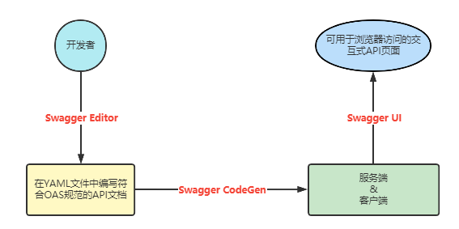

# Swagger Notes

> Swagger接口编写可以使用：Swagger Editor：https://editor.swagger.io/

## Swagger组件



## Swagger2的使用

SpringFox：通过扫描代码，提取代码中的注解信息，从而生成API文档的工具。

http://springfox.github.io/springfox/

### 导入依赖

```xml
<!-- springfox-swagger2 -->
<dependency>
    <groupId>io.springfox</groupId>
    <artifactId>springfox-swagger2</artifactId>
    <version>2.9.2</version>
</dependency>
<dependency>
    <groupId>io.springfox</groupId>
    <artifactId>springfox-swagger-ui</artifactId>
    <version>2.9.2</version>
</dependency>
<dependency>
    <groupId>com.github.xiaoymin</groupId>
    <artifactId>swagger-bootstrap-ui</artifactId>
    <version>1.9.6</version>
</dependency>
```

注意：据说，`springfox-swagger2`中的依赖有bug，遇到问题再来补充

### 添加配置类

```java
package psn.shreker.study.swagger.config;

import org.springframework.context.annotation.Bean;
import org.springframework.context.annotation.Configuration;
import springfox.documentation.builders.ApiInfoBuilder;
import springfox.documentation.builders.RequestHandlerSelectors;
import springfox.documentation.service.ApiInfo;
import springfox.documentation.service.Contact;
import springfox.documentation.spi.DocumentationType;
import springfox.documentation.spring.web.plugins.Docket;
import springfox.documentation.swagger2.annotations.EnableSwagger2;
import org.springframework.core.env.Environment;
import org.springframework.core.env.Profiles;

/**
* @author ShrekerNil 2021/08/17
*/
@Configuration
@EnableSwagger2
public class SwaggerConfig {

    @Bean
    public Docket docket(Environment environment) {
        // 设置可访问的环境
        Profies profiles = Profiles.of("dev", "tst");
        boolean canDisplay = environment.acceptsProfiles(profiles);
                
        ApiInfo apiInfo = new ApiInfoBuilder()
            .title("云屏广告管理系统 API")
            .description("云屏广告管理， 包括新增、删除、修改、查询广告信息")
            .version("1.0")
            .contact(new Contact("Developer", "zhiyi.com", "zhiyi@zhiyi.com"))
            .build();
        return new Docket(DocumentationType.SWAGGER_2)
            // 配置头信息
            .apiInfo(apiInfo)
            // 配置可访问环境标记
            .enable(display)
            // 配置扫描接口
            .select().apis(RequestHandlerSelectors.basePackage("psn.shreker.study.swagger.demo.controller"))
            .build();
    }
    
}
```

### 测试

1. 官方地址：http://localhost:8080/swagger-ui.html
2. Bootstrap插件地址：http://localhost:8080/doc.html

## 常用注解

### 添加注释的注解

1. `@Api`：用于添加类的说明
2. `@ApiOperation`：用于添加方法的说明，注解参数：
   - notes：备注信息
3. `@ApiImplicitParam`：用于给单个参数添加说明，注解参数：
   - name：参数名称

   - value：参数说明
   - required：是否为必填参数
   - example：示例值
   - defaultValue：默认值

4. `@ApiImplicitParams`：用于给多个参数添加说明，`@ApiImplicitParams`参数为`@ApiImplicitParam`

5. `@ApiModel`：作用在参数对象的类上

6. `@ApiModelProperty`：作用在参数对象的类的属性上，配合`@ApiModel`使用，注解参数：
   - value：该属性说明

## 拦截器配置

拦截器中需要设置不需要拦截的内容，一般有：

- `/swagger-ui.html/**`
- `/swagger-resources/**`
- `/webjars/**`
- `/v2/**`

## 生产环境

生产环境不需要显示API文档的配置，思路：生产环境不注入Swagger的配置类对象即可

### 实现

在配置类上添加注解：

```java
@Profile(value = {"dev", "pre"})
```

或者通过`@Conditional`注解实现


# KNife4J Notes

## KNife4J是什么

KNife4J是对Swagger的扩展，提供了非常人性化的功能：

- 界面优化
- 文档下载
- 全局参数设置
- 。。。

## 配置使用

在正常运行的Swagger项目的pom中添加如下依赖:

### Spring

```xml
<!-- https://mvnrepository.com/artifact/com.github.xiaoymin/knife4j-spring -->
<dependency>
    <groupId>com.github.xiaoymin</groupId>
    <artifactId>knife4j-spring</artifactId>
    <version>3.0.2</version>
</dependency>
```

### Spring Boot

```xml
<!-- https://mvnrepository.com/artifact/com.github.xiaoymin/knife4j-spring-boot-starter -->
<dependency>
    <groupId>com.github.xiaoymin</groupId>
    <artifactId>knife4j-spring-boot-starter</artifactId>
    <version>3.0.2</version>
</dependency>
```

### Spring Cloud

```xml
<!-- https://mvnrepository.com/artifact/com.github.xiaoymin/knife4j-micro-spring-boot-starter -->
<dependency>
    <groupId>com.github.xiaoymin</groupId>
    <artifactId>knife4j-micro-spring-boot-starter</artifactId>
    <version>3.0.2</version>
</dependency>
```

## 测试

访问：

http://localhost:8080/doc.html

