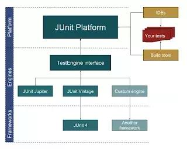
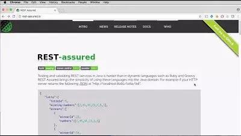
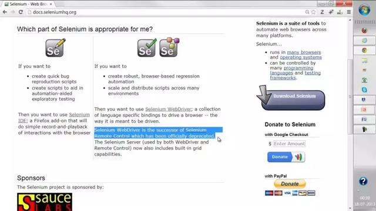
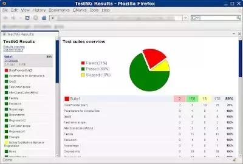
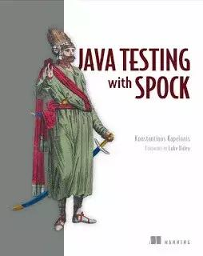
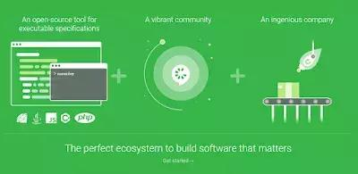
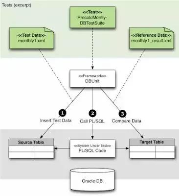
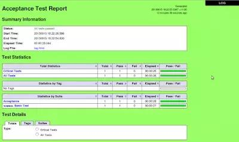

# Tests Questions

# Tests Series

## Java中常见的测试框架

### JUnit

JUnit 应该不需要过多介绍。哪怕你是一位 Java 初学者，我想你也应该听说过它，它能够让你为 Java 代码编写单元测试。

几乎所有常用的 IDE，比如 Eclipse、NetBeans 和 IntelliJ，都能够集成 JUnit，这意味着开发者直接可以在这些 IDE 中编写并运行单元测试。

目前大多数人仍然在使用 JUnit 4，事实上新的 JUnit 5 已经发布。你可以用 JUnit 进行单元测试和集成测试，此外，它还支持 Java 8 功能。

### REST Assured

相比于 Groovy 这类动态语言，在 Java 中测试和验证 REST 服务更难。

REST Assured 为 Java 带来了这些语言的简单性。这对于 REST API 集成测试来说是一个很好的工具。

### Selenium

Selenium 应该是最受欢迎的 Java UI 测试工具，有了它，你不需要在浏览器中启动 JSP 页面即可对其进行测试。

你可以使用 JUnit 和 Selenium 来测试 Web 应用程序 UI。还可以使用它进行 Web 应用程序验收测试。

### TestNG

TestNG 这款测试框架最早源于 JUnit 和 NUnit 的启发，但它在这两者的基础上引入了许多新的功能，其功能更强大，也更易于使用，提供了注解功能，支持在任意大型线程池中运行各种可用策略的测试(所有方法都在自己的线程中，每个测试类对应一个线程)。

随着 JUnit 4 中注解功能的引入以及 Hamcrest 框架的整合，JUnit 4 和 TestNG 之间的差距已经很小。

### Mockito

Java 有许多 Mock 框架，例如 PowerMock 和 JMock，但我个人更喜欢 Mockito，它具有简单的 API、优秀的文档以及大量示例。

Mock 测试是现代单元测试的关键技术之一，开发者不需要依赖其他情况也可独立测试代码，因此我建议每个 Java 开发人员都应该学习 Mock 框架来与 JUnit 结合使用。

我个人最喜欢的 Mock 框架是 Mockito，如果你喜欢的话，也可以了解一下 PowerMock或者 JMock。

### Spock

Spock 是一款用于 Java 和 Groovy 应用程序的测试和规范框架。它用 Groovy 编写，因此它具有很强的表现力，并且非常规范。

使用 Spock 时，测试将变得更加易读易维护。此外，得益于它的 JUnit 运行器，Spock能够兼容大多数 IDE、构建工具和持续集成服务器。

不过遗憾的是，线上讲述 Spock 框架的课程好像不多，“使用 Spock 进行 Java 测试”这本书倒是一个不错的学习资源。

### Cucumber

Cucumber 是一款很好的自动化集成测试工具，与其他同类工具相比，它的规范功能是一大特色。

Cucumber 将规范和测试文档合并为一个文档，由于文档也会被 Cucumber 自动测试，因此规范文档始终会被更新为最新版本。

### Spring 测试

Spring MVC 自带了一个非常有用的测试框架，可以在不涉及 Web 容器的情况下进行深入测试。

这个是一个非常有用的库，可以为 Spring 应用程序编写自动化测试。它为 Spring 应用程序(包括 MVC 控制器)编写单元和集成测试提供了强有力的支持。

还有一个 Spring Test DbUnit，它将 Spring 测试框架与 DbUnit 以及 HtmlUnit 集成在了一起。

使用这些工具，你可以轻松完成 Spring MVC 应用程序的自动化测试。

### DBUnit

对于大多数的 Java 应用程序，不管是核心 Java 程序还是 Java Web 应用，数据库都是其不可或缺的重要组成部分，并且数据库还很可能是单元测试的最大障碍。

连接到 Dev 或者 UAT 数据库进行集成测试是不可靠的，因为任何人都可以更改数据和模式，比如表和存储过程，这都会导致自动化集成测试的失败。

DbUnit 是 JUnit 的扩展，在每次集成测试之前它可以将数据库初始化为已知状态，从而确保数据库包含正确的数据。

DbUnit 是一个非常有用的工具，它可以帮助我们将测试数据和测试代码分开。

### Robot

Robot 框架是一个基于 Python 的通用自动化测试框架，主要用于验收测试以及验收测试驱动开发。

它采用表格测试数据语法，是一个关键字驱动的测试框架。分布式异构应用程序的验证往往需要多种技术和接口，非常适合用 Robot 来测试。

### 总结

以上就是本文介绍的所有针对 Java 开发者的单元测试以及集成测试的工具、框架和库。

还有更多的库并没有包含在这个列表中，例如 AssertJ 和 Hamcrest，它们可以帮助你写出漂亮且流畅的测试程序。

面对如此多的工具，你应当先学习那些与你日常工作最相关的。例如，如果你的工作主要涉及 Java UI，那么你应该最先学习 Selenium，然后再学习其他工具来扩展和提升自己。

类似的，如果你正在使用 REST API，那么最好先学习 REST Assured。如果你主要从事核心 Java 工作，那么你最先学习的应该是 JUnit 5。

## 单元测试

## Mock