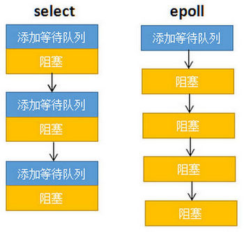
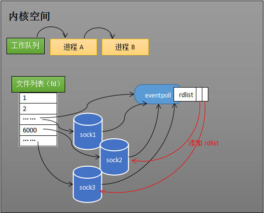

# Epoll的本质

作者：[游戏研究院](https://www.zhihu.com/column/pyluo)

网址：[Epoll的本质](https://zhuanlan.zhihu.com/p/63179839)

## 开篇

网上虽然也有不少讲解epoll的文章，但要不是过于浅显，就是陷入源码解析，很少能有通俗易懂的。于是决定编写此文，让缺乏专业背景知识的读者也能够明白epoll的原理。文章核心思想是：

**要让读者清晰明白EPOLL为什么性能好。**

本文会从网卡接收数据的流程讲起，串联起CPU中断、操作系统进程调度等知识；再一步步分析阻塞接收数据、select到epoll的进化过程；最后探究epoll的实现细节。目录：

> 一、从网卡接收数据说起
> 二、如何知道接收了数据？
> 三、进程阻塞为什么不占用cpu资源？
> 四、内核接收网络数据全过程
> 五、同时监视多个socket的简单方法
> 六、epoll的设计思路
> 七、epoll的原理和流程
> 八、epoll的实现细节
> 九、结论

## 一、从网卡接收数据说起

下图是一个典型的计算机结构图，计算机由CPU、存储器（内存）、网络接口等部件组成。了解epoll本质的**第一步**，要从**硬件**的角度看计算机怎样接收网络数据。


下图展示了网卡接收数据的过程。在①阶段，网卡收到网线传来的数据；经过②阶段的硬件电路的传输；最终将数据写入到内存中的某个地址上（③阶段）。这个过程涉及到**DMA传输**、**IO通路选择**等硬件有关的知识，但我们只需知道：**网卡会把接收到的数据写入内存。**


通过硬件传输，网卡接收的数据存放到内存中。操作系统就可以去读取它们。

## 二、如何知道接收到了数据？

了解epoll本质的**第二步**，要从**CPU**的角度来看数据接收。要理解这个问题，要先了解一个概念——**中断**。

计算机执行程序时，会有优先级的需求。比如，当计算机收到**中断电信号**时（电容可以保存少许电量，供CPU运行很短的一小段时间），它应立即去保存数据，保存数据的程序具有较高的优先级。

一般而言，由硬件产生的信号需要cpu立马做出回应（不然数据可能就丢失），所以它的优先级很高。cpu理应中断掉正在执行的程序，去做出响应；当cpu完成对硬件的响应后，再重新执行用户程序。中断的过程如下图，和函数调用差不多。只不过函数调用是事先定好位置，而中断的位置由“信号”决定。


以键盘为例，当用户按下键盘某个按键时，键盘会给cpu的中断引脚发出一个高电平。cpu能够捕获这个信号，然后执行键盘中断程序。下图展示了各种硬件通过中断与cpu交互。


现在可以回答本节提出的问题了：当网卡把数据写入到内存后，**网卡向cpu发出一个中断信号，操作系统便能得知有新数据到来**，再通过网卡**中断程序**去处理数据。

## 三、进程阻塞为什么不占用cpu资源？

了解epoll本质的**第三步**，要从**操作系统进程调度**的角度来看数据接收。阻塞是进程调度的关键一环，指的是进程在等待某事件（如接收到网络数据）发生之前的等待状态，recv、select和epoll都是阻塞方法。**了解“进程阻塞为什么不占用cpu资源？”，也就能够了解这一步**。为简单起见，我们从普通的recv接收开始分析，先看看下面代码：

```c
//创建socket
int s = socket(AF_INET, SOCK_STREAM, 0);   
//绑定
bind(s, ...)
//监听
listen(s, ...)
//接受客户端连接
int c = accept(s, ...)
//接收客户端数据
recv(c, ...);
//将数据打印出来
printf(...)
```

> 插入：如果您还不太熟悉网络编程，欢迎阅读我编写的《Unity3D网络游戏实战(第2版)》，会有详细的介绍。

那么阻塞的原理是什么？

**工作队列**

操作系统为了支持多任务，实现了进程调度的功能，会把进程分为“运行”和“等待”等几种状态。运行状态是进程获得cpu使用权，正在执行代码的状态；等待状态是阻塞状态，比如上述程序运行到recv时，程序会从运行状态变为等待状态，接收到数据后又变回运行状态。操作系统会分时执行各个运行状态的进程，由于速度很快，看上去就像是同时执行多个任务。

下图中的计算机中运行着A、B、C三个进程，其中进程A执行着上述基础网络程序，一开始，这3个进程都被操作系统的工作队列所引用，处于运行状态，会分时执行。


**等待队列**

当进程A执行到创建socket的语句时，操作系统会创建一个由**文件系统管理的socket对象**（如下图）。这个socket对象包含了**发送缓冲区**、**接收缓冲区**、**等待队列**等成员。等待队列是个非常重要的结构，它指向所有需要等待该socket事件的进程。


当程序执行到recv时，操作系统会将进程A从工作队列移动到该socket的等待队列中（如下图）。由于工作队列只剩下了进程B和C，依据进程调度，cpu会轮流执行这两个进程的程序，不会执行进程A的程序。**所以进程A被阻塞，不会往下执行代码，也不会占用cpu资源**。


ps：操作系统添加等待队列只是添加了对这个“等待中”进程的引用，以便在接收到数据时获取进程对象、将其唤醒，而非直接将进程管理纳入自己之下。上图为了方便说明，直接将进程挂到等待队列之下。

**唤醒进程**

当socket接收到数据后，操作系统将该socket等待队列上的进程重新放回到工作队列，该进程变成运行状态，继续执行代码。也由于socket的接收缓冲区已经有了数据，recv可以返回接收到的数据。

## 四、内核接收网络数据全过程

**这一步，贯穿网卡、中断、进程调度的知识，叙述recv阻塞期间，内核接收数据全过程。**

如下图所示，进程在recv阻塞期间(考者注：recv发起读请求，CPU把进程A阻塞到当前socket的等待队列，CPU忙其他事情去了)，计算机收到了对端传送的数据（步骤①）。数据经由网卡传送到内存（步骤②），然后网卡通过中断信号通知cpu有数据到达，cpu执行中断程序（步骤③）。此处的中断程序主要有两项功能，先将网络数据写入到对应socket的接收缓冲区里面（步骤④），再唤醒进程A（步骤⑤），重新将进程A放入工作队列中。


唤醒进程的过程如下图所示。


**以上是内核接收数据全过程**

这里留有两个思考题，大家先想一想。

1. 操作系统如何知道网络数据对应于哪个socket？

- 一个socket对应着一个端口号，而网络数据包中包含了ip和端口的信息，内核可以通过端口号找到对应的socket。当然，为了提高处理速度，操作系统会维护端口号到socket的索引结构，以快速读取。

2. 如何同时监视多个socket的数据？

- **多路复用**

## 五、同时监视多个socket的简单方法

服务端需要管理多个客户端连接，而recv只能监视单个socket，这种矛盾下，人们开始寻找监视多个socket的方法。epoll的要义是**高效**的监视多个socket。从历史发展角度看，必然先出现一种不太高效的方法，人们再加以改进。只有先理解了不太高效的方法，才能够理解epoll的本质。

假如能够预先传入一个socket列表，**如果列表中的socket都没有数据，挂起进程，直到有一个socket收到数据，唤醒进程**。这种方法很直接，也是select的设计思想。

为方便理解，我们先复习select的用法。在如下的代码中，先准备一个数组（下面代码中的fds），让fds存放着所有需要监视的socket。然后调用select，如果fds中的所有socket都没有数据，select会阻塞，直到有一个socket接收到数据，select返回，唤醒进程。用户可以遍历fds，通过FD_ISSET判断具体哪个socket收到数据，然后做出处理。

```java
int s = socket(AF_INET, SOCK_STREAM, 0);  
bind(s, ...)
listen(s, ...)

int fds[] =  存放需要监听的socket

while(1){
    int n = select(..., fds, ...)
    for(int i=0; i < fds.count; i++){
        if(FD_ISSET(fds[i], ...)){
            //fds[i]的数据处理
        }
    }
}
```

考者问：这段代码会一直空转吗？


**select的流程**

select的实现思路很直接。假如程序同时监视如下图的sock1、sock2和sock3三个socket，那么在调用select之后，操作系统把进程A分别加入这三个socket的等待队列中。


当任何一个socket收到数据后，中断程序将唤起进程。下图展示了sock2接收到了数据的处理流程。

> ps：recv和select的中断回调可以设置成不同的内容。


所谓唤起进程，就是将进程从所有的等待队列中移除，加入到工作队列里面。如下图所示。


经由这些步骤，当进程A被唤醒后，它知道至少有一个socket接收了数据。程序只需遍历一遍socket列表，就可以得到就绪的socket。

这种简单方式**行之有效**，在几乎所有操作系统都有对应的实现。

**但是简单的方法往往有缺点，主要是：**

1. 每次调用select都需要将进程加入到所有监视socket的等待队列，每次唤醒都需要从每个队列中移除。这里涉及了两次遍历，而且每次都要将整个fds列表传递给内核，有一定的开销。正是因为遍历操作开销大，出于效率的考量，才会规定select的最大监视数量，默认只能监视1024个socket。

2. 进程被唤醒后，程序并不知道哪些socket收到数据，还需要遍历一次。

那么，有没有减少遍历的方法？有没有保存就绪socket的方法？这两个问题便是epoll技术要解决的。

> 补充说明： 本节只解释了select的一种情形。当程序调用select时，内核会先遍历一遍socket，如果有一个以上的socket接收缓冲区有数据，那么select直接返回，不会阻塞。这也是为什么select的返回值有可能大于1的原因之一。**如果没有socket有数据，进程才会阻塞。**

考者问：select系统调用进程会阻塞吗？我的意识中select是同步非阻塞的呀

> [朅兮](https://www.zhihu.com/people/qie-xi-90-75)2020-01-15
>
> 关于select，我不知道是一笔带过还是咋地，反正我是没看懂说什么？
> 在我印象中，最low的就是在用户代码中自旋实现所有阻塞socket的监听。但是每次判断socket是否产生数据，都涉及到用户态到内核态的切换。
> 于是select改进：将fd_set传入内核态，由内核判断是否有数据返回；
> 然后最low的只能使用自旋来时刻的去判断socket列表中是否有数据达到。
> 于是select改进：使用等待队列，让线程在没有资源时park（阻塞），当有数据到达时唤醒select线程，去处理socket。

> [千锤百炼的坏孩子](https://www.zhihu.com/people/qian-chui-bai-lian-de-pi-hai-zi)2019-08-21
>
> select/poll模型。
> 情况1. 为了能够让一个进程，监控多个socket.
> 把一个socket列表，传入到selector选择器上，selector循环遍历socket列表。就把就绪状态的 socket 选择出来，然后进行处理。
> //就绪状态：假设socket的读缓冲区有可读的数据，那么此socket就处于就绪状态。
> 就绪状态的socket这样处理：当**读缓冲区**有数据时，就读数据。当**写缓冲区**有空间可以写时，就写数据。
> 当ServerSocket有新建了连接时，就接收 clientSocket ，并且把 clientSocket 添加到seletor选择器中。
> 完成以上处理后，再次遍历socket列表，按照以上逻辑反复处理。
>
> 情况2. 遍历一次socket列表，没有一个socket处于就绪状态，那么进程A将阻塞。
> 具体流程：遍历socket列表，发现socket处于未就绪状态。那么就在该socket的等待队列中，添加进程A的引用。
> 当遍历完整个socket列表，却没有任何一个socket处于就绪状态。那么就把进程A从工作队列移除，让进程处于阻塞状态。
> 由于CPU每次执行完指令，都会检查是否有中断信号。
> 假设10S以后，socket列表中，有一个socket处于就绪状态。
> 那么网卡对应的硬件，会向CPU发一个中断信号。CPU收到一个中断信号，从而调用对应的中断程序。
> 此中断程序，会把进程A唤醒，加入到工作队列。
> 并且遍历socket列表，将进程A的引用，从所有的等待队列中移除。
> selector再次遍历socket列表，把就绪的 socket选出来，然后进行读或者写的操作。
> 再来看等待队列的作用：就是当socket就绪时，能够通过等待队列的进程引用，找到对应的进程。

> 讲得有些复杂。。简单来说，就是**epoll维护了一个红黑树和一个链表，需要监听的socket添加到红黑树上，哪个socket有事件过来，就把它加到链表上，然后发给用户通知。用户直接遍历这个链表，挨个处理即可。**
> 而**poll和select只返回有时间的fd的数量，并没有说是哪个fd，所以还需要挨个遍历所有fd去检查**

## 六、epoll的设计思路

epoll是在select出现N多年后才被发明的，是select和poll的增强版本。epoll通过以下一些措施来改进效率。

**措施一：功能分离**

select低效的原因之一是将“维护等待队列”和“阻塞进程”两个步骤合二为一。如下图所示，每次调用select都需要这两步操作，然而大多数应用场景中，需要监视的socket相对固定，并不需要每次都修改。epoll将这两个操作分开，先用**epoll_ctl**维护等待队列，再调用**epoll_wait**阻塞进程。显而易见的，效率就能得到提升。

考者问：select阻塞进程需要什么操作吗？添加到等待队列不就实现了阻塞进程的效果了吗？感觉理解不了啊



为方便理解后续的内容，我们先复习下epoll的用法。如下的代码中，先用`epoll_create`创建一个epoll对象epfd，再通过`epoll_ctl`将需要监视的socket添加到epfd中，最后调用`epoll_wait`等待数据。

```c
int s = socket(AF_INET, SOCK_STREAM, 0);   
bind(s, ...)
listen(s, ...)

int epfd = epoll_create(...);
epoll_ctl(epfd, ...); //将所有需要监听的socket添加到epfd中

while(1){
    int n = epoll_wait(...)
    for(接收到数据的socket){
        //处理
    }
}
```

功能分离，使得epoll有了优化的可能。

**措施二：就绪列表(rdllist)**

select低效的另一个原因在于程序不知道哪些socket收到数据，只能一个个遍历。如果内核维护一个“就绪列表(rdllist)”，引用收到数据的socket，就能避免遍历。如下图所示，计算机共有三个socket，收到数据的sock2和sock3被就绪列表(rdllist)（就绪列表(rdllist)）所引用。当进程被唤醒后，只要获取就绪列表(rdllist)的内容，就能够知道哪些socket收到数据。


## 七、epoll的原理和流程

**创建epoll对象**

如下图所示，当某个进程调用epoll_create方法时，内核会创建一个eventpoll对象（也就是程序中epfd所代表的对象）。eventpoll对象也是文件系统中的一员，和socket一样，它也会有等待队列。


创建一个代表该epoll的eventpoll对象是必须的，因为内核要维护“就绪列表(rdllist)”等数据，“就绪列表(rdllist)”可以作为eventpoll的成员。

**维护监视列表**

创建epoll对象后，可以用`epoll_ctl`添加或删除所要监听的socket。以添加socket为例，如图，如果通过`epoll_ctl`添加sock1、sock2和sock3的监视，内核会将eventpoll添加到这三个socket的等待队列中。


当socket收到数据后，中断程序会操作eventpoll对象，而不是直接操作进程。

**接收数据**

当socket收到数据后，中断程序会给eventpoll的“就绪列表(rdllist)”添加socket引用。如下图展示的是sock2和sock3收到数据后，中断程序让就绪列表(rdllist)引用这两个socket。



eventpoll对象相当于是socket和进程之间的中介，socket的数据接收并不直接影响进程，而是通过改变eventpoll的就绪列表(rdllist)来改变进程状态。

当程序执行到epoll_wait时，如果就绪列表(rdllist)已经引用了socket，那么epoll_wait直接返回，如果就绪列表(rdllist)为空，阻塞进程。

**阻塞和唤醒进程**

假设计算机中正在运行进程A和进程B，在某时刻进程A运行到了epoll_wait语句。如下图所示，内核会将进程A放入eventpoll的等待队列中，阻塞进程。


当socket接收到数据，中断程序一方面修改就绪列表(rdllist)，另一方面唤醒eventpoll等待队列中的进程，进程A再次进入运行状态（如下图）。也因为就绪列表(rdllist)的存在，进程A可以知道哪些socket发生了变化。


## 八、epoll的实现细节

至此，相信读者对epoll的本质已经有一定的了解。但我们还留有一个问题，**eventpoll的数据结构**是什么样子？

再留两个问题

1. **就绪队列**应该应使用什么数据结构？
2. eventpoll应使用什么数据结构来管理通过epoll_ctl添加或删除的socket？

如下图所示，eventpoll包含了lock、mtx、wq（等待队列）、rdllist等成员。`rdllist`和`rbr`是我们所关心的。

图片来源：《深入理解Nginx：模块开发与架构解析(第二版)》，陶辉：


**就绪列表的数据结构**

就绪列表引用着就绪的socket，所以它应能够快速的插入数据。

程序可能随时调用epoll_ctl添加监视socket，也可能随时删除。当删除时，若该socket已经存放在就绪列表中，它也应该被移除。

所以就绪列表应是一种能够快速插入和删除的数据结构。**双向链表**就是这样一种数据结构，epoll使用双向链表来实现就绪队列（对应上图的rdllist）。

**索引结构**

既然epoll将“维护监视队列”和“进程阻塞”分离，也意味着需要有个数据结构来保存监视的socket。至少要方便的添加和移除，还要便于搜索，以避免重复添加。**红黑树**是一种自平衡二叉查找树，搜索、插入和删除时间复杂度都是O(log(N))，效率较好。epoll使用了红黑树作为索引结构（对应上图的rbr）。

> ps：因为操作系统要兼顾多种功能，以及由更多需要保存的数据，rdlist并非直接引用socket，而是通过epitem间接引用，红黑树的节点也是epitem对象。同样，文件系统也并非直接引用着socket。为方便理解，本文中省略了一些间接结构。

## 九、结论

epoll在select和poll（poll和select基本一样，有少量改进）的基础引入了eventpoll作为中间层，使用了先进的数据结构，是一种高效的多路复用技术。

再留一点**作业**！

下表是个很常见的表，描述了select、poll和epoll的区别。读完本文，读者能否解释select和epoll的时间复杂度为什么是O(n)和O(1)？

图片来源《Linux高性能服务器编程》：


（完结）