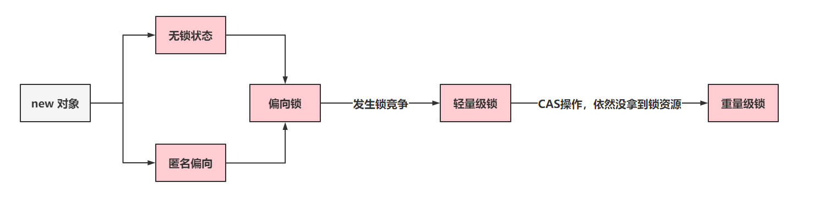

# Java Lock

## Java中锁的分类

### 可重入锁、不可重入锁

Java中提供的`synchronized`，`ReentrantLock`，`ReentrantReadWriteLock`都是可重入锁。但是ThreadPoolExecutor中的Worker继承了AQS，但是他却不是一个可重入锁，因为没有利用state去实现可重入性

synchronized的可重入是通过一个名为_recursion的计数器实现的

ReentrantLock地可重入是通过内部AQS的state计数器实现的

**可重入锁**：当前线程获取到A锁，在获取之后尝试再次获取A锁是可以直接拿到的。

**不可重入锁**：当前线程获取到A锁，在获取之后尝试再次获取A锁，无法获取到的，因为A锁被当前线程占用着，需要等待自己释放锁再获取锁。

### 乐观锁、悲观锁

悲观锁：Java中提供的`synchronized`，`ReentrantLock`，`ReentrantReadWriteLock`

乐观锁：Java中提供的CAS操作，就是乐观锁的一种实现。

**悲观锁**：获取不到锁资源时，会将当前线程挂起（进入BLOCKED、WAITING），线程挂起会涉及到用户态和内核的太的切换，而这种切换是比较消耗资源的。

* 用户态：JVM可以自行执行的指令，不需要借助操作系统执行。
* 内核态：JVM不可以自行执行，需要操作系统才可以执行。

**乐观锁**：获取不到锁资源，可以再次让CPU调度，重新尝试获取锁资源。

Atomic原子性类中，就是基于CAS乐观锁实现的。

### 公平锁、非公平锁

Java中提供的synchronized只能是非公平锁。

Java中提供的ReentrantLock，ReentrantReadWriteLock可以实现公平锁和非公平锁

**公平锁**：线程A获取到了锁资源，线程B没有拿到，线程B去排队，线程C来了，锁被A持有，同时线程B在排队。直接排到B的后面，等待B拿到锁资源或者是B取消后，才可以尝试去竞争锁资源。

**非公平锁**：线程A获取到了锁资源，线程B没有拿到，线程B去排队，线程C来了，先尝试竞争一波

* 拿到锁资源：开心，插队成功。
* 没有拿到锁资源：依然要排到B的后面，等待B拿到锁资源或者是B取消后，才可以尝试去竞争锁资源。

### 互斥锁、共享锁

Java中提供的synchronized、ReentrantLock是互斥锁。

Java中提供的ReentrantReadWriteLock，有互斥锁也有共享锁。

**互斥锁**：同一时间点，只会有一个线程持有者当前互斥锁。

**共享锁**：同一时间点，当前共享锁可以被多个线程同时持有。

## synchronized和ReentrantLock的区别

- 共同点

  - 都是锁
  - 都是可重入锁，(但是记得重入多少次释放多少次)
  - 都保证了可见性和互斥性

- 不同点

  | 区别         | synchronized                                   | ReentrantLock                                                |
  | ------------ | ---------------------------------------------- | ------------------------------------------------------------ |
  | 级别         | JVM级别的指令锁(monitorenter/monitorexit)      | JDK API级别的锁                                              |
  | 调用方式     | 隐式自动调用                                   | 显式手动调用                                                 |
  | 是否可中断   | 不可响应中断，等待的线程需要一直等待直到锁释放 | 可响应中断、可轮回，等待的线程只要级别更高就可以直接让Lock暂停执行 |
  | 公平性       | 本身就是一个指令级别的**非公平锁**             | 可实现**公平锁**和**非公平锁**                               |
  | 支持条件绑定 | 不支持绑定条件                                 | 通过**Condition绑定条件**                                    |
  | 阻塞         | 同步阻塞，悲观并发策略                         | 同步非阻塞，乐观并发策略(CAS)                                |
  | 自动性       | 异常时自动释放锁                               | 异常时手动释放                                               |
  | 获取锁的状态 | 不支持获取锁的状态                             | 代码层面可以明确的知道是否成功的获取到锁                     |
  | 锁类型       | 就一个锁：独占锁                               | 可实现**读锁(共享锁)和写锁(独占锁)**                         |

## ReentrantLock的条件绑定

**绑定条件**的意思是，你可以为`ReentrantLock`创建一个或多个`Condition`实例，每个`Condition`实例代表一个条件。

线程可以使用这些条件实例来等待（wait）直到某个条件成立，或者在条件成立时通知（signal）其他等待该条件的线程。

以下是使用`ReentrantLock`和`Condition`的一个简单示例：

```java
import java.util.concurrent.locks.Condition;
import java.util.concurrent.locks.Lock;
import java.util.concurrent.locks.ReentrantLock;

public class ConditionExample {
    private final Lock lock = new ReentrantLock();
    private final Condition condition = lock.newCondition();
    private boolean ready = false;

    public void await() throws InterruptedException {
        lock.lock();
        try {
            while (!ready) {
                condition.await(); // 等待条件成立
            }
            // 条件成立后的操作
        } finally {
            lock.unlock();
        }
    }

    public void signal() {
        lock.lock();
        try {
            ready = true;
            condition.signalAll(); // 通知所有等待的线程
        } finally {
            lock.unlock();
        }
    }
}
```

在这个例子中，`ConditionExample`类有一个`ReentrantLock`和一个`Condition`实例。`await()`方法中的线程会等待条件变量`condition`，直到`signal()`方法被调用并通知等待的线程条件已经成立。

使用`Condition`可以更精确地控制线程的等待和通知，与`Object`类的`wait()`和`notify()`方法相比，`Condition`提供了更丰富的功能，例如可以指定等待的时间、支持多个条件变量等。这使得`ReentrantLock`和`Condition`组合成为实现复杂同步逻辑的强大工具。

## 公平锁和公平锁的区别

语言层面上，区分很简单，就是一个公平，一个不公平。这个问题最好从源码的维度来聊。

可以扩展说一下，synchronized只支持非公平锁，ReentrantLock既有公平，也有非公平。

在ReentrantLock中，有两个方法的实现有公平和非公平之分。

1. lock方法
   - 非公平锁：直接执行CAS，尝试将state从0改为1，如果CAS成功了，拿锁走人，失败了走后续逻辑。
   - 公平锁：直接走后续逻辑（后续逻辑包含tryAcquire方法）。
2. tryAcquire方法：
   - 非公平锁：如果state为0，会直接执行CAS，尝试将state从0改为1，如果CAS成功了，拿锁走人，失败就准备排队。
   - 公平锁：如果state为0，先查看一下，是否有排队的节点，如果有排队的，那就不抢，直接去排队。


## CAS实现原理

CAS就是将内存中的某一个属性，从oldValue，替换为newValue。在不加锁的情况下保证操作的原子性。

```java
public class MyTest {
  private int value = 1;
  public static void main(String[] args) throws Exception {
    MyTest test = new MyTest();
    Unsafe unsafe = null;
    Field field = Unsafe.class.getDeclaredField("theUnsafe");
    field.setAccessible(true);
    unsafe = (Unsafe) field.get(null);
    // 获取内存偏移量
    long offset = unsafe.objectFieldOffset(MyTest.class.getDeclaredField("value"));
    // 执行CAS，这里的四个参数分别代表什么，你也要清楚~
    System.out.println(unsafe.compareAndSwapInt(test, offset, 0, 11));
    System.out.println(test.value);
  }
}
```

1. Java层面如何实现的CAS以及使用

   - 在Java中，是基于Unsafe类提供的native方法实现的。native是走的C++的依赖库

     ```java
     public final native boolean cas(Object 哪个对象, long 内存偏移量, Object 旧值, Object 新值);
     ```

   - Unsafe类，不能直接new，只能通过反射的形式获取到Unsafe的实例去操作，不过一般业务开发中，基本不会直接使用到Unsafe类。

2. Java的CAS在底层是如何实现的

   - Java层面的CAS，只到native方法就没了。底层是C++实现的，但是其实比较和交换（CAS），是**CPU支持的原语**。**cmpxchg指令**就是CPU支持的原语。
   - 如果在CPU层面，多核CPU并行执行CAS修改同一个属性，可能会导致出现问题。C++内部就可以看到针对**cmpxchg指令**前追加了**lock前缀指令**（多核CPU）


## CAS存在问题与解决方案

- ABA问题
  - 要修改的数据最开始是A，但是没修改成功，期间经过一些列的操作，后来又变回了A，此时CAS成功。
  - 但是这个数据在最开始的A ---- 最后的A，这期间发生了什么事情，不清楚。
  - 解决方案：
    - 如果业务有要求这个期间不能存在ABA，那么可以换一种CAS的实现实现。利用版本号来确认。Java中提供了解决这种ABA问题的原子类`AtomicStampedReference`
- 性能问题
  - 如果基于while这种循环操作去调度CAS直到成功，那可能会优点消耗CPU的资源了，一直执行CAS指令，但是一段是时间无法成功。 如果感觉短期内就能ok，那就上CAS，如果不成，使用悲观锁（synchronized，lock锁）
  - 解决方案
    - 可以参考Synchronized的方案，可以先自旋一定次数，还是拿不到锁，则阻塞挂起
    - 也可以参考LongAdder的方案，分段上锁，尽量允许更多的线程能同时操作

## 单例实现方式

- 饿汉式

- 懒汉式：volatile + 双判 = DCL

- 枚举

- 内部类 

  - 静态内部类的优点是：外部类加载时并不需要立即加载内部类，内部类不被加载则不去初始化INSTANCE，故而不占内存。即当SingleTon第一次被加载时，并不需要去加载SingleTonHoler，只有当getInstance()方法第一次被调用时，才会去初始化INSTANCE，第一次调用getInstance()方法会导致虚拟机加载SingleTonHoler类，这种方法不仅能确保线程安全，也能保证单例的唯一性，同时也延迟了单例的实例化。

  - 扩展

    > 类加载时机：JAVA虚拟机在**有且仅有**的5种场景下会对类进行初始化。
    >
    > 1. 遇到new、getstatic、setstatic或者invokestatic这4个字节码指令时，对应的java代码场景为：new一个关键字或者一个实例化对象时、读取或设置一个静态字段时(final修饰、已在编译期把结果放入常量池的除外)、调用一个类的静态方法时。
    > 2. 使用java.lang.reflect包的方法对类进行反射调用的时候，如果类没进行初始化，需要先调用其初始化方法进行初始化。
    > 3. 当初始化一个类时，如果其父类还未进行初始化，会先触发其父类的初始化。
    > 4. 当虚拟机启动时，用户需要指定一个要执行的主类(包含main()方法的类)，虚拟机会先初始化这个类。
    > 5. 当使用JDK 1.7等动态语言支持时，如果一个java.lang.invoke.MethodHandle实例最后的解析结果REF_getStatic、REF_putStatic、REF_invokeStatic的方法句柄，并且这个方法句柄所对应的类没有进行过初始化，则需要先触发其初始化。
    >
    > 这5种情况被称为是类的主动引用，注意，这里《虚拟机规范》中使用的限定词是"有且仅有"，那么，除此之外的所有引用类都不会对类进行初始化，称为被动引用。静态内部类就属于被动引用的行列。

## 单例模式的DCL为啥要加volatile

**避免指令重排，获取到未初始化完成的对象。**

单例模式的懒汉模式确保线程安全的机制DCL

```java
public class MyTest {
  private static MyTest myTest;
  public static MyTest getInstance(){
    if(myTest == null) { // check
      synchronized (MyTest.class) { // lock
        if(myTest == null) { // check
          myTest = new MyTest();
        }
      }
    }
    return myTest;
  }
}
```

DCL正常可以解决单例模式的安全问题，但是由于CPU可能会对程序的一些指令做出重新的排序，导致出现拿到一些未初始化完成的对象去操作，最常见的就是出现了诡异的NullPointException。

**（扩展一下）volatile修饰myTest对象后，可以禁止CPU做指令重排。volatile的生成字节码指令后**

**有内存屏障（指令），内存屏障会被不同的CPU翻译成不同的函数，比如X86的CPU，会对**

**StoreLoad内存屏障翻译成mfence的函数，最终的指令就是lock前缀指令。**

Java中new对象，可以简单的看成三个指令的操作。

1、开辟内存空间

2、初始化对象内部属性

3、将内存空间的地址赋值给引用

## 如何预防死锁

- 死锁：多个线程之间互相等待其它线程释放资源的现象
- 触发死锁的必要条件：
  - **互斥条件**：同一时间只能有一个线程获取资源
  - **不可剥夺条件**：一个线程已经占有的资源，在释放之前不会被其它线程抢占
  - **请求和保持条件**：线程等待过程中不会释放已占有的资源
  - **循环等待条件**：多个线程互相等待对方释放资源
- 死锁的预防：破坏上面的必要条件

## Synchronized

- 两个队列？等待队列 & 竞争队列

- DCL：Double Check Lock：单例的DCL实现

- volatile

  - 原语义：可变的，异变的。用来告诉使用所在线程：当前修饰的对象是可变的，不要进行指令重排和优化等操作
  - 是Java虚拟机提供的`轻量级`的同步机制
    - 保证可见性
    - 不保证原子性
    - 禁止指令重排
  - volatile变量读本质：
    - 读前加loadload屏障，读后loadstore屏障
    - 写前加storestore屏障，写后加上storeload屏障

- DCL实现的单例对象中为什么要加volatile：

  - 添加volatile关键字主要是利用了volatile的内存屏障，而不是指令重排的原因。原因参考哔哩哔哩的文章：https://www.bilibili.com/read/cv11941815

- 实现：

  - 字节码层面

    - 方法：ACC_SYNCHRONIZED

    - 变量：monitorenter & monitorexit (+ monitorexit)

      (+ monitorexit)表示monitorenter之后出现异常执行的锁释放行为，相当于异常中的finally

  -  JVM层面
     C C++ 调用了操作系统提供的同步机制

  -  OS和硬件层面
     X86 ：lock cmpxchg / xxx
     [Java使用字节码和汇编语言同步分析Volatile，Synchronized的底层实现](https://blog.csdn.net/21aspnet/article/details/88571740)

- 扩展

  - 静态变量存储在JVM内存的那个部分？：在Class对象的尾部
    - 静态变量依附于所在类的Class对象，而Class对象存在于堆内存中，即静态变量存在于堆内存中
    - JDK8之前，静态成员变量确实存放在方法区；但JDK8之后就取消了**永久代**，取而代之的是**元空间**，永久代中的数据也进行了迁移，**静态成员变量迁移到了堆中**(方法区是JVM的规范，永久代是方法区规范的具体实现)。

## Synchronized实现原理

Synchronized重量级锁的上锁原理：

synchronized因为是互斥锁，只能有一个线程持有当前锁资源。

所以synchronized底层有一个owner属性，这个属性是当前持有锁的线程。如果owner是NULL，其他线程就可以基于CAS将owner从NULL修改为当前线程

只要这个CAS动作成功了，就可以获取这个synchronized锁资源，如果失败了，会再尝试几次CAS，没拿到就park挂起当前线程

## Synchronized重量锁底层ObjectMonitor

需要去找到openjdk，在百度中直接搜索openjdk，第一个链接就是

找到ObjectMonitor的两个文件，hpp，cpp

当一个持有锁的线程调用`await()`方法时会挂起，这个挂起操作在synchronized中的过程如下：

1. 将线程放入一个名为`_WaitSet`的等待池中
2. 当该线程被唤醒，即调用锁对象的`signal()`方法之后，就会把该线程放入一个名为`_EntryList`的阻塞队列中

先查看核心属性：http://hg.openjdk.java.net/jdk8u/jdk8u/hotspot/file/69087d08d473/src/share/vm/runtime/objectMonitor.hpp

```hpp
ObjectMonitor() {
    _header       = NULL;   // header存储着MarkWord
    _count        = 0;      // 竞争锁的线程个数
    _waiters      = 0,      // wait的线程个数
    _recursions   = 0;      // 标识当前synchronized锁重入的次数
    _object       = NULL;
    _owner        = NULL;   // 持有锁的线程
    _WaitSet      = NULL;   // 保存wait的线程信息，双向链表
    _WaitSetLock  = 0 ;
    _Responsible  = NULL ;
    _succ         = NULL ;
    _cxq          = NULL ;  // 获取锁资源失败后，线程要放到当前的单向链表中
    FreeNext      = NULL ;
    _EntryList    = NULL ;  // _cxq以及被唤醒的WaitSet中的线程，在一定机制下，会放到EntryList中
    _SpinFreq     = 0 ;
    _SpinClock    = 0 ;
    OwnerIsThread = 0 ;
    _previous_owner_tid = 0;
  }
```

适当的查看几个C++中实现的加锁流程

http://hg.openjdk.java.net/jdk8u/jdk8u/hotspot/file/69087d08d473/src/share/vm/runtime/objectMonitor.cpp

TryLock

```cpp
int ObjectMonitor::TryLock (Thread * Self) {
   for (;;) {
	  // 拿到持有锁的线程
      void * own = _owner ;
      // 如果有线程持有锁，告辞
      if (own != NULL) return 0 ;
      // 说明没有线程持有锁，own是null，cmpxchg指令就是底层的CAS实现。
      if (Atomic::cmpxchg_ptr (Self, &_owner, NULL) == NULL) {
		 // 成功获取锁资源
         return 1 ;
      }
      // 这里其实重试操作没什么意义，直接返回-1
      if (true) return -1 ;
   }
}
```

try_entry

```cpp
bool ObjectMonitor::try_enter(Thread* THREAD) {
  // 在判断_owner是不是当前线程
  if (THREAD != _owner) {
    // 判断当前持有锁的线程是否是当前线程，说明轻量级锁刚刚升级过来的情况
    if (THREAD->is_lock_owned ((address)_owner)) {
       _owner = THREAD ;
       _recursions = 1 ;
       OwnerIsThread = 1 ;
       return true;
    }
    // CAS操作，尝试获取锁资源
    if (Atomic::cmpxchg_ptr (THREAD, &_owner, NULL) != NULL) {
      // 没拿到锁资源，告辞
      return false;
    }
    // 拿到锁资源
    return true;
  } else {
    // 将_recursions + 1，代表锁重入操作。
    _recursions++;
    return true;
  }
}
```

enter（想方设法拿到锁资源，如果没拿到，挂起扔到_cxq单向链表中）

```cpp
void ATTR ObjectMonitor::enter(TRAPS) {
  // 拿到当前线程
  Thread * const Self = THREAD ;
  void * cur ;
  // CAS走你，
  cur = Atomic::cmpxchg_ptr (Self, &_owner, NULL) ;
  if (cur == NULL) {
     // 拿锁成功
     return ;
  }
  // 锁重入操作
  if (cur == Self) {
     // TODO-FIXME: check for integer overflow!  BUGID 6557169.
     _recursions ++ ;
     return ;
  }
  //轻量级锁过来的。
  if (Self->is_lock_owned ((address)cur)) {
    _recursions = 1 ;
    _owner = Self ;
    OwnerIsThread = 1 ;
    return ;
  }


  // 走到这了，没拿到锁资源，count++
  Atomic::inc_ptr(&_count);

  
    for (;;) {
      jt->set_suspend_equivalent();
      // 入队操作，进到cxq中
      EnterI (THREAD) ;
      if (!ExitSuspendEquivalent(jt)) break ;
      _recursions = 0 ;
      _succ = NULL ;
      exit (false, Self) ;
      jt->java_suspend_self();
    }
  }
  // count--
  Atomic::dec_ptr(&_count);
  
}
```

EnterI

```cpp
for (;;) {
    // 入队
    node._next = nxt = _cxq ;
    // CAS的方式入队。
    if (Atomic::cmpxchg_ptr (&node, &_cxq, nxt) == nxt) break ;

    // 重新尝试获取锁资源
    if (TryLock (Self) > 0) {
        assert (_succ != Self         , "invariant") ;
        assert (_owner == Self        , "invariant") ;
        assert (_Responsible != Self  , "invariant") ;
        return ;
    }
}
```


## Synchronized锁升级

### Synchronized锁升级过程

> 如果正常开启偏向锁了，那么不会出现无锁状态，对象会直接变为匿名偏向

对象的锁信息是存储在对象头中的，锁升级的过程一般是：

1. 无锁/匿名偏向：新建的对象一般是无锁状态
   - 在JDK1.8中，会有一个4s的偏向锁延迟，这段时间的对象就处于无锁状态
2. 偏向锁：如果撇去4s的偏向锁延迟，那么刚new出来的对象，基本都是偏向锁
   - 如果某个线程反复的去获取同一把锁，此时偏向锁的优势就出现了，无需做CAS操作，比较一下指向的是否是当前线程。如果是，直接执行逻辑。
   - 对象头中，偏向锁指向持有锁的线程
   - 适用于单线程访问同步块的场景，通过在对象头中记录偏向线程ID来减少锁的开销。
3. 轻量级锁：如果偏向锁状态下，出现了竞争，那么升级为轻量级锁。
   - 轻量级锁状态下，会执行多次CAS，默认自旋次数是10次，这种CAS成功的条件下是采用的自适应自旋锁。
   - 轻量级锁指向一个LockRecord，该LockRecord存储在持有锁的线程的栈帧中。LockRecord包含了锁对象的Mark Word副本和指向锁记录的指针。
   - 对象头中，轻量级锁指向线程栈的LockRecord
   - 适用于竞争不激烈的场景，通过CAS操作尝试获取锁，减少线程阻塞和上下文切换的开销。
4. 重量级锁：如果轻量级锁状态下，CAS完毕获取锁失败，直接升级到重量级锁。
   - 到了重量级锁的状态下，就是再次基于几次CAS尝试修改owner属性，成功，拿锁走人。失败，挂起线程。等到其他线程释放锁后，再被唤醒。
   - 重量级锁系统会做非常多的事情，如线程阻塞、线程上下文切换、线程的调度、线程用户态与内核态之间的切换
   - 对象头中，重量级锁指向互斥量
   - 适用于竞争激烈的场景，通过互斥量管理线程对锁的访问，确保线程安全，但增加了线程阻塞和上下文切换的开销。



### 线程栈的LockRecord


在JVM中，线程栈的LockRecord是与线程同步操作相关的一个概念，它用于存储关于锁的信息。当线程执行同步代码块（使用`synchronized`关键字）或调用某些需要锁的Java方法时，JVM会为这些操作创建LockRecord。

LockRecord通常包含以下信息：

1. **锁对象**：指向当前线程正在尝试获取或已经持有的锁对象的引用。
2. **锁状态**：表示锁的当前状态，例如是否已经被获取，以及是否被其他线程请求。
3. **锁记录的其他信息**：可能包括线程的ID、锁的重入计数等。

LockRecord是JVM内部使用的数据结构，它在JVM的线程栈中为每个同步操作创建。当线程进入同步代码块时，JVM会为该线程在栈上分配一个LockRecord，并在退出同步代码块时释放这个LockRecord。

LockRecord的使用与JVM的锁机制密切相关，特别是在处理锁的获取和释放时。在JVM中，锁的实现通常依赖于对象头中的Mark Word，而LockRecord则用于在栈上跟踪线程的锁状态。

在某些情况下，LockRecord还与偏向锁（Biased Locking）和轻量级锁（Lightweight Locking）等锁优化技术有关。例如，在偏向锁模式下，LockRecord可以用来存储偏向线程的ID和偏向时间戳等信息。

总的来说，LockRecord是JVM内部用于管理线程同步状态的一个重要数据结构，它帮助JVM高效地处理多线程环境下的锁操作。

## Synchronized的优化

> 在JDK6及之前，Synchronized加锁的，一般是加到this对象/this.class，更本质来说是对象中的monitor对象
>
> JDK6之后引进了偏向锁、可重入

在JDK1.5的时候，Doug Lee推出了ReentrantLock，lock的性能远高于synchronized，所以JDK团队就在JDK1.6中，对synchronized做了大量的优化

### 锁消除

在synchronized修饰的代码中，如果不存在操作临界资源的情况，会触发锁消除，你即便写了synchronized，他也不会触发。

在编译时(JIT)就会进行优化，即干掉synchronized

```java
public synchronized void method(){
    // 没有操作临界资源
    // 此时这个方法的synchronized你可以认为木有~~
}
```

### 锁膨胀

如果在一个循环中，频繁的获取和释放做资源，这样带来的消耗很大，锁膨胀就是将锁的范围扩大(循环中的锁变为锁中的循环)，避免频繁的竞争和获取锁资源带来不必要的消耗。

```java
public void method(){
    for(int i = 0;i < 999999;i++){
        synchronized(对象){

        }
    }
    // 这是上面的代码会触发锁膨胀
    synchronized(对象){
        for(int i = 0;i < 999999;i++){

        }
    }
}
```

### 锁升级

ReentrantLock的实现，是先基于乐观锁的CAS尝试获取锁资源，如果拿不到锁资源，才会挂起线程。synchronized在JDK1.6之前，完全就是获取不到锁，立即挂起当前线程，所以synchronized性能比较差。

synchronized就在JDK1.6做了锁升级的优化

* **无锁、匿名偏向**：当前对象没有作为锁存在。
* **偏向锁**：如果当前锁资源，只有一个线程在频繁的获取和释放，那么这个线程过来，只需要判断，当前指向的线程是否是当前线程 。
  * 如果是，直接拿着锁资源走。
  * 如果当前线程不是我，基于CAS的方式，尝试将偏向锁指向当前线程。如果获取不到，触发锁升级，升级为轻量级锁。（偏向锁状态出现了锁竞争的情况）
* **轻量级锁**：会采用自旋锁的方式去频繁的以CAS的形式获取锁资源（采用的是**自适应自旋锁**）
  * 如果成功获取到，拿着锁资源走
  * 如果自旋了一定次数，没拿到锁资源，锁升级。
* **重量级锁**：就是最传统的synchronized方式，拿不到锁资源，就挂起当前线程。（用户态&内核态）

## 乐观锁、悲观锁、CAS、自旋锁、自适应自旋锁

1. **乐观锁**：是一种泛指，Java有Java的乐观锁实现，MySQL也有自己的乐观锁实现。（不会挂起线程）

2. **悲观锁**：也是一种泛指，认为拿不到资源，拿不到就挂起线程。

3. **CAS**：Java中的乐观锁实现，是CAS。CAS对于Java来说，就是一个方法，做一次比较和交换。（不会挂起线程，线程的状态从运行到阻塞）

4. **自旋锁**：你可以自己实现，就是循环去执行CAS，直到成功为止。

   ```java
   while(!cas()){}
   for(;;;){ if(cas) return }
   ```

5. **自适应自旋锁**： 这个东西就是synchronized的轻量级锁用到了，相对智能的自旋锁，如果上次CAS成功了，这次CAS循环次数，加几次。如果上次失败了，这次CAS就减几次。

## ReentrantLock的实现

- CAS：无锁优化，自旋
  - Compare And Set/Swap
    - cas(V, expected, newValue)
  - 问题：①ABA问题：StampedReference解决；②原子性问题
  - 所有Atomic相关类的内部实现：compareAndSet 更底层 lock cmpxchg(x86：cmpxchgq)
  - CAS优化实现：LongAdder：分段CAS优化
- AQS
  - https://blog.csdn.net/anlian523/article/details/106598910
  - AQS 有两个队列：双向的 CLH(三个人名) 同步队列 和 单向的条件队列 condtion Queue

CAS AQS

CAS的优化：CSQ：梯度算法、电梯算法

## ReentrantLock与Synchronized对比

1. 使用角度
   - 
2. 实现角度
3. 性能角度

## AQS内部实现原理

AQS本质就是个抽象类，AbstractQueuedSynchronizer。AQS是JUC包下的一个基础类，没有具体的并发功能的实现，不过大多数JUC包下的工具都或多或少继承了AQS去做具体的实现。

比如ReentrantLock，ReentrantReadWriteLock，CountDownLatch，线程池之类的，都用继承了AQS做自己的实现。

AQS有三个核心点：

1. **volatile修饰int属性state**。
   - 如果作为锁，state == 0，代表没有线程持有锁资源，如果大于0，代表有线程持有锁资源
2. **基于Node对象组成的一个同步队列**：
   - 如果线程想获取lock锁，结果失败了，会被挂起线程，线程会被封装为Node对象，扔到这个双向链表构成的同步队列中
3. **基于ConditionObject的单向链表**
   - 当线程持有锁资源时，如果执行了await方法，线程会释放锁资源，并且将线程封装为Node对象，扔到这个单向链表中
   - 如果其他线程执行了signal，那就会将单向链表的Node节点扔到同步队列

## AQS的作用和重要性

AQS（AbstractQueuedSynchronizer）是Java并发包`java.util.concurrent.locks`中的一个抽象类，它为实现依赖于先进先出（FIFO）等待队列的阻塞锁和相关同步器（如信号量、事件等）提供了一个基础框架。AQS的作用和重要性主要体现在以下几个方面：

1. **简化同步器的实现**
   - AQS通过内部维护一个等待队列和一个同步状态（state），为开发者提供了一套同步机制的实现框架。开发者可以通过继承AQS并实现其提供的方法来创建自定义的同步器，而无需从头开始编写复杂的同步逻辑。这大大简化了同步器的实现过程。

2. **提供线程安全的同步控制**
   - **AQS内部使用了CAS**（Compare-And-Swap）操作来保证对同步状态的原子性修改，确保了在多线程环境下对同步状态的访问是线程安全的。这使得基于AQS实现的同步器能够安全地控制线程的访问和协作。

3. 支持独占模式和共享模式
   - AQS支持两种同步模式，这使得AQS能够适应不同场景下的同步需求：
     - **独占模式**（Exclusive）：一次只有一个线程可以执行，如`ReentrantLock`。
     - **共享模式**（Shared）：允许多个线程同时执行，如`Semaphore`、`CountDownLatch`。

4. 提供阻塞和唤醒机制
   - AQS内部使用了`LockSupport`类来实现线程的阻塞和唤醒，这使得AQS能够控制线程的暂停和恢复。通过这种方式，AQS能够实现线程的等待和通知机制，从而支持复杂的同步逻辑。

5. 促进并发工具类的开发
   - AQS是构建并发工具类的基础，许多并发工具类如`ReentrantLock`、`Semaphore`、`CountDownLatch`、`ReentrantReadWriteLock`等都是基于AQS实现的。通过AQS，这些并发工具类能够以高效、线程安全的方式管理线程的同步和协作。

6. 提高并发性能
   - AQS通过内部的同步机制保证了在多线程环境下，对同步状态的访问是线程安全的，同时通过减少锁的争用和优化等待队列的管理，提高了并发性能。

7. 总结
   - AQS是Java并发编程中一个非常重要的工具，它为线程的同步控制提供了强大的支持。通过AQS，开发者可以更简单、更安全地实现复杂的同步逻辑，从而构建高效、可靠的并发应用程序。

## 为何AQS唤醒节点时从后往前找

唤醒操作：`java.util.concurrent.locks.AbstractQueuedSynchronizer#unparkSuccessor`

取消操作：`java.util.concurrent.locks.AbstractQueuedSynchronizer#cancelAcquire`

向队列添加节点的时候是尾插法，新节点的prev指向了队列的tail，但是tail没有指向node，所以如果从前往后找，很可能错过这个节点

取消操作也时先操作prev，再动next

所以prev的优先级更高

## ReentrantLock释放锁时从后往前找

在释放锁唤醒排队的Node时，会先找head.next唤醒，如果head.next是取消状态，那么AQS的逻辑是从tail往前找，一直找到里head最近的有效节点。

为什么不从前往后找，更快。

因为节点在取消时，为了更方便GC回收，会做一个操作，将Node的next指针指向自己，形成一个循环引用，这样更容易被GC发现。

另外AQS全局是以prev指针为基准的，所有操作都是prev准，next不一定准。

## ReentrantReadWriteLock实现原理

> ReentrantReadWriteLock即常说的**读写锁**

### 为什么要有读写锁

synchronized和ReentrantLock都是互斥锁。

如果说有一个操作是读多写少的，还要保证线程安全的话。如果采用上述的两种互斥锁，效率方面很定是很低的。

在这种情况下，咱们就可以使用ReentrantReadWriteLock读写锁去实现。

读读之间是不互斥的，可以读和读操作并发执行。

但是如果涉及到了写操作，那么还得是互斥的操作。

```java
static ReentrantReadWriteLock lock = new ReentrantReadWriteLock();
static ReentrantReadWriteLock.WriteLock writeLock = lock.writeLock();
static ReentrantReadWriteLock.ReadLock readLock = lock.readLock();

public static void main(String[] args) throws InterruptedException {
    new Thread(() -> {
        readLock.lock();
        try {
            System.out.println("子线程！");
            try {
                Thread.sleep(500000);
            } catch (InterruptedException e) {
                e.printStackTrace();
            }
        } finally {
            readLock.unlock();
        }
    }).start();

    Thread.sleep(1000);
    writeLock.lock();
    try {
        System.out.println("主线程！");
    } finally {
        writeLock.unlock();
    }
}
```

### 读写锁实现原理

ReentrantReadWriteLock还是基于AQS实现的，还是对state进行操作，拿到锁资源就去干活，如果没有拿到，依然去AQS队列中排队。

读锁操作：基于state的高16位进行操作**。**

写锁操作：基于state的低16为进行操作**。**

ReentrantReadWriteLock依然是可重入锁。

**写锁重入**：写锁的重入方式，基本和ReentrantLock一致，没有什么区别，依然是对state的**低16位进行+1**操作即可，只要确认持有锁资源的线程，是当前写锁线程即可。

只不过之前ReentrantLock的重入次数是state的正数取值范围，但是读写锁中写锁范围就变小了。

**读锁重入**：读锁是共享锁。读锁在获取锁资源操作时，是要对state的**高16位进行+1**操作。因为读锁是共享锁，所以同一时间会有多个读线程持有读锁资源。这样一来，多个读操作在持有读锁时，无法确认每个线程读锁重入的次数。为了去记录读锁重入的次数，每个读操作的线程，都会有一个**ThreadLocal**记录锁重入的次数。

**写锁的饥饿问题**

读锁是共享锁，当有线程持有读锁资源时，再来一个线程想要获取读锁，直接对state修改即可。

在读锁资源先被占用后，来了一个写锁资源，此时，大量的需要获取读锁的线程来请求锁资源，如果可以绕过写锁，直接拿资源，会造成写锁长时间无法获取到写锁资源。

所以：读锁在竞争资源之前，不但要查看当前读写锁的写锁是否被占用，还要查看当前是否有写锁在等待排队，如果有就不能获取了，只能在写锁后面排队

读锁在拿到锁资源后，如果再有读线程需要获取读锁资源，需要去AQS队列排队。如果队列的前面需要写锁资源的线程，那么后续读线程是无法拿到锁资源的。持有读锁的线程，只会让写锁线程之前的读线程拿到锁资源

## Condition的生产者消费者实现阻塞队列

- 使用ArrayBlockingQueue
  - Condition实现两把锁：notEmpty和notFull

## 实现多个线程顺序打印abc

- Object.wait() & Object.notify()
- Condition.await() & Condition.signal()
- ConditionObject.await() & ConditionObject.signal()
  - LockSupport.park() & LockSupport.unpark()
- join：
  - 等待加入的线程执行完毕，当前线程才会继续执行
  - 只能执行一次
- CountDownLatch
  - 也是不能复用

## JMM内存屏障

- [Java内存模型](https://ke.qq.com/webcourse/index.html#cid=398381&term_id=100475149&taid=4067196590756909&type=1024&vid=5285890795710259061)

- 存储器的层次结构

  

- 存储器存取周期

  

- 缓存行

  

  - 现代CPU的数据一致性实现 = 缓存锁(MESI ...) + 总线锁
  - 读取缓存以cache line为基本单位，目前64bytes
  - 位于同一缓存行的两个不同数据，被两个不同CPU锁定，产生互相影响的伪共享问题
  - 伪共享问题：JUC/c_028_FalseSharing
  - 使用缓存行的对齐能够提高效率：[K01_CacheLinePadding.java](Thread.assets/K01_CacheLinePadding.java)、[K02_CacheLinePadding.java](Thread.assets/K02_CacheLinePadding.java)
  - **缓存行**：可以理解为一个64字节(512bit)的数组

- MESI Cache(缓存锁)

  - 比较老的CPU使用总线锁来实现CPU核之间的资源同步
  - Intel 使用的是MESI缓存一致性协议：Modified、Exclusive、Shared、Invalid，这4中状态是用来标记读进L1，L2缓存行中的数据状态的

  

## 如何保证特定情况下不乱序

- 硬件内存屏障 X86

>  **sfence**：store | 在sfence指令前的写操作当必须在sfence指令后的写操作前完成。
>  **lfence**：load | 在lfence指令前的读操作当必须在lfence指令后的读操作前完成。
>  **mfence**：modify/mix | 在mfence指令前的读写操作当必须在mfence指令后的读写操作前完成。

> 原子指令，如x86上的”lock …” 指令是一个Full Barrier，执行时会锁住内存子系统来确保执行顺序，甚至跨多个CPU。Software Locks通常使用了内存屏障或原子指令来实现变量可见性和保持程序顺序

- JVM级别如何规范(JSR133)

  

    - LoadLoad屏障：	

      ```
      对于这样的语句Load1; LoadLoad; Load2，
      在Load2及后续读取操作要读取的数据被访问前，保证Load1要读取的数据被读取完毕。
      ```

    - StoreStore屏障：

      ```
      对于这样的语句Store1; StoreStore; Store2，
      在Store2及后续写入操作执行前，保证Store1的写入操作对其它处理器可见。
      ```

    - LoadStore屏障：

      ```
      对于这样的语句Load1; LoadStore; Store2，
      在Store2及后续写入操作被刷出前，保证Load1要读取的数据被读取完毕。
      ```

    - StoreLoad屏障：

      ```
      对于这样的语句Store1; StoreLoad; Load2，
      在Load2及后续所有读取操作执行前，保证Store1的写入对所有处理器可见。
      ```

- JVM对volatile的实现

  - volatile修饰的变量：**写**之前加StoreStore屏障，写之后加StoreLoad屏障 

        **读**之后加LoadLoad和LoadStore屏障

  - 不同的CPU硬件对于JVM内存屏障规范的实现的指令不一样

    

  - JVM底层简化了内存屏障硬件的实现：利用lock指令的特性完成内存屏障的功能

## volatile的实现细节

1. 字节码层面
   ACC_VOLATILE

2. JMM数字原子操作

   - read(读取):从主内存读取数据read
   - load(载入):将主内存读取到的数据写入工作内存
   - use(使用):从工作内存读取数据来计算
   - assign(赋值):将计算好的值重新赋值到工作内存中
   - store(存储):将工作内存数据写入主内存
   - write(写入):将store过去的变量值赋值给主内存中的变量
   - lock(锁定):将主内存变量加锁，标识为线程独占状态
   - unlock(解锁):将主内存变量解锁,解锁后其他线程可以锁定该变量

3. JVM层面
   volatile内存区的读写 都加屏障

   > StoreStoreBarrier
   >
   > volatile 写操作
   >
   > StoreLoadBarrier

   > LoadLoadBarrier
   >
   > volatile 读操作
   >
   > LoadStoreBarrier

4. OS和硬件层面
   https://blog.csdn.net/qq_26222859/article/details/52235930
   hsdis - HotSpot Dis Assembler：用来观察虚拟机编译好的字节码在CPU级别是用什么指令完成的
   windows lock 指令实现 | MESI实现


## Volatile缓存可见性实现原理

底层实现主要通过汇编lock前缀指令，它会锁定这块内存区域的缓存(缓存行锁定)并写回到主内存
IA-32和Intel-64架构软件开发者手册对lock指令的解释

1. 会将当前处理器缓存行的数据立即写回到系统内存
2. 这个写回内存的操作会引起在其他CPU里缓存了该内存地址的数据无效(MESI协议)
3. 提供内存屏障功能，使lock前后指令不能重排序

Java程序汇编代码查看
```
-server -Xcomp -XX:+UnlockDiagnosticVMOptions -XX:+PrintAssembly -XX:CompileCommand=compileonly,*<class-name>.<method-name>
```

## @Contended注解

注解`@sun.misc.Contended`是为了解决CPU的伪共享问题的，在JDK8才出现的，JDK8之前是通过**手动**在操作数前或者后拼接7个byte空值来实现的，该注解是自动填充空值

简而言之，所谓CPU的伪共享，即当多个CPU核心同时访问同一缓存行（Cache Line）上的不同变量时，尽管这些变量在逻辑上是独立的，但由于它们位于同一缓存行，会导致缓存行频繁地在不同核心间无效化和重新加载，从而增加了缓存同步的开销，降低了系统性能。

缓存行：CPU的三级缓存中最小的操作单元，一般情况下，一个缓存行是64Byte

注解`@sun.misc.Contended`是通过将一个缓存行只缓存一个数据，其余的位置进行额外字节的填充的方式使得每个变量存在独立的缓存行上，

案例：

1. juc中的`java.util.concurrent.atomic.LongAdder#add`方法中用到了一个类`java.util.concurrent.atomic.Striped64.Cell`，这个`Cell`类就被`@Contended注解`所修饰
2. `java.util.concurrent.ConcurrentHashMap#addCount`方法中用到了一个类`java.util.concurrent.ConcurrentHashMap.CounterCell`，这个`CounterCell`类就被`@Contended注解`所修饰

## CPU的伪共享问题

> 在Java中，伪共享（False Sharing）是并发编程中的一种性能问题，它发生在多个线程同时访问同一个缓存行（cache line）的不同变量时。缓存行是CPU缓存中用于存储数据的最小单位，通常是64字节（在大多数现代处理器上）。当多个线程修改位于同一缓存行的不同变量时，即使这些变量在逻辑上是独立的，也可能导致缓存行频繁地在不同核心的缓存之间来回传递，从而增加了缓存一致性维护的开销，降低了程序的性能。
>
> 伪共享问题的根源在于现代CPU缓存的缓存一致性协议（如MESI协议），这些协议要求当一个核心修改了缓存行中的数据时，其他核心上的该缓存行副本必须被标记为无效。如果多个线程修改了同一缓存行的不同变量，那么每次修改都会导致其他核心上的缓存行副本失效，即使这些变量在逻辑上是独立的。
>
> 为了解决伪共享问题，可以采取以下措施：
>
> 1. **缓存行填充**：通过在变量之间填充额外的字节，可以确保每个变量位于不同的缓存行上。例如，可以使用`@sun.misc.Contended`注解（Java 8中引入，Java 9开始默认启用）来自动填充缓存行，或者手动添加填充字节。
> 2. **数据结构重组**：重新组织数据结构，使得相关变量在内存中尽可能地分散，以减少它们位于同一缓存行的概率。
> 3. **使用局部变量**：在多线程环境中，尽可能使用局部变量，因为局部变量通常存储在栈上，而栈上的数据不会被缓存，从而避免了缓存行的争用。
> 4. **避免不必要的共享**：尽量减少线程间共享的数据量，以减少缓存行争用的可能性。
> 5. **使用原子操作**：在需要共享数据时，使用原子操作（如`AtomicInteger`、`AtomicLong`等）来确保线程安全，同时减少缓存行争用。
>
> 伪共享问题在多核处理器上尤其显著，因为缓存一致性协议的开销会随着核心数量的增加而增加。在设计并发程序时，了解和避免伪共享问题对于提高程序性能至关重要。

1. 问题描述
   - CPU有三级缓存L1,L2,L3
   - 每个缓存都是由缓存行组成
   - 当线程A和线程B的数据都放在同一个缓存的缓存行中的时候
     - 线程A的JVM修改某个数据，导致整个缓存行的数据都要从JVM内存更新一次，也包括线程B的数据
     - 即线程A的操作影响了线程B的正常执行，这个问题称为CPU的伪共享
2. 问题解决
   - 操作的数据封装在一个内部类中
   - 在内部类上添加注解`@sun.misc.Contended`
   - 这个注解的作用：使得这个数据独占一个缓存行

## CPU缓存可见性问题

CPU缓存可见性的问题，就是在缓存行数据发生变化时，会发出通知，告知其他内核缓存行数据设置为无效。

但是因为CPU厂商为了提升CPU的执行效率，经常会追加一些优化的操作，StoreBuffer，Invalidate Queue。这些就会导致MESI协议通知受到影响，同步数据没那么及时。

所以CPU内部提供了一个指令，**lock前缀指令**，如果使用了lock前缀指定去操作一些变量，此时会将数据立即写回到主内存（JVM），必然会触发MESI协议，类似StoreBuffer，Invalidate Queue的

缓存机制也会立即处理。


# Thread

## 进程、线程、协程

1. 进程：操作系统中为了解决某个问题的应用程序
   - 有独立的申请操作系统资源的权限
   - 进程之间的通讯可以通过共享内存、MQ、管道等方式实现
2. 线程：在进程中为了解决某些独立功能的程序，资源是向进程申请
   - CPU调度的基本单位
   - 一个线程只会属于一个进程
   - 线程间通讯可以使用队列、共享变量、await、signal、wait、notify、Exchanger等来实现
3. 协程：是一种用户态轻量级的线程，有人也称虚拟线程
   - 由程序员自行控制调度
   - 一个线程可以调度多个协程
   - 协程只存在用户态，不存在内核态与用户态的切换问题
   - 协程的挂起相当于线程的yield
   - 可以基于协程避免使用锁这种机制来保证线程安全协程

协程与线程的对比：

1. **更轻量**：线程一般占用的内存大小是MB级别。协程占用的内存大小是KB级别。
2. **简化并发问题**：协程咱们可以自己控制异步编程的执行顺序，协程就类似是串行的效果。
3. **减少上下文切换带来的性能损耗**：协程是用户态的，不存在线程挂起时用户态和内核态的切换，也不需要去让CPU记录切换点。
4. **协程优化的点**：协程在针对大量的IO密集操作时，协程可以更好有去优化这种业务。

- 宏观上讲
  - 进程和线程的关系就是老板与员工的关系
  - 进程是系统进行资源分配和系统调度的基本单位，线程是运算的调度基本单位。
- 具体讲：
  - **进程**：在目前任意的操作系统上，CPU要运行只识别该套硬件对应的指令，所以我们要CPU完成一件事，就需要发送一组指令给CPU进行执行，这一组指令就是程序，而在这个过程中，我们需要在内存中开辟一块空间并把这一组指令加载到开辟的内存中，这时候，CPU正在调度的这一组指令就是所谓的进程。
  - **线程**：而拿我们线上运行的Linux操作系统的实现来说，进程和线程没有区别，源码实现上即task_struct结构体，一般称为进程控制块，那Linux怎么从概念上区分进程和线程呢？如果两个进程共享了创建第一个进程的资源，我们就称这两个进程为线程。

## BIO、NIO、AIO

### IO模型的区别联系

1. BIO：Block IO 同步阻塞式 IO，就是我们平常使用的传统 IO，它的特点是模式简单使用方便，并发处理能力低。
   - BIO (Blocking I/O): 同步阻塞I/O模式，数据的读取写入必须阻塞在一个线程内等待其完成。在活动连接数不是特别高（小于单机1000）的情况下，这种模型是比较不错的，可以让每一个连接专注于自己的 I/O 并且编程模型简单，也不用过多考虑系统的过载、限流等问题。线程池本身就是一个天然的漏斗，可以缓冲一些系统处理不了的连接或请求。但是，当面对十万甚至百万级连接的时候，传统的 BIO 模型是无能为力的。因此，我们需要一种更高效的 I/O 处理模型来应对更高的并发量。
2. NIO：Non IO 同步非阻塞 IO，是传统 IO 的升级，客户端和服务器端通过 Channel（通道）通讯，实现了多路复用。
   - NIO (New I/O): NIO是一种同步非阻塞的I/O模型，在JDK 1.4 中引入了NIO框架，对应 java.nio 包，提供了 Channel , Selector，Buffer等抽象。NIO中的N可以理解为Non-blocking，不单纯是New。它支持面向缓冲的，基于通道的I/O操作方法。NIO提供了与传统BIO模型中的 Socket 和 ServerSocket 相对应的 SocketChannel 和 ServerSocketChannel 两种不同的套接字通道实现,两种通道都支持阻塞和非阻塞两种模式。阻塞模式使用就像传统中的支持一样，比较简单，但是性能和可靠性都不好；非阻塞模式正好与之相反。
3. AIO：Asynchronous IO 是 NIO 的升级，也叫 NIO2，实现了异步非堵塞 IO ，异步 IO 的操作基于事件和回调机制。
   - AIO 也就是 NIO 2。在 Java 7 中引入了 NIO 的改进版 NIO 2,它是异步非阻塞的IO模型。异步 IO 是基于事件和回调机制实现的，也就是应用操作之后会直接返回，不会堵塞在那里，当后台处理完成，操作系统会通知相应的线程进行后续的操作。AIO 是异步IO的缩写，虽然 NIO 在网络操作中，提供了非阻塞的方法，但是 NIO 的 IO 行为还是同步的。对于 NIO 来说，我们的业务线程是在 IO 操作准备好时，得到通知，接着就由这个线程自行进行 IO 操作，IO操作本身是同步的。查阅网上相关资料，我发现就目前来说 AIO 的应用还不是很广泛，Netty 之前也尝试使用过 AIO，不过又放弃了。

### IO模型的选择

对于低负载、低并发的应用，可以使用同步阻塞I/O来提升开发速率和更好的维护性；

对于高负载、高并发的应用，应使用 NIO 的非阻塞模式来开发AIO

## Java中实现线程的方式

  - JDK1.5之前：继承Thread类 和 实现Runnable接口
  - JDK1.5：实现Callable；线程池
  - `new Thread` 直接就是创建一个线程对象  线程的任务和线程对象合并到一起
  - `new Runnable` & `new Callable` 创建一个任务对象 将任务对象放到一个线程对象中去执行，将任务和线程对象分开

Java本质上创建线程的方式只有一种：Runnable接口

1. 继成Thread实现：
   - Thread实现了Runnable接口
2. 实现Runnable接口
3. 实现Callable接口
   - 需要配合FutureTask完成，Callable对象通过参数的方式构建FutureTask对象
   - 把FutureTask交给Thread
   - start启动走的是FutureTask的run方法
   - FutureTask的run方法中走的是Callable的call方法
   - **总结**：FutureTask实现接口RunnableFuture接口，而RunnableFuture接口继承了Runnable接口
     - 所以：使用Callable的方式也是**借助了FutureTask里面的Runnable去执行Callable的call方法**
4. 线程池
   - 把Runable包装成了Worker(与Thread一回事，名字不同而已)交给Thread去start

## 线程的状态

> Thread.State中明确了Java线程的6中状态：
>
> 1. **NEW**：Thread state for a thread which has not yet started.
>
> 2. **RUNNABLE**：Thread state for a runnable thread. A thread in the runnable state is executing in the Java virtual machine but it may be waiting for other resources from the operating system such as processor.
>
> 3. **BLOCKED**：Thread state for a thread blocked waiting for a monitor lock. A thread in the blocked state is waiting for a monitor lock to enter a synchronized block/method or reenter a synchronized block/method after calling `Object.wait`.
>
> 4. **WAITING**：Thread state for a waiting thread. A thread is in the waiting state due to calling one of the following methods:
>
>    - `Object.wait` with no timeout
>    - `Thread.join` with no timeout
>    - `LockSupport.park`
>
>    A thread in the waiting state is waiting for another thread to perform a particular action. For example, a thread that has called Object.wait() on an object is waiting for another thread to call Object.notify() or Object.notifyAll() on that object. A thread that has called Thread.join() is waiting for a specified thread to terminate.
>
> 5. **TIMED_WAITING**：Thread state for a waiting thread with a specified waiting time. A thread is in the timed waiting state due to calling one of the following methods with a specified positive waiting time:
>
>    - `Thread.sleep`
>    - `Object.wait` with timeout
>    - `Thread.join` with timeout
>    - `LockSupport.parkNanos`
>    - `LockSupport.parkUntil`
>
> 6. **TERMINATED**：Thread state for a terminated thread. The thread has completed execution.


## Linux系统线程状态

- Linux源码中的线程状态：
  1. NEW
  2. RUNNABLE // runing
  3. SLEEPING // Thread.sleep()
  4. IN_OBJECT_WAIT // Object.wait()
  5. IN_OBJECT_WAIT_TIMED // Object.wait(long)
  6. PARKED // LockSupport.park()
  7. PARKED_TIMED // LockSupport.park(long)
  8. BLOCKED_ON_MONITOR_ENTER // (re)entering a synchronied code block
  9. TERMINATED
- JVM采用了Linux的线程来模拟Java的线程，这时Java里面创建了一个线程，即Thread对象，并不是操作系统的线程，也就是同时会创建一个操作系统的线程对象去执行Java线程的run方法，
- 所谓**新建**状态：已经创建Java的线程对象，但是还没有创建操作系统的线程的一个中间状态，操作系统创建的状态就会挂到操作系统上等待调度，等待阶段状态是阻塞的，为了描述这个阶段就从阻塞的阶段中重新划分了一个状态，即**就绪**。
- 如果线程在执行阶段调用了IO请求，或者拿了一把锁，如果拿不到IO资源或锁，就会处于**阻塞**态。等待在哪？
- 当执行完run方法，把操作系统线程的资源还给了操作系统，但Java线程的资源还没有回收，就处于销毁状态。

## 线程执行流程

  - 执行流程：

    - 有了新需求，先看核心员工数量超没超出最大核心员工数，还有名额的话就新招一个**核心员工**来做
      - 需要获取全局锁
    - 核心员工已经最多了，HR 不给批 HC 了，那这个需求只好攒着，放到待完成**任务列表**吧。如果列表已经堆满了，核心员工基本没机会搞完这么多任务了，那就找个外包吧
      - 需要获取全局锁
    - 如果核心员工 + 外包员工的数量已经是团队最多能承受人数了，没办法，这个需求接不了了

  - 为什么在最大核心线程用完之后不使用最大线程数开辟新线程而是使用队列？

    - 线程池创建线程需要获取mainlock这个全局锁，会影响并发效率，所以使用阻塞队列把第一步创建核心线程与第三步创建最大线程隔离开来，起一个缓冲的作用。
    - 引入阻塞队列，是为了在执行execute()方法时，尽可能的避免获取全局锁。

## sleep和wait方法区别与联系

> wait方法会将持有锁的线程从owner扔到WaitSet集合中，这个操作是在修改ObjectMonitor对象，如果没有持有synchronized锁的话，是无法操作ObjectMonitor对象的。

- 区别
  1. **所属类不同**：sleep 是 Thread 类的静态方法，而 wait 是 Object 类的实例方法。
  2. **锁的释放**：sleep 方法**不会**释放当前线程所持有的锁，而 wait 方法**会**释放它所持有的对象锁。
  3. **使用位置**：sleep 可以在任何地方调用，而 wait 必须在同步块或同步方法中调用，并且必须拥有对象锁。
  4. **使命不同**：sleep 用于让线程暂停执行一段时间，而 wait 用于线程间的协作，等待某个条件成立。

- 联系
  - 都会导致线程阻塞
    - sleep：本身设计就是用来让线程阻塞等待的
    - wait：在线程中等待导致线程阻塞
  - 如果线程在执行过程中被中断，两者都会抛出 InterruptedException 异常

## 描述一下线程安全活跃态问题

- 线程安全的活跃性问题可以分为 **死锁**、**活锁**、**饥饿**、**无锁**
  - **死锁**：多个线程互相持有其它线程申请的资源并等待其它线程释放资源的现象
  - **活锁**：多个线程互相等待其它线程获取资源
    - 消息队列的消费者的消费ack出现故障，所以队列不知该消费者已经消费，消费者就重复地消费该消息
  - **饥饿**：由于线程等级和线程所在队列的的排队机制造成的线程一直处于排队状态的现象
    - PriorityQueue
    - 读写锁，如果读优先，则写线程会一直等待
  - **无锁**：指的是使用CAS机制实现锁的效果, 其效率会更高, 但是会造成等待线程的自旋

## 程序开多少线程合适

- 线程的多少与业务的特性完全耦合
- 看程序主要是IO密集型还是CPU密集型
  - **IO密集型**：IO停顿多长时间，**平衡线程资源与业务量**，通用方案：CPU核心数量的2倍
  - **CPU密集型：减少上下文切换**，线程数与CPU核数一样即可
- 一般的服务根据公式计算即可
  - 线程数 = CPU可用核数 / ( 1- 阻塞系数 )
    - 阻塞系数：CPU密集型趋近于0，IO密集型趋近于1

## 退出/结束线程的方式

1. 正常运行结束
2. 使用退出标志退出线程
   - 每个线程都有一个中断标记位，当线程的interrupt方法执行后该值就变为true，默认为false
   - Interrupt 方法结束线程 -- 非强制：`Thread.currentThread().interrupt();`

3. stop 方法终止线程 -- 线程不安全
4. 共享变量终止

## 并发 & 并行

- 并发与并行：并发：在一个时刻只有一个线程正在执行；并行：一般指在多核CPU上在一个时刻有多个线程同时运行
- 并发与并行会造成影响：
  - 资源抢夺，操作系统的角度：线程互斥
  - PV原语解决：原子性的保证：
    - 硬件级别：时钟每隔一段时间就会发送一个脉冲信号给CPU，即时钟中断，造成CPU的时间片的切换，硬件级别的原子性就是CPU不响应时钟的脉冲，即所谓的关中断，当CPU的一个原子操作执行完毕后，再去响应时钟的脉冲，即所谓的开中断。
    - 代码级别：两个汇编指令原子的++和--：`lock dec;`：--操作；`lock incr;`：++操作
    - lock cmpxchg
- 自旋锁(SpinLock)的实现

## 多线程之间是如何通信的

- 根据操作系统通讯理论：信号量，套接字，管道，共享内存，MQ
- 由于多线程之间共享了进程的地址空间，所以线程之间原生就支持数据共享，当一个线程修改了内存空间，其它的线程也必然可以看见，但是我们不能直接去操作这些数据，那么就会引起数据的紊乱，需要线程之间互斥地操作这些数据，即需同步机制：Synchronized、JUC包中的同步类

## 线程栈中数据的传递方式

- 参数传递

- ThreadLocal

  - 每个线程对象中有一个Map(ThreadLocalMap)，这个Map中存放了很多的ThreadLocal和对应值的Entry，所以每个线程中可以有很多的ThreadLocal的Entry
  - 适用于变量在线程间隔离，而在方法或类间共享的场景。
  - 这个ThreadLocal对象有内存泄漏
    - 如果我们没有释放ThreadLocal对象，也不调用remove方法，导致内存泄漏
    - 如果我们有释放ThreadLocal对象，但是不调用remove方法，**不会**导致内存泄漏

- 强软弱虚：为了充分利用计算机的内存，对象被设计成拥有生命周期。当对象的生命周期结束，会被垃圾回收器回收，从而释放内存资源。为了考虑回收的各种场景，在JDK1.2引用了强、软、弱、虚4种引用类型。

  

  - 强引用：如果一个对象是强引用，那么垃圾回收器不会轻易回收它。只用当这个对象没有被使用，垃圾回收器才会回收它。
  - 软引用：当系统内存不足时，会触发GC。当垃圾回收后，内存还是不足，就会把软引用的包裹的对象给清理掉。
  - 弱引用：如果触发GC，这时内存很充足，但是被弱引用的对象还是会被回收。所以说，被弱引用关联的对象只能生存到下一次垃圾收集发生之前。
  - 虚引用：
    - 主要是用来管理对外内存的
    - 无法通过虚引用来获取对一个对象的真实引用。
    - 虚引用必须与`ReferenceQueue`一起使用，当GC准备回收一个对象，如果发现它还有虚引用，就会在回收之前，把这个虚引用加入到与之关联的`ReferenceQueue`中。
    - 为一个对象设置虚引用关联的唯一目的就是能在这个对象被垃圾收集器回收时收到一个系统通知。还有会用虚引用管理堆外内存。

## yield用来干什么的

- 暂停当前正在执行的线程对象，并执行其他线程。
- yield()应该做的是让当前运行线程回到可运行状态，以允许具有相同优先级的其他线程获得运行机会。因此，使用yield()的目的是让相同优先级的线程之间能适当的轮转执行。但是，实际中无法保证yield()达到让步目的，因为让步的线程还有可能被线程调度程序再次选中。
- 结论：yield()从未导致线程转到等待/睡眠/阻塞状态。在大多数情况下，yield()将导致线程从运行状态转到可运行状态，但有可能没有效果。

## ForkJoin框架

- 用来分个任务为更小的单元, 更有效率的完成任务, 压榨CPU的性能
- 分解任务 + 合并结果
- 任务类必须继承自RecursiveTask/RecursiveAction
- java.util.Arrays.parallelSort(array)就是使用的Fork/Join来完成排序的

## ThreadLocal内存泄露

1. 状况描述
   - 每个线程持有一个ThreadLocalMap对象
   - ThreadLocalMap对象中的key是ThreadLocal对象
2. 问题 与 解决
   - 当ThreadLocal对象作为一个局部变量的时候
     - ThreadLocal所在方法执行完毕的之后，栈中对堆中的ThreadLocal的强引用就消失了，但是当前线程还没有退出，线程引用的ThreadLocalMap对象就还在，ThreadLocalMap对象的key指向了ThradLocal对象，**ThreadLocal对象就产生了内存泄露，源码采用弱引用的方式解决**
   - 当采用线程池的方式的时候
     - 当前线程作为线程池的核心线程是不会被回收，那就意味着当前线程的任务结束后存在于ThreadLocalMap中的无用数据一直会存在
     - 解决：当最后一次使用完这个ThreadLocal之后记得调用remove方法手动移除

## 优雅停止线程运行的方式

线程结束方式很多，最常用就是让线程的run方法结束，无论是return结束，还是抛出异常结束，都可以

### stop方法/不用

强制让线程结束，无论你在干嘛，不推荐使用当然当然方式，但是，他确实可以把线程干掉

```java
public static void main(String[] args) throws InterruptedException {
    Thread t1 = new Thread(() -> {
        try {
            Thread.sleep(5000);
        } catch (InterruptedException e) {
            e.printStackTrace();
        }
    });
    t1.start();
    Thread.sleep(500);
    t1.stop();
    System.out.println(t1.getState());
}
```

### 使用共享变量/很少会用

这种方式用的也不多，有的线程可能会通过死循环来保证一直运行。

咱们可以通过修改共享变量在破坏死循环，让线程退出循环，结束run方法

```java
static volatile boolean flag = true;

public static void main(String[] args) throws InterruptedException {
    Thread t1 = new Thread(() -> {
        while(flag){
            // 处理任务
        }
        System.out.println("任务结束");
    });
    t1.start();
    Thread.sleep(500);
    flag = false;
}
```

### interrupt方式/最常见

共享变量方式

```java
public static void main(String[] args) throws InterruptedException {
    // 线程默认情况下，    interrupt标记位：false
    System.out.println(Thread.currentThread().isInterrupted());
    // 执行interrupt之后，再次查看打断信息
    Thread.currentThread().interrupt();
    // interrupt标记位：ture
    System.out.println(Thread.currentThread().isInterrupted());
    // 返回当前线程，并归位为false interrupt标记位：ture
    System.out.println(Thread.interrupted());
    // 已经归位了
    System.out.println(Thread.interrupted());

    // =====================================================
    Thread t1 = new Thread(() -> {
        while(!Thread.currentThread().isInterrupted()){
            // 处理业务
        }
        System.out.println("t1结束");
    });
    t1.start();
    Thread.sleep(500);
    t1.interrupt();
}
```

通过打断WAITING或者TIMED_WAITING状态的线程，从而抛出异常自行处理

这种停止线程方式是最常用的一种，在框架和JUC中也是最常见的

```java
public static void main(String[] args) throws InterruptedException {
    Thread t1 = new Thread(() -> {
        while(true){
            // 获取任务
            // 拿到任务，执行任务
            // 没有任务了，让线程休眠
            try {
                Thread.sleep(1000);
            } catch (InterruptedException e) {
                e.printStackTrace();
                System.out.println("基于打断形式结束当前线程");
                return;
            }
        }
    });
    t1.start();
    Thread.sleep(500);
    t1.interrupt();
}
```

## 并发的三大特性

### 原子性

#### 什么是并发编程的原子性

JMM（Java Memory Model）。不同的硬件和不同的操作系统在内存上的操作有一定差异的。Java为了解决相同代码在不同操作系统上出现的各种问题，用JMM屏蔽掉各种硬件和操作系统带来的差异。

让Java的并发编程可以做到跨平台。

JMM规定所有变量都会存储在主内存中，在操作的时候，需要从主内存中复制一份到线程内存（CPU内存），在线程内部做计算。**然后再写回主内存中（不一定！）。**

**原子性的定义：原子性指一个操作是不可分割的，不可中断的，一个线程在执行时，另一个线程不会影响到他。**

并发编程的原子性用代码阐述：

```java
private static int count;

public static void increment(){
    try {
        Thread.sleep(10);
    } catch (InterruptedException e) {
        e.printStackTrace();
    }
    count++;
}

public static void main(String[] args) throws InterruptedException {
    Thread t1 = new Thread(() -> {
        for (int i = 0; i < 100; i++) {
           increment();
        }
    });
    Thread t2 = new Thread(() -> {
        for (int i = 0; i < 100; i++) {
            increment();
        }
    });
    t1.start();
    t2.start();
    t1.join();
    t2.join();
    System.out.println(count);
}
```

当前程序：多线程操作共享数据时，预期的结果，与最终的结果不符。

**原子性：多线程操作临界资源，预期的结果与最终结果一致。**

通过对这个程序的分析，可以查看出，++的操作，一共分为了三部，首先是线程从主内存拿到数据保存到CPU的寄存器中，然后在寄存器中进行+1操作，最终将结果写回到主内存当中。

#### 保证并发编程的原子性

##### synchronized

因为++操作可以从指令中查看到


可以在方法上追加synchronized关键字或者采用同步代码块的形式来保证原子性

synchronized可以让避免多线程同时操作临街资源，同一时间点，只会有一个线程正在操作临界资源


##### CAS

到底什么是CAS

compare and swap也就是比较和交换，他是一条CPU的并发原语。

他在替换内存的某个位置的值时，首先查看内存中的值与预期值是否一致，如果一致，执行替换操作。这个操作是一个原子性操作。

Java中基于Unsafe的类提供了对CAS的操作的方法，JVM会帮助我们将方法实现CAS汇编指令。

但是要清楚CAS只是比较和交换，在获取原值的这个操作上，需要你自己实现。

```java
private static AtomicInteger count = new AtomicInteger(0);

public static void main(String[] args) throws InterruptedException {
    Thread t1 = new Thread(() -> {
        for (int i = 0; i < 100; i++) {
            count.incrementAndGet();
        }
    });
    Thread t2 = new Thread(() -> {
        for (int i = 0; i < 100; i++) {
            count.incrementAndGet();
        }
    });
    t1.start();
    t2.start();
    t1.join();
    t2.join();
    System.out.println(count);
}
```

Doug Lea在CAS的基础上帮助我们实现了一些原子类，其中就包括现在看到的AtomicInteger，还有其他很多原子类……

**CAS的缺点**：CAS只能保证对一个变量的操作是原子性的，无法实现对多行代码实现原子性。

**CAS的问题**：

* **ABA问题**：问题如下，可以引入版本号的方式，来解决ABA的问题。Java中提供了一个类在CAS时，针对各个版本追加版本号的操作。 AtomicStampeReference

* AtomicStampedReference在CAS时，不但会判断原值，还会比较版本信息。

* ```java
  public static void main(String[] args) {
      AtomicStampedReference<String> reference = new AtomicStampedReference<>("AAA",1);
  
      String oldValue = reference.getReference();
      int oldVersion = reference.getStamp();
  
      boolean b = reference.compareAndSet(oldValue, "B", oldVersion, oldVersion + 1);
      System.out.println("修改1版本的：" + b);
  
      boolean c = reference.compareAndSet("B", "C", 1, 1 + 1);
      System.out.println("修改2版本的：" + c);
  }
  ```

* **自旋时间过长问题**：

  * 可以指定CAS一共循环多少次，如果超过这个次数，直接失败/或者挂起线程。（自旋锁、自适应自旋锁）
  * 可以在CAS一次失败后，将这个操作暂存起来，后面需要获取结果时，将暂存的操作全部执行，再返回最后的结果。

##### Lock锁

Lock锁是在JDK1.5由Doug Lea研发的，他的性能相比synchronized在JDK1.5的时期，性能好了很多多，但是在JDK1.6对synchronized优化之后，性能相差不大，但是如果涉及并发比较多时，推荐ReentrantLock锁，性能会更好。

实现方式：

```java
private static int count;

private static ReentrantLock lock = new ReentrantLock();

public static void increment()  {
    lock.lock();
    try {
        count++;
        try {
            Thread.sleep(10);
        } catch (InterruptedException e) {
            e.printStackTrace();
        }
    } finally {
        lock.unlock();
    }


}

public static void main(String[] args) throws InterruptedException {
    Thread t1 = new Thread(() -> {
        for (int i = 0; i < 100; i++) {
            increment();
        }
    });
    Thread t2 = new Thread(() -> {
        for (int i = 0; i < 100; i++) {
            increment();
        }
    });
    t1.start();
    t2.start();
    t1.join();
    t2.join();
    System.out.println(count);
}
```

ReentrantLock可以直接对比synchronized，在功能上来说，都是锁。

但是ReentrantLock的功能性相比synchronized更丰富。

**ReentrantLock底层是基于AQS实现的，有一个基于CAS维护的state变量来实现锁的操作。**

##### ThreadLocal

**Java中的四种引用类型**

Java中的使用引用类型分别是**强，软，弱，虚**。

User user = new User（）；

在 Java 中最常见的就是强引用，把一个对象赋给一个引用变量，这个引用变量就是一个强引用。当一个对象被强引用变量引用时，它始终处于可达状态，它是不可能被垃圾回收机制回收的，即使该对象以后永远都不会被用到 JVM 也不会回收。因此强引用是造成 Java 内存泄漏的主要原因之一。

```
SoftReference
```

其次是软引用，对于只有软引用的对象来说，当系统内存足够时它不会被回收，当系统内存空间不足时它会被回收。软引用通常用在对内存敏感的程序中，作为缓存使用。

然后是弱引用，它比软引用的生存期更短，对于只有弱引用的对象来说，只要垃圾回收机制一运行，不管 JVM 的内存空间是否足够，总会回收该对象占用的内存。可以解决内存泄漏问题，ThreadLocal就是基于弱引用解决内存泄漏的问题。

最后是虚引用，它不能单独使用，必须和引用队列联合使用。虚引用的主要作用是跟踪对象被垃圾回收的状态。不过在开发中，我们用的更多的还是强引用。

ThreadLocal保证原子性的方式，是不让多线程去操作**临界资源**，让每个线程去操作属于自己的数据

代码实现

```java
static ThreadLocal tl1 = new ThreadLocal();
static ThreadLocal tl2 = new ThreadLocal();

public static void main(String[] args) {
    tl1.set("123");
    tl2.set("456");
    Thread t1 = new Thread(() -> {
        System.out.println("t1:" + tl1.get());
        System.out.println("t1:" + tl2.get());
    });
    t1.start();

    System.out.println("main:" + tl1.get());
    System.out.println("main:" + tl2.get());
}
```

ThreadLocal实现原理：

* 每个Thread中都存储着一个成员变量，ThreadLocalMap
* ThreadLocal本身不存储数据，像是一个工具类，基于ThreadLocal去操作ThreadLocalMap
* ThreadLocalMap本身就是基于Entry[]实现的，因为一个线程可以绑定多个ThreadLocal，这样一来，可能需要存储多个数据，所以采用Entry[]的形式实现。
* 每一个现有都自己独立的ThreadLocalMap，再基于ThreadLocal对象本身作为key，对value进行存取
* ThreadLocalMap的key是一个弱引用，弱引用的特点是，即便有弱引用，在GC时，也必须被回收。这里是为了在ThreadLocal对象失去引用后，如果key的引用是强引用，会导致ThreadLocal对象无法被回收

ThreadLocal内存泄漏问题：

* 如果ThreadLocal引用丢失，key因为弱引用会被GC回收掉，如果同时线程还没有被回收，就会导致内存泄漏，内存中的value无法被回收，同时也无法被获取到。
* 只需要在使用完毕ThreadLocal对象之后，及时的调用remove方法，移除Entry即可


### 可见性

#### 什么是可见性

可见性问题是基于CPU位置出现的，CPU处理速度非常快，相对CPU来说，去主内存获取数据这个事情太慢了，CPU就提供了L1，L2，L3的三级缓存，每次去主内存拿完数据后，就会存储到CPU的三级缓存，每次去三级缓存拿数据，效率肯定会提升。

这就带来了问题，现在CPU都是多核，每个线程的工作内存（CPU三级缓存）都是独立的，会告知每个线程中做修改时，只改自己的工作内存，没有及时的同步到主内存，导致数据不一致问题。


可见性问题的代码逻辑

```java
private static boolean flag = true;

public static void main(String[] args) throws InterruptedException {
    Thread t1 = new Thread(() -> {
        while (flag) {
            // ....
        }
        System.out.println("t1线程结束");
    });

    t1.start();
    Thread.sleep(10);
    flag = false;
    System.out.println("主线程将flag改为false");
}
```

#### 解决可见性的方式

##### volatile

volatile是一个关键字，用来修饰成员变量。

如果属性被volatile修饰，相当于会告诉CPU，对当前属性的操作，不允许使用CPU的缓存，必须去和主内存操作

volatile的内存语义：

* volatile属性被写：当写一个volatile变量，JMM会将当前线程对应的CPU缓存及时的刷新到主内存中
* volatile属性被读：当读一个volatile变量，JMM会将对应的CPU缓存中的内存设置为无效，必须去主内存中重新读取共享变量

其实加了volatile就是告知CPU，对当前属性的读写操作，不允许使用CPU缓存，加了volatile修饰的属性，会在转为汇编之后后，追加一个lock的前缀，CPU执行这个指令时，如果带有lock前缀会做两个事情：

* 将当前处理器缓存行的数据写回到主内存
* 这个写回的数据，在其他的CPU内核的缓存中，直接无效。

**总结：volatile就是让CPU每次操作这个数据时，必须立即同步到主内存，以及从主内存读取数据。**

```java
private volatile static boolean flag = true;

public static void main(String[] args) throws InterruptedException {
    Thread t1 = new Thread(() -> {
        while (flag) {
            // ....
        }
        System.out.println("t1线程结束");
    });

    t1.start();
    Thread.sleep(10);
    flag = false;
    System.out.println("主线程将flag改为false");
}
```

##### synchronized

synchronized也是可以解决可见性问题的，synchronized的内存语义。

如果涉及到了synchronized的同步代码块或者是同步方法，获取锁资源之后，将内部涉及到的变量从CPU缓存中移除，必须去主内存中重新拿数据，而且在释放锁之后，会立即将CPU缓存中的数据同步到主内存。

```java
private static boolean flag = true;

public static void main(String[] args) throws InterruptedException {
    Thread t1 = new Thread(() -> {
        while (flag) {
            synchronized (MiTest.class){
                //...
            }
            System.out.println(111);
        }
        System.out.println("t1线程结束");

    });

    t1.start();
    Thread.sleep(10);
    flag = false;
    System.out.println("主线程将flag改为false");
}
```

##### Lock

Lock锁保证可见性的方式和synchronized完全不同，synchronized基于他的内存语义，在获取锁和释放锁时，对CPU缓存做一个同步到主内存的操作。

Lock锁是基于volatile实现的。Lock锁内部再进行加锁和释放锁时，会对一个由volatile修饰的state属性进行加减操作。

如果对volatile修饰的属性进行写操作，CPU会执行带有lock前缀的指令，CPU会将修改的数据，从CPU缓存立即同步到主内存，同时也会将其他的属性也立即同步到主内存中。还会将其他CPU缓存行中的这个数据设置为无效，必须重新从主内存中拉取。

```java
private static boolean flag = true;
private static Lock lock = new ReentrantLock();

public static void main(String[] args) throws InterruptedException {
    Thread t1 = new Thread(() -> {
        while (flag) {
            lock.lock();
            try{
                //...
            }finally {
                lock.unlock();
            }
        }
        System.out.println("t1线程结束");

    });

    t1.start();
    Thread.sleep(10);
    flag = false;
    System.out.println("主线程将flag改为false");
}
```

##### final

final修饰的属性，在运行期间是不允许修改的，这样一来，就间接的保证了可见性，所有多线程读取final属性，值肯定是一样。

final并不是说每次取数据从主内存读取，他没有这个必要，而且final和volatile是不允许同时修饰一个属性的

final修饰的内容已经不允许再次被写了，而volatile是保证每次读写数据去主内存读取，并且volatile会影响一定的性能，就不需要同时修饰。


### 有序性

#### 什么是有序性

Java源文件中的内容会被编译，在执行前需要再次转为CPU可以识别的指令，CPU在执行这些指令时，为了提升执行效率，在不影响最终结果的前提下（满足一些要求），会对指令进行重排。

指令乱序执行的原因，是为了尽可能的发挥CPU的性能。

Java中的程序是乱序执行的。

Java程序验证乱序执行效果：

```java
static int a,b,x,y;

public static void main(String[] args) throws InterruptedException {
    for (int i = 0; i < Integer.MAX_VALUE; i++) {
        a = 0;
        b = 0;
        x = 0;
        y = 0;

        Thread t1 = new Thread(() -> {
            a = 1;
            x = b;
        });
        Thread t2 = new Thread(() -> {
            b = 1;
            y = a;
        });

        t1.start();
        t2.start();
        t1.join();
        t2.join();

        if(x == 0 && y == 0){
            System.out.println("第" + i + "次，x = "+ x + ",y = " + y);
        }
    }
}
```

单例模式由于指令重排序可能会出现问题：

线程可能会拿到没有初始化的对象，导致在使用时，可能由于内部属性为默认值，导致出现一些不必要的问题

```java
private static volatile MiTest test;

private MiTest(){}

public static MiTest getInstance(){
    // B
    if(test  == null){
        synchronized (MiTest.class){
            if(test == null){
                // A   ,  开辟空间，test指向地址，初始化
                test = new MiTest();
            }
        }
    }
    return test;
}
```

#### as-if-serial

as-if-serial语义：

不论指定如何重排序，需要保证单线程的程序执行结果是不变的。

而且如果存在依赖的关系，那么也不可以做指令重排。

```java
// 这种情况肯定不能做指令重排序
int i = 0;
i++;

// 这种情况肯定不能做指令重排序
int j = 200;
j * 100;
j + 100;
// 这里即便出现了指令重排，也不可以影响最终的结果，20100
```

#### happens-before

**具体规则：**

  　　1. 单线程happen-before原则：在同一个线程中，书写在前面的操作happen-before后面的操作。
        　　2. 锁的happen-before原则：同一个锁的unlock操作happen-before此锁的lock操作。
            　　3. volatile的happen-before原则： 对一个volatile变量的写操作happen-before对此变量的任意操作。
                    　　4. happen-before的传递性原则： 如果A操作 happen-before B操作，B操作happen-before C操作，那么A操作happen-before C操作。
          　　5. 线程启动的happen-before原则：同一个线程的start方法happen-before此线程的其它方法。
              　　6. 线程中断的happen-before原则：对线程interrupt方法的调用happen-before被中断线程的检测到中断发送的代码。
                      　　7. 线程终结的happen-before原则：线程中的所有操作都happen-before线程的终止检测。
                            　　8. 对象创建的happen-before原则：一个对象的初始化完成先于他的finalize方法调用。
                      　　      　　      　　**JMM只有在不出现上述8中情况时，才不会触发指令重排效果。**

不需要过分的关注happens-before原则，只需要可以写出线程安全的代码就可以了。

#### volatile

如果需要让程序对某一个属性的操作不出现指令重排，除了满足happens-before原则之外，还可以基于volatile修饰属性，从而对这个属性的操作，就不会出现指令重排的问题了。

volatile如何实现的禁止指令重排？

内存屏障概念。将内存屏障看成一条指令。

会在两个操作之间，添加上一道指令，这个指令就可以避免上下执行的其他指令进行重排序。


# Thread Pool


## 线程池

  - 可以类比一对一旅行社
  - 优点：

    * 减小大量线程创建和销毁带来的性能浪费；
    * 避免大量的线程间因互相抢占系统资源导致的阻塞现象；
    * 能够对线程进行简单的管理，并提供定时任务，间隔执行任务等功能；
  - 类的继承关系
    1> Executor：执行接口
    2> ExecutorService：提交接口
    3> AbstractExecutorService：线程池抽象实现
    4> ThreadPoolExecutor：线程池的具体实现
      * 线程池中线程的执行，最终都会调用execute方法
        ExecutorService对象的submit方法和execute方法有什么区别？
  - submit方法有返回值，内部是通过调用execute方法实现的；而execute方法没有


## JDK自带的几个线程池构建方式

JDK中基于Executors提供了很多种线程池

### newFixedThreadPool

这个线程池的特别是线程数是固定的。

在Executors中第一个方法就是构建newFixedThreadPool

```java
public static ExecutorService newFixedThreadPool(int nThreads) {
    return new ThreadPoolExecutor(nThreads, nThreads,
            0L, TimeUnit.MILLISECONDS,
            new LinkedBlockingQueue<Runnable>());
}
```

构建时，需要给newFixedThreadPool方法提供一个nThreads的属性，而这个属性其实就是当前线程池中线程的个数。当前线程池的本质其实就是使用ThreadPoolExecutor。

构建好当前线程池后，线程个数已经固定好**（线程是懒加载，在构建之初，线程并没有构建出来，而是随着人任务的提交才会将线程在线程池中国构建出来）**。如果线程没构建，线程会待着任务执行被创建和执行。如果线程都已经构建好了，此时任务会被放到LinkedBlockingQueue无界队列中存放，等待线程从LinkedBlockingQueue中去take出任务，然后执行。

测试功能效果

```java
public static void main(String[] args) throws Exception {
    ExecutorService threadPool = Executors.newFixedThreadPool(3);
    threadPool.execute(() -> {
        System.out.println("1号任务：" + Thread.currentThread().getName() + System.currentTimeMillis());
        try {
            Thread.sleep(5000);
        } catch (InterruptedException e) {
            e.printStackTrace();
        }
    });
    threadPool.execute(() -> {
        System.out.println("2号任务：" + Thread.currentThread().getName() + System.currentTimeMillis());
        try {
            Thread.sleep(5000);
        } catch (InterruptedException e) {
            e.printStackTrace();
        }
    });
    threadPool.execute(() -> {
        System.out.println("3号任务：" + Thread.currentThread().getName() + System.currentTimeMillis());
        try {
            Thread.sleep(5000);
        } catch (InterruptedException e) {
            e.printStackTrace();
        }
    });
}
```

### newSingleThreadExecutor

这个线程池看名字就知道是单例线程池，线程池中只有一个工作线程在处理任务

如果业务涉及到顺序消费，可以采用newSingleThreadExecutor

```java
// 当前这里就是构建单例线程池的方式
public static ExecutorService newSingleThreadExecutor() {
    return new FinalizableDelegatedExecutorService
        // 在内部依然是构建了ThreadPoolExecutor，设置的线程个数为1
        // 当任务投递过来后，第一个任务会被工作线程处理，后续的任务会被扔到阻塞队列中
        // 投递到阻塞队列中任务的顺序，就是工作线程处理的顺序
        // 当前这种线程池可以用作顺序处理的一些业务中
        (new ThreadPoolExecutor(1, 1,
                                0L, TimeUnit.MILLISECONDS,
                                new LinkedBlockingQueue<Runnable>()));
}

static class FinalizableDelegatedExecutorService extends DelegatedExecutorService {
    // 线程池的使用没有区别，跟正常的ThreadPoolExecutor没区别
    FinalizableDelegatedExecutorService(ExecutorService executor) {
        super(executor);
    }
    // finalize是当前对象被GC干掉之前要执行的方法
    // 当前FinalizableDelegatedExecutorService的目的是为了在当前线程池被GC回收之前
    // 可以执行shutdown，shutdown方法是将当前线程池停止，并且干掉工作线程
    // 但是不能基于这种方式保证线程池一定会执行shutdown
    // finalize在执行时，是守护线程，这种线程无法保证一定可以执行完毕。
    // 在使用线程池时，如果线程池是基于一个业务构建的，在使用完毕之后，一定要手动执行shutdown，
    // 否则会造成JVM中一堆线程
    protected void finalize() {
        super.shutdown();
    }
}
```

测试单例线程池效果：

```java
public static void main(String[] args) throws Exception {
    ExecutorService threadPool = Executors.newSingleThreadExecutor();

    threadPool.execute(() -> {
        System.out.println(Thread.currentThread().getName() + "," + "111");
    });
    threadPool.execute(() -> {
        System.out.println(Thread.currentThread().getName() + "," + "222");
    });
    threadPool.execute(() -> {
        System.out.println(Thread.currentThread().getName() + "," + "333");
    });
    threadPool.execute(() -> {
        System.out.println(Thread.currentThread().getName() + "," + "444");
    });
}
```

测试线程池使用完毕后，不执行shutdown的后果：

如果是局部变量仅限当前线程池使用的线程池，在使用完毕之后要记得执行shutdown，避免线程无法结束


如果是全局的线程池，很多业务都会到，使用完毕后不要shutdown，因为其他业务也要执行当前线程池


```java
static ExecutorService threadPool = Executors.newFixedThreadPool(200);

public static void main(String[] args) throws Exception {
    newThreadPool();
    System.gc();
    Thread.sleep(5000);
    System.out.println("线程池被回收了！！");
    System.in.read();
}

private static void newThreadPool(){
    for (int i = 0; i < 200; i++) {
        final int a = i;
        threadPool.execute(() -> {
            System.out.println(a);
        });
    }
    threadPool.shutdown();
    for (int i = 0; i < 200; i++) {
        final int a = i;
        threadPool.execute(() -> {
            System.out.println(a);
        });
    }
}
```

### newCachedThreadPool

看名字好像是一个缓存的线程池，查看一下构建的方式

```java
public static ExecutorService newCachedThreadPool() {
    return new ThreadPoolExecutor(0, Integer.MAX_VALUE,
                                  60L, TimeUnit.SECONDS,
                                  new SynchronousQueue<Runnable>());
}
```

当第一次提交任务到线程池时，会直接构建一个工作线程

这个工作线程带执行完人后，60秒没有任务可以执行后，会结束

如果在等待60秒期间有任务进来，他会再次拿到这个任务去执行

如果后续提升任务时，没有线程是空闲的，那么就构建工作线程去执行。

最大的一个特点，**任务只要提交到当前的newCachedThreadPool中，就必然有工作线程可以处理**

代码测试效果

```java
public static void main(String[] args) throws Exception {
    ExecutorService executorService = Executors.newCachedThreadPool();
    for (int i = 1; i <= 200; i++) {
        final int j = i;
        executorService.execute(() -> {
            try {
                Thread.sleep(1000);
            } catch (InterruptedException e) {
                e.printStackTrace();
            }
            System.out.println(Thread.currentThread().getName() + ":" + j);
        });
    }
}
```

### newScheduleThreadPool

首先看到名字就可以猜到当前线程池是一个定时任务的线程池，而这个线程池就是可以以一定周期去执行一个任务，或者是延迟多久执行一个任务一次

查看一下如何构建的。

```java
public static ScheduledExecutorService newScheduledThreadPool(int corePoolSize) {
    return new ScheduledThreadPoolExecutor(corePoolSize);
}
```

基于这个方法可以看到，构建的是ScheduledThreadPoolExecutor线程池

```java
public class ScheduledThreadPoolExecutor extends ThreadPoolExecutor{
	//....
}
```

所以本质上还是正常线程池，只不过在原来的线程池基础上实现了定时任务的功能

原理是基于DelayQueue实现的延迟执行。周期性执行是任务执行完毕后，再次扔回到阻塞队列。

代码查看使用的方式和效果

```java
public static void main(String[] args) throws Exception {
    ScheduledExecutorService pool = Executors.newScheduledThreadPool(10);

    // 正常执行
//        pool.execute(() -> {
//            System.out.println(Thread.currentThread().getName() + "：1");
//        });

    // 延迟执行，执行当前任务延迟5s后再执行
//        pool.schedule(() -> {
//            System.out.println(Thread.currentThread().getName() + "：2");
//        },5,TimeUnit.SECONDS);

    // 周期执行，当前任务第一次延迟5s执行，然后没3s执行一次
    // 这个方法在计算下次执行时间时，是从任务刚刚开始时就计算。
//        pool.scheduleAtFixedRate(() -> {
//            try {
//                Thread.sleep(3000);
//            } catch (InterruptedException e) {
//                e.printStackTrace();
//            }
//            System.out.println(System.currentTimeMillis() + "：3");
//        },2,1,TimeUnit.SECONDS);

    // 周期执行，当前任务第一次延迟5s执行，然后没3s执行一次
    // 这个方法在计算下次执行时间时，会等待任务结束后，再计算时间
    pool.scheduleWithFixedDelay(() -> {
        try {
            Thread.sleep(3000);
        } catch (InterruptedException e) {
            e.printStackTrace();
        }
        System.out.println(System.currentTimeMillis() + "：3");
    },2,1,TimeUnit.SECONDS);
}
```

至于Executors提供的newSingleThreadScheduledExecutor单例的定时任务线程池就不说了。

一个线程的线程池可以延迟或者以一定的周期执行一个任务。

### newWorkStealingPool

当前JDK提供构建线程池的方式newWorkStealingPool和之前的线程池很非常大的区别

之前定长，单例，缓存，定时任务都基于ThreadPoolExecutor去实现的。

newWorkStealingPool是基于ForkJoinPool构建出来的

**ThreadPoolExecutor的核心点**：

在ThreadPoolExecutor中只有一个阻塞队列存放当前任务


ForkJoinPool的核心特点：

ForkJoinPool从名字上就能看出一些东西。当有一个特别大的任务时，如果采用上述方式，这个大任务只能会某一个线程去执行。ForkJoin第一个特点是可以将一个大任务拆分成多个小任务，放到当前线程的阻塞队列中。其他的空闲线程就可以去处理有任务的线程的阻塞队列中的任务


来一个比较大的数组，里面存满值，计算总和

单线程处理一个任务：

```java
/** 非常大的数组 */
static int[] nums = new int[1_000_000_000];
// 填充值
static{
    for (int i = 0; i < nums.length; i++) {
        nums[i] = (int) ((Math.random()) * 1000);
    }
}
public static void main(String[] args) {
    // ===================单线程累加10亿数据================================
    System.out.println("单线程计算数组总和！");
    long start = System.nanoTime();
    int sum = 0;
    for (int num : nums) {
        sum += num;
    }
    long end = System.nanoTime();
    System.out.println("单线程运算结果为：" + sum + "，计算时间为：" + (end  - start));
}
```

多线程分而治之的方式处理：

```java
/** 非常大的数组 */
static int[] nums = new int[1_000_000_000];
// 填充值
static{
    for (int i = 0; i < nums.length; i++) {
        nums[i] = (int) ((Math.random()) * 1000);
    }
}
public static void main(String[] args) {
    // ===================单线程累加10亿数据================================
    System.out.println("单线程计算数组总和！");
    long start = System.nanoTime();
    int sum = 0;
    for (int num : nums) {
        sum += num;
    }
    long end = System.nanoTime();
    System.out.println("单线程运算结果为：" + sum + "，计算时间为：" + (end  - start));

    // ===================多线程分而治之累加10亿数据================================
    // 在使用forkJoinPool时，不推荐使用Runnable和Callable
    // 可以使用提供的另外两种任务的描述方式
    // Runnable(没有返回结果) ->   RecursiveAction
    // Callable(有返回结果)   ->   RecursiveTask
    ForkJoinPool forkJoinPool = (ForkJoinPool) Executors.newWorkStealingPool();
    System.out.println("分而治之计算数组总和！");
    long forkJoinStart = System.nanoTime();
    ForkJoinTask<Integer> task = forkJoinPool.submit(new SumRecursiveTask(0, nums.length - 1));
    Integer result = task.join();
    long forkJoinEnd = System.nanoTime();
    System.out.println("分而治之运算结果为：" + result + "，计算时间为：" + (forkJoinEnd  - forkJoinStart));
}

private static class SumRecursiveTask extends RecursiveTask<Integer>{
    /** 指定一个线程处理哪个位置的数据 */
    private int start,end;
    private final int MAX_STRIDE = 100_000_000;
    //  200_000_000： 147964900
    //  100_000_000： 145942100

    public SumRecursiveTask(int start, int end) {
        this.start = start;
        this.end = end;
    }

    @Override
    protected Integer compute() {
        // 在这个方法中，需要设置好任务拆分的逻辑以及聚合的逻辑
        int sum = 0;
        int stride = end - start;
        if(stride <= MAX_STRIDE){
            // 可以处理任务
            for (int i = start; i <= end; i++) {
                sum += nums[i];
            }
        }else{
            // 将任务拆分，分而治之。
            int middle = (start + end) / 2;
            // 声明为2个任务
            SumRecursiveTask left = new SumRecursiveTask(start, middle);
            SumRecursiveTask right = new SumRecursiveTask(middle + 1, end);
            // 分别执行两个任务
            left.fork();
            right.fork();
            // 等待结果，并且获取sum
            sum = left.join() + right.join();
        }
        return sum;
    }
}
```

最终可以发现，这种累加的操作中，采用分而治之的方式效率提升了2倍多。

但是也不是所有任务都能拆分提升效率，首先任务得大，耗时要长。

## 线程池执行拒绝的打印问题

总是在打印中间部分输出最后的任务，并且报错拒绝

这个问题牵扯两个优先级：

- **提交优先级**：核心线程 > 阻塞队列 > 非核心线程
- **执行优先级**：核心线程 > 非核心线程 > 阻塞队列

## 线程池的核心参数

线程池存在的目的是用来减少线程频繁创建销毁带来的系统损耗

1. **corePoolSize**：核心线程数：线程池饱和负载以后，线程池中最少应该有的线程对象数量
2. **maximumPoolSize**：最大线程数：线程池最多持有的线程对象数量
3. **keepAliveTime**：线程的活跃时间：线程池中在核心线程数以外的线程最长存活多长时间
4. **unit**：活跃时间的单位
5. **workQueue**：工作队列：当核心线程数足够后，投递的任务会扔到这个工作队列存储
    * ArrayBlockingQueue：有界队列，FIFO，需要指定队列大小，如果队列满了，会触发线程池的RejectedExecutionHandler逻辑
    * **LinkedBlockingQueue**：无界队列，FIFO，可以无限向队列中添加任务，直到内存溢出，也可以指定长度
    * SynchronousQueue：一种阻塞队列，其中每个put必须等待一个take，反之亦然。同步队列没有任何内部容量，甚至连一个队列的容量都没有。可以简单理解为是一个容量只有1的队列。Executors.newCachedThreadPool使用的是这个队列；
    * PriorityBlockingQueue：优先级队列，线程池会优先选取优先级高的任务执行，队列中的元素必须实现Comparable接口
6. **threadFactory**：线程工厂
7. **handler**：拒绝策略：核心数到了，队列满了，非核心数到了，再来任务，走拒绝策略
    * AbortPolicy：线程池默认的策略，如果队列满了会直接抛出RejectedExecutionException异常
    * DiscardPolicy：如果添加失败，则放弃，并且不会抛出任何异常
    * DiscardOldestPolicy：如果添加到线程池失败，会将队列中最早添加的元素移除，再尝试添加，如果失败则按该策略不断重试 
    * CallerRunsPolicy：如果添加失败，会调用当前线程池的所在的线程去执行被拒绝的任务
    * 实现接口`java.util.concurrent.RejectedExecutionHandler`自定义拒绝策略

> 注意：
>
> 1. 线程处理完任务之后，会从工作队列的执行take（无线等）/ poll（指定等待的时间），等任务！
> 2. 非核心线程创建完，是处理传递过来的任务，不会优先处理工作队列的任务！
> 3. 线程池在创建工作线程时，会区分核心线程和非核心线程，但是线程开始干活后，他就不区分了，只保证数值足够即可**。**

如果觉得ThreadPoolExecutor参数太多太复杂，java也提供了几种便捷的创建线程池的方式(https://blog.csdn.net/jgteng/article/details/54409887)：
* Executors.newCachedThreadPool：使用的是SynchronousQueue队列，如果其创建的线程空闲时间超过60s会自动销毁
* Executors.newFixedThreadPool：创建固定线程数的线程池，使用的是LinkedBlockingQueue
* Executors.newSingleThreadExecutor：创建只有一个线程的线程池，使用的是LinkedBlockingQueue
* Executors.newScheduledThreadPool：延迟执行任务的线程池，队列使用DelayedWorkQueue

## 线程池内部核心属性

> ThreadPoolExecutor的核心属性

1. 核心属性ctl，基于ctl拿到线程池的状态以及工作线程个数
2. 线程池状态

### 核心属性ctl

在整个线程池的执行流程中，会基于ctl判断上述两个内容

```java
// 当前是线程池的核心属性
// 当前的ctl其实就是一个int类型的数值，内部是基于AtomicInteger套了一层，进行运算时，是原子性的。
// ctl表示着线程池中的2个核心状态：
// 线程池的状态：ctl的高3位，表示线程池状态
// 工作线程的数量：ctl的低29位，表示工作线程的个数
private final AtomicInteger ctl = new AtomicInteger(ctlOf(RUNNING, 0));

// Integer.SIZE：在获取Integer的bit位个数
// 声明了一个常量：COUNT_BITS = 29
private static final int COUNT_BITS = Integer.SIZE - 3;
//00000000 00000000 00000000 00000001
//00100000 00000000 00000000 00000000
//00011111 11111111 11111111 11111111
// CAPACITY就是当前工作线程能记录的工作线程的最大个数
private static final int CAPACITY   = (1 << COUNT_BITS) - 1;


// 线程池状态的表示
// 当前五个状态中，只有RUNNING状态代表线程池没问题，可以正常接收任务处理
// 111：代表RUNNING状态，RUNNING可以处理任务，并且处理阻塞队列中的任务。
private static final int RUNNING    = -1 << COUNT_BITS;
// 000：代表SHUTDOWN状态，不会接收新任务，正在处理的任务正常进行，阻塞队列的任务也会做完。
private static final int SHUTDOWN   =  0 << COUNT_BITS;
// 001：代表STOP状态，不会接收新任务，正在处理任务的线程会被中断，阻塞队列的任务一个不管。
private static final int STOP       =  1 << COUNT_BITS;
// 010：代表TIDYING状态，这个状态是否SHUTDOWN或者STOP转换过来的，代表当前线程池马上关闭，就是过渡状态。
private static final int TIDYING    =  2 << COUNT_BITS;
// 011：代表TERMINATED状态，这个状态是TIDYING状态转换过来的，转换过来只需要执行一个terminated方法。
private static final int TERMINATED =  3 << COUNT_BITS;

// 在使用下面这几个方法时，需要传递ctl进来

// 基于&运算的特点，保证只会拿到ctl高三位的值。
private static int runStateOf(int c)     { return c & ~CAPACITY; }
// 基于&运算的特点，保证只会拿到ctl低29位的值。
private static int workerCountOf(int c)  { return c & CAPACITY; }
```

### 线程池的状态


## 线程池的核心参数设计规则

线程池的使用难度不大，难度在于线程池的参数并不好配置。

主要难点在于任务类型无法控制，比如任务有CPU密集型，还有IO密集型，甚至还有混合型的。

因为IO咱们无法直接控制，所以很多时间按照一些书上提供的一些方法，是无法解决问题的。

《Java并发编程实践》

想调试出一个符合当前任务情况的核心参数，最好的方式就是测试。

需要将项目部署到测试环境或者是沙箱环境中，结果各种压测得到一个相对符合的参数。

如果每次修改项目都需要重新部署，成本太高了。

此时咱们可以实现一个动态监控以及修改线程池的方案。

因为线程池的核心参数无非就是：

* corePoolSize：核心线程数
* maximumPoolSize：最大线程数
* workQueue：工作队列

线程池中提供了获取核心信息的get方法，同时也提供了动态修改核心属性的set方法。


也可以采用一些**开源项目提供的方式去做监控和修改**

比如**hippo4j**就可以对线程池进行监控，而且可以和SpringBoot整合。

Github地址：https://github.com/opengoofy/hippo4j

官方文档：https://hippo4j.cn/docs/user_docs/intro

## 线程池中的线程对象复用的过程

  - 线程池中线程的执行，最终都会调用execute方法
    - 调用addWorker方法
    - 调用runWorker方法
    - 调用getTask方法
    - 执行Task
    - 调用processWorkerExit方法
    - 又会回到第一步的调用execute方法

## 线程池的执行原理/流程

1. 任务扔到线程池之后，先查看核心线程数到了没，没到就构建核心线程去处理任务。
2. 如果核心线程数到了，那就将任务扔到工作队列排队。
3. 任务扔到工作队列时，工作队列满了，满了就尝试创建非核心线程去处理任务。
4. 如果非核心线程创建失败（到最大线程数了）了，那就执行拒绝策略。

<center>execute方法的完整执行流程</center>


## 线程池里的工作线程和普通线程有什么区别

本质上没任务区别，因为你想在Java创建一个线程，你能用到的方式只有一个，thread.start();但是，

1. 线程池中的工作线程封装了一个Worker对象。这个Worker对象为了适配线程池的逻辑，他实现了Runnable存储第一次要执行任务。
2. 其次还继承了AQS，为了满足线程池的shutdown和shutdownNow的逻辑。
   - **shutdown和shutdownNow** 都是关系线程池的方法。最终会把工作线程全部干掉。
     - **shutdown方法：** 等工作队列的任务全部处理完，等待任务的线程直接中断，再干掉工作线程。
     - **shutdownNow方法：** 立即中断正在处理的任务，等待任务的线程直接中断，同时把工作队列中的任务全部返回，再干掉工作线程。
   - 工作线程在执行任务前，会先基于AQS将state设置为1，代表当前工作线程正在干活，干完活之后，会将state设置为0。shutdown方法不会中断正在处理任务的线程，所以shutdown中断线程前，先查看state是几。

**如果主线程结束了，没shutdown线程池，线程池会一直存在吗？**

会，因为线程不会回收，run方法没结束，线程是Worker类，Worker是线程池的内部类，线程池在，线程在，导致内存泄漏。

## 如何在线程池执行任务前后追加一些操作

线程池底层在执行任务前后，提供了两个勾子函数/扩展口，你可以继承线程池对这两个方法重写，那么以后只要线程池执行任务前后，都会执行这两个勾子函数。

我们可以实现ThreadPoolExecutor中的beforeExecute方法和afterExecute方法

## 任务饥饿问题

线程池会确保一个事情，只要没走shutdownNow，就必须保证在工作队列有任务时，至少要有一个工作线程存在，去处理工作队列中的任务。

核心线程可以设置为0个。

## 工作线程结束的方式

1. 正常结束就是run方法结束，可以是非核心线程的时间到了，run方法正常结束。
2. 也可以是执行任务期间，出现了异常。如果是Runnable的方式提交任务，那工作线程就异常结束，工作线程就没了。
3. 但是如果提交任务的方式是基于Callable走的FutureTask，那执行过程中的异常不会抛出来，工作线程不会结束。

## 什么场景线程池

1. **异步处理**：
   - 比如你发送个邮件，发送个短信，这种异步处理的，就上线程池。
   - 处理的数据体量比较大，做导入导出这种，可以上多线程做并行处理提升处理效率。
2. **定时任务**：时间到了，触发一个线程去执行某个任务，也能上线程池，而且JUC还提供了ScheduleThreadPoolExecutor，就是定时任务的线程池。
3. **多付服务并行**：访问多个服务做并行处理，提升效率
4. 框架底层都有线程池，只是你没配置，RabbitMQ的消费者，你不配置线程的信息，他就是单线程处理，速度嘎嘎慢，你配置了，那就是多个消费者并行处理。

## 使用线程池实现自定义线程名称

自定义线程工厂

```java
import java.util.concurrent.Executors;
import java.util.concurrent.ThreadFactory;
import java.util.concurrent.atomic.AtomicInteger;

public class CustomThreadFactory implements ThreadFactory {
    private final AtomicInteger threadNumber = new AtomicInteger(1);
    private final String namePrefix;

    public CustomThreadFactory(String namePrefix) {
        this.namePrefix = namePrefix;
    }

    @Override
    public Thread newThread(Runnable r) {
        Thread t = new Thread(r, namePrefix + "-thread-" + threadNumber.getAndIncrement());
        if (t.isDaemon()) {
            t.setDaemon(false);
        }
        if (t.getPriority() != Thread.NORM_PRIORITY) {
            t.setPriority(Thread.NORM_PRIORITY);
        }
        return t;
    }
}
```

创建线程池

```java
// 使用自定义线程工厂创建ThreadPoolExecutor
ThreadPoolExecutor executor = new ThreadPoolExecutor(
    5, // 核心线程数
    10, // 最大线程数
    60L, // 空闲线程存活时间
    TimeUnit.SECONDS, // 时间单位
    new LinkedBlockingQueue<>(100), // 任务队列
    new CustomThreadFactory("my-thread-pool"), // 自定义线程工厂，传入自定义线程名称前缀
    new ThreadPoolExecutor.AbortPolicy() // 拒绝策略
);
```

## 线程池为何要添加空任务

因为线程池中可能会出现一种场景：阻塞队列workQueue中有任务，但是一个工作线程都没有

为了解决这个场景的问题，所以会添加空任务，让线程池启动新线程来处理阻塞队列workQueue中的任务

正常情况下除了CachedPoolExecutor，核心线程数是不会为0的，但是线程池中有个参数(allowCoreThreadTimeOut)会允许核心线程超时，所以当这个参数为true的时候核心线程可能会超时，最后造成核心线程数为0的情况

两个地方会添加空任务：

1. 当我们向工作队列中添加任务的时候，当工作线程数量为0的时候，就会添加空任务：

   ```java
   // java.util.concurrent.ThreadPoolExecutor#execute
   public void execute(Runnable command) {
       if (command == null)
           throw new NullPointerException();
       /*
        * Proceed in 3 steps:
        *
        * 1. If fewer than corePoolSize threads are running, try to
        * start a new thread with the given command as its first
        * task.  The call to addWorker atomically checks runState and
        * workerCount, and so prevents false alarms that would add
        * threads when it shouldn't, by returning false.
        *
        * 2. If a task can be successfully queued, then we still need
        * to double-check whether we should have added a thread
        * (because existing ones died since last checking) or that
        * the pool shut down since entry into this method. So we
        * recheck state and if necessary roll back the enqueuing if
        * stopped, or start a new thread if there are none.
        *
        * 3. If we cannot queue task, then we try to add a new
        * thread.  If it fails, we know we are shut down or saturated
        * and so reject the task.
        */
       int c = ctl.get();
       if (workerCountOf(c) < corePoolSize) {
           if (addWorker(command, true))
               return;
           c = ctl.get();
       }
       if (isRunning(c) && workQueue.offer(command)) {
           int recheck = ctl.get();
           if (! isRunning(recheck) && remove(command))
               reject(command);
           else if (workerCountOf(recheck) == 0)
               addWorker(null, false); // 添加空任务
       }
       else if (!addWorker(command, false))
           reject(command);
   }
   ```

2. 第二个地方

   ```java
   private void processWorkerExit(Worker w, boolean completedAbruptly) {
       if (completedAbruptly) // If abrupt, then workerCount wasn't adjusted
           decrementWorkerCount();
   
       final ReentrantLock mainLock = this.mainLock;
       mainLock.lock();
       try {
           completedTaskCount += w.completedTasks;
           workers.remove(w);
       } finally {
           mainLock.unlock();
       }
   
       tryTerminate();
   
       int c = ctl.get();
       if (runStateLessThan(c, STOP)) {
           if (!completedAbruptly) {
               int min = allowCoreThreadTimeOut ? 0 : corePoolSize;
               if (min == 0 && ! workQueue.isEmpty())
                   min = 1;
               if (workerCountOf(c) >= min)
                   return; // replacement not needed
           }
           addWorker(null, false); // 添加空任务
       }
   }
   ```

   

## 线程池使用完毕为何必须shutdown

1. 如果是局部变量仅限当前线程池使用的线程池，在使用完毕之后要记得执行shutdown，避免线程无法结束而造成的内存泄露
   - 线程池工作的时候会在addWorker方法中启动Worker的的线程，这个线程会进行压栈，所以是GCRoots，所以无法被回收，除非关闭了线程池
2. 如果是全局的线程池，很多业务都会到，使用完毕后不要shutdown，因为其他业务也要执行当前线程池
