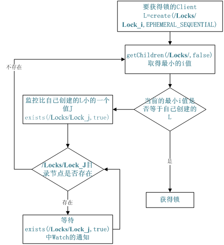

# ZooKeeper Questions

## ZooKeeper是什么

ZooKeeper 是一个**分布式**的，开放源码的分布式**应用程序协调服务**，是 Google 的 Chubby 一个开源的实现，它是**集群的管理者**，**监视着集群中各个节点的状态根据节点提交的反馈进行下一步合理操作**。最终，将简单易用的接口和性能高效、功能稳定的系统提供给用户。

客户端的**读请求**可以被集群中的**任意一台机器处理**，如果读请求在节点上注册了监听器，这个监听器也是由所连接的 ZooKeeper 机器来处理。对于**写请求**，这些请求会同**时发给其他ZooKeeper机器并且达成一致后，请求才会返回成功**。因此，随着**ZooKeeper**的集群机器增多，读请求的吞吐会提高但是写请求的吞吐会下降**。有序性是 ZooKeeper 中非常重要的一个特性，所有的**更新都是全局有序的**，每个更新都有一个**唯一的时间戳**，这个时间戳称为zxid** (ZooKeeper Transaction Id)**。而**读请求只会相对于更新有序，也就是读请求的返回结果中会带有这个ZooKeeper最新的zxid。

## ZooKeeper是用来干什么的

- 命名管理,配置管理,集群管理

  

## ZooKeeper在和Server通讯的过程中能使用连接池吗

不能，因为通讯是Session相关的

## ZooKeeper的watch机制

分为两类：

### 创建ZooKeeper的时候传入的Watch

这个watch是session级别的

### 获取数据时候传入的watch

这个watch是和path相关的

如果在获取数据的时候watch传入true，那么使用的是创建ZK的watch


## ZooKeeper的角色

- Leader
- Follower
- Observer

## ZooKeeper的端口

- 3888：选主投票
- 2888：leader接受write请求
- 2181：客户端与服务器的通信

## ZooKeeper的命名服务(文件系统)

命名服务是指通过指定的名字来**获取资源**或者**服务的地址**，利用 ZooKeeper创建一个全局的路径，即是**唯一**的路径，这个路径就可以作为一个名字，指向集群中的集群，提供的服务的地址，或者一个远程的对象等等。

## ZooKeeper的配置管理(文件系统,通知机制)

程序分布式的部署在不同的机器上，将程序的配置信息放在 ZooKeeper的**znode**下，当有配置发生改变时，也就是

znode 发生变化时，可以通过改变 ZooKeeper中某个目录节点的内容，利用**watcher**通知给各个客户端，从而更改配置。

## ZooKeeper集群管理(文件系统,通知机制)

所谓集群管理无在乎两点：**是否有机器退出和加入,选举master**。

对于第一点，所有机器约定在父目录下**创建临时目录节点**，然后监听父目录节点的子节点变化消息。一旦有机

器挂掉，该机器与 ZooKeeper的连接断开，其所创建的临时目录节点被删除，**所有其他机器都收到通知：某个兄弟目录被删除**，于是，所有人都知道：它上船了。

新机器加入也是类似，**所有机器收到通知：新兄弟目录加入**，highcount 又有了，对于第二点，我们稍微改变一下，**所有机器创建临时顺序编号目录节点，每次选取编号最小的机器作为master就好**。

## ZooKeeper分布式锁(文件系统,通知机制)

有了 ZooKeeper的一致性文件系统，锁的问题变得容易。锁服务可以分为两类，一个是**保持独占**，另一个是**控制时序**。

对于第一类，我们将 ZooKeeper上的一个**znode**看作是一把锁，通过 createznode 的方式来实现。所有客户端都去创建 /distribute_lock 节点，最终成功创建的那个客户端也即拥有了这把锁。用完删除掉自己创建的 distribute_lock 节点就释放出锁。

对于第二类， /distribute_lock 已经预先存在，所有客户端在它下面创建临时顺序编号目录节点，和选 master 一样，**编号最小的获得锁**，用完删除，依次方便。

## ZooKeeper获取分布式锁的流程


在获取分布式锁的时候在 locker 节点下创建临时顺序节点，释放锁的时候删除该临时节点。客户端调用 createNode 方法在 locker 下创建临时顺序节点，

然后调用 getChildren(“locker”)来获取 locker 下面的所有子节点，注意此时不用设置任何 Watcher。客户端获取到所有的子节点 path 之后，如果发现自己创建的节点在所有创建的子节点序号最小，那么就认为该客户端获取到了锁。如果发现自己创建的节点并非 locker 所有子节点中最小的，说明自己还没有获取到锁，此时客户端需要找到**比自己小的那个节点**，然后对其调用**exist()**方法，同时对其注册事件监听器。之后，让这个被关注的节点删除，则客户端的 Watcher 会收到相应通知，此时再次判断自己创建的节点是否是 locker 子节点中序号最小的，如果是则获取到了锁，如果不是则重复以上步骤继续获取到比自己小的一个节点并注册监听。当前这个过程中还需要许多的逻辑判断。


代码的实现主要是基于互斥锁，获取分布式锁的重点逻辑在于**BaseDistributedLock**，实现了基于ZooKeeper实现分布式锁的细节。


## ZooKeeper队列管理(文件系统,通知机制)

两种类型的队列：

1,同步队列，当一个队列的成员都聚齐时，这个队列才可用，否则一直等待所有成员到达。

2,队列按照 FIFO 方式进行入队和出队操作。

第一类，在约定目录下创建临时目录节点，监听节点数目是否是我们要求的数目。

第二类，和分布式锁服务中的控制时序场景基本原理一致，入列有编号，出列按编号。在特定的目录下创建

**PERSISTENT_SEQUENTIAL**节点，创建成功时**Watcher**通知等待的队列，队列删除**序列号最小的节点**用以消费。此场景下 ZooKeeper的 znode 用于消息存储，znode 存储的数据就是消息队列中的消息内容，SEQUENTIAL 序列号就是消息的编号，按序取出即可。由于创建的节点是持久化的，所以**不必担心队列消息的丢失问题**。

## ZooKeeper数据复制

ZooKeeper作为一个集群提供一致的数据服务，自然，它要在**所有机器间**做数据复制。数据复制的好处：

1,容错：一个节点出错，不致于让整个系统停止工作，别的节点可以接管它的工作；

2,提高系统的扩展能力 ：把负载分布到多个节点上，或者增加节点来提高系统的负载能力；

3,提高性能：让**客户端本地访问就近的节点，提高用户访问速度**。

从客户端读写访问的透明度来看，数据复制集群系统分下面两种：

1,  **写主**(WriteMaster) ：对数据的**修改提交给指定的节点**。读无此限制，可以读取任何一个节点。这种情况下客户端需要对读与写进行区别，俗称**读写分离**；

2,  **写任意**(Write Any)：对数据的**修改可提交给任意的节点**，跟读一样。这种情况下，客户端对集群节点的角色与变化透明。

对 ZooKeeper来说，它采用的方式是**写任意**。通过增加机器，它的读吞吐能力和响应能力扩展性非常好，而写，随着机器的增多吞吐能力肯定下降(这也是它建立 observer 的原因)，而响应能力则取决于具体实现方式，是**延迟复制保持最终一致性**，还是**立即复制快速响应**。

## ZooKeeper工作原理

ZooKeeper的核心是**原子广播**，这个机制保证了**各个Server之间的同步**。实现这个机制的协议叫做**Zab**协议**。Zab 协议有两种模式，它们分别是**恢复模式(选主)**和**广播模式(同步)**。当服务启动或者在领导者崩溃后，Zab 就进入了恢复模式，当领导者被选举出来，且大多数 Server 完成了和 leader 的状态同步以后，恢复模式就结束了。状态同步保证了 leader 和 Server 具有相同的系统状态。

## ZooKeeper是如何保证事务的顺序一致性

ZooKeeper采用了**递增的事务Id**来标识，所有的 proposal(提议)都在被提出的时候加上了 zxid，zxid 实际上是一个 64 位的数字，高 32 位是 epoch(时期; 纪元; 世; 新时代)用来标识 leader 是否发生改变，如果有新的 leader 产生出来，epoch 会自增，**低32位用来递增计数**。当新产生 proposal 的时候，会依据数据库的两阶段过程，首先会向其他的 server 发出事务执行请求，如果超过半数的机器都能执行并且能够成功，那么就会开始执行。

## ZooKeeper下 Server 工作状态

每个 Server 在工作过程中有三种状态：

LOOKING：当前 Server**不知道leader是谁**，正在搜寻

LEADING：当前 Server 即为选举出来的 leader

FOLLOWING：leader 已经选举出来，当前 Server 与之同步

## ZooKeeper是如何选取主Leader

当 leader 崩溃或者 leader 失去大多数的 follower，这时 ZooKeeper进入恢复模式，恢复模式需要重新选举出一个新的 leader，让所有的 Server 都恢复到一个正确的状态。ZooKeeper的选举算法有两种：一种是基于 basic paxos 实现的，另外一种是基于 fast paxos 算法实现的。系统默认的选举算法为**fast paxos**。

1,ZooKeeper选主流程(basic paxos)

(1) 选举线程由当前 Server 发起选举的线程担任，其主要功能是对投票结果进行统计，并选出推荐的Server；

(2) 选举线程首先向所有 Server 发起一次询问(包括自己)；

(3) 选举线程收到回复后，验证是否是自己发起的询问(验证 zxid 是否一致)，然后获取对方的 id(myid)，并存储到当前询问对象列表中，最后获取对方提议的 leader 相关信息(id,zxid)，并将这些信息存储到当次选举的投票记录表中；

(4) 收到所有 Server 回复以后，就计算出 zxid 最大的那个 Server，并将这个 Server 相关信息设置成下一次要投票的 Server；

(5) 线程将当前 zxid 最大的 Server 设置为当前 Server 要推荐的 Leader，如果此时获胜的 Server 获得 n/2 \+ 1 的 Server 票数，设置当前推荐的 leader 为获胜的 Server，将根据获胜的 Server 相关信息设置自己的状态，否则，继续这个过程，直到 leader 被选举出来。 通过流程分析我们可以得出：要使 Leader 获得多数Server 的支持，则 Server 总数必须是奇数 2n+1，且存活的 Server 的数目不得少于 n+1. 每个 Server 启动后都会重复以上流程。在恢复模式下，如果是刚从崩溃状态恢复的或者刚启动的 server 还会从磁盘快照中恢复数据和会话信息，ZooKeeper会记录事务日志并定期进行快照，方便在恢复时进行状态恢复。

## 满足什么条件的机器能当选Leader

每台机器都有一个myid(机器唯一码)，zxid(数据版本号)

满足的条件：

1、zxid最大：数据最新，即资格最老

2、myid最大：论资排辈

所有存在的数据都是过半通过得到的

## 选主总结

两个场景

### 集群第一次启动

集群中的机器相继启动，只有当第一次达到过半的机器就会当选Leader：zxid一致，myid最大的当选

### Leader挂掉后的选主

其中一个节点选主发起投票，其他节点被动投票，如果存在zxid小于其他节点的节点，票数就会减少，并会被纠正

### 选举总结

1、3888两两通信

2、任何一个节点发起投票，都会触发其他节点给自己投票

3、准则：先zxid，再比较myid


# ZooKeeper的原理和应用

原文链接：HTTPs://blog.csdn.net/lingbo229/article/details/81052078

## ZooKeeper是什么

官方说辞：**ZooKeeper分布式服务框架是Apache Hadoop 的一个子项目**，它主要是用来解决分布式应用中经常遇到的一些数据管理问题，如：统一命名服务,状态同步服务,集群管理,分布式应用配置项的管理等。

好抽象，我们改变一下方式，先看看它都提供了哪些功能，然后再看看使用它的这些功能能做点什么。

##  ZooKeeper提供了什么

简单的说，ZooKeeper= **文件系统** + **通知机制**。

### 1, 文件系统

ZooKeeper维护一个类似文件系统的数据结构：

​                             


每个子目录项如 NameService 都被称作为 znode，和文件系统一样，我们能够自由的增加,删除znode，在一个znode下增加,删除子znode，唯一的不同在于znode是可以存储数据的。

有四种类型的znode：

1, **PERSISTENT**-持久化目录节点

​	客户端与ZooKeeper断开连接后，该节点依旧存在

2, **PERSISTENT_SEQUENTIAL**-持久化顺序编号目录节点

​	客户端与ZooKeeper断开连接后，该节点依旧存在，只是ZooKeeper给该节点名称进行顺序编号

3, **EPHEMERAL**-临时目录节点

​	客户端与ZooKeeper断开连接后，该节点被删除

4, **EPHEMERAL_SEQUENTIAL**-临时顺序编号目录节点

​	客户端与ZooKeeper断开连接后，该节点被删除，只是ZooKeeper给该节点名称进行顺序编号


### 2, 通知机制

客户端注册监听它关心的目录节点，当目录节点发生变化(数据改变,被删除,子目录节点增加删除)时，ZooKeeper会通知客户端。

就这么简单，下面我们看看能做点什么呢？


## 我们能用ZooKeeper做什么

### 1,命名服务

​    这个似乎最简单，在ZooKeeper的文件系统里创建一个目录，即有唯一的path。在我们使用tborg无法确定上游程序的部署机器时即可与下游程序约定好path，通过path即能互相探索发现，不见不散了。


### 2,配置管理

​    程序总是需要配置的，如果程序分散部署在多台机器上，要逐个改变配置就变得困难。好吧，现在把这些配置全部放到ZooKeeper上去，保存在 ZooKeeper的某个目录节点中，然后所有相关应用程序对这个目录节点进行监听，一旦配置信息发生变化，每个应用程序就会收到 ZooKeeper的通知，然后从 ZooKeeper获取新的配置信息应用到系统中就好。

​                     


### 3,集群管理

所谓集群管理无在乎两点：**机器退出和加入**,**选举Master**。

​    对于第一点，所有机器约定在父目录GroupMembers下创建临时目录节点，然后监听父目录节点的子节点变化消息。一旦有机器挂掉，该机器与 ZooKeeper的连接断开，其所创建的临时目录节点被删除，所有其他机器都收到通知：某个兄弟目录被删除，于是，所有人都知道：它挂了。新机器加入 也是类似，所有机器收到通知：新兄弟目录加入，highcount又有了。

​    对于第二点，我们稍微改变一下，所有机器创建临时顺序编号目录节点，每次选取编号最小的机器作为Master就好。

​                 


### 4,分布式锁

​    有了ZooKeeper的一致性文件系统，锁的问题变得容易。**锁服务可以分为两类，一个是保持独占，另一个是控制时序**。

​    对于第一类，我们将ZooKeeper上的一个znode看作是一把锁，通过createznode的方式来实现。所有客户端都去创建 /distribute_lock 节点，最终成功创建的那个客户端也即拥有了这把锁。厕所有言：来也冲冲，去也冲冲，用完删除掉自己创建的distribute_lock 节点就释放出锁。

​    对于第二类， /distribute_lock 已经预先存在，所有客户端在它下面创建临时顺序编号目录节点，和选Master一样，编号最小的获得锁，用完删除，依次方便。

​                     

### 5,队列管理

两种类型的队列：

1,同步队列，当一个队列的成员都聚齐时，这个队列才可用，否则一直等待所有成员到达。

​	- 在约定目录下创建临时目录节点，监听节点数目是否是我们要求的数目。

2,队列按照 FIFO 方式进行入队和出队操作。

​	- 和分布式锁服务中的控制时序场景基本原理一致，入列有编号，出列按编号。


​     终于了解完我们能用ZooKeeper做什么了，可是作为一个程序员，我们总是想狂热了解ZooKeeper是如何做到这一点的，单点维护一个文件系统没有什么难度，可是如果是一个集群维护一个文件系统保持数据的一致性就非常困难了。


### 6,分布式与数据复制

ZooKeeper作为一个集群提供一致的数据服务，自然，它要在所有机器间做数据复制。数据复制的好处：

1,提高容错能力
一个节点出错，不致于让整个系统停止工作，别的节点可以接管它的工作；

2,提高扩展能力
把负载分布到多个节点上，或者增加节点来提高系统的负载能力；

3,提高性能
让客户端本地访问就近的节点，提高用户访问速度。


从客户端读写访问的透明度来看，数据复制集群系统分下面两种：

1,写主(WriteMaster)
对数据的修改提交给指定的节点。读无此限制，可以读取任何一个节点。这种情况下客户端需要对读与写进行区别，俗称读写分离；

2,写任意(Write Any)
对数据的修改可提交给任意的节点，跟读一样。这种情况下，客户端对集群节点的角色与变化透明。


​    对ZooKeeper来说，它采用的方式是**写任意**。通过增加机器，它的读吞吐能力和响应能力扩展性非常好，而写，随着机器的增多吞吐能力肯定下降(这也是它建立observer的原因)，而响应能力则取决于具体实现方式，是延迟复制保持最终一致性，还是立即复制快速响应。

我们关注的重点还是在如何保证数据在集群所有机器的一致性，这就涉及到paxos算法。


### 7,数据一致性与Paxos算法

​    据说**Paxos算法**的难理解与算法的知名度一样令人敬仰，所以我们先看如何保持数据的一致性，这里有个**原则**就是：**在一个分布式数据库系统中，如果各节点的初始状态一致，每个节点都执行相同的操作序列，那么他们最后能得到一个一致的状态**。

​    Paxos算法解决的什么问题呢，解决的就是保证每个节点执行相同的操作序列。好吧，这还不简单，Master维护一个全局写队列，所有写操作都必须 放入这个队列编号，那么无论我们写多少个节点，只要写操作是按编号来的，就能保证一致性。没错，就是这样，可是如果Master挂了呢。

​    Paxos算法通过投票来对写操作进行全局编号，同一时刻，只有一个写操作被批准，同时并发的写操作要去争取选票，只有获得过半数选票的写操作才会被批准，所以永远只会有一个写操作得到批准，其他的写操作竞争失败只好再发起一轮投票，就这样，在日复一日年复一年的投票中，所有写操作都被严格编号排序。编号严格递增，当一个节点接受了一个编号为100的写操作，之后又接受到编号为99的写操作(因为网络延迟等很多不可预见原因)，它马上能意识到自己数据不一致了，自动停止对外服务并重启同步过程。任何一个节点挂掉都不会影响整个集群的数据一致性(总2n+1台，除非挂掉大于n台)。

总结：ZooKeeper作为 Hadoop 项目中的一个子项目，是 Hadoop 集群管理的一个必不可少的模块，它主要用来控制集群中的数据，如它管理 Hadoop 集群中的 NameNode，还有 Hbase 中 Master Election,Server之间状态同步等。


# [ZooKeeper工作原理](HTTP://blog.csdn.net/baiduforum/article/details/6981456)

​    ZooKeeper是一个分布式的，开放源码的分布式应用程序协调服务，它包含一个简单的**原语集**，分布式应用程序可以基于它实现同步服务，配置维护和命名服务等。ZooKeeper是Hadoop的一个子项目，其发展历程无需赘述。**在分布式应用中，由于工程师不能很好地使用锁机制，以及基于消息的协调机制不适合在某些应用中使用，因此需要有一种可靠的,可扩展的,分布式的,可配置的协调机制来统一系统的状态。ZooKeeper的目的就在于此**。本文简单分析ZooKeeper的工作原理，对于如何使用ZooKeeper不是本文讨论的重点。

# ZooKeeper的基本概念

## 1.1 角色

ZooKeeper中的角色主要有以下三类，如下表所示：

​             

在 ZooKeeper集群服务运行的过程中，Observer 服务器与 Follower 服务器具有一个相同的功能，那就是负责处理来自客户端的诸如查询数据节点等非事务性的会话请求操作。但与 Follower 服务器不同的是，Observer 不参与 Leader 服务器的选举工作，也不会被选举为 Leader 服务器。

系统模型如图所示：

​             

## 1.2 设计目的

1. **最终一致性**：client不论连接到哪个Server，展示给它都是同一个视图，这是ZooKeeper最重要的性能。

2. **可靠性**：具有简单,健壮,良好的性能，如果消息被一台服务器接受，那么它将被所有的服务器接受。最重要的是能快速恢复服务。

3. **实时性**：ZooKeeper保证客户端将在一个时间间隔范围内获得服务器的更新信息，或者服务器失效的信息。但由于网络延时等原因，ZooKeeper不能保证两个客户端能同时得到刚更新的数据，如果需要最新数据，应该在读数据之前调用sync()接口。

4. **等待无关**(wait-free)：慢的或者失效的client不得干预快速的client的请求，使得每个client都能有效的等待。

5. **原子性**：更新只能成功或者失败，没有中间状态。

6. **顺序性**：包括全局有序和偏序两种：全局有序是指如果在一台服务器上消息a在消息b前发布，则在所有Server上消息a都将在消息b前被发布；偏序是指如果一个消息b在消息a后被同一个发送者发布，a必将排在b前面。

#  ZooKeeper的工作原理

​    **ZooKeeper的核心是原子广播**，这个机制保证了各个Server之间的同步。实现这个机制的协议叫做**Zab协议**。Zab协议有两种模式，它们分 别是**恢复模式(选主)**和**广播模式(同步)**。当服务启动或者在领导者崩溃后，Zab就进入了恢复模式，当领导者被选举出来，且大多数Server完成了和 leader的状态同步以后，恢复模式就结束了。状态同步保证了leader和Server具有相同的系统状态。

​    ZooKeeper基于ZAB(**Z**ookeeper **A**tomic **B**roadcast)，实现了主备模式下的系统架构，保持集群中各个副本之间的数据一致性。ZAB协议定义了选举(election),发现(discovery),同步(sync),广播(Broadcast)四个阶段EDSB：**选举**(Election)是选出哪台为主机；**发现**(Discovery),**同步**(Sync)当主选出后，要做的恢复数据的阶段；**广播**(Broadcast)当主机和从选出并同步好数据后，正常的主写同步从写数据的阶段。

**原子**：成功或者失败，没有中间状态

**广播**：自己把消息发不出去，但是不保证全部节点都收到


​    为了保证事务的顺序一致性，ZooKeeper采用了递增的事务id号(zxid)来标识事务。所有的提议(proposal)都在被提出的时候加上 了zxid。实现中zxid是一个64位的数字，它高32位是epoch用来标识leader关系是否改变，每次一个leader被选出来，它都会有一个新的epoch，标识当前属于那个leader的统治时期。低32位用于递增计数。

每个Server在工作过程中有三种状态：

- LOOKING：当前Server不知道Leader是谁，正在搜寻
- LEADING：当前Server即为选举出来的leader
- FOLLOWING：Leader已经选举出来，当前Server与之同步

## 2.1 选主流程

   当leader崩溃或者leader失去大多数的follower，这时候ZK进入恢复模式，恢复模式需要重新选举出一个新的leader，让所有的 Server都恢复到一个正确的状态。ZK的选举算法有两种：一种是基于basic paxos实现的，另外一种是基于fast paxos算法(过半通过&两阶段提交)实现的。系统默认的选举算法为fast paxos。先介绍basic paxos流程：

​    1 .选举线程由当前Server发起选举的线程担任，其主要功能是对投票结果进行统计，并选出推荐的Server；

​    2 .选举线程首先向所有Server发起一次询问(包括自己)；

​    3 .选举线程收到回复后，验证是否是自己发起的询问(验证zxid是否一致)，然后获取对方的id(myid)，并存储到当前询问对象列表中，最后获取对方提议的leader相关信息(    id,zxid)，并将这些信息存储到当次选举的投票记录表中；

​    4.  收到所有Server回复以后，就计算出zxid最大的那个Server，并将这个Server相关信息设置成下一次要投票的Server；

​    5.  线程将当前zxid最大的Server设置为当前Server要推荐的Leader，如果此时获胜的Server获得n/2 + 1的Server票数， 设置当前推荐的leader为获胜的Server，将根据获胜的Server相关信息设置自己的状态，否则，继续这个过程，直到leader被选举出来。

  通过流程分析我们可以得出：要使Leader获得多数Server的支持，则Server总数必须是奇数2n+1，且存活的Server的数目不得少于n+1.

  每个Server启动后都会重复以上流程。在恢复模式下，如果是刚从崩溃状态恢复的或者刚启动的server还会从磁盘快照中恢复数据和会话信息，ZK会记录事务日志并定期进行快照，方便在恢复时进行状态恢复。选主的具体流程图如下所示：

​                     

   fast paxos流程是在选举过程中，某Server首先向所有Server提议自己要成为leader，当其它Server收到提议以后，解决epoch和 zxid的冲突，并接受对方的提议，然后向对方发送接受提议完成的消息，重复这个流程，最后一定能选举出Leader。其流程图如下所示：

​             

### 选主总结：

ZooKeeper为了保证各节点的协调工作，在工作的时候需要一个Leader的角色，而ZooKeeper默认采用FastLeaderElection算法，且头票数大于半数则胜出，相关概念：

1,服务器ID：配置myid配置文件，编号越大在选举中的权重就越大

2,选举状态：竞选态Looking,随从态Following,观察态Observing,领导态Leading

3,数据ID：服务器中存放的数据版本号，版本号越大数据越新，选举中权重越大。

4,逻辑时钟：理解为投票选举中的投票次数

选举类型：全新选举和非全新选举

**全新选举**：1号启动，给自己投票，Looking；2号启动，给自己投票，与1号通信，2号ID大，1号给2号投票，未过半，Looking；3号启动，给自己投票，与已经启动的服务器通信，收到2票，共3票，由于过半，直接成为Leading，已经启动的几期切换为Following，后面几期相应启动，都成为Following。

**宕机选举**：

1,首先统计**逻辑时钟**(投票次数)是否相同，逻辑时钟小，则说明收到投票的次数小，可能宕机过，所以数据可能不完整。该结果被忽略，重新投票

2,统计**数据ID**，数据ID大的胜出，即数据最新的胜出，否则重新投票

3,比对**服务器ID**，大者胜出

## 2.2 同步流程

选完leader以后，ZK就进入状态同步过程。

​    1. leader等待server连接；

​    2 .Follower连接leader，将最大的zxid发送给leader；

​    3 .Leader根据follower的zxid确定同步点；

​    4 .完成同步后通知follower 已经成为uptodate状态；

​    5 .Follower收到uptodate消息后，又可以重新接受client的请求进行服务了。

流程图如下所示：

​                 

## 2.3 工作流程

### 2.3.1 Leader工作流程

Leader主要有三个功能：

​    1 .恢复数据；

​    2 .维持与Learner的心跳，接收Learner请求并判断Learner的请求消息类型；

​    3 .Learner的消息类型主要有PING消息,REQUEST消息,ACK消息,REVALIDATE消息，根据不同的消息类型，进行不同的处理。

​    PING消息是指Learner的心跳信息；REQUEST消息是Follower发送的提议信息，包括写请求及同步请求；ACK消息是 Follower的对提议的回复，超过半数的Follower通过，则commit该提议；REVALIDATE消息是用来延长SESSION有效时间。
Leader的工作流程简图如下所示，在实际实现中，流程要比下图复杂得多，启动了三个线程来实现功能。

​                 

### 2.3.2 Follower工作流程

Follower主要有四个功能：

​    1. 向Leader发送请求(PING消息,REQUEST消息,ACK消息,REVALIDATE消息)；

​    2 .接收Leader消息并进行处理；

​    3 .接收Client的请求，如果为写请求，发送给Leader进行投票；

​    4 .返回Client结果。

Follower的消息循环处理如下几种来自Leader的消息：

​    1 .PING消息： 心跳消息；

​    2 .PROPOSAL消息：Leader发起的提案，要求Follower投票；

​    3 .COMMIT消息：服务器端最新一次提案的信息；

​    4 .UPTODATE消息：表明同步完成；

​    5 .REVALIDATE消息：根据Leader的REVALIDATE结果，关闭待revalidate的session还是允许其接受消息；

​    6 .SYNC消息：返回SYNC结果到客户端，这个消息最初由客户端发起，用来强制得到最新的更新。

Follower的工作流程简图如下所示，在实际实现中，Follower是通过5个线程来实现功能的。

​             

对于observer的流程不再叙述，observer流程和Follower的唯一不同的地方就是observer不会参加leader发起的投票。


# ZooKeeper典型使用场景

## [ZooKeeper典型使用场景一览](HTTP://www.kuqin.com/system-analysis/20111120/315148.html)

​    ZooKeeper是一个高可用的分布式数据管理与系统协调框架。基于对Paxos算法的实现，使该框架保证了分布式环境中数据的强一致性，也正是基 于这样的特性，使得ZooKeeper能够应用于很多场景。网上对ZK的使用场景也有不少介绍，本文将结合作者身边的项目例子，系统的对ZK的使用场景进行归类介绍。 值得注意的是，ZK并不是生来就为这些场景设计，都是后来众多开发者根据框架的特性，摸索出来的典型使用方法。因此，也非常欢迎你分享你在ZK使用上的奇 技淫巧。


| 场景类别       | 典型场景描述(ZK特性，使用方法)                               | <span style="display:inline-block;width:400px">应用中的具体使用</span> |
| -------------- | ------------------------------------------------------------ | ------------------------------------------------------------ |
| 数据发布与订阅 | 发布与订阅即所谓的配置管理，顾名思义就是将数据发布到ZK节点上，供订阅者动态获取数据，实现配置信息的集中式管理和动态更新。例如全局的配置信息，地址列表等就非常适合使用。 | 1. 索引信息和集群中机器节点状态存放在ZK的一些指定节点，供各个客户端订阅使用。<br/>2. 系统日志(经过处理后的)存储，这些日志通常2-3天后被清除。 <br/>3. 应用中用到的一些配置信息集中管理，在应用启动的时候主动来获取一次，并且在节点上注册一个Watcher，以后每次配置有更新，实时通知到应用，获取最新配置信息。<br/>4. 业务逻辑中需要用到的一些全局变量，比如一些消息中间件的消息队列通常有个offset，这个offset存放在ZK上，这样集群中每个发送者都能知道当前的发送进度。<br/>5. 系统中有些信息需要动态获取，并且还会存在人工手动去修改这个信息。以前通常是暴露出接口，例如JMX接口，有了ZK后，只要将这些信息存放到ZK节点上即可。 |
| Name Service   | 这个主要是作为分布式命名服务，通过调用ZK的create node api，能够很容易创建一个全局唯一的path，这个path就可以作为一个名称。 |                                                              |
| 分布通知/协调  | Zookeeper中特有watcher注册与异步通知机制，能够很好的实现分布式环境下不同系统之间的通知与协调，实现对数据变更的实时处理。使用方法通常是不同系统都对 ZK上同一个znode进行注册，监听znode的变化(包括znode本身内容及子节点的)，其中一个系统update了znode，那么另一个系统能 够收到通知，并作出相应处理。 | 1. 心跳检测机制：检测系统和被检测系统之间并不直接关联起来，而是通过ZK上某个节点关联，大大减少系统耦合。<br/>2. 系统调度模式：某系统有控制台和推送系统两部分组成，控制台的职责是控制推送系统进行相应的推送工作。管理人员在控制台作的一些操作，实际上是修改 了ZK上某些节点的状态，而ZK就把这些变化通知给他们注册Watcher的客户端，即推送系统，于是，作出相应的推送任务。 <br/>3. 另一种工作汇报模式：一些类似于任务分发系统，子任务启动后，到ZK来注册一个临时节点，并且定时将自己的进度进行汇报(将进度写回这个临时节点)，这样任务管理者就能够实时知道任务进度。<br/>总之，使用ZooKeeper来进行分布式通知和协调能够大大降低系统之间的耦合。 |
| 分布式锁       | 分布式锁，这个主要得益于ZooKeeper为我们保证了数据的强一致性，即用户只要完全相信每时每刻，ZK集群中任意节点(一个ZooKeeperserver)上的相同znode的数据是一定是相同的。锁服务可以分为两类，一个是保持独占，另一个是控制时序。 所 谓保持独占，就是所有试图来获取这个锁的客户端，最终只有一个可以成功获得这把锁。通常的做法是把ZK上的一个znode看作是一把锁，通过create znode的方式来实现。所有客户端都去创建 /distribute_lock 节点，最终成功创建的那个客户端也即拥有了这把锁。控 制时序，就是所有视图来获取这个锁的客户端，最终都是会被安排执行，只是有个全局时序了。做法和上面基本类似，只是这里 /distribute_lock 已经预先存在，客户端在它下面创建临时有序节点(这个可以通过节点的属性控制：CreateMode.EPHEMERAL_SEQUENTIAL来指 定)。ZK的父节点(/distribute_lock)维持一份sequence,保证子节点创建的时序性，从而也形成了每个客户端的全局时序。 |                                                              |
| 集群管理       | 1. 集群机器监控：这通常用于那种对集群中机器状态，机器在线率有较高要求的场景，能够快速对集群中机器变化作出响应。这样的场景中，往往有一个监控系统，实时检测集群 机器是否存活。过去的做法通常是：监控系统通过某种手段(比如ping)定时检测每个机器，或者每个机器自己定时向监控系统汇报“我还活着”。 这种做法可行，但是存在两个比较明显的问题：1. 集群中机器有变动的时候，牵连修改的东西比较多。2. 有一定的延时。 利用ZooKeeper有两个特性，就可以实时另一种集群机器存活性监控系统：a. 客户端在节点x上注册一个Watcher，那么如果x的子节点变化了，会通知该客户端。b. 创建EPHEMERAL类型的节点，一旦客户端和服务器的会话结束或过期，那么该节点就会消失。例 如，监控系统在 /clusterServers 节点上注册一个Watcher，以后每动态加机器，那么就往 /clusterServers 下创建一个 EPHEMERAL类型的节点：/clusterServers/{hostname}. 这样，监控系统就能够实时知道机器的增减情况，至于后续处理就是监控系统的业务了。 <br/>2. Master选举则是ZooKeeper中最为经典的使用场景了。在分布式环境中，相同的业务应用分布在不同的机器上，有些业务逻辑(例如一些耗时的计算，网络I/O处理)，往往只需要让整个集群中的某一台机器进行执行， 其余机器可以共享这个结果，这样可以大大减少重复劳动，提高性能，于是这个Master选举便是这种场景下的碰到的主要问题。利用ZooKeeper的强一致性，能够保证在分布式高并发情况下节点创建的全局唯一性，即：同时有多个客户端请求创建 /currentMaster 节点，最终一定只有一个客户端请求能够创建成功。利用这个特性，就能很轻易的在分布式环境中进行集群选取了。另外，这种场景演化一下，就是动态Master选举。这就要用到 EPHEMERAL_SEQUENTIAL类型节点的特性了。上文中提到，所有客户端创建请求，最终只有一个能够创建成功。在这里稍微变化下，就是允许所有请求都能够创建成功，但是得有个创建顺序，于是所有的请求最终在ZK上创建结果的一种可能情况是这样： /currentMaster/{sessionId}-1 , /currentMaster/{sessionId}-2 , /currentMaster/{sessionId}-3 ….. 每次选取序列号最小的那个机器作为Master，如果这个机器挂了，由于他创建的节点会马上小时，那么之后最小的那个机器就是Master了。 | 1. 在搜索系统中，如果集群中每个机器都生成一份全量索引，不仅耗时，而且不能保证彼此之间索引数据一致。因此让集群中的Master来进行全量索引的生成， 然后同步到集群中其它机器。<br/>2. 另外，Master选举的容灾措施是，可以随时进行手动指定Master，就是说应用在ZK在无法获取Master信息时，可以通过比如HTTP方式，向一个地方获取Master。 |
| 分布式队列     | **队列方面，我目前感觉有两种：一种是常规的先进先出队列，另一种是要等到队列成员聚齐之后的才统一按序执行。**对于第二种先进先出队列，和分布式锁服务中的控制时序场景基本原理一致，这里不再赘述。 第二种队列其实是在FIFO队列的基础上作了一个增强。通常可以在 /queue 这个znode下预先建立一个/queue/num 节点，并且赋值为n(或者直接给/queue赋值n)，表示队列大小，之后每次有队列成员加入后，就判断下是否已经到达队列大小，决定是否可以开始执行 了。这种用法的典型场景是，分布式环境中，一个大任务Task A，需要在很多子任务完成(或条件就绪)情况下才能进行。这个时候，凡是其中一个子任务完成(就绪)，那么就去 /taskList 下建立自己的临时时序节点(CreateMode.EPHEMERAL_SEQUENTIAL)，当 /taskList 发现自己下面的子节点满足指定个数，就可以进行下一步按序进行处理了。 |                                                              |


参考：

​    HTTP://ZooKeeper.apache.org/
​    HTTP://blog.csdn.net/cutesource/article/details/5822459
​    HTTP://blog.csdn.net/pwlazy/article/details/8080626
​    HTTP://nileader.blog.51cto.com/1381108/795265
​    HTTP://nileader.blog.51cto.com/1381108/926753
​    HTTP://nileader.blog.51cto.com/1381108/795230
​    [HTTP://netcome.iteye.com/blog/1474255](HTTP://nileader.blog.51cto.com/1381108/795230)


# ZooKeeper全解析：Paxos作为灵魂

原文链接：HTTPs://www.douban.com/note/208430424/

原计划在介绍完ZooKeeperClient之后就着手ZooKeeperServer的介绍，但是发现ZooKeeperServer所包含的内容实在太多，并不是简简单单一篇Blog就能搞定的。于是决定从基础搞起比较好。

那么ZooKeeperServer最基础的东西是什么呢？我想应该是Paxos了。所以本文会介绍Paxos以及它在ZooKeeperServer中对应的实现。

先说Paxos，它是一个基于消息传递的一致性算法，Leslie Lamport在1990年提出，近几年被广泛应用于分布式计算中，Google的Chubby，Apache的ZooKeeper都是基于它的理论来实现的，Paxos还被认为是到目前为止唯一的分布式一致性算法，其它的算法都是Paxos的改进或简化。有个问题要提一下，Paxos有一个前提：没有拜占庭将军问题。就是说Paxos只有在一个可信的计算环境中才能成立，这个环境是不会被入侵所破坏的。

关于Paxos的具体描述可以在Wiki中找到：HTTP://zh.wikipedia.org/zh-cn/Paxos算法。网上关于Paxos分析的文章也很多。这里希望用最简单的方式加以描述并建立起Paxos和ZooKeeperServer的对应关系。

Paxos描述了这样一个场景，有一个叫做Paxos的小岛(Island)上面住了一批居民，岛上面所有的事情由一些特殊的人决定，他们叫做议员(Senator)。议员的总数(Senator Count)是确定的，不能更改。岛上每次环境事务的变更都需要通过一个提议(Proposal)，每个提议都有一个编号(PID)，这个编号是一直增长的，不能倒退。每个提议都需要超过半数((Senator Count)/2 +1)的议员同意才能生效。每个议员只会同意大于当前编号的提议，包括已生效的和未生效的。如果议员收到小于等于当前编号的提议，他会拒绝，并告知对方：你的提议已经有人提过了。这里的当前编号是每个议员在自己记事本上面记录的编号，他不断更新这个编号。整个议会不能保证所有议员记事本上的编号总是相同的。现在议会有一个目标：保证所有的议员对于提议都能达成一致的看法。

好，现在议会开始运作，所有议员一开始记事本上面记录的编号都是0。有一个议员发了一个提议：将电费设定为1元/度。他首先看了一下记事本，嗯，当前提议编号是0，那么我的这个提议的编号就是1，于是他给所有议员发消息：1号提议，设定电费1元/度。其他议员收到消息以后查了一下记事本，哦，当前提议编号是0，这个提议可接受，于是他记录下这个提议并回复：我接受你的1号提议，同时他在记事本上记录：当前提议编号为1。发起提议的议员收到了超过半数的回复，立即给所有人发通知：1号提议生效！收到的议员会修改他的记事本，将1好提议由记录改成正式的法令，当有人问他电费为多少时，他会查看法令并告诉对方：1元/度。

现在看冲突的解决：假设总共有三个议员S1-S3，S1和S2同时发起了一个提议:1号提议，设定电费。S1想设为1元/度, S2想设为2元/度。结果S3先收到了S1的提议，于是他做了和前面同样的操作。紧接着他又收到了S2的提议，结果他一查记事本，咦，这个提议的编号小于等于我的当前编号1，于是他拒绝了这个提议：对不起，这个提议先前提过了。于是S2的提议被拒绝，S1正式发布了提议: 1号提议生效。S2向S1或者S3打听并更新了1号法令的内容，然后他可以选择继续发起2号提议。

好，我觉得Paxos的精华就这么多内容。现在让我们来对号入座，看看在ZooKeeperServer里面Paxos是如何得以贯彻实施的。

小岛(Island)——ZooKeeperServer Cluster

议员(Senator)——ZooKeeperServer

提议(Proposal)——ZNode Change(Create/Delete/SetData…)

提议编号(PID)——Zxid(ZooKeeperTransaction Id)

正式法令——所有ZNode及其数据

貌似关键的概念都能一一对应上，但是等一下，Paxos岛上的议员应该是人人平等的吧，而ZooKeeperServer好像有一个Leader的概念。没错，其实Leader的概念也应该属于Paxos范畴的。如果议员人人平等，在某种情况下会由于提议的冲突而产生一个“活锁”(所谓活锁我的理解是大家都没有死，都在动，但是一直解决不了冲突问题)。Paxos的作者Lamport在他的文章”The Part-Time Parliament“中阐述了这个问题并给出了解决方案——在所有议员中设立一个总统，只有总统有权发出提议，如果议员有自己的提议，必须发给总统并由总统来提出。好，我们又多了一个角色：总统。

总统——ZooKeeperServer Leader

又一个问题产生了，总统怎么选出来的？oh, my god! It’s a long story. 在淘宝核心系统团队的Blog上面有一篇文章是介绍如何选出总统的，有兴趣的可以去看看：HTTP://rdc.taobao.com/blog/cs/?p=162

现在我们假设总统已经选好了，下面看看ZooKeeperServer是怎么实施的。

情况一：数据查询

屁民甲(Client)到某个议员(ZooKeeperServer)那里询问(Get)某条法令的情况(ZNode的数据)，议员毫不犹豫的拿出他的记事本(local storage)，查阅法令并告诉他结果，同时声明：我的数据不一定是最新的。你想要最新的数据？没问题，等着，等我找总统Sync一下再告诉你。

情况二：数据修改

屁民乙(Client)到某个议员(ZooKeeperServer)那里要求政府归还欠他的一万元钱，议员让他在办公室等着，自己将问题反映给了总统，总统询问所有议员的意见，多数议员表示欠屁民的钱一定要还，于是总统发表声明，从国库中拿出一万元还债，国库总资产由100万变成99万。屁民乙拿到钱回去了(Client函数返回)。

情况三：

总统突然挂了，议员接二连三的发现联系不上总统，于是各自发表声明，推选新的总统，总统大选期间政府停业，拒绝屁民的请求。

呵呵，到此为止吧，当然还有很多其他的情况，但这些情况总是能在Paxos的算法中找到原型并加以解决。这也正是我们认为Paxos是ZooKeeper的灵魂的原因。当然ZooKeeperServer还有很多属于自己特性的东西：Session, Watcher，Version等等等等，需要我们花更多的时间去研究和学习。


# [ZooKeeper中NIO的TCP粘包、拆包](https://blog.csdn.net/gaixm/article/details/78640410)

## TCP协议

TCP协议是个“流协议”，流就是没有界限的一串数据。TCP底层并不关心上层业务数据，它会根据TCP缓冲区的实际情况进行包的划分。所以，在业务上一个完整的数据，可能会被拆分成多个TCP数据包进行传输，也可能会将业务上的多个数据打包为一个数据包进行传输。所以，必须在TCP的上层设计应用协议来解决。

业界主流协议的解决方案，可以归纳为如下四种：

1. 消息定长。例如每个报文的大小固定为200字节，如果不够，空位补齐；

2. 在数据包尾增加回车换行符进行分割，如FTP协议。

3. 将消息分为消息头和消息体，消息头中包含表示消息总长度(或消息体长度)的字段，通常设计思路为消息头的第一个字段使用int32来表示消息的总长度；

4. 更加复杂的设计。

## ZooKeeper粘包与拆包方案

在ZooKeeper中，客户端与服务端进行通信，主要采用两种方式：

1. 原生Java NIO接口。
2. Netty库。

Netty库是对java NIO的封装，使得利用java实现网络通信更加便利。

在ZooKeeper采用原生java NIO接口实现网络通信时，需要解决TCP粘包与拆包问题。ZooKeeper客户端与服务端通信过程中，采用**jute序列化与反序列化**上层数据包，其**解决TCP粘包与拆包的方案为方案三：添加消息头**，消息头只包含表示消息体长度的字段。

### 客户端与服务端通信

```java
/**
     * This class allows us to pass the headers and the relevant records around.
     */
static class Packet {
  RequestHeader requestHeader;

  ReplyHeader replyHeader;

  Record request;

  Record response;

  ByteBuffer bb;

  /** Client's view of the path (may differ due to chroot) **/
  String clientPath;
  /** Servers's view of the path (may differ due to chroot) **/
  String serverPath;

  boolean finished;

  AsyncCallback cb;

  Object ctx;

  WatchRegistration watchRegistration;

  public boolean readOnly;

  /** Convenience ctor */
  Packet(RequestHeader requestHeader, ReplyHeader replyHeader,
         Record request, Record response,
         WatchRegistration watchRegistration) {
    this(requestHeader, replyHeader, request, response,
         watchRegistration, false);
  }

  Packet(RequestHeader requestHeader, ReplyHeader replyHeader,
         Record request, Record response,
         WatchRegistration watchRegistration, boolean readOnly) {

    this.requestHeader = requestHeader;
    this.replyHeader = replyHeader;
    this.request = request;
    this.response = response;
    this.readOnly = readOnly;
    this.watchRegistration = watchRegistration;
  }

  public void createBB() {
    try {
      ByteArrayOutputStream baos = new ByteArrayOutputStream();
      BinaryOutputArchive boa = BinaryOutputArchive.getArchive(baos);
      boa.writeInt(-1, "len"); // We'll fill this in later
      if (requestHeader != null) {
        // 将ZooKeeper请求头序列化后的字节流写入boa
        requestHeader.serialize(boa, "header");
      }
      // 将ZooKeeper请求体序列化后的字节流写入boa
      if (request instanceof ConnectRequest) {
        request.serialize(boa, "connect");
        // append "am-I-allowed-to-be-readonly" flag
        boa.writeBool(readOnly, "readOnly");
      } else if (request != null) {
        request.serialize(boa, "request");
      }
      baos.close();
      // 将字节流数组包装为bytebuffer
      this.bb = ByteBuffer.wrap(baos.toByteArray());
      // 在bytebuffer的开始写入ZooKeeper请求头+ZooKeeper请求体的长度。解决Tcp粘包与拆包
      this.bb.putInt(this.bb.capacity() - 4);
      // position归0
      this.bb.rewind();
    } catch (IOException e) {
      LOG.warn("Ignoring unexpected exception", e);
    }
  }

  @Override
  public String toString() {
    StringBuilder sb = new StringBuilder();

    sb.append("clientPath:" + clientPath);
    sb.append(" serverPath:" + serverPath);
    sb.append(" finished:" + finished);

    sb.append(" header:: " + requestHeader);
    sb.append(" replyHeader:: " + replyHeader);
    sb.append(" request:: " + request);
    sb.append(" response:: " + response);

    // jute toString is horrible, remove unnecessary newlines
    return sb.toString().replaceAll("\r*\n+", " ");
  }
}
```

createBB()方法将ZooKeeper请求头和ZooKeeper请求体进行序列化后包装为ByteBuffer，然后在预占位上写入序列化后的请求长度。当socketChannel可以写入的时候，直接调用socketChannel的write方法即可。

### 服务端接收到请求


```java
      if (k.isReadable()) {
        	// 将内容读取到incomingBuffer中.
        	// 可能读取到lenBuffer中，也可能读取到根据请求内容长度新分配的bytebuffer中
            int rc = sock.read(incomingBuffer);
            if (rc < 0) {
                throw new EndOfStreamException(
                        "Unable to read additional data from client sessionid 0x"
                        + Long.toHexString(sessionId)
                        + ", likely client has closed socket");
            }
            // 如果读满了
            if (incomingBuffer.remaining() == 0) {
                boolean isPayload;
                // 关键：如果incomingBuffer和lenBuffer指向同一个byteBuffer，
                // 说明是新请求的第一次读,读取的是请求内容长度
                if (incomingBuffer == lenBuffer) { // start of next request
                    incomingBuffer.flip();
                    // 获取请求内容长度
                    isPayload = readLength(k);
                    incomingBuffer.clear();
                } else {
                	// 说明TCP拆包了，需要继续读未读完的包。
                    // continuation
                    isPayload = true;
                }
                // 继续读请求内容
                if (isPayload) { // not the case for 4letterword
                    readPayload();
                }
                else {
                    // four letter words take care
                    // need not do anything else
                    return;
                }
            }
        }
```


其中成员变量lenBuffer和incomingBuffer的定义为：

```java
ByteBuffer lenBuffer = ByteBuffer.allocate(4);
ByteBuffer incomingBuffer = lenBuffer;
```

### 读取请求内容长度

```java
/** Reads the first 4 bytes of lenBuffer, which could be true length or
   *  four letter word.
   *
   * @param k selection key
   * @return true if length read, otw false (wasn't really the length)
   * @throws IOException if buffer size exceeds maxBuffer size
   */
private boolean readLength(SelectionKey k) throws IOException {
  // Read the length, now get the buffer
  int len = lenBuffer.getInt();
  if (!initialized && checkFourLetterWord(sk, len)) {
    return false;
  }
  if (len < 0 || len > BinaryInputArchive.maxBuffer) {
    throw new IOException("Len error " + len);
  }
  if (zkServer == null) {
    throw new IOException("ZooKeeperServer not running");
  }
  // 分配请求内容长度大小的ByteBuffer
  incomingBuffer = ByteBuffer.allocate(len);
  return true;
}
```

### 读取请求内容方法

```java
/** Read the request payload (everything following the length prefix) */
    private void readPayload() throws IOException, InterruptedException {
    	// 如果还有剩余空间没有读满，那就接着读。表示TCP拆包了。
        if (incomingBuffer.remaining() != 0) { // have we read length bytes?
            int rc = sock.read(incomingBuffer); // sock is non-blocking, so ok
            if (rc < 0) {
                throw new EndOfStreamException(
                        "Unable to read additional data from client sessionid 0x"
                        + Long.toHexString(sessionId)
                        + ", likely client has closed socket");
            }
        }
        
        // 如果没有剩余空间了，代表已经将请求内容读完整了。
        if (incomingBuffer.remaining() == 0) { // have we read length bytes?
        	// 收到请求包
            packetReceived();
            incomingBuffer.flip();
            if (!initialized) {
                readConnectRequest();
            } else {
                readRequest();
            }
            // 清空
            lenBuffer.clear();
            // 下一个请求包还未读取状态
            incomingBuffer = lenBuffer;
        }
    }
```

ZooKeeper使用固定长度为4字节的lenBuffer来存放请求内容长度，incomingBuffer存放请求内容。如果incomingBuffer == lenBuffer，即两个引用指向预先分配4字节的bytebuffer实例，就代表着新的请求内容长度的读取。否则，表示读取请求内容。其设计很简洁、实用，特此总结，记录。

## 参考

1、《Netty权威指南 第二版》

2、 ZooKeeper-3.4.6源码

# ZooKeeper的API操作

[ZooKeeper.java](ZooKeeper.assets/ZooKeeper.java)
