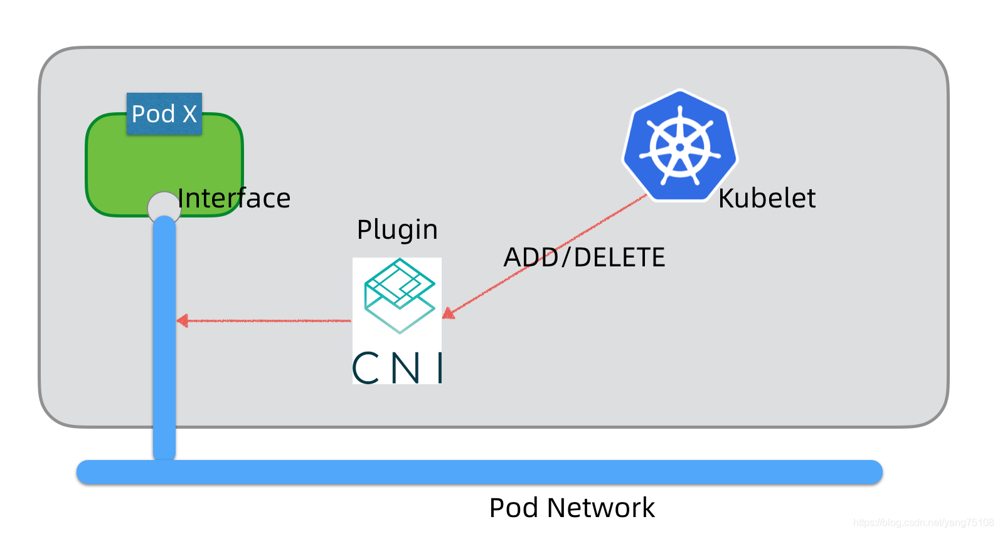
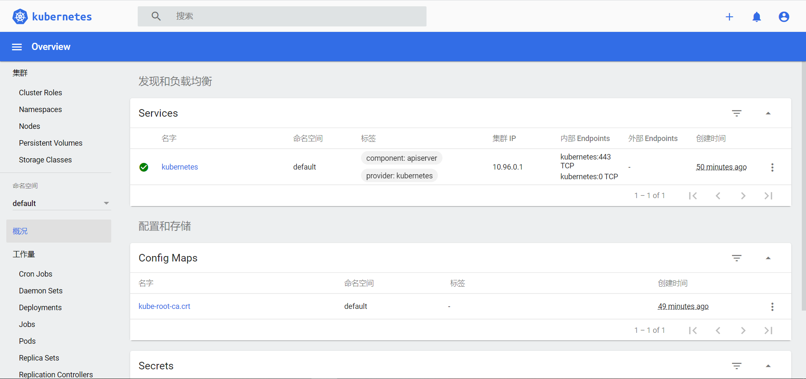

# Kubernetes

## 常见容器编排工具

- Docker Compose：单机编排

- Docker Swarm：集群编排
- Kubernetes：集群编排

## Kubernetes发展史

Kubernetes 希腊语 :舵手

- 2014年，kubernetes正式对外开源
- 2015年7月，正式对外发布v1.0版，随后加入CNCF基金会
- 2017年，kubernetes正式战胜swarm和mesos，成为领域老大
- 2018年，CNCF基金会宣布:Kubernetes成为首个"毕业"项目

## K8S职责

- 自动化容器的部署和复制
- 随时扩缩容
- 容器分组
- 容器间负载均衡
- 实时监控：鼓掌发现，自动替换

## K8S概览

### K8S发展

1. Apache Mesos
   - 采用Apache协议
   - 是一个开源分布式资源管理器
   - 2019-5 Twitter转向K8S之后，Mesos逐渐没落
2. Docker Swarm
   - 轻量化
   - 虽然也能实现规模化，但是功能少
     - 无回滚机制
     - 无滚动更新机制
   - 2019-7阿里云宣布阿里云主机不再提供Swarm的选项
3. Kubernetes
   - Google主导开发
   - 多年的容器化架构经验打造
   - 利用Go语言打造的资源管理框架Borg
   - 特点：
     - 轻量级：Go语言打造(现代C语言)，语言级别提供进程管理，系统资源占用少
     - 开源
     - 弹性伸缩
     - 负载均衡：使用IPVS

### K8S是什么？

K8S官网文档：https://kubernetes.io/zh/docs/home/

K8S 是Kubernetes的全称，源于希腊语，意为"舵手"或"飞行员"，官方称其是：用于自动部署、扩展和管理"容器化（containerized）应用程序"的开源系统。翻译成大白话就是："K8S 是负责自动化运维管理多个跨机器 Docker 程序的集群"。

[K8S网络系列学习笔记之一-----Service简介](https://www.jianshu.com/p/c9f402e588bf)

[K8S网络系列学习笔记之二-----Service IPVS代理](https://www.jianshu.com/p/d1ba8b910085)

[K8S网络系列学习笔记之三----kube-proxy原理分析](https://www.jianshu.com/p/1ece2c8a79bc)

[在K8S中使用Local持久卷](https://www.jianshu.com/p/8236cb452bcf)

[K8S top命令](https://www.jianshu.com/p/eff7d2b4a09b)

### K8S核心特性

1. **服务发现与负载均衡**：无需修改你的应用程序即可使用陌生的服务发现机制。
2. **存储编排**：自动挂载所选存储系统，包括本地存储。
3. **Secret和配置管理**：部署更新Secrets和应用程序的配置时不必重新构建容器镜像，且不必将软件堆栈配置中的秘密信息暴露出来。
4. **批量执行**：除了服务之外，Kubernetes还可以管理你的批处理和CI工作负载，在期望时替换掉失效的容器。
5. **水平扩缩**：使用一个简单的命令、一个UI或基于CPU使用情况自动对应用程序进行扩缩。
6. **自动化上线和回滚**：Kubernetes会分步骤地将针对应用或其配置的更改上线，同时监视应用程序运行状况以确保你不会同时终止所有实例。
7. **自动装箱**：根据资源需求和其他约束自动放置容器，同时避免影响可用性。
8. **自我修复**：重新启动失败的容器，在节点死亡时替换并重新调度容器，杀死不响应用户定义的健康检查的容器。

### 一图解千言


在早期运维时代，我们都是在物理机上部署程序，一般会选择一台主机，把要部署的程序安装到这台主机上，但是一般部署到这台机器后，我们一般认为这个进程存在与这台机器上这个状态是恒定的。当然这个进程有可能会挂掉，机器也有可能会重启，我们需要能够自动拉起相应的进程，拉起后它仍然在这台机器上。但是在程序挂或者机器重启的过程中，我们访问这个进程就会出错，会造成一段时间的服务不可用。
 在微服务架构中，我们一般会把服务注册到一个注册中心，如果服务挂了，就会从注册中心摘掉。所以一般会通过部署多个服务进程，来保证服务整体的可用性，实现不间断的服务能力。

### Pod简介

[Kubernetes中的Pod的到底是什么](http://dockone.io/article/2682)

Kubernetes Pod是Kubernetes的一个最小部署单元，它由一个或者多个容器组成（这里一般指Docker容器），这里我们在物理机时代部署一个进程类似，但是在Kubernetes中，一般认为Pod是一个临时的实体，而不是永久性实体，Pod是有生命周期的，它们可以被创建，也可以被销毁，是一个临时实体，不是一个持久性的实体，每个Pod成功部署后，会有一个唯一的UID标识，一旦销毁后（不管什么原因），它就不能被恢复了。

所以一般我们会通过Deployment或者ReplicationController来管理Pod，实现Pod动态的创建和销毁，当一个Pod被销毁或者Pod所在的主机宕机之后，会自动重新调度创建出一个Pod，这个Pod与之前的Pod的名字可以相同，但是UID是不同的，而且它们的IP也会不同，那么当通过Deployment或者ReplicationController管理的一组Pod向其他的Pod提供服务时，如何保留自己呢？

当然这里也可以基于前面提到的微服务架构体系来实现，但是Kubernetes有自己的一套解决方案，那就是通过Service来提供统一的访问入口。

### Pod简单总结

- Pod是容器的容器，可以包含多个Container

- K8S最小可部署单元，一个Pod就是一个进程

- 内容容器网络互通，每个Pod都有独立的VIP

- Pod都是部署完整的应用或模块

- 分为两部分：

  - Pause：特殊的容器，两个职能：提供共享的网络空间(localhost+port) ，提供共享的Volume数据卷
  - Container：可以存在多个

### Pause容器

[Kubernetes之"暂停"容器](https://www.uupee.com/home/view/2248/)

当检查你的Kubernetes集群的节点时，在节点上执行命令docker ps，你可能会注意到一些被称为"暂停（/pause）"的容器。

```sh
$ docker ps
CONTAINER ID IMAGE COMMAND ...
...
3b45e983c859 gcr.io/google_containers/pause-amd64:3.0  "/pause" ...
...
dbfc35b00062 gcr.io/google_containers/pause-amd64:3.0  "/pause" ...
...
c4e998ec4d5d gcr.io/google_containers/pause-amd64:3.0  "/pause" ...
...
508102acf1e7 gcr.io/google_containers/pause-amd64:3.0  "/pause" ...
```

在Kubernetes中，Pause容器用作你的Pod中所有容器的“父容器”。

Pause容器有两个核心职责。

1. 在Pod中它作为Linux命名空间共享的基础。
2. 启用PID命名空间共享，它为每个Pod提供的PID为1，并收集僵尸进程。


**共享命名空间**

在Linux中，当你运行新进程时，该进程从父进程继承其命名空间。在新命名空间中运行进程的方法是通过**取消**与父进程**共享**的命名空间，从而创建一个新的命名空间。以下是使用该unshare工具在新的PID，UTS，IPC和装载命名空间中运行shell的示例。

```sh
$ unshare --pid --uts --ipc --mount -f chroot rootfs / bin / sh
```

一旦进程运行，你可以将其他进程添加到进程的命名空间中以形成一个Pod。可以使用`setns`系统调用将新进程添加到现有命名空间。

Pod中的容器在其中共享命名空间。

使用Pause容器和共享命名空间从头开始创建Pod的示例：

首先，我们将需要使用Docker启动Pause容器，以便我们可以将容器添加到Pod中。

```sh
docker run -d --name pause gcr.io/google_containers/pause-amd64:3.0
```

其次，我们可以运行我们的Pod的容器。

运行Nginx，这将在端口2368上设置Nginx到其localhost的代理请求。

```sh
$ cat <<EOF >> nginx.conf
> error_log stderr;
> events { worker_connections  1024; }
> http {
>     access_log /dev/stdout combined;
>     server {
>         listen 80 default_server;
>         server_name example.com www.example.com;
>         location / {
>             proxy_pass http://127.0.0.1:2368;
>         }
>     }
> }
> EOF
$ docker run -d --name nginx -v `pwd`/nginx.conf:/etc/nginx/nginx.conf -p 8080:80 --net=container:pause --ipc=container:pause --pid=container:pause nginx 
```

搭建应用服务器的ghost博客应用程序创建另一个容器

```sh
$ docker run -d --name ghost --net=container:pause --ipc=container:pause --pid=container:pause ghost
```

在这两种情况下，我们将Pause容器指定为我们要加入其命名空间的容器。这将有效地创建我们的Pod。如果你访问 http://localhost:8080/ 你应该能够看到ghost通过Nginx代理运行，因为网络命名空间在pause，nginx和ghost容器之间共享。

**收割僵尸**

在Linux中，PID命名空间中的所有进程会形成一个树结构，每个进程都会有一个父进程。只有在树的根部的进程没有父进程。这个进程就是“init”进程，即PID为1。

僵尸进程是已停止运行但进程表条目仍然存在的进程；

进程可以使用fork和exec syscalls启动其他进程。当启动了其他进程，新进程的父进程就是调用fork syscall的进程。fork用于启动正在运行的进程的另一个副本，而exec则用于启动不同的进程。每个进程在OS进程表中都有一个条目。这将记录有关进程的状态和退出代码。当子进程运行完成，它的进程表条目仍然将保留直到父进程使用wait syscall检索其退出代码将其退出。这被称为“收割”僵尸进程。

### Service简介

Kubernetes Service与微服务类似，它提供了一套一组Pod的抽象，可以让其他的Pod（或者物理进程）访问到底层的一组Pod，实现负载均衡和高可用服务能力。

Kubernetes Service通常通过**Label Selector**来实现与底层的Pod的关联，并且会进行实时的关联。Service会基于Endpoints API实时检测到底层Pod的变化，并进行更新，与微服务的原理类似，唯一不同的是访问的方式不太一致。

- 一般的微服务需要实现一个富SDK，在SDK中实现对多个backend访问的高可用和负载均衡的能力，所以微服务体系在开发层面来讲，要做到语言无关性的话需要额外做出很多工作；
- K8S service一般提供了基于VIP代理的方式访问Service，首先访问到vip和对应的端口，再由Service重定向到管理的Pod中，保持了API的一致性；

### kube-proxy代理模式

[K8S网络系列学习笔记之一：Service简介](https://www.jianshu.com/p/c9f402e588bf)

K8S Service的这种服务能力是在kube-proxy中的代理来实现的，kube-proxy在 Kubernetes v1.0 版本，代理完全在 userspace，在 Kubernetes v1.1 版本，新增了 iptables 代理，但并不是默认的运行模式。 从 Kubernetes v1.2 起，默认就是 iptables 代理，发展到v1.8版本开始引入ipvs模式，并在Kubernetes 1.11进入GA，在Kubernetes1.12成为kube-proxy的默认代理模式。

**userspace**

这种模式，kube-proxy 会监视 Kubernetes master 对 Service 对象和 Endpoints 对象的添加和移除。 对每个 Service，它会在本地 Node 上打开一个端口（随机选择）。 任何连接到"代理端口"的请求，都会被代理到 Service 的backend Pods 中的某个上面（如 Endpoints 所报告的一样）。 使用哪个 backend Pod，是基于 Service 的 SessionAffinity 来确定的。 最后，它安装 iptables 规则，捕获到达该 Service 的 clusterIP（是虚拟 IP）和 Port 的请求，并重定向到代理端口，代理端口再代理请求到 backend Pod。

网络返回的结果是，任何到达 Service 的 IP:Port 的请求，都会被代理到一个合适的 backend，不需要客户端知道关于 Kubernetes、Service、或 Pod 的任何信息。

默认的策略是，通过 round-robin 算法来选择 backend Pod。 实现基于客户端 IP 的会话亲和性，可以通过设置 service.spec.sessionAffinity 的值为 "ClientIP" （默认值为 "None"）。


**iptables**

这种模式，kube-proxy 会监视 Kubernetes master 对 `Service` 对象和 `Endpoints` 对象的添加和移除。 对每个 `Service`，它会安装 iptables 规则，从而捕获到达该 `Service` 的 `clusterIP`（虚拟 IP）和端口的请求，进而将请求重定向到 `Service` 的一组 backend 中的某个上面。 对于每个 `Endpoints` 对象，它也会安装 iptables 规则，这个规则会选择一个 backend `Pod`。

默认的策略是，随机选择一个 backend。 实现基于客户端 IP 的会话亲和性，可以将 `service.spec.sessionAffinity` 的值设置为 `"ClientIP"` （默认值为 `"None"`）。

和 userspace 代理类似，网络返回的结果是，任何到达 `Service` 的 IP:Port 的请求，都会被代理到一个合适的 backend，不需要客户端知道关于 Kubernetes、`Service`、或 `Pod` 的任何信息。 这应该比 userspace 代理更快、更可靠。然而，不像 userspace 代理，如果初始选择的 `Pod` 没有响应，iptables 代理不能自动地重试另一个 `Pod`，所以它需要依赖 [readiness probes](https://kubernetes.io/docs/tasks/configure-pod-container/configure-liveness-readiness-probes/#defining-readiness-probes)。


**IPVS**

这种模式，kube-proxy会监视Kubernetes Service对象和Endpoints，调用netlink接口以相应地创建ipvs规则并定期与Kubernetes Service对象和Endpoints对象同步ipvs规则，以确保ipvs状态与期望一致。访问服务时，流量将被重定向到其中一个后端Pod。

与iptables类似，ipvs基于netfilter 的 hook 功能，但使用哈希表作为底层数据结构并在内核空间中工作。这意味着ipvs可以更快地重定向流量，并且在同步代理规则时具有更好的性能。此外，ipvs为负载均衡算法提供了更多选项，例如：

- rr：轮询调度
- lc：最小连接数
- dh：目标哈希
- sh：源哈希
- sed：最短期望延迟
- nq： 不排队调度

注意： ipvs模式假定在运行kube-proxy之前在节点上都已经安装了IPVS内核模块。当kube-proxy以ipvs代理模式启动时，kube-proxy将验证节点上是否安装了IPVS模块，如果未安装，则kube-proxy将回退到iptables代理模式。


## 核心概念

### Pod的创建

Pod的创建由两种方式：

1. 基于命令的方式：`kubectl run ...`
2. 基于Yaml资源清单的方式：`kubectl apply -f xxx.yml`

#### 基于Yaml的Pod创建

1. Pod调度策略

   ```yaml
   apiVersion:vl
   kind: Pod
   metadata:
     name: with-node-affinity
   spec:
     affinity:
       nodeAffinity:
         requiredDuringSchedulingIgnoredDuringExecution:
           nodeSelectorTerms:
           - matchExpressions:
             - key: env_role
               operator: In # In NotIn Exists Gt Lt DoseNotExists
               values:
               - dev
               - test
           preferredDuringSchedulingIgnoredDuringExecution:
           - weight: 1
             preference:
               matchExpressions:
               - key: group
                 operator: In
                 values:
                 - otherprod
     containers:
     - name:webdemo
       image: nginx
   ```

2. 污点和污点容忍

   - `nodeSelector`和`nodeAffinity`：Pod调度到某些节点上，Pod属性，调度时候实现

   - Taint污点:节点不做普通分配调度，是节点属性，有三个值：

     - NoSchedule：一定不被调度
     - PreferNoSchdule：尽量不被调度
     - NoExecute：不会调度且驱逐到已有的Pod？？？？？？

   - 场景：

     - 专用节点
     - 配备特定硬件节点
     - 基于Taint污点驱逐

   - 相关命令

     - 查看污点情况

       ```sh
       $ kubectl describe node k8smaster I grep Taint
       ```


### 核心组件

- etcd：保存集群的资源状态
- apiserver：提供了资源操作的唯一入口，并提供认证、授权、访问控制、API注册和发现等机制
- controller manager：负责维护集群的状态，比如故障检测、自动扩展、滚动更新等
- scheduler：负责资源的调度按照预定的调度策略将Pod调度到相应的机器上
- kubelet：负责维护容器的生命周期，同时也负责Volume(cvl)和网络(CNI)的管理
- Container runtime：负责镜像管理以及Pod和容器的真正运行(CRI)
- kube-proxy：负责为Service提供cluster内部的服务发现和负载均衡

### 扩展组件

- kube-dns：负责为整个集群提供DNS服务
- Ingress Controller：为服务提供外网入口
- Heapster：提供资源监控
- Dashboard：提供GUI
- Federation：提供跨可用区的集群
- Fluentd-elasticsearch：提供集群日志采集、存储与查询
  - EFK：Elasticsearch、Fluentd和Kibana的缩写
  - ELK：Elasticsearch、Logstash和Kibana的缩写
  - EFK和ELK都是开源日志管理解决方案的缩写

## 常用命令

> kubectl [command] [TYPE] [NAME] [flags]
>
> 1. [command]：官方查找所有的命令：**kubectl -h**
> 2. [TYPE]：官方查找资源命令：**kubectl api-resources**，其输出列表的**NAME**列就是kubectl命令用法中**[type]**的值，定义了每种资源的缩写和资源清单列表的**[kind]**
>
> kubectl api-versions


1. 给节点打标签

   ```sh
   $ kubectl label node nodel env_role=prod
   ```

2. 查看标签

   ```sh
   $ kubectl get nodes K8Snodel--show-labels
   ```

3. 查看日志

   ```sh
   $ journalctl -xefu kubelet
   ```

### kubectl常用命令

#### 创建/更新资源

1. 基于资源清单

   ```sh
   # 创建新资源，资源标识存在时会报错
   kubectl create -f <deploy-yml-file>
   
   # 创建或更新资源
   kubectl apply -f <deploy-yml-file>
   ```

2. 基于控制台命令

   ```sh
   kubectl run NAME \
   --image=image \
   [--env="key=value"] \
   [--port=port] \
   [--dry-run=server|client] \
   [--overrides=inline-json]
   [--command] -- [COMMAND] [args...] [options]
   
   ===============================================
   # Start a nginx pod
   kubectl run nginx --image=nginx
   
   # Start a hazelcast pod and let the container expose port 5701
   kubectl run hazelcast --image=hazelcast/hazelcast --port=5701
   
   # Start a hazelcast pod and set environment variables "DNS_DOMAIN=cluster" and "POD_NAMESPACE=default" in the container
   kubectl run hazelcast --image=hazelcast/hazelcast --env="DNS_DOMAIN=cluster" --env="POD_NAMESPACE=default"
   
   # Start a hazelcast pod and set labels "app=hazelcast" and "env=prod" in the container
   kubectl run hazelcast --image=hazelcast/hazelcast --labels="app=hazelcast,env=prod"
   
   # Dry run; print the corresponding API objects without creating them
   kubectl run nginx --image=nginx --dry-run=client
   
   # Start a nginx pod, but overload the spec with a partial set of values parsed from JSON
   kubectl run nginx --image=nginx --overrides='{ "apiVersion": "v1", "spec": { ... } }'
   
   # Start a busybox pod and keep it in the foreground, don't restart it if it exits
   kubectl run -i -t busybox --image=busybox --restart=Never
   
   # Start the nginx pod using the default command, but use custom arguments (arg1 .. argN) for that command
   kubectl run nginx --image=nginx -- <arg1> <arg2> ... <argN>
   
   # Start the nginx pod using a different command and custom arguments
   kubectl run nginx --image=nginx --command -- <cmd> <arg1> ... <argN>
   ```

   

#### 查看资源

```sh
kubectl get <resource-name>
	- kubectl get deployment
	- kubectl get service
	- kubectl get pods

kubectl get pod [-o wide]

kubectl describe deployment <deploy-name>
kubectl describe pod <pod-name>
kubectl describe service <service-name>
```

```sh
kubectl logs [-f] [-p] (POD | TYPE/NAME) [-c CONTAINER] [options]

# Print the logs for a container in a pod or specified resource. If the pod has only one container, the container name is optional.

	# Return snapshot logs from pod nginx with only one container
  kubectl logs nginx
  
  # Return snapshot logs from pod nginx with multi containers
  kubectl logs nginx --all-containers=true
  
  # Return snapshot logs from all containers in pods defined by label app=nginx
  kubectl logs -l app=nginx --all-containers=true
  
  # Return snapshot of previous terminated ruby container logs from pod web-1
  kubectl logs -p -c ruby web-1
  
  # Begin streaming the logs of the ruby container in pod web-1
  kubectl logs -f -c ruby web-1
  
  # Begin streaming the logs from all containers in pods defined by label app=nginx
  kubectl logs -f -l app=nginx --all-containers=true
  
  # Display only the most recent 20 lines of output in pod nginx
  kubectl logs --tail=20 nginx
  
  # Show all logs from pod nginx written in the last hour
  kubectl logs --since=1h nginx
  
  # Show logs from a kubelet with an expired serving certificate
  kubectl logs --insecure-skip-tls-verify-backend nginx
  
  # Return snapshot logs from first container of a job named hello
  kubectl logs job/hello
  
  # Return snapshot logs from container nginx-1 of a deployment named nginx
  kubectl logs deployment/nginx -c nginx-1
```


#### 删除资源

```sh
kubectl delete service <service-name>
kubectl delete deployment <deploy-name>
```


## 集群环境搭建

> 集成脚本参考：QLCoder\JavaNotes\Kubernetes(K8S)\COS7-Init\

### 节点规划

```hosts
192.168.1.50 k8s-master.napsoul.com k8s-master
192.168.1.51 k8s-node1.napsoul.com k8s-node1
192.168.1.52 k8s-node2.napsoul.com k8s-node2
192.168.1.60 k8s-registry.napsoul.com k8s-registry
```

### 基础环境配置

> 具体的实现案例请参考：QLCoder/JavaNotes/Kubernetes(K8S)/COS7-Init/

```sh
# 关闭IPV6，否在下载可能出现问题：cos7-init_ipv6_close_local.sh

# /etc/hosts追加下面的内容，并分发至每台节点
192.168.1.50 k8s-master.napsoul.com k8s-master
192.168.1.51 k8s-node1.napsoul.com k8s-node1
192.168.1.52 k8s-node2.napsoul.com k8s-node2
192.168.1.60 k8s-registry.napsoul.com k8s-registry

# 免密登录，并分发至每个节点，具体实现：cos7-init_login_without_pwd.sh
ssh-keygen -t rsa
ssh-copy-id root@<host-ip>

# 配置hostname
hostnamectl set-hostname <host-name>
exec /bin/bash

# 关闭虚拟内存运行
swapoff -a

# 内核配置：关闭虚拟内存/交换分区的启动
cat >> /etc/sysctl.d/k8s.conf << EOF
vm.swappiness=0
EOF

# 内核配置：配置数据流中转
cat >> /etc/sysctl.d/k8s.conf << EOF
net.bridge.bridge-nf-call-ip6tables = 1
net.bridge.bridge-nf-call-iptables = 1
net.ipv4.ip_forward = 1
EOF

# 应用内核配置，并分发至每个节点
modprobe br_netfilter
modprobe overlay
sysctl -p /etc/sysctl.d/k8s.conf
```

### 容器环境配置

```sh
# 定制软件源
yum install -y yum-utils device-mapper-persistent-data lvm2
yum-config-manager --add-repo http://mirrors.aliyun.com/docker-ce/linux/centos/docker-ce.repo

# 安装最新稳定版docker
yum list docker-ce --showduplicates | sort -r
yum install -y docker-ce
systemctl enable docker
systemctl start docker

# 配置镜像加速器 & 调整cgroupfs为systemd
mkdir -p /etc/docker
tee /etc/docker/daemon.json <<-'EOF'
{
  "registry-mirrors": [
    "https://7eyfz1ob.mirror.aliyuncs.com",
    "https://registry.docker-cn.com",
    "http://hub-mirror.c.163.com",
    "https://docker.mirrors.ustc.edu.cn"
  ], 
  "insecure-registries": ["k8s-register.napsoul.com"], 
  "exec-opts": ["native.cgroupdriver=systemd"]
}
EOF
systemctl daemon-reload
systemctl restart docker
```

### CRI环境配置

> 所有**主从节点**配置

1. 安装

   ```sh
   # 下载软件
   mkdir -p /opt/softs && cd /opt/softs
   wget https://github.com/Mirantis/cri-dockerd/releases/download/v0.3.2/cri-dockerd-0.3.2.amd64.tgz
   
   # 解压软件
   tar -xf cri-dockerd-0.3.2.amd64.tgz
   mv cri-dockerd/cri-dockerd /usr/local/bin/
   
   # 分发到主从的每个节点
   for i in <master-ip> <node-1-ip> <node-2-ip> <node-3-ip>; do
   	scp /opt/softs/cri-dockerd/cri-dockerd root@$i:/usr/local/bin/
   done
   
   # 安装验证
   for i in <master-ip> <node-1-ip> <node-2-ip> <node-3-ip>; do
   	ssh root@$i "cri-dockerd --version"
   done
   ```

2.  创建配置文件：cri-dockerd.service 和 cri-dockerd.socket

   ```properties
   cat > /etc/systemd/system/cri-dockerd.service << EOF
   [Unit]
   Description=CRI Interface for Docker Application Container Engine
   Documentation=https://docs.mirantis.com
   After=network-online.target firewalld.service docker.service
   Wants=network-online.target
   [Service]
   Type=notify
   ExecStart=/usr/local/bin/cri-dockerd --pod-infra-container-image=registry.cn-hangzhou.aliyuncs.com/google_containers/pause:3.9 --network-plugin=cni --cni-conf-dir=/etc/cni/net.d --cni-bin-dir=/opt/cni/bin --container-runtime-endpoint=unix:///var/run/cri-dockerd.sock --cri-dockerd-root-directory=/var/lib/dockershim --docker-endpoint=unix:///var/run/docker.sock --cri-dockerd-root-directory=/var/lib/docker
   ExecReload=/bin/kill -s HUP $MAINPID
   TimeoutSec=0
   RestartSec=2
   Restart=always
   StartLimitBurst=3
   StartLimitInterval=60s
   LimitNOFILE=infinity
   LimitNPROC=infinity
   LimitCORE=infinity
   TasksMax=infinity
   Delegate=yes
   KillMode=process
   [Install]
   WantedBy=multi-user.target
   EOF
   ```

   ```properties
   cat > /etc/systemd/system/cri-dockerd.socket << EOF
   [Unit]
   Description=CRI Docker Socket for the API
   PartOf=cri-docker.service
   
   [Socket]
   ListenStream=/var/run/cri-dockerd.sock
   SocketMode=0660
   SocketUser=root
   SocketGroup=docker
   
   [Install]
   WantedBy=sockets.target
   EOF
   ```

3.  配置 cri-dockerd

   ```sh
   # 分发至主从的所有节点
   for i in <master-ip> <node-1-ip> <node-2-ip> <node-3-ip>; do
   	scp /etc/systemd/system/cri-dockerd.service root@$i:/etc/systemd/system/cri-dockerd.service
   	scp /etc/systemd/system/cri-dockerd.socket root@$i:/etc/systemd/system/cri-dockerd.socket
   done
   
   # 设置开机自启
   for i in <master-ip> <node-1-ip> <node-2-ip> <node-3-ip>; do
   	ssh root@$i "systemctl daemon-reload; systemctl enable cri-dockerd.service; systemctl restart cri-dockerd.service"
   done
   
   # 测试：主从节点都执行
   systemctl status cri-dockerd
   systemctl is-active cri-dockerd
   ```

### Harbor仓库部署

1. 环境准备

   ```sh 
   yum install -y docker-compose
   ```

2. 安装Harbor

   ```sh
   # 下载软件
   mkdir /data/{softs,server} -p && cd /opt/softs
   wget https://github.com/goharbor/harbor/releases/download/v2.5.0/harbor-offline-installer-v2.5.0.tgz
   
   # 解压软件
   tar -zxvf harbor-offline-installer-v2.5.0.tgz -C /data/server/
   cd /data/server/harbor/
   
   # 加载镜像
   docker load < harbor.v2.5.0.tar.gz
   docker images
   
   # 备份配置
   cp harbor.yml.tmpl harbor.yml
   ```

3. 修改配置

   ```sh
   修改配置
   cp harbor.yml.tmpl harbor.yml
   vi harbor.yml
   # 1.修改主机名
   hostname: k8s-registry.napsoul.com
   http:
     port: 80
   # https:  2. 注释ssl相关的部分
   #   port: 443
   #   certificate: /your/certificate/path
   #   private_key: /your/private/key/path
   # 3. 修改harbor的登录密码
   harbor_admin_password: 123456
   # 设定harbor的数据存储目录
   data_volume: /data/server/harbor/data
   ```

4. 安装

   ```sh
   # 根据配置生成运行所需的配置文件
   ./prepare
   
   # 安装并启动harbor
   ./install.sh
   
   # 测试验证
   docker-compose ps
   ```

5. 定制服务启动文件：/etc/systemd/system/harbor.service

   ```properties
   [Unit]
   Description=Harbor
   After=docker.service systemd-networkd.service systemd-resolved.service
   Requires=docker.service
   Documentation=http://github.com/vmware/harbor
   
   [Service]
   Type=simple
   Restart=on-failure
   RestartSec=5
   #需要注意harbor的安装位置
   ExecStart=/usr/bin/docker-compose --file /data/server/harbor/docker-compose.yml up
   ExecStop=/usr/bin/docker-compose --file /data/server/harbor/docker-compose.yml down
   
   [Install]
   WantedBy=multi-user.target
   ```

   - 加载服务配置文件：systemctl daemon-reload
   - 启动服务：systemctl start harbor
   - 检查状态：systemctl status harbor
   - 设置开机自启动：systemctl enable harbor

6. 定制仓库

   1. 使用默认admin账户登录，创建公开权限新用户

   2. 定制镜像

      ```sh
      # 页面创建公开新仓库
      
      # 登录仓库
      docker login k8s-registry.napsoul.com -u <new-user>
      
      # 下载镜像
      docker pull busybox
      
      # 定制镜像标签
      docker tag <source-image>:<tag> <target-image>:<tag>
      docker tag <image-name>:<version> <route-addr-hosts>/<repo-name>/<image-name>:<version>
      docker tag busybox k8s-registry.napsoul.com/napsoul/busybox:v0.1
      
      # 推送镜像
      docker push k8s-registry.napsoul.com/napsoul/busybox:v0.1
      ```

### K8S集群初始化

> 确保服务自启：
>
> systemctl enable kubelet cri-dockerd docker

#### 软件源定制

```sh
# 定制阿里云的关于kubernetes的软件源
cat > /etc/yum.repos.d/kubernetes.repo << EOF
[kubernetes]
name=Kubernetes
baseurl=https://mirrors.aliyun.com/kubernetes/yum/repos/kubernetes-el7-x86_64
enabled=1
gpgcheck=0
repo_gpgcheck=0
gpgkey=https://mirrors.aliyun.com/kubernetes/yum/doc/yum-key.gpg https://mirrors.aliyun.com/kubernetes/yum/doc/rpm-package-key.gpg
EOF

# 更新软件源
yum makecache fast
```

#### 安装软件

```sh
# master & node 环境软件部署
yum install -y kubeadm kubectl kubelet

# 检查镜像文件列表
kubeadm config images list

# 获取当前K8S的版本信息
kubeadm_version=$(kubeadm version | sed -n 's/.*GitVersion:"\([^"]*\).*/\1/p' | sed 's/^v//')

# 获取镜像列表
images=$(kubeadm config images list --kubernetes-version=$kubeadm_version | awk -F "/" '{print $NF}')

# 遍历列表拉取镜像
for i in ${images}; do
  docker pull registry.aliyuncs.com/google_containers/$i
done

master_ip=$(hostname -I | awk '{print $1}')

# 初始化Master
# 注意，K8S在1.24之前只不需要指定`--cri-socket`的，因为默认使用了Docker作为容器
# 但是在1.24之后，就需要指定`--cri-socket`来规范K8S与容器之间的通讯
kubeadm init --kubernetes-version=$kubeadm_version \
--apiserver-advertise-address=$master_ip \
--image-repository registry.aliyuncs.com/google_containers \
--service-cidr=10.96.0.0/12 \
--pod-network-cidr=10.244.0.0/16 \
--ignore-preflight-errors=Swap \
--cri-socket=unix:///var/run/cri-dockerd.sock

# 如果失败可以使用如下命令进行重置
kubeadm reset

====================================================
[init] Using Kubernetes version: v1.28.2
[preflight] Running pre-flight checks
        [WARNING Firewalld]: firewalld is active, please ensure ports [6443 10250] are open or your cluster may not function correctly
        [WARNING Swap]: swap is enabled; production deployments should disable swap unless testing the NodeSwap feature gate of the kubelet
        [WARNING Service-Kubelet]: kubelet service is not enabled, please run 'systemctl enable kubelet.service'
error execution phase preflight: [preflight] Some fatal errors occurred:
        [ERROR NumCPU]: the number of available CPUs 1 is less than the required 2
        [ERROR Mem]: the system RAM (990 MB) is less than the minimum 1700 MB
[preflight] If you know what you are doing, you can make a check non-fatal with `--ignore-preflight-errors=...`
To see the stack trace of this error execute with --v=5 or higher
====================================================

# 测试
kubeadm init --kubernetes-version=$kubeadm_version \
--apiserver-advertise-address=$master_ip \
--image-repository registry.aliyuncs.com/google_containers \
--service-cidr=10.96.0.0/12 \
--pod-network-cidr=10.244.0.0/16 \
--ignore-preflight-errors=Swap \
--cri-socket=unix:///var/run/cri-dockerd.sock \
--ignore-preflight-errors=NumCPU \
--ignore-preflight-errors=Mem

====================================================
[init] Using Kubernetes version: v1.28.2
[preflight] Running pre-flight checks
        [WARNING NumCPU]: the number of available CPUs 1 is less than the required 2
        [WARNING Mem]: the system RAM (990 MB) is less than the minimum 1700 MB
        [WARNING Firewalld]: firewalld is active, please ensure ports [6443 10250] are open or your cluster may not function correctly
        [WARNING Swap]: swap is enabled; production deployments should disable swap unless testing the NodeSwap feature gate of the kubelet
        [WARNING Service-Kubelet]: kubelet service is not enabled, please run 'systemctl enable kubelet.service'
====================================================

# 初始化Node，加入到master集群
kubeadm join 10.0.0.12:6443 \
--token vudfvt.fwpohpbb7yw2qy49 \
--discovery-token-ca-cert-hash sha256:1... ...48545
--cri-socket=unix:///var/run/cri-dockerd.sock

# 验证组件状态
kubectl get componentstatus
kubectl get cs

kubectl get po -n kube-system
```

#### 配置CNI网络

- Flannel

   > flannel配置文件的地址可以从官网获取，地址在部署主机的时候控制台有打印：
   >
   > https://kubernetes.io/docs/concepts/cluster-administration/addons/
   >
   > 从页面找到Flannel的链接：https://github.com/flannel-io/flannel#deploying-flannel-manually
   >
   > 在该页面找到对应的配置文件地址：https://github.com/flannel-io/flannel/releases/latest/download/kube-flannel.yml

   ```sh
   # 下载flannel：
   wget -P /opt/k8s/network/flannel/ https://github.com/flannel-io/flannel/releases/latest/download/kube-flannel.yml
   
   # 备份
   cp /opt/k8s/network/flannel/kube-flannel.yml{,.bak}
   
   # 基于该资源清单文件拉取对应镜像/可不做，因为没有国内镜像
   image_lines=$(grep image: /opt/k8s/network/flannel/kube-flannel.yml | awk -F'/' '{print $NF}' | sort | uniq)
   
   # 拉取镜像/可不做，因为没有国内镜像
   for line in $image_lines; do
       local image_name="flannel/$line"
       echo "> Pulling image: $image_name"
       docker pull "$image_name"
   done
   
   # 修改配置文件/可不做，因为没有国内镜像
   sed -i '/ image:/s/docker.io\/flannel/k8s-registry.napsoul.com\/google_containers/' kube-flannel.yml
   
   # 部署flannel
   kubectl apply -f /opt/k8s/network/flannel/kube-flannel.yml
   
   # 测试
   kubectl get ns
   kubectl get pod -n kube-flannel
   kubectl get nodes
   ```

- Calico

  ```sh
  # 下载资源清单
  curl -O https://docs.projectcalico.org/manifests/calico.yaml
  
  # 编辑该配置文件
  	# 启用并修改：CALICO_IPV4POOL_CIDR，确保与init时的值保持一致
  grep -C 2 "CALICO_IPV4POOL_CIDR" calico.yaml
  # 1、干掉CALICO_IPV4POOL_CIDR所在行以及下一行的"注释+一个空格"
  # 2、修改value值为"10.244.0.0/16"
  sed -i '/CALICO_IPV4POOL_CIDR/{s/# //;n;s/# //;s/"[^"]*"/"10.244.0.0\/16"/}' calico.yaml
  
  # 吸怪镜像仓库地址
  sed -i 's#docker.io/##g'calico.yaml
  
  # 抓取calico.yaml中依赖的对象提前pull
  image_lines=$(grep image: /opt/k8s/network/calico/calico.yaml | sort | uniq)
  for line in $image_lines; do
      local image_name="$line"
      echo "> Pulling image: $image_name"
      docker pull "$image_name"
  done
  
  # 部署
  kubectl apply -f calico.yaml
  
  # 部署测试
  [root@k8s-master calico]$ kubectl get po -n kube-system
  NAME                                       READY   STATUS    RESTARTS      AGE
  calico-kube-controllers-658d97c59c-792df   1/1     Running   0             33m
  calico-node-dbgps                          0/1     Running   0             33m
  calico-node-q5vlv                          0/1     Running   0             33m
  calico-node-st6g7                          0/1     Running   0             33m
  coredns-66f779496c-h88pp                   0/1     Running   0             34m
  coredns-66f779496c-q7l4b                   1/1     Running   0             34m
  etcd-k8s-master                            1/1     Running   0             34m
  kube-apiserver-k8s-master                  1/1     Running   0             34m
  kube-controller-manager-k8s-master         1/1     Running   0             34m
  kube-proxy-42k28                           1/1     Running   0             33m
  kube-proxy-bgvvj                           1/1     Running   0             33m
  kube-proxy-kvj8w                           1/1     Running   0             34m
  kube-scheduler-k8s-master                  1/1     Running   1 (30m ago)   34m
  [root@k8s-master calico]$ kubectl describe po calico-kube-controllers-658d97c59c-792df -n kube-system
  Events:
  Type     Reason                  Age                 From               Message
  ----     ------                  ----                ----               -------
  Warning  FailedScheduling        36m                 default-scheduler  0/3 nodes are available: 3 node(s) had untolerated taint {node.kubernetes.io/not-ready: }. preemption: 0/3 nodes are available: 3 Preemption is not helpful for scheduling..
  Normal   Scheduled               33m                 default-scheduler  Successfully assigned kube-system/calico-kube-controllers-658d97c59c-792df to k8s-master
  Warning  FailedCreatePodSandBox  33m                 kubelet            Failed to create pod sandbox: rpc error: code = Unknown desc = failed to set up sandbox container "8282296283c378ac3b75f38b7d5fe19a8f7421e2d35795d63fed87dce414c0f6" network for pod "calico-kube-controllers-658d97c59c-792df": networkPlugin cni failed to set up pod "calico-kube-controllers-658d97c59c-792df_kube-system" network: plugin type="calico" failed (add): stat /var/lib/calico/nodename: no such file or directory: check that the calico/node container is running and has mounted /var/lib/calico/
  Normal   SandboxChanged          33m (x12 over 33m)  kubelet            Pod sandbox changed, it will be killed and re-created.
  Warning  FailedCreatePodSandBox  33m (x4 over 33m)   kubelet            (combined from similar events): Failed to create pod sandbox: rpc error: code = Unknown desc = failed to set up sandbox container "d27f329f53739352b2712c426bf47685aad84a72142f66e88398002d43a0b2bd" network for pod "calico-kube-controllers-658d97c59c-792df": networkPlugin cni failed to set up pod "calico-kube-controllers-658d97c59c-792df_kube-system" network: plugin type="calico" failed (add): stat /var/lib/calico/nodename: no such file or directory: check that the calico/node container is running and has mounted /var/lib/calico/
  
  ```

- 部署验证

  ```sh
  kubectl create deployment nginx --image=nginx
  kubectl expose deployment nginx --port=80 --type=NodePort
  kubectl get pod,svc
  curl <master-ip>:30903
  ```

### 其他

#### 命令行补全：kubectl/kubeadm

```sh
kubectl completion --help

# 临时生效：执行即可
kubectl completion bash
kubeadm completion bash

# 永久有效
cat >> ~/.bashrc << EOF

# cmd completion for kubectl & kubeadm
source <(kubectl completion bash)
source <(kubeadm completion bash)
EOF
```

#### 任意节点使用kubectl

1. 将 master 节点中 /etc/kubernetes/admin.conf 拷贝到需要运行的服务器的 /etc/kubernetes 目录中
   ```sh
   scp /etc/kubernetes/admin.conf root@K8S-node1:/etc/kubernetes
   ```

2. 在对应的服务器上配置环境变量
   ```sh
   echo "export KUBECONFIG=/etc/kubernetes/admin.conf" >> ~/.bash_profile
   source ~/.bash_profile
   ```

## 部署配置文件

### Container部署文件

```yaml
# For tomcat-deploy
apiVersion: extensions/v1beta1
kind: Deployment
metadata:
  name: tomcat-deploy
spec:
  replicas: 2
  template:
    metadata:
      labels:
        app: tomcat-cluster
    spec:
      containers:
      - name: tomcat-cluster
        image: tomcat:latest
        ports:
        - containerPort: 8080
```
```yaml
# For Nginx
apiVersion: apps/v1
kind: Deployment
metadata:
  name: nginx-deployment
  labels:
    app: nginx
spec:
  replicas: 3
  selector:
    matchLabels:
      app: nginx
  template:
    metadata:
      labels:
        app: nginx
    spec:
      containers:
      - name: nginx
        image: nginx:1.15.4
        ports:
        - containerPort: 80
```

### Service部署文件

用于对外暴露应用端口

```yaml
# For tomcat-service
apiVersion: v1
kind: Service
metadata:
  name: tomcat-service
  labels:
  	app: tomcat-service
spec:
  type: NodePort
  selector:
  	app: tomcat-cluster
  ports:
  - port: 8000
    target: 8080
    nodePort:32500
```

### NFS部署

#### Master安装命令

````sh
# master节点执行
$ yum install -y nfs-utils rpcbind
$ cd /opt
$ mkdir -p data/www-data
$ cd data/www-data
$ tee /etc/exports <<-'EOF'
/opt/data/www-data 192.168.163.132/24(rw,sync)
EOF
$ systemctl start nfs.service
$ systemctl start rpcbind.service
$ systemctl enable nfs.service
$ systemctl enable rpcbind.service
````

##### 检查安装

```sh
$ exportfs
```

- 如果出现了设置的数据则说明OK

#### Node安装命令

```sh
node 执行
$ yum install -y nfs-utils rpcbind
$ mount 192.168.163.132:/opt/data/www-data /mnt/www-data
```

##### 检查安装

```sh
$ showmount -e 192.168.1631.32
$ ls /mnt/www-data
```

#### 修改部署文件

```yaml
# For tomcat-deploy
apiVersion: extensions/v1beta1
kind: Deployment
metadata:
  name: tomcat-deploy
spec:
  replicas: 2
  template:
    metadata:
      labels:
        app: tomcat-cluster
    spec:
    	volumes: # 增加的节点
    	- name: wdata
    		hostPath:
    			path: /mnt/www-data
      containers:
      - name: tomcat-cluster
        image: tomcat:latest
        ports:
        - containerPort: 8080
        volumeMounts: # 增加的节点
        - name: wdata
        	mountPath: /usr/local/tomcat/webapps/wdata
```

#### 在主节点验证

```sh
$ kubectl get pod -o wide
$ kubectl exec -it <pod-name> /bin/bash
```

### 利用Rinetd实现Service负载均衡

#### 修改Service文件

```yaml
# For tomcat-service
apiVersion: v1
kind: Service
metadata:
  name: tomcat-service
  labels:
  	app: tomcat-service
spec:
  # type: NodePort
  selector:
  	app: tomcat-cluster
  ports:
  - port: 8000
    target: 8080
    # nodePort:32500
```

#### 重新创建Service

```sh
$ kubectl create -f tomcat-service.yml
$ kubectl get service
$ kubectl describe service tomcat-service
```

#### 验证

```sh
$ cd /opt/data/www-data
$ makedir test
$ tee index.jsp <<-'EOF'
<%request.getLocalAddr()%>
EOF
$ curl 10.100.22.231:8000/test/index.jsp
```

#### 暴露Service服务

##### Rinetd介绍

- 使用Linux中的Rinetd进行端口端口数据的转发
- 关于Rinetd：
  - Linux操作系统中做重定向传输控制协议的工具
  - 将源IP端口数据转发到目标IP端口

##### 安装Rinetd

```sh
cd /usr/local
wget http://www.boutell.com/rinetd/http/rinetd.tar.gz
tar -zxvf rinetd.tar.gz
cd rinetd
sed -i 's/65536/65535/g' rinetd.c
mkdir -p /usr/man/
yum install -y gcc
make && make install
$ tee i/etc/rinetd.conf <<-'EOF'
0.0.0.0 8000 10.100.22.231 8000
EOF
rinetd -c /etc/rinetd.conf
```

##### 验证安装

```sh
netstat -tulpn
```

如果有8000正在监听则表示成功

浏览器访问8000端口即可

### 资源限定

##### 修改部署文件

```yaml
# For tomcat-deploy
apiVersion: extensions/v1beta1
kind: Deployment
metadata:
  name: tomcat-deploy
spec:
  replicas: 2
  template:
    metadata:
      labels:
        app: tomcat-cluster
    spec:
    	volumes: # 增加的节点
    	- name: wdata
    		hostPath:
    			path: /mnt/www-data
      containers:
      - name: tomcat-cluster
        image: tomcat:latest
        resources:
          requests:
            cpu: 0.5
            memory: 500Mi
          limits:
            cpu: 2
            memory: 1024Mi
        ports:
        - containerPort: 8080
        volumeMounts: # 增加的节点
        - name: wdata
        	mountPath: /usr/local/tomcat/webapps/wdata
```

执行更新：`kubectl apply -f tomcat-deploy.yml`

### 实战配置

#### MySQL Deployment

```yaml
# For MySQL Deployment
apiVersion: apps/v1beta1
kind: Deployment
metadata:
  name: beiqin-db-deploy
spec:
  replicas: 1
  template:
    metadata:
      labels:
        app: beiqin-db-deploy
    spec:
    	volumes:
    	- name: beiqin-db-volume
    		hostPath:
    			path: /mnt/beiqin-sql # 宿主机的目录
      containers:
      - name: beiqin-db-deploy
        image: mysql:5.7
        resources:
          requests:
            cpu: 0.5
            memory: 500Mi
          limits:
            cpu: 2
            memory: 1024Mi
        ports:
        - containerPort: 3306
        volumeMounts: 
        - name: beiqin-db-volume
        	mountPath: /docker-entrypoint-initdb.d # 容器内的目录
        env:
        - name: MYSQL_ROOT_PASSWORD
        	value: "mysql57"
```

- apiVersion：指定yml文件的解析方式
  - apiVersion后面的`extensions`是K8S 1.6版本前的语法，之后就改为了`apps`
- kind：文件类型：Deployment、Service
- metadata：元数据
- spec：详细信息
- labels.app：一般与metadata.name一致，命名约定：`<module-name>-<layer-name>-<operation-type>`，如：`beiqin-db-deploy`

#### MySQL Service

```yaml
# For Service
apiVersion: v1
kind: Service
metadata:
  name: beiqin-db-service
  labels:
  	app: beiqin-db-service
spec:
  selector:
  	app: beiqin-db-deploy
  ports:
  - port: 3310
    target: 3306
```


#### Tomcat Deployment

```yaml
apiVersion: apps/v1beta1
kind: Deployment
metadata:
  name: beiqin-app-deploy
spec:
  replicas: 2
  template:
    metadata:
      labels:
        app: beiqin-app-deploy
    spec:
      volumes:
      - name : beqin-app-volume
        hostPath:
          path: /usr/local/beiqin-dist
      containers:
      - name: beiqin-app-deploy
        image: openjdk:8u222-jre
        command: ["/bin/sh"] # 容器部署完成后执行的命令
        args: ["-c","cd /usr/local/beiqin-dist;java -jar beiqin-app.jar"]
        volumeMounts:
        - name: beqin-app-volume
          mountPath: /usr/local/beiqin-dist
```


#### Tomcat Service

```yaml
apiVersion: v1
kind: Service
metadata:
  name: beiqin-app-service
  labels: 
    app: beiqin-app-service
spec:
  selector:
    app: beiqin-app-deploy
  ports:
  - port: 80
    targetPort: 80
```


#### App应用配置

```yaml
# application.yml
server:
  port: 80
spring:
  datasource:
    driver-class-name: com.mysql.jdbc.Driver
    url: jdbc:mysql://beiqin-db-service:3310/beiqin?useUnicode=true&characterEncoding=utf-8&useSSL=false
    username: root
    password: root
  mvc:
    favicon:
      enabled: false
mybatis:
  mapper-locations: classpath:/mapper/*.xml
  configuration:
    map-underscore-to-camel-case: true
```

注意数据源中URL的Host的配置：**beiqin-db-service**

## K8S网络概念模型


|              | 作用                                        | 实现                                       |
| ------------ | ------------------------------------------- | ------------------------------------------ |
| 节点网络     | Master/Worker节点之间网络互通               | 路由器、交换机、网卡                       |
| Pod网络      | Pod中容器之间的网络互通                     | 虚拟网卡、虚拟网桥、网卡、路由器、覆盖网络 |
| Service网络  | 服务发现 和 负载均衡                        | kube-proxy、Kubelect，Master、Kube-DNS     |
| NodePort     | 将Service暴露在节点网络上                   | Kube-Proxy                                 |
| LoadBalancer | 暴露Service至公网 和 负载均衡               | 公有云LB+NodePort                          |
| Ingress      | 反向路由、安全、日志监控(类似反向代理/网关) | Nginx/Envoy/Traefik/Zuul/SPingCloudGateway |


### Pod网络

> [Kubernetes网络三部曲之一～Pod网络](https://blog.csdn.net/yang75108/article/details/101101384)

#### 同一节点的Pod网络

> 依赖于虚拟网桥/网卡(Linux虚拟设备)
> Pod内容器共享网络栈(pause容器创建)


##### 三个设备

- eth0：节点主机的网卡，是一个用来支撑节点流量出入的设备，即支撑K8S节点之间进行网络互通的设备
- docker0：一个虚拟网桥，也可理解为一个虚拟交换机，是用来支撑当前节点上Pod之间IP互通的网络互通设备
- veth0：是Pod的一个虚拟网卡，是用来支撑Pod上容器之间网络互通的设备
  - 同一个Pod上的不同容器之间可以使用localhost通过veth0实现互相访问，即共享网络栈
  - Pod上的默认容器`pause`创建的唯一目的就是：创建虚拟网卡veth0逻辑接口
  - 给一个Pod上的不同容器不能同时在Pod开启同一个端口，否则回出现端口冲突的出现

#### 不同节点的Pod网络

> 路由方案：强依赖于底层网络设备，但性能开销小
>
> 覆盖网络：不依赖于底层网络设备，但有额外的封包解包的性能开销

不同节点的Pod网络在不同的网段，一般都使用`/16`的掩码，所以不能只接进行通讯

为了实现这些Pod之间的网络互通，一般会有如下的方案：

1. 路由转发

   > 利用底层设备为K8S集群中的Pod网络单独划分网段，并且配置路由设备支持Pod网络数据包的转发

   - 即当Pod需要访问的时候在veth0找不到对应的网路的时候就会对外转发
   - 到达docker0，再次转发直到转发到eth0，还是找不到再转发到路由
   - 路由表中存储着目标的网段，即可实现网络的互通

2. 覆盖网络(Overlay)

   > 实现方案：Flannel、Weavenet、Calico
   >
   > 对底层没有依赖，但封包解包会造成性能的浪费

   1. 每经过一个网卡就会包装一层数据，直到找到目标网段，然后转发的过程中逐层解封

#### CNI简介

> CNI是一个Pod网络集成标准接口，简化K8s和不同Pod网络实现技术的集成



### Service网络

> [Kubernetes网络三部曲之二～Service网络](https://blog.csdn.net/yang75108/article/details/101267444)


#### 简化的服务注册发现流程

1. **Pod的启动和注册**：在服务Pod实例发布时(可以对应K8s发布中的Kind: Deployment)，Kubelet会负责启动Pod实例，启动完成后，Kubelet会把服务的PodIP列表汇报注册到Master节点。
2. **Service的发布和注册**：通过服务Service的发布(对应K8s发布中的Kind: Service)，K8s会为服务分配ClusterIP，相关信息也记录在Master上。
3. **服务发现以及负载均衡**：在服务发现阶段，Kube-Proxy会监听Master并发现服务ClusterIP和PodIP列表映射关系，并且修改本地的linux iptables转发规则，指示iptables在接收到目标为某个ClusterIP请求时，进行负载均衡并转发到对应的PodIP上。
4. **服务调用**：运行时，当有消费者Pod需要访问某个目标服务实例的时候，它通过ClusterIP发起调用，这个ClusterIP会被本地iptables机制截获，然后通过负载均衡，转发到目标服务Pod实例上。

#### 总结

1. K8s的Service网络构建于Pod网络之上，它主要目的是解决服务发现(Service Discovery)和负载均衡(Load Balancing)问题。
2. K8s通过一个ServiceName+ClusterIP统一屏蔽服务发现和负载均衡，底层技术是在DNS+Service Registry基础上发展演进出来。
3. K8s的服务发现和负载均衡是在客户端通过Kube-Proxy + iptables转发实现，它对应用无侵入，且不穿透Proxy，没有额外性能损耗。
4. K8s服务发现机制，可以认为是现代微服务发现机制和传统Linux内核机制的优雅结合。

### 对外暴露服务

> [NodePortvs LoadBalancer vs Ingress](https://blog.csdn.net/yang75108/article/details/101268208)

#### K8s对外暴露服务方案

- NodePort
- LoadBalancer
- Ingress
- Kubectl Proxy & Port Forward

#### 总结

1. NodePort将Service暴露在节点网络上，NodePort背后是Kube-Proxy，Kube-Proxy是沟通Service网络、Pod网络和节点网络的桥梁
2. LoadBalancer将Service暴露在公网上且支持负载均衡，背后对接NodePort，公有云支持
3. Ingress同时将多个HTTP服务暴露到外网，但是只需申请一个或少量LB，七层反向代理
4. 通过Kubectl Proxy或者Port Forward，可以在本地环境快速调试K8s中的服务或者Pod.
5. K8s的Service发布的3种type：
   - type=ClusterlP，表示内部可以访问的服务
   - type=NodePort，表示通过NodePort对外暴露的服务
   - type=LoadBalancer，表示通过LoadBalancer对外暴露服务

### 核心组件kube-proxy

#### 用户代理模式网络调用流程

> 由于频繁的上下文切换(内核态与用户态)，造成的了很多的系统级性能开销

1. kube-proxy会监听
   - Master上服务的创建和删除等事件
   - Pod的地址端口信息
2. 当检测到Master有一个服务创建
   - kube-proxy就会在端点上开启一个随机的端口
   - kube-proxy会使用iptables通过Netfilter设置转发规则，即关联生产者和消费者的IP以及端口
     - 如果Pod中的服务发生变化，kube-proxy也会同步更新设置的转发规则
3. 当服务发起调用的时候
   - 发送到节点的请求将会被Netfilter截获，根据之前设置的转发规则将请求转发到对应的Pod上
     - 老版本的K8S在调用Pod网络的时候会穿透kube-proxy

#### iptables模式网络调用流程

> 优点：性能较高
>
> 缺点：
>
> 1. 不支持高级负载均衡策略
> 2. 不具备时效自动重试的机制，所以就需要配合Readiness Probe的配合
> 3. 仅适用于中小规模的集群，因为大规模集群的情况下需要频繁更新Netfilter的规则，大大的增加了系统的开销

其调用流程与用户代理模式相差无几，不同点在于：

1. 通过Netfilter设置转发规则的时候，会把该服务的所有Pod地址端口都设置在Netfilter中
2. 在服务调用的时候就会使用RoundRobin的方式负载均衡调用

#### IPVS代理模式网络调用流程

> IPVS代理模式是Linux内核支持的一种内核虚拟化技术，是构建与Netfilter技术之上的，是为内核传输层高性能传输而设计的技术，也是LVS的重要组成技术
>
> 1. 支持很多高级的路由算法，如：
>
>    - **轮询（Round-Robin）**：这是最基本的负载均衡算法，确保每个后端服务器都能平均分配到请求。
>
>    - **加权轮询（Weighted Round-Robin）**：这种算法允许对不同的后端服务器进行加权处理，以便某些服务器可以承担更多的流量。
>
>    - **最少连接（Least-Connection）**：这种算法会将流量分发给连接数最少的服务器，从而避免某些服务器过载。
>
> 2. 使用高效的哈希算法来存储网络了路由规则，相比iptables能减少路由规则的同步开销
>
> 缺点：配置复杂

IPVS代理模式是通过net link来创建和更新路由规则的

实际的路由转发和负载均衡是由IPVS内核直接完成的，即不会穿透kube-proxy

#### Kube-Proxy的三种工作模式

- 用户空间代理模式：已经基本淘汰
- Iptables模式：生产适用，中小规模K8s集群
- IPVS代理模式：生产适用，大规模K8s集群

## 附表

### K8S资源别名

| 资源类型                 | 缩写别名 |
| :----------------------- | :------- |
| clusters                 |          |
| componentstatuses        | cs       |
| configmaps               | cm       |
| daemonsets               | ds       |
| deployments              | deploy   |
| endpoints                | ep       |
| event                    | ev       |
| horizontalpodautoscalers | hpa      |
| ingresses                | ing      |
| jobs                     |          |
| limitranges              | limits   |
| namespaces               | ns       |
| networkpolicies          |          |
| nodes                    | no       |
| statefulsets             |          |
| persistentvolumeclaims   | pvc      |
| persistentvolumes        | pv       |
| pods                     | po       |
| podsecuritypolicies      | psp      |
| podtemplates             |          |
| replicasets              | rs       |
| replicationcontrollers   | rc       |
| resourcequotas           | quota    |
| cronjob                  |          |
| secrets                  |          |
| serviceaccount           | sa       |
| services                 | svc      |
| storageclasses           |          |
| thirdpartyresources      |          |

### K8S的资源清单关键词

| 配置项：1  | 配置项：2        | 配置项：3       | 配置项：4     | 配置项：5 | 类型    | 默认值 | 字段说明                                                     |
| ---------- | ---------------- | --------------- | ------------- | --------- | ------- | ------ | ------------------------------------------------------------ |
| apiVersion |                  |                 |               |           | String  |        | K8S APl 的版本，可以用 `kubectl api versions` 命令查询       |
| kind       |                  |                 |               |           | String  |        | yam 文件定义的资源类型和角色                                 |
| metadata   |                  |                 |               |           | Object  |        | 元数据对象，下面是它的属性                                   |
|            | name             |                 |               |           | String  |        | 元数据对象的名字，比如 pod 的名字                            |
|            | namespace        |                 |               |           | String  |        | 元数据对象的命名空间                                         |
|            | labels           |                 |               |           | list    |        | 每一项都是一个自定义的标签，key和value都是自定义的           |
| spec       |                  |                 |               |           | Object  |        | 详细定义对象，是一个Pod的**期望状态**的描述                  |
|            | restartPolicy    |                 |               |           | string  |        | 定义 pod 的重启策略，可选值为 Always、OnFailure、Never，默认值为 Always。<br />  - `Always`：pod 一旦终止运行，则无论容器是如何终止的，kubelet 服务都将重启它。<br />  - `OnFailure`：只有 pod 以非零退出码终止时，kubelet 才会重启该容器。如果容器正常结束（退出码为0），则 kubectl 将不会重启它。<br />  - `Never`：Pod 终止后，kubelet 将退出码报告给 master，不会重启该 pod |
|            | nodeSelector     |                 |               |           | Object  |        | 定义 Node 的 label 过滤标签，以 `key`：`value `格式指定      |
|            | imagePullSecrets |                 |               |           | Object  |        | 定义 pull 镜像时使用 secret 名称，以 name：secretkey 格式指定 |
|            | hostNetwork      |                 |               |           | Boolean |        | 定义是否使用主机网络模式，默认值为 false。设置 true 表示使用宿主机网络，不使用 docker 网桥，同时设置了 true将无法在同一台宿主机上启动第二个副本 |
|            | containers       |                 |               |           | list    |        | 定义 Spec 对象的容器列表                                     |
|            |                  | name            |               |           | String  |        | 为列表中的某个容器定义名称                                   |
|            |                  | image           |               |           | String  |        | 为列表中的某个容器定义需要的镜像名称                         |
|            |                  | imagePullPolicy |               |           | string  |        | 定义镜像拉取策略，有三个值可选<br />  - `Always`（默认）：意思是每次都尝试重新拉取镜像<br />  - `Never`：表示仅适用本地镜像<br />  - `IfNotPresent`：如果本地有镜像就使用本地镜像，没有就拉取在线镜像。 |
|            |                  | command         |               |           | list    |        | 指定容器启动命令，因为是数组可以指定多个，不指定则使用镜像打包时使用的启动命令。 |
|            |                  | args            |               |           | list    |        | 指定容器启动命令参数，因为是数组可以指定多个。               |
|            |                  | workingDir      |               |           | string  |        | 指定容器的工作目录                                           |
|            |                  | volumeMounts    |               |           | list    |        | 指定容器内部的存储卷配置                                     |
|            |                  |                 | name          |           | string  |        | 指定可以被容器挂载的存储卷的名称                             |
|            |                  |                 | mountPath     |           | string  |        | 指定可以被容器挂载的存储卷的路径                             |
|            |                  |                 | readOnly      |           | string  |        | 设置存储卷路径的读写模式，ture 或者 false，默认是读写模式    |
|            |                  | ports           |               |           | list    |        | 指定容器需要用到的端口列表                                   |
|            |                  |                 | name          |           | string  |        | 指定端口的名称                                               |
|            |                  |                 | containerPort |           | string  |        | 指定容器需要监听的端口号                                     |
|            |                  |                 | hostPort      |           | string  |        | 指定容器所在主机需要监听的端口号，默认跟上面 containerPort 相同，注意设置了 hostPort 同一台主机无法启动该容器的相同副本（因为主机的端口号不能相同，这样会冲突）**一般不会设置hostPort**，容易造成端口冲突 |
|            |                  |                 | protocol      |           | string  |        | 指定端口协议，支持 TCP 和 UDP，默认值为 TCP                  |
|            |                  | env             |               |           | list    |        | 指定容器运行前需设置的环境变量列表                           |
|            |                  |                 | name          |           | string  |        | 指定环境变量名称                                             |
|            |                  |                 | value         |           | string  |        | 指定环境变量值                                               |
|            |                  | resources       |               |           | Object  |        | 指定资源限制和资源请求的值（这里开始就是设置容器的资源上限） |
|            |                  |                 | limits        |           | Object  |        | 指定设置容器运行时资源的运行上限                             |
|            |                  |                 |               | cpu       | string  |        | 指定 CPU 的限制，单位为 Core 数，将用于 docker run –cpu-shares 参数 |
|            |                  |                 |               | memory    | string  |        | 指定 mem 内存的限制，单位为 MIB、GiB                         |
|            |                  |                 | requests      |           | Object  |        | 指定容器启动和调度时的限制设置                               |
|            |                  |                 |               | cpu       | string  |        | CPU请求，单位为core数，容器启动时初始化可用数量              |
|            |                  |                 |               | memory    | string  |        | 内存请求，单位为MIB、GiB，容器启动的初始化可用数量           |

### 清单列表示例

1. 创建一个运行Nginx的Pod

   - 编写配置文件

     ```yaml
     apiVersion: v1 # api 文档版本
     kind: Pod  # 资源对象类型，也可以配置为像Deployment、StatefulSet这一类的对象
     metadata: # Pod 相关的元数据，用于描述 Pod 的数据
       name: nginx-demo # Pod 的名称
       labels: # 定义 Pod 的标签
         type: app # 自定义 label 标签，名字为 type，值为 app
         test: 1.0.0 # 自定义 label 标签，描述 Pod 版本号
       namespace: 'default' # 命名空间的配置
     spec: # 期望 Pod 按照这里面的描述进行创建
       restartPolicy: OnFailure # 重启策略，只有失败的情况才会重启
       containers: # 对于 Pod 中的容器描述
         - name: nginx # 容器的名称
           image: nginx:1.7.9 # 指定容器的镜像
           imagePullPolicy: IfNotPresent # 镜像拉取策略，指定如果本地有就用本地的，如果没有就拉取远程的
           command: # 指定容器启动时执行的命令
             - nginx
             - -g
             - 'daemon off;' # nginx -g 'daemon off;'
           workingDir: /usr/share/nginx/html # 定义容器启动后的工作目录
           ports:
             - name: http # 端口名称
               containerPort: 80 # 描述容器内要暴露什么端口
               protocol: TCP # 描述该端口是基于哪种协议通信的
           env: # 环境变量
             - name: JVM_OPTS # 环境变量名称
               value: '-Xms128m -Xmx128m' # 环境变量的值
           resources:
             requests: # 最少需要多少资源
               cpu: 100m # 限制 cpu 最少使用 0.1 个核心
               memory: 128Mi # 限制内存最少使用 128兆
             limits: # 最多可以用多少资源
               cpu: 200m # 限制 cpu 最多使用 0.2 个核心
               memory: 256Mi # 限制 最多使用 256兆
     ```

   - 执行命令创建Pod

     ```sh
     $ kubectl create -f nginx-demo.yaml
     
     # 查看状态
     $ kubectl describe po nginx-demo
     $ kubectl get po -o wide
     ```

   - 访问

     ```sh
     $ curl <ip>
     ```

   ### 其他

   1. 缩写
      - APM：日志、性能监控的一些服务

   

# K8S集群环境一键搭建

> https://www.cnblogs.com/SimpleWu/p/14561276.html

## 服务器初始化

所有服务器执行一下脚本进行配置信息初始化：

```shell
#!/bin/bash
cd `dirname $0`
 
# 关闭selinux
setenforce 0
sed -i '/SELINUX/s/enforcing/disabled/g' /etc/selinux/config
# 禁用NetworkManager
systemctl stop NetworkManager
systemctl disable NetworkManager
# 调整log级别
#sed -i 's/\#LogLevel=info/LogLevel=notice/g' /etc/systemd/system.conf
#systemctl daemon-reexec
# 配置ssh
sed -i -e "/GSSAPIAuthentication/s/yes/no/g" -e "/GSSAPICleanupCredentials/s/yes/no/g" -e"s/^#UseDNS\ no/UseDNS\ no/" -e"s/^#UseDNS\ yes/UseDNS\ no/" /etc/ssh/sshd_config
echo -ne "ClientAliveInterval 60\nClientAliveCountMax 10" >> /etc/ssh/sshd_config
systemctl restart sshd
 
cat >> /etc/ssh/ssh_config << EOF
Host *
   StrictHostKeyChecking no
   UserKnownHostsFile=/dev/null
EOF
 
# 阿里源
rm -f /etc/yum.repos.d/CentOS-Base.repo
curl -o /etc/yum.repos.d/CentOS-Base.repo http://mirrors.aliyun.com/repo/Centos-7.repo
# 阿里epel源
rm -f /etc/yum.repos.d/epel.repo
rm -f /etc/yum.repos.d/epel-testing.repo
curl -o /etc/yum.repos.d/epel.repo http://mirrors.aliyun.com/repo/epel-7.repo
 
# 安装软件
yum clean all
yum update -y
yum install -y iptables-services vim wget net-tools iperf3 telnet lvm2 tree screen tmux rsync lrzsz zip unzip xz ntpdate zlib sysstat hdparm htop iotop iftop dstat nmap mtr mlocate bind-utils ipmitool pciutils parted acpid man bash-completion* lsof bc ncdu
 
systemctl start acpid && systemctl enable acpid
systemctl stop firewalld && systemctl disable firewalld
# iptables设置
iptables -F
service iptables save
systemctl enable iptables
 
chmod +x /etc/rc.d/rc.local
 
# custom
cat >> /etc/bashrc <<'EOF'
export PATH=/usr/local/bin:$PATH
export TERM=xterm-256color
export EDITOR=/usr/bin/vim
# man page
export LESS_TERMCAP_mb=$(printf '\e[01;31m')
export LESS_TERMCAP_md=$(printf '\e[01;35m')
export LESS_TERMCAP_me=$(printf '\e[0m')
export LESS_TERMCAP_se=$(printf '\e[0m')
export LESS_TERMCAP_so=$(printf '\e[1;31;46m')
export LESS_TERMCAP_ue=$(printf '\e[0m')
export LESS_TERMCAP_us=$(printf '\e[04;36m')
# history tune
shopt -s histappend
export HISTTIMEFORMAT="%F %T "
export HISTCONTROL=ignoredups:erasedups
export HISTSIZE=100000
export HISTFILESIZE=100000
export PROMPT_COMMAND="history -a"
# PS1
export PS1="\[\e[36m\]\u\[\e[m\]\[\e[37m\]@\[\033[01;32m\]\h\[\033[00m\]:\[\033[01;34m\]\W\[\033[00m\]\\$ "
EOF
# 抑制systemd session的log
echo 'if $programname == "systemd" and ($msg contains "Starting Session" or $msg contains "Started Session" or $msg contains "Created slice" or $msg contains "Starting user-" or $msg contains "Starting User Slice of" or $msg contains "Removed session" or $msg contains "Removed slice User Slice of" or $msg contains "Stopping User Slice of") then stop' > /etc/rsyslog.d/ignore-systemd-session-slice.conf
systemctl restart rsyslog.service
# vim 
cat >> /etc/vimrc <<'EOF'
set ts=4
set paste
set encoding=utf-8
set nocompatible
syntax on
EOF
 
# 禁用ipv6
cat >> /etc/sysctl.d/99-sysctl.conf <<'EOF'
# disable ipv6
net.ipv6.conf.all.disable_ipv6 = 1
net.ipv6.conf.default.disable_ipv6 = 1
net.ipv6.conf.lo.disable_ipv6 = 1
EOF
 
# 优化
cat >> /etc/sysctl.conf <<'EOF'
sunrpc.tcp_slot_table_entries = 128
net.core.rmem_default = 4194304
net.core.wmem_default = 4194304
net.core.rmem_max = 4194304
net.core.wmem_max = 4194304
net.ipv4.tcp_rmem = 4096 1048576 4194304
net.ipv4.tcp_wmem = 4096 1048576 4194304
net.ipv4.tcp_timestamps = 0
net.ipv4.tcp_syncookies = 1
net.core.netdev_max_backlog = 300000
vm.swappiness = 0
EOF
 
sysctl -p
 
# ulimit 相关
cat > /etc/security/limits.d/20-nproc.conf <<'EOF'
# Default limit for number of user's processes to prevent
# accidental fork bombs.
# See rhbz #432903 for reasoning.
 
# nproc
root       soft    nproc     unlimited
root       hard    nproc     unlimited
*          hard    nproc     65535
*          soft    nproc     65535
# nofile
*          soft    nofile     65535
*          hard    nofile     65535
EOF
 
# 修改systemd系统ulimit
cat >> /etc/systemd/system.conf <<'EOF'
DefaultLimitCORE=infinity
DefaultLimitNOFILE=100000
DefaultLimitNPROC=100000
EOF
 
# 修改systemd用户ulimit
cat >>  /etc/systemd/user.conf <<'EOF'
DefaultLimitCORE=infinity
DefaultLimitNOFILE=100000
DefaultLimitNPROC=100000
EOF

#关闭swap分区
swapoff -a

systemctl daemon-reload
```

按需对服务器改名：

```shell
# 临时修改
hostnamectl set-hostname K8S-centos-node-01
# 需要重启
cat >> /etc/sysconfig/network <<'EOF'
hostname=K8S-centos-node-01
EOF
```

按需对服务器更新HOST(vim /etc/hosts)：

```shell
cat >> /etc/hosts <<'EOF'
192.168.83.137 K8S-centos-node-01
192.168.83.138 K8S-centos-node-02
EOF
```

| 主机名             | 服务器IP       | 角色   | 资源要求    |
| ------------------ | -------------- | ------ | ----------- |
| K8S-centos-node-01 | 192.168.83.137 | Master | 2cpu,4G内存 |
| K8S-centos-node-02 | 192.168.83.138 | Worker | 2cpu,4G内存 |

## 统一K8S环境安装

所有服务器运行一下脚本进行安装Docker，K8S：

```shell
systemctl stop firewalld
systemctl disable firewalld
# vi /etc/fstab
swapoff -a
sudo yum install -y yum-utils device-mapper-persistent-data lvm2
# sudo yum-config-manager --add-repo https://download.docker.com/linux/centos/docker-ce.repo
sudo yum-config-manager --add-repo https://mirrors.aliyun.com/docker-ce/linux/centos/docker-ce.repo
sudo yum makecache fast
sudo yum -y install docker-ce
sudo service docker start
systemctl enable docker
systemctl start docker
docker -v
sudo mkdir -p /etc/docker
sudo tee /etc/docker/daemon.json <<-'EOF'
{
  "registry-mirrors": ["https://n3jwp4vw.mirror.aliyuncs.com"]
}
EOF
sudo systemctl daemon-reload
sudo systemctl restart docker
cat>>/etc/yum.repos.d/kubrenetes.repo<<EOF
[kubernetes]
name=Kubernetes Repo
baseurl=https://mirrors.aliyun.com/kubernetes/yum/repos/kubernetes-el7-x86_64/
gpgcheck=0
gpgkey=https://mirrors.aliyun.com/kubernetes/yum/doc/yum-key.gpg
EOF
yum install -y kubeadm kubelet kubectl
systemctl start docker.service
systemctl enable docker.service
```

## 部署K8S Master节点

**首先：vim /etc/sysconfig/kubelet 加入KUBELET_EXTRA_ARGS="--fail-swap-on=false"**

对Master节点进行初始化：

```shell
kubeadm init --image-repository registry.aliyuncs.com/google_containers --pod-network-cidr=10.244.0.0/16 --ignore-preflight-errors=cri
```

初始化完成后需要配置环境变量执行：

```shell
mkdir -p $HOME/.kube
sudo cp -i /etc/kubernetes/admin.conf $HOME/.kube/config
sudo chown $(id -u):$(id -g) $HOME/.kube/config

export KUBECONFIG=/etc/kubernetes/admin.conf
# 重启Docker 中所有容器
docker restart $(docker ps -a -q)
```

初始化完成后需要记录加入集群信息（下面命令是工作节点加入集群使用的）：

```shell
kubeadm join 192.168.83.137:6443 --token 1hgysy.4tzn3t9wm2uekcnc \
    --discovery-token-ca-cert-hash sha256:93fcf52fcb5151d55e8a9ab44c8d6061f2364c3e570e0fa986e4f4a84d159f84
```

运行成功后就可以查节点了

```shell
root@K8S-centos-node-01:~# kubectl get node
NAME                 STATUS     ROLES                  AGE     VERSION
K8S-centos-node-01   NotReady   control-plane,master   2m35s   v1.20.5
```

节点装未NotReady，需要安装网络组件，执行以下命令：

```shell
kubectl apply -f https://raw.githubusercontent.com/coreos/flannel/master/Documentation/kube-flannel.yml
```

再次查看节点信息未Ready状态

```shell
root@K8S-centos-node-01:~# kubectl get node
NAME                 STATUS   ROLES                  AGE     VERSION
K8S-centos-node-01   Ready    control-plane,master   5m17s   v1.20.5
```

到此为止Master节点即部署完成。

## K8S集群增加工作节点

在工作节点机器中导入集群Master节点配置信息：

```shell
mkdir /root/.kube
cd /root/.kube
#然后新建一个文件config，将master节点中/root/.kube/config 文件下的内容复制到节点中config文件中。
```

加入工作节点：

```shell
kubeadm join 192.168.83.137:6443 --token ch7d4g.ck77q6p4uhtsmogn --discovery-token-ca-cert-hash sha256:93fcf52fcb5151d55e8a9ab44c8d6061f2364c3e570e0fa986e4f4a84d159f84  --ignore-preflight-errors=Swap
```

如果忘记之前主节点的token，再master上执行一下命令查看：

```shell
root@K8S-centos-node-01:~# kubeadm token list
TOKEN                     TTL         EXPIRES                     USAGES                   DESCRIPTION                                                EXTRA GROUPS
1hgysy.4tzn3t9wm2uekcnc   23h         2021-03-21T16:24:28+08:00   authentication,signing   The default bootstrap token generated by 'kubeadm init'.   system:bootstrappers:kubeadm:default-node-token
```

或者我们也可以在master节点新建token:

```shell
kubeadm create token
```

但是需要注意的是默认情况下，通过 kubeadm create token 创建的 token ，过期时间是24小时，这就是为什么过了一天无法再次使用之前记录的 kube join 原生脚本的原因，也可以运行 `kubeadm token create --ttl 0`生成一个永不过期的 token然后通过kubectl get node命令就可以看到Node的节点信息了。

```shell
root@K8S-centos-node-01:~# kubectl get nodes
NAME                 STATUS   ROLES                  AGE   VERSION
K8S-centos-node-01   Ready    control-plane,master   16m   v1.20.5
K8S-centos-node-02   Ready    <none>                 65s   v1.20.5
```

给从节点修改ROELS：

```shell
kubectl label node K8S-centos-node-02 node-role.kubernetes.io/worker=worker

root@K8S-centos-node-01:~# kubectl get nodes
NAME                 STATUS   ROLES                  AGE     VERSION
K8S-centos-node-01   Ready    control-plane,master   19m     v1.20.5
K8S-centos-node-02   Ready    worker                 4m25s   v1.20.5
```

到此为止K8S工作节点部署就完成了。

## 部署K8S控制台

通过官方yaml进行部署：

```yaml
kubectl apply -f https://raw.githubusercontent.com/kubernetes/dashboard/v2.0.0/aio/deploy/recommended.yaml
```

查看pod：

```shell
root@K8S-centos-node-01:src# kubectl -n kubernetes-dashboard get pods
NAME                                         READY   STATUS    RESTARTS   AGE
dashboard-metrics-scraper-7b59f7d4df-d5xqx   1/1     Running   0          54s
kubernetes-dashboard-74d688b6bc-6jdvn        1/1     Running   0          54s
```

查看服务:

```shell
root@K8S-centos-node-01:src# kubectl -n kubernetes-dashboard get svc 
NAME                        TYPE        CLUSTER-IP       EXTERNAL-IP   PORT(S)    AGE
dashboard-metrics-scraper   ClusterIP   10.107.209.252   <none>        8000/TCP   84s
kubernetes-dashboard        ClusterIP   10.99.183.21     <none>        443/TCP    85s
```

这里作为演示，使用nodeport方式将dashboard服务暴露在集群外，指定使用30443端口，可自定义：

```shell
kubectl  patch svc kubernetes-dashboard -n kubernetes-dashboard \
-p '{"spec":{"type":"NodePort","ports":[{"port":443,"targetPort":8443,"nodePort":30443}]}}'
```

通过nodeip进行访问:https://192.168.83.138:30443/#/login

Dashboard 支持 Kubeconfig 和 Token 两种认证方式，我们这里选择Token认证方式登录。:

```yaml
#创建部署文件
touch dashboard-adminuser.yaml

cat > dashboard-adminuser.yaml << EOF
apiVersion: v1
kind: ServiceAccount
metadata:
  name: admin-user
  namespace: kubernetes-dashboard

---
apiVersion: rbac.authorization.K8S.io/v1
kind: ClusterRoleBinding
metadata:
  name: admin-user
roleRef:
  apiGroup: rbac.authorization.K8S.io
  kind: ClusterRole
  name: cluster-admin
subjects:
- kind: ServiceAccount
  name: admin-user
  namespace: kubernetes-dashboard  
EOF

#创建登陆用户
kubectl apply -f dashboard-adminuser.yaml
```

查看账号token:

```shell
root@K8S-centos-node-01:src# kubectl -n kubernetes-dashboard describe secret $(kubectl -n kubernetes-dashboard get secret | grep admin-user | awk '{print $1}')
Name:         admin-user-token-x8n9p
Namespace:    kubernetes-dashboard
Labels:       <none>
Annotations:  kubernetes.io/service-account.name: admin-user
              kubernetes.io/service-account.uid: 034a32c2-dcc2-48a3-b11a-ab9af557d312

Type:  kubernetes.io/service-account-token

Data
====
ca.crt:     1066 bytes
namespace:  20 bytes
token:      eyJhbGciOiJSUzI1NiIsImtpZCI6InNKTVRfcUFES1M2Mzh4YW9zSVEyaXFidDJoUTJGRnN0RDVmOXRpZDV4cUUifQ.eyJpc3MiOiJrdWJlcm5ldGVzL3NlcnZpY2VhY2NvdW50Iiwia3ViZXJuZXRlcy5pby9zZXJ2aWNlYWNjb3VudC9uYW1lc3BhY2UiOiJrdWJlcm5ldGVzLWRhc2hib2FyZCIsImt1YmVybmV0ZXMuaW8vc2VydmljZWFjY291bnQvc2VjcmV0Lm5hbWUiOiJhZG1pbi11c2VyLXRva2VuLXg4bjlwIiwia3ViZXJuZXRlcy5pby9zZXJ2aWNlYWNjb3VudC9zZXJ2aWNlLWFjY291bnQubmFtZSI6ImFkbWluLXVzZXIiLCJrdWJlcm5ldGVzLmlvL3NlcnZpY2VhY2NvdW50L3NlcnZpY2UtYWNjb3VudC51aWQiOiIwMzRhMzJjMi1kY2MyLTQ4YTMtYjExYS1hYjlhZjU1N2QzMTIiLCJzdWIiOiJzeXN0ZW06c2VydmljZWFjY291bnQ6a3ViZXJuZXRlcy1kYXNoYm9hcmQ6YWRtaW4tdXNlciJ9.Hx-zaeX2VyWR0fz-XRiyBMycm0MeYw2EBkUiWdfi46SbGKr_MqB0oMP3n1uxFA1yVShXrdG4-ukH3cPytXxeDr-0Smyg2b9H3zC1Ikv_pY8ULtzwJRSpdjApKj3W_2eLCIXzW47TBIzr1IbSQu9Vz-UOLxhsOOsKnfIahRpVJRLm2GsHrpufumRZkcYG-7PdIVctrTMR0UK-VRHF-zQiwuq-R6wWlviJI3pxWnZsjQuqNn5bFMtrjYc0idKQfrS3JdhQ8Yu6h2JzY4q5qFLL-7b96JYnTiuUfDuC0c1--u9lCXyb0d2Vgz72k2eTbh79DiR3BApyuqy2OSuSJT05OQ
```

在Web Ui中输入上面的token即可完成登陆。



